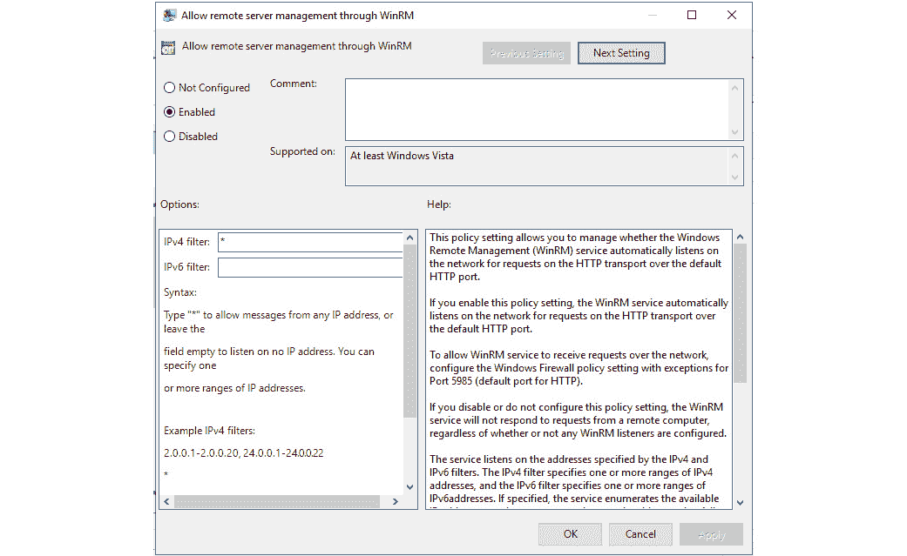
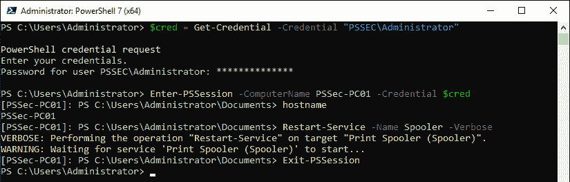

# 第三章：探索 PowerShell 远程管理技术和 PowerShell 远程

作为 PowerShell 的主要用途之一是自动化管理任务，**PowerShell 远程**（**PSRemoting**）在同时管理多台计算机时扮演着重要角色：只需一条命令，你就可以在数百台计算机上执行相同的命令行。

但与使用单独的计算机时类似，PSRemoting 的安全性取决于你的配置：如果你不锁好房门，窃贼是可以闯入的。

同样的情况也适用于计算机，以及 PSRemoting：如果你没有加固配置并使用不安全的设置，攻击者可以利用这些漏洞，将你的计算机反过来用作攻击工具。

在本章中，你不仅会学习 PSRemoting 的基础知识以及如何启用和配置它——你还会发现如何保持安全的 PSRemoting 配置的最佳实践。尽管 PSRemoting 本身是安全的，但你仍然可以采取一些措施，确保配置保持安全。我们将详细探讨这些措施，帮助你保持 PSRemoting 设置的安全。

我们还将看到 PSRemoting 网络流量的表现，取决于所使用的身份验证协议。最后，你将学习如何配置它，避免哪些配置，以及如何使用 PSRemoting 执行命令。

在本章中，你将学习以下主题：

+   使用 PowerShell 远程工作

+   启用 PowerShell 远程

+   PowerShell 端点（会话配置）

+   PowerShell 远程身份验证和安全性考虑

+   使用 PowerShell 远程执行命令

+   使用 PowerShell 远程工作

+   PowerShell 远程最佳实践

# 技术要求

本章的技术要求如下：

+   PowerShell 7.3 及以上版本

+   Visual Studio Code

+   Wireshark

+   一个包含域控制器和一台或多台测试机器的测试实验室

+   **第三章**的 GitHub 仓库访问链接：[`github.com/PacktPublishing/PowerShell-Automation-and-Scripting-for-Cybersecurity/tree/master/Chapter03`](https://github.com/PacktPublishing/PowerShell-Automation-and-Scripting-for-Cybersecurity/tree/master/Chapter03)

# 使用 PowerShell 远程工作

PowerShell 旨在自动化管理任务，并简化系统管理员的工作。远程管理从一开始就是这一计划的一部分，正如 Jeffrey Snover 在 2002 年的《Monad 宣言》中所概述的：[`www.jsnover.com/blog/2011/10/01/monad-manifesto/`](https://www.jsnover.com/blog/2011/10/01/monad-manifesto/)。然而，为了尽快发布版本 1.0，某些功能（包括 PSRemoting）未包含在内，直到后来的版本才加入。PSRemoting 在 2.0 版本中正式推出，并在 3.0 版本中得到了进一步改进。

它迅速成为最重要的核心功能之一，现在支持 PowerShell 中的许多其他功能，如工作流。

虽然 PSRemoting 可以与多种身份验证方法一起使用，但域身份验证的默认协议是 Kerberos。这是 Active Directory 环境中最安全且最常用的身份验证方法，而大多数使用 PSRemoting 的人很可能都在这种环境下操作。因此，当 Kerberos 不可用时，PSRemoting 会回退到 NTLM，以支持工作组身份验证。

Windows PowerShell 支持通过不同技术进行远程管理。默认情况下，PSRemoting 使用 **Windows 远程管理（WinRM）** 作为传输协议。然而，值得注意的是，WinRM 只是多种可用于支持 PowerShell 远程管理的协议之一。PSRemoting 本身是一个特定的协议（**PSRP**），它规定了 PowerShell 如何管理输入、输出、数据流、对象序列化等内容。PSRP 可以通过多种传输方式进行支持，包括 **WS-Management（WS-Man）**、**安全外壳（SSH）**、**Hyper-V 虚拟机总线（VMBus）** 等。虽然 **Windows 管理工具（WMI）** 和 **远程过程调用（RPC）** 是可以与 PowerShell 一起使用的远程管理技术，但它们不被视为 PSRemoting 协议的一部分。

这些远程管理技术之间的区别也体现在所使用的协议上：


表 3.1 – 连接方法和使用的协议概述

PSRemoting 仅在 Windows Server 2012 R2 及更高版本中启用，且默认情况下仅允许来自管理员组成员的连接。然而，PowerShell Core 支持多种远程管理协议，包括 WMI、Web 服务管理（WS-Management）和 SSH 远程管理。需要注意的是，PowerShell Core 不支持 RPC 连接。

## 使用 WinRM 进行 PowerShell 远程管理

`DMTF`（前身为 **分布式管理工作组**）是一个非盈利组织，定义了开放的可管理性标准，如通用信息模型（CIM），以及 WS-Management。

WS-Management 定义了一种基于 **简单对象访问协议（SOAP）** 的协议，可以用于管理服务器和 Web 服务。

微软的 WS-Management 实现是 `WinRM`。

一旦您尝试建立 PSRemoting 连接，WinRM 客户端将在 `HTTP` 或 `HTTPS` 上通过 WS-Management 协议发送 SOAP 消息。

当使用 WinRM 时，PSRemoting 监听以下端口：

+   `HTTP**: **5985`

+   `HTTPS**: **5986`

无论使用 HTTP 还是 HTTPS，PSRemoting 流量在身份验证过程后始终会被加密 —— 具体取决于用于身份验证的协议。您可以在 *身份验证* 部分阅读更多有关不同身份验证协议的信息。

在远程主机上，WinRM 服务运行并配置为有一个或多个监听器（HTTP 或 HTTPS）。每个监听器都会等待通过 WS-Management 协议发送的 HTTP/HTTPS 流量。

一旦接收到流量，WinRM 服务会判断流量是要发送到哪个 PowerShell 端点或应用程序，并转发它：


图 3.1 – 如何通过 PSRemoting 使用 WinRM 和 WS-Management 进行连接

通常，这张图已被抽象化，以简化你对 WinRM 工作原理的理解。`PowerShell.exe`并没有被调用；相反，调用的是`Wsmprovhost.exe`进程，它运行 PSRemoting 连接。

由于 WinRM 和 WS-Management 是建立远程连接时的默认选项，本章将主要聚焦于这些技术。为了完整性，本节会简要介绍所有其他可能的远程技术。

如果你希望更深入了解 WinRM 和 WS-Management，我推荐访问以下资源：

+   [`docs.microsoft.com/en-us/windows/win32/winrm/windows-remote-management-architecture`](https://docs.microsoft.com/en-us/windows/win32/winrm/windows-remote-management-architecture)

+   [`github.com/devops-collective-inc/secrets-of-powershell-remoting`](https://github.com/devops-collective-inc/secrets-of-powershell-remoting)

## Windows 管理工具（WMI）和通用信息模型（CIM）

`WMI`是微软实现的 CIM（由 DMTF 设计的开放标准）。

WMI 是在 Windows NT 4.0 中引入的，并从 Windows 2000 开始被包括在 Windows 操作系统中。它仍然存在于所有现代系统中，包括 Windows 10 和 Windows Server 2019。

CIM 定义了 IT 系统元素如何表示为对象以及它们之间的关系。这为管理 IT 系统提供了一种很好的方式，不论制造商或平台如何。

WMI 依赖于**分布式组件对象模型**（**DCOM**）和 RPC，后者是 DCOM 背后的基础机制，用于进行通信。

DCOM 是为使**组件对象模型**（**COM**）能够在网络上进行通信而创建的，它是.NET Remoting 的前身。

本节将简要概述 WMI 和 CIM 的 cmdlet，帮助你理解本章中的远程管理技术。你将会在*第五章*中学到更多关于 COM、WMI 和 CIM 的内容，*PowerShell 强大 – 系统与* *API 访问*。

### WMI cmdlet

从 PowerShell Core 6 开始，WMI cmdlet 被弃用，不应在 PowerShell 的新版本中使用。然而，值得注意的是，它们仍然在某些较旧版本的 PowerShell 中得到支持，例如 Windows 10 上的 PowerShell 5.1，并将在这些操作系统的支持生命周期内继续受到支持。如果可能，请改用较新的 CIM cmdlet，因为它们可以在 Windows 和非 Windows 操作系统上使用。

首先，让我们看看如何使用已经弃用，但仍然存在的 WMI cmdlet。

要查找所有名称中包含`wmi`字符串的 cmdlet 和函数，可以使用`Get-Command` cmdlet。通过使用`-CommandType`参数，可以指定要查找的命令类型。在此示例中，我正在搜索 cmdlet 和函数：

```
> Get-Command -Name *wmi* -CommandType Cmdlet,Function
CommandType  Name               Version    Source
-----------  ----               -------    ------
Cmdlet       Get-WmiObject      3.1.0.0    Microsoft.PowerShell.Management
Cmdlet       Invoke-WmiMethod   3.1.0.0    Microsoft.PowerShell.Management
Cmdlet       Register-WmiEvent  3.1.0.0    Microsoft.PowerShell.Management
Cmdlet       Remove-WmiObject   3.1.0.0    Microsoft.PowerShell.Management
Cmdlet       Set-WmiInstance    3.1.0.0    Microsoft.PowerShell.Management
```

一个使用 WMI 的示例是通过`Get-WmiObject` cmdlet。使用这个 cmdlet，你可以查询本地和远程计算机。

你可以使用`-List`参数来检索计算机上所有可用的 WMI 类：

```
> Get-WmiObject -List
   NameSpace: ROOT\cimv2
Name                  Methods Properties
----                  ------- ----------
CIM_Indication        {}      {CorrelatedIndications, IndicationFilterName, IndicationIde...
CIM_ClassIndication   {}      {ClassDefinition, CorrelatedIndications, IndicationFilterNa...
CIM_ClassDeletion     {}      {ClassDefinition, CorrelatedIndications, IndicationFilterNa...
...
```

这是一个使用`Get-WmiObject`来检索本地计算机上 Windows 服务信息的示例：

```
> Get-WmiObject -Class Win32_Service
ExitCode  : 0
Name      : AdobeARMservice
ProcessId : 3556
StartMode : Auto
State     : Running
Status    : OK
…
```

你不仅可以查询本地计算机，还可以通过使用`-ComputerName`参数来查询远程计算机，后跟远程计算机的名称。以下示例展示了如何从`PSSec-PC02`远程计算机获取相同的信息：

```
> Get-WmiObject -Class Win32_Service -ComputerName PSSec-PC02
```

上述代码返回了远程计算机上所有可用服务的列表。

通过使用`-Query`参数，你甚至可以指定要针对指定计算机的 CIM 数据库执行的查询。以下命令仅检索所有名称为`WinRM`的服务：

```
> Get-WmiObject -ComputerName PSSec-PC02 -Query "select * from win32_service where name='WinRM'"
ExitCode  : 0
Name      : WinRM
ProcessId : 6408
StartMode : Auto
State     : Running
Status    : OK
```

在此示例中，我们在`PSSec-PC02`远程计算机上运行了指定的`select * from win32_service where name='WinRM'`查询。

使用 PowerShell WMI cmdlet，你还可以调用 WMI 方法，删除对象，以及更多操作。

你知道吗？

RPC，WMI 所依赖的技术，在 PowerShell Core 6 中不再受到支持。这部分原因是 PowerShell 追求跨平台兼容性：从 PowerShell 7 版本及以上，RPC 仅在运行 Windows 操作系统的机器上受到支持。

### CIM cmdlet

使用 PowerShell 3.0（随 Windows Server 2012 和 Windows 8 一起发布），引入了一套新的 cmdlet，用于管理符合 CIM 和 WS-Man 标准的对象。

一度，WMI cmdlet 偏离了 DMTF 标准，这阻止了跨平台管理。因此，微软通过发布新的 CIM cmdlet，重新遵循 DMTF CIM 标准。

要查找所有与 CIM 相关的 cmdlet，可以使用`Get-Command` cmdlet：

```
> Get-Command -Name "*cim*" -CommandType Cmdlet,Function
CommandType     Name                        Version    Source
-----------     ----                        -------    ------
Cmdlet          Get-CimAssociatedInstance   1.0.0.0    CimCmdlets
Cmdlet          Get-CimClass                1.0.0.0    CimCmdlets
Cmdlet          Get-CimInstance             1.0.0.0    CimCmdlets
Cmdlet          Get-CimSession              1.0.0.0    CimCmdlets
Cmdlet          Invoke-CimMethod            1.0.0.0    CimCmdlets
Cmdlet          New-CimInstance             1.0.0.0    CimCmdlets
Cmdlet          New-CimSession              1.0.0.0    CimCmdlets
Cmdlet          New-CimSessionOption        1.0.0.0    CimCmdlets
Cmdlet          Register-CimIndicationEvent 1.0.0.0    CimCmdlets
Cmdlet          Remove-CimInstance          1.0.0.0    CimCmdlets
Cmdlet          Remove-CimSession           1.0.0.0    CimCmdlets
Cmdlet          Set-CimInstance             1.0.0.0    CimCmdlets
```

在此示例中，我们正在寻找名称中包含`cim`的所有 cmdlet 和函数。

您可以在[`docs.microsoft.com/de-de/powershell/module/cimcmdlets/`](https://docs.microsoft.com/de-de/powershell/module/cimcmdlets/)找到与 CIM 服务器交互的所有当前可用 CIM cmdlet 的概述。

## 开放管理基础设施（OMI）

为了帮助实现跨平台管理方法，微软于 2012 年创建了**开放管理基础设施**（**OMI**）（https://github.com/Microsoft/omi），但它从未真正流行起来，也不再广泛使用。因此，微软决定增加对 SSH 远程管理的支持。

## 使用 SSH 进行 PowerShell 远程管理

为了在 Windows 和 Linux 主机之间启用 PSRemoting，微软在 PowerShell 6 中添加了对通过 `SSH` 进行 PSRemoting 的支持。

通过 SSH 进行 PSRemoting 的要求

要使用通过 SSH 的 PSRemoting，需要在所有计算机上安装*PowerShell 版本 6 或更高版本*和*SSH*。从 Windows 10 版本 1809 和 Windows Server 2019 开始，OpenSSH for Windows 已集成到 Windows 操作系统中。

### Linux 上的 PowerShell 远程管理

首先，要在 Linux 上使用 PowerShell，请按照您的操作系统的步骤安装 PowerShell Core，您可以在官方 PowerShell Core 文档中找到：[`docs.microsoft.com/en-us/powershell/scripting/install/installing-powershell-core-on-linux`](https://docs.microsoft.com/en-us/powershell/scripting/install/installing-powershell-core-on-linux)。

在我的演示实验室中，我安装了 Debian 10 服务器。因此，步骤可能会有所不同，具体取决于所使用的操作系统。

使用您选择的编辑器配置`/etc/ssh/sshd_config`。在我的示例中，我使用`vi`：

```
> vi /etc/ssh/sshd_config
```

首先，在配置中添加一个 PowerShell 子系统条目：

```
Subsystem powershell /usr/bin/pwsh -sshs -NoLogo
```

在 Linux 系统中，默认情况下，PowerShell 可执行文件通常位于`/usr/bin/pwsh`。请确保如果您在不同位置安装了 PowerShell，则调整此部分。

为了允许用户远程使用 SSH 登录，请配置`PasswordAuthentication`和/或`PubkeyAuthentication`：

+   如果您想允许使用用户名和密码进行身份验证，请将`PasswordAuthentication`设置为`yes`：

    ```
    PasswordAuthentication yes
    ```

+   如果您想启用更安全的方法，请将`PubkeyAuthentication`设置为`yes`：

    ```
    PubkeyAuthentication yes
    ```

`PubkeyAuthentication`，代表**公钥身份验证**，是一种依赖于生成的密钥对的身份验证方法：生成一个私钥和一个公钥。而**私钥**被安全地保存在用户的计算机上，**公钥**则输入到远程服务器上。

当用户使用此私钥进行身份验证时，服务器可以使用其公钥验证用户的身份。公钥只能用于验证私钥的真实性或加密只有私钥可以加密的数据。

使用公钥认证进行远程访问不仅能防止暴力破解和字典攻击等密码攻击的风险，还能在服务器遭到攻破时提供额外的安全层。在这种情况下，只有公钥可以被提取，而私钥则保持安全。由于仅有公钥不足以进行认证，因此该方法提供的安全性优于使用用户名和密码，因为如果服务器被攻破，密码会被提取并重复使用。

你可以在 https://www.ssh.com/ssh/keygen/ 学习如何使用 `ssh-keygen` 工具生成密钥对。

如果你对公钥认证的工作原理感兴趣，可以在官方的 SSH 网站上了解更多：[`www.ssh.com/ssh/public-key-authentication`](https://www.ssh.com/ssh/public-key-authentication)。

当然，两个认证机制可以同时配置，但如果你使用 `PubkeyAuthentication` 并且没有其他用户使用用户名和密码连接，你应该仅使用 `PubkeyAuthentication`：

```
PasswordAuthentication no
PubkeyAuthentication yes
```

如果你想了解更多关于 `sshd` 配置文件的不同选项，我强烈建议你查看 `man** **pages`：[`manpages.debian.org/jessie/openssh-server/sshd_config.5.en.html`](https://manpages.debian.org/jessie/openssh-server/sshd_config.5.en.html)。

Man 页面

`Man` 代表 `manual`。Man 页面用于获取有关 Linux/UNIX 命令或配置文件的更多信息，可以将其与 PowerShell 中的帮助系统进行比较。

重启 `ssh` 服务：

```
> /etc/init.d/ssh restart
```

更新后的配置会加载到内存中以激活更改。

### PowerShell 远程管理 macOS

要通过 SSH 启用 PSRemoting 以管理 macOS 系统，步骤与在 Linux 系统上启用 PSRemoting 相似：最大的不同之处在于配置文件位于不同的位置。

首先，你需要在想要远程管理的 macOS 系统上安装 PowerShell Core：[`docs.microsoft.com/en-us/powershell/scripting/install/installing-powershell-core-on-macos`](https://docs.microsoft.com/en-us/powershell/scripting/install/installing-powershell-core-on-macos)。

编辑 `ssh` 配置：

```
> vi /private/etc/ssh/sshd_config
```

为 PowerShell 创建子系统条目：

```
Subsystem powershell /usr/local/bin/pwsh -sshs -NoLogo
```

然后，定义你希望为此机器配置的认证类型：

+   用户名和密码：

    ```
    PasswordAuthentication yes
    ```

+   公钥认证：

    ```
    PubkeyAuthentication yes
    ```

若要了解更多关于可以在 `sshd` 配置中配置的选项，请查看我们之前讨论的 *PowerShell 远程管理 Linux* 部分。

重启 `ssh` 服务以加载新配置：

```
> sudo launchctl stop com.openssh.sshd
> sudo launchctl start com.openssh.sshd
```

服务将重启，新的配置将生效。

### 通过 SSH 在 Windows 上进行 PowerShell 远程管理

当然，也可以通过 SSH 管理 Windows 系统，但在本书中，我将使用通过 WinRM 的 PSRemoting 作为所有示例的方式，因为这是 Windows 系统上的默认设置。

然而，如果你想通过 SSH 在 Windows 系统上启用 PSRemoting，请确保安装了 OpenSSH，并按照如何在 Windows 上通过 SSH 设置 PSRemoting 的说明操作：

+   [`docs.microsoft.com/en-us/windows-server/administration/openssh/openssh_overview`](https://docs.microsoft.com/en-us/windows-server/administration/openssh/openssh_overview)

+   [`docs.microsoft.com/en-us/powershell/scripting/learn/remoting/ssh-remoting-in-powershell-core?view=powershell-7.1#set-up-on-a-windows-computer`](https://docs.microsoft.com/en-us/powershell/scripting/learn/remoting/ssh-remoting-in-powershell-core?view=powershell-7.1#set-up-on-a-windows-computer)

你知道吗？

通过 SSH 使用 PSRemoting 不支持远程端点配置，也不支持 `Just Enough** **Administration** (`JEA**)。

# 启用 PowerShell 远程管理

有多种方法可以为你的系统启用 PSRemoting。如果你只在实验室里操作几台机器，你可能想手动启用它。但一旦你希望在一个大型环境中启用 PSRemoting，你可能希望集中启用并配置 PSRemoting。在本节中，我们将探讨这两种方法。以下表格提供了每种方法执行的配置操作概览：


表 3.2 – 启用 PSRemoting – 不同方法

请注意，`Enable-PSRemoting` 方法是手动配置的一个子部分；要配置 HTTP 和 HTTPS 监听器，必须采取额外的步骤。我们来探讨一下手动配置 PSRemoting 所需的内容，这在测试场景中可能会很有用。

## 手动启用 PowerShell 远程管理

如果你想在单台机器上启用 PSRemoting，可以通过在提升权限的命令行界面上使用 `Enable-PSRemoting` 命令手动完成：

```
> Enable-PSRemoting
WinRM has been updated to receive requests.
WinRM service type changed successfully.
WinRM service started.
WinRM has been updated for remote management.
WinRM firewall exception enabled.
Configured LocalAccountTokenFilterPolicy to grant administrative rights remotely to local users.
```

在这个例子中，命令成功执行，因此 PSRemoting 在这台机器上被启用。

如果你想知道 `Enable-PSRemoting` 和 `winrm quickconfig` 之间的区别，事实上，技术上并没有太大区别。`Enable-PSRemoting` 已经包含了 `winrm quickconfig` 执行的所有操作，但还增加了特定于 Windows PowerShell 的环境更改。因此，简而言之，运行 `Enable-PSRemoting` 就足够了，你可以跳过运行 `winrm quickconfig`。

### Set-WSManQuickConfig 错误信息

根据你的网络配置，如果你尝试手动启用 PSRemoting，可能会显示错误信息：

```
WinRM firewall exception will not work since one of the network connection types on this machine is set to Public. Change the network connection type to either Domain or Private and try again.
```

该错误信息是由 `Set-WSManQuickConfig` 命令生成的，该命令在启用 PSRemoting 过程中被调用。

如果某个网络连接设置为公用网络，将显示此消息，因为默认情况下，PSRemoting 不允许在定义为公用网络的网络上使用：

```
> Get-NetConnectionProfile
Name             : Network 1
InterfaceAlias   : Ethernet
InterfaceIndex   : 4
NetworkCategory  : Public
IPv4Connectivity : Internet
IPv6Connectivity : NoTraffic
```

为了避免此错误，有两个选项：

+   将网络配置文件设置为私有网络。

+   强制执行 `Enable-PSRemoting`，以便跳过网络配置文件检查。

如果您确定网络配置文件不是公共网络，而是您信任的网络，可以将其配置为私有网络：

```
> Set-NetConnectionProfile -NetworkCategory Private
```

如果您不想将网络配置为受信任的私有网络，可以通过添加`-****SkipNetworkProfileCheck`参数来强制跳过网络配置文件检查：

```
> Enable-PSRemoting -SkipNetworkProfileCheck
```

在连接到公共网络连接的计算机上启用 PSRemoting 会使您的计算机面临重大风险，所以要小心。

### 检查您的 WinRM 配置

启用 PSRemoting 和 WinRM 后，您可能希望检查当前的 WinRM 配置。您可以使用`winrm** **get winrm/config`来实现这一点：


图 3.2 - 验证本地 WinRM 配置

您可以在显示的输出中找到所有配置的选项。`winrm get winrm/config`命令提供了 WinRM 配置设置的摘要。

要更改本地 WinRM 配置，可以使用`set`选项：

```
> winrm set winrm/config/service '@{AllowUnencrypted="false"}'
```

或者，您可以使用`wsman:\` PowerShell 驱动器访问和修改配置中的特定项。使用`wsman:\`提供程序允许您以更直观和类似 cmdlet 的方式访问和修改 WinRM 配置的特定项，并带有内置的帮助和文档。

要更改本地 WinRM 配置，您可以使用`Set-Item` cmdlet 与`wsman:\`提供程序访问和修改 WinRM 配置项。例如，要禁用未加密流量的使用，可以运行以下命令：

```
> Set-Item wsman:\localhost\Service\AllowUnencrypted -Value $false
```

在此示例中，我们正在配置 WinRM 服务*不*允许未加密的连接。您可以使用类似的语法来配置其他 WinRM 选项 - 只需确保提供设置树中的整个路径，以及选项和值。

### 受信任的主机

如果您连接到未加入域的计算机，这可能是您手动配置的原因，那么 Kerberos 身份验证不是一个选项，应该使用 NTLM 协议进行身份验证。

在这种情况下，您需要在本地设备上的`WS-Man`中将远程机器配置为受信任的主机；否则，连接将失败。

要为远程主机配置`TrustedHosts`，可以使用`Set-Item` cmdlet，以及`wsman:\localhost\client\TrustedHosts`路径。默认情况下，此值为空，因此您需要添加远程主机的 IP 地址或域名。要添加新值而不替换现有值，请使用`-Concatenate`开关，如下所示：

```
> Set-Item wsman:\localhost\client\TrustedHosts -Value 172.29.0.12 -Concatenate -Force
```

这将将指定的 IP 地址附加到现有的`TrustedHosts`列表中。

要验证您的更改是否已应用，可以使用`Get-Item` cmdlet 显示当前的`TrustedHosts`配置：

```
> Get-Item wsman:\localhost\client\TrustedHosts
   WSManConfig: Microsoft.WSMan.Management\WSMan::localhost\Client
Type            Name             SourceOfValue   Value
----            ----             -------------   -----
System.String   TrustedHosts                     172.29.0.12
```

前面的示例表明，具有 IP 地址`172.29.0.12`的主机已在本地机器上配置为受信任的主机。

审核`TrustedHosts`列表以检测任何未经授权的更改也是一种好做法。这有助于检测系统上的篡改尝试。

### 通过 HTTPS 连接

可选地，你还可以配置一个证书来加密`HTTPS`上的流量。为了确保 PSRemoting 的安全，建议配置一个证书来加密 HTTPS 流量，特别是在 Kerberos 不可用于服务器身份验证的情况下。尽管 PSRemoting 流量默认是加密的，但加密可以被移除，且可以轻松强制执行基本认证（参见*PowerShell 远程认证与安全性注意事项*部分）。配置证书为你的环境添加了额外的安全层。

因此，为了提供额外的安全性，发布证书并通过 SSL 启用`WinRM`是有意义的。

如果你没有从有效的**证书颁发机构**（**CA**）购买公开签名的 SSL 证书，你可以创建一个**自签名证书**来开始使用。然而，如果你是在工作组远程访问中使用它，你也可以使用**内部 CA**。这样可以提供额外的安全性和信任，因为你有一个组织内部的受信任源来签署证书。

本节仅涵盖如何发布和配置自签名证书。因此，如果你使用的是公开签名证书或内部 CA，请确保调整步骤。

首先，让我们获取一个自签名证书！如果你使用的是 Windows Server 2012 及以上版本，这一步非常简单 —— 你可以利用`New-SelfSignedCertificate` cmdlet：

```
> $Cert = New-SelfSignedCertificate -CertstoreLocation Cert:\LocalMachine\My -DnsName "PSSec-PC01"
> Export-Certificate -Cert $Cert -FilePath C:\tmp\cert
```

确保通过`-DnsName`参数提供的值与主机名匹配，并且在你的 DNS 服务器中存在匹配的 DNS 记录。

添加 HTTPS 监听器：

```
> New-Item -Path WSMan:\LocalHost\Listener -Transport HTTPS -Address * -CertificateThumbPrint $Cert.Thumbprint –Force
```

最后，确保为防火墙添加例外。WinRM 通过 HTTPS 的默认端口是`5986`：

```
> New-NetFirewallRule -DisplayName "Windows Remote Management (HTTPS-In)" -Name "Windows Remote Management (HTTPS-In)" -Profile Any -LocalPort 5986 -Protocol TCP
```

为了澄清，重要的是要注意，使用`-Profile Any`选项会将 WinRM 开放到公共或未识别的网络。如果你不在测试环境中，请确保使用适当的配置文件选项，如`Domain`、`Private`或`Public`。

如果你希望确保仅使用 HTTPS，则删除 WinRM 的 HTTP 监听器：

```
> Get-ChildItem WSMan:\Localhost\listener | Where -Property Keys -eq "Transport=HTTP" | Remove-Item -Recurse
```

此外，你可能需要检查并删除任何已配置的 HTTP 流量的防火墙例外。如果你之前没有配置任何例外，则此步骤不必要。

在某些情况下，你可能希望将 WinRM 监听器移动到不同的端口。如果你的防火墙设置不允许端口`5986`，或者你想出于安全原因使用非标准端口，这将是有用的。要将 WinRM 监听器移动到不同的端口，请使用`Set-Item` cmdlet：

```
> Set-Item WSMan:\Localhost\listener\<ListenerName>\port -Value <PortNumber>
```

将`<ListenerName>`替换为你想要编辑的监听器名称，并将`<PortNumber>`替换为你想要配置的端口号。

接下来，我们将导入证书。然而，在此之前，了解一些关键点非常重要：通过 `New-SelfSignedCertificate` 等工具生成的证书已经内置了使用限制，确保它们仅用于客户端和服务器认证。如果您使用的是通过其他工具生成的证书（例如，内部 PKI），请确保它也有这些使用限制。此外，确保根证书得到了妥善保护，因为攻击者可以利用它伪造受信任网站的 SSL 证书。

一旦您拥有适当的证书，将其复制到您希望从中连接远程计算机的计算机上的安全位置（例如，在我们的示例中是 **C:\tmp\cert**），然后将其导入本地证书存储区：

```
> Import-Certificate -Filepath "C:\tmp\cert" -CertStoreLocation "Cert:\LocalMachine\Root"
```

指定您想用来登录并进入会话的凭据。`-UseSSL` 参数表示您的连接将使用 SSL 进行加密：

```
> $cred = Get-Credential
> Enter-PSSession -ComputerName PSSec-PC01 -UseSSL -Credential $cred
```

当然，您仍然需要输入凭据才能远程登录计算机。证书仅确保远程计算机的真实性，并帮助建立加密连接。

## 通过组策略配置 PowerShell 远程管理

在处理多台服务器时，您可能不希望在每台计算机上手动启用 PSRemoting，因此组策略是您的首选工具。

通过组策略，您可以使用一个 **组策略对象**(**GPO**) 配置多台计算机。

要开始，创建一个新的 GPO：打开 **组策略管理**，右键点击您希望创建新 GPO 的 **组织单位**(**OU**)，然后选择 **在此域中创建 GPO，并在此处链接**。

GPO 仅仅是一个配置工具——它不会启动服务。因此，您仍然需要找到一种方法来重新启动所有已配置的服务器或在所有服务器上启动 WinRM 服务。

如果您希望启用远程 PSRemoting，Lee Holmes 编写了一个非常实用的脚本，该脚本利用 WMI 连接（大多数系统都支持）：[`www.powershellcookbook.com/recipe/SQOK/program-remotely-enable-powershell-remoting`](http://www.powershellcookbook.com/recipe/SQOK/program-remotely-enable-powershell-remoting)。

### 允许 WinRM

在新创建的 GPO 中，导航到 **计算机配置** | **策略** | **管理模板** | **Windows 组件** | **Windows 远程管理** | **WinRM 服务**，并将 **允许通过 WinRM 进行远程服务器管理** 策略设置为 **启用**。

在此策略中，您可以定义 IPv4 和 IPv6 过滤器。如果您不使用某种协议（例如，IPv6），则可以将其留空，以防止用户通过该协议连接到 WinRM。

要允许连接，您可以使用通配符字符 `*`、IP 地址或 IP 范围。

在与客户合作或在我的演示实验室中，我发现发生 WinRM 无法工作的错误时，最常见的原因是配置此设置时使用了 IP 或 IP 范围。

因此，时至今日，我只在与**防火墙 IP 限制**结合使用时，才使用通配符（*****）来保护我的设置。我们将在本节稍后配置防火墙 IP 限制（见*创建防火墙规则*）：



图 3.3 – 配置允许通过 WinRM 进行远程服务器管理

注意！

仅在您希望通过防火墙规则限制允许远程 IP 连接时，才使用通配符（*****）配置。

### 配置 WinRM 服务为自动启动

要配置 WinRM 服务使其自动启动，请按以下步骤操作：

1.  使用相同的 GPO，并导航到**计算机配置** | **策略** | **Windows 设置** | **安全设置** | **系统服务**。

1.  选择并配置**Windows 远程管理（WS 管理）**设置。

1.  将打开一个新窗口。勾选**定义此策略设置**选项，并将服务启动模式设置为**自动**。

1.  通过点击**确定**按钮确认您的配置：


图 3.4 – 配置 Windows 远程管理服务，使其自动启动

注意

此设置仅配置服务为自动启动，通常在计算机启动时发生。它不会为您启动服务，因此请确保重新启动计算机（或手动启动服务），以便 WinRM 服务自动启动。

### 创建防火墙规则

要配置防火墙设置，请按照以下步骤操作：

1.  导航到**计算机配置** | **策略** | **Windows 设置** | **安全设置** | **Windows Defender 防火墙（高级安全性）** | **Windows Defender 防火墙（高级安全性）** | **入站规则**。

1.  使用向导创建一个新的入站规则。

1.  勾选**预定义**选项，并选择**Windows 远程管理**：


图 3.5 – 创建预定义的 Windows 远程管理防火墙规则

1.  点击**下一步**，并通过取消选择下图中显示的选项来移除**公共**防火墙配置文件：


图 3.6 – 取消选择公共网络配置文件

1.  最后，选择**允许连接**，然后点击**完成**按钮确认配置：


图 3.7 – 允许连接

新规则将被创建，并显示在您的 GPO 中：


图 3.8 – 显示新的入站防火墙规则

1.  在退出 GPO 配置之前，确保通过双击重新打开新创建的防火墙规则。将打开**Windows 远程管理（HTTP-In）属性**窗口。

1.  可选：如果您的计算机位于同一个域中，请导航到`Advanced`选项卡，并取消选择`Private`配置文件，以确保仅允许使用 WinRM 进行远程连接在`Domain`网络配置文件中：


图 3.9 – 仅允许在域网络配置文件中使用 WinRM

1.  然后，导航到`Scope`选项卡，并添加允许从中远程访问计算机的所有远程 IP 地址。例如，如果您的网络上有一个管理子网，可以将该子网中的 IP 地址添加到列表中：


图 3.10 – 配置允许连接的远程 IP 地址

在最佳情况下，只允许一个经过加固和安全管理的系统通过 PSRemoting 管理系统。

使用清洁的源原则构建管理系统，并使用推荐的特权访问模型进行访问：

+   [`learn.microsoft.com/zh-cn/security/privileged-access-workstations/privileged-access-success-criteria#clean-source-principle`](https://learn.microsoft.com/zh-cn/security/privileged-access-workstations/privileged-access-success-criteria#clean-source-principle)

+   [`learn.microsoft.com/zh-cn/security/privileged-access-workstations/privileged-access-access-model`](https://learn.microsoft.com/zh-cn/security/privileged-access-workstations/privileged-access-access-model)

# PowerShell 端点（会话配置）

在本章中，您可能已经多次读到**端点**一词。

如果我们谈论端点，我们不是在谈论一个计算机：PSRemoting 设计用于在计算机上使用多个端点。

但是端点到底是什么？

当我们谈论 PowerShell 端点时，*每个端点都是一个会话配置*，您可以配置为提供某些服务或限制某些服务。

因此，每次运行`Invoke-Command`或进入 PowerShell 会话时，我们都是在连接到一个端点（也称为远程会话配置）。

如果没有设置限制，则提供更少的 cmdlet、函数和功能的会话称为**受限制的端点**。

在启用 PSRemoting 之前，计算机上将没有配置任何端点。

您可以通过运行`Get-PSSessionConfiguration`命令查看所有可用的会话配置。


图 3.11 – 当未启用 PSRemoting 时，未显示任何端点

当计算机上未启用 PSRemoting 时，不会显示任何端点。这是因为负责 PSRemoting 的 WinRM 服务默认未启动。然而，一旦启动 WinRM 服务，端点已经配置好并准备使用，但在启用 PSRemoting 之前不会暴露，也无法连接。

使用 `Enable-PSRemoting` 启用 PSRemoting，正如我们在上一节中所做的那样，会创建所有默认的会话配置，这些配置对于通过 PSRemoting 连接到此端点是必要的：


图 3.12 – 启用 PSRemoting 后，我们可以看到所有预填充的端点

通常，在 Windows PowerShell 3.0 及以上版本中，客户端系统上会有三个默认预配置的端点：

+   `microsoft.powershell`：这是标准端点，默认情况下用于 PSRemoting 连接，除非另行指定

+   `microsoft.powershell32`：这是一个 32 位端点，如果您使用的是 64 位操作系统，则此端点为可选项。

+   `microsoft.powershell.workflow`：此端点用于 PowerShell 工作流 – [`docs.microsoft.com/en-us/system-center/sma/overview-powershell-workflows?view=sc-sma-2019`](https://docs.microsoft.com/en-us/system-center/sma/overview-powershell-workflows?view=sc-sma-2019)

)

在*服务器系统*中，通常会有一个预定义的第四会话配置：

+   `microsoft.windows.servermanagerworkflows`：此端点用于服务器管理器工作流 – https://docs.microsoft.com/en-us/windows-server/administration/server-manager/server-manager

每台计算机会显示不同的默认端点。在上面的示例中，我在一台 Windows 10 客户端上运行命令，这将显示比 Windows Server 2019 更少的端点。

## 连接到指定的端点

默认情况下，`microsoft.powershell` 端点用于所有 PSRemoting 连接。但如果您希望连接到另一个指定的端点，您可以使用 `-ConfigurationName` 参数来实现：

```
> Enter-PSSession -ComputerName PSSec-PC01 -ConfigurationName 'microsoft.powershell32'
```

指定的配置可以是另一个默认端点的名称，也可以是自定义端点。

## 创建自定义端点——JEA 概览

创建自定义端点（也称为**仅足够的管理**或**JEA**）允许您为委派的管理定义一个受限的管理环境。通过 JEA，您可以定义一组批准的命令和参数，允许特定用户在特定计算机上执行。这使您能够为用户提供执行工作职责所需的最低权限，而不授予他们完全的管理权限。这是保护远程连接的好方法：

+   您可以限制会话，只运行预定义的命令。

+   您可以启用记录功能，以便记录在此会话中执行的每个命令。

+   你可以指定一个安全描述符（SDDL）来确定谁可以连接，谁不能连接。

+   你可以配置脚本和模块，这些脚本和模块将在与此端点建立连接后自动加载。

+   你甚至可以指定使用另一个账户来在端点上运行此会话中的命令。

要创建和激活端点，需要遵循两个步骤：

1.  创建会话配置文件

1.  将会话注册为新的端点

### 创建会话配置文件

使用`New-PSSessionConfigurationFile`，你可以创建一个空的骨架会话配置文件。你需要指定配置文件将保存的路径，因此`-Path`参数是必需的。会话配置文件以`.pssc`文件扩展名结尾，所以请确保文件命名正确：

```
> New-PSSessionConfigurationFile -Path <Path:\To\Your\SessionConfigurationFile.pssc>
```

请查看官方文档以获取更多信息：[`docs.microsoft.com/en-us/powershell/module/microsoft.powershell.core/new-pssessionconfigurationfile`](https://docs.microsoft.com/en-us/powershell/module/microsoft.powershell.core/new-pssessionconfigurationfile)。

你可以生成一个空的会话配置文件，然后稍后使用编辑器填写它，或者你也可以使用`New-PSSessionConfigurationFile`参数直接生成包含所有已定义配置选项的文件：


图 3.13 – New-PSSessionConfigurationFile 参数

对于这个示例，我们将为`RestrictedRemoteServer`会话创建一个会话配置文件：

```
> New-PSSessionConfigurationFile -SessionType RestrictedRemoteServer -Path .\PSSessionConfig.pssc
```

通过使用`-SessionType RestrictedRemoteServer`，只有最重要的命令会被导入到此会话中，如`Exit-PSSession`、`Get-Command`、`Get-FormatData`、`Get-Help`、`Measure-Object`、`Out-Default`和`Select-Object`。如果你希望在此会话中允许其他命令，它们需要在角色能力文件中进行配置，我们将在*第十章*中详细讨论，*语言模式和足够的* *管理（JEA）*。

### 将会话注册为新的端点

创建会话配置文件后，你必须通过使用`Register-PSSessionConfiguration`命令将其注册为端点。

使用必需的`-Name`参数时，请确保只指定会话配置文件的名称，不包括文件扩展名：

```
> Register-PSSessionConfiguration -Name PSSessionConfig
WARNING: Register-PSSessionConfiguration may need to restart the WinRM service if a configuration using this name has recently been unregistered, certain system data structures may still be cached. In that case, a restart of WinRM may be required.
All WinRM sessions connected to Windows PowerShell session configurations, such as Microsoft.PowerShell and session configurations that are created with the Register-PSSessionConfiguration cmdlet, are disconnected.
   WSManConfig: Microsoft.WSMan.Management\WSMan::localhost\Plugin
Type            Keys                                Name
----            ----                                ----
Container       {Name=PSSessionConfig}              PSSessionConfig
```

会话配置将被注册，并且一个新的端点将被创建。有时，在注册端点后，可能需要重启 WinRM 服务：

```
> Get-PSSessionConfiguration -Name PSSessionConfig
Name          : PSSessionConfig
PSVersion     : 5.1
StartupScript :
RunAsUser     :
Permission    : NT AUTHORITY\INTERACTIVE AccessAllowed, BUILTIN\Administrators AccessAllowed, BUILTIN\Remote Management Users AccessAllowed
```

使用`Get-PSSessionConfiguration`，你可以验证端点是否已创建。如果你使用`-Name`参数指定端点名称，如前面的示例所示，你将只获得与指定端点相关的信息。

我们将在*第十章*《语言模式与恰到好处的管理（JEA）》中深入探讨可能的会话配置和注册参数。

# PowerShell 远程认证和安全性注意事项

默认情况下，PSRemoting 流量是加密的——无论连接是通过 HTTP 还是 HTTPS 发起。所使用的底层协议是 WS-Man，它是解耦的，可以更广泛地使用。PSRemoting 使用认证协议，如 Kerberos 或 NTLM，来验证会话流量，SSL/TLS 用于加密会话流量，无论连接是通过 HTTP 还是 HTTPS 发起的。

但与其他计算机类似，PSRemoting 的安全性取决于已配置的计算机。如果你不保护管理员的凭证，攻击者可以提取并利用它们对付你。

因此，你也应该努力加强基础设施的安全性，并保护你最重要的身份。你将在*第六章*《Active Directory – 攻击与缓解》中了解更多关于 Active Directory 安全性和凭证管理的内容，并在*第三部分*《保护 PowerShell – 有效的缓解措施*详细讲解*中了解更多你可以采取的缓解措施。

了解启用 PSRemoting 并不会自动确保环境的安全非常重要。与任何远程管理技术一样，关键在于加固你的系统并采取适当的安全措施，以防范潜在的威胁。这不仅适用于 PSRemoting，还适用于其他远程管理技术，如 RDP。通过投入时间和精力来保护你的系统和环境，你可以降低潜在风险，更好地保护组织的资产。

首先，让我们看看在 PSRemoting 中如何使用认证。

## 认证

默认情况下，WinRM 使用`Kerberos`进行认证，若 Kerberos 认证不可用，则回退使用`NTLM`。

在域中使用时，Kerberos 是认证的标准。要在 PSRemoting 中使用 Kerberos 认证，确保客户端和服务器计算机连接到同一域，并且 DNS 名称已正确配置且可达。还需要注意的是，从 Kerberos 的角度来看，服务器必须在 Active Directory 中注册。

通常，你可以指定连接远程计算机时应该使用哪种协议：

```
> Enter-PSSession -ComputerName PSSEC-PC01 -Authentication Kerberos
```

当建立 PSRemoting 会话时，如果没有指定`-Authentication`参数，则使用默认值`Default`，该值等于`Negotiate`。这意味着客户端和服务器根据双方系统支持的认证协议协商使用最佳的认证协议。

通常情况下，*Kerberos* 是首选协议，但如果不可用或不被支持，系统将回退使用 *NTLM*。关于 `Negotiate` 的更多信息可以在微软文档中找到，详见 Win32 应用程序中的 Negotiate：[`learn.microsoft.com/en-us/windows/win32/secauthn/microsoft-negotiate`](https://learn.microsoft.com/en-us/windows/win32/secauthn/microsoft-negotiate)。

### 什么情况下会回退到 NTLM？

PSRemoting 设计时是为了与 Active Directory 配合使用，因此 Kerberos 是首选的身份验证协议。但在某些情况下，Kerberos 身份验证不可用，此时将使用 NTLM。

`Kerberos`：

+   计算机已加入相同的域，或者它们都位于相互信任的域内。

+   客户端能够解析服务器的主机名或 IP 地址。

+   服务器在 Active Directory 中注册了有效的 **服务主体名称**（**SPN**）。该 SPN 与你连接的目标匹配。

`NTLM`：

+   常用于连接非域加入的工作站

+   如果使用的是 IP 地址而不是 DNS 名称

要通过 Kerberos 连接到 `PSSec-PC01` 计算机，我们可以使用以下命令：

```
> Enter-PSSession -ComputerName PSSec-PC01
```

如果没有明确指定凭据，并且当前用户有权限访问远程计算机，同时远程计算机已配置为接受 Kerberos 身份验证，则连接会自动建立，无需提供任何明确的凭据。这是使用 Kerberos 身份验证的一个优势，因为身份验证过程对于用户来说是隐式和无缝的。

如果当前用户没有权限访问远程计算机，我们还可以明确指定应使用的凭据，方法是使用 `-Credential` 参数。为了简化测试，我们使用 `Get-Credential` 来提示输入凭据，并将其存储在 `$cred` 安全字符串中：

```
$cred = Get-Credential -Credential "PSSEC\Administrator"
```

然后，我们通过 Kerberos 进行连接：

```
Enter-PSSession -ComputerName PSSEC-PC01 -Credential $cred
```

如果你使用 Wireshark 捕获流量，你会看到 WinRM 在其协议中将 Kerberos 包含为 `content-type`，这表明 Kerberos 被用于身份验证。虽然实际的 Kerberos 流量可能不会在 HTTP 数据包中直接显示，但通过检查 WinRM 流量中的报文头，仍然可以确认使用了 Kerberos 进行身份验证。此外，你还可以看到整个 HTTP 会话是加密的，提供了额外的安全保障：


图 3.14 – 使用 Wireshark 捕获的 WinRM HTTP 流量

如你所见，已经通过端口 `5985`（WinRM over HTTP）与 `PSSec-PC01` 建立了会话，使用的是 PowerShell 版本 5.1.17763.1490。请求是通过 WS-Man 发送的。

一旦初始身份验证过程完成，WinRM 会继续加密所有后续通信，以确保客户端和服务器之间交换的数据的安全性。当通过 HTTPS 建立连接时，TLS 协议将用于协商用于数据传输的加密方式。如果是 HTTP 连接，则用于消息级加密的加密方式由初始身份验证协议决定。

各种身份验证协议提供的加密级别如下：

+   **基本身份验证**：没有加密。

+   **NTLM 身份验证**：使用 RC4 算法和 128 位密钥。

+   **Kerberos 身份验证**：TGS 票据中的 `etype` 决定了加密方式。在现代系统中，这通常是 AES-256。

+   **CredSSP 身份验证**：将在握手过程中协商的 TLS 密码套件被使用。

请注意，尽管使用的是 HTTP 协议作为连接协议，但内容是根据初始身份验证协议使用适当的加密机制进行加密的。关于 PSRemoting 的一个常见误解是，使用 WinRM 通过 HTTP 连接时没有加密。然而，正如你在下图所看到的，事实并非如此：


图 3.15 – 使用 Wireshark 捕获的 Kerberos TCP 流

如果 DNS 名称无法正常工作，并且两个主机不在同一域内，则 NTLM 将作为回退选项使用。

如果你正在连接同一域内的远程计算机，并且 DNS 名称正常工作，当指定主机的 IP 地址而非主机名时，仍然会使用 NTLM 进行连接：

```
Enter-PSSession -ComputerName 172.29.0.12 -Credential $cred
```

再次使用 Wireshark 捕获流量显示，NTLM 被用于身份验证，并且流量也被加密了：


图 3.16 – 使用 Wireshark 捕获的 NTLM 流量

类似于使用 Kerberos 连接，你可以看到与主机 `172.29.0.12` 的连接是通过 HTTP（端口 **5985**）使用 WinRM 建立的。但这次，使用 NTLM 代替 Kerberos 来协商会话。使用 NTLM，你甚至可以捕获主机名、用户名、域名和挑战，这些信息用于身份验证。

深入查看 TCP 流时，可以明显看到即使使用 NTLM，通信也是加密的，如下图所示：


图 3.17 – 使用 Wireshark 捕获的 NTLM TCP 流

使用 NTLM 身份验证时，请注意，PSRemoting 仅在远程主机已添加到 `TrustedHosts` 列表中时才能正常工作。

使用 NTLM 身份验证时，了解**受信主机**列表的限制非常重要。虽然将远程主机添加到**受信主机**列表可以帮助你发现错误，但它并不是确保安全通信的可靠方法。这是因为 NTLM 无法保证你正在连接到预定的远程主机，这使得使用**受信主机**具有误导性。值得注意的是，NTLM 的主要弱点在于它无法验证远程主机的身份。因此，即使使用了**受信主机**，NTLM 连接也不应被视为更可信。

如果主机没有被指定为受信主机，并且没有明确提供凭据（就像我们在使用`-Credential $cred`时做的那样），则建立远程会话或远程运行命令将失败，并显示错误信息：

```
> Enter-PSSession -ComputerName 172.29.0.10
Enter-PSSession : Connecting to remote server 172.29.0.10 failed with the following error message : The WinRM client
cannot process the request. If the authentication scheme is different from Kerberos, or if the client computer is not
joined to a domain, then HTTPS transport must be used or the destination machine must be added to the TrustedHosts
configuration setting. Use winrm.cmd to configure TrustedHosts. Note that computers in the TrustedHosts list might not
be authenticated. You can get more information about that by running the following command: winrm help config. For
more information, see the about_Remote_Troubleshooting Help topic.
At line:1 char:1
+ Enter-PSSession -ComputerName 172.29.0.10
+ ~~~~~~~~~~~~~~~~~~~~~~~~~~~~~~~~~~~~~~~~~
    + CategoryInfo          : InvalidArgument: (172.29.0.10:String) [Enter-PSSession], PSRemotingTransportException
    + FullyQualifiedErrorId : CreateRemoteRunspaceFailed
```

Kerberos 和 NTLM 并不是唯一的身份验证协议，但与其他协议相比，它们是最安全的。让我们看看还有哪些其他方法，并了解如何强制执行它们。

## 身份验证协议

当然，也可以通过指定`-**`身份验证**参数来配置应使用哪种身份验证方法。

身份验证协议

如果可以使用 Kerberos 身份验证，应该始终使用 Kerberos，因为该协议提供了大部分安全功能。

继续阅读*第六章*，*活动目录 – 攻击与缓解*，了解更多关于身份验证的内容以及 Kerberos 和 NTLM 的工作原理。

以下是所有接受的`-**`身份验证**参数的值：

+   **默认**：这是默认值。在这里，将使用**协商**。

+   **基本**：基本身份验证用于通过 HTTP 协议进行身份验证，但本身并不提供安全性——既不保护通过网络以明文传输的数据，也不保护凭据。然而，当与 TLS 配合使用时，这仍然是一种相对安全的机制，许多网站通常会使用它。

由于凭据仅使用 Base64 编码，编码可以很容易地被逆向解码，凭据也可以以明文形式提取出来。

如果凭据没有使用`SSL**/**TLS`加密，这种身份验证无法为提供的凭据提供机密性。

+   `Credssp`：使用`CredSSP`身份验证，PowerShell 会从客户端将用户凭据提供给远程服务器以进行身份验证。此模式在需要远程会话能够像你一样进行身份验证以便进行进一步的网络跳转时特别有用。在此身份验证之后，凭据以加密格式在客户端和服务器之间传递，以保持安全性。

当使用 CredSSP 身份验证机制时，PowerShell 将用户的完整凭据传递给远程服务器进行身份验证。这意味着，如果你连接到一个被攻破的机器，攻击者可以直接从内存中提取你的凭据。需要注意的是，这是 RDP 的默认身份验证机制，使得 PSRemoting 成为一个更安全的替代方案。

+   `Digest`：摘要认证是 Web 服务器可以使用的一种身份验证方法。在发送数据之前，用户名和密码会使用`MD5`加密算法进行哈希处理，并通过`HTTP`协议进行传输。在哈希处理之前，会添加一个 nonce 值以避免重放攻击。

与其他身份验证协议（例如基于密钥的身份验证）相比，它并不提供强大的身份验证，但它仍然比较弱的身份验证机制更强，应该作为弱基本认证的替代方案考虑。

+   `Kerberos`：这种身份验证方式使用 Kerberos 协议。Kerberos 是域认证的标准，并提供最高级别的安全性。

+   `Negotiate`：此选项允许客户端协商身份验证。当使用域账户时，身份验证将通过 Kerberos 进行；使用本地账户时，将回退到 NTLM。

+   `NegotiateWithImplicitCredential`：此选项使用当前用户的凭据进行身份验证（以当前用户身份运行）。

这些身份验证机制可以在所有 PSRemoting cmdlet 中使用。

它们也在`AuthenticationMechanism** `枚举**中进行了指定，该枚举在微软文档中定义：https://docs.microsoft.com/en-us/dotnet/api/system.management.automation.runspaces.authenticationmechanism。

需要注意的是，PowerShell 将一些身份验证机制视为潜在危险，并且如果你尝试使用它们，可能会显示错误消息。在这种情况下，你需要明确地覆盖这些错误，才能继续使用这些危险的身份验证机制。

## 基本认证安全考虑事项

如果在没有其他加密层的情况下使用，基本认证是不安全的。在本节中，我们将探讨一个非常好的例子，说明为什么你不应使用基本认证，或者如果必须使用基本认证时，为什么你应该始终加密你的通信，使用**传输层安全性**（**TLS**）。

注意！

不要在生产环境中配置此设置，因为该配置非常不安全，仅用于测试目的。如果你使用此配置，你将会使自己处于危险之中！

如果你想配置**测试环境**以使用基本认证并允许未加密的流量，你需要配置你的 WinRM 设置，以允许基本认证和未加密流量。

在这个例子中，`PSSec-PC01`是我们要连接的远程主机，使用未加密流量和基本认证进行连接。我们将从管理机器`PSSec-PC02`连接。

当我们尝试从`PSSec-PC02`连接到`PSSec-PC01`（IP 地址为**172.29.0.12**）时，使用`-Authentication Basic`参数时，我们会收到一条消息，提示我们需要提供用户名和密码，以便使用基本身份验证：


图 3.18 – 如果使用不安全的身份验证机制，将显示错误消息

一旦提供了这些凭据，我们仍然无法进行身份验证，并且会收到一条错误消息，指出访问被拒绝。原因是**基本**身份验证在没有 TLS 保护的情况下是一种不安全的身份验证机制。因此，PSRemoting 不允许在未明确配置的情况下使用这种不安全的身份验证机制连接。

因此，让我们在演示设置中明确配置基本身份验证，知道我们会故意削弱配置。首先，允许`PSSec-PC01`上的未加密流量：

```
> winrm set winrm/config/service '@{AllowUnencrypted="true"}'
```

请记住区分**服务**和**客户端**配置。由于我们想连接到`PSSec-PC01`，我们将连接到 WinRM 服务，因此我们正在配置**服务**。

接下来，配置允许基本身份验证：

```
> winrm set winrm/config/service/auth '@{Basic="true"}'
```

在对 WinRM 配置进行更改后，重新启动 WinRM 服务以使新配置生效非常重要：

```
> Restart-Service -Name WinRM
```

现在，让我们配置`PSSec-PC02`，以便使用基本身份验证建立与其他设备的未加密连接。

首先，我们必须配置客户端，以便能够初始化未加密的连接：

```
> winrm set winrm/config/client '@{AllowUnencrypted="true"}'
```

然后，我们必须确保客户端允许使用基本身份验证建立连接：

```
> winrm set winrm/config/client/auth '@{Basic="true"}'
```

最后，重新启动 WinRM 服务以加载新配置：

```
> Restart-Service -Name WinRM
```

再次提醒，这种配置会暴露您的设备，并使它们变得脆弱。具体来说，它暴露了您的凭据，可能会被潜在的攻击者拦截连接时的网络流量。这可能允许攻击者未经授权访问您的系统，并可能危及敏感数据或执行恶意操作。

因此，我们仅在测试环境中应用此配置。在生产环境中，重要的是采取适当的安全措施，例如启用加密和使用安全的身份验证协议，以保护您的设备和数据。

一旦我们配置好脆弱的配置，就该使用基本身份验证进行连接了。我在`PSSec-PC01`上添加了一个名为`PSSec`的本地用户，接下来将在本示例中使用它。

让我们从`PSSec-PC02`连接到`PSSec-PC01`（IP 地址为**172.29.0.12**），使用`-Authentication`参数并指定`Basic`，同时提供`PSSec`用户的凭据：

```
> $cred = Get-Credential -Credential "PSSec"
> New-PSSession -ComputerName 172.29.0.12 -Authentication Basic -Credential $cred
```

正在建立会话。如果我使用 Wireshark 追踪流量，我将看到正在进行的 SOAP 请求。更糟糕的是，我能看到`Authorization`头部，其中暴露了 Base64 加密的用户名和密码：


图 3.19 – 使用未加密的基本身份验证进行身份验证的 Wireshark 捕获

Base64 可以很容易地解密，例如，使用 PowerShell 本身：


图 3.20 – 解密 Base64 加密的凭据

所以，攻击者很容易发现`PSSec`用户的密码是`PS-SecRockz1234!`，并可以通过中间人攻击注入会话，或使用该密码冒充`PSSec`用户——这是他们攻击整个环境的一个很好的起点。

我希望我能够使基本身份验证和未加密会话的风险更加透明，以便你只在测试环境中尝试此配置——并避免在生产环境中使用。

## PowerShell 远程操作与凭据窃取

根据使用的身份验证方法，凭据可能被输入到远程系统中，且这些凭据可能被敌对方窃取。如果你有兴趣了解更多关于**凭据窃取**及其缓解措施的内容，*缓解 Pass-the-Hash (PtH) 攻击与其他凭据窃取*白皮书是一个宝贵的资源：[`www.microsoft.com/en-us/download/details.aspx?id=36036`](https://www.microsoft.com/en-us/download/details.aspx?id=36036)。

默认情况下，PSRemoting 不会将凭据保留在目标系统上，这使得 PowerShell 成为一个出色的管理工具。

但如果例如使用带有 CredSSP 的 PSRemoting，凭据会进入远程系统，在那里它们可以被提取并用于冒充身份。

请记住，当使用 CredSSP 作为身份验证机制时，用于身份验证的凭据会被缓存到远程系统中。虽然这对于单点登录很方便，但也使得这些缓存的凭据容易被窃取。如果可以避免，请不要使用 CredSSP 作为身份验证机制。但如果你选择使用 CredSSP，建议启用 Credential Guard 来帮助减轻这一风险。

我们将更加深入地探讨身份验证，以及臭名昭著的 Pass-the-Hash 攻击如何工作，内容可以参考*第六章*，*Active Directory – 攻击* *与缓解*。

# 使用 PowerShell 远程操作执行命令

有时，你可能想要远程运行一个命令，但尚未配置 PSRemoting。一些 cmdlet 提供了内置的远程技术，可以加以利用。

所有提供内置远程技术的命令都有一个共同点：通常，它们都有一个名为`-ComputerName`的参数，用于指定远程端点。

要获取本地可用命令的列表，这些命令支持远程执行任务，请使用`Get-Command -CommandType Cmdlet -ParameterName** **ComputerName`命令：

```
> Get-Command -ParameterName ComputerName
CommandType  Name               Version    Source
-----------  ----               -------    ------
Cmdlet       Connect-PSSession  3.0.0.0    Microsoft.PowerShell.Core
Cmdlet       Enter-PSSession    3.0.0.0    Microsoft.PowerShell.Core
Cmdlet       Get-PSSession      3.0.0.0    Microsoft.PowerShell.Core
Cmdlet       Invoke-Command     3.0.0.0    Microsoft.PowerShell.Core
Cmdlet       New-PSSession      3.0.0.0    Microsoft.PowerShell.Core
Cmdlet       Receive-Job        3.0.0.0    Microsoft.PowerShell.Core
Cmdlet       Receive-PSSession  3.0.0.0    Microsoft.PowerShell.Core
Cmdlet       Remove-PSSession   3.0.0.0    Microsoft.PowerShell.Core
```

请注意，此列表并不完整。

带有`-ComputerName`参数的 cmdlet 不一定使用 WinRM。有些使用 WMI，许多其他使用 RPC —— 这取决于 cmdlet 的底层技术。

由于每个 cmdlet 都有一个底层协议，它的防火墙配置和服务需要相应地进行配置。这可能意味着较大的管理开销。因此，在远程管理环境时，最好根据需要配置 PSRemoting：使用 WinRM 是防火墙友好且更易于配置和维护的。

不要混淆！

PSRemoting 不应与使用 cmdlet 的`-ComputerName`参数在远程计算机上执行命令混淆。这是两种不同的方式，具有不同的能力和使用场景。那些使用`-ComputerName`参数的 cmdlet 依赖于其底层协议，这些协议通常需要单独的防火墙例外规则才能运行。

## 执行单个命令和脚本块

你可以使用`Invoke-Command` cmdlet *在远程或本地计算机上执行单个命令*或*整个脚本块*：

```
Invoke-Command -ComputerName <Name> -ScriptBlock {<ScriptBlock>}
```

以下示例显示如何重启`PSSec-PC01`远程计算机上的打印机后台处理程序，并显示详细输出：

```
> Invoke-Command -ComputerName PSSec-PC01 -ScriptBlock { Restart-Service -Name Spooler -Verbose }
VERBOSE: Performing the operation "Restart-Service" on target "Print Spooler (Spooler)".
```

`Invoke-Command`是运行本地脚本和命令到远程计算机的一个很好的选择。

如果你不想将相同的脚本复制到远程机器上，可以使用`Invoke-Command`和`-FilePath`参数来*在远程系统上运行本地脚本*：

```
> Invoke-Command -ComputerName PSSec-PC01 -FilePath c:\tmp\test.ps1
```

在使用`-FilePath`参数和`Invoke-Command`时，重要的是要记住，脚本所需的任何依赖项（如其他脚本或命令）也必须存在于远程系统上，否则脚本将无法按预期运行。

你还可以*在多个系统上执行命令* – 只需在`-ComputerName`参数中指定你希望执行命令或脚本的所有远程系统。以下命令会重启`PSSec-PC01`和`PSSec-PC02`上的打印机后台处理程序：

```
> Invoke-Command -ComputerName PSSec-PC01,PSSec-PC02 {Restart-Service -Name Spooler}
```

请查看官方 PowerShell 文档，了解`Invoke-Command`所提供的所有选项：[`docs.microsoft.com/en-us/powershell/module/microsoft.powershell.core/invoke-command`](https://docs.microsoft.com/en-us/powershell/module/microsoft.powershell.core/invoke-command)。

## 使用 PowerShell 会话

`-Session`参数表示 cmdlet 或函数支持 PSRemoting 中的会话。

要查找所有支持`-Session`参数的本地可用命令，可以使用`Get-Command -ParameterName** **session`命令：


图 3.21 – 提供会话参数的所有命令

所有提供`-Session`参数的本地命令都会显示。

### 交互式会话

通过利用`Enter-PSSession`命令，你可以启动一个交互式会话。一旦会话建立，你可以在远程系统的 shell 上进行操作：



图 3.22 – 进入 PowerShell 会话，执行命令并退出会话

一旦工作完成，使用`Exit-PSSession`来关闭会话和远程连接。

### 持久会话

`New-PSSession` cmdlet 可以用来建立一个持久会话。

如前所述，我们再次使用`Get-Credential`将我们的凭证作为安全字符串存储在`$****cred`变量中。

使用以下命令，我们为`PSSec-PC01`和`PSSec-PC01`远程计算机创建两个会话来执行命令：

```
$sessions = New-PSSession -ComputerName PSSec-PC01, PSSec-PC02 -Credential $cred
```

要显示所有活动的会话，你可以使用`Get-PSSession`命令：


图 3.23 – 创建持久会话并显示它们

现在，你可以使用`$sessions`变量，在你指定的所有远程计算机会话中运行命令。

一个常见的使用案例是检查所有远程计算机是否都应用了所有安全更新。在这种情况下，我们要检查是否所有远程计算机都安装了`KB5023773`热修复程序。我们也不希望在找不到热修复程序时显示任何错误信息，因此我们将在代码片段中使用`-ErrorAction SilentlyContinue`参数：

```
Invoke-Command –Session $sessions -ScriptBlock { Get-Hotfix -Id 'KB5023773' -ErrorAction SilentlyContinue }
```

以下是我们运行该命令后的输出：


图 3.24 – 在所有指定的会话中运行命令

结果表明，热修复程序仅安装在`PSSec-PC01`上，而第二台计算机`PSSec-02`上没有安装。

要执行此操作并安装缺失的更新，我们可以直接在会话中发送更多命令，或者可以通过指定会话 ID 交互式地进入会话——即`Enter-PSSession -****Id 2`：


图 3.25 – 进入持久会话，运行命令并再次退出

现在我们已经进入会话，可以运行`Get-WindowsUpdate`命令来安装缺失的更新。请注意，这个命令默认不可用，需要你安装`PSWindowsUpdate`模块：

```
Get-WindowsUpdate -Install -KBArticleID 'KB5023773'
```

在我们的命令执行完毕后，我们可以使用`Exit-PSSession`退出会话，这只会使我们与会话断开连接，但会话仍然保持开启。

注意

如果使用交互式会话，所有执行的模块（如 **PSWindowsUpdate**）需要安装在远程系统上。如果使用 `Invoke-Command` 在持久会话中运行命令，则只需要在运行命令的计算机上安装该模块：

**Invoke-Command – Session $sessions -ScriptBlock { Get-WindowsUpdate -Install -****KBArticleID ‘KB5023773’}**

如果我们过一段时间后检查 `KB5023773`，我们会看到更新已经安装：


图 3.26 – 更新成功安装

一旦我们完成工作且不再需要会话时，可以使用 `Remove-PSSession` 命令将其移除：

+   在这里，我们可以使用之前指定的 `$sessions` 变量：

    ```
    Remove-PSSession -Session $sessions
    ```

+   或者，我们可以通过使用 `-****id` 参数来移除单个会话：

    ```
    Remove-PSSession -id 2
    ```

移除一个或所有会话后，可以使用 `Get-PSSession` 来验证这一点：


图 3.27 – 移除所有持久会话

使用 PSRemoting 执行命令可以极大简化日常管理工作。现在，您已经掌握了基本知识，可以将其与您的 PowerShell 脚本知识相结合。您将解决哪些问题，并自动化哪些任务？

# 最佳实践

为了确保在使用 PSRemoting 时的最佳安全性和性能，遵循产品强制执行的最佳实践至关重要。这些实践旨在减少安全漏洞的风险，并确保远程管理任务顺利运行。

**认证**：

+   如果可能，仅使用 Kerberos 或 NTLM 认证。

+   尽量避免使用 CredSSP 和基本身份验证。

+   最佳情况下，限制使用除了 Kerberos/NTLM 之外的所有其他认证机制。

+   SSH 远程访问 – 配置公钥认证并保护私钥。

**限制连接**：

+   通过防火墙限制来自管理子网的连接（如果可能，使用硬件和软件）。

PSRemoting 的默认防火墙策略根据网络配置文件有所不同。在 **域**、**工作组** 或 **私有** 网络配置文件中，PSRemoting 默认对所有人开放（假设他们拥有有效凭证）。在 **公共** 配置文件中，PSRemoting 默认拒绝监听该适配器。如果强制启用，网络规则将限制访问仅限于同一网络子网的系统。

+   使用安全的管理系统通过 PSRemoting 管理系统。如果有管理 **虚拟网络**（**VNet**），考虑限制来自该网络的连接，这同样适用于其他管理协议，如 RDP、WMI、CIM 等。

+   使用安全的管理系统通过 PSRemoting 管理系统。使用清晰源原则来构建管理系统，并使用推荐的特权访问模型：

    +   [`learn.microsoft.com/en-us/security/privileged-access-workstations/privileged-access-success-criteria#clean-source-principle`](https://learn.microsoft.com/en-us/security/privileged-access-workstations/privileged-access-success-criteria#clean-source-principle)

    +   [`learn.microsoft.com/en-us/security/privileged-access-workstations/privileged-access-access-model`](https://learn.microsoft.com/en-us/security/privileged-access-workstations/privileged-access-access-model)

**限制会话**：

+   使用受限语言和 JEA。

+   你将在*第十章*，“*语言模式与足够的管理（JEA）*”中深入了解 JEA、受限语言、会话安全性和 SDDLs。

**审计不安全设置**：

+   使用 WinRM 组策略在所有受管理系统上强制执行安全的 PSRemoting 设置，包括加密和身份验证要求。

+   `Get-Item WSMan:\localhost\Client\AllowUnencrypted`：此设置*不*应设置为`$true`。

+   定期审计不安全的 WinRM 设置，以确保符合安全政策：

    ```
    Get-Item WSMan:\localhost\client\AllowUnencrypted
    ```

    ```
    Get-Item wsman:\localhost\service\AllowUnencrypted
    ```

    ```
    Get-Item wsman:\localhost\client\auth\Basic
    ```

    ```
    Get-Item wsman:\localhost\service\auth\Basic
    ```

+   最终，使用**所需状态配置**（**DSC**）来审计并应用你的设置。

**以及前一章中提到的所有其他缓解方法，特别是` `以下内容**：

+   启用日志记录和转录，并监控事件日志。你可以在*第四章*，“*检测 - 审计与监控*”中阅读更多相关内容。

+   消除不必要的本地和域管理员。

+   启用并强制执行脚本签名。你将在*第十一章*，“*AppLocker、应用控制和代码签名*”中进一步了解脚本签名。

+   配置`DSC`来加固你的系统并控制系统配置。

PSRemoting 是一种高效管理系统的好方法。当然，它的安全性取决于你的配置。如果配置得当，通过 PSRemoting 进行管理比交互式登录更安全。

# 摘要

阅读完本章后，你应该熟悉如何使用 PSRemoting 远程使用 PowerShell。你学习了 PowerShell 中用于建立远程连接的选项，这使你不仅能够管理 Windows 机器，还能管理其他操作系统，如 macOS 和 Linux。

你还学习了什么是端点，并且能够创建基本的自定义端点。你将在*第十章*，“*语言模式与足够的管理（JEA）*”中进一步加强这项能力，但你已经掌握了基础知识。

然后，你学习了很多可以使用的身份验证协议，还了解了使用这些协议时的安全考虑。你还应该意识到，如果使用弱身份验证协议，攻击者能够轻易地获得解密后的凭据。

你现在应该能够手动和集中配置 PSRemoting，这有助于你在生产环境中设置初始的 PSRemoting 配置。

最后但同样重要的是，你学习了如何使用 PSRemoting 执行命令，这使得你不仅可以在一个设备上运行一个命令，还可以自动化繁琐的管理任务。

在使用 PowerShell 时——无论是远程还是本地——审计和监控是非常重要的课题。使用转录和事件日志有助于蓝队发现对手并保护其环境。

因此，现在你已经熟悉了 PSRemoting，我们将在下一章讨论 PowerShell 中的检测和日志记录。

# 进一步阅读

如果你想进一步探索本章提到的一些话题，可以查看这些资源。

**认证**：

+   RFC 2617 – HTTP 认证（基本认证和摘要认证）：[`tools.ietf.org/html/rfc2617`](https://tools.ietf.org/html/rfc2617)

+   **凭据安全支持提供程序**（**CredSSP**）协议：

    +   [`docs.microsoft.com/en-us/openspecs/windows_protocols/ms-cssp/85f57821-40bb-46aa-bfcb-ba9590b8fc30`](https://docs.microsoft.com/en-us/openspecs/windows_protocols/ms-cssp/85f57821-40bb-46aa-bfcb-ba9590b8fc30)

    +   [`ldapwiki.com/wiki/Wiki.jsp?page=CredSSP`](https://ldapwiki.com/wiki/Wiki.jsp?page=CredSSP)

+   公钥认证：

    +   [`en.wikipedia.org/wiki/Public-key_cryptography`](https://en.wikipedia.org/wiki/Public-key_cryptography)

    +   [`www.ssh.com/ssh/public-key-authentication`](https://www.ssh.com/ssh/public-key-authentication)

`CIM`：

+   CIM cmdlet：[`devblogs.microsoft.com/powershell/introduction-to-cim-cmdlets/`](https://devblogs.microsoft.com/powershell/introduction-to-cim-cmdlets/)

+   DMTF 的 CIM 标准：[`www.dmtf.org/standards/cim`](https://www.dmtf.org/standards/cim)

`DCOM`：

+   `DCOM` 远程协议：[`docs.microsoft.com/en-us/openspecs/windows_protocols/ms-dcom/4a893f3d-bd29-48cd-9f43-d9777a4415b0`](https://docs.microsoft.com/en-us/openspecs/windows_protocols/ms-dcom/4a893f3d-bd29-48cd-9f43-d9777a4415b0)

`OMI`：

+   开放管理基础设施（OMI）：[`cloudblogs.microsoft.com/windowsserver/2012/06/28/open-management-infrastructure/`](https://cloudblogs.microsoft.com/windowsserver/2012/06/28/open-management-infrastructure/)

**其他` `有用资源**：

+   New-NetFirewallRule：[`learn.microsoft.com/en-us/powershell/module/netsecurity/new-netfirewallrule`](https://learn.microsoft.com/en-us/powershell/module/netsecurity/new-netfirewallrule)

**PowerShell 远程管理**：

+   [MS-PSRP]：PowerShell 远程协议：[`learn.microsoft.com/en-us/openspecs/windows_protocols/ms-psrp/602ee78e-9a19-45ad-90fa-bb132b7cecec`](https://learn.microsoft.com/en-us/openspecs/windows_protocols/ms-psrp/602ee78e-9a19-45ad-90fa-bb132b7cecec)

+   运行远程命令: [`docs.microsoft.com/en-us/powershell/scripting/learn/remoting/running-remote-commands`](https://docs.microsoft.com/en-us/powershell/scripting/learn/remoting/running-remote-commands)

+   PowerShell Core 中的 WS-Man 远程操作: [`learn.microsoft.com/en-us/powershell/scripting/learn/remoting/wsman-remoting-in-powershell-core?view=powershell-7.3`](https://learn.microsoft.com/en-us/powershell/scripting/learn/remoting/wsman-remoting-in-powershell-core?view=powershell-7.3)

+   DMTF 的 WS-Man 规范: [`www.dmtf.org/standards/ws-man`](https://www.dmtf.org/standards/ws-man)

+   WinRM 安全性: [`docs.microsoft.com/en-us/powershell/scripting/learn/remoting/winrmsecurity`](https://docs.microsoft.com/en-us/powershell/scripting/learn/remoting/winrmsecurity)

+   PowerShell 端点: [`devblogs.microsoft.com/scripting/introduction-to-powershell-endpoints/`](https://devblogs.microsoft.com/scripting/introduction-to-powershell-endpoints/)

+   通过 SSH 的 PSRemoting: https://docs.microsoft.com/en-us/powershell/scripting/learn/remoting/ssh-remoting-in-powershell-core

+   第二跳: [`docs.microsoft.com/en-us/powershell/scripting/learn/remoting/ps-remoting-second-hop`](https://docs.microsoft.com/en-us/powershell/scripting/learn/remoting/ps-remoting-second-hop)

`WMI`:

+   Get-WmiObject: [`docs.microsoft.com/en-us/powershell/module/microsoft.powershell.management/get-wmiobject`](https://docs.microsoft.com/en-us/powershell/module/microsoft.powershell.management/get-wmiobject)

+   Invoke-WmiMethod: [`docs.microsoft.com/en-us/powershell/module/microsoft.powershell.management/invoke-wmimethod`](https://docs.microsoft.com/en-us/powershell/module/microsoft.powershell.management/invoke-wmimethod)

+   Register-WmiEvent: [`docs.microsoft.com/en-us/powershell/module/microsoft.powershell.management/register-wmievent`](https://docs.microsoft.com/en-us/powershell/module/microsoft.powershell.management/register-wmievent)

)

+   Remove-WmiObject: [`docs.microsoft.com/en-us/powershell/module/microsoft.powershell.management/remove-wmiobject`](https://docs.microsoft.com/en-us/powershell/module/microsoft.powershell.management/remove-wmiobject)

)

+   Set-WmiInstance: [`docs.microsoft.com/en-us/powershell/module/microsoft.powershell.management/set-wmiinstance`](https://docs.microsoft.com/en-us/powershell/module/microsoft.powershell.management/set-wmiinstance)

)

`WS-Man`:

+   DMTF 的 WS-Man 标准: [`www.dmtf.org/standards/ws-man`](https://www.dmtf.org/standards/ws-man)

)

+   PowerShell Core 中的 WS-Management 远程操作: https://docs.microsoft.com/en-us/powershell/scripting/learn/remoting/wsman-remoting-in-powershell-core

你还可以在 GitHub 仓库中找到本章提到的所有链接，链接位于*第三章* – 无需手动输入每个链接：[`github.com/PacktPublishing/PowerShell-Automation-and-Scripting-for-Cybersecurity/blob/master/Chapter03/Links.md`](https://github.com/PacktPublishing/PowerShell-Automation-and-Scripting-for-Cybersecurity/blob/master/Chapter03/Links.md)。
