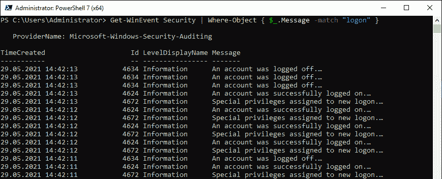
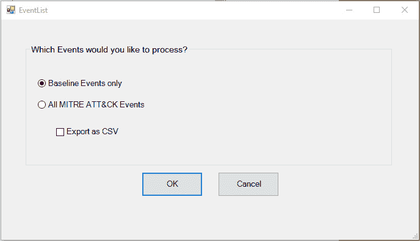

# 第四章：检测——审计与监控

尽管组织已经在努力加强其环境的安全性，但只有少数组织意识到，审计和监控是确保环境安全时最重要的两项工作。

多年来，在微软工作时，我一直倡导*保护*、*检测*和*响应*的策略。大多数公司只试图*保护*他们的设备，但他们仅停留在这一层面。要做到*检测*和*响应*，不仅需要一个有效的**安全运营中心**（**SOC**），还需要基础设施和资源。

这些人力和资源需要资金——这也是许多公司一开始不愿意投入的预算，除非他们已经遭遇了攻击。

在与客户合作时，我只见过少数环境中拥有有效的 SOC，并且具备部署**安全信息与事件管理系统**（**SIEM**）的基础设施。当我离开这些客户时，我很高兴地看到大多数客户开始重新审视他们的安全策略，并改进了安全性、监控和检测。

然而，我也遇到过一些客户，在我第一次接触他们时，他们已经遭到攻击。这些客户曾经没有预算，也没有员工来进行检测，但一旦被攻击，他们就立刻有了改善的预算。

多年来，我了解到，问题不在于组织是否会被黑客攻击，而是**何时**会被攻击，以及**攻击者在环境中逗留多长时间**而不被察觉。如果他们最终被发现的话。

因此，我建议我遇到的每一位 IT 决策者都要*假设已经遭到入侵*，并保护好重要的资产。

多年来，我看到越来越多的组织实际上已经建立了运营中的安全运营中心（SOC），这让我感到非常高兴。但不幸的是——尤其是在中小型企业中——大多数组织要么没有监控机制，要么刚刚开始这方面的工作。

PowerShell 在攻击中的使用多次被媒体报道。勒索病毒通过发送恶意邮件来分发，邮件在后台启动 PowerShell 执行载荷，这是一种无文件攻击，恶意软件无需在客户端下载，而是直接在内存中运行，甚至合法的系统工具也被对手滥用来执行攻击（也被称为**依赖本地资源攻击**或**LOLbins**）。

是的，攻击者喜欢利用他们在系统中找到的东西。然而，如果组织不仅采取了适当的缓解措施，还实施了正确的检测方式，那么这将使对手更难发起成功的攻击并保持隐匿。

许多对手在攻击中使用的工具几乎没有任何透明度，因此防御者（也就是**蓝队**）很难检测和分析这样的攻击。

与此相反，PowerShell 提供了如此强大的日志记录功能，使得分析和检测通过它发起的攻击变得非常容易。因此，如果你是蓝队成员，并且注意到自己遭遇了基于 PowerShell 的攻击，那么你算是走运了（就算你的基础设施遭到攻击，也算是走运吧）！这使得你更容易弄清楚发生了什么。

拥有一个广泛的（不仅限于）PowerShell 日志记录基础设施，可以帮助你的 SOC 团队识别攻击者并了解对手执行了哪些命令和代码。这也有助于提高你的检测能力和安全控制。

在本章中，你将学习使用 PowerShell 进行安全监控的基础知识，这将帮助你开始进行检测或改进检测。在本章中，你将对以下主题有更深入的了解：

+   配置 PowerShell 事件日志

+   PowerShell 模块日志记录

+   PowerShell 脚本块日志记录

+   保护的事件日志记录

+   PowerShell 转录

+   分析事件日志

+   开始使用日志记录

+   最重要的与 PowerShell 相关的事件日志和事件 ID

# 技术要求

为了最大限度地发挥本章的作用，请确保你具备以下内容：

+   PowerShell 7.3 及以上版本

+   **第四章**的 GitHub 仓库访问链接：

[`github.com/PacktPublishing/PowerShell-Automation-and-Scripting-for-Cybersecurity/tree/master/Chapter04`](https://github.com/PacktPublishing/PowerShell-Automation-and-Scripting-for-Cybersecurity/tree/master/Chapter04)

# 配置 PowerShell 事件日志

实施强大的 PowerShell 审计机制，帮助你监控、检测和防范潜在威胁，是确保 PowerShell 安全实践有效性的关键步骤。通过利用 PowerShell 日志记录，你可以捕捉到系统上 PowerShell 活动的详细信息，这对于检测和调查安全事件至关重要。PowerShell 日志记录可以帮助你识别可疑活动，例如恶意命令的执行或关键系统设置的修改。

在本节中，我们将讨论你可以启用的不同类型的 PowerShell 日志记录，包括 PowerShell 模块日志记录、PowerShell 脚本块日志记录、保护的事件日志记录和 PowerShell 转录。我们还将探讨如何配置这些日志记录功能，以满足你所在组织的具体安全需求。

## PowerShell 模块日志记录

PowerShell 模块日志记录在 `PowerShell 3.0` 中新增。此功能提供对系统上执行的所有 PowerShell 命令的广泛日志记录。如果启用了模块日志记录，管道执行事件将生成并写入 `Microsoft-Windows-Powershell/Operational` 事件日志，事件 ID 为 `4103`。

### 如何配置模块日志记录

您可以选择仅在当前会话中为某个模块启用模块日志记录，或者将其配置为永久开启。

仅在单个会话中启用它只有在您想要排查某个特定模块的行为时才有意义。如果您想要检测对手在您的基础设施中运行的命令，那么开启模块日志记录并使其保持常开是有意义的。

要仅在当前会话中为某个特定模块启用模块日志记录，您需要先导入该模块。在此示例中，我们将使用`EventList`模块：

```
> Import-Module EventList
> (Get-Module EventList).LogPipelineExecutionDetails = $true
> (Get-Module EventList).LogPipelineExecutionDetails
True
```

当然，您可以将模块名称`EventList`替换为任何您希望记录管道执行详细信息的模块名称：

```
Import-Module <Module-Name>
(Get-Module <Module-Name>).LogPipelineExecutionDetails = $true
```

如果您想要监控一个受管理的环境，您不希望在每台主机上手动启用 PowerShell 模块日志记录。在这种情况下，您可以使用组策略来启用模块日志记录。

创建一个新的**组策略对象**（**GPO**）。由于 Windows PowerShell 和 PowerShell Core 被设计为共存并可以单独配置，因此取决于您想要配置哪个 PowerShell 版本：

+   要配置 Windows PowerShell，请导航至**计算机配置** | **策略** | **管理模板** | **Windows 组件` | **Windows PowerShell`

+   要配置 PowerShell Core，请导航至**计算机配置** | **管理模板` | **PowerShell Core`

我的 PowerShell Core .admx 模板在哪里？

如果您尚未将`.admx`模板导入到您的组策略中来配置 PowerShell Core，请参见*第一章*，*开始使用 PowerShell*。

选择并编辑**启用模块日志记录**策略。此时将打开一个窗口以配置模块日志记录：


图 4.1 – 通过组策略配置 Windows PowerShell 的模块日志记录

对于 PowerShell Core，配置窗口几乎是一样的，唯一的不同是**使用 Windows PowerShell 策略设置**选项。如果选中此选项，PowerShell Core 将依赖现有的 Windows PowerShell 配置。


图 4.2 – 通过组策略配置 PowerShell Core 的模块日志记录

如果您只想使用一个 GPO 来配置模块日志记录，请启用**使用 Windows PowerShell 策略设置**。接下来，根据您的配置，在 Windows PowerShell 或 PowerShell Core 模块日志记录 GPO 中，进入**模块名称**，然后点击**显示…**按钮来配置需要开启模块日志记录的模块。此时将打开一个新窗口。


图 4.3 – 配置通配符 (*) 来记录所有模块

现在，你可以为单个模块配置启用模块日志记录，但对于安全监控来说，监控所有模块日志记录事件更有意义——无论执行的是哪个模块。

你可以通过配置通配符（*****）作为模块名称来实现此操作。确认两次点击**确定**并退出 GPO 编辑器，使更改生效。

当然，你也可以通过指定模块名称作为值，单独为某个实例添加模块日志记录，而不是监控所有实例。不过，我建议记录所有 PowerShell 活动（*****），这对于防止攻击者导入自定义 PowerShell 模块特别有用。

由此配置生成的所有事件可以在 Microsoft Windows PowerShell 操作事件日志中找到（**Microsoft-Windows-Powershell/Operational**）。

## PowerShell 脚本块日志记录

**脚本块**是由表达式和命令组成的集合，这些表达式和命令被组合在一起并作为一个单位执行。当然，单个命令也可以作为脚本块执行。

许多命令支持 `-ScriptBlock` 参数，例如 `Invoke-Command` 命令，你可以使用它来运行整个脚本块，本地或远程执行：

```
> Invoke-Command -ComputerName PSSec-PC01 -ScriptBlock {Restart-Service -Name Spooler -Verbose}
VERBOSE: Performing the operation "Restart-Service" on target "Print Spooler (Spooler)".
```

需要注意的是，所有在 PowerShell 中执行的操作都被视为脚本块，如果启用了*脚本块日志记录*，它们将被记录——无论是否使用 `-****ScriptBlock` 参数。

大多数情况下，企业和组织并不关心日志记录和事件日志分析，除非发生安全事件。然而，到了那时，已经为时过晚，无法事后启用日志记录。因此，PowerShell 团队决定默认记录所有安全相关的脚本块。

从 PowerShell 5 开始，默认启用*脚本块日志记录的基础版本*——只有常用于恶意攻击的脚本技术会被写入 `Microsoft-Windows-Powershell/Operational` 事件日志。

这种基础版本的脚本块日志记录并不能替代完整的脚本块日志记录；它应该仅仅作为最后的手段，如果在攻击发生时未启用日志记录时使用。

如果你想保护环境并检测恶意活动，仍然应该考虑开启*完整的脚本* *块日志记录*。

此外，在配置脚本块日志记录时，还有一个更详细的选项——*脚本块* *调用日志记录*。

默认情况下，只有在首次使用时，脚本块才会被记录。配置脚本块调用日志记录后，每次调用脚本块以及脚本启动或停止时，都会生成事件。

启用脚本块调用日志记录可能会生成大量事件，这可能会淹没日志，并将其他事件中的有用安全数据滚出。启用脚本块调用日志记录时要小心，因为会生成大量事件——通常情况下，你在事件分析时不需要它。

### 如何配置脚本块日志记录

配置脚本块日志记录有多种方法——手动配置以及集中管理的方式。让我们看看需要配置什么才能记录您环境中执行的所有代码。

要手动启用脚本块日志记录，您可以编辑注册表。要更改的设置位于以下注册表路径中：

```
HKEY_LOCAL_MACHINE\Software\Policies\Microsoft\Windows\PowerShell\ScriptBlockLogging
```

使用`EnableScriptBlockLogging`（**REG_DWORD**）注册表项，可以配置启用脚本块日志记录：

+   **启用**：将值设置为`1`以启用它

+   **禁用**：将值设置为`0`以禁用它

如果启用了脚本块日志记录，您将在事件 ID `4104` 下找到所有执行的代码。

使用`EnableScriptBlockInvocationLogging`（**REG_DWORD**）注册表项，可以配置启用脚本块调用日志记录（事件 ID `4105` 和 **4106**）：

+   **启用**：将值设置为`1`以启用它

+   **禁用**：将值设置为`0`以禁用它

如果启用了脚本块日志记录以及脚本块调用日志记录，将会生成事件 ID `4105` 和 `4106`。

如果启用了脚本块调用日志记录，则会生成大量噪音，日志文件的大小会增加。因此，应该重新配置最大日志大小（请参见*增加日志大小*部分）。对于一般的安全监控，您不需要配置详细的脚本块日志记录。

您可以通过在提升的 PowerShell 控制台中运行以下命令手动配置脚本块日志记录：

```
New-Item -Path "HKLM:\SOFTWARE\Policies\Microsoft\Windows\PowerShell\ScriptBlockLogging" -Force
Set-ItemProperty -Path "HKLM:\SOFTWARE\Policies\Microsoft\Windows\PowerShell\ScriptBlockLogging" -Name "EnableScriptBlockLogging" -Value 1 -Force
```

第一个命令会在注册表项不存在时创建所有注册表键，第二个命令启用脚本块日志记录。

启用`ScriptBlockLogging`时，使用上述命令，`ScriptBlockLogging`将同时为 32 位和 64 位应用程序启用。您可以通过以下方式验证两个设置是否已配置：

+   `HKLM:\HKEY_LOCAL_MACHINE\SOFTWARE\Policies\Microsoft\Windows\PowerShell\ScriptBlockLogging`

+   `HKLM:\HKEY_LOCAL_MACHINE\SOFTWARE\WOW6432Node\Policies\Microsoft\Windows\PowerShell\ScriptBlockLogging`

在受管环境中，将机器集中管理是有意义的。当然，这可以通过 PowerShell 和/或`Desired State Configuration`（**DSC**）来完成，但也可以通过组策略来完成。

创建一个新的 GPO。根据您要配置的 PowerShell 版本，导航到以下任一项：

+   **计算机配置** | **策略** | **管理模板** | **Windows 组件` | **Windows PowerShell` 用于 Windows PowerShell

+   **计算机配置** | **管理模板` | **PowerShell Core` 用于 PowerShell Core

选择并编辑**启用 PowerShell 脚本块日志记录**策略。会打开一个窗口来配置模块日志记录。

如果您决定配置**日志记录脚本块调用开始/停止事件**选项，将会生成更多的事件，并且会产生大量噪音。根据您的使用案例，这个选项可能仍然是有意义的，但如果您刚开始进行安全监控，建议不要启用此选项。

增加脚本块调用日志记录的日志文件大小

如果启用了脚本块调用日志记录，并且使用**日志记录脚本块调用开始/停止事件**选项，日志文件的大小会增加，最大大小应重新配置。

只有在启用**日志记录脚本块调用开始/停止事件**选项时，才会生成事件 ID `4105` 和 `4106`。

在我们的示例中，我们将*不*配置**日志记录脚本块调用开始/停止事件**以避免噪音；因此，我们将保持该复选框未选中：


图 4.4 – 为 Windows PowerShell 启用 PowerShell 脚本块日志记录

在 PowerShell Core 策略中，您将会——与 PowerShell 模块日志记录策略及其他一些策略一样——找到将当前 Windows PowerShell 策略设置同时用于 PowerShell Core 的选项。


图 4.5 – 为 PowerShell Core 启用 PowerShell 脚本块日志记录

由此配置生成的所有事件可以在 Microsoft Windows PowerShell 操作事件日志中找到 (**Microsoft-Windows-Powershell/Operational**)，或者在 PowerShell Core 中，可以在 PowerShell Core 事件日志中找到 (**PowerShellCore/Operational**)。

## 保护事件日志记录

事件日志记录是一个敏感话题。通常，像密码这样的敏感信息会被暴露并写入事件日志。

敏感信息在对手手中如同黄金一样珍贵，尤其是当对方可以访问此类系统时，因此，为了应对这一问题，从 Windows 10 和 PowerShell 版本 5 开始，微软引入了保护事件日志记录。

**保护事件日志记录**使用**互联网工程任务组（IETF）**的**密码消息语法**（**CMS**）标准加密数据，该标准依赖于公钥密码学。这意味着公钥会部署在所有需要支持保护事件日志记录的系统上。然后，使用公钥对事件日志数据进行加密，在转发到中央日志收集服务器之前。

在这台机器上，使用高度敏感的私钥解密数据，然后将数据插入 SIEM。这台机器是敏感的，因此需要特别保护。

保护事件日志记录默认是禁用的，目前仅能与 PowerShell 事件日志一起使用。

### 启用保护事件日志记录

要启用受保护的事件日志记录，可以部署一个*base64 编码的 X.509*证书或其他选项（例如，通过**公共密钥基础设施（PKI）**部署证书并提供指纹，或提供指向本地或文件共享托管证书的路径）。在我们的示例中，我们将使用*base64 编码的* *X.509*证书。

以下是证书要求：

+   证书还必须包含*“文档加密”* **增强密钥使用**（**EKU**），其 OID 号为（**1.3.6.1.4.1.311.80.1**）。

+   证书属性必须包括“*数据加密*”或“*密钥加密*”密钥使用。

这里有一篇很棒的 SANS 博客文章，您可以查看如何检查证书的属性：[`www.sans.org/blog/powershell-protect-cmsmessage-example-code/`](https://www.sans.org/blog/powershell-protect-cmsmessage-example-code/)。

受保护的事件日志记录利用`IETF CMS`来保护事件日志内容。因此，您还可以参考`Protect-CMSMessage`和`Unprotect-CMSMessage` cmdlet 的文档页面，了解有关使用 CMS 加密和解密的更多信息：

+   `Protect-CMSMessage`：[`learn.microsoft.com/en-us/powershell/module/microsoft.powershell.security/protect-cmsmessage`](https://learn.microsoft.com/en-us/powershell/module/microsoft.powershell.security/protect-cmsmessage)

+   `Unprotect-CMSMessage`：[`learn.microsoft.com/en-us/powershell/module/microsoft.powershell.security/unprotect-cmsmessage`](https://learn.microsoft.com/en-us/powershell/module/microsoft.powershell.security/unprotect-cmsmessage)

请注意，您计划部署的证书文件**不能**包含私钥。获得证书后，您可以手动启用它，或使用组策略启用它。

在博客文章*PowerShell* *♥* *the blue team*中，PowerShell 团队为您提供了`Enable-ProtectedEventLogging`函数，您可以使用该函数通过 PowerShell 启用受保护的事件日志记录：[`devblogs.microsoft.com/powershell/powershell-the-blue-team/#protected-event-logging`](https://devblogs.microsoft.com/powershell/powershell-the-blue-team/#protected-event-logging)。

要使用此脚本，请将证书保存在`$cert`变量中，您将在第二个命令中使用该变量将公钥证书传递给`Enable-ProtectedEventLogging`函数，从而在本地系统上启用受保护的事件日志记录：

```
> $cert = Get-Content C:\tmp\PEL_certificate.cer –Raw
> Enable-ProtectedEventLogging –Certificate $cert
```

您还可以通过组策略启用受保护的事件日志记录。创建一个新的 GPO 或重复使用现有的 GPO，然后导航到**计算机配置** | **策略** | **管理模板** | **Windows 组件** | **事件日志记录**。

打开**启用受保护事件` `日志记录**策略。


图 4.6 – 启用受保护的事件日志记录

将**启用受保护的事件日志记录**设置为**启用**，提供您的证书，并点击**确定**确认。

在安全且受保护的系统上使用`Unprotect-CmsMessage` cmdlet 解密数据，然后将其存储到你的 SIEM 中，前提是机器上已安装了适当的解密证书（即包含私钥的证书）。

要在将数据存储到 SIEM 中之前解密数据，请在安全且受保护的系统上使用`Unprotect-CmsMessage` cmdlet，前提是该系统上已安装包含私钥的适当解密证书：

```
> Get-WinEvent Microsoft-Windows-PowerShell/Operational | Where-Object Id -eq 4104 | Unprotect-CmsMessage
```

在这个示例中，所有来自操作 PowerShell 日志的事件 ID `4104`的事件将被解密，前提是私钥存在。

还可以记录会话中执行了哪些命令以及显示了哪些输出。这个选项叫做记录，我们将在下一节中详细讨论。

## PowerShell 记录

自 PowerShell 版本 1.0 以来，PowerShell 记录就作为`Microsoft.PowerShell.Host`模块的一部分提供。记录是监控 PowerShell 会话中发生事件的好方法。

如果启动了 PowerShell 记录，则所有执行的 PowerShell 命令及其输出都会被记录并保存到指定的文件夹中。如果没有另行指定，默认输出文件夹是当前用户的**我的文档**文件夹（**%userprofile%\Documents**）。

以下截图展示了此类记录的一个示例。


图 4.7 – PowerShell 记录的截图

`.txt`文件的名称以`PowerShell_transcript`开头，后跟`computername`、一个随机字符串和时间戳。

这是一个典型的 PowerShell 记录文件名示例，该记录是在*PSSec-PC01*上启动的 – `PowerShell_transcript.PSSEC-PC01.MUxdLMnA.20210320152800.txt`。

### 如何启动记录

启用记录的方式有几种。然而，记录 PowerShell 记录的最简单方法是直接在当前会话中输入`Start-Transcript`命令并按*Enter*。在这种情况下，只有在此本地会话中执行的命令才会被捕获。

直接运行`Start-Transcript` cmdlet 时，最常用的参数是`-OutputDirectory`、`-Append`、`-NoClobber`和`-IncludeInvocationHeader`：

+   `-Append`: 新的记录将被添加到现有文件中。

+   `-IncludeInvocationHeader`: 记录命令执行的时间戳，并在命令之间添加分隔符，以便通过自动化工具更容易解析记录。

+   `-NoClobber`: 该记录不会覆盖现有文件。通常，如果定义位置中已存在记录文件（例如，定义的文件与现有文件同名，或者文件名是通过`-Path`或`-LiteralPath`参数配置的），`Start-Transcript`会覆盖该文件且不会发出警告。

+   `-OutputDirectory`：使用此参数，你可以配置存储转录文件的路径。

+   `-UseMinimalHeader`：此参数在**PowerShell 版本 6.2**中添加，确保仅添加简短的头部，而不是详细的头部。

了解`Start-Transcript`帮助文件中所有参数的完整列表，或者在官方 PowerShell 文档中查看：[`docs.microsoft.com/en-us/powershell/module/microsoft.powershell.host/start-transcript?view=powershell-7#parameters`](https://docs.microsoft.com/en-us/powershell/module/microsoft.powershell.host/start-transcript?view=powershell-7#parameters)。

确保你的转录安全

和你收集的任何安全日志一样，确保将转录文件安全存储，以防止攻击者篡改它们非常重要。确保配置一个安全路径，令攻击者难以访问，并考虑到企业身份被盗的可能性。一旦攻击者获得转录的访问权限，他们可以修改它们，从而使你的检测工作失效。

使用`Start-Transcript`初始化的转录只会在会话处于活动状态或执行`Stop-Transcript`命令时停止，后者会停止记录执行的 PowerShell 命令。

### 默认启用转录

要在系统上*默认*启用转录，你可以通过**注册表**或使用**组策略**来为多个系统配置转录。

#### 通过注册表或脚本启用转录

配置 PowerShell 转录时，使用以下注册表项：

```
HKLM:\Software\Policies\Microsoft\Windows\PowerShell\Transcription
```

例如，要启用转录，使用调用头并设置`C:\tmp`输出文件夹，你需要将以下值配置到注册表键中：

+   `[REG_DWORD]EnableTranscripting = 1`

+   `[REG_DWORD]EnableInvocationHeader = 1`

+   `[REG_SZ]OutputDirectory =** **C:\tmp`

要管理多个机器，使用 GPO 更为方便，但在某些情况下，有些机器不属于 Active Directory 域，因此无法管理。对于本示例，我将`Enable-PSTranscription`函数添加到本书的 GitHub 存储库中：[`github.com/PacktPublishing/PowerShell-Automation-and-Scripting-for-Cybersecurity/blob/master/Chapter04/Enable-PSTranscription.ps1`](https://github.com/PacktPublishing/PowerShell-Automation-and-Scripting-for-Cybersecurity/blob/master/Chapter04/Enable-PSTranscription.ps1)。

将`Enable-PSTranscription`函数加载到当前会话中，并指定转录文件应保存的文件夹，例如以下示例：

```
> Enable-PSTranscription -OutputDirectory "C:\PSLogs"
```

如果未指定`-OutputDirectory`，脚本将默认将转录写入`C:\ProgramData\WindowsPowerShell\Transcripts`。

此函数仅配置所有已定义的值，并覆盖现有的注册表键。你可以根据需要调整此函数并重新使用它。

一旦新的会话启动，转录内容将被写入到配置的文件夹中。

#### 使用组策略启用转录

在 Active Directory 管理的环境中，配置转录的最简单方法是使用组策略。

创建一个新的 GPO 或重用现有的 GPO。然后，导航至**计算机配置** | **策略** | **管理模板** | **Windows 组件` | **Windows PowerShell`。

双击并打开**启用 PowerShell 转录**策略来配置 PowerShell 转录：


图 4.8 – 启用 PowerShell 转录

将策略设置为**启用**，并选择是否包含转录输出目录和调用头。如果未指定输出目录，转录内容将保存在当前用户的**我的文档**文件夹中（**%userprofile%\Documents**）。

#### 为 PowerShell 远程会话启用转录

**自定义端点**是为 PowerShell 远程会话应用默认设置的绝佳方式。如果已经配置了转录，它将默认启用本地会话，但在**足够的管理权限**中额外配置它，可以在用于远程会话时按端点分组并收集日志。通过在自定义端点上配置转录和其他设置，您可以强制执行这些设置，以确保所有连接到该端点的远程会话都符合一致性和合规性要求。

要开始使用，请创建一个会话配置文件，使用`New-PSSessionConfigurationFile` cmdlet，并通过`-TranscriptDirectory`参数指定转录内容应该写入的目录：

```
> New-PSSessionConfigurationFile -Path "$env:userprofile\Documents\PSSession.pssc" -TranscriptDirectory "C:\tmp"
```

该命令创建一个新的会话配置文件，强制启用转录，并将其存储在`%userprofile%\Documents\PSSession.pssc`路径下，该路径是通过`-Path`参数定义的。


图 4.9 – 新创建的会话配置

我们在*第三章*《探索 PowerShell 远程管理技术和 PowerShell 远程控制》中介绍了自定义端点，接下来我们将在*第十章*《语言模式和适当的管理权限（JEA）》中深入探讨足够管理。要了解有关自定义端点和适当的管理权限的更多信息，请确保查看这两章内容。

### PowerShell 转录的最佳实践

作为安全最佳实践，*对每个用户使用会话转录本*。这并不意味着你的管理员在你的机器上做坏事，需要进行监控。我并不鼓励对自己员工的信任产生怀疑。然而，凭证窃取是一个真实的威胁，如果管理员的身份被盗用并加以滥用，你会很高兴能了解对方做了什么。

如果你使用转录本，请确保它们无法被修改。如果它们可以被攻击者篡改，那么它们几乎没有任何作用。

所以，确保提供一个指向预配置文件夹的路径，并通过 GPO、手动配置或会话配置文件来指定它。禁止所有用户修改或删除该文件夹中的任何数据。本地系统账户需要读取和写入权限，因此确保根据需要配置访问权限。

最后，最重要的是，将所有的转录文件转发到一个中央日志服务器或你的 SIEM，以便定期分析它们。

将转录文件集中存储的一个有效方法是将其目标配置为**统一命名规范（UNC）**路径，并使用动态文件名。例如，你可以将转录目录设置为一个具有只写权限的网络共享，使用 PowerShell 配置文件将所有活动记录到一个具有唯一名称的文件中，如下所示：

```
\\server\share$\env:computername-$($env:userdomain)-$($env:username)-$(Get-Date Format YYYYMMddhhmmss).txt
```

同时，确保这个共享对普通用户不可读。通过使用这种方法，你可以轻松地从所有机器中收集并分析日志，集中存储，使你能够更好地检测和响应安全事件，而不需要建立整个日志基础设施。

除了收集日志之外，分析它们同样重要。在接下来的部分，我们将探讨用于日志分析的技术和工具。

# 分析事件日志

有几种方法可以使用 PowerShell 操作 Windows 事件日志。当然，你可以将事件日志转发到你选择的 SIEM，但有时你可能需要直接分析某台机器上的事件日志。在这种用例下，查看 PowerShell 提供的选项是有意义的。

如果你只是想分析事件或创建新事件，最简单的选择是使用`*-WinEvent` cmdlets，它们在 PowerShell Core 7 中仍然可用。你可以使用`Get-Command`查找所有可用的 cmdlet：


图 4.10 – 可用的 *-WinEvent cmdlets

在 PowerShell 5.1 中，也可以使用 `*-EventLog` cmdlets，但它们在 PowerShell Core 6 及以上版本中被移除。由于 PowerShell 5.1 默认安装在所有 Windows 10 操作系统上，因此这里提到 `*-EventLog`。同样，使用`Get-Command`查找所有可用的 cmdlet：


图 4.11 – 可用的 *-EventLog cmdlets

第三个选项是使用 `wevtutil`。这个命令行可执行文件并不容易理解，但可以用来操作和分析事件日志。使用 `/?` 参数，你可以获取更多关于用法的详细信息。


图 4.12 – wevtutil.exe 使用方法

例如，清除 `Security` 事件日志可以通过以下命令实现：

```
> wevtutil.exe cl Security
```

请参考官方文档以获取有关 `wevtutil` 的更多详细信息：[`docs.microsoft.com/de-de/windows-server/administration/windows-commands/wevtutil`](https://docs.microsoft.com/de-de/windows-server/administration/windows-commands/wevtutil)。

## 查找系统中存在的日志

如果你想查找系统中存在的哪些事件日志，可以使用 `-ListLog` 参数，后面跟一个通配符（*****）– `Get-WinEvent -ListLog *`：


图 4.13 – 列出所有事件日志

你可能希望将输出传递给 `Sort-Object` 以按记录数、最大日志大小、日志模式或日志名称进行排序。

## 一般查询事件

要开始，先看看我们如何分析 PowerShell 审计的最常见场景。

使用 `Get-WinEvent` 命令，你可以从指定的事件日志中获取所有事件 ID – `Get-WinEvent Microsoft-Windows-PowerShell/Operational`：


图 4.14 – 查询 Microsoft Windows PowerShell 操作日志

在这个例子中，你会看到 PowerShell 操作日志中生成的所有事件 ID。

如果你只想查询最近的 *x* 个事件，`-MaxEvents` 参数将帮助你完成此任务。例如，要查询 *Security* 事件日志中的最后 15 个事件，请使用 `Get-WinEvent Security -MaxEvents 15`：


图 4.15 – 查询安全事件日志中的最后 15 个事件

这对于你想要分析最近的事件而不查询整个事件日志时特别有帮助。

使用 `-Oldest` 参数可以反转顺序，以便你查看日志中的最旧事件 – `Get-WinEvent Security -MaxEvents 15 -Oldest`：


图 4.16 – 安全事件日志中的 15 条最旧事件

要查找所有在 Microsoft Windows PowerShell 操作日志中执行并被 `ScriptBlockLogging` 记录的代码，可以筛选事件 ID `4104`：`Get-WinEvent Microsoft-Windows-PowerShell/Operational | Where-Object { $_.Id -eq 4104 } | fl`：


图 4.17 – 查找所有执行并记录的代码

你还可以根据消息部分中的特定关键字进行过滤。例如，要查找所有消息中包含 `"logon"` 字符串的事件，可以使用 `-match` 比较运算符 – `Get-WinEvent Security | Where-Object { $_.Message -match "****logon" }`：



图 4.18 – 查找所有消息中包含“logon”的事件

你还可以使用基于 XPath 的查询进行过滤，使用 `-****FilterXPath` 参数：

```
Get-WinEvent -LogName "Microsoft-Windows-PowerShell/Operational" -FilterXPath "*[System[(EventID=4100 or EventID=4101 or EventID=4102 or EventID=4103 or EventID=4104)]]"
```

输出结果如下所示：


图 4.19 – 使用 XPath 查询进行过滤

还可以通过指定的 **哈希表** 进行过滤，使用 `-****FilterHashtable` 参数：

```
> $eventLog = @{ ProviderName="Microsoft-Windows-PowerShell"; Id = 4104 }
> Get-WinEvent -FilterHashtable $eventLog
```

使用哈希表可以显著减少对`Where-Object`过滤子句的使用。

如果你想查询复杂的事件结构，可以使用 `-FilterXml` 参数并提供 `XML` 字符串。我已经准备了这样的示例，并将其上传到本书的 GitHub 仓库：[`github.com/PacktPublishing/PowerShell-Automation-and-Scripting-for-Cybersecurity/blob/master/Chapter04/Get-AllPowerShellEvents.ps1`](https://github.com/PacktPublishing/PowerShell-Automation-and-Scripting-for-Cybersecurity/blob/master/Chapter04/Get-AllPowerShellEvents.ps1)：


图 4.20 – 使用 Get-AllPowerShellEvents.ps1 脚本

这个示例查询了 `Microsoft-Windows-PowerShell/Operational`、`PowerShellCore/Operational` 和 `Windows PowerShell` 事件日志，并检索了我将在本章的 *基本 PowerShell 事件日志* 部分中描述的所有事件。

现在你已经知道如何处理事件日志并查询事件，接下来让我们看看如何检测和分析系统上运行了哪个代码。

## 系统上运行了哪个代码？

如果你决定手动执行此任务，过滤并滚动浏览所有包含已执行代码的事件可能是一项繁琐的工作。但是，幸运的是，PowerShell 允许你自动化此任务并快速找到你需要的内容。

一般来说，所有包含已记录代码的事件可以在 Microsoft Windows PowerShell 或 PowerShell Core 操作日志中找到，事件 ID 为 `4104`：

```
> Get-WinEvent Microsoft-Windows-PowerShell/Operational | Where-Object Id -eq 4104
> Get-WinEvent PowerShellCore/Operational | Where-Object Id -eq 4104
```

为了更好地查找和过滤执行的代码，我编写了 `Get-ExecutedCode` 函数，你可以在本书的 GitHub 仓库中找到它：[`github.com/PacktPublishing/PowerShell-Automation-and-Scripting-for-Cybersecurity/blob/master/Chapter04/Get-ExecutedCode.ps1`](https://github.com/PacktPublishing/PowerShell-Automation-and-Scripting-for-Cybersecurity/blob/master/Chapter04/Get-ExecutedCode.ps1)。

## 降级攻击

由于 5.1 及以上版本引入了许多新的安全功能，较旧的 PowerShell 版本，如 2.0，变得对攻击者更具吸引力。因此，攻击者常用的一种手段就是所谓的**降级攻击**。

可以通过在运行 `powershell.exe` 时指定版本号来执行降级攻击：

```
> powershell.exe -version 2 –command <command>
```

如果指定的版本已安装，命令将运行，使用的是已弃用的二进制文件，这意味着只有该版本编写时存在的安全功能才会生效。

所有运行 Windows 7 及以上版本的机器至少安装了 PowerShell 2.0 版本。虽然 Windows 7 已不再获得支持，也不再接收安全更新，但它仍然广泛使用。

此外，PowerShell 2.0 仍然依赖于`.NET Framework 2.0`，该版本不包含先进的安全功能，也没有高级日志记录功能。因此，这对那些不希望任何人知道他们在系统上做了什么的攻击者来说非常适用。

.NET Framework 2.0 默认不包括在 Windows 10 中，但可以手动安装——例如，由攻击者或管理员安装。在 Windows 10 之前的操作系统中，.NET Framework 2.0 是默认安装的。

在 Windows 8 上，可以通过在提升权限的控制台中运行以下命令来禁用 PowerShell 2.0：

```
Disable-WindowsOptionalFeature -Online -FeatureName MicrosoftWindowsPowerShellV2Root
```

运行 PowerShell 2.0 所需的 .NET Framework 2.0 默认不会安装在如 Windows 10 这样的较新系统上。

所以，如果你尝试运行`powershell.exe -version 2`，你会收到一个错误信息，提示缺少 .NET Framework 2.0 版本：

```
> powershell.exe -version 2
Version v2.0.50727 of the .NET Framework is not installed and it is required to run version 2 of Windows PowerShell.
```

由于 .NET Framework 2.0 可以手动安装——无论是系统管理员还是攻击者——请确保检查 PowerShell 2.0 版本并将其禁用。

运行以下命令检查 PowerShell 2.0 是否已启用或禁用：

```
> Get-WindowsOptionalFeature -Online | Where-Object {$_.FeatureName -match "PowerShellv2"}
FeatureName : MicrosoftWindowsPowerShellV2Root
State       : Enabled
FeatureName : MicrosoftWindowsPowerShellV2
State       : Enabled
```

所以，看起来 PowerShell 2.0 仍然在这台机器上启用。因此，如果缺少的 .NET Framework 2.0 被安装，那么该系统将容易受到降级攻击。

因此，让我们通过运行以下命令来禁用 PowerShell 2.0，从而加强系统安全：

```
Get-WindowsOptionalFeature -Online | Where-Object {$_.FeatureName -match "PowerShellv2"} | ForEach-Object {Disable-WindowsOptionalFeature -Online -FeatureName $_.FeatureName -Remove}
```

你会在输出中看到需要重启，所以在你重启电脑后，修改会生效，PowerShell 2.0 将被禁用：

```
> Get-WindowsOptionalFeature -Online | Where-Object {$_.FeatureName -match "PowerShellv2"} | ForEach-Object {Disable-WindowsOptionalFeature -Online -FeatureName $_.FeatureName -Remove}
Path          :
Online        : True
RestartNeeded : False
Path          :
Online        : True
RestartNeeded : False
```

所以，如果你再验证一次，你会看到状态被设置为**禁用**：

```
> Get-WindowsOptionalFeature -Online | Where-Object {$_.FeatureName -match "PowerShellv2"}
FeatureName : MicrosoftWindowsPowerShellV2Root
State       : Disabled
FeatureName : MicrosoftWindowsPowerShellV2
State       : Disabled
```

然而，在 Windows 7 上，无法禁用 PowerShell 2.0。唯一不允许使用 PowerShell 2.0 的方式是利用**应用程序控制**或`AppLocker`，我们将在*第十一章*中讨论，*AppLocker、应用程序控制和* *代码签名*。

对于对手而言，还有另一种运行降级攻击的方法 - 例如，如果编译的应用程序利用旧版本的 PowerShell，并链接到编译的 PowerShell v2 二进制文件，攻击者可以通过利用该应用程序发起降级攻击。因此，每当此应用程序运行时，PowerShell v2 也处于活动状态，如果攻击者设法利用该应用程序，则可以使用它。

在这种情况下，禁用 PowerShell 2.0 可以帮助防止此类攻击，方法是阻止全局程序集缓存（**GAC**）中的不推荐的二进制文件，或者完全移除 PowerShell 组件。然而，重要的是要注意，依赖这些二进制文件的其他应用程序也将被阻止，因为它们通常不会随所有 PowerShell 二进制文件一起发布。

通常，降级攻击是一个非常关键的问题，因此，您应该对其进行监控。您可以通过监控 Windows PowerShell 事件日志中的事件 ID `400` 来执行此操作 - 如果指定版本低于 `[Version] "5"`，则应进一步进行调查。

李·霍姆斯（Lee Holmes）曾是微软 Windows PowerShell 团队的一员，他在他的博客文章*检测和防止 PowerShell 降级攻击*中提供了一个很好的例子，通过查找 PowerShell 事件日志中的事件 ID `400` 来监控潜在的降级攻击：[`www.leeholmes.com/detecting-and-preventing-powershell-downgrade-attacks/`](https://www.leeholmes.com/detecting-and-preventing-powershell-downgrade-attacks/)。

使用此示例查找加载较低版本的 PowerShell 引擎的情况：

```
Get-WinEvent -LogName "Windows PowerShell" | Where-Object Id -eq 400 | Foreach-Object {
        $version = [Version] ($_.Message -replace '(?s).*EngineVersion=([\d\.]+)*.*','$1')
        if($version -lt ([Version] "5.0")) { $_ }
}
```

## EventList

在我在微软担任高级现场工程师期间，我与许多刚刚从零开始建立 SOC 的客户合作过。这些客户不仅希望设置日志事件转发，还向我询问加固其 Windows 环境的最佳实践。

谈到加固 Windows 环境时，您不能忽视微软**安全与合规工具包**（**SCT**）：[`www.microsoft.com/en-us/download/details.aspx?id=55319`](https://www.microsoft.com/en-us/download/details.aspx?id=55319)。

我将在稍后的*第六章*，*Active Directory – Attacks and Mitigation*以及*第十三章*，*What Else? – Further Mitigations and Resources*中更详细地讨论工具包的某些部分。总的来说，此工具包包含几个工具，用于比较和验证您的配置，以及所谓的**基线**。

这些基线旨在提供加固指导 - 这些设置对您的安全姿态非常重要，以及*监控配置*。

毫无疑问，您不应仅仅强制执行这些基线而没有一个结构化的计划，并了解您正在配置的设置的影响。

如果为某台计算机配置了基线，由于监控配置的帮助，新的事件将会生成在**安全**事件日志中。

当我与客户合作时，我总是建议在一个结构良好的计划之后应用 Microsoft 安全基线。

有一次，我在客户现场，刚刚建议他们应该应用 Microsoft 安全基线，以便查看更多事件 ID。在推荐应用这些基线后，客户问我是否有概览来查看启用特定基线后会生成哪些额外的事件 ID，比如*Windows 2016 域控制器基线*。

我只知道一个文档，他们可以利用它自行查找相关信息，那就是*Windows 10 和 Windows Server 2016 安全审计与监控* *参考资料*：[`www.microsoft.com/en-us/download/details.aspx?id=52630`](https://www.microsoft.com/en-us/download/details.aspx?id=52630)。

尽管本文档提供了关于所有**高级审计策略配置**项的惊人详细信息，涵盖了 754 页，但内容相当广泛。

所以，客户并不乐意研究这个庞大的文档，并要求我写下如果他们应用该基线会生成哪些事件。我并不喜欢这样的令人头昏的工作，但我开始为这个基线写下所有的事件。

正在进行时，客户走近我，意识到他们不仅有一种，而是多种基线需要在他们的环境中应用。而且，这些不仅是域控制器基线，还有适用于成员服务器和各种操作系统客户端计算机的基线。所以，他们让我列出*所有*现有基线的事件 ID。

正如你能想象的那样，我并不特别兴奋于这个新任务。这看起来像是一个非常枯燥且令人疲惫的工作，可能需要多年才能完成。

因此，我考虑到需要自动化基线与事件 ID 的匹配，这也就是我的开源工具`EventList`诞生的背景。

尽管最初它只是一个包含 Visual Basic 宏的 Excel 文档，但它在这期间变成了一个庞大的项目，背后有着庞大的数据库支持。


图 4.21 – EventList 标志

每当我需要处理事件 ID 时，我的 EventList 数据库就成了我唯一的可靠数据源，而且它还在不断增长。

### 使用 EventList 进行工作

要开始使用，EventList 可以轻松地从 PowerShell Gallery 安装：

```
> Install-Module EventList
```

EventList 是用 PowerShell 构建的；因此，即使你只想使用用户界面，也需要运行至少一个 PowerShell 命令。以管理员身份打开 PowerShell 控制台，并输入以下内容：

```
> Open-EventListGUI
```

按下*Enter*键进行确认。几秒钟后，EventList UI 出现。


图 4.22 – EventList 用户界面

在左上角，您可以选择现有基线并查看在 UI 中填充的`MITRE ATT&CK`技术和领域。因此，您可以直接查看应用某个基线时涵盖的 MITRE ATT&CK 技术。

您还有可能性导入您自己的基线或导出的 GPO 并删除现有的基线。

一旦您选择了一个基线并填写了 MITRE ATT&CK 复选框，请选择**生成` `事件列表**。



图 4.23 - EventList - 显示基线事件

弹出窗口将打开，您可以选择是否仅为基线事件生成 EventList 或所有 MITRE ATT&CK 事件。

要查看应用某个基线时会生成哪些事件 ID，请选择**仅基线事件**。确认选择**确定**以查看您选择的基线/GPO 的 EventList。


图 4.24 - 生成的 EventList

生成了一个 EventList，在其中您可以看到应用此基线时将生成的每个事件 ID，以及（如果有的话）指向文档的链接以及关于是否应监视此事件的建议。

如果选中**导出为 CSV**，则可以选择输出保存的位置，并生成一个`.csv`文件。

由于**高级审计日志**，微软安全基线主要依赖于**基线**功能，EventList 在理解和揭示高级审计日志方面提供了很大帮助。

您可以通过在 CLI 上使用以下命令来实现相同的效果：

```
> Get-BaselineEventList -BaselineName "MSFT Windows Server 2019 - Domain Controller"
```

需要将基线导入 EventList 数据库，因此在使用`Get-BaselineNameFromDB`功能验证基线名称时，请确保显示基线名称。

当然，您还可以选择不同的 MITRE ATT&CK 技术和领域，并生成一个 EventList，查看哪些事件 ID 涵盖特定的 MITRE ATT&CK 领域。生成一个 EventList，选择**所有 MITRE ATT&CK 事件**，然后确认选择**确定**。

弹出窗口将打开，您可以看到与所选 MITRE ATT&CK 技术相关联的所有事件 ID。


图 4.25 - MITRE ATT&CK EventList

再次强调，这可以通过将基线或 MITRE ATT&CK 技术编号传递给`Get-MitreEventList`功能，使用`-Identity`参数来实现：

```
> Get-MitreEventList -Identity "T1039"
```

下图显示了命令的输出。


图 4.26 - Get-MitreEventList 功能也可以通过命令行运行

当然，EventList 提供了更多的功能。它还提供了生成适用于您自己用例的所有事件 ID 的转发代理片段的可能性。您还可以生成支持您自己用例的自己的 GPO 和查询。

然而，功能太多，无法在本书中详细描述。如果你有兴趣深入了解 EventList，请务必阅读该项目在 GitHub 上的文档，文档地址会在本节结尾提到。一些专家还发现手动查询 EventList 背后的数据库非常有用。

我编写了 EventList，以帮助全球的 SOC 理解需要监控的内容，并简化他们的事件 ID 转发。

我在不断改进 EventList，所以如果你想了解更多，欢迎下载并测试它。你可以从我的 GitHub 仓库 ([`github.com/miriamxyra/EventList`](https://github.com/miriamxyra/EventList)) 下载并安装，或者从 PowerShell Gallery 安装：

```
> Install-Module EventList -Force
```

为了更全面地了解 EventList 的功能，我建议阅读文档和帮助文件，并观看我关于它的一些讲座录音：

+   **Hack.lu 2019: (版本` **1.1.0)`: [`www.youtube.com/watch?v=nkMDsw4MA48`](https://www.youtube.com/watch?v=nkMDsw4MA48)

+   **Black Hat 2020 (版本` **2.0.0)`: [`www.youtube.com/watch?v=3x5-nZ2bfbo`](https://www.youtube.com/watch?v=3x5-nZ2bfbo)

如果你有任何关于 EventList 的改进建议，我很乐意听到更多，并期待你在 GitHub 上的 Pull Request 或通过 Twitter 或电子邮件与我联系。

# 开始日志记录

为了提高你的检测能力，建议设置一个 SIEM 系统来收集事件，这样你就能将所有事件日志集中在一个地方，方便你进行追踪并构建自动化告警。

如果你想选择一个 SIEM 系统，选择非常多——适应各种预算和场景。多年来，我见过许多不同的 SIEM 系统，每一个都非常适合各自的组织。

我见过的最流行的 SIEM 系统包括`Splunk`、`Azure Sentinel`、`ArcSight`、`qRadar`和**“ELK 堆栈” (Elastic, LogStash, 和 Kibana)**，仅举几例。我还使用过**Windows 事件转发**(**WEF**) 来实现事件日志监控。

当然，也可以分析本地机器上的事件，但这并不实际——根据配置，如果达到最大日志大小，旧事件会被删除，且很难将其与其他系统的日志相关联。

在本章中，我们还将直接在机器上（或如果你愿意也可以远程）分析事件，但对于实际的生产环境，我建议使用 SIEM 系统——只是确保它适合你的用例再开始使用。

## 重要的 PowerShell 相关日志文件概述

在我们开始之前，你可能希望配置所有你想要转发到 SIEM 或中央日志服务器的日志。

本节将概述我认为在 PowerShell 日志记录方面重要的所有日志。

### 基本 PowerShell 事件日志

在使用 PowerShell 时，有三个事件日志是我们关注的重点——**Windows PowerShell 日志**、**Microsoft Windows PowerShell 操作日志**和**PowerShellCore 操作日志**。我们将在以下小节中讨论每个日志。

#### Windows PowerShell 日志

Windows PowerShell 一直以来都非常注重安全性和日志记录，甚至在最早的版本中也是如此。实际上，与其他 shell 或脚本语言相比，PowerShell 的早期版本在安全日志记录方面已经具有显著更好的功能。然而，随着时间的推移，PowerShell 语言不断发展，其日志记录功能也得到了极大的扩展，如今提供了更为强大的日志记录能力。

尽管早期版本没有提供您今天在 PowerShell 版本中所知道的安全日志记录功能，但自从版本 1 起，当发生重要引擎事件时，Windows PowerShell 就会将事件写入**Windows PowerShell 事件日志**。当时，PowerShell 仅提供基本的日志记录功能，这些功能在当前的操作系统中仍然可用，如下所示：

+   **完整名称**：Windows PowerShell

+   **日志路径**：`%SystemRoot%\System32\Winevt\Logs\Windows PowerShell.evtx`

+   **UI 中的路径**：**应用程序和服务` | **Windows PowerShell`

在这些事件日志中，*最有趣的事件 ID* 包括以下几种：

+   **事件 ID 200**（警告）：**命令健康。**

查找**主机应用程序**以获取有关执行命令的更多详细信息。

+   **事件 ID 400**：**引擎状态从无` `变为可用。**

这个事件可能是*最有趣的事件*，因为它表明引擎何时启动，以及使用的是哪个版本。此事件对于识别和终止过时的 PowerShell 版本（监控`HostVersion` 小于 5.0）非常理想——并且通常用于降级攻击（有关更多信息，请参见*检测降级攻击*部分）。

+   **事件 ID 800**：**命令行的管道执行详情 –` *<`命令行命令>***。**

尽管事件 ID `800` 提供了包含 cmdlet 的命令行执行的详细信息，但它不包括其他可执行文件的信息，如`wmic`。为了获得更多详细信息，监视来自*Microsoft Windows PowerShell 操作日志*的事件 ID `4103` 和 `4104` 可能更有用。

Microsoft Windows PowerShell 操作日志包含有关 PowerShell 使用的所有相关信息——例如，**模块日志记录**和**脚本块日志记录**事件都会写入此日志。

#### Microsoft Windows PowerShell 操作日志

从 Windows Vista 开始，微软引入了一种新的日志记录系统，称为 `ETW`。作为这一变化的一部分，*Microsoft Windows PowerShell 操作日志* 被引入，包含了一系列事件 ID，如 `4100`、`4103`（尽管配置它们可能很具挑战性），以及 `40961`、`40862` 等与 PowerShell 远程日志相关的事件 ID。

随着 *KB3000850* 的发布，像 **模块日志记录**、**脚本块日志记录** 和 **转录** 等高级审计功能可以移植到 PowerShell 版本 4（Windows Server 2012 R2 和 Windows 8.1）。随后，在 PowerShell 版本 5（Windows Server 2016 和 Windows 10）中，这些功能默认启用。

随着这些新的审计功能的引入，也有新的事件类型被加入，比如事件 ID `4104`、`4105` 和 `4106`，它们为你提供了更高级的日志记录功能：

+   **完整` `名称**： `Microsoft-Windows-Powershell/Operational`

+   **日志` `路径**：`%SystemRoot%\System32\Winevt\Logs\Microsoft-Windows-PowerShell%4Operational.evtx`

+   **UI 中的路径**：**应用程序和服务` | **Microsoft** | **Windows** | **PowerShell** | **Operational`

此事件日志中*最有趣的事件 ID*如下：

+   **事件 ID 4103**：**执行管道/命令调用。如果启用了 PowerShell 模块日志记录，则会生成此事件**。

+   **事件 ID 4104**：**创建` `脚本块文本**。

如果启用了 `ScriptBlockLogging`，则会生成此事件。常见的恶意活动，如加载恶意模块或执行可疑命令，都会被记录，无论是否启用 `ScriptBlockLogging`。

+   **事件 ID 4105**：**ScriptBlock_Invoke_Start_Detail（消息：已启动/完成一个脚本块的调用）**。

如果启用了 `ScriptBlockLogging`，则会生成此事件。这记录了开始/停止事件。它非常嘈杂，未必适用于安全监控。

+   **事件 ID 4106**：**ScriptBlock_Invoke_Complete_Detail（消息：已启动/完成一个脚本块的调用）**。

如果启用了 `ScriptBlockLogging`，则会生成此事件。这记录了开始/停止事件。它非常嘈杂，未必适用于安全监控。

+   **事件 ID 40961**：**PowerShell 控制台正在` `启动**。

该事件表示 PowerShell 控制台已打开。特别是通过此事件监控用户的异常行为（例如，如果 PowerShell 控制台是由不应登录此系统的用户执行，或者是由系统账户执行的）。

+   **事件 ID 40962**：**PowerShell 控制台已准备好接收` `用户输入**。

该事件表示 PowerShell 控制台已启动，并且现在已准备好接收用户输入。特别是通过此事件监控用户的异常行为（例如，如果 PowerShell 控制台是由不应登录此系统的用户执行，或者是由系统账户执行的）。

要筛选特定的事件 ID，可以将`Get-WinEvent`的输出通过管道传递给`Where-Object`：

```
> Get-WinEvent Microsoft-Windows-PowerShell/Operational | Where-Object Id -eq 4104
```

在此示例中，您将获取所有事件 ID 为`4104`的事件，这表示已创建脚本块。

#### PowerShellCore 操作日志

当 PowerShell Core 被引入时，PowerShellCore 操作日志也随之推出。它提供了 PowerShell Core 事件日志的高级审计功能：

+   **完整名称**：`PowerShellCore/Operational`

+   **日志路径**：`%SystemRoot%\System32\Winevt\Logs\PowerShellCore%4Operational.evtx`

+   **UI 路径**：**应用程序和服务` | **PowerShellCore** | `操作日志**

记录在此日志文件中的事件 ID 与记录在 Microsoft Windows PowerShell 操作日志中的事件 ID 相同。请参考前面部分的事件 ID。

### Windows 远程管理 (WinRM) 日志

**Microsoft Windows WinRM 操作日志**记录了进出 WinRM 的连接。由于 PowerShell 依赖 WinRM 进行远程管理，因此你也可以在此事件日志中找到 PowerShell 远程连接。因此，监控和分析该日志中的事件 ID 是非常重要的。

+   **完整名称**：`Microsoft-Windows-WinRM/Operational`

+   **日志路径**：`%SystemRoot%\System32\Winevt\Logs\Microsoft-Windows-WinRM%4Operational.evtx`

+   **UI 路径**：**应用程序和服务` | **Microsoft** | **Windows** | `Windows 远程管理** | **操作日志**

在使用 PowerShell 和 WinRM 时，以下是*最值得关注的事件*，它们通常会出现在 WinRM 事件日志中。

+   **事件 ID 6**：**创建一个` `WSMan 会话。**

每当建立远程连接时，都会记录此事件。它还包含用户名、目标地址和使用的 PowerShell 版本。

+   **事件 ID 81**：**处理来自客户端的 CreateShell 操作请求或处理来自客户端的 DeleteShell 操作请求。**

+   **事件 ID 82**：**为 CreateShell 操作进入插件，资源 URI 为` **<http://schemas.microsoft.com/powershell/Microsoft.PowerShell>`

+   **事件 ID 134**：**为` `CreateShell 操作发送响应。**

+   **事件 ID 169**：**用户` *<domain>\<user>* `使用 NTLM 身份验证成功登录。**

可以使用`Get-WinEvent Microsoft-Windows-WinRM/Operational`查询 WinRM 日志中的所有事件。

### 安全性

安全性事件日志不仅与 PowerShell 相关，还帮助关联事件，如登录/注销和身份验证。

+   **完整名称**：**安全性**

+   **日志路径**：`%SystemRoot%\System32\Winevt\Logs\Security.evtx`

+   **UI 路径**：**Windows 日志** | **安全性**

虽然并非所有的安全日志中的事件 ID 都是默认生成的，但最重要的事件 ID 旨在帮助识别安全问题。如果您想实现全面的安全日志记录，我建议将 Microsoft 安全工具包中的 Microsoft 安全基准应用到您的系统中。然而，重要的是要注意，安全基准中的设置应与您组织的资源和能力相匹配。因此，在应用基准之前，建议评估哪些日志设置适合您组织的需求和能力。

您可以在此下载**Microsoft 安全工具包**：[`www.microsoft.com/en-us/download/details.aspx?id=55319`](https://www.microsoft.com/en-us/download/details.aspx?id=55319)。

此事件日志中的事件 ID 是一些最重要的安全监控事件。虽然并非所有事件 ID 都特定于 PowerShell，但它们仍然对维护安全环境至关重要。以下是此事件日志中*最有趣的事件 ID*：

+   **事件 ID 4657**：**注册表值` `已修改**

+   **事件 ID 4688**：**新进程已创建。请查找“新进程名称”中包含 powershell.exe 的进程。您可以使用创建者进程 ID 来链接哪个进程启动了哪些` `其他进程。**

+   **事件 ID 1100**：**事件日志服务已` `关闭。**

+   **事件 ID 1102**：**审核日志` `已清除。**

+   **事件 ID 1104**：**安全日志` `已满。**

+   **事件 ID 4624**：**账户已成功` `登录。**

+   **事件 ID 4625**：**账户登录失败。**

安全日志内容丰富，包含大量重要的事件 ID。仅仅覆盖安全日志就可以写成一本完整的书；因此，这个列表并不完整，我这里只列出了与 PowerShell 相关的一些最重要的事件 ID。

然而，*哪些安全事件 ID 重要*的问题让我失眠了很多个夜晚，因此我开发了一个名为`EventList`的开源工具。如果你想了解哪些事件 ID 重要，可以查看本章中的*转发和分析事件日志 – EventList*部分。

### 系统

在系统日志中，会生成许多与系统相关的日志 ID：

+   **全名**：**系统**

+   **日志` `路径**：`%SystemRoot%\System32\Winevt\Logs\System.evtx`

+   **UI 中的路径**：**Windows 日志** | **系统**

在此事件日志中，*最有趣的事件 ID* 如下：

+   **事件 ID 104** – **日志` *<name>* `已清除。** 此事件表明名为 *<name>* 的事件日志已被清除，可能表示攻击者试图隐藏痕迹。特别使用此事件 ID 监控日志名为 *“Windows PowerShell,"* *“PowerShell Operational,"* 或 *“PowerShellCore”* 的日志，以检测与 PowerShell 相关的事件日志清除。

根据你监控的内容，在此日志中有许多有趣的事件——例如，每次安装的详细信息。

### Windows Defender

从 Windows 10 和 Windows Server 2016 起，默认启用了 Windows Defender 日志，并提供了许多有用的事件。例如，它还包含与**恶意软件扫描接口**（**AMSI**）相关的事件，AMSI 是 Windows Defender 的一部分：

+   **完整名称**：`Microsoft-Windows-Windows Defender/Operational`

+   **日志路径**：`%SystemRoot%\System32\Winevt\Logs\Microsoft-Windows-Windows Defender%4Operational.evtx`

+   **UI 中的路径**：**应用程序和服务` | **Microsoft** | **Windows** | **Windows Defender** | `操作日志**

此事件日志中关于 PowerShell 安全日志记录的*最有趣的事件 ID*如下：

+   **事件 ID 1116**：**Microsoft Defender Antivirus 已检测到恶意软件或其他潜在的` `不需要的软件。**

+   **事件 ID 1117**：**Microsoft Defender Antivirus 已采取措施保护此计算机免受恶意软件或其他潜在的` `不需要的软件的影响。**

如果在你的机器上使用了 Microsoft Defender，你会在此事件日志中找到更多与 Defender 相关的有趣事件。你可以使用以下参考资料了解更多关于每个 Microsoft Defender 相关事件 ID 的信息：[`learn.microsoft.com/en-us/microsoft-365/security/defender-endpoint/troubleshoot-microsoft-defender-antivirus`](https://learn.microsoft.com/en-us/microsoft-365/security/defender-endpoint/troubleshoot-microsoft-defender-antivirus)。

我们将在*第十二章*中更详细地了解 AMSI，*探索恶意软件扫描接口*（*AMSI*）。

### Windows Defender 应用控制与 AppLocker

**Windows Defender 应用控制**（**WDAC**）和`AppLocker`可用于允许列应用程序，以限制组织内允许使用的软件。两种解决方案都有助于防止未经授权的软件使用。

我们将在*第十一章*中更详细地了解 WDAC 和 AppLocker，*AppLocker、应用控制和* *代码签名*。

启用允许列表解决方案时，审计是第一步，因此，分析与 WDAC 和 AppLocker 相关的事件 ID 对于此过程至关重要。

#### Windows Defender 应用控制（WDAC）

WDAC 是微软最新的允许列表解决方案，随着 Windows 10 推出，并且之前被称为*设备保护（Device Guard）*。除了允许列应用程序外，WDAC 还可用于在 Windows 机器上强制实施代码完整性策略。

WDAC 有两个主要的事件日志——一个名为**MSI 和脚本**的事件日志与 AppLocker 共享，另一个事件日志用于记录**代码完整性**相关的事件。

**代码完整性**

+   **完整名称**：`Microsoft-Windows-CodeIntegrity/Operational`

+   **日志路径**：`%SystemRoot%\System32\Winevt\Logs\Microsoft-Windows-CodeIntegrity%4Operational.evtx`

+   **界面路径**：**应用程序和服务日志` | **Microsoft** | **Windows** | **CodeIntegrity** | **Operational`

PowerShell 安全日志中这个事件日志最*有趣的事件 ID*如下：

+   **事件 ID 3001**：**未签名的驱动程序尝试在系统上加载。**

+   **事件 ID 3023**：**验证中的驱动程序文件未满足通过应用程序` `控制策略的要求。**

+   **事件 ID 3033**：**验证中的文件未满足通过应用程序` `控制策略的要求。**

+   **事件 ID 3034**：**如果执行了应用程序控制策略，验证中的文件未满足通过该策略的要求。由于该策略处于审核模式，文件被允许。**

+   **事件 ID 3064**：**如果应用程序控制策略已执行，验证中的用户模式 DLL 未满足通过应用程序控制策略的要求。由于该策略处于审核模式，DLL 被允许运行。**

+   **事件 ID 3065**：**如果应用程序控制策略已执行，验证中的用户模式 DLL 未满足通过应用程序` `控制策略的要求。**

+   **事件 ID 3076**：**此事件是审核模式策略的主要应用程序控制阻止事件。它表明，如果执行策略，该文件将被阻止。**

+   **事件 ID 3077**：**此事件是执行策略的主要应用程序控制阻止事件。它表示该文件未通过你的策略并被` `阻止。**

你可以使用 `Get-WinEvent Microsoft-Windows-CodeIntegrity/Operational` 查询 WDAC 日志中的所有事件。监视和分析这些事件可以帮助识别潜在的安全漏洞，并改善系统的整体安全态势。

`MSI** `和脚本**

所有与 Microsoft 安装程序和脚本相关的事件 ID 都可以在此事件日志中找到：

+   **完整名称**：`Microsoft-Windows-AppLocker/MSI** `和脚本**

+   **日志路径**：`%SystemRoot%\System32\Winevt\Logs\Microsoft-Windows-AppLocker%4MSI** `和脚本.evtx**

+   **界面路径**：**应用程序和服务日志` | **Microsoft** | **Windows** | **Applocker** | **MSI** `和脚本**

PowerShell 安全日志中最*有趣的事件 ID*如下：

+   **事件 ID 8028**：`* `被允许运行，但如果执行了配置 CI 策略，则将被阻止。**

+   **事件 ID 8029**：`* `由于配置 CI 策略，未能运行。**

+   **事件 ID 8036**：`* `由于配置 CI 策略，未能运行。**

+   **事件 ID 8037**：`* `通过了配置 CI 策略并被允许` `运行。**

如果你想了解更多关于应用控制的事件 ID，可以查看 *AppLocker* 部分以及以下文档：[`learn.microsoft.com/en-us/windows/security/threat-protection/windows-defender-application-control/event-id-explanations`](https://learn.microsoft.com/en-us/windows/security/threat-protection/windows-defender-application-control/event-id-explanations)。

#### AppLocker

说到 AppLocker，根据使用场景的不同，你可能需要查看四个事件日志文件——*EXE 和 DLL*，*MSI 和脚本*，*打包应用-部署*，和 *打包应用-执行*。

在 UI 中，你可以在相同的路径下找到所有四个日志——只需将 **<日志名称>** 替换为每个事件日志的名称，如下所示：

**UI 中的路径**：**应用程序和服务` | **Microsoft** | **Windows** | **AppLocker** | `<日志名称>**

以下是每个与 AppLocker 相关的事件日志的完整名称和路径（请注意，必须启用审计才能显示这些事件日志）：

+   `EXE** `和 DLL**

所有与执行二进制文件（EXE）和 DLL 相关的事件 ID 都可以在此事件日志中找到：

+   **完整名称**：`Microsoft-Windows-AppLocker/EXE** `和 DLL**

+   **日志路径**：`%SystemRoot%\System32\Winevt\Logs\Microsoft-Windows-AppLocker%4EXE** `和 DLL.evtx**

+   `MSI** `和脚本**

所有与 Microsoft Installer 和脚本相关的事件 ID 都可以在此事件日志中找到：

+   **完整名称**：`Microsoft-Windows-AppLocker/MSI** `和脚本**

+   **日志路径**：`%SystemRoot%\System32\Winevt\Logs\Microsoft-Windows-AppLocker%4MSI** `和脚本.evtx**

+   **打包应用-部署**

如果部署了打包应用，你可以在此事件日志中找到所有相关的事件 ID：

+   **完整名称**：`Microsoft-Windows-AppLocker/Packaged app-Deployment`

+   **日志路径**：`%SystemRoot%\System32\Winevt\Logs\Microsoft-Windows-AppLocker%4Packaged app-Deployment.evtx`

+   **打包应用-执行**

所有与打包应用执行相关的事件 ID 可以在此事件日志中找到。

+   **完整名称**：`Microsoft-Windows-AppLocker/Packaged app-Execution`

+   **日志路径**：`%SystemRoot%\System32\Winevt\Logs\Microsoft-Windows-AppLocker%4Packaged app-Execution.evtx`

对于 PowerShell 安全日志记录而言，这些事件日志中最有趣的事件 ID 如下：

+   **事件 ID 8000（错误）**：**应用身份策略转换失败。状态 *<%1> 这表示策略未正确应用于计算机。状态消息用于` `故障排除目的。**

+   **事件 ID 8001（信息）**：**AppLocker 策略已成功应用于此计算机。这表示 AppLocker 策略已成功应用于` `该计算机。**

+   **事件 ID 8002（信息）**：*<文件名>* **被允许运行。这表示该 .exe 或 .dll 文件被 AppLocker 规则允许。**

+   **事件 ID 8003 (警告)**：*<文件名>* **被允许运行，但如果启用了 AppLocker 策略，则会被阻止运行。仅在启用了“仅审核”执行模式时应用。它指定，如果启用了强制规则执行模式，则该 .exe 或 .dll 文件将被阻止运行。**

+   **事件 ID 8004 (错误)**：*<文件名>* **未被允许运行。访问 <文件名> 被管理员限制。这仅在强制规则执行模式直接或通过组策略继承间接设置时应用。该 .exe 或 .dll 文件` `无法运行。**

+   **事件 ID 8005 (信息)**：*<文件名>* **被允许运行。这表示该脚本或 .msi 文件被` `AppLocker 规则允许运行。**

+   **事件 ID 8006 (警告)**：*<文件名>* **被允许运行，但如果启用了 AppLocker 策略，则会被阻止运行。仅在启用了“仅审核”执行模式时应用。它指定，如果启用了强制规则执行模式，则该脚本或 .msi 文件将被阻止运行。**

+   **事件 ID 8007 (错误)**：*<文件名>* **未被允许运行。访问 <文件名> 被管理员限制。这仅在强制规则执行模式直接或通过组策略继承间接设置时应用。该脚本或 .msi 文件` `无法运行。**

+   **事件 ID 8008 (错误)**：**AppLocker 在此 SKU 中被禁用。此功能在 Windows Server 2012 和` `Windows 8 中添加。**

如果你有兴趣了解更多关于 AppLocker 事件 ID 的信息，请参考以下链接：[`learn.microsoft.com/en-us/windows/security/application-security/application-control/windows-defender-application-control/applocker/using-event-viewer-with-applocker`](https://learn.microsoft.com/en-us/windows/security/application-security/application-control/windows-defender-application-control/applocker/using-event-viewer-with-applocker)。

当然，还有许多其他有趣的日志文件，例如 **防火墙** 和 `DSC`。提到并描述所有这些文件会超出本书的内容，因此我只在涉及 PowerShell 安全时提到了其中一些最有趣的日志文件。

## 增加日志文件大小

每生成一个事件，日志文件就会增长。由于数千个事件可以在非常短的时间内写入，因此增加日志文件的最大大小非常有用——尤其是当你也希望在本地分析事件时。

当然，始终建议将日志转发到中央日志库，以确保日志不会丢失。但是，如果你希望在本地分析事件，增加日志文件大小也很有帮助。

`Limit-EventLog` cmdlet 可以帮助你在 Windows PowerShell 中完成此任务：

```
> Limit-EventLog -LogName "Windows PowerShell" -MaximumSize 4194240KB
```

此命令将 PowerShell 日志的最大大小设置为 *4 GB*。请注意，"MB" 和 "GB" 前缀也可以在此 cmdlet 中使用。

设置事件日志的最大大小时，重要的是要记住，事件日志条目的大小可能会有所不同，这取决于特定的事件日志和启用的事件数量。看看在你的环境中，一个事件通常占用多少空间。首先，你需要获取事件日志的日志大小。以下命令返回 *KB* 中 Windows PowerShell 事件日志的最大大小：

```
> – Get-ItemProperty -Path  'HKLM:\SYSTEM\CurrentControlSet\Services\EventLog\Windows PowerShell\' -Name 'MaxSize' | Select-Object -ExpandProperty MaxSize
```

然后，将其除以条目的数量。这样你就可以计算出事件日志的预估大小，以及在事件日志被轮换之前，它应该能容纳多少个事件。

如果你使用的是 PowerShell 7，`Limit-EventLog` cmdlet 是不可用的。相反，你需要通过使用 `New-ItemProperty` 来修改注册表：

```
> New-ItemProperty -Path 'HKLM:\SYSTEM\CurrentControlSet\Services\EventLog\Windows PowerShell\' -Name 'MaxSize' -Value 4000MB -PropertyType DWORD -Force
```

使用 `Limit-EventLog` 命令，你还可以指定当事件日志已满时的行为：[`docs.microsoft.com/en-us/powershell/module/microsoft.powershell.management/limit-eventlog`](https://docs.microsoft.com/en-us/powershell/module/microsoft.powershell.management/limit-eventlog)。

# 总结

在本章中，你学习了如何开始使用 PowerShell 的安全日志记录。你现在知道哪些事件日志是需要关注的，以及应该查找哪些事件 ID。由于安全监控是一个庞大的主题，你仅学习了如何开始和继续的基础知识。

你学习了如何为 Windows PowerShell 和 PowerShell Core 配置 PowerShell 模块日志记录、脚本块日志记录和 PowerShell 转录——无论是手动配置还是集中配置。

另一个重要的学习点是日志事件可能会被篡改，你可以通过使用受保护的事件日志来实施一定程度的保护。

最终，最好的做法是将你的日志事件转发到一个集中的 SIEM 系统，但如果这不可行，你也学会了如何使用 PowerShell 分析事件。

现在你已经获得了一些示例脚本和代码片段，你准备好调查客户端和服务器上的所有 PowerShell 活动了。

最后，如果你想更深入地了解安全监控，EventList 可以帮助你找出哪些事件是值得监控的。

当我们谈论审计、检测和监控时；本地系统也不可忽视。让我们深入探讨系统，并看看 Windows 注册表、Windows API、COM、CIM/WMI，及如何在不运行 `powershell.exe` 的情况下运行 PowerShell，下一章会介绍这些内容。

# 深入阅读

如果你想探索本章中提到的一些主题，可以参考以下资源：

+   **审计 –` `更多资源**：

    +   检测攻击性 PowerShell 攻击工具：[`adsecurity.org/?p=2604`](https://adsecurity.org/?p=2604)

    +   Lee Holmes 关于降级攻击的文章：[`www.leeholmes.com/blog/2017/03/17/detecting-and-preventing-powershell-downgrade-attacks/`](https://www.leeholmes.com/blog/2017/03/17/detecting-and-preventing-powershell-downgrade-attacks/)

    +   Microsoft SCT：[`www.microsoft.com/en-us/download/details.aspx?id=55319`](https://www.microsoft.com/en-us/download/details.aspx?id=55319)

    +   PowerShell ♥ 蓝队：[`devblogs.microsoft.com/powershell/powershell-the-blue-team/`](https://devblogs.microsoft.com/powershell/powershell-the-blue-team/)

    +   Windows 10 和 Windows Server 2016 安全审计和监控参考：[`www.microsoft.com/en-us/download/details.aspx?id=52630`](https://www.microsoft.com/en-us/download/details.aspx?id=52630)

    +   *PowerShell 后期利用，帝国已倒塌，你可以检测 PowerShell 利用*，作者：Michael Gough：[`de.slideshare.net/Hackerhurricane/you-can-detect-powershell-attacks`](https://de.slideshare.net/Hackerhurricane/you-can-detect-powershell-attacks)

+   `EventList`：

    +   GitHub：[`github.com/miriamxyra/EventList`](https://github.com/miriamxyra/EventList)

    +   Black Hat 2020 演讲（版本 2.0.0）：[`www.youtube.com/watch?v=3x5-nZ2bfbo`](https://www.youtube.com/watch?v=3x5-nZ2bfbo)

+   **有用的 cmdlet` `和命令**：

    +   `Limit-EventLog` 文档：[`learn.microsoft.com/en-us/powershell/module/microsoft.powershell.management/limit-eventlog?view=powershell-5.1`](https://learn.microsoft.com/en-us/powershell/module/microsoft.powershell.management/limit-eventlog?view=powershell-5.1)

    +   `Start-Transcript` 文档：[`docs.microsoft.com/en-us/powershell/module/microsoft.powershell.host/start-transcript?view=powershell-7#parameters`](https://docs.microsoft.com/en-us/powershell/module/microsoft.powershell.host/start-transcript?view=powershell-7#parameters)

    +   `wevtutil` 文档：[`docs.microsoft.com/de-de/windows-server/administration/windows-commands/wevtutil`](https://docs.microsoft.com/de-de/windows-server/administration/windows-commands/wevtutil)

    +   `Unprotect-CmsMessage`：[`docs.microsoft.com/en-us/powershell/module/microsoft.powershell.security/unprotect-cmsmessage`](https://docs.microsoft.com/en-us/powershell/module/microsoft.powershell.security/unprotect-cmsmessage)

+   **PowerShell 日志记录和` `事件日志**：

    +   RFC – CMS：[`www.rfc-editor.org/rfc/rfc5652`](https://www.rfc-editor.org/rfc/rfc5652)

    +   PowerShell Core 组策略设置：[`docs.microsoft.com/en-us/powershell/module/microsoft.powershell.core/about/about_group_policy_settings?view=powershell-7.1`](https://docs.microsoft.com/en-us/powershell/module/microsoft.powershell.core/about/about_group_policy_settings?view=powershell-7.1)

    +   在非 Windows 操作系统上的 PowerShell 日志记录：[`docs.microsoft.com/en-us/powershell/module/microsoft.powershell.core/about/about_logging_non-windows?view=powershell-7`](https://docs.microsoft.com/en-us/powershell/module/microsoft.powershell.core/about/about_logging_non-windows?view=powershell-7)

    +   关于 Windows 操作系统上的日志记录：[`docs.microsoft.com/en-us/powershell/module/microsoft.powershell.core/about/about_logging_windows?view=powershell-7.1`](https://docs.microsoft.com/en-us/powershell/module/microsoft.powershell.core/about/about_logging_windows?view=powershell-7.1)

    +   关于事件日志（v 5.1）：[`docs.microsoft.com/en-us/powershell/module/microsoft.powershell.core/about/about_eventlogs`](https://docs.microsoft.com/en-us/powershell/module/microsoft.powershell.core/about/about_eventlogs)

你也可以在本章的 GitHub 仓库中找到所有提到的链接，无需手动输入每个链接：[`github.com/PacktPublishing/PowerShell-Automation-and-Scripting-for-Cybersecurity/blob/master/Chapter04/Links.md`](https://github.com/PacktPublishing/PowerShell-Automation-and-Scripting-for-Cybersecurity/blob/master/Chapter04/Links.md)

# 第二部分：深入挖掘 – 身份、系统访问和日常安全任务

让我们深入探讨并将 PowerShell 与其他技术结合起来。本部分的技术章节主要探讨攻击者如何枚举、绕过、劫持和危及关键组件，如操作系统本身、Active Directory 以及 Azure AD/Entra ID。2023 年 7 月 11 日，微软将 Azure AD 更名为 Entra ID。由于这一变化在本书发布前刚刚宣布，因此在本部分我们将仅称其为 Azure Active Directory、Azure AD 或 AAD。本部分不仅对红队成员感兴趣，对蓝队成员同样重要，因为他们希望了解敌手如何试图滥用这些已建立的解决方案，以保护自己免受此类攻击。此外，你还将获得大量关于概念、协议、缓解措施以及更多有趣见解的实用信息。

我们将首先探讨 PowerShell 访问系统的能力：我们不仅会研究如何使用注册表和 WMI，还会了解如何利用 .NET 以及原生 Windows API，以及如何从 PowerShell 编译和运行自定义 DLL 和非托管代码。曾经想过如何在不调用 powershell.exe 的情况下运行 PowerShell 吗？别担心——通过本部分的学习，你将知道答案。

在 Active Directory 章节中，我们将深入探讨枚举——无论是否使用 Active Directory PowerShell 模块——以及访问权限、认证协议、凭证窃取和缓解策略。我们还将研究推荐的微软安全基线和安全合规工具包。

说到 Active Directory，Azure AD 自然也在其中；因此，我们还将从 PowerShell 安全的角度来研究这项技术。Azure AD 安全并不是一个广为人知的话题，在本章中，你将学习如何区分 Active Directory 和 Azure AD 以及 Azure AD 的基本概念。你将了解哪些帐户和角色是攻击者的有用目标，并且如何枚举 Azure AD。最后，我们将探讨几种凭证窃取技术，并讨论如何进行缓解。

在 *第八章* 和 *第九章* 中，本书还为你提供了红队和蓝队的操作手册。两部分首先探讨了常见的 PowerShell 工具及其应用，然后提供了许多实用的 PowerShell 代码片段，你可以根据自己的需求使用这些片段——无论你是红队还是蓝队成员。

本部分包括以下章节：

+   *第五章*，*PowerShell 强大 – 系统和 API 访问*

+   *第六章*，*Active Directory – 攻击与缓解*

+   *第七章*，*黑客入侵云端 – 利用 Azure Active Directory/Entra ID*

+   *第八章*，*红队任务与手册*

+   *第九章*，*蓝队任务与手册*
