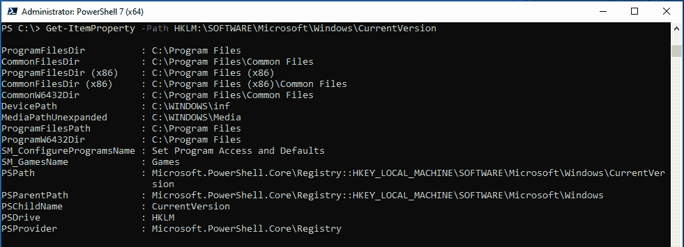
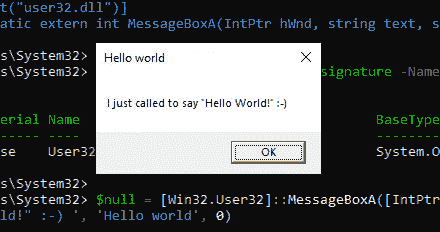

# 第五章：PowerShell 强大——系统和 API 访问

当你以为 PowerShell 已经是一个强大的工具时，准备好惊讶于它深入系统的能力。在本章中，我们将探索如何使用 PowerShell 访问系统和 API。

我们将从 Windows 注册表开始，了解如何利用 PowerShell 轻松访问其键和值。接着，我们将深入 .NET 框架和 Windows API，你将学习如何直接从 PowerShell 执行 C# 代码。

接下来，我们将探索 **Windows 管理工具**(**WMI**)，它可以用来通过标准接口访问和管理各种系统资源，包括硬件、软件、网络组件以及其他对象。PowerShell 使得与 WMI 交互、自动化任务和操作数据变得简单。

在本章中，你还将学习如何在不执行 `powershell.exe` 的情况下运行 PowerShell 命令。你将学习如何直接在其他应用程序中，甚至在内存中运行 PowerShell 代码。

你将学习如何识别潜在威胁并保护你的环境免受这些类型的攻击。所以，准备好发现 PowerShell 在系统和 API 访问方面的强大功能吧。让我们开始吧！本章将涵盖以下内容：

+   熟悉 Windows 注册表

+   Windows API 基础知识

+   探索 .NET 框架

+   了解 **组件对象模型**(**COM**) 和 COM 劫持

+   **通用信息模型**(**CIM**)/WMI

+   无需 `powershell.exe` 运行 PowerShell

# 技术要求

为了充分利用本章的内容，请确保你具备以下条件：

+   PowerShell 7.3 及以上版本

+   安装了 Visual Studio Code

+   安装了 Visual Studio 用于 C# 代码编写

+   C、C++ 或 C# 知识和/或阅读 C 代码的能力

+   如何使用编译器的知识，特别是 C/C++/C#

+   Visual Basic 知识和/或阅读 Visual Basic 代码的能力

+   访问 Microsoft Excel 或 Office 套件中的其他工具，以运行宏

+   访问 GitHub 仓库以获取 **第五章：** [`github.com/PacktPublishing/PowerShell-Automation-and-Scripting-for-Cybersecurity/tree/master/Chapter05`](https://github.com/PacktPublishing/PowerShell-Automation-and-Scripting-for-Cybersecurity/tree/master/Chapter05)

# 熟悉 Windows 注册表

Windows 注册表在 `Windows 3.1` 中引入。尽管当时它主要存储 COM 基于组件的信息，但它随着时间的推移得到了发展。如今，它作为我们熟知的层次化数据库——存储 Windows 操作系统的低级配置设置以及在其上运行的应用程序的配置。

虽然你可以通过多种方式访问注册表，但本节将重点介绍如何使用 PowerShell 访问和操作注册表。

现代系统的 Windows 注册表通常由五个根键组成。每个根键都有各自的目的，并包含不同的设置：

+   `HKEY_CLASSES_ROOT** (`HKCR**): 此根键下的分支包含有关 COM 类注册信息和文件关联的信息。

+   `HKEY_CURRENT_USER** (`HKCU**): 包含特定于当前登录用户的设置。从技术上讲，此根键只是一个符号链接，指向 `HKU\<CurrentUserSid>\`。

+   `HKEY_LOCAL_MACHINE** (`HKLM**): 特定于本地计算机的设置。

+   `HKEY_USERS** (`HKU**): 每个活动加载在机器上的用户配置文件的子键（类似于 `HKEY_CURRENT_USER`，但不仅限于当前登录用户）。

+   `HKEY_CURRENT_CONFIG** (`HKCC**): 此根键下的分支本身不存储任何信息，而是作为指向保留有关当前硬件配置文件信息的注册表键的指针。

PowerShell 将注册表视为虚拟驱动器；您可以使用与导航和编辑文件和文件夹相同的命令访问和修改它。

## 使用注册表

使用 `Get-PSDrive` cmdlet，您可以获取当前会话的所有驱动器。如果进一步检查输出，您会看到不仅列出了系统驱动器。`HKCU` 和 `HKLM` 注册表根键也可以在此处找到：


图 5.1 – 使用 Get-PSDrive 查找 HKCU 和 HKLM 注册表根键

由于像 `HKCU` 和 `HKLM` 这样的 PSDrive 被视为常规文件驱动器，因此您可以使用 `Set-Location`（或等效的别名 **cd**）以及 `Get-ChildItem`（或别名 **ls**）来浏览它们以列出文件夹的内容，这并不奇怪。

在下面的示例中，我从注册表中查询当前的 Windows PowerShell 版本：


图 5.2 – 浏览注册表

在前面的屏幕截图中，您可以看到所有子注册表键（名称），以及属于每个注册表键的所有注册表条目（在此上下文中也称为 **Property**）。

通过使用 `Registry::` 后跟要查询的根键，还可以浏览注册表的其他位置，而不仅限于列出的驱动器。在下面的屏幕截图中，我使用 `Foreach-Object` 显示所有子注册表键的键名：


图 5.3 – 使用 Registry:: 前缀浏览注册表

使用注册表键类似于处理文件和文件夹，但在处理注册表条目时仍然存在差异。它们不仅由键组成，还包括属性和值，正如您可以在下面的屏幕截图中看到的：


图 5.4 – 使用 Get-Item 显示注册表键的属性和值

当处理具有大量子键和属性的注册表键时，你可能希望快速获取所有子键的列表。你可以通过使用 `ForEach-Object Name` 来实现：


图 5.5 – 显示所有子注册表键

在这张截图中，我们首先使用 `Set-Location` cmdlet 将工作目录更改为 `HKLM:\SOFTWARE\Microsoft\Windows\`，然后使用 `Get-ChildItem` 查询注册表。这样，如果你想在该位置执行进一步的命令，就不需要一遍又一遍地输入完整路径了。

如果你不确定某个特定的注册表键的位置，可以像使用以下命令*搜索*驱动器上的特定文件一样，递归查询注册表：

```
> Get-ChildItem -Path "HKLM:\SOFTWARE\Microsoft\PowerShell" -Recurse -ErrorAction SilentlyContinue | Where-Object {$_.Name -like "*PowerShellEngine*"}
```

使用 `New-Item` cmdlet，你可以创建一个新的注册表键，而使用 `Remove-Item`，你可以删除一个或多个注册表键，如下图所示：


图 5.6 – 创建和删除注册表键

使用 `Remove-Item` 和 `-Recurse` 参数，可以递归删除注册表键及其子键，而无需确认提示。

### 注册表条目属性

你现在已经知道如何操作注册表键和如何显示它们的属性，但当涉及到注册表时，你还需要了解如何操作属性。

如前所述，虽然操作注册表类似于处理文件和文件夹，但在注册表条目的属性方面存在一些差异：文件有 `LastWriteTime` 等属性，而注册表条目则有其独特的属性集。

获取属性的快捷方法之一是使用 `Get-Item`，但还有另一个 cmdlet 可以帮助你获取更多细节 —— `Get-ItemProperty`：



图 5.7 – 使用 Get-ItemProperty 显示注册表条目

通过使用 `*-ItemProperty` cmdlets，你还可以管理注册表条目。例如，要创建一个新的注册表条目，`New-ItemProperty` cmdlet 可以帮助你。以下截图中，我为所有用户创建了一个新的启动文件夹条目，并使用 `Remove-ItemProperty` 删除了它：


图 5.8 – 创建和删除新的注册表条目

还可以通过使用 `Set-ItemProperty` cmdlet 更改注册表条目。以下示例演示了如何使用 `Set-ItemProperty` 修改现有的启动项条目以更改脚本的路径：


图 5.9 – 修改注册表项

顺便说一下，攻击者也喜欢创建启动项！例如，这是建立持久性的一种方式。所以，如果你在 PowerShell 日志中遇到类似于前面代码的内容，而你自己并未创建它，那可能是攻击者试图修改启动项以运行他们的恶意软件，而不是其原本预定的目的。

你可以通过以下帮助系统命令获得更多关于如何使用 PowerShell 操作注册表的信息：

+   `Get-Help Registry`

+   `Get-Help about_Providers`

此外，了解如何使用注册表进行安全性相关操作对防守者至关重要。接下来让我们探讨一些最常见的使用场景。

## 安全性使用场景

攻击者查询或尝试修改注册表的使用场景有很多种——防守者也应该熟悉这些场景。让我们先来探索一些最常见的场景。

### 侦察

攻击者经常访问注册表以了解更多关于当前目标系统的信息：是否在使用反恶意软件解决方案，攻击者的代码是否需要额外的步骤来避免被检测到？是否有备份解决方案可以防止勒索软件攻击成功？

注册表也常常被查询，以了解更多关于系统和配置的（安全）选项。有些对手还会尝试找出当前执行代码的系统是否是**虚拟机**（**VM**）或**沙箱**。

虚拟机（VM）是一个模拟计算机，它托管在另一个计算机上，即虚拟机监控程序（hypervisor）。它不需要自己的硬件，因为它与许多其他虚拟机共享虚拟机监控程序的硬件。沙箱是一个系统，通常由安全研究人员甚至反恶意软件解决方案使用，用来引爆潜在的恶意软件并测试它的行为以及是否真的是恶意的。攻击者通常希望避免其软件在虚拟机或沙箱中运行，因为这可能意味着有人正在分析他们的恶意软件，并建立防护措施来应对它。

如果是这种情况，并且恶意软件是在虚拟机（VM）或沙箱中执行的，它通常会被实现为使软件的行为与在真实用户使用的物理工作设备上执行时不同——以此来复杂化其代码的逆向工程，从而延长其保持隐蔽的时间。

回到注册表——将凭证存储在注册表中是一个非常不好的做法，应该避免。然而，仍然有管理员和软件供应商以非常不安全的方式使用注册表存储凭证。因此，攻击者曾被观察到查询注册表以检索凭证。

一些恶意软件甚至会将注册表用于它们自己的目的，设置并查询它们自己的注册表树或键。

请记住，当你在寻找侦察证据时，攻击者也有其他（编程）选项来查询注册表——例如`reg.exe`命令行工具或 WMI。

### 执行策略

在*第一章*《PowerShell 入门》中，我们了解到`ExecutionPolicy`限制了在本地计算机上执行脚本—尽管这并不是一种安全控制。然而，`ExecutionPolicy`的状态也可以通过注册表查询或修改：


图 5.10 – 使用注册表更改 Windows PowerShell ExecutionPolicy

使用注册表更改`ExecutionPolicy`只对 Windows PowerShell 有效。因此，你可以在前面的截图中看到，首先，Windows PowerShell 的`ExecutionPolicy`显示为`Restricted`，但在配置注册表条目后，它变为`Unrestricted`。

PowerShell Core 的`ExecutionPolicy`定义在以下文件中：`C:\Program Files\PowerShell\7\powershell.config.json`。

### 持久性

攻击者尝试编辑注册表的另一个原因是为了建立持久性：建立持久性的常见方法之一是添加启动项。这可以通过在当前用户或所有用户的启动文件夹中添加链接来完成。

另一种通过启动项建立持久性的方式是通过在以下启动项注册表位置之一下添加`Run`或`RunOnce`注册表键：

+   `HKEY_LOCAL_MACHINE\Software\Microsoft\Windows\CurrentVersion\`

+   `HKEY_CURRENT_USER\Software\Microsoft\Windows\CurrentVersion\`

+   `HCU\.DEFAULT\Software\Microsoft\CurrentVersion\`

请注意，`.DEFAULT`也可以替换为相应文件夹下`HKEY_USERS`中的用户**安全标识符**（**SIDs**）。

`Run`键在每次用户登录时执行程序，而`RunOnce`键只执行一次程序，然后删除该键。这些键可以为用户或计算机设置。

例如，要为当前用户设置一个`RunOnce`键，在用户登录后执行脚本*一次*，你可以使用以下代码：

```
> New-ItemProperty -Path HKCU:\SOFTWARE\Microsoft\Windows\CurrentVersion\RunOnce\ -Name "HelloWorld" -Value "C:\Users\ADMINI~1\AppData\Local\Temp\HelloWorld.ps1"
```

要为本地计算机设置一个`Run`键，使其在每次启动计算机时执行脚本，请使用以下命令：

```
> New-ItemProperty -Path HKLM:\SOFTWARE\Microsoft\Windows\CurrentVersion\Run\ -Name "HelloWorld" -Value "C:\Users\ADMINI~1\AppData\Local\Temp\HelloWorld.ps1"
```

此外，攻击者还可以通过直接写入他们各自的`Run**/**RunOnce`键到`HKU\<TargetSID>\Software\Microsoft\CurrentVersion\`下的相应位置，来在其他用户的启动项下建立持久性，前提是他们拥有必要的权限。

现在我们已经探讨了 Windows 注册表，让我们深入了解与安全性相关的另一个重要部分：本地用户权限。

# 用户权限

用户权限在企业环境中发挥着重要作用：例如，你可以配置谁可以登录哪个系统，以及谁可以做什么。配置错误可能导致严重的身份盗窃和横向移动风险。

对手可以利用它来查明哪些帐户值得被攻击，以提升他们的特权。

你可以在官方文档中找到所有用户权限的详细概述：[`docs.microsoft.com/en-us/windows/security/threat-protection/security-policy-settings/user-rights-assignment`](https://docs.microsoft.com/en-us/windows/security/threat-protection/security-policy-settings/user-rights-assignment)。

我知道文档内容非常庞杂，如果你还没有用户权限的经验，可能会很快迷失其中。因此，让我来解释一些最常见的安全相关用户权限，我经常看到它们被错误配置。

## 配置访问用户权限

通常来说，登录权限非常重要，如果允许过多的用户或组访问敏感系统，可能会带来安全隐患。许多默认权限在系统安装时已被预设，并且可能需要修改以加固系统安全。

根据你为其配置此策略的机器类型，你可能需要限制本地登录或通过远程桌面登录的能力，只允许用户和/或特定的管理员帐户：

+   **从网络访问此计算机**(**SeNetworkLogonRight**)：对于**域控制器**（**DC**），所有经过身份验证的用户都需要访问域控制器以应用组策略，因此需要配置**管理员**和**已验证用户**访问域控制器。移除内建组。

移除**所有人**、**用户**以及成员服务器的内建组。对于客户端计算机，仅允许用户和管理员登录。

+   **允许本地登录**(**SeInteractiveLogonRight**)：移除**访客**和内建组。如果是域控制器或成员服务器，还需要移除**用户**。

+   **允许通过远程桌面` `服务**(**SeRemoteInteractiveLogonRight**) 登录

+   **作为批处理作业登录**(**SeBatchLogonRight**)

+   **作为服务登录**(**SeServiceLogonRight**)

*拒绝*规则会覆盖*允许*权限：无论你配置了什么样的*允许*规则，如果*拒绝*规则禁止访问，相关用户将无法登录或访问机器：

+   **拒绝通过网络访问此计算机**(**SeDenyNetworkLogonRight**)

+   **拒绝作为批处理作业登录**(**SeDenyBatchLogonRight**)

+   **拒绝作为服务登录**(**SeDenyServiceLogonRight**)

+   **拒绝本地登录**(**SeDenyInteractiveLogonRight**)

+   **拒绝通过远程桌面` `服务**(**SeDenyRemoteInteractiveLogonRight**) 登录

这些规则可以帮助你在环境中建立一个稳固的分层概念。

除非你的特定配置要求，否则不要移除**访客**的**拒绝登录`/`访问**权限。

## 通过备份和恢复权限来降低风险

备份和恢复权限非常强大，因为它们允许用户访问和修改通常无法访问的文件和目录。在关键系统（如域控制器）上，仔细评估哪些用户配置了这些权限非常重要。这些权限可能会让攻击者提取敏感信息，具体如下：

+   **备份文件和` `目录**(**SeBackupPrivilege**)

+   **恢复文件和` `目录**(**SeRestorePrivilege**)

重要的是要注意，备份权限允许用户读取任何文件，无论他们的正常权限是什么。这意味着拥有备份权限的用户也可能访问敏感信息，例如，在 DC 上的`ntds.dit`数据库文件中存储的密码哈希。另一方面，恢复权限允许用户写入任何文件，这可能被用来植入恶意代码或修改关键系统文件。

默认情况下，内置的**备份操作员**组被分配了这两项权限。如果你打算删除该组，请小心，因为某些备份软件依赖该组才能正常运行。尽可能地，将备份和恢复权限仅分配给特定的用户或组，而不是依赖于内置的**备份` `操作员**组。

## 委派和 impersonation（身份冒充）

拥有委派权限的人可以将权限委派给另一个帐户。身份冒充允许冒充另一个帐户，通常由 Web 服务器在用户上下文中访问资源。如果配置错误，这两者可能会带来严重后果：

+   **启用计算机和用户帐户信任委派**(**SeEnableDelegationPrivilege**): 如果一个帐户被信任进行委派，这意味着该帐户可以设置*信任委派*设置。一旦设置，这项设置将允许在保持原始帐户凭证的情况下连接到多个服务器或服务。Web 服务器需要使用原始凭证连接到数据库或数据共享，这是一个合理的*信任* *委派*的用例。

然而，除非某些软件确实需要，否则你应该避免配置此项权限。

+   **身份冒充客户端（身份验证后）**(**SeImpersonatePrivilege**): 身份冒充允许服务或线程在不同的安全上下文下运行。如果配置错误，这种能力可能使攻击者欺骗客户端连接到攻击者创建的服务，然后冒充连接的客户端来提升攻击者的权限。

+   **作为操作系统的一部分**(**SeTcbPrivilege**): 该权限允许帐户控制系统并充当任何用户。此设置决定一个进程是否可以获得任何用户的身份，从而访问该用户可以使用的资源。

## 防止事件日志篡改

如果你可以访问审计和安全日志，你可以篡改它并隐藏你的痕迹。以下设置会影响对审计和安全日志的访问，应该小心配置：

+   **生成安全审计**（**SeAuditPrivilege**）：尽管此权限仅允许生成新事件，但攻击者可以制造大量噪音，使他们的攻击尝试未被注意到，尤其是在公司未转发事件日志且在达到一定数量后会删除日志的情况下。

+   **管理审计和安全日志**（**SeSecurityPrivilege**）：如果您可以管理事件日志，那么您肯定也能删除它们。请在系统事件日志中查找事件 ID `104`。有关监控和检测的更多信息，请参阅 *第四章*，*检测 – 审计与监控*。

## 防止 Mimikatz 和凭证窃取

Mimikatz 和其他用于凭证窃取的工具通常需要调试程序的权限或加载内核模式驱动程序的权限。以下设置通常是 Mimikatz 等工具提取凭证时所需的：

+   **调试程序**（**SeDebugPrivilege**）：关于**调试程序**权限的一个常见误解是，开发人员需要此权限来调试他们的软件。其实并非如此。调试程序权限允许访问本应受到保护的操作系统内存，实际上提供了对程序执行的控制能力以及读取和写入内存的能力。像 Mimikatz 这样的工具，访问 **本地安全机构**（**LSA**）以提取凭证，需要此权限才能正常工作。

通常情况下，您的管理员不需要此用户权限，因此，即使是管理员也可以安全地撤销此权限。

请注意，管理员可以将此权限分配给自己；因此，移除此权限并监控其变更非常重要。通过这种方式，您可以发现凭证窃取攻击开始的迹象。

+   **加载和卸载设备驱动程序**（**SeLoadDriverPrivilege**）：此权限使用户帐户能够加载内核模式驱动程序。由于这些驱动程序位于内核模式内存中，因此它们可以用于读取或篡改其他内核模式内存，类似于**调试程序**权限。授予此用户权限时请谨慎。

## 系统和域访问

获取系统访问权限或将计算机添加到域对于攻击者来说非常有价值。以下设置与这些场景相关：

+   **将工作站添加到域**（**SeMachineAccountPrivilege**）：此权限允许用户将工作站添加到域中。

## 时间篡改

操作系统的时间篡改默认情况下不被视为安全漏洞，并且不应与 **时间戳篡改** 混淆，后者涉及修改文件创建、访问、修改等时间戳。然而，重要的是要意识到，某些程序在系统时间被篡改时可能会遇到问题，且不正确的时间戳可能导致在事件日志分析过程中得出不准确的结论。为了避免这些情况，以下设置应谨慎配置：

+   **更改系统` `时间**（**SeSystemtimePrivilege**）

+   **更改时间` `时区**（**SeTimeZonePrivilege**）

当然，这只是我见过的多数配置错误的用户权限的总结，并非完整列表。请参考官方文档并跟随链接阅读有关每个用户权限的更多信息：[`docs.microsoft.com/en-us/windows/security/threat-protection/security-policy-settings/user-rights-assignment`](https://docs.microsoft.com/en-us/windows/security/threat-protection/security-policy-settings/user-rights-assignment)。

如果您想了解哪些内置组默认分配了哪些用户权限，以下文档会非常有帮助：[`docs.microsoft.com/en-us/previous-versions/windows/it-pro/windows-server-2012-r2-and-2012/dn487460(v=ws.11)`](https://docs.microsoft.com/en-us/previous-versions/windows/it-pro/windows-server-2012-r2-and-2012/dn487460(v=ws.11))。

您也可以使用`Policy Analyzer`来分析并将您的设置与官方的 Microsoft 推荐进行比较。我们将在第*6 章*中进一步探讨 Policy Analyzer，章节内容包括*Active Directory – 攻击与缓解*。

但是，Policy Analyzer 并不是分析和比较用户权限分配的唯一方式——接下来我们将看看如何验证已设置的权限以及如何配置它们。

## 检查和配置用户权限

如果您想检查本地计算机上配置了哪些用户权限，可以运行以下命令：

```
> SecEdit.exe /export /areas USER_RIGHTS /cfg $Env:Temp\secedit.txt
```

如果您想导出本地和域管理的合并策略，可以使用`/****mergedpolicy`参数：

```
> SecEdit.exe /export /mergedpolicy /areas USER_RIGHTS /cfg $Env:Temp\secedit.txt
```

所有当前的用户权限将被写入`$Env:Temp\secedit.txt`。在`[Privilege Rights]`部分，您可以找到所有已配置的权限分配。使用`secedit`时，仅会显示 SIDs，因此您需要将其转换为真实的用户账户名称。


图 5.11 – secedit 文件中的权限设置

您可以在官方文档中找到更多关于`secedit`的其他参数和使用信息：[`docs.microsoft.com/en-us/previous-versions/windows/it-pro/windows-xp/bb490997(v=technet.10)`](https://docs.microsoft.com/en-us/previous-versions/windows/it-pro/windows-xp/bb490997(v=technet.10))。

我编写了一个脚本，`Get-UserRightsAssignment`，它可以帮助您将 SIDs 转换为账户名称，并简化用户权限的处理。您可以使用`-Path`参数指定一个自定义位置，保存`secedit`生成的文件：

```
> Get-UserRightsAssignment.ps1 -Path C:\tmp\secedit.txt
```

`secedit`文件将在脚本执行完毕后删除。如果没有指定`-Path`，默认路径将是`$env:TEMP\secedit.txt`。由于脚本使用了`secedit`工具，您需要具有管理员权限才能执行该脚本。

你可以在本书的 GitHub 仓库中找到并下载`Get-UserRightsAssignment`脚本：[`github.com/PacktPublishing/PowerShell-Automation-and-Scripting-for-Cybersecurity/blob/master/Chapter05/Get-UserRightsAssignment.ps1`](https://github.com/PacktPublishing/PowerShell-Automation-and-Scripting-for-Cybersecurity/blob/master/Chapter05/Get-UserRightsAssignment.ps1)。

你还可以使用组策略配置环境中多个计算机和/或服务器的用户权限分配。

创建一个新的**组策略对象**（**GPO**），并导航至**计算机配置** | **Windows 设置** | **安全设置** | **本地策略** | **用户权限分配**。


图 5.12 – 通过组策略配置用户权限分配

双击每个你想要配置的策略设置。会打开一个窗口。要配置该设置，勾选**定义这些策略设置**框，并使用**添加用户或组**来添加额外的用户或组，如下截图所示：


图 5.13 – 配置本地登录权限设置

在**解释**标签下，你可以找到更多关于此设置的功能说明，并且通常还会有一些有用的链接，提供更多关于此设置的详细信息。

如果你配置了用户权限分配并在系统上评估 GPO，你会发现一个类似的文件被创建，就像你手动创建它一样。你可以使用它来比较设置，或者将一个手动预配置的`secedit`文件放在这里，避免通过 GPO 界面手动配置所有设置。

例如，在我的域 `PSSec.local` 中，我创建了一个唯一 ID 为 `{B04231D1-A45A-4390-BB56-897DA6B1A910}` 的 GPO。如果我想访问新创建的 `secedit` 配置，只需导航到以下路径并查看 `GptTmpl.inf` 文件：

```
\\pssec.local\SYSVOL\PSSec.local\Policies\{B04231D1-A45A-4390-BB56-897DA6B1A910}\Machine\Microsoft\Windows NT\SecEdit
```

当然，你也可以直接将现有 Microsoft 安全基线中的`GptTmpl.inf`文件复制到新创建的 GPO 中，只配置 Microsoft 推荐的设置。Microsoft 安全基线是 Microsoft 提供的一种配置建议，旨在提供安全最佳实践。我们将在*第六章*中进一步了解基线，主题包括*Active Directory – 攻击*和*缓解*。

在前一节中探索完 Windows 用户权限后，我们现在将重点关注 Windows 操作系统的另一个重要组件——Windows API。

# Windows API 基础

Windows **应用程序编程接口**（**API**），也称为 Win32 或 WinAPI，是一组库、函数和接口，提供对 Windows 操作系统各种功能和组件的底层访问。它允许开发者直接访问系统功能和硬件，简化对操作系统深层次功能的访问。Windows API 函数是用 C/C++ 编写的，并通过 DLL 文件（如`kernel32.dll` 或 **user32.dll**）暴露给开发者使用。

Windows API 被实现为一组**动态链接库**（**DLLs**），这些库在应用程序需要使用时被加载到内存中。这些 DLL 包含构成 API 的函数和过程。当应用程序调用 API 中的某个函数时，它本质上是在向操作系统发送一条消息，要求执行某个任务。操作系统随后从适当的 DLL 中执行相应的函数，并将结果返回给应用程序。

现如今，*Windows API* 或 *WinAPI* 这个名称指代多个版本，尽管为不同平台实现的版本仍可以按照它们自己的名字来称呼（例如 *Win32 API*）：

+   `Win16 API`：第一个 API 版本是 Win16 API，它是为 16 位平台开发的，但现在已不再支持。

+   `Win32 API`：Windows 32 API 目前仍在所有现代 Windows 系统中使用，并且是在 Windows NT 和 Windows 95 时引入的。

+   `Win32s API`：这是 Windows 3.1 系列的 Windows 32 API，因此是 32 位的扩展，因为该系列的系统最初仅支持 16 位。`s`代表**子集**。

+   `Win64 API`：该 API 是现代 64 位操作系统的变体，并在 Windows XP 和 Windows Server 2003 中引入。

+   `Windows Native API`：当其他 API，如 Win32 API 尚不可访问时，使用原生 API——例如，在系统启动时。与在**微软开发者网络**（**MSDN**）中有良好文档支持的 Win32 API 函数（如**kernel32.dll**）不同，需要注意的是，通过`NTDLL.DLL`导出的原生 API 并不被视为“契约性”接口。这意味着，`NTDLL.DLL` 导出的函数行为和定义可能会随时间变化。

Windows API 函数完全使用 C、C++ 和汇编语言编写，因此开发者可以在自己的函数中使用这些函数。Win32 API 本身非常庞大，因此需要多个 DLL 文件来导出完整的功能。

如今，有多个分层的 API，它们简化了访问，开发者无需直接使用 Win32 或 Win64 API。

一些建立在 Windows API 基础上的 API 如下：

+   `WinRT`：Windows 运行时 API 首次出现在 Windows 8/Windows Server 2012 中。WinRT 基于 COM，并使用 C++实现。它使开发人员可以用其他语言编写代码，如 C++、C#、Visual Basic .NET、Rust/WinRT、Python/WinRT 以及 JavaScript/TypeScript。

+   `COM`：COM 是 API 的一部分，是一种进程间通信技术。我们将在本章后面深入探讨它。

+   `.NET**/**.NET Framework`：.NET Framework 是微软开发的软件框架，提供大量预构建的函数和 API，开发人员可以利用这些函数和 API 在 Windows 上构建应用程序。

从 PowerShell 访问 Windows API 的一种方式是通过使用.NET Framework。这使你可以访问 Windows API 提供的相同功能，但可以在 PowerShell 内部进行操作。它允许你以更低的级别与操作系统进行交互，并执行一些标准 PowerShell cmdlet 无法实现的任务。我们将在本章后面详细了解.NET Framework。

以下列表是可以利用的不同 API 类别：

+   **用户界面**：提供用于创建和管理用户界面元素的功能，如窗口、按钮和菜单。

+   **Windows 环境（Shell）**：包括与 Windows Shell 交互的功能，Windows Shell 是图形用户界面，提供对文件系统和其他系统资源的访问。

+   **用户输入与消息传递**：通过此接口提供处理用户输入和消息传递的功能，如键盘和鼠标事件、窗口消息以及系统通知。

+   **数据访问与存储**：Windows API 提供用于处理数据和存储的功能，包括文件和注册表访问、数据库连接以及数据加密。

+   **诊断**：该接口提供访问系统性能监控、事件日志记录和故障排除错误功能的能力。

+   **图形与多媒体**：提供用于处理图形、多媒体和游戏开发的功能，包括 DirectX 和 Windows Media。

+   **设备**：Windows API 包含与硬件设备交互的功能，如打印机、扫描仪和摄像头。

+   **系统服务**：包含管理系统服务的功能，如启动和停止进程及管理系统资源。

+   **安全与身份**：安全与身份接口包括用于管理用户身份验证、访问控制和加密的功能。

+   **应用程序安装与维护**：包括安装和卸载应用程序、管理更新以及处理应用程序错误的功能。

+   **系统管理与维护**：包含管理系统设置、性能和安全性，以及自动化管理任务的功能。

+   **网络和互联网**：Windows API 包括用于网络和互联网连接的函数，包括 TCP/IP、套接字和 Web 服务。

+   **已弃用或遗留的 API**：为了与旧版本的应用程序和系统保持向后兼容，Windows API 还包括一些较旧的函数和接口。

+   **Windows 和应用程序 SDK**：除了之前列出的 API 类别外，还有用于 Windows 和应用程序开发的 **软件开发工具包**（**SDK**）。PowerShell 就是一个使用 Windows API 和 .NET Framework 的 SDK 示例。`System.Management.Automation` 程序集包含了用于在 .NET 应用程序中与 PowerShell 交互的类和 cmdlet。

一些最常用的 Windows API 函数包括与进程和线程管理、内存管理、文件和目录管理以及注册表操作相关的函数。这些函数可以用来执行多种任务，如枚举进程和线程、读写内存、创建和删除文件与目录，以及操作 Windows 注册表。

当然，还有许多其他的 API，但在本书中我不会集中讨论它们。有关可以访问的 Windows API 函数和结构的完整概述，请参见：[`docs.microsoft.com/en-us/windows/win32/apiindex/windows-api-list`](https://docs.microsoft.com/en-us/windows/win32/apiindex/windows-api-list)。

# 探索 .NET Framework

`.NET Framework` 是微软开发的软件框架，提供了广泛的功能，用于构建和运行应用程序。自 Windows Vista 以来，它成为了每个 Windows 安装的默认部分。框架的一个关键特性是能够访问系统和 API 资源，使其成为一个强大的工具。

.NET Framework 包含两个主要组件：

+   **公共语言运行时**（**CLR**）：

这是 .NET 的运行时引擎；它还包含一个 **即时编译**（**JIT**）编译器，用于将 **公共中间语言**（**CIL**）的字节码转换为底层编译器生成的机器代码，从而在计算机特定架构上执行。

CLR 还包括线程管理、垃圾回收、类型安全、代码访问安全、异常处理等功能。

每个 .NET Framework 版本都有其自己的 CLR。

+   **.NET Framework 类库**（**FCL**）：

FCL 是一个包含常见功能类型和 API 的大型集合——例如，用户界面服务、连接数据库、网络等。

.NET 应用程序可以使用 C#、F#、Visual Basic 等编写，这些语言也在非 Windows 系统（如 Linux 或 macOS）上受支持。在仅限 Windows 的系统中，C++ 也可以使用。

一旦代码用 .NET Framework 兼容的语言编写，代码会被编译成 CIL，并通常存储在程序集（`.dll` 或 `.exe` 结尾）中。例如，要编译 C# 源代码文件，.NET Framework 会自带自己的编译器——`csc.exe`，这个编译器可以在 Windows 10 计算机上的 CLR 目录下找到：`C:\Windows\Microsoft.NET\Framework64\v4.0.30319\csc.exe`。

然后，编译器将编译后的 CIL 代码以及清单写入输出文件的只读部分，该部分有一个标准的 PE 头（Win32 可移植可执行文件），并将其保存为程序集文件（通常是以 `.exe` 结尾的文件——具体取决于您选择的输出格式）：


图 5.14 – .NET 框架如何编译应用程序

CIL 代码不能直接执行；它需要由 CLR 首先通过 JIT 编译成机器代码。因此，运行应用程序的系统上需要有 CLR。

当新编译的程序集执行时，CLR 会通过使用 JIT 编译器即时编译该程序集。然后，程序集被转换为机器代码，可以在启动应用程序的机器架构上运行。

## .NET Framework 与 .NET Core

随着跨平台和云应用的兴起，微软在 2016 年发布了 .NET Core，这是一个轻量级且模块化的框架版本。设计上可以在多个平台上运行，包括 Windows、macOS 和 Linux，.NET Core 可用于开发 Web、桌面、移动、游戏和物联网（IoT）应用。

后来，`.NET Core` 被更名为 `.NET`，而专为 Windows 设计的分支现在被称为 `.NET Framework`。

在下图中，我们将更深入地了解 .NET Framework 和 .NET 之间的相似性和差异：


图 5.15 – 比较 .NET 和 .NET Core

总体而言，.NET 是一个更轻量和模块化的框架，优化了构建现代、云端和容器化应用的能力，而 .NET Framework 是一个全面的框架，旨在支持广泛的编程场景，包括大规模企业应用和遗留系统。

## 使用 .NET Framework 编译 C# 代码

可以通过使用命令行编译器 `csc.exe` 在 .NET Framework 和 PowerShell 中编译 C# 代码。此编译器随每个 .NET Framework 的安装一起提供。请注意，`csc.exe` 编译器可以运行任何 `.cs` 文件，并且不需要 PowerShell 执行它。然而，为了完整性，我们将在本节中介绍如何从 PowerShell 使用 `csc.exe`。

要使用 `csc.exe` 编译 C# 文件，请导航到包含该文件的目录并运行以下命令：

```
> C:\Windows\Microsoft.NET\Framework\v4.0.30319\csc.exe /out:<output_file_name> <input_file_name>
```

`/out`选项指定输出文件的名称，`<input_file_name>`指定要编译的 C#文件的名称。例如，要编译名为`MyProgram.cs`的文件并生成名为`MyProgram.exe`的可执行文件，请运行以下命令：

```
> C:\Windows\Microsoft.NET\Framework\v4.0.30319\csc.exe /out:MyProgram.exe MyProgram.cs
```

要运行编译后的可执行文件，只需在 PowerShell 控制台中输入文件名：

```
> .\MyProgram.exe
```

下面是一个示例，展示了如何使用 PowerShell 编译和运行一个简单的`"Hello, World!"`程序：

```
$code = @"
using System;
class Program {
    static void Main(string[] args) {
        Console.WriteLine("Hello World!");
    }
}
"@
$code | Out-File -FilePath MyProgram.cs
C:\Windows\Microsoft.NET\Framework\v4.0.30319\csc.exe /out:MyProgram.exe MyProgram.cs
.\MyProgram.exe
```

编译后，运行`MyProgram.exe`将在控制台输出`"Hello World!"`，如下图所示：


图 5.16 – 使用 csc.exe 编译 C 代码并执行

`Out-File` cmdlet 用于在编译之前将 C#代码写入名为`MyProgram.cs`的文件。然后可以使用`csc.exe`编译器编译此文件，生成的可执行文件可以使用`.\MyProgram.exe`运行。

## 使用 Add-Type 与.NET 直接交互

从 PowerShell 访问 Windows API 的最简单方法是使用`Add-Type` cmdlet。通过使用`Add-Type`，可以从 PowerShell 命令行编译并运行.NET 代码。`Add-Type` cmdlet 允许你在 PowerShell 会话中定义和创建.NET Core 类。通过此 cmdlet，你可以轻松将自定义对象集成到 PowerShell 代码中，并访问.NET Core 库。通过将 C#代码传递给`Add-Type` cmdlet 的`-TypeDefinition`参数，调用新定义的 C#函数时，你的代码将实时编译。

在以下示例中，我编写了一个名为`DirectoryTest`的小型 C#类，其中包含`GetDirectories`函数。`GetDirectories`检查传递给该函数的路径是否可访问，并将该路径包含的所有文件和文件夹输出到命令行。如果路径不存在或不是有效路径，则返回的输出将为空。

你可以在本书的 GitHub 仓库中找到代码：[`github.com/PacktPublishing/PowerShell-Automation-and-Scripting-for-Cybersecurity/blob/master/Chapter05/Invoke-GetDirectoriesUsingAddType.ps1`](https://github.com/PacktPublishing/PowerShell-Automation-and-Scripting-for-Cybersecurity/blob/master/Chapter05/Invoke-GetDirectoriesUsingAddType.ps1)。

首先，你需要使用 C#创建一个没有错误的类进行编译和运行。在我的示例中，我首先将 C#代码加载到`$Source`变量中，这样我可以稍后访问它：


图 5.17 – 将 C#类存储在源变量中

`Add-Type` 允许你在 PowerShell 会话中定义并使用 .NET Core 类。这个 .NET Core 类可以像本示例中一样指定在变量内，也可以内联指定，或者通过二进制文件或源代码文件提供。以下截图展示了`Add-Type`的使用：


图 5.18 – 将源代码加载到当前 PowerShell 会话

现在我们可以直接与类交互，并使用 `C:\` 参数调用 `GetDirectories` 函数，指定应该查询哪些路径的目录：


图 5.19 – 执行 DirectoryTest 类中的 GetDirectories 函数

结果 – 所有 `C` 分区的子文件夹都被返回。

也许你现在在问自己，“*但是如果我已经有了 PowerShell，为什么还要查询 Windows API 呢？*” 好吧，有几个原因可能会让你倾向于使用 API 而非 PowerShell。一个原因是，API 可以提供一些本地 PowerShell 可能无法提供的低级功能。通过 `P/Invoke` 直接访问原生 Windows API 并执行非托管代码，可能是另一个原因。

通过使用 API，你可以创建钩子（这是一种通过注入自定义代码使代码行为与原始设计不同的技术）、拦截系统事件、操作系统设置、监视系统资源、跟踪用户活动，甚至操控系统进程的行为，这对于各种目的都很有用，比如红队禁用防病毒软件或提升权限。

要了解更多关于`Add-Type`的信息，请参考官方的`Add-Type`文档：[`learn.microsoft.com/en-us/powershell/module/microsoft.powershell.utility/add-type`](https://learn.microsoft.com/en-us/powershell/module/microsoft.powershell.utility/add-type)。

## 从 PowerShell 加载自定义 DLL

还有一种方法是在 PowerShell 中加载已编译的自定义 DLL。当然，你也可以先使用 `csc.exe` 编译你自己的程序。

你可以在本书的 GitHub 仓库中找到我们在本示例中使用的 `DirectoryTest.cs` 文件：[`github.com/PacktPublishing/PowerShell-Automation-and-Scripting-for-Cybersecurity/blob/master/Chapter05/DirectoryTest.cs`](https://github.com/PacktPublishing/PowerShell-Automation-and-Scripting-for-Cybersecurity/blob/master/Chapter05/DirectoryTest.cs)。

我们首先使用 `csc.exe` 将程序编译成 DLL：

```
> C:\Windows\Microsoft.NET\Framework\v4.0.30319\csc.exe /out:"C:\Users\Administrator\Documents\Chapter05\DirectoryTest.dll" "C:\Users\Administrator\Documents\Chapter05\DirectoryTest.cs"
```

现在，你可以加载已编译的 DLL，并使用 `[****System.Reflection.Assembly]::Load()` 函数加载它：

```
> $DllPath = "C:\Users\Administrator\Documents\Chapter05\DirectoryTest.dll"
> $DllBytes = [System.IO.File]::ReadAllBytes($DllPath)
> [System.Reflection.Assembly]::Load($DllBytes)
```

在 .NET 中，程序集是应用程序部署的最小基本单元。它可以是 `.dll` 文件或 `.exe` 文件。如果程序集是多个应用程序共享的，它通常存储在 **全局程序集缓存**(**GAC**) 中。

一旦 DLL 成功加载，你就可以从 PowerShell 访问它的方法，如下图所示：


图 5.20 – 从 PowerShell 加载自定义 DLL 并访问其方法

如前面的截图所示，通过使用 `[DirectoryTest]::GetDirectories("C:\tmp")`，可以执行在 `DirectoryTest.dll` 中定义的 `GetDirectories` 函数：所有指定目录中的文件夹和文件将写入输出。

类似于 `[System.Reflection.Assembly]::Load()` 函数，你也可以使用 `Add-Type` 配合 `-Path` 参数在 PowerShell 中加载 DLL：


图 5.21 – 使用 Add-Type 加载 DLL

你可以在本章的 GitHub 仓库中找到用于 *图 5.21* 的示例代码：[`github.com/PacktPublishing/PowerShell-Automation-and-Scripting-for-Cybersecurity/blob/master/Chapter05/Invoke-LoadDllWithAddType.ps1`](https://github.com/PacktPublishing/PowerShell-Automation-and-Scripting-for-Cybersecurity/blob/master/Chapter05/Invoke-LoadDllWithAddType.ps1)。

## 使用 P/Invoke 调用 Windows API

当你想要调用 PowerShell cmdlet 或 .NET 类没有暴露的函数（**非托管代码**）时，使用 Windows API 对 PowerShell 脚本编写是很有用的。

要从 PowerShell 调用 Windows API 函数，你需要做三件事：

1.  使用 `DllImport` 声明包含该函数的 DLL 文件，并指定 DLL 的位置。

1.  声明函数签名（名称、参数、返回类型和调用约定）。

1.  使用适当的参数调用函数。

让我们通过一个简单的示例来看如何使用 `user32.dll` 中的 `MessageBoxA` 函数：

```
$signature = @"
[DllImport("user32.dll")]
public static extern int MessageBoxA(IntPtr hWnd, string text, string caption, uint type);
"@
Add-Type -MemberDefinition $signature -Name "User32" -Namespace "Win32" -PassThru
$null = [Win32.User32]::MessageBoxA([IntPtr]::Zero, 'I just called to say "Hello World!" :-) ', 'Hello world', 0)
```

在本例中，我们首先使用 `DllImport` 特性声明来自 `user32.dll` 库的 `MessageBoxA` 函数的签名，并将其保存在 `$signature` 变量中。然后，我们使用 `Add-Type` cmdlet 将函数签名添加到 PowerShell 会话中，这样就可以在 PowerShell 脚本中使用该函数。

最后，我们调用 `[Win32.User32]::MessageBoxA()` 函数，传入函数签名中指定的相应参数。在我们的示例中，我们传入一个 `null IntPtr` 句柄，以指定消息框不应具有父窗口。然后我们指定消息字符串、标题，以及一个 `uint` 值来指定在消息框中显示的按钮和图标。在这个示例中，`0` 表示消息框应该只包含 `OK` 按钮。

执行后，定义的消息框会打开，并显示指定的消息和标题：



图 5.22 – 从 PowerShell 执行非托管代码

请注意，在使用 `P/Invoke` 时，确保函数签名与非托管 DLL 中的实际函数匹配是非常重要的，包括正确的参数类型、返回类型和调用约定。

在这个示例中，我们调用了来自 `user32.dll` 的非托管代码，结果打开了一个消息框。你可能会问，这与调用 `System.Windows.Forms` .NET 类中的 `MessageBox` 函数有什么区别。

一些 Win32 API 有对应的 .NET API，几乎完全可以实现我们在这里演示的内容（例如 **System.Windows.Forms.MessageBox.Show()**），但很多并没有。通过使用示例中演示的 `P/Invoke` 方法，你可以从 PowerShell 调用任何在非托管 DLL 中定义的函数，而 .NET 类则仅限于一组特定的函数，包括 `MessageBox`。

如果你想进一步探索加载和执行非托管代码，一个很好的资源是 [`pinvoke.net/`](https://pinvoke.net/)。这是一个宝贵的资源，可以帮助你查找和操作`P/Invoke`签名、用户定义类型以及与非托管代码相关的其他信息。

更多关于如何使用 PowerShell 与 Windows API 交互的示例，敬请参考博客系列 *使用 PowerShell 与 Windows API 交互*，*第 1-3 部分*：

+   [`devblogs.microsoft.com/scripting/use-powershell-to-interact-with-the-windows-api-part-1/`](https://devblogs.microsoft.com/scripting/use-powershell-to-interact-with-the-windows-api-part-1/)

+   [`devblogs.microsoft.com/scripting/use-powershell-to-interact-with-the-windows-api-part-2/`](https://devblogs.microsoft.com/scripting/use-powershell-to-interact-with-the-windows-api-part-2/)

+   [`devblogs.microsoft.com/scripting/use-powershell-to-interact-with-the-windows-api-part-3/`](https://devblogs.microsoft.com/scripting/use-powershell-to-interact-with-the-windows-api-part-3/)

在探索 .NET Framework 和 `P/Invoke` 后，是时候关注 Windows 操作系统中的另一项关键技术：COM。

# 了解组件对象模型（COM）和 COM 劫持

COM 是由微软在 1993 年推出的软件组件二进制标准，它定义了一套规则，用于描述软件组件如何相互交互，并允许进程间通信。微软开发 COM 是为了应对应用程序之间的互操作性需求。

COM 是许多其他技术的基础，例如`OLE`、`COM+`、`DCOM`、`ActiveX`、**Windows 用户界面**、**Windows 运行时**等。基本上，COM 只是一个中间件，位于两个组件之间，允许它们相互通信。

COM 的使用示例可以通过 **对象链接和嵌入**（**OLE**）的工作方式来展示：例如，如果你想在 PowerPoint 演示文稿中包含一个 Excel 表格。通常，如果没有 COM，PowerPoint 需要拥有实际的代码来实现使 Excel 工作的功能。但由于这样做会浪费资源并导致重复代码，显然没有必要在两个应用程序中复制相同的代码。更合理的做法是指向另一个应用程序以包含该功能。基本上，OLE 就是这样做的：它将一个 Excel 对象嵌入 PowerPoint，并链接到 Excel 的功能。

COM 是一种基于 **客户端-服务器模型** 的技术，在这种模型中，客户端在服务器中创建并使用 COM 组件，通过接口访问其功能。**COM 服务器** 通过在 **COM 接口** 中暴露相关的 *方法* 和 *属性*，为其他组件（称为 **COM 客户端**）提供服务。这些接口定义了客户端访问对象功能的标准化方式，无论实现语言如何。COM 服务器可以是 *进程内* DLL 或 *进程外* EXE。

COM 服务器是作为 **COM 类** 实现的，COM 类是定义 COM 对象行为和功能的蓝图。一个 COM 类通常实现一个或多个接口，并提供一组客户端可以使用的 *方法* 和 *属性*。每个 COM 类都有一个唯一的 128 位 **全局唯一标识符**（**GUID**），称为 `CLSID`，服务器必须注册该标识符。当客户端从服务器请求对象时，COM 使用该 CLSID 定位包含实现该类代码的 *DLL* 或 *EXE*，并创建该对象的实例。

这些组件可以通过 PowerShell 中的 `New-Object` cmdlet 使用，允许你实例化 COM 对象并通过其方法和属性与之交互。

在以下示例中，我们使用 `New-Object` cmdlet 创建 `Excel.Application` COM 对象的实例，该对象提供对 Excel 应用程序及其功能的访问。然后，我们使用实例化的对象创建一个新工作簿，添加一个新工作表，并将字符串 `"Hello world!"` 写入单元格 A1。最后，我们保存工作簿并退出 Excel 应用程序：

```
$excel = New-Object -ComObject Excel.Application
$workbook = $excel.Workbooks.Add()
$worksheet = $workbook.Worksheets.Item(1)
$worksheet.Cells.Item(1,1) = "Hello world!"
$workbook.SaveAs($env:TEMP + "\example.xlsx")
$excel.Quit()
```

请注意，为了使用 Excel COM 对象，你需要在计算机上安装 Excel。Excel COM 对象提供了大量的方法和属性，因此你可以做的不仅仅是前面的简单示例。

也可以使用 PowerShell 与远程机器上的 COM 组件交互，使用 **分布式 COM**（**DCOM**）。DCOM 使客户端能够连接到运行在远程机器上的 COM 组件，并像在本地机器上一样使用其功能。

虽然 COM 为软件组件之间的通信和互操作提供了强大的框架，但它也为对手提供了明显的优势，包括他们无需担心网络或安全设置，如代理或防火墙规则。在大多数情况下，所有设置已经为 `Internet Explorer`（**IE**）准备好。此外，IE 可以完全自动化并仪器化，执行各种操作，如导航到特定 URL、下载文件或与 HTML 文档的表单字段交互。所有内容也可以轻松地隐藏于用户之外，因为新创建的 IE 窗口默认是不可见的，如果浏览器已经执行并加载到内存中，再启动一个实例也不会引起怀疑。对于对手来说，COM 打开了滥用和利用的潜力，就像 **COM 劫持** 一样。

## COM 劫持

共享库，如 DLL，允许多个应用程序共享公共代码，而无需在内存中重复加载，从而减少内存使用并防止代码重复。如果没有共享库，每个应用程序都需要携带自己的库，这会使程序变得更大、更占内存。但这也可能引发问题，例如 **DLL 地狱**，即不同版本的 DLL 被不同的应用程序安装或使用，导致崩溃或安全问题等。

COM 通过使用版本控制来解决 DLL 地狱问题。每个组件都有一个唯一标识符（CLSID）和一个版本标识符（**ProgID**），每个版本都安装在一个单独的目录中并注册到 Windows 注册表中。这允许多个版本共存而不会发生冲突。

但是，这种版本机制也可能被用来进行 COM 劫持。在这种攻击中，攻击者首先定位到一个由另一个进程使用但尚未注册的 CLSID。他们创建一个恶意的 DLL 并将其放置到受害者系统上。然后，他们创建一个注册表项，将 CLSID 链接到恶意 DLL。由于该注册表项是创建在 HKCU 中，因此此操作甚至不需要管理员权限。

在 COM 编程模型中，每个接口实现都要求包括三个基本方法：`QueryInterface`、`AddRef` 和 `Release`。这些方法通过 `IUnknown` 接口提供，而 `IUnknown` 接口是所有 COM 接口继承的基础接口。所有 COM 对象都必须实现 `IUnknown` 接口。

`AddRef` 用于在客户端使用对象时增加对象的引用计数，`Release` 用于在客户端完成对对象的使用时减少引用计数。

`QueryInterface` 用于获取指向 COM 对象支持的不同接口的指针。在 COM 劫持攻击中，攻击者的恶意 DLL 必须实现与其冒充的合法 COM 组件相同的接口，包括 `IUnknown` 接口和任何其他支持的接口。

当合法应用程序尝试实例化 COM 对象（该对象曾指向一个被废弃的键），并查询恶意 DLL 文件的 `IUnknown` 接口时，`QueryInterface` 方法会返回恶意 DLL 文件实现的其他接口的指针，从而使攻击者能够控制受害者的应用程序。通过了解 DLL 提供的导出函数，攻击者可以更好地计划其攻击并确定其要攻击的特定 COM 对象。

首先，我们需要识别哪些 COM 服务器缺少 CLSID 并且不需要提升权限（HKCU）。`Process Monitor`（**procmon**）是 `SysInternals` 套件的一部分，可以帮助我们实现这一目标。你可以从这里下载它：[`learn.microsoft.com/en-us/sysinternals/downloads/procmon`](https://learn.microsoft.com/en-us/sysinternals/downloads/procmon)。

我们可以使用多个注册表键来审计过期的 CLSID：

+   `InprocServer**/**InprocServer32`：此键指定实现进程内服务器的 DLL 的路径。这是我们在本例中使用的。

+   `LocalServer**/**LocalServer32`：此键定义本地 COM 服务器应用程序的完整路径，不论其位数或架构如何。

+   `TreatAs`：此注册表项指定能够模拟当前类的类的 CLSID。

+   `ProgID`：此键表示 COM 对象的可读字符串，代表底层的 CLSID，使应用程序更容易引用 COM 对象。

由于我们正在寻找一个可以被当前用户访问和更改的过期 `InprocServer32` CLSID，我们正在使用以下过滤器参数在 HKCU 中查找未使用但已注册的 CLSID：

+   **包含**：**操作** | **是` | **RegOpenKey`

+   **包含**：**结果** | **是** | **未找到名称**

+   **包含**：**路径** | **以...结尾` | **InprocServer32`

+   **排除**：**路径** | **以...开头` | **HKLM`

请注意，在这个示例中，我们使用的是一个过期的 `InprocServer32` CLSID，但通过滥用 `InprocServer`、`LocalServer`、`LocalServer32`、`TreatAs` 或 `ProgId`，或者替换现有的 COM 对象，也有可能进行 COM 劫持。

以下截图展示了如何配置这个 Process Monitor 过滤器：


图 5.23 – 在 HKCU Hive 中过滤过期的 CLSID

捕获一些时间的事件（例如，5 分钟），确保常见活动被捕获。


图 5.24 – 捕获过期 CLSID

现在，你可以检查捕获的 CLSID，并找到你在 COM 劫持演示中想要使用的 CLSID。在本例中，我们使用的是 `{CDC82860-468D-4d4e-B7E7-C298FF23AB2C}`，它是由 `Explorer.exe` 查询的。

我们接着创建一个 `.dll` 文件，`COMHijack.dll`。你可以在 GitHub 仓库中找到编译该文件的代码，链接为 [`github.com/PacktPublishing/PowerShell-Automation-and-Scripting-for-Cybersecurity/blob/master/Chapter05/COMHijack/COMHijack/dllmain.cpp`](https://github.com/PacktPublishing/PowerShell-Automation-and-Scripting-for-Cybersecurity/blob/master/Chapter05/COMHijack/COMHijack/dllmain.cpp)。

这段代码定义了一个 Windows DLL，当它被加载到内存中时，运行一个新进程来启动 Windows 计算器 `calc.exe`。DLL 的主函数设置了一个 `switch` 语句来处理 DLL 被加载的不同原因，在 `DLL_PROCESS_ATTACH` 情况下，它调用 `CallCalculator` 函数，后者创建一个新进程来运行 Windows 计算器。

我们编译 `COMHijack.dll` 并将其放置在 `${Env:\TEMP}` 下。然后，我们为 `{CDC82860-468D-4d4e-B7E7-C298FF23AB2C}\InprocSServer32` 创建一个新的注册表项，并将默认属性的值设置为之前放置 `COMHijack.dll` 的位置：

```
$COMPath = ${Env:\TEMP} + "\COMHijack.dll"
$CLSIDString = "{CDC82860-468D-4d4e-B7E7-C298FF23AB2C}"
$RegPath = "HKCU:\Software\Classes\CLSID\" + $CLSIDString + "\InprocServer32"
New-Item -Path $RegPath -Force
New-ItemProperty -Path $RegPath -Name "(Default)" -Value $COMPath -Force
New-ItemProperty -Path $RegPath -Name "ThreadingModel" -Value "Apartment" -Force
```

现在，每当 `Explorer.exe` 被打开时，`calc.exe` 也会随之启动。

当然，这并不是 COM 劫持的唯一方式；还有很多其他选项可以探索。如果你想了解更多关于 COM 劫持的内容，我强烈推荐查阅本章 *进一步阅读* 部分的 COM 劫持链接。

Windows 操作系统中的另一个重要组件是 WMI。这个组件可以被攻击者和防御者利用——我们将在下一节中探讨它。

# 通用信息模型（CIM）/WMI

我们在*第三章*《探索 PowerShell 远程管理技术与 PowerShell 远程管理》一章中，已经学过 WMI 是微软的 `CIM` 实现，以及如何使用与 WMI 或 CIM 相关的 PowerShell cmdlet。

在本章中，我们将进一步探讨 WMI 在系统环境中的应用。

WMI 不是一种新技术，WMI 攻击也不是一种新的攻击向量。WMI 只会留下很小的取证痕迹，仅在内存中运行，是规避白名单和主机安全工具的绝佳方式。因此，WMI 在近年来的攻击中被武器化，前所未有。

一般来说，像 PowerShell、.NET、C/C++、VBScript 等应用程序可以通过 WMI API 访问 WMI。**CIM 对象管理器**（**CIMOM**）则管理每个 WMI 组件之间的访问。通信依赖于 COM/DCOM。

以下图示展示了 WMI 的架构：


图 5.25 – WMI 架构

**WMI 消费者**（或管理应用程序）通过 WMI API 连接到 WMI 基础架构和 WMI 服务（**Winmgmt**）。在这种情况下，我们将 PowerShell 作为唯一的管理应用程序，但当然，也有其他选择，例如 `wmic.exe`。

**WMI 基础设施** 充当消费者、提供程序和托管对象之间的中介。它由 CIM 核心和 CIM 仓库组成。WMI 基础设施是保持并连接 WMI 中所有内容的关键。

它支持各种 API，例如 `WMI COM API`，通过这些 API，消费者可以通过 WMI 基础设施访问 WMI 提供程序。

CIM 仓库是一个存储静态信息的数据库，并且组织在 **命名空间** 中。

## 命名空间

命名空间是一个逻辑数据库，其目的是将与特定管理环境相关的类和实例分组。一个好的例子是注册表提供程序，它将所有 WMI 类和提供程序分组以操作 Windows 注册表。

命名空间的根目录称为 `ROOT`。在所有 WMI 安装中，`ROOT` 下总是有四个 *默认* 的 WMI 命名空间：`CIMV2`、`Default`、`Security` 和 `WMI`。其中一些命名空间还有自己的子命名空间。

`ROOT/cimv2` 命名空间是最有趣的命名空间，因为几乎所有有趣的 CIM 类都存储在此命名空间中。如果你使用 `Get-CimClass` 查询所有类而不指定命名空间，默认会查询 `ROOT/cimv2`。

一些提供程序还定义了他们自己的命名空间。对于开发者来说，这样的好处是他们不需要寻求命名空间所有者的许可，并且可以摆脱其他限制性约束：


图 5.26 – 一些常见命名空间的概览

使用旧的 WMI cmdlet 时，可以使用 `-****Recurse` 参数枚举所有命名空间：

```
> Get-WmiObject __namespace -Namespace 'root' -List -Recurse | Format-Table __namespace
```

但是让我们看看如何使用新的 CIM cmdlet 执行操作，这些 cmdlet 也在 PowerShell Core 中得到支持——不再支持 WMI cmdlet。

要搜索一个命名空间，你可以使用 `Get-CimInstance`：

```
Get-CimInstance -ClassName __Namespace -Namespace 'root'
```

然而，使用 `Get-CimInstance` 不能递归搜索；该 cmdlet 不提供 `-recurse` 参数。为了使用 `Get-CimInstance` 递归搜索，我编写了一个小函数，你可以在本书的 GitHub 仓库中找到它：[`github.com/PacktPublishing/PowerShell-Automation-and-Scripting-for-Cybersecurity/blob/master/Chapter05/Get-CimNamespace.ps1`](https://github.com/PacktPublishing/PowerShell-Automation-and-Scripting-for-Cybersecurity/blob/master/Chapter05/Get-CimNamespace.ps1)。

加载函数后，你可以通过其名称 `Get-CimNamespace` 调用它。使用 `-recurse` 参数可以递归查询，如下图所示：


图 5.27 – 递归查询所有现有命名空间

一个命名空间不能单独工作；总是有一个由其 **提供程序** 管理的托管对象，并且该对象注册到命名空间中。

## 提供程序

提供者是 WMI 和托管对象之间的接口。它代表管理应用程序，向 CIMOM 提供托管对象的数据，并生成事件通知。

提供者通常包括以下分类：类、事件、事件消费者、实例、方法和属性。

### 类

类定义并表示**托管对象**的一般参数，这些对象由提供者提供。通常，它们在**托管对象格式**（**MOF**）中定义。

如果你还记得*第一章*《PowerShell 入门》，我们在这一章中也讨论了类。但在这个上下文中，类是特定于 WMI/CIM 的。

使用`Get-CimClass` cmdlet 可以帮助你列出特定命名空间中的所有可用类，或者通过`-ClassName`参数获取有关某个类的更多信息，如下截图所示：


图 5.28 – 在 PowerShell Core 中检索 CIM 类

使用旧版`Get-WMIObject` cmdlet，你可以查询`meta_class`表，以获取与`Get-CimClass`相同的信息，如下截图所示：


图 5.29 – 在 Windows PowerShell 中检索 WMI 类

每个类还定义了方法和属性，这与我们在*第一章*《PowerShell 入门》中讲解的面向对象编程的示例相似，但更具体地涉及 CIM/WMI：

+   **方法**：它们定义了我们如何与对象进行交互：

    ```
    (Get-CimClass -ClassName Win32_OperatingSystem).CimClassMethods
    ```

+   **属性**：它们允许我们更详细地定义一个对象，如构建号或版本号：

    ```
    (Get-CimClass -ClassName Win32_OperatingSystem).CimClassProperties
    ```

在每个命名空间中，你都可以找到预定义的类，即**WMI 系统类**。系统类用于支持 WMI 的活动，如事件通知、事件和提供者注册以及各种安全任务。

与由提供者定义的类相比，系统类没有在 MOF 中定义。你可以在官方文档中找到所有预定义系统类的概述：[`docs.microsoft.com/en-us/windows/win32/wmisdk/wmi-system-classes`](https://docs.microsoft.com/en-us/windows/win32/wmisdk/wmi-system-classes)。

### 实例

我们在*第一章*《PowerShell 入门》中讨论过，**对象**是包含**属性**和**方法**的**类实例**。类似地，**CIM 实例**是一个独特的、单独的**对象**，它包含由**CIM 类**定义的**属性**和**方法**。

使用`Get-CimInstance` cmdlet，你可以通过指定`-Class`参数来查询指定的 CIM 实例。以下截图演示了如何查询`Win32_OperatingSystem`类：


图 5.30 – 在 PowerShell Core 中检索 CIM 实例

或者，您也可以使用`-Query`参数查询 WMI，如下例所示：


图 5.31 – 使用查询检索 CIM 实例

如果将输出与 CIM 类的输出进行比较，您可以快速发现类和实例之间的区别：类定义实例，而实例包含特定于当前系统的值。

### 事件

事件是由系统上发生的特定操作生成的。虽然并非所有操作都会生成事件，但许多重要的系统活动确实会导致事件被触发并记录在事件日志中。CIM 包含自己的事件基础设施：每当数据或服务发生变化时，都会生成通知。

#### 内在事件

内在事件与 WMI/CIM 本身相关，例如创建新的 CIM 实例或 WMI/CIM 基础设施发生变化时。这些变化可以触发内在事件。

您可以使用`(Get-CimClass -ClassName "*Event").CimSystemProperties | Where-Object {$_.ClassName -like "__*"}`找到内在事件类的示例，如下截图所示：


图 5.32 – 查询内在事件类

在 WMI/CIM 中的一切都表示为对象，因此每个事件也表示为对象，并且有自己的类。这种行为类似于外在 WMI 事件。

#### 外在事件

外在事件是由 WMI 提供程序响应系统状态变化而生成的，例如安装新软件或修改系统设置。例如，如果操作系统重新启动或更改注册表键，则提供程序可以使用这些事件生成 WMI/CIM 事件。

使用`(Get-CimClass).CimSystemProperties | Where-Object {($_.ClassName -notlike "__*") -and (($_.ClassName -like "*Event") -or ($_.ClassName -like "*Trace"))}`可以找到外在事件类的示例，如下截图所示：


图 5.33 – 查询外在事件类

这样的查询有助于发现可用于监视系统变化的事件类。例如，您可以使用这些类创建一个脚本，在触发感兴趣的事件时创建一个新的事件日志条目。

### 事件消费者

为了支持事件通知，事件消费者可以在提供程序内使用，将物理消费者映射到逻辑消费者。消费者定义了如果发生某种变化应触发什么操作。

## 事件订阅

监控 WMI/CIM 事件可以帮助你作为蓝队成员检测操作系统中发生的变化，同时也能帮助基于某些行为进行攻击的红队成员。

当第一次处理 WMI/CIM 事件时，可能会感到有些不知所措。为了帮助你更好地理解，我们首先以简化的方式查看基本步骤。

1.  **创建 WMI 查询语言（WQL）查询**：与查询 WMI/CIM 数据类似，你还需要为事件订阅创建查询。

1.  **创建事件过滤器**：一旦你创建了一个 WQL 查询，就需要创建一个过滤器，然后将查询注册到 CIM 中。

1.  **创建消费者**：消费者定义了当事件过滤器返回类发生变化时应采取的行动。

1.  **将事件过滤器绑定到消费者**：通过这最后一步，我们使 WMI/CIM 事件订阅生效。执行这一步骤后，每次事件过滤器收到匹配时，消费者将会收到通知。

### 创建 WQL 查询

在之前的*类*部分中，你已经了解了不同目的的预定义系统类。当涉及到 WMI/CIM 事件时，以下四个系统类可能对你最有兴趣：

+   `InstanceCreationEvent`：检查是否创建了新实例。例如，你可以检查是否创建了新进程。

+   `InstanceDeletionEvent`：检查是否删除了实例。例如，你可以检查进程是否被终止。

+   `InstanceModificationEvent`：检查实例是否被修改。例如，你可以检查注册表键是否被修改。

+   `InstanceOperationEvent`：检查所有三种类型的事件——实例是否被创建、删除或修改。

以下是一个 WQL 事件订阅查询的例子。如果 Windows 服务被终止，它将被触发：

```
Select * from __InstanceDeletionEvent within 15 where TargetInstance ISA 'Win32_Service'
```

使用这个例子，你可以简要理解这样的查询是什么样的：


图 5.34 – WQL 事件订阅查询的结构

第一部分指定了查询的对象——在这种情况下是`InstanceDeletionEvents`。检查周期指定了此查询的轮询间隔（以秒为单位），由关键字`within`指示。在这个例子中，查询每 15 秒运行一次。

在事件订阅查询中，条件不是必须的，但它们可以帮助你指定和缩小结果范围。条件通过`where`表示，类似于常规的 WQL 或 SQL 查询。

也可以指定多个条件，这些条件通过使用`AND`或`OR`与查询关联。例如，如果我们想检查并处理微软防御者被终止的事件，查询将如下所示：

```
Select * from __InstanceDeletionEvent within 15 where TargetInstance ISA 'Win32_Service' AND Targetinstance.name='windefend'
```

总结来说，在事件订阅查询中使用条件可以帮助缩小结果范围，并使你能够对特定事件采取有针对性的行动。

### 创建事件过滤器

现在是创建我们的事件筛选器的时候了。这可以通过使用`New-CimInstance` cmdlet 来完成，创建一个新的`__EventFilter` CIM 类实例。

让我们使用刚刚创建的 WQL 查询，并使用它创建一个事件筛选器，如下例所示：

```
$query = "Select * from __InstanceDeletionEvent within 15 where TargetInstance ISA 'Win32_Service' AND Targetinstance.name='windefend'"
$CimEventDefenderFilter = @{
    Name = "MicrosoftDefenderFilter";
    Query = $query;
    QueryLanguage = "WQL";
    EventNamespace = "\root\cimv2";
};
$CimEventDefenderInstance=New-CimInstance -ClassName __EventFilter -Namespace "Root/SubScription" -Property $CimEventDefenderFilter
```

要创建事件筛选器，我们需要定义属性，这在`$CimEventDefenderFilter`哈希表中完成。通过`Name`参数，实例被赋予`MicrosoftDefenderFilter`的名称。之前创建的查询被分配给`$query`变量，然后传递给`$CimEventDefenderFilter`属性的`Query`参数。`QueryLanguage`参数设置为`WQL`，表示查询使用的是 WMI 查询语言。最后，`EventNamespace`参数指定事件筛选器将被注册的命名空间，在此例中为`\root\cimv2`。

最后，在`Root/SubScription`命名空间中创建一个新的 CIM 实例，使用`__EventFilter`类，表示我们正在创建一个事件筛选器。此实例的属性设置为`$CimEventDefenderFilter`变量中的哈希表值。

你可以使用以下命令验证筛选器是否已创建：

```
> Get-CimInstance -Namespace root/subscription -ClassName __EventFilter
```

以下截图显示了事件筛选器成功创建后的样子：


图 5.35 – 验证筛选器是否已创建

接下来的步骤是，我们需要创建一个消费者。

### 创建消费者

在 WMI/CIM 事件订阅中，消费者用于定义当事件筛选器匹配时应该采取的操作。提供了几种类型的消费者，每种都有自己的属性：

+   `ActiveScriptEventConsumer`：当事件发生时，此消费者执行一个脚本。

+   `CommandLineEventConsumer`：当事件发生时，此消费者启动一个进程。请验证`.exe`文件的**访问控制列表**（**ACL**），以防止攻击者用恶意文件替换`.exe`文件。

+   `LogFileEventConsumer`：当事件发生时，此消费者会创建一个文本日志。

+   `NTEventLogEventConsumer`：当事件发生时，此消费者将事件记录到 Windows 事件日志中。

+   `SMTPEventConsumer`：当事件发生时，此消费者会发送一封电子邮件。

每个消费者都有自己的属性，因此在定义它们之前，请务必检查其属性。

以下示例演示了如何配置一个消费者，每次 Microsoft Defender 服务终止时记录事件：

```
$Message = @("%Targetinstance.Name% has been terminated on $env:computername. Current Status: %TargetInstance.Status%")
$CimDefenderConsumerProperties = @{
    Name = 'Windows Defender Service (windefend) was terminated';
    MachineName = $env:computername;
    EventID = [uint32]12345;
    EventType = [uint32]2;
    SourceName = 'Application';
    NumberOfInsertionStrings = [uint32]1;
    InsertionStringTemplates = $Message
    Category= [uint16]123;
}
$CimDefenderEventConsumer = New-CimInstance -ClassName NTEventLogEventConsumer -Namespace 'ROOT/subscription' -Property $CimDefenderConsumerProperties
```

`$Message` 变量定义了事件日志消息的内容，其中包括已终止服务的名称和状态。`$CimDefenderConsumerProperties` 变量定义了 `NTEventLogEventConsumer` 的属性，如机器名（**MachineName**）、事件 ID（**EventID**）、事件类型（**EventType**）、事件应记录的事件日志名称（**SourceName = 'Application'**）以及事件本身的消息（**InsertionStringTemplates**）。`NumberOfInsertionStrings` 指定将在事件消息中使用的插入字符串数量。

在这种情况下，`EventType` 指定应记录一个警告（**2**）。以下是所有可能事件类型的概览：

+   `0`：成功事件

+   `1`：错误事件

+   `2`：警告事件

+   `4`：信息事件

+   `8`：成功审核类型

+   `16`：失败审核类型

最后，`New-CimInstance` cmdlet 创建消费者。

使用 `Get-CimInstance` cmdlet 验证它是否已成功创建：

```
> Get-CimInstance -Namespace Root/Subscription -ClassName SMTPEventConsumer
```

### 将事件筛选器绑定到消费者

最后，我们将事件筛选器绑定到消费者，以使 WMI/CIM 事件订阅生效。将事件筛选器绑定到消费者可以确保每次事件筛选器收到匹配时，消费者都会收到通知。

创建事件筛选器和消费者后，最后一步是将它们绑定在一起。这可以通过创建 `__FilterToConsumerBinding` 类的实例来完成。此类定义了事件筛选器与消费者之间的关系。

以下示例演示了如何在前一个示例中创建的事件筛选器和 SMTP 事件消费者之间创建绑定实例：

```
$CimDefenderBindingProperties=@{
    Filter = [Ref]$CimEventDefenderInstance
    Consumer = [Ref]$CimDefenderEventConsumer
}
$CimDefenderBinding = New-CimInstance -ClassName __FilterToConsumerBinding -Namespace "root/subscription" -Property $CimDefenderBindingProperties
```

在此示例中，我们使用`New-CimInstance` cmdlet 创建 `__FilterToConsumerBinding` 类的新实例。我们将事件筛选器和消费者实例作为引用传递给绑定实例的 `Filter` 和 `Consumer` 属性。

最后，我们可以使用 `Get-CimInstance` cmdlet 验证绑定是否创建成功，如下所示：

```
> Get-CimInstance -Namespace root/Subscription -ClassName __FilterToConsumerBinding
```

这将返回 `root/subscription` 命名空间中所有 `__FilterToConsumerBinding` 类的实例，包括我们刚刚创建的实例。

### 删除 CIM 实例

如果您想删除创建的任何 CIM 实例，可以使用 `Remove-CimInstance` cmdlet：

```
> Get-CimInstance -Namespace 'ROOT/subscription' -ClassName __EventFilter -Filter "name='MicrosoftDefenderFilter'" | Remove-CimInstance
```

上述代码段移除我们之前创建的事件筛选器 CIM 实例，`'MicrosoftDefenderFilter'`。

以下命令移除名为 `'Windows Defender Service (windefend)** `已终止'** 的事件日志消费者 CIM 实例：

```
> Get-CimInstance -Namespace 'ROOT/subscription' -ClassName NTEventLogEventConsumer -Filter "name='Windows Defender Service (windefend) was terminated'" | Remove-CimInstance
```

最后但同样重要的是，要删除负责将事件筛选器绑定到消费者的 CIM 实例，请运行以下命令：

```
> Get-CimInstance -Namespace 'ROOT/subscription' -ClassName __FilterToConsumerBinding -Filter "Filter = ""__eventfilter.name='MicrosoftDefenderFilter'""" | Remove-CimInstance
```

## 监控 WMI/CIM 事件订阅

您可以使用 Windows 事件日志和 Sysmon 来检测和监控 WMI/CIM 事件相关的活动。

使用 Windows 事件日志时，你可以使用操作性的 WMI 活动日志来跟踪 WMI/CIM 相关的事件：

+   **完整` `名称**：`Microsoft-Windows-WMI-Activity/Operational`

+   **日志` `路径**：`%SystemRoot%\System32\Winevt\Logs\Microsoft-Windows-WMI-Activity%4Operational.evtx`

+   **UI 中的路径**：**应用和服务` | **Microsoft** | **Windows** | `WMI 活动** | **操作性**

此事件日志中与 PowerShell 安全日志相关的 *最有趣的事件 ID* 如下：

+   **事件 ID 5857**：提供程序以结果代码启动。此事件显示提供程序加载情况。

+   **事件 ID 5858**：错误消息。此事件通常在查询错误时触发。

+   **事件 ID 5859**：此事件表示启动了一个永久事件过滤器。

+   **事件 ID 5860**：注册或启动了一个临时事件消费者。

+   **事件 ID 5861**：注册了一个永久事件消费者绑定。

一些 WMI 活动事件可能会产生大量噪音，因此请根据你的环境和需求进行相应的过滤。事件 ID *5859*、*5860* 和 *5861* 特别有助于帮助你发现恶意活动。

如果你想了解更多关于使用 Windows 事件日志跟踪 WMI 活动的内容，可以参考 Carlos Perez 撰写的以下博客文章：[`www.darkoperator.com/blog/2017/10/14/basics-of-tracking-wmi-activity`](https://www.darkoperator.com/blog/2017/10/14/basics-of-tracking-wmi-activity)。

`Sysmon` 提供了监控每当事件过滤器或消费者被注册或消费者绑定到过滤器时的功能：

+   **事件 ID 19**：当注册 WMI 事件过滤器时，记录 WMI 命名空间、过滤器名称和过滤器表达式。恶意软件可以利用这种方法执行代码。

+   **事件 ID 20**：记录 WMI 消费者的注册信息，包括消费者名称、日志和目标。

+   **事件 ID 21**：当消费者绑定到过滤器时，记录消费者名称和过滤器路径。这有助于识别哪个消费者正在接收来自特定过滤器的事件。

Sysmon 的噪音比 Windows WMI 活动事件日志少一些，但你需要先在你想要监控的系统上安装它，因此它既有优点也有缺点。

对于 WMI 活动的监控 *总体来说*——无论你使用 Windows 事件日志还是 Sysmon——都要查找新的事件过滤器和绑定被注册的情况，并过滤掉已知的好过滤器和绑定。

监控 `wmic.exe` 的使用——特别是查找 `'process call create'` 参数。观察 `winrm.exe` 的使用是否有横向移动的迹象，并调查是否使用 `mofcomp.exe` 编译了新的提供程序。查找在异常目录中创建的 `MOF` 文件。监控 `WmiPrvse.exe` 的子进程，因为它们可能表明通过 WMI 实例化了进程。

## 操作 CIM 实例

CIM 实例提供了一种标准化的方式来表示系统中的托管资源，允许用户以统一的方式与这些资源进行交互。但 CIM 实例也可以被操作。在这种情况下，可以使用 `Set-CimInstance` cmdlet 修改一个或多个 CIM 实例的属性。

并不是所有的 CIM 实例都可以操作，它们需要是可写的。要了解哪些属性是可写的，可以使用以下脚本，该脚本由 Trevor Sullivan 提供灵感：

```
$WritableCimProperties = foreach ($Class in Get-CimClass) {
    foreach ($Property in $Class.CimClassProperties) {
        if ($Property.Qualifiers.Name -contains 'Write') {
            [PSCustomObject]@{
                CimClassName = $Class.CimClassName
                PropertyName = $Property.Name
                Write = $true
            }
        }
    }
}
$WritableCimProperties
```

一旦找到一个可以写入的属性并且你希望操作它，就可以使用 `Set-CimInstance` 来修改它。

以下示例演示了如何使用 CIM 通过 PowerShell 启用禁用的用户帐户：

```
$UserAccount = Get-CimInstance -ClassName Win32_UserAccount -Filter "Name LIKE 'vicvega%'"
$UserAccount.Disabled = $false
Set-CimInstance -InputObject $UserAccount
```

首先，你可以使用 `Get-CimInstance` cmdlet 来检索与指定筛选条件匹配的 `Win32_UserAccount` 类的实例。在此示例中，我们正在查找用户名以 `vicvega` 开头的用户帐户。

然后，你可以修改检索到的用户帐户实例的 `Disabled` 属性，将其设置为 `$false`。最后，你可以使用 `Set-CimInstance` cmdlet 将更新后的用户帐户实例保存到 CIM 仓库中。

使用以下命令验证更新后的用户帐户实例是否成功保存：

```
> (Get-CimInstance -ClassName Win32_UserAccount -Filter "Name LIKE 'vicvega%'").Disabled
```

## 枚举

WMI 使用 SQL 的一个子集，称为 **WMI 查询语言**(**WQL**)。WQL 仅支持一部分命令，相关文档请参见：[`docs.microsoft.com/en-us/windows/win32/wmisdk/wql-sql-for-wmi`](https://docs.microsoft.com/en-us/windows/win32/wmisdk/wql-sql-for-wmi)。

查询有不同的类型——数据查询、事件查询和模式查询。在本书中，我们主要关注最常用的类型：数据查询。

如果你想了解更多其他查询类型，建议参考官方文档：[`docs.microsoft.com/en-us/windows/win32/wmisdk/querying-with-wql`](https://docs.microsoft.com/en-us/windows/win32/wmisdk/querying-with-wql)。

数据查询仅用于检索数据，例如类实例或数据关联信息。

查询类时，你可以使用 WQL 或通过类名查询该类。例如，要查询名称为 `Administrators` 的组，你可以查询该类，然后使用 PowerShell 进行筛选，或者使用 WQL 进行查询并筛选。

这是一个查询类并使用 PowerShell 进行筛选的示例：

```
> Get-CimInstance -ClassName win32_group -filter "name='Administrators'"
```

这展示了如何使用 WQL 进行查询和筛选：

```
> Get-CimInstance -Query "select * from win32_group where name = 'Administrators'"
```

两种方法将产生相同的输出：


图 5.36 – 使用不同方法进行查询

你知道吗？

如果有机会，你应该始终使用 WQL 预筛选，因为这会提高查询的性能。如果先查询然后使用 PowerShell 进行筛选，计算结果会更慢。

在本节中，我将为您提供一些使用 CIM/WMI 的枚举示例。您可以根据需要调整它们，或改进现有的检测方法。

使用以下命令枚举进程：

```
> Get-CimInstance -ClassName win32_process
```

使用 `Get-CimInstance` 不仅可以检索进程信息，还可以使用 WMI 显示默认 .NET 输出对象中不可用的 `CommandLine` 属性：

```
> Get-CimInstance -ClassName win32_process | Select-Object ProcessId, Name, CommandLine
```

使用以下命令枚举现有的用户账户：

```
> Get-CimInstance -Query "select * from win32_useraccount" | Select-Object -Property *
```

通过使用 WMI 枚举用户，您不仅可以枚举本地用户，还可以在执行一个命令时枚举域用户。

WMI 还为红队人员提供了巨大优势：如果您仅使用 PowerShell，您需要安装 `ActiveDirectory` 模块才能查询域用户。而使用 WMI，您只需在执行命令的计算机加入域的情况下，简单枚举所有域用户。

除了其他属性，`Get-CimInstance` 还返回 `AccountType` 属性，指示该账户是 *普通账户* (**512**)、*工作站账户* (**4096**)，还是例如备份域控制器的账户（*服务器信任账户*，**8192**）。数字 `256` 表示它是一个 *临时重复账户*，而数字 `2048` 表示一个 *跨域* *信任账户*。

您可以通过以下方式枚举本地组和组成员：

```
> Get-CimInstance -Query "select * from win32_group"
> Get-CimInstance -Query "select * from win32_groupuser"
```

同样，类似于 `win32_useraccount` 表，`win32_group` 和 `win32_groupuser` 表示本地和域组。

WMI 和 CIM 理解不同实例之间的关系，因此您甚至可以结合表格，找出哪些账户是本地管理员的成员。`Get-CimAssociatedInstance` cmdlet 允许您获取与 `-InputObject` 相关的对象：

```
> $group = Get-CimInstance -ClassName win32_group -filter "name='Administrators'"
> Get-CimAssociatedInstance -InputObject $group -ResultClassName Win32_UserAccount
```

要获取有关当前安装的修补程序和更新的更多信息，您可以查询 `win32_quickfixengineering` 表：

```
> Get-CimInstance -Query "select * from win32_quickfixengineering"
```

通过查询 `Win32_StartupCommand` 实例，找出哪些进程、程序或脚本配置为在操作系统启动时运行：

```
> Get-CimInstance -Query "select * from Win32_StartupCommand"
```

## WMI/CIM 数据库位于哪里？

顺便提一下，如果您一直好奇 WMI 实际上位于 Windows 系统的哪里，WMI 数据库本身可以在 `$Env:windir\System32\wbem\Repository` 路径下找到。

以下截图显示了此文件夹的上下文。


图 5.37 – WMI 数据库

在这里，您通常可以找到以下文件：

+   `INDEX.BTR`（“二叉树索引”）：

所有已导入 `OBJECTS.DATA` 的管理对象的索引。

+   `OBJECTS.DATA`：

所有由 WMI 管理的对象。

+   `MAPPING[1-3].MAP`：

关联 `INDEX.BTW` 和 `OBJECTS.DATA` 之间的数据。

既然我们已经讨论了出于安全目的监控和操控 WMI 的重要性，接下来我们将讨论另一个话题：虽然有些人认为 PowerShell 是一个安全威胁，并主张阻止`powershell.exe`，攻击者仍然可以找到方法来运行 PowerShell，即使`powershell.exe`被阻止执行。在接下来的部分，我们将探讨如何实现这一点。

# 在没有 powershell.exe 的情况下运行 PowerShell

要执行 PowerShell 命令，通常需要先启动`powershell.exe`。但可能会有一些情况，传统方式下无法或不允许运行 PowerShell。

在这些情况下，PowerShell 仍然可以通过其他方式运行，比如通过`Windows Script Host`（**WSH**）、WMI、.NET 框架等。

## 使用“living off the land”二进制文件调用程序集函数

`LOLbin`一词是`living off the land binaries`的缩写，最早由恶意软件研究人员 Christopher Campbell 和 Matt Graeber 在 2013 年 DerbyCon 3 大会上提出。在关于如何称呼那些可以被滥用来运行恶意代码的二进制文件的 Twitter 讨论中，*LOLBins*一词首次出现，经过一次（高度科学的）Twitter 投票，*LOLBins*和*LOLScripts*正式成为社区中常用的术语。

LOLbin 指的是合法的、预先安装的系统二进制文件或应用程序，攻击者可以利用它们在被攻击的系统上执行恶意活动。攻击者将这些 LOLbin 作为其**战术、技巧和程序**（**TTPs**）的一部分，用来躲避安全解决方案的检测，因为这些二进制文件通常被认为是安全的，且被允许在系统上执行。

基本上，PowerShell 也被视为一个 LOLbin，因为 PowerShell 被作为合法的管理员工具添加到系统中。不过幸运的是，对于蓝队成员来说，PowerShell 提供了很多可能性，不仅可以监控，还可以限制仅限于预配置的用例以及用户。其他可以作为 LOLbin 的合法管理员工具示例包括`cmd`、`WMI`、`regsvr32.exe`、`rundll32.exe`、`mshta.exe`、`certutil.exe`、`wmic.exe`、`msbuild.exe`、`installutil.exe`、`regsvcs.exe`、`regasm.exe`、`PSExec.exe`等。

`PSExec.exe`是 LOLbin 的一个典型例子：尽管许多管理员仍在使用它执行管理任务，但攻击者也发现这个工具非常有用，特别是在传递哈希和横向移动方面，攻击者非常喜欢这个工具。

有时候，LOLbin 也仅仅用于混淆，以一种防御者可能忽视的方式调用操作——例如，`rundll.exe`；该可执行文件可以加载并运行 32 位 DLL 文件并执行函数。请注意，它只能执行那些专门为`rundll32.exe`编写的函数。

如果你知道如何使用 C/C++/C# 编写 DLL，`rundll32.exe` 可以运行自定义的 DLL——攻击者也可以利用这个能力运行自己的 DLL 并绕过软件限制。

由于用 C/C++/C# 编写自己的 DLL 足以写成一本书，因此本书不会详细介绍如何创建 DLL。在下一个示例中，我们将使用一个已经存在的 DLL，`PowerShdll.dll`。

`PowerShdll.dll`是由 GitHub 用户 *p3nt4* 编写并发布的：[`github.com/p3nt4/PowerShdll`](https://github.com/p3nt4/PowerShdll)。

下载后，您可以直接使用`rundll32`或其他由`PowerShdll`支持的 LOLbin，从`cmd`执行以下命令：

```
> rundll32 PowerShdll,main Get-Process
```

看，这个`Get-Process` cmdlet 是通过`cmd`执行的，而完全没有接触到`powershell.exe`，如以下截图所示：


图 5.38 – 通过 PowerShdll 和 rundll32 从 cmd 执行 PowerShell 命令

还有一些类似于`PowerShdll`的其他项目，可以被红队人员或攻击者使用，例如`NoPowerShell`、`PowerLessShell`、`p0wnedShell`等。

## 二进制可执行文件

还有一些项目，例如`NotPowerShell`（**nps.exe**），它们允许你通过自己的编译二进制文件运行 PowerShell：

```
> nps.exe <powershell single command>
```

你可以在 GitHub 上找到`NoPowerShell`项目：[`github.com/Ben0xA/nps`](https://github.com/Ben0xA/nps)。

## 使用 C# 从 .NET Framework 执行 PowerShell

运行 PowerShell 而不使用`powershell.exe`的一种方法是使用 .NET Framework。你可以通过在 Visual Studio 中创建一个 C# 控制台应用程序来实现，代码可以在本书的 GitHub 仓库中找到：[`github.com/PacktPublishing/PowerShell-Automation-and-Scripting-for-Cybersecurity/tree/master/Chapter05/RunPoSh`](https://github.com/PacktPublishing/PowerShell-Automation-and-Scripting-for-Cybersecurity/tree/master/Chapter05/RunPoSh)。

在这个示例中，我们使用`System.Management.Automation`命名空间中的 PowerShell 类，您可以在此处找到其定义：[`learn.microsoft.com/en-us/dotnet/api/system.management.automation.powershell`](https://learn.microsoft.com/en-us/dotnet/api/system.management.automation.powershell)。

要在没有错误的情况下编译此程序，你需要在 Visual Studio 中将`System.Management.Automation.dll`作为引用添加：

1.  右键点击**解决方案资源管理器**中的**依赖项**项目，选择**添加` `项目引用**。

1.  在**引用管理器**中，选择**浏览**并导航到包含`System.Management.Automation.dll`程序集的文件夹。默认位置为`C:\Program Files (****x86)\Reference Assemblies\Microsoft\WindowsPowerShell\3.0`。

1.  选择程序集并点击**添加**。

1.  保存并构建你的项目。

新编译的代码允许你在不执行`powershell.exe`的情况下执行 PowerShell 命令或脚本，并仅依赖 PowerShell 类来执行 PowerShell 命令。这个示例中的 C# 代码接受所有命令行参数，将它们连接成一个字符串，并将该字符串作为 PowerShell 脚本执行。然后程序调用 PowerShell 脚本并捕获输出，最后将输出打印到控制台。

RunPosh.exe - 可能的命令注入风险！

请注意，`RunPosh.exe` 易受到简单的命令注入攻击。它不应在任何生产环境中使用，仅用于演示如何在不运行`powershell.exe`的情况下执行 PowerShell。

在编译`RunPosh.exe`后，你可以例如打开一个`cmd`命令行，并执行`RunPoSh.exe Get-NetAdapter`，以使用 PowerShell 获取所有网络适配器。


图 5.39 – 在不使用 powershell.exe 的情况下执行 PowerShell 命令

有许多其他示例展示了如何在不依赖于`powershell.exe`的情况下执行 PowerShell。本章讨论的只是其中的一些，目的是让你理解实现这一目标的不同方法。

# 摘要

在本章中，我们探讨了 PowerShell 如何访问各种系统和 API 资源，如 Windows 注册表、Windows API（包括 COM 和 .NET 框架）以及 WMI。我们还学习了如何在不使用`powershell.exe`可执行文件的情况下运行 PowerShell。

本章提供了许多示例，展示了红队成员或对手如何利用这些 API 和资源。它还旨在帮助蓝队成员洞察对手的行为，并学习如何利用 PowerShell 通过 CIM 事件来监控和检测可疑行为。

到本章结束时，你应该对如何使用 PowerShell 与系统资源和 API 交互有了更深入的理解，并了解如何将其用于进攻性和防御性目的。

当我们谈论 PowerShell 安全时，身份验证和身份扮演着重要角色。让我们在下一章从 PowerShell 角度看一下 Active Directory 安全。

# 进一步阅读

如果你想深入探索本章提到的一些主题，可以参考以下资源：

`API`：

+   低级 Windows API 访问 PowerShell：[`www.fuzzysecurity.com/tutorials/24.html`](https://www.fuzzysecurity.com/tutorials/24.html)

`CIM/WMI`：

+   使用 PowerShell 操作 CIM 信息：[`devblogs.microsoft.com/scripting/use-powershell-to-manipulate-information-with-cim/`](https://devblogs.microsoft.com/scripting/use-powershell-to-manipulate-information-with-cim/)

**COM 劫持**：

+   破解 Windows 组件对象模型（COM）: [`www.221bluestreet.com/offensive-security/windows-components-object-model/demystifying-windows-component-object-model-com`](https://www.221bluestreet.com/offensive-security/windows-components-object-model/demystifying-windows-component-object-model-com)

+   acCOMplice: [`github.com/nccgroup/acCOMplice`](https://github.com/nccgroup/acCOMplice)

+   COM 劫持技术，David Tulis（DerbyCon）: [`www.youtube.com/watch?v=pH14BvUiTLY`](https://www.youtube.com/watch?v=pH14BvUiTLY)

+   James Forshaw 的 OleViewDotNet: [`github.com/tyranid/oleviewdotnet`](https://github.com/tyranid/oleviewdotnet)

+   COM 类对象和 CLSID: [`learn.microsoft.com/en-us/windows/win32/com/com-class-objects-and-clsids`](https://learn.microsoft.com/en-us/windows/win32/com/com-class-objects-and-clsids)

+   劫持 .NET 以防御 PowerShell: [`arxiv.org/ftp/arxiv/papers/1709/1709.07508.pdf`](https://arxiv.org/ftp/arxiv/papers/1709/1709.07508.pdf)

+   玩转 COM 对象 - 第一部分: [`mohamed-fakroud.gitbook.io/red-teamings-dojo/windows-internals/playing-around-com-objects-part-1`](https://mohamed-fakroud.gitbook.io/red-teamings-dojo/windows-internals/playing-around-com-objects-part-1)

+   IUnknown::QueryInterface(REFIID,void**) 方法 (unknwn.h): [`learn.microsoft.com/en-us/windows/win32/api/unknwn/nf-unknwn-iunknown-queryinterface(refiid_void)`](https://learn.microsoft.com/en-us/windows/win32/api/unknwn/nf-unknwn-iunknown-queryinterface(refiid_void))

+   IUnknown 接口 (unknwn.h): [`learn.microsoft.com/en-us/windows/win32/api/unknwn/nn-unknwn-iunknown`](https://learn.microsoft.com/en-us/windows/win32/api/unknwn/nn-unknwn-iunknown)

+   IUnknown::QueryInterface(Q**) 方法 (unknwn.h): [`learn.microsoft.com/en-us/windows/win32/api/unknwn/nf-unknwn-iunknown-queryinterface(q)`](https://learn.microsoft.com/en-us/windows/win32/api/unknwn/nf-unknwn-iunknown-queryinterface(q))

`.`NET 框架：

+   .NET 中的程序集: [`learn.microsoft.com/en-us/dotnet/standard/assembly/`](https://learn.microsoft.com/en-us/dotnet/standard/assembly/)

+   全局程序集缓存: [`learn.microsoft.com/en-us/dotnet/framework/app-domains/gac`](https://learn.microsoft.com/en-us/dotnet/framework/app-domains/gac)

+   .NET 框架版本和依赖关系: [`docs.microsoft.com/en-us/dotnet/framework/migration-guide/versions-and-dependencies`](https://docs.microsoft.com/en-us/dotnet/framework/migration-guide/versions-and-dependencies)

**运行 PowerShell` `不使用 powershell.exe**：

+   NoPowerShell: [`github.com/bitsadmin/nopowershell`](https://github.com/bitsadmin/nopowershell)

+   PowerLessShell: [`github.com/Mr-Un1k0d3r/PowerLessShell`](https://github.com/Mr-Un1k0d3r/PowerLessShell)

+   p0wnedShell: [`github.com/Cn33liz/p0wnedShell`](https://github.com/Cn33liz/p0wnedShell)

你还可以在 GitHub 仓库中找到本章提到的所有链接，链接位于*第五章* – 无需手动输入每个链接：[`github.com/PacktPublishing/PowerShell-Automation-and-Scripting-for-Cybersecurity/blob/master/Chapter05/Links.md`](https://github.com/PacktPublishing/PowerShell-Automation-and-Scripting-for-Cybersecurity/blob/master/Chapter05/Links.md)。
