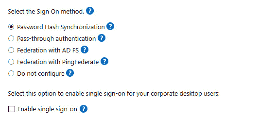

# 第七章：黑客攻击云 – 利用 Azure Active Directory/Entra ID 漏洞

在上一章，我们了解了 `Active Directory`（**AD**）和本地身份验证。本章我们将探讨其继任者和云 **身份提供者**（**IdP**）：`Azure Active Directory`（**AAD/Azure AD**）。

自 2023 年 7 月 11 日起，微软将 Azure AD 更名为 `Entra ID`。由于这一变更在本书发布前不久才宣布，因此我们将在本章中继续将其称为 Azure Active Directory、Azure AD 或 AAD。

AAD 是微软基于云的企业身份服务。它提供 **单点登录**（**SSO**）、条件访问和 **多因素身份验证**（**MFA**）来保护用户免受各种攻击，无论这些攻击是本地发起还是使用基于云的技术。

AAD 是一个多租户云目录和身份验证服务。其他服务，如 Office 365 或 Azure，依赖此服务进行身份验证和授权，利用 AAD 提供的帐户、组和角色。

越来越多的组织在混合模式下使用 AAD，一些组织甚至完全放弃了传统的本地 AD 解决方案，转而使用 AAD。

本章中，我们将深入研究 AAD，特别是 AAD 的身份验证，并探索蓝队和红队成员在 PowerShell 环境中应当了解的 Azure AD 安全相关知识：

+   区分 AD 和 AAD

+   AAD 中的身份验证

+   最重要的内置特权帐户和角色概述

+   使用 PowerShell 访问 AAD

+   攻击 AAD

+   探索与 AAD 相关的凭证盗窃攻击

+   缓解基于云的攻击

# 技术要求

为了充分利用本章内容，请确保您具备以下条件：

+   PowerShell 7.3 及以上版本

+   已安装 Visual Studio Code

+   访问 `Chapter07` 的 GitHub 仓库：

[`github.com/PacktPublishing/PowerShell-Automation-and-Scripting-for-Cybersecurity/tree/master/Chapter07`](https://github.com/PacktPublishing/PowerShell-Automation-and-Scripting-for-Cybersecurity/tree/master/Chapter07)

# 区分 AD 和 AAD

比较 AD 和 AAD 时的一个常见误解是，AAD 只是云中的 AD。这个说法并不准确。

虽然 AD 是本地域的目录服务，但 AAD 允许用户访问 Office 365、Azure 门户、SaaS 应用程序、内部资源和其他基于云的应用程序。

两者都是身份和访问管理解决方案，是的。但除此之外，这两种技术有很大的不同，正如下面的图所示：


图 7.1 – AD 与 AAD

AAD 可以与本地 AD 同步（**混合身份**），并支持 **联合**（例如通过 **安全声明标记语言（SAML）**）或可以作为单一身份和访问提供者使用。它支持不同类型的身份验证，如下所示：

+   **仅云身份验证**：在这种情况下，AAD 作为唯一的身份提供者（IdP），不与本地 AD 进行任何同步。用户直接与 AAD 进行身份验证以访问资源。

+   **AAD 密码哈希同步**：这种身份验证方法涉及将本地 AD 中的密码哈希同步到 AAD。当用户进行身份验证时，AAD 会根据存储在云中的同步哈希验证密码。

+   **AAD 通行身份验证（PTA）**：通过这种方式，身份验证过程涉及混合设置。在用户的密码通过本地身份验证代理验证后，AAD 执行最终的身份验证步骤，从而授予用户访问权限。

+   **联合身份验证（AD FS）**：在联合身份验证场景中，身份验证发生在本地，使用**Active Directory 联合服务**（**AD FS**）。AAD 充当身份提供者，并依赖与 AD FS 建立的联合信任来验证用户。

在 AD 中，组控制用户组的权限和访问，而在 AAD 中，这一功能被角色所取代。

例如，在 AD 中，**企业管理员**组，其次是**域管理员**组，拥有最多的权限。这可以与 AAD 中的**全局管理员**角色进行比较；如果一个帐户在 AAD 中拥有**全局管理员**角色，那么它对租户拥有完全控制权限。

然而，如果配置不当，全球管理员角色并不是唯一可能被滥用的角色。我们将在 *特权帐户和* *角色* 部分深入探讨 AAD 中的重要角色。

此外，AD 和 AAD 使用的通信和身份验证方法有显著差异。让我们首先看看 AAD 中身份验证是如何工作的。

# 在 AAD 中的身份验证

在我们深入探讨所使用的协议及其工作原理之前，我们首先需要了解设备身份是什么，以及设备是如何加入的。

## 设备身份 – 将设备连接到 AAD

设备身份是指一旦设备注册或加入 AAD 租户后，在 AAD 中创建的对象。它类似于本地 AD 中的设备，管理员可以使用它来管理实际的设备或获取更多信息。设备身份可以在 AAD 门户中的 **设备** | **所有设备** 下找到。

有三种方法可以将设备加入或注册到 AAD：

+   **AAD 加入**：将现代设备（如 Windows 10 或 Windows 11）加入 AAD 租户的默认方法。运行在 Azure 租户中的 Windows Server 2019 及以上版本的 **虚拟机**（**VMs**）也可以加入。

+   **AAD 注册**：一种支持**自带设备**（**BYOD**）或移动设备场景的方法。这种方法也被视为现代设备场景。

+   **混合 AAD 加入**：这种方法不被视为现代设备场景，而是为了在同一环境中结合老旧机器和现代机器的折中方案。从长远来看，AAD 加入应该是首选方法，但仍在运行 Windows 7+和 Windows Server 2008+的组织可以利用这种场景作为向正确方向迈进的一步，直到所有机器都成功迁移到现代操作系统。

这三种方法可以在同一个租户中使用并共存，但在我所见的大多数环境中，许多设备仍然通过混合 AAD 加入，组织仍然支持**混合身份**。但是，究竟什么是混合身份呢？

## 混合身份

大多数情况下，AAD 与本地 AD 并行使用。组织仍然拥有大量本地基础设施，但他们开始在混合场景中使用云。

假设在访问云资源时使用不同的密码，而不是本地资源密码是可能的，但用户已经负担过重，需要维护他们的本地密码。因此，为了保持高标准的密码安全，允许用户使用相同的帐户访问本地和云资源是合乎逻辑的。

为了解决这个问题，微软开发了 AAD Connect。AAD Connect 是实现混合场景目标的工具，将本地 AD 与 AAD 集成。

用户可以通过使用唯一的共同身份访问本地资源和云资源，从而提高生产力并增强安全性。

管理员定期连接一个或多个本地 AD 森林，并可以选择以下概念：

+   **密码哈希同步**：通过密码哈希同步概念，所有本地密码都被同步到 AAD，以确保本地和云中可以使用相同的密码。有关密码哈希同步的更多信息，请访问：[`learn.microsoft.com/en-us/azure/active-directory/hybrid/connect/whatis-phs`](https://learn.microsoft.com/en-us/azure/active-directory/hybrid/connect/whatis-phs)。

+   `PTA`：使用 PTA 时，无需将凭据同步到云中。当用户对 AAD 进行身份验证时，凭据会传递到本地 AD，之后本地 AD 会验证凭据，然后身份验证成功。有关 PTA 的更多信息，请访问：[`docs.microsoft.com/en-us/azure/active-directory/hybrid/how-to-connect-pta`](https://docs.microsoft.com/en-us/azure/active-directory/hybrid/how-to-connect-pta)。

+   **联合身份验证**：将 AD 连接到 AAD 时，管理员还可以选择配置联合身份验证——可以选择使用 AD FS 或 PingFederate（第三方提供商）进行联合。联合身份验证是信任彼此的组织的集合，因此通常可以使用相同的身份验证和授权方法。

当谈到 AAD 时，联合机制作为提供无缝单点登录（SSO）体验的一种机制，在验证用户凭据与本地**域控制器**（**DCs**）匹配后，会发放令牌。这个方法确保用户能够访问 AAD 资源，而无需重复身份验证，从而提升整体用户体验和生产力。

了解更多关于联合的信息，请点击这里：[`docs.microsoft.com/en-us/azure/active-directory/hybrid/whatis-fed`](https://docs.microsoft.com/en-us/azure/active-directory/hybrid/whatis-fed)。

以下截图显示了将 AD 连接到 AAD 时所有可用的登录方法：



图 7.2 – 选择登录方式

为了避免用户反复输入凭据，单点登录（SSO）也可以在此步骤中启用。

每种登录概念都有其优点和缺点，我们将在本章后面探讨一些场景如何应对。但现在，让我们先了解一下连接到 AAD 的用户和设备的身份验证是如何工作的。

## 协议和概念

根据设备的加入方式以及用户想要连接的资源，身份验证和授权流程有所不同。对于 AAD，主要使用的协议和标准是**开放授权**（**OAuth**）2.0、`OpenID Connect`（**OIDC**）和 SAML。

SAML 以及与 OIDC 结合使用的 OAuth 是非常流行的协议，可以用来实现单点登录（SSO）。实际使用的协议取决于应用程序。两者都使用令牌工件来传递秘密，但在授权和身份验证方面的工作方式不同。

接下来的几节将探讨这些协议的工作原理，以及根据不同场景，流程是如何变化的。

### OAuth 2.0

`OAuth 2.0`是一种开放标准，用于访问委托，简化基于令牌的**授权**，以便安全地访问互联网上的资源。需要注意的是，OAuth 2.0 并不是身份验证协议，而是专注于授权和不同应用程序与服务之间的安全资源共享。OAuth 2.0 于 2012 年发布，自那时以来，已广泛应用于现代 Web 和 API 的身份验证与授权场景。

OAuth 2.0 与 2007 年发布的 OAuth 1.0 版本完全不同。本书中提到的*OAuth*始终指的是 OAuth 2.0。

使用 OAuth，第三方可以轻松访问外部资源，而无需访问用户的用户名或密码。


图 7.3 – 使用现有帐户的登录选项

举个例子，如果你要登录一个网站，但还没有该资源的登录信息，许多提供商会允许你使用现有账户（例如微软、谷歌、Facebook 或 Twitter 账户）来验证身份并登录，如前面截图所示。

#### OAuth 词汇表

在我们深入了解 OAuth 的工作原理之前，我们首先需要澄清一些词汇：

+   **资源所有者**：这是授予资源访问权限的人，通常是他们自己的用户账户。

+   **客户端**：请求代表资源所有者执行操作的应用程序。

+   **授权服务器**：此服务器了解资源所有者，并能够授权该用户是否合法。因此，资源所有者通常在授权服务器上有一个现有账户。

+   **资源服务器**：这是客户端代表资源所有者想要访问的资源/API。有时，授权服务器和资源服务器是同一台服务器，但它们不必是同一台；有时，授权服务器只是一个受信任的服务器，资源服务器依赖于它。

+   **重定向 URI/回调 URL**：授权服务器在授予客户端权限后，将资源所有者重定向到的 URL。

+   **响应类型**：这表示客户端期望接收的信息类型。授权码是最常见的响应类型；在这种情况下，授权码将被发送给客户端。

+   **授权码**：这是一个短期有效的临时代码。授权服务器将其发送给客户端。客户端将它与客户端密钥一起发送给授权服务器，进而获得访问令牌。需要注意的是，是否需要发送客户端密钥，取决于所使用的具体 OAuth 流程。

+   **访问令牌**：这是客户端用来访问所需资源的令牌。它作为凭证，允许客户端与资源服务器进行通信和交互。

+   **刷新令牌**：这是一个长期有效的令牌，可以在访问令牌过期后，用来请求并获取新的访问令牌。

+   **范围**：这是客户端请求的细化权限（例如，读取、写入或删除）。

+   **同意**：用户可以查看客户端请求的权限（范围），并通过允许请求的权限来授予同意。

+   **客户端 ID**：客户端 ID 用于唯一标识与授权服务器交互的客户端。在授权过程中，它作为客户端的身份标识符。

+   **客户端密钥**：一个只有客户端和授权服务器知道的保密密码。它作为一个共享密钥，用于在授权过程中验证客户端的身份。

现在你已经熟悉了必要的词汇，接下来我们来看 OAuth 流程是如何工作的。

#### OAuth 授权码授权流程

以下截图展示了 OAuth 授权码授权流程的工作原理：


图 7.4 – OAuth 流程

为了清楚地理解 OAuth 流程的工作原理，以下是一个包含每个步骤详细描述的示例：

1.  用户，也被称为**资源拥有者**，希望允许新闻通讯服务代表他们向指定收件人发送新闻通讯，因此他们会导航到新闻通讯服务，即客户端——例如，`www.1337newsletters.com`。请注意，这只是一个虚构的新闻通讯 URL。

1.  **客户端**将用户重定向到授权服务器——在我们的例子中，这是 AAD。它还会包括客户端 ID、重定向 URL、响应类型以及必要时的一或多个作用域。

1.  **授权服务器**（AAD）验证用户的身份，并在用户尚未登录时提示其登录。它还会提示用户进行**同意**，确保他们完全了解客户端请求在指定资源服务器上代表他们执行的操作范围。用户可以同意或拒绝并授予或拒绝权限。需要注意的是，用户只需要在首次授权时授予同意，而不是每次登录时都需要同意。

在我们的新闻通讯示例中，可能的作用域是代表用户*读取联系人*和*写入及发送电子邮件*。

1.  **重定向 URL**作为位置被放入 HTTP 头部，AAD 将包含授权码的响应发送给客户端。当客户端获取到带有该头部的响应时，客户端将被重定向到指定位置，并发送其从授权服务器获取到的授权码。

1.  **客户端**将其客户端 ID、客户端密钥和授权码发送给授权服务器，一旦数据验证合法，便会接收**访问令牌**。在此步骤中，还会发送**刷新令牌**，以确保客户端在旧的访问令牌过期后可以请求新的访问令牌。

1.  现在，客户端可以使用访问令牌，该令牌包含由授权服务器分配的硬编码作用域，来访问资源服务器。在适当的作用域下，客户端可以代表用户执行操作，例如读取联系人和发送电子邮件。

通常，**客户端 ID**以及**客户端密钥**是由**授权服务器**生成的，在 OAuth 授权流程发生之前很久就已生成。一旦客户端和授权服务器建立了工作关系，授权服务器会生成并与客户端共享客户端 ID 和客户端密钥。该密钥不能共享，确保只有客户端和授权服务器知道。这样，客户端的身份得到了保障，并且可以由授权服务器验证。

除了授权码授权流程外，`RFC 6749` 中还指定了其他 OAuth 流程，如隐式授权、资源所有者密码凭证授权、客户端凭证授权和扩展授权流程。本书中不会进一步探讨这些流程，但如果您有兴趣了解更多不同的 OAuth 流程，请参阅 `RFC 6749`：[`datatracker.ietf.org/doc/html/rfc6749`](https://datatracker.ietf.org/doc/html/rfc6749)。

#### OpenID Connect

OIDC 是建立在 OAuth 框架上的额外一层。它增加了关于已登录用户（即资源所有者）的登录和个人资料信息。当授权服务器支持 OIDC 时，它向客户端提供关于资源所有者的信息。OIDC 认证用户并使用户能够使用单点登录（SSO）。

如果一个授权服务器支持 OIDC，我们也可以称它为 `IdP`，并且可以用于 **身份验证**。

使用 OIDC 的授权流程几乎与常规 OAuth 流程完全相同，唯一的不同发生在 *步骤 2* 和 *步骤 5* 中，具体如下：

2\. 发送的 scope 包含 OIDC 应该使用的信息：`Scope=OpenID`。

5\. 除了发送的访问令牌和刷新令牌外，还会发送一个 **ID 令牌**。

访问令牌是一个 `JSON Web Token`（**JWT**），可以解码，但对于客户端没有太大意义，不应由应用程序用于做出任何决策。它需要每次都发送以访问所需的资源。ID 令牌也是一个 JWT，包含有关用户的信息。

在 ID 令牌中，一旦提取信息，所有用户声明都可以使用。声明是诸如用户姓名、用户 ID、用户登录时间和令牌过期时间等信息。此令牌经过签名，防止被中间人攻击轻易篡改。

### SAML

`SAML` 是一种开放标准，供 `IdP` 用于将授权信息传递给 **服务提供商**（**SP**）。使用 SAML，可以直接使用 SSO，而不需要任何其他附加协议——用户只需输入一次登录凭据，就可以使用多种服务，而无需一次又一次地进行身份验证。

下图应该有助于您理解 SAML 认证流程：


图 7.5 – SAML 认证流程

为了全面理解在使用 AAD 作为 IdP 时的 SAML 认证流程，以下列表概述了通过 SAML 认证用户时涉及的每个操作：

1.  用户打开浏览器并尝试访问一个资源，因此向 SP 请求访问。

1.  SP 生成一个 **SAML 授权请求**，并将用户重定向到 IdP，AAD。AAD 对用户进行认证。

1.  AAD 生成**SAML 令牌**并将其发送回用户。与 SAML 令牌一起，会返回会话密钥。

1.  用户向 SP 呈现 SAML 令牌。

1.  SP 验证 SAML 响应以及 SAML 令牌，并在一切正常的情况下完成登录。用户已登录，并被转发到安全的 Web 应用程序。

### 主刷新令牌

无论使用的是 OAuth 还是 SAML，在这两种情况下，**主刷新令牌**（**PRT**）都是由 AAD 生成并用于延长用户会话。PRT 可以类比为 AD 中的票据授权票证。

它不仅仅刷新 OAuth 或 SAML 身份验证；它是一个主密钥，可以用来验证*任何*应用程序。PRT 最初是为提供跨应用程序的 SSO 而引入的。这也是微软对 PRT 应用额外保护并建议设备配备 TPM 的原因——如果有 TPM，密码学密钥就存储在 TPM 中，这使得几乎不可能提取它们并获取对 PRT 的访问权限。

然而，如果没有 TPM 芯片，PRT 可以被提取并可能被滥用。

PRT 本身是一个包含用户身份验证信息的 JWT。它使用传输密钥加密，并与发放给定设备绑定。它还存在于发放给定设备的内存中，并可以通过`LSA CloudAP`使用`mimikatz`等工具提取。我们之前在*第六章*《Active Directory – 攻击与缓解》中讨论了**本地安全机构**（**LSA**），如果你想了解 LSA 的内容，请参考本章。`CloudAP`是 LSA 中保护与云相关的令牌（如 PRT）的部分。

在本书中，你只需要知道 PRT 是身份验证文物，如果它被盗，就会导致身份冒充的可能性。如果你想了解更多关于 PRT 是如何发放或刷新的信息，请参考微软文档：[`docs.microsoft.com/en-us/azure/active-directory/devices/concept-primary-refresh-token`](https://docs.microsoft.com/en-us/azure/active-directory/devices/concept-primary-refresh-token)。

了解保护 PRT 的重要性至关重要，尤其是当涉及到特权账户和角色时，我们将在下一节中深入探讨这一点。

# 特权账户和角色

特权账户和角色是任何目录服务的核心，它们是最强大的账户/角色。因此，它们对对手具有特殊的吸引力，需要额外的保护级别。

AAD 中有许多内置角色。在本章中，我不会描述所有角色，而是会概述一些可能被轻易滥用的具有权限的重要角色。因此，定期检查和审计哪些账户被分配了这些角色是非常有意义的：

+   **全局管理员**：这是 AAD 中最强大的角色。它被允许执行 AAD 中所有可能的管理任务。

+   **特权角色管理员**：此角色可以管理和分配所有 AAD 角色，包括全局管理员角色。此角色还可以创建和管理可以分配给 AAD 角色的组，并管理特权身份管理和行政单元。

+   **全局读取器**：此角色可以读取所有信息，但无法执行任何操作。尽管如此，对于攻击者来说，它可能在枚举过程中仍然有用。

+   **应用管理员/云应用管理员**：这些角色可以管理或创建与应用程序相关的所有内容。他们还可以为应用程序添加凭证，因此也可以用来冒充应用程序，这可能导致特权升级。

+   **Intune 管理员**：此角色可以管理 Intune 中的所有内容，并创建和管理所有安全组。

+   **身份验证管理员**：此角色可以（重新）设置任何身份验证方法，并且可以管理非管理员用户以及某些角色的凭证。

+   **特权身份验证管理员**：此角色具有与身份验证管理员类似的权限，但还可以为整个租户设置身份验证方法策略。

+   **条件访问管理员**：此角色可以管理条件访问设置。

+   **Exchange 管理员**：此角色在 Exchange Online 中具有全局权限，允许该角色创建和管理所有 Microsoft 365 组。

+   **安全管理员**：此角色可以管理所有与安全相关的 Microsoft 365 功能（例如 Microsoft 365 Defender 或身份保护）。

这些是 AAD 中最重要的内置角色，但仍然有许多其他角色可能会被攻击者滥用。有关所有内置 AAD 角色的完整概览，请查看此链接：[`docs.microsoft.com/en-us/azure/active-directory/roles/permissions-reference`](https://docs.microsoft.com/en-us/azure/active-directory/roles/permissions-reference)。

除了内置角色外，还需要跟踪您的**虚拟化管理员**或**订阅管理员**，或者一般的特权角色，这些角色*能够访问敏感虚拟机*；这样的角色很容易获得对托管虚拟机的访问权限并重置密码。一旦访问机器，用户可以对虚拟机执行任何操作，甚至获得登录该虚拟机的用户和管理员的凭证。

还需监视其他可以管理组成员身份的角色，例如**安全组**和`Microsoft 365** `组所有者**。

请参考 AAD 角色最佳实践，了解如何以最佳方式保护您的 AAD 角色：[`docs.microsoft.com/en-us/azure/active-directory/roles/best-practices`](https://docs.microsoft.com/en-us/azure/active-directory/roles/best-practices)。

# 使用 PowerShell 访问 AAD

当然，我们都知道 Azure 门户；攻击者也可以利用无缝 SSO 访问门户，使用用户的浏览器进行访问。甚至还有一种方法可以通过 Azure Cloud Shell 直接从 Azure 门户运行代码。但这些方法很难自动化，攻击者也会很难保持不被发现。以下截图显示了如何从 Azure 门户运行 Azure Cloud Shell：


图 7.6 – 从 Azure 门户使用 Azure Cloud Shell

但是，也有一些方法可以直接通过代码或命令行从你的计算机访问 AAD：

+   Azure CLI

+   Azure PowerShell

+   Azure .NET: [`docs.microsoft.com/en-us/dotnet/azure/`](https://docs.microsoft.com/en-us/dotnet/azure/)

最初，这些方法是为了支持自动化和简化管理任务而开发的，但像往常一样，它们也可能被攻击者滥用。

本章不会深入探讨 Azure .NET。Azure .NET 是一套供 .NET 开发者使用的库，用来与 Azure 资源（包括 AAD）进行交互。这些库支持多种语言，如 C#、F# 和 Visual Basic。它们并没有为 PowerShell 提供直接接口，但可以通过 PowerShell 使用它们来自动化各种任务，类似于如何从 PowerShell 使用 .NET Framework 中的 `System.DirectoryServices` 命名空间（见 *第六章*，*Active Directory – 攻击与缓解*）。欲了解更多信息，请参考此 Azure .NET 文档：[`learn.microsoft.com/en-us/dotnet/api/overview/azure/?view=azure-dotnet`](https://learn.microsoft.com/en-us/dotnet/api/overview/azure/?view=azure-dotnet)。

在接下来的章节中，我们将更详细地介绍与 PowerShell 相关的 Azure CLI 和 Azure PowerShell，除了可以专门在 Azure Cloud Shell 中使用外，还可以在本地计算机上使用它们。

## Azure CLI

Azure CLI 是一款跨平台的命令行工具，用于连接和管理 AAD。它还使用 OAuth 协议进行身份验证。

在你可以运行 Azure CLI 之前，需要先安装它。请使用与你操作系统相对应的文档：[`docs.microsoft.com/en-us/cli/azure/install-azure-cli`](https://docs.microsoft.com/en-us/cli/azure/install-azure-cli)。

安装 Azure CLI 成功后，你可以开始使用并登录到 Azure CLI：

```
> az login
```

在浏览器中会打开一个新窗口，提示你登录或选择登录账户——如果你在浏览器会话中已经登录了账户。

如果你使用 `--use-device-code` 参数，系统不会弹出新的浏览器窗口；而是会提供一个代码，你可以在选择的设备上使用该代码，通过其他设备进行身份验证以开始此会话。

登录后，您可以使用典型的 Azure CLI 语法与 Azure 进行交互。有关所有可用 `Az` 命令的完整概述，请参阅：[`docs.microsoft.com/en-us/cli/azure/reference-index`](https://docs.microsoft.com/en-us/cli/azure/reference-index)。

在与 AAD 交互时，您可能会发现 `az ad` 概述有用：[`docs.microsoft.com/en-us/cli/azure/ad`](https://docs.microsoft.com/en-us/cli/azure/ad)。

## Azure PowerShell

在使用 PowerShell 和 AAD 时，您可以使用 `Az` 模块。还有 `AzureAD` 模块，但该模块将在 2024 年 3 月 30 日被弃用，并由 Microsoft Graph PowerShell 取代。尽管在撰写本文时，Microsoft 计划让 `AzureAD` 模块在弃用公告日期后的六个月内仍能正常工作，但 Microsoft 建议从现在开始迁移到 Microsoft Graph PowerShell。因此，我们在本章中不会深入探讨 `AzureAD` cmdlet。

### Az 模块

您可以通过 MSI 安装文件或 `PowerShellGet` 安装 `Az` 模块。以下示例演示了通过 `PowerShellGet` 进行安装：

```
> Install-Module -Name Az -Scope CurrentUser -Force
```

Azure PowerShell 是 `Az` 模块的一部分，建议仅为当前用户安装它。

有关其他安装方式和故障排除，请参阅官方文档：[`docs.microsoft.com/en-us/powershell/azure/install-az-ps`](https://docs.microsoft.com/en-us/powershell/azure/install-az-ps)。

模块安装完成后，您可以通过将其导入到当前会话并登录来开始使用：

```
> Import-Module Az
> Connect-AzAccount
```

与 Azure CLI 类似，您的浏览器中会打开一个新窗口，并提示您登录。登录成功后，PowerShell 命令行也会显示登录成功信息：


图 7.7 – Connect-AzAccount 执行成功

类似于 Azure CLI，您还可以使用 `-** **UseDeviceAuthentication` 参数请求一个验证码，以便从另一台设备登录并进行身份验证。

但也可以使用 `Connect-AzAccount` 脚本化身份验证——在以下示例中，PowerShell 会提示您输入凭据，随后使用这些凭据进行身份验证：

```
> $cred = Get-Credential
> Connect-AzAccount -ServicePrincipal -Credential $cred -Tenant $tenantId
```

Az PowerShell 非常广泛，由多个模块组成。您可以通过运行 `Get-Module -Name** **Az.*` 命令获取当前所有现有模块的概述。

找到模块后，您可以查看哪些命令可用。您可以像往常一样使用 `Get-Command`，如以下截图所示：


图 7.8 – 查找 Az.Accounts 模块提供的 cmdlet

如需了解有关 Azure PowerShell 的更多信息，请参考文档：[`learn.microsoft.com/en-us/powershell/azure/`](https://learn.microsoft.com/en-us/powershell/azure/)。

### Microsoft Graph

Microsoft Graph 可以使用`PowerShellGet`安装，因为它在 PowerShell Gallery 中可用：

```
> Install-Module Microsoft.Graph -Scope CurrentUser -Force
```

安装完成后，您需要连接到 AAD：

```
> Connect-MgGraph -Scopes "User.Read.All","Group.ReadWrite.All"
```

浏览器中会弹出一个新窗口，提示您登录并授予权限，如下图所示：


图 7.9 – 授予 Microsoft Graph 权限

登录成功后，您的 PowerShell 命令行上会显示欢迎消息：


图 7.10 – 登录 Microsoft Graph 后的欢迎消息

现在您可以使用 Microsoft Graph 与您的 AAD 实例进行交互。有关 Microsoft Graph 的更多信息，请参阅官方文档：[`learn.microsoft.com/en-us/powershell/microsoftgraph/`](https://learn.microsoft.com/en-us/powershell/microsoftgraph/)。

现在您已经了解了关于 AAD 的基础知识，让我们在接下来的章节中看看红队如何攻击它。

# 攻击 AAD

在攻击过程中，枚举通常是第一步（并且根据对手可以访问的内容，可能会重复几次）用来获取环境更多细节的步骤。枚举有助于找出哪些资源可用，以及哪些访问权限可能被滥用。

在 AD 中，任何可以访问企业网络的用户都可以枚举所有用户账户以及管理员成员资格；而在 AAD 中，任何可以通过互联网访问 Office 365 服务的用户都可以枚举它们，但对于 AAD 来说。

## 匿名枚举

甚至有一种方法可以匿名获取有关当前 AAD 租户的更多信息。对于对手来说，这有巨大的优势，因为他们无需通过钓鱼攻击或类似手段欺骗用户提供凭据。此外，被检测到的风险大大降低。

有许多 API 确实有合法的用途，但也可以被滥用进行匿名枚举。

其中一个 API 如下：

```
https://login.microsoftonline.com/getuserrealm.srf?login=<username@domain.tld>&xml=1
```

只需将`<username@domain.tld>`替换为您想要获取更多信息的用户登录名，并在浏览器中导航到此 URL。如果您想了解有关`PSSec-User@PSSec-Demo.onmicrosoft.com`用户所在环境的更多信息，您可以使用以下 URL：

[`login.microsoftonline.com/getuserrealm.srf?login=PSSec-User@PSSec-Demo.onmicrosoft.com&xml=1`](https://login.microsoftonline.com/getuserrealm.srf?login=PSSec-User@PSSec-Demo.onmicrosoft.com&xml=1)

以下截图显示了如果用户存在时，输出的样子：


图 7.11 – 枚举现有 AAD 用户

通过这种方式，您可以验证用户是否存在。您还可以判断公司是否使用 AAD（Office 365），并且该账户是由 AAD 管理的，如`<NameSpaceType>Managed</NameSpaceType>`所示。

`NameSpaceType`的可能值如下：

+   **联合**：该公司使用了联合 AD，并且查询的账户存在。

在从 AAD 获取刷新令牌和访问令牌之前，客户端必须通过本地 AD 或其他身份管理解决方案验证用户的凭证。需要注意的是，AAD 不执行凭证验证。只有在客户端收到 SAML 令牌作为用户验证凭证和身份的证明后，AAD 才会发放访问云资源所需的令牌。

+   **托管**：正在使用 Office 365，该账户由 AAD 管理，并且存在。

因此，可以指一个从本地 AD 同步过来的账户，但未进行联合，或者是直接在 AAD 中创建的仅云端账户。对于托管账户，用户认证仅在云端进行，本地基础设施不参与凭证验证。

+   **未知**：没有该用户名的记录。

如果查询的账户不存在，`NameSpaceType`将显示**未知**，并且你将获得较少的信息，如下图所示：


图 7.12 – 账户不存在

对攻击者来说，账户名中含有指示账户具有提升权限的信息，并且是有价值目标的账户，可能会特别感兴趣，例如`admin@company.com`或`administrator@company.onmicrosoft.com`。

还有其他一些开源脚本，如`o365creeper`，依赖于公共 API 来匿名枚举 Office 365 环境：https://github.com/LMGsec/o365creeper。

使用匿名枚举方法允许攻击者获取组织内已验证用户账户的列表。下一个目标是通过找出至少一个账户的凭证来获得访问权限。

## 密码喷射攻击

并非每个用户都使用难以猜测的超级安全密码；因此，密码喷射攻击是获取环境访问权限的最常见方法之一。

出人意料的是，2022 年最常见的十大密码非常容易猜到：

+   `123456`

+   `123456789`

+   `qwerty`

+   `password`

+   `1234567`

+   `12345678`

+   `12345`

+   `iloveyou`

+   `111111`

+   `123123`

许多公司并未对所有用户强制执行 MFA，而其他公司虽然有 MFA，但可能未能有效配置条件访问策略，以在特定风险事件或风险条件下强制执行 MFA。许多高权限账户根本没有配置 MFA 也是非常常见的情况。这使得攻击者可以轻松地通过猜测密码登录并获得未授权的访问权限。

密码喷射攻击是攻击者用来暴力破解一个曾经验证过的账户的攻击方式；通过对多个用户账户进行身份验证并尝试几个常见密码，能够找到使用弱密码的账户的几率很高。

AAD 提供了一些针对密码喷射攻击的缓解措施，但这种攻击仍然是可能的。

通常，AAD 中的攻击非常有针对性（例如发送鱼叉式钓鱼邮件）；因此，密码喷洒攻击的可能性较低，但它仍然是常见的攻击手段，并且仍然会发生，通常是由试图寻找入口点的对手发起。

有几个开源工具可以帮助攻击者实现他们在 AAD 环境中发现和枚举账户的目标，并对其进行密码喷洒攻击：

+   `LyncSniper`: [`github.com/mdsecresearch/LyncSniper`](https://github.com/mdsecresearch/LyncSniper)

+   `MailSniper`: [`github.com/dafthack/MailSniper`](https://github.com/dafthack/MailSniper)

+   `Ruler`: [`github.com/sensepost/ruler/wiki/Brute-Force`](https://github.com/sensepost/ruler/wiki/Brute-Force)

+   `SprayingToolkit`: [`github.com/byt3bl33d3r/SprayingToolkit`](https://github.com/byt3bl33d3r/SprayingToolkit)

一旦攻击者获取了账户的访问权限——例如，通过密码喷洒或钓鱼——他们可以利用这个账户进行进一步的枚举、权限提升或进行更多的钓鱼攻击。

## 身份验证后的枚举

在 AAD 中，任何拥有 Office 365 访问权限的用户默认都可以枚举用户和组成员。也就是说，如果一个属于 AAD 基础架构的用户账户被攻破，它可以作为起点，用于收集关于其他用户和组的更多信息。

这些信息对攻击者来说非常有用，可以帮助他们更好地了解组织结构并发起更有效的攻击。它还可能揭示出值得攻击的有价值账户。

一旦你登录后，利用可用的脚本接口进行身份验证后的枚举就非常简单。我们将在接下来的子章节中看看如何使用 Azure CLI 和 Azure PowerShell 进行枚举。

### 会话、租户和订阅详情

你可以使用 Microsoft Graph 或 Az 模块获取当前会话以及租户的更多信息。这对于了解你登录的账户以及获取 AAD 环境本身的更多细节（如租户 ID）非常有用。

以下是相关的 Microsoft Graph 模块命令：

```
> Get-MgContext
> Get-MgOrganization
```

使用 Az PowerShell 模块，你不仅可以获取当前会话和租户的信息，还可以获取订阅的信息：

```
> Get-AzContext
> Get-AzSubscription
> Get-AzResource
```

### 枚举用户

使用 Microsoft Graph 模块，你可以通过`Get-MgUser` cmdlet 来枚举用户：

```
> Get-MgUser -All | select UserPrincipalName
```

若要仅获取一个用户的详细信息，使用`-UserId`参数，然后跟随**用户主体名称**（**UPN**）：

```
> Get-MgUser -UserId PSSec-User@PSSec-Demo.onmicrosoft.com
```

还有一个非常有趣的属性，叫做`OnPremisesSecurityIdentifier`。通过这个属性，你可以查看一个账户是通过本地创建并同步的，还是通过 AAD 创建的。如果它包含**安全标识符**（**SID**），则说明该账户是在本地创建并同步的；如果没有，则说明该账户是直接在 AAD 中创建的：

```
> Get-MgUser -All | Select-Object DisplayName, UserPrincipalName, OnPremisesSecurityIdentifier | fl
```

还有一些其他非常有趣的 cmdlet，如下所示：

+   `Get-MgUserCreatedObject`：获取指定用户创建的所有对象

+   `Get-MgUserOwnedObject`：获取指定用户拥有的所有对象

要使用 Az 模块枚举用户，您可以使用`Get-AzADUser` cmdlet。也可以通过使用`-UserPrincipalName`参数后跟 UPN 来枚举单个用户：

```
> Get-AzADUser -UserPrincipalName PSSec-User@PSSec-Demo.onmicrosoft.com
```

使用 Microsoft Graph 和 Az 模块，您可以使用`-Search`参数查找特定字符串。如果您想查找在其 UPN 中包含某个特定字符串（如**admin**）的账户，这非常有用。

使用 Azure CLI 检索用户列表也非常简单：

```
> az ad user list --output=table
```

由于这会生成一个庞大的列表，因此也有必要指定应返回哪些列。在以下示例中，我们只会看到一些细节信息，如账户是否启用、显示名称、用户 ID 和 UPN：

```
> az ad user list --output=table --query='[].{Enabled:accountEnabled,Name:displayName,UserId:mailNickname,UPN:userPrincipalName}'
```

当然，您还可以通过使用`-upn`参数，后跟`userPrincipalName`，来获取单个用户的详细信息。

### 枚举组成员资格

在 AAD 中，组可以用来容纳多个用户，组也可以分配给角色。因此，枚举 AAD 组也是非常有用的。

使用 Microsoft Graph 模块，您可以使用以下命令检索所有现有 AAD 组的概览：

```
> Get-MgGroup -All
```

要获取特定的组，您可以使用`-UserId`参数，后跟该组的对象 ID。

您还可以找出一个用户属于哪些组：

```
> Get-MgUserMemberOf -UserId PSSec-User@PSSec-Demo.onmicrosoft.com
```

如果您想枚举特定的组并找出哪些用户是成员，可以使用`Get-MgGroupMember` cmdlet：

```
Get-MgGroupMember -All -GroupId <GroupID> | ForEach-Object { $_.AdditionalProperties['userPrincipalName'] }
```

使用 Az PowerShell 模块，您可以使用`Get-AzADGroup`来检索所有组的概览。使用`-ObjectId`参数可以枚举特定组。

您可以使用`Get-AzADGroupMember`来检索组的所有成员；只需指定要枚举的组，可以通过`-GroupObjectId`参数后跟组的对象 ID，或使用`-GroupDisplayName`参数后跟组的显示名称。

组对象的结构与用户对象类似，因此您也可以使用我们在用户上使用过的相同方法，比如查找某个组是否在本地同步过，或者从 AAD 同步过（使用`OnPremisesSecurityIdentifier`属性），您还可以使用`-Search`参数查找名称中包含特定字符串的组。

您还可以使用 Azure CLI 进行枚举：

```
> az ad group list --output=json
```

类似于枚举用户，您还可以指定输出应显示哪些数据：

```
> az ad group list --output=table --query='[].{Group:displayName,UPN:userPrincipalName,Description:description}'
```

您还可以通过使用`-group`参数，后跟组名称，来指定单个组。

### 枚举角色

您可以使用`Get-AzRoleAssignment` cmdlet 枚举 RBAC 角色分配，该 cmdlet 是 Az PowerShell 模块的一部分。如果没有指定其他内容，它将列出订阅中的所有分配。使用`-Scope`参数，您可以指定一个资源。

使用`-SignInName`参数，后跟 UPN，你可以列举指定用户的所有分配，如下截图所示：


图 7.13 – 检索用户的角色分配

你还可以使用 Azure CLI 通过以下命令枚举 RBAC 角色分配：

```
> az role assignment list --all --output=table
```

一般可用的内置 RBAC 角色包括以下几种：

+   `Owner`：完全访问权限；还可以管理其他用户的访问权限。

+   `Contributor`：完全访问权限，但不能管理其他用户的访问权限。

+   `Reader`：查看访问权限。

+   `User Access Administrator`：查看访问权限；还可以管理其他用户的访问权限。

当然，根据资源的不同，还存在额外的内置 RBAC 角色。完整的概览可以在这里找到：[`docs.microsoft.com/en-us/azure/role-based-access-control/built-in-roles`](https://docs.microsoft.com/en-us/azure/role-based-access-control/built-in-roles)。

### 枚举资源

Az 模块和 Azure CLI 提供了多种枚举 Azure 资源的选项，例如一般资源、虚拟机、密钥库和存储账户。下表显示了检索所需信息的最重要的命令：


图 7.14 – 枚举资源

（Web）应用程序也可以视为资源。让我们深入了解如何枚举应用程序、功能应用程序和 Web 应用程序。

### 枚举应用程序

使用 Microsoft Graph 模块，你可以通过以下命令获取所有可用应用程序的列表：

```
> Get-MgApplication -All
```

使用`-ApplicationId`参数，你可以指定一个应用程序的对象 ID。使用`-Search`参数，你可以在应用程序的显示名称中搜索特定的字符串。

要查找哪个应用程序的拥有者，可以使用`Get-MgApplicationOwner`命令：

```
> Get-MgApplication -ApplicationId <ApplicationId> | Get-MgApplicationOwner |fl
```

另一个非常有用的命令是`Get-MgUserAppRoleAssignment`。要找出某个用户或某个组是否为一个或多个应用程序分配了角色，可以使用以下命令：

```
> Get-MgUserAppRoleAssignment -UserId PSSec-User@PSSec-Demo.onmicrosoft.com | fl
```

使用 Az 模块，你也可以通过以下命令检索所有可用应用程序的概览：

```
> Get-AzADApplication
```

要检索特定的应用程序，你可以使用`Get-AzADApplication`和`-ObjectId`参数。

在 AAD 中，你可以拥有一个服务应用程序或一个功能应用程序。使用`Get-AzFunctionApp`命令检索所有功能应用程序；如果你想获取所有服务应用程序，则使用以下命令：

```
> Get-AzWebApp | ?{$_.Kind -notmatch "functionapp"}
```

在 Azure CLI 中，使用`az ad app list --output=table`，你也可以列举 AAD 中的应用程序。使用`--query`参数来指定你想要查看的详细输出：

```
> az ad app list --output=table --query='[].{Name:displayName,URL:homepage}'
```

使用`--identifier-uri`参数，后跟 URI，可以仅列举一个应用程序。

### 枚举服务主体

**服务主体** 是由用户创建的服务和应用程序使用的身份。与普通用户账户类似，服务主体需要权限才能在目录中的对象上执行操作，例如访问用户邮箱或更新联系人。这些权限，称为 **范围**，通常通过 **同意** 过程授予。

通常，标准用户只能为应用程序授予与自己相关的有限操作权限。然而，如果服务主体需要对同一目录中其他对象拥有更广泛的权限，则需要管理员同意。由于这不是一个普通的用户账户，但仍然具有大量权限，服务主体成为攻击者的一个有趣目标。

使用 Microsoft Graph 模块，您可以简单地查看所有现有服务主体（SP）的概况：

```
> Get-MgServicePrincipal -All | fl
```

通过使用 `-ServicePrincipalId` 参数，您可以指定一个单一的服务主体（SP），并通过使用 `-Search` 参数，您可以按显示名称筛选服务主体。

有一些有用的 cmdlet 可以帮助您处理服务主体（SP）：

+   `Get-MgServicePrincipalOwner`: 返回服务主体（SP）的所有者

+   `Get-MgServicePrincipalOwnedObject`: 检索某个特定服务主体（SP）拥有的对象

+   `Get-MgServicePrincipalOwnedObject`: 获取某个特定服务主体（SP）拥有的所有对象

+   `Get-MgServicePrincipalCreatedObject`: 获取某个特定服务主体（SP）创建的所有对象

+   `Get-MgServicePrincipalTransitiveMemberOf`: 枚举服务主体（SP）的组和角色成员身份

使用 Az PowerShell 模块，您也可以在 AAD 中枚举服务主体（SP）：

```
> Get-AzADServicePrincipal
```

通过使用 `-ObjectId` 参数，您可以指定一个单一的服务主体（SP），并通过使用 `-DisplayName` 参数，您可以按显示名称筛选服务主体。

同样，通过 Azure CLI，您也可以轻松地查看所有服务主体的概况：

```
> az ad sp list --output=table --query='[].{Name:displayName,Enabled:accountEnabled,URL:homepage,Publisher:publisherName}'
```

类似于 Az 和 Microsoft Graph 模块，您还可以使用 Azure CLI 按显示名称进行筛选：

```
> az ad sp list --output=table --display-name='<display name>'
```

这些是您可以在 AAD 中使用的一些枚举方法，但当然并不完整。还有一些非常有用的工具可以用于枚举目的，例如以下这些：

+   `AADInternals`: [`github.com/Gerenios/AADInternals`](https://github.com/Gerenios/AADInternals)

+   `BloodHound/AzureHound`: [`github.com/BloodHoundAD/BloodHound`](https://github.com/BloodHoundAD/BloodHound)/[`github.com/BloodHoundAD/AzureHound`](https://github.com/BloodHoundAD/AzureHound)

+   `msmailprobe`: [`github.com/busterb/msmailprobe`](https://github.com/busterb/msmailprobe)

+   `o365creeper`: [`github.com/LMGsec/o365creeper`](https://github.com/LMGsec/o365creeper)

+   `office365userenum`: [`bitbucket.org/grimhacker/office365userenum/src`](https://bitbucket.org/grimhacker/office365userenum/src)

+   `o365recon`: [`github.com/nyxgeek/o365recon/blob/master/o365recon.ps1`](https://github.com/nyxgeek/o365recon/blob/master/o365recon.ps1)

+   `ROADtools`: [`github.com/dirkjanm/ROADtools`](https://github.com/dirkjanm/ROADtools)

+   `Stormspotter`: [`github.com/Azure/Stormspotter`](https://github.com/Azure/Stormspotter)

请注意，某些方法和/或工具会产生大量噪声，容易被检测到。

现在我们已经介绍了各种枚举技术来收集目标环境的信息，接下来让我们专注于一种更具恶意的活动：凭证盗窃。

# 凭证盗窃

与本地 AD 类似，在 AAD 中，身份也是新的边界，对对手来说极具价值。尽管技术以及代码审查和安全编码流程在这些年里有了显著提升，零日漏洞依然存在，但要发现它们并找到滥用它们的方式极其困难。因此，对手将目标锁定在最薄弱的环节——用户，也就是身份。

在本节中，我们将探讨对手如何窃取 AAD 用户的身份并以他们的名义进行操作的不同方式。

## 令牌盗窃

在实际中最常见的场景之一是令牌盗窃。令牌盗窃是 AAD 中常见的攻击方式，它发生在攻击者获得用户的会话令牌、身份验证令牌或会话 cookie 时。这些令牌（如刷新令牌和访问令牌）可以被用来未经授权访问用户的帐户和敏感信息。

当我们谈论 Azure 中的令牌盗窃时，通常是以下其中一种资源，攻击者试图通过窃取的令牌访问：

+   `https://storage.azure.com`: 指的是 Azure 存储，它为各种数据类型提供基于云的存储解决方案。

+   `https://vault.azure.net`: 代表 Azure 密钥保管库，这是一个用于存储和管理加密密钥、机密和证书的安全服务。

+   `https://graph.microsoft.com`: 与 Microsoft Graph 相关，这是一个 API 端点，可用于访问 Microsoft 365 服务和数据。

+   `https://management.azure.com`: 对应 Azure 管理 API，该 API 可用于管理和控制 Azure 资源及服务。

令牌盗窃攻击通常从钓鱼攻击开始：对手向用户发送电子邮件或消息，通常附带一个恶意文件。当用户打开并执行附件时，恶意软件通常会执行并试图从内存中提取令牌。

PRT 是验证云连接和混合设备与 AAD 的关键组件。它的有效期为 14 天，并且每 4 小时刷新一次。PRT 由 `CloudAP` 在 `LSA` 中保护，且会话密钥由 TPM（如果存在）保护。值得注意的是，只有在 AAD 注册、AAD 加入或混合 AAD 加入的设备上，原生应用程序（如 Outlook 客户端）才会收到 PRT。因此，在工作组机器上的浏览器会话将无法获得 PRT。

攻击者可以通过两种方式窃取和滥用 PRT：一种是传递 PRT，另一种是传递由 PRT 生成的 cookie。

要**传递 PRT**，攻击者通常使用`mimikatz`或 ProcDump 等工具从受害者计算机上的 LSASS 进程中窃取 PRT。这些工具转储 LSASS 进程，并允许攻击者提取 PRT。一旦获得 PRT，攻击者可以在自己的计算机上生成 PRT Cookie，并用它从 AAD 获取访问令牌。这种攻击需要受害者机器上的管理员权限。

让我们来看一下如何执行一个传递 PRT 的攻击。你可以通过使用`mimikatz`轻松访问本地 PRT：

```
> privilege::debug
> sekurlsa::cloudap
```

现在，通过 LSA CloudAP 保护的凭证被显示出来，如下截图所示：


图 7.15 – 使用 mimikatz 显示 PRT

如果存在 PRT，它将在前面的截图中显示为`PRT`标签部分。现在，你可以提取 PRT 并继续操作。

为什么在使用 mimikatz 时看不到 PRT？

如果在使用`mimikatz`时没有看到 PRT，请确保你的设备确实已加入 AAD，可以通过使用`dsregcmd /status`命令来检查。如果已加入，你应该在`SSO State`下看到`AzureAdPrt`的值为`YES`。

为了更好地阅读，我将输出复制并粘贴到 Visual Studio Code 中进行格式化。复制`Prt`标签的值以备后用。下一步，你需要提取`ProofOfPossessionKey`的`KeyValue`，这基本上就是会话密钥，如下截图所示：


图 7.16 – 查找会话密钥

接下来，我们需要使用 DPAPI 主密钥解密会话密钥。由于此步骤需要在`SYSTEM`上下文中执行，因此我们首先在`mimikatz`中使用`token::elevate`提升权限，然后再尝试解密。在以下示例中，将`<CopiedKeyValue>`替换为你之前提取的`ProofOfPossesionKey`的`KeyValue`：

```
> token::elevate
> dpapi::cloudapkd /keyvalue:<CopiedKeyValue> /unprotect
```

密钥已解密，你可以再次在控制台中看到多个标签和值显示；下一步生成 PRT Cookie 时，你需要复制`Context`的值以及`Derived Key`标签的值，如下截图所示：


图 7.17 – 提取未加密的值以生成 PRT Cookie

现在，你可以生成一个 PRT Cookie，然后用它代表用户访问 AAD。在以下命令中，将`<Context>`替换为`Context`的值，将`<DerivedKey>`替换为`Derived Key`的值，最后，将`<PRT>`替换为你之前复制的`Prt`标签的值：

```
> Dpapi::cloudapkd /context:<Context> /derivedkey:<DerivedKey> /Prt:<PRT>
```

如下截图所示，生成了一个新的 PRT Cookie，你现在可以在会话中使用它来伪装成`PSSec-User`：


图 7.18 – 生成了新的 PRT cookie

现在浏览到 [`login.microsoftonline.com/`](https://login.microsoftonline.com/) —— 无论是在另一台客户端上还是在私密/匿名会话中。系统会提示你输入凭据：


图 7.19 – Microsoft 登录提示

现在检查网页的源代码。在 Microsoft Edge 中，你可以右键点击并选择**检查**；对于 Google Chrome 或 Mozilla Firefox，也有类似的选项。根据你在演示环境中使用的浏览器选择合适的选项。

无论如何，在 Microsoft Edge 中，你可以在使用开发者工具时，找到**应用程序` | **Cookies`，清除所有现有 cookies，并创建一个新的 cookie，包含以下信息：

```
Name: x-ms-RefreshTokenCredential
Value: <PRTCookie>
HttpOnly: Set to True (checked)
```

要在 Microsoft Edge 的开发者工具中创建一个 cookie，你只需双击一个空行并添加内容。确保用你之前创建的 cookie 值替换`<PRTCookie>`。


图 7.20 – 在浏览器会话中创建新的 PRT cookie

再次访问 [`login.microsoftonline.com/`](https://login.microsoftonline.com/) 网站时，系统应该会自动将你认证为被入侵的用户。

`pass-the-PRT-cookie` 攻击类似于 `pass-the-PRT` 攻击；攻击者从受害者的计算机中窃取新生成的 PRT cookie。一旦攻击者获得了 PRT cookie，他们可以使用它从 AAD 获取访问令牌。与窃取 PRT 不同，取决于攻击场景和使用的工具，这种攻击类型不需要受害者机器上的管理员权限。

要获取 PRT cookie，攻击者可以手动从浏览器中提取 cookie，并将其粘贴到另一台计算机的浏览器会话中，或者从浏览器的数据库中提取 cookie。

在开始之前，确认系统上存储 cookies 的位置。该位置通常是以下路径之一：

+   `C:\Users\YourUser\AppData\Local\Google\Chrome\User Data\Default\Cookies`

+   `C:\Users\YourUser\AppData\Local\Google\Chrome\User Data\Default\Network\Cookies`

在我的虚拟机中，Chrome 的 cookies 存储在路径`C:\Users\YourUser\AppData\Local\Google\Chrome\User Data\Default\Network\Cookies`下。

`mimikatz.exe` 是多种工具之一，可以帮助你从 Google Chrome 提取 PRT cookie。请注意，使用这种方法时，你需要请求调试权限。默认情况下，管理员账户拥有该权限，除非被限制。

首先请求调试权限，然后运行相应的`dpapi::chrome`命令提取当前浏览器的所有 cookies：

```
> privilege::debug
> dpapi::chrome /in:"%localappdata%\Google\Chrome\User Data\Default\Network\Cookies" /unprotect
```

现在在输出中查找`ESTSAUTHPERSISTENT` cookie。这就是你需要提取的 cookie，因为它允许用户始终保持登录状态：


图 7.21 – 使用 mimikatz 提取 PRT cookie

现在你已经提取了 PRT cookie，可以在另一台计算机上重用它来登录，甚至绕过多因素认证（MFA）。访问[`portal.azure.com/`](https://portal.azure.com/)并打开开发者工具。在此示例中，我使用的是 Microsoft Edge。当提示进行身份验证时，在开发者工具中浏览至`Application** | **Cookies** | **https://login.microsoftonline.com`并创建一个新的 cookie，如下图所示：


图 7.22 – 在 Microsoft Edge 中创建 ESTSAUTHPERSISTENT cookie

创建一个名为`ESTSAUTHPERSISTENT`的 cookie，并将之前提取的 PRT cookie 作为值输入。将该 cookie 设置为`HttpOnly`并重新加载页面。你将以刚刚窃取 cookie 的用户身份登录。

你还可以使用像`ROADtools`这样的工具，通过命令行登录以进一步自动化你的攻击。由于 ROADtools 不是基于 PowerShell 的，因此我们在本书中不会深入讨论它。你可以从 GitHub 下载 ROADtools：https://github.com/dirkjanm/ROADtools。

另一个能帮助你进行各种 AAD 相关攻击的令人印象深刻的工具套件是`AADInternals`，它是由 Dr. Nestori Syynimaa 编写的。这个工具可以通过`Install-Module AADInternals`轻松安装，或者从 GitHub 下载：https://github.com/Gerenios/AADInternals。

无论你是想玩转 PRT，枚举 AAD，还是研究其他与 AAD 相关的攻击，我都强烈推荐你查看庞大的*AADInternals*项目。你可以在以下链接找到详细的文档：https://aadinternals.com/aadinternals/。

## 同意授权攻击 – 通过应用程序权限获得持久性

通过同意授权攻击获得持久性通常不是使用 PowerShell 完成的，但你可以使用 PowerShell 定期监视同意权限。此外，如果你确定在你的租户中不需要此功能，也可以关闭用户应用程序同意。

OAuth 同意允许用户授予第三方应用程序在特定范围内访问其数据的权限，例如读取其电子邮件或查看其联系人。但是，攻击者也利用这一点，通过制作钓鱼邮件将用户重定向到一个假的 OAuth 同意页面，用户在不知情的情况下授予访问权限，从而让攻击者获得其帐户的权限。

一旦攻击者获得访问权限，他们可以通过滥用授予的权限来持续控制。方法之一是在租户的 AAD 中注册一个新应用程序，并为其分配 AAD 目录中的角色。需要注意的是，这种方法要求被同意的应用程序拥有注册新 AAD 应用的权限（这需要管理员同意）。因此，为了使这种方法有效，被钓鱼的用户必须具有管理员权限。

攻击者随后可以配置自己的 AAD 应用程序，授予他们委托权限，从而访问目标租户的数据。通过这样做，攻击者即使在用户账户被删除的情况下，也可以从租户环境中窃取数据。

攻击者还可以利用获得的访问权限修改或添加新的应用程序权限。他们可以修改现有权限以绕过现有的安全控制，如 MFA 或条件访问，并长期保持访问权限。此外，攻击者还可以向其他应用程序添加新权限，从而进一步访问租户中的数据。威胁行为者甚至可能为服务主体添加一对新的凭证，扩大其控制范围，危及环境的安全。

通常，OAuth 同意权限很少会被审核，这使得攻击者可以在不被发现的情况下长期滥用用户账户。

有多种方法可以审计 OAuth 同意，这里有相关描述：[`learn.microsoft.com/en-us/microsoft-365/security/office-365-security/detect-and-remediate-illicit-consent-grants`](https://learn.microsoft.com/en-us/microsoft-365/security/office-365-security/detect-and-remediate-illicit-consent-grants)。

如果你想使用 PowerShell 来查看 OAuth 同意授权，你会发现`Get-MgOauth2PermissionGrant`、`Get-MgServicePrincipalOauth2PermissionGrant`和`Get-MgUserOauth2PermissionGrant` cmdlet 非常有帮助。

## 滥用 AAD 单点登录

AAD 无缝单点登录（SSO）是一项功能，使得用户可以在不需要反复输入登录凭证的情况下，直接登录到与 AAD 连接的应用程序。

如果你想了解更多关于 AAD 无缝单点登录的工作原理，微软已经详细记录了相关信息：[`learn.microsoft.com/en-us/azure/active-directory/hybrid/how-to-connect-sso-how-it-works`](https://learn.microsoft.com/en-us/azure/active-directory/hybrid/how-to-connect-sso-how-it-works)。

但与所有功能一样，SSO 也可能被威胁行为者滥用；如果攻击者设法破解了 AAD 无缝单点登录计算机账户密码的 NTLM 哈希（**AZUREADSSOACC**），他们可以用它为他们想要冒充的用户生成一个银票。

因为`AZUREADSSOACC`账户的密码永远不会改变（除非管理员强制更改密码），因此 NTLM 哈希也会保持不变——这也意味着它将永远有效。拥有`AZUREADSSOACC`账户的密码哈希，攻击者可以伪装成任何用户，而无需通过 MFA 进行身份验证。

然后，银票可以注入到本地 Kerberos 缓存中，允许攻击者伪装成该用户并访问 AAD 连接的应用程序和服务。这是非常危险的，因为它允许攻击者使用来自互联网的银票。

由于 AAD 无缝 SSO 计算机账户密码不会自动更改，因此这个攻击路径对攻击者更具吸引力。为了利用这一机制，攻击者需要已获得目标网络的域管理员权限。

首先，攻击者需要提取`NT LAN Manager`（**NTLM**）哈希值，针对`AZUREADSSOACC`账户。这可以通过启动`mimikatz.exe`并运行以下命令来完成：

```
> lsadump::dcsync /user:AZUREADSSOACC$
```

此命令需要直接在 DC 上执行，或者由可以复制信息的帐户执行（请参考*第六章*中的 DCSync 攻击信息，*Active Directory – 攻击* *与缓解*）。

一旦我们获得了该 NTLM 哈希（在此示例中，**a7d6e2ca8d636573871af8d4db34f236**），我们将把它保存在`$ntlmhash`变量中，稍后会利用这个变量：

```
> $ntlmhash = "a7d6e2ca8d636573871af8d4db34f236"
```

接下来，我们需要域和 SID。如果我们例如想要伪装成用户`PSSec-User`，以下命令将帮助我们获取所需信息：

```
$user = "PSSec-User"
$domain = (Get-CimInstance -ClassName Win32_ComputerSystem).Domain
$sid = ((New-Object System.Security.Principal.NTAccount($user)).Translate([System.Security.Principal.SecurityIdentifier])).Value
```

现在，我们使用之前收集的所有信息，通过`mimikatz`创建我们的银票：

```
> .\mimikatz.exe "kerberos::golden /user:$user /sid:$sid /id:666 /domain:$domain /rc4: $ntlmhash /target:aadg.windows.net.nsatc.net /service:HTTP /ptt" exit
```

启动 Mozilla Firefox 并输入`about:config`。将 `network.negotiate-auth.trusted-uris` 配置为包含以下值：`https://aadg.windows.net.nsatc.net,**  **https://autologon.microsoftazuread-sso.com.`

现在，你可以通过浏览到任何与你的 AAD 域集成的 Web 应用程序，并利用无缝 SSO 访问它。

## 利用通行认证（PTA）

之前我们简要谈到过 PTA，这是一种认证概念，允许用户使用其本地凭据登录云端资源。

利用 PTA 是攻击者绕过合法认证过程的一种方法，通过挂钩系统用来通过 PTA 进行用户身份验证的 `advapi32.dll` 中的一个相关 `LogonUser*` 函数。通过将此函数替换为自己的恶意函数，攻击者不仅可以读取所有用于身份验证的密码，还可以实施自己的 **骨架钥匙**，使他们能够以每个用户的身份进行身份验证，而无需重置单个用户账户的密码。你可以将骨架钥匙想象成类似于主密码，使攻击者能够以任何用户的身份进行身份验证，而无需重置单个用户账户密码。

为了使此攻击有效，存在两个要求：首先，环境需要启用 PTA 的 AAD Connect；其次，攻击者需要访问一个具有管理员权限的账户，该账户可以访问安装了 PTA 认证代理的服务器。

让我们首先看看 PTA 如何工作。下图展示了 PTA 工作流的样子：


图 7.23 – PTA 工作流

为了理解 PTA 工作流，以下列表概述了涉及的每个步骤：

1.  用户尝试通过使用其用户名和密码对 AAD 或 Office 365 进行身份验证。

1.  在代理和 AAD 之间建立了一个持久连接：代理队列。AAD 使用代理的公钥加密用户凭证，并将其放入代理队列中，然后加密的密钥被代理收集。

1.  代理（进程名称为**AzureADConnectAuthenticationAgentService**）使用其私钥解密用户凭证，并代表用户使用这些凭证对本地 AD 进行身份验证。此过程中的一个功能是 `LogonUserW` 函数，它是 `advapi32.dll` API 二进制文件的一部分。

1.  DC 验证用户凭证是否合法，并返回身份验证是否成功。

1.  代理将 DC 的响应转发到 AAD。

1.  如果身份验证成功，用户将登录。

如果攻击者获得了对安装了 PTA 代理的服务器的访问权限，他们现在可以轻松地利用代理为自己谋取利益：例如，记录或捕获所有正在由服务器处理的身份验证尝试，甚至实施后门以成功使用每个账户登录。

Adam Chester 在他的博客上提供了一个如何实现这一目标的精彩示例。确保查看一下：[`blog.xpnsec.com/azuread-connect-for-redteam/#Hooking-Azure-AD-Connect`](https://blog.xpnsec.com/azuread-connect-for-redteam/#Hooking-Azure-AD-Connect)。

但是，为了利用 PTA，攻击者需要已经进入网络并且通常已经访问了非常受保护的服务器。因此，如果攻击者能够利用 PTA，你可能面临更严重的问题，应该计划进行受损恢复。

# 缓解措施

有几种缓解措施可以提高 AAD 的安全性，防止诸如枚举、令牌窃取、同意授权攻击、PTA 和 SSO 攻击等攻击。开始的一个方法是启用 AAD 租户中的安全默认设置，这为所有用户提供了基本的安全级别，包括要求启用多因素认证（MFA）和阻止传统身份验证协议。请同时查看微软推荐的快速安全提升措施：

+   [`learn.microsoft.com/en-us/azure/active-directory/fundamentals/concept-fundamentals-mfa-get-started`](https://learn.microsoft.com/en-us/azure/active-directory/fundamentals/concept-fundamentals-mfa-get-started)

+   [`learn.microsoft.com/en-us/azure/active-directory/fundamentals/identity-secure-score`](https://learn.microsoft.com/en-us/azure/active-directory/fundamentals/identity-secure-score)

+   [`learn.microsoft.com/en-us/azure/active-directory/fundamentals/concept-secure-remote-workers`](https://learn.microsoft.com/en-us/azure/active-directory/fundamentals/concept-secure-remote-workers)

+   [`learn.microsoft.com/en-us/azure/active-directory/fundamentals/five-steps-to-full-application-integration-with-azure-ad`](https://learn.microsoft.com/en-us/azure/active-directory/fundamentals/five-steps-to-full-application-integration-with-azure-ad)

+   [`learn.microsoft.com/en-us/azure/active-directory/fundamentals/concept-fundamentals-security-defaults`](https://learn.microsoft.com/en-us/azure/active-directory/fundamentals/concept-fundamentals-security-defaults)

+   [`learn.microsoft.com/en-us/azure/active-directory/conditional-access/block-legacy-authentication`](https://learn.microsoft.com/en-us/azure/active-directory/conditional-access/block-legacy-authentication)

另一种控制对特定资源访问并限制枚举攻击影响的方法是执行条件访问和身份保护策略。为所有用户启用 MFA 可以增加一层额外的安全性，并减少枚举攻击成功的风险。

为了有效监控和识别可疑活动，强烈建议利用 AAD 的风险 IP 登录和用户报告，并根据登录和用户的风险级别配置条件访问策略。这些内置功能提供了对潜在威胁的全面洞察，并允许进行主动缓解。限制对域控制器（DC）的访问，仅允许授权管理员访问，也可以防止攻击者获得发起攻击所需的初步访问权限。

实施先进的检测技术、基于行为的异常检测和威胁狩猎有助于识别与 PTA 攻击相关的恶意活动。安全启动还可以防止恶意代码注入到合法系统进程中，从而使攻击者更难发动 PTA 攻击。

除了前述的缓解措施外，定期监控 AAD 无缝 SSO 计算机账户（**AZUREADSSOACC$**）并手动更改其密码可以帮助缓解这种攻击向量。执行强密码策略、实施多因素认证（MFA）、监控可疑活动、定期审查和更新安全策略，以及培训员工掌握最佳安全实践，都是提高 AAD 整体安全性的关键步骤。

同意授权攻击涉及通过欺骗用户授予恶意第三方应用程序权限。为了减轻风险，必须监控在您的租户中授予第三方应用程序的 OAuth 同意权限。通过监控这些权限，您可以在问题发生之前识别并撤销任何未经授权的访问。

为帮助您完成此任务，您可以参考微软关于如何修复非法同意授权的教程：[`learn.microsoft.com/en-us/microsoft-365/security/office-365-security/detect-and-remediate-illicit-consent-grants`](https://learn.microsoft.com/en-us/microsoft-365/security/office-365-security/detect-and-remediate-illicit-consent-grants)。

此外，请确保您的用户了解授予第三方应用程序权限的风险，并教育他们如何识别和报告可疑的 OAuth 同意请求。

还请查看以下链接，了解更多提高 AAD 安全性的措施：

+   [aka.ms/AzureADSecOps](http://aka.ms/AzureADSecOps)

+   [aka.ms/IRPlaybooks](http://aka.ms/IRPlaybooks)

# 摘要

在本章中，您学习了一些关于 AAD 安全的基本方面。AAD 本身是一个庞大的话题，我们可以为其写整本书，因此如果您希望进一步探讨，确保花更多时间进行研究。

我们探讨了 AAD 与本地 AD 之间的差异，并了解到 AAD 不仅仅是云中的 AD，它还具有更多的功能。

现在，您应该熟悉与 AAD 相关的一些协议，并理解身份验证的基本过程，以及对手如何尝试利用这些协议。

理解特权内置账户及其信息来源非常重要，这样您就可以更好地保护环境，或者将这些知识用于下一次红队演练。

我们探讨了通过命令行连接和与 AAD 交互的几种方式，并检查了对 AAD 的几种常见攻击，如匿名和身份验证枚举、密码喷射和凭证窃取。

最后但同样重要的是，你学习了如何通过实施缓解机制更好地保护你的环境。

在谈到 PowerShell 安全性时，身份非常重要。但如果你作为红队成员工作，哪些 PowerShell 代码片段可以帮助你完成日常任务呢？让我们一起在下一章中探索哪些 PowerShell 命令对你的日常任务可能会有用。

# 进一步阅读

如果你想进一步探索本章提到的一些主题，可以参考以下资源：

+   **AAD 设备**：

    +   什么是设备身份？: [`docs.microsoft.com/en-us/azure/active-directory/devices/overview`](https://docs.microsoft.com/en-us/azure/active-directory/devices/overview)

    +   规划你的混合 Azure Active Directory 加入实现： [`learn.microsoft.com/en-us/azure/active-directory/devices/hybrid-azuread-join-plan`](https://learn.microsoft.com/en-us/azure/active-directory/devices/hybrid-azuread-join-plan)

+   **AAD 概述**：

什么是 Azure Active Directory？: [`adsecurity.org/?p=4211`](https://adsecurity.org/?p=4211)

+   `Azure** **AD Connect`：

下载 Azure AD Connect: https://www.microsoft.com/en-us/download/details.aspx?id=47594

+   `Entra ID`

Azure AD 正在成为 Microsoft Entra ID： [`techcommunity.microsoft.com/t5/microsoft-entra-azure-ad-blog/azure-ad-is-becoming-microsoft-entra-id/ba-p/2520436`](https://techcommunity.microsoft.com/t5/microsoft-entra-azure-ad-blog/azure-ad-is-becoming-microsoft-entra-id/ba-p/2520436)

+   **联合**：

使用 WS-Federation 在 ASP.NET Core 中验证用户： [`docs.microsoft.com/en-us/aspnet/core/security/authentication/ws-federation?view=aspnetcore-5.0`](https://docs.microsoft.com/en-us/aspnet/core/security/authentication/ws-federation?view=aspnetcore-5.0)

)

+   `OAuth`：

    +   RFC – OAuth 2.0 授权框架： [`datatracker.ietf.org/doc/html/rfc6749`](https://datatracker.ietf.org/doc/html/rfc6749)

    +   RFC – OAuth 2.0 授权框架：承载令牌使用： https://datatracker.ietf.org/doc/html/rfc6750

+   **其他` `有用的资源**：

    +   Azure Active Directory 红队： https://github.com/rootsecdev/Azure-Red-Team

    +   滥用 Azure AD SSO 与主刷新令牌： https://dirkjanm.io/abusing-azure-ad-sso-with-the-primary-refresh-token/

    +   什么是主刷新令牌？: https://learn.microsoft.com/en-us/azure/active-directory/devices/concept-primary-refresh-token

    +   AADInternals 文档: [`aadinternals.com/aadinternals/`](https://aadinternals.com/aadinternals/)

)

    +   GitHub 上的 AADInternals: [`github.com/Gerenios/AADInternals`](https://github.com/Gerenios/AADInternals)

+   **直通身份验证**：

    +   利用 PTA： [`blog.xpnsec.com/azuread-connect-for-redteam/#Pass-Through-Authentication`](https://blog.xpnsec.com/azuread-connect-for-redteam/#Pass-Through-Authentication) #直通身份验证

    +   `LogonUserW` 函数: [`learn.microsoft.com/en-us/windows/win32/api/winbase/nf-winbase-logonuserw`](https://learn.microsoft.com/en-us/windows/win32/api/winbase/nf-winbase-logonuserw)

    +   PTA 深度解析: [`learn.microsoft.com/en-us/azure/active-directory/hybrid/connect/how-to-connect-pta-security-deep-dive`](https://learn.microsoft.com/en-us/azure/active-directory/hybrid/connect/how-to-connect-pta-security-deep-dive)

+   **特权账户 &` `角色**：

    +   在 Azure Active Directory 中按任务划分的最低特权角色: [`docs.microsoft.com/en-us/azure/active-directory/roles/delegate-by-task`](https://docs.microsoft.com/en-us/azure/active-directory/roles/delegate-by-task)

+   `SAML`:

    +   使用 Azure Active Directory 进行 SAML 身份验证: [`docs.microsoft.com/en-us/azure/active-directory/fundamentals/auth-saml`](https://docs.microsoft.com/en-us/azure/active-directory/fundamentals/auth-saml)

    +   SAML: [`developer.okta.com/docs/concepts/saml/`](https://developer.okta.com/docs/concepts/saml/)

    +   SAML 2.0 和 OAuth 2.0 的区别: [`www.ubisecure.com/uncategorized/difference-between-saml-and-oauth/`](https://www.ubisecure.com/uncategorized/difference-between-saml-and-oauth/)

    +   Microsoft 身份平台与 SAML 和 OIDC/OAuth 的令牌交换场景: [`docs.microsoft.com/en-us/azure/active-directory/develop/scenario-token-exchange-saml-oauth`](https://docs.microsoft.com/en-us/azure/active-directory/develop/scenario-token-exchange-saml-oauth)

    +   Microsoft 身份平台如何使用 SAML 协议: [`learn.microsoft.com/en-us/azure/active-directory/develop/saml-protocol-reference`](https://learn.microsoft.com/en-us/azure/active-directory/develop/saml-protocol-reference)

你还可以在本章节的 GitHub 仓库中找到所有提到的链接，参考 *第七章* —— 无需手动输入每个链接: [`github.com/PacktPublishing/PowerShell-Automation-and-Scripting-for-Cybersecurity/blob/master/Chapter07/Links.md`](https://github.com/PacktPublishing/PowerShell-Automation-and-Scripting-for-Cybersecurity/blob/master/Chapter07/Links.md)。
