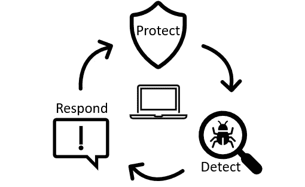
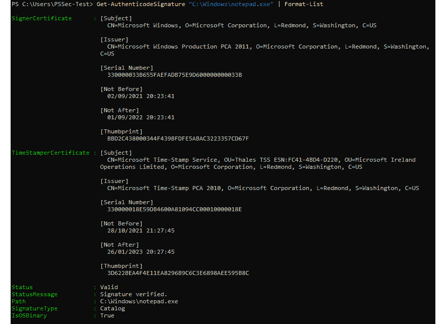
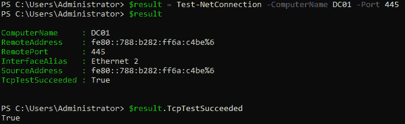

# 第九章：蓝队任务与食谱

作为蓝队成员，你的主要目标是保护组织的系统和网络免受网络威胁。然而，这不是一项简单的任务。威胁环境不断变化，你可能面临一些挑战，如管理和分析大量数据、与其他团队协调以及确保遵守规定。

本章中，我们首先将更详细地探讨*保护、检测和响应*方法及蓝队员面临的一些挑战。接下来，我们将介绍一些有用的 PowerShell 开源工具概览，这些工具可以帮助你作为蓝队员在日常工作中提高效率。最后，我们将探讨蓝队食谱——这是一些 PowerShell 代码片段的集合，可以在你作为蓝队从业者的日常工作中派上用场。

在本章中，我们将讨论以下主题：

+   理解保护、检测和响应方法

+   常见的 PowerShell 蓝队工具

+   蓝队食谱

# 技术要求

为了最大化地从本章中获益，请确保你具备以下条件：

+   Windows PowerShell 5.1

+   PowerShell 7.3 或更高版本

+   Visual Studio Code

+   访问本章的 GitHub 仓库：

[`github.com/PacktPublishing/PowerShell-Automation-and-Scripting-for-Cybersecurity/tree/master/Chapter09`](https://github.com/PacktPublishing/PowerShell-Automation-and-Scripting-for-Cybersecurity/tree/master/Chapter09)

# 保护、检测和响应

成为一个蓝队成员并非易事。你需要不断跟进不断变化的威胁环境，并保持最新状态。尽管红队员只需要找到一个漏洞就能成功，但蓝队员则需要注意所有细节，因为一个小小的错误就可能导致你的网络遭到入侵。

蓝队员不仅需要配置和管理他们的系统，还需要分析大量数据并与其他团队协调。他们还需要确保遵守相关的规定和标准。在做这些工作的同时，他们需要保持安全性与可用性之间的正确平衡，确保用户不会因过多的安全措施而感到困扰，并试图绕过它们。

为了帮助跟踪需要考虑的所有事项，将任务分类为**保护**、**检测**和**响应**类型会有所帮助。这是保护组织系统和网络的一种方法，结构分为三个不同的领域——保护、检测和响应。每个支柱都同样重要，以确保你的基础设施安全。



图 9.1 – 保护、检测和响应方法

许多公司仅关注保护部分，尽管检测和响应同样对保持敌人远离网络至关重要。

让我们在接下来的小节中深入探讨每个领域的内容。

## 保护

**保护**措施的目标是减轻安全风险并实施控制，以减少和阻止威胁的发生，*在它们发生之前*。保护措施可能包括以下内容：

+   定期更新系统并监控它们，以修复可能被攻击者利用的漏洞。

+   实施用户身份验证和授权，确保只有授权用户才能访问数据和系统。同时也需要遵循最小权限原则。

+   加密敏感数据，以减少未经授权用户访问的风险。加密硬盘，以防止具有物理访问权限的人盗取凭证，甚至在设备被盗时发生数据泄露。

+   实施安全策略、基准和访问控制，以确保系统尽可能安全地配置。同时还需要引入强密码策略。

+   部署防火墙和**入侵检测系统**（**IDSs**）/入侵**防御系统**（**IPSs**），以阻止未经授权的活动并检测可疑活动。

当然，保护机制也可能有第二个目的，例如 IDS 或 IPS，它不仅能阻止可疑活动，还能检测并提醒你这些活动。因此，这种解决方案也可以是**检测**领域的一部分。

## 检测

在检测阶段，目标是尽快识别和报告潜在的安全威胁。你可以做各种事情来改善你的检测能力，例如：

+   收集和分析关于潜在安全漏洞的事件日志，如失败的登录尝试或配置更改。

+   监控网络活动中的异常和可疑行为，例如用户登录到他们通常从未登录过的机器，或者尝试访问受限资源。另一个例子是，如果从通常不运行代码的工作站（如会计或市场部门的员工）执行了 PowerShell（或其他）代码。

+   评估来自杀毒软件和 IDSs/IPSs 的安全警报。

+   定期扫描你的网络漏洞，以识别可能被对手利用的潜在弱点。同时，定期聘请外部渗透测试人员检查你的安全性。

实施良好的检测措施将有助于提高你对网络中发生的事件的意识。这使你能够在响应阶段对潜在的安全威胁作出反应。

## 响应

如果检测到安全威胁，意味着你需要迅速采取行动，以减少风险并将系统恢复到安全状态。这可能涉及多种活动，例如：

+   隔离受损的系统，以防止进一步的损害和威胁在环境内传播。

+   从受影响的系统中收集法医数据并进行分析。这有助于识别攻击来源并确定损害的程度。它还可以帮助减轻未来的威胁。

+   恢复系统至安全状态，这可能涉及根据 NIST **网络安全框架**（NIST **CSF**）指南修复或重新安装系统：

[`www.nist.gov/cyberframework/framework`](https://www.nist.gov/cyberframework/framework)

+   实施额外的安全控制措施，以防止未来类似的威胁。

这三大支柱共同构建了保护、检测和响应的生命周期，应该始终平等重视。

也有许多开源工具可以支持蓝队成员采用保护、检测和响应的方法。在接下来的章节中，我们将探讨其中一些工具。

# 常见的 PowerShell 蓝队工具

作为蓝队成员，你时刻在寻找能够帮助你保护组织系统和网络免受网络威胁的工具和技术。

在本节中，我们将探索一些常见的 PowerShell 开源工具，这些工具对蓝队成员特别有帮助。这些工具可以协助执行诸如分析系统日志、收集系统信息和检测恶意活动等任务。有些工具还可以帮助分析系统的攻击面、识别和解码潜在的恶意数据，以及搜索入侵指示符。通过利用这些工具，你可以简化工作流程，更有效地保护组织免受网络威胁。

## PSGumshoe

`PSGumshoe` 是一个强大的 PowerShell 模块，旨在协助执行实时响应、追踪和取证等任务。由 Carlos Perez 开发，这个开源工具专为蓝队成员设计，帮助他们从各种来源收集证据。无论你是在调查安全事件、进行入侵指示符（IOC）的搜寻，还是执行取证分析，PSGumshoe 都可以成为你工具箱中的一个宝贵资产。它还包括支持从 Sysmon 生成的事件中检索数据，或跟踪 `Windows Management Instrumentation`（**WMI**）活动的功能。

你可以通过 PowerShell Gallery 使用 `Install-Module PSGumshoe` 命令安装 PSGumshoe，或者从 GitHub 下载： [`github.com/PSGumshoe/PSGumshoe`](https://github.com/PSGumshoe/PSGumshoe)。

## PowerShellArsenal

`PowerShellArsenal` 是 Matt Graeber 开发的 PowerShell 模块，旨在帮助逆向工程师完成多种任务。凭借其广泛的功能和能力，这个工具可以帮助你反汇编代码、执行 .NET 恶意软件分析、分析和解析内存结构等等。无论你是经验丰富的逆向工程师，还是刚刚入门，PowerShellArsenal 都能成为你工具箱中的有力助手。

它可以作为模块从 GitHub 下载并安装： [`github.com/mattifestation/PowerShellArsenal`](https://github.com/mattifestation/PowerShellArsenal)。

## AtomicTestHarnesses

`AtomicTestHarnesses` 是一个 PowerShell 模块，允许你模拟和验证攻击技术的执行。它具有适用于 Windows 的 PowerShell 组件，以及适用于 macOS 和 Linux 的 Python 组件，可以跨平台使用。

AtomicTestHarnesses 由 Mike Haag、Jesse Brown、Matt Graeber、Jonathan Johnson 和 Jared Atkinson 开发，是蓝队成员在测试防御并确保能够应对现实攻击时的宝贵资源。

你可以通过 `Install-Module -Name AtomicTestHarnesses` 命令从 PowerShell gallery 安装 AtomicTestHarnesses，或者通过以下链接从 GitHub 下载：[`github.com/redcanaryco/AtomicTestHarnesses`](https://github.com/redcanaryco/AtomicTestHarnesses)。

## PowerForensics

`PowerForensics` 是由 Jared Atkinson 开发的强大硬盘取证框架。目前支持 `NTFS`（**新技术文件系统**）和 `FAT`（**文件分配表**）文件系统，该工具旨在协助分析 Windows 遗留物、Windows 注册表、引导扇区和应用程序兼容性缓存等任务，并能够创建取证时间线。

PowerForensics 具备广泛的功能和能力，是蓝队成员进行硬盘取证分析的重要资源。你可以通过 `Install-Module PowerForensics` 命令从 PowerShell gallery 安装 PowerForensics，或者通过以下链接从 GitHub 下载：[`github.com/Invoke-IR/PowerForensics`](https://github.com/Invoke-IR/PowerForensics)。

## NtObjectManager

`NtObjectManager` 是一个广泛的 PowerShell 模块，允许你访问 NT 对象管理器命名空间。它是沙盒攻击面分析工具包的一部分（这个工具包也绝对值得一看！），由 James Forshaw 开发。对象管理器本身是 Windows 中的一个子系统，负责管理系统的对象，这些对象代表着各种系统资源，如进程、线程、文件和设备。

对象管理器还负责创建和删除对象，以及维护对象之间的关系。它还处理对象访问请求，确保只有授权实体能够访问特定对象。对象管理器是操作系统的一个重要组成部分，涉及系统操作的多个方面，包括内存管理、进程和线程管理以及 I/O 操作。

NTObjectManager 模块提供了多种功能，包括处理符号链接、审计 RPC 服务器、操作对象管理器，以及通常操作 Windows 操作系统。

NtObjectManager 可以通过 `Install-Module -Name NtObjectManager` 命令轻松安装，源代码可以在 GitHub 上找到，链接为：[`github.com/googleprojectzero/sandbox-attacksurface-analysis-tools`](https://github.com/googleprojectzero/sandbox-attacksurface-analysis-tools)。

## DSInternals

`DSInternals` 是由 Michael Grafnetter 开发的强大 Active Directory 套件，包含两个部分——一个框架，暴露了 Active Directory 的各种内部组件，可以从任何 .NET 应用程序中访问；另一个是 PowerShell 模块，提供了一系列基于该框架构建的 cmdlet。该模块功能广泛，包括能够审计 Azure AD FIDO2 密钥、AD 密码和密钥凭证，并执行域控制器的裸机恢复。

DSInternals 可以通过 `Install-Module DSInternals` 命令轻松安装，或者通过以下 GitHub 链接下载：[`github.com/MichaelGrafnetter/DSInternals`](https://github.com/MichaelGrafnetter/DSInternals)。

凭借其众多特性和功能，DSInternals 是蓝队员管理和保护其 Active Directory 环境的重要资源。

## PSScriptAnalyzer 和 InjectionHunter

`PSScriptAnalyzer` 是一款帮助你提高 PowerShell 脚本和模块质量与安全性的工具。它会根据预定义规则检查你的代码，并为发现的潜在缺陷提供建议。你可以使用 `Install-Module PSScriptAnalyzer` 命令安装 PSScriptAnalyzer，或者通过以下 GitHub 链接下载：[`github.com/PowerShell/PSScriptAnalyzer`](https://github.com/PowerShell/PSScriptAnalyzer)。

`InjectionHunter` 是由 Lee Holmes 开发的一个模块，帮助你检测自己 PowerShell 脚本中潜在的代码注入机会。要使用 InjectionHunter，你需要先安装 PSScriptAnalyzer，因为它依赖于 `ScriptAnalyzer.Generic.DiagnosticRecord` 输出类型并使用自定义检测规则。你可以通过 `Install-Module InjectionHunter` 命令安装 InjectionHunter，或者在 PowerShell Gallery 中找到它，链接为：[`www.powershellgallery.com/packages/InjectionHunter/1.0.0`](https://www.powershellgallery.com/packages/InjectionHunter/1.0.0)。

另请参考关于 InjectionHunter 的官方博客文章：[`devblogs.microsoft.com/powershell/powershell-injection-hunter-security-auditing-for-powershell-scripts/`](https://devblogs.microsoft.com/powershell/powershell-injection-hunter-security-auditing-for-powershell-scripts/)。

在 *第十三章* *还有什么？——更多缓解措施和资源* 中，我们还将更深入地了解这两个工具以及如何使用它们。

## Revoke-Obfuscation

`Revoke-Obfuscation`是由 Daniel Bohannon 和 Lee Holmes 开发的 PowerShell 混淆检测框架。它兼容 PowerShell v3 及更高版本，帮助蓝队员大规模检测混淆的 PowerShell 脚本和命令。与依赖简单**妥协指示器**（**IOCs**）或正则表达式匹配的其他解决方案不同，Revoke-Obfuscation 使用 PowerShell 的**抽象语法树**（**AST**）从脚本中提取特征，使其在检测未知混淆技术时更加可靠。

你可以通过`Install-Module Revoke-Obfuscation`命令轻松安装 Revoke-Obfuscation，或者你也可以通过以下 GitHub 链接下载：[`github.com/danielbohannon/Revoke-Obfuscation`](https://github.com/danielbohannon/Revoke-Obfuscation)。

## Posh-VirusTotal

作为防御者，定期检查文件、域名、IP 和 URL 以发现恶意软件是至关重要的。`VirusTotal`（[`www.virustotal.com`](https://www.virustotal.com)）是一个常用服务，允许你快速检查文件哈希或 URL 是否被认为是恶意的，并且它是否会被一个或多个安全厂商检测到。然而，手动上传每个文件或逐个检查 URL 可能会耗时且繁琐。

这就是 PowerShell 模块`Posh-VirusTotal`的作用所在。由 Carlos Perez 开发，这个工具可以自动化你的 VirusTotal 提交，节省你宝贵的时间。它兼容 PowerShell v3 及更高版本，并且可以使用 VirusTotal 提供的公共或私有版本 2 API。

你可以通过`Install-Module Posh-VirusTotal`命令轻松安装 Posh-VirusTotal，或者你也可以通过以下 GitHub 链接下载：https://github.com/darkoperator/Posh-VirusTotal。

如果你使用的是较旧版本的 PowerShell（如 v3），你也可以使用`iex (New-Object** **Net.WebClient).DownloadString("https://gist.githubusercontent.com/darkoperator/9138373/raw/22fb97c07a21139a398c2a3d6ca7e3e710e476bc/PoshVTInstall.ps1")`命令来安装 Posh-VirusTotal。

使用 Posh-VirusTotal，你可以简化恶意软件检查，并走在威胁的前面。

## EventList

`EventList`是我开发的一个有用工具，旨在帮助你提升审计能力，构建一个更有效的**安全运营中心**（**SOC**）。EventList 结合了 Microsoft 的安全基准和 MITRE ATT&CK，能够帮助你为 SIEM 系统生成猎杀查询，无论你使用的是哪个产品。

通过利用 EventList 的强大功能，你可以采取主动的方式来检测和应对安全威胁。

它可以通过`Install-Module EventList`命令安装，或者从 GitHub 下载：[`github.com/miriamxyra/EventList`](https://github.com/miriamxyra/EventList)。

## JEAnalyzer

`Just Enough Administration`（**JEA**）是一个强大的工具，用于保护管理员和用户在您的环境中允许使用的 PowerShell 命令。然而，配置和审计 JEA 角色可能是一项繁琐且耗时的任务。这就是 JEAnalyzer 派上用场的地方。

由 Miriam Wiesner 和 Friedrich Weinmann 开发，这个工具简化了 JEA 的实现和管理，并提供了扫描命令潜在危险的工具，当命令暴露在 JEA 端点时，可以轻松创建 JEA 端点。

您可以通过`Install-Module JEAnalyzer`命令轻松安装 JEAnalyzer，或者您可以从 GitHub 下载它，链接如下：https://github.com/PSSecTools/JEAnalyzer。

所有这些 PowerShell 模块对蓝队员非常有用，因为它们可以帮助执行诸如实时响应、猎杀、取证和逆向工程等任务。这些工具可以通过分析系统日志、收集系统信息、检测恶意活动、分析攻击面、识别并解码潜在的恶意数据、寻找妥协的指标以及许多其他用例，帮助简化工作流程并防御网络威胁。

# 蓝队菜谱

在以下小节中，您将找到一些对蓝队 PowerShell 从业者日常工作很有帮助的代码片段。蓝队工作范围广泛，因此您不会找到每个场景的用例，而是一些基础的用法。

此外，参阅*第八章*，*红队任务和菜谱*，您将在那里找到许多红队代码片段和脚本，这些内容有时也对蓝队员有帮助。

## 检查已安装的更新

您想要找出一个或多个远程系统上已安装的更新。

### 解决方案

您可以使用`Get-InstalledUpdates.ps1`脚本扫描 IP 范围内已安装的 Windows 更新。您可以在本章的 GitHub 仓库中找到此脚本：[`github.com/PacktPublishing/PowerShell-Automation-and-Scripting-for-Cybersecurity/blob/master/Chapter09/Get-InstalledUpdates.ps1`](https://github.com/PacktPublishing/PowerShell-Automation-and-Scripting-for-Cybersecurity/blob/master/Chapter09/Get-InstalledUpdates.ps1)。

使用此示例扫描`172.29.0.10-20` IP 范围内已安装的更新：

```
> .\Get-InstalledUpdates.ps1 -BaseIP "172.29.0" -MinIP 10 -MaxIP 20 -Verbose
```

`-MinIP`表示最小的最后一个 IP 地址八位组，而-`MaxIP`表示最大的最后一个 IP 地址八位组。启用`-Verbose`参数会使脚本显示其操作的详细输出。还可以使用`-MaxJobs`参数定义可以并行运行多少个任务来检查更新。

## 检查缺失的更新

您想要找出一个或多个远程主机上缺少的更新。

### 解决方案

你可以使用 `Scan-RemoteUpdates.ps1` 脚本检查缺失的 Windows 更新——可以在本地主机上检查，也可以在一个或多个远程主机上检查。你可以在本章的 GitHub 仓库中找到这个脚本：[`github.com/PacktPublishing/PowerShell-Automation-and-Scripting-for-Cybersecurity/blob/master/Chapter09/Scan-RemoteUpdates.ps1`](https://github.com/PacktPublishing/PowerShell-Automation-and-Scripting-for-Cybersecurity/blob/master/Chapter09/Scan-RemoteUpdates.ps1)。

仅扫描本地主机的方法如下：

```
> .\Scan-RemoteUpdates.ps1
```

扫描多个远程主机的方法如下：

```
> .\Scan-RemoteUpdates.ps1 -remoteHosts "PSSec-PC01", "PSSec-PC02", "PSSec-Srv01"
```

如果指定了 `-Force` 参数，`wsusscn2.cab` 文件（如果存在）将会被删除，并下载新版本。使用 `-CabPath` 参数来指定 `wsusscn2.cab` 文件的下载位置。如果未指定，它将被下载到 `$env:temp\wsusscn2.cab`。如果存在 `-DoNotDeleteCabFile`，则在检查后 `wsusscn2.cab` 文件不会被删除。

## 查看所有用户的 PowerShell 历史记录

在事件响应期间，你希望查看系统上所有用户的 PowerShell 历史记录。

### 解决方案

`Get-History` cmdlet 仅会获取当前 shell 的历史记录，这并不太有帮助。要查看每个用户的整个 PowerShell 历史记录，你可以遍历系统中的 `ConsoleHost_history.txt` 文件：

```
$UserHistory = @(Get-ChildItem "C:\Users\*\AppData\Roaming\Microsoft\Windows\PowerShell\PSReadline\ConsoleHost_history.txt").FullName;
$UserHistory += @(Get-ChildItem "c:\windows\system32\config\systemprofile\appdata\roaming\microsoft\windows\powershell\psreadline\consolehost_history.txt" -ErrorAction SilentlyContinue).FullName;
foreach ($Item in $UserHistory) {
    if ($Item) {
        Write-Output ""
        Write-Output "###############################################################################################################################"
        Write-Output "PowerShell history: $item"
        Write-Output "###############################################################################################################################"
        Get-Content $Item
    }
}
```

在这个示例中，你将遍历所有用户的 `ConsoleHost_history.txt` 文件，以及系统配置文件（如果可用）。

## 检查远程主机的事件日志

你想检查远程主机的事件日志并搜索特定的模式。

### 解决方案

你可以使用 `Get-WinEvent` 获取（远程）主机上的所有事件，并筛选特定的模式。请注意，为了使 `Get-WinEvent` cmdlet 能够远程工作，远程主机上需要运行 RemoteRegistry 服务：

```
$ComputerName = "PSSec-PC01.PSSec.local"
$EventLog = "Microsoft-Windows-Powershell/Operational"
$LogEntries = Get-WinEvent -LogName $EventLog -ComputerName $ComputerName
$LogEntries | Where-Object Id -eq 4104  | Where-Object Message -like "*Mimikatz*"
```

使用这个示例，你将连接到远程主机 `PSSec-PC01.PSSec.local`，并检索 `Microsoft-Windows-Powershell/Operational` 事件日志中的所有事件，将它们保存到 `$LogEntries` 变量中。这样你可以通过操作变量，而不必每次都远程连接来快速处理事件。

使用 `$LogEntries` 变量，你可以筛选特定的事件或字符串。在这个例子中，我们筛选了事件 ID 为 `4104` 的事件，这些事件的消息体中包含 `"Mimikatz"` 字符串。通配符 `*` 表示在搜索词 `"Mimikatz"` 前后可能会有其他字符。

请注意，如果你想查询 PowerShell Core 日志，您需要将`$EventLog`变量更改为`"PowerShellCore/Operational"`。

PowerShell 远程访问与 -ComputerName 参数

值得一提的是，PowerShell 远程执行可以用来远程执行任何 cmdlet，无论该 cmdlet 是否有`-ComputerName`参数。这在`-ComputerName`参数因 DCOM 端口关闭或其他原因无法使用的情况下尤其有用。例如，要从远程计算机检索日志条目，你可以使用以下命令：– `Invoke-Command -ComputerName $ComputerName -ScriptBlock { Get-WinEvent -LogName $EventLog | Where-Object Id -eq 4104 | Where-Object Message -like "****Mimikatz" }`。

你还可以通过使用`foreach`循环来评估多个远程主机，如以下示例所示：

```
$ComputerNames = @("DC01", "PSSec-PC01", "PSSec-PC02", "PSSec-Srv01")
$EventLog = "Microsoft-Windows-Powershell/Operational"
$LogEntries = foreach ($Computer in $ComputerNames) {
    Get-WinEvent -LogName $EventLog -ComputerName $Computer -ErrorAction SilentlyContinue
}
$LogEntries | Group-Object -Property MachineName
$LogEntries | Where-Object {($_.Id -eq 4104) -and ($_.Message -like "*Mimikatz*")} | Select-Object -Property TimeCreated, MachineName, Id, LevelDisplayName, Message | ft
```

你可以评估使用`$LogEntries`变量收集的事件。要概览从哪些主机收集了多少事件，你可以使用`Group-Object`并按`MachineName`分组。

## 监控以绕过 powershell.exe

你希望监控没有使用`powershell.exe`二进制文件的 PowerShell 执行。

### 解决方案

要在不使用`powershell.exe`二进制文件的情况下监控 PowerShell 的执行，有两种解决方案。第一种方案是使用 Windows PowerShell 事件日志，并查找`400`事件 ID：

```
> Get-WinEvent -LogName "Windows PowerShell" | Where-Object Id -eq 400 | Where-Object Message -notmatch "HostApplication.*powershell.exe" | fl Message,TimeCreated
```

由于有许多合法的理由需要在没有`powershell.exe`二进制文件的情况下执行 PowerShell，你可能需要根据你的环境调整这个查询。在一台常规的 Windows 10 客户端系统上，其中也使用了 PowerShell ISE，以下代码片段可能会有帮助：

```
> Get-WinEvent -LogName "Windows PowerShell" | Where-Object Id -eq 400 | Where-Object { ($_.Message -notmatch "HostApplication.*powershell.exe") -and ($_.Message -notmatch "HostApplication.*PowerShell_ISE.exe") -and ($_.Message -notmatch "HostApplication.*sdiagnhost.exe") } | fl Message,TimeCreated
```

对于第二种方案，你需要在所有你想要检测`powershell.exe`二进制文件绕过的系统上安装 Sysmon。Sysmon 是 Sysinternals 工具包的一部分，可以在这里下载：[`learn.microsoft.com/en-us/sysinternals/downloads/sysmon`](https://learn.microsoft.com/en-us/sysinternals/downloads/sysmon)。

一旦 Sysmon 安装并配置完毕，你将需要通过 Sysmon 的事件 ID 7，`"**`加载的镜像"**，查找以下 DLL 文件：

+   `System.Management.Automation.dll`

+   `System.Management.Automation.ni.dll`

现在，你可以搜索潜在的`powershell.exe`二进制文件绕过，如以下示例所示：

```
$ComputerName = "PSSec-PC01.PSSec.local"
$EventLog = "Microsoft-Windows-Sysmon/Operational"
$LogEntries = Get-WinEvent -LogName $EventLog -ComputerName $ComputerName
$LogEntries | Where-Object Id -eq 7 | Where-Object (($_.Message -like "*System.Management.Automation*") -or ($_.Message -like "*System.Reflection*"))
```

如果你已经部署了一个可以帮助你检测类似事件的 EDR 系统，那么你当然不需要 Sysmon 来检测 PowerShell .NET 程序集的调用。

## 获取特定的防火墙规则

你想使用 PowerShell 过滤特定的防火墙规则。

### 解决方案

你可以获取所有防火墙规则，并使用`Get-NetFirewallRule` cmdlet 过滤特定规则：

```
> Get-NetFirewallRule -<parameter> <value>
```

使用`Get-NetFirewallRule`有许多参数过滤选项。例如，要获取所有启用的防火墙规则，这些规则的方向是入站并且是允许规则，可以使用以下命令：

```
> Get-NetFirewallRule -Direction Inbound -Enabled True -Action Allow
```

您还可以使用`Get-NetFirewallProfile` cmdlet，结合`Get-NetFirewallRule`，来检索为特定防火墙配置文件创建的所有防火墙规则。通过以下示例，您可以获取为`Public`防火墙配置文件创建的所有防火墙规则：

```
> Get-NetFirewallProfile -Name Public | Get-NetFirewallRule
```

## 仅允许 PowerShell 通信通过私有 IP 地址范围

您希望限制 PowerShell 通信仅在您自己的网络内进行，并避免 PowerShell 与潜在的 C2 服务器进行通信。

### 解决方案

使用`New-NetFirewallRule`创建新的防火墙规则，只允许 PowerShell 通信通过私有 IP 地址范围。

以下示例创建了一个新的防火墙规则，名为`Block Outbound PowerShell connections`，它限制 Windows PowerShell 仅能与本地网络中的 IP 地址建立连接：

```
> New-NetFirewallRule -DisplayName "Block Outbound PowerShell connections" -Enabled True -Direction Outbound -Action Block -Profile Any -Program "%SystemRoot%\System32\WindowsPowerShell\v1.0\powershell.exe" -RemoteAddress "Internet"
```

使用此示例并根据需要进行调整。由于大多数组织仍然将 Windows PowerShell 作为默认的 PowerShell 实例，因此此示例也参考了 Windows PowerShell。如果您使用 PowerShell Core 作为默认的 PowerShell 实例，您可能需要调整程序的路径。

## 隔离被攻破的系统

您希望隔离一个已被攻破的系统。

### 解决方案

您可以使用`New-NetFirewallRule`和`Disable-NetAdapter` cmdlet 来实现。以下代码片段演示了如何远程隔离设备。首先，它向所有当前登录到`PSSec-PC01`的用户发送消息，然后它远程创建防火墙规则，阻止所有进出连接，并禁用所有网络适配器：

```
$ComputerName = "PSSec-PC01"
msg * /server $ComputerName "Security issues were found on your computer. You are now disconnected from the internet. Please contact your helpdesk: +0012 3456789"
$session = Invoke-Command -ComputerName $ComputerName -InDisconnectedSession -ScriptBlock {
    New-NetFirewallRule -DisplayName "Isolate from outbound traffic" -Direction Outbound -Action Block | Out-Null;
    New-NetFirewallRule -DisplayName "Isolate from inbound traffic" -Direction Inbound -Action Block | Out-Null;
    Get-NetAdapter|foreach { Disable-NetAdapter -Name $_.Name -Confirm:$false }
}
Remove-PSSession -Id $session.Id -ErrorAction SilentlyContinue
```

只需将`PSSec-PC01`替换为您选择的计算机名称，并且可以自由调整将发送给计算机用户的消息。

## 检查远程安装的软件

您希望查找远程 PC 上安装了哪些软件。

### 解决方案

您可以使用`Get-CimInstance` cmdlet 来查看远程 PC 上安装了哪些软件。

以下示例代码将允许您连接到名为`PSSec-PC01`的计算机，并查找它当前安装了哪些软件：

```
$ComputerName = "PSSec-PC01"
Get-CimInstance -ClassName Win32_Product -ComputerName $ComputerName | Sort-Object Name
```

## 启动转录

您希望启用肩膀上方的转录功能，以跟踪 PowerShell 会话中的操作。

### 解决方案

在您希望跟踪 PowerShell 会话中发生的事情的机器上启用转录。这可以通过通过组策略启用转录来实现，方法是配置**开启 PowerShell 转录**选项，路径为**Windows 组件** | **管理模板` | **Windows PowerShell`，或者通过 PowerShell 配置注册表来实现，如博客文章*PowerShell* *♥* *the Blue* *Team* 中所示：[`devblogs.microsoft.com/powershell/powershell-the-blue-team/`](https://devblogs.microsoft.com/powershell/powershell-the-blue-team/)

以下代码片段展示了`Enable-PSTranscription`功能，源自本文：

```
function Enable-PSTranscription {
    [CmdletBinding()]
    param(
        $OutputDirectory,
        [Switch] $IncludeInvocationHeader
    )
    $basePath = "HKLM:\Software\Policies\Microsoft\Windows\PowerShell\Transcription"
    if (-not (Test-Path $basePath)) {$null = New-Item $basePath -Force}
    Set-ItemProperty $basePath -Name EnableTranscripting -Value 1
    if ($PSCmdlet.MyInvocation.BoundParameters.ContainsKey("OutputDirectory")) {Set-ItemProperty $basePath -Name OutputDirectory -Value $OutputDirectory}
    if ($IncludeInvocationHeader) {Set-ItemProperty $basePath -Name IncludeInvocationHeader -Value 1}
}
```

如果你使用此功能启用对 `C:\tmp` 文件夹的转录，语法如下：

```
> Enable-PSTranscription -OutputDirectory "C:\tmp\"
```

你还可以使用 **通用命名约定**(**UNC**) 路径将转录保存到网络文件夹。确保保护该路径，以防潜在的攻击者访问和/或删除它。

要集中管理 PowerShell 转录并保持安全的审计跟踪，你可以，例如，将转录目标配置为一个带有动态文件名的 UNC 路径。这涉及将转录目录设置为具有写入权限的网络共享，并使用 PowerShell 配置文件将所有活动记录到一个基于系统和用户变量的唯一文件名中，如下所示：

```
> Enable-PSTranscription -OutputDirectory "\\fileserver\Transcripts$\$env:computername-$($env:userdomain)-$($env:username)-$(Get-Date -Format 'YYYYMMddhhmmss').txt"
```

这将为每个用户和计算机组合创建一个唯一的转录文件，文件名中将包含当前日期和时间。通过将转录存储在具有受限访问权限的集中位置，可以确保所有活动都被记录，并在需要时可以进行审查和分析。

这将把所有转录写入指定的文件服务器位置，然后可以由授权人员进行访问，以便进行审查和分析。

## 检查过期证书

你需要检查证书存储中已经过期或将在未来 60 天内过期的 SSL 证书。

### 解决方案

你可以使用以下脚本检查证书存储中已经过期或将在未来 60 天内过期的 SSL 证书：

```
$certificates = Get-ChildItem -Path "Cert:\" -Recurse | Where-Object { $_.Subject -like "*CN=*"} | Where-Object { $_.Extensions | Where-Object { $_.Oid.Value -eq "2.5.29.37" } | Where-Object { $_.Critical -eq $false } }
$expiringCertificates = @()
foreach ($certificate in $certificates) {
    if (($certificate.NotAfter) -and (($certificate.NotAfter -lt (Get-Date).AddDays(60)) -or ($certificate.NotAfter -lt (Get-Date)))) {
        $expiringCertificates += $certificate
    }
}
Write-Output "Expired or Expiring Certificates in the next 60 days:"
foreach ($expiringCertificate in $expiringCertificates) {
    Write-Output $expiringCertificate | Select-Object Thumbprint, FriendlyName, Subject, NotBefore, NotAfter
}
```

你还可以修改路径 `Cert:\LocalMachine\My` 仅评估个人存储中的证书。对于 **根** 存储中的证书，请将路径更改为 `Cert:\LocalMachine\Root`。

## 检查文件或脚本的数字签名

你想通过检查数字签名来验证软件或脚本的真实性和完整性。

### 解决方案

你可以使用 `Get-AuthenticodeSignature` cmdlet 来检查数字签名的状态：

```
> Get-AuthenticodeSignature "C:\Windows\notepad.exe" | Format-List
```

使用 `Get-AuthenticodeSignature`，你可以获取有关数字签名的各种有用信息，例如证书链，下面的截图展示了这一点：



图 9.2 – 查询文件的数字签名信息

然而，如果你仅想查询状态，也可以使用 `(Get-AuthenticodeSignature "****C:\Windows\notepad.exe").Status` 命令。

## 检查文件和文件夹的权限

你想列举文件和文件夹的访问权限。

### 解决方案

要列举文件和文件夹的访问权限，你可以使用 `Get-ChildItem` 和 `Get-Acl` cmdlet。例如，要递归列举 `Windows Defender` 目录中的所有文件和文件夹，可以使用以下代码片段：

```
$directory = "C:\Program Files\Windows Defender"
$Acls = Get-ChildItem -Path $directory -Recurse | ForEach-Object {
    $fileName = $_.FullName
    (Get-Acl $_.FullName).Access | ForEach-Object {
        [PSCustomObject]@{
            FileName = $fileName
            FileSystemRights = $_.FileSystemRights
            AccessControlType = $_.AccessControlType
            IdentityReference = $_.IdentityReference
            IsInherited = $_.IsInherited
        }
    }
}
$Acls
```

如果你只想列举一级，请确保移除 `-Recurse` 参数。

## 显示所有正在运行的服务

你想显示所有正在运行的服务及其命令路径。

### 解决方案

尽管你可以使用`Get-Service` cmdlet 来显示所有正在运行的服务，你也可以使用`Get-CimInstance`来访问服务的 WMI 信息，并获得更多的信息，如命令路径或`ProcessId`：

```
> Get-CimInstance win32_service | Where-Object State -eq "Running" | Select-Object ProcessId, Name, DisplayName, PathName | Sort-Object Name | fl
```

## 停止服务

你想要停止一个正在运行的服务。

### 解决方案

要停止一个正在运行的服务，你可以使用`Stop-Service` cmdlet。以下示例展示了如何将`Get-Service`与`Stop-Service`结合使用，以停止`maliciousService`服务：

```
> Get-Service -Name "maliciousService" | Stop-Service -Force -Confirm:$false -verbose
```

请记住，如果你使用`-Confirm:$false`参数，确认提示将被绕过，命令将在没有任何进一步确认的情况下执行。建议在使用此参数时要小心，并且仅在你完全意识到潜在风险和后果的情况下使用。了解使用此参数的影响非常重要，并根据你的具体用例做出明智的决定。

## 显示所有进程

你想显示所有进程，包括它们的所有者和命令行。

### 解决方案

你可以使用`Get-WmiObject win32_process`来显示所有进程及其更多信息。要显示所有进程，包括它们的所有者和命令行，你可以使用以下代码片段：

```
> Get-WmiObject win32_process | Select ProcessID,Name,@{n='Owner';e={$_.GetOwner().User}},CommandLine | Sort-Object Name | ft -wrap -autosize
```

## 停止进程

你想要停止一个进程。

### 解决方案

要停止一个进程，你可以使用`Stop-Process` cmdlet。比如，要停止`Id 8336`的进程，你可以使用以下代码片段：

```
> Get-Process -Id 8336 | Stop-Process -Force -Confirm:$false -verbose
```

当然，你也可以通过`Get-Process` cmdlet 的`-Name`参数按名称选择一个进程来停止它。如果有多个同名进程，可能会停止多个进程。

请记住，如果你使用`-Confirm:$false`参数，确认提示将被绕过，命令将在没有任何进一步确认的情况下执行。建议在使用此参数时要小心，并且仅在你完全意识到潜在风险和后果的情况下使用。了解使用此参数的影响非常重要，并根据你的具体用例做出明智的决定。

## 禁用本地账户

你想禁用一个本地账户。

### 解决方案

要禁用本地账户，你可以使用`Disable-LocalUser` cmdlet。

提高 Windows 安全性的一种方法是创建一个具有管理员权限的新用户，并禁用默认的`Administrator`账户。这有助于防止通常针对默认账户进行的暴力破解攻击。为了实现这一点，你可以使用`Disable-LocalUser` cmdlet。

这是一个示例，展示了如何使用`Disable-LocalUser` cmdlet 禁用`Administrator`账户：

```
> Disable-LocalUser -Name "Administrator"
```

运行命令后，你可以使用`Get-LocalUser` cmdlet 来验证账户是否已被禁用：

```
> Get-LocalUser -Name "Administrator"
```

## 启用本地账户

你想启用一个本地账户。

### 解决方案

要启用本地账户，你可以使用`Enable-LocalUser` cmdlet。使用以下示例，`Administrator`账户将被启用：

```
> Enable-LocalUser -Name "Administrator"
```

使用`Get-LocalUser` cmdlet，你可以验证该账户是否已启用：

```
> Get-LocalUser -Name "Administrator"
```

## 禁用域账户

你想禁用一个域账户。

### 解决方案

要禁用域账户，你可以使用`Disable-ADAccount` cmdlet，它是`ActiveDirectory`模块的一部分。使用以下示例，`vvega`域账户将被禁用：

```
> Import-Module ActiveDirectory
> Disable-ADAccount -Identity "vvega"
```

使用`Get-ADUser` cmdlet，你可以验证该账户是否已禁用：

```
> (Get-ADUser -Identity vvega).enabled
```

## 启用域账户

你想启用一个域账户。

### 解决方案

要启用域账户，你可以使用`Enable-ADAccount` cmdlet，它是`ActiveDirectory`模块的一部分。使用以下示例，`vvega`域账户将被启用：

```
> Import-Module ActiveDirectory
> Enable-ADAccount -Identity "vvega"
```

使用`Get-ADUser` cmdlet，你可以验证该账户是否已禁用：

```
> (Get-ADUser -Identity vvega).enabled
```

## 获取所有最近创建的域用户

你想获取最近创建的所有域用户。

### 解决方案

要获取过去 30 天内创建的所有用户，你可以使用以下代码片段：

```
Import-Module ActiveDirectory
$timestamp = ((Get-Date).AddDays(-30)).Date
Get-ADUser -Filter {whenCreated -ge $timestamp} -Properties whenCreated | Sort-Object whenCreated -descending
```

## 检查特定端口是否开放

你想检查远程系统的特定端口是否开放。

### 解决方案

要检查特定端口是否开放，你可以使用以下代码片段；此示例检查计算机`DC01`上的端口`445`是否开放：

```
$result = Test-NetConnection -ComputerName DC01 -Port 445
$result
$result.TcpTestSucceeded
```

以下截图显示了前面代码片段的输出：



图 9.3 – 检查 DC01 上的 445 端口是否开放

这种方法是测试单个端口或极少数端口的好方法，因为`Test-NetConnection` cmdlet 在进行完整端口扫描时可能非常耗时。因此，如果你想扫描远程系统的所有端口，应该改用`nmap`。

## 显示 TCP 连接及其启动进程

你想显示所有 TCP 连接、启动进程，以及用于打开 TCP 连接的命令行。

### 解决方案

你可以使用`Get-NetTCPConnection`并通过使用`Get-Process`和`Get-WmiObject`作为`Select-Object`表达式来创建手动属性：

```
> Get-NetTCPConnection | Select-Object LocalAddress,LocalPort,RemoteAddress,RemotePort,State,@{Label = 'ProcessName';Expression={(Get-Process -Id $_.OwningProcess).Name}}, @{Label="CommandLine";Expression={(Get-WmiObject Win32_Process -filter "ProcessId = $($_.OwningProcess)").CommandLine}} | ft -Wrap -AutoSize
```

这个示例显示了所有 TCP 连接、当地地址和端口、远程地址和端口、连接状态、进程名称，以及启动连接的命令行。

## 显示 UDP 连接及其启动进程

你想显示所有 UDP 连接、启动进程，以及用于打开 UDP 连接的命令行。

### 解决方案

你可以使用`Get-NetUDPConnection`并通过使用`Get-Process`和`Get-WmiObject`作为`Select-Object`表达式来创建手动属性：

```
> Get-NetUDPEndpoint | Select-Object CreationTime,LocalAddress,LocalPort,@{Label = 'ProcessName';Expression={(Get-Process -Id $_.OwningProcess).Name}}, @{Label="CommandLine";Expression={(Get-WmiObject Win32_Process -filter "ProcessId = $($_.OwningProcess)").CommandLine}} | ft -Wrap -AutoSize
```

此示例展示了所有 UDP 连接、创建时间、地方地址和端口、进程名称以及执行命令行的连接初始化过程。

## 使用 Windows 事件日志搜索降级攻击

你希望使用 Windows 事件日志搜索过去的降级攻击。

### 解决方案

你可以使用以下代码片段，通过 Windows 事件日志搜索过去的降级攻击，这段代码最初由 Lee Holmes 编写：

```
Get-WinEvent -LogName "Windows PowerShell" | Where-Object Id -eq 400 | Foreach-Object {
        $version = [Version] ($_.Message -replace '(?s).*EngineVersion=([\d\.]+)*.*','$1')
        if($version -lt ([Version] "5.0")) { $_ }
}
```

在 Windows PowerShell 事件日志中监控`400`事件 ID。如果`EngineVersion`低于`5`，你应该进一步调查，因为这可能表示降级攻击。

## 防止降级攻击

你希望防止降级攻击发生，因此使用**Windows Defender 应用程序控制**（**WDAC**）来禁用 PowerShell 版本 2 二进制文件。

### 解决方案

如果`System.Management.Automation.dll`和`System.Management.Automation.ni.dll`程序集被阻止，即使安装了.NET Framework 版本 2 并启用了 PowerShell 版本 2，PowerShell 版本 2 也无法加载。

使用以下代码片段查找二进制文件的位置并阻止它们，可以使用 WDAC 或你选择的其他应用程序控制软件：

```
> powershell -version 2 -noprofile -command "(Get-Item ([PSObject].Assembly.Location)).VersionInfo"
> powershell -version 2 -noprofile -command "(Get-Item (Get-Process -id $pid -mo | ? { $_.FileName -match 'System.Management.Automation.ni.dll' } | % { $_.FileName })).VersionInfo"
```

如果从前面的代码片段中删除`-version 2`，你会发现其他二进制文件被用于现代 PowerShell 版本。因此，如果你的系统依赖现代 PowerShell 版本，并且想要全局禁止 PowerShell 版本 2 二进制文件，你不必担心会破坏任何东西。

既然你已经找到了 PowerShell 二进制文件的位置，你可以使用 WDAC 来阻止这些旧版本。确保阻止本地映像以及**Microsoft 中间语言（****MSIL）**程序集。

请参考 Lee Holmes 的博客文章，了解更多关于检测和防止 PowerShell 降级攻击的信息：[`www.leeholmes.com/detecting-and-preventing-powershell-downgrade-attacks/`](https://www.leeholmes.com/detecting-and-preventing-powershell-downgrade-attacks/)。

# 总结

本章首先探讨了*保护、检测和响应*方法，强调了每个支柱的重要性及其在确保组织安全中的作用。

接着，我们提供了常用 PowerShell 工具的全面概述，这些工具对蓝队员防御组织免受安全威胁至关重要。

最后，探讨了蓝队手册，这是一个用于安全分析和防御的脚本和代码片段的集合。该手册涵盖了广泛的任务，包括检查更新、监控绕过、分析事件日志、进程、服务和网络连接。蓝队手册是信息安全从业人员的宝贵资源，提供了针对各种安全挑战的实用解决方案。

现在我们已经讨论了日常蓝队操作，让我们进一步探讨一些可以帮助你在使用 PowerShell 时保护环境的缓解选项。在下一章中，我们将深入探讨语言模式和**最低权限` `管理**（**JEA**）。

# 进一步阅读

如果你想深入探讨本章提到的某些主题，可以参考以下资源：

+   蓝队笔记: https://github.com/Purp1eW0lf/Blue-Team-Notes

+   蓝队提示：[`sneakymonkey.net/blue-team-tips/`](https://sneakymonkey.net/blue-team-tips/)

+   蓝队员可能使用的 PowerShell 函数和脚本集合：[`github.com/tobor88/PowerShell-Blue-Team`](https://github.com/tobor88/PowerShell-Blue-Team)

+   通过远程过程调用（RPC）通过 SMB 使用 NtObjectManager 远程创建和启动 Windows 服务：[`blog.openthreatresearch.com/ntobjectmanager_rpc_smb_scm`](https://blog.openthreatresearch.com/ntobjectmanager_rpc_smb_scm)

+   检测和防止 PowerShell 降级攻击：[`www.leeholmes.com/detecting-and-preventing-powershell-downgrade-attacks/`](https://www.leeholmes.com/detecting-and-preventing-powershell-downgrade-attacks/)

+   目录服务内部博客：[`www.dsinternals.com/en/`](https://www.dsinternals.com/en/)

+   调查 PowerShell 攻击：[`www.fireeye.com/content/dam/fireeye-www/global/en/solutions/pdfs/wp-lazanciyan-investigating-powershell-attacks.pdf`](https://www.fireeye.com/content/dam/fireeye-www/global/en/solutions/pdfs/wp-lazanciyan-investigating-powershell-attacks.pdf)

)

+   PowerForensics - PowerShell 数字取证：[`powerforensics.readthedocs.io/en/latest/`](https://powerforensics.readthedocs.io/en/latest/)

+   PowerShell ♥ 蓝队：[`devblogs.microsoft.com/powershell/powershell-the-blue-team/`](https://devblogs.microsoft.com/powershell/powershell-the-blue-team/)

+   使用 AtomicTestHarnesses 测试对手技术变种：[`redcanary.com/blog/introducing-atomictestharnesses/`](https://redcanary.com/blog/introducing-atomictestharnesses/)

+   使用 PSGumshoe 跟踪 WMI 活动：[`www.darkoperator.com/blog/2022/3/27/tracking-wmi-activity-with-psgumshoe`](https://www.darkoperator.com/blog/2022/3/27/tracking-wmi-activity-with-psgumshoe)

+   Windows 沙盒攻击面分析：[`googleprojectzero.blogspot.com/2015/11/windows-sandbox-attack-surface-analysis.html`](https://googleprojectzero.blogspot.com/2015/11/windows-sandbox-attack-surface-analysis.html)

你还可以在 GitHub 仓库的*第九章*中找到本章提到的所有链接—无需手动输入每个链接：[`github.com/PacktPublishing/PowerShell-Automation-and-Scripting-for-Cybersecurity/blob/master/Chapter09/Links.md`](https://github.com/PacktPublishing/PowerShell-Automation-and-Scripting-for-Cybersecurity/blob/master/Chapter09/Links.md)。

# 第三部分：保护 PowerShell—详细的有效缓解措施

在这一部分，我们将主要集中在帮助您高效保护环境的缓解措施上。然而，尽管我们将重点讲解大量蓝队内容，这一部分同样有助于红队成员了解缓解技术的工作原理，它们包含的风险，以及对手如何尝试开发绕过策略。

首先，我们将探索**足够的管理**（**JEA**），这是一个帮助将管理任务委派给非管理员用户的功能。虽然这个功能并不广为人知，但它可能是一个改变游戏规则的工具。在这一部分，我们将深入探讨 JEA 及其配置选项，并学习如何简化初始部署。

接下来，我们将探讨代码签名和应用程序控制。您将学习如何规划部署应用程序控制，并在整个过程中，我们将使用微软的应用程序控制解决方案 AppLocker 和**Windows Defender 应用程序控制**（**WDAC**）。您将熟悉这些解决方案的配置和审计方式。您还将了解到，当配置应用程序控制时，PowerShell 将会发生哪些变化。

深入了解**反恶意软件扫描接口**（**AMSI**）—了解它的工作原理以及它在对抗恶意软件中的重要性。我们还将探讨对手如何通过替代或混淆恶意代码来绕过这一有用功能。

许多其他功能可以帮助您降低环境中的风险；因此，在这一部分结束时，我们将简要介绍许多不同的功能，帮助您提高安全防护。我们将研究安全脚本编写、期望状态配置、系统和环境的加固策略，以及利用**端点检测与响应**（**EDR**）软件进行攻击检测。我们不会在最后一部分深入探讨，您完全可以进一步探索一些提到的功能，了解更多信息，并可能将其应用到您的环境中。

本部分包括以下章节：

+   *第十章*，*语言模式与足够的管理（JEA）*

+   *第十一章*，*AppLocker、应用程序控制和代码签名*

+   *第十二章*，*探索反恶意软件扫描接口（AMSI）*

+   *第十三章*，*还有什么？—进一步的缓解措施与资源*
