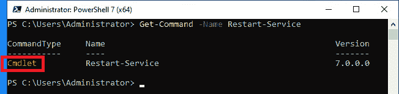
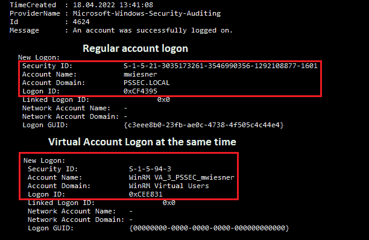

# 第十章：语言模式和仅足够管理（JEA）

我们已经学习了 PowerShell 提供的出色日志记录和审计功能，探索了如何访问本地系统以及 Active Directory 和 Azure Active Directory。我们还查看了日常的红队和蓝队任务。在本书的这一部分，我们将更深入地探讨缓解功能以及 PowerShell 如何帮助你构建一个强大且更安全的环境。

我们将首先探讨语言模式，理解受限语言模式和**仅足够管理**（**JEA**）之间的区别。然后，我们将深入了解 JEA，并探索配置你自己的第一个 JEA 端点所需的内容。

你将学习角色能力和会话配置文件的作用，并学习如何在你的环境中部署 JEA。如果你手头有合适的工具，比如 JEAnalyzer，创建初始的 JEA 配置并不困难。

最后，你将理解如何在使用 JEA 时充分利用日志记录，并了解应该避免哪些风险命令或绕过方法，以强化你的 JEA 配置和环境。

在本章中，你将深入了解以下主题：

+   PowerShell 中的语言模式是什么？

+   理解 JEA

+   使用 JEAnalyzer 简化你的部署

+   在 JEA 会话中的日志记录

+   最佳实践—避免风险和可能的绕过

# 技术要求

为了最大化本章的学习效果，请确保你具备以下内容：

+   PowerShell 7.3 及以上版本

+   已安装 Visual Studio Code

+   访问**第十章**的 GitHub 仓库：

[`github.com/PacktPublishing/PowerShell-Automation-and-Scripting-for-Cybersecurity/tree/master/Chapter10`](https://github.com/PacktPublishing/PowerShell-Automation-and-Scripting-for-Cybersecurity/tree/master/Chapter10)

# PowerShell 中的语言模式是什么？

PowerShell 中的语言模式决定了会话中允许使用哪些 PowerShell 元素。你可以通过运行`$ExecutionContext.SessionState.LanguageMode`来查看当前会话的语言模式——当然，这只有在你被允许运行该命令时才有效：


图 10.1 – 查询语言模式

在截图中显示的示例中，当前会话启用了完整语言模式。

有四种不同的语言模式可供选择，我们将在接下来的章节中更深入地探讨这些模式。

## 完整语言（FullLanguage）

完整语言模式是 PowerShell 的默认模式，所有命令和元素都被允许。

用户可能遇到的唯一限制是，如果他们没有足够的 Windows 权限来运行某个命令（例如管理员权限），但这种行为不受语言模式的限制。

## 受限语言（RestrictedLanguage）

受限语言模式是一种*数据特定形式的 PowerShell 语言*，主要用于支持 `Import-LocalizedData` 使用的本地化文件。虽然在此模式下可以执行 cmdlet 和函数，但不允许运行脚本块。需要注意的是，受限语言模式并不打算在大多数场景中显式使用，应仅在处理本地化文件时使用。

并且从 PowerShell 7.2 开始，如果配置了系统锁定模式，`New-Object` cmdlet 会被禁用。

默认情况下仅允许以下变量：

+   `$****True`

+   `$****False`

+   `$****Null`

+   `$****PSCulture`

+   `$****PSUICulture`

默认情况下仅允许以下运算符：

+   `-****eq`

+   `-****gt`

+   `-****lt`

请参阅 *第二章*，*PowerShell 脚本基础*，以了解更多关于运算符的详细信息。

## 无语言模式 (NoLanguage)

“无语言模式”只能通过 API 使用，并且不允许任何类型的脚本。

类似于受限语言模式，从 PowerShell 7.2 开始，如果配置了系统锁定模式，`New-Object` cmdlet 会被禁用。

## 受限语言模式 (ConstrainedLanguage)

正如我们在本书的 *第五章* 中学到的，*PowerShell 的强大—系统和 API 访问*，滥用 PowerShell 的最危险方式之一是滥用 COM 或 .NET，或者使用 `Add-Type` 来运行和复用用其他语言（如 C#）编写的代码。

受限语言模式防止了这些危险的场景，同时仍然允许用户使用合法的 .NET 类以及所有 cmdlet 和 PowerShell 元素。它旨在支持日常的管理任务，但限制用户执行风险较大的操作，例如调用任意 API：


图 10.2 – 在受限语言模式下，无法运行来自任意 API 的函数

要配置测试语言模式，可以通过命令行简单设置：

```
> $ExecutionContext.SessionState.LanguageMode = "ConstrainedLanguage"
```

在生产环境中使用此设置并不推荐——如果对手获得系统访问权限，他们可以轻易更改此设置，从而危及系统安全：

```
> $ExecutionContext.SessionState.LanguageMode = "FullLanguage".
```

还有一个未记录的 `__PSLockDownPolicy` 环境变量，一些博客推荐使用它。然而，这个变量仅用于调试和单元测试，不应用于强制执行，因为同样的原因：攻击者可以轻松覆盖它，且它应仅用于测试。

为了有效地使用受限语言模式来保护 PowerShell 环境，关键是与强大的应用控制解决方案（如 **Windows Defender 应用控制**（**WDAC**））结合使用：

[`docs.microsoft.com/en-us/windows/security/threat-protection/windows-defender-application-control/select-types-of-rules-to-create`](https://docs.microsoft.com/en-us/windows/security/threat-protection/windows-defender-application-control/select-types-of-rules-to-create)

如果没有采取这些措施，攻击者可以轻松绕过受限语言模式，通过使用其他脚本引擎或创建自定义恶意软件（如 `.exe` 或 `.dll` 文件）来实现。

我们还将在*第十一章*中进一步探讨 AppLocker 和应用程序控制，*AppLocker、应用程序控制和* *代码签名*。

请务必参考 PowerShell 团队关于受限语言模式的博客文章：

[`devblogs.microsoft.com/powershell/powershell-constrained-language-mode/`](https://devblogs.microsoft.com/powershell/powershell-constrained-language-mode/)

受限语言模式是一个很好的选择，但如果能够进一步限制会话中或特定用户允许哪些具体命令和参数，那不是更好吗？这正是 JEA 的作用所在。

# 理解 JEA

JEA 完全符合其名称的含义：它允许你定义哪些角色可以执行哪些命令，并只授予足够的管理权限。

假设你有多个人在同一服务器系统上工作：可能有管理员和支持人员，他们可能需要执行某些操作，比如不时重启一个服务（例如，在打印服务器上重启打印缓冲服务）。这类操作需要管理员权限，但对支持人员来说，管理员账户意味着过多的权限——如果支持人员的凭证被窃取，这些权限可能会被攻击者滥用。

使用 JEA，系统管理员可以定义某个角色可以执行哪些命令，甚至可以限制参数。因此，支持人员可以通过 `PowerShell Remoting** (`PSRemoting**) 登录，快速重启打印缓冲服务，并返回到他们的日常工作中。除了配置的命令，无法使用其他任何命令。

此外，JEA 依赖于 PSRemoting，这也是避免在目标系统上留下凭证的一个好方法。甚至可以配置在目标系统上使用虚拟账户代表操作人员。一旦会话终止，虚拟账户将被销毁，无法再使用。

## JEA 概述

JEA 依赖于 PSRemoting：一种让你能够远程连接到定义的端点的技术，我们在*第三章*中进一步探讨了这一点，*探索 PowerShell 远程管理技术和* *PowerShell Remoting*。

有两个重要文件需要配置 JEA 基础设置——**角色能力文件**和**会话配置文件**。在 PSRemoting 会话中使用这两个文件，JEA 才能发挥其作用。

当然，你还需要限制所有其他访问方式（如通过远程桌面）到目标服务器，以防止用户绕过你的 JEA 限制。

下图展示了 JEA 连接的工作原理概述：


图 10.3 – 如何连接到 JEA 的高级概述

使用 JEA 甚至可以允许非管理员用户访问服务器，执行为该用户角色预定义的管理任务。

根据配置，虚拟帐户可以代表用户使用，从而允许非管理员的远程用户完成需要管理员权限的任务。别担心；当然，在虚拟帐户下执行的每个命令都会被记录，并可以追溯到原始用户。

你可能听说过很多关于 PSRemoting 会话的内容，但在这幅图中，你能找到 JEA 吗？

一切从启动与远程服务器的交互式会话开始——例如，使用 `Enter-PSSession`。

你也可以将会话选项添加到会话中——这是你能找到 JEA 的地方吗？不，但会话选项在你不想连接到*普通* PowerShell 会话时非常有用。例如，如果你需要连接到一个代理，`-SessionOption` 可以帮助你识别这些细节。

会话选项非常有用，但它们不属于本章内容。所以，如果你想了解更多关于它们的信息，请参考 `New-PSSessionOption` cmdlet 提供的选项：

[`docs.microsoft.com/en-us/powershell/module/microsoft.powershell.core/new-pssessionoption`](https://docs.microsoft.com/en-us/powershell/module/microsoft.powershell.core/new-pssessionoption)

然后，你可以选择使用 `-ConfigurationName` 参数将配置添加到会话中。这是 JEA 隐藏的地方吗？差不多，但我们还没到那里。你可以在下面的图中看到选项、配置和 JEA 最终适配的位置：


图 10.4 – JEA 所在位置

JEA 真正发挥作用的地方是在配置中，其中创建了角色定义。因此，JEA 是建立的会话的一部分，通过 **安全描述符定义语言**（**SDDL**）保护，并包含特定的角色定义。SDDL 定义了用户或组对资源访问的权限。

## JEA 规划

在使用 JEA 之前，有几个事项需要先考虑。JEA 已包含在 PowerShell 5.0 中，因此请确保安装了正确的版本（5.0 或更高版本）。你可以使用 `$PSVersionTable.PSVersion` 检查当前版本。

由于 JEA 依赖于 PSRemoting 和 WinRM，请确保两者都已配置并启用。有关更多细节，请参见 *第三章*，*探索 PowerShell 远程管理技术和 PowerShell 远程连接*。

你还需要具有系统的管理员权限，才能配置 JEA。

不仅需要安装正确的 PowerShell 版本，还需要安装正确的操作系统版本。以下截图显示了服务器操作系统的所有支持版本，以及确保 JEA 正常运行所需采取的步骤：


图 10.5 – 服务器操作系统的 JEA 支持性

JEA 也可以在客户端操作系统上使用。以下截图显示了每个版本的可用功能以及在每个操作系统上使 JEA 运行所需的步骤：


图 10.6 – 客户端操作系统的 JEA 支持性

最后，你需要确定要限制的用户和/或组，以及每个用户应该拥有的权限。这听起来可能有些挑战。在本章中，你将找到一些有用的技巧和工具，帮助你完成这项任务。

但在我们深入探讨之前，让我们先了解一下 JEA 包含了哪些内容。首先，JEA 背后有两个主要文件，如下所示：

+   角色能力文件

+   会话配置文件

让我们首先探索一下角色能力文件是什么，以及如何配置它。

## 角色能力文件

角色能力文件决定了每个角色可以运行哪些命令。你可以指定特定角色中的用户可以执行哪些操作，并将这些角色限制为仅使用某些 cmdlet、函数、提供程序和外部程序。

通常会为某些角色定义角色能力文件——例如打印服务器管理员、DNS 管理员、一级帮助台等。由于角色能力文件可以作为 PowerShell 模块的一部分进行实现，因此你可以轻松地与他人共享它们。

使用`New-PSRoleCapabilityFile`，你可以创建你的第一个骨架 JEA 角色能力文件：

```
> New-PSRoleCapabilityFile -Path .\Support.psrc
```

一个名为`Support.psrc`的空文件被创建，并预填充了可以填写和编辑的参数：


图 10.7 – 一个空的骨架角色能力文件

在选择角色能力文件的名称时，请确保它反映了实际角色的名称——因此，请小心选择每个文件的名称。在我们的示例中，我们创建了`Support.psrc`角色能力文件，这是配置支持角色的一个很好的起点。

你可以在本书的 GitHub 仓库中找到一个未配置的生成骨架文件：

[`github.com/PacktPublishing/PowerShell-Automation-and-Scripting-for-Cybersecurity/blob/master/Chapter10/JEA_SkeletonRoleCapabilityFile.psrc`](https://github.com/PacktPublishing/PowerShell-Automation-and-Scripting-for-Cybersecurity/blob/master/Chapter10/JEA_SkeletonRoleCapabilityFile.psrc)

### 允许 PowerShell cmdlet 和函数

让我们从一个简单的角色能力文件例子开始。假设你是一个组织的管理员，帮助台报告了打印服务器的常见问题。那么，一个解决方案是给予帮助台管理员权限，允许他们操作所有打印服务器，但这会给所有帮助台员工过多的权限，并可能使你的环境面临风险。

因此，你可能只想赋予帮助台员工在打印服务器上重启服务的权限。

你可能听说过`Restart-Service`，它正是用于这个目的：重启服务。但它是一个*cmdlet*还是一个*function*？还是一个*alias*？

如果你对某个命令不确定，`Get-Command` cmdlet 可以帮助你查找更多信息：



图 10.8 – 使用 Get-Command 查找命令类型

借助`Get-Command`，我们现在知道`Restart-Service`是一个*cmdlet*，我们可以继续配置它。如果你查看生成的骨架`.psrc`文件，你可以看到多个以`Visible`开头的部分。通过这些部分，你可以定义在你的 JEA 会话中将提供哪些内容。你可以在角色能力文件中配置的所有参数与`New-PSRoleCapabilityFile` cmdlet 提供的参数一致：

```
> New-PSRoleCapabilityFile -Path <path> -ParameterName <values>
```

例如，如果你想配置一个简单的 JEA 配置并只允许`Restart-Service` cmdlet 可用，你可以使用以下命令：

```
> New-PSRoleCapabilityFile -Path .\Support.psrc -VisibleCmdlets 'Restart-Service'
```

在这个例子中，我们使用`-VisibleCmdlets`参数将`Restart-Service` cmdlet 配置为在`Support`角色中可用，所以让我们更仔细地看看使用此配置选项时可以做什么。

### VisibleCmdlets

使用`-VisibleCmdlets`参数来定义哪些*cmdlet*是可见的，并且可以被配置的角色使用。所有定义的 cmdlet 需要在目标系统上可用，以避免错误。

创建了`Support.psrc`角色能力文件后，你也可以直接使用你选择的文本编辑器编辑它。你不仅可以在创建角色能力文件时使用`-VisibleCmdlets`参数，还可以在角色能力文件中直接配置此选项。

如果你只想配置 cmdlet，而不限制其参数，你可以将它们放入单引号中，并用逗号分隔。在这个例子中，配置的角色将能够重启服务以及重启计算机：

```
VisibleCmdlets = 'Restart-Service', 'Restart-Computer'
```

在使用通配符配置 cmdlet 时，必须意识到可能涉及的风险。虽然使用通配符来允许一系列命令看似方便，但你可能无意中授予了比必要更多的权限，从而在你的设置中创建了漏洞。使用以下命令时，该角色将能够运行所有以`Get-`开头的命令：

```
VisibleCmdlets = 'Get-*'
```

但是，允许一个角色使用所有以 `Get-` 开头的命令也可能会通过 `Get-Content` cmdlet 暴露敏感信息，即使这并不是该角色的预期用途。因此，仔细考虑允许的命令并定期审查和调整权限是非常重要的，以维护系统的安全性。

为了限制 cmdlet 的参数，你可以构建简单的哈希表，如下所示：

```
VisibleCmdlets = @{ Name = 'Restart-Service'; Parameters = @{ Name = 'Name'; ValidateSet = 'Dns', 'Spooler' }},
@{ Name = 'Restart-Computer'; Parameters = @{ Name = 'Name'; ValidateSet = 'Confirm', 'Delay', 'Force', 'Timeout' }}
@{ Name = 'Get-ChildItem'; Parameters = @{ Name = 'Path';  ValidatePattern = '^C:\\Users\\[^\\]+$' }}
```

使用前面的示例，配置的角色将允许执行三条命令：第一条允许的 cmdlet 是 `Restart-Service`，但是这个角色只允许重新启动 `dns` 和 `spooler` 服务。第二条允许的 cmdlet 授权角色也可以*重启计算机*，但仅能使用 `-Confirm`、`-Delay`、`-Force` 和 `-Timeout` 参数。最后，但同样重要的是，第三条允许的 cmdlet 是 `Get-ChildItem`，但根据 `ValidatePattern` 中指定的配置，拥有该角色的用户只能查询 `C:\Users` 路径下的子文件夹。

### VisibleFunctions

`VisibleFunctions` 定义了哪些*函数*是可见的，并且可以被配置的角色使用。所有定义的函数需要在目标系统上可用，或者在当前角色能力文件的 `FunctionDefinitions` 部分定义，以避免错误。

函数的定义方式类似于 cmdlet：

```
VisibleFunctions = 'Restart-NetAdapter'
```

这个示例将允许 `Restart-NetAdapter` 函数；如果执行该函数，它会通过禁用并重新启用网络适配器来重新启动网络适配器。

对于函数，你也可以使用哈希表来定义更复杂的限制和通配符，这些也类似于 cmdlet —— 这些仍然需要非常小心地使用。

### VisibleAliases

`VisibleAliases` 定义了哪些*别名*是可见的，并且可以被配置的角色使用。所有定义的别名需要在目标系统上可用，或者在当前角色能力文件的 `AliasDefinitions` 部分定义，以避免错误：

```
VisibleAliases = 'cd', 'ls'
```

这个示例将允许 `cd` 别名使用 `Set-Location` cmdlet，`ls` 别名使用 `Get-ChildItem` cmdlet。

别名的配置方式与在角色能力文件中的 cmdlet 和函数类似。有关更多示例，请参阅这些部分（*VisibleCmdlets* 和 *VisibleFunctions*）。

### VisibleExternalCommands

`VisibleExternalCommands` 定义了哪些*传统的 Windows 可执行文件*是可见的，并且可以被配置的角色使用。所有定义的外部命令需要在目标系统上可用，以避免错误。外部命令的示例包括独立的可执行文件或已安装的程序。始终测试你的配置，确保所有的依赖项都已被配置考虑。

使用此设置，你可以允许外部命令和 PowerShell 脚本。使用以下示例，你将允许一个名为`putty.exe`的可执行文件，该文件位于`C:\tmp\putty.exe`，以及一个名为`myOwnScript.ps1`的 PowerShell 脚本，该脚本位于`C:\scripts\myOwnScript.ps1`：

```
VisibleExternalCommands = 'C:\tmp\putty.exe', 'C:\scripts\myOwnScript.ps1'
```

确保你已彻底审查并测试了你将暴露的脚本，并且已经实施了适当的措施以防止未经授权的篡改。如果你暴露的是脚本或可执行文件，务必确保你对它有完全的控制，并且确信它不会危及你的配置。

### VisibleProviders

默认情况下，在 JEA 会话中没有可用的 PowerShell *提供程序*，但通过使用`VisibleProviders`，你可以定义哪些提供程序是可见的，并且可以由配置的角色使用。所有定义的提供程序需要在目标系统上可用，以避免出现错误。

要获取提供程序的完整列表，可以运行`Get-PSProvider`，如以下截图所示：


图 10.9 – 获取可用提供程序的完整列表

例如，如果你希望使`Registry`提供程序可用，并且随之也使其`HKEY_LOCAL_MACHINE`（**HKLM**）和`HKEY_CURRENT_USER`（**HKCU**）驱动器可用，配置将如下所示：

```
VisibleProviders = 'Registry'
```

仅在角色确实需要时才使提供程序可用。如果此角色不经常与注册表操作，考虑编写脚本或函数来代替，如果该任务是可重复的。

### ModulesToImport

使用`ModulesToImport`参数，你可以定义当前会话中将要导入的模块。请注意，模块必须事先安装，才能导入。

```
ModulesToImport = @{ModuleName='EventList'; ModuleVersion='2.0.2'}
```

同样，你可以使用哈希表来指定更多详细信息。前面的示例将导入版本为*2.0.2*的`EventList`模块。请确保使用`VisibleFunctions`和/或`VisibleCmdlets`来限制此会话中可以使用的函数或 cmdlet。

### ScriptsToProcess

指定的脚本文件将在会话建立后执行，类似于启动脚本。脚本的路径需要定义为完整路径或绝对路径。

`ScriptsToProcess` 参数允许你将已配置的脚本添加到该角色的 JEA 会话中，然后在会话的上下文中运行。当然，脚本需要在目标系统上可用。

指定的脚本会在建立与此会话的连接时立即运行：

```
ScriptsToProcess = 'C:\Scripts\MyScript.ps1'
```

如果`ScriptsToProcess`在角色能力文件中为某个角色配置，它仅适用于该角色。如果在会话配置文件中进行配置，则适用于所有与该会话关联的角色。

### AliasDefinitions

你可以使用此部分定义在目标系统上未定义且仅在当前 JEA 会话中使用的别名：

```
AliasDefinitions = @{Name='ipc'; Value='ipconfig'; Description='Displays the Windows IP Configuration'; Options='ReadOnly'}
VisibleAliases = 'ipc'
```

别忘了还要将别名添加到`VisibleAliases`中，以使其在会话中可用。

### FunctionDefinitions

你可以使用此部分定义目标系统上不可用且仅在当前 JEA 会话中使用的函数。

如果你在`FunctionDefinitions`中定义了函数，确保在`VisibleFunctions`部分也进行配置：

```
VisibleFunctions = 'Restart-PrintSpooler'
FunctionDefinitions = @{
    Name        = 'Restart-PrintSpooler'
    ScriptBlock = {
        if ((Get-Service -Name 'Spooler').Status -eq 'Running') {
            Write-Warning "Attempting to restart Spooler service..."
            Restart-Service -Name 'Spooler'
        }
        else {
            Write-Warning "Attempting to start Spooler service..."
            Start-Service -Name 'Spooler'
        }
    }
}
```

这个示例创建了一个`Restart-PrintSpooler`自定义函数，首先检查打印机服务是否正在运行。如果正在运行，它将重新启动；如果没有运行，它将尝试启动。

如果你引用了其他模块，请使用**完全限定模块名称**（**FQMN**）而不是别名。

与其编写大量自定义函数，不如编写一个 PowerShell 脚本模块并配置`VisibleFunctions`和`ModulesToImport`。

### VariableDefinitions

你可以使用此部分定义只在当前 JEA 会话中使用的变量。变量通过哈希表来定义。变量可以静态设置或动态设置：

```
VariableDefinitions = @{ Name = 'Variable1'; Value = { 'Dynamic' + 'InitialValue' } }, @{ Name = 'Variable2'; Value = 'StaticValue' }
```

以下代码行是使用`VariableDefinitions`设置静态变量和动态变量的示例：

```
VariableDefinitions =@{TestShare1 = '$Env:TEMP\TestShare'; TestShare2 = 'C:\tmp\TestShare'}
```

这个示例将定义两个变量：第一个变量`$TestShare1`是动态设置的，指向`$Env:TEMP`环境变量所指向的位置；第二个变量`$TestShare2`是静态的，始终指向`'C:\tmp\TestShare'`。

变量也可以配置选项。此参数是可选的，默认值是`None`。可接受的参数有`None`、`ReadOnly`、`Constant`、`Private`或`AllScope`。

### EnvironmentVariables

你可以使用此部分定义仅在当前 JEA 会话中使用的环境变量。环境变量通过哈希表来定义：

```
EnvironmentVariables = @{Path= '%SYSTEMROOT%\system32; %SYSTEMROOT%\System32\WindowsPowerShell\v1.0\;C:\Program Files\PowerShell\7\;C:\Program Files\Git\cmd'}
```

上面的示例会将环境`Path`变量设置为包含`'%SYSTEMROOT%\system32; %SYSTEMROOT%\System32\WindowsPowerShell\v1.0\;C:\Program Files\PowerShell\7\;C:\Program Files\Git\cmd'`字符串，从而使像 Windows PowerShell、PowerShell 7 和 Git 等程序能够找到它们的可执行文件并无需提示用户即可运行。

### TypesToProcess

你可以使用`TypesToProcess`来指定应该添加到配置会话中的`types.ps1xml`文件。类型文件通常指定为`.ps1xml`文件。使用完整或绝对路径在角色能力文件中定义类型文件：

```
TypesToProcess = 'C:\tmp\CustomFileTypes.ps1xml'
```

你可以在官方文档中找到关于类型文件的更多信息：

[`docs.microsoft.com/en-us/powershell/module/microsoft.powershell.core/about/about_types.ps1xml`](https://docs.microsoft.com/en-us/powershell/module/microsoft.powershell.core/about/about_types.ps1xml)

### FormatsToProcess

你可以使用`FormatsToProcess`参数来指定当前会话中应该加载哪些格式化文件。类似于类型文件，格式化文件也配置在以`.ps1xml`结尾的文件中。另外，对于`FormatsToProcess`，路径必须指定为完整路径或绝对路径：

```
FormatsToProcess = 'C:\tmp\CustomFormatFile.ps1xml'
```

你可以在官方文档中找到更多关于格式化文件的信息：

[`docs.microsoft.com/zh-cn/powershell/module/microsoft.powershell.core/about/about_format.ps1xml`](https://docs.microsoft.com/zh-cn/powershell/module/microsoft.powershell.core/about/about_format.ps1xml)

### AssembliesToLoad

为了使二进制文件中包含的类型对你编写的脚本和函数可用，可以使用`AssembliesToLoad`参数来指定所需的程序集。这样，你就可以在 JEA 会话中利用这些程序集提供的功能：

```
AssembliesToLoad = "System.Web","FSharp.Compiler.CodeDom.dll", 'System.OtherAssembly, Version=4.0.0.0, Culture=neutral, PublicKeyToken=b03f5f7f11d50a3a'
```

如果你想了解更多关于 JEA 角色功能文件以及更多选项，比如为某个角色创建专用的自定义函数，请参考官方文档：

[`docs.microsoft.com/zh-cn/powershell/scripting/learn/remoting/jea/role-capabilities`](https://docs.microsoft.com/zh-cn/powershell/scripting/learn/remoting/jea/role-capabilities)

如果你希望更新角色功能文件，可以随时通过保存对角色功能文件的更改来完成。任何在更改后建立的新的 JEA 会话都将反映这些更新的更改。

当用户被授予多个角色功能时，这些角色功能也可以合并。请参考官方文档了解在这种情况下将应用哪些权限：

[`docs.microsoft.com/zh-cn/powershell/scripting/learn/remoting/jea/role-capabilities`](https://docs.microsoft.com/zh-cn/powershell/scripting/learn/remoting/jea/role-capabilities)#how-role-capabilities-are-merged

现在你已经定义了你的角色——为了更好的概览，可以将每个角色创建在单独的角色功能文件中——接下来是将这些角色分配给特定用户和组，并定义会话特定的参数。这可以通过会话配置文件来完成。

## 会话配置文件

使用会话配置文件，你可以指定谁可以连接到哪个端点。你不仅可以将用户和组映射到特定的角色，还可以配置全局会话设置，比如连接到会话时应该执行哪些脚本、日志策略或连接时将使用哪个身份（例如，虚拟账户或**组托管服务账户**（**gMSAs**））。如果需要，你还可以按每台机器配置会话文件。

你可以使用`New-PSSessionConfigurationFile` cmdlet 创建骨架会话配置文件：

```
New-PSSessionConfigurationFile -Path .\JEA_SessionConfigurationFile.pssc
```

类似于创建骨架角色功能文件，会创建一个可以编辑的预填充会话配置文件：


图 10.10 – 一个空的骨架会话配置文件

在会话配置文件中，还有一些*通用参数*帮助您描述此文件。以下是其中的一些：

+   `SchemaVersion`：描述此文档的模式版本号，通常是 `2.0.0.0`，如果没有另行指定。

+   `GUID`：GUID 是一个唯一的、随机生成的 UID，用于标识此文件。

+   `Author`：创建此文档的作者。

+   `Description`：此会话配置文件的描述。最好具体描述，这样您可以轻松编辑和操作日益增长的配置文件库。

让我们看看您还可以使用会话配置文件配置哪些其他选项。

### 会话类型

会话类型指示创建了哪种类型的会话（按语言模式划分）以及允许哪些命令。在 JEA 会话配置文件中，您应该*始终配置* `SessionType = '****RestrictedRemoteServer'`。

在常规会话文件中，您可以为此参数使用以下值：

+   `Default`：此配置提供*不受限制的 PowerShell 终端*。这意味着用户可以运行系统上可用的*任何*命令。在配置 JEA 时不推荐使用此会话类型。

+   `Empty`：会话中未添加任何模块和命令。仅当您在会话配置文件中配置了 `VisibleCmdlets`、`VisibleFunctions` 和其他参数时，您的会话才会被填充。在配置 JEA 时不要使用这些设置，除非您有用例需要限制在配置 `RestrictedRemoteServer` 时允许的 cmdlet。

+   `RestrictedRemoteServer`：当创建 JEA 会话配置文件时，应使用此值。它适当地限制了语言模式，并且仅导入一小部分基本命令，如 `Exit-PSSession`、`Get-Command`、`Get-FormatData`、`Get-Help`、`Measure-Object`、`Out-Default` 和 `Select-Object`，这些足以完成大多数管理任务。此配置提供更高的安全级别，因为它限制了访问潜在危险的 cmdlet 和函数。

在创建基础会话配置文件时，您可以使用 `-SessionType` 参数直接配置会话类型，如下所示：

```
> New-PSSessionConfigurationFile -SessionType RestrictedRemoteServer -Path .\JEA_SessionConfigurationFile.pssc
```

### TranscriptDirectory

会话记录会记录特定会话中运行的所有命令以及其输出。建议对每个用户使用会话记录并审计正在执行的命令。这可以通过使用 `TranscriptDirectory` 参数实现。

首先，确保在 JEA 端点上预先配置一个文件夹来存储转录文件。此文件夹需要是一个受保护的文件夹，以确保普通用户无法修改或删除该文件夹中的任何数据。此外，确保本地系统帐户已配置为具有读写访问权限，因为该帐户将用于创建转录文件。

最好确保转录文件定期上传并解析到你的**安全信息和事件管理**（**SIEM**）系统中，以便它们存储在一个集中位置。还要确保实现日志文件轮换机制，以避免硬盘空间耗尽。

一切都配置好了吗？很好！现在，是时候在会话配置文件中配置预先配置的文件夹路径了，具体如下：

```
TranscriptDirectory = 'C:\Jea-Transcripts'
```

使用前述配置将所有转录写入`C:\Jea-Transcripts`文件夹。新文件将始终使用时间戳生成，以确保没有文件被覆盖。

除了`TranscriptDirectory`参数之外，还要确保实现适当的审计。有关详细信息，请参阅*第四章*，*检测 – 审计与监控*。

### 配置 JEA 身份

使用 JEA 时，你不会在目标系统上使用常规帐户。那么，实际上会使用哪个帐户呢？

在 JEA 中，身份有两种选择：使用**虚拟帐户**或`gMSA`。除非在 JEA 会话中需要访问网络资源，否则你应该始终优先选择使用虚拟帐户。在接下来的部分中，我们将详细了解这两种选择，并探讨为什么虚拟帐户是更安全的选项。

#### 虚拟帐户

如果有疑问，配置虚拟帐户应该始终是你的首选选项。虚拟帐户是一个临时管理员帐户，在 JEA 会话开始时创建，并在会话结束时销毁。这意味着它只在远程会话期间存在，是提供临时管理员访问的安全选项。一个巨大优势是，在任何时候，都没有可重用的凭据进入系统。

当连接到端点时，非管理员用户会以特权虚拟帐户身份连接并在会话中运行所有命令。此帐户是**域控制器**（**DCs**）上的本地管理员或域管理员帐户，但仍然受到限制，只能运行此角色允许的命令。

为了更容易跟随这个示例，我创建了一个简单的脚本来创建一个`ServerOperator`角色，并与一个会话配置一起注册，让连接用户以虚拟帐户身份连接。让我们使用这个配置来演示本章中的示例。

你可以在本书的 GitHub 仓库中找到脚本，地址为[`github.com/PacktPublishing/PowerShell-Automation-and-Scripting-for-Cybersecurity/blob/master/Chapter10/JEA-ServerOperator.ps1`](https://github.com/PacktPublishing/PowerShell-Automation-and-Scripting-for-Cybersecurity/blob/master/Chapter10/JEA-ServerOperator.ps1)。

在我的示例中，我在`PSSec-Srv01`上执行所有命令，这是一台加入`PSSec`域的 Windows 2019 服务器。

首先，确保你要为其配置`ServerOperator`角色的帐户已存在于你的环境中，并且可能需要调整脚本中的用户名。在我的示例中，用户是`PSSec\mwiesner`。

然后，从 GitHub 仓库运行`JEA-ServerOperator.ps1`脚本，确保`ServerOperator` JEA 端点已成功创建。

一旦端点成功创建，使用`ServerOperator` JEA 会话建立到本地主机的会话：

```
> Enter-PSSession –ComputerName localhost –ConfigurationName ServerOperator -Credential $ServerOperator
```

一旦建立了依赖虚拟帐户的 JEA 会话，让我们通过在单独的提升权限的 PowerShell 控制台中运行`Get-LocalUser`命令，来检查实际的本地用户帐户。如你所见，没有为 JEA 连接创建额外的本地帐户：


图 10.11 – 未创建额外的本地帐户

为了验证在当前机器运行时间内哪些虚拟帐户已登录或正在登录，我编写了一个脚本，帮助你查看为 JEA 会话创建了哪些虚拟帐户：

[`github.com/PacktPublishing/PowerShell-Automation-and-Scripting-for-Cybersecurity/blob/master/Chapter10/Get-VirtualAccountLogons.ps1`](https://github.com/PacktPublishing/PowerShell-Automation-and-Scripting-for-Cybersecurity/blob/master/Chapter10/Get-VirtualAccountLogons.ps1)

该脚本使用`Get-CimInstance`检索有关登录用户及其登录会话的信息，合并这些信息，并显示哪些虚拟帐户已创建以及会话是仍然活跃还是不活跃。

以下截图展示了`Get-VirtualAccountLogons.ps1`脚本的输出：


图 10.12 – 可以使用 Get-VirtualAccountLogons.ps1 脚本评估当前运行时间的虚拟帐户使用情况

所有在操作系统重启之前创建的虚拟帐户都会缓存到**通用信息模型**（**CIM**）表中，因此你可以看到过去和当前的虚拟帐户连接。如果会话仍然建立，脚本会显示`ActiveSession: True`。

所有通过已建立的 JEA 会话生成的虚拟帐户名称都遵循 `"WinRM VA_<number>_<domain>_<username>"` 方案。如果同一用户帐户建立了多个会话，则该数字会相应增加。

你知道吗？

还可以通过使用已弃用的 `Get-WmiObject win32_process).GetOwner().User** **Windows Management** **Instrumentation** (`WMI**) 命令来检索当前所有用户的列表。

因此，如果你不需要访问网络资源，配置 JEA 会话身份的最佳选择是使用虚拟帐户。

#### gMSA

如果你需要访问网络资源（例如，其他服务器或网络共享），则 gMSA 是虚拟帐户的替代方案。

你可以在官方文档中找到有关如何创建和配置 gMSA 的更多信息：

https://docs.microsoft.com/en-us/windows-server/security/group-managed-service-accounts/group-managed-service-accounts-overview

你可以使用 gMSA 帐户对域进行身份验证，从而访问任何已加入域的计算机上的资源。用户通过 gMSA 帐户获得的权限由将要访问的资源决定。只有在显式授予 gMSA 帐户管理员权限时，使用该帐户的用户才会拥有管理员权限。

gMSA 是由 Active Directory 管理的帐户，并且会定期更改其密码。因此，密码可能会被对手重新使用——如果被捕获——但仅限于有限的时间。

最理想的情况是使用虚拟帐户；仅在你的任务确实需要访问某些网络资源时，才使用 gMSA 帐户，典型的情况包括：

+   在 gMSA 身份下，确定是谁执行了哪些操作更加困难，因为同一个帐户是所有连接到同一 gMSA 会话的用户共享使用的。要确定是哪位用户执行了哪项操作，你需要将 PowerShell 会话的转录文件与事件日志中的相应事件进行关联。

+   有可能授予比 JEA 配置计划更多的权限，因为 gMSA 帐户可能有权访问许多不需要的网络资源。始终遵循最小权限原则，以有效限制你的 JEA 会话。

gMSA 仅适用于从 Windows PowerShell 5.1 或更高版本开始，并且只能在已加入域的计算机上使用。当然，如果你不希望将计算机加入生产域，也可以使用独立域。

#### 选择 JEA 身份

一旦你选择了想要用于连接 JEA 会话的身份，就可以开始配置它。你需要配置一个虚拟帐户或 gMSA，并可以在 JEA 会话配置文件中进行设置。

使用以下选项配置本地虚拟帐户：

+   `RunAsVirtualAccount = $****true`

+   `RunAsVirtualAccountGroups = '****NetworkOperator', 'NetworkAuditor'`

使用`RunVirtualAccountGroups`参数，你可以定义虚拟帐户应该在哪些组中存在。为了防止虚拟帐户默认被添加到本地或域管理员组中，你需要指定一个或多个安全组。

使用`GroupManagedServiceAccount`参数定义 gMSA，如下所示：

```
GroupManagedServiceAccount = 'MyJEAgMSA'
```

另外，参考官方的会话配置文档：

[`docs.microsoft.com/en-us/powershell/scripting/learn/remoting/jea/session-configurations`](https://docs.microsoft.com/en-us/powershell/scripting/learn/remoting/jea/session-configurations)

### ScriptsToProcess

类似于`ScriptsToProcess`，它可以在角色能力文件中进行配置。请参阅名为*角色能力文件*的章节中的*ScriptsToProcess*子节，了解更多信息以及如何配置它。

如果在角色能力文件中为角色配置了`ScriptsToProcess`，它只适用于该角色。如果在会话配置文件中配置，它适用于所有与此特定会话关联的角色。

### 角色定义

角色定义将你在角色能力文件中配置的角色与当前会话配置文件连接，并可以在哈希表中进行配置，如下所示：

```
RoleDefinitions = @{
    'CONTOSO\JEA_DNS_ADMINS' = @{ RoleCapabilities = 'DnsAdmin', 'DnsOperator', 'DnsAuditor' }
    'CONTOSO\JEA_DNS_OPERATORS' = @{ RoleCapabilities = 'DnsOperator', 'DnsAuditor' }
    'CONTOSO\JEA_DNS_AUDITORS' = @{ RoleCapabilities = 'DnsAuditor' }
}
```

你可以将一个或多个角色能力分配给用户帐户或活动目录组。

### 条件访问

JEA 本身已经是一个限制角色在终端上执行特定命令的极佳选择，但所有分配了角色的用户或组都能够运行配置的命令。但如果你希望设置更多的限制，比如—例如—强制用户还使用**多因素` `认证**（**MFA**）呢？

这时，额外的访问控制起作用了。使用`RequiredGroups`参数，你可以强制要求连接的用户属于一个定义的组——你可以使用这个组来强制对用户施加更多的条件。

使用`And`或`Or`有助于你定义更细化的规则。

使用以下示例，所有连接的用户必须属于名为`MFA-logon`的安全组；只需使用`And`条件：

```
RequiredGroups = @{ And = 'MFA-logon' }
```

有时，你可能有不同的认证方式或额外的安全要求。所以，如果你希望连接的用户属于`MFA-logon` *或* `smartcard-logon`组，可以使用`Or`条件，如以下示例所示：

```
RequiredGroups = @{ Or = 'MFA-logon', 'smartcard-logon' }
```

当然，你也可以通过结合`And`和`Or`条件来创建更复杂的嵌套条件。

在以下示例中，连接的用户需要是`elevated-jea`组的成员，并且需要通过 MFA 或智能卡进行登录：

```
RequiredGroups = @{ And = 'elevated-jea', @{ Or = 'MFA-logon', 'smartcard-logon' }}
```

然而，无论你使用哪种配置选项，始终确保测试你的条件是否按计划应用。

### 用户驱动

通过配置和利用用户驱动器，可以从 JEA 会话中远程复制文件。例如，你可以从会话中复制日志文件，以便稍后在你的正常工作计算机上进行详细分析。

要配置一个容量为 10MB 的用户驱动器，请使用以下配置：

```
MountUserDrive = $true
UserDriveMaximumSize = 10485760
```

访问已配置用户驱动器的 JEA 会话后，你可以轻松地从会话中复制文件或将文件复制到会话中。

以下示例展示了如何将`myFile.txt`文件复制到你的`$ServerOperator` JEA 会话中：

```
Copy-Item -Path .\myFile.txt -Destination User: -ToSession $ServerOperator
```

下一个示例展示了如何从`$ServerOperator` JEA 会话中的远程计算机复制`access.log`文件到本地会话：

```
Copy-Item -Path User:\access.log -Destination . -FromSession $jeasession
```

尽管你可以从 JEA 会话中复制文件或将文件复制到该会话中，但无法在远程计算机上指定文件名或子文件夹。

如果你想了解更多关于 PowerShell 驱动器的信息，可以查看[`docs.microsoft.com/en-us/powershell/scripting/samples/managing-windows-powershell-drives`](https://docs.microsoft.com/en-us/powershell/scripting/samples/managing-windows-powershell-drives)。

### 访问权限（SDDL）

JEA 会话的访问权限是通过 SDDL 进行配置的。

因此，当你使用 JEA 时，SDDL 将在为会话配置分配用户/组**访问控制列表（ACL）**时自动进行配置。组和**安全标识符（SID）**会被查找并自动添加到会话配置中，确保拥有适当级别的访问权限。

你可以通过运行**(Get-PSSessionConfiguration –Name <会话配置名称>).SecurityDescriptorSddl** 命令来查找会话配置的 SDDL：


图 10.13 – 查找会话配置的 SDDL

请参考官方文档了解更多关于 SDDL 语法的信息：

https://docs.microsoft.com/en-us/windows/desktop/secauthz/security-descriptor-definition-language

## 部署 JEA

要部署 JEA，你需要了解你想要限制的用户使用了哪些命令。如果你问我，这是 JEA 中最难的部分。

但是有一些工具，例如我自己编写的开源项目 JEAnalyzer，可以大大简化这项任务。稍后我会在本章中回到这个工具。

确定了要限制的命令和用户/组后，首先创建一个会话能力文件和一个角色能力文件。下图展示了部署 JEA 所需的步骤：


图 10.14 – 部署 JEA 的步骤

创建了两个必需的文件之后，请确保在使用**Test-PSSessionConfigurationFile -Path <会话配置文件的路径>** cmdlet 部署文件之前检查会话配置文件的语法。

如果需要更改 JEA 会话配置，例如，将用户映射或移除到角色中，你将始终需要取消注册并重新注册 JEA 会话配置。如果只想更改角色能力文件中配置的角色，仅需更改配置，无需重新注册会话配置。

你还可以通过运行**Get-PSSessionCapability –ConfigurationName <configuration name> -`**Username <username>`来验证特定用户在特定会话中会获得哪些能力。

一旦准备好进行部署，你需要决定使用哪种部署机制。可以选择*手动注册会话*或使用**期望状态配置**（**DSC**）进行部署。

### 手动注册

如果你只想在少数机器上测试配置，或者只需要管理小型环境，那么手动注册机器是一个不错的选择。当然，你也可以使用手动注册命令来编写部署脚本，但你仍然需要找到一种方法来部署你的脚本。

因此，对于大型环境，DSC 可能是更适合的解决方案。

在手动注册之前，请确保至少向`RoleCapabilities`文件中添加了一个角色，并且已经创建并测试了附带的会话配置文件。

为了成功注册 JEA 配置，你需要在系统上具有本地管理员权限。

如果一切就绪，请根据你的配置调整以下命令并在终端上运行它进行配置：

```
Register-PSSessionConfiguration -Path .\MyJEAConfig.pssc -Name 'JEAMaintenance' -Force
```

注册会话后，确保重启 WinRM 服务，以确保新会话已加载并处于活动状态：

```
Restart-Service -name WinRM
```

有关工作示例，请参考本书 GitHub 仓库中的演示配置文件：

[`github.com/PacktPublishing/PowerShell-Automation-and-Scripting-for-Cybersecurity/blob/master/Chapter10/JEA-ServerOperator.ps1`](https://github.com/PacktPublishing/PowerShell-Automation-and-Scripting-for-Cybersecurity/blob/master/Chapter10/JEA-ServerOperator.ps1)

### 通过 DSC 进行部署

在大型环境中，利用 DSC 可能是值得的。DSC 是一种非常酷的方式，可以让你的远程服务器“照做”，并定期应用你选择的配置。

即使有人更改了服务器上的配置，通过配置 DSC 后，你的服务器也可以自我重置，无需管理员干预，因为它们可以定期拉取并调整其配置，确保与预设的基准一致。

DSC 是一个很大的话题，因此我无法详细描述整个技术，但如果你想了解更多，查看*第十三章**，其他内容？– 进一步的缓解措施和资源*，并查看官方文档。

有关基本 JEA DSC 配置，请参阅*注册 JEA* *配置*文档：

[`docs.microsoft.com/en-us/powershell/scripting/learn/remoting/jea/register-jea?`](https://docs.microsoft.com/en-us/powershell/scripting/learn/remoting/jea/register-jea?)#multi-machine-configuration-with-dsc

## 连接到会话

一旦你设置好 JEA 会话，请确保应该连接到 JEA 会话的用户已配置 **从网络访问此计算机** 的用户权限。

现在是关键时刻，你可以连接到 JEA 会话了：

```
Enter-PSSession –ComputerName <computer> –ConfigurationName <configuration name>
```

默认情况下，无法在命令行上使用 *Tab* 键自动完成命令。如果你希望能够使用这一功能，建议使用 `Import-PSSession`，它允许像 *Tab* 补全这样的功能正常工作，而不影响安全性：

```
> $jeasession = New-PSSession –ComputerName <computer> –ConfigurationName <configuration name>
> Import-PSSession -Session $jeasession -AllowClobber
```

不建议将 `TabExpansion2` 函数配置为可见函数，因为它会执行各种代码，对你的安全环境构成风险。

要显示本地计算机上所有可用的会话配置，运行 `Get-PSSessionConfiguration`。

一旦你成功配置、部署并测试了 JEA 会话，确保删除连接用户的所有其他访问方式。即使你部署了最好的 JEA 配置，如果用户可以通过其他连接方式绕过它，那也是毫无意义的——例如，通过远程桌面连接。

部署 JEA 一开始看起来像是需要大量工作，对吧？但别担心——实际上有一些方法可以简化你的工作，比如 JEAnalyzer。

# 使用 JEAnalyzer 简化你的部署

当我第一次了解 JEA 时，我曾热衷于推广它，并告诉每个人这个解决方案有多么强大。将用户可以运行的命令严格限制为仅需的命令，难道不是很棒吗？通过 JEA 和虚拟账户完全避免传递哈希值，配置虚拟账户难道不令人惊叹吗？

是的，确实如此！但当我向客户介绍 JEA 和它的强大功能时，我很快就收到了重复的问题：*我们如何找出用户和管理员正在使用哪些命令？我们如何以* *最简单的方式创建这些角色能力文件？*

这也是我想到 JEAnalyzer 模块的时刻。在我启动这个项目后，我的朋友 Friedrich Weinmann 也对这个项目产生了浓厚的兴趣。当我换了工作，几乎不再和客户讨论除 Microsoft Defender for Endpoint 以外的其他话题时，我很高兴他接管了我开始的项目，维护了该仓库，并将我们剩余的共同愿景融入其中。

你可以在 GitHub 上找到 JEAnalyzer 仓库：

[`github.com/PSSecTools/JEAnalyzer`](https://github.com/PSSecTools/JEAnalyzer)

JEAnalyzer 是一个 PowerShell 模块，可以通过 PowerShell Gallery 轻松安装，使用`Install-Module JEAnalyzer -Force`命令。安装过程中同意所有弹出窗口，由 NuGet 等提供的弹窗后，模块将被安装并可以使用`Import-Module JEAnalyzer`导入。

在本书写作时，JEAnalyzer 的最新版本是 `1.2.10`，包含 13 个功能，如下所示：


图 10.15 – JEAnalyzer 的可用功能

每个功能都有很好的文档说明，因此我不会描述所有功能，只会介绍一些最重要的功能，帮助你找出用户使用的命令，以及如何通过 JEAnalyzer 简单创建你的第一个角色能力和会话配置文件。

## 将脚本文件转换为 JEA 配置

如果你有某些脚本逻辑需要在 JEA 会话中运行，并且只想将脚本转换为端点配置，JEAnalyzer 可以帮你实现。

作为一个示例脚本文件，我使用了**导出 AD 用户到 CSV**脚本，该脚本最初由 Victor Ashiedu 于 2014 年编写。你可以在这里找到该脚本的版本：

[`github.com/sacroucher/ADScripts/blob/master/Export_AD_Users_to_CSV.v1.0.ps1`](https://github.com/sacroucher/ADScripts/blob/master/Export_AD_Users_to_CSV.v1.0.ps1)

下载脚本并将其保存在 `C:\DEMO\ext\Export_AD_Users_to_CSV.v1.0\Export_AD_Users_to_CSV.v1.0.ps1` 路径下。同时，在 `C:\JEA\` 目录下创建一个文件夹来存储输出文件。

在做好准备后，从本书的 GitHub 仓库下载脚本，并确保逐条执行命令。不要一次性运行整个脚本，确保你理解每个步骤——脚本有详细的注释。

你可以在这里找到该脚本：[`github.com/PacktPublishing/PowerShell-Automation-and-Scripting-for-Cybersecurity/blob/master/Chapter10/JEAnalyzer-AnalyzeScripts.ps1`](https://github.com/PacktPublishing/PowerShell-Automation-and-Scripting-for-Cybersecurity/blob/master/Chapter10/JEAnalyzer-AnalyzeScripts.ps1)。

本示例中使用的 JEAnalyzer 最重要的命令列出如下：

+   `Read-JeaScriptFile`：解析并分析脚本文件中的合格命令。确保使用 `-Path` 参数指定脚本路径。

+   `Export-JeaRoleCapFile`：将命令列表转换为 JEA 角色能力文件。

进入新创建的会话并分析配置的命令后，你可以看到所有使用的命令以及标准会话功能在该会话中都是允许的：


图 10.16 – 显示所有允许的功能和命令

但有时，单纯审计和配置脚本文件是不够的；有时你还需要为用户和管理员配置会话，允许使用常用命令和功能。

## 使用审计来创建你的初始 JEA 配置

要跟随这个示例，你需要从 GitHub 仓库中获取本节的脚本：

[`github.com/PacktPublishing/PowerShell-Automation-and-Scripting-for-Cybersecurity/blob/master/Chapter10/JEAnalyzer-AnalyzeLogs.ps1`](https://github.com/PacktPublishing/PowerShell-Automation-and-Scripting-for-Cybersecurity/blob/master/Chapter10/JEAnalyzer-AnalyzeLogs.ps1)

类似于转换脚本文件的演示脚本，不要一次性运行整个脚本，而是逐条命令运行，以便理解示例。

作为先决条件，请确保安装 `ScriptBlockLoggingAnalyzer` 模块，该模块由 Dr. Tobias Weltner 创建：

```
> Install-Module ScriptBlockLoggingAnalyzer
```

此外，在我们能够利用审计之前，我们需要启用 `ScriptBlockLogging`。因此，您可以手动在本地计算机上启用 `ScriptBlockLogging`，或者确保在多台计算机上启用它。更多关于 `ScriptBlockLogging` 的内容，请参见*第四章*，*检测 - 审计与监控*。

使用这些命令，你可以在本地计算机上手动启用 `ScriptBlockLogging`，如下所示：

```
> New-Item -Path "HKLM:\SOFTWARE\Policies\Microsoft\Windows\PowerShell\ScriptBlockLogging" -Force
> Set-ItemProperty -Path "HKLM:\SOFTWARE\Policies\Microsoft\Windows\PowerShell\ScriptBlockLogging" -Name "EnableScriptBlockLogging" -Value 1 -Force
```

在脚本的某些部分，你将被要求以另一个用户身份运行一些命令。在我的演示环境中，我以 `mwiesner` 用户身份运行命令。如果你为演示目的配置了其他用户，请确保在自定义用户账户下运行此会话，并根据需要调整脚本。

要以 `mwiesner` 或其他用户身份运行命令，请右键单击 PowerShell 控制台并选择 **以不同用户身份运行**。根据系统的配置，可能需要按住 *Shift* 键并右键单击 PowerShell 控制台，以使此选项显示出来。

在此会话中运行一些演示命令。你可以在脚本中找到一些示例。只需确保按顺序运行每个命令，不要将其作为一个大的脚本块运行。

然后，按照脚本的示例，分析命令，并从已审计的命令中创建初始的 JEA 配置。此脚本中使用的最重要的命令如下所示：

+   `Get-SBLEvent`（`ScriptBlockLoggingAnalyzer` 模块）：从 PowerShell 审计日志中读取 `ScriptBlockLogging` 事件

+   `Read-JeaScriptblock`：解析并分析传入的代码以获取合格的命令，当使用 `-****ScriptCode` 参数时指定。

+   `Export-JeaRoleCapFile`：将命令列表转换为 JEA 角色能力文件

使用该脚本探索如何从已审计的命令创建初始的 JEA 会话，并根据需要调整使用的命令。这样，你就可以轻松地创建一个初始的 JEA 角色能力文件，并在之后进行调整和精细化。

但是，一旦开始使用 JEA，审计在你的 JEA 会话中非常重要。接下来的章节将介绍如何利用审计并链接与你的用户的 JEA 会话相关的重要事件。

# 在 JEA 会话中的日志记录

使用 JEA 时，当然可以进行日志记录，且你应该实现它并定期审查审计日志，以确保你的 JEA 配置不会以意外的方式被滥用。

我们已经在 *第四章* 中详细介绍了日志记录，*检测 – 审计和监控*，因此这里只做一个关于 JEA 日志记录的重要性的小结。

## 监视记录

始终为通过 JEA 会话运行命令的用户配置监视记录。监视记录可以通过 *会话配置文件* 中的 `TranscriptDirectory` 参数进行配置，正如我们在 *TranscriptDirectory* 部分所讨论的那样。

确保保护配置的文件夹，以防其内容被对手篡改。同时定期转发、解析并审查转录记录。

监视记录包含有关用户、虚拟用户、会话中执行的命令等信息。

## PowerShell 事件日志

PowerShell 事件日志不仅仅用于找出谁运行了哪些命令，当启用脚本块日志记录时，所有 PowerShell 操作也会记录在常规 Windows 事件日志中。

启用脚本块日志记录以及模块日志记录，并在 *PowerShell 操作日志* 中查找事件 ID `4104`。在远程机器上，如果使用的是虚拟账户，你需要查找的用户是 WinRM 虚拟用户。如果使用的是 *gMSA* 账户，则需要注意这个账户。以下截图显示了一个虚拟账户的脚本块日志记录事件：


图 10.17 – 虚拟账户显示为用户名

特别关注 PowerShell 操作日志中的事件 ID 4100、4103 和 4104。在某些情况下，你会看到连接的用户是实际用户，而指定的用户是 WinRM 虚拟账户。

## 其他事件日志

与 PowerShell 操作日志和转录记录不同，其他日志机制无法捕获连接的用户。要找出哪些用户在何时连接，你需要进行事件日志关联。

要做到这一点，请在 *WinRM 操作日志* 中查找事件 ID `193`，以找出哪个用户请求了哪个虚拟账户或 gMSA：


图 10.18 – 使用 WinRM 操作日志进行关联

你还可以通过查找事件 ID `4624` 和 `4625` 从安全日志中获取更多详细信息。在以下示例截图中，我们看到两个事件 ID 为 `4624`（**账户已成功登录**）的事件，它们是在同一时间生成的——一个显示的是常规账户登录，另一个显示的是虚拟账户登录：



图 10.19 – 比较常规账户和虚拟账户登录

如果你想查找更多其他事件日志中的活动，使用 `Logon ID` 值来关联活动与已识别的登录会话。

账户注销可以通过事件`4634`识别。有关更多关于 Windows 事件日志的信息，请参考 *第四章*，*检测 – 审计与监控*。

# 最佳实践 – 避免风险和可能的绕过方法

JEA 是加固你的环境的一个好选择，它允许管理员和用户只执行他们日常工作所需的命令。但像其他技术一样，JEA 也可能配置错误，存在一些你需要注意的风险。

不要授予连接用户管理员权限以绕过 JEA——例如，允许命令编辑管理员组，如`Add-ADGroupMember`、`Add-LocalGroupMember`、`net.exe` 和 `dsadd.exe`。恶意管理员或被攻击的账户可能会轻易提升权限。

另外，不要允许用户运行任意代码，如恶意软件、漏洞利用或自定义脚本来绕过保护。你需要特别注意的命令有（但不限于）`Start-Process`、`New-Service`、`Invoke-Item`、`Invoke-WmiMethod`、`Invoke-CimMethod`、`Invoke-Expression`、`Invoke-Command`、`New-ScheduledTask`、`Register-ScheduledJob`等。

如果你的管理员确实需要其中一些高风险命令，你可以尝试通过配置专用参数或创建并允许自定义函数来细化配置。

尽量避免使用通配符配置，因为它们可能被篡改，并且在使用帮助你创建配置的工具时要小心；在生产环境中使用之前，务必仔细审查和测试配置。

为了保护你的角色能力和会话配置文件免受篡改，请使用签名。确保实施适当的日志记录机制，并确保转录文件和事件日志的安全。还要定期审查它们。

最后但同样重要的是，当系统上线时，要意识到，如果你不撤销管理员权限和远程桌面访问权限，以上所说的任何措施都没有意义！

# 概述

本章中，你了解了语言模式是什么以及它们与 JEA 的区别。你还学习了什么是 JEA 以及如何设置它。

你现在知道了可以使用哪些参数来创建你自己的定制 JEA 角色能力和会话配置文件（或者至少知道在哪里查找它们），以及如何注册和部署你的 JEA 端点。

按照本书 GitHub 仓库中的示例，你已经成功创建并探索了自己的 JEA 会话，并且你已经获得了如何在自己的环境中使用 JEAnalyzer 创建简单配置的选项。当然，你仍然需要对配置进行微调，但第一步已经轻松完成。

你已经了解了如何解读日志文件，以便在不同的事件日志中关联 JEA 会话，以及在创建 JEA 配置时需要注意的风险。

JEA 是定义哪些命令可以由哪些角色执行的一个重要步骤，但有时你可能希望完全禁止某个特定应用程序，或者仅允许某些应用程序和脚本在你的环境中运行。在下一章中，我们将探索如何通过 AppLocker、应用程序控制和脚本签名来实现这一目标。

# 进一步阅读

如果你想深入探索本章中提到的一些话题，可以参考以下资源：

+   PowerShell 受限语言模式: [`devblogs.microsoft.com/powershell/powershell-constrained-language-mode/`](https://devblogs.microsoft.com/powershell/powershell-constrained-language-mode/)

+   about_Language_Modes: [`docs.microsoft.com/en-us/powershell/module/microsoft.powershell.core/about/about_language_modes`](https://docs.microsoft.com/en-us/powershell/module/microsoft.powershell.core/about/about_language_modes)

+   Just Enough Administration（官方 Microsoft 文档）: [`docs.microsoft.com/en-us/powershell/scripting/learn/remoting/jea/overview`](https://docs.microsoft.com/en-us/powershell/scripting/learn/remoting/jea/overview)

+   GitHub 上的 JEAnalyzer: [`github.com/PSSecTools/JEAnalyzer`](https://github.com/PSSecTools/JEAnalyzer)

+   PowerShell ♥ 蓝队: [`devblogs.microsoft.com/powershell/powershell-the-blue-team/`](https://devblogs.microsoft.com/powershell/powershell-the-blue-team/)

你还可以在 GitHub 仓库中找到本章提到的所有链接：*第十章*——无需手动输入每个链接：

[`github.com/PacktPublishing/PowerShell-Automation-and-Scripting-for-Cybersecurity/blob/master/Chapter10/Links.md`](https://github.com/PacktPublishing/PowerShell-Automation-and-Scripting-for-Cybersecurity/blob/master/Chapter10/Links.md)
