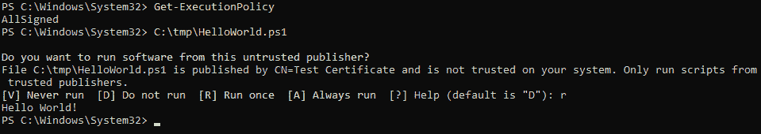
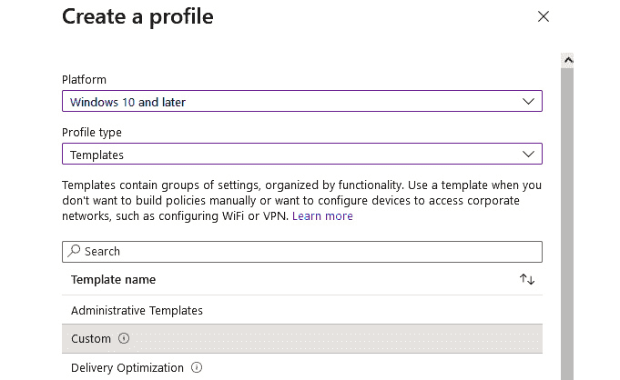
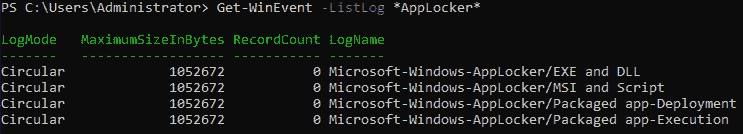

# 第十一章：AppLocker、应用程序控制和代码签名

在企业环境中，控制安装了哪些软件以及哪些软件被排除在环境之外至关重要——不仅为了保持对可用软件的概览，还为了帮助抵御恶意脚本或恶意软件（如勒索病毒）等威胁。

但是，代码签名和应用程序控制如何帮助您更好地保护环境，如何实施它们呢？在规划实施应用程序控制解决方案时，您需要做什么，并且 Windows 操作系统上有哪些内建的应用程序控制解决方案？

在本章中，我们将深入探讨关于 AppLocker、应用程序控制和代码签名的内容。您将在本章中对以下主题有更深入的了解：

+   使用代码签名防止未经授权的脚本执行

+   控制应用程序和脚本

+   熟悉 Microsoft AppLocker

+   探索 Windows Defender 应用程序控制

# 技术要求

为了充分利用本章内容，请确保您具备以下条件：

+   PowerShell 7.3 及以上版本

+   已安装的 Visual Studio Code

+   用于测试目的的运行 Windows 10 或以上版本的虚拟机

+   **第十一章**的 GitHub 仓库访问：[`github.com/PacktPublishing/PowerShell-Automation-and-Scripting-for-Cybersecurity/tree/master/Chapter11`](https://github.com/PacktPublishing/PowerShell-Automation-and-Scripting-for-Cybersecurity/tree/master/Chapter11)

# 使用代码签名防止未经授权的脚本执行

如果您想验证执行的脚本是否是合法代码，并且是否允许公司执行，您需要实施一个适当的代码签名策略。这是保护您定期执行的脚本不被篡改的绝妙方法——或者至少，如果有人篡改了您的脚本，在您的环境配置正确的情况下，它们将不会被执行。

需要注意的是，动态运行时在实施应用程序控制策略时可能会成为一个常见的盲点。虽然 PowerShell 在确保 PowerShell 运行时可以通过应用程序控制规则进行限制方面取得了显著进展，但其他动态运行时，如 Python、Node、Perl、PHP 等，可能仍然允许您运行未受限制的代码，这可能会带来漏洞，尤其是如果没有适当管理的话。如果您的客户端不需要其他动态运行时，最好将它们阻止或尽可能限制，以保持强大的安全态势。

WSH 语言家族通过一种非常直接的方式实现了应用程序控制意识：它们只是阻止执行任何不被政策允许的脚本。

当我们在早些章节讨论**执行策略**时，例如在*第一章*，*PowerShell 入门*中，我们查看了`AllSigned`或`RemoteSigned`参数。如果配置了`AllSigned`，则所有未签名的 PowerShell 脚本将被阻止运行；如果配置了`RemoteSigned`，则仅允许本地未签名脚本。当然，执行策略可以随时被绕过，因为它不是安全边界—但是，这可以防止用户无意中运行他们不知情的脚本。

将代码签名与其他工具（如 AppLocker 或**WDAC**）结合使用非常强大，因为你可以确保在你的基础设施中，只有配置的签名脚本可以运行，其他任何脚本都不被允许。

但要开始代码签名，首先我们需要一个证书来签署代码。你可以选择使用不同类型的证书。你可以选择自签名证书或公司为你购买的企业证书（可以是森林级或公共级证书）。

自签名证书通常仅用于测试目的，如果你希望将代码签名基础设施投入生产环境，你至少应该考虑使用由公司**证书授权机构**（**CA**）签名的证书，以使你的部署更加安全。

以下图示应为你提供一个关于代码签名不同场景的概览：


图 11.1 – 代码签名证书的不同可能性概览

本章中，我们将使用自签名证书来签署我们的脚本—如果你希望在生产环境中使用，请确保调整你的证书。

自签名证书仅在本地计算机上有效，可以使用`New-SelfSignedCertificate` cmdlet 创建。在早期，`makecert.exe` 被用来创建自签名证书，但自从 Windows 8 引入了`New-SelfSignedCertificate`后，你可以直接使用 PowerShell 创建自签名证书并签署脚本。

使用此 cmdlet 创建的证书可以存储在当前用户的个人证书存储中，路径为**证书** | **当前用户** | **个人**（**Cert:\CurrentUser\My**），也可以存储在本地计算机的个人证书存储中，路径为**证书** | **本地计算机** | **个人**（**Cert:\LocalMachine\My**）。在本地计算机的证书存储中创建的证书可供整个计算机使用，而在当前用户存储中创建的证书仅限于当前用户。

让我们创建一个自签名证书并将其添加到计算机的根证书存储区，以及计算机的**受信任发布者**存储区。首先，我们必须在本地计算机的证书存储区中创建一个名为**“测试证书”**的新证书，并将输出保存在`$testCert`变量中。我们稍后将需要这个变量来注册**authenticode 证书**：

```
> $testCert = New-SelfSignedCertificate -Subject "Test Certificate" -CertStoreLocation Cert:\LocalMachine\My -Type CodeSigningCert
```

完成此操作后，我们将把 authenticode 证书添加到计算机的根证书存储区。根证书存储区是一个受信任的根 CA 证书列表，因此存储区中的每个证书都会被信任。

我们必须将新创建的证书从中间 CA 存储移动到**根` `证书存储区**：

```
> Move-Item Cert:\LocalMachine\CA\$($testCert.Thumbprint) Cert:\LocalMachine\Root
```

现在，你的证书应该出现在两个不同的位置：

+   **本地计算机的个人证书存储区**：此证书将作为代码签名证书使用。

+   **本地计算机的根证书存储区**：将证书添加到计算机的根证书存储区可以确保本地计算机信任个人证书存储区以及**受信任发布者**证书存储区中的证书。

你可以通过使用 PowerShell 或者通过使用`mmc`和本地计算机的证书管理单元来验证所有证书是否都在正确的位置（运行`mmc`，添加**证书**管理单元，并选择本地计算机范围），如下图所示：


图 11.2 – 查找新创建的测试证书

如果你想使用 PowerShell 检查所有证书是否已创建，可以运行以下命令：

```
> Get-ChildItem Cert:\LocalMachine\ -Recurse -DnsName "*Test Certificate*"
```

你可以在以下截图中看到此命令的输出：


图 11.3 – 验证所有证书是否都在正确的位置

现在我们已经创建了本地证书，可以开始使用`Set-AuthenticodeSignature` cmdlet 来对脚本进行自签名。

在这个示例中，我重用了我们在*第一章*中创建的`HelloWorld.ps1` PowerShell 脚本，*开始使用 PowerShell*，该脚本可以从本书的 GitHub 仓库下载：[`github.com/PacktPublishing/PowerShell-Automation-and-Scripting-for-Cybersecurity/blob/master/Chapter01/HelloWorld.ps1`](https://github.com/PacktPublishing/PowerShell-Automation-and-Scripting-for-Cybersecurity/blob/master/Chapter01/HelloWorld.ps1)。

将脚本保存在`C:\tmp\HelloWorld.ps1`下。

如果你在会话中仍然可以使用之前创建证书时使用的`$testCert`变量，你当然可以重用它，但大多数情况下，当你想要签署脚本时，时间已经过去，你可能已经关闭了会话，这样该变量就无法使用了。

因此，首先，将证书分配给一个变量，以便您用它来签署脚本：

```
> $signingCertificate = Get-ChildItem Cert:\LocalMachine\ -Recurse -DnsName "*Test Certificate*"
```

请确保指定您之前创建的证书的正确名称。

为确保文件上的签名保持有效，即使证书在一年后过期，在签名脚本时使用一个可信的时间戳服务器也非常重要。您可以使用`Set-AuthenticodeSignature`来做到这一点。时间戳服务器会将时间戳添加到签名代码中，表示代码签名的确切日期和时间。这个时间戳用于证明代码是在证书过期之前签名的，即使证书已经过期。

因此，建议始终使用一个可靠且知名的时间戳服务器，以确保签名代码的长期有效性和真实性。**时间戳协议**（**TSP**）标准定义在`RFC3161`中，您可以在这里阅读更多内容：[`www.ietf.org/rfc/rfc3161.txt`](https://www.ietf.org/rfc/rfc3161.txt)。

由 David Manouchehri 发布了一个很棒（但当然不是完整的）列表，您可以使用它来选择您首选的时间戳服务器：[`gist.github.com/Manouchehri/fd754e402d98430243455713efada710`](https://gist.github.com/Manouchehri/fd754e402d98430243455713efada710)。

对于我们的示例，我使用的是`http://timestamp.digicert.com`服务器：

```
> Set-AuthenticodeSignature -FilePath "C:\tmp\HelloWorld.ps1" -Certificate $signingCertificate -TimeStampServer "http://timestamp.digicert.com"
```

一旦脚本成功签名，输出将类似于以下内容：


图 11.4 – 脚本签名成功

您可以通过使用`Get-AuthenticodeSignature -FilePath C:\tmp\HelloWorld.ps1 | Format-List`命令来验证脚本是否已签名，如以下截图所示：


图 11.5 – 验证文件是否已签名

但这不是验证文件是否已签名的唯一方法。如果您右键点击一个已签名的文件并打开其属性，在**数字签名**选项卡下，您将看到用于签名的证书已被添加：


图 11.6 – 使用文件属性验证文件是否已签名

此外，如果您打开新签名的脚本，您会看到其内容发生了变化：除了代码之外，您还会看到签名——由`# SIG # Begin signature block`引入，并由`# SIG # End signature block`结束，中间是一个巨大的签名块。如以下截图所示，我已经缩短了签名块，因为签名会太大，无法在本书中显示为图片：


图 11.7 – 签名后的文件现在包含签名块

如果我们启用`ExecutionPolicy AllSigned`并尝试运行自签名脚本，则会询问我们是否真的想要从此不受信任的发布者运行软件：



图 11.8 – 执行策略提示

要执行此脚本，我们必须选择`[R] Run once`。如果您希望每次都无需提示即可永久运行来自此发布者的脚本，可以使用`[A] Always** **Run`选项。

如果您希望无需任何提示即可运行来自此发布者的脚本，可以将自签名证书添加到**受信任的发布者**存储中。这允许您在发布者和您的计算机之间建立一个信任关系，确保来自发布者的脚本自动受信并且无中断地执行。

如果我们希望永久运行来自此发布者的脚本而无需提示，我们需要将自签名证书添加到计算机的**受信任的发布者**证书存储中：

```
> $publisherCertStore = [System.Security.Cryptography.X509Certificates.X509Store]::new("TrustedPublisher","LocalMachine")
> $publisherCertStore.Open("ReadWrite")
> $publisherCertStore.Add($testCert)
> $publisherCertStore.Close()
```

通过将证书添加到**受信任的发布者**存储中，您可以确保所有由您的自签名证书签名的代码都是可信的。由于不能使用`Copy-Item`从一个存储复制证书到另一个存储，因此我们必须使用**证书存储 API**接口来访问**受信任的发布者**证书存储，然后以读写权限打开它，添加我们之前创建的证书，然后再次关闭存储。

现在，如果我们再次执行`HelloWorld.ps1`脚本，它将在不提示我们的情况下运行，而未经签名的文件将被拒绝：


图 11.9 – 经过签名的文件可以无问题执行

如果您已经实施了任何应用程序控制机制，例如 AppLocker 或 WDAP，则只允许运行经过签名的文件 – *如果* 发布者已添加为信任的应用程序控制机制运行的可信来源。根据所使用的应用程序控制系统，可以通过策略中的**发布者规则**或其他类似机制来信任发布者。

由于脚本签名为签署的确切文件添加了签名，如果要保持签名的有效性，则无法修改该文件。如果您修改了已签名文件的内容，并使用`Get-AuthenticodeSignature`验证签名，您会发现签名的哈希值不再与文件内容匹配。因此，签名将无效，如果已应用未签名脚本的保护机制，则无法再执行该文件：


图 11.10 – 修改已签名文件内容后的哈希不匹配

因此，每当您修改已签名文件的内容时，您需要再次对其进行签名。如果您有一个**持续集成/持续交付**（**CI/CD**）管道，脚本签名可以通过`Set-AuthenticodeSignature` cmdlet 轻松自动化。

如果您是 CI/CD 概念的初学者，有多种方法可以构建 CI/CD 管道。仅举几例，CI/CD 管道可以通过 Azure DevOps 或 GitHub 来实现。

以下是一些帮助您入门的资源：

+   *使用 Azure 设计 CI/CD 管道* *DevOps*：[`learn.microsoft.com/en-us/azure/devops/pipelines/architectures/devops-pipelines-baseline-architecture`](https://learn.microsoft.com/en-us/azure/devops/pipelines/architectures/devops-pipelines-baseline-architecture)

)

+   *如何用 GitHub Actions 构建 CI/CD 管道的四个简单步骤*：[`github.blog/2022-02-02-build-ci-cd-pipeline-github-actions-four-steps/`](https://github.blog/2022-02-02-build-ci-cd-pipeline-github-actions-four-steps/)

同时，确保在计划在生产环境中使用代码签名时，遵循最佳实践也非常重要。微软发布了一个*代码签名最佳实践*文档，您可以将其作为参考：[`download.microsoft.com/download/a/f/7/af7777e5-7dcd-4800-8a0a-b18336565f5b/best_practices.doc`](http://download.microsoft.com/download/a/f/7/af7777e5-7dcd-4800-8a0a-b18336565f5b/best_practices.doc)

代码签名是确保您的脚本合法且未被篡改的好方法。但正如您在本书前面学到的，仅凭执行策略并不是安全边界，且很容易被绕过。因此，仅依赖执行策略并不是一个好主意。如果您想防止未经授权的脚本在您的环境中运行，您需要实施应用程序控制解决方案。

# 控制应用程序和脚本

应用程序控制解决方案不仅可以防止未经授权的 PowerShell 脚本，还可以用于定义哪些应用程序、可执行文件和 DLL 被允许在环境中运行。

需要牢记的是，尽管 PowerShell 攻击可能是许多专业人员关心的问题，但它们只占通过系统传播的恶意软件的一小部分。必须重视传统的可执行文件和 DLL 攻击所带来的威胁，切勿忽视这一点。

应用程序控制解决方案通常提供禁止单个不需要的应用程序的功能，但理想的结果应始终是禁止所有应用程序并配置所有允许的应用程序。如您在*第五章*中所回忆的，*PowerShell 非常强大——系统和 API 访问*，即使您在环境中阻止了`PowerShell.exe`，也仍然可以通过使用本地 API 函数来运行它，无论是否有必要阻止 PowerShell（当然，您不应该这么做；更好的做法是实施并利用正确的日志记录和安全策略）。

如果你只是禁止不需要的应用程序，攻击者总是能找到绕过你限制的方法——要屏蔽的东西实在太多，仅仅禁止不需要的应用程序会让你的环境始终处于攻击的脆弱状态。

最好从直接审计你环境中使用和需要的软件开始，实施适当的应用控制策略，并防止其他一切程序的运行。

市场上有很多应用控制工具，但在本书中，我们只关注微软的 AppLocker 和 WDAC。

## 应用控制规划

在将严格的规则强制应用于你的生产环境之前，确保你始终审计并创建一个已使用应用程序的软硬件目录。你不希望对员工产生如此大的影响，导致他们无法正常工作。

即使你只是实施审计策略，你也已经显著改善了 SIEM 中的信噪比。考虑一下这种情况：在实施应用控制之前，你的 SIEM 每天都会被成千上万的事件淹没，这些事件来自已知和授权的应用程序，这使得识别潜在的恶意软件或不需要的软件变得极其具有挑战性。

但是，如果你只能实施 80%的应用控制策略，因此只启用审计功能，那么事件的数量就会减少到一个可管理的水平。在这种情况下，你每天只会剩下几百个事件，这些事件包含合法的软件操作以及潜在的不需要的软件或恶意软件。这种方法已经显著减少了你的 SIEM 中的噪音，并使你能够以更好的方式保护你的环境。

一旦你创建了第一个策略，确保在推出之前进行测试。一旦你准备好部署，按照以下推出策略进行：

1.  在测试环境中测试你的策略。

1.  尽早宣布你的配置更改是非常有用的，这样员工就能更好地进行规划。

1.  将你的技术部门划分为几个小组，然后慢慢为第一个小组推出策略，审查审计日志，并及时修复问题。一旦修复完毕，就为下一个小组推出策略，依此类推。

1.  如果在上一步部署时一切正常，将你的策略推广到你环境中的高级用户。不言而喻，在推出此类策略之前，始终与可能受影响的人进行沟通。

1.  在修复所有可能的配置问题后，慢慢按部门推出策略。始终确保你将每个小组划分为子小组，并在强制更改之前与受影响的员工进行沟通。

定期审查你封锁的应用程序。这不仅有助于你识别用户可能遇到的问题，还能帮助你发现攻击的初期迹象。

确定正在使用哪些应用程序并相应调整配置需要一些时间，但这是值得的，它将大大帮助您加固环境。

首先，我们来看看在 Windows 操作系统上有哪些可用的应用程序控制选项。

## 内建的应用程序控制解决方案

多年来，微软一直在开发多种应用程序控制解决方案，从 Windows XP 的 SRP 到 Windows 8 引入的 AppLocker，再到最终在 Windows 10 中发布的 WDAC。

多年来，功能得到了极大的改进，每个工具都为其前版本带来了优势。如果可能，请始终使用 WDAC 进行应用程序控制，因为它会不断得到改进。但如果您仍在使用需要限制的较旧操作系统版本，可以同时运行这三种解决方案。

下图为您提供了这三种解决方案的简化比较：


图 11.11 – SRP、AppLocker 和 WDAC 的简化比较

当然，这不是所有功能的完整列表。请参阅以下链接，了解 SRP、AppLocker 和 WDAC 之间的差异的更详细概述：

+   *软件限制策略与* *AppLocker 之间有哪些功能不同？*: [`docs.microsoft.com/en-us/windows/security/threat-protection/windows-defender-application-control/applocker/what-is-applocker#what-features-are-different-between-software-restriction-policies-and-applocker`](https://docs.microsoft.com/en-us/windows/security/threat-protection/windows-defender-application-control/applocker/what-is-applocker#what-features-are-different-between-software-restriction-policies-and-applocker

)

+   *Windows Defender 应用程序控制和 AppLocker 功能* *可用性*: [`learn.microsoft.com/en-us/windows/security/application-security/application-control/windows-defender-application-control/feature-availability`](https://learn.microsoft.com/en-us/windows/security/application-security/application-control/windows-defender-application-control/feature-availability)

这些解决方案是庞大的话题，因此您只会看到每种技术的概述，以及一些帮助您开始实施自己应用程序控制规则的技巧。由于本书的重点是 PowerShell，我们将在本章中主要关注限制和使用 PowerShell。

# 熟悉 Microsoft AppLocker

AppLocker 是微软推出的 SRP 的继任者，并在 Windows 7 中引入。您可以使用它扩展 SRP 的功能以及它的特性。

与 SRP 相比，AppLocker 策略可以限制特定的用户或组，并且也可以在强制执行规则之前进行审计。可以通过多种方式并行部署 SRP 和 AppLocker 策略；请查看以下文档：

+   *在同一* *域中使用 AppLocker 和软件限制策略*：[`learn.microsoft.com/en-us/windows/security/application-security/application-control/windows-defender-application-control/applocker/use-applocker-and-software-restriction-policies-in-the-same-domain`](https://learn.microsoft.com/en-us/windows/security/application-security/application-control/windows-defender-application-control/applocker/use-applocker-and-software-restriction-policies-in-the-same-domain)

+   *使用软件限制策略和 AppLocker* *策略*：[`learn.microsoft.com/en-us/windows/security/application-security/application-control/windows-defender-application-control/applocker/using-software-restriction-policies-and-applocker-policies`](https://learn.microsoft.com/en-us/windows/security/application-security/application-control/windows-defender-application-control/applocker/using-software-restriction-policies-and-applocker-policies)

要部署 AppLocker 的计算机需要安装允许强制执行 AppLocker 策略的操作系统，如 Windows Enterprise。你也可以在运行 Windows Professional 的计算机上创建 AppLocker 规则。然而，只有当这些系统通过 Intune 进行管理时，才能强制执行 AppLocker 规则。如果没有强制执行 AppLocker 规则，它们将不生效，且无法提供任何保护。

如果你想限制在不受支持的操作系统上的应用程序，可以同时部署 SRP 规则，或者使用 WDAC。

为了使 AppLocker 正常工作，要求 **应用程序身份** 服务必须在运行。

## 部署 AppLocker

你可以使用 GPO、Intune、**Microsoft 配置管理器**和 PowerShell 部署 AppLocker。当然，你也可以使用本地组策略编辑器进行测试。但通过此方法无法强制执行 AppLocker 规则，因此你应避免在生产环境中使用。

在使用 AppLocker 时，你可以配置五种不同的规则类型：

+   **可执行规则**：使用 **可执行规则**，你可以限制以 `.exe` 和 `.com` 结尾的可执行文件。

+   **Windows 安装程序规则**：通过配置 **Windows 安装程序规则**，你可以限制 `.msi`、`.mst` 和 `.msp` Windows 安装程序文件。

+   **脚本规则**：使用 **脚本规则**，你可以限制 `.ps1`、`.bat`、`.cmd`、`.vbs` 和 `.js` 脚本文件。

+   **DLL 规则**：你可以使用 DLL 规则来限制 `.dll` 和 `.ocx` 文件。

尽管由于性能问题，DLL 规则曾经被认为是可选的，但在当今的安全环境中，没有启用 DLL 强制执行的应用程序控制系统是不完整的，会使您的环境容易受到攻击。这些规则必须在使用和配置之前启用，并且可以使用 GPO 或本地组策略进行配置。如果您正在使用 GPO 进行配置，请转到**计算机配置** | **策略** | **Windows 设置** | **安全设置** | **应用程序控制策略` | **AppLocker`。然后，右键单击`AppLocker`，选择**属性** | **高级** | **启用 DLL 规则集合**。

+   **打包应用规则**：使用**打包应用规则**，您可以限制`.appx`包文件。

对于您创建的每个规则，您需要选择一个操作。在这里，您必须决定文件是应该被允许还是被阻止，通过选择**允许**或**拒绝**。通常，您希望阻止一切，只允许选定的应用程序。

使用 AppLocker 规则，也可以将规则范围限定到特定的**用户或组**。如果没有特别指定，规则适用于**所有人**。

您还需要决定规则应包含的*主要条件*。对于**打包应用规则**，您只能配置一个**发布者**条件；对于所有其他规则，可以应用**路径**和**文件哈希**条件 - 除了**发布者**条件：

+   **路径**：使用**路径**条件，您可以指定一个路径，该路径将被规则允许或拒绝。您还可以定义一个异常。使用**路径**条件是最不安全的条件，因为文件和路径名称很容易被更改以绕过您的规则。如果可能的话，尽量避免路径规则。

+   **发布者**：使用**发布者**条件时，文件需要进行数字签名。使用此条件，您不仅可以指定发布者 - 还可以指定产品名称、文件名以及文件版本，以确定文件是否应该被允许或拒绝。也可以定义异常。

+   **文件哈希**：将为此文件计算一个加密文件哈希。如果文件发生更改，文件哈希也将发生变化。因此，哈希只能应用于一个文件，如果使用此条件，您需要为要允许或拒绝的每个文件配置一个文件哈希条件。

所有这些规则、操作、用户范围和条件都适用于所有配置方法。

在您的环境中配置 AppLocker 可能需要一些时间，但一旦实施，它就是值得的。为了帮助您进行初始配置，Aaron Margosis 在 GitHub 上发布了 *AaronLocker*：[`github.com/microsoft/AaronLocker`](https://github.com/microsoft/AaronLocker)。

这个脚本和文档集合应该有助于使您的初始配置以及维护您的 AppLocker 规则尽可能简单。

AaronLocker 的背后 - 名字是从哪里来的？

*AaronLocker*这个名字并不是 Aaron 自己想出来的——这是我的朋友兼长期导师 Chris Jackson 的主意。不幸的是，他在不久前去世了（愿 Chris 安息！）。Aaron 并不特别喜欢将他的产品命名为自己的名字，但由于他一时想不出更好的名字，于是他妥协了，接受了 Chris 的建议，*AaronLocker*这个名字也就诞生了。

然而，我们目前仅了解了 AppLocker 规则的组成部分，并未学习如何通过不同的部署方法来部署和配置这些规则。因此，接下来的步骤是探索如何管理 AppLocker。

### GPO

如果您使用 GPO 或本地组策略进行配置，请导航到**计算机配置** | **策略** | **Windows 设置** | **安全设置** | **应用程序控制策略` | **AppLocker`。在此部分，您将看到**可执行规则**、**Windows 安装程序规则**、**脚本规则**和**打包应用规则**选项，如下所示：


图 11.12 – 使用 GPO 配置 AppLocker

要启用强制执行或审计行为，右键单击`AppLocker`并选择**属性**。在弹出的窗口中，您可以配置哪些 AppLocker 规则应被强制执行或审计。

如果您使用 GPO 作为配置方法，请确保您要配置的所有系统至少安装了 Windows 10 企业版。否则，您无法强制执行 AppLocker 规则。

如果您还想启用 DLL 规则，可以通过右键单击`AppLocker`并选择**属性** | **高级** | **启用 DLL 规则集合**来实现。请参考 DLL 规则的描述以了解更多信息。启用 DLL 规则后，它们将在 AppLocker 下显示。

### Intune

在您通过 Intune 配置 AppLocker 之前，您需要使用 GPO 或本地组策略创建一个 AppLocker 策略。配置完成后，通过右键单击`AppLocker`并选择**导出策略**来导出策略：


图 11.13 – 导出 AppLocker 策略

将弹出一个窗口，您需要选择导出策略保存的路径。选择一个路径并确认；您的 AppLocker 策略将成功导出为`.****xml`文件。

不幸的是，您不能仅将文件内容复制并粘贴到 Intune 配置中。因此，使用编辑器打开文件并搜索每个规则类型的部分。该部分由**<RuleCollection …> … </RuleCollection>**标签表示，来自`RuleCollection`。

每种规则类型都有一个`RuleCollection`部分，因此，如果您想获取所有可执行文件的`RuleCollection`部分，请选择`<RuleCollection Type="Exe" EnforcementMode="NotConfigured">`之间的所有内容，包括周围的标签，如下图所示。如有需要，重复此操作以获取其他可用规则类型的部分：


图 11.14 – 选择可执行规则的 RuleCollection 部分

使用 Intune 配置 AppLocker 依赖于 AppLocker **配置服务提供程序**（**CSP**）：[`docs.microsoft.com/en-us/windows/client-management/mdm/applocker-csp`](https://docs.microsoft.com/en-us/windows/client-management/mdm/applocker-csp).

CSP 提供了一个接口，允许**移动设备管理**（**MDM**）解决方案控制、配置、读取、删除和编辑正在管理的设备的配置设置。可以使用**开放移动联盟统一资源标识符**（**OMA-URI**）字符串配置 Windows 10 设备的自定义配置。

多亏了 Intune 和 AppLocker CSP，大多数操作系统可以配置为在执行模式下使用 AppLocker：

+   *配置服务* *提供程序*: [`docs.microsoft.com/en-us/windows/client-management/mdm/configuration-service-provider-reference#csp-support`](https://docs.microsoft.com/en-us/windows/client-management/mdm/configuration-service-provider-reference#csp-support)

)

+   *通过 Intune 部署 OMA-URI 以针对 CSP，及与* *本地部署的对比*: [`learn.microsoft.com/en-us/troubleshoot/mem/intune/device-configuration/deploy-oma-uris-to-target-csp-via-intune`](https://learn.microsoft.com/en-us/troubleshoot/mem/intune/device-configuration/deploy-oma-uris-to-target-csp-via-intune)

现在，在 Intune 中，转到 **设备** | **配置文件**，然后点击 **创建配置文件**。

在 **平台**下选择**Windows 10 及以后版本**，在**配置文件类型**下选择**模板**，在**模板**下选择**自定义**，然后点击 **创建**：



图 11.15 – 创建配置文件

在下一页中，为您的 AppLocker 策略命名—例如，**AppLocker 策略**—然后点击 **下一步**。

在 **OMA-URI 设置**部分，选择 **添加** 来添加您的 AppLocker 规则配置。在这里，您将使用从 `.xml` 导出的片段创建实际的策略。

首先，输入一个能够很好地代表策略的名称，例如 **Exe 策略**，如果您想开始为您的环境中的 `.exe` 文件配置策略。

在 `OMA-URI` 字段中，按照您刚刚配置的策略输入字符串：

+   `Exe**: **./Vendor/MSFT/AppLocker/AppLocker/ApplicationLaunchRestrictions/apps/EXE/Policy`

+   `MSI**: **./Vendor/MSFT/AppLocker/ApplicationLaunchRestrictions/apps/MSI/Policy`

+   **脚本`: **./Vendor/MSFT/AppLocker/ApplicationLaunchRestrictions/apps/Script/Policy`

+   `DLL**: **./Vendor/MSFT/AppLocker/ApplicationLaunchRestrictions/apps/DLL/Policy`

+   `Appx**: **./Vendor/MSFT/AppLocker/ApplicationLaunchRestrictions/apps/StoreApps/Policy`

将**数据类型**更改为**字符串**，并粘贴你之前从导出的`.xml`文件中复制的`RuleCollection`行。点击**保存**。对于每个要配置的规则类型，在**OMA-URI 设置**区域中添加一个策略。一旦完成，点击**审核 + 保存**以保存你的配置：


图 11.16 – 配置 OMA-URI 设置

下一步，你可以添加这些规则应该应用的计算机组。点击**下一步**直到进入**审核 + 创建**部分，审查你的规则。如果一切正常，点击**创建**来创建你的 AppLocker 规则。

### 微软配置管理器

**配置管理器**以前被称为**系统中心配置管理器**（**SCCM**）。配置管理器包含许多预配置的配置选项和软件包，但不幸的是，没有为 AppLocker 预配置的选项。然而，它仍然可以通过自定义配置选项进行部署。

在**合规性设置**下，创建一个新的**配置项**；在**创建配置项向导**区域，指定新策略的名称，并在**没有配置管理器客户端的设备设置**下选择**Windows 8.1 和 Windows 10**：


图 11.17 – 使用配置管理器创建自定义 AppLocker 策略

类似于使用 Intune 进行的配置，我们也可以使用 AppLocker CSP 来配置配置管理器。

接下来，选择你要配置 AppLocker 的平台——在我的示例中，我只选择了`Windows 10`并点击**下一步**。

下一步，不要选择任何设备设置；相反，勾选**配置不在默认设置组中的附加设置**复选框，然后点击**下一步**。

在**附加设置**窗格中，点击**添加**。将打开**浏览设置**窗口。接下来，点击**创建设置…**。一个名为**创建设置**的新窗口将打开，如下所示：


图 11.18 – 指定策略的名称和 OMA-URI

在**创建设置**对话框中，输入设置的**名称**并指定 OMA-URI 的字符串，就像我们在*Intune 配置*部分所做的那样（这也是你可以在本书中找到总结的 OMA-URI 字符串的地方）。点击**确定**。

下一步，通过双击刚刚创建的设置来指定此设置的规则，并输入一个有意义的**名称**，在**规则类型**下选择**值**，并确保**EXE 策略**（或你之前配置的设置名称）**等于**我们在`Intune`部分创建的*RuleCollection XML 片段*。

通常，配置管理器项目用于查询状态。如果状态与期望的结果不同，你可以选择配置规则，使其在**支持**的情况下自动修复不合规的规则。

对每种规则类型重复此步骤，直到所有规则都按要求配置完毕。

点击**下一步**，直到**创建配置项向导任务**显示为成功完成。

现在，创建一个**配置基准**任务，输入一个有意义的名称，然后点击**添加**。选择之前创建的策略将其添加到此基准，并点击**确定**确认。

最后但同样重要的是，通过选择基准并配置**合规评估计划**来**部署**新的配置基准，以定义检查和应用基准的间隔时间。在我的例子中，我已经设置该基准应该每天运行一次。再次确认此操作并点击**确定**。

### PowerShell

当然，你也可以使用 PowerShell 配置和读取 AppLocker 规则。可以使用名为 AppLocker 的模块，该模块已经包含了多个功能，帮助你完成这项工作。

以下截图提供了所有与 AppLocker 相关的 PowerShell 命令的概览：


图 11.19 – AppLocker 模块中的功能

初看起来，这个模块提供的功能非常有限，但让我们深入研究每个函数，它们的功能比你预期的要多得多，允许你比使用用户界面更加高效地工作。

`Get-AppLockerPolicy`帮助你找出是否存在 AppLocker 策略。使用`-Effective`参数，你可以看到是否已经指定了策略：


图 11.20 – 使用 Get-AppLockerPolicy 获取有效的 AppLocker 策略

你也可以使用`-Local`参数查看本地 AppLocker 策略中定义的内容。`-Domain`参数与`-Ldap`参数结合使用，帮助你查看当前域配置的 AppLocker 策略。当然，你还可以使用`-Xml`参数从`.xml`文件中调查策略。

使用`Get-AppLockerFileInformation`可以获取来自文件、路径或事件日志的所有信息：


图 11.21 – 使用 Get-AppLockerFileInformation 检索 AppLocker 文件信息

在前面的截图中，你可以看到我们代码签名示例中两个演示脚本的 AppLocker 信息。通常，如果脚本是由企业或公共 CA 签名的，你还会看到发布者信息，但由于我们使用的是自签名脚本，这个证书仅用于测试目的，因此没有发布者信息，因此我们无法使用它来创建 AppLocker 发布者规则。

通常，生成 AppLocker 规则最常见的方法是基于服务器或客户端系统的**黄金镜像**创建策略，而不是手动选择单个文件和目录。为此，你可以使用`Get-AppLockerFileInformation` cmdlet 来识别图像上所有被授权运行的文件，然后使用`New-AppLockerPolicy` cmdlet 为每个文件自动生成相应的 AppLocker 规则。

以下示例将`C:\`驱动器中的所有文件进行处理，并为每个文件生成一个规则—生成的文件将保存在`C:\tmp\Applocker.xml`中：

```
> Get-AppLockerFileInformation -Directory 'C:\' -Recurse -ErrorAction SilentlyContinue | New-AppLockerPolicy -RuleType Publisher,Hash -User Everyone -RuleNamePrefix PSTmp -Xml | Out-File -FilePath "C:\tmp\Applocker.xml"
```

一旦文件创建完成，你需要对其进行测试和微调，以便为你的黄金镜像部署 AppLocker 规则。

另一种非常有效的部署 AppLocker 的方法是捕获来自现有*已知良好*系统的事件，这些系统已安装所需的软件，并且被认为是没有被攻击的。使用这些事件通过 PowerShell 生成策略可以节省你大量的时间和精力。甚至可以通过管道输入事件日志中的文件信息来自动生成 AppLocker 规则。当处理大型复杂环境时，这尤其有用，因为手动创建规则可能是一个艰巨的任务：

```
> Get-AppLockerFileInformation -EventLog -EventType Audited | New-AppLockerPolicy -RuleType Publisher,Hash -User Everyone -RuleNamePrefix AuditedApps -Xml | Out-File -FilePath "C:\tmp\AuditedApps-Applocker.xml"
```

然后，你可以使用`Set-AppLockerPolicy` cmdlet 来配置组策略或本地组策略，并应用指定的 AppLocker 配置：

```
Set-AppLockerPolicy -XmlPolicy "C:\tmp\AppLockerPolicy.xml"
```

要在远程域控制器上配置 GPO，确保使用`-Ldap`参数，并配置 LDAP 路径到策略所在的位置。如果你想将现有策略与新配置的策略合并，确保指定`-Merge`参数。

此 cmdlet 仅适用于组策略或本地策略。如果你通过 AppLocker CSP 配置了 AppLocker，则此 cmdlet 将无法工作。

使用`Test-AppLockerPolicy` cmdlet，你可以测试 AppLocker 策略，看看在指定策略应用的情况下，某个文件是否会被允许执行：


图 11.22 – 使用 Test-AppLockerPolicy 来查看 notepad.exe 或 putty.exe 是否被允许运行

在这个截图中，你可以看到，使用此 AppLocker 策略，`notepad.exe`将被允许运行，而`putty.exe`将被禁止运行，因为没有配置匹配的允许规则。

在开始以强制规则执行模式部署 AppLocker 之前，您需要定期使用**仅审核执行**模式审核哪些应用程序和脚本可以在您的环境中使用。这样，您可以在执行规则之前将它们列入允许名单。您可以通过查看事件日志来利用日志功能实现这一点。

## 审核 AppLocker 事件

使用事件日志时，您不仅可以找出在使用**仅审核执行**模式时哪些应用程序会被阻止——还可以获得更多有趣的信息，了解您的 AppLocker 策略是如何应用的，或者哪些应用程序在**强制规则` `执行**模式下运行。

使用 PowerShell，您可以通过运行`Get-WinEvent -****ListLog *AppLocker*`快速概览所有与 AppLocker 相关的事件日志：



图 11.23 – AppLocker 事件日志

若要从特定日志中获取所有事件 ID，使用`Get-WinEvent`，后跟事件日志的名称。例如，如果您想获取**Microsoft-Windows-AppLocker/EXE 和 DLL**日志中的所有事件 ID，您可以运行`Get-WinEvent "Microsoft-Windows-AppLocker/EXE** **and DLL"`。

您可以在*第四章*中找到关于 AppLocker 事件日志及所有事件 ID 的更多详细信息，*检测 – 审核* *和监控*。

在规划 AppLocker 部署时，查看哪些应用程序被允许、拒绝或审核的统计数据也是非常有用的。您可以使用`Get-AppLockerFileInformation`来实现这一点，如下图所示：


图 11.24 – 审核应用程序的统计数据

使用`EventType`，您可以选择**已允许**、**已拒绝**或**已审核**。这样，您可以查看有关文件的所有信息，以及它尝试运行应用程序的频率和文件是否被允许或是否会被拒绝的决定。

请参考以下链接了解如何使用 AppLocker 监控应用程序使用情况：[`docs.microsoft.com/en-us/windows/security/threat-protection/windows-defender-application-control/applocker/monitor-application-usage-with-applocker`](https://docs.microsoft.com/en-us/windows/security/threat-protection/windows-defender-application-control/applocker/monitor-application-usage-with-applocker)。

# 探索 Windows Defender 应用程序控制

随着 Windows 10 的推出，**Windows Defender 应用程序控制**（**WDAC**）允许组织控制其环境中使用的应用程序和驱动程序。WDAC 作为操作系统的一部分实现，也曾以**设备保护**的名称出现。

建议将 WDAC 与 **基于虚拟化的安全**（**VBS**）结合使用。与 VBS 配合使用时，WDAC 的安全性通过虚拟化隔离得到加强，使得攻击者更难绕过你配置的应用控制限制。虽然技术上 VBS 对 WDAC 并不是必需的，但它可以显著增强系统的整体安全性，且如果可能的话应始终启用。

与 AppLocker 规则相比，WDAC 规则会部署到整个机器，并影响每个登录到此机器的用户。但 WDAC 还提供更多功能，并被认为比 AppLocker 更安全。其原则是在信任被获得之前不信任任何东西。

例如，从微软应用商店安装的应用程序被认为是可信的，因为每个进入商店的应用都经过严格的审核过程。默认的 Windows 应用程序也被认为是可信的，无需单独列入允许名单。其他应用程序也可以通过 Microsoft Intelligence Security Graph 获得信任。

是否允许应用程序在系统上执行由所谓的 **代码` `完整性策略** 来确保。

## 创建代码完整性策略

**代码完整性**确保只有受信任的系统文件和驱动程序在系统启动和运行时被加载到内存中。它在允许文件运行之前验证文件的数字签名，并防止未签名或签名不正确的文件加载。

用于配置自定义 WDAC 规则的策略称为 **代码完整性策略**（**CI 策略**）。与其他应用程序控制机制类似，建议先在审计模式下部署策略，并在启用强制执行模式之前监控是否有意外行为。

在每个支持 WDAC 的 Windows 系统中，你可以在 `C:\Windows\schemas\CodeIntegrity\ExamplePolicies` 下找到一些示例策略，如以下截图所示：


图 11.25 – 内置示例代码完整性策略

如果你创建自定义策略，建议从现有的示例策略开始，然后根据需要进行修改，以构建你自己的自定义策略。以下列表将帮助你确定哪个 **示例策略** 最适合作为添加自定义规则的基础：

+   `AllowAll.xml`：如果你打算禁止不需要的应用程序，这是一个很好的基础——你只需要添加所有拒绝规则。请记住，保护系统免受未经授权访问的最佳方法是控制所有应用程序，只允许选定的应用程序。

+   `AllowAll_EnableHVCI.xml`：应用此策略后，您可以启用**内存完整性`/`虚拟化保护代码完整性**，以防止内存攻击。有关此主题的更多信息，请参阅以下文档：[`support.microsoft.com/en-us/windows/core-isolation-e30ed737-17d8-42f3-a2a9-87521df09b78`](https://support.microsoft.com/en-us/windows/core-isolation-e30ed737-17d8-42f3-a2a9-87521df09b78)。

+   `AllowMicrosoft.xml`：此策略允许 Windows、第三方硬件和软件内核驱动程序、Windows 商店应用以及由 Microsoft 产品根证书签名的应用。

+   `DefaultWindows_Audit.xml`：审计模式允许 Windows、第三方硬件和软件内核驱动程序以及 Windows 商店应用。

+   `DefaultWindows_Enforced.xml`：强制模式允许 Windows、第三方硬件和软件内核驱动程序以及 Windows 商店应用，但阻止所有未配置的内容。

+   `DenyAllAudit.xml`：此策略用于跟踪关键系统上的所有二进制文件——它审计如果所有内容被阻止时将会发生什么。如果启用此策略，可能会导致 Windows Server 2019 操作系统长时间启动。

在大多数使用场景中，`DefaultWindows_Audit.xml`和`DefaultWindows_Enforced.xml`策略是创建自定义策略并根据需要通过自定义规则扩展它们的最佳选择。

还有一份 Microsoft 推荐的阻止规则列表，您应当遵循：[`learn.microsoft.com/en-us/windows/security/threat-protection/windows-defender-application-control/microsoft-recommended-block-rules`](https://learn.microsoft.com/en-us/windows/security/threat-protection/windows-defender-application-control/microsoft-recommended-block-rules)。

此列表中的建议还可以帮助您减轻降级攻击。这是一种攻击，攻击者利用旧版 PowerShell v2 绕过较新版本的安全功能和日志机制。我们在*第四章*中探讨了这种攻击，*检测 – 审计* *和监控*。

尽管此列表中的许多项目在常见策略中默认可能是允许的，但重要的是要仔细考虑在您的场景中明确需要哪些可执行文件和二进制文件，并阻止所有不必要的文件。

在使用配置管理器管理的设备上，`C:\Windows\CCM\DeviceGuard`目录下有一个额外的示例策略。此策略可以作为基础策略，用于通过配置管理器部署 WDAC 策略。

一旦选择了你想用作基础的示例策略，你可以开始修改所选策略的副本。你可以配置许多选项，所以你可能想要通过查看官方文档中所有可用的配置选项来开始：[`learn.microsoft.com/en-us/windows/security/application-security/application-control/windows-defender-application-control/design/select-types-of-rules-to-create`](https://learn.microsoft.com/en-us/windows/security/application-security/application-control/windows-defender-application-control/design/select-types-of-rules-to-create)。

你可以编辑示例策略 XML 文件，或者使用 PowerShell 自动化创建代码完整性策略的过程。以下截图显示了可以操作代码完整性策略的 cmdlet：


图 11.26 – 代码完整性策略相关的 cmdlet

一个例子是，使用 WDAC 策略向导，它利用了我们将在后续章节中查看的 WDAC CI cmdlet，并作为一个包装器，通过图形用户界面（GUI）来创建 CI 策略。你可以从官方网站下载这个有用的工具：[`webapp-wdac-wizard.azurewebsites.net/`](https://webapp-wdac-wizard.azurewebsites.net/)。

也可以使用`New-CIPolicy` cmdlet 创建自定义的 XML 策略：一种方法是扫描参考系统并创建一个参考 XML 策略。

### 扫描参考系统以创建 XML CI 策略

以下示例展示了如何扫描 System32 路径和 Program Files 文件夹，并随后将两者的策略合并为一个。

首先，让我们扫描 Windows System32 路径：

```
> New-CIPolicy -FilePath "C:\AppControlPolicies\Windows.xml" -Level Publisher -UserPEs -ScanPath "C:\Windows\System32"
```

虽然`-ScanPath`参数表示应该被`New-CIPolicy`扫描的路径，`-UserPEs`参数表示也会扫描用户模式文件。只有在你没有提供驱动程序文件或规则，而是希望扫描参考系统或路径时，才使用`-UserPEs`和`-ScanPath`参数。

使用`-FilePath`参数，你可以指定新创建的 CI 策略应该保存到的输出文件夹。在此示例中，我们将其保存到了`C:\AppControlPolicies\Windows.xml`。

还有`-Level`参数，表示 CI 策略的级别。通过它，你可以指定允许运行哪些类型的文件。在此情况下，策略被设置为`Publisher`级别，意味着所有代码必须由受信任的发布者签名才能运行。

还可以使用以下级别：

+   `None`：禁用代码完整性强制执行。没有规则被执行。如果你想配置一个稳健的 CI 策略，这个级别没有意义。

+   `Hash`：仅允许在其哈希值与指定值匹配时，应用程序才能运行。

+   `FileName`：仅允许在应用程序位于特定文件路径时运行。这个级别一开始可能听起来很诱人，但它带来了更多的风险。如果攻击者能够访问系统上的文件，他们可能会轻松地将现有文件替换为恶意文件。最好不要使用这个选项。

+   `SignedVersion`：仅允许在应用程序具有特定签名版本时运行。

+   `Publisher`：仅允许在应用程序由指定发布者签名时运行。

+   `FilePublisher`：仅允许在应用程序由指定发布者签名且位于特定文件路径时运行。

+   `LeafCertificate`：仅允许在应用程序由指定的叶证书签名时运行。

+   `PcaCertificate`：仅允许在应用程序由指定 PCA 证书签名时运行。

+   `RootCertificate`：仅允许在应用程序由指定根证书签名时运行。

+   `WHQL`：仅允许加载经过**Windows 硬件质量实验室**（**WHQL**）认证的签名驱动程序。

+   `WHQLPublisher`：仅允许加载经过 WHQL 认证并由特定发布者签名的驱动程序。

+   `WHQLFilePublisher`：仅允许加载经过 WHQL 认证、由特定发布者签名并位于特定文件路径的签名驱动程序。

接下来，让我们扫描`Program Files`文件夹，以从指定的参考系统创建策略：

```
> New-CIPolicy -FilePath "C:\AppControlPolicies\ProgramFiles.xml" -Level Publisher -UserPEs -ScanPath "C:\Program Files" -NoScript -Fallback SignedVersion,FilePublisher,Hash
```

再次说明，我们已将用户模式文件包含在扫描中，并希望确保所有包含在策略中的文件都由指定发布者签名。我们必须定义将新创建的策略保存到`C:\AppControlPolicies\ProgramFiles.xml`。为了避免脚本文件被包含在这个参考策略中，我们必须指定`-NoScript`参数。

使用`-Fallback`参数，您可以指定回退顺序；在这种情况下，如果在`FilePublisher`级别没有匹配项，策略引擎将回退到`SignedVersion`、`FilePublisher`和`Hash`级别——恰好是这个顺序。

最后但同样重要的是，我们需要将策略合并为一个。为此，我们可以使用`Merge-CIPolicy` cmdlet：

```
> Merge-CIPolicy -PolicyPaths "C:\AppControlPolicies\Windows.xml", "C:\AppControlPolicies\ProgramFiles.xml" -OutputFilePath "C:\AppControlPolicies\AppControlPolicy.xml"
```

使用`-PolicyPaths`参数，我们可以指定应合并的策略，而使用`-OutputFilePath`，我们可以定义合并后的策略保存的位置。在这个例子中，我们将把最终的策略保存到`C:\AppControlPolicies\AppControlPolicy.xml`。

策略以审计模式创建，因此它无法阻止应用程序，只会审计应用程序的使用。这对于测试和评估哪些应用程序应该被阻止非常有用。

一旦您准备好将阻止策略应用到您的系统，您可以使用以下命令从您的策略中移除仅审计配置：

```
> Set-RuleOption -FilePath "C:\AppControlPolicies\AppControlPolicy.xml" -Option 3 -Delete
```

要部署新生成的策略，您需要将其转换为二进制格式。

### 将 XML 文件转换为二进制 CI 策略

一旦你获得了 CI 策略的 XML 配置文件，你需要将其转换为二进制格式以进行部署。可以使用 `ConvertFrom-CIPolicy` cmdlet 完成此操作：

```
> ConvertFrom-CIPolicy -XmlFilePath "C:\AppControlPolicies\AppControlPolicy.xml" -BinaryFilePath "C:\Windows\System32\CodeIntegrity\AppControlPolicy.bin"
```

这里，我们之前生成的 `AppControlPolicy.xml` CI 策略将被编译成 `AppControlPolicy.bin` 二进制文件，并保存在 `C:\Windows\System32\CodeIntegrity\AppControlPolicy.bin` 下。

如果一个二进制 CI 策略保存在 `C:\Windows\System32\CodeIntegrity\` 下，那么在相关系统重启后，它会立即启用。策略被移除后，再次重启系统，CI 策略引入的所有更改都会被撤销。

当然，如果你计划使用 Intune、MEM、GPO 或其他需要二进制配置文件的部署机制来部署 WDAC，你也可以将转换后的 CI 策略保存在你选择的其他路径下。

还有其他方法可以创建 CI 策略 XML 文件——例如，从审核事件中创建。

### 使用事件日志中的审核事件作为参考

创建 WDAC 策略的另一种方式是通过在审计模式下运行 WDAC，并使用审计日志来创建策略。类似于 AppLocker，如果 WDAC 处于审计模式，则任何在当前 WDAC 配置启用时会被阻止的应用程序都会被记录到审计日志中。

根据应用程序类型，这些事件可以在以下某个事件日志中找到：

+   **二进制相关事件`: `应用程序和服务日志` | **Microsoft** | **Windows** | **CodeIntegrity** | `操作**

+   **MSI 和脚本相关事件`: `应用程序和服务日志` | **Microsoft** | **Windows** | **AppLocker** | **MSI** `和脚本**

记录到这些事件日志中的所有事件现在可以被用来创建一个全新的 CI 策略，或者将审核的配置合并到现有策略中：

```
> New-CIPolicy -FilePath "C:\AppControlPolicies\AuditEvents.xml" -Audit -Level FilePublisher -Fallback SignedVersion,FilePublisher,Hash –UserPEs -MultiplePolicyFormat
```

此命令会在 `C:\AppControlPolicies\AuditEvents.xml` 路径下创建一个新的 CI 策略。`-Audit` 参数指定应使用事件日志中的实际审计事件来创建策略。

`-MultiplePolicyFormat` 参数使我们能够同时使用多个策略，因为策略将以多策略格式存储，这一格式在 Windows 10 中被引入。

现在，你可以在将新创建的策略与其他现有策略合并和/或将其转换为二进制格式以供进一步使用之前，进行审核和编辑。

### 使用 New-CIPolicyRule cmdlet 创建 CI 策略

如果你想更精细地定义哪些应用程序应该出现在你的 CI 策略中，`New-CIPolicyRule` cmdlet 可以帮助你：

```
> $Rules = New-CIPolicyRule -FilePathRule "C:\Program Files\Notepad++\*"
> $Rules += New-CIPolicyRule -FilePathRule "C:\Program Files\PowerShell\7\*"
> New-CIPolicy -Rules $Rules -FilePath "C:\AppControlPolicies\GranularAppControlPolicy.xml" -UserPEs
```

上述代码将为*Notepad++* 文件夹及其子文件夹创建一个 CI 策略规则，并为*PowerShell 7*路径创建另一个规则，并将这两个规则保存在`$****Rules`变量中。

然后，这两个规则可以用来创建一个新的 CI 策略，并保存在 `C:\AppControlPolicies\GranularAppControlPolicy.xml` 路径下。

之后，你可以使用`Merge-CIPolicy`将其与其他策略结合，或借助`ConvertFrom-CIPolicy`将其转换为二进制格式，以便用于其他用途。

你可以使用 ConfigCI PowerShell 模块来探索与代码完整性相关的其他操作方式：[`learn.microsoft.com/en-us/powershell/module/configci`](https://learn.microsoft.com/en-us/powershell/module/configci)。

虽然从技术上讲并非强制要求，但应启用基于虚拟化的安全功能，如安全启动，以确保代码完整性正常工作。安全启动确保系统仅以受信任的状态启动，并且所有启动文件都带有受信任的签名。这防止了启动过程被篡改，并确保操作系统及其驱动程序的完整性。

## 基于虚拟化的安全（VBS）

VBS 使用虚拟化作为基础，将内存中的某些区域与*普通*操作系统隔离。通过这种方式，可以通过加密可用内存和与该内存区域的通信，更好地保护被隔离的区域。

通过这种隔离，内存区域可以更好地保护，免受操作系统中活跃漏洞的影响。

其中一个例子是保护**本地安全机构**（**LSA**）中的凭证，这使得从操作系统中提取和窃取凭证变得更加困难。

另一个例子是**虚拟化保护的代码完整性**（**HVCI**），它使用 VBS 来实现代码完整性。

### 虚拟化保护的代码完整性（HVCI）

HVCI，也叫做**内存完整性**，是 VBS 的关键组件。HVCI 利用 VBS 技术通过确保内核和关键系统组件的完整性，防止内核模式攻击。它通过仅允许受信任和授权的代码在内核模式下运行来实现这一点。

如果 HVCI 激活，CI 功能会被转发到同一台机器上的一个安全虚拟环境中，在该环境中执行 WDAC 功能以确保完整性。如前所述，HVCI 使用 VBS 技术防止内核模式攻击。它通过验证仅允许已知和受信任的代码在内核模式下运行，来强制执行内核和关键系统组件的完整性。但从技术上讲，VBS 对于 WDAC 并不是必须的。

HVCI 利用现代 CPU 中的硬件特性，如虚拟化扩展和**受信任的平台模块**（**TPM**），来创建一个安全的执行环境。TPM 用于存储系统引导固件、UEFI 和操作系统二进制文件的哈希值。在系统启动过程中，TPM 会对这些组件进行度量，并将度量结果提供给 HVCI 系统。HVCI 使用这些度量结果验证是否只有已知和受信任的组件被加载到内存中，从而防止未经授权的代码在内核模式下运行。

如果你想为 CI 策略启用 HVCI 选项，可以使用`Set-HVCIOptions` cmdlet：

```
> Set-HVCIOptions -Enabled -FilePath "C:\AppControlPolicies\GranularAppControlPolicy.xml"
```

您还可以通过使用`-Strict`参数进一步加强这一点：

```
> Set-HVCIOptions -Strict -FilePath "C:\AppControlPolicies\GranularAppControlPolicy.xml"
```

如果使用了`-Strict`选项，这意味着在应用此策略后，只允许加载 Microsoft 和 WHQL 签名的驱动程序。

要从 CI 策略中删除所有 HVCI 设置，您可以指定`-None`参数：

```
> Set-HVCIOptions -None -FilePath "C:\AppControlPolicies\GranularAppControlPolicy.xml"
```

另一个有用的 VBS 功能是安全启动，它可以显著增强您的 Windows 系统的安全性。

### 启用安全启动

**安全启动**确保系统以受信任的状态启动。这意味着所有用于启动系统的文件必须具有经组织信任的签名。通过这样做，如果这些文件被篡改，系统将无法启动。设备需要配备 TPM 芯片才能支持安全启动。

要验证您的计算机是否启用了安全启动，您可以使用`Confirm-SecureBootUEFI` cmdlet：

```
> Confirm-SecureBootUEFI
```

如果启用了安全启动，cmdlet 将返回`True`，如下图所示；如果没有启用，则返回`False`：


图 11.27 – 启用安全启动

如果您的 PC 硬件不支持安全启动（Secure Boot），您将收到一条错误信息，提示**此平台不支持 Cmdlet**。


图 11.28 – 硬件不支持安全启动

如果您想了解更多关于安全启动的信息，请查看以下链接：

+   *安全启动*：[`learn.microsoft.com/en-us/powershell/module/secureboot`](https://learn.microsoft.com/en-us/powershell/module/secureboot)

+   *安全启动* *着陆页*：[`learn.microsoft.com/en-us/windows-hardware/manufacture/desktop/secure-boot-landing`](https://learn.microsoft.com/en-us/windows-hardware/manufacture/desktop/secure-boot-landing)

攻击者常常使用恶意驱动程序和篡改的系统文件。安全启动与代码完整性结合使用，确保已启动的操作系统及其使用的驱动程序是可信的。

## 部署 WDAC

部署 WDAC 有多种方式：MDM 或 Intune、配置管理器（Configuration Manager）、组策略（GPO）以及 PowerShell。

由于详细描述每种部署方法会超出本书的篇幅，请参阅官方部署指南，您可以在其中找到每种部署方法的详细说明：https://docs.microsoft.com/en-us/windows/security/threat-protection/windows-defender-application-control/windows-defender-application-control-deployment-guide。

在接下来的章节中，我们将探讨每种不同部署方法的优缺点。

### 组策略（GPO）

组策略并不是配置 WDAC 的首选方法；它只支持单一策略格式的**CI 策略**，并且文件类型为 `.bin`、`.p7b` 或 `.p7`。这种格式用于 Windows 10 版本 1903 之前的设备。作为最佳实践，应使用除 GPO 之外的部署机制。

但是，如果你仍然希望使用这种部署方式，可以在**计算机配置** | **管理模板** | **系统** | **设备保护** | **部署 Windows Defender 应用程序控制**下找到 WDAC GPO 设置。通过此设置，你可以部署 CI 策略。

你想要部署的二进制 CI 策略需要位于文件共享中，或者复制到每台你想要限制的机器的本地系统上。

有关如何通过 GPO 部署 WDAC 的详细文档，可以在这里找到：[`learn.microsoft.com/en-us/windows/security/application-security/application-control/windows-defender-application-control/deployment/deploy-wdac-policies-using-group-policy`](https://learn.microsoft.com/en-us/windows/security/application-security/application-control/windows-defender-application-control/deployment/deploy-wdac-policies-using-group-policy)。

### Intune

你可以使用 MDM 解决方案来配置 WDAC，例如 Intune。通过 Intune，应用控制内置了一些可配置的策略，你可以配置这些策略，以便客户机只能运行 Windows 组件、第三方硬件和软件内核驱动程序、来自 Microsoft Store 的应用，以及由 Microsoft Intelligence Security Graph 信任的信誉良好的应用（可选）。

当然，也可以使用 OMA-URI 创建自定义的 WDAC 策略，这与通过 Intune 配置 AppLocker 策略的方式类似。

在每个 XML CI 策略文件中，你可以找到一个策略 ID。复制此 ID，并将`{PolicyID}`替换为以下字符串，以获取自定义策略的 OMA-URI：

```
./Vendor/MSFT/ApplicationControl/Policies/{PolicyID}/Policy
```

请注意，你还需要替换大括号。以下截图显示了你可以找到`PolicyID`的位置：


图 11.29 – 你可以在 XML CI 策略文件中找到策略 ID

使用此`PolicyID`，相应的 OMA-URI 如下所示：

```
./Vendor/MSFT/ApplicationControl/Policies/A244370E-44C9-4C06-B551-F6016E563076/Policy
```

你可以在[`learn.microsoft.com/en-us/windows/security/application-security/application-control/windows-defender-application-control/deployment/deploy-wdac-policies-using-intune`](https://learn.microsoft.com/en-us/windows/security/application-security/application-control/windows-defender-application-control/deployment/deploy-wdac-policies-using-intune)了解更多关于如何使用 Intune 部署 WDAC 的信息。

### Microsoft 配置管理器

使用配置管理器时，它本身会成为一个可信源。这意味着通过配置管理器安装的每个应用程序和软件都被视为可信并允许运行。此选项需要通过内置策略进行配置。

类似于使用 Intune 部署，Configuration Manager 还提供了一些内置的策略，使您可以配置客户端仅运行来自 Microsoft Store 的 Windows 组件和应用程序。您还可以选择信任具有良好声誉的应用程序，这些应用程序已由**Intune 服务网关**（**ISG**）验证。Configuration Manager 还带有另一个可选的内置策略：可以允许已经安装在指定文件夹中的应用程序和其他可执行文件。

您可以通过以下链接了解更多关于如何使用 Configuration Manager 部署 WDAC：[`learn.microsoft.com/en-us/windows/security/application-security/application-control/windows-defender-application-control/deployment/deploy-wdac-policies-with-memcm`](https://learn.microsoft.com/en-us/windows/security/application-security/application-control/windows-defender-application-control/deployment/deploy-wdac-policies-with-memcm)。

### PowerShell

根据操作系统的不同，使用 PowerShell 部署 WDAC 的方式也有所不同，因为并非所有操作系统版本都具备所有功能。**WDAC 策略刷新工具**也需要下载并部署到每个受管理的端点：[`www.microsoft.com/en-us/download/details.aspx?id=102925`](https://www.microsoft.com/en-us/download/details.aspx?id=102925)。

对于这种方法，您还需要获取策略的二进制文件并将其复制到每个受管理的端点。然而，与 GPO 相比，您可以部署多个 WDAC 策略。要部署签名策略，您还需要将二进制策略文件复制到设备的 EFI 分区。签名策略通过确保仅应用由受信任实体签名的策略，为端点提供额外的安全层。如果使用 Intune 或 CSP 进行部署，此步骤将自动完成。

Matt Graeber 的 `WDACTools` 也是简化部署过程的宝贵资源。这些工具专门设计用于简化构建、配置、部署和审核 WDAC 策略的过程。您可以从 Matt 的 GitHub 仓库下载它们：[`github.com/mattifestation/WDACTools`](https://github.com/mattifestation/WDACTools)。

有关如何使用 PowerShell 部署 WDAC 的详细信息，请参阅：[`learn.microsoft.com/en-us/windows/security/application-security/application-control/windows-defender-application-control/deployment/deploy-wdac-policies-with-script`](https://learn.microsoft.com/en-us/windows/security/application-security/application-control/windows-defender-application-control/deployment/deploy-wdac-policies-with-script)。

# 当强制执行应用程序控制时，PowerShell 会发生什么变化？

当强制执行应用程序控制时，PowerShell 充当保护措施，防止潜在对手滥用其功能。通过主动实施应用程序控制措施，PowerShell 确保其强大的脚本语言不能被攻击者轻易滥用，从而绕过已施加的限制。

PowerShell 可以通过多种方式受到限制，包括禁用运行 PowerShell 脚本的能力或只允许运行已签名的 PowerShell 脚本。

在*第五章*，*PowerShell 的强大——系统和 API 访问*中，我们讨论了如何在系统不受限制的情况下，使用 PowerShell 运行任意`.NET`代码，甚至执行编译后的代码。这会使防范恶意代码变得非常困难。在强制应用控制的情况下，可以消除如`Add-Type`、任意.NET 脚本和其他常用绕过安全机制的代码执行方法。

PowerShell 包括内置的**受限语言模式**，我们在*第十章*，*语言模式与足够的管理权限（JEA）*中进行了探讨。受限语言模式限制了 PowerShell，阻止用户执行危险的语言元素，如访问任意 API。

这意味着某些*危险*的语言元素，如`Add-Type`、**COM 对象**和一些可以用于执行任意代码的.NET 类型，无法使用。如果强制执行，受限语言模式（Constrained Language mode）可以限制攻击者执行任意代码和修改系统配置的能力。在受限语言模式下，PowerShell 环境仅保留传统较弱交互式 shell 的核心基本功能，类似于 CMD、Windows 资源管理器或 Bash。

确保 PowerShell 代码可信任的一种有效方法是强制使用**签名脚本**。在应用控制的情况下，如果脚本被信任并允许在**完全语言模式**下运行，则会按照要求执行。但是，如果脚本不被信任，则它将始终在受限语言模式下运行，这意味着如果脚本尝试调用任意 API 和其他危险语言元素，将会失败。

当应用控制被强制执行，并且 PowerShell 在受限语言模式下运行时，如果你尝试直接从.NET 调用方法，它们将会失败，如下图所示：


图 11.30 – 启用应用控制时，无法访问.NET 类型

使用`Add-Type`从 PowerShell 中添加并访问 C 类型也会失效——你会收到以下错误消息：


图 11.31 – 强制执行应用控制时，Add-Type 失败

这些并不是唯一会失败的命令，但它们应该能演示启用应用控制后，PowerShell 体验的不同。

如果您允许在应用控制策略中使用签名的 Windows 文件，这意味着与 Windows 安装一起提供的 PowerShell 模块也将被允许在完整语言模式下运行。然而，自定义创建的模块将以受限语言模式运行，除非它们已在您的应用控制设置中被配置为可信。这有效地减少了系统的攻击面。

如本章前面提到的，在撰写时，PowerShell 和 WSH 家族是唯一可以通过应用控制进行限制的动态运行时，而其他运行时仍然允许无限制的代码执行。因此，PowerShell 在使用应用控制策略锁定环境时具有巨大优势。

总结来说，实施应用控制机制，如 WDAC 和 AppLocker，可以显著提升 PowerShell 安全性。通过强制执行如受限语言模式等约束，限制 PowerShell 脚本执行任意代码或修改系统配置的能力。通过实施这些措施，显著减少系统的攻击面，并使攻击者更难执行恶意代码。

总结

在本章中，您学习了如何将现有的 PowerShell 脚本配置为可信，并将其加入允许列表，但不仅仅是 PowerShell 脚本。在这一点上，您应该已经对如何为环境中的所有应用程序实现适当的应用控制解决方案有了充分的理解。

首先，您了解了如何签署您的代码，以及如何创建一个自签名脚本，供测试使用。掌握了这些知识后，您可以轻松地转移到企业环境中，您可能已经在使用企业签名或公共签名的证书。

接下来，我们深入研究了应用控制，并了解了现有的内建应用控制解决方案：SRP、AppLocker 和 WDAC。现在，您也应该熟悉如何规划在您的环境中进行允许列表配置。

然后，我们探索了 AppLocker 和 WDAC，并学习了如何审计 AppLocker 和 WDAC。我们还研究了如何配置 AppLocker 以避免可能的 PowerShell 降级攻击。

最后但同样重要的是，我们了解到，每当可能时，WDAC 是最安全的选项，其次是 AppLocker。然而，二者可以根据操作系统和使用场景在同一环境中结合使用。

然而，仅仅限制脚本和应用程序还不足以确保环境的安全性和强化。在下一章中，我们将探讨 Windows **恶意软件扫描接口**（**AMSI**）如何保护您免受直接在控制台或内存中运行的恶意代码攻击。

# 进一步阅读

如果您想进一步探索本章中提到的一些话题，可以参考以下资源：

**证书操作**：

+   New-SelfSignedCertificate：[`docs.microsoft.com/en-us/powershell/module/pki/new-selfsignedcertificate`](https://docs.microsoft.com/en-us/powershell/module/pki/new-selfsignedcertificate)

+   Set-AuthenticodeSignature：[`docs.microsoft.com/en-us/powershell/module/microsoft.powershell.security/set-authenticodesignature`](https://docs.microsoft.com/en-us/powershell/module/microsoft.powershell.security/set-authenticodesignature)

+   Get-AuthenticodeSignature：[`docs.microsoft.com/en-us/powershell/wwmodule/microsoft.powershell.security/get-authenticodesignature`](https://docs.microsoft.com/en-us/powershell/module/microsoft.powershell.security/get-authenticodesignature)

`CI/CD`：

+   CI/CD：是什么，为什么，如何：[`resources.github.com/ci-cd/`](https://resources.github.com/ci-cd/)

+   关于持续集成：[`docs.github.com/en/actions/automating-builds-and-tests/about-continuous-integration`](https://docs.github.com/en/actions/automating-builds-and-tests/about-continuous-integration)

**应用控制**：

+   Windows 的应用程序控制：[`docs.microsoft.com/en-us/windows/security/threat-protection/windows-defender-application-control/windows-defender-application-control`](https://docs.microsoft.com/en-us/windows/security/threat-protection/windows-defender-application-control/windows-defender-application-control)

+   使用智能安全图（ISG）授权可信应用：[`learn.microsoft.com/en-us/windows/security/application-security/application-control/windows-defender-application-control/design/use-wdac-with-intelligent-security-graph`](https://learn.microsoft.com/en-us/windows/security/application-security/application-control/windows-defender-application-control/design/use-wdac-with-intelligent-security-graph)

+   启用基于虚拟化的代码完整性保护：[`learn.microsoft.com/en-us/windows/security/hardware-security/enable-virtualization-based-protection-of-code-integrity`](https://learn.microsoft.com/en-us/windows/security/hardware-security/enable-virtualization-based-protection-of-code-integrity)

+   ConfigCI 模块参考（ConfigCI）：[`docs.microsoft.com/en-us/powershell/module/configci`](https://docs.microsoft.com/en-us/powershell/module/configci)

+   了解 Windows Defender 应用程序控制（WDAC）策略规则和文件规则：[`learn.microsoft.com/en-us/windows/security/application-security/application-control/windows-defender-application-control/design/select-types-of-rules-to-create`](https://learn.microsoft.com/en-us/windows/security/application-security/application-control/windows-defender-application-control/design/select-types-of-rules-to-create)

+   理解 WDAC 策略设置：[`learn.microsoft.com/zh-cn/windows/security/application-security/application-control/windows-defender-application-control/design/understanding-wdac-policy-settings`](https://learn.microsoft.com/zh-cn/windows/security/application-security/application-control/windows-defender-application-control/design/understanding-wdac-policy-settings)

+   使用多个 Windows Defender 应用程序控制策略：[`learn.microsoft.com/zh-cn/windows/security/application-security/application-control/windows-defender-application-control/design/deploy-multiple-wdac-policies`](https://learn.microsoft.com/zh-cn/windows/security/application-security/application-control/windows-defender-application-control/design/deploy-multiple-wdac-policies)

+   使用签名策略来保护 Windows Defender 应用程序控制免受篡改：[`learn.microsoft.com/zh-cn/windows/security/application-security/application-control/windows-defender-application-control/deployment/use-signed-policies-to-protect-wdac-against-tampering`](https://learn.microsoft.com/zh-cn/windows/security/application-security/application-control/windows-defender-application-control/deployment/use-signed-policies-to-protect-wdac-against-tampering)

+   使用配置管理器管理 Windows Defender 应用程序控制：[`learn.microsoft.com/zh-cn/mem/configmgr/protect/deploy-use/use-device-guard-with-configuration-manager`](https://learn.microsoft.com/zh-cn/mem/configmgr/protect/deploy-use/use-device-guard-with-configuration-manager)

+   Windows Defender 应用程序控制向导：[`learn.microsoft.com/zh-cn/windows/security/application-security/application-control/windows-defender-application-control/design/wdac-wizard`](https://learn.microsoft.com/zh-cn/windows/security/application-security/application-control/windows-defender-application-control/design/wdac-wizard)

`AppLocker`:

+   AppLocker 操作指南：[`learn.microsoft.com/zh-cn/previous-versions/windows/it-pro/windows-server-2008-R2-and-2008/ee791916(v=ws.10)`](https://learn.microsoft.com/zh-cn/previous-versions/windows/it-pro/windows-server-2008-R2-and-2008/ee791916(v=ws.10))

+   启用 DLL 规则集合：[`learn.microsoft.com/zh-cn/windows/security/application-security/application-control/windows-defender-application-control/applocker/enable-the-dll-rule-collection`](https://learn.microsoft.com/zh-cn/windows/security/application-security/application-control/windows-defender-application-control/applocker/enable-the-dll-rule-collection)

你还可以在 GitHub 仓库中找到本章提到的所有链接，无需手动输入每个链接：*第十一章* – https://github.com/PacktPublishing/PowerShell-Automation-and-Scripting-for-Cybersecurity/blob/master/Chapter11/Links.md。
