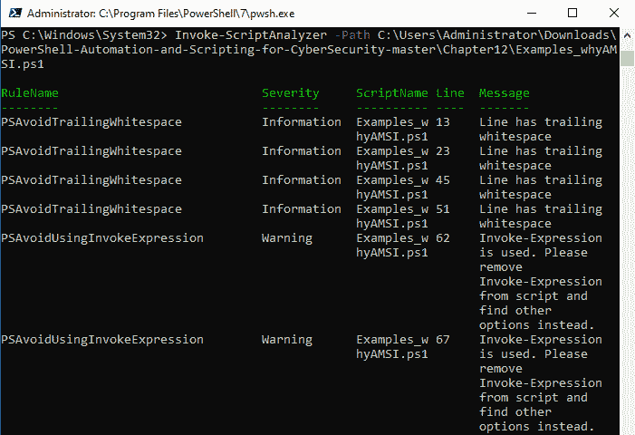
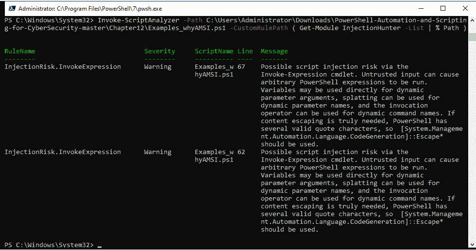
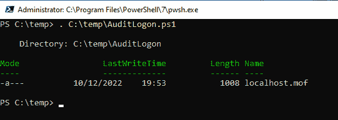
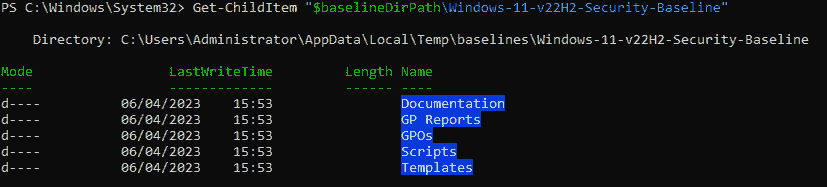
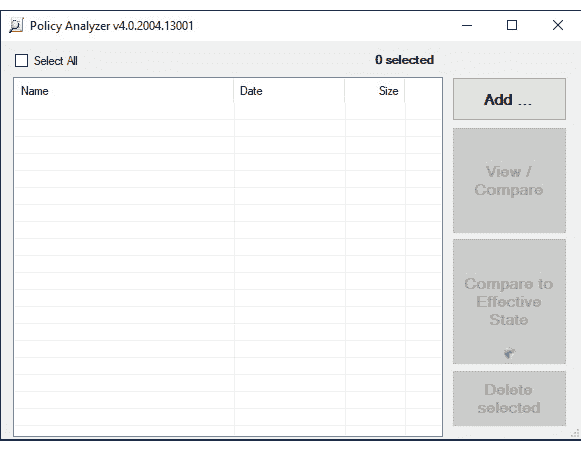
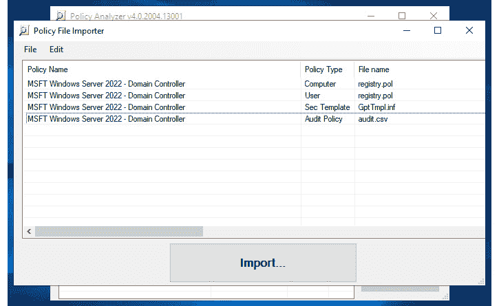
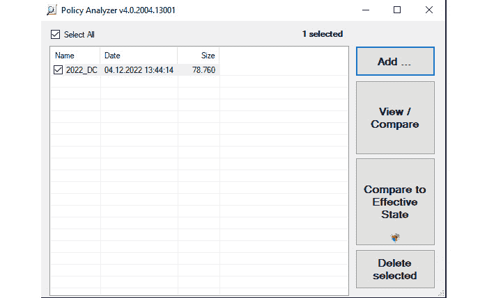
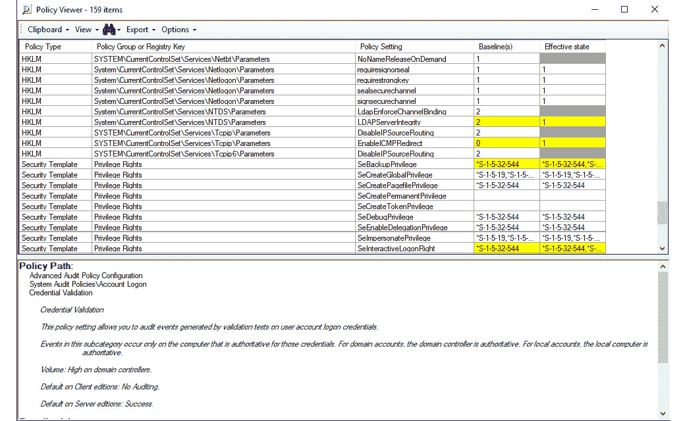
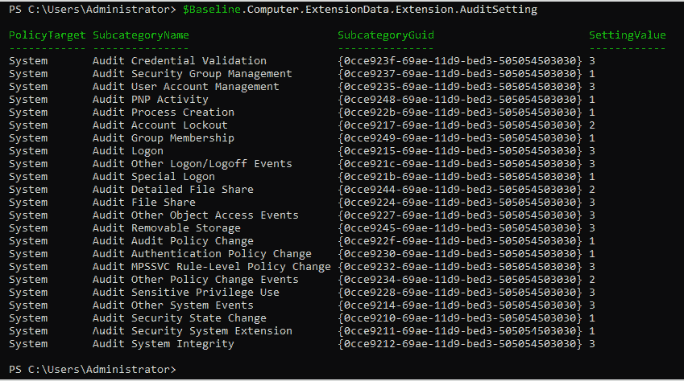
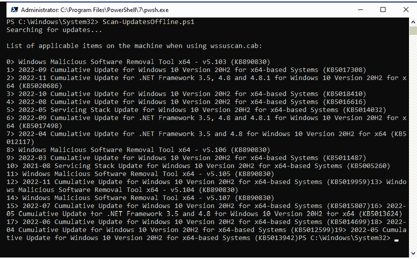

# 第十三章：还有什么？——更多的缓解措施和资源

在本书中，我们已经探讨了许多有助于在 PowerShell 环境中减少风险的主题和技术。但当然，你可以做更多事情来保障环境安全——许多直接与 PowerShell 相关，也有一些与 PowerShell 不直接相关但有助于提高 PowerShell 安全性。

在本章中，我们不会深入讨论每个缓解措施；相反，我将概述其他缓解措施，以便你可以自行探索每一个。我们将涵盖以下主题：

+   安全脚本编写

+   探索期望的状态配置

+   强化系统和环境

+   攻击检测 – 端点检测与响应

# 技术要求

为了充分利用本章内容，确保你具备以下条件：

+   PowerShell 7.3 及以上版本

+   已安装 Visual Studio Code

+   本章的 GitHub 仓库访问链接：[`github.com/PacktPublishing/PowerShell-Automation-and-Scripting-for-Cybersecurity/tree/master/Chapter13`](https://github.com/PacktPublishing/PowerShell-Automation-and-Scripting-for-Cybersecurity/tree/master/Chapter13)

# 安全脚本编写

如果你在环境中使用自编写的脚本，安全脚本编写是不可或缺的。如果你的脚本可以被篡改，那么无论你实施了什么其他安全机制（大多数情况下）都没有意义。

请注意，你的脚本可能会被黑客攻击，恶意代码可能会被注入。在这种情况下，你必须执行以下操作：

+   始终验证输入

+   开发脚本时进行代码审查

+   确保脚本的存储位置和访问权限安全

+   采用安全编码标准，例如*OWASP 安全编码实践 – 快速参考* *指南*：[`owasp.org/www-project-secure-coding-practices-quick-reference-guide/`](https://owasp.org/www-project-secure-coding-practices-quick-reference-guide/)

)

此外，还有两个非常实用的 PowerShell 模块，当你开发自己的 PowerShell 脚本时应该了解它们——`PSScriptAnalyzer`和`InjectionHunter`。

## PSScriptAnalyzer

`PSScriptAnalyzer`是一个静态检查 PowerShell 脚本和模块代码的工具。它会根据预定义的规则进行检查，并返回所有问题以及如何改进潜在代码缺陷的建议。

使用`PSScriptAnalyzer`验证代码有助于保持较高的代码质量，避免常见问题。它不一定是用来检查代码安全性的工具（尽管它提供了一些安全检查，如**避免使用 Invoke-Expression**），但它是一个检查你是否应用了 PowerShell 最佳实践的工具。

可以通过 PowerShell Gallery 使用`Install-Module PSScriptAnalyzer`进行安装。

安装后，它提供了`Get-ScriptAnalyzerRule`、`Invoke-Formatter`和`Invoke-ScriptAnalyzer` cmdlet。

对于我们的使用案例，我们将只关注`Invoke-ScriptAnalyzer`，但请确保你自己查看整个模块，以提升你的 PowerShell 脚本和模块。

使用`Invoke-ScriptAnalyzer`，然后使用`-Path`和脚本路径，来检查你的代码，如下截图所示：



图 13.1 – 调用 ScriptAnalyzer

当没有指定其他内容时，`PSScriptAnalyzer`会根据其自身的规则集进行检查。但你也可以通过使用`-CustomRulePath`和`-RecurseCustomRulePath`参数来指定你自己的自定义规则。

如果你在 Visual Studio Code 中使用*PowerShell*扩展来编写 PowerShell 脚本，`PSScriptAnalyzer`会默认启用。在这种情况下，你的代码会被自动检查，并且在编写代码时会提供任何潜在问题的警告。

## InjectionHunter

`InjectionHunter`是由 Lee Holmes 编写的一个模块，它帮助你检测如何将代码注入到你自己的 PowerShell 脚本中。可以从`PowerShell** **Gallery`下载：[`www.powershellgallery.com/packages/InjectionHunter/1.0.0`](https://www.powershellgallery.com/packages/InjectionHunter/1.0.0)

使用`Install-Module InjectionHunter`命令安装它。

`InjectionHunter`依赖于`ScriptAnalyzer.Generic.DiagnosticRecord`作为其输出类型，并使用自定义的检测规则，因此也需要安装`PSScriptAnalyzer`。

`InjectionHunter`包含八个不同的函数，所有这些函数都可以帮助你找出代码是否容易受到各种攻击的影响。这些函数包括`Measure-AddType`、`Measure-CommandInjection`、`Measure-DangerousMethod`、`Measure-ForeachObjectInjection`、`Measure-InvokeExpression`、`Measure-MethodInjection`、`Measure-PropertyInjection`和`Measure-UnsafeEscaping`。

`InjectionHunter`的函数用于创建一个新的`PSScriptAnalyzer`插件，能够检测 PowerShell 脚本中潜在的注入攻击。这些函数设计为接受`-ScriptBlockAst`参数，它代表脚本的**抽象语法树**（**AST**）。AST 将标记分组为结构，是解析和分析 PowerShell 数据的有意方式。

以下示例演示了如何使用`PSScriptAnalyzer`调用`InjectionHunter`规则：

```
> Invoke-ScriptAnalyzer -Path C:\Users\Administrator\Downloads\PowerShell-Automation-and-Scripting-for-Cybersecurity-master\Chapter12\Examples_whyAMSI.ps1 -CustomRulePath ( Get-Module InjectionHunter -List | % Path )
```

以下截图展示了从`PSScriptAnalyzer`调用`InjectionHunter`规则的界面：



图 13.2 – 从 PSScriptAnalyzer 调用 InjectionHunter 规则

`InjectionHunter`并不是用于直接分析脚本的。然而，你可以利用它的功能开发一个自定义的`PSScriptAnalyzer`插件，用于检测你 PowerShell 脚本中的注入攻击。

但是，如果你在编写脚本时能立即知道是否存在潜在的注入风险，那该多酷？Lee Holmes 和 PowerShell 团队为你提供了解决方案。以下博客文章解释了如何在使用 Visual Studio Code 编辑脚本时实现这一点：[`devblogs.microsoft.com/powershell/powershell-injection-hunter-security-auditing-for-powershell-scripts/`](https://devblogs.microsoft.com/powershell/powershell-injection-hunter-security-auditing-for-powershell-scripts/)。

# 探索所需状态配置

PowerShell **所需状态配置**（**DSC**）是一个功能，允许你使用 PowerShell 配置作为代码来管理服务器。

截至目前，以下版本的 DSC 可用于部署：`DSC 1.1`、`DSC 2.0`和`DSC 3.0`。

虽然 DSC 1.1 包含在 Windows PowerShell 5.1 中，但在 DSC 2.0 中，必须在 PowerShell 7.2 及以上版本上运行 DSC，`PSDesiredStateConfiguration`不再包含在 PowerShell 包中。这使得 DSC 的创建者能够独立于 PowerShell 开发 DSC，并允许用户升级 DSC 而无需同时升级 PowerShell。

## `DSC 1.1`

DSC 1.1 包含在 Windows 中，并通过 Windows 管理框架进行更新。它运行在 Windows PowerShell 5.1 中。如果没有使用 Azure Automanage Machine Configuration，这是推荐的版本。

### 修复

DSC 1.1 有两种配置模式：

+   **推送**：配置手动推送

+   **拉取**：节点被配置为从拉取服务器频繁拉取其配置

DSC 在拉取模式中的一个巨大进步是，一旦指定了配置，配置会自我修复。这意味着你可以使用代码配置节点并设置配置。一旦激活，你可以配置你的配置，使其频繁地从节点中拉取。这意味着，如果有人更改了配置了 DSC 的服务器或终端的本地配置，下一次拉取时配置会被恢复。

拉取模式是一种更复杂的配置方式，但最终它比推送模式更易于维护，并且有助于提升设备安全性。在使用此模式时，系统会自动进行修复。

如果你有兴趣使用 DSC 进行集中管理，需要注意的是，签名配置使得 DSC 成为一种更加安全的远程策略管理方式。签名配置确保只有授权的更改才能应用到系统中。没有有效签名的配置无法被应用。

这在保护免受攻击特别有价值，尤其是那些危及中央管理通道的攻击，比如 GPO。通过 DSC 中的签名配置和对签名基础设施的严格控制，攻击者无法利用被攻破的通道进行大规模的勒索软件传播。

你可以通过访问以下文档页面了解更多关于 DSC 模块和配置签名的信息：[`learn.microsoft.com/en-us/powershell/scripting/windows-powershell/wmf/whats-new/dsc-improvements?#dsc-module-and-configuration-signing-validations`](https://learn.microsoft.com/en-us/powershell/scripting/windows-powershell/wmf/whats-new/dsc-improvements?#dsc-module-and-configuration-signing-validations)。

DSC 内容非常广泛，但有很多文档，包括快速入门和教程，可以帮助你开始使用：[`learn.microsoft.com/en-us/powershell/dsc/overview?view=dsc-1.1`](https://learn.microsoft.com/en-us/powershell/dsc/overview?view=dsc-1.1)。

## `DSC 2.0`

DSC 2.0 支持 PowerShell 7.2 及以上版本。虽然原始的 DSC 平台是建立在 WMI 之上，但较新版本已经脱离了这个模型。

可以通过运行以下命令使用 PSGallery 进行部署：

```
Install-Module -Name PSDesiredStateConfiguration -Repository PSGallery -MaximumVersion 2.99
```

只有在使用 Azure Automanage 机器配置时，才能使用 DSC 2.0 版本。尽管`Invoke-DscResource` cmdlet 在此版本中仍然可用，但你应该仅用于测试目的，而应依赖于 Azure Automanage 机器配置。

### 修复

由于 Azure Automanage 机器配置的帮助，你不需要像 DSC 1.1 那样设置拉取服务器，因为 Azure Automanage 机器配置会为你处理这个责任。

有三种不同的机器配置分配类型可供选择：

+   `Audit`: 仅报告；不做任何更改。

+   `ApplyAndMonitor`: 一次性应用配置，但如果配置发生更改，则仅报告，不进行修复，直到手动触发。

+   `ApplyAndAutoCorrect`: 永久应用配置。一旦做出更改，机器将在下次评估时进行修复。

`ApplyAndAutoCorrect`是一个很好的选项，类似于 DSC 1.1 中的拉取配置模式；它帮助你的系统变得更安全，因为它们可以自我修复更改。

请查看以下链接了解更多关于 DSC 2.0 的信息：[`learn.microsoft.com/en-us/powershell/dsc/overview?view=dsc-2.0`](https://learn.microsoft.com/en-us/powershell/dsc/overview?view=dsc-2.0)**。**

## `DSC 3.0`

DSC 3.0 是一个预览版本，截至 2023 年 4 月仍在开发中。

该版本支持跨平台特性，并且由 Azure Automanage 机器配置在 Azure 策略中支持。可以通过使用以下命令从 PSGallery 安装：

```
Install-Module -Name PSDesiredStateConfiguration -AllowPrerelease
```

对于 DSC 3.0，修复选项与 DSC 2.0 相同。

通过阅读官方文档，你可以了解更多关于 DSC 3.0 的信息：[`learn.microsoft.com/en-us/powershell/dsc/overview?view=dsc-3.0`](https://learn.microsoft.com/en-us/powershell/dsc/overview?view=dsc-3.0)。

## 配置

要开始使用 DSC，你需要一个 DSC 配置，并将其编译成 `.mof` 文件。通常，你会想要覆盖一个已经预定义为资源的场景，并根据你的用例对其进行调整；在这种情况下，你还希望在配置中包含一个预定义的资源。

DSC 资源

在创建自己的 DSC 资源之前，始终检查是否已经有适合你用例的资源；在 GitHub 或 PowerShell Gallery 上有大量现成的资源可供使用。一旦找到适合你用例的 DSC 资源，你可以使用 `PowerShellGet` 安装它：

`> Install-Module -****Name AuditPolicyDSC`

在这个示例中，`AuditPolicyDSC` 资源将被安装，它帮助你在 Windows 机器上配置和管理高级审核策略。

以下示例展示了一个配置，它导入 `AuditPolicyDsc` 资源，并使用它确保所有成功的登录事件都在将应用此配置的主机上进行审核，通过相应的高级审核策略设置：

```
Configuration AuditLogon
{
    Import-DscResource -ModuleName AuditPolicyDsc
    Node 'localhost'
    {
        AuditPolicySubcategory LogonSuccess
        {
            Name      = 'Logon'
            AuditFlag = 'Success'
            Ensure    = 'Present'
        }
    }
}
AuditLogon
```

我们必须将此代码保存为名为 `AuditLogon.ps1` 的文件，并将其存放在 `C:\temp\` 目录下以便 dot 来源：

```
> . C:\temp\AuditLogon.ps1
```

以下截图展示了该文件如何被编译成 `.****mof` 文件：



图 13.3 – 将你的 DSC 配置编译成 .mof 文件

根据你所运行的设置和 DSC 版本，现在可以使用此文件将 DSC 配置应用到你选择的系统上。更多信息请参考官方文档：

+   DSC 1.1: [`learn.microsoft.com/en-us/powershell/dsc/configurations/write-compile-apply-configuration?view=dsc-1.1`](https://learn.microsoft.com/en-us/powershell/dsc/configurations/write-compile-apply-configuration?view=dsc-1.1)

)

+   DSC 2.0: [`learn.microsoft.com/en-us/powershell/dsc/concepts/configurations?view=dsc-2.0`](https://learn.microsoft.com/en-us/powershell/dsc/concepts/configurations?view=dsc-2.0)

)

+   DSC 3.0: [`learn.microsoft.com/en-us/powershell/dsc/concepts/configurations?view=dsc-3.0`](https://learn.microsoft.com/en-us/powershell/dsc/concepts/configurations?view=dsc-3.0)

)

# 加强系统和环境的安全

最终，你可以根据需要加强 PowerShell 的安全性；但如果运行 PowerShell 的系统没有得到保护，攻击者一旦有机会，必定会加以利用。因此，检查如何加强你的基础设施安全同样非常重要。

## 安全基线

加强 Windows 系统安全的一个良好开端——无论是服务器、域控制器还是客户端——就是微软提供的所谓安全基线。这些安全基线是微软 **安全合规工具包**(**SCT**) 1.0 的一部分，可以从这里下载：https://www.microsoft.com/en-us/download/details.aspx?id=55319。

在应用安全基线时请务必小心！

你绝不应该仅仅将安全基线应用于正在运行的生产系统。在应用之前，仔细审计你的设置并进行评估。然后，制定一个计划来实施你的更改。许多设置可能会导致系统功能中断，如果没有精心规划和实施，可能会出现问题。

当你下载 SCT 时，你会看到其中有许多可以下载的文件。大多数文件实际上是基线文件（大多数基线包以`Security Baseline.zip`结尾）。

但也包括一些有用的工具，包括`LGPO`、`SetObjectSecurity`和`Policy Analyzer`。

+   `LGPO`：这个工具可以用来执行本地组策略对象（GPO）操作。你可以使用这个工具将设置导入本地组策略，导出本地组策略，解析`registry.pol`文件（**LGPO 文本格式**），从**LGPO 文本**构建`registry.pol`文件，并启用组策略客户端扩展进行本地策略处理。由于它是一个命令行工具，LGPO 可以用来自动化本地 GPO 操作。

+   `SetObjectSecurity`：使用`SetObjectSecurity`，你可以为任何类型的 Windows 可安全对象设置安全描述符——无论是文件、注册表项、事件日志等等。

+   `Policy Analyzer`：Policy Analyzer 是一个用于比较基线和 GPO 的工具，但不仅限于导出的 GPO——你也可以将 GPO 与本地策略进行比较。它可以突出显示策略之间的差异，并帮助你发现冗余。

这三个工具都是独立的，这意味着你无需安装它们即可使用。

你可以使用`PolicyAnalyzer`检查机器的当前状态。下载`PolicyAnalyzer`和你想要使用的安全基线，用于检查你的系统。在我们的示例中，我使用了*Windows Server 2022 安全基线*作为示例基线。

我们在*第四章*的*检测—审计和监控*部分讨论了`SCT`，当时我们提到了审计建议和 EventList。在那里，我们了解到安全基线包含审计建议。但它们还包含一些系统设置建议，如 Lan Manager 认证级别（**LmCompatibilityLevel**），你可以用它来拒绝域中的不安全认证机制。请务必小心，在应用此设置为推荐的设置之前，审计使用的认证协议。

在你开始使用基线之前，你需要先提取它们。以下代码片段展示了如何使用 PowerShell 提取基线：

```
$baselineZipPath = $env:TEMP + "\baselines\Windows 11 version 22H2 Security Baseline.zip"
$baselineDirPath = $env:TEMP + "\baselines\"
if ( !( Test-Path -Path $baselineDirPath ) ) {
    New-Item -ItemType Directory -Path $baselineDirPath
}
Expand-Archive -Path $baselineZipPath -DestinationPath $baselineDirPath
```

`$baselineZipPath` 变量指向基准 ZIP 文件所在的路径，而 `$baselineDirPath` 变量指向应提取基准文件的文件夹。如果 `$baselineDirPath` 文件夹尚不存在，将会创建该文件夹。可以使用 `Expand-Archive` cmdlet 解压归档文件。

解压安全基准后，你会在 ZIP 文件中找到以下五个文件夹，如下图所示：



图 13.4 – 安全基准的内容

实际的基准文件位于 `GPOs` 文件夹中。你可以使用其中的文件在测试系统上导入基准进行测试，或者将它们添加到策略分析器中。

初次执行策略分析器时，你将看到其启动界面，如下所示：



图 13.5 – 策略分析器

要开始使用，点击 **添加...** 来添加一个新的基准进行比较。导航到所选基准的 GPOs 文件夹并选择它。由于包含了许多你不需要添加的基准文件，因此你需要通过在 **策略文件导入器** 视图中选择它们，然后使用键盘上的 *删除* 键将它们删除。

在这个例子中，我想调查一个域控制器，所以我删除了除域控制器相关基准之外的所有其他基准，如下图所示：



图 13.6 – 导入域控制器安全基准

一旦所有必要的基准文件都在 **策略文件导入器** 视图中，点击 **导入...** 以导入它们。在导入之前，你将被提示输入名称并保存策略。在本示例中，我将策略命名为 `2022_DC`。

一旦基准被导入，你可以选择添加另一个基准或导出的 GPO 来比较它们的设置（使用 **查看 / 比较**）。或者，你也可以将基准与当前系统的有效状态进行比较（使用 **与有效状态比较**）：



图 13.7 – 在策略分析器中导入的 2022_DC 策略

在我们的示例中，我选择了 `2022_DC` 策略，并将 `DC01` 演示环境的域控制器与有效状态进行了比较。此时将弹出一个新窗口，你可以在其中查看所有推荐和有效的设置：如果某个设置保持白色，表示它匹配；如果某个设置标记为灰色，表示它未配置或为空；最后，如果某个设置标记为黄色，则表示存在冲突，设置不匹配：



图 13.8 – 与策略分析器比较设置

通过这样做，你可以检查推荐的配置是否反映了当前的配置状态，以及如果不匹配，你需要配置什么。再强调一次——请不要在没有评估这些变化对你的环境意味着什么的情况下直接应用这些推荐。

不仅有用于域控制器的安全基准，还有用于成员服务器、客户端的基准，以及其他领域设置的基准。

也可以使用 PowerShell 与这些基准进行交互。每个基准都是一个导出的 GPO，你可以解析它。`gpreport.xml`文件包含了在此 GPO 中配置的每个设置。因此，如果我们将安全基准的`gpreport.xml`文件作为 PowerShell 对象导入，我们可以在引用 XML 语法时查询所有可用的设置。

以下的`Import-Baseline`函数可以帮助你完成这个任务：

```
function Import-Baseline {
    [cmdletbinding()]
    param (
        [Parameter(Mandatory)]
        [string]$Path
    )
    $Item  = Join-Path -Path (Get-ChildItem -Path $Path -Filter "gpreport.xml" -Recurse | Select-Object -First 1).DirectoryName -ChildPath "\gpreport.xml"
    if (Test-Path -Path $Item) {
        [xml]$Settings = Get-Content $Item
    }
    return $Settings.GPO
}
```

它会在指定的文件夹中递归查找第一个`gpreport.xml`文件，并将其设置返回为 XML 对象。

例如，如果你想访问*Windows 10 22H2 – Computer*基准的推荐审核设置，我们首先将其导入到`$Baseline`变量中，如下代码片段所示：

```
> $Baseline = Import-Baseline -Path "C:\baselines\Windows-10-v22H2-Security-Baseline\GPOs\{AA94F467-FC14-4789-A1C4-7F74B23184B2}"
```

现在，所有的 XML 节点都可以通过`$Baseline`变量进行查询。首先，让我们检查基准的名称，确保我们导入了正确的基准：

```
> $Baseline.Name
MSFT Windows 10 22H2 - Computer
```

接下来，我们要访问审核设置，它们位于`Computer.ExtensionData.Extension.AuditSetting`节点下：

```
> $Baseline.Computer.ExtensionData.Extension.AuditSetting
```

如下图所示，你可以看到每个推荐的审核设置及其值——即命令的输出：



图 13.9 – 查询基准的审核设置 XML 节点

在这里，你可以看到`SettingValue`，它表示是否建议审核**成功**（**1**）、**失败**（**2**），或是同时审核**成功和失败**（**3**）。`0`表示明确不推荐审核该设置（即*审核设置已禁用*）——这是你在微软发布的安全基准中永远找不到的值。

通过此操作，你现在可以查询在这个 GPO 中配置的所有导入的 XML 节点。

另一个可以帮助你监控安全设置以确保合规性的好工具是`DSC`的`BaselineManagement`模块。借助它，你可以将基准以及组策略转换为 DSC 配置脚本（**.ps1**）和`.mof`文件，并可以用这些文件来监控系统的合规性。

你可以在 GPO DSC 快速入门文档中找到更多关于如何设置的信息：[`learn.microsoft.com/en-us/powershell/dsc/quickstarts/gpo-quickstart`](https://learn.microsoft.com/en-us/powershell/dsc/quickstarts/gpo-quickstart)。

## 应用安全更新和补丁合规性监控

在我担任微软首席现场工程师期间，我为世界各地的公司和组织进行了大量的安全评估。那些安全评估中，最关键也最常见的问题之一就是缺少更新。信不信由你，在我评估的所有组织中，只有大约 2% 的评估中，发现所有更新都已安装。在所有其他评估中，至少缺少一个关键更新。

除了其他攻击方式，如社交工程学和滥用合法管理员权限，缺少更新是系统被攻破的常见原因：如果发布了安全更新，这意味着一个漏洞已被修复，并且关于该漏洞的知识是公开的。对手甚至可以逆向工程已发布的补丁，以了解具体修复了什么。

这意味着，一旦发布了更新，时间就是对抗的关键，对手很快就能准备好利用漏洞。如果系统缺少补丁，它很快就会变得脆弱。

因此，尽早应用安全更新。制定一个计划，在发布后尽快测试并安装更新，并正确优先处理。

仅仅安装更新是不够的——你还需要定期验证是否已安装所有所需的更新。

检查更新

许多组织使用 WSUS 和/或 SCCM 来部署和监控安全更新。尽管这是一种很好的部署方法，但仅凭此方法不足以检查所有必要的更新是否已安装。因此，如果你至今仅依赖于 WSUS 或 SSCM，你需要设置另一种机制来检查是否所有相关更新都已安装。

许多组织通常只部署 Windows 安全更新，忽略了其他产品。但全球各地的服务器上安装了许多带有 Microsoft Visual C++ 或其他程序的工具。一旦安装，这些工具就不会再进行更新，尽管存在严重漏洞，这使得基础设施暴露于对手的攻击。

对于早期的 Windows 版本，检查是否安装了所有相关更新可以通过使用**Microsoft 基线安全分析工具**（**MBSA**）和**WSUS 离线目录**（即**wsusscn2.cab**）来实现。但由于 MBSA 已被弃用且不再开发，现在有新的方式可以扫描补丁合规性。

一种选择是使用 PowerShell 的`Scan-UpdatesOffline.ps1`脚本，该脚本可在 PowerShell Gallery 中找到：[`www.powershellgallery.com/packages/Scan-UpdatesOffline/1.0`](https://www.powershellgallery.com/packages/Scan-UpdatesOffline/1.0)

你可以使用`Install-Script`安装该脚本：

```
> Install-Script -Name Scan-UpdatesOffline
```

在运行脚本之前，从[`go.microsoft.com/fwlink/?linkid=74689`](http://go.microsoft.com/fwlink/?linkid=74689)下载最新的`wsusscn2.cab`文件，并将其保存至`C:\temp\wsusscn2.cab`：

```
> Invoke-WebRequest http://go.microsoft.com/fwlink/?linkid=74689 -OutFile c:\temp\wsusscn2.cab
```

需要注意的是，特定路径已硬编码到`Scan-UpdatesOffline`脚本中，因此在运行该脚本之前，确保`wsusscn2.cab`文件位于正确位置。

一旦一切就绪，您可以开始使用`Scan-UpdatesOffline.ps1`进行扫描，如下图所示：



图 13.10 – 扫描缺失的更新

现在，您可以使用此脚本进行定期检查，确保您的服务器和客户端安装了最新的更新。在扫描之前，请确保始终下载最新的`wsusscn2.cab`文件。

由于此方法仅适用于检查 Windows 和 Microsoft 产品更新，因此请确保同时维护组织内所有可用软件的清单，并监控补丁合规性。

## 避免横向移动

横向移动是攻击者用来深入网络、破坏终端、服务器和身份的技术。

一旦攻击者成功入侵了组织内的某个设备，他们会试图获取更多凭证和身份信息，利用这些信息横向移动并入侵整个网络。

为了检测横向移动，组织可以使用 PowerShell 监控远程登录事件日志，特别是事件 ID *4624*。该事件 ID 提供了有关成功登录的信息，包括登录类型、进程和身份验证包。例如，要获取过去 7 天内所有登录类型为 3（网络登录）的事件 ID *4624*，可以使用以下代码片段：

```
> Get-WinEvent -FilterHashtable @{LogName='Security'; ID=4624; StartTime=(Get-Date).AddDays(-7)} | Where-Object {$_.Properties[8].Value -eq 3}
```

登录类型 3 表示该登录尝试是通过网络进行的。例如，当用户连接到网络共享或某个计算机上运行的进程访问另一个计算机上的资源时，可能会发生此情况。

通过监控登录类型为 3 的事件，组织可以检测攻击者尝试从被攻破的系统访问网络资源的行为，这可能是网络内横向移动的早期迹象。根据您的网络情况，可以细化此示例并根据需求调整。

请参考*第四章*，*检测 – 审计与监控*，了解如何利用不同的事件日志来检测恶意活动。

您应遵循以下指南，尽量避免横向移动：

+   通过使用**本地管理员密码解决方案**（**LAPS**），强制为工作站和服务器设置唯一密码

+   为 Active Directory 管理员实施**红树林**（**Red Forest**），也称为**增强安全管理环境**（**Enhanced Security Administrative Environment，ESAE**）

+   实施分层模型，并让管理员使用**特权访问工作站**（**PAWs**）处理管理任务

+   限制登录并保持适当的凭证管理

+   尽快安装更新

+   使用如 BloodHound 或 SharpHound 等工具审计你的身份关系

当然，这不能百分百保证攻击者无法横向移动，但已经涵盖了很多内容，并且会让攻击者忙上一段时间。

## 提升权限的多因素认证

**多因素认证**（**MFA**）总是为你的管理员账户增加了另一层安全性。当然，人们可能会被欺骗以允许身份验证，但有了 MFA，攻击者窃取并滥用身份的难度大大增加。

你可以使用很多不同的 MFA 选项。根据你的具体情况，你可以使用以下工具：

+   智能卡认证

+   Windows Hello

+   OAuth 硬件令牌

+   OAuth 软件令牌

+   Fido2 安全密钥

+   生物识别技术

+   短信或语音电话

+   一个身份验证应用程序（例如 Microsoft Authenticator）

## 时限性权限（即时管理）

遵循最小权限原则的一个好方法是实施时限性权限，也称为 **即时管理**。采用这种方法，管理员默认没有任何权限。

一旦他们请求权限提升，系统会将时间戳绑定到他们的权限上。一旦指定时间到期，权限就不再有效。

如果一个账户被攻破，攻击者无法造成任何危害，因为该账户的权限并未由管理员请求。通常，提升请求会伴随 MFA 验证。

此外，**特权身份管理**（**PIM**）和 **特权访问管理**（**PAM**）解决方案可用于自动化授予和撤销时限性权限的过程。这些解决方案提供了一个集中平台，用于管理和监控整个组织的特权访问。

它们还可以提供额外的安全措施，例如审批工作流、审计跟踪和会话记录，以确保问责制和合规性。实施 PIM 和 PAM 解决方案可以大大增强时限性权限的安全性，并减少对关键系统和数据的未经授权访问的风险。

# 攻击检测 – 端点检测与响应

另一个非常重要的点是必须有一个产品来检测攻击并做出反应。市面上有很多优秀的产品可以帮助你完成这项任务。确保你选择的产品也支持 PowerShell，并帮助你检测通过 PowerShell 和其他命令行工具发起的可疑命令。

例如，微软的解决方案称为 Microsoft Defender for Endpoint。但其他厂商也提供类似的解决方案。

## 启用 Microsoft Defender for Endpoint 的免费功能

即使你没有使用 Microsoft Defender for Endpoint，许多功能也可以免费使用，无需任何订阅：

+   硬件隔离/应用保护

+   攻击面缩减规则

+   受控文件夹访问

+   可移动存储保护

+   网络保护

+   漏洞防护

+   Windows Defender 防火墙与高级安全性

许多这些功能甚至可以在 Microsoft Defender 禁用的情况下使用。了解 ASR 功能，深入了解这些特性：[`learn.microsoft.com/en-us/microsoft-365/security/defender-endpoint/overview-attack-surface-reduction?view=o365-worldwide#configure-attack-surface-reduction-capabilities`](https://learn.microsoft.com/en-us/microsoft-365/security/defender-endpoint/overview-attack-surface-reduction?view=o365-worldwide#configure-attack-surface-reduction-capabilities)。

# 总结

本章总结了关于 PowerShell 安全性的内容。它并不旨在提供深入的技术信息，而是为了概述可以采取哪些措施来提高网络安全性。通过这些内容，你可以对接下来的工作有一个清晰的了解，并知道需要查阅哪些资料。

你已获得一些有关安全脚本编写的见解，并了解了可以使用哪些工具来提高脚本的安全性。你还了解了 DSC 以及如何入门。最后，你还了解了如何加强系统的安全性。

希望你喜欢本书，并能充分利用它。祝你脚本编写愉快！

# 进一步阅读

如果你想深入了解本章提到的一些主题，可以查看以下资源：

`LAPS`

+   LAPS：[`www.microsoft.com/en-us/download/details.aspx?id=46899`](https://www.microsoft.com/en-us/download/details.aspx?id=46899)

`PSScriptAnalyzer`

+   GitHub 上的 PSScriptAnalyzer：[`github.com/PowerShell/PSScriptAnalyzer`](https://github.com/PowerShell/PSScriptAnalyzer)

+   PSScriptAnalyzer 参考：[`learn.microsoft.com/en-us/powershell/module/psscriptanalyzer/?view=ps-modules`](https://learn.microsoft.com/en-us/powershell/module/psscriptanalyzer/?view=ps-modules)

)

+   PSScriptAnalyzer 模块概述：[`learn.microsoft.com/en-us/powershell/utility-modules/psscriptanalyzer/overview?view=ps-modules`](https://learn.microsoft.com/en-us/powershell/utility-modules/psscriptanalyzer/overview?view=ps-modules)

)

**安全基准` `和 SCT**

+   Microsoft SCT 1.0 – 如何使用它：[`learn.microsoft.com/en-us/windows/security/operating-system-security/device-management/windows-security-configuration-framework/security-compliance-toolkit-10`](https://learn.microsoft.com/en-us/windows/security/operating-system-security/device-management/windows-security-configuration-framework/security-compliance-toolkit-10)

+   `LGPO.exe` – 本地组策略对象工具，v1.0：[`techcommunity.microsoft.com/t5/microsoft-security-baselines/lgpo-exe-local-group-policy-object-utility-v1-0/ba-p/701045`](https://techcommunity.microsoft.com/t5/microsoft-security-baselines/lgpo-exe-local-group-policy-object-utility-v1-0/ba-p/701045)

+   新版和更新的安全工具：[`techcommunity.microsoft.com/t5/microsoft-security-baselines/new-amp-updated-security-tools/ba-p/1631613`](https://techcommunity.microsoft.com/t5/microsoft-security-baselines/new-amp-updated-security-tools/ba-p/1631613)

**安全更新**

+   一个新的 Windows 更新离线扫描文件 `wsusscn2.cab` 已经为高级用户提供：[`support.microsoft.com/en-us/topic/a-new-version-of-the-windows-update-offline-scan-file-wsusscn2-cab-is-available-for-advanced-users-fe433f4d-44f4-28e3-88c5-5b22329c0a08`](https://support.microsoft.com/en-us/topic/a-new-version-of-the-windows-update-offline-scan-file-wsusscn2-cab-is-available-for-advanced-users-fe433f4d-44f4-28e3-88c5-5b22329c0a08)

+   使用 Windows 更新离线扫描文件的开发者可以在这里找到详细信息：[`support.microsoft.com/en-us/topic/detailed-information-for-developers-who-use-the-windows-update-offline-scan-file-51db1d9e-038b-0b15-16e7-149aba45f295`](https://support.microsoft.com/en-us/topic/detailed-information-for-developers-who-use-the-windows-update-offline-scan-file-51db1d9e-038b-0b15-16e7-149aba45f295)

+   什么是 Microsoft 基准安全分析器及其用途？：[`learn.microsoft.com/en-us/windows/security/threat-protection/mbsa-removal-and-guidance`](https://learn.microsoft.com/en-us/windows/security/threat-protection/mbsa-removal-and-guidance)

`VBS`

+   基于虚拟化的安全性：[`learn.microsoft.com/en-us/windows-hardware/design/device-experiences/oem-vbs`](https://learn.microsoft.com/en-us/windows-hardware/design/device-experiences/oem-vbs)

你还可以在本章的 GitHub 仓库中找到所有提到的链接，*第十三章* – 无需手动输入每个链接：[`github.com/PacktPublishing/PowerShell-Automation-and-Scripting-for-Cybersecurity/blob/master/Chapter13/Links.md`](https://github.com/PacktPublishing/PowerShell-Automation-and-Scripting-for-Cybersecurity/blob/master/Chapter13/Links.md)。
