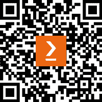

# 序言

欢迎进入 PowerShell 渗透测试的领域！在网络安全威胁日益严重的时代，了解如何有效评估和加强数字防御至关重要。PowerShell 是一种强大的脚本语言，原生支持 Windows 环境，已成为攻防安全操作中多功能的工具。凭借其广泛的功能和广泛的部署，掌握 PowerShell 进行渗透测试对网络安全专业人员来说是不可或缺的，他们在今天的网络安全环境中致力于保护组织资产。

本书是一本全面的指南，旨在帮助你充分利用 PowerShell 在渗透测试中的潜力。无论你是资深的网络安全从业者，还是渴望深入了解攻击性安全细节的新手爱好者，本书都将为你提供进行高效、有效的渗透测试所需的知识和技术。

本书的每一页都将带领我们踏上探索渗透测试方法基础、PowerShell 脚本内部工作原理以及整合各种工具和技术以模拟现实世界攻击场景的旅程。从侦察与信息收集到利用和后期利用活动，每一章都精心设计，旨在提供实际的见解和动手练习，以加深你对该主题的理解。

随着你逐步深入各章内容，你将学会如何利用 PowerShell 内置的 cmdlet、模块和脚本功能来自动化任务、操作系统组件，并利用目标环境中的漏洞。此外，你还将深入了解对手如何将 PowerShell 作为其恶意活动中的武器，从而帮助你采取积极的应对措施，减轻潜在威胁。

此外，本书不仅关注渗透测试的技术方面，还强调道德行为、负责任的披露以及在网络安全社区中持续学习的重要性。通过遵循伦理指南并培养合作心态，我们可以共同增强数字基础设施的韧性，推动为所有人创造一个更安全的在线生态系统。

无论你希望成为一名熟练的渗透测试员、增强组织的安全防护，还是满足你对 PowerShell 在网络安全领域能力的好奇心，本书都是你前进路上的终极伙伴。让我们一起踏上这段变革性的旅程，充分挖掘 PowerShell 在渗透测试中的潜力，追求卓越。

# 本书的读者对象

本书适用于从事渗透测试的人员和那些希望学习渗透测试的人。它采用了实践性强的学习方法，提供了真实世界的例子。书本结构使得读者可以轻松跟随并深入理解与 PowerShell 作为渗透测试工具相关的核心技术。

# 本书内容

*第一章*，*渗透测试简介*，解释了渗透测试及其各个组成部分。

*第二章*，*PowerShell 编程原则*，介绍了 PowerShell 在渗透测试中的相关原则。

*第三章*，*网络服务和 DNS*，探讨了如何使用 PowerShell 通过一系列实用示例来分析网络服务和 DNS。

*第四章*，*网络枚举和端口扫描*，讨论了如何使用 PowerShell 进行网络枚举和分析，并通过结构化的实例加深这一学习。

*第五章*，*WEB、REST 和 SOAP*，探讨了 PowerShell 如何作为渗透测试的一部分，用于对 web 应用程序和使用 REST 和 SOAP 的 web 服务进行测试。每个概念的学习都通过一系列分阶段的实用示例得到强化。

*第六章*，*SMB、Active Directory、LDAP 和 Kerberos*，介绍了 PowerShell 中可以用来测试 SMB、Active Directory、LDAP 和 Kerberos 应用程序的概念和工具。通过实际示例讨论了相关问题和概念。

*第七章*，*数据库：* *MySQL、PostgreSQL 和 MSSQL*，聚焦于 PowerShell 如何与数据库交互，并能作为安全评估的一部分使用。

*第八章*，*电子邮件服务：* *Exchange、SMTP、IMAP 和 POP*，介绍了 PowerShell 如何评估电子邮件服务的安全性。

*第九章*，*PowerShell* *与 FTP、SFTP、SSH 和 TFTP*，探讨了使用 PowerShell 测试 FTP、SFTP、SSH 和 TFTP 的概念。

*第十章*，*在 PowerShell 中暴力破解*，展示了 PowerShell 如何对各种网络服务执行暴力破解认证。

*第十一章*，*PowerShell 与远程控制* *及* *管理*，展示了如何使用 PowerShell 进行远程管理和操作。

*第十二章*，*在 Azure 中使用 PowerShell*，介绍了如何使用 PowerShell 对基于 Azure 的基础设施进行渗透测试。

*第十三章*，*在 AWS 中使用 PowerShell*，探讨了如何对 AWS 基础设施进行渗透测试。

*第十四章*，*命令与控制*，介绍了 PowerShell 如何作为渗透测试中的命令与控制基础设施的一部分，用于后期利用和横向移动活动。

*第十五章*，*Microsoft Windows 中的后期利用*，探讨了如何在 Microsoft Windows 环境中使用 PowerShell 进行后期利用。每个概念通过一组实际例子进行探讨。

*第十六章*，*Linux 中的后期利用*，展示了如何在 Linux 中使用 PowerShell 作为后期利用过程的一部分。每个概念都通过一系列实际例子进行了阐明。

# 为了充分利用本书

| 书中涵盖的软件/硬件 | 操作系统要求 |
| --- | --- |
| PowerShell 7 | Windows、macOS 或 Linux |

使用的约定

本书中使用了一些文本约定。

**文本中的代码**：表示文本中的代码字、数据库表名、文件夹名、文件名、文件扩展名、路径名、虚拟 URL、用户输入和 Twitter 用户名。例如：“我们可以通过使用`get-help`命令来识别如何使用 PowerShell 模块。”

一段代码如下所示：

```
 if (condition) {
# Code block to execute if the condition is true
}
```

任何命令行输入或输出均按如下方式书写：

```
 PS C:\> Set-ExecutionPolicy Unrestricted
```

**粗体**：表示一个新术语、一个重要的词或您在屏幕上看到的词。例如，菜单或对话框中的词会以**粗体**显示。这里有一个例子：“在渗透测试过程中，通常会编写自定义 XML 有效负载，测试基于 XML 的漏洞，如**XML 外部实体**（**XXE**）注入。”

提示或重要说明

如下所示。

# 获取联系

我们始终欢迎读者的反馈。

**一般反馈**：如果您对本书的任何方面有疑问，请通过电子邮件联系我们，邮箱地址是`customercare@packtpub.com`，并在邮件主题中注明书名。

**勘误表**：虽然我们已尽最大努力确保内容的准确性，但错误难免。如果您在本书中发现错误，我们将非常感激您报告给我们。请访问 [www.packtpub.com/support/errata](http://www.packtpub.com/support/errata) 并填写表单。

**盗版**：如果您在互联网上遇到任何形式的非法复制品，我们将非常感激您能提供相关的地址或网站名称。请通过`copyright@packt.com`与我们联系，并附上链接。

**如果您有兴趣成为作者**：如果您在某个领域具有专业知识，并且对写书或为书籍做出贡献感兴趣，请访问 [authors.packtpub.com](http://authors.packtpub.com)。

# 分享您的想法

一旦您读完了*PowerShell 渗透测试*，我们很想听听您的想法！请[点击这里直接访问本书的亚马逊评论页面](https://packt.link/r/1835082459)，并分享您的反馈。

您的评论对我们和技术社区非常重要，将帮助我们确保提供优质的内容。

# 下载本书的免费 PDF 副本

感谢购买本书！

您喜欢在路上阅读，但又无法随身携带印刷版书籍吗？

您购买的电子书无法与您选择的设备兼容吗？

别担心，现在每本 Packt 书籍都附带免费的无 DRM PDF 版本。

随时随地、在任何设备上阅读。从您最喜欢的技术书籍中直接搜索、复制并粘贴代码到您的应用程序中。

福利不止于此，您还可以获得独家的折扣、时事通讯和每日送到您收件箱的精彩免费内容。

按照以下简单步骤即可获得福利：

1.  扫描二维码或访问以下链接



[`packt.link/free-ebook/9781835082454`](https://packt.link/free-ebook/9781835082454)

1.  提交您的购买凭证

1.  就是这样！我们会直接将您的免费 PDF 和其他福利发送到您的电子邮件中。

# 第一部分：渗透测试与 PowerShell 简介

本节介绍了渗透测试的基本元素，并介绍了 PowerShell 作为跨平台脚本引擎以及 PowerShell 脚本编写的基本原则。还展示了如何在多个异构平台上安装并使用 JSON、XML 模块/函数。在这个模块中，您将进行一系列简单的脚本编写练习，以帮助您理解如何使用/应用 PowerShell。在本书中，我们将使用 PowerShell 7。

本部分包含以下章节：

+   *第一章*，*渗透测试简介*

+   *第二章*，*PowerShell 中的编程原则*
