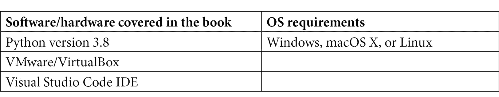

# 前言

网络安全黑客是一个广泛的领域，随着现代组织对网络安全需求的增加，伦理黑客和渗透测试人员的需求迅速增长。本书旨在帮助你入门网络安全领域。Python 是一种通用编程语言，由 Guido van Rossum 于 1991 年开发。自那时以来，它获得了大量的粉丝。Python 始终被黑客评为最受欢迎和最强大的编程语言，能够使用它进行渗透测试是专业人士高度渴望的技能。网络安全的知识非常庞大，要在这个领域熟练掌握，通常需要多年经验。没有哪个领域的变化速度能与网络安全相提并论。在本书中，我们将从学习黑客的基础知识开始，随后深入学习黑客如何构建自己的工具。

# 本书的适用对象

本书适合那些希望通过自己开发工具来学习伦理黑客的人，而不是单纯使用现有的工具；你将学习如何从零开始构建黑客工具。本书也适合那些希望进入伦理黑客领域的 Python 开发者。

# 本书内容概述

*第一章*，*黑客入门*，将帮助你掌握黑客的基本知识。

*第二章*，*入门—搭建实验环境*，将指导你如何搭建实验环境。

*第三章*，*侦察与信息收集*，介绍了如何了解受害者。

*第四章*，*网络扫描*，教你如何探索本地网络。

*第五章*，*中间人攻击*，深入讲解了如何攻击本地网络。

*第六章*，*恶意软件开发*，讲解了如何开发你自己的恶意软件。

*第七章*，*高级恶意软件*，探讨了如何开发高级功能。

*第八章*，*后期利用*，讲解了如何利用受害者的计算机。

*第九章*，*系统保护与持久化*，全面讲解了如何保护系统免受外部攻击。

# 如何最大化利用本书

为了最大限度地从本书中受益，尽量跟随书中提供的所有示例。本书旨在提供动手实践的机会，因此练习开发练习将帮助你深入了解攻击方法。书中假设你已经熟悉 Python 编程语言。

**如果您使用的是本书的电子版，我们建议您自己输入代码，或通过 GitHub 仓库（链接见下一部分）访问代码。这样做将有助于避免与代码复制和粘贴相关的潜在错误。**

# 下载示例代码文件

您可以从 GitHub 上下载本书的示例代码文件：[`github.com/PacktPublishing/Python-Ethical-Hacking`](https://github.com/PacktPublishing/Python-Ethical-Hacking)。如果代码有更新，它将同步更新到现有的 GitHub 仓库中。

我们还在[`github.com/PacktPublishing/`](https://github.com/PacktPublishing/)提供了更多来自我们丰富书籍和视频目录的代码包，快去查看吧！

# 下载彩色图像

我们还提供了一个 PDF 文件，其中包含本书中使用的截图/图表的彩色图像。您可以在此下载：[`www.packtpub.com/sites/default/files/downloads/9781838829506_ColorImages.pdf`](http://www.packtpub.com/sites/default/files/downloads/9781838829506_ColorImages.pdf)。

# 使用的约定

本书中使用了若干文本约定。

**文本中的代码**：表示文本中的代码词汇、数据库表名、文件夹名称、文件名、文件扩展名、路径名、虚拟 URL、用户输入和 Twitter 用户名。例如：“这将打开一个对话框，您可以选择刚刚下载的**kali 机器 ova**文件。”

代码块的设置如下：

subprocess.run(

["ifconfig", "eth0"],

shell=True,

)

任何命令行输入或输出都写作如下：

sudo dpkg -i /path/to/file

**粗体**：表示新术语、重要词汇或您在屏幕上看到的词汇。例如，菜单或对话框中的词汇将在文本中以这种方式显示。以下是一个示例：“点击**是**，然后您将看到以下屏幕。”

提示或重要说明

如下所示。

# 联系我们

我们始终欢迎读者的反馈。

**一般反馈**：如果您对本书的任何方面有疑问，请在邮件主题中提及书名，并通过 customercare@packtpub.com 与我们联系。

**勘误表**：尽管我们已尽最大努力确保内容的准确性，但错误仍然可能发生。如果您在本书中发现错误，我们将非常感谢您向我们报告。请访问[www.packtpub.com/support/errata](http://www.packtpub.com/support/errata)，选择您的书籍，点击“勘误表提交表单”链接，并填写详细信息。

**盗版**：如果您在互联网上发现我们作品的任何非法复制形式，我们将非常感谢您提供该内容的地址或网站名称。请通过版权@packt.com 与我们联系，并附上相关材料的链接。

**如果您有兴趣成为作者**：如果您在某个专题上有专业知识，并且有意撰写或为书籍作出贡献，请访问 [authors.packtpub.com](http://authors.packtpub.com)。

# 评论

请留下您的评论。当您阅读并使用本书后，为什么不在购买书籍的网站上留下一则评论呢？潜在的读者可以通过您的客观意见来做出购买决策，我们在 Packt 可以了解到您对我们产品的看法，而且我们的作者们也能看到您对他们书籍的反馈。谢谢！

有关 Packt 的更多信息，请访问 [packt.com](http://packt.com)。
