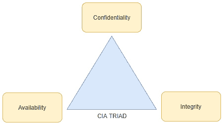
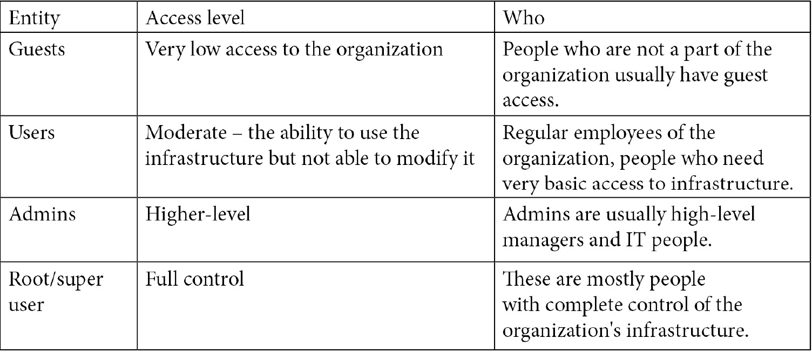
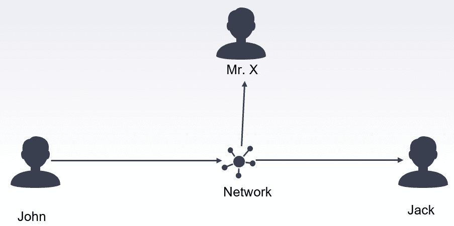
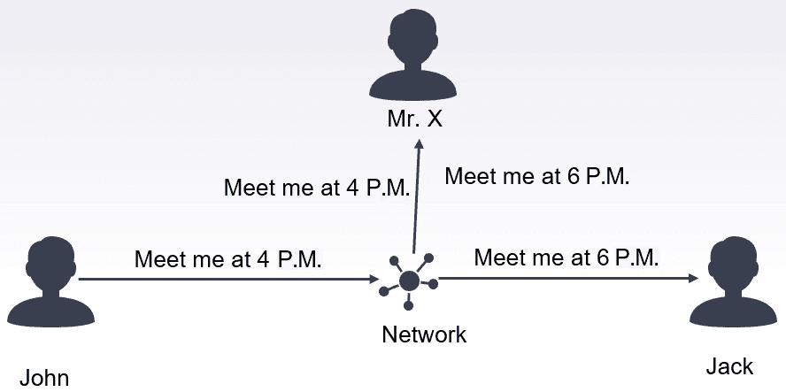
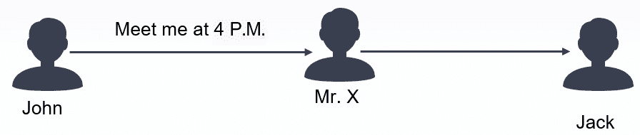
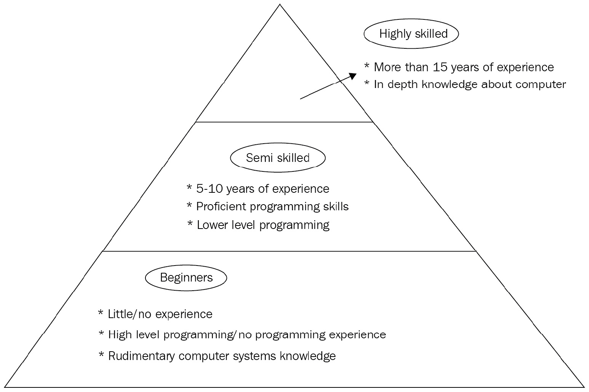
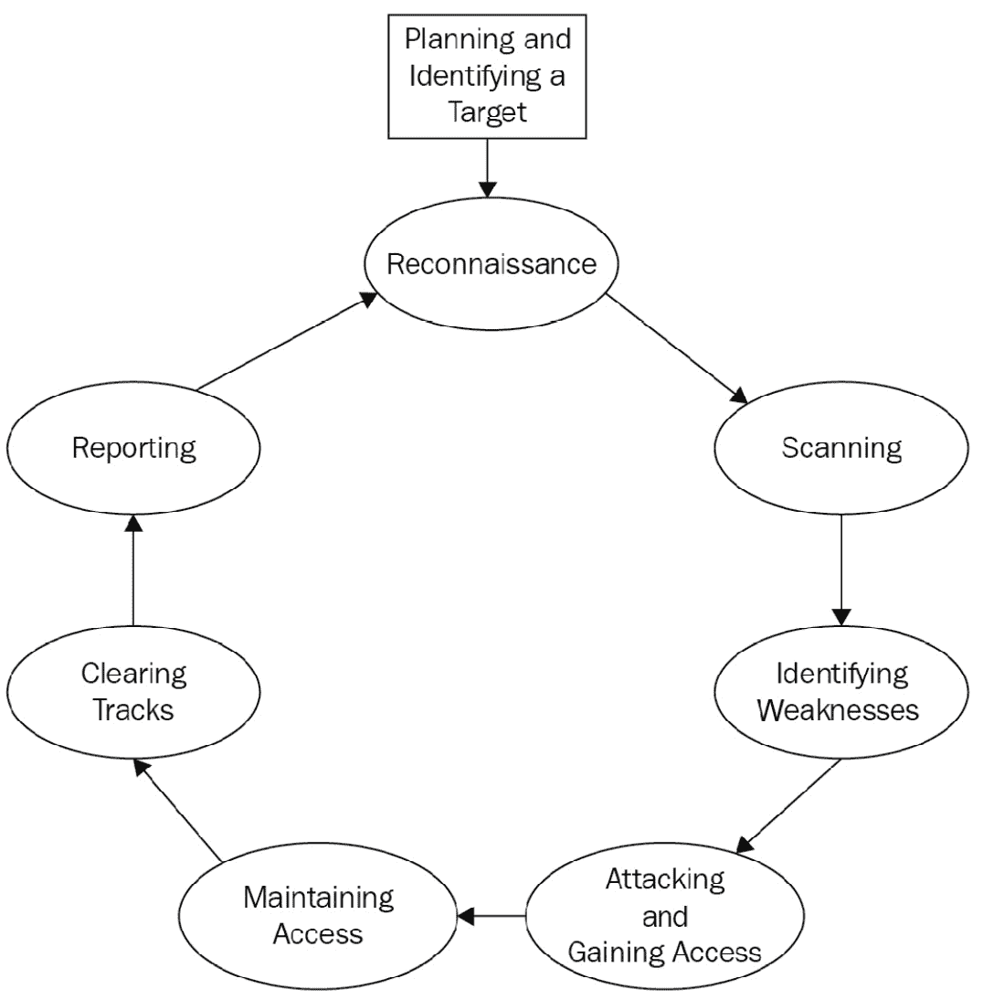

# 第一章：黑客入门

本章将为你快速介绍黑客的基本概念。你将开始了解黑客的世界以及成为黑客所需的条件。你将学习到成为现实世界中成功黑客所需的技能集。我们还将讨论黑客和渗透测试的一些法律方面，以及如何避免陷入法律困境。接下来，我们将探索不同类型的黑客以及他们所属的类别。在本章的后续部分，我们将讨论进行成功攻击所需遵循的基本步骤和指南。最后，我们将通过讨论不同的攻击路径来结束本章内容。我们将讨论技术性和个人渗透测试技术。

本章将涵盖以下主题：

+   黑客到底怎么了？

+   什么是黑客攻击？

+   成为一名成功的黑客

+   黑客类型

+   黑客阶段和方法论

+   网络安全职业

+   攻击类型

    免责声明

    本书提供的所有信息纯粹是出于教育目的。本书旨在作为学习渗透测试的起点。请根据自己的判断使用本书提供的信息。作者和出版方对本书中提供的内容的恶意使用不承担任何责任，也不对因此产生的任何损害负责。

    在没有事先书面同意的情况下进行渗透测试或攻击目标是非法的，应尽量避免。读者有责任遵守当地、联邦、州以及国际法律法规。

# 黑客到底怎么了？

当你想到*黑客*这个词时，脑海中浮现的是什么？近年来，*黑客*这个词几乎成为了一个天才计算机极客的代名词，能够在几秒钟内访问任何系统并控制一切。从能够通过计算机控制交通信号灯的人到渗透五角大楼网络的人，电影和小说塑造了黑客的特定形象。和电影中的一切一样，这仅仅是虚构作品；现实中的*黑客*和*渗透测试*的世界要复杂得多且具有挑战性。

现实世界充满了未知。成功对受害者实施攻击需要大量的耐心、努力、奉献精神，也许还需要一点运气。计算机安全和黑客攻击的世界是一个不断的猫鼠游戏。开发人员创建产品，黑客尝试破解并寻找漏洞并加以利用，开发人员发现这些漏洞并为其开发补丁，黑客找到新的漏洞，这个循环不断重复。双方都试图在这个不断的竞赛中超越对方。随着每一次的迭代，过程变得越来越复杂，攻击变得越来越精密，以绕过检测机制。类似地，检测机制也变得越来越聪明。你可以明显看到这种模式。

# 什么是黑客攻击？

本节将介绍什么是黑客攻击以及行业中使用的相关术语。了解这些术语对于理解渗透测试的世界至关重要，因此此时最好学习一下。*黑客攻击*一词指的是未授权访问系统的过程。系统可以是个人计算机，也可以是组织内的网络。你经常会看到*黑客攻击*和*渗透测试*这两个词在本书中交替使用。黑客攻击是一个更为常见的总称，涵盖了很多内容。本书的重点将更多放在渗透测试上，通常称为*道德黑客攻击*，即你得到攻击目标的许可。渗透测试，简称 pen-test，是对目标进行的授权模拟攻击。通常，这样做是为了发现系统中的潜在弱点和漏洞，以便在它们被恶意行为者利用之前暴露出来。

大多数知名公司都有某种渗透测试程序，以寻找其生态系统中的弱点。授权的个人和网络安全公司会被支付进行攻击他们的*资产*，以检测潜在的弱点。这些攻击者通常会编写一份完整的漏洞和弱点报告，帮助这些公司进行修补。以下是行业中使用的不同术语列表：

+   **黑客**：通过非法手段获取系统/网络未授权访问权限的人。

+   **目标**：被恶意攻击或测试攻击的实体。

+   **资产**：组织拥有的任何硬件、软件或数据，可能会成为攻击目标。

+   **渗透测试**：尝试渗透系统的过程，以测试其优缺点。

+   **漏洞**：系统中的弱点，可能被用来控制目标机器。

+   **利用**：能够利用系统漏洞的程序、代码或脚本。

+   **恶意软件**：用于恶意目的的程序。

+   **远程 Shell**：一种程序，允许您远程控制受害者的计算机。

以下列出的术语将在接下来的章节中使用。为了更深入地理解，了解这些术语是非常必要的。在阅读关于渗透测试的文献时，您会经常看到一个术语——**CIA 三元组**（即**机密性、完整性、可用性**）：

](image/B14788_01_01.jpg)

图 1.1 – CIA 三元组

黑客过程的大多数方面都涉及突破这些方面中的一个或多个。让我们详细探讨这些术语。

## 机密性

机密性指的是一个组织试图保持其数据私密的努力。这意味着没有授权的人不应访问数据，即便是在组织内部。组织通常会有访问控制，规定每个用户对数据的访问权限级别。访问权限通常被分为以下几类：

当人员获得不应有的基础设施访问权限时，机密性就会受到侵犯。例如，公司的前员工使用之前的凭证登录系统，或是访客在网络中获得了比必要更高的访问权限。为了确保机密性，必须采取严格的控制措施，以避免违反机密性标准。如果某人访问了公司数据但没有造成任何损害，机密性也会受到侵犯。请看下面的例子：

](image/B14788_01_02.jpg)

图 1.2 – 机密性侵犯

假设 John 在网络上向 Jack 发送一条消息。这条消息只打算发送给 Jack，其他人不可见。网络是与多个用户共享的。网络中还有一位未知的人——X 先生，他在监听所有网络流量（也称为*嗅探*）。机密性原则表示，只有 Jack 应该能够解码这条消息。如果 X 先生截获了这个包裹，读取它，并将其转发给 Jack，而没有对消息做任何修改，那么即使 John 和 Jack 都不知道他们的流量被截获，机密性原则也被认为被侵犯了。网络嗅探/监控违反了机密性原则。

## 完整性

完整性原则确保数据没有被以任何形式篡改，并且是可靠的。数据完整性应在静态模式和事务模式下得到保证。静态完整性意味着系统中的所有文件保持完整，任何未经授权的修改应立即被检测到。它还要求在数据通过介质传输时，数据完整性应得到保持。为了确保数据完整性，使用了不同的技术。最常见的例子之一是使用校验和。校验和是一串计算出来的字符，用于确保文件没有被修改。你通常会看到下载的文件附带有校验和。一旦文件下载完成，你可以计算校验和并将其与网站上提供的校验和进行比较；如果两者相等，则意味着在下载过程中数据完整性得到了保持。如果下载过程中即使有一个比特发生了变化，整个校验和字符串都会改变。它通常用于防止文件伪造/掩盖攻击，在这种攻击中，黑客拦截你的下载请求，并且在你请求下载文件时，不是下载你请求的文件，而是下载恶意软件到你的电脑上。你应该始终比较文件的校验和，以确保你下载的文件与服务器上的文件确实相同。

为了更好地理解完整性原则，让我们看一下以下示例：

图 1.3 – 完整性原则的违反

假设 John 向 Jack 发送一条消息，告知他们应该在下午 4 点见面。X 先生再次通过一种方式拦截网络流量，使得这两人之间的所有流量都经过 X 先生。X 先生读取了 John 的消息，将时间从下午 4 点改为下午 6 点，然后将消息发送给 Jack。Jack 接收到消息后，认为 John 想在下午 6 点见面，而不是下午 4 点。Jack 无法知道实际的消息内容。在这种情况下，完整性和机密性的原则都被违反了。X 先生能够读取和修改数据。

## 可用性

最后一个可用性原则要求数据在授权用户请求时可用。**拒绝服务**（**DoS**）攻击违反了这一原则。在 DoS 攻击中，攻击者通过大量请求试图压垮系统，使得服务器/系统无法为合法用户提供服务。这是对网站最常见的攻击之一。攻击者通过请求轰炸网站服务器，最终将其瘫痪。现在，通常会设置一个等待几秒钟的时间，以便请求得到处理，从而抑制 DoS 攻击。可用性仅意味着网络、系统和服务器在用户需要时保持在线。即使是几分钟的中断也可能对组织造成灾难性后果。让我们通过相同的示例来更好地理解这一点：

图 1.4 – 通过 DoS 攻击违反可用性

再次假设，John 在同一个网络上给 Jack 发送一条信息，而 Mr. X 正在拦截这条信息。John 发送给 Jack 一条消息，告诉他下午 4 点见面。然而，Mr. X 拦截了这条信息，结果没有转发，而是选择不作为。John 认为信息已发送，但 Jack 永远不会收到这条信息。在这种情况下，违反了可用性原则，因为消息对 Jack 不可用。可用性原则的另一种违规方式是延迟消息。假设 John 发送了一条紧急消息给 Jack，关于某些必须在特定时间框架内完成的任务。Mr. X 延迟了消息，使得 Jack 在该时间框架过去后才收到消息。尽管 John 收到了正确的消息，但延迟使得消息变得毫无意义。这同样是对可用性原则的严重违反。

为了保持系统的安全性和可靠性，CIA 三原则非常重要。每个网络安全专家的目标是根据 CIA 特性维护系统。任何违反这些原则的行为都会导致系统网络安全的漏洞。接下来，让我们看看成为一名成功黑客需要具备哪些条件。

# 成为一名成功的黑客

为了成为一名成功的渗透测试员，你需要具备特定的技能集。首先，你需要强烈的愿望去学习新技术。计算机世界的变化非常迅速，每隔几年，旧的工具和技术就会被淘汰。你不能依赖一个成功的漏洞利用工具，指望它在 10 年后仍然有效。本书主要侧重于开发你自己的工具。你无法通过本书中开发的工具攻击 NASA，这本书的目的是让你打下基础。本书中描述的技术和工具的知识将帮助你起步，接下来，天空才是极限。

成为一名成功黑客的第一步是掌握计算机系统和计算机网络的知识。没有这些知识，你无法走得太远。本书假设你已经熟悉计算机网络等内容，必要时会对新术语进行解释。本书还假设你具备基本的 Python 编程语言知识。本书将使用 Python 3 进行讲解。

掌握这两个领域的知识应该足以跟上本书的内容。渗透测试的领域非常广泛，要想成为一个在众人中脱颖而出的黑客，你需要掌握很多技术。这些技术包括 Linux、数据库、硬件和内存访问、逆向工程、加密学、网络以及分析技能。如果你想要成功，你应该主动并能够迅速反应。

现在大多数系统都是在线的，基于网络的黑客攻击是渗透测试中最常见的一种形式。这意味着，了解网络如何运作是成为渗透测试员的必要条件。对基于网络的技术，如 HTML、JavaScript、PHP 和 SQL 的基本知识至关重要。这些内容本书中不会涉及，因为它们不在本书的范围内；然而，在实际工作中，掌握这些工具对于渗透测试非常有用。

成为一名成功的道德黑客所需的关键技能之一是像黑客一样思考。那么，*像黑客一样思考*意味着什么呢？黑客的目标是突破系统。计算机系统的设计通常是直观的，因此大多数人都能通过最小的努力与之互动。系统的所有安全方面都是基于这种方法设计的。要突破一个系统，你的思维过程应该是有些反直觉的，或者说是富有创意的。你需要能够识别可以攻击的弱点，这些弱点可能帮助你攻破系统。

创建一个可以帮助你攻击某个系统的工具是黑客过程的一部分，而能够在不被发现的情况下成功地将恶意软件部署到目标系统上，则是另一半。这几乎和黑客工具本身一样重要。一旦你确定了目标，你的任务就是思考一种方法，通过这种方法你可以将恶意软件部署到系统上。根据你可以获得的系统访问权限，部署代码的方法有很多种。这些方法，如钓鱼攻击和木马，将在后续讨论。如果这些术语对你来说听起来有些陌生，不要担心。读完本书后，你会对这些术语大部分都比较熟悉。

黑客攻击要求你不断跟进新技术。网络安全的格局变化非常迅速，你需要对这些变化非常熟悉。一个好主意是关注专门讨论这些问题的论坛和网站。每天都有数百个漏洞被发现并修复；你需要在合适的时间出现在合适的地方，以便利用这些漏洞。机会窗口通常非常短暂。在网络安全领域，常用的一个术语是*零日漏洞*。零日漏洞指的是尚未修复的漏洞。通常，只有少数人知道这些漏洞，他们往往不会公开这些漏洞，以便最大限度地利用它们。一旦漏洞公开，往往会在短时间内被修复，有时甚至只需几天时间。

图 1.5 – 黑客技能金字塔

上图展示了根据道德黑客的专业技能所绘制的技能金字塔。要达到顶端，需要结合经验、分析能力以及最重要的计算机系统的深入知识。

## 合法性

渗透测试的基本原则是，你不应该攻击你不应该攻击的系统。即使你在一家网络安全公司担任渗透测试员，你也必须获得书面许可，才能测试系统的安全性。没有书面同意，你可能会陷入许多法律问题。渗透测试通常涉及使用不同的攻击向量攻击系统，这可能会导致系统崩溃。如果你没有事先获得许可，你将对其基础设施造成的损害负责。

渗透测试涵盖了各种各样的测试。在实际案例中，测试的书面同意合同必须明确界定测试的*范围*。它应提到将执行哪种类型的测试以及测试将针对哪些系统/资产进行。测试应严格限于这些预定的目标。例如，软件代码的测试不应包括网络安全测试，除非明确提到。

渗透测试可以在生产或实时系统上进行。如果测试的资产是一个实时系统，必须正式通知用户有关测试的信息以及测试可能带来的损害。渗透测试在不同的环境中进行。有时，组织中的用户知道正在进行渗透测试，而在其他情况下，只有高层管理人员知道，这样他们可以测试哪些人是组织的潜在威胁。如果组织中的用户已经知道将要进行渗透测试，最好提前通知他们测试时间，以免影响组织的日常活动。接下来，让我们了解一下黑客的类型。

# 黑客类型

如前所述，黑客这一术语有一个特定的形象。然而，在现实生活中，黑客根据其所执行的行为类型可以被分为不同的类别。在接下来的章节中，我们将解释不同类型的黑客，他们需要什么样的经验，以及与每种类型相关的法律方面。

## 白帽黑客

*目标*：保护组织的业务和资产免受外部和恶意攻击。

白帽黑客指的是网络安全专家或渗透测试人员，他们的目标是测试信息系统的安全性。他们也被称为*道德黑客*或*好人*。他们的目的是防御恶意黑客，稍后会详细讨论。白帽黑客使用相同的工具和技术，并且在突破系统方面拥有相同的专业知识。唯一的区别在于他们的意图。他们的目标是增强系统的强度，并保护系统免受外部攻击。

本书旨在帮助你成为一名道德黑客，并帮助提高系统的安全性。成为一名成功的道德黑客需要多年的技术学习经验、理解黑客的思维过程，以及耐心。网络安全分析师和渗透测试员是计算机科学领域薪资最高的职业之一。

## 黑帽黑客

*目标*：以恶意意图突破系统。

黑帽黑客通常是犯罪分子，他们的动机要么是为了经济利益，要么是为了以个人、机构或国家的目的伤害某人。黑帽黑客尽量隐藏自己的身份；他们大多使用化名来识别自己。带有恶意意图的黑客行为在大多数国家都是非法的。黑帽黑客在系统中很难被发现，除非他们选择揭露自己。很多时候，他们保持对系统的远程访问，而资产的实际拥有者并不知道他们的存在。他们也非常擅长掩盖自己的痕迹。他们中的大多数人只有在造成损害后才会显露出来。很多时候，黑帽黑客是不同犯罪组织的一部分，这使得他们更加难以捉拿。

严格来说，*黑帽黑客*指的是那些主要目标是为了经济利益的人。*黑帽黑客*这个术语来源于西部片中，坏人通常会戴着黑帽子，因此，使用黑帽来指代黑客的惯例变得流行起来。

## 灰帽黑客

*目标*：个人动机或为了娱乐。

现实世界并非二元化，黑客也不是。*灰帽*指的是那些在模糊领域操作的黑客。他们拥有与白帽或黑帽黑客相同的技能；然而，他们的动机通常不是为了经济利益。灰帽黑客喜欢为了娱乐和乐趣而玩弄系统。大多数时候，他们是无害的，甚至会向负责的人暴露系统漏洞。他们突破系统只是因为他们能做到。

灰帽黑客还喜欢四处探查系统，测试它们的弱点，一旦发现潜在的漏洞，通常会通知管理员并提供修复问题的服务，收取服务费。这是他们赚钱的一种方式。这种做法的合法性值得质疑；然而，对于某些人来说，这也是一种赚取可观收入的途径。

如前所述，灰帽黑客与黑帽黑客之间的界限非常模糊。对此你需要非常小心。一个小小的错误或计算失误可能会导致严重的问题。灰帽黑客最终也有可能越界，进入黑帽黑客的范畴。

这三类黑客是主要的分类。然而，在现实生活中，还有其他一些术语，可以根据不同人的看法，归入这些类别之一。由于很难将它们归为单一类别，因此它们将在下一节中单独提及。

## 国家级黑客

*目标*：攻击敌方的网络资产。

随着各国对计算机系统的依赖日益增加，保护和攻击网络系统的需求变得极为重要。随着传统战争手段越来越强大并逐渐有限，网络战争的使用正在变得越来越重要。*国家级黑客*是指专注于破坏敌对国家网络资产的黑客团队。

国家级或*国家资助的黑客*的历史可以追溯到计算机早期时代。国家早就开始将黑客行为作为实现战略目标的手段。国家资助的黑客的工作就是渗透敌方系统，获取情报，植入后门进行远程控制，甚至摧毁敌方的关键基础设施。在这方面已有多起高调的尝试，威胁非常真实。试想一下，如果敌对国家控制了某个核电站，会发生什么？这个情节并非科幻电影中的虚构，它在现实生活中也曾发生过。

以*Stuxnet*病毒为例，它曾感染伊朗的核设施。Stuxnet 是一种非常复杂的恶意软件，感染了**监控与数据采集**（**SCADA**）系统。SCADA 系统用于监控和控制大规模工业系统。该病毒利用了该设施中使用的**可编程逻辑控制器**（**PLC**）中的一个漏洞。恶意软件的传播非常隐秘，只有在目标系统是伊朗核设施时才会激活。尽管它感染了大量计算机系统，但大部分时间保持休眠，只有当它到达预定目标时才会激活。根据大多数研究人员的观点，这种攻击的复杂性表明，它不是某个犯罪组织的所为，而是一个高度专业化的程序员团队，开发此病毒花费了数月时间。这类资源通常只有国家级黑客才有。Stuxnet 控制了离心机的转速信号，并以极高的速度启动离心机，直到最终导致设备故障。Stuxnet 还拦截了发送给 SCADA 系统的转速状态信息，使得系统看起来离心机运转正常，而实际上它们的转速远高于正常水平。这使得 Stuxnet 极难被检测到，且在很长一段时间内未被发现，直到 2010 年才被侦测到，阻碍了该设施的核能发展进程。

## 企业间谍

*目标*：为了获得竞争优势。

许多公司的商业价值在于它们拥有的**知识产权**（**IP**）。这些知识产权有时决定了公司价值的高低。近年来，公司频繁遭遇*企业攻击*，攻击者试图窃取公司的知识产权。在商业竞争日益激烈的环境下，企业间的间谍活动已成为日常事件。公司经常受到*企业黑客*的攻击，黑客的目标是窃取敏感信息，包括知识产权、商业计划、专利、财务数据和客户数据，从而获取竞争优势。这些攻击可能来自直接的竞争对手，或者他们可能会雇佣专业的黑客来执行这些任务。

这类黑客通常属于黑帽黑客。然而，由于攻击的性质，他们有时被划分为一个独立的类别。企业黑客的唯一区别是他们的主要目标通常是竞争对手，而在其他情况下，目标可能是任何人。

## 黑客活动分子

*目标*：为了表达政治/社会立场。

黑客行动主义者（Hacktivist）是结合了*激进分子*（activist）和*黑客*（hacker）这两个词的术语。这些类型的攻击通常是为了发表政治声明。这些黑客的目的是呼吁社会变革或引起对某个问题的关注。与那些尽可能隐秘的黑帽黑客不同，黑客行动主义者试图在隐藏自己真实身份的同时，获得最大的关注。他们的目标是将他们的信息传播给大众。在大多数黑客行动主义案件中，黑客没有经济动机。他们使用与其他黑客相同的工具和技术。黑客行动主义是政治抗议的数字化等价物。随着政治动态的变化，政治开始渗透到数字空间，黑客行动主义为一些人提供了一条表达自己观点的途径。

黑客行动主义者使用不同的方法来吸引注意。有时他们通过破坏服务来进行攻击，例如对公司或政府网站进行 DoS 攻击。其他时候，他们获取敏感和关键的信息，并将这些机密信息泄露给公众，给政府或公司带来极大的尴尬。近年来最著名的泄密事件之一是维基解密丑闻。

这里需要注意的一点是，从法律角度来看，黑客行动主义和黑帽黑客并没有区别。即使你是为了一个高尚的事业而参与某项活动，如果被抓到，你也将被判与黑帽黑客相同的罪行。因此，许多黑客倾向于保持匿名，并使用化名进行他们的行动主义活动。

与黑客行动主义相关的最著名的黑客组织之一是*匿名者*（Anonymous）。他们被指控对不同的政府组织进行过多次攻击，以表达对某个事业的同情或反对某些立法。匿名者自称为一个去中心化的组织，成员们聚集在一起支持一个共同的事业。他们常被称为*自由斗士*和数字世界的*罗宾汉*。这个集体的去中心化特性意味着它变得非常难以打压：

](image/B14788_01_06.jpg)

图 1.6 – 与匿名者相关的标志

不同的个人和小型组织声称负责管理这个组织的运作；然而，这个组织的真实性质仍然是一个谜。还有其他一些组织，如 LulzSec 和 Fancy Bear，它们的运作更加专注，给网络安全专业人员带来了重大困难。

## 脚本小子（Script kiddies）

在网络安全领域，术语*脚本小子*指的是那些对网络安全或黑客攻击缺乏深入了解的初学者黑客。他们通常倾向于使用预先构建的工具进行攻击，就像黑箱方法一样。他们本质上并不懂得这些黑客工具的内部工作原理，而只是直接使用它。脚本小子有时缺乏编程知识，无法自行构建工具，因此依赖现有的工具进行攻击。*脚本小子*这一术语来源于他们使用预先构建的*脚本*或程序来实施攻击。

脚本小子通常会获取像*反向 Shell*这样的黑客工具，并通过观看互联网教程来部署它。他们的目标不是学习过程，而是最终的目标——控制目标系统。只要工具能够工作，他们并不关心它是如何工作的。

网络安全专业人士常犯的一个错误是没有认真对待脚本小子。即使是脚本小子实施的攻击，如果部署得当，也能对资产造成巨大的损害。为了实施成功的攻击，攻击者并不需要了解他们所使用的脚本的每一个细节。只要找对攻击的角度，就足以实施成功的攻击。网络上有大量的免费和付费工具可以帮助人们进行攻击。有一些黑客组织专门制作这些工具，并将它们卖给脚本小子用于实施攻击。所以，不要认为那些对开发工具知之甚少的人不是威胁。事实上，他们的威胁程度与经验丰富的黑客一样。一次攻击的成功取决于攻击者本身以及所使用的工具。

# 黑客攻击阶段与方法论

获得所需的知识后，黑客攻击的过程就开始了。像任何其他有组织的任务一样，黑客攻击也有一套需要遵循的步骤，以执行成功的攻击。现实中的黑客攻击是一个艰难的过程，需要大量的工作。从收集信息到发动攻击，再到掩盖踪迹，每一步都需要完美执行。任何一个疏忽都可能暴露你的身份，危及整个过程。*图 1.7*展示了黑客攻击的不同阶段，接下来将详细讨论：

图 1.7 – 黑客攻击步骤

在接下来的章节中，我们将详细探讨每个步骤。

## 规划

任何事情的第一步都是恰当的规划。花时间进行适当的规划可能会节省由于规划不当而浪费的大量时间。规划的重要性不容忽视。在接下来的章节中，我们将重点关注渗透测试方法论，即测试系统或网络被渗透的难易程度。我们将对一个虚构的组织——*著名组织有限公司*进行攻击，且在该组织内部，我们将关注一个虚构的人物，我们称他为*目标先生*。在一个专业的渗透测试计划中，你需要在规划过程中创建一个适当的工作流程，并且有序地保存整个过程中的所有相关信息，以供报告使用。

下一步是确定要攻击的目标人员或系统。从渗透测试的角度来看，在这里我们将定义测试的范围，包括其涵盖内容、限制条件等。在进行渗透测试之前，我们应确保被测试的系统已经准备好进行测试。这包括确保测试不会导致组织关键基础设施的瘫痪。

在开始渗透测试程序之前，还应明确谁将执行攻击，并且会有什么样的监督机制。渗透测试的范围应该明确界定，包括哪些内容，哪些不包括。测试目标和时间表应提前明确。渗透测试应与公司的目标保持一致。在某些情况下，还会测试模拟场景，我们希望看到攻击对公司日常运营的影响。规划阶段还应决定需要进行哪种类型的渗透测试。

## 侦察

一旦目标被确定并且规划阶段完成，我们就开始渗透测试过程。简单来说，侦察意味着收集关于目标个人和组织的信息。在进行任何渗透攻击之前，我们的目标是尽可能多地获取关于目标的信息。我们掌握的信息越多，成功进行攻击的机会就越大。信息收集有两种方法，具体如下：

+   被动信息收集

+   主动信息收集

让我们在以下小节中进行学习。

### 被动侦察

被动侦察顾名思义，是通过被动的来源收集关于目标个人和公司信息的一种方法，且不与目标直接互动。这是最安全的信息收集方式，因为没有与目标的互动，因此无法追溯到你。被动侦察包括从公共来源收集信息。这可能包括从互联网收集可用信息。被动信息本身通常是无害的，但如果与攻击向量结合使用，可能会被利用。例如，假设你访问目标的社交媒体资料，发现该人非常喜欢狗。这个信息本身并没有太大用处。但如果你给他们发送一封包含钓鱼链接的电子邮件（钓鱼攻击稍后会解释），并且邮件中包含一些关于狗的信息，那么目标更有可能点击该链接，从而最终使系统遭到入侵。被动侦察通常通过搜索引擎和公共数据库进行。被动侦察速度较慢，通常提供的技术数据有限。尽管它比较慢，但被动侦察被发现的风险非常低。

### 主动侦察

在主动侦察中，你直接与目标进行互动，或者通过计算机进行互动。主动侦察速度更快，可以提供大量关于目标的信息，尽管这会带来更高的风险。主动侦察包括了解目标使用的系统以及与目标系统相关的其他技术规格。以下是主动侦察中最常用的信息列表，但这不是一个全面的列表：

+   **IP 地址**：目标的互联网协议地址，包括私有地址和公共地址。

+   **MAC 地址**：标识目标用于连接网络的硬件接口的字段。

+   **端口**：端口扫描是主动侦察中最常用的工具之一。系统中的开放端口可以在目标不知情的情况下用于启动与目标的连接。

+   **运行在目标机器上的服务/软件**：了解目标上运行的不同服务可能是发动攻击的一个良好起点。如果目标上运行的某个服务有已知漏洞，可能很容易被利用。

+   **操作系统指纹识别**：确定目标使用的操作系统。

这些是主动侦察中最常见的信息类型。进行主动侦察时需要非常小心。确保在执行主动侦察时完全隐藏你的身份。大多数现代系统都有**入侵检测系统**（**IDSes**）。它们通常会记录每一次尝试扫描系统的行为。如果你没有匿名身份，你的身份很容易被揭露。防火墙和 IDS 通常会阻止不必要的端口扫描。

## 扫描

如前所述，扫描包括获取关于网络拓扑和目标的技术信息。理解网络拓扑有助于在获得系统访问权限后进行横向移动。创建一个包含目标机器的活动主机列表是扫描过程中的一个重要方面。检测网络中的防火墙和路由器也可能有帮助。扫描的主要目标之一是识别漏洞，可以通过找到开放端口或检测系统上运行的易受攻击服务来实现。许多商业工具可用于扫描目的。最著名的网络侦察工具之一是 NMAP。NMAP 有一个 Python API，可用于创建自动化扫描测试。我们将在后面的章节中讨论一些使用 NMAP API 的 Python 示例。

网络和端口扫描是非常嘈杂的过程，会生成大量网络请求。现代 IDS 非常迅速地检测到这些行为。这意味着扫描过程越慢，成功的机会就越大。扫描网络以检测在线主机就是一个例子。应用服务和版本检测也被认为是网络扫描的重要方面，尽管这是一项更复杂的任务。

数据包嗅探器是另一个帮助你监控网络流量的工具。如果你与目标连接在同一网络上，它可以提供有关网络流量的洞察，帮助你识别潜在的攻击机会。最著名且免费的网络嗅探工具之一是 Wireshark。它帮助你详细监控和查看网络流量。

## 识别弱点

网络扫描和侦察会提供大量信息。你需要以结构化的方式跟踪所有获取的信息，这将帮助你识别相关信息。在实际案例中，黑客通常会进行长期的信息收集，持续时间从几个月到几年不等。一旦你确信自己已收集到足够的信息，就可以继续进行下一步，即识别弱点。此步骤包括审查在前一步中获得的所有信息，并确定哪些信息对于实施攻击有用。

## 攻击和获取访问权限

一旦你识别出了系统的弱点，下一步就是开始思考攻击策略。攻击策略没有硬性定义。 如果你想通过命令行控制远程系统，你可以选择使用正向 Shell 或反向 Shell。如今大多数操作系统都提供了命令行界面来实现其功能。在 Windows 中，你可以通过`Cmd.exe`或`powershell.exe`程序访问它。在 Linux 系统中，你可以使用 Bash。你几乎可以通过命令行界面执行操作系统中的任何任务，因此如果你能够通过命令行或命令行界面连接到目标系统，这将极其危险。如果目标机器上有一个命令行进程，并且你能够在自己的系统上控制它，你基本上可以对受害者/目标机器做任何事情。

### 正向 Shell

在正向 Shell 中，攻击者尝试发起连接到目标机器。在现代系统中，这种策略相对困难，因为目标系统的入侵检测系统（IDS）和防火墙通常会阻止所有不必要的传入连接，除非防火墙规则另行指定。这使得这种策略的执行变得相当困难。

### 反向 Shell

在反向 Shell 中，攻击者以某种方式将恶意程序植入系统中，一旦该程序在受害者的机器上执行，它会发起与黑客的连接，从而让黑客获得完全控制。这些攻击通常非常成功，因为入侵检测系统（IDS）很难区分合法进程和恶意进程。

攻击者也可以通过利用目标机器上运行的某些软件漏洞进行攻击。网上有很多资源解释了如何创建一个有效载荷（执行恶意操作的代码片段）并在目标机器上执行它。在这个领域中，最常用的工具之一是*Metasploit*。它包含大量预加载的漏洞利用代码；一旦你发现目标 PC 上有一个易受攻击的服务在运行，你就可以使用 Metasploit 创建有效载荷，将其传送到目标机器，从而获得对这些系统的访问权限。

## 保持访问权限

一旦进入目标机器，目标应该是维持对这些系统的持久访问。黑客会尽量保持对系统的访问，尽可能长时间地不被发现。黑客入侵系统的原因有很多。有时他们仅仅是通过访问系统，将其用作攻击其他系统基础设施的跳板；在这种情况下，他们通常不太关心在执行诸如**分布式拒绝服务攻击**（**DDoS**）时是否被发现，攻击目标往往是被攻破的机器。在其他情况下，他们会在受攻击的系统上保持隐匿模式，监视每一个活动，有时甚至窃取数据。黑客使用嗅探器时，能够轻松地监控网络流量，这对于受害者来说是非常危险的。

一旦攻击者以非常原始的访问权限进入系统，他们的直接目标就是提高访问权限，深入到网络或系统中。这将确保攻击者能够长期访问受害者/目标机器，并且他们可以随时控制它。维持长期访问的另一个重要方面是转移攻击（pivoting），即攻击同一局域网内的其他机器。这有助于攻击者在网络中保持强大的立足点，并使得入侵检测系统（IDS）很难清除攻击者的痕迹。

## 后期利用

一旦获得了基本的系统访问权限，提升访问级别通常是个好主意。例如，你可以通过利用系统漏洞获得基本的用户级别访问权限；然而，大多数情况下，这种访问权限会非常有限，无法帮助你深入渗透系统。例如，在 Windows 系统中，你无法使用用户级别权限禁用杀毒软件或入侵检测系统（IDS）；你需要是管理员才能做到这一点。在后续章节中，我们将学习如何将访问级别从普通用户提升到系统管理员，这将使你几乎完全控制系统。

## 掩盖痕迹

掩盖痕迹是成功渗透测试攻击的一个关键环节。在网络安全领域，事故响应团队是那些旨在限制攻击范围并提供服务恢复操作的人员。一旦黑客实现了他们的目标，他们应该完全掩盖自己的痕迹；否则，他们很容易被取证人员发现。常见的掩盖痕迹方法包括删除攻击阶段生成的日志和临时文件，清理注册表项、缓存，有时还会清除浏览器历史记录。渗透测试人员还应了解与不同操作系统相关的日志机制。例如，Windows 操作系统会使用*跳转列表*记录最近访问和修改的文件。数字取证专家使用这些技术来确定攻击者以及攻击在系统上的范围。

互联网上有很多开源工具可以用来掩盖痕迹，这些工具能够很好地隐藏你的身份。例如，在*Metasploit*中，你可以使用`clearv`等脚本来清除 Windows 机器上的所有事件日志。

另一种掩盖痕迹的方法是使用*反向 HTTP Shell*。Shell 是一种在系统上执行用户命令的代码。我们将在后续章节中详细讨论这一点。在大多数计算机中，端口`80`用于 HTTP 数据包，因此，端口`80`在计算机中通常是打开的。防火墙很难区分端口`80`上的合法数据包和恶意数据包。使用基于 HTTP 的反向 Shell，取证分析师很难区分黑客行为。

一旦黑客获得系统的访问权限，他们将通过命令行界面运行各种命令。达到目标后，黑客通常会删除命令历史记录，以避免被检测到。这通常通过在基于 Linux 的系统中使用`export HISTSIZE=0`命令来实现。

## 报告

渗透测试或道德黑客的最后阶段是编写关于系统所有弱点以及渗透测试目标实现情况的报告。渗透测试报告应列出有关攻击的所有必要细节。渗透测试报告通常包含以下内容。

### 摘要

摘要应简要总结渗透测试的内容，并解释进行渗透测试的主要原因。编写渗透测试摘要报告时应考虑以下几点：

+   渗透测试的目的和目标

+   渗透测试的范围

+   执行的测试简要列表

+   渗透测试的发现

+   渗透测试的结论

这些任务的解释如下：

### 引言

在引言部分，应解释所有与测试环境相关的信息。应提到渗透测试的时间线，从开始到结束。渗透测试持续了多长时间？应提及进行渗透测试时所采用的方法和途径。哪些系统成为渗透测试的目标？最后，进行了什么类型的测试？

### 方法论

在本节中，我们应列出用于攻击目标的所有程序和方法。例如，我们如何获得关于目标的信息，并且我们获得了哪些信息？这些信息如何被用来执行攻击？使用了哪些方法来交付有效载荷？例如，攻击者是否向目标发送了一个恶意的 PDF 文件？还应提及攻击的难易程度，即哪些方面很容易攻击，哪些部分则很难。

### 发现

发现部分应提及在渗透测试中发现的漏洞和威胁。将发现的漏洞按其严重性分级是一种好方法。此类测试的一个例子是对设备进行漏洞扫描，检测系统上是否运行了任何易受攻击的服务。最后，发现部分还应提及系统的优点，例如强大的防火墙配置和强密码。对于严重的漏洞和威胁，应提供详细信息。将必要的截图和发现附加到文档中是一个好主意。

# 网络安全职业

网络安全是一个庞大的领域，涵盖的每个方面都可能需要一本书来介绍。不过，我将尽力解释网络安全的主要趋势以及你需要掌握的技能。以下部分列出了一些较为常见的职业，尽管这并不是一个详尽无遗的清单。

## 系统安全管理

就像系统管理员的工作是维护和管理组织的系统一样，*系统安全管理员*的目标是专注于系统安全的管理。他们的工作是执行日常的安全任务，如系统监控和备份管理。

## 安全架构师

网络是现代计算机系统中最重要的组成部分之一，而且往往是攻击者进入组织的入口，因此管理、维护和保护网络对组织至关重要。安全架构师的工作包括问题报告、入侵分析等。

## 渗透测试员

如前所述，渗透测试员的目标是测试组织防御的强度。简单来说，渗透测试员的目标就是入侵系统并获得未经授权的访问权限。渗透测试员的工作还包括检测系统漏洞。有时，渗透测试员也会参与*事件响应团队*，以防御真实的威胁。渗透测试员经常被要求设计自己的工具，重点针对组织的需求。本书的大部分内容将按照成为渗透测试员的基本步骤进行讲解。渗透测试员是网络安全领域薪酬最高的职业之一，且需要极高的技能。

## 取证分析员

正如名称所示，计算机取证分析员的工作是评估数字资产并在系统入侵的情况下审查证据。他们的任务包括在入侵后保护数字和物理证据，以便用于分析，并可能在法庭上用来对抗黑客。计算机取证分析员必须对雇主或客户的安全问题高度敏感，并在处理财务和个人信息时严格遵守隐私程序。

## 首席信息安全官

**首席信息安全官**（**CISO**）通常是一个高管职位。CISO 的工作是监督组织系统、网络和数据安全需求的规划、协调和指导。其职责是确保安全合规，评估威胁形势，并制定政策和控制措施，以确保组织的安全。

# 攻击类型

根据攻击的执行方式，网络攻击有多种不同类型。这些攻击的性质可能会根据各种因素而有所不同，例如攻击者的意图和所使用的攻击工具。通常，这些攻击的目的是完全控制系统、窃取敏感信息，或两者兼而有之。

## 系统控制

攻击者通常希望控制受害者的计算机并对其进行操作。这可能意味着使系统对受害者来说变得无用，或者悄悄尝试在不让受害者察觉的情况下获取访问权限。在这一类别中，一个非常著名的攻击叫做**远程访问工具攻击**。这些攻击使攻击者能够远程控制受害者的计算机，获得完全或接近完全的控制权限。我们已经讨论过*正向*和*反向*Shell，它们在此类攻击中经常被使用。

## 社会工程学

另一种常见的攻击方式通常不需要太多技术知识，那就是**社会工程学**。简单来说，社会工程学是指通过操控或欺骗某人以获取信息。你不必编写冗长的代码，也不需要利用系统的技术弱点，而是通过欺骗他人让其提供信息，从而进行网络攻击。网络安全有两个基本方面：一个是技术方面，另一个是人类方面。安全系统的强度取决于它最薄弱的环节。通常，系统安全中最薄弱的环节就是人。没有安全系统是完全安全的，如果你知道破解它的方法。社会工程学并不像看起来那么简单。它需要耐心和细致的观察。接下来将解释一些常见的社会工程学技巧。

## 诱饵攻击

诱饵攻击意味着诱使目标上当，以*诱饵*为诱饵，然后等待目标犯错。例如，黑客经常将装有恶意软件的 USB 驱动器丢弃在组织办公室附近，等待某个员工出于好奇将 USB 插入计算机。一旦他们这样做了，剩下的工作就交给恶意软件来完成。

## 网络钓鱼

钓鱼攻击是一种攻击技术，攻击者冒充目标信任的人。通常，他们试图利用人们的兴趣。例如，如果某人是足球迷，他们更可能打开与足球相关的电子邮件或链接，从而为攻击者提供了攻击受害者的手段。这个攻击的常见例子是攻击者托管的克隆网站。攻击者会向目标发送一个假链接，这个链接与目标熟悉的网站相似。然而，该网站将由攻击者托管，目标将被引导到这个网站，而不是去真实的网站。这些克隆网站与原始网站非常相似，如果不小心，很难分辨出来。由于这个克隆网站是由黑客操作的，用户输入的任何数据都会被黑客获取。检测这些假网站的一个好方法是检查网站名称及其协议。真实的网站通常会使用`https`协议。

# 总结

在本章中，我们学习了黑客攻击的基础知识以及现实生活中不同类型的黑客。然后，我们详细研究了黑客攻击的步骤以及每个步骤的具体内容。最后，我们了解了网络安全领域的不同职业，并探讨了本书如何帮助我们在这些职业中取得成功。最后，我们还探讨了社交工程的不同方面及其如何用于实施攻击。在下一章中，我们将开始学习如何搭建我们的实验环境以及本书中将使用的工具。
