# 第二章：入门 - 设置实验室环境

在我们开始了解如何进行道德黑客攻击之前，我们需要配置几个事项。在本节中，我们将了解完成本书所需的工具。我们将使用的大多数工具都是免费的。

我们将从选择本书中使用的 Python 版本开始。然后，我们将转向本书中使用的**集成开发环境**（**IDEs**）。我们还将学习如何设置虚拟环境，并理解它们如何有助于我们的工作。稍后，我们将深入选择**操作系统**（**OSes**），包括攻击者和目标/受害者的操作系统。我们将探索不同的操作系统，最终确定我们将在本书中使用的操作系统。最后，我们将测试一个示例 Python 脚本，检查一切是否配置正确，并确认是否可以继续。

在本章中，我们将讨论以下主题：

+   设置 VirtualBox

+   安装 Python

+   探索集成开发环境（IDEs）

+   设置网络连接

+   更新 Kali Linux

+   使用虚拟环境

# 技术要求

为了完成本章内容，你需要一台具有足够硬盘空间和内存的正常工作 PC，以便运行两个虚拟操作系统。大致估算，100 GB 的存储空间和 8 GB 的 RAM 应该足够。

项目的源代码位于以下链接：[`github.com/PacktPublishing/Python-Ethical-Hacking`](https://github.com/PacktPublishing/Python-Ethical-Hacking)。

# 设置 VirtualBox

如前所述，我们将在本章中为**渗透测试**（**pen testing**）配置我们的设置。我们首先需要的就是虚拟化软件。虚拟化软件帮助我们在现有操作系统上运行完整的操作系统。虚拟化的主要优势是，你可以在不购买额外硬件（如 PC）的情况下运行完整的操作系统，同时享受这些硬件所提供的所有功能。随着我们深入学习，你会更详细地了解这些优势。以下是一些流行的虚拟化软件列表：

+   `VMware Workstation Player`

+   `VirtualBox`

虽然也有其他选项，但我推荐使用其中之一。我将在本书中使用 VirtualBox，因为它是免费的。VMware Player 也免费，但没有适当的许可证无法用于商业用途。

要下载 VirtualBox，请访问以下链接：[`www.virtualbox.org/wiki/Downloads`](https://www.virtualbox.org/wiki/Downloads)。

在这里你可以找到下载链接。按照以下步骤操作：

1.  选择适用于 Windows 的 VirtualBox 安装包并下载。

1.  下载完成后，打开安装程序并按照指示在系统上安装它。

    安装过程应该相当简单。在安装过程中，它可能会请求你授权安装某些驱动程序。请允许安装程序安装这些驱动程序。

    安装完成后，界面应该类似于以下内容：

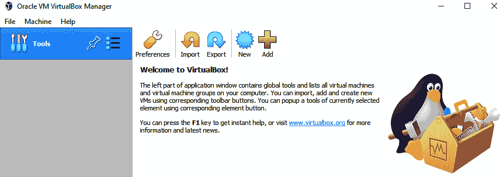

图 2.1 – VirtualBox 界面

设置虚拟化软件为我们搭建了一个基础，接下来我们将以此为基础，构建运行实验室所需的组件。接下来，我们将查看操作系统，选择并配置所需的内容。

# 安装虚拟操作系统

我们将需要一个操作系统作为攻击机，另一个作为目标机。在实际案例中，大多数时候，攻击机通常是基于 Linux 的系统，而目标/受害机通常是基于 Windows 的系统。本书中我们将交替使用“目标”和“受害”这两个术语。

## 攻击机操作系统

渗透测试机器有很多选择。然而，有几种基于 Linux 的发行版特别突出：

+   Kali Linux

+   Parrot OS

还有其他选项。然而，我推荐使用 Kali Linux，因为它稳定且广泛应用于渗透测试。Kali 配有许多预配置的工具，可以节省大量时间。

### Kali Linux

要下载 Kali Linux 的虚拟镜像，请访问 Kali 的下载页面：[`www.kali.org/downloads/`](https://www.kali.org/downloads/)。

让我们开始安装过程：

1.  在**下载**部分，选择**Kali Linux 64 位 VirtualBox**。这是一个已经安装好 Kali 操作系统的完整镜像，因此你无需安装任何东西：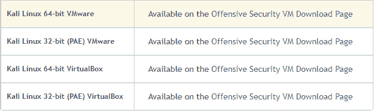

    图 2.2 – Kali Linux VirtualBox 镜像

1.  下载时间将根据你的网络速度而有所不同。下载完成后，只需将下载的镜像导入到 VirtualBox 中。要导入 Kali 虚拟机，点击**工具**标签中的**导入**按钮，如下图所示：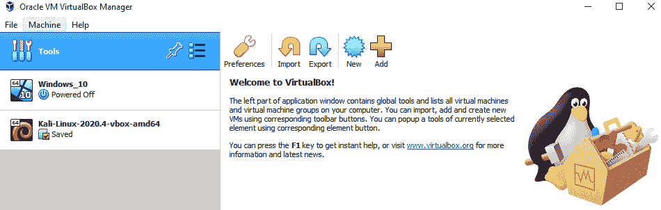

    图 2.3 – 导入 Kali 虚拟机

1.  这将打开一个对话框，你可以选择你刚刚下载的**Kali 虚拟机 ova**文件。

启动时，你会被要求输入密码以登录 Kali Linux 系统。镜像的默认凭证如下：

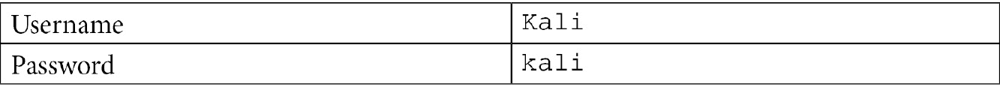

重要提示

你可能需要在设置中禁用 USB 2 支持，以便正确启动机器。

系统启动后，界面应该如下所示：

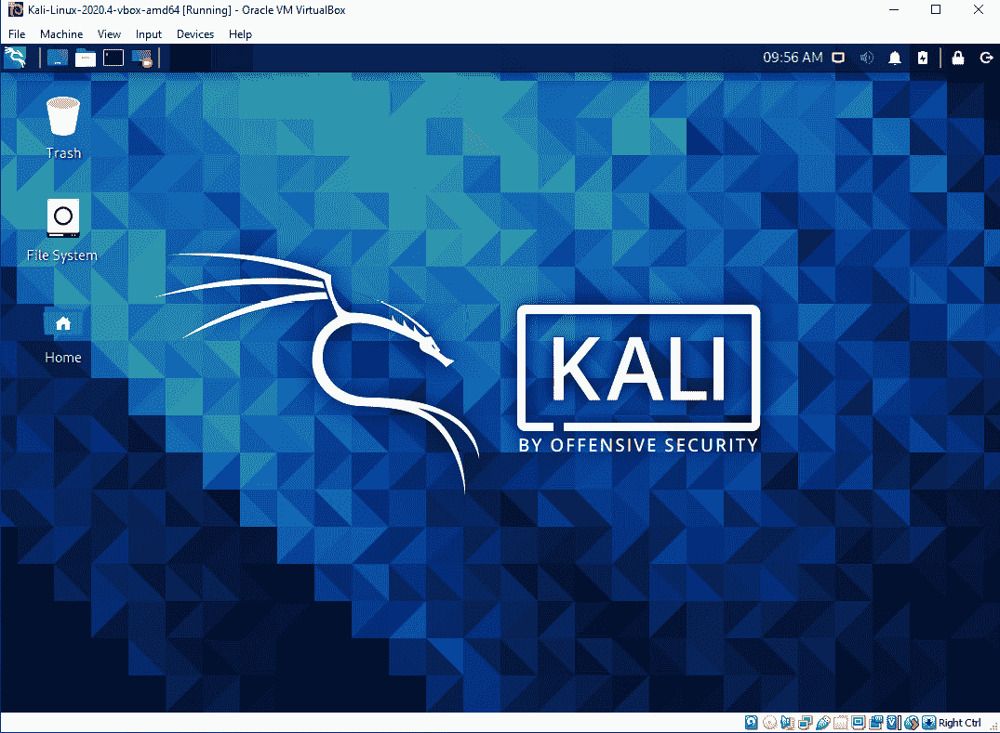

图 2.4 – Kali Linux 主屏幕

现在我们已经设置好了攻击机，让我们继续设置目标机。

### 受害机操作系统

对于目标机器，我们将使用 Windows 10 作为操作系统。这里有两个选择；你可以使用 ISO 文件从头开始安装 Windows 10 操作系统，或者你可以下载适用于 VirtualBox 的预构建镜像。第二个选项更简单，我推荐使用它。然而，这个选项的缺点是文件较大，约为 20 GB，且只能使用 90 天，之后会过期。对于大多数目的来说，这段时间应该足够。不过，如果你的需求超出 90 天，你可以手动在 VirtualBox 上安装 Windows 10。网上有许多教程可以帮助你完成这个过程。

本章我们将选择预构建的选项。使用以下链接下载预构建镜像：[`developer.microsoft.com/en-us/windows/downloads/virtual-machines/`](http://ebay.co.uk)。

让我们看看如何在 VirtualBox 中使用它：

1.  一旦你下载了 Windows 10 的 VirtualBox 镜像，进入 VirtualBox 并点击**添加**。

1.  一个对话框将会打开；选择你刚才下载的 Windows 10 镜像。

    如果你按步骤操作，Windows 10 应该已经成功启动。虚拟 Windows 的 VirtualBox 界面应该是这样的：

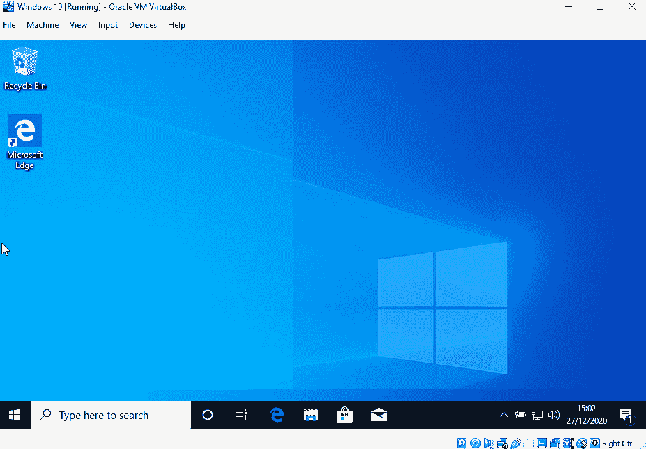

图 2.5 – Windows 虚拟机

我们系统的拓扑结构将是这样的：

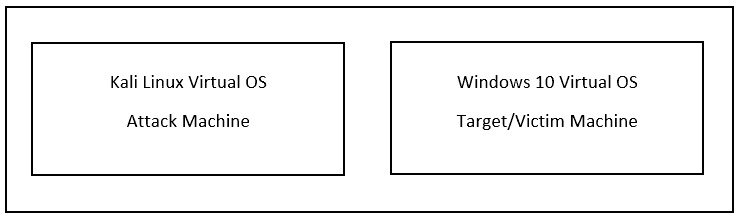

图 2.6 – 主机 Windows 10 操作系统

一旦虚拟操作系统安装完成，VirtualBox 软件界面应该是这样的：

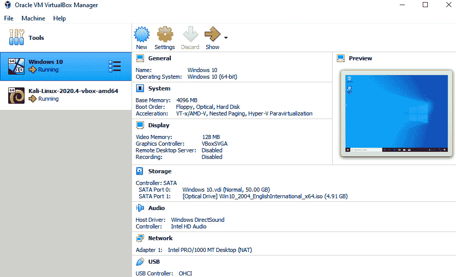

图 2.7 – VirtualBox

到目前为止，我们已经在主机上安装了虚拟操作系统。接下来，我们将专注于配置这些机器，以便在本书的其余部分中使用它们。在下一节中，我们将下载并在这些虚拟机上安装 Python 3。

# 安装 Python

本章接下来我们需要设置的是 Python。本书中我们将使用 Python 3 版本，即`python3`。Python 3 是 Python 的一个*重大*版本，且与旧版 2 不兼容。要下载 Python，请访问 [`www.python.org/`](https://www.python.org/) 并下载最新版。截至本书撰写时，推荐使用 Python 3.8 版本；不过，任何高于 3.2 的 Python 版本都适用于本书。推荐使用 64 位版本的 Python。我假设你使用的是 Windows 作为主要操作系统；不过，本书中的代码也应该可以在 Linux 和 macOS 上运行，因为我们会使用虚拟机。

## 在 Windows 上安装 Python

在 Windows 上安装 Python 的过程相当简单。打开您在 *安装虚拟操作系统* 部分刚刚安装的 Windows 10 虚拟机。请注意，从现在开始，大部分工作将在这些虚拟机上完成，而不是托管这些虚拟机的宿主操作系统。在安装过程中，只需勾选 `Add Python 3.8 to PATH` 选项（版本号将取决于您下载的版本），这样您就可以从命令提示符的任何位置访问 Python：

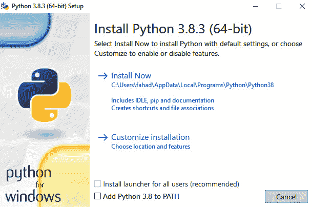

图 2.8 – Python 安装

一旦选择了 *图 2.8* 中高亮的选项，点击 `Install Now`。安装完成后，关闭安装窗口并打开终端/命令提示符。在命令提示符中，只需输入 `python` 命令。您应该会在终端中看到以下输出。此时 Python shell 应该已经打开：

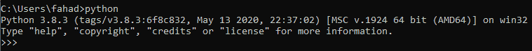

图 2.9 – Python shell

现在我们已经在 Windows 上设置好了 Python，接下来让我们继续进行 Kali 的安装，并在那里设置它。

## 在 Kali Linux 上安装 Python

大多数渗透测试操作系统都已经预装了 Python。要检查您的发行版是否已安装 Python，请打开 Kali 并搜索 `Terminal`。打开终端并在其中输入以下命令：

python --version

您应该会看到以下输出：

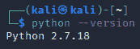

图 2.10 – Python 版本

上面的结果显示，已经安装了 Python 2；但是，我们需要的是 Python 3。让我们用以下命令再检查一次：

python3 --version

您应该会看到以下输出：

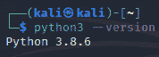

图 2.11 – Python 3 版本号

上面的截图显示，Python 3 也已安装在 Kali 上，因此我们不需要再次安装它。

# 集成开发环境

IDE 是一种帮助我们高效编写代码的软件工具。您也可以在记事本中编写 Python 脚本；然而，IDE 提供的功能帮助我们更轻松地编写代码。有很多可用的选项，我们将重点介绍免费的 IDE。我们推荐的最佳选项是 `Visual Studio Code`（**VS Code**），它完全免费。请继续为两个虚拟操作系统（Windows 10 和 Kali）下载 VS Code：[`code.visualstudio.com/download`](https://code.visualstudio.com/download)。

在 Windows 上的安装非常简单：您只需要按照安装程序进行操作。在 Linux 上的安装则需要您下载一个 Debian 包文件。打开终端并导航到下载文件的位置。然后，运行以下命令：

sudo dpkg -i /path/to/file

它的样子如下：

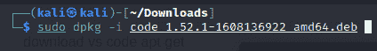

图 2.12 – VS Code 在 Kali 中的安装

请注意，它会提示您输入密码以进行安装。

安装完成后，你需要安装扩展。在 VS Code 中打开，点击左侧的 **扩展** 标签，搜索 `Python`。它应该看起来像这样：

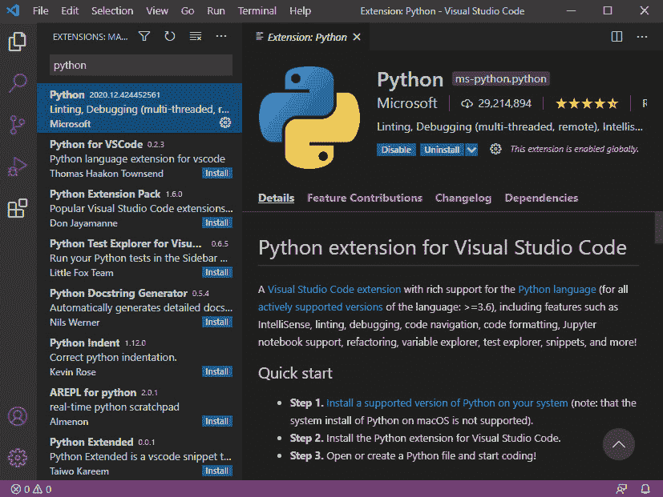

图 2.13 – Python 扩展

点击 **安装** 按钮，安装应该会在几秒钟内完成。现在，你几乎完成了开始道德黑客之旅的所有准备工作。到目前为止，我们已经设置了虚拟操作系统，安装了 Python 和相关的 VS Code 扩展，这些将帮助我们在旅程中。接下来，我们将进行一些网络配置，帮助我们继续前进。

# 设置网络

默认情况下，所有虚拟机都会为网络创建一个单独的虚拟接口。这意味着虚拟操作系统的设备与主机操作系统处于不同的子网。为了确保所有操作系统在同一子网中，请执行以下操作：

1.  转到每个虚拟机的设置。

1.  在网络设置中，选择**桥接适配器**作为**附加到**选项。

    确保你对 Windows 和 Kali 安装都执行了以下操作：

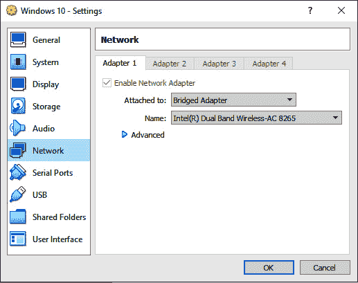

图 2.14 – 设置网络适配器

现在，所有设备将处于同一子网中。你应该能够从 Windows 10 安装中 ping 到 Kali 安装。

# 更新 Kali

在继续之前，最好更新 Kali，确保所有内容都是最新的。可以使用以下命令更新 Kali：

sudo apt-get update

sudo apt-get upgrade

更新过程会花费一些时间，因为它将更新所有的仓库。

# 使用虚拟环境

Python 有一个非常整洁的功能，叫做虚拟环境。通过使用这些虚拟环境，你可以跟踪不同 Python 项目的依赖关系，并将不同的项目与主环境分开。

在 Kali 中创建一个新文件夹，所有的项目文件将保存在这个文件夹中：

1.  打开你的 Kali 主目录，创建一个名为 `python-hacking` 的新文件夹。我们所有的未来工作将在这里进行。

1.  在 VS Code 中打开此文件夹：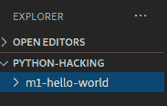

    图 2.15 – VS Code 中的文件夹结构

1.  在 `python-hacking` 文件夹中，创建一个名为 `m1-hello-world` 的新文件夹。在这里我们将测试我们的虚拟环境。在 `m1-hello-world` 文件夹中，创建一个名为 `main.py` 的新文件。

1.  使用以下命令在终端中检查 Python 包管理器 `pip` 是否在 Kali 中正确安装：

    **pip3 –version**

    你应该看到以下输出：

    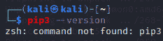

    图 2.16 – pip 未安装

1.  如果你看到与前面类似的输出，意味着 `pip` 没有在系统上安装。要安装 `pip`，请运行以下命令。确保系统已更新：

    `sudo apt install python3-pip`

    一旦 `pip` 正确安装，输出应该像这样：

    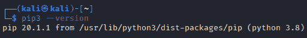

    ](image/B14788_02_17.jpg)

    图 2.17 – pip 安装

    如果 Windows 中没有安装 `pip3`，请安装它。

1.  现在打开 `main.py` 文件并编写一些 Python 代码。我们将使用以下代码。在 VS Code 中打开终端，按 *Ctrl* + *`*。

1.  现在我们将安装 Python 虚拟环境模块。运行以下命令来安装它：

    `apt-get install python3-venv`

1.  一旦 Python 虚拟环境模块安装完成，我们可以通过在终端中运行以下命令来创建 `virtual-env` 文件夹：

    `python3 -m venv my-virtualenv`

1.  如果命令成功运行，您会看到一个新文件夹 `my-virtualenv` 被创建。这个文件夹包含一个与系统环境隔离的 Python 环境。要启用此环境，运行以下命令：

    `source my-virtualenv/bin/activate`

    它将像 *图 2.18* 中的输出一样：

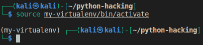

](image/B14788_02_18.jpg)

图 2.18 – 激活环境

一旦环境被激活，您将看到每个终端行的开头显示环境名称 `my-virtualenv`。现在，您在这个 shell 中使用 `pip` 安装的每个包都将只安装在该环境中，并与主环境隔离。

在 `python` 文件中编写以下代码，以测试一切是否正常工作：

if __name__ == "__main__":

print("Hello world")

您应该看到以下内容：

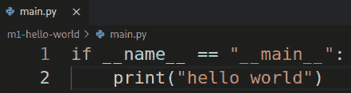

](image/B14788_02_19.jpg)

图 2.19 – 示例 Python 脚本

要运行它，请使用以下命令：

python3 main.py

您应该看到以下内容：

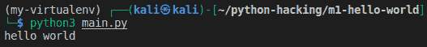

](image/B14788_02_20.jpg)

图 2.20 – 运行 Python 脚本

如果您看到 `hello world` 输出，说明一切已正确安装。

# 总结

让我们总结一下本章的内容。我们从下载并在主机上安装虚拟操作系统开始。然后我们在系统中配置了 Python，后续章节中我们将一直使用它。接着我们配置了虚拟机的网络，最后我们学习了如何在 Python 中使用虚拟环境。这些将在后续章节中非常有用，尤其是当我们需要从代码创建可分发的二进制文件时。在下一章中，我们将介绍网络和如何用于道德黑客的基本概念。
