# 第三章：侦察与信息收集

在本章中，我们将学习网络的基础知识。如果没有对计算机网络的深入理解，你将无法在渗透测试和伦理黑客领域走得更远。我们将覆盖一些关于网络如何工作的基本细节。我们还将看看网络中的不同抽象层及每一层的作用。

每一个伦理黑客过程都从收集目标的相关信息开始，本章将专门讲解我们能获取哪些信息以及这些信息对我们有什么帮助。我们将讨论用于描述网络层的标准 OSI 模型以及这个模型如何对我们有帮助。在本章中，我们将覆盖以下主题：

+   什么是计算机网络？

+   网络分类

+   网络堆栈

+   网络实体

+   保护

+   更改 MAC 地址

# 什么是计算机网络？

在**信息技术**（**IT**）领域，**网络**意味着两台或更多设备能够*相互通信*和*交换数据*的*能力*。在计算机早期，计算机之间无法相互通信，它们是独立的系统，功能非常有限。随着技术的进步，设备之间的通信需求也随之增长。在最简单的形式下，两台计算机通过*介质*连接在一起，形成一个网络。这个介质就是这些设备之间通信的*连接*。随着我们深入，你会看到计算机网络变得非常复杂：

图 3.1 – 网络的最简单形式 – 两台互联的计算机

正如你在接下来的章节中看到的那样，大多数现代计算机网络并不是这样构建的。为了让你的计算机能够与其他计算机通信，它需要与每一台计算机建立连接，而这很快就会变得难以管理。我们将在*计算机网络组件*章节中学习更多关于如何通过使用一个叫做路由器的中间节点来避免这个问题。那么，当你想要一个有 10 台设备的网络时，会发生什么呢？为此，我们可以让每台设备通过电缆与其他每一台设备连接，让它们相互通信。以下图示展示了四台计算机之间的相互通信。正如你能想象的那样，这样的系统会变得指数级难以管理。这有几个缺点。例如，它增加了系统的复杂性，并且浪费了大量资源，因为你需要维持两台计算机之间的电缆，即使它们*仅仅*进行短暂的通信：

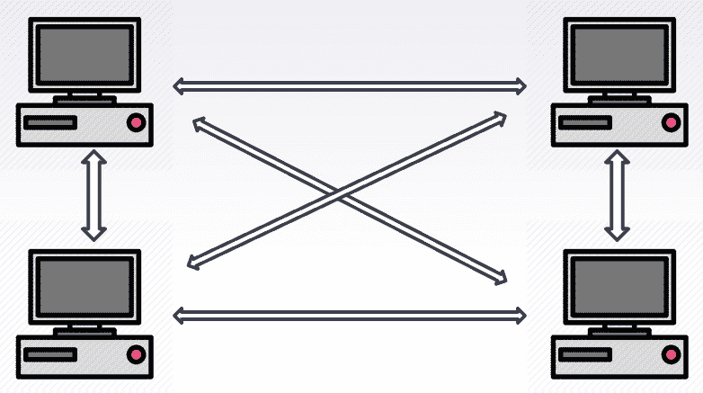

图 3.2 – 四个节点的网络

为了消除这种冗余，我们可以引入一个中央设备，负责允许不同的设备相互通信。中央设备有不同类型，我们将在*基本计算机网络的组成部分*部分中进行探索：

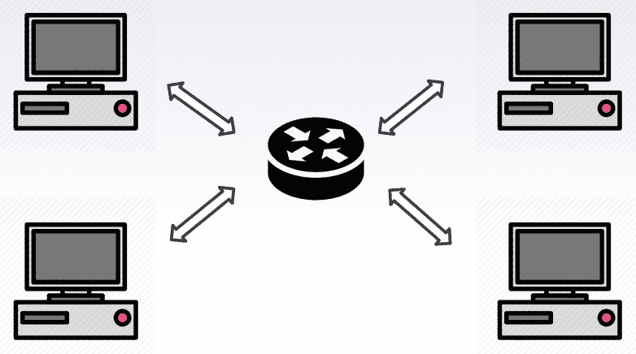

图 3.3 – 带有中央设备的网络

上面的示意图类似于我们家中的网络。一个中央设备——在我们的案例中是**路由器**——帮助我们与其他设备进行通信。这是网络的非常原始的形式；现实中的网络要比这复杂得多。回到网络的构成，**网络**仅仅是指两个设备通过**媒介**互相通信并共享数据。现在我们已经了解了什么是网络，并开始讨论构建网络的组成部分，让我们详细看看这些组件。

# 基本计算机网络的组成部分

在本节中，我们将学习计算机网络的不同组件。在计算机网络文献中，您经常会看到用*节点*来表示网络中的计算机。在网络领域，通常使用特定的术语来标识网络中的特定设备。接下来我们将学习这些术语。

## 节点

节点通常是连接到*中央*设备的设备。从某种意义上说，它是一个参与通信网络的计算机。这适用于简单的小型网络，但随着越来越多的设备加入网络，设备开始承担不同的角色，因此我们只能将设备在网络中的角色简化为节点，直到某个程度。在特定的情况下，节点可以是你的笔记本电脑、台式电脑、打印机、平板、手机或任何其他网络连接设备。

## 服务器

服务器是存储一些可以通过网络共享给需要的设备的信息的计算机。服务器通常是*在线*的，意味着它们通过持续可用来*服务*设备。

## 传输媒介

设备通过传输媒介连接并可以互相通信，这个媒介被称为*传输媒介*。它可以是有线的也可以是无线的。有线传输媒介的例子是*以太网电缆*，通常用于局域网。*Wi-Fi*是无线传输媒介的一个例子。

## 网络接口卡

要参与网络，连接的节点/设备必须拥有一个叫做**网络接口卡**（**NIC**）的东西。NIC 的作用是将你想要传输的内容转换成传输媒介所能接受的形式。

## 集线器

集线器是网络中的一个中心设备。如果你想与网络中的一个节点进行通信，你可能无法直接连接到该节点。相反，你应该通过某个中心设备建立连接——在这种情况下，就是集线器。你的信息/数据会发送到集线器，集线器再将其广播到整个网络。根据信息的内容，相应的设备会作出回应。

## 交换机

交换机是集线器的一种特殊类型。与集线器将信息广播到所有节点不同，交换机只将信息发送给目标接收者。这大大减少了网络上的流量，因为那些不相关的设备不应该接收该信息。

## 路由器

到目前为止，我们讨论的是单一网络。如果一台计算机想与不在你网络中的另一台计算机通信怎么办？如果这台计算机位于法国，而目标接收计算机位于美国的网络中怎么办？我们可以将计算机互联的概念扩展到网络互联。路由器是帮助我们与外部网络通信的设备。

## 网关

网关是网络中的终端路由器。所有进出网络的流量都经过它。它充当互联网和本地设备之间的中介。对于我们网络外的设备来说，网关是本地网络中任何设备的主要通信点。

## 防火墙

防火墙是某些网络中的可选设备。防火墙可以是基于软件的，例如操作系统的防火墙，或者是针对整个网络的硬件设备。防火墙的作用是增强系统的安全性并监控网络流量。这确保了没有未经授权的访问进入网络。防火墙通常会阻止所有进入本地网络的连接请求，除非这些请求已在防火墙的规则引擎中授权并列明：

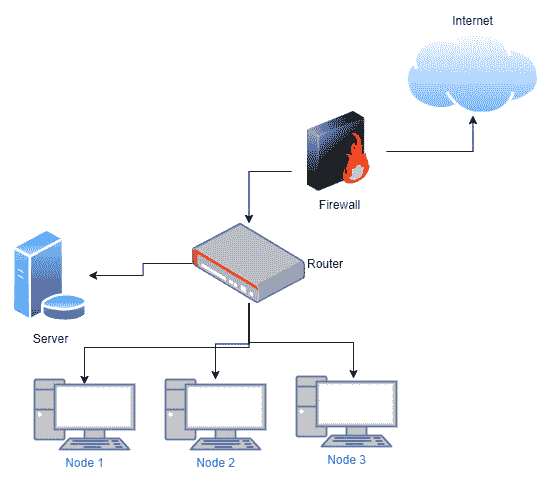

图 3.4 – 网络中的组件

顾名思义，它作为本地网络的入口和出口。出于实际考虑以及小型网络的需求，网络中的小型组件（如路由器、交换机、网关，有时甚至是防火墙）常常被合并为一个物理设备。

在本节中，我们了解了网络中不同组件的作用及其功能。接下来，我们将讨论这些不同网络是如何分类的。

# 网络分类

随着越来越多的计算机开始连接，分类它们变得至关重要，以便我们能够使用它们。有多种分类方法；然而，最常见的方法是基于地理位置的网络分类。我们接下来将讨论这一点。

## 局域网

当你将笔记本电脑或手机连接到家中的 Wi-Fi 路由器时，实际上你是在参与一个**局域网**（**LAN**）。你可以通过多种方式连接到局域网，例如使用 Wi-Fi（无线连接）或使用有线连接，如以太网电缆。局域网没有严格的定义，但通常由位于同一建筑物内的设备组成。局域网可以简单到只有两个设备连接到路由器，也可以复杂到大学和办公室的局域网。

### 以太网

以太网是局域网中最常用的技术之一。现代的以太网协议提供了非常高的局域网速度。与无线媒介相比，它在可靠性和安全性方面更为出色。以太网协议定义了数据在局域网上如何传输。现代以太网可以提供千兆位每秒的传输速度。

### Wi-Fi

与使用物理电缆将设备连接到网络的以太网互补，Wi-Fi 允许设备通过无线媒介相互连接。这消除了对电线的需求。需要注意的是，尽管它是无线的，但局域网内设备之间的通信并非直接。数据仍然会通过一个中央路由器，称为**接入点**（**AP**），然后将数据转发给预定的接收者。

这两种媒介的比较如下：

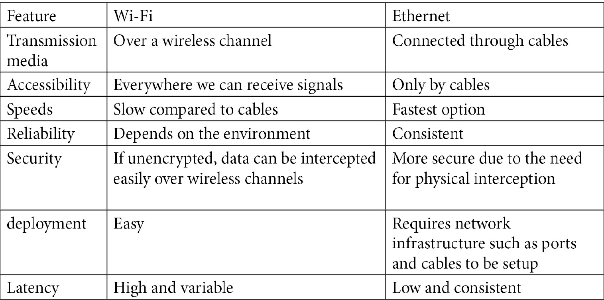

表格 1.1 – Wi-Fi 与以太网的对比

这两种媒介各有优缺点。无线网络对普通用户来说更易于使用，并且在网络中提供了更多的活动自由，而基于电缆的以太网则更快，通常在对移动性需求较低的网络中使用。现在我们已经了解了局域网，接下来我们将开始了解其他基于地理位置的网络。

## 个人区域网络

与局域网相比，**个人区域网络**（**PAN**）通常非常小。个人区域网络的范围通常只有几十米。例如，两个基于蓝牙的设备彼此通信就是一个个人区域网络。在少数情况下，个人区域网络也与局域网相连。

## 城市区域网络

有时候，我们倾向于将几个小型局域网合并成一个单独的类别。它们通常被称为**城市区域网络**（**MANs**）。一个城市区域网络的例子是分布在城市不同地区的政府办公室连接到一个单一的网络。这些网络通常局限于一个城市。

## 广域网

顾名思义，**广域网**（**WAN**）是一个覆盖广泛地理区域的网络。广域网通常构成一个国家内部的网络。

## 互联网

到目前为止，我们只讨论了同一地理位置内的网络。互联网络，或者说互联网，是一个庞大的网络，连接了位于不同地理位置的多个网络。通过这个巨大的网络，你可以与全球任何地方的设备进行通信，前提是该设备也连接到了互联网。不同的广域网通过高速光纤网络相互连接：

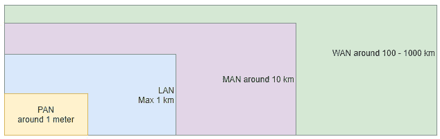

图 3.5 – 按规模划分的网络

到目前为止，我们已经讨论了网络的物理组件和不同类型的网络。这为我们提供了计算机网络的概述。现在，我们已经了解了网络的基础知识，接下来可以深入探讨数据是如何在网络中从一个设备传输到另一个设备的。

# 网络栈

前一节为我们提供了网络的高层次介绍。现在，我们将学习实际的数据如何在网络上进行传输。

## OSI 模型介绍

从你在应用程序中输入一条消息，到它传送到目标接收者的过程，你的消息经过了通信系统中的不同层级。为了帮助我们理解数据在到达目的地之前，经过的所有通信过程和媒介，提出了一个框架，用于描述网络系统的功能。这个框架被称为**开放系统互联**（**OSI**）模型。这个模型不仅仅应用于互联网，也适用于任何现代通信系统：

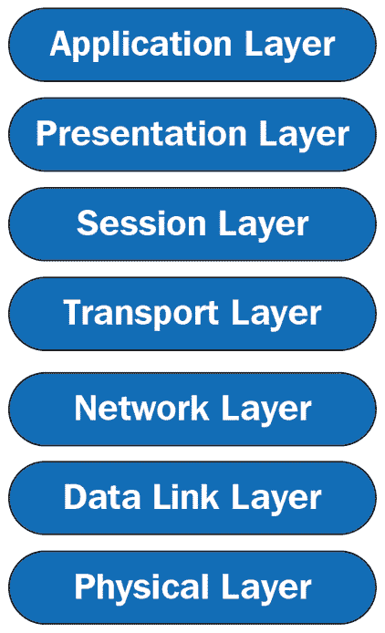

图 3.6 – 7 层 OSI 模型栈

OSI 模型包含 7 个层级，用来概念化数据如何通过任何电子通信媒介进行传输。让我们更详细地看看这些层级。

### 应用层

应用层是 OSI 模型中的最上层。这是用户与之交互的层。你使用的任何连接到互联网的设备可能都具有应用层接口。它充当着与用户的输入/输出端点。你发送的任何数据都会加入到应用层，接收到的任何来自其他设备的数据也会在这一层上显示。

### 表示层

这一层位于应用层下方，负责将数据转换为有用的格式。来自应用层的数据通常采用不同的格式，并且通常不适合通信系统的最易读形式。在这里，数据会被转换为合适的格式。另外，用户数据在应用层并未加密。在表示层，通常会对数据进行加密，以确保安全。

### 会话层

在表示层下方是会话层。一旦数据准备好发送，发送设备和接收设备必须建立连接，以便它们能够通过通道发送数据。会话层帮助完成这一任务——它在您的设备与接收设备之间建立连接。

### 传输层

一旦两个设备之间的会话建立，数据就准备好通过通道发送。传输层将要发送的实际数据分割成较小且可管理的块，称为*段*，可以通过链路发送。它还负责接收来自其他设备的数据段，并将其重新组合，以供您使用。

传输层还负责流量控制和错误控制。不同的传输介质具有不同的速度和错误率。传输层的任务是确保正确的数据传输。

### 网络层

当我们要与不在同一网络上的设备进行通信时，网络层的作用便会发挥出来。网络层将来自传输层的*段*分解成更小的*数据包*。网络层还确定数据包到达目的地的最佳路径。

### 数据链路层

这在某种程度上类似于网络层；然而，它促进了同一网络内设备之间的通信。数据链路层将数据包分解成帧。

### 物理层

这是堆栈的最低层，是用户输入的数据被转换成可以通过传输介质传输的物理信号的地方。在数字系统中，这意味着数据的 0 和 1 被转换成其在物理系统中的适当表示，例如电压水平。

## 完整周期

通信的完整周期如下：

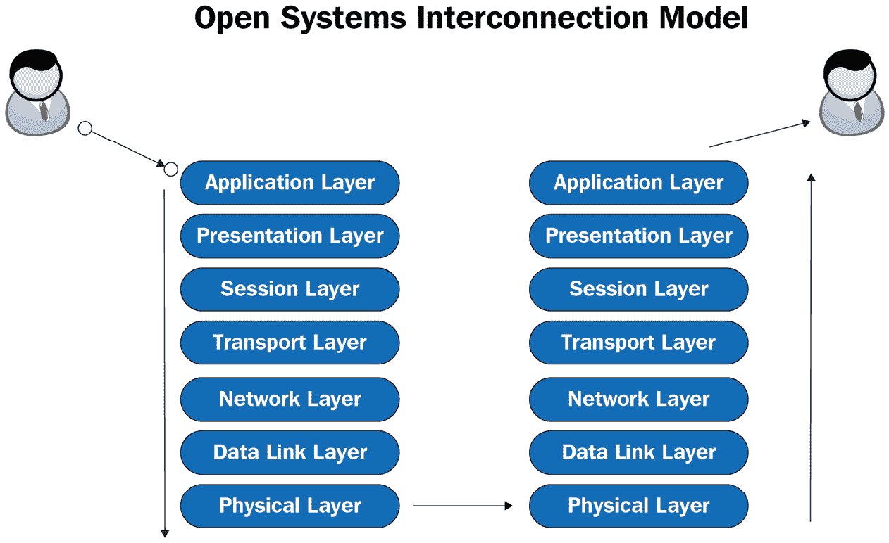

图 3.7 – OSI 栈中的数据传输

用户输入的数据从应用层到物理层，再从物理层到达另一端的应用层。

## TCP/IP 模型

前面展示的模型是一个非常通用的模型，概念化了任何媒介中的通信。然而，计算机网络的工作方式是 OSI 模型的一个特殊情况，通常被称为 TCP/IP 模型。您经常会在文献中看到这个模型，而不是更通用的 OSI 模型：

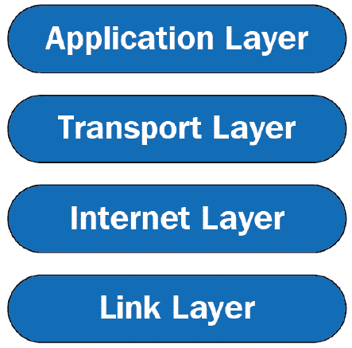

图 3.8 – TCP/IP 堆栈

与拥有七层的 OSI 模型相比，互联网协议栈有四层。我们来更详细地了解一下它们。

### 应用层

这是最上层。此层负责进程间通信。常见的应用层协议包括 HTTP、FTP、SSH、DNS 等。

### 传输层

TCP 和 UDP 是这一层常见的协议。这一层负责端到端的通信和错误控制。TCP 是面向连接的，而 UDP 是无连接的协议。

### 网络层

这一层与 OSI 堆栈中的网络层平行。它定义了负责从一个节点到另一个节点逻辑传输数据的协议。在这一层，最著名的协议之一就是 IP 协议，它使用 IP 地址在设备之间进行通信。

### 网络接入层

这一层将 OSI 堆栈中的数据链路层和物理层结合在一起。

## OSI 和 TCP/IP 堆栈映射

OSI 和 TCP/IP 堆栈的层级映射如下：

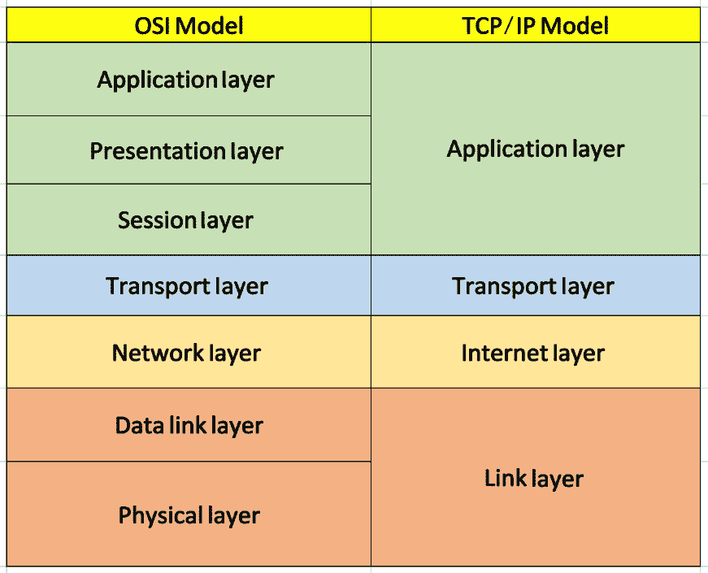

图 3.9 – TCP/IP 和 OSI 堆栈的映射

上述图像展示了 OSI 堆栈如何映射到 TCP/IP 堆栈，以便在网络通信中使用。正如我们之前提到的，尽管 OSI 模型是一个更通用的模型，但 OSI 模型中的某些层的功能可以合并到 TCP/IP 堆栈的一个层中。现在，我们已经了解了数据在网络中如何按概念级别流动，接下来我们将深入探讨字节级别的实际通信内容。

# 网络实体

在继续之前，我们将介绍一些本书中将会用到的网络相关概念。了解这些概念是至关重要的，只有这样，你才能全面理解本书的内容。

## 私有 IP 地址

**互联网协议**（**IP**）地址是一个唯一标识符，用于标识网络中的设备。IP 地址是一个 32 位的数字。每当你连接到一个新网络时，你要么通过**动态主机配置协议**（**DHCP**）服务器分配一个新的 IP 地址，要么如果系统配置中有可用的 IP 地址，则使用该地址。这通常被称为本地/私有 IP 地址。你通常会看到这种地址的形式是`192.168.1.x`。

关于 IP 地址的重要说明

IP 地址是 32 位的，这意味着只有 2³² = 4,294,967,295 个互联网地址可用。IP 地址是一个古老的协议，当它被开发时，互联网连接的设备数量并不多。当时，40 亿个设备被认为是足够的。然而，正如我们最近看到的，现在世界上有远超过 40 亿个设备，那么这些设备是如何获得其地址的呢？这就是通过**网络地址转换**（**NAT**）协议完成的，我们稍后将对此进行讲解。

除了私有 IP 地址，我们还有公有 IP 地址。为了避免每次新设备连接时分配一个新的唯一 IP 地址而导致 IP 地址耗尽的问题，我们使用了一种名为 NAT 协议的技术。在 NAT 协议下，当你从**互联网服务提供商**（**ISP**）获得互联网连接时，你只会获得一个公有 IP 地址。这个 IP 地址将与您的路由器/网关关联，并且可以被互联网上的其他网络访问。所以，这个网络中的每个设备都会使用这个公有/网关 IP 地址与网络中的其他设备进行通信。下面的图示说明了这一点：

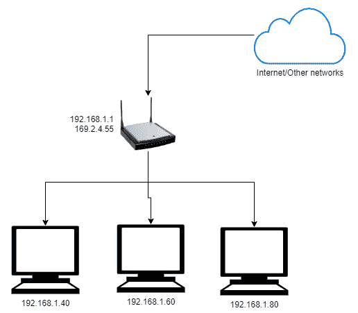

图 3.10 – 公有 IP 与私有 IP 地址

让我们考虑一下你的家庭局域网（LAN），它包含四个设备——三台 PC 和一个路由器/网关。当你从 ISP 处订阅互联网服务时，你将获得一个公有 IP 地址或广域网（WAN）IP 地址。在前面的例子中，公有 IP 是`169.2.4.55`，它与您的路由器关联。如果你连接到路由器并上网，然后搜索你的公有 IP 地址，你将看到这个 IP 地址。你也可以在路由器的设置页面找到这个 IP 地址。除了公有 IP 外，网络中的每个节点还会有一个私有 IP 地址。这个地址对局域网外的设备是不可见的。前述例子中的私有 IP 地址是`192.168.1.40`、`60`和`80`。这些设备在网络外部看起来都会有一个`169.2.4.55`的 IP 地址。

因此，对外部设备来说，这些内部 PC 看起来就像是一个设备。那么，如何知道数据进出网络时该到哪台 PC 呢？这是通过**媒体访问控制**（**MAC**）地址来完成的。在内部网络中，设备之间的通信仅通过 MAC 地址进行。MAC 地址将在*MAC 地址*部分进行解释。

### 公有 IP 与私有 IP 地址

公有 IP 与私有 IP 地址的主要区别如下：

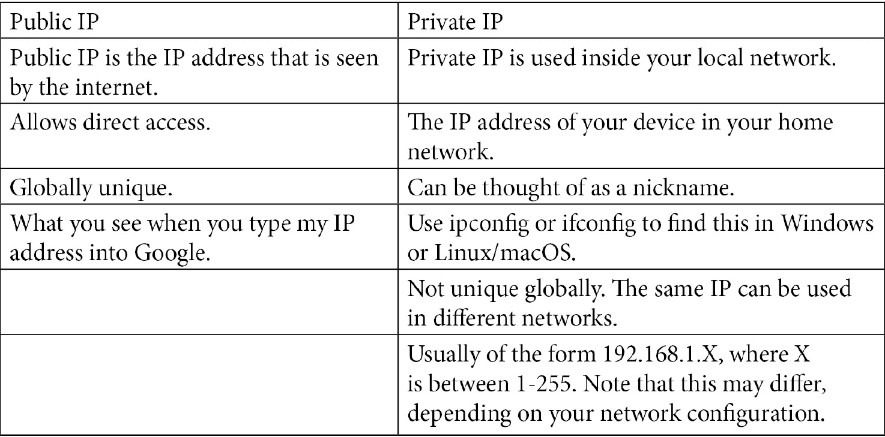

表格 3.2 – 公有 IP 与私有 IP 地址的区别

到目前为止，我们看到的 IP 地址是 IPv4 地址，它们非常普及。然而，还有其他类型的地址。让我们来了解一下。

## IPv4 与 IPv6

到目前为止，我们学习的 IP 地址是 IPv4 地址。还有一种称为 IPv6 的 IP 地址。这些是 128 位地址，旨在用于未来的计算机系统。然而，由于 NAT 协议的使用，IPv6 的普及速度较慢。目前，只有 40%的互联网支持 IPv6 地址。

## MAC 地址

MAC 地址也叫硬件地址，通常与 NIC 卡相关联。每个 NIC 都有自己的 MAC 地址。MAC 地址是由制造商分配的一个物理地址，每个制造商会被分配一个数字池，用来制造产品。MAC 地址是一个 48 位的数字：

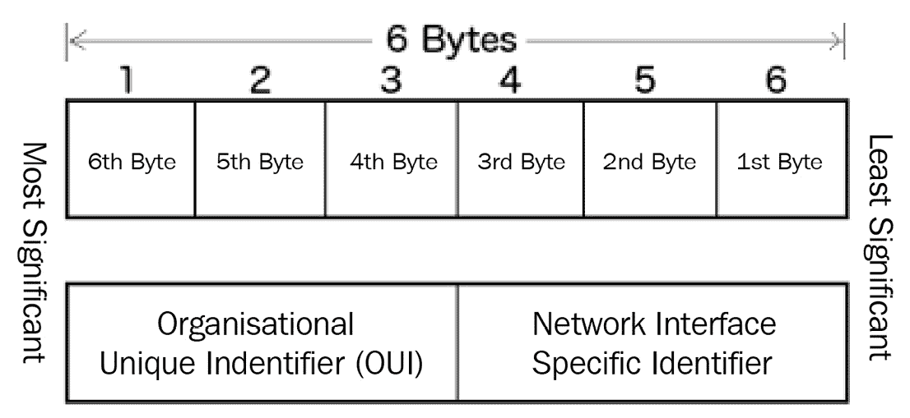

图 3.11 – MAC 地址字节

接下来，我们来讨论端口。

## 端口

虽然 MAC 地址唯一标识一个网络接口卡（NIC），它被数据用来识别数据应该传送到哪个设备，但端口标识了 PC 上正在运行的唯一服务。它作为通信的逻辑终点。每个设备都有多个应用程序通过网络发送或接收数据。例如，你可能在浏览网页，同时后台有一个下载任务在运行，另一个服务正在向服务器上传数据。当数据到达你的 PC 时，它会通过端口区分数据属于哪个进程。系统上共有 65,535 个端口，其中前 1,024 个是保留端口，不建议使用这些端口。

# 保护

到目前为止，在本章中我们已经学习了计算机网络的基础知识，这些是理解本书其余部分的关键。现在，我们将开始查看可以用来追踪我们的参数，以及如何保护自己。在上一章中，我们了解了道德黑客的第一步是信息收集。但在开始收集信息之前，我们必须确保我们的身份得到保护。否则，我们很容易被追踪到。你的身份可以通过多个参数被追踪回来。最常见的是你的 IP 地址和 MAC 地址。

为了隐藏你的公网 IP 地址，你可以使用**虚拟私人网络**（**VPN**）。我们将不会讨论 VPN，因为它不在本书的范围内。这里有一个重要的事项需要注意，那就是你不应完全信任你的 VPN 提供商。从安全角度来看，使用 VPN 仅仅意味着你将信任从你的**互联网服务提供商**（**ISP**）转移到提供 VPN 服务的另一家公司。你应该非常小心选择 VPN，特别是在网络安全的角度，应该谨慎使用免费 VPN，因为许多免费 VPN 会捆绑恶意软件，或者使用你的计算机资源进行其他目的，比如比特币挖矿。有些 VPN 会泄露你的**域名服务器**（**DNS**），这是一个用于将网站名称映射到 IP 地址的服务器，尽管它们可能声称能隐藏你的身份。

然而，当我们扫描本地网络时，我们可能会被 MAC 地址追踪。在*第二章*，*入门 – 设置实验环境*中，我们安装了两台虚拟机：Kali 和 Windows 10。Kali 机器将作为我们的攻击机器。我们的机器有一块网卡，用于与其他设备通信。这块网卡有一个 MAC 地址。在*更改我们的 MAC 地址*部分中，我们将尝试伪造一个 MAC 地址，以便在扫描时更改它。这样，即使**入侵检测系统**（**IDS**）发现我们正在扫描某台 PC 的端口，也无法发现我们的真实 MAC 地址。

# 更改我们的 MAC 地址

在这一部分，我们将尝试在 Kali 机器上更改我们的 MAC 地址。首先启动我们的 Kali 机器并打开一个终端。要更改 MAC 地址，你需要安装`net-tools`工具包。在大多数 Linux 发行版中，这个工具已经可用。不过，如果没有安装，你可以使用以下命令进行安装：

sudo apt-get update -y

sudo apt-get install -y net-tools

它会提示你输入密码，密码是`kali`。一旦工具安装完成，你可以使用以下命令查看 MAC 地址：

sudo ifconfig

如果一切顺利，你将看到类似如下的输出：

图 3.12 – ifconfig 命令输出

这里有很多内容需要解释，我们来逐一拆解。这里有两个值，分别是`eth0`和`lo`。`eth0`是网卡的名称，而`lo`是回环适配器。现在，我们可以忽略回环适配器。`inet`字段代表 Kali 机器的私有 IP 地址，`inet6`是 Kali 机器的 IPv6 地址，`ether`是 MAC 地址，这也是我们想要更改的字段。

如果你想要更改 MAC 地址，不能在网卡开启的情况下进行。首先，你必须关闭网络接口。要关闭接口，你可以使用以下命令：

sudo ifconfig eth0 down

这个命令将关闭名为`eth0`的网卡。如果在命令输出中没有看到错误信息，这意味着命令执行成功。

现在，如果你再次输入`ifconfig`命令，你将看到以下输出：

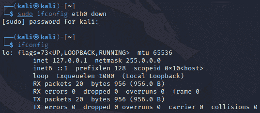

图 3.13 – 关闭网络接口卡

现在，你只会看到回环适配器，并且`eth0`已经被关闭。要更改 MAC 地址，你可以运行以下命令。假设你想要新的 MAC 地址是`00:11:22:33:44:55`。你可以这样做：

sudo ifconfig eth0 hw ether 00:11:22:33:44:55

这个命令更改`eth0`接口和该网卡的`ether`参数：

图 3.14 – 更改 MAC 地址

现在，如果没有错误，这意味着命令已成功运行。在此时，我们可以通过运行以下命令再次启用接口：

sudo ifconfig eth0 up

现在，让我们再次运行 `ifconfig` 命令，看看我们的更改是否生效：

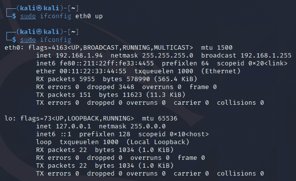

图 3.15 – 已更改的 MAC 地址

在这里，你可以看到 MAC 地址已成功更改。现在，如果我们想在网络中扫描某些内容，这个 MAC 地址将会显示出来，而不是我们的真实 MAC 地址。

## 创建 Python 脚本

到目前为止，我们已经编写了手动命令来更改我们的 MAC 地址。理想情况下，我们希望编写一个 Python 脚本来帮助我们更改它。为此，我们需要找到一种方法，通过 Python 运行 bash 命令。幸运的是，Python 有一个标准库，用于运行系统命令，叫做 `subprocess`。这个库允许你与底层操作系统进行交互。

要将这个库导入到你的模块中，你只需写下以下命令：

import subprocess

要运行命令，`subprocess` 有一个叫做 `run` 的方法。使用这个方法，你可以在操作系统上执行系统命令。如果你想查看 `eth0` 的信息，可以运行以下命令：

subprocess.run(

["ifconfig", "eth0"],

shell=True,

)

这个函数需要一个命令列表。另一个参数 `shell=true` 表示我们希望将输出打印到控制台。

如果你运行前面的文件，你将看到类似运行 `ifconfig eth0` 命令的输出。请注意，你需要是 root 用户才能运行此命令，因此它应该像这样：

sudo python3 main.py

这是输出结果：

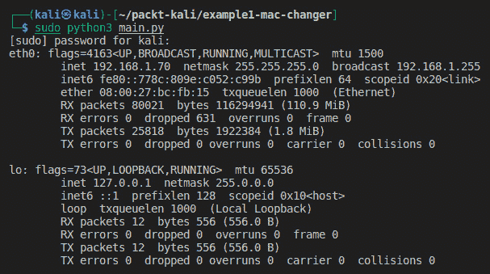

图 3.16 – 使用 Python 运行系统命令

现在你已经知道如何使用 Python 运行系统命令，你可以使用 Python 重复前面的命令。完整的代码如下：

import subprocess

if __name__ == "__main__":

interface = "eth0"

new_mac = "22:11:22:33:44:57"

print("正在关闭接口")

subprocess.run(["ifconfig", "eth0", "down"])

print("正在更改接口硬件地址为 ", interface, " 到 ", new_mac)

subprocess.run(["ifconfig", interface, "hw", "ether", new_mac])

print("MAC 地址已更改为 ", new_mac)

subprocess.run(["ifconfig", interface, "up"])

print("网络接口已启用")

如果你再次检查接口，你将能够看到新的 MAC 地址：

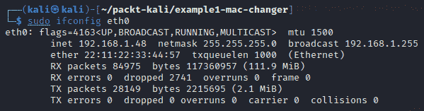

图 3.17 – 新的 MAC 地址

现在我们已经学会了如何在系统上运行命令，以及如何使用 Python 更改系统的 MAC 地址，我们将在这里停止讨论。在下一章，我们将探讨信息收集。

# 总结

在这一章中，我们学习了关于网络基础知识以及如何通过欺骗我们的 MAC 地址来保护自己在本地网络上进行扫描。这一章帮助我们更深入地了解计算机系统的网络方面，以及如何使用 Python 在本地网络中保护和掩盖我们的身份。在下一章中，我们将学习关于扫描本地网络的内容。
