# 第四章：网络扫描

本章介绍了道德黑客的第一阶段：信息收集与侦察。信息收集是道德黑客中最重要的方面之一。如果没有适当获取所需的信息，进行成功攻击几乎是不可能的。我们将学习什么是网络扫描以及如何利用它在网络中实施攻击。我们将通过以下主题：

+   网络概述

+   TCP/IP 中的数据封装

+   Scapy 简介

+   ARP 简介

+   基于 ARP 的 Scapy 网络扫描器

# 网络概述

在*第三章*《侦察与信息收集》中，我们从一个非常宏观的角度学习了网络的基础知识。我们了解了网络中存在的不同组件和设备，以及每个组件的作用。在本节中，我们将更深入了解通过网络传输的实际数据包和信息。

## 数字系统中的数据表示

让我们首先了解一下计算机系统是如何通过网络传输数据的。计算机系统中的每一部分数据都是由**二进制逻辑电平**定义的。这些电平被定义为*低*或*高*。计算机系统中存储的每一张图像、文件、视频、语音录音或其他任何东西，都是通过这些逻辑电平来表示的。在物理硬件中，这些电平会映射到电压电平或开关状态。例如，在数字系统中，5 伏的电压可能代表高逻辑电平，而 0 伏的电压则代表低逻辑电平。你可能会想知道这些不同类型的数据是如何通过逻辑电平来表示的。让我们来看一下是如何工作的。假设你想把信息`Hello`发送给一个朋友。为了简单起见，我们假设你的朋友就在同一个网络中。现在，我们假设底层的通信工作正常。为了发送这个`Hello`消息，我们需要将其转换为计算机能够理解的形式。我们刚刚了解到计算机只理解低和高逻辑电平，因此我们必须将我们的消息*编码*为这些逻辑电平。现在，如我们所见，`Hello`包含五个字母，而我们只有两个逻辑电平，所以仅凭两个电平的*实例*是不可能编码完整的消息的。这个实例被称为**位（bit）**。为了实现这种编码，开发了一个名为**美国信息交换标准代码**（**ASCII**）的系统。使用这个编码方案，我们可以轻松地表示英文字母以及一些其他符号和字母。英语字母的每个字母都由 8 位的二进制序列表示，称为*字节*。为了表示我们`Hello`消息中的字母`H`，我们可以将其编码为以下的二进制序列：`H`在 ASCII 格式中是`01001000`。这个值在 ASCII 代码表中是预定义的；类似地，其他字符也以相同的格式定义：

+   `H** = **01001000`

+   `e** = **01000101`

+   `l** = **01101100`

+   `l** = **01101100`

+   `o** = **01101111`

现在，我们有了一串可以通过任何数字系统发送的数据流。请注意，这是数据表示的一个非常简化的解释。实际系统还使用其他编码方式，如 Unicode 和字节表示法，来发送复杂的数据。

## 数据封装

现在我们了解了数据表示，让我们把注意力重新集中在我们最初的话题上：如何发送这些数据。我们已经了解了 TCP/IP 协议栈中的不同层以及它们如何用来发送数据。在前面的部分中，我们提到我们想要将`Hello`消息发送给本地网络中的某个人。我们将这条消息称为我们的*数据*：

图 4.1 – 数据表示

现在，为了使数据包成功到达另一台计算机，它必须知道其准确的目标，就像邮政投递系统一样。你有国家、城市、邮政编码、街道和门牌号。在数字系统中，你有 IP 地址、MAC 地址以及源端口和目标端口。假设你在浏览器应用中写下你的消息，你的朋友也在浏览器中等待你的消息。为了将消息准确无误地发送到目标计算机中的同一个*进程*，IP 协议会在你的消息中添加一个新的*头部*。

从最顶层开始，**应用层头部**被添加。同样，应用层下方的每一层也会添加自己的头部。整体过程如*图 4.2*所示。*图 4.2*展示了数据在通过网络发送之前如何在 TCP/IP 栈中被封装。我们将了解这些段包含了什么内容，以及这些内容如何帮助数据包到达目的地：

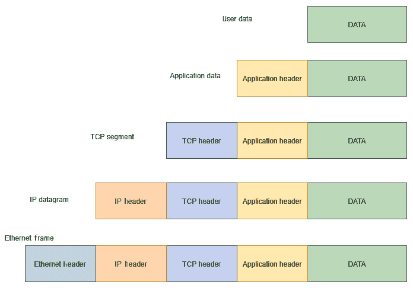

图 4.2 – 数据封装

我们将在接下来的章节中详细讲解这些段。

## 数据包传递过程

数据包的传递过程取决于目标设备是否位于同一局域网内。如果设备位于同一子网内，我们可以直接使用以太网地址发送数据。这些头部包含了很多信息，对于本书的内容，你无需关心大部分内容，我将只解释与本书相关的字段。

### TCP 头部

TCP 头部包含下图所示的字段：

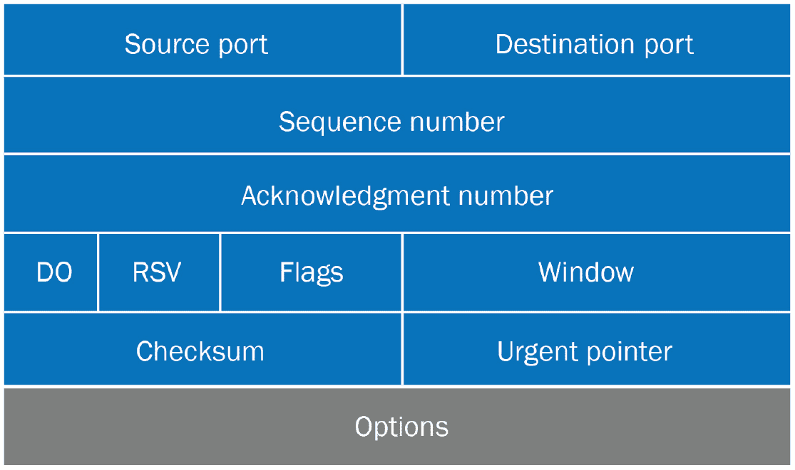

图 4.3 – TCP 头部

在这个头部中，我们只关心源端口和目标端口。源端口与本地计算机中与要发送的信息相关的进程有关。目标端口是数据包应发送到的位置。源端口通常由发送方随机生成，而接收端口则由消息定义。例如，当你请求一个 HTTPS 网站时，你的 PC 会生成请求数据包，并将目标端口号设置为`443`。某些服务有固定的端口号。例如，*FTP*使用端口`21`，*HTTP*使用端口`80`。在我们的例子中，如果我们将`Hello`消息发送给一个在 HTTPS 上工作的浏览器应用程序，发送数据包中的源端口字段将随机选择（你也可以手动设置；例如，SSH 的默认端口是`22`，但如果我们将 SSH 配置为使用其他端口，而`22`可用，它就可以作为数据包中的源端口），目标端口则是`443`。请注意，某些端口是保留的，正如前面所见，你的 PC 会分配一个`10000`到`65355`之间的源端口号。一旦 TCP 头部被添加到数据中，它就被称为*TCP 段*。

### IP 头部

接下来，添加一个 IP 头部，如*图 4.4*所示：

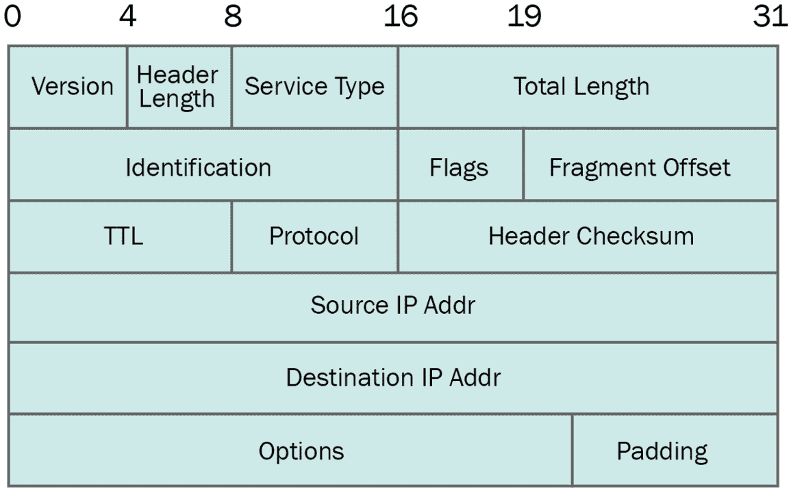

图 4.4 – IP 头部

在这里，我们关心的字段是源 IP 和目标 IP。它定义了数据包的去向和来源。添加 IP 头部后，它就被称为*IP 数据报*。

### 以太网头部

以太网头部帮助数据在本地网络中进行导航。这里最重要的字段是源 MAC 地址和目标 MAC 地址。顾名思义，源 MAC 地址是你的 MAC 地址，目标 MAC 地址是本地网络中接收者的 MAC 地址：

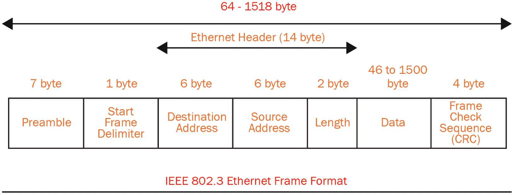

图 4.5 – 以太网头部

一旦添加了以太网头部，它就被称为*以太网帧*。我们已经了解了在网络上传输的数据包中最重要的字段。我们也了解了数据如何被封装，以及它使用哪些字段来在网络中路由数据。在下一部分，我们将学习如何利用我们刚刚学到的信息创建网络扫描器。

# Scapy 简介

为了创建一个网络扫描器，我们将使用一个名为 Scapy 的 Python 网络库。这个库旨在发送、嗅探、解析和编辑网络数据包。Scapy 是一个非常强大的网络数据包操作工具。要了解更多关于该工具的信息，可以访问以下链接：[`scapy.readthedocs.io/en/latest/introduction.html`](https://scapy.readthedocs.io/en/latest/introduction.html)。

## 安装 Scapy

要安装 Scapy，首先打开终端。让我们先了解一些基本概念。在 Linux 中，有两种用户权限，普通用户和 root 用户，它们的环境是不同的。系统级命令需要更高的权限。为了发送和接收数据包，我们需要以 root 用户以及普通用户的身份安装 Scapy。我们将作为普通用户编写程序，运行时会以 root 身份运行，因为在 Linux 中发送数据包需要更高的权限（你可以把它想象成 Windows 中的*以管理员身份运行*）。稍后你会明白我的意思。要以 root 用户安装 Scapy，请输入以下命令：

sudo pip3 install scapy

这将以管理员权限安装 Scapy。完成后，打开你的 Visual Studio Code 并为新项目创建一个文件夹。我们将这个文件夹命名为`example2-introduction-scapy`。

请注意，如果你遇到一些问题，你需要通过以下命令更新系统的 Python：

sudo apt-get update && sudo apt-get upgrade && sudo apt-get install python3-virtualenv -y

现在，我们将为这个特定项目创建一个新的虚拟环境。要创建新的虚拟环境，请导航到刚刚创建的文件夹目录，并输入以下命令：

python3 -m venv venv

现在，如果一切顺利，你将看到一个名为`venv`的文件夹被创建。

接下来，通过运行以下命令激活虚拟环境：

source venv/bin/activate

现在，你的虚拟环境应该已被激活。一旦激活，你可以通过输入以下命令查看环境中已安装的软件包：

pip freeze

如果你的环境中已经安装了任何软件包，它们会被列出来；否则，你将看不到任何内容。现在，为了安装 Scapy，输入以下命令：

pip3 install scapy

安装过程可能需要一些时间。完成后，你可以再次输入 `pip freeze` 命令查看已安装的软件包：

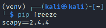

](image/B14788_04_06.jpg)

图 4.6 – 虚拟环境中的已安装软件包

在本节中，我们学习了如何在虚拟环境中安装 Scapy，以及如何查看它是否安装正确。请注意，Scapy 的一些功能需要以更高的权限运行程序，否则它们将无法正常工作。在下一节中，我们将进一步了解 Scapy 的使用方法，以及如何利用 Scapy 操作网络数据包。

## 了解 Scapy 的工作原理

在这一部分，我们将了解 Scapy 是如何工作的，以及如何利用它创建自己的网络操作工具。让我们创建一个名为 `main.py` 的新文件并打开它。一旦文件打开，我们就可以在文件中导入任何 Scapy 模块。在本节中，我们将创建一个简单的 ping 请求，发送到任何网站。Ping 请求通常用于测试设备是否可用。Ping 请求（也叫做 *回声请求*）使用的是底层的 ICMP 应用层协议。要在程序中导入一个包，请写下以下代码：

from scapy.all import scapy

重要提示

请注意，在 Kali Linux 的最新版本中，一些依赖项已被更改，可能会出现与缺少文件相关的错误。为了解决这个问题，你可以输入以下命令：

`cd /usr/lib/x86_64-linux-gnu/sudo ln -s -f libc.a liblibc.a`

要发送一个 ping 请求，你需要创建一个 IP 层数据包，这将帮助你设置源 IP 和目的地 IP 地址。要导入 IP 层，我们可以写下以下命令：

from scapy.all import IP

最后，为了发送和接收数据包，我们可以使用一个名为 `sr` 的函数。要导入这个函数，使用以下命令：

from scapy.all import sr

这个 IP 地址会根据你的系统不同而有所不同。你可以使用 `sudo ifconfig` 命令找到这个 IP 地址。

然后，我们将定义源 IP 和目的地 IP：

src_ip = "192.168.74.128"

然后，我们将定义目的地 IP。我们希望创建一个针对 `google.com` 服务器的 ping 请求。你可以手动输入该服务器的 IP 地址，通过在终端输入 `ping www.google.com` 找到，或者你可以直接使用 `www.google.com`。

Scapy 会自动转换这个地址：

dest_ip = "www.google.com"

现在，我们将创建一个`ip_layer`数据包，并打印它，看看它包含了什么：

from scapy.all import ICMP

from scapy.all import IP

from scapy.all import sr

如果 __name__ == "__main__":

src_ip = "192.168.74.128"

dest_ip = "www.google.com"

ip_layer = IP(

src = src_ip,

dst = dest_ip

)

print(ip_layer.show())

这将创建一个 IP 层数据包，并显示已创建数据包的内容。注意数据包还没有被发送。

该程序的输出如下所示：

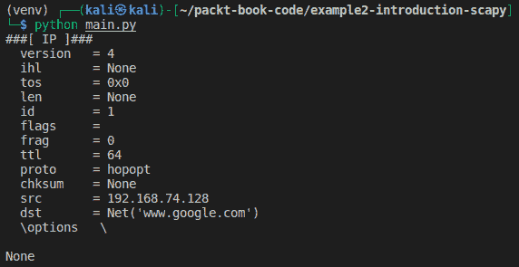

图 4.7 – IP 层数据包创建

看看`src`和`dst`字段。目标是`Net`的实例，这意味着 Scapy 将负责将其转换为实际的 IP 地址。现在，如果你检查这里显示的字段并将它们与*图 4.4*进行比较，你会看到这些字段是相同的。

接下来，要发送一个 ICMP 请求，你可以像这样调用类来创建一个实例：

icmp_req = ICMP(id=100)

`id=100`帮助协议跟踪数据包。要查看此请求中包含哪些字段，你可以输入以下命令：

print(icmp_req.show())

结果将类似于以下内容：

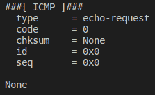

图 4.8 – ICMP 数据包内容

从这里，你可以看到数据包类型是回显请求，用于测试连接的可用性。

根据我们之前的讨论，我们知道应用层位于 IP 层之上，到目前为止我们已经创建了两个层。现在，下一步是将这两个层合并成一个可以通过网络发送的数据包。为此，我们可以编写以下代码：

packet = ip_layer / icmp_req

print(packet.show())

这将列出合并后的数据包。注意`/`运算符。此运算符用于在 Scapy 中合并不同的层。你从底层开始，并通过这个`/`运算符不断添加新的层。`print`结果将显示将先前的层合并为一个的数据包结果：

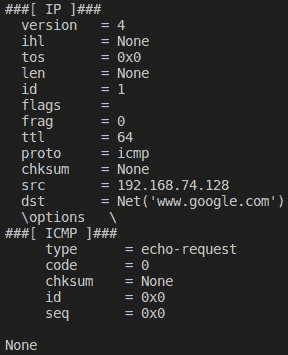

图 4.9 – 合并层

现在，我们的请求已经准备好发送了。为了发送它，我们可以使用我们已经导入的`sr1`方法：

response = sr1(packet, iface="eth0")

如果有响应：

print(response.show())

响应将类似于以下内容：

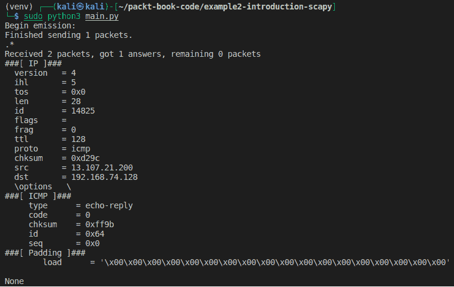

图 4.10 – ICMP 回复

你可以看到响应类型是`echo-reply`，回复中的`src`字段是回复此 ping 请求的服务器的 IP 地址。

现在，你已经学会了如何使用 Python 构建和发送数据包。理论上，你可以使用 Scapy 创建任何网络应用程序。

之前提到的完整代码来发送数据包如下所示：

from scapy.all import ICMP

from scapy.all import IP

from scapy.all import sr,

如果 __name__ == "__main__":

src_ip = "192.168.74.128"

dest_ip = "www.google.com"

ip_layer = IP(src = src_ip, dst = dest_ip)

icmp_req = ICMP(id=100)

packet = ip_layer / icmp_req

response = sr(packet, iface="eth0")

// 若要查看可用接口，请在终端中输入 ifconfig 命令

// terminal

if response:

print(response.show())

Scapy 的一个优点是它允许你创建**原始数据包**，这意味着即使是包含错误信息（格式不正确的数据包）也可以创建，并且没有机制来检查数据包的值是否正确。你可以从你的计算机更改`src ip`字段，并将其他数据包的值放入其中，在某些情况下，目标将无法知道哪个计算机实际上生成了这些数据包（空闲扫描）。这样，你就可以进行*伪造*数据包。

到目前为止，我们已经了解了 IP 协议栈和头字段。我们还学习了如何安装 Scapy 并使用它创建可以通过网络发送的原始数据包。现在，让我们看一下更多有助于我们深入理解 Scapy 工作原理的有用函数。

如果你想查看 Scapy 中某一层的更多细节以及该层可以修改的选项，你可以使用 Scapy 中的`ls`函数。要导入此函数，你可以使用以下命令：

from scapy.all import ls, IP

要获取关于`ip_layer`的信息，我们可以像这样打印`ls`：

dest_ip = "www.google.com"

ip_layer = IP(dst = dest_ip)

print(ls(ip_layer))

在下一张截图中，你将看到之前提到的代码的执行。截图显示了 IP 数据包中的字段列表：

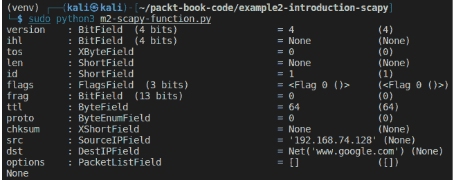

图 4.11 – ls 函数

如果你想访问某一层的单独字段，你可以直接使用点号（**.**）操作符。例如，如果你想打印`ip_layer`中的`dst`字段，你可以写如下代码：

ip_layer = IP(dst = dest_ip)

print("Destination = ", ip_layer.dst)

结果如下：

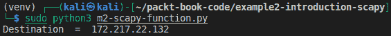

图 4.12 – 访问单独字段

如果你想查看该层的快速概述，可以在该层上调用`summary`方法：

print("Summary = ", ip_layer.summary())

概述结果如下：

图 4.13 – 层概述

到目前为止，我们已经熟悉了 Scapy 及其工作原理。我们学习了如何创建基本的包以及如何操作这些包。在下一节中，我们将探讨如何使用 Scapy 进行信息收集。

# 使用 Scapy 创建网络扫描器

在本节中，我们将创建一个简单的扫描器，扫描本地网络中的主机，并找到它们的 MAC 地址。为了创建这个扫描器，我们需要首先了解什么是**地址解析协议**（**ARP**），以及如何利用它来创建网络扫描器。

## 地址解析协议

ARP 在最简单的形式下是一个翻译工具，帮助我们将 IP 地址转换为 MAC 地址。每当一个设备需要与同一本地网络中的其他设备进行通信时，它需要该设备的 MAC 地址。IP 地址不用于本地通信。

假设设备 A 想要与本地网络中的设备 B 进行通信。为了找到设备 B 的 MAC 地址，计算机 A 会首先查看它内部维护的一个列表，称为 ARP 缓存，查看计算机 B 的 IP 地址是否已映射到物理 MAC 地址。如果已经映射，这个列表就被称为 ARP 表。你可以通过输入 `arp -a` 命令查看你电脑的 ARP 表。

这是在 Kali Linux 上运行 `arp -a` 命令的结果：

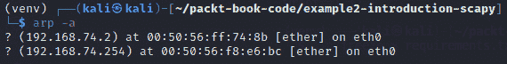

图 4.14 – ARP 表

你可以看到，它列出了与这些 IP 地址相关的 MAC 地址。你也可以在 Windows 中使用相同的命令。

如果请求的设备的对应 MAC 地址在本地没有找到，设备 A 会向整个网络发送广播请求，询问哪个设备拥有对应的 IP 地址。在我们的例子中，这将是设备 B。非设备 B 的设备会忽略此请求，而设备 B 会回复设备 B 的相应 MAC 地址。这样，设备 A 就能得知设备 B 的 MAC 地址。两个设备互相认识后，它们之间的通信可以继续。设备 A 一旦获得设备 B 的 MAC 地址，它就会更新其 ARP 表。*图 4.15* 展示了源设备如何生成 ARP 请求以及目标设备如何用正确的 MAC 地址进行回复：

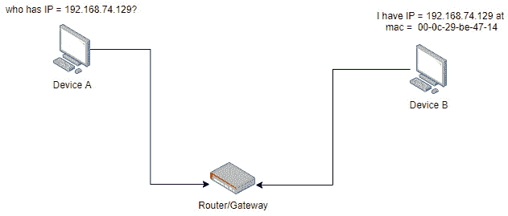

图 4.15 – ARP 请求

现在我们理解了 ARP 的工作原理，我们可以开始使用 Scapy 创建我们自己的 ARP 扫描器，以找出这些设备的 MAC 地址。你可能会想，为什么我们需要一个 ARP 扫描器呢？嗯，知道设备的 MAC 地址可以帮助我们进行 **中间人攻击**，我们将在 *第五章* 中进行 *中间人攻击*。

## 使用 Scapy 的 ARP 扫描器

ARP 协议工作在以太网层，因此在使用 Scapy 时，我们需要导入以太网层。让我们导入我们将使用的层和功能：

from scapy.all import Ether, ARP, srp

如果一个 MAC 地址的所有位都设置为 `1`，那么这意味着该数据包是广播包，应该发送到网络中的每个设备。Scapy 使用十六进制表示法，因此我们将创建以下变量来表示广播地址：

广播 = "FF:FF:FF:FF:FF:FF"

然后，我们可以创建一个以太网层的数据包，并将目的地设置为 **广播**。

我们还需要定义我们想要扫描的 `IP` 范围。在我的例子中，我想扫描我的本地网络：

ip_range = "192.168.74.1/24"

这表示我们想要扫描所有从 IP 地址 `192.168.74.1` 到 `192.168.74.255` 的设备。最后 8 位被称为子网掩码，表示我们要扫描的主机数量。记住，IP 地址是 32 位的，我们这里说我们想要屏蔽 24 位，因此剩下的 `32-24 = 8` 位是可寻址的，这意味着我们只扫描网络中的最后 256 个主机。

现在，要创建一个 ARP 层包，使用以下命令：

ip_range = "192.168.74.1/24"

arp_layer = ARP(pdst = ip_range)

现在我们已经创建了两个层，`Ether` 和 `ARP`。接下来，我们将创建一个包含这两个层的包：

packet = ether_layer / arp_layer

接下来，我们将以广播的方式发送这个包。为此，我们可以使用以下的 `srp` 函数：

ans, unans = srp(packet, iface = "eth0", timeout=2)

`packet` 是我们想要发送的包，`iface` 是我们希望用来发送该包的网络接口卡，`timeout` 用来确保如果 2 秒内没有收到回复，则表示该设备很可能处于离线状态。

`srp` 返回已经回答和未回答的包。我们只关心在线设备返回的已回答包。现在，为了获取在线设备的 IP 地址和 MAC 地址，我们可以写出以下代码。我们可以遍历返回结果，查看 IP 和对应的 MAC 地址：

for snd, rcv in ans:

ip = rcv[ARP].psrc

mac = rcv[Ether].src

print("IP = ", ip, " MAC = ", mac)

`rcv` 代表发送者已接收到的包。为了获取 IP 地址，我们可以使用 ARP 层，而为了获取 MAC 地址，我们可以使用 `Ether` 层。记住，包中设置的字段对应各自的层。

完整代码如下所示：

from scapy.all import Ether, ARP, srp

if __name__ == "__main__":

broadcast = "FF:FF:FF:FF:FF:FF"

ether_layer = Ether(dst = broadcast)

ip_range = "192.168.74.1/24"

arp_layer = ARP(pdst = ip_range)

packet = ether_layer / arp_layer

ans, unans = srp(packet, iface = "eth0", timeout=2)

for snd, rcv in ans:

ip = rcv[ARP].psrc

mac = rcv[Ether].src

print("IP = ", ip, " MAC = ", mac)

程序的输出如下所示：

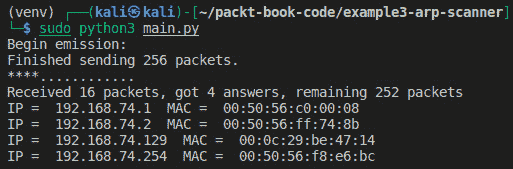

图 4.16 – ARP 扫描结果

现在你可以看到网络中所有设备的 MAC 和 IP 地址。第三个设备，`IP = 192.168.72.129` 是我的 Windows 机器，我将在后面的章节中将其作为受害者/目标机器。为了验证我们程序中得到的结果是否正确，我们可以手动从网络连接设置中检查这些字段：

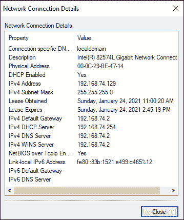

图 4.17 – 受害者的 IP 配置

在这里，你可以看到我们扫描得到的结果与这些值相匹配。再看看 MAC 地址。其他设备也可以看到。

`192.168.74.254` 代表 DHCP 服务器。DHCP 服务器在设备配置为自动分配 IP 时，会向网络中的设备分配 IP 地址。`192.168.72.2` 代表网络中的默认网关。

# 总结

在本章中，我们学习了数据是如何通过网络从一个设备传输到另一个设备的。我们了解了数据是如何在 TCP/IP 协议中封装的，以及每个报文头中添加了哪些字段。接下来，我们学习了一个非常重要的网络操作和数据包构造工具——Scapy。我们还学习了如何使用 Scapy 构造数据包，以及如何将这些数据包发送到网络中。然后，我们学习了 ARP 协议，最后，我们创建了一个 ARP 扫描器，用于获取网络中在线设备的 IP 地址和 MAC 地址。在下一章中，我们将学习如何使用这个扫描器创建一个中间人攻击，以拦截来自受害者机器的网络流量。
