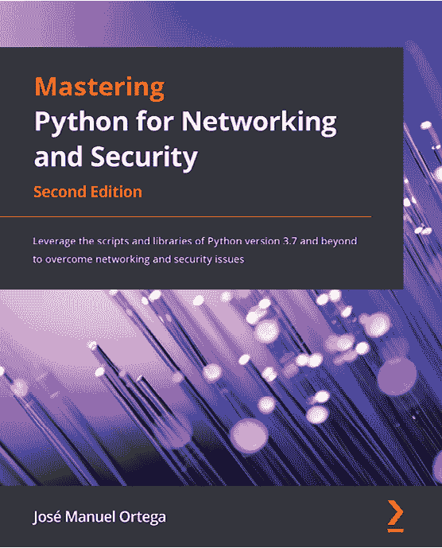
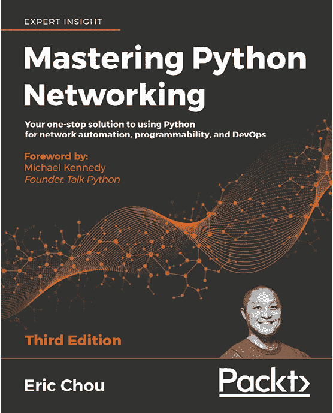

[Packt.com](http://packt.com)

订阅我们的在线数字图书馆，全面访问超过 7,000 本书籍和视频，并使用行业领先工具帮助你规划个人发展并推动职业生涯。更多信息，请访问我们的网站。

# 第九章：为什么订阅？

+   通过来自 4000 多位行业专家的实用电子书和视频，减少学习时间，增加编码时间

+   通过专为你定制的技能计划提高学习效率

+   每月获得一本免费的电子书或视频

+   完全可搜索，轻松访问关键信息

+   复制、粘贴、打印和书签内容

你知道 Packt 为每本出版的书籍提供电子书版本，并提供 PDF 和 ePub 文件吗？你可以在[packt.com](http://packt.com)升级到电子书版本，作为印刷书籍的客户，你还可以享受电子书副本的折扣。欲了解更多详情，请联系我们：customercare@packtpub.com

在[www.packt.com](http://www.packt.com)，你还可以阅读一系列免费的技术文章，订阅多个免费新闻简报，并获得 Packt 图书和电子书的独家折扣和优惠。

# 你可能喜欢的其他书籍

如果你喜欢本书，可能也会对 Packt 出版的其他书籍感兴趣：

**精通 Python 网络与安全 - 第二版**

José Manuel Ortega

ISBN: 978-1-83921-716-6

+   使用 Python 编写脚本自动化安全和渗透测试任务

+   探索 Python 编程工具在网络安全过程中的应用

+   自动化任务，如分析和提取服务器中的信息

+   了解如何检测服务器漏洞并分析安全模块

+   探索如何连接到 Tor 网络并获取信息

+   专注于如何使用 Python 取证工具提取信息

**精通 Python 网络编程 - 第三版**

Eric Chou

ISBN: 978-1-83921-467-7

+   使用 Python 库与网络进行交互

+   使用 Python 集成 Ansible 2.8，控制 Cisco、Juniper 和 Arista 网络设备

+   利用现有的 Flask Web 框架构建高级 API

+   学习如何在 AWS 和 Azure 云中构建虚拟网络

+   学习如何使用 Elastic Stack 进行网络数据分析

+   了解如何使用 Jenkins 自动部署你网络中的更改

+   在网络工程中，使用 PyTest 和 Unittest 进行测试驱动的网络开发

# Packt 正在寻找像你这样的作者

如果您有兴趣成为 Packt 的作者，请访问[authors.packtpub.com](http://authors.packtpub.com)并立即申请。我们与成千上万的开发者和技术专业人士合作，帮助他们将自己的见解与全球技术社区分享。您可以提交一般申请，申请我们正在招聘作者的特定热门话题，或者提交您自己的创意。

# 留下评论 - 让其他读者了解您的想法

请通过在您购买本书的网站上留下评论，与他人分享您对本书的想法。如果您是从亚马逊购买的这本书，请在本书的亚马逊页面上留下真实的评论。这对于其他潜在读者来说至关重要，他们可以看到并利用您的公正意见做出购买决定；我们也能了解客户对我们产品的看法；同时，我们的作者也能看到您对他们与 Packt 合作所创作书籍的反馈。这将只占用您几分钟的时间，但对其他潜在客户、我们的作者以及 Packt 来说都非常宝贵。感谢您的支持！
