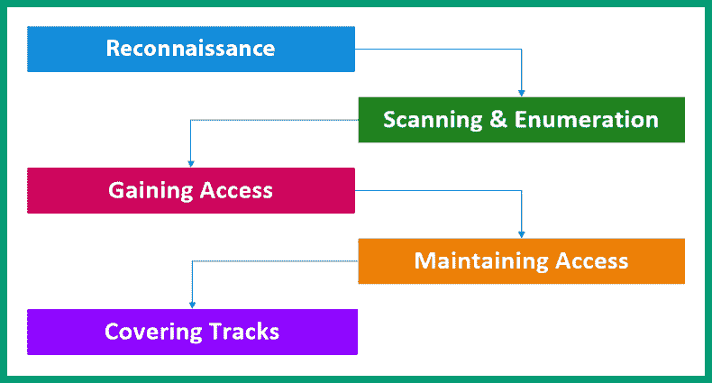
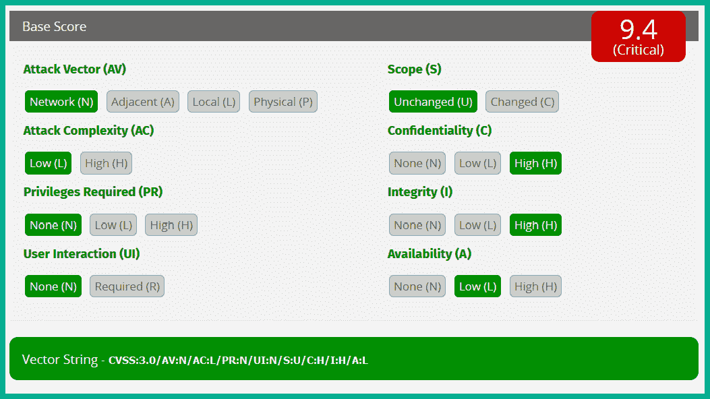
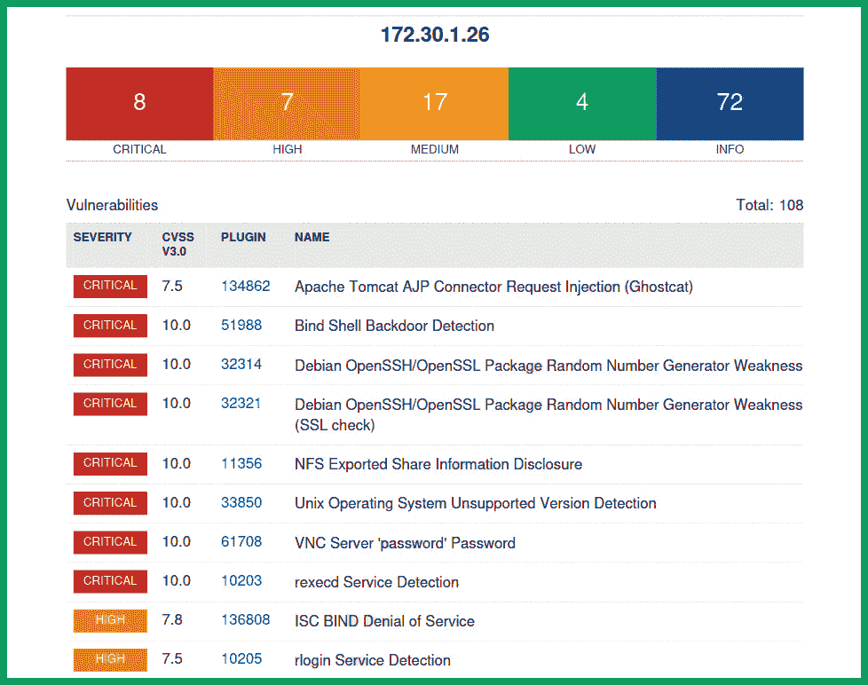

# 第一章：侦察基础知识

作为一名有志成为道德黑客、渗透测试员或红队成员的人，侦察在帮助网络安全专业人士减少组织在互联网上的数字足迹方面起着重要作用。这些数字足迹使得像黑客这样的对抗方能够利用关于目标的公开可用信息来规划未来的行动和网络攻击。随着越来越多的组织和用户将其系统和网络连接到世界上最大的网络基础设施——互联网，信息的访问和资源的共享已经变得对每个人都触手可及。互联网为许多组织提供了一个平台，使其产品和服务超越传统边界，向世界各地的潜在新客户拓展。此外，人们还使用互联网报名参加在线课程、进行电子商务交易、运营在线业务，以及与他人沟通和分享想法。

如今，互联网的使用对许多人来说已经非常普遍。例如，如果一个组织正在寻找新员工来填补一个新的或现有的职位，招聘人员只需发布职位空缺，并提供所需的所有必要细节，供有兴趣的候选人查看。这使得任何有互联网接入的人都可以访问各种招聘论坛和招聘网站，寻找新的职业机会，并通过在线平台轻松提交申请。发布和在线可用的信息使得对抗方能够收集并利用有关目标组织的特定细节。这些细节有助于黑客在不入侵的情况下确定公司内部网络上运行的网络基础设施、系统和服务类型。本书将教您威胁行为者和道德黑客如何利用公开可用的信息来规划未来的行动，从而导致网络攻击。

在本章中，您将从对抗方和网络安全专业人士的角度深入理解侦察的重要性，以及为什么组织在将其系统和网络连接到互联网时需要保持警惕。此外，您将学习攻击面管理的基本知识，了解它为何对组织至关重要，以及网络安全专业人士如何利用它减少网络可能遭受的网络攻击风险。最后，您将了解在攻击的侦察阶段，威胁行为者、对抗方、道德黑客和渗透测试人员常用的策略、技巧和程序。

在本章中，我们将涵盖以下主题：

+   什么是道德黑客？

+   侦察的重要性

+   了解攻击面管理

+   侦察策略、技巧和程序

一起来深入了解吧！

# 什么是道德黑客？

*黑客攻击*这个术语通常用来描述具有恶意意图的人（如*黑客*）进行的一些技术手段和活动，以便未经授权访问系统或网络。从电话系统、计算机到互联网的早期发展开始，许多人对如何确定各种设备和技术的运作方式以及它们如何协同工作产生了浓厚的兴趣。令人着迷的是，一个人可以使用传统的固定电话拨打另一个人的电话号码，并建立连接进行语音通话。甚至使用计算机向他人发送电子邮件，邮件可以几乎即时送达预定收件人的邮箱，相较于传统邮政方式，这种方式效率非常高。

由于全球人们的好奇心，拆解一个系统以进一步了解其功能的想法为黑客攻击奠定了基础。早期的黑客一代试图理解系统和设备是如何工作的，是否存在可以利用的设计缺陷，从而改变系统的原始功能。例如，在 20 世纪 50 年代和 60 年代，美国的一个电话系统中发现了一个安全漏洞，使得用户能够操控/改变电话信号，从而实现免费长途电话。这种技术在电信行业中被称为**电话黑客**（**phreaking**）。具体来说，一个人可以使用 2600 MHz 频率的口哨来重建电话路由信号，从而使得任何利用这个漏洞的人都能进行免费长途电话。然而，电信服务提供商已经实施了一种名为**公共信道办公信令**（**CCIS**）的解决方案，将信号与语音频道分离。在这种情况下，人们发现了一个系统中的安全漏洞并加以利用，从而改变了系统的运作方式。然而，不同的人有不同的目的，可能是为了娱乐、实验，甚至是为了获取免费的长途电话服务。

重要提示

**漏洞**通常用来描述系统中的安全缺陷或弱点。**利用**是指任何可以用来利用安全漏洞的手段。**威胁**是指任何可能对系统造成损害的因素。**威胁行为者**或**对手**是指对网络攻击或制造威胁负责的人。

一个非常常见的问题是，为什么有人会想要黑入另一个系统或网络。每个黑客背后都有不同的动机，例如，许多黑客出于娱乐、向他人证明某种观点、盗取组织数据、通过在暗网上出售被盗数据获取经济利益，甚至是作为个人挑战。无论动机是什么，黑客攻击在全球范围内都是非法的，因为它涉及使用计算机系统对另一个系统造成伤害或损害。

尽管黑客在主流媒体中似乎都是负面的，但它并非全是坏事，因为像道德黑客和渗透测试员这样的网络安全专业人士，使用类似的技术和工具，在合法许可和目的下模拟真实的网络攻击，以帮助组织发现并解决隐藏的安全漏洞，防止未来发生真正的网络攻击。道德黑客只是好人，他们通常被称为*白帽黑客*，在网络安全行业中，他们利用自己的知识和技能帮助组织在真正的网络攻击发生之前，找到并解决潜在的安全弱点和漏洞。虽然威胁行为者和道德黑客拥有相似的技能，但他们的道德观不同，威胁行为者利用他们的技能和能力进行恶意和非法活动，而道德黑客则利用这些技能帮助组织防御自己，并保护其资产免受恶意黑客的攻击。

以下是常见的威胁行为者及其动机：

+   **高级持续性威胁（APT）组织** – APT 组织的成员设计的攻击非常隐蔽，并且大多数威胁检测系统无法检测到目标网络或系统中的攻击。其目的是渗透目标组织并保持在其网络中，同时利用其他系统并窃取数据。

+   **内部威胁** – 这是指攻击者位于目标组织的网络基础设施内。这可能是公司内部的黑客，他能绕过组织的安全防御系统并直接访问易受攻击的机器。此外，内部威胁还可能是意图破坏公司网络基础设施的不满员工。

+   **国家行为者** – 这些是受雇于某国政府的网络安全专业人士，专注于国家安全，并对全球其他国家进行侦察。

+   **黑客行动主义者** – 这些人利用他们的黑客技能支持社会或政治议程，例如篡改网站和破坏对网络服务器的可用性或访问。

+   **脚本小子** – 这种黑客是新手，缺乏行业技术专长，但会遵循专家的教程或指令对目标系统进行网络攻击。然而，由于此人不完全理解攻击背后的技术细节，他们可能比真正的黑客造成更多的损害。

+   **犯罪集团** – 这是一个专注于经济利益的有组织犯罪团伙，每个成员都有专门的技能来提升攻击效果并增加成功的可能性。此外，这个团伙通常资金雄厚，确保他们能获得最好的工具。

+   **白帽** – 这些是网络安全专业人士，如道德黑客、渗透测试员和红队成员，他们运用自己的技能帮助组织防止网络攻击和威胁。

+   **灰帽** – 这些人利用自己的黑客技能进行善恶两用。例如，灰帽威胁行为者可能是一名网络安全专业人员，白天利用自己的技能帮助组织，晚上出于恶意目的使用技能。

+   **黑帽** – 这些是典型的利用技能进行恶意目的的威胁行为者。

道德黑客、渗透测试人员和红队操作员在模拟任何类型的真实世界网络攻击和威胁之前，始终需要从当局获得法律许可，并确保他们保持在范围内。例如，以下协议需要在网络安全服务提供商和客户之间签署：

+   **保密` `协议**(**NDA**)

+   **工作声明**(**SOW**)

+   **主服务` `协议**(**MSA**)

+   **攻击许可**

NDA 通常被称为 *保密协议*，其中规定道德黑客、渗透测试人员或红队成员不得披露、分享或保留在对客户系统和网络基础设施进行安全评估期间发现的任何私人、机密、敏感或专有信息。

然而，SOW 文档通常包含了道德黑客/服务提供商为客户执行的安全测试类型的所有细节，以及安全测试的范围，例如特定的 IP 地址和范围。对于法律原因，道德黑客不得超出安全测试范围是非常重要的。此外，SOW 将包含计费细节、安全测试持续时间、免责声明和责任细节以及交付给客户的成果。

MSA 是一份包含付款细节和条款、提供商的保密和工作标准、限制和约束以及交付要求的一般协议。这种类型的协议帮助网络安全服务提供商减少为新客户或现有客户提供类似工作所需的时间。此外，MSA 文件可以根据每个客户的需求进行定制，因为他们可能需要独特或专业化的服务。

*攻击许可* 对于道德黑客、渗透测试人员和红队成员来说是非常重要的协议，因为它包含了进行客户系统和网络基础设施安全测试所需的法律授权。将这份协议视为一份文件形式的 *脱罪卡*，由法律机构签署，表明授予服务提供商及其从业人员进行道德黑客和渗透测试服务的许可。

## 道德黑客的心态和技能

威胁行为者总是在寻求新的、先进的技术来破坏目标的系统和网络，以实现合法目的。例如，全球有不同类型的黑客和团体，每个团体都有自己的动机和理由进行网络攻击：

+   个人成就/挑战，例如证明自己有能力和技能突破一个组织及其系统

+   财务获利，例如窃取组织的机密数据并在各种暗网市场上出售

+   支持某个社会或政治议程，例如篡改和破坏与社会/政治运动相关的网站

+   网络战，例如破坏管理国家关键基础设施的**工业控制系统**（**ICS**）

虽然全球有许多网络安全公司正在开发和改进解决方案，以帮助组织抵御网络犯罪分子、攻击和威胁，但行业中对网络安全专业人员的需求也非常巨大。通过主流媒体平台已经可以明显看到，另一个组织成为威胁行为者目标的只是时间问题。根据世界经济论坛于 2015 年 1 月 21 日发布的在线文章《万物互联网对安全意味着什么？》，思科系统公司前执行主席兼首席执行官约翰·钱伯斯表示：“*有两种类型的公司：一种是已经被黑的公司，另一种是还不知道自己已经被黑的公司。*” 每天，这一说法变得越来越明显，越来越成为现实，因为许多公司正在报告数据泄露，一些报告表明，攻击者在安全事件被发现并控制之前，已经在网络中潜伏了多天甚至数月。

对于道德黑客技能和知识的需求在全球范围内不断增长，因为从小型到大型企业的领导团队已经意识到，他们的资产需要得到保护，而道德黑客和渗透测试人员可以帮助发现和修复隐藏的安全漏洞，减少攻击面，并提高公司在面对网络犯罪分子和威胁时的网络防御能力。道德黑客拥有与恶意攻击者（如威胁行为者）相同的技能和专业知识，但区别在于他们的意图。道德黑客拥有良好的道德指南针，并选择将自己的技能用于正当理由，而威胁行为者则将自己的技能和知识用于不正当的目的，例如非法破坏和伤害系统。

以下是道德黑客在网络安全行业中常见的技术技能：

+   熟练掌握各种操作系统的管理技能，如 Windows 和 Linux

+   扎实的网络基础知识，如路由和交换

+   理解常见安全原则和最佳实践的基本知识

+   熟练掌握诸如 Go 和 Python 之类的编程语言，以及像 Bash 和 PowerShell 这样的脚本语言

+   熟悉虚拟化、容器化和云计算

尽管上述基本技能列表似乎有些令人生畏，但要记住网络安全领域和学习就像马拉松而非短跑。重要的不是你能学得多快，而是确保你花时间充分理解和掌握一个主题。

以下是伦理黑客的非技术技能:

+   在技术和非技术人员之间进行口头和书面交流的熟练

+   成为一个*非常规*思考者

+   自我激励，并有动力学习新主题并扩展知识

+   确保你理解使用知识进行善恶意图之间的区别

伦理黑客使用与真实威胁行为者相同的技术、工具和程序，以实现他们的目标，并发现系统中的隐藏安全漏洞。有一句谚语说，如果你想抓贼，你就需要像一个一样思考。这句谚语适用于伦理黑客 - 如果你想找到真正黑客能够发现和利用的安全漏洞，那么你需要调整你的思维方式，同时使用相同的技术、工具和程序，以帮助你做到这一点，并且具有合法的许可和良好的意图。

以下图表显示了 EC-Council 的伦理黑客五个阶段:

图 1.1 - 黑客阶段

如上图所示，伦理黑客和威胁行为者从侦察他们的目标开始，然后转向扫描和枚举，然后进入获取访问权限和建立系统中的立足点，通过保持访问来掩盖痕迹，并删除任何攻击证据。由于本书基于“伦理黑客的侦查”概念，因此我们将在课程中专注于侦查、扫描和枚举。

# 侦察的重要性

伦理黑客的第一阶段是**侦察** - 伦理黑客用来收集有关目标的尽可能多信息的技术和程序，以确定他们的网络基础设施、网络防御和可以被利用的安全漏洞，以获得未经授权的访问并相应地改进攻击操作。从军事角度来看，侦查在规划和对目标发动攻击中起着重要作用。收集有关目标的信息帮助攻击者确定入口点、基础设施类型、拥有的资产以及目标的优势和劣势。

简单来说，侦察有助于道德黑客在发起攻击之前，深入了解一个组织的系统和网络基础设施。收集到的信息可以用来识别可以被利用的安全漏洞，从而使道德黑客能够入侵并在目标系统中站稳脚跟。例如，使用侦察技术可以帮助道德黑客识别系统中正在运行的服务、开放的端口以及服务和软件的版本，所有这些信息都可以用来识别和确定潜在的攻击向量。

此外，使用像**开源情报**（**OSINT**）这样的侦察技术，可以帮助道德黑客被动地收集互联网上公开的目标信息。这些信息可能包括目标组织员工的用户名、电子邮件地址和职位等。这些信息可以用来创建各种*社会工程*攻击和*钓鱼*邮件攻击，针对特定员工发送。

以下截图展示了互联网上公开的员工信息示例：

图 1.2 – 员工数据

如前面的截图所示，这些是某一特定组织的不同员工。他们的姓名、电子邮件地址和职位在互联网上是公开可见的。攻击者可以通过观察他们的电子邮件地址寻找规律，以确定公司所有员工的邮箱格式。例如，假设有一位名为 John Doe 的员工，他的电子邮件地址是`jdoe@companyname.com`，另一位员工是 Jane Foster，她的电子邮件地址是`jfoster@companyname.com`。这些信息显示了同一组织内员工的邮箱格式和规律：`{f}{lastname}@domain-name.com`，其中`f`是该员工名字的首字母，后跟姓氏和公司的域名。这样的信息可以帮助道德黑客向目标组织的高层员工发送钓鱼邮件攻击。

侦察帮助组织降低被威胁行为者攻击的风险，并改善其网络防御。通过让道德黑客对组织的系统和网络基础设施进行侦察技术和流程，组织可以有效地识别安全漏洞，并在这些漏洞被对手发现并利用之前采取必要的补救和解决措施。此外，侦察帮助组织识别并跟踪潜在的威胁行为者，使公司能够更好地了解网络安全威胁态势，同时实施和改进积极的反制措施，以保护其资产、系统和网络。因此，侦察不仅对对手重要，网络安全专业人士也使用收集的信息来帮助组织。

侦察分为以下几种类型：

+   **被动侦察**

+   **主动侦察**

被动侦察使道德黑客能够利用开放源代码情报（OSINT）技术，从互联网上的各种公开来源收集信息，而无需直接与目标接触。

以下是一些开放源代码情报（OSINT）数据来源的示例：

+   招聘网站

+   在线论坛

+   社交媒体平台

+   公司注册网站

+   公共**域名系统**（**DNS**）服务器

对于道德黑客来说，在进行安全评估时使用与对手相似的技术和流程，以为客户提供真实世界的经验是非常重要的。此外，这也有助于组织确定其安全团队和解决方案是否能够检测到道德黑客所创建的任何安全入侵。如果安全团队无法检测到在道德黑客和渗透测试评估过程中执行的任何操作，那么对于道德黑客来说，这是一个好兆头，因为他们的技术足够隐秘，可以绕过并躲避网络上的任何威胁检测系统。然而，这意味着组织的安全团队需要改进其威胁监控和检测策略，并调整其传感器以捕捉任何与安全相关的异常。

主动侦察通过威胁行为者和道德黑客采取更直接的方法，收集关于目标的信息。在主动侦察中，道德黑客使用扫描和枚举技术与工具来获取有关目标系统和网络的具体细节。例如，要确定服务器上运行的服务和开放的端口，道德黑客可以使用网络和端口扫描工具，如`Nmap`，对网络进行主机发现。然而，主动侦察增加了触发安全传感器的风险，可能会向安全团队发出关于可能正在进行侦察攻击的警报。

在下一节中，您将了解网络安全专业人士，包括道德黑客，如何利用在侦察期间收集的信息，帮助组织提升其安全态势并管理其攻击面。

# 理解攻击面管理

**攻击面**简单来说就是能够被利用的潜在安全漏洞的数量，这些漏洞可以通过攻击向量被用来访问系统、网络和组织。如果组织无法识别其安全漏洞并实施对策，那么它们就等于把自己暴露于网络攻击和威胁之下。**攻击面管理**（**ASM**）并不是网络安全行业中的新学科，而是全球网络安全专业人士和组织的新关注点。ASM 是一种策略，网络安全专业人士用它来专注于识别、分析并减少组织的攻击面。因此，通过减少组织的攻击面，可以降低被网络攻击和威胁入侵的风险，同时保护其资产、资源和敏感信息。

在组织中采用 ASM 可以帮助安全团队根据漏洞分数和潜在影响识别并优先处理安全漏洞。**通用漏洞评分系统**（**CVSS**）通常在许多漏洞扫描工具中引用，用来提供从`0`到`10`之间的漏洞评分，其中`0`表示影响最小，`10`表示最严重。这些分数帮助网络安全专业人士将高优先级和资源分配给高严重性的安全漏洞修复工作。

例如，下面的截图展示了 CVSS 计算器的基础指标：

图 1.3 – CVSS 计算器

如前面的代码片段所示，基础分数中的指标会影响漏洞分数。例如，如果攻击者能够通过网络在目标系统上利用安全漏洞，并且攻击复杂度低，不需要任何用户交互或提升的权限，并且该漏洞对系统的机密性和完整性有极大影响，则 CVSS 计算器会给出 9.4 的漏洞分数。请记住，这些分数是根据漏洞对系统的关键性和影响来分配的。

提示

要了解更多关于 CVSS 计算器的信息，请参见[`www.first.org/cvss/calculator/3.1`](https://www.first.org/cvss/calculator/3.1)。

以下代码片段显示了 Nessus 漏洞扫描的结果，展示了安全漏洞的数量及其分数：

图 1.4 – Nessus 扫描结果

如前面的代码片段所示，CVSS 分数是通过 CVSS 计算器引用的。

重要的是要认识到，网络安全专业人员可能会识别出一个对组织及其业务流程至关重要的安全漏洞，虽然该漏洞的潜在影响较低。有些安全漏洞对业务运营的关键性较低，但如果被威胁行为者利用，可能会带来更大的潜在影响。因此，ASM 帮助组织根据漏洞的影响程度优先处理安全漏洞，同时将资源分配给最关键的安全漏洞进行修复。

此外，实施 ASM 的组织能够更好地识别并跟踪其攻击面的变化。例如，如果组织对现有系统安装了新更新，这个新更新可能会引入新的安全漏洞，并可能改变攻击面，使得威胁行为者能够使用新的技术来攻破系统。类似地，如果组织在其网络基础设施上实施了新的系统或应用程序，可能会为攻击面带来新的安全缺陷。然而，ASM 使网络安全专业人员能够跟踪组织攻击面所做的变化，同时确保安全团队了解在此过程中引入的任何新安全漏洞。此外，组织可以采取必要的措施，在这些安全漏洞被威胁行为者利用之前进行修复。

ASM 的另一个好处是能够帮助组织高效监控其攻击面并识别任何可疑活动。这改善了公司内部的实时威胁检测与响应，使安全团队能够立即采取行动，防止、遏制或修复来自系统和网络的威胁。最后，当 ASM 得到正确实施时，它可以帮助安全团队识别是否有任何恶意活动或威胁成功避开安全解决方案而未被检测到。

以下是 ASM 在网络安全行业中的主要好处：

+   **降低风险** – 采用 ASM 的组织能够识别并减少自身的攻击面，从而降低潜在网络攻击和威胁的风险，保护其资产免受威胁行为者的侵害。因此，通过识别和修复安全漏洞，威胁行为者更难以攻破系统并占领立足点。

+   **优先级排序** – ASM 帮助公司优先分配资源修复比其他漏洞更为关键的安全漏洞。

+   **持续监控** – 组织为了确保攻击面尽可能小，需要进行持续的监控和维护。这有助于网络安全专家和组织时刻了解可能存在的任何新安全漏洞，无论是由于新实施的功能还是系统升级，因此可以在漏洞被利用之前采取必要的行动来减轻风险。

+   **改进事件响应** – ASM 帮助安全团队实时高效地识别和响应网络上的安全事件，从而减少威胁的影响和传播。

+   **合规性** – 在某些行业中，组织需要遵守特定的监管标准和框架。例如，在支付卡行业运营的组织需要确保其系统和网络符合**支付卡行业数据安全标准**（**PCI DSS**）。合规意味着组织的系统和网络已经实施了特定的安全控制，确保数据得到保护。

+   **成本效益** – 由于 ASM 帮助组织改进安全漏洞的识别和修复，它降低了数据泄露的风险，并提高了对组织至关重要系统的可用性。

以下是组织和网络安全专家可以用来开始实施 ASM 的关键步骤：

1.  **资产管理** – 确保组织内的所有资产都得到妥善跟踪并录入库存。这些资产可能包括计算机、服务器、应用程序和移动设备。这样有助于组织更好地理解需要保护哪些资产，并识别它们的安全缺陷。

1.  **识别和绘制攻击面** – 在这一阶段，网络安全专家需要识别组织的安全漏洞并绘制攻击面。此阶段包括可能被用来执行攻击的潜在攻击向量，以及如开放端口和易受攻击的系统和网络服务等入侵点。

1.  **评估风险** – 这一阶段着重于评估每个安全漏洞的风险及其对组织的影响。此阶段有助于对最关键的安全漏洞进行优先处理，然后再处理次要漏洞。

1.  **实施安全控制** – 这一阶段着重于实施安全控制和解决方案，以修复和减轻前阶段已识别的安全漏洞。在此，安全团队将实施网络安全设备、威胁监控和预防解决方案、网络分段等。

1.  **监控与维护** – 为了使 ASM 有效，必须对所有资产、系统和设备进行持续监控。持续监控和维护那些负责防止网络攻击和威胁的安全控制措施非常重要，这些控制措施可以防止安全漏洞被利用。此外，持续的监控和维护有助于确保安全控制措施有效保护组织的资产。

1.  **持续进行侦察** – 为了识别攻击面上的新安全漏洞，组织需要持续对其资产、系统和网络基础设施进行侦察。一旦发现新的安全漏洞，ASM 生命周期将重新启动，并采取必要措施来缓解安全风险。

除了使用前述的关键步骤外，还有一些工具可以帮助网络安全专业人员和组织进行 ASM（攻击面管理）：

+   **漏洞扫描器** – 这些是专门的自动化工具，帮助网络安全专业人员识别系统中的安全漏洞，并提供如何修复问题的建议。此外，这些工具还提供严重性评级、漏洞分数和潜在影响。

+   **网络扫描器和映射器** – 这类工具帮助网络安全和网络专业人员确定在线主机、开放的服务端口和主机设备上运行的应用程序。此外，它们帮助组织绘制整个网络基础设施的地图，并识别连接到公司网络的未经授权的设备。

+   **配置管理工具** – 这类工具帮助组织跟踪和管理其系统和网络上的配置。它还帮助网络安全专业人员识别新出现的安全漏洞，例如在设备上进行新更改后引入的配置错误。

+   **应用安全测试工具** – 这些是专门工具，通常由网络安全专业人员用于对应用程序和软件进行安全测试，以识别任何未知的安全漏洞。

+   **攻击面减少**(**ASR**) 工具 – 这些工具旨在帮助组织减少其攻击面。它通过识别和拒绝恶意网络流量，以及禁用系统和协议上的不必要服务来工作。

+   **风险管理工具** – 风险管理工具使组织能够跟踪和管理与其攻击面相关的风险。此外，该工具帮助网络安全专业人员监控现有安全控制措施的有效性，以防止网络攻击和威胁。

+   **安全信息与事件管理**(**SIEM**) – 这是一种安全解决方案，收集、汇总和分析来自组织内部系统和设备的安全相关日志信息，以实时识别潜在的网络攻击和威胁。

虽然这些工具只是建议，但需要记住，没有任何单一工具能够完全覆盖一个组织的攻击面。因此，需要结合使用不同的工具、技术和程序，以确保组织能够有效地管理其攻击面。此外，由于许多工具是基于软件的，因此它们需要定期更新，以确保能够检测到行业中最新的安全漏洞和威胁。

在下一部分，你将学习到对手在网络攻击侦察阶段使用的战术、技术和程序。

# 侦察战术、技术和程序

正如你迄今所学，在对手对一个组织发起攻击之前，他们需要进行侦察，尽可能多地收集有关目标的信息，以确定其攻击面（入口点）。虽然威胁行为者和道德黑客使用的技术有很多，但 MITRE 创建了著名的`MITRE ATT&CK`框架，概述了基于真实事件的对手的**战术、技术和程序**（**TTPs**）。这些 TTPs 通常被网络安全专业人员、研究人员和组织用来开发和改进他们的威胁建模和网络防御。

MITRE ATT&CK 包含了侦察 TTPs，帮助我们更好地理解对手在发起攻击之前如何收集有关目标的信息。这些 TTPs 也被道德黑客用于高效地识别安全漏洞，以及威胁行为者如何利用攻击面来破坏客户的网络基础设施。

以下是对手常用的侦察战术、技术和程序（TTPs）：

+   **主动扫描** – 在主动扫描过程中，对手使用各种扫描工具收集目标信息，以便在未来的操作中利用。这些扫描工具向目标系统和网络发送特殊探测信号，确定活跃主机、操作系统、开放端口和主机上运行的服务。主动扫描是一种主动侦察技术，涉及扫描 IP 网络块和目标的公共 IP 地址，进行漏洞扫描以识别可以被利用的安全弱点，以及使用字典扫描来获取可能的密码，以便对目标进行基于密码的攻击。

+   **收集受害者主机信息** – 该技术使攻击者能够收集有关目标设备的具体细节，如主机名、IP 地址、设备类型/角色、配置和操作系统。此外，攻击者还可以收集硬件、软件和客户端配置细节，这些信息可以用来改进攻击计划。此技术结合了主动和被动侦察，因为攻击者仅凭开放源代码情报（OSINT）就能获得大量情报，并且可以通过主动侦察来识别互联网上不容易获得的特定细节。

+   **收集受害者身份信息** – 该技术侧重于收集有关目标身份的详细信息——个人数据，如员工的姓名、电子邮件地址、职位和用户凭证。这类信息可以通过被动侦察收集，并用于未来的社交工程攻击和获取目标系统的访问权限。

+   **收集受害者网络信息** – 攻击者可以使用被动侦察技术收集目标的网络基础设施信息，如 IP 范围、域名、域名注册商详情（物理地址、电子邮件地址和电话号码）以及 DNS 记录。然而，主动侦察技术将帮助攻击者更好地识别目标的网络拓扑、网络设备和安全设备。这些信息有助于攻击者更好地理解目标的网络基础设施。

+   **收集受害者组织信息** – 该技术使攻击者能够收集关于目标组织的具体信息，如部门名称、业务操作和流程，以及员工的角色和职责。这些信息可以通过被动侦察收集。此外，攻击者使用此技术确定物理位置、商业关系和营业时间。

+   **信息钓鱼** – 攻击者向目标组织的员工发送钓鱼电子邮件，目的是欺骗受害者执行某些操作，如下载并安装恶意软件，或泄露敏感信息，如用户凭证。攻击者可以使用在线服务提供商的鱼叉式钓鱼服务，在电子邮件中插入恶意附件，并在电子邮件正文中插入模糊的链接。由于攻击者使用的是直接攻击方式，这是一种主动侦察技术。

+   **搜索封闭源** – 攻击者可能会尝试从封闭源收集目标信息，这些信息通常是通过付费订阅获得的（被动侦察）。此类信息包括来自威胁情报供应商的威胁情报，其中包含可以用来攻击目标的私密细节。此外，攻击者还可以通过*暗网*市场/黑市购买有关目标的信息。

+   **搜索开放技术数据库** – 许多公共在线资源允许任何人收集有关目标的信息。这项技术专注于利用公共信息来改善对组织的攻击计划。例如，攻击者可以利用公共的 DNS 记录、WHOIS 数据（域名注册信息）、数字证书（帮助识别子域名）以及包含目标 IP 地址、开放端口和服务器横幅信息的公共数据库。这是另一种被动侦察技术，用于收集有关目标的信息。

+   **搜索开放网站和域名** – 攻击者使用这项技术搜索各种在线网站和平台，如社交媒体、互联网搜索引擎和代码仓库（如 GitHub），以收集可用于攻击目标的信息。搜索开放网站和域名是另一种被动侦察技术，用于收集公共信息。

+   **搜索受害者拥有的网站** – 攻击者使用这项技术搜索目标网站，查找可以利用的任何信息，如组织信息、物理位置、员工的电子邮件地址、高级员工的信息，甚至员工的姓名和联系方式。这是一种主动侦察技术，因为攻击者与目标的资产建立了直接连接。

这些是威胁行为者常用的策略，它有助于道德黑客高效地识别组织中的安全漏洞。此外，请记住，侦察 TTP（战术、技术和程序）在不断扩展，因为攻击者正在开发新的技术和工具来攻击组织。然而，网络安全专业人员和组织可以利用侦察 TTP 来加强网络防御，识别并修复安全漏洞，减少攻击面以及降低网络攻击的风险。

# 总结

在本章中，你已经了解了道德黑客的重要性及其如何帮助组织提升安全态势。你还发现了为什么威胁行为者会花费大量时间收集关于目标的信息，以及如何利用这些信息来识别安全漏洞。此外，你还学到了为什么道德黑客使用类似的技术和策略，帮助组织在真正的网络攻击发生之前识别并修复安全漏洞。

此外，你还探讨了攻击面管理在网络安全行业中的必要性，以及它如何帮助组织提高对抗网络攻击和威胁的防御能力。最后，你也了解了侦察 TTP（战术、技术和程序），这些通常在全球范围内被观察到，它帮助安全专业人员和组织改善他们的威胁建模和策略，从而更好地保护资产免受网络犯罪分子的攻击。

我希望本章对你有所帮助，并在你进入网络安全行业的旅程中提供了有价值的信息。在下一章《搭建侦察实验室》中，你将学习如何构建一个安全的实验室环境，供你在个人电脑上进行主动侦察和漏洞评估。

# 进一步阅读

+   足迹识别和侦察基础： [`www.eccouncil.org/cybersecurity-exchange/ethical-hacking/basics-footprinting-reconnaissance/`](https://www.eccouncil.org/cybersecurity-exchange/ethical-hacking/basics-footprinting-reconnaissance/)

+   攻击面管理： [`www.crowdstrike.com/cybersecurity-101/attack-surface-management/`](https://www.crowdstrike.com/cybersecurity-101/attack-surface-management/)

+   MITRE 侦察： [`attack.mitre.org/tactics/TA0043/`](https://attack.mitre.org/tactics/TA0043/)

+   万物互联网对安全意味着什么？：[`www.weforum.org/agenda/2015/01/companies-fighting-cyber-crime/`](https://www.weforum.org/agenda/2015/01/companies-fighting-cyber-crime/)
