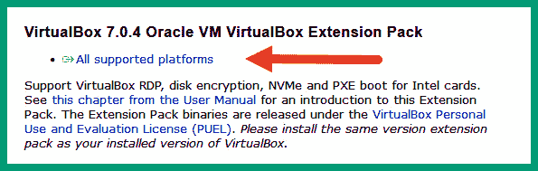
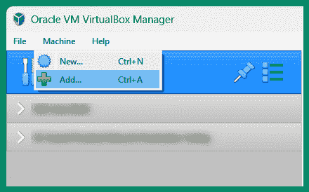
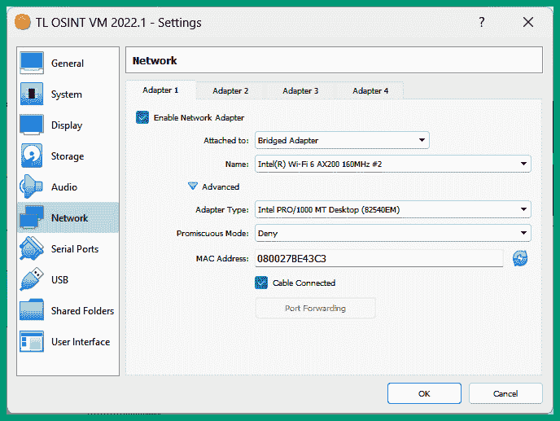
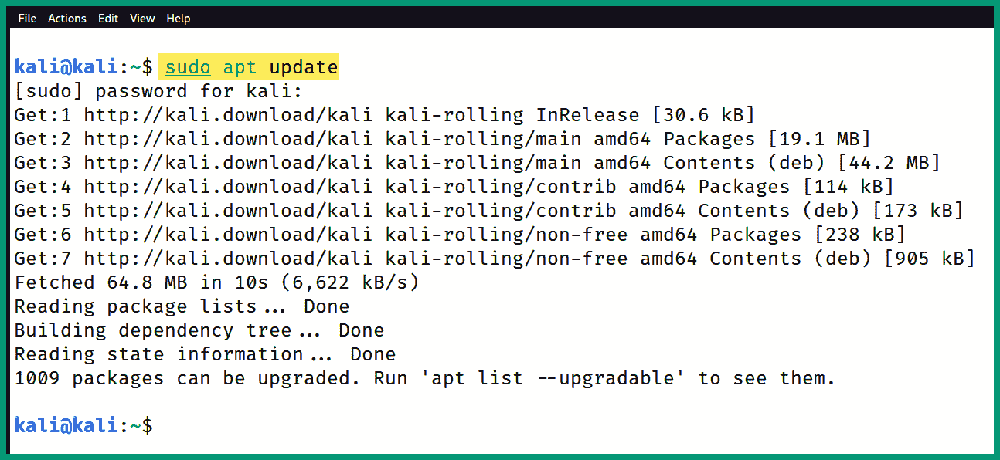

# 第二章：设置侦察实验室

学习各种网络安全话题总是令人兴奋，因为有许多新技术和内容相当有趣，特别是使用各种工具和技术来发现脆弱系统和应用程序中的敏感信息。然而，获取有关系统的敏感信息，如操作系统、已知漏洞、开放服务端口和运行服务，需要道德黑客向目标发送特别构造的探测。简单来说，道德黑客可以创建脚本或使用基于自动化的软件扫描工具来发送探测并分析响应，以确定目标是否存在安全漏洞。然而，扫描是非法的，未经相关权威机构的合法许可，不应对任何系统进行扫描。

作为一名有志或资深的道德黑客，设置自己的实验环境非常重要，因为它使你能够在自己的设备上进行侵入性安全测试，而不必担心对他人的系统造成损害。

在本章中，您将学习如何设置和构建个人实验环境，学习侦察技术并磨练作为网络安全专业人员的技能。您将学习如何部署虚拟机管理程序以创建虚拟机并实现虚拟网络。此外，您还将学习如何让 Kali Linux 和 Trace Labs OSINT 虚拟机启动并运行。最后，您将学习如何设置易受攻击的 Web 应用程序和服务器，在个人实验室中安全地进行主动侦察。主动侦察要求道德黑客对目标执行各种类型的扫描，这些扫描由于所收集的目标信息类型而被认为具有侵入性和非法。

在本章中，我们将涵盖以下主题：

+   实验室概览与技术

+   设置虚拟机管理程序和虚拟网络

+   部署 Kali Linux

+   部署一个 OSINT 虚拟机

+   实施易受攻击的系统

让我们开始吧！

# 技术要求

为了跟上本章中的练习，请确保您已满足以下硬件和软件要求：

+   Oracle VM VirtualBox: [`www.virtualbox.org/`](https://www.virtualbox.org/)

+   Oracle VM VirtualBox 扩展包: [`www.virtualbox.org/wiki/Downloads`](https://www.virtualbox.org/wiki/Downloads)

+   7-zip: [`www.7-zip.org`](https://www.7-zip.org)

+   Kali Linux 2022.4: [`www.kali.org/get-kali/`](https://www.kali.org/get-kali/)

+   Trace Labs OSINT VM 2022.1: [`www.tracelabs.org/initiatives/osint-vm`](https://www.tracelabs.org/initiatives/osint-vm)

+   Vagrant: [`www.vagrantup.com/`](https://www.vagrantup.com/)

+   OWASP Juice Shop: [`owasp.org/www-project-juice-shop/`](https://owasp.org/www-project-juice-shop/)

+   Metasploitable 3: [`app.vagrantup.com/rapid7/boxes/metasploitable3-win2k8`](https://app.vagrantup.com/rapid7/boxes/metasploitable3-win2k8)

# 实验室概述与技术

构建个人实验室环境使您能够探索并提高技术技能，而无需购买昂贵的硬件或支付订阅费用。个人实验室环境提供了很大的可扩展性和灵活性选项，例如使您能够根据学习目标和需求，随时增加或删除系统。例如，借助虚拟化技术的强大功能，您可以在个人计算机上创建一个完整的虚拟网络，其中多个虚拟机同时运行，无需额外费用或物理硬件组件。

为了更好地理解构建实验室环境所需的组件，让我们来看看每个主要组件的作用和功能：

+   **虚拟机监控器** – 虚拟机监控器将使您能够创建虚拟化环境，在个人计算机上安装并同时运行多个操作系统。在实验室环境中，`Oracle VM VirtualBox` 将是首选虚拟机监控器，因为它是免费的，并且支持许多主机操作系统和硬件。

+   **虚拟网络** – 虚拟机监控器包含虚拟网络组件，如**虚拟交换机**（**vSwitch**）和**虚拟网络接口卡**（**vNIC**），这些组件使虚拟机能够与同一虚拟机监控器上的其他虚拟机以及物理网络上的系统进行互联通信。

+   **攻击者机器** – 攻击者机器将用于执行被动和主动侦察以及扫描技术。我们将使用`Kali Linux 2022.4`（非 Kali Linux Purple）和**Trace Labs OSINT 虚拟机**，因为它们是免费的，并且包含了您学习和执行侦察及扫描所需的所有工具。

+   **易受攻击的服务器** – 要对目标进行主动侦察和扫描，实验室环境中需要一台易受攻击的服务器。推荐选择**Metasploitable 3 Windows 虚拟机**，因为它专为学习伦理黑客和渗透测试而设计。

+   **易受攻击的 Web 应用** – 为了安全地对 Web 应用进行主动侦察，我们将设置`OWASP Juice Shop`，这是一个易受攻击的 Web 应用，旨在帮助网络安全专业人员更好地理解行业中的**OWASP Top 10: 2021 Web 应用安全风险**。

以下图示展示了将在您的个人计算机上构建并运行的实验室拓扑结构：


图 2.1 – 实验室基础设施

虚拟化程序将安装在您的主机操作系统上，使您能够创建虚拟机。当需要时，Kali Linux、Trace Labs OSINT VM 和 Metasploitable 3 Windows VM 将作为虚拟机在虚拟化程序上运行。此外，虚拟化程序将为每个虚拟机分配虚拟网络接口卡（vNIC），通过虚拟交换机（vSwitch）连接虚拟和物理网络。`PentestNet`（**172.30.1.0/24**）是 Kali Linux 和 Metasploitable 3 Windows VM 之间的一个虚拟隔离网络，将严格用于主动侦察。然而，Kali Linux 和 Trace Labs OSINT VM 将连接到互联网。

在下一部分，您将学习如何在计算机上设置虚拟化程序和虚拟网络环境。

# 设置虚拟化程序和虚拟网络

行业中有许多可用的虚拟化程序；然而，我们将使用 Oracle VM VirtualBox，因为它免费且易于使用，同时包含了我们实验环境所需的所有重要功能和组件。在本节中，您将学习如何设置虚拟化程序和虚拟网络。

在开始之前，请确保您的系统满足以下要求：

+   确保您的处理器支持 `VT-x**/**AMD-V` 功能

+   请确保通过 BIOS/UEFI 启用了处理器的虚拟化功能。

大多数现代处理器支持 VT-x（Intel）或 AMD-V（AMD），这是一种技术，允许主机操作系统和应用程序利用 **中央处理单元**（**CPU**）的虚拟化功能。然而，一些计算机厂商没有启用操作系统利用处理器虚拟化功能的能力。因此，手动访问 BIOS/UEFI 并确保在处理器菜单下启用虚拟化是非常重要的，否则虚拟化程序可能无法正常工作。

## 第一部分 – 设置虚拟化程序

要开始在主机操作系统上设置虚拟化程序，请按照以下步骤进行：

1.  首先，要下载 `Oracle VM VirtualBox` 应用程序，请访问 [`www.virtualbox.org/`](https://www.virtualbox.org/) 并点击 **下载 VirtualBox**，如图所示：


图 2.2 – VirtualBox 网站

1.  接下来，您将被重定向到 [`www.virtualbox.org/wiki/Downloads`](https://www.virtualbox.org/wiki/Downloads) 的 **下载** 页面。点击 **Windows 主机** 以下载 VirtualBox 7.0.4 平台包：


图 2.3 – VirtualBox 平台包

1.  一旦下载了平台包，请在同一 **下载** 页面向下滚动，找到 **VirtualBox 7.0.4 Oracle VM VirtualBox 扩展包** 部分，并点击 **所有支持的平台** 来将扩展包下载到您的系统：



图 2.4 – VirtualBox 扩展包

1.  接下来，安装在 *步骤 2* 中下载的 Oracle VM VirtualBox 平台包。在安装过程中，使用安装程序的默认设置来完成此步骤。

1.  接下来，安装 VirtualBox 7.0.4 Oracle VM VirtualBox 扩展包，右键单击该包并选择 **用 VirtualBox 管理器打开**。接受用户协议并继续安装。

此时，VirtualBox 管理器和 VirtualBox 扩展包已经安装在你计算机的主机操作系统上。接下来，你将使用 VirtualBox 的网络功能创建 *PentestNet* 虚拟网络。

## 第二部分 – 创建虚拟网络

*PentestNet* 虚拟网络将使 Kali Linux 能够在我们的实验环境中与 Metasploitable 3 Windows 虚拟机进行通信。要开始此练习，请按照以下步骤操作：

1.  在你的 Windows 主机操作系统上，打开命令提示符。

1.  接下来，使用以下命令将工作目录更改为 VirtualBox 的安装位置，并在 VirtualBox 管理器中创建 **动态主机配置协议**(**DHCP**) 服务器：

    ```
    C:\Users\Glen> cd C:\Program Files\Oracle\VirtualBox
    ```

    ```
    C:\Program Files\Oracle\VirtualBox> vboxmanage dhcpserver add --network=PentestNet --server-ip=172.30.1.1 --lower-ip=172.30.1.20 --upper-ip=172.30.1.50 --netmask=255.255.255.0 --enable
    ```

以下代码片段显示了在 Windows 命令提示符中执行前述命令的结果：


图 2.5 – 配置虚拟网络

一旦命令正确执行，*PentestNet* 虚拟网络将自动创建，VirtualBox 管理器将允许我们连接任何虚拟机，并从虚拟 DHCP 服务器获取 IP 地址。

提示

要了解更多关于 VirtualBox 网络命令的信息，请访问 [`www.virtualbox.org/manual/ch06.html`](https://www.virtualbox.org/manual/ch06.html)。

完成本部分后，你已经学会如何设置一个虚拟化程序并使用 Oracle VM VirtualBox 创建一个虚拟网络。接下来，你将学习如何部署并运行 Kali Linux 作为虚拟机。

# 部署 Kali Linux

Kali Linux 是网络安全行业中最流行的基于 Linux 的渗透测试操作系统。它包含所有道德黑客和渗透测试人员在发现和利用系统、网络和应用程序中的安全漏洞时所需的基本工具。

## 第一部分 – 将 Kali Linux 设置为虚拟机

要开始将 Kali Linux 部署为虚拟机，请按照以下步骤操作：

1.  首先，访问官方的 Kali Linux 网站 [`www.kali.org/get-kali/`](https://www.kali.org/get-kali/)，然后点击 **虚拟机**，如下所示的截图：


图 2.6 – Kali Linux 下载页面

1.  接下来，点击 `VirtualBox 64` 以下载 Kali Linux VirtualBox 文件，如下所示的截图：


图 2.7 – Kali Linux 虚拟文件

这将是一个压缩（ZIP）文件，包含 Kali Linux 虚拟硬盘和设置配置，使我们能够轻松地将其导入到 VirtualBox 管理器中。

1.  下载完 Kali Linux VirtualBox 文件后，你需要使用如 `7-Zip` 之类的解压应用程序来提取下载文件的内容。你可以从 [`www.7-zip.org/`](https://www.7-zip.org/) 下载并安装它。

1.  接下来，右击 Kali Linux 压缩文件并选择 **显示更多选项**，如下图所示：


图 2.8 – 显示更多选项

1.  接下来，选择 `7-Zip** > `在此提取** 来提取当前工作目录中的内容：


图 2.9 – 7-Zip 提取选项

提取过程开始后，以下窗口将显示状态，直到完成：


图 2.10 – 提取状态窗口

提取完成后，内容将出现在相同目录下。

1.  接下来，打开 **VirtualBox 管理器** 应用程序，并点击 **机器** > **添加…**，如下图所示：



图 2.11 – 添加新虚拟机

1.  将会出现一个新窗口。导航到提取的文件夹位置，选择 `kali-linux-2022.4-virtualbox-amd64` 文件，并点击 **打开**，如下图所示：


图 2.12 – 选择虚拟机文件

点击 **打开** 后，Kali Linux 虚拟机将自动导入到 VirtualBox 管理器中。

1.  接下来，我们需要为 Kali Linux 虚拟机分配一个网络适配器用于互联网连接，另一个用于访问 *PentestNet* 虚拟网络。选择 Kali Linux 虚拟机并点击 **设置**，如下图所示：


图 2.13 – 虚拟机设置

1.  接下来，选择 **网络** 类别，并为 **适配器 1** 使用以下配置：

    +   **启用网络适配器**: 勾选框以启用

    +   **附加到`: `桥接适配器**

    +   **名称**: 选择连接到互联网的物理网络适配器

    +   **电缆连接**: 是 – 勾选框

以下代码片段展示了 **适配器 1** 的配置：


图 2.14 – 网络适配器 1 设置

1.  接下来，选择 **适配器 2** 并使用以下配置：

    +   **启用网络适配器**: 勾选框以启用

    +   **附加到`: `内部网络**

    +   **名称**: 手动输入 `PentestNet` 到字段中

    +   **电缆连接**: 是 – 勾选框

    +   **混杂模式`: `允许所有**

以下代码片段显示了**适配器 2**的配置：


图 2.15 – 配置适配器 2

1.  最后，点击**确定**以保存虚拟机的配置。

## 第二部分 – 开始使用 Kali Linux

根据我多年的经验，在将 Kali Linux 部署为虚拟机时，有时当同时连接 IPv4 和 IPv6 网络时，无法连接互联网。因此，我们需要在 Kali Linux 中禁用 IPv6，以绕过这个问题，方便后续的练习。此外，改变默认用户凭据并验证**域名系统**（**DNS**）是否按预期工作，确保虚拟机能够连接互联网也是一种好习惯。

要开始此练习，请按照以下步骤操作：

1.  让我们启动 Kali Linux 虚拟机；选择`Kali Linux`并点击**启动**，如图所示：


图 2.16 – 启动 Kali Linux

1.  接下来，登录 Kali Linux 时，使用默认的用户名和密码`kali`，如图所示：


图 2.17 – 登录界面

1.  登录后，来宾操作系统（Kali Linux）的显示可能不会自动调整以适应您的显示器分辨率。要自动调整显示，请选择**视图**并切换**自动调整来宾显示**，如下图所示：


图 2.18 – 调整显示

在切换了**自动调整来宾显示**选项后，显示将自动调整以适应您的显示器分辨率，即使在重新启动后也是如此。

1.  接下来，禁用 Kali Linux 上的 IPv6，点击左上角的 Kali Linux 图标以打开菜单，选择**设置**图标，如下图所示：


图 2.19 – Kali Linux 菜单

如前面的代码片段所示，预安装的工具根据伦理黑客和渗透测试的阶段进行分类。

1.  当**设置**菜单出现时，点击**高级网络配置**，如图所示：


图 2.20 – 设置菜单

1.  接下来，**网络连接**窗口将出现；选择**有线连接 1**并点击如图所示的*齿轮*图标：


图 2.21 – 网络连接窗口

如果你记得 Kali Linux 虚拟机的设置，**适配器 1**已连接到具有互联网连接的物理网络，因此我们选择了**有线连接 1**，因为它们是相同的网络接口。

1.  接下来，将显示 **编辑有线连接 1** 窗口；选择 **IPv6 设置** 标签，将 **方法** 更改为 **禁用**，然后点击 **保存**，如下所示：


图 2.22 – 禁用 IPv6

1.  接下来，关闭 **网络连接** 和 **设置** 窗口。

1.  最后，重启 Kali Linux 以使更改生效。电源选项位于 Kali Linux 用户界面的右上角。

## 第三部分 – 更改密码并测试连接性

要开始更改默认密码并测试网络连接，请按照以下步骤操作：

1.  首先，使用默认用户凭据（`kali**/`kali**）登录 Kali Linux。

1.  接下来，点击 Kali Linux 左上角的图标，展开 Kali Linux 菜单并选择 **终端仿真器**，如下所示：


图 2.23 – 定位终端

1.  接下来，使用以下命令更改 `kali` 用户账户的默认密码：

    ```
    kali@kali:~$ passwd
    ```

在 Linux 终端界面输入密码时，由于安全原因，密码不可见，如下所示：


图 2.24 – 更改密码

1.  接下来，使用以下命令显示 Kali Linux 上网络适配器的 IP 地址、**媒体访问控制**（**MAC**）地址和状态：

    ```
    kali@kali:~$ ip address
    ```

以下代码片段显示 Kali Linux 上的两个网络适配器——`eth0`，它连接到互联网，和 `eth1`，它连接到 `172.30.1.0/24` 子网上的 *PentestNet* 网络：


图 2.25 – 检查网络适配器

`eth0` 网络适配器应具有来自个人网络的 IP 地址，而 `eth1` 被分配了来自 *PentestNet* 虚拟网络的 IP 地址。

1.  接下来，为了测试 Kali Linux 上的 DNS 解析和互联网连接性，请使用以下命令向 Google 的网页服务器发送四个 **互联网控制消息协议**（**ICMP**）**回显请求**消息：

    ```
    kali@kali:~$ ping www.google.com -c 4
    ```

以下代码片段显示 Kali Linux 成功将主机名解析为 IP 地址，并成功连接到 Google 的网页服务器：


图 2.26 – 测试互联网连接

1.  接下来，使用以下命令更新 Kali Linux 上的软件包仓库列表：

    ```
    kali@kali:~$ sudo apt update
    ```

以下代码片段显示了前面命令的执行：


图 2.27 – 更新软件包仓库

更新 Kali Linux 上的软件包仓库列表可确保它从官方源下载最新的软件包和更新。

完成此部分后，您已学习如何将 Kali Linux 部署并设置为虚拟机。在下一部分，您将学习如何为收集**开放源代码****情报**（**OSINT**）设置专用虚拟机。

# 部署 OSINT 虚拟机

Trace Labs OSINT 虚拟机是定制版的 Kali Linux，专为学习和执行侦察任务设计。它包含了道德黑客收集目标信息所需的所有必备软件工具。此外，Trace Labs OSINT 虚拟机是免费的，任何人都可以下载并将其设置为超管上的虚拟机。

## 第一部分 – 设置 OSINT 虚拟机

要开始设置 Trace Labs OSINT 虚拟机，请按照以下步骤操作：

1.  首先，访问 [`www.tracelabs.org/initiatives/osint-vm`](https://www.tracelabs.org/initiatives/osint-vm) 并点击**下载 OVA**按钮，如以下截图所示：


图 2.28 – Trace Labs 下载页面

1.  接下来，选择`TL OSINT VM 2022.1 OVA`发行版文件进行下载：


图 2.29 – OSINT VM OVA 文件

1.  下载完 OVA 文件后，打开**VirtualBox 管理器**，选择**工具**，然后点击**导入**，如以下截图所示：


图 2.30 – VirtualBox 管理器

1.  接下来，将弹出一个新窗口；只需导航到存储`OSINT VM OVA`文件的位置，选择该文件并点击**打开**，如以下截图所示：


图 2.31 – OSINT VM OVA 文件

1.  接下来，将出现**导入虚拟设备**窗口；点击**下一步**：


图 2.32 – 导入虚拟设备

1.  接下来，将出现配置窗口；点击**导入**：


图 2.33 – 设备设置窗口

一旦导入过程开始，以下状态窗口将出现：


图 2.34 – 导入状态窗口

导入过程完成后，OSINT 虚拟机将出现在 VirtualBox 管理器中。

1.  接下来，让我们通过将虚拟机的 vNIC 桥接到计算机的物理 NIC，将 OSINT 虚拟机连接到物理网络。选择 OSINT 虚拟机并点击**设置**：


图 2.35 – VirtualBox 管理器

提示

在 OSINT 虚拟机设置中，您可以增加虚拟机分配的内存。在虚拟机内，转到 **设置** > **系统** > **主板** > **基本内存**。如果您的主机计算机有额外的内存，请考虑将内存分配增加到 4,096 MB（4GB）。

1.  接下来，点击 **网络** 并为 **适配器 1** 使用以下设置：

    +   **启用网络适配器**：勾选该框以启用

    +   **附加到**：**桥接适配器**

    +   **名称**：选择连接到互联网的物理网络适配器

    +   **已连接电缆**：是 – 勾选该框

以下代码段显示了配置：



图 2.36 – 网络适配器配置

1.  接下来，点击 **确定** 保存 OSINT 虚拟机的配置。

## 第二部分 – 开始并测试连接性

要开始使用 OSINT 虚拟机，请按照以下步骤操作：

1.  打开 **VirtualBox 管理器**，选择 TL OSINT 虚拟机，然后点击 **启动** 以启动虚拟机。

1.  一旦 OSINT 虚拟机启动，使用 `osint` 作为 **用户名** 和 **密码** 登录，如下截图所示：


图 2.37 – OSINT 虚拟机

1.  登录后，请按照上一节中的步骤禁用 OSINT 虚拟机上的 IPv6，并重启以使更改生效。

1.  （可选）要更改 `osint` 用户账户的默认密码，请打开终端并使用 `passwd` 命令。

1.  接下来，打开终端并使用以下命令识别网络适配器及其 IP 地址，并测试与互联网的连接：

    ```
    osint@osint:~$ ip address
    ```

    ```
    osint@osint:~$ ping www.google.com -c 4
    ```

以下代码段显示了预期的结果：


图 2.38 – OSINT 虚拟机连接测试

如前面的代码段所示，`eth0` 网络适配器从物理网络中的 DHCP 服务器获取 IP 地址。根据您的网络设置，该 IP 地址会有所不同。此外，OSINT 虚拟机能够成功执行 DNS 解析，并能够连接到互联网上 Google 的 Web 服务器。

提示

在 Kali Linux 和 OSINT 虚拟机上执行某些命令时，需要使用 `sudo` 后跟命令以调用根权限，例如 `sudo ip address`。要使用 root 账户，请在终端中使用 `sudo su -` 命令。

完成本节后，您已经将 OSINT 虚拟机部署为虚拟机。在下一节中，您将学习如何在实验室环境中设置一个易受攻击的 Web 应用程序和服务器。

# 实现易受攻击的系统

在本节中，您将学习如何在 Kali Linux 上设置 OWASP Juice Shop 漏洞应用程序，以安全地学习如何执行 Web 应用程序的主动侦察。此外，您还将学习如何将 Metasploitable 3 Windows 虚拟机设置为我们的实验室环境中的虚拟机。

## 设置易受攻击的 Web 应用程序

要开始在 Kali Linux 上设置 OWASP Juice Shop，请使用以下步骤：

1.  首先，在 **VirtualBox 管理器** 中启动 Kali Linux 虚拟机。

1.  打开终端并使用以下命令更新软件包仓库列表：

    ```
    kali@kali:~$ sudo apt update
    ```

以下代码片段显示了命令成功执行的情况：



图 2.39 – 更新软件包列表

1.  接下来，使用以下命令在 Kali Linux 上安装 Docker 仓库：

    ```
    kali@kali:~$ printf '%s\n' "deb https://download.docker.com/linux/debian bullseye stable" |
    ```

    ```
      sudo tee /etc/apt/sources.list.d/docker-ce.list
    ```

以下代码片段显示了在终端中执行前述命令的情况：


图 2.40 – 添加 Docker 仓库

1.  接下来，使用以下命令在 Kali Linux 上导入 **GNU 隐私保护**（**GPG**）密钥：

    ```
    kali@kali:~$ curl -fsSL https://download.docker.com/linux/debian/gpg |
    ```

    ```
      sudo gpg --dearmor -o /etc/apt/trusted.gpg.d/docker-ce-archive-keyring.gpg
    ```

以下代码片段显示了前述命令的执行情况：


图 2.41 – 导入 GPG 密钥

1.  接下来，重新更新 Kali Linux 上的软件包仓库列表：

    ```
    kali@kali:~$ sudo apt update
    ```

以下代码片段显示了软件包列表再次更新：


图 2.42 – 软件包列表已更新

1.  接下来，使用以下命令安装 `docker-ce`：

    ```
    kali@kali:~$ sudo apt install -y docker-ce docker-ce-cli containerd.io
    ```

以下代码片段显示了安装过程：


图 2.43 – 安装 docker-ce

1.  接下来，使用以下命令拉取 OWASP Juice Shop Docker 容器并将其安装在 Kali Linux 上：

    ```
    kali@kali:~$ sudo docker pull bkimminich/juice-shop
    ```

以下代码片段显示了 OWASP Juice Shop 的下载和设置过程：


图 2.44 – 设置 OWASP Juice Shop

1.  接下来，使用以下命令运行 OWASP Juice Shop Docker 容器：

    ```
    kali@kali:~$ sudo docker run --rm -p 3000:3000 bkimminich/juice-shop
    ```

以下代码片段显示了前述命令的执行情况：


图 2.45 – 运行 OWASP Juice Shop

1.  最后，打开 Kali Linux 上的网页浏览器，访问 [`localhost:3000/`](http://localhost:3000/) 查看 OWASP Juice Shop 网页应用，如下所示：


图 2.46 – OWASP Juice Shop 网页界面

重要提示

在 Kali Linux 上设置 Docker 的官方说明可以在以下网址找到：[`www.kali.org/docs/containers/installing-docker-on-kali/`](https://www.kali.org/docs/containers/installing-docker-on-kali/)。

完成本次练习后，你已学会如何在 Kali Linux 上设置 Docker 和 OWASP Juice Shop。接下来，你将学习如何在我们的实验环境中设置 Metasploitable 3 Windows 虚拟机。

## 设置易受攻击的机器

要开始设置 Metasploitable 3 Windows 虚拟机，请按照以下步骤操作：

1.  首先，你需要下载并安装 Vagrant，这是一个开源应用程序，可以让用户构建和维护虚拟机和应用程序。在主机计算机上打开网页浏览器，访问[`developer.hashicorp.com/vagrant/downloads`](https://developer.hashicorp.com/vagrant/downloads)，然后下载`Vagrant** **2.3.3 AMD64`版本：


图 2.47 – Vagrant 下载页面

1.  下载 Vagrant 后，双击安装包，在主机计算机上安装应用程序。安装完成后，你将被提示重启计算机，以使更改生效。

1.  重启计算机后，打开 Windows 命令提示符，并使用以下命令重新加载并安装其他 Vagrant 插件：

    ```
    C:\Users\Glen> vagrant plugin install vagrant-reload
    ```

    ```
    C:\Users\Glen> vagrant plugin install vagrant-vbguest
    ```

以下代码段显示了执行前述命令后的结果：


图 2.48 – 安装 Vagrant 插件

1.  接下来，使用以下命令从 Vagrant 仓库下载 Metasploitable 3 Windows 虚拟机文件：

    ```
    C:\Users\Glen> vagrant box add rapid7/metasploitable3-win2k8
    ```

确保输入`1`来指定 VirtualBox 作为提供程序，如下所示：


图 2.49 – 选择提供程序类型

Vagrant 将开始下载 Metasploitable 3 Windows 虚拟机文件，如下所示：


图 2.50 – 下载状态

1.  接下来，打开**Windows 资源管理器**，导航到`C:\Users\yourusername\.vagrant.d\boxes`，在该位置你将找到`rapid7-VAGRANTSLASH-metasploitable3-win2k8`文件夹。将`rapid7-VAGRANTSLASH-metasploitable3-win2k8`文件夹重命名为`metasploitable3-win2k8`。

1.  接下来，在 Windows 命令提示符中，使用以下命令更改工作目录并初始化 Metasploitable 3 Windows 虚拟机的构建配置：

    ```
    C:\Users\Glen> cd .vagrant.d\boxes
    ```

    ```
    C:\Users\Glen\.vagrant.d\boxes> vagrant init metasploitable3-win2k8
    ```

1.  接下来，使用以下命令启动虚拟机的构建过程：

    ```
    C:\Users\Glen\.vagrant.d\boxes> vagrant up
    ```

以下代码段显示了构建过程：


图 2.51 – Vagrant 构建过程

重要提示

如果`vagrant up`命令出现错误，请再次执行该命令。

该过程通常需要几分钟才能完成。

1.  一旦过程完成，打开**VirtualBox 管理器**，你将看到 Metasploitable 3 Windows 虚拟机在后台运行。选择虚拟机并点击**显示**：


图 2.52 – Metasploitable 3 Windows 虚拟机

1.  一旦虚拟机窗口出现，点击**输入** > **键盘** > **插入 Ctrl-Alt-Del**，如截图所示：


图 2.53 – 启动屏幕

1.  接下来，选择`Administrator`账户，并使用默认密码（**vagrant**）登录，如下图所示：


图 2.54 – 登录窗口

登录后，简单地关闭所有弹出的窗口，并且不要启动操作系统。

1.  接下来，点击左下角的 Windows 图标，关闭虚拟机，如下图所示：


图 2.55 – 关闭虚拟机电源

1.  一旦虚拟机关闭电源，选择它并点击**设置**：


图 2.56 – VirtualBox 管理器

1.  接下来，选择**网络**，并在**适配器 1**上使用以下配置：

    +   **启用网络适配器**：勾选框以启用

    +   **附加到**：**内部网络**

    +   **名称**：手动输入`PentestNet`到字段中

    +   **电缆连接**：是 – 勾选框

    +   **混杂模式**：**允许所有**

以下代码片段展示了**适配器 1**的配置：


图 2.57 – 网络适配器设置

1.  接下来，点击`OK`保存配置。

1.  最后，打开虚拟机并登录到 Metasploitable 3 Windows 虚拟机的`Administrator`用户账户，打开命令提示符，使用`ipconfig`命令来验证虚拟机是否从`172.30.1.0/24`网络获得了 IP 地址，如下所示：


图 2.58 – 验证网络连接

1.  最后，关闭虚拟机电源。

完成本节后，您已经学会了如何将 Metasploitable 3 Windows 虚拟机设置为实验环境中的一个脆弱服务器。

# 总结

在本章过程中，您已经发现了建立个人实验环境在学习和获取实践经验中的重要性和好处，特别是在学习各种网络安全话题时。此外，您还学会了如何设置虚拟化环境和网络，如何部署 Kali Linux 和 OSINT 虚拟机，以及如何设置脆弱系统以进行安全测试。

希望本章对您有所帮助，并在您进入网络安全行业的旅程中提供了有价值的信息。在下一章，*理解被动侦察*中，您将学习使用被动侦察技术的基础知识及其在发现互联网上公开的组织资产中的重要性。

# 进一步阅读

+   Kali Linux 官方文档：[`www.kali.org/docs/`](https://www.kali.org/docs/)

+   VirtualBox 文档：[`www.virtualbox.org/wiki/Documentation`](https://www.virtualbox.org/wiki/Documentation)

+   Trace Labs OSINT 虚拟机文档：[`github.com/tracelabs/tlosint-live/wiki`](https://github.com/tracelabs/tlosint-live/wiki)

+   OWASP Juice Shop 文档: [`owasp.org/www-project-juice-shop/`](https://owasp.org/www-project-juice-shop/)

+   Metasploitable 3 文档: [`github.com/rapid7/metasploitable3/wiki`](https://github.com/rapid7/metasploitable3/wiki)
