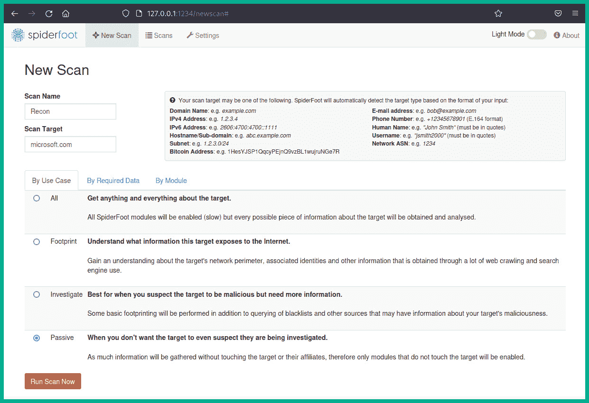
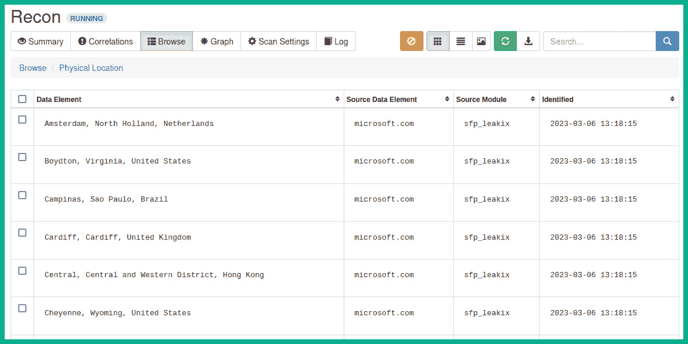

# 第四章：域名和 DNS 情报

随着互联网的不断发展，获取信息的途径越来越多。**开源情报**（**OSINT**）可以从任何公开可用的来源收集，比如互联网。黑客收集目标的 OSINT，以帮助改进他们的**战术、技术和程序**（**TTPs**）用于网络攻击和行动。因此，像道德黑客和渗透测试人员这样的网络安全专家，必须深入理解对手如何收集并利用 OSINT，而道德黑客则应使用相同的 TTPs 来帮助降低网络攻击或威胁的风险，并提高组织的网络防御。

在本章的学习过程中，您将了解并掌握道德黑客和渗透测试人员常用的技能，这些技能可以帮助您从各种在线资源中收集公开可用的信息，并使用流行的技术和工具高效地对组织进行概况分析。您将学习如何利用从互联网搜索引擎收集的数据，获取域名情报，识别组织的子域名，并执行**域名系统**（**DNS**）侦察。

在本章中，我们将涵盖以下主题：

+   利用搜索引擎收集 OSINT

+   域名情报

+   发现子域名

+   DNS 侦察

让我们深入了解吧！

# 技术要求

为了跟上本章的练习，请确保您已满足以下硬件和软件要求：

+   Kali Linux: [`www.kali.org/get-kali/`](https://www.kali.org/get-kali/)

# 利用搜索引擎收集 OSINT

互联网是世界上最大的网络，浏览和寻找资源有时会很具挑战性，特别是当我们不知道特定网站的域名或**统一资源定位符**（**URL**）时。为了帮助我们快速找到网站的正确域名，我们可以使用互联网搜索引擎。互联网搜索引擎会抓取并索引互联网上的一切，使得用户可以通过关键字进行互联网搜索，从而找到所有相关资源，同时提供安全的搜索结果。

如果没有互联网搜索引擎，一个人需要知道他们想访问的网页的正确域名、主机名或网址。例如，设想一个没有互联网搜索引擎的世界；每个人都需要保持一个最新的记录，包含每个新网站及其 IP 地址。如果一个组织更改了其域名，可能是因为重新品牌化，那么这些信息需要与所有互联网用户共享。然而，由于世界非常大，更新可能不会立即到达每个人，有些人可能会尝试连接到旧域名，而该域名可能无法解析到新域名或网站。

因此，互联网搜索引擎在互联网上扮演着重要角色，通过使用网页抓取工具（Web crawlers）抓取数十亿个域名、网站及其页面。网页抓取工具（也称为机器人或蜘蛛）使得互联网搜索引擎提供商能够浏览互联网、下载每个网页，并跟踪网页链接，以高效地发现互联网中新的可访问网站和页面。因此，互联网搜索引擎是帮助我们寻找和收集有关某个组织情报的工具。作为道德黑客，我们可以使用各种互联网搜索引擎来查找并收集有关目标组织的信息，并确定公司通过数据泄露所暴露的内容。

以下是常见的互联网搜索引擎：

+   Google: [`www.google.com/`](https://www.google.com/)

+   Yahoo!: [`www.yahoo.com/`](https://www.yahoo.com/)

+   Bing: [`www.bing.com/`](https://www.bing.com/)

+   DuckDuckGo: [`duckduckgo.com/`](https://duckduckgo.com/)

+   Yandex: [`yandex.com/`](https://yandex.com/)

重要提示

DuckDuckGo 搜索引擎注重隐私，不存储用户的互联网搜索记录，也不跟踪用户的浏览器。Yandex 是一个以俄罗斯为基础的搜索引擎，专注于亚洲和欧洲地区的内容。

一个典型的人可能会选择前述的某个互联网搜索引擎，使用关键词进行搜索，并很可能会点击搜索结果第一页上的链接。作为一名道德黑客，理解搜索结果的第一页通常基于搜索条件提供最准确的数据是非常重要的；然而，查看第二页及之后的页面会提供一些额外的信息，这些信息可能对我们了解目标非常有意义。由于互联网搜索引擎会收集和记录数据，因此检查所有搜索结果，找出与目标组织的任何关联是至关重要的。

此外，每个互联网搜索引擎都有自己独特的算法，决定它们如何抓取和索引互联网上的网站。作为一名道德黑客，仅使用一个互联网搜索引擎可能无法获得另一个搜索引擎所提供的相同结果。例如，如果你在寻找有关目标的特定数据，某个搜索引擎可能由于其算法的不同而无法提供这些数据，而另一个搜索引擎可能会提供。因此，建议始终使用多个互联网搜索引擎，收集并分析每个搜索引擎前 10 页的搜索结果。

在许多网站上，你会发现一个`robots.txt`文件，其中包含一个目录列表。网站管理员通常使用这个文件来允许或禁止互联网爬虫索引网站的特定目录。例如，如果网站管理员希望阻止互联网搜索引擎在搜索到组织的域名时索引和显示管理员门户网站，他们可以在`robots.txt`文件中插入一个`disallow /administrator/`的语句。

以下截图展示了一个示例`robots.txt`文件的内容：


图 4.1 – robots.txt 文件

如前面的截图所示，`robots.txt`文件似乎包含了一个敏感目录列表，这些目录不应出现在互联网搜索结果中。由于`robots.txt`文件在网站上是公开可见的，伦理黑客可以收集并分析其中的数据，从而发现目标的隐藏目录，这些目录可以用来规划未来的行动。此外，访问每个隐藏目录可能会导致发现组织暴露的额外数据泄露和资源。

然而，由于你将直接访问目标网站上的`robots.txt`文件，这属于一种主动侦察，目标将知道你已经接触到它。因此，强烈建议你在侦察阶段通过匿名化互联网流量来帮助隐藏你的在线身份，从而降低威胁等级。

## Google 黑客技术

**Google 黑客**（**dorking**）是伦理黑客常用的一种技术，利用 Google 的互联网搜索算法查找关于人、地点、组织以及互联网上其他事物的敏感信息。*Google 黑客*这一术语并不意味着我们实际上在以任何方式攻击 Google 的基础设施或系统；它仅仅是用来描述我们如何利用 Google 搜索引擎的强大功能，通过合法方式查找关于目标的具体细节。

例如，基于单一关键词搜索一个组织会得到数十亿条结果，如下截图所示：


图 4.2 – Google 搜索

作为一名伦理黑客，收集和分析在搜索结果第一页以及其他页面上找到的数据是非常重要的，这有助于建立更好的目标档案。然而，和 Google 上的任何典型互联网搜索一样，它提供的结果通常是与关键词相关的通用信息。

提示

确保在收集目标信息时，你没有登录到你的 Google 账号或 Chrome 浏览器中。

要执行 Google 黑客技术，了解如何使用高级 Google 搜索操作符来帮助我们过滤特定的结果是至关重要的。以下是常见的 Google 高级搜索操作符：

+   `-`（减号）—此符号用于从搜索结果中排除某个术语。例如，`cybersecurity -Cisco` 将提供包含 *cybersecurity* 的结果，但排除所有包含 *Cisco* 的条目。

+   `OR`—这是一个条件操作符，用于提供包含其中一个术语或另一个术语的结果。例如，`cybersecurity OR networking` 将提供包含 *cybersecurity* 或 *networking* 的结果。

+   `AND`—此条件操作符用于提供包含两个术语的结果。例如，`football AND england` 将返回同时包含这两个关键字的结果。

+   `intitle:`—此操作符用于搜索包含特定术语的标题页面。例如，`intitle: administrator` 将搜索所有在标题中包含 *administrator* 的网站，并返回这些结果。

+   `inurl:`—此操作符用于搜索包含特定关键字的 URL。例如，`inurl:security` 将提供所有包含 *security* 关键字的 URL。

+   `intext:`—此操作符使 Google 可以检查特定关键字是否出现在网站的正文中，并仅提供这些网站的结果。例如，`intext:cryptocurrency` 提供包含 *cryptocurrency* 这个词的网页结果。

+   `ext:** / **filetype:`—这些操作符用于指定文件扩展名。例如，`cybersecurity filetype:pdf` 将提供包含 *cybersecurity* 且为 PDF 文件的结果。

+   `site:`—此操作符用于提供特定域名的结果。例如，`site:microsoft.com` 将仅提供 [microsoft.com](http://microsoft.com) 的结果。

+   `before:** **yyyy-mm-dd`—此操作符用于筛选特定时间之前的结果。如果你有兴趣查找某个时间之前发布的结果或数据，这是非常有用的。

+   `after:** **yyyy-mm-dd`—此操作符用于筛选特定时间之后的结果。如果你有兴趣查找某个时间之后发布的结果或数据，这是非常有用的。

+   `*`（星号）—此操作符作为通配符，用于匹配任何关键字。例如，`cyber *` 将显示以 *cyber* 开头的任何内容。

+   `Keyword1 keyword2`—此搜索格式用于提供包含特定关键字的结果。例如，`cybersecurity microsoft` 提供这些相关术语的结果。

+   `" "`（引号）—引号用于包含特定的搜索词，例如 `"****John Doe"`。

以下是使用 Google 高级搜索操作符收集目标情报的常见场景：

+   假设你想筛选仅针对特定域名的 Google 结果。使用 `site:domain-name` 语法将提供以下结果：


图 4.3 – 筛选特定域名

+   假设你有兴趣在特定域名（如微软网站）上搜索特定的安全漏洞。使用`printnightmare site:microsoft.com`语法会提供微软网站上`PrintNightmare`的相关结果：


图 4.4 – 结合关键词与站点操作符

+   如果你有兴趣在目标网站上查找客户门户，使用`customer AND login site:domain-name`语法可以过滤搜索结果，在特定域名上查找客户和登录信息，如下图所示：


图 4.5 – 在域名上查找客户门户

+   如果你在查找特定域名上的登录门户，使用`"login" site:domain-name`语法会过滤带有关键词*login*的结果，如下图所示：


图 4.6 – 查找登录门户

+   假设你有兴趣查找特定域名上的文件类型。使用`site:domain-name filetype:txt`或`site:domain-name filetype:pdf`可以过滤 Google 搜索结果，如下图所示：


图 4.7 – 在域名上搜索文件类型

+   假设你有兴趣查找包含*login*一词的所有网站标题，针对特定域名，可以使用`site:domain-name intitle:login`语法，如下图所示：


图 4.8 – 查找登录门户

+   要查找组织的子域名，可以使用`site:domain-name -www`语法来排除`www`参数，如下图所示：


图 4.9 – 查找子域名

提示

此外，你可以使用`site:*.domain.com -site:www.domain.com`的 Google dork 语法来查找目标的子域名。例如，如果你想查找*microsoft.com*的子域名，使用`site:*.microsoft.com -site:www.microsoft.com`语法会过滤 Google 搜索结果。

谷歌高级搜索操作符的多种组合可以为我们提供独特的结果。为了帮助用户更容易地掌握谷歌的高级搜索操作符，谷歌在其主要搜索页面上提供了一个**高级搜索**功能，减少了使用特定高级搜索操作符的需求。

要访问谷歌的**高级搜索**功能，请按照以下说明操作：

1.  访问谷歌首页 [`www.google.com/`](https://www.google.com/) 并点击**设置**，如图所示：


图 4.10 – 谷歌首页

1.  接下来，点击**高级搜索**，如图所示：


图 4.11 – 高级搜索

1.  最后，你将访问**高级搜索**菜单，该菜单提供了许多字段，帮助你执行高级 Google 搜索，以下截图展示了这一点：


图 4.12 – Google 高级搜索菜单

此外，`Exploit Database` ([`www.exploit-db.com/`](https://www.exploit-db.com/)) 管理着**Google Hacking 数据库**（**GHDB**），这是一个公开的高级 Google 搜索运算符和组合的存储库，旨在查找互联网上暴露的系统和资源。GHDB 可以在 [`www.exploit-db.com/google-hacking-database`](https://www.exploit-db.com/google-hacking-database) 找到。

以下截图展示了 GHDB 中找到的一些 Google dork 示例：


图 4.13 – GHDB

如前面的截图所示，每个 Google dork 都可以用来查找互联网上暴露的敏感系统和文件。在使用 Google 黑客技术时，请务必小心谨慎。请勿将你找到的信息用于恶意目的或对系统或网络造成伤害。

重要提示

作为一名道德黑客，Google dork 可以帮助你找到公开暴露的包含用户名结构元数据的文档，这让你能进一步了解目标组织是如何创建用户名的。

完成本节后，你已经学会了如何使用互联网搜索引擎收集目标情报。在接下来的章节中，你将学习如何收集域名情报。

# 域名情报

域名情报主要关注收集和分析目标组织的域名注册详情和 DNS 记录，以识别它们的系统、网络基础设施和攻击面。随着互联网的不断扩展，注册的域名数量也在增加，因为越来越多的组织创建在线存在，旨在将市场拓展到全球新客户。此外，任何人都可以轻松地在互联网上注册一个公共域名，并将该命名空间用于个人用途。域名已经存在了相当长的时间，它们帮助我们轻松访问互联网上的网站。例如，想象一下如果每个人都需要知道并记录他们想访问的每个网站的 IP 地址，那会是多么具有挑战性。如果 IP 地址未知，用户将不知道如何连接到目标网站。类似于邮政服务，如果目的地地址未知，那么快递员将无法递送信件。

域名是易记地址，在互联网上唯一，帮助我们访问像[google.com](http://google.com)和[amazon.com](http://amazon.com)这样的网站。然而，域名是通常映射到网络设备的 IP 地址的唯一字符串。域名通常以**顶级域**（**TLD**）结尾，如`.com`、`.net`、`.org`等等。不同的根 DNS 服务器由**互联网数字分配机构**（**IANA**）管理。例如，`.com`根 DNS 服务器将包含所有具有`.com`TLD 的域名及其相关 IP 地址的记录。因此，如果用户想要检索[www.google.com](http://www.google.com)的 IP 地址，他们将需要查询`.com`根 DNS 服务器，该服务器会搜索其数据库中关于[google.com](http://google.com)的所有记录。一旦在 DNS 服务器中找到[google.com](http://google.com)域名，服务器然后搜索`www`记录及其相关 IP 地址，并响应给用户的计算机。你可以将 DNS 服务器视为包含许多主机名及其相关 IP 地址记录的非常大的目录，这有助于全球许多人轻松连接到他们的目标网站和服务器。

重要提示

DNS 是一种常见的网络协议，允许设备将主机名解析为 IP 地址。DNS 在**用户数据报协议**（**UDP**）端口`53`上运行，用于处理客户端和 DNS 服务器之间的 DNS 查询和响应。然而，DNS 服务器还使用**传输控制协议**（**TCP**）端口`53`用于记录的区域传输，从一个 DNS 服务器到另一个 DNS 服务器。

下图展示了根 DNS 服务器的概念：


图 4.14 – 根 DNS 服务器结构

在使用 DNS 服务器解析域名之前，每台计算机都使用一个包含主机名及其相关 IP 地址列表的`Hosts`文件。这个`Hosts`文件需要频繁更新以确保拥有最新的记录。然而，在所有客户端计算机上管理此文件变得非常具有挑战性，因此使用 DNS 服务器来克服这个问题。然而，在基于 Windows 的操作系统上，`Hosts`文件可以在`C:\Windows\System32\drivers\etc`文件夹目录中找到。然而，当计算机连接到网络时，**动态主机配置协议**（**DHCP**）服务器通常会为客户端提供网络的 DNS 服务器 IP 地址。因此，客户端设备的主机操作系统不再查询`Hosts`文件，而是将所有 DNS 查询发送到 DNS 服务器。

下图显示了 Windows 11 操作系统的`Hosts`文件内容：


图 4.15 – Hosts 文件

如上图所示，该文件最初创建是为了将主机名映射到 IP 地址。然而，所有的行默认都被注释掉，以防止操作系统访问其内容，包括默认条目。

以下是在执行 DNS 查询以获取主机名时的一般步骤：

1.  当用户在其网页浏览器的地址栏中输入域名或主机名时，客户端设备会检查其本地 DNS 缓存，查找是否有匹配的先前条目。如果未找到任何匹配的条目，客户端设备将向首选 DNS 服务器发送 DNS 查询，如下图所示：


图 4.16 – DNS 查询

提示

`ipconfig /displaydns` 命令将在基于 Windows 的操作系统上显示本地 DNS 缓存。

1.  DNS 服务器将检查其本地数据库中的请求记录，并向客户端设备返回 DNS 响应，包含该主机名的 IP 地址，如下图所示：


图 4.17 – DNS 响应

1.  当客户端设备收到 IP 地址时，它会将其作为目标 IP 地址插入到 IP 数据包的**第 3 层**头部，并通过网络发送出去，建立与目标 Web 服务器的连接，如下图所示：


图 4.18 – 连接到目标服务器

域名所有者和 DNS 服务器管理员可以为一个域创建各种类型的 DNS 记录，例如以下几种：

+   `A`：此记录将主机名映射到 IPv4 地址

+   `AAAA`：此记录将主机名映射到 IPv6 地址

+   `MX`：此记录用于指定域的（电子）邮件交换服务器

+   `NS`：包含该域的名称服务器

+   `CNAME`：指定域名或子域的规范名称（别名）

+   `PTR`：用于将 IP 地址解析为主机名

+   `RP`：用于指定域名的责任人

+   `TXT`：此记录允许域名所有者指定文本记录，通常用于验证域名所有权

+   `SRV`：用于指定服务端口

+   `SOA`：此记录用于存储有关域的管理信息

公共 DNS 服务器对互联网用户开放，通常包含许多注册域名的 DNS 记录副本。作为一名道德黑客或渗透测试员，你可以利用域名注册信息和 DNS 记录帮助你更好地了解目标的网络基础设施、公开可用的服务器以及目标所拥有的其他资产。

下图展示了用于收集域名情报的关键领域的视觉思维导图：


图 4.19 – 域名情报思维导图

如上图所示，伦理黑客可以从公共 WHOIS 数据库收集域名注册详情，使用各种工具和互联网搜索引擎识别子域名，并从公共 DNS 服务器检索 DNS 记录。

## 使用 WHOIS 数据库

在互联网上注册一个域名是一个相当简单的过程。用户访问在线域名注册商，检查所选域名是否可用，并注册该域名数年。在注册过程中，域名注册商会收集大量关于新域名所有者的**个人可识别信息**（**PII**），例如以下内容：

+   全名

+   物理地址

+   电子邮件地址

+   电话号码

+   手机号码

+   组织名称

通过在互联网上注册一个域名，注册信息默认是公开的，任何人都可以识别域名的所有者及其他敏感信息。然而，许多域名注册商提供附加的付费服务，以在租期内保持注册信息的私密性。此外，在注册过程中，许多人和组织会选择支付额外费用来保护隐私，确保域名注册信息保持私密。然而，并非每个人都会选择支付额外的隐私保护费用，这导致他们的注册信息暴露在互联网上。

作为伦理黑客，你可以利用在 WHOIS 数据库中找到的信息来创建目标的个人资料，识别他们的联系信息和实际位置。以下是一些公共的 WHOIS 数据库：

+   [`who.is/`](https://who.is/)

+   [`www.whois.com/whois/`](https://www.whois.com/whois/)

+   [`whois.domaintools.com/`](https://whois.domaintools.com/)

上述列表只是众多公共 WHOIS 在线数据库中的一部分。在进行 WHOIS 查询时，重要的是要在多个 WHOIS 数据库中查询目标域名，以确保信息的准确性和可用性。

要开始进行 WHOIS 查询并获取域名注册信息，请按以下说明操作：

1.  首先，启动你的`Kali Linux`虚拟机，并验证其是否能够连接互联网。

1.  接下来，打开 Kali Linux 上的终端，使用`whois`命令，如下所示：

    ```
    kali@kali:~$ whois apple.com
    ```

以下截图显示了目标域名的`whois`响应：


图 4.20 – whois 响应

如上截图所示，`whois`工具尝试检索所有域名注册详情，如域名注册周期、名称服务器、所有者的个人信息以及他们的联系信息。然而，域名所有者启用了域名隐私保护，防止其注册信息暴露在互联网上。

1.  接下来，在 Kali Linux 中打开 Web 浏览器，转到[`mxtoolbox.com/Whois.aspx`](https://mxtoolbox.com/Whois.aspx)，并输入一个目标域名，如下面的屏幕截图所示：


图 4.21 – MXToolbox Whois 查询

如下面的屏幕截图所示，MXToolbox WHOIS 数据库提供了该域的名称服务器和注册详细信息：


图 4.22 – WHOIS 结果

大多数组织会选择支付额外费用，以确保其注册详细信息对互联网用户保持私密。然而，进行 WHOIS 查询是一个很好的做法，因为您可能会发现一些有趣的内容，帮助您规划未来的道德黑客操作。

## 用于侦察的 nslookup

`nslookup`工具是一个流行的网络管理工具，内置在许多操作系统中，如 Windows 和 Linux，并使 IT 专业人员能够在网络上解决 DNS 问题。作为一名道德黑客，您可以利用`nslookup`从目标 DNS 服务器和互联网上其他公开可用的 DNS 服务器中检索域信息的功能。

要开始学习如何使用`nslookup`，请使用以下说明：

1.  首先，启动`Kali Linux`虚拟机，并确保它具有互联网连接。

1.  接下来，在 Kali Linux 上打开终端并执行`nslookup`命令。执行命令后，终端提示符将更改，并且终端上的所有查询将发送到 Kali Linux 上配置的 DNS 服务器的 IP 地址。

1.  要将当前服务器更改为谷歌的 DNS 服务器，请使用`server 8.8.8.8`命令。此命令将把终端上执行的所有 DNS 查询发送到谷歌的 DNS 服务器。

1.  接下来，输入一个域名，如[amazon.com](http://amazon.com)进行查询，如下面的屏幕截图所示：


图 4.23 – nslookup 工具

如前面的屏幕截图所示，`nslookup`将 DNS 查询发送到`8.8.8.8`（谷歌的 DNS 服务器），检索域名的 DNS `A`记录，并显示其 Web 服务器的公共 IPv4 地址。

重要提示

非权威答案意味着信息是从原始 DNS 记录的服务器之外的 DNS 服务器检索的。非权威 DNS 服务器通常具有原始 DNS 记录的缓存副本。

1.  接下来，使用`set type=mx`命令更改查询类型，并再次输入目标域以检索电子邮件服务器信息：


图 4.24 – 检索电子邮件服务器信息

如前面的屏幕截图所示，找到了电子邮件服务器的主机名。

1.  要将电子邮件服务器主机名解析为 IP 地址，请使用 `set type=a` 命令，然后输入电子邮件服务器的主机名，如下图所示：


图 4.25 – 将主机名解析为 IP 地址

如前面的截图所示，电子邮件服务器的公共 IPv4 地址是从公共 DNS 服务器检索到的。因此，了解在 DNS 服务器上创建的记录类型以及道德黑客如何收集和分析此类信息以创建有关目标的概要是很重要的。

# 发现子域名

子域名用于组织和开发域名的分层结构，例如将父域名分成可以由 IT 专业人员轻松管理的较小部分。此外，通过向现有父域名添加前缀值，可以轻松创建子域名。例如，谷歌拥有 [google.com](http://google.com) 域名，并创建了 [mail.google.com](http://mail.google.com) 作为指向其在线电子邮件平台的子域名。这意味着子域名可以拥有自己的 IP 地址、内容和托管服务器，并可以与父域名分开管理。

作为一名道德黑客，发现目标的子域名很重要，因为它们在侦察阶段可以提供有价值的信息。它们可以帮助您识别额外的系统和网络基础设施，并确定目标的安全状况。此外，您可以扩大攻击面，发现可能导致攻击目标并获得立足点的安全漏洞。此外，道德黑客可以伪造看起来合法的子域名，出现在社会工程攻击中的目标域名中，欺骗员工透露诸如用户凭据甚至在公司拥有的系统上下载恶意软件等敏感细节。

## 证书搜索

**证书搜索**是一个在线数据库，收集来自公开可用且在互联网上找到的数字证书的信息。数字证书使用户能够验证不受信任网络（如互联网）上系统的真实性。例如，黑客可以轻松在互联网上建立虚假网站，对受害者进行社会工程攻击，比如诱使某人透露其在线账户的用户凭据。数字证书用于帮助用户验证网站或设备的身份，同时识别证书颁发者、组织及其位置。

请记住，数字证书在电子商务中扮演重要角色，因为它们用于帮助提高在线交易和通信的安全性，以确保用户的网络浏览器和服务器之间传输的所有数据都是加密的，从而确保加密数据只能被预期的接收者解密。

数字证书通常由互联网上的第三方可信组织**证书颁发机构**（**CA**）颁发。CA 负责验证证书持有者的身份；因此，颁发的证书包含以下数据：

+   **主题名称**—此字段包含将使用证书的实体名称。该实体可以是个人、网站、服务器或组织。

+   **公钥**—此字段包含将与实体一起使用的公钥，用于在客户端和服务器之间执行数据加密。

+   **颁发者名称**—此字段包含颁发证书的 CA 的名称。

+   **有效期日期**—此字段表示证书的有效期，超过该期限后，若证书未被实体/证书持有者续订，则证书将过期并变得不可信。

+   **证书序列号**—序列号是由 CA 分配的唯一值，用于识别证书。

+   **签名算法**—此字段包含 CA 用来对证书进行数字签名的加密算法。

+   **指纹**—此字段包含用于验证的**唯一标识符**（**UID**）值。

以下截图显示了[www.amazon.com](http://www.amazon.com)数字证书的一般信息：


图 4.26 – 证书详情

如前述截图所示，任何人都可以识别 CA 为 DigiCert Global Root CA，中间 CA 为 DigiCert Global CA GA，证书持有者为[www.amazon.com](http://www.amazon.com)，以及其详细信息。此外，**主题备用名称**字段表示此数字证书可以与此字段中列出的附加子域一起使用。作为一名道德黑客，这个字段帮助我们轻松发现目标组织的其他子域，这可能为我们提供更多的潜在攻击入口。

证书搜索可以帮助我们通过被动侦察有效地发现组织的数字证书。要开始使用证书搜索作为在线 OSINT 工具来发现组织的子域，请按以下说明操作：

1.  在你的计算机或 Kali Linux [虚拟机](https://crt.sh/)上打开浏览器，访问证书搜索的官方网站[`crt.sh/`](https://crt.sh/)。

1.  网站加载完成后，输入公共域名并点击**搜索**按钮，如下图所示：


图 4.27 – 证书搜索

如前述截图所示，证书搜索允许任何人输入身份信息，如域名、组织名称或证书指纹。

1.  接下来，证书搜索将从其数据库中返回所有结果，显示所有包含`apple.com`作为域名及其子域的数字证书：


图 4.28 – 证书结果

如前面的截图所示，结果包含`crt.sh` ID、日志日期、有效期、**通用名称**（**CN**）、匹配的身份信息及其他详细信息。**匹配身份信息**字段显示了组织的子域名；这些主机名可以使用 DNS 协议轻松解析为 IP 地址。

1.  接下来，点击任意`crt.sh` ID 以查看数字证书的详细信息：


图 4.29 – 证书详情

如前面的截图所示，数字证书包含有关组织的位置信息，可以用来找到公司所在地的物理位置。在进行黑箱渗透测试时，这类信息尤其重要，特别是当道德黑客或渗透测试人员仅知道组织名称的情况下。道德黑客需要找到公司的准确物理位置，以便识别公司的无线网络和物理安全设施。

如前所示，证书搜索是一个有价值的资源，帮助我们发现与目标相关的数字证书，并显示它们的位置信息和子域名信息，这有助于道德黑客为目标创建一个详细的资料。接下来，您将学习如何使用 Kali Linux 上的 OSINT 工具发现子域名。

## 使用 Recon-ng

`Recon-ng` 是一个流行的开源侦察工具，帮助道德黑客和渗透测试人员收集和分析来自互联网上的 OSINT。该工具可用于识别组织是否泄露了敏感数据，这些数据可能被潜在威胁者在规划未来的网络攻击时加以利用。Recon-ng 提供了命令行界面，并包含多个模块，专为特定任务而设计，能够从各种数据源收集 OSINT。

以下是使用 Recon-ng 收集和分析 OSINT 的一些优势：

+   **自动化**—Recon-ng 可以自动化地从在线数据源收集 OSINT。

+   **模块**—有许多内置模块可以定制，以提供额外的功能和能力。

+   **数据管理**—Recon-ng 具备工具，帮助用户在侦查过程中高效地组织和管理收集的数据。

+   **报告**—有多个报告模块和功能，用户可以生成**超文本标记语言**（**HTML**）、**可扩展标记语言**（**XML**）和**逗号分隔值**（**CSV**）文件等格式的报告。

要开始使用 Recon-ng 发现和收集目标的子域名，请按照以下说明操作：

1.  首先，启动`Kali Linux`虚拟机，并确保它已连接到互联网。

1.  接下来，打开终端并执行以下命令启动 Recon-ng：

    ```
    kali@kali:~$ recon-ng
    ```

1.  接下来，Recon-ng 提供了一个在线市场，可以下载并安装额外的模块。要从市场安装所有模块，请使用以下命令：

    ```
    [recon-ng][default] > marketplace install all
    ```

以下截图显示了额外模块正在下载并安装到 Recon-ng 上：


图 4.30 – 安装模块

模块安装完成后，Recon-ng 会重新加载所有模块，并且你会看到类似于以下的许多警告信息：


图 4.31 – 缺少应用程序编程接口（API）密钥

如前面的截图所示，许多 Recon-ng 模块需要有效的 API 密钥才能与在线数据源通信，以查询和获取关于目标的数据。在稍后的步骤中，你将学习如何为各种 Recon-ng 模块添加 API 密钥。

1.  接下来，使用以下命令来显示 API 密钥及其关联的模块列表：

    ```
    [recon-ng][default] > keys list
    ```

如下图所示，默认情况下没有任何模块分配 API 密钥：


图 4.32 – 检查 API 密钥

1.  接下来，要获取 `BuiltWith` 的 API 密钥，请访问 [`builtwith.com/`](https://builtwith.com/) 并创建一个免费账户。创建账户后，登录并点击 `Tools** > **API** **Access` 来获取你的 API 密钥。

1.  接下来，要获取 `HunterIO` 的 API 密钥，请访问 [`hunter.io/`](https://hunter.io/) 并创建一个免费账户。登录后，点击你的个人资料并选择 `</> API` 来查看该平台的 API 密钥。

1.  重复前面的步骤，从`VirusTotal`获取 API 密钥，网址为 [`www.virustotal.com/`](https://www.virustotal.com/)，从`Censys`获取 API 密钥，网址为 [`search.censys.io/`](https://search.censys.io/)，以及从`Shodan`获取 API 密钥，网址为 [`www.shodan.io/`](https://www.shodan.io/)。你可以根据需要为 Recon-ng 上支持的模块获取额外的 API 密钥。

1.  接下来，要将 API 密钥添加到支持 API 的模块，请在 Recon-ng 上使用 **keys add <API 模块名称> <API 密钥值>** 命令——例如，`keys add** **builtwith_api 12345`。

1.  接下来，使用 `keys list` 命令验证 API 密钥是否已成功添加，如下图所示：


图 4.33 – 验证 API 密钥

1.  接下来，在收集目标数据时，保持你的物理和数字工作区的有序性是一个好习惯，这样在需要时可以轻松找到信息。因此，请使用以下命令在 Recon-ng 上创建一个数字工作区：

    ```
    [recon-ng][default] > workspaces create target1_recon
    ```

1.  接下来，使用以下命令查看 Recon-ng 中所有已创建工作区的列表：

    ```
    [recon-ng][target1_recon] > workspaces list
    ```

如下图所示，新的工作区已经创建，并且我们当前正在其中操作：


图 4.34 – 查看工作区

1.  接下来，让我们使用 `modules search` 命令来查找 `bing_domain` 模块，该模块将帮助我们识别目标的地理位置和子域：

    ```
    [recon-ng][target1_recon] > modules search bing_domain
    ```

以下截图显示识别并返回了两个模块：


图 4.35 – 搜索结果

1.  接下来，让我们使用 `recon/domains-hosts/bing_domain_web` 模块并显示其描述：

    ```
    [recon-ng][target1_recon] > modules load recon/domains-hosts/bing_domain_web
    ```

    ```
    [recon-ng][target1_recon][bing_domain_web] > info
    ```

下图展示了模块的描述以及使用该模块所需的选项：


图 4.36 – 显示模块描述

如上图所示，必须在使用模块收集互联网 OSINT 之前设置 `SOURCE` 值。

1.  接下来，让我们将 microsoft.com 设置为目标，并使用以下命令执行模块：

    ```
    [recon-ng][target1_recon][bing_domain_web] > options set SOURCE microsoft.com
    ```

    ```
    [recon-ng][target1_recon][bing_domain_web] > run
    ```

提示

要在模块中取消设置一个值，使用 `options unset <****parameter/value>` 命令。

以下截图显示模块已经开始收集有关目标域名的 OSINT：


图 4.37 – 运行模块

1.  一旦模块完成目标的 OSINT 收集，执行 `show hosts` 命令以查看收集的数据：


图 4.38 – 查看收集的数据

1.  要退出当前模块，输入 `back` 并按 *Enter* 键。

重要提示

`show` 命令可以与 `show** **[companies]** **[credentials] [hosts]** **[locations]** **[ports]** **[pushpins]** **[vulnerabilities] [contacts]** **[domains]** **[leaks]** **[netblocks]** **[profiles] [repositories]` 一起使用，以查看 Recon-ng 收集的特定信息。

1.  接下来，显示 Recon-ng 收集的所有 OSINT 的摘要：

    ```
    [recon-ng][target1_recon] > dashboard
    ```

1.  以下截图展示了 Recon-ng 执行并收集的活动摘要：


图 4.39 – Recon-ng 活动总结

1.  接下来，要使用 HTML 报告模块生成报告，请使用以下命令：

    ```
    [recon-ng][target1_recon] > modules load reporting/html
    ```

    ```
    [recon-ng][target1_recon][html] > info
    ```

    ```
    [recon-ng][target1_recon][html] > options set CREATOR Glen
    ```

    ```
    [recon-ng][target1_recon][html] > options set CUSTOMER NewCustomer1
    ```

    ```
    [recon-ng][target1_recon][html] > options set FILENAME /home/kali/Recon-Report1.html
    ```

    ```
    [recon-ng][target1_recon][html] > run
    ```

以下截图展示了前面命令的执行结果：


图 4.40 – 使用报告模块

如上图所示，生成的报告已存储在 `/****home/kali/` 目录中。

1.  要使用 Web 浏览器查看报告，打开一个新的终端并使用以下命令：

    ```
    kali@kali:~$ firefox /home/kali/Recon-Report1.html
    ```

以下截图展示了 HTML 版本的报告，其中包含有关目标域名的收集数据：


图 4.41 – HTML 报告

1.  最后，要访问 Recon-ng 的 Web 界面，打开一个新的终端并执行 `recon-web` 命令，然后打开 Web 浏览器并访问 `http://127.0.0.1:5000/`，如以下截图所示：


图 4.42 – Recon-ng 网络界面

完成此练习后，你已经掌握了使用 Recon-ng 收集和分析 OSINT 的基础知识。接下来，你将学习如何对目标进行 DNS 侦察。

# DNS 侦察

DNS 侦察是道德黑客和威胁行为者常用的一种技术，通过从互联网上的 DNS 服务器收集公开可用的信息来获取目标的相关资料。如果你记得的话，DNS 是一种网络协议，它允许系统将主机名解析为 IP 地址，互联网上有许多 DNS 服务器保存着关于各种注册域名的公共 DNS 记录。

作为一名道德黑客，DNS 侦察的重点是向目标拥有的 DNS 服务器或公共 DNS 服务器发送 DNS 查询，获取有关目标域名、IP 地址和子域名的 DNS 记录。收集到的响应将被分析，以识别关于目标的有价值信息，如其系统和网络架构、潜在的安全漏洞以及应用平台等。

在这一部分中，你将学习如何使用各种工具和技术来高效地收集和分析 DNS 信息，以创建目标的资料。

## 使用 DNSenum

`DNSenum` 是一个常用的 DNS 枚举工具，用于收集有关域名的开源情报（OSINT）。它通过向 DNS 服务器发送各种查询，获取目标域名、IP 地址、邮件服务器、名称服务器和子域名等信息。

要开始使用 DNSenum 收集目标域名的 DNS 信息，请按照以下说明操作：

1.  首先，启动 `Kali Linux` 虚拟机，并确保其能够连接到互联网。

1.  接下来，打开终端并使用以下命令查询 Google 的 DNS 服务器，获取属于 `apple.com` 的 DNS 记录：

    ```
    kali@kali:~$ dnsenum --dnsserver 8.8.8.8 apple.com
    ```

如下图所示，DNSenum 正在尝试检索目标域名的所有 DNS 记录类型和名称服务器：


图 4.43 – DNSenum 输出

如前图所示，DNSenum 成功检索到了目标网站服务器、名称服务器和邮件服务器的公共 IP 地址。

1.  一旦 DNSenum 收集到一般的 DNS 记录细节，它将自动尝试使用默认的字典列表进行子域名枚举，以识别目标的常见子域名，如下图所示：


图 4.44 – 子域名枚举

如前图所示，DNSenum 通过对 Google 的 DNS 服务器进行暴力破解查询，成功枚举出目标的多个子域名。

完成此练习后，你已经学会了如何从公共 DNS 服务器自动化收集目标的 DNS 记录。接下来，你将学习如何使用 DNSRecon 进行 DNS 侦察。

## 使用 DNSRecon

`DNSRecon`是另一种常见的 DNS 侦察工具，使伦理黑客和渗透测试人员能够发现目标域名的 DNS 记录。该工具帮助自动化从公共 DNS 服务器检索关于特定域名的各种 DNS 记录的过程。

要开始使用 DNSRecon，请按照以下说明操作：

1.  首先，启动`Kali Linux`虚拟机，并确保其具有互联网连接。

1.  接下来，打开终端，使用以下命令查询 Google 的 DNS 服务器以获取`apple.com`的 DNS 记录：

    ```
    kali@kali:~$ dnsrecon -d apple.com -n 8.8.8.8
    ```

如下图所示，DNSRecon 能够检索目标的公共 DNS 记录：


图 4.45 – DNSRecon 输出

如前面的截图所示，DNSRecon 能够检索各种类型的 DNS 记录，例如`A`、`AAAA`、`MX`、`TXT`、`NS`等。

1.  最后，DNSRecon 尝试自动枚举目标域名的`SRV`记录，如下图所示：


图 4.46 – 枚举 SRV 记录

完成此练习后，你已学习如何使用 DNSRecon 工具枚举 DNS 记录，以查找目标的子域名和 IP 地址。接下来，你将学习如何在配置错误的 DNS 服务器上执行 DNS 区域传输。

## 执行 DNS 区域传输

如你所学，DNS 服务器在内部网络和互联网上都扮演着重要角色。DNS 区域传输是将 DNS 区域的记录或整个内容从主 DNS 服务器复制到另一个 DNS 服务器的过程。DNS 区域传输用于确保主 DNS 服务器与次级 DNS 服务器之间的 DNS 数据同步。然而，主（主控）DNS 服务器保存主区域记录，而次级 DNS 服务器保存相同区域记录文件的副本。每当主 DNS 服务器上的主区域记录发生变化时，次级 DNS 服务器也需要更新其区域记录副本，因此需要在 DNS 服务器之间进行 DNS 区域传输。

然而，如果 DNS 服务器在网络或互联网上配置错误，伦理黑客可以尝试复制一个组织的主区域记录，以识别目标资产上的安全漏洞。想象一下，如果一个目标组织在其 DNS 服务器上没有分隔内部和外部命名空间。如果 DNS 区域传输是可能的，伦理黑客将能够检索关于组织内部系统和外部系统的信息。请记住，在尝试对客户的 DNS 服务器执行 DNS 区域传输之前，确保伦理黑客已获得明确许可是非常重要的。

重要提示

*DigiNinja*（[`digi.ninja`](https://digi.ninja)）的团队创建了一个易受攻击的 DNS 服务器环境，用于学习 DNS 区域传输如何影响组织，并创建了 [zonetransfer.me](http://zonetransfer.me) 域，该域包含一个 DNS 区域传输安全漏洞。

要开始学习如何在易受攻击的 DNS 服务器上执行 DNS 区域传输，请使用以下说明：

1.  首先，启动 `Kali Linux` 虚拟机，并确保其可以连接到互联网。

1.  接下来，在 Kali Linux 上打开终端并执行以下命令，以发现 `zonetransfer.me` 域的 DNS 记录：

    ```
    kali@kali:~$ host zonetransfer.me
    ```

以下截图显示了目标域名的 DNS `A` 记录和 `MX` 记录：


图 4.47 – 查找 DNS 记录

1.  接下来，使用以下命令来获取目标域名的名称服务器：

    ```
    kali@kali:~$ host -t ns zonetransfer.me
    ```

以下截图显示了目标域的名称服务器已找到：


图 4.48 – 获取名称服务器

如前所示的截图，以下是该域的两个名称服务器：

+   `nsztm2.digi.ninja`

+   `nsztm1.digi.ninja`

作为道德黑客，我们可以使用这两个名称服务器来确定目标域是否泄露了区域记录。

1.  接下来，让我们使用新发现的名称服务器之一查询目标域名：

    ```
    kali@kali:~$ host -l zonetransfer.me nsztm1.digi.ninja
    ```

以下截图显示了从 `nsztm1.digi.ninja` 名称服务器为 `zonetransfer.me` 域名检索的 DNS 记录：


图 4.49 – DNS 记录

如前所示的截图，结果中发现了许多敏感和有趣的主机名。这些主机名和 IP 地址可能并非组织故意公开；然而，这些信息可以被道德黑客利用，以扩展攻击面。

重要提示

在进行 DNS 侦察和区域传输时，确保查询目标域的所有名称服务器，因为某个服务器可能与其他服务器相比缺乏适当的安全配置。

1.  接下来，让我们使用 `DNSenum` 自动化目标域名的 DNS 区域传输过程：

    ```
    kali@kali:~$ dnsenum zonetransfer.me
    ```

以下截图显示 DNSenum 成功从目标的易受攻击 `nsztm2.digi.ninja` 名称服务器执行了 DNS 区域传输：


图 4.50 – DNS 区域传输

此外，DNSenum 能够从易受攻击的 DNS 服务器中检索到更多有趣的记录：


图 4.51 – 区域记录

从区域传输收集到的信息可以帮助道德黑客识别目标组织的网络基础设施，例如系统的主机名及其 IP 地址。完成此练习后，您已经学习了如何在易受攻击的 DNS 服务器上执行 DNS 区域传输。接下来，您将了解 SpiderFoot 如何在渗透测试的侦察阶段帮助道德黑客。

## 探索 SpiderFoot

`SpiderFoot`是一款流行的 OSINT 工具，广泛应用于网络安全专业人士的侦察、**威胁情报**（**TI**）和调查工作。SpiderFoot 可以帮助道德黑客自动化从互联网各类数据源收集 OSINT。例如，SpiderFoot 通过收集来自各种互联网搜索引擎、社交媒体平台、DNS 记录、WHOIS 数据库和其他公开可用的来源的数据来运作。然后，SpiderFoot 将整理收集到的数据，并以帮助道德黑客轻松分析的方式呈现信息。

重要提示

要了解更多关于 SpiderFoot 项目的信息，请访问[`github.com/smicallef/spiderfoot`](https://github.com/smicallef/spiderfoot)。

要开始使用 SpiderFoot 进行侦察，请按照以下说明操作：

1.  首先，打开`Kali Linux`虚拟机并确保它可以连接到互联网。

1.  接下来，在 Kali Linux 中打开终端并执行以下命令以启动 SpiderFoot 网页界面：

    ```
    kali@kali:~$ spiderfoot -l 0.0.0.0:1234
    ```

以下截图显示了 SpiderFoot 的网页界面已启动：


图 4.52 – 启动 SpiderFoot 的网页界面

1.  接下来，在 Kali Linux 中的网页浏览器中访问`http://127.0.0.1:1234`以进入网页界面。

1.  接下来，点击**新扫描**，设置**扫描名称**，设置**扫描目标**，选择**被动**，然后点击**立即开始扫描**，如以下截图所示：



图 4.53 – 设置新扫描

1.  接下来，扫描将开始，SpiderFoot 将自动用收集到的 OSINT 填充扫描进度，如以下截图所示：


图 4.54 – 汇总数据

1.  接下来，选择当前扫描中的**浏览**子标签，将显示每种工件类型收集的数据元素数量：


图 4.55 – 查看工件数据

1.  接下来，选择**互联网名称**工件，以查看目标域名的子域名列表：


图 4.56 – 查看子域名

1.  接下来，点击**浏览** > **物理位置**以查看目标的地理位置数据列表：



图 4.57 – 地理位置

扫描完成后，确保访问所有文物类别，查看所有收集的关于目标的开放源情报（OSINT），以改进目标资料，并识别任何可以利用的安全漏洞，以便获取立足点。

完成本节内容后，您已学习如何使用各种工具和技术高效地发现目标的敏感信息，如其主机名、IP 地址，甚至地理位置。

# 总结

在本章中，您已学习如何利用互联网搜索引擎发现关于组织的敏感信息。此外，您还获得了实际操作技能，能够使用 Google 黑客技巧来查找公司的有趣域名和子域名。您还探索了如何使用各种技术和工具来发现和收集域名、子域名和 DNS 信息的开放源情报（OSINT）。

希望本章内容对您有所帮助，并对您在网络安全行业的旅程有所启发。在下一章《*组织基础设施情报*》中，您将获得识别目标组织网络和基础设施的实践技能。

# 深入阅读

+   DNS 服务器: [`www.cloudflare.com/learning/dns/what-is-a-dns-server/`](https://www.cloudflare.com/learning/dns/what-is-a-dns-server/)

+   DNS 记录: [`www.cloudflare.com/learning/dns/dns-records/`](https://www.cloudflare.com/learning/dns/dns-records/)

)

+   SpiderFoot: [`github.com/smicallef/spiderfoot`](https://github.com/smicallef/spiderfoot)
