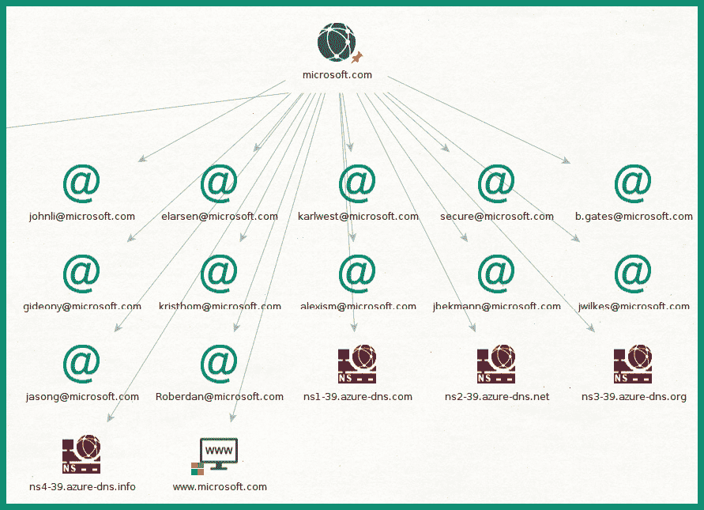

# 第五章：组织基础设施情报

随着越来越多的系统和网络连接到互联网，全球范围内有更多的数据和信息公开可用。有时，组织会无意间泄露关于其资产和网络基础设施的数据，这使得威胁行为者能够有策略地收集并分析这些数据泄漏，以规划他们未来对目标的攻击。作为一名有抱负的伦理黑客，了解威胁行为者常用的**战术、技术和程序**（**TTPs**）非常重要，了解这些知识可以帮助组织保护其基础设施，减少攻击面，从而防止真实的黑客入侵他们的系统和网络。

在本章中，你将学习如何使用各种在线和离线工具，利用**开放源代码情报**（**OSINT**）技术从互联网上收集数据，以识别组织的基础设施。此外，你还将发现伦理黑客和威胁行为者是如何发现互联网中暴露的脆弱系统和设备，并更好地理解攻击者是如何进入目标网络并取得立足点的。

在本章中，我们将涵盖以下主题：

+   从互联网上收集数据

+   发现暴露的系统

+   收集社交媒体上的 OSINT

让我们深入了解吧！

# 技术要求

要跟随本章的练习，请确保你已满足以下硬件和软件要求：

+   Kali Linux: [`www.kali.org/get-kali/`](https://www.kali.org/get-kali/)

+   Trace Labs OSINT 虚拟机: [`www.tracelabs.org/initiatives/osint-vm`](https://www.tracelabs.org/initiatives/osint-vm)

+   Sherlock: [`github.com/sherlock-project/sherlock`](https://github.com/sherlock-project/sherlock)

# 从互联网上收集数据

互联网包含了大量的网站、开放数据库和存储有关人员、网络和组织数据的服务器。在对目标发起网络攻击之前，攻击者会花费足够的时间进行目标研究，以更好地了解其基础设施，并识别任何可以被利用的安全漏洞，从而获得立足点。攻击者从多个数据源收集并分析**开放源代码情报**（**OSINT**），以创建目标的档案，这有助于识别目标主机、服务器、操作系统、网络信息、IP 地址、地理位置、子域名等。这些信息在规划网络攻击时非常有用，因为它使攻击者能够确定目标组织的攻击面。

作为一名具有良好道德指南针和意图的伦理黑客，使用与对手相同的 TTP（战术、技术和程序），有助于组织识别它们如何有意或无意地泄露有关其基础设施的敏感数据，以及攻击者如何利用从数据泄露中收集的相同信息来破坏其系统和网络。

以下是一些流行的网站和开放数据库，用于收集信息：

+   [www.netcraft.com:](http://www.netcraft.com:) 识别服务器、其主机操作系统和 Web 应用程序

+   [www.shodan.io:](http://www.shodan.io:) 识别服务器和**物联网**（**IoT**）设备

+   [censys.io:](http://censys.io:) 识别服务器和其他连接系统的攻击面

+   [hunter.io:](http://hunter.io:) 识别员工的电子邮件地址

+   [urlscan.io:](http://urlscan.io:) 识别 Web 应用程序和 Web 服务器

+   [intelx.io:](http://intelx.io:) 从多个数据源收集开源情报（OSINT）

+   [www.wigle.net:](http://www.wigle.net:) 识别全球的无线网络

+   [fullhunt.io:](http://fullhunt.io:) 收集攻击面数据

+   [vulners.com:](http://vulners.com:) 一个用于安全情报和漏洞搜索的引擎

+   [viz.greynoise.io:](http://viz.greynoise.io:) 识别威胁情报

+   [builtwith.com:](http://builtwith.com:) 识别域名的网络基础设施

上述搜索引擎列表将在你作为伦理黑客执行被动信息收集时，成为你工具和资源库中的重要组成部分。确保花时间访问这些网站，以更好地理解它们的工作原理以及它们提供的有关目标的数据类型。

在接下来的几个子章节中，你将学习如何使用 Netcraft 和 Maltego 来收集和分析关于一个组织的开源情报（OSINT）。

## Netcraft

`Netcraft` 提供多种互联网安全服务，收集并分析互联网上各类系统和网络的数据。网络安全专业人士如伦理黑客和渗透测试人员常用的最受欢迎的服务之一是`Web Server Survey` 工具，有时在 Netcraft 网站上被称为**站点报告**工具。此工具使任何人都能识别网站服务器的技术和使用情况、其 Web 应用程序、主机操作系统、软件版本、托管服务提供商以及网络块。

Netcraft 提供关于目标域名及其 Web 服务器的以下数据：

+   `Background`: 提供有关网站标题、排名、描述以及其首次出现在互联网上的时间的信息

+   `Network`: 提供有关 IPv4 和 IPv6 地址、网络块所有者、托管服务提供商和国家、名称服务器以及域名注册商的详细信息

+   `IP delegation`: 包含有关域名的 IP 地址分配的信息

+   `IP Geolocation`: 提供有关域名及其关联 IP 地址的地理位置详细信息，如城市和国家

+   `SSL/TLS`：提供有关域名数字证书的信息

+   **站点技术**：提供有关 Web 服务器上 Web 技术的信息

+   **主机历史**：提供有关网络块所有者、Web 应用程序的名称、主机操作系统以及 Web 服务器的 IP 地址的信息

虽然 Netcraft 提供的数据旨在帮助 IT 和网络安全专业人员改善组织的安全态势，但威胁行为者也可以利用这些信息进行恶意活动并策划对目标的未来攻击。然而，作为一名道德黑客，你也可以利用 Netcraft 提供的信息帮助你更好地了解有关你组织 Web 服务器和基础设施泄露的数据类型，以及它们是否存在已知的安全漏洞。

要开始使用 Netcraft 对 Web 服务器进行分析，请按照以下说明操作：

1.  打开你的 Web 浏览器并访问 [`sitereport.netcraft.com/`](https://sitereport.netcraft.com/)，然后在 URL 输入框中输入目标域名，例如 [`microsoft.com`](https://microsoft.com)，点击 **查询**，如以下截图所示：


图 5.1 – Netcraft 查找

1.  Netcraft 将花费几秒钟来分析目标域名及其技术，并呈现信息，如下图所示：


图 5.2 – Netcraft 数据

1.  接下来，滚动到 `SSL/TLS` 部分，识别公司和子域名的地理位置以及数字证书中的信息：


图 5.3 – 识别有趣的数据

如前面的片段所示，数字证书指示了组织的国家和州。此外，**主题备用名称** 字段指示了与该数字证书相关联的各种子域名。

1.  接下来，滚动到 **主机历史** 部分，识别目标 Web 服务器的主机操作系统、运行的 Web 应用程序和 IP 地址：


图 5.4 – 主机历史

确定主机操作系统和运行的 Web 应用程序帮助道德黑客改进其计划，并识别可以被利用的已知安全漏洞，以便访问目标的网络基础设施。

1.  最后，Netcraft 可以用于提供父域名的子域名列表；请访问 [`searchdns.netcraft.com/`](https://searchdns.netcraft.com/)，在搜索框中输入 `.microsoft.com` 并点击 **搜索**，如以下截图所示：


图 5.5 – 子域名查找

几秒钟后，Netcraft 将提供结果，显示子域名列表、它们的网络块、主机操作系统以及首次出现的日期，如下图所示：


图 5.6 – 查找子域名

如前面的片段所示，Netcraft 可以用来收集并识别目标组织的子域名。

完成此练习后，您已经学会了如何使用 Netcraft 来识别一个组织的公共基础设施。接下来，您将学习如何使用 Maltego 从多个数据源收集并分析开源情报（OSINT），以提升目标的资料。

## Maltego

`Maltego` 是一个强大的数据收集、可视化和分析工具，用于对人员、网络和组织进行被动侦察。此工具旨在帮助网络安全调查员和分析师高效地收集和分析来自各种数据源（如在线数据库、网站，甚至社交媒体平台）的大量开源情报（OSINT）。

Maltego 帮助网络安全专业人员，如道德黑客和渗透测试员，通过展示不同收集数据之间的模式和关联，帮助他们更好地理解复杂数据集之间的关系，这有助于发现有趣的模式。此工具通常在道德黑客的侦察阶段使用，用于收集和分析有关目标的数据。

要开始使用 Maltego 进行侦察，请按照以下说明操作。

### 第一部分 – 设置 Maltego

设置 Maltego，请按照以下步骤操作：

1.  首先，打开您的网页浏览器并访问 [`www.maltego.com/ce-registration/`](https://www.maltego.com/ce-registration/) 在官方网站上注册一个 Maltego CE 账户。

1.  接下来，打开 **VirtualBox 管理器** 应用程序，启动 Trace Labs 虚拟机（TL OSINT VM 2022.1），并使用 `osint**/**osint` 作为用户名和密码登录。

1.  一旦您登录到 Trace Labs 虚拟机，点击桌面左上角的 `Kali Linux` 图标，选择 **开源情报** | **框架` | **maltego`，如以下截图所示：


图 5.7 – OSINT 框架

1.  接下来，Maltego 应用程序将在桌面上加载并显示 **产品选择** 窗口；选择 **Maltego CE (免费版)** 并点击 **运行**，如下图所示：


图 5.8 – 产品选择

1.  接下来，**配置 Maltego** 设置菜单将出现；确保勾选 **接受** 并点击 **下一步 >** 继续：


图 5.9 – 许可协议

1.  接下来，**登录** 窗口将出现；确保使用在 *步骤 1* 中创建的凭证并点击 **下一步 >** 继续：


图 5.10 – 登录 Maltego

1.  在 **登录结果** 页面，您的登录结果将显示；只需点击 **下一步 >**。

1.  在 **安装转换** 页面，转换集将自动安装；然后点击 **下一步 >**。

1.  在 **Web 浏览器选项** 页面，选择 `Firefox` 作为首选的网页浏览器，然后点击 **完成**。

### 第二部分 – 使用 Maltego

要使用 Maltego，请按照以下步骤操作：

1.  一旦 Maltego CE 应用加载完成，点击应用窗口左上角的 `Maltego` 图标，然后选择 **新建** 来创建一个新案件文件（项目），如以下屏幕截图所示：


图 5.11 – 创建新案件文件

1.  接下来，为了开始识别目标组织的基础设施，从 **实体调色板** 中搜索 **域名** 实体，然后将 **域名** 实体拖放到图形面板上的任意位置，如以下屏幕截图所示：


图 5.12 – 域名实体

如前面的代码片段所示，**实体调色板** 包含各种对象，允许我们基于身份、社交媒体、组织甚至网络收集和分析目标的数据。

1.  接下来，双击 **域名** 实体以打开其 **详细信息** 面板，然后将 **域名** 更改为 `microsoft.com` 并点击 **确定**：


图 5.13 – 设置目标域名

1.  要发现域名的 **域名系统**(**DNS**) 记录，右键单击 **域名** 实体 | **所有转换** | **转为 DNS 名称 – NS**(**名称服务器**)，结果如以下屏幕截图所示：


图 5.14 – 识别名称服务器

如前面代码片段所示，Maltego 成功地检索了目标域名的名称服务器。名称服务器用于将域名的主机名映射到 IP 地址。

1.  要发现域名的电子邮件交换服务器，右键单击 **域名** 实体 | **所有转换** | **转为 DNS 名称 – MX**(**邮件服务器**)，结果如以下屏幕截图所示：


图 5.15 – 识别电子邮件服务器

1.  要识别电子邮件服务器的 IP 地址，右键单击 **电子邮件服务器** 实体 | **所有转换** | **转为 IP 地址` [**DNS`]，结果如 *图 5.16* 所示：


图 5.16 – 识别 IP 地址

1.  要查找与域名相关联的网站，右键单击 **域名** 实体 | **所有转换** | **转为 网站` [`快速查找**]。

1.  接下来，要识别网站的 IP 地址，右键单击**网站**实体 | **到 IP 地址` [**DNS`]，结果如下所示：


图 5.17 – 与网站关联的 IP 地址

如前面的代码片段所示，Maltego 能够检索目标网站的 IPv4 和 IPv6 地址。

1.  若要获取与域名关联的电子邮件地址，请右键单击**域名**实体 | **从域名获取电子邮件地址** | **到电子邮件地址` [**PGP`]，结果如下所示：



图 5.18 – 电子邮件地址采集

如前面的代码片段所示，Maltego 能够收集与该域名关联的用户电子邮件地址。电子邮件采集可以作为社交工程攻击的一种攻击方式，用于获取目标系统和网络的访问权限。

完成本节后，您已经学会了如何从互联网上收集 OSINT，并使用 Netcraft 和 Maltego 识别组织的基础设施。在下一节中，您将学习如何发现互联网上无意间暴露的系统和网络。

# 发现暴露的系统

在侦察阶段，伦理黑客和渗透测试员必须识别目标的内部和外部网络基础设施，因为这些信息对于识别攻击面、攻击途径以及为未来操作开发漏洞非常有用。组织通常将其系统和网络连接到互联网，而没有对自身的基础设施进行侦察或 OSINT 渗透测试，以确定是否有任何资产无意间暴露在互联网上。伦理黑客和渗透测试员被组织聘用，目的是识别其系统和网络基础设施的暴露情况，以及如何减少攻击面，防止未来的网络攻击和威胁。

在本节中，您将学习威胁行为者和网络安全专业人员如何利用专门的搜索引擎收集 OSINT，识别组织的基础设施以及服务器上暴露的服务端口。此外，您还将学习招聘人员如何在招聘网站上泄露有关其组织系统和网络基础设施的敏感数据，这使得攻击者能够改进他们的规划和操作。

## Shodan

`Shodan` 是一个专业的互联网搜索引擎，使得像道德黑客这样的网络安全专业人员能够发现暴露的系统，例如服务器、物联网设备、调制解调器、视频监控系统以及**工业控制系统**（**ICSes**）。Shodan 帮助网络安全专业人员确定其组织的系统是否暴露在互联网上，以及敌方可能收集到哪些类型的数据。例如，许多组织在没有意识到的情况下将其网络基础设施连接到互联网，导致其内部服务器和系统无意中暴露给互联网上的所有人和所有事物，如黑客和恶意软件。

对于道德黑客来说，从 Shodan 收集的数据可以帮助识别暴露的服务器、开放的服务端口、正在运行的服务和技术以及已知的安全漏洞。此类信息可以被真正的对手在规划攻击时利用。然而，道德黑客利用相同的技术和信息模拟真实的网络攻击，以识别隐藏的安全漏洞，并提供如何减少攻击面的信息。需要记住的是，并非所有组织都具备相同的安全意识培训、专门的安全团队以及保护其资产的技术。因此，道德黑客和渗透测试员是白帽黑客，他们利用自己的技能帮助公司提高网络防御和安全态势，以防止未来发生真实的网络攻击。

要开始使用 Shodan，请按照以下说明操作：

1.  在你的计算机上，打开网页浏览器，访问 [`www.shodan.io/`](https://www.shodan.io/)，并注册一个免费用户账户。

1.  一旦你的用户账户创建完成，登录 Shodan 网站，如*图 5.19*所示：


图 5.19 – Shodan 网站

1.  使用 Shodan 搜索栏，执行 `windows server 2008` 的搜索，查找所有运行 Microsoft Windows Server 2008 的互联网系统，如下图所示：


图 5.20 – 识别 Windows 服务器

1.  接下来，要根据特定国家过滤搜索结果，可以将 **country:"国家代码"** 语法附加到搜索中，例如 `windows server 2008 country:"US"`，如下图所示：


图 5.21 – 根据位置识别设备

如前面的代码片段所示，国家语法使我们能够过滤特定国家或地理位置的结果。这个语法对于识别位于特定位置的公司服务器非常有用。

提示

要了解更多关于 Shodan 过滤器的信息，请参见 [`www.shodan.io/search/filters`](https://www.shodan.io/search/filters)。

1.  要识别运行特定服务或开放端口的服务器和设备，请在搜索框中添加 **port:端口号** 语法，例如 `windows server 2008 country:"US" port:3389`，如下图所示：


图 5.22 – 识别具有特定运行服务的设备

如前面的代码片段所示，Shodan 能够识别位于美国的 Microsoft Windows Server 2008 系统，该系统开放了服务端口 `3389` 并运行 **远程桌面协议**（**RDP**）。此外，Shodan 还能够在登录窗口上执行屏幕截图并显示用户账户。

1.  接下来，点击搜索结果页面中的任意系统以查看服务器的详细信息，如开放的服务端口、运行的服务，以及是否存在已知的安全漏洞：


图 5.23 – 地理位置数据

如前面的代码片段所示，Shodan 收集地理位置详细信息，这些信息可以被道德黑客在渗透测试评估中用来识别目标的物理位置。

以下代码片段显示了服务器上开放的服务端口号和运行的服务：


图 5.24 – 识别开放端口和服务

每当服务器上运行某个服务时，都会开放一个服务端口来监听传入的消息。道德黑客可以通过识别开放的服务端口，分析服务并确定正在运行的服务数量，如 **超文本传输协议**（**HTTP**）– 端口 `80`，**远程过程调用**（**RPC**）– 端口 `135`，`NetBIOS` – 端口 `137` 和 `139`，**安全超文本传输协议**（**HTTPS**）– 端口 `443`，**服务器消息块**（**SMB**）– 端口 `445`，以及 RDP – 端口 `3389`。然后，道德黑客可以识别每个运行的服务中的安全漏洞，这些漏洞可以被利用来获得对目标系统的访问权限。

重要提示

要了解每个服务端口号的详细信息，请查看 [`www.iana.org/assignments/service-names-port-numbers/service-names-port-numbers.xhtml`](https://www.iana.org/assignments/service-names-port-numbers/service-names-port-numbers.xhtml) 上的服务名称和端口号注册表。

最后，Shodan 能够识别服务器和设备上的已知安全漏洞，列出它们的 **常见漏洞和暴露**（**CVE**）标识符和描述，如下图所示：


图 5.25 – 服务器上的漏洞

如前面的步骤所示，道德黑客可以收集 Shodan 上找到的数据，创建目标系统和网络基础设施的概况，识别主机操作系统和运行服务、开放服务端口号、漏洞，甚至远程服务的用户名。

重要提示

若要获取有关报告的漏洞的更多信息，请访问 [`cve.mitre.org/`](https://cve.mitre.org/)，这是一个开放数据库，安全专家可以记录和跟踪安全漏洞。此外，每个 CVE 记录提供有关漏洞的详细信息，例如如何被利用以及解决问题的建议。

完成本次练习后，你已经学会如何使用 Shodan 来发现互联网中存在漏洞和暴露的系统。接下来，你将学习如何利用 Censys 的数据来识别一个组织拥有的系统。

## Censys

Censys 是一个搜索引擎，使道德黑客能够收集有关服务器的信息并识别其攻击面。它通过索引来自域名、IP 地址、数字证书以及互联网上其他元素的数据来运行。数据被收集、分析并以用户友好的格式呈现，从而使道德黑客能够在侦察阶段轻松找到有关目标的特定数据。

若要开始使用 Censys 来识别一个组织的攻击面，请按照以下说明操作：

1.  在你的计算机上，打开浏览器并访问 [`search.censys.io/`](https://search.censys.io/)。注册账户并登录：


图 5.26 – Censys 搜索

1.  接下来，在 `Search` 字段中输入目标的 IP 地址或域名，并点击 `Search` 进行查询，如 *图 5.27* 所示：


图 5.27 – IP 查询

如前面代码片段所示，Censys 能够获取有关 IP 地址的网络数据，如服务器上的开放端口和运行服务、地理位置以及数字证书的详细信息。

1.  接下来，点击 `Explore` 标签查看相关的 IP 地址、域名和服务器：


图 5.28 – 查看关联的系统

如果你右键点击 `Explore` 标签上显示的任何系统，可以进一步收集该系统的情报，例如其主机名和证书详细信息。这对于进行外部网络渗透测试和识别目标拥有的其他资产非常有用。

1.  点击 `History` 标签查看目标系统的变化列表。历史数据对于道德黑客来说非常有价值，因为它能够显示软件或配置的变更。

1.  最后，点击 `WHOIS` 标签，收集目标的网络、托管和注册商的详细信息，如下图所示：


图 5.29 – WHOIS 数据

Censys 提供的信息可以用来提升目标的资料，例如识别额外的资产、开放端口以及服务器上运行的服务。这些信息对于确定组织系统和网络的攻击面及安全漏洞非常有用。此外，道德黑客还可以提供关于他们的组织如何在互联网上泄露关于资产的技术数据的见解，以及这些数据如何被对手利用。

## 招聘网站

在全球的劳动力市场中，人们通常根据自己的偏好在不同公司和职位之间流动，公司也在扩展，创造了更多的招聘机会。因此，每当一名员工因升职或离开公司而离开当前的职位时，**人力资源**（**HR**）部门就会启动离职流程，并开始寻找新的候选人来填补空缺的职位。为此，HR 招聘人员会在一个或多个招聘网站上发布关于空缺职位的详细信息，任何人都可以查看该职位的描述和候选人的要求。

然而，组织在发布技术职位的招聘信息时，有时会泄露过多关于其系统和网络基础设施的敏感数据。从 HR 的角度来看，他们列出了所有潜在候选人申请该职位前应了解的必要细节。例如，职位描述中包含了总结、职位角色、职责（工作内容）和所需资格等信息，帮助候选人更好地判断该职位是否适合他们。

从对手的角度来看，招聘信息中发现的技术细节可以作为开放源信息（OSINT）加以利用，因为它们能识别出公司内部网络的技术、操作系统、供应商设备、系统和网络基础设施。攻击者可以利用这些信息研究 IT 基础设施中的安全漏洞，制作漏洞利用工具和恶意软件，并确定适合将有效载荷传递到目标的攻击向量。作为一名道德黑客或渗透测试员，招聘网站是收集目标组织 OSINT 的宝贵数据来源，因为招聘人员或 HR 可能在不自觉的情况下泄露大量敏感数据。

为了更好地理解对手和道德黑客如何利用招聘信息中的数据，我们来分析以下内容：


图 5.30 – 招聘信息中的数据泄露

如前面片段所示，招聘人员列出了理想候选人所需的主要资格和经验/知识，例如 Microsoft 365、Azure `Active Directory** (`AD**)、无线网络、路由和交换、防火墙、**虚拟专用网络**(**VPNs**)、Windows 服务器、灾难恢复系统等等。

从前面片段中找到的技术列表中可以得出以下内容：

+   组织正在使用云计算提供商托管部分服务和资源。因此，如果他们的 IT 团队错误配置了云服务，道德黑客可能会获得立足点，并访问目标拥有的云资源。

+   公司正在使用 Microsoft 365 应用程序和服务，可能包括 SharePoint 和基于云的电子邮件服务。这意味着道德黑客可以利用社会工程技术欺骗员工，以获取他们的用户凭据，从而访问用户的账户。

+   公司的物理位置有无线网络基础设施。因此，道德黑客可以确定公司的物理位置，并利用无线网络获取内部网络的立足点。

+   企业有有线网络基础设施，包括路由器和交换机。具备网络基础知识，并理解主要网络供应商设备的配置和运作方式，非常重要。

+   组织拥有一个或多个防火墙设备，用于过滤网络之间的流量。

+   公司在分支办公室之间使用站点到站点 VPN 和/或远程访问 VPN 供各种员工使用。因此，如果分支办公室的安全性较弱，道德黑客可以从一个分支办公室向另一个分支办公室进行攻击。此外，如果能够获取 VPN 用户的账户，道德黑客可以伪装成授权用户远程连接到目标网络基础设施。

+   组织有本地的 Windows 服务器，并且正在使用 Microsoft Azure AD 服务进行复制和冗余。因此，道德黑客可以创建或获取 Microsoft Windows Server 操作系统的漏洞利用，并研究 Microsoft AD 角色和服务中的漏洞。

此外，当组织在招聘网站上发布职位空缺时，建议访问公司的社交媒体页面和官方网站，以识别可以改善目标分析的任何额外数据泄漏。有时，目标可能会在社交媒体上发布关于最近在其网络中实施新技术的信息。然而，道德黑客可以利用这些信息研究系统中的安全漏洞，以更好地规划他们的攻击方法论。

完成本节内容后，您已经了解了威胁行为者和道德黑客常用的各种战术和技巧，这些方法用于收集和分析 OSINT，从而建立目标的个人档案。

# 收集社交媒体上的 OSINT

社交网络平台提供了一种媒介，使人们能够超越传统边界，数字化地与朋友和家人连接，分享经历和生活瞬间。通过社交媒体平台，个人可以创建账户，并在生活发生变化时更新自己的资料，与他人分享具体时刻的照片和视频，加入针对共同话题的讨论组。通过社交媒体平台，人们不再需要在特定地点亲自出席一个论坛；他们可以简单地加入一个在线小组，发布自己的意见并评论其他讨论。

人们使用社交媒体的目的各不相同，从与朋友和家人保持联系，到从家里创业并宣传在线业务。社交媒体改变了人类彼此连接和共享信息的方式。例如，新闻公司利用社交媒体实时发布事件，以便与在线关注者分享信息，从而帮助公司扩大其受众范围。全球许多组织每天都使用社交媒体平台来向新客户和现有客户推广产品和服务，并收集消费者的反馈，以便改进他们的服务。

简单来说，社交媒体平台帮助许多人和组织分享信息，并与世界各地的人们建立联系。然而，攻击者也利用社交平台收集关于其目标（如个人和组织）的信息。组织通常会在其社交媒体页面上发布新产品、服务和职位空缺。黑客可以利用公司社交媒体页面上的关注者名单来识别目标组织的员工。这些信息可以被用来对员工进行社交工程攻击，意图是欺骗员工透露其用户凭证或将恶意软件安装到公司的系统中。有时，某个组织可能会宣传一个新的职位空缺，并泄露大量关于其内部基础设施的技术细节，这些信息可能被攻击者利用。

作为一名收集目标信息的道德黑客，社交媒体平台包含了大量关于个人和组织的数据。例如，以下类型的数据可以在个人的社交媒体资料中找到并被收集：

+   **联系方式**：电子邮件地址和电话号码可能会被用作未来的社交工程攻击目标。

+   **照片和视频**：这些媒体类型可能包含员工徽章、工作空间、计算机、办公室位置以及背景中的敏感物品。例如，员工徽章的照片可以帮助攻击者制作伪造的徽章，从而获得进入大楼的物理访问权限。照片和视频还可能泄露写在纸上的密码、计算机上运行的应用程序以及拍摄地点。

+   **他们喜欢的午餐地点**：这些信息可以用来判断这个人在午餐时间是否有可能去某个特定餐馆。这为在餐馆地点设置 *watering hole 攻击* 提供了思路。**watering hole 攻击** 使攻击者能够通过在常见访问的网站上植入恶意软件，或甚至通过入侵餐馆的无线网络，来针对特定人群。攻击者希望员工连接他们的移动设备到无线网络，并通过恶意软件感染他们的设备。

+   **查看喜好和不喜欢**：这些信息对于确定一个人的偏好以及是否为不满的员工非常有用。

+   **朋友和联系**：朋友和联系人列表可能包含目标组织的其他员工，而他们的个人资料可能泄露关于公司的敏感信息。

+   **用户名**：社交媒体平台允许用户在其个人资料上列出其他社交媒体账号。这些账号是他们在线账户的用户名。

各种在线工具通常用于帮助伦理黑客快速找到个人和组织的社交媒体账户。例如，**社交搜索器** ([www.social-searcher.com](http://www.social-searcher.com)) 使你能够基于提及（标签）、用户和趋势来查找社交媒体账户。

以下代码片段显示了我在社交搜索器上搜索我的名字时的结果：


图 5.31 – 社交搜索器

上面的代码片段是一个概念验证示例，我通过使用我的名字进行查询，结果显示了我过去在社交媒体上发布的各种个人资料和帖子。同样，伦理黑客可以利用这个在线工具快速发现目标的社交媒体资料和账户，无论目标是个人还是组织。

在接下来的几个小节中，你将学习如何利用各种工具和技术收集社交媒体账户的数据。

## Sherlock

`Sherlock` 是一款流行的 OSINT 工具，使伦理黑客能够高效地在多个社交媒体网站上执行用户名查询，以识别目标的账户。这个工具可以迅速在 200 多个社交媒体平台上搜索目标的用户名，自动化地在每个网站上检查，并在完成后提供报告。

要开始使用 Sherlock 在互联网上发现目标用户名的位置，请使用以下说明：

1.  首先，启动您的 Kali Linux 虚拟机。

1.  接下来，打开终端并执行以下命令，更新软件包存储库源列表并从其官方 GitHub 存储库下载 Sherlock：

    ```
    kali@kali:~$ sudo apt update
    ```

    ```
    kali@kali:~$ git clone https://github.com/sherlock-project/sherlock
    ```

1.  接下来，请使用以下命令将工作目录更改为 Sherlock 文件夹，并安装其要求和依赖项：

    ```
    kali@kali:~$ cd sherlock
    ```

    ```
    kali@kali:~/sherlock$ python3 -m pip install -r requirements.txt
    ```

1.  安装完成后，使用`python3 sherlock <username>`语法在各种社交媒体平台上执行用户名查找，如下所示：

    ```
    kali@kali:~/sherlock$ python3 sherlock microsoft --timeout 5
    ```

以下片段显示了使用`--timeout`参数执行前述命令，指示 Sherlock 在任何社交媒体网站上最多花费 5 秒钟的时间：


图 5.32 – Sherlock

1.  当 Sherlock 完成查找后，它会自动在当前目录下创建一个文本文件，列出用户名在哪些社交媒体网站上找到：


图 5.33 – 显示收集的数据

正如前面片段所示，Sherlock 已提取结果并将其插入到一个文本文件中。这使得道德黑客在执行多个用户名查找时能够半自动化其数据收集过程。但请确保手动检查结果中的每个 URL 以确保其有效。

提示

要了解更多关于 Sherlock 及其功能的信息，请访问其官方 GitHub 存储库：[`github.com/sherlock-project/sherlock`](https://github.com/sherlock-project/sherlock)。

作为道德黑客，从 Sherlock 收集的数据可以进一步用于发现敏感信息的用户名和数据泄露，找到员工和联系方式，以便计划未来的操作，如社会工程攻击。

## Facebook IDs

Facebook 是一个流行的在线社交网络平台，使人们和组织能够通过数字方式互相连接和分享信息。用户注册帐户后，会自动创建一个用户**资料**，使其能够更新其个人资料详细信息，分享媒体并与他人连接。帐户创建后，用户可以加入或创建 Facebook 上的群组和页面。**群组**是一些具有相似兴趣或讨论的大量人群，而**页面**则类似于数字场所，使组织、专业人士和艺术家能够与其客户和支持者连接。

当创建一个帐户（个人资料）、页面或群组时，Facebook 会自动为其分配一个唯一的标识符。如果有两个或多个帐户具有相同的名称，则标识符是一个唯一的数字，可以用来区分不同的帐户。作为一名道德黑客，当你收集使用 Facebook 作为社交媒体平台的目标的信息时，可以获取这些标识符。这些信息可以用来识别目标帐户，并过滤他们的帖子，以查找关于帐户持有人的敏感细节。

当你以用户身份登录到 Facebook 后，你可以使用搜索框查找人、群组和页面。如果你想查找目标曾经访问过的常见地点，你需要调整 Facebook 搜索过滤器，直到找到你想要的内容。然而，我们可以利用 `Intelligence X` 平台帮助我们查找有关 Facebook 上帐户、群组或页面的特定数据。`Intelligence X` 是一个搜索引擎和数据存档平台，帮助道德黑客从多个数据源中找到有关目标的特定数据。

要开始使用 `Intelligence X` 收集社交媒体情报，请使用以下说明：

1.  首先，确保你已使用 `sock** **puppet` 帐户登录 Facebook [www.facebook.com](http://www.facebook.com)。

1.  接下来，使用 Facebook 搜索框找到你的目标帐户或页面。例如，我们可以使用一个公众人物页面来进行这个练习：


图 5.34 – Facebook 页面

在帐户或页面上，你可以看到很多信息，比如最近访问的地方、包含敏感细节的照片、视频等等。

1.  当你在目标的个人资料或页面上时，右键点击页面的任意位置，选择 **查看页面源代码** 来查看网页编码。

1.  接下来，使用网页浏览器的 **查找** 功能，搜索 `userID`，如下截图所示：


图 5.35 – 查找 userID 值

如前所示，个人资料或页面的 `userID` 值为 `4`。确保记录此值，因为稍后的步骤中会用到它。

重要提示

Facebook 帐户（个人资料）、群组和页面包含一个可以在其源代码中找到的唯一标识符。通过在源代码中搜索 `userID`、`entity_id`、`page_id` 和 `group_id`，可以找到这些标识符。

1.  接下来，在相同的网页浏览器中打开一个新标签页，访问 `Intelligence X` 工具页面 [`intelx.io/tools`](https://intelx.io/tools)。在 **社交媒体工具** 类别中，点击 `Facebook` 打开 `Facebook** **Graph Searcher`。

1.  接下来，在 `ID of the user` 字段中输入 `userID` 值（**4**），在 `Talking about` 字段中输入一个关键字以过滤搜索结果，然后点击 `Search`，如下截图所示：


图 5.36 – Facebook 图谱搜索器

1.  接下来，新的标签页会自动打开，并加载通过关键词过滤目标资料或页面的搜索结果，如屏幕截图所示：


图 5.37 – 过滤社交媒体帖子

如前面的代码片段所示，结果通过关键词`New York`进行了过滤。

作为一名道德黑客，Intelligence X 提供了快速过滤目标发布的帖子、图片和视频搜索结果的能力。此外，关键词帮助过滤搜索结果，使我们能够找到特定类型的数据。

## Instagram

Instagram 是一个社交媒体平台，允许人们与他们的粉丝分享照片和视频。作为一名道德黑客，你通常会注意到人们分享自己的照片以及其他物品，而不考虑这些照片或视频中的背景内容。

以下是收集 Instagram 信息时需要考虑的关键细节：

+   照片中的人是谁？这些人之间有联系吗？如果有，他们是如何关联的？

+   背景中的物体是什么？

+   你能根据背景中的物体识别照片的地理位置吗？

+   照片是何时何地拍摄的？

有时，个人或组织员工会上传自己的照片，但在照片中透露出他们计算机桌面上的图标或文件。一个**威胁行为者**，如果瞄准了某个组织，可以通过员工上传的照片，寻找照片中的任何线索，帮助提升网络攻击的利用阶段。例如，计算机桌面图标可以揭示员工常用的应用程序和软件，攻击者也可以通过桌面界面和桌上写着的任何用户凭证来识别主机操作系统。

随着近年来安全和隐私功能的不断改进，收集社交媒体平台上的数据变得更加具有挑战性。然而，通过访问 Instagram 用户的个人资料或页面，你仍然可以收集以下数据：

+   用户名

+   电子邮件地址

+   电话号码

+   地址

+   话题标签

每个个人资料或页面都会显示账户的用户名作为其标识符；因此，道德黑客可以对目标账户进行用户名采集。许多企业会在其 Instagram 个人资料或页面上列出联系信息和地址，以帮助潜在客户与他们沟通。然而，这些联系信息和地址也可以用来规划社会工程攻击，并确定公司的地理位置。有时，个人和组织使用话题标签（Hashtags）来创造潮流。因此，监控话题标签使你能够追踪，并在目标或任何人使用该话题标签发布内容时收到通知。

作为概念验证，以下代码片段显示了我个人的 Instagram 页面以及一些情报数据：


图 5.38 – Instagram 页面

如前面的代码片段所示，以下是关于账户持有人的一些信息：

+   用户名

+   身份

+   职业

+   个人资料的目的

+   网站

+   图片

访问一个更受欢迎的 Instagram 账户将包含数百张图片、视频和故事（短片），而分析这些大量数据可能变得具有挑战性。`Instaloader` 使道德黑客能够高效地从公开资料中收集各种类型的数据，如照片、视频、位置、故事等。

若要开始使用 Instaloader 收集个人或组织的 Instagram 数据，请使用以下说明：

1.  首先，启动 Trace Labs OSINT 虚拟机，并使用 `osint**/**osint` 作为用户名和密码登录。

1.  打开浏览器，找到目标并记录其资料上的用户名。

1.  接下来，打开终端并执行 `instaloader --help` 命令查看各种命令及其用法。

1.  接下来，使用 `instaloader profile <username>` 语法下载该账户上所有公开可用的数据，如下所示：

    ```
    osint@osint:~$ instaloader profile zuck
    ```

上述命令将下载图片、视频、位置、故事和动态数据，并将其保存在`/home/osint/`目录中，如下图所示：


图 5.39 – 下载文件

如前面的代码片段所示，Instaloader 离线下载了图片、视频、地理位置和动态数据，供后续分析使用。

作为一名道德黑客，确保在分析阶段检查每个下载的文件，确定它是否有助于建立目标的资料或未来的攻击操作。

## LinkedIn

LinkedIn 是一个社交网络平台，旨在为学者、行业专业人士、学生和研究人员提供一个连接、合作和分享想法的空间。作为一名道德黑客，你可以从 LinkedIn 上收集大量关于目标的信息，无论目标是个人还是组织。以下是从个人 LinkedIn 资料中可以收集的常见数据类型：

+   姓名

+   位置

+   当前和过去的工作

+   教育经历

+   员工证件和工作场所的照片

+   过去的项目

LinkedIn 个人资料就像每个用户的简历和履历表，以网页形式呈现，允许他人基于共同兴趣查看并建立联系。虽然 LinkedIn 拥有许多隐私功能，允许用户限制他人访问其个人资料，但威胁行为者可以创建假账户，并欺骗目标与其建立联系，从而使攻击者能够查看其 LinkedIn 资料的详细信息。

假设每次一个人换工作时，他们都会更新自己的工作经历以反映变化。这可能包括在新公司添加一个新的职位名称，并包括对其角色和职责的描述。虽然这些信息对人力资源专业人员和招聘人员有用，但攻击者可以在职位描述中寻找任何技术细节，以识别组织的网络基础设施和系统。此外，如果用户参与了一个技术项目，员工可能会在 LinkedIn 个人资料中加入技术细节，这为组织的基础设施、技术以及是否存在安全漏洞提供了更好的洞察。

另一种技术是将员工获得的 IT 认证列表与他们的工作历史进行映射，信息来自他们的 LinkedIn 个人资料。许多员工获得 IT 认证，以便在工作中变得更加熟练，并更好地理解组织内使用的技术。例如，如果一名 LinkedIn 用户在过去 4 年里一直在目标组织工作，并在这段时间内获得了特定的 Microsoft 认证，这表明该公司可能正在使用（或已实现）这些特定的技术。因此，这些信息可以从 LinkedIn 上收集，用于从用户的在线简历中分析并描绘组织的情况。作为道德黑客，这些技术可以帮助你更好地分析并深入了解目标使用的技术。

作为一名道德黑客，拥有 LinkedIn 上的假身份可以帮助你检查目标和他们员工之间的关系。使用以下 Google Dork 语法，你可以通过指定某个人的姓名来查找 LinkedIn 个人资料：

```
site:linkedin.com NAME intitle:professional
```

以下代码片段展示了使用我名字的概念验证：


图 5.40 – Google Dorking

正如你可能已经意识到的，人们在 LinkedIn 上分享了大量信息，这些信息可以被收集和分析。因此，分享过多信息可能被用于好与坏的行为。

## Twitter

Twitter 是另一个流行的社交平台，允许人们发布简短的消息、图片和视频片段，并允许他们关注其他用户并在他们发布新内容时收到通知。在过去的几年里，人们几乎在平台上发布了关于自己思想和日常活动的一切。作为一名道德黑客，你可以使用假身份从目标的 Twitter 账户中收集以下类型的数据：

+   **个人资料处理**：可用于识别其他在其帖子中标记目标的用户

+   **个人资料描述**：可用于更好地理解你的目标

+   **位置**：可用于识别目标的实际位置

+   **网站**：帮助你识别他们的网站并收集数据用于其他类型的攻击

+   **加入日期**: 表示档案的年龄，有助于确定目标发布新文章的频率，并识别用于在平台上发布的设备类型

+   **媒体**: 允许您查看可能包含敏感细节和地理位置数据的任何照片和视频

+   **喜欢**: 帮助您确定目标的偏好和兴趣

+   **推文**: 查看您的目标发布的实际内容

+   **关注者**: 帮助识别公司员工

完成本节后，您已了解伦理黑客如何从社交媒体平台收集敏感数据，以更好地描述他们的目标。

# 概要

在本章的过程中，您学习了如何从各种数据源收集和分析开源情报(OSINT)，以识别组织的网络基础设施。此外，您还了解了如何利用各种在线网站，如 Shodan、Censys、社交媒体平台，甚至招聘网站，来查找数据泄漏，洞察威胁行为者如何利用数据来描述组织并确定其攻击面。

希望本章对您有所帮助，并在您在网络安全行业的旅程中有所帮助。在下一章节 *图像、人员和信号情报* 中，您将学习如何分析图像并使用地图应用程序来识别目标的物理位置，从在线数据库收集用户凭据，并识别区域内的无线设备。

# 进一步阅读

+   *DNS 记录*: [`www.cloudflare.com/learning/dns/dns-records/`](https://www.cloudflare.com/learning/dns/dns-records/)

+   *Maltego 基础* *1*: [`courses.maltego.com/courses/maltego-foundations-1-NEW`](https://courses.maltego.com/courses/maltego-foundations-1-NEW)

+   *MITRE 侦察*: [`attack.mitre.org/tactics/TA0043/`](https://attack.mitre.org/tactics/TA0043/)
