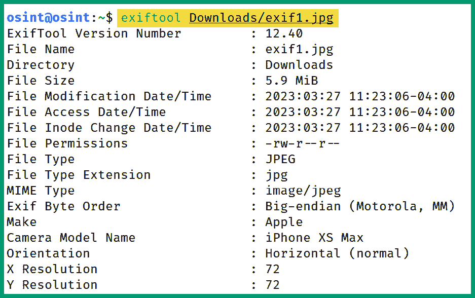
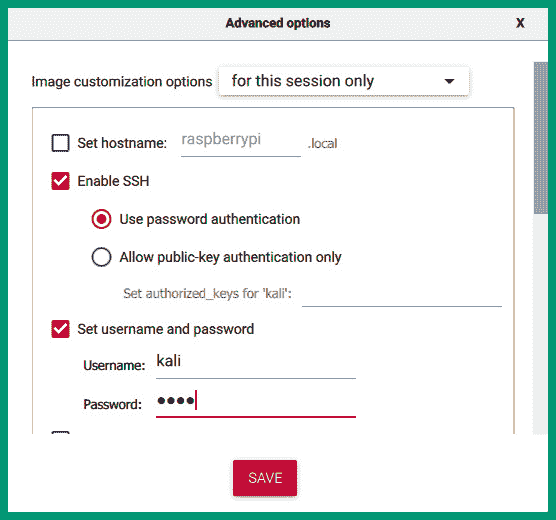
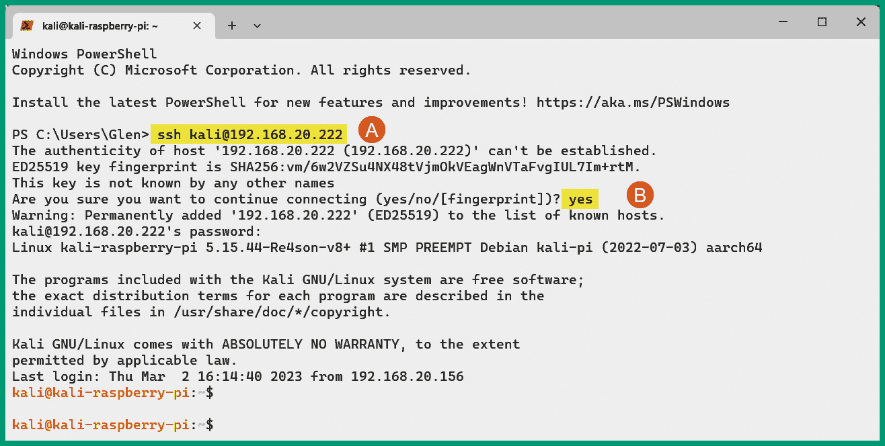
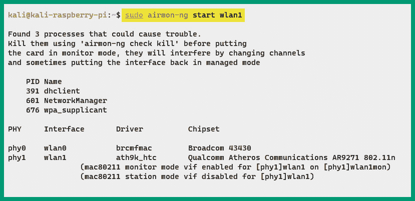

# 第六章：图像、人物与信号情报

照片能告诉你很多信息，威胁行为者会收集他们目标的图像情报，以识别其地理位置以及图片背景中可能包含的敏感数据，这些数据可以用来改善他们的操作。世界各地的人们总是在社交媒体平台上发布自己、家人及其位置的照片，却没有完全意识到对手是如何追踪他们的位置的。

在本章中，您将学习如何分析图像和地图以识别目标的物理位置，并从公共数据库中收集和分析数据，以识别有效的用户名和密码。此外，您将学习如何进行无线信号情报分析，识别区域内的无线设备，并分析目标无线网络基础设施。

在本章中，我们将涵盖以下主题：

+   图像和元数据分析

+   人物和用户情报

+   无线信号情报

让我们深入了解！

# 技术要求

要跟随本章的练习，请确保您已满足以下硬件和软件要求：

+   Kali Linux: [`www.kali.org/get-kali/`](https://www.kali.org/get-kali/)

+   Trace Labs OSINT 虚拟机: [`www.tracelabs.org/initiatives/osint-vm`](https://www.tracelabs.org/initiatives/osint-vm)

+   Kali Linux ARM: [`www.kali.org/get-kali/`](https://www.kali.org/get-kali/)

+   Google Earth Pro: [`www.google.com/earth/versions/`](https://www.google.com/earth/versions/)

+   Raspberry Pi Imager: [`www.raspberrypi.com/software/`](https://www.raspberrypi.com/software/)

+   Rufus: [`rufus.ie/`](https://rufus.ie/)

+   Raspberry Pi 3 B+

+   一张 32GB 的三星 EVO+ microSD 卡

+   一款 microSD 卡读卡器

+   一条 micro-USB 数据线

+   一款 Alfa AWUS036NHA - 无线 B/G/N USB 适配器

+   一款 VK-162 G-Mouse USB GPS 导航模块

+   一款便携式电源银行

# 图像和元数据分析

**可交换图像文件**(**EXIF**) 是一种标准，指定了在图像处理设备（如扫描仪和数码相机）中常用的声音和图像的格式。简单来说，EXIF 是嵌入在数码相机拍摄的照片文件中的元数据，包括相机数据，如地理位置、时间和日期、制造商、分辨率等。带有 EXIF 数据的图像可以被道德黑客用来进行侦察和社会工程攻击。

作为一名道德黑客，你可以收集目标的公开图像并分析其中的 EXIF 数据。收集到的 EXIF 数据可能会揭示目标的地理位置、拍摄照片的设备类型以及拍摄照片的时间。例如，如果一张照片是在一个组织的服务器室内用数码相机拍摄的，那么被聘请模拟现实世界网络攻击的道德黑客可以识别是否有地理位置数据，并利用它确定服务器室的实际位置和目标公司的位置。此外，EXIF 数据还可以被道德黑客用来提升他们的社会工程攻击，通过识别照片的地理位置并发送看似来自目标相同物理位置的网络钓鱼邮件，从而试图欺骗目标，认为邮件来自可信来源。

然而，许多智能手机和移动操作系统厂商已加强了其设备的安全性，并实施了安全机制，以防止敏感的 EXIF 数据附加到使用其设备拍摄的照片和视频中。试想，如果所有上传到互联网的照片都包含 EXIF 数据，网络犯罪分子将能够比以前更容易地通过智能手机或计算机追踪潜在的受害者。因此，EXIF 位置数据多年来已变得更加安全，减少了有人从照片中收集**全球定位系统**（**GPS**）数据的风险，一些社交媒体平台也实施了安全机制，在照片发布到在线平台之前删除 EXIF 数据。

重要提示

数字取证调查员可以使用照片中的 EXIF 数据来确定照片拍摄的时间和地点。这些信息在调查中非常有用，因为它有助于识别潜在的嫌疑人并专注于攻击的时间线。

EXIF 提供了大量数据，经过道德黑客的正确利用，可以用来确定目标的所在位置、用于拍摄照片的设备、目标所面向的方向、设备设置等更多信息。

## EXIF 数据分析

在本练习中，你将学习如何识别和分析照片中的 EXIF 数据，并确定拍摄地点的地理位置。要开始此练习，请按照以下说明操作：

1.  打开**Trace Labs OSINT 虚拟机**并使用`osint**/**osint`作为用户名和密码登录。

1.  一旦你登录到 Trace Labs OSINT 虚拟机，打开**网页浏览器**并访问[`osint.tools`](https://osint.tools)进行练习文件操作。在左侧栏的菜单中，你将看到一个资源列表–点击**Exif 示例 1**，如图所示：


图 6.1 – EXIF 文件

1.  接下来，网页上会加载一张图片。右键点击图片，选择**保存图片为...**将图片下载并保存到**Trace Labs 虚拟机**中，如下所示：


图 6.2 – EXIF 图片

默认情况下，所有下载的文件都会自动保存在 Trace Labs 虚拟机上的`/home/osint/Downloads`目录中。

1.  接下来，使用`exiftool`从图片文件中提取 EXIF 数据。打开`Terminal`并执行以下命令：

    ```
    osint@osint:~$ exiftool Downloads/exif1.jpg
    ```

以下截图显示了执行前述命令后的输出结果：



图 6.3 – EXIF 数据

如前截图所示，我们能够查看图片的 EXIF 数据。可以收集和分析时间和日期、地理位置、设备类型和型号以及分辨率等信息。

1.  接下来，我们使用`exifprobe`工具从同一张图片中提取 EXIF 数据：

    ```
    osint@osint:~$ exifprobe Downloads/exif1.jpg
    ```

如下截图所示，exifprobe 工具从图片中提取了 EXIF 和地理位置数据：


图 6.4 – exifprobe 工具

1.  接下来，再次打开浏览器，访问[`fotoforensics.com/`](https://fotoforensics.com/)，在该网站上你可以上传图片以提取 EXIF 数据。只需点击`Browse...`附加文件，然后选择`Upload`进行提取和分析，如下所示：


图 6.5 – Fotoforensics 网站

几秒钟或几分钟后，网站会显示所有的 EXIF 数据，并提供多个特定的数据类别供查看。

1.  接下来，选择`Analysis** | **Metadata`查看 EXIF 数据：


图 6.6 – 查看元数据

以下截图显示了文件中找到的所有 EXIF 数据：


图 6.7 – 从上传的图片提取的 EXIF 数据

1.  接下来，向下滚动 EXIF 结果页面的底部，查看图片的地理位置：


图 6.8 – 地理位置数据

如前截图所示，找到了 GPS 数据，并将其应用于映射系统，以识别拍摄照片的大致位置。

1.  最后，你可以复制前一步骤中的 GPS 坐标，并将其输入到[`maps.google.com`](https://maps.google.com)（Google Maps）中，获取关于该位置的第二次意见，如下所示：


图 6.9 – Google Maps

如前截图所示，GPS 坐标可以用于 Google Maps，帮助更好地了解该位置的周围环境和街景。

## 反向图像搜索

反向图像搜索允许任何人通过上传照片或提供指向图像的 URL 来进行互联网搜索。就像大多数人熟悉使用互联网搜索引擎根据关键词查找网站和域名一样，反向图像搜索使我们能够找到不同尺寸和分辨率的相似图片、相同图片的不同版本，甚至找到包含相同物体的图片。

反向图像搜索对道德黑客非常有用，因为它使他们能够识别图片的来源和位置，并确定图片在互联网上的使用情况。如果你试图识别目标拍摄照片的地点，这项技术能帮助你找到该位置。

以下是进行反向图像搜索的流行搜索引擎：

+   Google: [`images.google.com`](https://images.google.com)

+   Bing: [`www.bing.com`](https://www.bing.com)

+   Yandex: [`yandex.com`](https://yandex.com)

+   TinEye: [`tineye.com`](https://tineye.com)

为了更好地理解反向图像搜索如何帮助道德黑客识别目标的地理位置，让我们考虑以下场景：

1.  你得到了一张照片，并需要识别照片拍摄的地点。在这个练习中，我们使用了由摄影师 Mauro Lima 拍摄的公开可用照片，照片来源于 [`unsplash.com`](https://unsplash.com)，如下所示：


图 6.10 – 示例照片

如前图所示，这是一张由摄影师拍摄的宗教场所的美丽照片。有时，在进行反向图像搜索之前，建议先移除照片中的物体或主体，以确保搜索引擎能够更好地识别互联网上的相似图片。

提示

能够识别特定的建筑风格、标识、植物和动物可以帮助你确定照片拍摄的具体地区。例如，某些类型的树木只能在特定国家找到。

1.  我们可以使用 `Cleanup.pictures` ([`cleanup.pictures`](https://cleanup.pictures)) 来从图片中移除特定的物体，比如人物和车辆。以下截图显示了 Cleanup.pictures 网站以及上传字段，在此上传你的图片：


图 6.11 – Cleanup.pictures 网站

1.  接下来，使用橡皮擦刷选择你想要移除的物体和人物，并启用 **人工智能**(**AI**) 来自动填充高亮区域：


图 6.12 – 物体与人物

1.  接下来，确保你下载并保存 AI 修改后的图像：


图 6.13 – 人工智能修改的图像

提示

你可以在 [`www.remove.bg`](https://www.remove.bg) 使用 `Remote Background` 来去除图片的背景。

1.  接下来，要执行反向图像搜索，请访问 `Google Images` [`images.google.com`](https://images.google.com)，并上传修改后的图像以查看搜索结果，如下所示：


图 6.14 – 反向图像搜索结果

如前所示的屏幕截图，已找到该位置及类似图像。

重要提示

`Google Images` 已集成 `Google Lens` 来改进图像搜索。这项技术使你能够选择图像的特定区域，或者选择整个图像。

1.  接下来，在 `Google Maps` [`maps.google.com`](https://maps.google.com) 中输入 `Convento de Santo Domingo, Cartagena` 位置，如下所示：


图 6.15 – 谷歌地图

1.  最后，使用谷歌地图上的 **街景** 功能，你可以虚拟地浏览该位置，收集更多的情报：


图 6.16 – 谷歌地图街景

如前所示的屏幕截图，我们找到了摄影师拍摄照片的位置。

如你现在所了解的，反向图像搜索帮助道德黑客识别目标的地理位置及所在位置，并使用全球地图系统查看该位置周围的环境。这些知识在进行物理渗透测试评估时也非常有用，能够识别进入建筑或院落的最少阻力的入口点。

## 地理位置分析

地图系统是道德黑客识别目标组织及其周边环境物理位置的优秀数据源。假设你需要在黑盒评估期间对目标组织进行无线渗透测试，你可以通过搜索组织的名称，查找其网站，并查看地址是否列出。此外，你还可以使用像 `Google Maps` 这样的公开在线地图来识别组织的物理位置。

例如，我们可以使用谷歌地图查找 Twitter 总部的物理位置（红色图钉），并更好地了解其周围环境，如下所示：


图 6.17 – 定位公司

如前所示的屏幕截图，谷歌地图为我们提供了该建筑的图片，帮助更好地识别目标、其街道地址、营业时间及联系信息，这些信息可以在未来的操作中使用，如社会工程攻击。

切换到谷歌地图的卫星视图可以帮助我们更好地了解公司布局及周围区域，比如识别作为道德黑客进行无线攻击的地方：


图 6.18 – 卫星视图

此外，我们可以观察到附近有员工经常访问的餐厅，并可能将他们的移动设备连接到餐厅的无线网络。作为一名道德黑客，您可以设置一个伪造的无线网络，诱使您的目标员工连接并将其流量重定向到钓鱼网站，并执行**域名系统**（**DNS**）投毒攻击。

谷歌地图提供了街景功能，使道德黑客可以与街道的全景视图进行交互，让您查看目标建筑物周围的环境，并寻找停车场、入口点和安全检查点。

以下截图向您展示了不离开电脑就能看到 Twitter 总部的街景：


图 6.19 – 街景

作为一名道德黑客，您可以利用街景查看侧面和其他可能便利且安全性较低的路径，用于进行物理渗透测试和无线网络评估。

以下截图显示了 Twitter 大楼的侧视图，其中有一家小餐厅：


图 6.20 – 侧视图

虽然道德黑客使用这些策略和技术来帮助组织，但威胁行为者也在利用它们进行恶意目的。因此，组织确保他们进行 OSINT 渗透测试以确保他们的网络防御得到改善并减少攻击面是非常重要的。

在本节中，您将学会收集和分析图像和地理位置情报的实际技能，并进一步了解威胁行为者如何利用公开可用信息来对其目标进行画像。在下一节中，您将学习如何收集有关组织中人员和用户的情报。

# 人员和用户情报

人员 OSINT 侧重于收集有关个人姓名、地址、电话号码、用户名甚至其社交媒体账户的信息。当识别目标组织的员工并改进社会工程攻击以在目标网络中获得立足点时，这些信息是有用的。人们经常在社交媒体上创建账户并添加他们的公司、职位和联系方式，这有助于威胁行为者在计划攻击时轻松地收集这些数据。例如，员工有时会在 LinkedIn 和 Facebook 等社交媒体平台的联系信息中包含他们公司的电子邮件地址。

组织使用各种格式的员工电子邮件地址，例如以下格式：

+   `firstname @ domain .** **com`

+   `firstnameinitial + lastname @ domain .** **com`

+   `firstname.lastnameinitial @ domain .** **com`

+   `firstname + lastnameinitial @ domain .** **com`

+   `fullname @ domain .** **com`

因此，如果攻击者正在收集有关目标组织的 OSINT，从社交媒体上找到的当前员工的电子邮件地址可以帮助他们确定组织内使用的电子邮件格式。一些公司甚至会在他们的网站上公开发布组织结构图，概述各种知名员工及其部门。这些信息可以用来识别特定人员，并确定他们的电子邮件地址格式，以计划针对性的网络钓鱼攻击。

此外，有许多在线论坛，学生、专业人士和研究人员可以在其中获取有关技术问题的帮助，例如`Stack Overflow` ([`stackoverflow.com`](https://stackoverflow.com))。攻击者可以利用 Stack Overflow 上的信息来识别目标组织内存在的技术和安全漏洞。例如，想象一下技术团队遇到某个应用程序问题并决定在 Stack Overflow 上使用他们的真实姓名、职位和组织名称创建一个帐户。然后，他们继续发布包含其基础设施的技术细节、主机操作系统、应用程序名称和服务版本的帖子。尽管这些信息对于出于善意提供帮助的任何人都是有用的，但这些信息对于威胁行为者来说揭示了关于他们目标的许多信息，并使其更容易识别攻击面。

作为一名道德黑客，全面了解威胁行为者常用的策略和技术来收集和分析来自互联网的数据泄漏是非常重要的。有时，找到人员可能是一项具有挑战性的任务，无论您是在帮助执法部门还是识别目标组织的员工。有许多基于人员的搜索引擎可用于收集个人的姓名、地址、电话号码、社交媒体账号和用户名。以下是一些免费和商业人员搜索引擎的列表：

+   [www.peekyou.com](http://www.peekyou.com)

+   [thatsthem.com](http://thatsthem.com)

+   [radaris.com](http://radaris.com)

+   [www.beenverified.com](http://www.beenverified.com)

+   [www.skopenow.com](http://www.skopenow.com)

在渗透测试期间，道德黑客通常会执行一种称为**密码喷洒**的技术，即在同一应用程序或系统上使用常见密码与多个用户名。使用密码喷洒的目的是识别已将其帐户配置为弱密码或与组织内其他人使用相同密码的用户。有时，电子邮件地址的名称（用户）部分是员工用于访问公司拥有的系统或应用程序的用户名。在某些情况下，整个电子邮件地址被用作员工的用户名。

在从互联网上的各种数据源收集电子邮件地址时，识别一个地址是否有效或被列入黑名单，以及是否与某个社交媒体账户相关联是至关重要的。可以通过使用目标的电子邮件地址在社交媒体网站上进行搜索，以确定该电子邮件地址是否与某个社交媒体账户相关联。

以下网站可以用来判断电子邮件地址的声誉和有效性：

+   MXToolBox: [`mxtoolbox.com/emailhealth`](https://mxtoolbox.com/emailhealth)

+   Simply Email Reputation: [`emailrep.io`](https://emailrep.io)

+   Cisco Talos: [`www.talosintelligence.com/reputation_center/email_rep`](https://www.talosintelligence.com/reputation_center/email_rep)

此外，`Hunter` ([`hunter.io`](https://hunter.io)) 使道德黑客能够发现员工、他们的职位以及与目标域名相关的电子邮件地址。Hunter 允许你使用目标的域名进行查询，然后在其数据库和互联网上的多个数据源中搜索与该域名相关的个人联系信息。

以下截图显示了对 [microsoft.com](http://microsoft.com) 域名进行的查询：


图 6.21 – Hunter 域名查询

如前面的截图所示，Hunter 是一个对道德黑客非常有用的工具，帮助你从互联网上收集组织和个人的情报。通过 Hunter 收集的数据可以用来策划针对目标组织的社会工程攻击。

## 人员与地理位置

互联网上有许多平台允许人们上传并分享自己和他们去过的地方的照片。社交媒体和照片共享平台是道德黑客寻找目标和其位置的宝贵资源。例如，假设你接受了一个任务，需要确定目标组织中的高级员工，了解他们的位置，并识别与目标相关的任何兴趣地点。

你可以使用 LinkedIn、Facebook 和 Twitter 等社交媒体平台，通过输入组织名称进行查找/搜索，并根据需要筛选结果。在员工的个人资料中，他们可能会包括目标组织和位置。一些人常常使用社交媒体的签到功能，这为威胁行为者提供了有用的数据，包括一个人访问特定位置的频率、工作出差的情况，以及他们什么时候和去哪里度假。

为了更好地理解数据如何被对手收集并利用，我们来看一下当今著名人物的 Twitter 个人资料：


图 6.22 – Twitter 个人资料

上述截图显示了他们的公开资料，其中包含大量数据。例如，如果你在寻找目标的照片，他们的社交媒体资料很可能会有他们的最新照片。此外，公开资料的照片可以通过反向图像搜索来识别其他可能在互联网上包含相同或类似图片的数据源。上述截图还显示了个人的位置、他们的网站以及资料的年龄。如前所述，位置帮助你识别目标的大致位置或城市。资料中的网站可以用来获取更多情报。最后，你可以查看目标上传的所有帖子和媒体；其中包含的敏感信息可以帮助你识别目标组织的基础设施。

智能手机上的社交媒体应用允许用户在帖子中添加地理位置数据，让他们的关注者、朋友和联系人知道他们发帖时的位置。假设你想识别一个目标组织的所有员工，但你只有该公司的地址。作为一名道德黑客，你可以使用`Google Maps`来查找该组织的具体位置并获取 GPS 坐标。

要更好地理解如何根据 GPS 数据定位人员，请按照以下说明操作：

1.  打开网页浏览器，访问`Google Maps`：[`maps.google.com`](https://maps.google.com)。

1.  接下来，左键单击地图上的任意位置，放置一个标记点，如下所示：


图 6.23 – 收集 GPS 数据

如上图所示，时尚广场（Times Square）作为示例。当你在 Google Maps 上点击一个特定位置时，一个标针会插入，且 URL 会更新为包含 GPS 坐标数据：`40.757791,-73.9854071`。

1.  接下来，为了找到所有从该位置发布的人员，前往[`twitter.com`](https://twitter.com)并在**搜索**框中输入以下语法：

    ```
    geocode:40.757791,-73.9854071,1km
    ```

上述语法将显示所有在 1 公里范围内发布的个人资料结果，结果如下所示：


图 6.24 – 根据 GPS 数据过滤帖子

上述练习是一个概念验证，旨在获取目标组织的 GPS 坐标，并过滤出来自该位置的帖子。一些找到的帖子很可能是由员工发布的，因此，分析所有收集的数据非常重要，以确保它对你的 OSINT 操作以及未来攻击的计划有帮助。

在对某个人或员工进行画像时，确保你没有收集到假资料或对假个人资料图片进行反向图片查找是非常重要的。像`WhatsMyName` ([`whatsmyname.app`](https://whatsmyname.app))这样的网站对道德黑客和渗透测试人员非常有用，可以用来在互联网上多个数据源和网站上搜索用户名，识别某个特定用户名在哪里注册。结果帮助你确定目标可能在互联网上发布更多有用信息的其他地方。

以下截图展示了 WhatsMyName 网站的查找字段：


图 6.25 – WhatsMyName 查找

最后，你可以使用像`TinEye` ([`tineye.com`](https://tineye.com))和`PimEyes` ([`pimeyes.com`](https://pimeyes.com))这样的工具，进行反向图片搜索，识别某张人物图片在互联网上的相似图像或相同图像。这些工具对于执法部门寻找失踪人员并追踪其活动非常有用。

以下截图展示了 TinEye 上关于一张虚构人物的假图片的搜索结果：


图 6.26 – TinEye 结果

如前面的截图所示，TinEye 能够通过其数据源、网址、文件名和首次出现的日期，识别互联网上的相似图片。

PimEyes 使用人脸识别技术，更好地识别图片中的人物。以下截图展示了 PimEyes 对一张假图片的识别结果：


图 6.27 – PimEyes 结果

如前面的截图所示，PimEyes 能够识别出面部特征非常相似的人，并提供数据来源等信息。

## 用户凭证 OSINT

许多人常常配置弱密码，或者经历过账户被黑客入侵的情况。当账户被侵入时，泄露的数据通常会被对方用来扩展其活动并进行未来攻击，还可能被转售到暗网上牟利。作为一名道德黑客，获取泄露的数据非常有利，因为它为我们提供了目标组织的用户凭证。

例如，假设你正在对一个网络进行渗透测试，并试图获取连接到域的基于 Windows 的系统的立足点。如果公司在渗透测试之前就已经遭到数据泄露，那么泄露的数据可能已经出现在暗网或在线数据库中。在这些泄露的数据中，你可能会找到用户的域账户凭证。有些用户在泄露后会更改密码，而有些则不会。对于那些在账户被泄露后没有更改密码的用户，你可以利用泄露数据中的用户凭证来进入网络并执行各种基于密码的攻击，以识别其他安全漏洞。

以下是一些免费的和商业的仓库和数据库，帮助道德黑客和渗透测试员识别目标的用户凭证：

+   Have I Been Pwned?: [`haveibeenpwned.com`](https://haveibeenpwned.com)

+   Intelligence X: [`intelx.io`](https://intelx.io)

+   Dehashed: [`www.dehashed.com`](https://www.dehashed.com)

道德黑客可以使用 `Have I Been Pwned?` 来识别电子邮件地址和电话号码是否出现在批量泄露数据中。例如，道德黑客可以对目标的电子邮件地址进行查找，如下所示：


图 6.28 – Have I Been Pwned?

*Have I Been Pwned?* 提供了结果，显示哪些数据泄露包含了该电子邮件地址，如下所示：


图 6.29 – 搜索结果

之前的数据可以通过道德黑客进行分析，以进一步确定电子邮件地址及其持有者的有效性，以及目标使用该电子邮件地址在哪些网站上注册了账户。此外，黑客通常会在互联网上暴露被泄露的账户数据，如用户名和密码。如果没有一些额外的研究，你可能能够找到该电子邮件账户的密码。有时，用户并未意识到数据泄露，也不总是经常更改密码。你可能会幸运地找到目标的有效用户凭证，并利用这些凭证进入他们的账户、系统或网络。

此外，如果你一直滚动到 *Have I Been Pwned?* 结果页面的底部，你将获得所有包含给定电子邮件地址的数据泄露源（粘贴），如下面的截图所示：


图 6.30 – 泄露数据源

此外，`Intelligence X` 帮助道德黑客从泄露的数据中找到用户凭证。例如，你可以执行电子邮件查找，以识别与电子邮件地址相关的所有相关数据，如下所示：


图 6.31 – Intelligence X 邮件查找

以下截图显示了 Intelligence X 提供的数据：


图 6.32 – Intelligence X 结果

如前所示的截图，Intelligence X 提供了一些免费结果，而其他结果则包含编辑过的数据。需要付费账户/订阅才能查看 Intelligence X 中的编辑数据。

作为伦理黑客，你可以点击数据收集项来查看其所有内容，如以下截图所示：


图 6.33 – 数据收集

如前所示的截图，一些数据收集项包含大量条目，因此使用搜索字段可以帮助你在数据集中找到特定的结果。

最后，`Dehashed`是一个在线数据库，允许伦理黑客从数据泄露中购买用户凭证。这个网站是伦理黑客和渗透测试人员在对目标组织的账户和系统进行基于密码的攻击时的一个有价值工具。它允许你对电子邮件地址、用户名、IP 地址、姓名、地址、电话号码和域名进行查找。

完成本节后，你已经学会了如何收集和分析关于个人及其地理位置的开源情报（OSINT），并且能够定位包含用户凭证的数据泄露。在下一节中，你将学习如何收集和分析无线信号的数据。

# 无线信号情报

无线**信号情报**（**SIGINT**）是一种常见技术，伦理黑客、渗透测试人员和红队成员使用它来拦截和分析无线流量，以发现并利用无线电和无线传输中存在的安全漏洞。SIGINT 通常在军事行动中被政府用来监控其他国家的通信渠道并识别潜在威胁。然而，网络安全专业人员可以利用各种工具和技术，通过 SIGINT 来识别目标的无线网络基础设施（如接入点和相关客户端）、拦截和监控**无线局域网**（**WLAN**）帧，然后利用这些信息来获取网络访问密码，并定位附近的设备。

组织通过对其无线基础设施执行 SIGINT 技术，可以获得以下好处：

+   **识别安全漏洞**：伦理黑客可以捕获并分析目标网络上的 WLAN 流量，以识别任何安全漏洞，如弱无线安全标准、弱加密算法和不安全的身份验证协议。

+   **侦察**：伦理黑客可以执行无线 SIGINT，以了解目标无线网络基础设施、无线设备类型及其使用情况，以及可以实施哪些安全防护措施来减少攻击面。

+   **测试安全控制**：在实施网络防御和安全控制后，测试这些对策的有效性是一个好习惯，以确保它们能按预期工作，减少潜在网络攻击或威胁的风险。

+   **改进事件响应和处理**：如果攻击者通过无线基础设施成功渗透到组织的网络中，网络安全专业人员可以执行无线 SIGINT（信号情报）来识别攻击工具、技术及来源，从而提升**网络威胁` `情报**（**CTI**）。

通常，无线 SIGINT 帮助组织从敌方的角度更好地理解其无线网络基础设施的攻击面及可能被用于入侵网络的技术。SIGINT 收集的数据有助于道德黑客向客户和组织提供改进安全防御、提升态势感知和优化事件响应与处理的建议。然而，请记住，道德黑客必须在执行无线 SIGINT 前，获得相关当局的合法许可。

接下来，你将学习如何构建一个便携/移动的无线 SIGINT 基础设施。

## 构建 SIGINT 基础设施

许多道德黑客和渗透测试人员使用带有外部无线网络适配器的笔记本电脑，该适配器支持监控模式和数据包注入，来收集和分析周围的无线信号。然而，如果你想创建一个更紧凑的设置，可以放进背包里进行战步，或者安装在无人机上进行战飞，那么笔记本电脑就不是最好的选择，因其体积和重量较大。我们可以利用如**树莓派**这类微型计算机的强大功能，运行`Kali Linux ARM`，对目标的无线网络进行侦察。

以下是建立门户无线信号基础设施所需的材料清单：

+   树莓派 3 B+

+   一张 32GB 的三星 EVO+ microSD 卡

+   一个 micro-USB 数据线

+   一个 Alfa AWUS036NHA 无线 B/G/N USB 适配器

+   一个 VK-162 G-Mouse USB GPS 接收器导航模块

+   一个便携式移动电源

树莓派（Raspberry Pi）是一款具有足够计算能力的微型计算机，能够运行`Kismet`，这是一款用于监控 IEEE 802.11、蓝牙和射频信号的无线信号情报工具，可以检测无线网络入侵。microSD 卡将用于存储 Kali Linux ARM 操作系统和所有收集的数据。Alfa AWUS036NHA 无线网络适配器支持监控模式和数据包注入，并能连接到树莓派。VK-162 G-Mouse USB GPS 接收器用于在找到无线站点（客户端）和接入点时，收集其 GPS 坐标。便携式移动电源将为树莓派提供电力，支持战步、战车或战机。

以下图示展示了组装后的信号情报基础设施：


图 6.34 – 信号情报基础设施

此外，我们将配置 Raspberry Pi 作为一个接入点，设置**动态主机配置协议**（**DHCP**）服务器，向连接到其`wlan0`接口的任何设备提供 IP 地址和子网掩码。这使我们能够轻松连接笔记本电脑，并使用**安全外壳**（**SSH**）安全访问运行在 Raspberry Pi 上的 Kali Linux ARM 操作系统，用于我们的无线渗透测试评估。

要开始设置 Raspberry Pi 进行信号情报工作，请按照以下说明操作：

### 第一部分 – 安装 Kali Linux ARM

1.  首先，从[`www.raspberrypi.com/software/`](https://www.raspberrypi.com/software/)下载并安装`Raspberry Pi Imager`。

1.  接下来，从[`www.kali.org/get-kali/`](https://www.kali.org/get-kali/)下载适用于您的 Raspberry Pi 版本的官方`Kali Linux ARM`操作系统：


图 6.35 – Kali Linux ARM

1.  接下来，使用 SD 卡读卡器将 microSD 卡连接到主机电脑。

1.  要将 Kali Linux ARM 操作系统加载到 microSD 卡中，启动`Raspberry Pi Imager`并点击**选择操作系统**，如图所示：


图 6.36 – Raspberry Pi Imager

1.  接下来，将出现**操作系统**窗口。点击**使用自定义**，如所示：


图 6.37 – 操作系统菜单

1.  接下来，选择`Kali Linux ARM`文件并点击**打开**将其加载到`Raspberry Pi Imager`中：


图 6.38 – Kali Linux ARM 文件

1.  接下来，返回`Raspberry Pi Imager`的主菜单，点击**选择存储**，并选择 microSD 卡作为**存储**设备。然后，点击齿轮图标打开高级选项：


图 6.39 – 写入操作系统

1.  接下来，将出现**高级选项**菜单。勾选**启用 SSH**框，设置用户名和密码（`kali**/`kali**），然后点击**保存**，如以下截图所示：



图 6.40 – 启用 SSH

1.  接下来，您将自动返回到`Raspberry Pi Imager`主窗口。点击**写入**开始将 Kali Linux ARM 操作系统镜像写入 microSD 卡：


图 6.41 – 写入按钮

此过程通常需要几分钟来写入和验证。

1.  写入过程完成后，将 microSD 卡插入 Raspberry Pi，连接 GPS 加密狗和无线网卡，并通过将其连接到电源来启动设备。

1.  接下来，使用网线将 Raspberry Pi 连接到你的有线网络。

1.  登录到你的调制解调器、路由器或 DHCP 服务器，以确定分配给 Raspberry Pi 的 IP 地址。下一步需要用到这个 IP 地址。

### 第二部分 – 配置 Kismet 与 GPS

1.  如果你正在使用`Windows 10`计算机，请打开**命令提示符**并执行`powershell`命令，然后继续下一步。

1.  如果你正在使用`Windows 11`或基于 Linux 的操作系统，请打开**终端**并使用`ssh kali@ip-address`语法，其中`ip-address`是你网络中 Raspberry Pi 的 IP 地址。使用默认的用户凭证`kali**/**kali`作为用户名和密码登录，如下所示：



图 6.42 – 连接到 Raspberry Pi

如前面的截图所示，我们正在使用 SSH 通过网络安全地访问 Raspberry Pi，以执行其他配置并继续设置过程。

提示

按*Ctrl* + *P*更改终端提示符的布局。

1.  接下来，使用以下命令更新软件包仓库文件：

    ```
    kali@kali-raspberry-pi:~$ sudo apt update
    ```

1.  接下来，使用以下命令在 Raspberry Pi 上安装 Kismet 和 GPS 软件包的最新版本：

    ```
    kali@kali-raspberry-pi:~$ sudo apt install kismet gpsd gpsd-clients
    ```

提示

你可以使用`dmesg | grep tty`命令显示与**电传打字机**（**tty**）子系统相关的内核消息。这个命令帮助你确定操作系统是否检测到并识别了附加的 USB 设备。

1.  接下来，你需要修改 Kismet 的配置，以确保`gpsd`软件包能够连接到 GPS 加密狗并将数据发送到 Kismet。为此，使用以下命令在`nano`命令行文本编辑器中打开`kismet.conf`文件：

    ```
    kali@kali-raspberry-pi:~$ sudo nano /etc/kismet/kismet.conf
    ```

1.  接下来，使用键盘上的下箭头滚动文本文件，直到找到 GPS 设置。然后，在新的一行插入以下内容：

    ```
    gps=gpsd:host=localhost,port=2947,reconnect=true
    ```

结果应该如下所示：


图 6.43 – 在 Kismet 中修改 GPS 设置

1.  接下来，按*Ctrl* + *X*保存对`kismet.conf`文件的修改，然后按*Y*，并按*Enter*键确认。

1.  接下来，使用以下命令配置`gpsd`与 USB0 上的 GPS 接收器配合使用：

    ```
    kali@kali-raspberry-pi:~$ sudo gpsd -b /dev/ttyUSB0
    ```

1.  使用`sudo reboot`命令重启 Raspberry Pi 并重新登录。

1.  接下来，确保 GPS 加密狗能够清晰地垂直看到天空，使用**cgps –s**或`gpsmon`命令接收来自轨道卫星的 GPS 数据，如下所示的截图所示：


图 6.44 – cgps 数据

如前面的截图所示，GPS 软件和加密狗能够识别并连接到一些卫星（右栏）。此外，Raspberry Pi 能够获取其当前的 GPS 坐标（为保护隐私已模糊处理）以及用于定位和跟踪的其他数据。按*Ctrl* + *C*停止`cgps`运行。

### 第三部分 – 在 Raspberry Pi 上设置接入点

将 Raspberry Pi 设置为工作为接入点，使我们能够通过移动设备（如笔记本电脑或智能手机）无线连接到它，从而无需有线连接。这使得 Raspberry Pi 在进行战车、步行或飞行的测试时，变得完全自主和移动。我们按如下方式操作：

1.  在 Raspberry Pi 上，下载并安装`dnsmasq`和`hostapd`软件包，用于配置无线和 IP 服务：

    ```
    kali@kali-raspberry-pi:~$ sudo apt install dnsmasq hostapd
    ```

1.  接下来，使用以下命令停止`dnsmasq`和`hostapd`服务，直到稍后需要它们：

    ```
    kali@kali-raspberry-pi:~$ sudo systemctl stop dnsmasq
    ```

    ```
    kali@kali-raspberry-pi:~$ sudo systemctl stop hostapd
    ```

1.  接下来，我们需要为将从`wlan0`接口广播的无线网络设置参数。使用以下命令编辑`hostapd.conf`文件：

    ```
    kali@kali-raspberry-pi:~$ sudo nano /etc/hostapd/hostapd.conf
    ```

然后，将以下配置插入到`hostapd.conf`文件中：

```
interface=wlan0
driver=nl80211
ssid=MyNetwork
hw_mode=g
channel=7
macaddr_acl=0
auth_algs=1
ignore_broadcast_ssid=0
wpa=2
wpa_passphrase=Password123
wpa_key_mgmt=WPA-PSK
wpa_pairwise=TKIP
rsn_pairwise=CCMP
```

请记住，您可以将`MyNetwork`更改为您选择的任何无线网络名称，将`Password123`更改为更强的密码。以下截图显示了`hostapd.conf`文件中的前述配置：


图 6.45 – Hostapd 配置

按*Ctrl* + *X*，然后按*Y*，最后按*Enter*保存文件。

1.  接下来，安装`dhcpcd`软件包，我们将用它来配置 Raspberry Pi 上`wlan0`接口的静态 IP 地址：

    ```
    kali@kali-raspberry-pi:~$ sudo apt install dhcpcd
    ```

1.  接下来，修改`dhcpcd`配置文件，使用以下命令将`192.168.4.1`地址分配给`wlan0`无线适配器：

    ```
    kali@kali-raspberry-pi:~$ sudo nano /etc/dhcpcd.conf
    ```

将以下参数插入到`dhcpcd.conf`文件的末尾：

```
interface wlan0
    static ip_address=192.168.4.1/24
    nohook wpa_supplicant
```

下图显示了在文件末尾插入的前述参数：


图 6.46 – dhcpcd 文件

按*Ctrl* + *X*，然后按*Y*，最后按*Enter*保存文件。

1.  接下来，重启`dhcpcd`服务，并使其在系统启动时自动启动：

    ```
    kali@kali-raspberry-pi:~$ sudo service dhcpcd restart
    ```

    ```
    kali@kali-raspberry-pi:~$ sudo systemctl enable dhcpcd
    ```

1.  接下来，备份`dnsmasq`配置文件并使用以下命令创建一个新文件：

    ```
    kali@kali-raspberry-pi:~$ sudo mv /etc/dnsmasq.conf /etc/dnsmasq.conf.orig
    ```

    ```
    kali@kali-raspberry-pi:~$ sudo nano /etc/dnsmasq.conf
    ```

然后，将以下参数插入新的`dnsmasq`配置文件中：

```
interface=wlan0
dhcp-range=192.168.4.2,192.168.4.20,255.255.255.0,24h
```

以下截图显示了`dnsmasq`配置文件中的前述参数：


图 6.47 – DNSmasq 配置

上述截图中显示的配置用于为任何连接到 Raspberry Pi 上`wlan0`接口生成的无线网络的客户端提供 IP 地址和子网掩码。

1.  接下来，使用以下命令启用并重启`dnsmasq`和`hostapd`服务：

    ```
    kali@kali-raspberry-pi:~$ sudo systemctl enable dnsmasq
    ```

    ```
    kali@kali-raspberry-pi:~$ sudo systemctl restart dnsmasq
    ```

    ```
    kali@kali-raspberry-pi:~$ sudo systemctl unmask hostapd
    ```

    ```
    kali@kali-raspberry-pi:~$ sudo systemctl enable hostapd
    ```

    ```
    kali@kali-raspberry-pi:~$ sudo systemctl restart hostapd
    ```

1.  最后，使用 `sudo reboot` 命令重启 Raspberry Pi。设备重启后，你将看到 `MyNetwork` 无线网络可用。现在，你可以通过无线网络连接到 Raspberry Pi，设备将获得 `192.168.4.2` – `192.168.4.20` 范围内的 IP 地址。然后，你可以通过其 `wlan0` 接口上静态配置的 `192.168.4.1` 地址通过 SSH 访问 Raspberry Pi。

### 第四部分 – 监控与数据收集

1.  你需要将外部无线网络适配器的操作模式从管理模式更改为监视模式。使用 `iwconfig` 命令查看 Raspberry Pi 上的无线适配器列表，如下所示：


图 6.48 – 无线网络适配器

如前所示，`wlan0` 是用于 Raspberry Pi 接入点的嵌入式无线适配器，`wlan1` 是外部适配器。

1.  接下来，使用 `airmon-ng` 命令在 `wlan1` 适配器上启用监视模式：

    ```
    kali@kali-raspberry-pi:~$ sudo airmon-ng start wlan1
    ```

以下截图显示了创建 `wlan1mon`（具有监视模式的适配器）时预期的结果：



图 6.49 – 启用监视模式

1.  接下来，使用 `iwconfig` 命令验证 `wlan1mon` 是否已创建，并且它是否以监视模式运行，如下所示：


图 6.50 – 验证适配器

1.  接下来，创建一个名为 `wardrive` 的新目录来存储收集到的数据：

    ```
    kali@kali-raspberry-pi:~$ mkdir wardrive
    ```

    ```
    kali@kali-raspberry-pi:~$ cd wardrive
    ```

提示

当 Kismet 运行时，你需要保持与 Kismet 终端的连接。任何连接中断都会停止 Kismet。为了防止这个问题，我们将使用 `Tmux`，它是一个多路复用终端，可以让我们将终端窗口发送到后台而不会丢失会话。因此，我们可以启动一个 Tmux 会话，断开与 Raspberry Pi 的连接，然后重新连接并恢复访问 Tmux 会话。要了解更多关于 Tmux 的信息，请访问 [`github.com/tmux/tmux`](https://github.com/tmux/tmux)。

1.  接下来，使用以下命令启动 `Tmux` 会话：

    ```
    kali@kali-raspberry-pi:~/wardrive$ tmux
    ```

1.  一旦新 Tmux 会话启动，使用以下命令运行 `Kismet` 并将监视模式无线适配器连接到它：

    ```
    kali@kali-raspberry-pi:~/wardrive$ kismet -c wlan1mon
    ```

以下截图显示了运行中的 Kismet，并且 GPS 守护进程已连接，我们的信号情报监控已开始：


图 6.51 – 启动 Kismet

如前所示，你可以通过访问 [`ip-address-rasp-pi:2501`](http://ip-address-rasp-pi:2501) 来访问 Kismet 的 Web 界面。

1.  接下来，将当前的 Tmux 会话发送到后台，按下 *Ctrl* + *B*，然后按下 *D*。

此时，如果你的 Raspberry Pi 已连接到便携式电源银行，你还可以终止 SSH 会话并开始进行战争驾驶、战争步行或战争飞行，以在某一地区收集信号情报。

### 第五部分 – 使用 Kismet 网页界面

1.  在你仍然连接到树莓派的接入点时，打开你的网页浏览器并访问 [`ip-address-rasp-pi:2501`](http://ip-address-rasp-pi:2501) 来访问 Kismet 网页界面。

1.  接下来，设置你的首选登录凭证以访问 Kismet 并登录。以下截图显示了 Kismet 的主控制面板：


图 6.52 – Kismet 网页界面

如前所示的截图所示，Kismet 捕获并分析了信标和探测帧。信标是接入点发送的 WLAN 帧，探测帧则是客户端发送的。此外，在右上角，你会看到显示了你的 GPS 坐标。

1.  接下来，点击**设备** | **Wi-Fi 接入点**以显示附近所有接入点，如下所示：


图 6.53 – 过滤接入点

1.  现在，仪表板只会显示接入点。通过界面，你可以识别其信号强度、查看传输的数据量、查看无线安全特性等。点击任意无线接入点以查看具体数据，如下图所示：


图 6.54 – 接入点智能

如前所示的截图所示，我们能够识别目标使用的特定 2.4 GHz 信道及其频率，此外还可以查看接入点的信号强度、MAC 地址和制造商。这些信息有助于你更好地分析目标设备，并确定操作信道以及设备与目标接入点之间的大致距离。

1.  接下来，展开**Wi-Fi（802.11）**选项卡以查看无线网络设置，如下所示：


图 6.55 – 无线设置

如前所示的截图所示，Kismet 能够识别通过目标接入点传输的 WLAN 帧（流量）数量、广告的**服务集标识符**（**SSID**）以及是否有多个 SSID 从同一接入点广播。

1.  接下来，在相同的**Wi-Fi（802.11）**选项卡中，你可以看到与接入点关联的站点（客户端）列表：


图 6.56 – 站点

这些站点通过其 MAC 地址表示。点击某个站点可以提供更多详细信息，如传输的数据量、连接状态以及首次和最后连接的时间。如果接入点配置了 MAC 地址过滤功能，在无线网络渗透测试评估期间，获取已授权的 MAC 地址列表将非常有用。

1.  若要查看站点的更多详细信息，点击**查看客户端详情**，打开一个新窗口，如下图所示：


图 6.57 – 查看站点详情

如前所示，Kismet 帮助我们确定客户端的关联无线网络，以及客户端是否在发送额外无线网络的探测请求。作为一名道德黑客，您可以设置一个流氓接入点，以宣传探测中发现的 SSID。此技术可以用来诱使目标连接到假网络，并捕获 WPA 或 WPA2 握手数据，进而用于密码破解。

### 第六部分 – 将数据映射到 Google Earth

1.  收集数据后，使用 `tmux ls` 命令查看后台会话的 Tmux 会话 ID：

    ```
    kali@kali-raspberry-pi:~/wardrive$ tmux ls
    ```

    ```
    0: 1 windows (created Fri Mar 31 16:09:42 2023)
    ```

如此处所示，会话 ID `0` 是正在运行 Kismet 的后台会话。

1.  要重新将后台会话附加到 Tmux，使用以下命令：

    ```
    kali@kali-raspberry-pi:~/wardrive$ tmux attach –t 0
    ```

以下截图显示了重新附加并按预期运行的 Kismet 会话：


图 6.58 – Kismet

1.  要优雅地停止 Kismet 并保存收集的数据，按 *Ctrl* + *C* 停止进程：


图 6.59 – 停止 Kismet

一旦停止 Kismet，系统会自动创建一个 `.kismet` 文件，其中包含所有收集到的数据：


图 6.60 – Kismet 文件

1.  接下来，输入 `exit` 以退出 Tmux 终端并返回到 Linux 终端的默认 shell：

    ```
    kali@kali-raspberry-pi:~/wardrive$ exit
    ```

1.  接下来，使用以下命令将 `.kismet` 文件转换为 `.****kml` 文件：

    ```
    kali@kali-raspberry-pi:~/wardrive$ sudo kismetdb_to_kml --in Kismet-20230302-16-15-13-1.kismet --out wardrive1.kml
    ```

以下截图显示了转换过程中的输出：


图 6.61 – 创建 KML 文件

重要提示

`Keyhole Markup Language** (`KML**) 是一种用于表示地理数据以及在 2D 和 3D 映射系统中可视化数据的数据格式，如 `Google Earth`。

1.  接下来，将树莓派重新连接到您的网络，并使用如 `WinSCP` 这样的工具安全连接并将 `.kml` 文件下载到主机计算机上。

1.  接下来，从 [`www.google.com/earth/versions/`](https://www.google.com/earth/versions/) 下载并安装 `Google Earth Pro`。

1.  接下来，在您的计算机上启动 `Google Earth Pro` 应用程序，并点击 **文件 | 打开...** 来附加 `.kml` 文件，如所示：


图 6.62 – Google Earth Pro 文件菜单

加载 `.kml` 文件后，Google Earth Pro 会显示代表无线设备（如接入点和使用 Kismet 发现的站点）位置的黄色图钉，如下截图所示：


图 6.63 – 映射无线设备

作为一名道德黑客，信号情报帮助你更好地理解目标周围的无线环境，这对于寻找目标的无线网络和客户端特别有用。完成本部分后，你已经学会了如何执行无线信号情报。

# 总结

在本章中，你学习了图像中包含大量数据，这些数据可以被对手利用来识别目标的位置和动向。此外，你还获得了从图像中提取 EXIF 数据的技能，并能够结合全球地图系统来识别拍摄时目标的地理位置。此外，你还学习了如何收集并分析有关个人的情报，并搜索数据泄露，识别用户凭证，从而访问目标的账户、系统或网络。

最后，你了解了作为一名道德黑客，执行无线信号情报（SIGINT）的重要性，并获得了构建移动无线 SIGINT 基础设施的实践技能，进行战争驾驶、战争步行和战争飞行。

希望本章对你在网络安全行业的学习之旅有所帮助。在下一章中，*使用主动侦察*，你将学习如何确定开放端口和运行的服务，分析操作系统，并枚举主机上的资源。

# 进一步阅读

+   OSINT 攻击面图表：[`www.osintdojo.com/diagrams/main`](https://www.osintdojo.com/diagrams/main)

+   OSINT 工具和教程：[`osint.tools/`](https://osint.tools/)

+   SIGINT：[`www.techtarget.com/whatis/definition/SIGINT-signals-intelligence`](https://www.techtarget.com/whatis/definition/SIGINT-signals-intelligence)

+   理解位置信息：[`www.quadrant.io/resources/location-data`](https://www.quadrant.io/resources/location-data)

# 第二部分：扫描与枚举

在本节中，你将学习如何执行高级扫描技术，发现主机，识别系统中的安全漏洞，枚举常见的网络服务，收集网站情报，并识别网络中的侦察活动。

本部分包括以下章节：

+   *第七章*，*使用主动侦察*

+   *第八章*，*进行漏洞评估*

+   *第九章*，*深入网站侦察*

+   *第十章*，*实施侦察监控与检测系统*
