# 第七章：使用主动侦察

了解目标的信息越多，道德黑客就越能够识别安全漏洞，这些漏洞可以被利用来获取未经授权的访问权限。主动侦察帮助道德黑客和渗透测试人员收集和分析在被动侦察期间无法访问或获取的信息。由于被动侦察依赖于**开放源情报**（**OSINT**）和来自多个在线来源的公开信息，因此信息可能不是最新的，且不准确会影响未来操作的规划，如武器化和利用目标。通过主动侦察，道德黑客实时收集数据，更好地识别安全漏洞。

本章将介绍如何使用自动化工具和技术高效扫描网络上的主机，以识别其操作系统、开放端口和运行的服务。此外，你还将获得实践经验，学习如何伪装身份并避开威胁检测系统，如防火墙和**入侵检测系统**（**IDSes**），同时执行网络主机发现。最后，你将学习如何从易受攻击的系统中枚举敏感数据，并进行无线侦察。

本章将涵盖以下主题：

+   自动化侦察

+   在网络上伪装身份

+   在网络上发现存活主机

+   使用规避技术

+   枚举网络服务

+   无线侦察

让我们开始吧！

# 技术要求

为了跟随本章中的练习，请确保你已经满足以下硬件和软件要求：

+   Kali Linux: [`www.kali.org/get-kali/`](https://www.kali.org/get-kali/)

+   Metasploitable 3

+   Alfa AWUS036NHA – 无线 B/G/N USB 适配器

# 主动侦察

与依赖 OSINT（开放源信息）的被动侦察不同，主动侦察通过向目标系统和网络发送探测来收集敏感和具体的细节，采取更加直接的方法。举例来说，在被动侦察过程中，攻击者依赖从多个在线来源收集的准确数据。如果数据过时或不准确，可能会影响武器化和利用阶段，并且阻碍道德黑客访问目标。主动侦察则是实时收集数据，帮助道德黑客收集并分析当前数据，从而改善未来的操作。

重要提示

扫描在许多国家是具有侵入性且非法的，因此在扫描任何你不拥有的系统或网络之前，确保从相关当局获得合法许可。

主动侦察在伦理黑客和渗透测试中发挥着重要作用，因为它帮助网络安全专家收集有关网络上在线系统的数据，而这些数据可以用来识别攻击面，即可以被利用来获取目标系统入口的脆弱点。以下是可以收集的各种数据类型，有助于更好地分析目标或目标系统：

+   网络上的在线主机数量

+   系统上的开放服务端口

+   运行的服务（横幅抓取）

+   主机设备的操作系统

+   识别安全漏洞

+   网络拓扑

+   网络设备的位置

+   识别安全设备

为了识别在线主机，伦理黑客会在网络上发送特别设计的探测数据包。这有助于伦理黑客在尝试任何未来的操作（如枚举和漏洞分析）之前，确定目标主机是否在线。这通常被称为**网络扫描**或**主机发现**。

在目标主机（们）在网络上被发现后，下一步是识别设备上任何开放的服务端口。这些端口是操作系统内的入口和出口点，它们与**传输控制协议/互联网协议**（**TCP/IP**）网络模型中的应用层协议相关联。在客户端将数据包发送到网络之前，它会为出站流量打开一个临时/动态端口。当服务器运行如 Apache HTTP 服务器之类的应用程序时，它会打开端口`80`或`443`来监听传入的数据包。

下图显示了从客户端到 Web 服务器通过网络发送的数据包中将包含的源地址和目标地址信息：

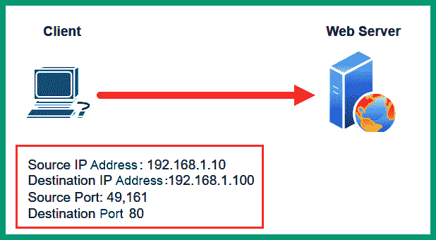

图 7.1 – HTTP 请求消息

下图显示了如何利用来自客户端的源信息发送服务器响应：

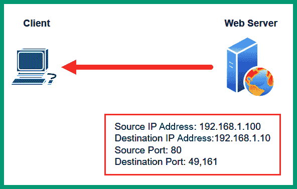

图 7.2 – HTTP 响应

作为一名伦理黑客，识别开放端口有助于我们确定目标系统上运行的服务。此外，您还可以尝试执行横幅抓取（banner grabbing），以识别所有运行服务的版本。服务版本可以用来查找已知的安全漏洞及其在目标系统上特定服务的严重性。

下表显示了端口号的分类：

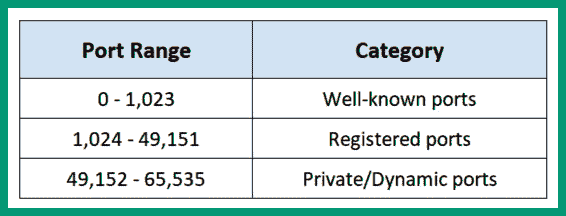

图 7.3 – 端口号范围

如前表所示，端口`1`–`1023`通常被称为知名端口，因为这些端口与常见的应用层协议相关联，如**安全超文本传输协议**（**HTTPS**）、**域名系统**（**DNS**）和**简单邮件传输协议**（**SMTP**）。注册端口是专门分配给特定应用层协议或服务的网络服务端口，而私有/动态端口则是暂时开放的，用于从客户端向网络中的其他系统发送数据包。

接下来，识别目标主机的操作系统非常重要，因为这有助于道德黑客识别可能的安全漏洞，从而利用这些漏洞在目标上建立立足点。此外，不同的操作系统具有不同的安全控制和机制，以及架构，这些都会使它们在面对各种类型的网络攻击和威胁时更加或不那么安全。因此，道德黑客可以利用这些信息，为特定操作系统上的安全漏洞定制攻击和有效负载。

例如，如果您的目标运行的是过时的操作系统版本，如微软 Windows 7，您可以研究已知的安全漏洞以及如何利用它们。例如，**微软安全公告 MS17-010** 描述了在微软 Windows 7 至 Windows Server 2016 操作系统中存在的已知安全漏洞，攻击者可以通过利用主机上的微软**服务器消息块**（**SMB**）版本 1 服务，执行**远程代码执行**（**RCE**）。这些信息在执行漏洞分析和为利用阶段开发有效负载时非常有用。

在扫描网络时，道德黑客可以确定网络拓扑结构的布局，例如识别网络交换机和路由器的位置，以及防火墙等安全设备。这些信息有助于您了解攻击者机器与目标主机之间存在哪些设备。如果网络中存在路由器，这些路由器可能会配置有包过滤功能，如**访问控制列表**（**ACLs**），以过滤源与目标之间的特定第三层和第四层流量。如果网络中存在防火墙，它们可能配置为执行**深度包检查**（**DPI**），以检查应用层流量中的恶意代码，并在网络之间进行高级过滤。因此，了解网络拓扑有助于您更好地规划攻击和未来的操作。

完成本节内容后，您已经学习了主动侦察的重要性以及它如何帮助道德黑客在安全评估过程中发挥作用。接下来，您将学习如何在网络上伪造设备的身份。

# 在网络上伪造身份

道德黑客通常使用与真实对手和威胁行为者相同的**战术、技术和程序**（**TTPs**），目的是在真实黑客能够发现并利用安全漏洞之前，高效地发现目标系统和网络中的隐藏安全漏洞。在道德黑客、渗透测试和红队演练过程中，常用的技术之一是通过伪装设备的 IP 地址和**媒体访问控制**（**MAC**）地址来隐藏自己的身份。

设备可以通过网络中的**动态主机配置协议**（**DHCP**）服务器分配 IP 地址，或者由用户静态分配。无论哪种方式，都允许将 IP 地址分配给设备的**网络接口卡**（**NIC**）。每个设备都有一个独特的 48 位十六进制 MAC 地址，该地址由网络适配器的制造商嵌入在固件中。每当设备在网络上发送数据帧（消息）时，发送方的源 MAC 地址和目标方的目的 MAC 地址都会被插入到数据帧的头部。MAC 地址的前 24 位是制造商唯一的，这部分称为**组织唯一标识符**（**OUI**），任何人都可以通过各种在线数据库查询任何 MAC 地址，以确定设备的制造商和类型。网络安全和网络专业人员可以捕获并分析网络中的数据包，通过设备的 IP 和 MAC 地址识别未授权设备。

以下是用于执行 MAC 厂商查询的在线数据库：

+   Wireshark OUI 查询工具：[`www.wireshark.org/tools/oui-lookup.html`](https://www.wireshark.org/tools/oui-lookup.html)

+   MAC 厂商查询：[`macvendors.com/`](https://macvendors.com/)

+   MAC 地址查询： [`macaddress.io/`](https://macaddress.io/)

作为一个道德黑客，可以考虑将攻击者机器的 MAC 地址更改为组织内常见的设备，如 IP 电话、网络打印机或流行品牌的设备。这样做的目的是确保你的设备不会引起安全团队的注意，从而在道德黑客和渗透测试过程中不会显得过于突出。如果你的设备被分配了网络打印机或 IP 电话的 MAC 地址，那么一个经验不足的安全专业人员可能不会注意到你的设备在网络上向其他系统发送探测信息来收集数据。

要开始伪装攻击者机器的身份，请按照以下说明操作：

1.  首先，启动你的`Kali Linux`虚拟机并登录。

1.  接下来，打开终端并使用以下命令验证连接到我们实验室内`172.30.1.0/24`（*PentestNet*）网络的`eth1`网络适配器的 MAC 地址：

    ```
    kali@kali:~$ ip address show eth1
    ```

以下代码片段显示了`eth1`网络适配器被分配了`08:00:27:7d:98:8e`的 MAC 地址：

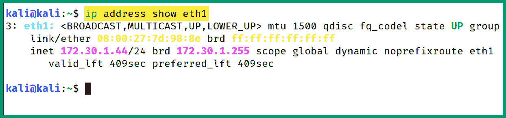

图 7.4 – 验证 MAC 地址

1.  接下来，将 `eth1` 网络适配器的状态更改为 `down`：

    ```
    kali@kali:~$ sudo ifconfig eth1 down
    ```

1.  接下来，我们可以使用预安装的 `macchanger` 工具查看网络适配器上更改 MAC 地址的不同选项：

    ```
    kali@kali:~$ sudo macchanger -h
    ```

以下代码片段显示了更改网络适配器 MAC 地址的各种选项，例如随机生成一个地址、静态设置你偏好的 MAC 地址，以及基于厂商分配地址：

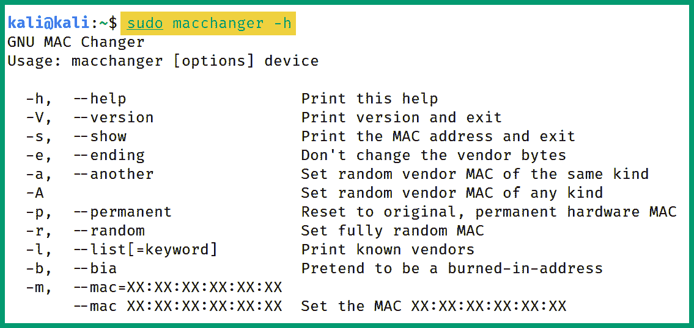

图 7.5 – MAC 地址更改菜单

1.  接下来，将一个随机生成的 MAC 地址分配给 `eth1` 网络适配器：

    ```
    kali@kali:~$ sudo macchanger -A eth1
    ```

以下代码片段显示了网络适配器上当前（原始）MAC 地址和新的随机生成的地址：

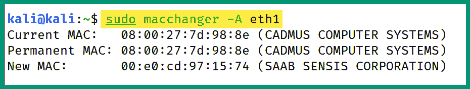

图 7.6 – 伪造的 MAC 地址

1.  接下来，使用以下命令重新启用 `eth1` 网络适配器：

    ```
    kali@kali:~$ sudo ifconfig eth1 up
    ```

1.  接下来，使用 `ip address show eth1` 或 `ifconfig eth1` 命令验证 `eth1` 网络适配器是否处于活动状态，并已分配伪造的 MAC 地址，如下所示：

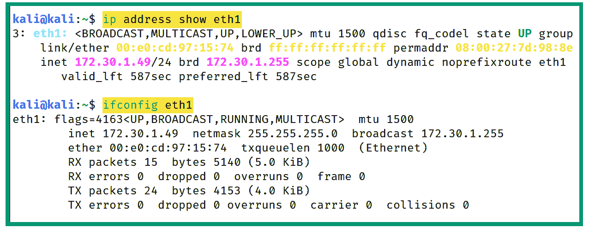

图 7.7 – 验证接口状态

任何来自你 Kali Linux 机器 `eth1` 网络适配器的帧，都将被分配伪造的 MAC 地址作为新的源 MAC 地址。

完成本节内容后，你已经学会了如何伪造网络适配器的 MAC 地址，从而伪装设备的身份。在下一节中，你将学习如何发现和分析网络上的主机。

# 在网络上发现在线主机

主机发现是道德黑客和渗透测试中的一个重要部分，它使道德黑客能够识别组织内网络上哪些系统是可发现且在线的。如果你目标的主机处于离线状态，你将无法识别其安全漏洞并向其发送攻击代码。

有多种技术和工具可以帮助道德黑客高效地发现网络中的在线主机，识别开放端口和正在运行的服务。本节将帮助你发展作为道德黑客进行主机发现的技能和知识。

## 使用 Netdiscover 执行被动扫描

`Netdiscover` 是 Kali Linux 中预安装的工具，能够帮助道德黑客主动扫描网络范围或被动监听和分析网络数据包以发现在线主机。主动扫描会向网络中的每个设备发送探测信号，以确定哪些主机是在线的。而在被动模式下，攻击者的机器捕获到的网络数据包将被分析，从中识别其他设备的 IP 和 MAC 地址。然而，Netdiscover 的被动模式会降低你在网络上的威胁检测等级，除非安全团队主动扫描其网络基础设施以识别未经授权的设备。

要开始使用 Netdiscover 的被动模式，请按照以下说明操作：

1.  首先，启动 `Kali Linux` 虚拟机并登录。

1.  接下来，启动 `Metasploitable 3` 虚拟机。该机器将用于在 `PentestNet` 网络上生成流量。

1.  接下来，在 Kali Linux 上打开终端，使用以下命令验证 `eth1` 网络适配器的 IP 地址和子网掩码：

    ```
    kali@kali:~$ ip addr show eth1
    ```

如下代码片段所示，`eth1` 连接到 `172.30.1.0/24` 网络（*PentestNet*）：

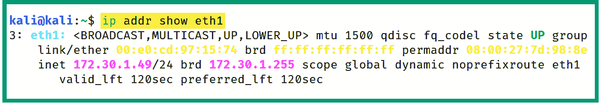

图 7.8 – 检查接口状态

确认攻击者机器上哪个网络适配器连接到了目标网络非常重要。如果你开始扫描错误的网络或 IP 地址范围，可能会陷入法律麻烦，因为扫描行为被视为非法，而且你会违反合法渗透测试协议。

1.  接下来，启用 `Netdiscover` 在被动模式下运行，并监听 `eth1` 接口的网络流量：

    ```
    kali@kali:~$ sudo netdiscover -p -i eth1
    ```

以下代码片段展示了 Netdiscover 成功识别了在 `172.30.1.0/24` 网络上发送消息的设备的 MAC 和 IP 地址：

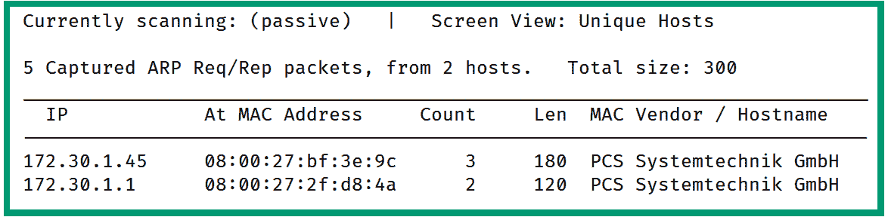

图 7.9 – 被动扫描

Netdiscover 的被动模式只能在 Kali Linux 虚拟机的 `eth1` 网络适配器上分析网络流量。如果你没有看到任何结果，只需使用 `Administrator**/**vagrant` 用户凭据登录 Metasploitable 3 虚拟机，并向 Kali Linux 虚拟机发送 `ping` 消息。

尽管被动扫描可能会减少目标方对你的威胁检测，但它可能无法提供继续进行伦理黑客攻击和渗透测试方法所需的预期结果。接下来，你将学习如何在整个网络中执行 Ping 扫描。

## 执行 Ping 扫描

**Ping 扫描**是 IT 和安全专业人员常用的一种技术，用于轻松识别网络上的存活主机。它通过向网络上的每个主机发送 **ICMP ECHO 请求**消息；当存活主机收到 ICMP ECHO 请求消息时，它会通过发送 **ICMP ECHO 回复**消息响应发送者，表示该主机在线。在客户端和服务器操作系统中，有一个 `Ping` 工具，它利用 **互联网控制消息协议**（**ICMP**），这一网络协议帮助网络专业人员识别常见的网络问题。

以下代码片段展示了客户端与谷歌 DNS 服务器之间的 ICMP 消息 Wireshark 数据包捕获：

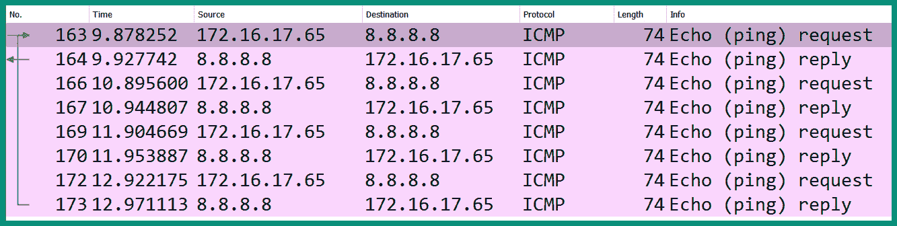

图 7.10 – Ping 消息

如果你想在我们实验室环境中的 *PentestNet* 网络上执行 ping 扫描，你需要对 `172.30.1.0/24` 网络中的每个主机进行 ping，这些主机的范围是从 `172.30.1.1` 到 `172.30.1.254`。这通常是一个手动、枯燥且耗时的任务。然而，作为一名有抱负的道德黑客，你可以使用各种编程语言，甚至是 Linux 操作系统中原生的 `Bourne Again Shell`（**BASH**），来自动化 ping 扫描过程。

要在 Kali Linux 上使用 BASH 自动化 ping 扫描过程，请按照以下说明操作：

1.  首先，启动 `Kali Linux` 和 `Metasploitable 3` Windows 虚拟机。

1.  接下来，登录到 `Kali Linux`，并在终端中使用以下命令创建一个新的 BASH 脚本文件，使用 `nano` 命令行文本编辑器：

    ```
    kali@kali:~$ sudo nano ping-sweep.sh
    ```

1.  接下来，当 Nano 在终端中打开时，键入以下代码来创建脚本：

    ```
    #!/bin/bash
    ```

    ```
    echo "Enter the network ID you want to scan (e.g. 192.168.1.0):"
    ```

    ```
    read network
    ```

    ```
    echo "Enter the subnet mask in CIDR notation (e.g. 24):"
    ```

    ```
    read mask
    ```

    ```
    if [[ $mask =~ ^[0-9]+$ ]] && [ $mask -le 32 ]; then
    ```

    ```
      wildcard=$(( 2**(32-$mask) - 1 ))
    ```

    ```
      network_address=$(echo $network | awk -F'.' '{print $1"."$2"."$3"."0}')
    ```

    ```
      for host in $(seq 1 254); do
    ```

    ```
        ip=$(echo $network_address | awk -F'.' '{print $1"."$2"."$3"."'$host'}')
    ```

    ```
        ping -c1 -W1 $ip > /dev/null
    ```

    ```
        if [ $? -eq 0 ]; then
    ```

    ```
          echo "$ip is up"
    ```

    ```
        fi
    ```

    ```
      done
    ```

    ```
    else
    ```

    ```
      echo "Invalid subnet mask"
    ```

    ```
    fi
    ```

当前面的代码执行时，它将提示用户输入目标网络的网络 ID 和子网掩码。然后，它将计算主机 IP 地址的范围，并向每个主机 IP 地址发送一个 ICMP ECHO 请求消息。

1.  要保存文件，请按 *Ctrl* + *X* 键，然后按 *Y*，按 *Enter* 确认并退出。

1.  接下来，给 `ping-sweep.sh` 文件添加执行权限：

    ```
    kali@kali:~$ sudo chmod +x ping-sweep.sh
    ```

1.  接下来，使用以下命令执行脚本：

    ```
    kali@kali:~$ ./ping-sweep.sh
    ```

以下代码片段显示脚本提示用户输入网络 ID 和子网掩码，然后检查主机是否在线：

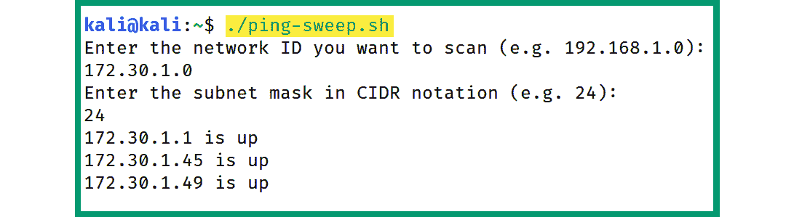

图 7.11 – 一个 ping 扫描

如下截图所示，Ping 工具和前述脚本使用 ICMP 网络协议在 `172.30.1.0/24` 网络上执行 ping 扫描：

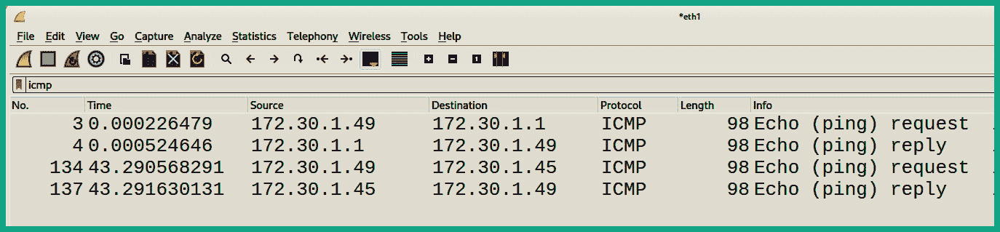

图 7.12 – Wireshark 数据包捕获

尽管前述方法在发现网络中的活动主机时似乎很高效，但系统管理员和安全专家通常会禁用关键资产（如服务器和防火墙）的 ICMP 响应，以减少新手黑客发现这些系统的可能性。此外，在网络上发送过多的 ICMP 消息会产生大量的*噪音*，这会提高道德黑客在网络上的被检测级别。接下来，你将学习如何使用强大的网络扫描器自动化并改进扫描技术，同时降低被检测的风险。

## 使用 Nmap 进行主机发现

**网络映射器**（**Nmap**）是一个功能强大的网络扫描工具，拥有许多高级功能，能够帮助道德黑客和渗透测试人员高效地分析目标。Nmap 使道德黑客能够发现活动主机，并识别开放的**传输控制协议**（**TCP**）和**用户数据报协议**（**UDP**）端口，运行的服务及其版本，以及目标的操作系统。

要开始使用 Nmap 进行主机发现，请按照以下步骤操作：

1.  首先，启动 `Kali Linux` 和 `Metasploitable 3` 虚拟机。和往常一样，攻击者机器是 Kali Linux，目标是 Metasploitable 3。

1.  在 `Kali Linux` 上，打开终端并使用 `ip address` 或 `ifconfig` 命令来识别分配给 `eth1` 接口的 IP 地址，该接口连接到 `172.30.1.0/24` 网络（*PentestNet*）。

如果需要识别攻击者机器（Kali Linux）的 IP 地址，以避免在安全评估期间扫描到自己的设备；否则，您需要从结果中删除其详细信息。

1.  接下来，使用以下命令对整个 `172.30.1.0/24` 网络进行 ping 扫描，同时排除 Kali Linux 机器的 IP 地址：

    ```
    kali@kali:~$ nmap -sn 172.30.1.0/24 --exclude 172.30.1.49
    ```

如以下片段所示，`-sn` 语法指定对目标进行 ping 扫描，而 `--exclude` 允许我们在扫描期间排除一个主机、一组地址或一个网络：

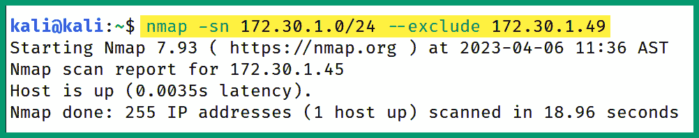

图 7.13 – 使用 Nmap 进行的 ping 扫描

如前面的片段所示，ping 扫描成功识别了 `172.30.1.45` 主机是在线的。

Nmap 在进行 ping 扫描时不会向目标发送典型的 ICMP 消息。如果目标设备被配置为不响应 ICMP 消息，那么传统的 ping 扫描将无法识别主机在网络上的状态。相反，Nmap 会向目标主机发送精心构造的 **TCP 同步**（**SYN**）数据包，目的是触发来自在线主机的 **TCP 确认**（**ACK**）响应。

以下片段展示了 Wireshark 中对 Nmap ping 扫描的一个数据包捕获：

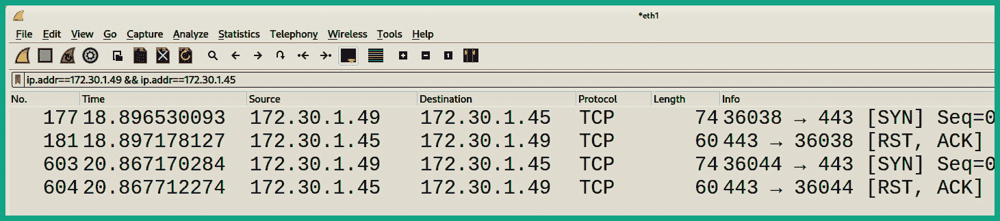

图 7.14 – Wireshark 数据包捕获

如前面的片段所示，Kali Linux (**172.30.1.49**) 向目标 (**172.30.1.45**) 的服务端口 `443`（HTTPS）发送了 `TCP SYN` 消息，目标则通过 `TCP ACK/RST` 数据包响应以确认并重置连接。这个响应表示端口 `443` 是开放的，且目标设备在线。虽然设备可能配置为不响应 ICMP 消息，但 TCP/IP 设计上会响应在开放服务端口上的 `TCP SYN` 数据包，而 Nmap 就利用这一技术来更好地判断目标是否在线。

提示

要了解更多关于 TCP 如何通过三次握手建立连接的内容，请参阅 [`hub.packtpub.com/understanding-network-port-numbers-tcp-udp-and-icmp-on-an-operating-system/`](https://hub.packtpub.com/understanding-network-port-numbers-tcp-udp-and-icmp-on-an-operating-system/)。

1.  接下来，进行端口扫描以识别 Metasploitable 3 上开放的前 1,000 个服务端口：

    ```
    kali@kali:~$ nmap 172.30.1.45
    ```

如下所示，Nmap 成功识别了目标上开放的前 1,000 个服务端口，并确定了其服务：

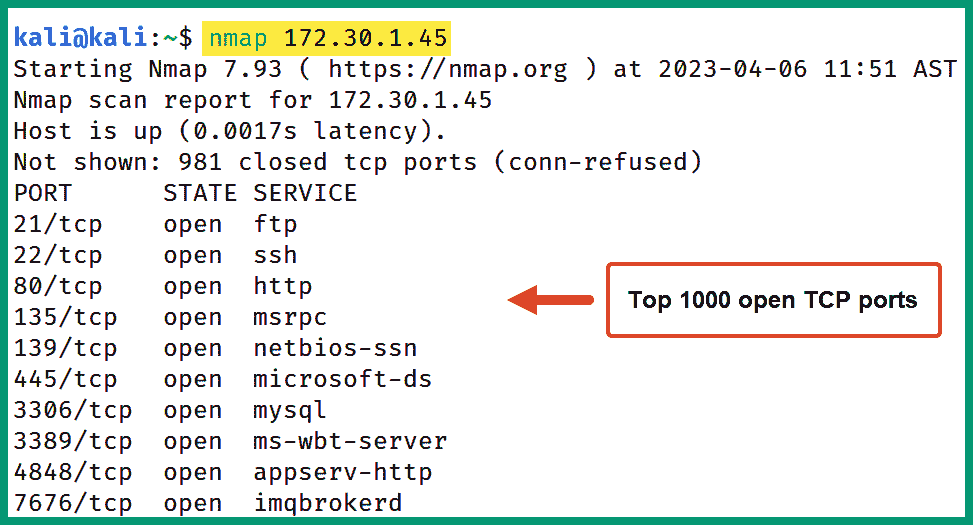

图 7.15 – 识别前 1,000 个服务端口

如前面的代码片段所示，Nmap 帮助我们更好地识别哪些端口是开放的，以及每个开放端口对应的服务。这些信息可以用来识别网络上目标设备的角色、功能及攻击面。例如，前面的代码片段显示端口`22`是开放的，且运行**安全外壳**（**SSH**），这是一种远程访问服务，黑客可以通过它获取系统的立足点。研究每个开放端口的服务，识别其安全漏洞，以及攻击者如何入侵目标系统，非常重要。

重要提示

默认情况下，Nmap 仅扫描 TCP 端口。

1.  接下来，使用 `-p-` 语法指定所有 65,535 个端口，并使用 `-T4` 语法提高扫描速度，如下所示：

    ```
    kali@kali:~$ nmap -T4 -p- 172.30.1.45
    ```

以下代码片段显示 Nmap 已识别目标系统上额外开放的服务端口：

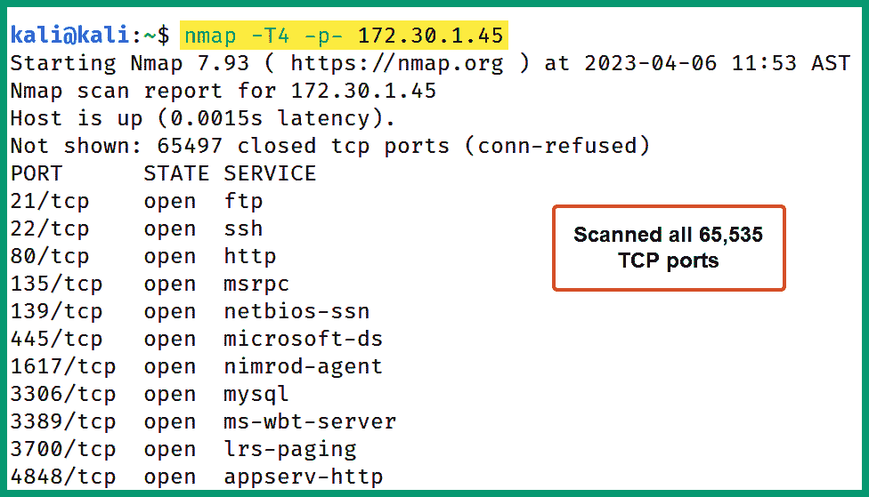

图 7.16 – 扫描所有端口

作为一名道德黑客，扫描目标设备上的所有服务端口，以识别是否有其他运行中的服务，并确定它们是否容易受到网络攻击和威胁，是非常重要的。此外，如果您的目标是进入目标系统，您可能能够利用运行中服务中的安全漏洞。

提示

Nmap 可以通过使用 `nmap 172.30.1.10-100` 语法扫描网络上的一系列主机地址。此外，您可以通过使用 `nmap 172.30.1.10,172.30.1.20,172.30.1.40-50` 命令扫描特定的主机。`-T<0-5>` 允许您为 Nmap 扫描设置时间模板；数值越高，扫描越快。请记住，较快的扫描会增加网络上的噪声，并可能引起安全团队的怀疑。

1.  默认情况下，Nmap 会对目标主机进行 Ping 扫描，以确定主机是否在线，然后继续扫描。然而，如果目标主机被配置为阻止 Nmap 的 Ping 探测，我们可以使用以下命令进行不进行 Ping 的扫描：

    ```
    kali@kali:~$ nmap -PN 172.30.1.45
    ```

以下代码片段显示了前述命令的执行过程：

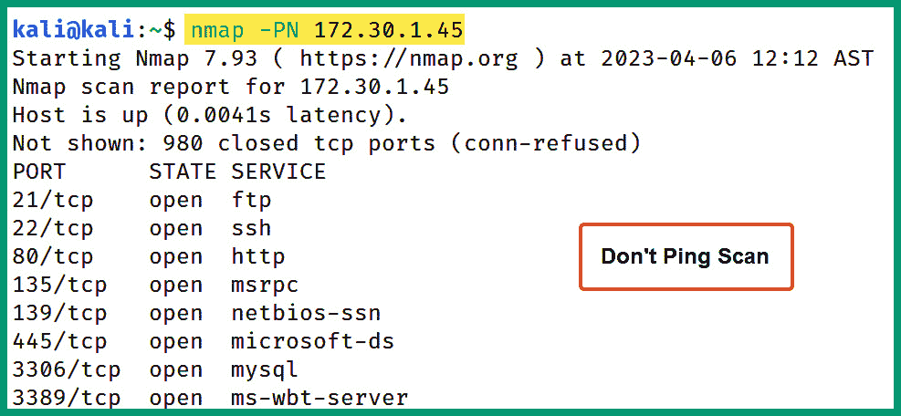

图 7.17 – 不进行 Ping 扫描

1.  要扫描目标系统上开放的前 1,000 个 UDP 服务端口，可以使用以下命令：

    ```
    kali@kali:~$ sudo nmap -sU 172.30.1.45
    ```

以下代码片段显示 Nmap 能够识别目标系统上开放的 UDP 端口：

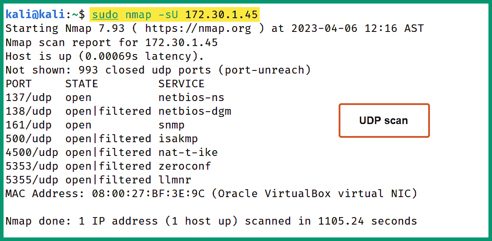

图 7.18 – UDP 端口扫描

由于 Nmap 默认扫描前 1,000 个端口，你可以使用 `nmap -sU -p- 172.30.1.45` 命令扫描目标的所有 65,535 个 UDP 端口。此外，你可以使用 `-p` 语法来指定特定端口或端口范围——例如，`-p22` 和 `-p1-65535`。**–U** 语法允许你使用 `-p** **U:53` 语法来指定 UDP 端口扫描。

重要提示

被过滤的端口表示是否存在防火墙或其他安全机制阻止端口访问，Nmap 无法确定目标端口是开放还是关闭。

1.  要识别目标设备上运行服务的服务版本，请使用以下命令：

    ```
    kali@kali:~$ sudo nmap -sV 172.30.1.45
    ```

以下代码片段显示了 Nmap 能够识别每个运行服务的服务版本：

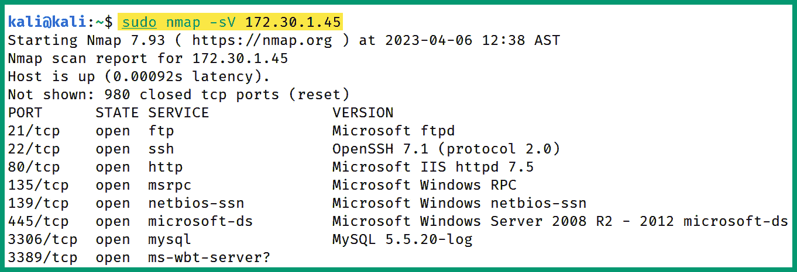

图 7.19 – 识别服务版本

识别服务版本有助于我们确定运行的应用程序或服务是否过时，以及是否存在已知的安全漏洞，这些漏洞可能被利用来获得授权访问。如果你还记得，进行侦察的原因之一是确定目标的攻击面，例如发现安全漏洞和入侵点。

1.  要对目标主机执行操作系统检测，请使用 `-O` 语法，如下所示：

    ```
    kali@kali:~$ sudo nmap -O 172.30.1.45
    ```

以下代码片段显示了 Nmap 能够识别目标主机正在运行 Microsoft Windows 7、8 或 Server 2008：

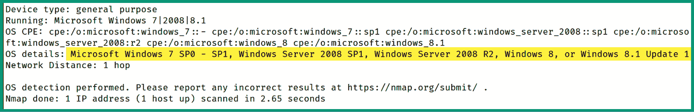

图 7.20 – 识别操作系统

如前面代码片段所示，识别操作系统架构和构建号有助于我们在进行道德黑客和渗透测试时更好地规划未来的攻击。例如，在进入利用阶段之前，你可以研究已知的安全漏洞，并为这个特定操作系统版本开发和测试利用工具。

1.  最后，Nmap 使我们能够通过使用 `-A` 语法执行操作系统检测、服务版本检测、脚本扫描和 traceroute，如下所示：

    ```
    kali@kali:~$ sudo nmap -A 172.30.1.45
    ```

如以下代码片段所示，`-A` 语法使 Nmap 能够同时执行多种扫描技术：

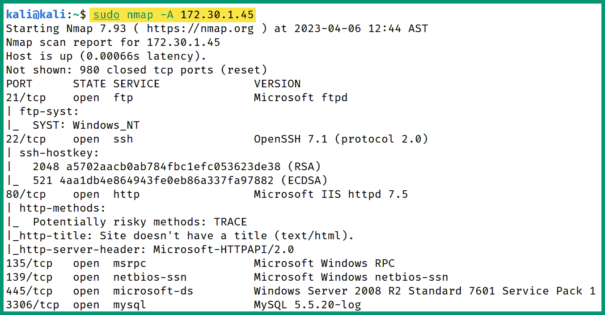

图 7.21 – 多次扫描

如前面代码片段所示，`-A` 语法进一步使 Nmap 能够对每个运行中的服务执行 banner grabbing。Banner grabbing 可以帮助我们收集有关服务的更多信息，例如 Microsoft IIS 服务的头部详情。

此外，以下是扫描的其余部分，显示了 SMB 版本、操作系统版本、计算机名/主机名以及工作组或域：

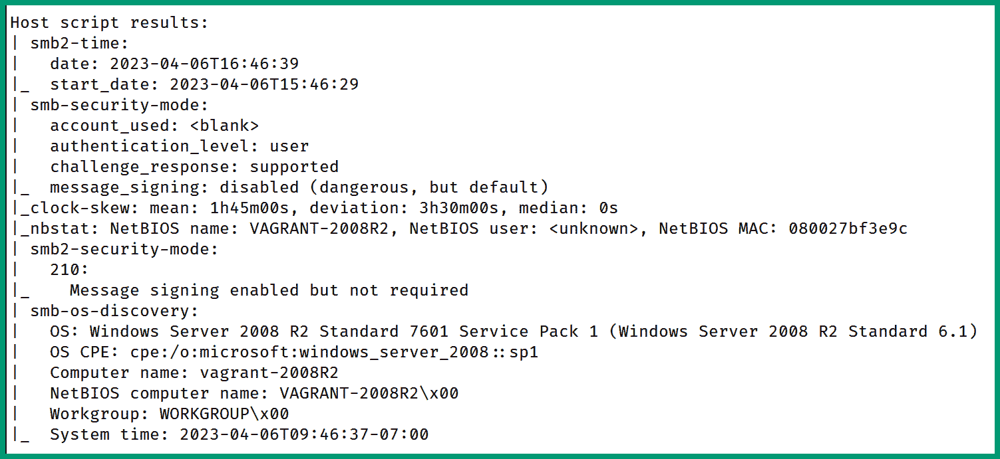

图 7.22 – 操作系统与 SMB 检测

如您所见，Nmap 是一个强大的网络扫描工具，拥有许多功能和能力，能够帮助道德黑客和渗透测试员在目标的主动侦察中收集敏感信息。

提示

要了解更多关于 Nmap 及其扫描功能的信息，请参见 [`nmap.org/book/man.html`](https://nmap.org/book/man.html)。此外，您可以在终端使用`man nmap`命令查看 Nmap 手册页面。

完成本节后，您已学会如何在主动侦察中执行主机发现。接下来，您将学习如何在网络扫描过程中使用规避技术。

# 使用规避技术

当像计算机这样的设备向网络发送数据包时，发送方的 IP 和 MAC 地址会被插入到数据包头中。因此，当道德黑客在网络上执行主机发现时，他们的 IP 和 MAC 地址也会被包含在从其机器到目标主机的每个数据包中。道德黑客和渗透测试员在进行安全评估时总是尽量保持隐蔽，模拟对组织网络基础设施的真实网络攻击。

在主机发现过程中，有多种规避技术可以用来减少被威胁检测系统和目标安全团队发现和追踪的风险。要开始，请使用以下指令：

1.  打开 `Kali Linux` 和 `Metasploitable 3` 虚拟机。确保您已登录到 Kali Linux。

1.  确保识别 Metasploitable 3 的 IP 地址，因为这个虚拟机将作为本次练习的目标。

1.  Nmap 使我们能够通过使用诱饵来执行扫描，欺骗目标认为扫描源来自多个不同的源，而不是来自单一设备。`-D` 语法允许您指定任意数量的诱饵地址，如下所示：

    ```
    kali@kali:~$ nmap 172.30.1.45 -D 172.30.1.20, 172.30.1.21,172.30.1.22
    ```

在 Nmap 执行目标扫描之前，它会检查网络上每个诱饵地址，以确保这些系统在线。如果 Nmap 无法访问某个诱饵地址，它将会将其排除在扫描之外。因此，我建议在执行扫描之前对诱饵系统进行状态检查。

1.  Nmap 使您可以通过使用 `--spoof-mac` 语法，在扫描目标时自动伪造您的 MAC 地址，如下所示：

    ```
    kali@kali:~$ sudo nmap -sT -PN --spoof-mac 0 172.30.1.45
    ```

`-ST` 语法指定通过建立 TCP 三次握手来执行 `TCP Connect` 扫描，`-PN` 指定不对主机进行 ping 操作，`--spoof-mac 0` 表示伪造一个随机的 MAC 地址。以下代码片段展示了扫描过程中伪造的随机 MAC 地址：

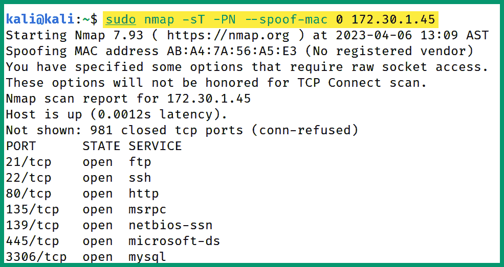

图 7.23 – 伪造随机 MAC 地址

1.  如果您想伪造特定厂商的 MAC 地址，Nmap 允许您插入厂商的名称，如以下命令所示：

    ```
    kali@kali:~$ sudo nmap -sT -PN --spoof-mac dell 172.30.1.45
    ```

以下代码片段显示了 Nmap 使用来自 Dell 的伪造 MAC 地址：

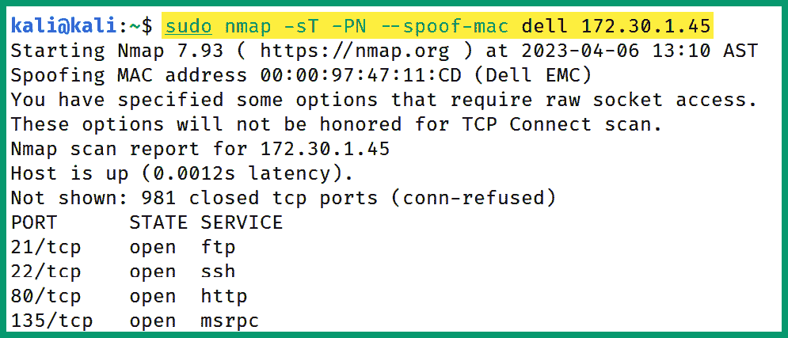

图 7.24 – 伪造供应商地址

1.  如果你想要伪造特定的 MAC 地址，可以将其包括在内，示例如下：

    ```
    kali@kali:~$ sudo nmap -sT -PN --spoof-mac 12:34:56:78:9A:BC 172.30.1.45
    ```

以下片段展示了在 Nmap 扫描过程中，使用了自定义的 MAC 地址作为伪造地址：

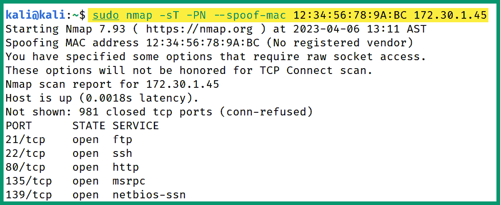

图 7.25 – 使用特定的伪造地址

1.  最后，Nmap 提供了将探测信息作为更小的分片发送到网络上的功能，从而减少被网络安全系统检测到的可能性。以下命令为示例：

    ```
    kali@kali:~$ sudo nmap -f 172.30.1.45
    ```

以下片段展示了 Wireshark 捕获的 Kali Linux（**172.30.1.44**）向 Metasploitable 3（**172.30.1.45**）发送多个 42 字节的分片 IP 数据包：

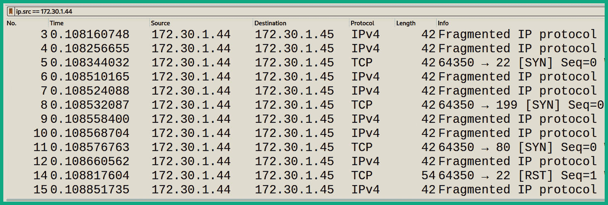

图 7.26 – 分片数据包

重要提示

使用`-sS`语法可以让 Nmap 对目标执行**隐匿扫描**（有时称为*半开扫描*）。隐匿扫描不会与目标建立完整的 TCP 三次握手。然而，Nmap 隐匿扫描可以被经验丰富的网络安全专家轻易检测到。欲了解更多关于 Nmap 隐匿扫描的信息，请参阅[`nmap.org/book/synscan.html`](https://nmap.org/book/synscan.html)。

正如你在本节中学到的那样，道德黑客使用多种技术来在主机发现过程中避免被检测到。在下一节中，你将探索各种枚举技术。

# 枚举网络服务

在道德黑客的主机发现阶段，可以发现许多开放的端口和运行的服务。在主机发现阶段收集的信息将用于进一步研究，以查找那些正在运行的服务中的已知安全漏洞，并了解这些漏洞如何被利用来获得对目标的未经授权的访问。对目标系统上的网络服务进行枚举，帮助道德黑客和渗透测试人员更好地理解目标的网络基础设施和攻击面，以及可以用于向目标投递有效载荷的攻击向量。

## NetBIOS 和 SMB 枚举

**网络基本输入输出系统**（**NetBIOS**）是一种较老的遗留网络协议，常用于基于 Windows 的环境中进行文件和打印共享，以及在**局域网**（**LAN**）中提供名称解析服务。SMB 是一个较新的网络协议，也广泛用于基于 Windows 的环境中进行文件和打印共享服务。作为一名道德黑客，执行 NetBIOS 和 SMB 枚举有助于你识别网络中哪些系统拥有网络共享。配置错误的系统可能使道德黑客能够通过网络访问敏感的目录和文件。

要开始 NetBIOS 和 SMB 枚举，请按照以下说明进行操作：

1.  首先，启动 `Kali Linux` 和 `Metasploitable 3` 虚拟机。Kali Linux 将作为攻击机，Metasploitable 3 将作为目标。

1.  接下来，使用 `nbtscan` 获取 Metasploitable 3 的 NetBIOS 名称和 MAC 地址：

    ```
    kali@kali:~$ nbtscan -r 172.30.1.45
    ```

`-r` 语法用于指定网络上的远程主机，如下所示：

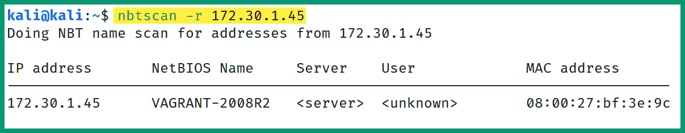

图 7.27 – 一个 NetBIOS 扫描

如果目标主机上有任何已登录的用户，他们的用户名将出现在**用户**字段中。

1.  接下来，使用 `Nmap` 通过扫描端口 `445` 来识别是否在 Metasploitable 3 上运行 SMB，使用以下命令：

    ```
    kali@kali:~$ nmap -A -T4 -Pn -n -p 445 172.30.1.45
    ```

如下片段所示，端口 `445` 是开放的，Nmap 能够获取主机的操作系统信息：

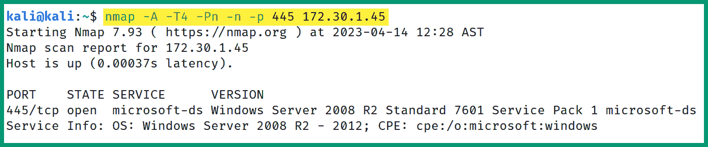

图 7.28 – 识别目标上的 SMB

1.  接下来，使用 Nmap 执行 Metasploitable 3 的 NetBIOS 扫描，命令如下：

    ```
    kali@kali:~$ sudo nmap -sV --script nbstat.nse 172.30.1.45
    ```

如下片段所示，Nmap 能够验证主机的操作系统：

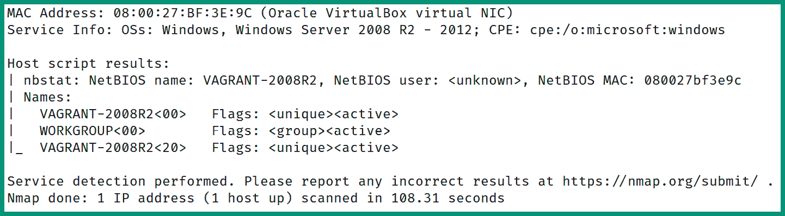

图 7.29 – 识别目标操作系统

1.  由于在 Metasploitable 3 上发现 SMB 运行，使用 `smbclient` 工具来枚举目标上的网络扫描；`-U` 用于指定用户名：

    ```
    kali@kali:~$ smbclient -L //172.30.1.45 -U vagrant
    ```

在提示输入密码时，使用 `vagrant` 允许 `smbclient` 枚举共享，如下所示：

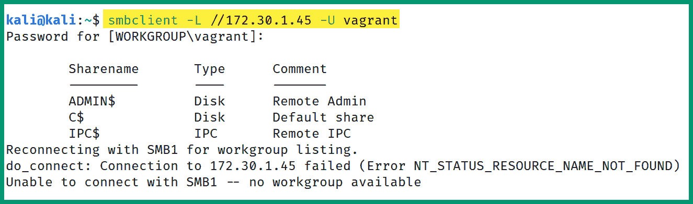

图 7.30 – 网络共享

如前片段所示，目标上有多个网络共享。

提示

要访问网络共享，请使用 `smbclient -L //172.30.1.45/sharename -U vagrant` 命令。确保根据目标调整 IP 地址、共享名称和用户名。

1.  接下来，使用 `smbmap` 工具来识别每个网络共享的权限：

    ```
    kali@kali:~$ smbmap -H 172.30.1.45 -u vagrant -p vagrant
    ```

`-u` 和 `-p` 语法允许我们指定用户名和密码以访问目标，如下所示：

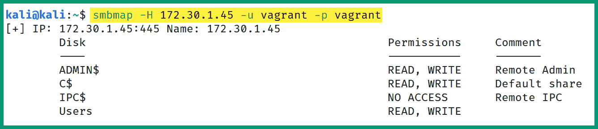

图 7.31 – 共享权限

如前面的片段所示，某些共享使网络用户能够对目录进行读写。对敏感目录的访问在伦理黑客和渗透测试中非常有用。

1.  接下来，使用以下命令通过 Nmap 执行 SMB 共享枚举：

    ```
    kali@kali:~$ sudo nmap -p139,445 --script=smb-enum-shares.nse 172.30.1.45
    ```

以下片段显示 Nmap 尝试查找并枚举目标上的共享：

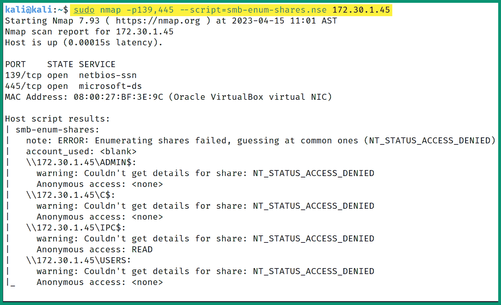

图 7.32 – Nmap SMB 枚举脚本

1.  最后，我们可以使用 Nmap 来识别目标上的 SMB 漏洞，使用以下命令：

    ```
    kali@kali:~$ sudo nmap -p139,445 --script=smb-vuln-* 172.30.1.45
    ```

如下片段所示，Nmap 能够识别目标系统上的安全漏洞，并为我们提供参考信息：

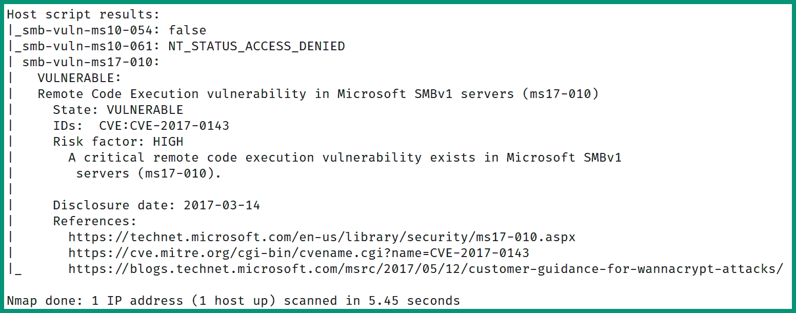

图 7.33 – SMB 漏洞发现

完成本部分后，您已学会如何使用各种工具和技术进行服务枚举。在下一部分，您将学习如何进行无线侦察。

# 无线侦察

无线侦察使道德黑客和渗透测试人员能够识别目标的无线网络，并确定相关客户端、网络设置、工作频率和频道，以及您与接入点之间的大致距离。

当接入点开启时，它会发送**信标**，将其存在和网络信息广告给附近的无线客户端。在这些信标中，接入点会插入网络名称或**服务集标识符**（**SSID**），帮助客户端从多个无线网络中识别一个网络。一旦客户端连接（关联）到无线网络，它会自动将网络信息和密码保存在其**首选网络列表**（**PNL**）中。从此，当客户端启用无线功能时，它会发送**探测**信号来寻找任何已保存的网络；一旦发现网络并在有效范围内，客户端将尝试自动建立关联。作为道德黑客，捕获和分析来自无线网络和客户端的信标和探测数据帮助我们识别目标无线网络是否容易受到无线攻击。

提示

您可以使用`Wigle.net`查找全球的无线网络。该网站还允许用户上传 Kismet 数据，帮助道德黑客定位目标网络。

要开始无线侦察，请按照以下说明操作。

## 第一部分 – 连接无线网卡

要连接无线网卡，请按照以下步骤操作。

1.  将 Alfa AWUS036NHA – 无线 B/G/N USB 适配器连接到您的主机电脑。

1.  接下来，打开**VirtualBox 管理器**，选择`Kali Linux`虚拟机，并点击**设置**，如图所示：

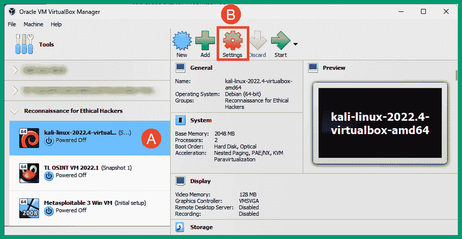

图 7.34 – VirtualBox 管理器

1.  接下来，从左侧菜单中选择`USB`类别，然后选择 USB 2.0 或 3.0 控制器，具体取决于主机电脑上的 USB 接口类型，再点击**添加 USB 设备**图标，如图所示：

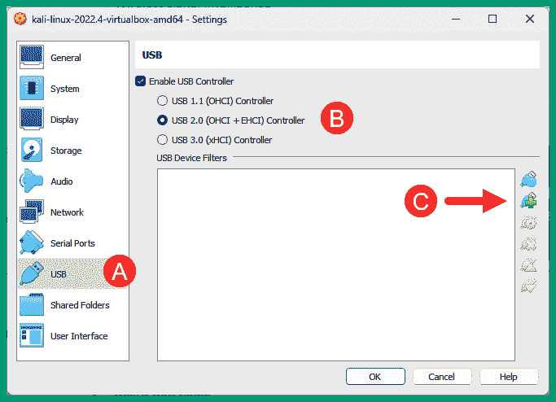

图 7.35 – 设置菜单

1.  点击**添加 USB 设备**图标后，会出现一个侧边菜单，显示所有已连接的 USB 设备。选择无线网卡，如下所示：


图 7.36 – 选择无线网卡

1.  接下来，您将自动返回到主**设置**菜单。点击**确定**以保存：

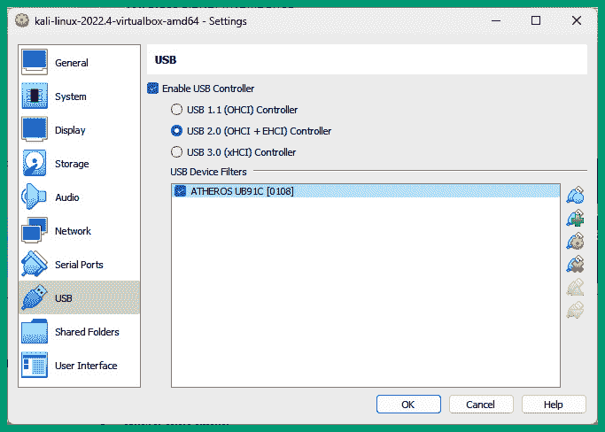

图 7.37 – 无线网卡

如前面的代码片段所示，无线网络适配器现在已作为 USB 设备连接到 Kali Linux 虚拟机。

## 第二部分 – 启用监控模式

要启用监控模式，请按照以下步骤操作：

1.  打开`Kali Linux`虚拟机并登录。

1.  接下来，打开终端并使用`iwconfig`命令识别无线网络适配器，如下所示：

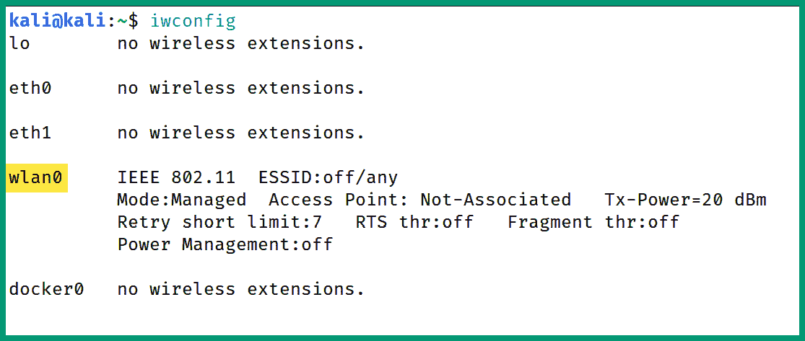

图 7.38 – 验证网络适配器

如前面的代码片段所示，无线网络适配器显示为`wlan0`接口。

1.  接下来，使用`sudo airmon-ng check kill`命令终止可能阻止将`wlan0`接口切换为监控模式的冲突进程：

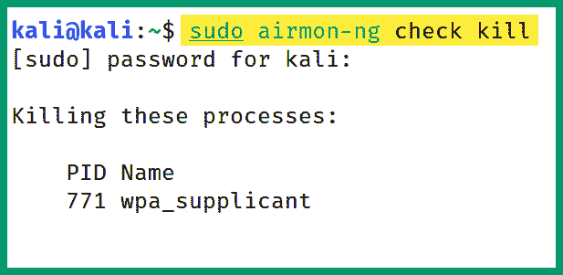

图 7.39 – 杀死进程

1.  接下来，使用`sudo airmon-ng start wlan0`命令在`wlan0`接口上启用监控模式：

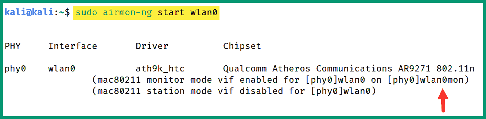

图 7.40 – 启用监控模式

1.  接下来，使用`iwconfig`命令验证新创建的接口。`wlan0mon`已经在 Kali Linux 上创建并可用，如下所示：

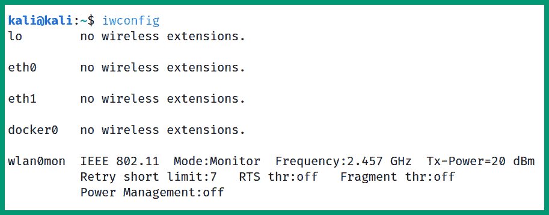

图 7.41 – 验证接口状态

如前面的代码片段所示，`wlan0mon`处于监控模式，这使我们能够捕获无线网络中的信标和探针。

## 第三部分 – 执行无线侦察

要执行无线侦察，请按照以下步骤操作：

1.  使用`Airodump-ng`工具，通过以下命令监控（捕获并分析）几乎所有的信标和探针：

    ```
    kali@kali:~$ sudo airodump-ng wlan0mon
    ```

如下面的代码片段所示，airodump-ng 能够识别无线网络、接入点和客户端（站点）：

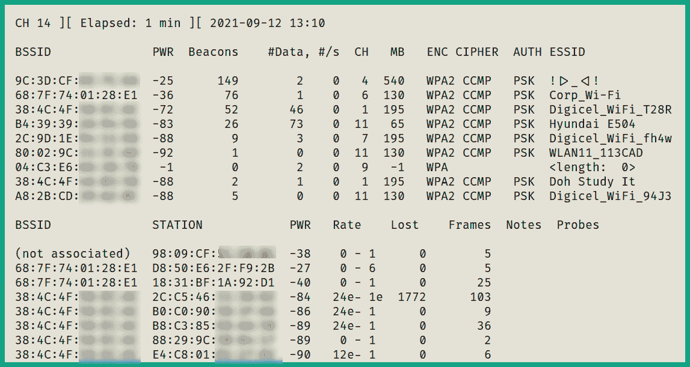

图 7.42 – 无线网络和客户端

以下是前面代码片段中显示的每个字段的描述：

+   `BSSID`：这是**基本服务集标识符**（**BSSID**）或接入点的 MAC 地址。

+   `PWR`：功率水平帮助道德黑客确定他们与接入点或客户端（站点）之间的距离。降低功率水平意味着你离目标更远。

+   **信标**：此字段包含从接入点发送的信标数量。

+   `#Data`：此字段指示捕获到的网络数据包数量。

+   `#/s`：此字段帮助我们确定 10 秒间隔内的数据包数量。

+   `CH`：此字段指示接入点上无线网络的工作频道。

+   `MB`：此字段帮助我们确定无线网络的最大速度。

+   `ENC`：此字段指定无线网络的无线安全标准。

+   `AUTH`：此字段指示无线网络的认证类型或协议。

+   `ESSID`：这是**扩展服务集标识符**（**ESSID**），相当于 SSID 或网络名称。

+   `STATION`：此字段包含几乎所有无线客户端的 MAC 地址，不论它们是否连接到无线网络。

+   `Probes`：此字段显示每个客户端的保存网络，来自它们的 PNL。

以下代码片段通过观察`BSSID`和`STATION`字段，展示了站点与接入点的关联：

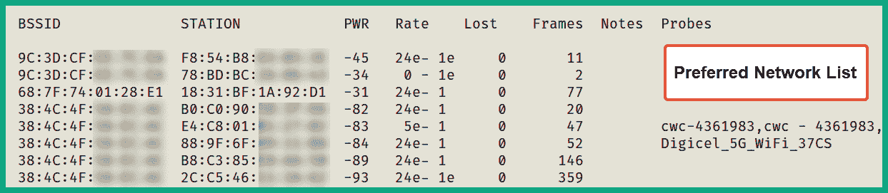

图 7.43 – 识别无线客户端

1.  如果目标无线网络工作在特定频道上，可以使用`-c`语法在特定频道上监听，如下所示：

    ```
    kali@kali:~$ sudo airodump-ng -c 6 wlan0mon
    ```

如下代码片段所示，Airodump-ng 仅监听频道`6`：

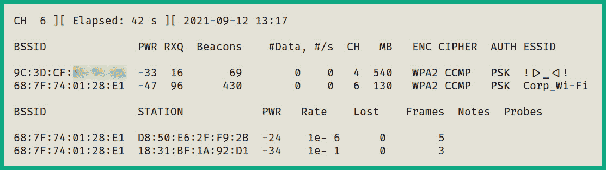

图 7.44 – 在特定频道上监听

这种技术帮助道德黑客筛选出不需要的输出，专注于目标。

1.  若要将焦点集中在特定目标上，可以使用`--essid`语法通过以下命令指定目标 ESSID 网络名称：

    ```
    kali@kali:~$ sudo airodump-ng -c 6 --essid Corp_Wi-Fi wlan0mon
    ```

如下代码片段所示，仅显示`Corp_Wi-Fi`网络及其关联的客户端：

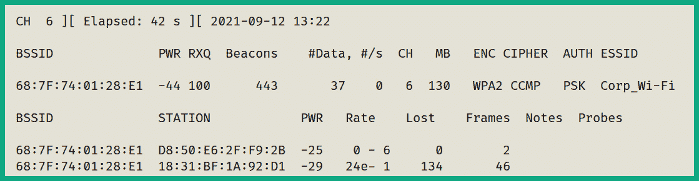

图 7.45 – 筛选网络

1.  传输数据的关联站点将在`STATION`字段下显示。然而，也可能存在空闲的站点，这些站点已与目标网络关联，但在 Airodump-ng 中不会显示。

作为道德黑客，你可以对目标网络执行去关联攻击，强制所有关联的客户端断开连接并重新连接。这项技术使我们能够识别特定网络的所有关联客户端。要执行此操作，打开一个新的终端并使用`Aireplay-ng`发送 100 个去认证的无线帧到目标：

```
kali@kali:~$ sudo aireplay-ng -0 100 -e Corp_Wi-Fi wlan0mon
```

以下代码片段显示了 aireplay-ng 向目标发送去认证攻击：

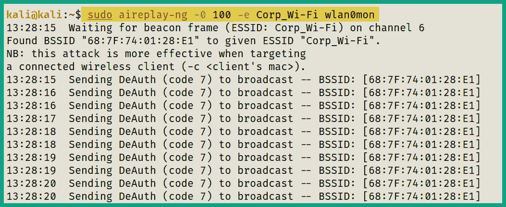

图 7.46 – 去认证攻击

1.  最后，通过检查`Airodump-ng`窗口，你将看到所有其他关联的站点及其 PNL，如下所示：

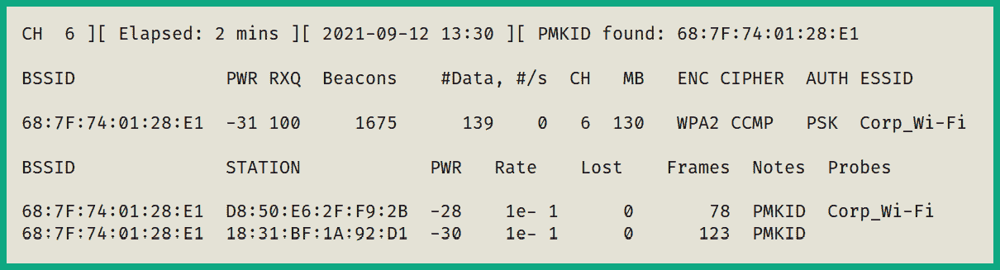

图 7.47 – 观察站点

完成本节内容后，你已经学会如何对无线网络进行主动侦察。

# 总结

在本章中，你了解了主动侦察的重要性以及它如何帮助道德黑客发现活跃的主机，识别开放端口和运行的服务。此外，你还获得了在无线网络基础设施上进行侦察的技能，以识别目标接入点和客户端，以及网络设置。

希望本章对您有所启发，并在您在网络安全行业的旅程中有所帮助。在下一章节中，*执行漏洞评估*，您将学习如何设置和使用漏洞评估工具。

# 进一步阅读

+   端口号的工作原理：[`www.techtarget.com/searchnetworking/definition/port-number`](https://www.techtarget.com/searchnetworking/definition/port-number)

+   TCP 三次握手：[`www.techopedia.com/definition/10339/three-way-handshake`](https://www.techopedia.com/definition/10339/three-way-handshake)
