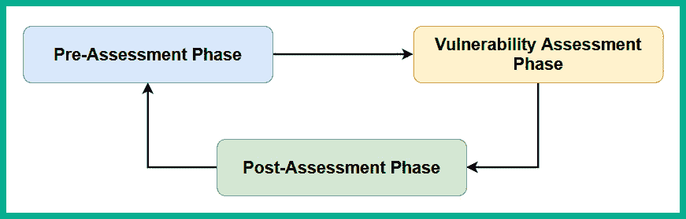
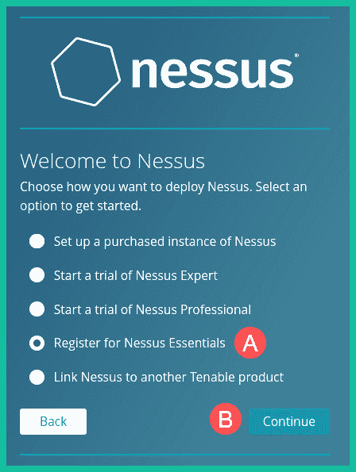
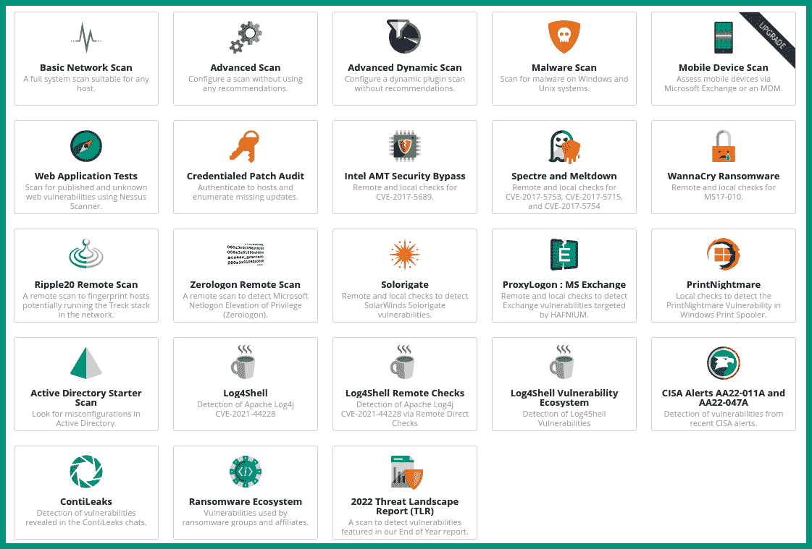

# 第八章：执行漏洞评估

作为网络安全专业人员和威胁行为者之间的竞赛是一个永无止境的马拉松，因为黑客们总是在开发新技术来发现和利用目标系统的安全弱点，安全团队则在不断努力查找隐藏的漏洞，并实施对策来保护其资产，以防真正的网络攻击发生。虽然软件和产品供应商经常推送安全更新和补丁到他们的应用程序中，但没有一个系统是完全安全免受威胁和攻击。因此，组织定期进行道德黑客和渗透测试评估其系统和网络，以查找任何隐藏的安全缺陷，并确定其安全控制是否有效防止真实的攻击和威胁至关重要。

在本章中，您将学习漏洞管理如何帮助组织改善其安全姿态以及网络安全专业人士（如道德黑客）通常使用的技术，以有效地发现其目标系统上的各种安全缺陷。此外，您还将学习如何安装和设置常见的漏洞管理工具，以帮助您作为道德黑客识别和分析系统中的安全漏洞。

在本章中，我们将涵盖以下主题：

+   漏洞管理的重要性

+   使用 Nessus 工作

+   使用 Greenbone 漏洞管理器

+   使用 Nmap 进行漏洞发现

让我们开始吧！

# 技术要求

要跟随本章的练习，请确保您已满足以下硬件和软件要求：

+   Kali Linux: [`www.kali.org/get-kali/`](https://www.kali.org/get-kali/)

+   Metasploitable 3

+   Nessus Essentials: [`www.tenable.com/downloads/nessus`](https://www.tenable.com/downloads/nessus)

# 漏洞管理的重要性

**漏洞**是指存在于系统上的安全弱点，任何人都可以利用它来威胁和破坏目标系统的机密性、完整性和/或可用性，如威胁行为者所示。组织通常会聘请道德黑客和渗透测试人员模拟其系统和网络上的真实网络攻击，以识别公司内部 IT 团队难以发现的隐藏安全缺陷。道德黑客通常使用与真实对手相同的**战术、技术和过程**（**TTPs**），以有效地发现隐藏的安全弱点。通过识别组织内部的安全漏洞，安全团队可以更好地理解真实攻击者如何未经授权访问其网络。此外，组织可以改善其威胁检测、实施对策以预防威胁，并改进其事件响应计划。

作为一名道德黑客，你将使用各种工具和技术来发现安全漏洞，确定目标主机被攻破时的严重性和影响，并提供建议以解决安全缺陷，改善组织的整体安全态势。

以下是网络安全专业人士和研究人员用来收集有关互联网新兴威胁和漏洞信息的常见数据源：

+   **厂商网站**：产品的厂商网站通常包含有关已知安全问题的信息，这些问题直接影响其产品、设备和应用程序。

+   **漏洞信息源**：这些通常是新闻信息源，提供全球社区发现的新安全漏洞的信息。

+   **会议**：这些是以安全为重点的会议，网络安全专业人士和研究人员讨论新漏洞、恶意软件和黑客技术。

+   **学术期刊**：学术界的安全研究人员提供他们关于各种网络攻击和威胁的研究成果。

+   **威胁信息源**：这些是提供实时信息给公众的数据源。

+   `MITRE ATT&CK`：MITRE ATT&CK 框架提供了有关对手用于攻击目标的 TTP（技术、战术和程序）信息。

此外，道德黑客和渗透测试人员可以利用以下公开漏洞数据库中找到的信息，以提高漏洞检测和分类能力：

+   **常见漏洞评分系统**（**CVSS**）：[`www.first.org/cvss/`](https://www.first.org/cvss/)

+   **常见漏洞和暴露**（**CVE**）：[`cve.mitre.org/`](https://cve.mitre.org/)

+   **国家漏洞数据库**（**NVD**）：[`nvd.nist.gov/`](https://nvd.nist.gov/)

+   **常见弱点枚举**（**CWE**）：[`cwe.mitre.org/`](https://cwe.mitre.org/)

以下是系统中可能发现的安全漏洞类型和分类：

+   **默认设置**：这些是由厂商实施并交付给客户的系统和设备配置。默认配置是设备上的基本设置，帮助客户轻松访问设备并进行额外的设备配置。

+   **弱加密**：一些系统包含弱加密协议和算法，攻击者可以利用这些弱加密来访问机密信息并未经授权进入目标设备。

+   **不安全协议**：许多不安全的网络协议以明文传输数据。这些不安全的协议在将数据包放入网络之前不对任何数据进行加密。

+   **开放权限**：许多文件、文件夹、网络共享和设备为任何人提供完全访问权限。这种类型的漏洞可能导致恶意用户获得系统或网络共享的完全控制。

+   **不安全的 root 账户**：如果基于 Linux 的操作系统上的 root 账户没有使用复杂的密码策略和**多因素认证**（**MFA**）进行保护，攻击者可以获得系统的完全管理权限。同样，基于 Windows 的操作系统上的*管理员*账户也应该得到保护。

+   **开放端口和服务**：有时候，系统可能会运行许多不必要的服务。当某些应用程序运行时，它会作为操作系统上的服务进行操作。目标主机上的一些应用程序可能没有完全打补丁，可能包含可以通过网络利用的安全漏洞。此外，一些服务可能会打开网络端口，允许来自远程系统的传入连接。攻击者可以通过网络发起远程利用，利用目标系统上的易受攻击的服务。

+   **零日漏洞**：这些是黑客在供应商未意识到安全问题并且尚未有时间发布安全更新来缓解威胁之前发现并利用的漏洞。零日漏洞被认为是安全团队的噩梦，因为在供应商提供问题信息披露之前，没有已知的安全修复。

+   **遗留系统**：遗留系统通常运行已经达到**生命周期终结**（**EoL**）的操作系统、固件、应用程序和硬件组件，这些组件不再受到供应商的支持。因此，运行遗留系统的网络最容易受到现代网络攻击和威胁的影响。

## 漏洞管理生命周期

漏洞管理是一个持续的生命周期，涉及识别系统中的新安全缺陷，并实施缓解和对策措施，以减少攻击面并提高组织的安全态势。

以下图示展示了漏洞管理的一般生命周期：



图 8.1 – 漏洞管理生命周期

让我们详细探讨这些阶段。

### 预评估阶段

*预评估阶段*侧重于识别组织拥有的所有资产。如果一个组织在其网络上安装了新设备而没有跟踪该系统，IT 团队可能不会管理或监控该设备的安全漏洞，这就增加了网络攻击的风险。此外，应该在所有关键资产（如交换机、路由器、服务器和防火墙）上创建正常操作的基线。基线用于衡量系统或网络的正常和异常行为。

在此阶段，重要的是要深入了解组织及其业务流程。有时，组织的业务流程可能会带来安全风险，并增加黑客攻破公司系统和网络的机会。识别业务流程中的安全漏洞有助于领导团队更好地理解特定行动所带来的风险。

此外，预评估阶段帮助道德黑客确定是否存在任何安全控制措施，以防止黑客的潜在攻击和威胁。此类信息有助于更好地了解公司的攻击面、安全态势以及网络防御。在此阶段，重要的是要确认组织是否已在其运营行业中实施了任何监管标准和框架，并且这些框架是否得到了执行。

最后，预评估阶段用于更好地理解漏洞评估的范围和目标，并获得当局的法律许可，因为漏洞扫描有时可能具有侵入性。

### 漏洞评估阶段

漏洞评估阶段的重点是对目标系统进行不同类型的自动化和手动测试，以识别安全漏洞，并确定其被攻击时的严重性和影响。此外，重要的是，道德黑客要检查每个漏洞，以确定在自动扫描过程中它是否是误报或漏报。

误报是漏洞扫描器上的警报，表示系统存在漏洞，但经过手动测试后实际上并不存在。漏报则是指漏洞扫描器未能检测到目标系统上已知或隐藏的漏洞，但经过手动测试后发现了安全漏洞。因此，验证每个系统上的安全漏洞的真实性是非常重要的，手动测试是必不可少的。最后，在每次漏洞评估中，道德黑客将收集足够的数据，用于分析和报告。

### 评估后阶段

在评估后阶段，道德黑客使用漏洞评估阶段收集的信息，对资产和组织进行风险评估，并根据风险的严重程度和对组织的影响对每个风险进行分类。此外，分析后的数据还将用于确定组织的威胁级别以及被真正的威胁行为者入侵的风险。

道德黑客还会提供建议，说明如何通过实施对策和安全控制来减轻每个风险。考虑优先解决高风险漏洞并分配资源以快速解决它们是非常重要的，因为这些漏洞通常会比其他漏洞产生更大的影响。

当发现安全漏洞时，最好进行**根本原因分析**，以确定目标上安全风险和漏洞的根本原因。这个过程通常帮助伦理黑客更好地识别出适当的解决方案，从而防止这一问题在未来再次发生。

根据建议，组织的内部安全或 IT 团队应实施任何修复、更新和补丁，以及安全控制措施，以防止实际攻击的发生并提高安全防护水平。此外，必须记录每次漏洞评估中所学到的所有经验教训，因为这些经验教训可能在未来发挥作用。

最后，需要持续的监控和验证，以确定推荐的措施是否得到了执行，并且有效地防止了未来来自对手的网络攻击和威胁。这意味着需要定期进行漏洞扫描和使用安全解决方案如**入侵检测系统**（**IDSs**）、**入侵防御系统**（**IPSs**）和**安全信息和事件管理**（**SIEM**）来监控日志。

我们不能忘记，伦理黑客将在漏洞评估过程中分析所有收集的数据，并为组织生成执行报告和技术报告。执行报告侧重于评估的高层次概述，通常呈现给公司高层或领导团队，他们通常是非技术员工。因此，执行报告不应包含任何行话或过多的技术术语，以免让非技术人员感到困惑。技术报告则包含有关漏洞评估的详细信息，如用于识别和验证每个漏洞有效性的工具和技术。

# 使用 Nessus

Nessus 是网络安全行业中最受欢迎的漏洞扫描器之一。它使系统管理员、网络安全专家和合规审计员能够识别目标系统是否包含已知的安全弱点，并且是否符合行业中的各种监管标准。此外，Nessus 可以部署在集中式服务器上，并配置为利用其自动化功能定期对目标系统进行漏洞扫描，从而使伦理黑客能够轻松执行漏洞评估之间的差距分析，以确定组织的安全团队是否实施了应对措施来缓解和防止潜在的网络攻击。

作为一名有志成为伦理黑客和渗透测试员的人，获得实践经验至关重要，尤其是在设置 Nessus 并对目标系统执行漏洞扫描和评估时。要开始设置 Nessus，请参考以下说明。

重要说明

在使用 M1 Mac（ARM64）芯片的 Parallels 上设置 Kali Linux 的 Nessus 时遇到了一些挑战。但在基于 Windows 的机器上，设置过程一切正常。

## 第一部分 – 设置 Nessus

在本次练习中，您将学习如何在 Kali Linux 上安装 Nessus Essentials，并对我们的目标系统 Metasploitable 3 进行漏洞发现：

1.  首先，启动 Kali Linux 和 Metasploitable 3 虚拟机。

1.  然后，打开网页浏览器，访问 [`www.tenable.com/products/nessus/nessus-essentials`](https://www.tenable.com/products/nessus/nessus-essentials)，并注册一个免费的 Nessus Essentials 许可证密钥。注册后，Tenable 将通过您提供的电子邮件地址发送唯一的 Nessus Essentials 许可证密钥。

1.  在 Kali Linux 上，打开终端并使用以下命令更新软件包仓库列表：

    ```
    kali@kali:~$ sudo apt update
    ```

1.  接下来，使用以下命令将 Nessus 软件下载到 Kali Linux 上：

    ```
    kali@kali:~$ curl --request GET \
    ```

    ```
      --url 'https://www.tenable.com/downloads/api/v2/pages/nessus/files/Nessus-10.5.1-debian10_amd64.deb' \
    ```

    ```
      --output 'Nessus-10.5.1-debian10_amd64.deb'
    ```

以下图示展示了执行前述命令的过程：


图 8.2 – 下载 Nessus

或者，您可以从 [`www.tenable.com/downloads/nessus`](https://www.tenable.com/downloads/nessus) 下载 Nessus 软件（`Linux - Debian - AMD64`，适用于 Kali Linux）。

1.  接下来，使用以下命令安装 Nessus 软件包：

    ```
    kali@kali:~$ sudo dpkg -i Nessus-10.5.1-debian10_amd64.deb
    ```

以下图示展示了安装过程的开始：


图 8.3 – 安装过程

1.  接下来，在 Kali Linux 上启动并重新启动 Nessus 服务：

    ```
    kali@kali:~$ sudo /bin/systemctl start nessusd.service
    ```

    ```
    kali@kali:~$ sudo /bin/systemctl restart nessusd.service
    ```

1.  一旦 Nessus 服务启动，打开 Kali Linux 内的网页浏览器，访问 https://kali:8834/ 以进入 Nessus 网页界面，并确保您已接受安全警告，如下所示：


图 8.4 – 安全警告

1.  接下来，您将看到 Nessus 初始化页面。点击 **继续**：


图 8.5 – Nessus 初始化页面

1.  接下来，选择 **注册 Nessus Essentials** 并点击 **继续**：



图 8.6 – Nessus 部署

1.  由于您已经在 *步骤 2* 中注册了 Nessus Essentials 许可证密钥，点击此处注册窗口中的 **跳过**：


图 8.7 – Nessus 注册窗口

1.  接下来，从您的电子邮件中复制许可证密钥，并将其粘贴到 **激活码** 字段中，然后点击 **继续**，如图所示：


图 8.8 – 激活码

1.  接下来，Nessus 将显示激活码/许可证信息。点击 **继续**：


图 8.9 – 许可证信息

1.  接下来，创建您的用户账户并点击 **提交**：


图 8.10 – 创建用户账户

1.  接下来，Nessus 将开始其初始化过程并下载额外的更新插件。根据你的互联网服务，通常这个过程需要几分钟。初始化完成后，Nessus 会自动登录到用户仪表板。

1.  第一次登录时，Nessus 需要一些时间来编译所有插件，之后才能执行任何扫描。

## 第二部分 – 使用 Nessus 进行扫描

1.  要开始使用 Nessus Essentials 进行第一次漏洞扫描，请点击**新建扫描**：


图 8.11 – 启动新扫描

1.  接下来，你将看到各种扫描模板，用于发现目标系统上的常见安全漏洞，如 PrintNightmare、WannaCry 和 Log4Shell。点击**基础` `网络扫描**：



图 8.12 – 扫描模板

1.  在**设置**页面，填写必填字段，例如为扫描设置名称，并将 Metasploitable 3 虚拟机的 IP 地址设置为目标系统，然后点击**启动**：


图 8.13 – 第一次扫描

1.  接下来，扫描进度将在**我的扫描**摘要窗口中显示，如下所示：


图 8.14 – 扫描进度

扫描完成后，扫描状态将自动更新，如下图所示：


图 8.15 – 扫描完成

作为一名道德黑客，你经常需要对多个资产进行定期漏洞评估。Nessus 使你能够自动化不同类型的扫描，配置资产和漏洞发现技术、评估类型以及报告。

## 第三部分 – 漏洞分析

1.  要查看扫描结果，请点击**我的扫描** | **我的第一次扫描**来显示摘要：


图 8.16 – 扫描结果

如前图所示，柱状图显示了根据漏洞严重性等级找到的安全漏洞数量，甜甜圈图则展示了漏洞的概览。

1.  接下来，点击柱状图查看目标主机上所有安全漏洞的列表：


图 8.17 – 漏洞列表

如前图所示，多个安全漏洞按严重性等级分组。

1.  接下来，点击**严重**严重性等级以查看主机上所有严重安全漏洞的列表：


图 8.18 – 严重安全漏洞

如前面的图示所示，Nessus 能够使用 CVSS 评估每个漏洞的严重性评分，CVSS 是一个开放的评分计算工具，广泛用于网络安全专业人员和研究人员，以确定漏洞的严重性级别和风险。与 CVSS 类似，Tenable 使用他们的**漏洞优先级评分**（**VPR**）评分系统来确定安全风险。

重要说明

严重性评分帮助网络安全专业人员在决策过程中，将资源优先分配给那些更严重、会造成更高影响的风险和漏洞。因此，始终确定每个安全漏洞的严重性评分非常重要。

1.  接下来，点击任何一个关键的安全漏洞，查看更多详细信息：


图 8.19 – 安全漏洞详细信息

如前面的图示所示，Nessus 提供了安全漏洞的完整描述，并提出了如何缓解或解决该问题的建议。

1.  此外，漏洞详细信息页面还显示了用于确定 CVSS 得分的指标，如图所示：


图 8.20 – CVSS 指标

如前面的图示所示，Nessus 使用了多个不同版本的 CVSS 进行计算。

1.  让我们使用以下 CVSS 3.0 向量来确定黑客如何能够攻破目标。复制以下代码：

    ```
    CVSS:3.0/AV:N/AC:L/PR:N/UI:N/S:U/C:H/I:H/A:H
    ```

1.  接下来，将 CVSS 向量附加到以下 URL 的末尾：

[`www.first.org/cvss/calculator/3.0#`](https://www.first.org/cvss/calculator/3.0#)

这会生成以下带有 CVSS 向量的最终 URL：

[`www.first.org/cvss/calculator/3.0#CVSS:3.0/AV:N/AC:L/PR:N/UI:N/S:U/C:H/I:H/A:H`](https://www.first.org/cvss/calculator/3.0#CVSS:3.0/AV:N/AC:L/PR:N/UI:N/S:U/C:H/I:H/A:H)

1.  接下来，使用您的网页浏览器访问最终网址，查看用于确定漏洞评分的实际指标，如下所示：


图 8.21 – CVSS 基本评分

根据前面的图示，黑客需要设计一个能够通过网络传输、并对目标具有**低（L）**复杂度的漏洞利用程序。该漏洞利用程序不需要更高的权限，也不需要用户交互即可在主机上执行。漏洞利用过程中，作用范围将保持**不变（U）**，且对主机的机密性、完整性和可用性产生**高（H）**影响。

提示

要了解更多有关 CVSS 的信息，请访问[`www.first.org/cvss/`](https://www.first.org/cvss/)。

1.  要从 Nessus 生成漏洞报告，请在右上角点击**报告**。

1.  接下来，会出现一个弹出窗口。选择报告格式和模板，然后点击**生成报告**，如图所示：


图 8.22 – 生成报告

一旦报告生成后，保存到桌面并使用 PDF 阅读器打开，如下所示：


图 8.23 – Nessus PDF 报告

完成这一部分后，你已经学会了如何设置和使用 Nessus 进行漏洞发现。在接下来的部分，你将学习如何使用开源漏洞管理工具发现目标系统中的安全漏洞。

# 使用 Greenbone 漏洞管理器

**Greenbone 漏洞管理器**(**GVM**) 是一款开源漏洞管理工具，使得道德黑客能够利用 **网络威胁情报**(**CTI**) 高效地发现目标系统中的安全弱点。

若要开始设置 GVM，请使用以下说明。

## 第一部分 – 设置 GVM

1.  首先，启动 Kali Linux 和 Metasploitable 3 虚拟机。

1.  接下来，在 Kali Linux 上打开终端，使用以下命令更新软件包仓库列表并安装 GVM：

    ```
    kali@kali:~$ sudo apt update
    ```

    ```
    kali@kali:~$ sudo apt install gvm
    ```

1.  安装完成后，使用以下命令启动 GVM 设置过程：

    ```
    kali@kali:~$ sudo gvm-setup
    ```

这个设置过程通常需要几分钟完成，因为它会下载额外的插件和更新。一旦设置完成，*admin* 账户将会创建，并且生成一个随机密码，如下所示：


图 8.24 – GVM 设置

1.  接下来，执行 `sudo gvm-check-setup` 命令以确保 GVM 设置正确。

1.  一旦一切配置正确，在 Kali Linux 上打开 Web 浏览器，访问 [`127.0.0.1:9392`](https://127.0.0.1:9392)，并接受安全风险以访问 GVM Web 界面。

1.  确保使用默认的用户名（*admin*）和设置过程结束时生成的密码，然后点击 **登录**，如图所示：


图 8.25 – GVM 登录页面

1.  登录到 GVM 后，点击 **管理** | **源状态**，如图所示：


图 8.26 – GVM Web 界面

GVM 将继续从各种数据源下载并安装额外的 CTI，以确保 GVM 能够利用最新的 CTI 数据识别目标系统中的安全漏洞：


图 8.27 – 源状态

下载过程通常需要相当长的时间才能完成。在继续执行任何漏洞扫描之前，确保所有源状态都是最新和最新的：


图 8.28 – 当前源状态

## 第二部分 – 使用 GVM 扫描

1.  要使用 GVM 执行漏洞扫描，首先点击 **配置** | **目标** 以添加目标：


图 8.29 – 目标选项

1.  接下来，点击左上角的 **新建目标** 图标。

1.  **新目标**窗口将出现。确保为目标设置名称，并在**主机**字段中插入 Metasploitable 3 的 IP 地址。然后，点击**保存**：


图 8.30 – 添加新目标

如前图所示，**新目标**菜单提供了额外的选项，可以从文本文件扫描一组 IP 地址，排除单个或多个主机，扫描目标服务端口，并选择是否对目标执行身份验证扫描或非身份验证扫描。

1.  接下来，要在 GVM 中创建扫描任务，请点击**扫描** | **任务**，如图所示：


图 8.31 – 访问任务菜单

1.  接下来，点击**魔术纸**图标（左上角），然后选择**新任务**，如图所示：


图 8.32 – 创建新任务

1.  **新任务**窗口将出现。确保为任务设置名称，并从下拉菜单中选择**扫描目标**。然后，点击**保存**，如图所示：


图 8.33 – 创建新任务

1.  新创建的扫描任务将出现在同一窗口的下部。点击**播放**按钮以启动任务：


图 8.34 – 启动扫描

扫描状态会随着扫描进度的变化而变化。一旦扫描完成，状态会变为**完成**，并显示整体漏洞严重性，如图所示：


图 8.35 – 扫描完成

## 第三部分 – 漏洞分析

1.  要查看 GVM 的漏洞分析，请点击**扫描** | **报告**，如图所示：


图 8.36 – 漏洞摘要

如前图所示，GVM 将安全漏洞的数量分类为**高**、**中**、**低**、**日志**，甚至**假阳性**。这些严重性评级帮助网络安全专业人员优先分配资源，解决更关键的问题。

1.  接下来，点击任务名称以查看其详细信息，如所有发现的安全漏洞：


图 8.37 – 查看安全漏洞

如前图所示，GVM 提供了安全漏洞的名称、严重性评级和**检测质量**（**QoD**）、位置（端口号）。QoD 值由 Greenbone 用于显示 GVM 漏洞检测的可靠性。

1.  要查看漏洞的详细信息，只需点击一个漏洞以查看其描述，如图所示：


图 8.38 – 漏洞详情

此外，详情页面提供了关于如何检测安全漏洞、受影响的软件和操作系统、以及漏洞的影响和解决方案的信息，如下所示：


图 8.39 – 解决方案和建议

提示

欲了解更多关于 GVM 的信息，请访问[`github.com/greenbone/gvmd`](https://github.com/greenbone/gvmd)。

在本节中，你已经学习了如何安装、设置和使用 GVM 进行漏洞扫描。在下一节中，你将学习如何使用 Nmap 识别目标系统的常见安全漏洞。

# 使用 Nmap 进行漏洞发现

正如你在前一章中学到的，Nmap 是网络安全行业中常用的网络扫描工具，它可以发现主机系统、识别开放端口、检测服务版本，并对目标系统进行操作系统分析。此外，还有**Nmap 脚本引擎**（**NSE**），它集成在 Nmap 中，提供通过自定义 Nmap 脚本执行高级扫描的能力，用于检测目标系统的常见安全漏洞。然而，NSE 组件使用的 Nmap 脚本可能会很激进，甚至有可能导致系统崩溃和数据丢失。因此，作为道德黑客，在进行安全评估时，考虑使用 NSE 可能带来的风险和影响是非常重要的。

有很多预先构建好的 NSE 脚本，这些脚本已经预安装在 Kali Linux 中。以下是 NSE 脚本的各个类别：

+   `Auth`：这个类别的 NSE 脚本对于检测目标系统的身份验证机制是否能够被绕过非常有用。这些信息对于那些寻求突破目标系统防御的道德黑客非常有帮助。

+   `Broadcast`：这个类别的脚本对于发现网络中的主机系统非常有用。

+   `Brute`：这个类别的脚本帮助道德黑客确定目标是否容易受到各种类型的暴力破解攻击。

+   `Default`：这个类别包含在网络扫描过程中与 NSE 一起使用的默认脚本。

+   `Discover`：Discover 类别包含在主动侦察期间用于收集网络中在线系统的敏感信息的脚本。

+   `DoS`：**拒绝服务**（**DoS**）类别包含专门设计的脚本，用于检查目标系统是否容易受到黑客发起的 DoS 攻击。

+   `Exploit`：这个类别的脚本通常用于确定目标系统是否存在已知的安全漏洞。

+   `External`：这个类别的脚本用于将 Nmap 收集到的数据发送到外部资源，以进行额外的数据处理。

+   `Fuzzer`：这个类别包含设计用来向应用程序发送格式错误的数据的脚本，以确定是否存在软件漏洞和缺陷。

+   **侵入性**：该类别中的脚本被认为是*高风险*的，因为它们有可能使系统崩溃。

+   **恶意软件**：基于恶意软件的脚本用于检测网络中被恶意软件感染的主机。

+   **安全**：这些脚本被认为是非侵入性且安全的，用于扫描目标。

+   **版本**：此类别的脚本用于收集目标上运行应用程序的服务版本。

+   **漏洞**：这些脚本用于检查目标是否存在已知的安全漏洞。

提示

要查看每个 NSE 脚本的列表和描述，请参考 [`nmap.org/nsedoc/scripts/`](https://nmap.org/nsedoc/scripts/)。

要在 Kali Linux 上开始使用 NSE，请按照以下说明进行操作：

1.  首先，启动 Kali Linux 和 Metasploitable 3 虚拟机。

1.  在 Kali Linux 上打开终端，使用以下命令查看目录和 Nmap 脚本列表：

    ```
    kali@kali:~$ ls -l /usr/share/nmap/scripts
    ```

以下图示显示了前述命令的执行以及 NSE 脚本的列出：


图 8.40 – 查看 NSE 脚本

1.  接下来，使用带有通配符（*****）的以下命令查看 HTTP 漏洞检测脚本列表：

    ```
    kali@kali:~$ ls -l /usr/share/nmap/scripts/http-vuln*
    ```

如下图所示，前面的命令使您能够过滤 HTTP 漏洞 NSE 脚本：


图 8.41 – 过滤 NSE 脚本

1.  接下来，使用以下命令过滤所有 NSE `Server Message Block** (`SMB**) 漏洞脚本：

    ```
    kali@kali:~$ ls -l /usr/share/nmap/scripts/smb-vuln*
    ```

以下图示展示了 SMB 漏洞脚本列表：


图 8.42 – SMB 脚本

1.  接下来，让我们使用以下命令执行所有 SMB 漏洞脚本，以扫描 Metasploitable 3 虚拟机：

    ```
    kali@kali:~$ sudo nmap --script smb-vuln* 172.30.1.45
    ```

以下图示显示了 `smb-vuln-ms17-010` 脚本在目标上发现了已知的安全漏洞：


图 8.43 – 发现安全漏洞

如前图所示，NSE 脚本能够识别目标主机上存在 EternalBlue 漏洞。此外，脚本还提供了参考资料，以帮助更好地理解如果一个真实的攻击者利用该安全漏洞，可能会造成的严重性和影响。作为道德黑客，这些信息可以用来开发或获取能够利用该安全漏洞的攻击工具，以在目标系统上建立立足点。

有许多 Nmap 脚本可以帮助您识别系统中的漏洞。根据您的安全评估，您可以使用关键字帮助过滤适合的 Nmap 脚本，以识别目标上的特定安全漏洞。然而，重要的是要记住，在进行安全评估时永远不要仅依赖一个漏洞扫描器，因为它们有时可能会提供假阴性结果。

在本节中，你学习了如何使用 Nmap 中的 NSE 组件来识别系统中的安全漏洞。

# 总结

在本章过程中，你了解了漏洞管理的重要性以及它如何帮助组织识别和解决其资产中的安全弱点。此外，你还学习了如何设置和使用 Nessus、GVM 和 NSE 来识别目标上的安全漏洞。

一旦发现安全漏洞，伦理黑客应该进行额外的研究，确定如何利用该漏洞并获得对目标的未经授权的访问。这意味着伦理黑客可以自行开发利用工具，或者从公开来源获取利用工具，并在模拟环境中进行测试，以确定该利用工具成功利用目标漏洞的可能性。

希望本章内容对你有所启发，并在你进入网络安全行业的旅程中提供帮助。在下一章中，*第九章*，*深入网站侦察*，你将学习如何分析网站技术和应用程序。

# 进一步阅读

+   漏洞评估：[`www.techtarget.com/searchsecurity/definition/vulnerability-assessment-vulnerability-analysis`](https://www.techtarget.com/searchsecurity/definition/vulnerability-assessment-vulnerability-analysis)

+   漏洞分析的好处：[`www.hackerone.com/knowledge-center/what-vulnerability-assessment-benefits-tools-and-process`](https://www.hackerone.com/knowledge-center/what-vulnerability-assessment-benefits-tools-and-process)
