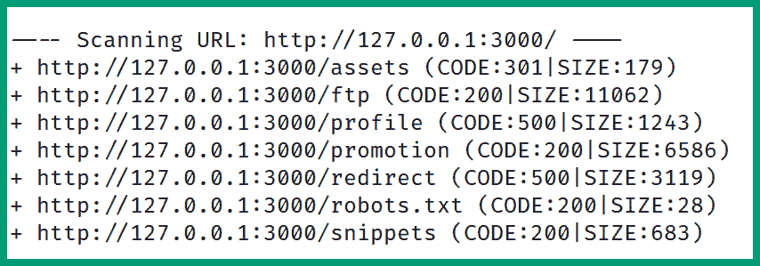

# 第九章：深入网站侦察

随着互联网的不断发展，组织每天几乎都会创建许多网站，以帮助他们超越传统边界，接触到新的潜在客户。威胁行为者通常会进行大量侦察，以尽可能多地收集信息并获取目标网站和域名的情报。这些信息对威胁行为者在规划未来网络攻击时非常有价值。作为一名伦理黑客，识别攻击面并确定网络侦察如何被真实攻击者用于规划网络攻击至关重要。

在本章中，您将学习如何使用常见的工具和技术来高效地收集有关目标的信息，例如其 IP 地址和子域，发现隐藏的目录，并识别攻击面。此外，您将学习如何使用 web 漏洞扫描器来识别 web 应用程序的弱点，并使用 web 侦察框架来自动化数据的收集和分析。

本章将涵盖以下主题：

+   收集域名信息

+   子域枚举

+   执行目录枚举

+   Web 应用程序漏洞

+   网站侦察框架

让我们深入了解！

# 技术要求

要跟随本章中的练习进行，请确保您的硬件和软件符合以下要求：

+   Kali Linux 已安装 – [`www.kali.org/get-kali/`](https://www.kali.org/get-kali/)

# 收集域名信息

作为一名伦理黑客，收集 **域名系统**（**DNS**）信息和 IP 地址，并确定后端基础设施，有助于您更好地了解目标的攻击面和攻击向量。例如，如果您正在进行外部网络渗透测试或 **开放源代码情报**（**OSINT**）渗透测试，查找目标的域名和网站是一个不错的起点。域名可以帮助您发现目标的网页、子域以及分配给目标所拥有服务器的 IP 地址。

本节重点介绍使用各种战术和技术来检索 IP 地址、发现基础设施细节，并在目标的 web 服务器和域名上运行 web 技术。

## 检索 IP 地址

通过检索目标域及其子域的 IP 地址，伦理黑客可以映射外部网络拓扑并识别潜在的安全漏洞，攻击者可以利用这些漏洞获得未授权的访问权限。此外，如果没有识别目标的 IP 地址，伦理黑客将无法模拟现实世界中的网络攻击，进而确定组织的安全态势。

要开始识别域名的 IP 地址，请使用以下说明：

1.  首先，启动 `Kali Linux` 虚拟机，并确保它具有互联网连接。

1.  接下来，打开终端并使用 `host <domain-name>` 命令检索目标的 IPv4 和 IPv6 地址，如下所示：


图 9.1 – host 命令

域名仅仅是网络（如互联网）上的一个命名空间；然而，关联到域名或主机的 IP 地址指示了目标的网络位置。如前面的代码片段所示，执行对这些地址的 IP 查询可以揭示托管服务器或目标的地理位置。

提示

要识别网络地址的地理位置，请访问 [`whatismyipaddress.com/ip-lookup`](https://whatismyipaddress.com/ip-lookup)，对任何公共 IP 地址执行 IP 查询。

1.  接下来，`nslookup` 工具用于排查 `DNS` 问题并检索主机名的 IP 地址。要获取域名的 IP 地址，请使用 `nslookup <domain-name> <DNS-server>` 命令，如下所示：


图 9.2 – nslookup 工具

如前面的代码片段所示，`nslookup` 将 DNS 查询发送到 Google 的 DNS 服务器 `8.8.8.8`，并且响应提供了输出中显示的 IP 地址。

重要提示

有不同类型的 DNS 记录，例如 `A`，将主机名解析为 IPv4 地址；`AAAA`，将主机名解析为 IPv6 地址；`MX`，指定邮件交换服务器；`CNAME`，指定域名的规范名称或别名；`PTR`，将 IP 地址解析为主机名；`TXT`，指定文本记录；`RP`，指定负责该域名的人；`NS`，指定该域名的权威名称服务器。

1.  在基于 Linux 的系统中，`dig` 工具允许你使用 `@` 语法查询特定的 DNS 服务器，后面跟上域名。要检索域名的 DNS 记录，请使用 `dig @<dns-server> <target-domain>` 命令，如下所示：


图 9.3 – dig 命令

要检索特定的 DNS 记录类型，只需在命令的末尾添加 `A`、`AAAA`、`MX`、`NS`、`PTR`、`CNAME` 或 `RP` 记录类型，如下所示：


图 9.4 – 获取特定的 DNS 记录

如前面的代码片段所示，`dig` 成功检索了域名的名称服务器。

重要提示

如果攻击者能够破坏一个域名的名称服务器，黑客可以操控存储在服务器上的 DNS 记录。这使得攻击者能够执行各种基于 DNS 的攻击和欺骗攻击。

1.  接下来，`dnsrecon` 工具允许你自动化地检索域名的公共 DNS 记录；使用 `dnsrecon -d <domain-name> -n <dns-server>` 命令，如下所示：


图 9.5 – dnsrecon 工具

完成此练习后，你已学会如何检索目标域名的 IP 地址和 DNS 记录。接下来，你将学习如何识别目标的域名基础设施。

## 识别域名基础设施

识别域名基础设施有助于道德黑客绘制目标的攻击面。这使道德黑客能够确定正在使用哪些系统和应用程序，这些数据可以用来识别安全漏洞和攻击路径，以便将漏洞利用传递给目标。

要开始识别域名基础设施，请按照以下说明操作：

1.  始终建议在 Web 应用程序服务器前面实现 **Web 应用防火墙**(**WAF**) 来防止 Web 应用程序攻击。`WAFW00F` 工具帮助道德黑客确定目标网站是否位于 WAF 后面，因此使用 `wafw00f <target>` 命令，如下所示：


图 9.6 – 检测 WAF

如果目标位于 WAF 后面，你将无法检索到目标的真实公共 IP 地址；相反，由于反向代理功能，你将获得 WAF 应用程序的地址。此外，WAF 会分析所有访问目标网站的 web 流量，并阻止任何可能的恶意流量。

1.  `WHOIS` 工具允许你检索目标域名的公共注册商记录；使用 `whois <domain>` 命令，如下所示：


图 9.7 – 收集域名注册详情

有时，组织在注册域名时可能不会支付额外的隐私保护费用，因此其敏感信息将公开可用，威胁行为者可以利用这些信息规划未来的攻击，例如社会工程学攻击。

1.  接下来，`Netcraft` 的站点报告工具帮助道德黑客对互联网上的一个网站的基础设施和技术进行分析。访问 [`sitereport.netcraft.com/`](https://sitereport.netcraft.com/) 并输入一个域名，如下所示：


图 9.8 – Netcraft

几秒钟后，Netcraft 会提供网络和托管详细信息，如下所示：


图 9.9 – 网络基础设施详情

此外，Netcraft 提供了可以用来进行地理位置定位的 IP 阻塞信息，从而确定托管域名和网站的物理服务器，如下所示：


图 9.10 – 网络块详情

1.  接下来，**DNS 垃圾桶**是一个在线工具，可以对目标域名进行广泛的 DNS 勘探、研究和分析。访问 [`dnsdumpster.com/`](https://dnsdumpster.com/) 并输入一个域名，如下所示：


图 9.11 – DNS 垃圾桶

几秒钟后，DNS Dumpster 会提供该域名的所有 DNS 记录和名称服务器，如下所示：


图 9.12 – DNS 信息

此外，DNS Dumpster 会自动创建一个域名地图，提供有关可用 DNS 记录、IP 地址和名称服务器的洞察，如下所示：


图 9.13 – 域名映射

此外，DNS Dumpster 提供了一个图形化表示，展示了后端基础设施以及域名中记录如何相互映射：


图 9.14 – DNS 基础设施图

如前面的代码片段所示，视觉地图帮助道德黑客更好地理解域名的 DNS 记录如何与 IP 地址关联，并且是否有任何意外暴露的系统，这些系统是目标所有的。

## 识别 web 技术

作为一名道德黑客，重要的是要识别一个网站是否存在可以被真实攻击者利用的安全漏洞。有时候，底层的 web 应用程序或**内容管理系统**（**CMS**）可能已经过时或包含易受攻击的插件，这些漏洞可能被利用来获取未经授权的访问、窃取数据或操控后端数据库。此外，这还帮助道德黑客更好地了解目标上运行的 web 技术，并改进攻击计划，确保使用最佳的战术和技术来实施攻击。

尽管行业中有许多 web 技术，但道德黑客可以利用知识、经验和研究来寻找 web 应用程序中已知的安全漏洞，就像真实的攻击者一样。然而，目的是在真实的网络攻击发生之前发现安全漏洞，并提供缓解措施和对策，以防止未来的攻击和威胁。

要开始识别一个网站的技术，请使用以下步骤：

1.  首先，启动`Kali Linux` 虚拟机。

1.  `WhatWeb` 工具帮助道德黑客分析目标网站上发现的 web 技术。要识别 web 技术，请在终端中使用 `whatweb <domain>` 命令，如下所示：


图 9.15 – 识别 web 技术

如前面的代码片段所示，WhatWeb 能够获取特定的 web 应用程序和技术版本信息，这些信息可以用来识别目标上的安全漏洞。

1.  接下来，`Wappalyzer` 是用于识别网站上的 Web 技术的浏览器插件。打开 `Mozilla Firefox` 浏览器，访问 [`addons.mozilla.org/en-US/firefox/addon/wappalyzer/`](https://addons.mozilla.org/en-US/firefox/addon/wappalyzer/)，点击 `Add to Firefox` 安装插件，如图所示：


图 9.16 – Wappalyzer

安装了 Wappalyzer 插件后，它的图标将自动出现在浏览器工具栏上。

Wappalyzer 将分析您访问的任何网站上的 Web 应用程序，以识别其 Web 技术；只需点击浏览器工具栏上的 Wappalyzer 图标即可查看网站详细信息，如图所示：


图 9.17 – Wappalyzer 详细信息

1.  接下来，`BuiltWith` 是另一个 Mozilla Firefox 插件，用于分析网站的 Web 技术。访问 [`addons.mozilla.org/en-US/firefox/addon/builtwith/`](https://addons.mozilla.org/en-US/firefox/addon/builtwith/)，点击 `Add to Firefox` 安装插件，如图所示：


图 9.18 – BuiltWith 插件页面

安装了 BuiltWith 插件后，其图标将自动出现在 Firefox 的浏览器工具栏上。只需访问任何网站，点击 BuiltWith 图标即可查看网站的 Web 技术，如图所示：


图 9.19 – BuiltWith 详细信息

这些插件非常有用，可以快速方便地识别您访问的任何 Web 应用程序或服务器上运行的技术，并应该是您工具库中的一部分。

完成本节后，您将学会如何使用各种工具和技术收集有关目标域名和网站的信息。接下来，您将学习如何枚举目标的子域名。

# 子域名枚举

威胁行为者如黑客使用被动和主动侦察技术来识别目标的子域名。通常，一个组织会注册一个域名（父域名）并创建额外的子域名，其中每个子域名指向目标拥有的不同服务器。例如，[domain.local](http://domain.local) 指向网页服务器的 IP 地址，[mail.domain.local](http://mail.domain.local) 指向电子邮件服务器的 IP 地址。因此，列举子域名并解析其 IP 地址帮助攻击者识别安全漏洞和目标拥有的额外系统的攻击面。

有时，子域被用来托管用户的测试环境，这些环境配置错误，运行着易受攻击或安全性较差的应用程序，并且连接到内部公司网络。如果攻击者能够入侵此系统，他们就能够通过已被攻陷的系统转向目标的内部网络进行进一步攻击。此外，目标的子域往往并没有配置相同的安全策略和防护措施，这可能会导致存在不同的安全漏洞，攻击者可通过多种方式利用这些漏洞来获得未经授权的访问权限。作为一名伦理黑客，识别一个组织的子域对于更好地了解其安全状况并识别潜在漏洞非常重要。

## 使用 Sublist3r 发现子域

`Sublist3r` 是一个流行的工具，用于收集和分析 OSINT，以识别目标的子域。

要开始使用 Sublist3r 进行子域枚举，请使用以下说明：

1.  首先，启动 `Kali Linux` 虚拟机。

1.  接下来，打开终端并使用以下命令更新软件包仓库列表：

    ```
    kali@kali:~$ sudo apt update
    ```

1.  接下来，使用以下命令下载 Sublist3r 安装文件：

    ```
    kali@kali:~$ git clone https://github.com/huntergregal/Sublist3r.git
    ```

上述 GitHub 仓库是来自 [`github.com/aboul3la/Sublist3r`](https://github.com/aboul3la/Sublist3r) 官方仓库的一个工作分支。不幸的是，官方 GitHub 仓库中的软件包在写作时已无法使用。

1.  接下来，使用以下命令将当前工作目录切换到 `Sublist3r` 文件夹，并安装其依赖：

    ```
    kali@kali:~$ cd Sublist3r
    ```

    ```
    kali@kali:~/Sublist3r$ sudo pip install -r requirements.txt
    ```

以下代码片段展示了执行前述命令的结果：


图 9.20 – 安装需求

1.  接下来，使用以下命令对一个域进行子域枚举：

    ```
    kali@kali:~/Sublist3r$ python ./sublist3r.py -d <domain-name>
    ```

以下代码片段展示了 Sublist3r 已通过多个数据源进行搜索并发现目标的子域：


图 9.21 – 发现子域

完成此练习后，你已学会如何设置并使用 Sublist3r 对目标的子域进行枚举。接下来，你将学习如何使用 theHarvester 查找更多的子域。

## 使用 theHarvester 查找子域

`theHarvester` 是一个广泛使用的工具，伦理黑客在被动侦察过程中使用它来收集目标的电子邮件地址、主机名、IP 地址和子域，来源于多个在线数据源。

要开始使用 theHarvester 查找子域，请使用以下说明：

1.  首先，启动 `Kali Linux` 虚拟机。

1.  接下来，打开终端并使用以下命令查看 theHarvester 的可用选项和语法：

    ```
    kali@kali:~$ theHarvester -h
    ```

以下代码片段展示了各种语法形式及其用法：


图 9.22 – theHarvester 选项

1.  要收集子域名，使用 `theHarvester -d <target> -b <source>` 命令，格式如下：

    ```
    kali@kali:~$ theHarvester -d microsoft.com -b dnsdumpster
    ```

`source` 指定收集目标信息时使用的数据源。以下代码片段显示 theHarvester 已经能够为目标收集子域名及其 IP 地址：


图 9.23 – 子域名

作为一名道德黑客，确保在收集目标情报时使用不同的数据源，因为有些数据源提供的信息比其他数据源更多。完成此练习后，你已经学会了如何使用 theHarvester 收集子域名及其 IP 地址。接下来，你将学习如何使用 Knockpy 进行积极的子域名枚举。

## 使用 Knockpy 收集子域名

`Knockpy` 是一个被动的子域名枚举工具，利用开放源情报（OSINT）并执行字典扫描，以识别目标的子域名。

要开始使用 Knockpy 进行子域名枚举，请按照以下说明操作：

1.  首先，启动 `Kali Linux` 虚拟机。

1.  接下来，打开终端并使用以下命令更新软件包仓库列表并安装 `Knockpy`：

    ```
    kali@kali:~$ sudo apt update
    ```

    ```
    kali@kali:~$ sudo apt-get install knockpy
    ```

1.  接下来，要对目标执行子域名枚举，请使用以下命令：

    ```
    kali@kali:~$ knockpy <domain>
    ```

以下代码片段显示了在使用公共域名测试时 Knockpy 的结果：


图 9.24 – Knockpy 结果

如前所示，Knockpy 能够检索每个子域名的 IP 地址、主机名和服务器信息。此外，HTTP 状态码指示资源是否被找到（**200**）或未找到。

完成本节内容后，你已经学会了如何设置和使用各种工具来高效地识别目标的子域名。在下一节中，你将学习如何发现 web 应用程序中的隐藏目录。

# 执行目录枚举

有时，网络管理员和 IT 专业人员无意中在其网络应用程序和服务器上暴露了敏感和受限的目录与文件。如果攻击者能够在目标的 web 服务器上找到隐藏目录中的机密数据，他们可能会利用这些数据来策划并执行针对目标的未来攻击。

本节重点介绍如何作为道德黑客，使用各种工具和技术来发现隐藏的目录和文件。

## 使用 GoBuster 查找隐藏目录

`GoBuster` 是一个暴力破解工具，用于识别目标的子域名、目录、文件和主机名。

要开始使用 GoBuster 查找域名的隐藏目录和文件，请按照以下说明操作：

1.  首先，启动 `Kali Linux` 虚拟机。

1.  接下来，打开终端并使用以下命令更新软件包仓库列表并安装 `GoBuster`：

    ```
    kali@kali:~$ sudo apt update
    ```

    ```
    kali@kali:~$ sudo apt install gobuster
    ```

1.  要对目标进行 DNS 子域名枚举，请使用以下命令：

    ```
    kali@kali:~$ gobuster dns -d microsoft.com -w /usr/share/wordlists/dirb/common.txt
    ```

`dns` 是一种特定语法的 DNS 暴力破解模式，`-w` 用于指定离线字典文件。

提示

在 Kali Linux 中，`/usr/share/wordlists/` 目录中有许多离线字典文件，这些字典文件通常用于暴力破解攻击和目录枚举。此外，你还可以从 [`github.com/danielmiessler/SecLists`](https://github.com/danielmiessler/SecLists) 下载其他字典文件。

以下代码段显示了 GoBuster 对目标进行子域名枚举：


图 9.25 – 子域名枚举

1.  接下来，要发现域名/网站的隐藏目录，请使用以下命令：

    ```
    kali@kali:~$ gobuster dir -u https://github.com/ -w /usr/share/wordlists/dirb/common.txt
    ```

以下代码段显示了找到的各种目录及其相关的 HTTP 状态码：


图 9.26 – 目录

HTTP 状态码 301 表示资源的位置已永久改变，新的 **统一资源定位符**(**URL**) 会在 Web 服务器的响应中给出。此外，HTTP 状态码 `200` 表示资源已找到，对道德黑客而言是一个好消息。

提示

要了解更多关于 HTTP 状态码及其含义的信息，请参见 [`developer.mozilla.org/en-US/docs/Web/HTTP/Status`](https://developer.mozilla.org/en-US/docs/Web/HTTP/Status)。

正如你在前面的代码段中看到的，GoBuster 对目标进行了激进的目录和文件枚举。这个工具可以帮助道德黑客识别 Web 服务器上敏感和无意暴露的资源。

重要提示

要了解更多关于 GoBuster 的信息，请参见 [`github.com/OJ/gobuster`](https://github.com/OJ/gobuster)。

完成此练习后，你已经学会了如何使用 GoBuster 发现目标的子域名和隐藏目录。接下来，你将学习如何使用 Dirb 进行目录枚举。

## 使用 DIRB 进行目录枚举

`DIRB` 是一个流行的 Web 应用程序扫描器，用于查找 Web 服务器上的隐藏目录和文件。DIRB 使用一个单词列表对目标进行字典式攻击，查询列表中的每个单词来识别 Web 资源。

要开始使用 DIRB 识别隐藏的 Web 目录和文件，请按照以下说明操作：

1.  首先，启动 `Kali Linux` 虚拟机。

1.  接下来，打开终端并使用以下命令运行 `OWASP JuiceShop` Docker 容器：

    ```
    kali@kali:~$ sudo docker run --rm -p 3000:3000 bkimminich/juice-shop
    ```

1.  接下来，打开一个新的终端窗口，并使用以下命令对 **开放 Web 应用程序安全项目**(**OWASP**) JuiceShop Web 应用程序进行基于目录的暴力破解：

    ```
    kali@kali:~$ dirb http://127.0.0.1:3000/
    ```

以下代码段显示了使用 DIRB 在目标上找到的隐藏目录：



图 9.27 – 目录枚举

手动访问每个 URL 以确定隐藏资源是否有价值并在未来攻击目标时加以利用非常重要。例如，`/assets`目录可能包含敏感信息，如目标拥有的其他系统的 IP 地址，`/robots.txt`资源可能包含其他子目录。

提示

要了解更多关于 DIRB 的信息，请查看[`www.kali.org/tools/dirb/`](https://www.kali.org/tools/dirb/)。

完成本节内容后，你已学习如何使用各种工具来帮助发现目标 Web 服务器上的隐藏目录和文件。在下一节中，你将学习如何开始发现 Web 漏洞。

# Web 应用程序漏洞

作为道德黑客，理解 Web 应用程序安全和 OWASP 的`Top 10` Web 应用程序安全风险至关重要。Web 应用程序是运行在服务器上的特殊软件，用于托管网站，并且可以通过标准 Web 浏览器轻松访问。例如，当你访问你喜欢的搜索引擎时，你的 Web 浏览器会发送一个**超文本传输协议**（**HTTP**）或**安全 HTTP**（**HTTPS**）`GET`消息，以请求目标 Web 服务器（互联网搜索引擎）上的资源。一旦 Web 应用程序收到 HTTP `GET`消息（请求），它会处理并返回请求的数据响应给 Web 浏览器：

以下图示展示了浏览器与 Web 应用程序之间的通信：


图 9.28 – Web 通信

Web 应用程序是由开发者使用大量代码创建的。然而，互联网上的许多 Web 服务器运行的是过时且不安全的 Web 应用程序，这些应用程序可能被潜在黑客利用。与任何软件一样，Web 应用程序需要开发者和道德黑客定期进行测试，以识别任何隐藏的安全漏洞，并实施安全的编码实践来解决这些问题。OWASP 定期更新其 Top 10 Web 应用程序安全风险，以帮助网络安全专业人员、研究人员和软件开发人员更好地理解如何通过全面的安全测试找到安全弱点，并建议如何在黑客真正发现并利用这些漏洞之前解决这些安全问题。

重要提示

本书重点关注道德黑客的侦察，不涉及漏洞利用。如果你有兴趣了解更多关于 Web 应用程序安全风险的信息，请访问 OWASP 官网：[`owasp.org/www-project-top-ten/`](https://owasp.org/www-project-top-ten/)。

行业内有许多商业 Web 应用程序扫描器表现良好。然而，`Nikto`是一个免费的 Web 应用程序扫描器，旨在对目标 Web 应用程序或服务器进行快速的安全检查，我们将在这里使用它。

要开始使用 Nikto 发现网络应用程序漏洞，请使用以下说明：

1.  首先，启动`Kali Linux`虚拟机。

1.  接下来，打开终端并执行以下命令以运行`OWASP JuiceShop` Docker 容器：

    ```
    kali@kali:~$ sudo docker run --rm -p 3000:3000 bkimminich/juice-shop
    ```

1.  接下来，打开另一个终端，并使用以下命令对 OWASP JuiceShop 网络应用程序执行网络漏洞扫描：

    ```
    kali@kali:~$ nikto -h http://127.0.0.1:3000
    ```

如下片段所示，Nikto 能够识别目标中的常见网络应用安全漏洞：


图 9.29 – Nikto

彻底研究 Nikto 结果中列出的每个要点（**+**）非常重要，因为它将提供潜在安全问题的简要细节。此外，Nikto 还提供了**开源漏洞数据库**（**OSVDB**）的已知安全漏洞参考。

提示

有关网络漏洞扫描工具的列表，请参见 [`owasp.org/www-community/Vulnerability_Scanning_Tools`](https://owasp.org/www-community/Vulnerability_Scanning_Tools)。

完成本节内容后，您已经学会了如何使用免费的网络应用程序漏洞扫描器 Nikto 来识别网络应用程序中的常见安全缺陷。接下来，您将学习如何使用侦察框架自动化您的网络侦察技术。

# 网络侦察框架

网络侦察框架帮助道德黑客和渗透测试人员简化自动化许多手动任务，例如依次运行多个工具，随后收集并整合结果以改进分析阶段。通过侦察框架，道德黑客可以设置目标域名，让框架使用多种数据源的被动和主动技术，全面收集信息并生成便于人类阅读的报告，供后续分析使用。

在本节中，您将学习如何设置和使用以下网络侦察框架：

+   Sn1per

+   Amass

希望你已经迫不及待了——让我们开始吧。

## 使用 Sn1per 自动化侦察

`Sn1per` 是一个全能的网络侦察框架，旨在执行广泛的信息收集工作，帮助发现目标上隐藏的资产和安全漏洞，从而协助网络安全专业人员和组织进行**攻击面管理**（**ASM**）。与其使用多个侦察工具从不同来源收集和分析数据，不如使用 Sn1per 框架来自动化整个数据收集过程，从分析到最终提供可供人类阅读的报告。因此，它帮助道德黑客自动化那些耗时且单调的任务，提升侦察阶段的效率，并通过高效的数据分析来创建目标情报。

要开始使用 Sn1per 进行侦察，请使用以下说明：

1.  首先，启动`Kali Linux`虚拟机。

1.  接下来，打开终端并使用以下命令更新软件包仓库列表：

    ```
    kali@kali:~$ sudo apt update
    ```

1.  接下来，从 Sn1per 的官方 GitHub 仓库下载文件：

    ```
    kali@kali:~$ git clone https://github.com/1N3/Sn1per
    ```

1.  接下来，使用以下命令将当前工作目录更改为 `Sn1per` 文件夹，并执行安装脚本：

    ```
    kali@kali:~$ cd Sn1per
    ```

    ```
    kali@kali:~/Sn1per$ sudo bash install.sh
    ```

安装过程通常需要几分钟才能完成。

1.  使用 Sn1per 执行主动侦察（正常扫描），请使用以下命令：

    ```
    kali@kali:~$ sudo sniper -t <domain-name>
    ```

在正常扫描过程中，Sn1per 会尝试执行 DNS 枚举，进行子域发现，执行多个 Nmap 扫描，扫描 HTTP/DNS 脚本，抓取 HTTP 横幅，检查是否存在 WAF，并发现目标上的隐藏文件和目录。

重要提示

在使用 Sn1per 执行主动侦察（正常扫描）时，它将尝试直接连接到目标以收集敏感信息。请记住，主动侦察扫描可能会触发安全警报并通知目标。

以下代码段展示了在 Sn1per 正常扫描过程中执行的 Nmap 扫描：


图 9.30 – 端口扫描

此外，以下代码段显示了 Sn1per 成功识别目标上的隐藏文件和目录：


图 9.31 – 发现隐藏的文件和目录

1.  使用 Sn1per 执行被动侦察，请使用以下命令：

    ```
    kali@kali:~$ sudo sniper -t <domain-name> -m stealth -o -re
    ```

`-o` 语法指定使用 OSINT，`-re` 指定为侦察。

重要提示

被动侦察技术和工具不会直接连接到目标，而是收集和分析开放源情报（OSINT）以创建目标的档案。如果您希望减少触发目标警报的威胁，建议使用被动侦察。

1.  Sn1per 提供了多种模式和扫描类型；使用以下命令查看完整列表：

    ```
    kali@kali:~$ sudo sniper --help
    ```

Sn1per 扫描可能需要几分钟时间才能完成每个任务，因为它会对目标进行广泛的信息收集。扫描完成后，收集到的数据（战利品）会存储在 `/usr/share/sn1per/loot/` 目录中，并生成一个 HTML 格式的摘要报告，报告存储在 `/usr/share/sn1per/loot/workspace/<target-name>/reports/` 目录中。

重要提示

要了解更多关于 Sn1per 的信息，请参见以下链接：[`github.com/1N3/Sn1per`](https://github.com/1N3/Sn1per)。

接下来，您将学习如何使用 Amass 执行网站侦察。

## 使用 Amass 进行网站侦察

`Amass` 是由 OWASP 开发的一个网络侦察框架，用于执行高级 DNS 枚举，帮助网络安全专业人员和组织进行攻击面映射。Amass 通过使用自动化的被动和主动侦察技术及工具，识别组织的外部资产。因此，它帮助道德黑客高效地从多个来源收集和分析数据，进而创建目标的概况。

Amass 可以通过 **应用程序编程接口**(**API**)、数字证书、DNS 信息、公共路由数据库、WHOIS 记录和网页归档数据库从多个在线数据库中收集信息。

要开始使用 Amass 进行网络侦察，请按照以下说明操作：

1.  首先，打开 `Kali Linux` 虚拟机。

1.  接下来，打开终端并使用以下命令更新软件包仓库列表并安装 Amass：

    ```
    kali@kali:~$ sudo apt update
    ```

    ```
    kali@kali:~$ sudo apt install amass
    ```

安装过程通常需要几分钟时间完成。

1.  要使用被动侦察对目标进行子域枚举，请使用以下命令：

    ```
    kali@kali:~$ amass enum -d <domain-name>
    ```

以下代码片段显示 Amass 成功识别了目标的子域：


图 9.32 – 子域枚举

一旦任务完成，Amass 会提供网络块信息，显示子域及其 IP 地址的关联位置：


图 9.33 – 网络块信息

网络块数据可以用于识别地理位置、托管提供商、国家、**自治系统**(**AS**) 和 **互联网服务提供商**(**ISP**) 的详细信息。

1.  要执行情报扫描以发现用于枚举的目标，请使用以下命令：

    ```
    kali@kali:~$ amass intel -whois -d microsoft.com -dir /home/kali/amass-target1
    ```

`-dir` 语法指定了在 Kali Linux 上存储输出的本地文件夹位置。情报扫描帮助道德黑客收集目标的开放源情报（OSINT），并识别与目标相关的额外根域名，如下所示：


图 9.34 – 情报扫描

1.  接下来，要执行被动 DNS 枚举并将暴露的资产的攻击面映射到目标，请使用以下命令：

    ```
    kali@kali:~$ amass enum -passive -d microsoft.com -src
    ```

以下代码片段显示 Amass 通过从各种在线来源收集信息，成功识别了目标的子域：


图 9.35 – DNS 和攻击面映射

1.  要对目标进行主动侦察，请使用以下命令：

    ```
    kali@kali:~$ amass enum -d <domain-name> -src -ip -brute -dir /home/kali/amass-target1
    ```

以下代码片段显示 Amass 成功识别了每个子域的关联 IP 地址：


图 9.36 – 将 IP 地址映射到子域

1.  接下来，要列出使用 Amass 收集到的目标枚举数据，请使用以下命令：

    ```
    kali@kali:~$ amass db -dir /home/kali/amass-target1 -list
    ```

以下代码片段展示了在枚举过程中由 Amass 创建的报告：


图 9.37 – 列表报告

1.  若要生成已收集数据的可视化图表，请使用以下命令：

    ```
    kali@kali:~$ amass viz -d3 -dir /home/kali/amass-target1
    ```

1.  若要在网页浏览器中打开可视化图表，请使用以下命令：

    ```
    kali@kali:~$ firefox /home/kali/amass-target1/amass.html
    ```

以下代码片段展示了来自 Amass 的可视化图表：


图 9.38 – 数据可视化图表

可视化图表帮助道德黑客轻松绘制子域名和 IP 地址，并识别目标的攻击面。

重要提示

若要了解更多关于 Amass 及其使用方法，请参阅 [`github.com/owasp-amass/amass/wiki/User-Guide`](https://github.com/owasp-amass/amass/wiki/User-Guide)。

完成本节后，你已学会如何使用 Sn1per 和 Amass 框架自动化进行网站侦察。

# 总结

在本章中，你学习了如何使用被动和主动的信息收集技术进行网站和域名侦察。此外，你还掌握了道德黑客所需的实践技能，能够识别目标的攻击面及其子域名，并发现隐藏的文件和目录。最后，你探讨了如何使用网站侦察框架，帮助道德黑客自动化发现目标的攻击面。

我希望本章对你有所帮助，并能为你在网络安全行业的旅程提供有价值的信息。在下一章，*实施侦察监控和检测系统*中，你将学习如何实现各种开源威胁监控工具，以识别网络入侵，并确定是否在你的组织内发生了基于侦察的攻击。

# 进一步阅读

+   OWASP 前十名 – [`owasp.org/www-project-top-ten/`](https://owasp.org/www-project-top-ten/)

+   OWASP Web 侦察 – [`owasp.org/www-project-web-security-testing-guide/stable/4-Web_Application_Security_Testing/01-Information_Gathering/`](https://owasp.org/www-project-web-security-testing-guide/stable/4-Web_Application_Security_Testing/01-Information_Gathering/)
