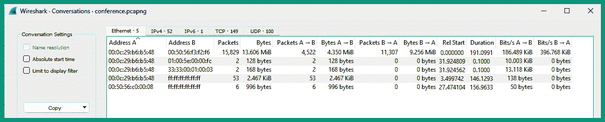
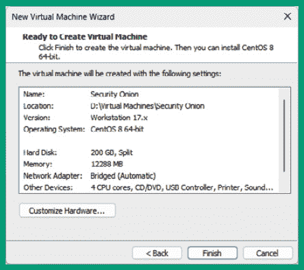
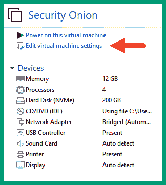
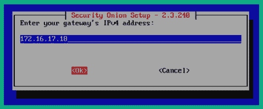
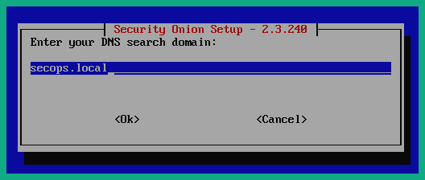

# 第十章：实施侦察监控和检测系统

一个组织发现其网络基础设施和系统被入侵的时间越长，攻击者在其网络中花费的时间就越长，侵入更多的系统以扩大在受害者网络中的立足点。实施和使用网络安全工具帮助**安全运营中心**（**SOC**）和**数字取证与事件响应**（**DFIR**）团队有效地监控网络流量、检测潜在威胁，并提供实时警报，以便更快的响应、遏制和消除威胁。

在本章中，你将学习如何作为一名道德黑客使用 Wireshark 进行数据包分析的基本知识。此外，你还将学习如何部署和使用 Security Onion 来监控网络，检测可疑活动，从而进一步确定它是否是一个安全事件或是你组织内的事故。

在本章中，我们将覆盖以下主题：

+   Wireshark 对于道德黑客的作用

+   监控与检测系统

让我们开始吧！

# 技术要求

要跟随本章的练习，请确保你已满足以下硬件和软件要求：

+   Wireshark – [`www.wireshark.org/`](https://www.wireshark.org/)

+   Security Onion – [`securityonionsolutions.com/`](https://securityonionsolutions.com/)

+   VMware Workstation Pro – [`www.vmware.com/products/workstation-pro.html`](https://www.vmware.com/products/workstation-pro.html)

# Wireshark 对于道德黑客的作用

Wireshark 是一个流行且功能强大的网络协议分析工具，广泛用于网络和网络安全专业人员，以识别组织网络中的网络问题和安全威胁。Wireshark 使专业人员能够捕获网络数据包并进行分析，通过查看每个数据包或帧的内容，更好地了解网络中发生的事情。

如你所知，发送设备的**网络接口卡**（**NIC**）负责将数据转换为可以通过特定媒介传输的信号，例如，铜线的电信号、光纤的光信号和无线通信的射频信号。Wireshark 可以捕获这些信号类型，并将其转换为人类可读的语言，帮助我们更好地分析网络流量。

Wireshark 帮助道德黑客检测网络应用、服务和协议中的安全漏洞，这些漏洞可能会被威胁行为者利用。以下是道德黑客在安全评估过程中常用 Wireshark 的原因：

+   **数据包嗅探** – 伦理黑客可以在网络上设置一个网络植入物来捕获发送到组织网络上的敏感和机密数据，这些数据可以用来执行未来的操作。此外，伦理黑客可以确定组织是否使用任何以明文传输消息的不安全网络协议。

+   **协议分析** – 协议分析使伦理黑客能够通过观察网络协议和识别运行在关键系统（如服务器）上的服务和应用程序，更好地了解网络、员工和设备的行为。通过识别网络协议，伦理黑客可以研究协议中是否存在已知的安全漏洞，以及对手如何利用这些漏洞。

+   **恶意软件分析** – 威胁猎手和事件响应团队等网络安全专业人员使用 Wireshark 来确定网络上是否存在恶意软件、恶意软件的类型，以及它是否已经建立了与在线服务器的**命令和控制**（**C2**）通信通道。

+   **利用开发** – 在开发利用时，一个重要的阶段是测试以确保其按预期工作并确定其威胁级别。例如，如果威胁行为者创建并传递一个建立远程连接到攻击者机器的利用，网络连接可能被组织的安全团队检测为可疑活动并被阻止。使用 Wireshark 可以帮助您更好地理解网络和网络安全专业人员所看到的内容。

对于初学者来说，Wireshark 可能有点令人生畏，因为它提供了它在网络上捕获的所有细节，并且其过滤器使您能够充分利用此工具的功能来分析网络流量。

以下是 Wireshark 操作符及其描述：

+   `==` – 此操作符使您能够指定精确匹配。例如，如果您想过滤具有 TCP 端口`80`的数据包，过滤器将是`tcp.port ==** **80`。

+   `!=` – 此操作符表示*不等于*，通常用于排除某些内容。例如，如果您想过滤不包括 TCP 端口`22`的流量，过滤器将是`tcp.port !=** **22`。

+   `<` 或 `>` – *小于*或*大于*操作符用于指定数据包中的值是小于还是大于某个值。例如，如果您想过滤大于 150 字节的 TCP 数据包，过滤器将是`tcp.len >** **150`。

+   `&&` – *and*操作符用于组合所有为真的多个条件。例如，如果您想过滤从特定发送者到目的地址的流量，过滤器将是`(ip.src == 172.16.254.128) && (ip.dst ==** **8.8.8.8)`。

+   `||` – *或*操作符用于指定多个条件，其中至少一个条件为真。例如，如果你想过滤 HTTP（端口**80**）或 HTTPS（端口**443**）数据包，过滤器应为`(tcp.port == 80 ) || (tcp.port == 443)`。

以下是常见的 Wireshark 显示过滤器：

+   要根据特定设备的**媒体访问控制**（**MAC**）地址`00:0c:29:b6:b5:48`过滤流量：

    ```
    eth.src == 00:0c:29:b6:b5:48
    ```

+   要过滤来自源 MAC 地址为`00:0c:29:b6:b5:48`的设备的**地址解析协议**（**ARP**）消息：

    ```
    arp.src.hw_mac == 00:0c:29:b6:b5:48
    ```

+   要根据特定设备的 IP 地址`172.16.254.128`过滤流量：

    ```
    ip.src == 172.16.254.128
    ```

+   要过滤来自 IP 地址`172.16.254.128`的 ARP 消息：

    ```
    arp.src.proto_ipv4 == 172.16.254.128
    ```

+   以下是过滤流量类型的常见操作符：

    +   `eth` – 过滤以太网消息

    +   `ip` – 过滤 IPv4 数据包

    +   `ipv6` – 过滤 IPv6 数据包

    +   `icmp` – 过滤**互联网控制报文协议**（**ICMP**）v4 消息

    +   `icmpv6` – 过滤 ICMPv6 消息

    +   `tcp` – 过滤**传输控制协议**（**TCP**）消息

    +   `udp` – 过滤**用户数据报协议**（**UDP**）消息

    +   `http`、`http2` 和 `http3` – 过滤 HTTP、HTTP/2 和 HTTP/3 协议

    +   常见的应用层协议，如**域名系统**（**DNS**）、**简单邮件传输协议**（**SMTP**）和**安全外壳**（**SSH**），在写成小写字母时也是过滤器，例如`dns`、`smtp`、`ssh`等。

提示

要了解更多 Wireshark 显示过滤器，请访问 [`wiki.wireshark.org/DisplayFilters/`](https://wiki.wireshark.org/DisplayFilters/)。

要开始使用 Wireshark，请按照以下说明操作：

1.  访问官方 Wireshark 网站 [`www.wireshark.org/`](https://www.wireshark.org/) 下载并安装 Wireshark，或者你可以在 Kali Linux 虚拟机中打开 Wireshark 应用程序。

1.  让我们下载一个示例数据包捕获文件，访问 [`www.honeynet.org/challenges/forensics-challenge-14-weird-python/`](https://www.honeynet.org/challenges/forensics-challenge-14-weird-python/) 并下载`conference.pcapng`文件。此外，你还可以从 [`wiki.wireshark.org/SampleCaptures`](https://wiki.wireshark.org/SampleCaptures) 下载更多 Wireshark 示例文件。

1.  接下来，当你在计算机上启动 Wireshark 应用程序时，你将看到如下所示的可用网络适配器列表：


图 10.1 – Wireshark 界面

如果你双击一个接口，Wireshark 将开始在该接口上捕获数据包，并向你显示实时流量。

1.  要捕获流量，重要的是设置你的监控/捕获接口为*混杂模式*，点击`Capture** | **Options`，然后在你选择的接口上启用**混杂模式**：


图 10.2 – 网络适配器

此外，`Output` 标签使你可以自定义存储捕获数据时的持续时间、数据包数量和位置：


图 10.3 – 捕获选项

一旦点击 `Start`，选择的接口将开始捕获数据包。但不要开始捕获，我们将使用 `conference.pcapng` 文件进行分析。

1.  要加载 `conference.pcapng` 文件，点击 `File** | **Open`，选择示例文件；然后数据包将出现在 Wireshark 中，如图所示：


图 10.4 – Wireshark

如前面的代码片段所示，`A` 显示数据包列表窗格，`B` 显示数据包详情窗格，`C` 显示数据包字节窗格。当在数据包列表中选择一个数据包时，其详情会显示在数据包详情窗格中。

1.  要过滤源 IP 地址为 `172.16.254.128` 的数据包，从 **数据包列表** 窗格中选择数据包 5，然后展开 `Internet Protocol Version 4` 头，右键点击 `Source Address` 字段，如下所示：


图 10.5 – 数据包详情

然后，点击 `Apply as Filter** | **Selected`，如下所示：


图 10.6 – 创建过滤器

如前面的代码片段所示，`Apply as Filter` 选项会立即应用显示过滤器。`Prepare as Filter` 选项允许你创建过滤器，但不会立即应用它们。

以下代码片段显示应用了显示过滤器，并显示所有源 IP 地址为 `172.16.254.128` 的数据包：


图 10.7 – 基于源 IP 地址过滤流量

1.  接下来，要过滤 `172.16.254.128` 和 `8.8.8.8` 之间的流量，再次展开数据包 5 的数据包详情，右键点击 `Destination Address: 8.8.8.8`，然后选择 `Apply as Filter** | **Selected`：


图 10.8 – 创建显示过滤器

如前面的代码片段所示，修改后的显示过滤器帮助我们查看网络中指定源主机和目标主机之间的对话。

1.  要自动解析 IP 地址、端口号和 MAC 地址，点击 `Edit** | **Preferences** | **Name Resolution`，启用这些功能，如图所示：


图 10.9 – 名称解析

1.  要查看使用 Wireshark 的所有网络对话，点击 `Statistics** | **Conversations`：



图 10.10 – 以太网对话

如前面的代码片段所示，Wireshark 显示所有源和目标 MAC 地址、帧数以及此示例文件中的流量。

接下来，点击`IPv4`查看在样本文件和流量流中检测到的所有 IP 地址：


图 10.11 – IPv4 地址和流量

此外，`TCP`和`UDP`标签展示了数据包捕获的网络服务和协议：


图 10.12 – 端口号

1.  最后，点击**文件** | **导出对象` | **HTTP`来查看和导出捕获文件中找到的文件：


图 10.13 – 对象

您可以选择提取一个文件或所有文件，将其从该样本捕获文件中提取并保存到桌面。

在本节中，您已经了解了如何利用 Wireshark 作为网络安全专业人员捕获网络流量。在下一节中，您将学习如何使用安全工具检测可疑活动。

# 监控和检测系统

积极监控组织内部的网络流量帮助网络安全专业人员检测系统中是否存在威胁以及哪些系统已经受到攻击。例如，安全团队可能会注意到来自内部服务器的 DNS 查询增加，而该服务器正在向互联网的一个未知 DNS 服务器发送数据包。通过分析网络流量，发现内部服务器可能已经被恶意软件感染，该恶意软件建立了一个到互联网上 C2 服务器的 C2 通道，并使用常见的网络协议（如 DNS）来降低威胁级别并避免被检测。如果没有监控网络流量，这个安全事件可能会被忽视，攻击者会继续扩展攻击。

此外，网络安全专业人员还需要监控主机系统，以便早期发现潜在威胁。一旦发现威胁，安全团队可以立即采取行动，以遏制并消除威胁，防止其扩散并利用其他系统造成更大损害。在此安全事件中收集的数据可以用于改进事件响应和处理，并提高其他系统的威胁检测能力。

许多免费和商业的威胁监控与检测工具可以从互联网上受信任的供应商处获得。然而，组织需要实施核心工具并执行核心任务：

+   **基于主机的入侵检测系统**（**HIDSes**）

+   **基于网络的入侵检测系统**（**NIDSes**）

+   网络流量和数据包分析

+   数据可视化

以下是帮助组织监控和检测威胁的流行免费开源网络安全工具：

+   `Zeek` – 这是一个开源网络安全工具，用于监控和分析网络流量

+   `Wazuh` – 这是一个开源安全平台，用于从主机设备收集和分析数据

+   `Suricata` – 这是一个开源网络分析工具，用于监控网络流量并提供潜在威胁的警报。

注意

你可以在*进一步阅读*部分找到关于如何设置 Zeek、Wazuh 和 Suricata 的链接。

设置上述工具可能会非常有趣，也是一个良好的学习体验，确保每个工具按预期工作并共享数据。然而，这个过程可能会非常耗时，尤其是在需要解决任何问题进行故障排除时。

`Security Onion` 是一个一体化安全平台，已安装并配置了 Zeek、Wazuh、Suricata 等许多开源工具，能够协同工作，帮助网络安全专家和安全团队迅速启动威胁监控、检测和狩猎。

以下是可以安装在主机/客户端设备上的基于主机的工具，使 Security Onion 能够从资产收集更多数据：

+   `Wazuh` – 这是 Security Onion 上的 HIDS 平台，使安全专家能够在主机上安装 Wazuh 代理，以收集额外的数据和日志进行分析。

+   `Osquery` – 这是一个终端代理，安装在主机设备上，用于监控和收集分析数据。

+   `Beats` – 这是一个用于 Elasticsearch 的数据传输组件，用于从主机设备收集日志和度量数据，并将其发送到 Security Onion 进行分析。

以下是基于网络的工具，使 Security Onion 能够识别网络上的可疑活动：

+   `Google Stenographer` – 这个工具使 Security Onion 能够执行网络流量的完整数据包捕获。

+   `Suricata` – 执行网络流量分析，并为潜在威胁生成警报。

+   `Zeek` – 它提供网络流量的连接日志和元数据，并从网络数据中提取文件进行进一步分析。

+   `Strelka` – 执行文件分析以检测威胁。

以下是网络安全专家在 Security Onion 上使用的分析工具：

+   `SOC` – Security Onion 控制台，提供用户对所有其他工具的访问权限。

+   `Hunt` – 提供一个仪表板，用于执行威胁狩猎查询。

+   `Kibana` – 用于提供网络流量和威胁的数据可视化。

+   `Cases` – 允许用户将警报升级为案例，以便在整个调查生命周期中跟踪。

+   `CyberChef` – 允许你解码并分析数据工件。

+   `Playbook` – 使用户能够创建基于规则的检测剧本，用于识别威胁。

+   `FleetDM` – 允许你在终端设备上运行实时和定时查询。

+   `Navigator` – 提供 MITRE ATT&CK 框架的可视化。

在设置 Security Onion 时，确保为管理分配一个专用网络适配器，为监控分配另一个适配器非常重要。管理接口用于以管理员身份访问 Security Onion，并利用其预安装的工具进行监控和威胁检测。监控接口用于从网络收集数据和流量，例如来自网络 tap 或交换机上的**交换端口分析器**（**SPAN**）端口。

以下是显示 Security Onion 布置的简化图：


图 10.14 – Security Onion

如前面的图所示，交换机配置了镜像或 SPAN 接口，将**局域网**（**LAN**）和防火墙之间的网络流量复制并发送到 Security Onion 的监控接口。这使得 Security Onion 能够监控和分析在互联网和内部网络之间流动的流量。然而，需要在防火墙和**隔离区**（**DMZ**）之间实施网络 tap，以使 Security Onion 能够监控该区域内的流量。

以下是设置 Security Onion 虚拟环境的推荐规格和注意事项：

+   `CPU`：4 核

+   **内存**：12 GB RAM

+   **存储**：200 GB

+   2 个网卡

要开始设置 Security Onion，请按照以下说明操作：

## 第一部分 – 设置环境

1.  首先，从[`securityonionsolutions.com/software/`](https://securityonionsolutions.com/software/)或[`github.com/Security-Onion-Solutions/securityonion/blob/master/VERIFY_ISO.md`](https://github.com/Security-Onion-Solutions/securityonion/blob/master/VERIFY_ISO.md)下载`Security Onion` ISO 镜像文件。

1.  接下来，打开`VMware Workstation Pro`，点击**文件** | **新建虚拟机…**，如下所示：


图 10.15 – VMware Workstation

1.  接下来，**新建虚拟机向导**窗口将出现；选择**自定义（高级）**并点击**下一步**：


图 10.16 – 配置类型

1.  在**选择虚拟机硬件兼容性**菜单中，使用默认选项并点击**下一步 >**：


图 10.17 – 硬件兼容性

1.  在**来宾操作系统安装**窗口中，点击**浏览…**，在**安装光盘映像文件（iso）**下附加 Security Onion ISO，然后点击**下一步 >**：


图 10.18 – 附加 ISO 文件

1.  在**选择来宾操作系统**窗口中，选择`Linux`和**CentOS 8 64 位**，然后点击**下一步 >**：


图 10.19 – 来宾操作系统

1.  接下来，为这台新虚拟机创建一个名称，然后点击**下一步 >**：


图 10.20 – 给虚拟机命名

1.  在**处理器配置**窗口中，建议为虚拟机分配`4`个 CPU 核心；然后，点击**下一步 >**：


图 10.21 – 分配处理器核心

1.  在**为虚拟机分配内存**窗口中，建议为虚拟机分配 12 GB（`12288` MB）的内存，然后点击**下一步 >**：


图 10.22 – 内存分配

1.  在**网络类型**窗口中，选择**使用桥接网络**，然后点击**下一步 >**：


图 10.23 – 网络类型

1.  在**选择 I/O 控制器类型**下，使用默认选项，然后点击**下一步 >**：


图 10.24 – I/O 控制器类型

1.  在**选择磁盘类型**窗口中，使用默认选项，然后点击**下一步 >**：


图 10.25 – 磁盘类型

1.  在**选择磁盘**窗口中，选择**创建新的虚拟磁盘**，然后点击**下一步 >**：


图 10.26 – 选择磁盘选项

1.  在**指定磁盘容量**窗口中，将最大磁盘大小设置为`200.0` GB，选择**将虚拟磁盘拆分为多个文件**，然后点击**下一步 >**：


图 10.27 – 磁盘容量

1.  在**指定磁盘文件**窗口中，使用默认选项，然后点击**下一步 >**：


图 10.28 – 磁盘文件

1.  在**准备创建虚拟机**窗口中，点击**完成**：



图 10.29 – 虚拟机摘要

点击**完成**后，虚拟机环境将自动保存在 VMware Workstation 中。

## 第二部分 – 附加额外的网络适配器

1.  在`VMware Workstation`中，选择`Security Onion`虚拟机，然后点击**编辑虚拟机设置**，如图所示：



图 10.30 – 虚拟机

1.  在**虚拟机设置**菜单中，点击**添加…**：


图 10.31 – 虚拟机设置菜单

1.  在**添加硬件向导**菜单中，选择**网络适配器**，然后点击**完成**：


图 10.32 – 添加硬件向导

1.  接下来，你将返回到 **虚拟机设置** 窗口，选择 **网络适配器 2**，选择 **桥接：直接连接到物理网络** 模式，然后点击 **确定**：


图 10.33 – 网络连接类型

该网络适配器将用作 Security Onion 中的监视接口。

1.  为确保你的物理网络适配器与 VMware Workstation 中的桥接连接相关联，请在菜单栏中点击 **编辑** > **虚拟网络编辑器** > **更改设置**，如图所示：


图 10.34 – 网络编辑器

如前面的片段所示，`VMnet0` 是 **桥接** 网络适配器；确保它与主机上的物理网络适配器桥接。

## 第三部分 – 安装 Security Onion

1.  在 VMware Workstation 中，选择 `Security Onion` 虚拟机并启动此虚拟机。

1.  接下来，Security Onion 安装菜单将出现；使用默认选项并按 *Enter* 键：


图 10.35 – Security Onion 安装类型

1.  接下来，安装向导将出现；按 *Enter* 键开始初始化过程：


图 10.36 – 启动安装

1.  接下来，键入 `yes` 以继续并创建一个用户账户，如图所示：


图 10.37 – 安装 Security Onion

在此步骤中创建的用户名和密码仅用于登录控制台。

1.  接下来，基础操作系统和软件包的安装将开始。这个过程需要几分钟，完成后虚拟机将自动重启。

## 第四部分 – 配置 Security Onion 中的网络

1.  在 Security Onion 虚拟机重启后，使用你在前面的步骤中创建的用户名和密码登录。**Security Onion 设置** 向导将在终端/控制台中出现；使用键盘上的方向键（箭头）选择 `<Yes>` 并按 *Enter* 键：


图 10.38 – Security Onion 设置

1.  接下来，点击 **安装** 开始标准安装 Security Onion：


图 10.39 – 选择设置选项

如前图所示，你可以选择继续安装和设置，或者配置 Security Onion 中的网络地址和设置。

1.  接下来，使用键盘上的下箭头键，选择 `STANDALONE`，按空格键放置星号（*****），然后按 *Enter* 键：


图 10.40 – 安装类型

1.  接下来，您需要在输入框中输入`agree`，以接受在 Security Onion 中使用 Elastic Stack 的条款和协议，然后按*Enter*键：


图 10.41 – Elastic Stack 许可证协议

1.  接下来，插入 Security Onion 虚拟机的主机名并按*Enter*键：


图 10.42 – 设置主机名

1.  接下来，您将获得一个选项，允许您为此 Security Onion 实例插入描述。虽然这是可选的，但如果您正在进行网络中的分布式安装，建议填写。如果我们是进行独立安装，保持默认设置并按*Enter*键：


图 10.43 – 描述窗口

1.  接下来，选择第一个网络适配器作为 Security Onion 的管理 NIC，并按*Enter*键：


图 10.44 – 管理界面

1.  接下来，您将获得一个选项，允许您为管理接口静态分配 IP 地址，或从网络中的**动态主机配置服务器**（**DHCP**）服务器动态获取地址。选择`STATIC`并按*Enter*键：


图 10.45 – 管理界面设置

1.  接下来，输入您网络中未使用/未分配的 IP 地址和网络前缀，并按*Enter*键：


图 10.46 – 设置网络地址

1.  接下来，插入您的默认网关地址并按*Enter*键：



图 10.47 – 默认网关地址

1.  接下来，Google 的 DNS 服务器地址将自动设置；您可以保持默认设置，或根据需要更改它们并按*Enter*键：


图 10.48 – DNS 服务器设置

1.  接下来，创建一个 DNS 搜索域并按*Enter*键：



图 10.49 – 设置搜索域

1.  接下来，按*Enter*键确认安装过程：


图 10.50 – 确认

1.  最后，安装过程将需要几分钟来完成。完成后，Security Onion 虚拟机将自动重新启动。然后，登录并使用以下命令检查每个进程和容器的状态：

    ```
    [glen@soc ~]$ sudo so-status
    ```

几分钟后，所有进程和容器将如以下片段所示，开始运行：


图 10.51 – 验证状态

在继续下一阶段之前，请确保所有容器和进程都在运行且状态良好。

## 第五部分 – 检测可疑活动

1.  要访问 Security Onion 用户界面并使用安全工具，请打开你的网页浏览器并访问 https://<ip-address-security-onion>。在此，你将创建一个用户账户以登录并访问 Security Onion 中的安全工具。此账户将用于访问 Security Onion 中的所有工具。

提示

要查找 Security Onion 虚拟机的 IP 地址，请登录其控制台并执行 `ifconfig` 或 `ip address` 命令，以查看管理接口上的 IP 地址。

1.  登录后，你将看到主仪表盘。点击**警报**查看任何已检测到的安全事件和潜在威胁：


图 10.52 – 安全警报

如前面代码片段所示，Suricata 识别出了一个潜在的高严重性威胁，并提供了用于检测的规则名称。此外，Suricata 记录了 136 次计数（事件）用于此警报。

1.  要查看警报的所有相关事件，点击警报名称以打开下拉菜单并选择**深入分析**，如下所示：


图 10.53 – 警报选项

接下来，Security Onion 将显示每个警报的计数（事件）列表，并提供时间戳、检测规则、严重性级别、源 IP 地址和源端口号，如下所示：


图 10.54 – 查看警报

前面代码片段中显示的信息有助于网络安全专业人员通过时间戳识别威胁来源和发生的事件顺序。

1.  接下来，点击其中一个事件以查看事件数据，例如其源和目标 IP 地址与端口号、触发警报的安全传感器、事件的严重性，以及包含有关威胁的具体信息的消息，如下所示：


图 10.55 – 查看警报数据

**消息**字段包含以下信息，网络安全专业人员可以使用这些信息更好地理解事件：

+   事件的时间和日期

+   Security Onion 中检测到事件的监控界面

+   源 IP 地址和目标 IP 地址

+   源端口和目标端口号

+   触发事件的签名

+   潜在威胁的描述

1.  要确定威胁的轨迹并关联所有相关事件，点击某个事件并选择**关联**，如下所示：


图 10.56 – 关联事件

接下来，Security Onion 将提供所有属于同一警报的事件的关联，如下所示：


图 10.57 – 事件关联

此外，点击警报将提供将警报升级为案例的选项。此案例可供安全分析员在进行进一步分析时跟踪事件：


图 10.58 – 创建案例

1.  接下来，点击`Hunt`类别以查看与威胁相关的所有网络流量。然后，从列表中点击一个流量流以打开附加菜单并选择`PCAP`以查看数据包内容：


图 10.59 – 流量流

接下来，Security Onion 将提供所选流的网络数据包列表，如下所示：


图 10.60 – 每个流的网络数据包

点击**展开和详细**图标将显示每个数据包的详细信息，如图所示：


图 10.61 – 查看数据包详情

要导出数据包捕获文件以进行离线分析，请点击下载图标。

1.  **仪表板**类别显示了使用 Security Onion 检测到的所有事件和警报的总结，如下所示：


图 10.62 – 仪表板

1.  要收集网络上主机的安全情报，您可以从**下载**页面下载并安装**Wazuh 代理**，如下所示：


图 10.63 – Wazuh 代理

1.  若要查看 Security Onion 检测到的所有警报和威胁的可视化数据，点击**工具` | **Kibana`并使用您的帐户登录。以下片段显示了默认的 Kibana 仪表板：


图 10.64 – Kibana 仪表板

如前面的片段所示，Kibana 仪表板为网络安全专业人员提供了事件和事件的整体视图，使安全分析员能够在分析过程中深入了解活动。

1.  要查看所有网络连接和流量流，点击`Security Onion** | `数据集` | **conn`，如图所示：


图 10.65 – 数据集

连接仪表板将显示出来，您可以点击 IP 地址和端口号以获取更多信息，如图所示：


图 10.66 – 连接仪表板

1.  展开左侧隐藏菜单并点击**分析**以访问 Kibana 中的更多数据可视化工具：


图 10.67 – 分析菜单

`Discover`仪表板帮助您确定何时检测到事件以及事件发生的频率，如图所示：


图 10.68 – 发现

最后，**可视化库**提供了创建自定义仪表板或使用现有仪表板查看特定细节的选项，如下所示：


图 10.69 – 可视化库

一定要探索 Security Onion 中的所有功能和仪表板，因为它使用了许多开源安全工具，帮助网络安全专业人士监控他们的网络基础设施，识别系统中潜在的威胁。

完成本节后，你已经学会了如何设置和使用 Security Onion 及其工具来监控网络并识别潜在的威胁。

# 总结

在本章中，你获得了使用 Wireshark 进行数据包分析的技能和实践经验，以识别潜在的恶意流量，并学会了如何设置和使用 Security Onion 来监控和检测网络中的潜在威胁。

最后，我知道成为一名网络安全专业人士，如道德黑客和渗透测试员，充满了挑战；有许多新事物需要学习，而且跟上不断变化的网络威胁格局也很困难。这些挑战将帮助你拓展潜力，成为你所在领域的行业专家，并引导你走向成功，只要你能够平衡优先事项、专注、奉献和时间管理。

我个人非常感谢你购买我的书籍并支持我，祝贺你坚持到最后并掌握了作为道德黑客进行侦察的所有这些惊人的新技能。我真诚希望你在本书中学到的所有内容对你有帮助，能够为你成为网络安全行业及其他领域的超级高手之路提供帮助。

# 进一步阅读

+   Wireshark 文档 – [`www.wireshark.org/docs/`](https://www.wireshark.org/docs/)

+   Security Onion 文档 – [`docs.securityonion.net/en/2.3/index.html`](https://docs.securityonion.net/en/2.3/index.html)

+   设置 Zeek – [`docs.zeek.org/en/master/`](https://docs.zeek.org/en/master/)

+   设置 Suricata – [`suricata.io/documentation/`](https://suricata.io/documentation/)

+   设置 Wazuh – [`documentation.wazuh.com/current/index.html`](https://documentation.wazuh.com/current/index.html)
