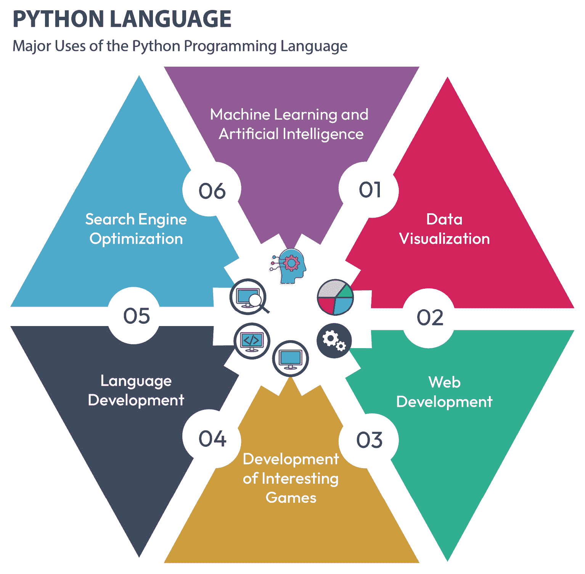

# 第一章：使用 Python 引入安全自动化

在当今快速发展的网络安全环境中，传统的手动安全保障方法往往无法满足需求，特别是当安全团队每天面临成千上万的警报和日志时。想象一下，一个分析员需要手动审查系统日志，以检测数百个端点上的可疑活动。这一过程不仅耗时，容易出错，而且经常导致对关键威胁的响应延迟或遗漏。大量的数据使得识别新兴模式或迅速响应事件几乎不可能，从而使组织面临攻击的风险。手动过程根本无法跟上现代网络威胁日益复杂的步伐。

在这种情况下，安全自动化变得无比重要。自动化工具可以实时筛选大量数据，几秒钟内就能标记异常和可疑活动——这是人工分析员可能需要几个小时甚至几天才能完成的工作。通过利用 Python，组织可以自动化诸如日志分析、威胁检测和事件响应等任务，从而确保更快速、更准确的响应。自动化不仅减少了疏忽的风险，还能让安全团队有更多时间专注于更具战略性和复杂性的挑战，提升整体的安全态势和韧性。

本章将涵盖以下主题：

+   Python 安全自动化概述

+   理解安全自动化

+   Python 及其功能

+   组织中引入自动化安全

# Python 安全自动化概述

Python 是一种功能强大且灵活的编程语言，因其简洁性和广泛的库生态系统，非常适合用于安全自动化。Python 理想用于自动化常规的安全任务，如日志分析、漏洞扫描、事件响应和配置管理。Python 与安全工具和 API 的兼容性使得安全专家能够自动化本来需要手动、耗时的工作流程，从而减少人为错误并提高操作效率。

在网络安全领域，安全事件的实际影响可能是深远的，不仅影响组织的财务健康，还可能损害其声誉和运营完整性。例如，考虑一家零售公司，由于其支付处理系统存在漏洞，导致发生数据泄露。如果没有通过基于 Python 的安全工具迅速自动化威胁检测和响应，组织可能会对泄露事件一无所知，甚至长达数周。在此期间，攻击者可能窃取敏感的客户数据，导致重大的财务损失和法律后果。

在事件发生后，公司面临的不仅是与修复相关的成本——如法医调查、监管罚款和潜在诉讼——还包括客户信任的流失。客户可能会选择将业务转移到其他地方，从而导致长期的收入下降。通过使用安全自动化，组织本可以实时检测到漏洞，迅速响应以减少损失，并实施自动化的安全防护措施来防止未来的事故发生。这种主动的做法不仅保护了敏感数据，还维护了组织的声誉和客户忠诚度，展示了投资安全自动化技术的实际好处。

# 理解安全自动化

随着网络安全领域的不断发展，组织面临着日益增长的威胁，这些威胁可能会危及其敏感数据和关键系统的完整性、机密性和可用性。依赖于人工处理的传统网络安全方法已无法有效应对这些威胁。因此，安全自动化——即在网络安全中自动化重复任务、工作流程和过程的做法——日益受到重视，以提高效率、准确性和响应速度。

## 安全自动化的需求

随着网络威胁的复杂性和数量不断增加，加之资源的限制和技能短缺，组织仅凭手动方法已经难以跟上不断演变的威胁形势。手动流程通常既缓慢又容易出错，且劳动密集，导致检测和响应安全事件的延迟。此外，人工分析师可能难以处理现代 IT 环境中产生的大量安全数据，从而错过威胁或产生误报。

安全自动化通过利用技术来自动化日常任务和工作流程，帮助组织实现以下目标：

+   **提高效率**：自动化使组织能够比手动方法更快速且一致地执行安全任务，从而释放出宝贵的时间和资源，专注于更具战略性的活动。像日志分析、漏洞扫描和事件响应等任务可以通过自动化来减少响应时间并降低人为错误的风险。

+   **提升准确性**：自动化的安全流程遵循预定义的规则和指南，减少了错误的可能性，确保在组织内部一致地应用安全措施。通过消除人为错误，自动化帮助组织提高了安全操作的准确性和有效性。

+   **扩展安全运营**：随着组织的增长及其数字足迹的扩展，手动的安全过程变得越来越难以管理。自动化通过使组织能够处理大量与安全相关的任务和数据，而不显著增加资源需求，从而提供了可扩展性。自动化工作流能够适应工作负载和需求的变化，确保安全运营保持高效和有效。

+   **增强人类分析员的能力**：安全自动化并非要取代人类分析员，而是旨在补充他们的技能和专业知识。通过自动化重复和枯燥的任务，自动化使分析员能够将精力集中在更具战略性的活动上，例如威胁狩猎、事件调查和制定积极的安全措施。

+   **提高威胁检测与响应**：自动化在提升威胁检测和响应能力方面起着至关重要的作用。自动化系统能够实时分析大量的安全数据，识别潜在威胁，并触发预定义的响应或修复措施。通过自动化威胁检测和响应工作流，组织能够缩短检测和响应安全事件的时间，最大程度地减少网络威胁对其运营的影响。

总结而言，安全自动化的需求源于提升效率、准确性和响应能力的迫切需要，面对不断变化的网络威胁，这使其成为维持强大且积极的安全态势的关键组成部分。

## 安全自动化的关键组成部分

安全自动化涵盖了广泛的技术、工具和方法，每种技术都有其在自动化安全任务和过程中的特定目的。以下是安全自动化的一些关键组成部分：

+   **脚本语言**：Python、PowerShell 和 Bash 等脚本语言因其灵活性、易用性以及大量预构建模块和工具库而广泛应用于安全自动化。这些语言使安全专业人员能够自动化各种任务，包括日志分析、漏洞扫描和事件响应。

+   **编排平台**：Ansible、Puppet 和 Chef 等编排平台为自动化和管理复杂的工作流和过程提供了框架。这些平台使组织能够定义并自动化安全工作流，协调多个系统之间的任务，并一致地执行安全政策。以下是一个安全编排工作流的示例——从定义政策、选择工具、自动化任务、监控活动到评估合规结果的端到端过程：

    ```
        A[Start Security Workflow] --> B[Define Security Policy]
        B --> C[Select Orchestration Tool]
        C --> D{Choose Task}
        D -->|Configure Systems| E[Use Ansible/Puppet/Chef]
        D -->|Deploy Security Updates| F[Deploy Updates Across Systems]
        D -->|Automate Compliance Checks| G[Perform Compliance Scans]
        D -->|Incident Response Automation| H[Trigger Incident Response]
        E --> I[Task Execution on Target Systems]
        F --> I
        G --> I
        H --> I
        I --> J[Monitor and Log Activities]
        J --> K[Generate Reports and Alerts]
        K --> L{Evaluate Results}
        L -->|Policy Compliant| M[End Workflow]
        L -->|Non-compliant| B
    ```

+   **安全信息与事件管理（SIEM）系统**：SIEM 系统从各种来源（如网络设备、服务器和应用程序）收集、聚合和分析安全数据，以识别安全威胁和异常。SIEM 系统内的自动化功能使组织能够自动化威胁检测、事件分类和响应工作流程，从而实现更快速和更有效的事件响应。

+   **应用程序编程接口（APIs** **)**：APIs 允许不同的安全工具和系统进行通信和信息交换，实现不同安全技术的无缝集成和互操作性。通过利用 APIs，组织可以自动化跨多个安全工具和系统的工作流，例如编排漏洞扫描、部署补丁和更新防火墙规则。

+   **漏洞管理**：自动化漏洞扫描工具可以持续扫描网络、系统和应用程序以检测已知的漏洞。这些工具可以根据严重程度、影响和可利用性优先处理漏洞，使安全团队能够首先修补关键漏洞。

安全自动化的关键组成部分包括自动化威胁检测与响应、漏洞管理、合规性和审计、事件响应以及持续安全监控。通过整合这些组件，组织能够简化其安全运营，增强检测和减轻威胁的能力，并在日益复杂的威胁环境中保持积极的安全态势。

## 安全自动化示例：使用 Python 和 NMAP

这里有一个简单的 Python 示例，演示了使用 **nmap** 库进行漏洞扫描自动化的安全自动化：

```
# Import the nmap library to utilize Nmap functionalities
import nmap
# Define a function to scan the network
def scan_network(target):
    # Initialize the Nmap PortScanner object to scan the target
    nm = nmap.PortScanner()
    # Perform a TCP SYN scan (-sS) on the target IP address
    nm.scan(target, arguments='-sS')
    # Check if the target host is up and responding
    if nm[target].state() == 'up':
        # Print confirmation that the host is up
        print(f"Host: {target} is up")
        # Iterate over all scanned hosts (though in this case, it's just the target)
        for host in nm.all_hosts():
            # Print open ports for the target host
            print(f"Open Ports on {host}:")
            # Loop through each protocol (e.g., TCP or UDP) used in the scan
            for proto in nm[host].all_protocols():
                # Get all scanned ports for the specific protocol
                ports = nm[host][proto].keys()
                # Loop through each port and print its status (open/closed/etc.)
                for port in ports:
                    print(f"Port: {port} - State: {nm[host][proto][port]['state']}")
    else:
        # If the host is down, print that the target is not responding
        print(f"Host: {target} is down")
# Entry point of the script
if __name__ == "__main__":
    # Specify the target IP address or IP range to scan
    target_ip = "192.168.1.1"
    # Call the scan function to perform a vulnerability scan on the target IP
    scan_network(target_ip)
```

此脚本演示了如何使用 Python 中的 **nmap** 库对指定目标 IP 地址执行网络发现扫描（TCP SYN）。脚本检查目标是否在线，然后遍历每个扫描端口并打印结果，包括端口号及其状态（开放、关闭或过滤）。您可以看到 Python 如何用于自动化安全任务，例如漏洞扫描，使安全团队能够有效识别其网络基础设施中的潜在安全风险。

现在，假设我们在环境中识别出漏洞，并希望创建一个自动化脚本，确保所有补丁包均可供部署。这里有一个 Python 示例，演示了基本的补丁管理自动化脚本：

```
import os
import subprocess
def check_for_updates():
    # Check for available updates using the package manager
    if os.name == 'posix':  # For Unix-like systems (e.g., Linux)
        subprocess.run(['apt', 'update'])  # Update package lists
        return subprocess.run(['apt', 'list', '--upgradable'], capture_output=True, text=True).stdout
    elif os.name == 'nt':  # For Windows systems
        return subprocess.run(['wmic', 'qfe', 'list', 'full'], capture_output=True, text=True).stdout
    else:
        return "Unsupported operating system"
def install_updates():
    # Install available updates using the package manager
    if os.name == 'posix':  # For Unix-like systems (e.g., Linux)
        subprocess.run(['apt', 'upgrade', '-y'])  # Upgrade packages
    elif os.name == 'nt':  # For Windows systems
        subprocess.run(['wuauclt', '/detectnow'])  # Force Windows Update detection
    else:
        print("Unsupported operating system")
if __name__ == "__main__":
    print("Checking for available updates...")
    updates_available = check_for_updates()
    print(updates_available)
    if updates_available:
        print("Installing updates...")
        install_updates()
        print("Updates installed successfully.")
    else:
        print("No updates available.")
```

此脚本使用适当的软件包管理器（**apt** 适用于基于 Linux 的系统和 **wmic** 适用于 Windows），检查系统上是否有可用的更新，然后如有更新则安装。首先，它检查操作系统的类型，以确定用于更新检查和安装的命令。

本示例展示了如何利用 Python 自动化不同操作系统上的补丁管理任务，使系统管理员能够高效地保持系统与最新的安全补丁和软件更新同步。

在今天快速发展的数字环境中，理解安全自动化至关重要。随着网络威胁变得更加复杂和频繁，传统的手动安全管理方法已不足以跟上时代的步伐。安全自动化为这些挑战提供了一种可扩展的解决方案，使得持续监控、快速检测和高效响应安全事件成为可能。它帮助组织优化资源，减少人为错误，并保持所有系统和流程的一致安全态势。通过将自动化集成到网络安全策略中，组织不仅能够增强对攻击的抵御能力，还能够确保符合行业标准和法规。深入理解安全自动化能够帮助组织保护资产、保卫敏感数据，并在日益互联的世界中维持与利益相关者的信任。下图展示了 Python 可以应用的不同领域：



图 1.1 – Python 及其功能

让我们深入探讨 Python 所提供的广泛功能，理解它为何持续吸引全球开发者：

+   **Python 的简洁且易读的语法**：Python 的语法因其简洁和易读而闻名。通过使用缩进来表示代码块结构，以及采用极简的标点符号，Python 代码既直观又优雅。这种简洁性不仅使得 Python 成为初学者理想的编程语言，也提升了经验丰富的开发者的生产力，使他们能够专注于问题解决，而不是与复杂的语法纠缠。

+   **应用的多样性**：Python 的多样性几乎无边界，覆盖了广泛的领域。在网页开发中，像 Django 和 Flask 这样的框架使得开发者能够轻松构建可扩展且功能丰富的应用程序。在数据分析和科学计算领域，NumPy、pandas 和 Matplotlib 等库为处理、分析和可视化数据提供了强大的工具。在机器学习和人工智能领域，TensorFlow 和 PyTorch 等库为开发先进的模型（如图像识别、自然语言处理和预测分析）提供了构建基础。

+   **丰富的标准库**：Python 的标准库是一座功能宝库，涵盖了各种任务的模块和包。无论是文件操作、网络通信、数据库交互，还是数学计算，Python 的标准库都能提供开箱即用的强大解决方案。这些内置模块的丰富集合，最大限度地减少了对外部依赖的需求，简化了开发过程，并确保跨平台兼容性。

+   **强大的社区支持**：Python 拥有一个充满活力且支持力强的开发者、教育者和爱好者社区。像 Stack Overflow 和 Reddit 这样的在线论坛是知识共享和问题解决的聚集地。此外，Python 的广泛文档和大量教程为各个水平的学习者提供了丰富的资源，帮助技能提升和项目实施。Python 社区的强大力量促进了合作、创新和生态系统内的持续改进。

+   **跨平台兼容性**：用 Python 编写的代码可以在不同的操作系统上无缝运行，包括 Windows、macOS 和 Linux，无需修改。这种固有的可移植性简化了部署和维护，使开发者能够集中精力交付强大的解决方案，而无需担心平台特有的复杂性。

使用 Python 构建自动化代码通常涉及多个步骤，这些步骤会根据具体的任务或项目需求有所不同。以下是使用 Python 构建自动化代码的一般路径：

1.  **确定任务**：清晰地定义你想要自动化的任务或过程。这可以是从数据处理与分析到系统管理任务的任何内容。

1.  **研究与规划**：研究现有的解决方案和自动化类似任务的最佳实践。确定最适合你项目的工具、库和框架。制定一个计划，概述实现自动化所需的步骤。

1.  **设置开发环境**：安装 Python 及项目所需的任何依赖项或库。使用**集成开发环境**（**IDE**）或文本编辑器设置开发环境。

1.  **编写代码**：开始编写代码以自动化已识别的任务。将任务分解成更小、更易于管理的步骤，并编写 Python 代码来执行每个步骤。使用适当的数据结构、函数和模块来有效地组织代码。

1.  **测试**：彻底测试代码，确保其按预期功能运行。编写单元测试以验证各个组件的行为。使用如**unittest**或**pytest**这样的自动化测试框架来自动化测试过程。

1.  **错误处理和日志记录**：实现错误处理机制，以优雅地处理异常和意外错误。加入日志功能，以便跟踪自动化代码的执行情况并排查问题。

1.  **集成与部署**：将自动化代码集成到目标环境或工作流中。根据需要将代码部署到生产环境或暂存环境。设置定时任务或触发器，在指定的间隔时间或响应事件时自动执行代码。

1.  **监控与维护**：监控自动化代码在生产环境中的性能和行为。实施监控解决方案，以检测并提醒任何问题或故障。定期审查并更新代码，以适应需求或环境的变化。

1.  **文档编写**：详细记录自动化代码的文档，包括其目的、功能、使用说明和配置设置。为其他开发人员或团队成员提供清晰的文档，以便他们在未来维护或扩展代码。

1.  **持续改进**：持续寻找优化和改进自动化代码的机会。从用户和利益相关者那里收集反馈，以识别需要改进的地方。随着时间的推移，重构代码以提高可读性、性能和可维护性。

通过遵循这些步骤，您可以有效地使用 Python 构建自动化代码，以简化流程、提高效率，并减少各个领域和行业中的人工工作量。

这是一个简单的 Python 脚本示例，用于自动化与密码管理相关的安全任务：

```
import random
import string
def generate_password(length=12):
    """Generate a random password."""
    characters = string.ascii_letters + string.digits + string.punctuation
    password = ''.join(random.choice(characters) for _ in range(length))
    return password
def save_password(username, password):
    """Save the generated password to a file."""
    with open('passwords.txt', 'a') as f:
        f.write(f'{username}: {password}\n')
    print(f'Password for {username} saved successfully.')
def main():
    username = input('Enter username: ')
    password = generate_password()
    save_password(username, password)
if __name__ == "__main__":
    main()
```

该脚本执行以下任务：

+   **生成密码**：**generate_password** 函数通过组合大写字母、小写字母、数字和标点符号来生成指定长度的随机密码。

+   **保存密码**：**save_password** 函数将生成的密码与对应的用户名一起保存到名为 **passwords.txt** 的文本文件中。

+   **利用主函数**：**main** 函数提示用户输入用户名，使用 **generate_password** 函数生成密码，然后使用 **save_password** 函数保存用户名-密码对。

运行时，该脚本会提示用户输入用户名，生成一个随机密码，将用户名-密码对保存到文件中，并打印成功消息。

这是一个基本示例，但您可以扩展它，使其包含更多功能，例如加密、密码强度验证、与密码管理器的集成或密码轮换过程的自动化。此外，您还可以结合错误处理、日志记录以及其他最佳实践，以增强脚本的可靠性和安全性。

这是一个使用 Python 进行网络监控和入侵检测的高级自动化安全示例：

```
import time
import socket
def monitor_network_traffic():
    """Monitor network traffic for suspicious activity."""
    print("Monitoring network traffic...")
    while True:
        try:
            # Create a socket to listen for incoming network traffic
            with socket.socket(socket.AF_INET, socket.SOCK_RAW, socket.IPPROTO_TCP) as s:
                s.bind(('0.0.0.0', 0))
                s.setsockopt(socket.IPPROTO_IP, socket.IP_HDRINCL, 1)
                # Capture packets and analyze them
                data, addr = s.recvfrom(65536)
                print(f"Received packet from {addr}: {data}")
                # Implement custom logic to detect suspicious activity
                # For example, check for patterns indicative of an attack
                if "malicious_pattern" in data:
                    print("Suspicious activity detected! Initiating response...")
                    # Take appropriate action such as blocking IP addresses, alerting security teams, etc.
        except Exception as e:
            print(f"Error: {e}")
        time.sleep(1)
if __name__ == "__main__":
    monitor_network_traffic()
```

让我们尝试理解前面的脚本：

+   **监控网络流量**：**monitor_network_traffic** 函数使用原始套接字持续监听传入的网络流量。它捕获数据包并分析其内容。

+   **检测可疑活动**：在数据包中，脚本实现了自定义逻辑来检测可疑活动。这可能涉及模式匹配、异常检测或其他方法来识别潜在的安全威胁。

+   **采取行动**：如果检测到可疑活动（例如，数据包中发现恶意模式），脚本会启动响应。此举可能包括阻止 IP 地址、向安全团队发送警报、记录事件或根据安全政策采取其他适当措施。

+   **错误处理**：脚本包括错误处理机制，以优雅地处理在网络监控过程中可能发生的异常。

+   **持续监控**：脚本将无限运行，实时监控网络流量。

本示例展示了如何使用 Python 构建一个先进的自动化安全解决方案，用于实时网络监控和入侵检测。根据具体的需求和应用场景，可以加入基于机器学习的异常检测、与 SIEM 系统的集成以及自动化事件响应流程等附加功能，以提高安全解决方案的有效性。

# 在组织中引入自动化安全

尽管将自动化引入组织的安全操作是提高效率的有效方法，但它也带来了需要谨慎规划的新挑战。主要的关注点之一是访问控制——谁或什么系统有权自动化某些任务。如果没有适当的访问控制，未经授权的人员可能会获得执行关键操作的权限，从而导致重大漏洞。没有严格保护措施的情况下自动化敏感任务（如系统更新、备份或漏洞扫描）可能会导致意外后果，包括配置错误或安全漏洞。

安全自动化需要通过强有力的监督机制来实施，确保自动化系统遵守组织的安全政策和标准。这包括确保适当的日志记录和审计，以便对自动化脚本所采取的任何行动进行全面跟踪和审查。此外，敏感任务的自动化应限制在受信任的环境中，并建立适当的权限和认证方法，以最小化风险。通过关注这些问题，组织可以平衡通过自动化带来的效率与保持安全和可控环境的需求。

下面是引入自动化安全时的关键方面：

+   **理解需求**：首先评估当前的安全形势，识别自动化可以带来显著好处的领域。这可能包括重复性的任务，如漏洞扫描、日志分析、补丁管理、事件响应和合规性检查。

+   **定义目标**：明确自动化安全计划的目标。这些目标可能因组织目标而异，但常见目标包括提高事件响应速度、减少人为错误、增强合规性，以及使安全团队能够专注于战略性任务。

+   **选择自动化工具**：选择适合组织需求和安全目标的自动化工具和平台。这可能涉及利用专业的安全自动化框架、编排平台以及脚本语言（如 Python），并与现有的安全工具和技术进行集成。

+   **设计工作流**：开发全面的工作流，概述自动化任务的顺序、决策点和升级程序。工作流应设计成能够处理各种安全场景，从常规任务到关键事件响应。

+   **实施安全控制**：实施安全控制措施，以确保自动化过程和数据的完整性、机密性和可用性。这包括访问控制、加密、安全编码实践和审计机制，以跟踪和监控自动化活动。

+   **测试与验证**：在受控环境中彻底测试自动化工作流，以识别并解决任何潜在问题或漏洞。在将自动化解决方案部署到生产环境之前，通过模拟场景和实际测试验证其有效性。

+   **监控与优化**：持续监控自动化过程，确保其按预期运行，并保持对不断变化的威胁具有弹性。根据反馈、性能指标和威胁环境的变化，定期审查和优化自动化工作流。

+   **培训与技能发展**：为安全团队提供培训和技能发展机会，使其能够有效地利用自动化工具和技术。促进组织内自动化安全意识和协作的文化。

通过引入自动化安全，组织可以简化安全操作、提高事件响应能力，并在日益复杂和动态的威胁环境中增强整体网络韧性。自动化作为安全团队的力量倍增器，使其能够主动识别和缓解风险，同时更高效地适应新兴威胁。

安全自动化通过以下方式降低风险：

+   **一致性与准确性**：自动化流程确保每次都能一致且准确地执行安全任务，减少人为错误的可能性。这种一致性有助于维持与安全政策和标准的一致性，从而降低因配置错误导致的合规性处罚或安全漏洞的风险。

+   **更快的响应时间**：自动化通过根据预定义的标准或警报自动触发预定的行动，能够快速检测并响应安全事件。这一迅速的响应将攻击者的行动时间窗口缩小，从而减少安全事件的影响和范围。

+   **可扩展性**：自动化使得安全团队能够更高效地扩大其操作规模，以应对不断增长的与安全相关的任务、警报和事件。通过自动化重复性任务，安全专业人员可以将精力集中在更具战略性的任务上，如威胁狩猎、风险分析和安全策略制定。

+   **持续监控与合规**：自动化监控工具能够持续扫描和评估 IT 基础设施、应用程序和网络的安全态势。通过实时自动识别漏洞、配置错误和合规违规，组织能够在安全风险升级为重大事件之前主动解决这些问题。

+   **简化的事件响应**：自动化通过协调不同安全工具和技术的操作来简化事件响应过程。自动化的事件响应工作流可以根据事件的严重性、影响及与组织风险状况的相关性，优先处理和修复安全事件。

+   **增强的可视性和报告**：自动化安全解决方案提供了对安全事件、趋势和漏洞的更大可视性，帮助组织全面了解其 IT 环境的安全状况。这种增强的可视性使得安全团队能够做出基于数据的决策，优先处理修复工作，并生成详细的报告供利益相关者、审计人员和监管机构参考。

+   **适应不断变化的威胁环境**：自动化使得安全团队能够迅速适应不断发展的威胁，通过更新和改进自动化工作流、检测规则和响应机制。这种敏捷性使得组织能够走在新兴威胁前面，积极减轻风险，防止它们在利用漏洞之前造成伤害。

总的来说，安全自动化通过提升安全操作的效率、有效性和敏捷性，减少了风险，使得组织能够更好地保护其资产、数据和声誉，尤其在这个日益复杂和动态变化的威胁环境中。


图 1.2 – 入侵检测系统（IDS）的工作流程

让我们考虑一个使用 SIEM 系统进行安全自动化的示例。

*场景*：某组织希望自动化响应与未经授权访问关键服务器相关的安全事件：

+   **检测**：SIEM 系统监控来自各种来源的日志，包括防火墙、**入侵检测系统**（**IDS**）和认证服务器。它会检测到在短时间内对关键服务器的多次登录失败尝试，从而触发安全事件。

+   **自动化** **响应工作流程**：


图 1.3 – 风险评估工作流程

让我们仔细看一下：

+   **触发**：当 SIEM 检测到未经授权的访问尝试时，它会向指定的安全自动化平台（例如，**安全编排、自动化与响应**（**SOAR**））发送警报。

+   **调查**：自动化平台自动获取有关事件的附加上下文信息，例如源 IP 地址、用户帐户和受影响的服务器。

+   **风险评估**：自动化平台根据预定义标准评估与事件相关的风险，例如登录失败尝试次数和服务器的敏感性。

+   **响应决策**：根据风险评估，自动化平台决定采取适当的响应措施。

+   **响应措施**：

    +   **如果风险被评估为低**：自动化平台会自动将源 IP 地址添加到防火墙的临时黑名单中，以防止在预定义时间内再次尝试登录。

    +   **如果风险较高**：自动化平台将事件升级到**安全运营中心**（**SOC**）进行人工调查和响应。

    +   **通知**：自动化平台向相关利益相关者（如 IT 管理员和安全分析师）发送通知，告知他们已检测到的事件及已采取的自动化响应措施。

+   **执行**：

    +   自动化平台在无需人工干预的情况下执行预定义的响应工作流程，确保对安全事件的及时和一致响应。

    +   响应措施会被记录和文档化，以供审计和合规检查使用，提供自动化安全响应的记录。

+   **监控** **与反馈**：

    +   自动化平台持续监控自动化响应措施的有效性，并根据反馈和性能指标调整响应策略。

    +   安全分析师审查并分析自动化响应活动，以识别任何假阳性、优化机会或自动化工作流程中的漏洞。

通过使用 SIEM 和安全自动化平台自动化对安全事件的响应，组织可以减少响应时间、减轻风险，并通过实时主动应对威胁来提升整体安全态势。

使用 Python 设置自动化环境涉及多个步骤，以确保脚本和流程的顺利执行。以下是一个入门指南：

1.  **安装 Python**：确保系统安装了 Python。你可以从官方网站下载最新版本的 Python 并按照安装说明进行安装。

    截至 2024 年 7 月，Python 的最新稳定版本是 Python 3.11.4。你可以从官方 Python 网站下载它。这里是直接链接到下载页面，你可以在那里找到各种操作系统的最新版本和安装说明：[`www.python.org/downloads/`](https://www.python.org/downloads/)。

1.  **虚拟环境**：建议使用虚拟环境来隔离项目依赖关系。使用**virtualenv**或**venv**为你的项目创建虚拟环境：

    ```
    python3 -m venv myenv
    source myenv/bin/activate  # Activate the virtual environment
    ```

1.  **依赖管理**：使用**pip**在虚拟环境中安装项目依赖项：

    ```
    pip install package-name
    ```

1.  **代码编辑器/集成开发环境（IDE）**：选择一个用于编写和编辑 Python 脚本的代码编辑器或 IDE。流行的选择包括 VS Code、PyCharm 和 Sublime Text。

1.  **版本控制**：使用 Git 设置版本控制，管理项目的代码库。在项目目录中初始化一个 Git 仓库：

    ```
    git init
    ```

1.  **项目结构**：用清晰的结构组织项目目录。常见目录包括**src**用于源代码，**tests**用于测试脚本，**docs**用于文档。

1.  **环境变量**：利用环境变量存储诸如 API 密钥和密码等敏感信息。你可以使用**dotenv**库从**.env**文件加载环境变量。

1.  **配置文件**：创建配置文件（例如 JSON、YAML 等）来存储脚本使用的设置和参数。使用像**configparser**和**yaml**这样的库来解析配置文件。

1.  **脚本执行**：编写 Python 脚本以自动化任务，如数据处理、文件操作或系统监控。确保脚本有良好的文档并遵循可读性和可维护性的最佳实践。

1.  **测试和调试**：使用**unittest**和**pytest**等框架实施单元测试，确保脚本功能。使用日志记录库（**logging**，**loguru**等）进行有效的调试和错误处理。

1.  **自动化工具**：探索自动化工具，如**cron**（Unix）和**任务计划程序**（Windows），以在特定间隔或事件下调度脚本执行。

1.  **持续集成/持续部署（CI/CD）**：将项目与 CI/CD 管道集成，自动化测试、代码检查和部署过程。工具如 Jenkins、Travis CI 和 GitHub Actions 可以促进 CI/CD 工作流程。

通过遵循这些步骤，你可以使用 Python 建立一个健壮的自动化环境，使工作流程更加流畅，提高生产力，并保持安全高效的开发过程。

# 总结

安全自动化是现代网络安全实践中的关键组成部分，它使组织能够增强防御机制、简化流程并有效应对威胁。在本章中，我们通过涵盖以下主题，探讨了使用 Python 进行安全自动化的基础知识：

+   **安全自动化简介**：我们概述了自动化在网络安全中的重要性和好处，强调了 Python 在构建自动化解决方案中的作用。

+   **设置 Python 环境**：我们指定了安装 Python、创建虚拟环境以及管理安全自动化依赖项的步骤。

+   **Python 脚本基础**：我们讲解了自动化安全任务所需的核心 Python 编程概念。

+   **自动化漏洞扫描**：我们介绍了使用 Python 构建自动化解决方案进行漏洞扫描，以检测和解决安全风险。

+   **事件响应中的自动化**：我们学习了如何使用 Python 自动化事件响应过程，提高反应时间和效率。

+   **与安全工具的集成**：我们利用 Python 与安全工具和平台进行交互，实现无缝自动化。

+   **结论与赋能**：我们反思了安全自动化如何增强网络安全、提高团队效率并减少风险。

通过掌握基于 Python 的安全自动化，你可以简化流程、提高检测和响应时间，并在当今不断发展的网络威胁环境中保持领先。

为了进一步丰富本摘要并为未来的挑战做好准备，考虑到安全自动化带来的复杂性至关重要，例如管理误报以及在自动化与人工监督之间取得平衡。虽然自动化可以显著提高效率，但也存在固有的权衡。例如，自动化系统可能偶尔将合法活动误标为威胁（误报），或者它们可能未能发现人类直觉能够识别的微妙异常。在我们前进的过程中，理解这些挑战对于设计强大而有效的自动化安全系统至关重要。

在下一章中，我们将重点讲解如何为安全自动化专门设置你的 Python 环境。这不仅包括技术配置，还包括减少错误和自动化工作流中的安全风险的策略。在下一章结束时，你将打下坚实的基础，能够自信地开始自动化安全任务，同时注意依赖自动化所带来的潜在陷阱和权衡。
