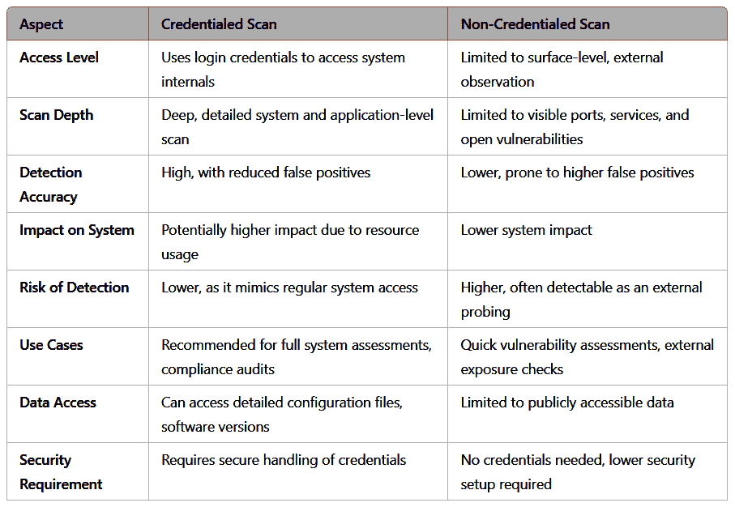
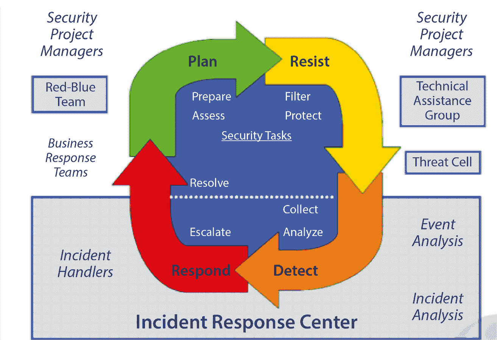
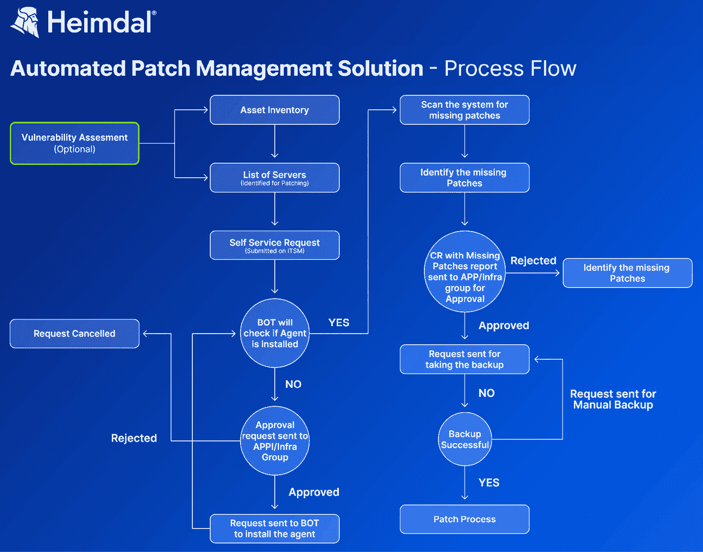
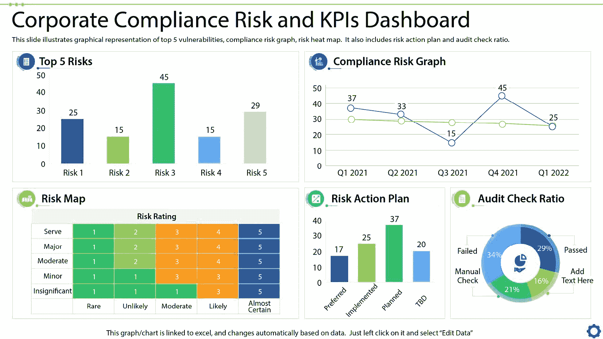

# 第四章：使用 Python 自动化漏洞扫描

在不断发展的网络安全领域，漏洞扫描在识别系统和网络中的弱点方面发挥着至关重要的作用。手动扫描过程既耗时又容易出错，因此自动化对于保持主动的安全姿态至关重要。Python 以其广泛的库和灵活性，是自动化漏洞扫描任务的强大工具。

本章将向你介绍如何使用 Python 自动化漏洞扫描的基本知识，涵盖关键概念、工具和最佳实践。通过利用 Python，你可以简化漏洞扫描过程，确保你的系统持续监控潜在的风险。

你将学习如何与流行的漏洞扫描工具（如 Nessus、OpenVAS 和 Qualys）互动，将它们集成到 Python 脚本中，并自动化扫描和报告过程。本章还将探讨如何安排自动扫描、解释结果，并根据已识别的漏洞采取行动。

到本章结束时，你将掌握使用 Python 自动化漏洞扫描的坚实基础，使你能够增强组织的安全姿态，减少人工工作，并确保及时识别和修复安全威胁。

本章将涵盖以下主题：

+   漏洞扫描简介

+   在 Python 中构建自动化扫描脚本

+   将漏洞扫描集成到安全工作流中

# 技术要求

为了有效地使用 Python 自动化漏洞扫描，以下技术组件是必需的：

+   **Python 环境**：

    +   系统中已安装 Python（最好是 3.x 版本）。

    +   使用 **venv** 或 **virtualenv** 管理依赖项的虚拟环境。

+   **漏洞扫描工具/平台**：

    +   访问漏洞扫描工具或 API，如 Nessus、OpenVAS、Qualys 或 Nmap。

    +   熟悉这些工具的 API 以自动化扫描任务。

    +   连接到所选工具的 API 密钥或身份验证凭据。

+   **Python 库**：

    +   **Requests** 或 **http.client**：用于发出 HTTP 请求与漏洞扫描 API 进行交互。

    +   **Paramiko**：用于自动化基于 SSH 的漏洞扫描（如适用）。

    +   **JSON** 或 **XML** 解析库：用于处理扫描输出和处理结果。

+   **命令行** **工具（可选）**：

    +   使用 Python 的**subprocess**库与命令行漏洞扫描工具（例如 Nmap）集成，以实现自动执行和获取扫描结果。

+   **安全凭证**：

    +   确保你拥有执行漏洞扫描的适当访问权限和权限。

    +   安全存储 API 密钥或凭证（使用例如 **Python-dotenv** 或 **AWS** **Secrets Manager** 的工具）。

+   **网络配置**：

    +   确保防火墙和网络设置允许与目标系统和漏洞扫描器的通信。

什么是漏洞扫描？

在网络安全的背景下，漏洞是指系统设计、实施或配置中的缺陷或弱点，这些缺陷可能被利用来破坏安全。漏洞扫描旨在解决这些弱点。漏洞扫描是网络安全中的一个关键实践，涉及自动化识别系统、网络和应用程序中的潜在弱点。如果这些漏洞未得到解决，攻击者可能会利用它们破坏信息系统的机密性、完整性和可用性。随着组织的扩大和基础设施的复杂化，保持安全环境需要定期和系统地进行漏洞扫描。

漏洞扫描通常涉及使用专门的工具来探测系统中的已知漏洞、配置错误或过时软件。这些工具评估各个组件的安全态势，如操作系统、应用程序、网络设备和数据库。它们依赖于大量已知漏洞的数据库，这些漏洞通常来自**公共漏洞与暴露**（**CVE**）列表，用于识别潜在的安全隐患。

为了进行漏洞扫描，我们可以扫描系统的不同方面，如以下内容，以识别弱点：

+   **网络扫描**：专注于识别网络设备和通信协议中的漏洞。这种扫描有助于发现诸如开放端口、不安全协议和配置错误的防火墙等问题。

+   **Web 应用程序扫描**：针对 Web 应用程序，查找诸如 SQL 注入、**跨站脚本**（**XSS**）和不安全的身份验证机制等安全漏洞。

+   **主机扫描**：检查单个服务器、工作站或其他设备中的软件漏洞、缺失的补丁和配置错误。

+   **数据库扫描**：评估数据库在访问控制、加密和过时软件版本方面的漏洞。

我们将在本章后面讨论漏洞扫描中的主动和被动方法。基本上，漏洞扫描不仅仅是识别缺陷；它还有助于优先处理修复工作。通过根据漏洞的严重性和潜在影响对其进行分类，安全团队可以优先解决最关键的问题。

然而，漏洞扫描只是全面安全策略的一部分。虽然它可以识别已知问题，但并不能保证所有潜在威胁都被发现。因此，漏洞扫描通常与其他安全措施一起使用，如渗透测试、代码审查和安全监控。

随着网络威胁不断演变，组织在防御新兴漏洞方面面临着日益严峻的挑战。漏洞扫描器作为一种自动化工具，可以在漏洞被攻击者利用之前识别系统中的弱点，从而帮助安全团队以积极的方式优先解决并修复问题。

## 为什么漏洞扫描在网络安全中至关重要？

系统中的弱点或漏洞可能存在于软件代码、硬件组件、网络协议和用户配置中。成功利用这些漏洞的影响可能从未经授权访问敏感数据到完全系统泄露。

漏洞扫描的作用是系统地在组织的 IT 基础设施中寻找潜在的弱点。漏洞扫描工具通过检测系统中的已知安全问题，并将其与定期更新的漏洞数据库（例如**国家漏洞数据库**（**NVD**））进行比对，从而实现自动化的漏洞检测。

通过识别漏洞，组织可以做到以下几点：

+   **减少攻击面**：扫描有助于发现安全控制不足的领域，从而帮助组织减少暴露在威胁面前的风险。

+   **优先处理修复工作**：漏洞通常根据其严重性和潜在影响进行排序，帮助安全团队优先处理最关键的问题。

+   **确保合规性**：许多行业有监管要求（例如 PCI-DSS、HIPAA 和 GDPR），要求定期进行漏洞评估。扫描确保组织遵守这些标准。

+   **加强安全防护**：定期进行漏洞扫描是保持强大安全防护的重要部分，有助于持续识别并处理新出现的漏洞。

接下来，让我们了解一下漏洞扫描的类型。

## 漏洞扫描的类型

漏洞扫描有几种类型，每种类型旨在针对基础设施的特定领域并提供不同类型的安全风险洞察。这些包括**网络扫描**，它评估网络上的设备和服务的漏洞，**Web 应用扫描**，它专注于识别网站或 Web 应用中的缺陷，以及**数据库扫描**，它评估数据库及其配置的安全性。了解不同类型的漏洞扫描及其目的，对于保持全面的安全防护并确保组织环境的各个方面得到妥善保护至关重要。

主动扫描和被动扫描是网络安全中的两种基本技术，通过这两种方法可以检查系统的不同部分或方面。两者有各自不同的方法、目的和使用场景。

### 主动扫描

主动扫描涉及直接与网络、系统或应用程序交互，以识别漏洞、开放端口、正在运行的服务及其他潜在安全问题。这是一种更加主动的方法，通过发送明确的请求收集系统响应信息。

#### 主动扫描的关键特点

主动扫描的一些关键特点如下：

+   **直接交互**：主动扫描会主动与目标系统建立联系，积极探测系统响应。

+   **可检测**：由于主动扫描会生成系统之间的流量，它们可能会被监控工具或防火墙检测到，进而警告网络管理员或入侵者。

+   **详细结果**：主动扫描可以提供广泛且深入的数据，如服务版本、操作系统详情和具体漏洞。

+   **示例**：如 Nmap、Nessus 和 OpenVAS 等工具执行主动扫描，这些工具对于深入的漏洞评估非常有用。

#### 主动扫描的使用场景

主动扫描的使用场景如下：

+   **漏洞评估**：识别安全基础设施中的弱点，如未打补丁的软件或配置错误的设置。

+   **渗透测试**：主动测试并识别安全漏洞，模拟潜在攻击。

+   **合规审计**：通过定期扫描和修复漏洞，满足合规性标准。

### 被动扫描

相比之下，被动扫描涉及监控网络流量以检测威胁，而无需直接与系统交互。它分析已传输的数据，以识别异常或入侵迹象。

#### 被动扫描的关键特点

被动扫描的一些关键特点如下：

+   **非侵入性**：被动扫描不会生成流量或与网络设备直接通信，从而减少被检测的风险。

+   **有限细节**：被动扫描依赖于观察现有数据流，这有时会限制它揭示的信息范围。

+   **持续监控**：被动扫描可以随着时间推移监控网络活动，发现异常模式和行为。

+   **示例**：Wireshark 等工具以及如 Snort 这样的**网络入侵检测系统**（**NIDS**）通常用于被动扫描，因为它们分析流量数据而不是与网络直接交互。

#### 被动扫描的使用场景

被动扫描的使用场景如下：

+   **威胁检测与响应**：实时识别潜在威胁和可疑活动，而不引起攻击者的警觉。

+   **事件调查**：收集事件发生前、发生中及发生后的网络行为数据，用于取证。

+   **网络流量分析**：监控流量模式，以检测未经授权的访问或用户行为的异常。

### 选择主动扫描与被动扫描

在大多数组织中，主动扫描和被动扫描互为补充。主动扫描可以在评估过程中彻底检查安全态势，而被动扫描则提供持续的监控和新兴威胁的检测。平衡两者可以提供全面的网络安全视图，涵盖主动漏洞识别和实时威胁检测。让我们来看看主动扫描和被动扫描如何影响组织安全的不同方式：

+   **外部扫描与内部扫描**：了解外部扫描与内部扫描之间的区别，对于制定全面的安全策略至关重要，因为每种扫描类型关注网络防御的不同方面。外部扫描侧重于识别可以从网络外部访问的漏洞——通常是从攻击者的角度来看——而内部扫描则检查网络内部潜在的威胁和弱点，通常揭示出内部人员可能会利用的问题。

    +   **外部扫描**：这种方法从外部的角度扫描系统，通常针对组织基础设施中的面向公众的部分，如 Web 服务器、防火墙和电子邮件网关。它帮助评估组织对外部攻击的暴露程度。

    +   **内部扫描**：在组织的内部网络中进行，这种类型的扫描识别可能被内部人员利用的漏洞，或者攻击者在内部网络中取得立足点后可能利用的漏洞。

+   **有凭证与无凭证扫描**：有凭证和无凭证扫描提供不同级别的访问权限和系统漏洞的洞察力，各自承担着安全评估中的独特角色。有凭证扫描使用经过身份验证的访问权限，深入系统内部，识别诸如配置错误或过时软件等外部不可见的问题。相比之下，无凭证扫描从外部攻击者的角度评估漏洞，检测没有特权访问权限时可见的弱点，提供一个更表面但至关重要的外部暴露视角：

    +   **有凭证扫描**：在这种方法中，扫描器通过凭证访问系统，允许进行更深入的分析。有凭证扫描可以检测到更多的详细信息，如缺失的补丁和配置漏洞。

    +   **无凭证扫描**：这种类型的扫描不使用凭证，模拟外部攻击者或无特权用户的攻击。它可以识别没有经过身份验证的访问即可看到的漏洞，但可能会遗漏更深层次的问题。

    以下表格简要概述了在不同方面中有凭证和无凭证方法的情况：



表 4.1 – 有凭证与无凭证扫描

+   **基于代理的扫描与** **无代理扫描**：

    +   **基于代理的扫描**：在这种方法中，软件代理会被安装在要扫描的系统上，直接从主机提供实时的漏洞数据。这对于经常离线或不在公司网络内的设备非常有用。

    +   **无代理扫描**：这种传统方法依赖基于网络的扫描工具，远程探测系统。它部署起来更简单，但可能无法捕捉到像基于代理的扫描那样详细的信息。

+   **持续扫描与** **定期扫描**：

    +   **持续扫描**：随着 DevSecOps 和敏捷实践的兴起，持续扫描有助于确保新漏洞在出现时立即被检测到，从而实现更快的修复。

    +   **定期扫描**：传统的定期扫描包括安排的扫描，如每周或每月扫描，以识别漏洞。这种方法可能会错过扫描周期之间出现的漏洞。

尽管漏洞扫描是一项至关重要的安全实践，但它也带来了挑战。

## 漏洞扫描中的挑战及注意事项

漏洞扫描中最常见的问题之一是误报率高，即漏洞被报告但实际上并不存在。这会使安全团队不堪重负，且分散资源，未能集中精力解决真正的问题。相反，漏报，即未能发现真正的漏洞，可能会带来虚假的安全感。

另一个挑战是跟上漏洞的数量。随着每天都有新漏洞被发现，组织可能难以足够迅速地修复这些漏洞，尤其是当资源有限时。

最后，漏洞扫描工具需要仔细配置，以避免在扫描过程中干扰系统。某些激进的扫描技术可能会无意间导致系统停机，因此必须在彻底性与谨慎之间找到平衡。

以下是配置自动化扫描时需要避免的一些常见陷阱，特别是对于安全自动化的新手：

+   **忽视范围定义**：未能清晰地定义扫描目标范围可能导致扫描到不应扫描的系统，从而可能造成干扰和资源浪费。

+   **不当的凭证管理**：对于需要凭证的扫描，使用硬编码或不安全的凭证会带来严重的安全风险。应安全存储凭证，最好使用保险库，并确保正确的基于角色的访问控制。

+   **忽视排除项**：如果没有排除一些不应扫描的 IP 或系统，可能会导致系统不稳定。如果某些关键服务器或敏感设备不应包含在例行扫描中，请将其标记为**排除**。

+   **高频扫描设置**：运行高频率的扫描，尤其是深度认证扫描，可能会使网络和系统资源超负荷。在非工作时间安排扫描，以减少对运营的影响。

+   **忽视假阳性和假阴性**：自动扫描可能会产生假阳性或忽略一些细微的漏洞。始终仔细审查扫描结果，并对扫描工具进行调优以确保准确性。

+   **忽视扫描报告审查**：生成扫描报告但不进行分析可能会留下未解决的风险。建立定期审查、分类和优先处理漏洞的流程。

+   **扫描配置不一致**：在不同环境中使用不一致的扫描配置可能导致覆盖范围不完整或碎片化。设定标准化配置以保持一致性。

+   **未定期更新扫描工具**：扫描工具需要频繁更新，以识别最新的漏洞。保持扫描工具和插件的最新版本，以确保全面覆盖。

记住这些要点可以帮助新手最大化自动化安全扫描的价值和有效性。如果你希望我进一步扩展某些领域，请告诉我！

## 将漏洞扫描集成到更广泛的安全战略中

将漏洞扫描整合进更广泛的安全战略中，对于确保持续的、积极的防御潜在网络威胁至关重要。通过将定期扫描纳入全面的安全方法，企业可以保持最新的保护，减少攻击面，并改善符合监管标准的合规性。此外，漏洞扫描还可以补充其他安全措施，如补丁管理、事件响应和威胁监控，从而形成分层防御，增强整体安全态势。

漏洞扫描应以以下方式集成到更广泛的安全战略中：

+   **补丁管理**：扫描有助于识别需要更新的系统，但这些漏洞需要通过及时的补丁和配置管理来解决。

+   **渗透测试**：虽然漏洞扫描侧重于识别已知问题，渗透测试则通过模拟现实世界攻击来发现未知漏洞并评估整体安全态势。

+   **安全监控**：持续的安全监控可以实时检测异常行为和潜在的安全漏洞，补充主动识别漏洞的工作。

将漏洞扫描集成到更广泛的安全工作中至关重要，原因如下：

+   **积极的风险管理**：漏洞扫描有助于在漏洞被利用之前识别系统中的弱点。将其与其他安全措施集成，确保在更广泛的风险管理框架中处理漏洞，从而减少成功攻击的可能性。

+   **改进的事件响应**：当与威胁情报、监控和事件响应工具集成时，漏洞扫描提供了对漏洞的实时理解，帮助安全团队根据实际风险优先处理响应。

+   **全面的安全态势**：通过将漏洞扫描与补丁管理、网络防御和合规工作对齐，组织可以创建更全面的环境安全策略，将漏洞修复作为整体策略的一部分，而非孤立进行。

+   **持续监控与合规性**：定期的漏洞扫描与更广泛的安全策略集成，确保组织遵守行业法规和标准，并持续监控新的威胁和漏洞。

通过识别和优先处理漏洞，组织可以采取主动措施减少攻击风险。

现在我们已经了解了漏洞扫描的重要性，下一步是通过构建 Python 自动化扫描脚本来简化这一过程。自动化不仅减少了人工工作量，还能确保扫描的一致性和高效性，帮助快速识别系统和应用中的漏洞。让我们深入了解如何利用 Python 创建强大的自动化扫描解决方案。

# 构建自动化扫描脚本

使用 Python 自动化漏洞扫描提供了一种强大的方式来持续监控系统的安全弱点，简化漏洞评估过程，并减少人工工作量。Python 通过其广泛的库和模块，可以与流行的扫描工具交互，处理数据并自动化任务，如安排扫描、解析结果和触发通知。

本节将指导你完成构建 Python 自动化扫描脚本所需的步骤，包括设置环境、选择合适的工具和编写脚本逻辑。

## 设置环境

在开始编写 Python 脚本进行自动化漏洞扫描之前，你需要设置开发环境并安装必要的工具和库：

+   **Python 安装**：确保系统中安装了 **Python 3.x**。你可以从官方网站下载。

+   **包管理**：安装 pip，Python 的包管理工具，用于管理依赖关系。你可以通过运行 **pip install <package-name>** 安装所需的库。

+   **虚拟环境**：创建一个虚拟环境来隔离项目依赖。可以使用 **venv** 或 **virtualenv** 来完成：

    ```
    bash
    python -m venv venv
    source venv/bin/activate  # On Windows, use venv\Scripts\activate
    ```

## 选择漏洞扫描工具

Python 脚本可以自动化使用几个流行的漏洞扫描工具。工具的选择取决于你的具体需求，如扫描的范围（网络、Web 应用或基于主机）以及扫描工具提供的功能：

+   **Nessus (Tenable)** ：Nessus 是一个广泛使用的漏洞扫描工具，可以通过 Python 使用**requests**库与其 API 进行交互进行自动化。Nessus 可以扫描多种漏洞，包括网络、操作系统和应用程序缺陷。

+   **OpenVAS (Greenbone)** ：OpenVAS 是一个开源漏洞扫描工具，可以通过其 API 进行控制，Python 脚本也可以访问该 API。

+   **Qualys** ：Qualys 提供一个基于云的漏洞管理平台，具有 API，允许与 Python 集成进行扫描和报告。

+   **Nmap** ：Nmap 是一个网络扫描工具，可以通过 Python 的**python-nmap**库实现自动化。尽管 Nmap 不是一个完整的漏洞扫描器，但它可以用于收集开放端口和服务的信息，以便进一步分析。

## 编写一个基本的 Python 扫描脚本

在编写基本的 Python 扫描脚本时，我们应该遵循一个特定的顺序，以确保脚本既功能完善又高效：

1.  从*导入必要的* *库*开始，为扫描任务提供所需的基本工具和功能，例如网络或 HTTP 请求。

1.  接下来，*定义目标范围*有助于缩小需要扫描的具体系统、网络或应用程序，确保脚本保持专注和高效。

1.  然后，通过*实现扫描逻辑*，你可以融入扫描的核心功能，如端口检查或漏洞检测。

1.  最后，*输出结果和处理错误*确保脚本提供清晰、可操作的洞察，并保持稳定性，即使在发生失败或遇到意外输入的情况下。

这种结构化的方法使得脚本更具逻辑性、易于排查故障，并且适用于一致的扫描。

添加常用的 Python 库进行错误处理是一个很好的主意，特别是为了让安全自动化脚本更可靠并且对初学者更友好。这里有一个关于错误处理和日志记录的基本库快速指南。

### 使用标准错误类型的 try-except 块

在 Python 中，错误处理对于构建稳健和容错的应用程序至关重要，尤其是在安全自动化中，失败可能带来重大后果。**try-except**块允许你优雅地处理异常，确保你的程序能够在遇到错误时恢复，而不会崩溃。在处理安全自动化脚本时，重要的不仅是捕获通用错误，还要处理可能由常见操作引起的特定异常类型，比如网络请求、文件 I/O 或 API 交互。

Python 中的基本异常处理是构建稳健和抗错误的应用程序的基础。通过使用结构化的 try-except 块，开发人员可以优雅地处理常见错误，而不会中断执行流程。下面是一个用例：

**用例** ：基本异常处理：

```
python
try:
    # Attempt to perform an action
except ExceptionType as e:
    print(f"Error occurred: {e}")
```

标准类型如**FileNotFoundError**、**ValueError**和**TimeoutError**非常易于在**try-except**中使用，并且非常适合处理常见的错误

### logging – 详细的错误日志记录

在任何安全自动化脚本中，拥有详细的错误日志对于诊断问题和追踪故障的根本原因至关重要。日志记录不仅有助于开发过程中的调试，而且对于持续监控和部署后的分析也是必不可少的。通过包含详细的错误信息，您可以确定失败发生的地点和原因，从而更容易减轻风险，并随着时间推移不断改进脚本。让我们通过以下示例来看一下：

**用例**：将错误和重要信息记录到文件或控制台，特别适用于可能需要后续查看的脚本。

例如：

```
import logging
# Set up basic logging configuration
logging.basicConfig(filename='app.log', filemode='w', level=logging.ERROR)
try:
    # some risky code
except Exception as e:
    logging.error(f"An error occurred: {e}")
```

通过将错误写入日志文件，它有助于追踪问题，对于希望保留脚本活动可追溯记录的安全团队来说非常有用

### traceback – 详细的错误信息

当 Python 脚本发生错误时，特别是在安全自动化任务中，获取详细的错误信息对于诊断和解决问题至关重要。**traceback** 提供了一个全面的视图，展示了导致错误的函数调用顺序，这使得我们能够更容易地确定出错的确切位置。这些详细的错误信息对于故障排除和提高脚本的稳健性具有不可估量的价值。让我们通过以下示例来理解这一点：

**用例**：检索异常的完整追溯信息，有助于调试复杂的代码。

例如：

```
import traceback
try:
    # risky code
except Exception as e:
    print(f"Error: {e}")
    traceback.print_exc()  # Prints a detailed traceback
```

当初学者遇到他们无法完全理解的错误时，本模块提供了扩展的错误上下文，使得调试更加容易。

### retrying – 为了弹性而进行的自动重试

在安全自动化的世界中，设计能够优雅地处理失败的系统是至关重要的，特别是那些由临时问题引起的失败，如网络不稳定或外部服务的短暂停机。自动重试通过允许脚本在完全失败之前多次尝试操作，从而提供了弹性。这确保了瞬时问题不会在安全任务中造成不必要的中断，如漏洞扫描或威胁监控，系统会在短暂延迟后重试操作。我们来看一下以下用例来理解这一点：

**用例**：

```
from retrying import retry
@retry(stop_max_attempt_number=3)
def fetch_data():
    # code to fetch data that might fail
```

它对于那些网络调用或数据库查询可能失败并需要自动重试的自动化任务非常有用

### tenacity – 提供更多控制的强大重试机制

在更复杂的安全自动化任务中，您可能需要一个更复杂的重试机制，以便更好地控制重试的方式。**tenacity**库是实现 Python 高级重试策略的强大工具，允许您定义重试发生的条件、重试的次数以及每次尝试之间的等待时间。这种控制级别确保您的自动化脚本能更优雅和高效地处理故障。让我们看一下以下的用例：

**用例**：类似于**重试**，但允许更多的定制。

**安装**：**pip** **install tenacity**

示例如下：

```
from tenacity import retry, wait_fixed
@retry(wait=wait_fixed(2), stop=stop_after_attempt(3))
def secure_task():
    # potentially failing secure task
```

该库提供了在配置回退策略和重试限制方面的灵活性，非常适合控制自动化中的重复错误。

这些库不仅让脚本对初学者更友好，还通过适当地捕获、重试或记录故障来增强其鲁棒性。在示例中包含一个或多个这些库可以大大提高可靠性，使基于 Python 的自动化脚本更易于管理和调试。

下面是一个使用 Nessus API 自动化漏洞扫描的 Python 脚本基础示例。此示例涵盖了如何进行身份验证、启动扫描和获取扫描结果：

1.  安装所需的库：

    ```
    bash
    pip install requests
    ```

1.  编写脚本：

    ```
    python
    import requests
    import json
    import time
    # Nessus API details
    NESSUS_URL = "https://your-nessus-server:8834"
    USERNAME = "your_username"
    PASSWORD = "your_password"
    # Authentication function
    def authenticate():
        login_url = f"{NESSUS_URL}/session"
        login_data = {
            "username": USERNAME,
            "password": PASSWORD
        }
        response = requests.post(login_url, data=json.dumps(login_data), verify=False)
        if response.status_code == 200:
            return response.json()['token']
        else:
            raise Exception("Authentication failed!")
    # Function to launch a scan
    def launch_scan(token, scan_id):
        headers = {
            "X-Cookie": f"token={token}",
            "Content-Type": "application/json"
        }
        launch_url = f"{NESSUS_URL}/scans/{scan_id}/launch"
        response = requests.post(launch_url, headers=headers, verify=False)
        if response.status_code == 200:
            return response.json()['scan_uuid']
        else:
            raise Exception("Failed to launch scan!")
    # Function to check scan status
    def check_scan_status(token, scan_id):
        headers = {
            "X-Cookie": f"token={token}",
            "Content-Type": "application/json"
        Enhancing your script
    ```

一旦您的基础脚本能够正常工作，您可以通过添加以下功能来增强它。在扫描时增强您的脚本对于提高其有效性、效率和可靠性非常重要：

+   **错误处理**：添加强大的错误处理机制，以管理 API 故障、网络问题或其他意外问题。

+   **日志记录**：实现日志记录，跟踪扫描的进展和结果。使用 Python 的日志模块创建详细的日志，以便于故障排除和审计。

+   **调度**：使用**schedule**库或 cron 作业自动化执行脚本，以确保在定期间隔内持续监控您的环境。

+   **通知**：与电子邮件或消息服务（例如 Slack、Microsoft Teams）集成，在扫描完成或检测到漏洞时发送警报。

+   **数据解析**：增强脚本，自动解析和分析扫描结果。您可以使用**json**库处理结果，并根据检测到的漏洞严重性采取相应的行动。

## 安全自动化对系统性能和资源的影响

安全自动化带来了巨大的好处，但它也可能影响系统资源和性能，特别是在大规模扫描、监控或应对威胁时。了解这些影响有助于设计高效且平衡的安全自动化策略。让我们看一下对系统性能的常见影响，并探讨如何应对：

+   **CPU 和** **内存利用率**：

    +   自动化任务，如漏洞扫描、文件完整性监控和威胁搜索，会消耗大量资源。例如，持续扫描可能会消耗大量 CPU 和内存，如果管理不当，可能会减慢其他业务关键应用程序的运行速度。

    +   *增强*：在低流量时段或专用系统上安排任务可以帮助减轻这些影响。此外，根据资产重要性配置扫描频率允许高效使用资源。

+   **网络负载**：

    +   基于网络的扫描和自动化数据收集可能会给网络增加额外负载，特别是在大量数据发送到**安全信息与事件管理**（**SIEM**）系统或云服务时。

    +   *增强*：使用被动扫描技术并优化网络流量监控的频率可以在不影响覆盖范围的情况下平衡负载。此外，使用支持增量更新的工具可以减少数据传输大小。

+   **存储需求**：

    +   自动记录和数据收集会生成大量数据，需要可扩展的存储解决方案。数据存储时间越长，历史分析的存储需求就越大。

    +   *增强*：实施高效的数据保留政策并使用压缩或云存储可以帮助管理存储成本，并改善分析的可访问性。

+   **响应时间**：

    +   自动化响应措施/工作流程，如隔离受损设备或阻止可疑流量，可以加速威胁缓解，但如果没有精细调整，有时可能会影响合法操作。

    +   *增强*：应用上下文感知的自动化规则，如允许关键业务系统覆盖某些响应，可以防止合法活动中断，同时保持强大的安全姿态。

+   **成本效率与资源需求**：

    +   尽管自动化减少了手动工作量，但配置、维护和更新自动化系统会带来基础设施成本，尤其是在高需求环境中。

    +   *增强*：针对特定任务使用轻量级或无服务器自动化解决方案，例如仅在需要时激活的短暂扫描代理，可以在维持安全覆盖的同时，最大限度地降低成本。

这些考虑因素使组织能够全面了解自动化如何提升性能和安全性，更容易识别和解决资源使用中的潜在瓶颈。这确保了自动化带来的效率、可扩展性和积极的威胁管理等优势，而不会超负荷系统资源。

## 示例 - 使用 Nmap 自动化网络扫描

对于简单的用例，如网络端口扫描，您可以使用 Python 的**python-nmap**库进行自动化 Nmap 扫描。

1.  安装所需的库：

    ```
    bash
    pip install python-nmap
    ```

1.  编写脚本：

    ```
    python
    import nmap
    def scan_network(target_ip):
        nm = nmap.PortScanner()
        nm.scan(target_ip, '20-1024')  # Scan ports 20-1024
        for host in nm.all_hosts():
            print(f"Host: {host}")
            for proto in nm[host].all_protocols():
                ports = nm[host][proto].keys()
                for port in ports:
                    print(f"Port {port}: {nm[host][proto][port]['state']}")
    if __name__ == "__main__":
        target_ip = '192.168.1.1/24'  # Replace with your target network
        scan_network(target_ip)
    ```

    此脚本扫描网络以查找开放端口并显示结果。您可以通过自动化扫描调度、记录结果和生成报告来扩展此功能。

## 将脚本与持续监控和修复集成

自动化漏洞扫描脚本的一个强大扩展是将其与持续监控和自动化修复解决方案集成。考虑以下几个示例：

+   **持续监控**：设置你的 Python 脚本进行持续运行，定期检查漏洞。你可以使用 cron（Linux）或任务计划程序（Windows）等工具来定期调度你的 Python 脚本执行。

+   **自动化修复**：根据扫描结果，可以触发自动化修复操作，例如通过 Python 自动化库（如 Ansible）部署补丁或更改防火墙规则，或通过 API 与补丁管理工具集成。

使用 Python 构建自动化扫描脚本使组织能够主动监控其系统，并减少识别和缓解漏洞所需的人工努力。通过利用 Python 的功能，并将其与现有的漏洞扫描工具集成，你可以创建可扩展、高效且自动化的安全解决方案，从而增强组织的整体安全态势。随着脚本的不断演进，可以考虑添加通知、报告和与其他安全工具的集成功能，以构建全面的自动化漏洞管理工作流程。

# 将漏洞扫描集成到安全工作流程中

将漏洞扫描集成到安全工作流程中是构建全面且主动的安全战略的关键步骤。它使组织能够持续监控其环境、优先处理修复工作并增强整体安全态势。这种集成不仅自动化了漏洞检测，还简化了响应和修复流程，从而减少了解决安全风险所需的时间。

在本节中，我们将探讨如何将漏洞扫描有效地集成到更广泛的安全工作流程中，涵盖关键注意事项、工具和最佳实践。

## 为什么我们需要将漏洞扫描集成到安全工作流程中？

虽然漏洞扫描通常被视为识别组织基础设施中潜在安全问题的第一步，但其真正的价值在于它完全融入安全操作和事件响应工作流程中。目标是从单纯识别漏洞，转变为高效地优先处理和修复漏洞。

将漏洞扫描集成到安全工作流程中可以帮助组织实现以下目标：

+   **持续监控**：定期扫描提供有关漏洞的最新信息，使安全团队能够持续监控其系统，并保持领先于新兴威胁。

+   **优先级排序与风险管理**：扫描结果可以与风险管理框架集成，根据关键性、影响和可利用性等因素对漏洞进行优先排序。

+   **修复自动化**：将扫描与自动化工具集成，可立即采取修复措施，缩短漏洞检测与解决之间的时间。

+   **事件响应**：漏洞扫描数据可以通过提供潜在弱点的详细信息，帮助增强事件响应工作，从而防止攻击者利用这些弱点。

    下图展示了事件响应行动和漏洞管理不同阶段的实施过程：



图 4.1 – 威胁检测工作流程图

## 构建漏洞管理工作流程

为了将漏洞扫描集成到安全工作流程中，可以考虑建立一个全面的漏洞管理流程，包含以下步骤：

1.  **资产发现**：首先识别环境中的所有资产，包括服务器、终端、网络设备、应用程序和数据库。定期进行资产发现，确保漏洞扫描涵盖所有相关系统。

1.  **漏洞扫描**：使用自动化漏洞扫描工具定期扫描你的资产，检查安全漏洞。根据系统的关键性和更改频率安排扫描。

1.  **风险优先级**：并非所有漏洞的严重程度相同。将漏洞扫描结果与风险优先级框架结合，考虑以下因素：

    +   **严重性**：漏洞的危害有多严重？

    +   **影响**：如果漏洞被利用，会产生什么后果？

    +   **可利用性**：是否存在已被利用的漏洞？

    +   **合规要求**：是否有任何法规要求强制修复？

1.  **修复规划**：在漏洞优先级排序后，制定修复计划，列出解决每个问题所需的步骤。这可能包括部署补丁、重新配置系统或应用临时解决方案。

1.  **自动化修复**：与自动化工具（如 Ansible（[`access.redhat.com/blogs/2184921/posts/3064571`](https://access.redhat.com/blogs/2184921/posts/3064571)）、Chef（[`www.chef.io/ansible`](https://www.chef.io/ansible)）、或 Puppet）集成，自动化部署补丁、配置更改和其他修复措施。这样可以减少手动操作，并加快响应时间。

1.  **验证和确认**：在采取修复措施后，重新扫描受影响的系统，以验证漏洞是否已成功解决。持续验证可确保修复工作有效。

1.  **报告和度量**：生成报告，概述已识别的漏洞、采取的修复措施和整体安全态势。这些报告可用于合规审计、管理层报告和跟踪进展。

1.  **持续改进**：将反馈环路集成到您的工作流中，持续改进漏洞管理流程。这包括定期更新您的扫描工具、优化风险优先级标准和改进自动化能力。

## 用于集成漏洞扫描的工具

几种工具可以帮助您将漏洞扫描集成到安全工作流中：

+   **漏洞扫描器**：

    +   **Nessus/Tenable.io**：提供全面的漏洞扫描能力，具有 API，允许集成到自定义工作流中。

    +   **Qualys**：提供基于云的漏洞管理，具有广泛的 API 支持，用于自动化和集成。

    +   **OpenVAS/Greenbone**：这是一个开源扫描器，可以通过其 API 集成到工作流中。

+   **自动化工具**：

    +   **Ansible**：可用于根据漏洞扫描结果自动化打补丁、配置更改和其他修复任务。

    +   **Puppet/Chef**：这些是配置管理工具，可以自动化修复操作，确保系统保持合规并解决漏洞问题。

+   **编排和** **响应平台**：

    +   **安全编排、自动化和响应**（**SOAR**）**平台**：诸如 Splunk Phantom、Palo Alto Cortex XSOAR 和 Demisto 等工具可以编排安全工作流程，自动化响应，并将漏洞扫描集成到事件响应流程中。

    +   **SIEM**：将漏洞扫描结果与 Splunk、IBM QRadar 和 ArcSight 等 SIEM 平台集成，以便将漏洞与其他安全事件相关联，实现更好的威胁检测和响应。

+   **补丁管理工具**：

    +   **Windows Server Update Services**（**WSUS**）：根据识别的漏洞自动化 Windows 系统的打补丁。

    +   **Tanium**：这提供实时端点管理，可用于根据扫描结果部署补丁和配置更新。

+   **通知和** **报告工具**：

    +   **Slack/Microsoft Teams**：使用这些沟通平台向您的安全团队发送关于需要解决的漏洞的通知。

    +   **JIRA/ServiceNow**：将漏洞扫描结果与票务系统集成，自动创建和跟踪修复任务。

## 示例工作流 - 将 Nessus 与 Ansible 集成以实现自动化打补丁。

将 Nessus 与 Ansible 集成可以实现高效的工作流，用于自动化漏洞扫描和补丁管理，帮助安全团队快速识别和修复漏洞。该工作流通常包括使用 Nessus 扫描系统并报告检测到的漏洞，然后利用 Ansible 剧本根据 Nessus 的发现自动化补丁过程。通过这种设置，团队可以简化漏洞管理，确保及时应用关键补丁，同时减少手动干预的需要。这种方法不仅增强了安全性，还显著提高了操作效率。

这是一个将 Nessus 与 Ansible 集成以自动化补丁管理的示例工作流：

自动化补丁管理解决方案的过程流旨在确保补丁的及时和高效部署，同时最小化风险和停机时间。它通常遵循一个结构化的动作序列，简化补丁发现、测试、批准、部署和验证等步骤，贯穿整个组织的基础设施：



图 4.2 – 补丁管理过程

1.  **使用 Nessus 扫描**：使用 Nessus 扫描您的环境中的漏洞。为关键系统安排定期扫描。

1.  **解析扫描结果**：编写 Python 脚本，从 Nessus API 中提取扫描结果。提取需要修补的关键漏洞。

1.  **创建 Ansible 剧本**：根据扫描结果，生成 Ansible 剧本来自动化补丁的部署。此剧本可以根据特定漏洞进行定制，或将补丁应用于特定系统。

1.  **执行剧本**：运行 Ansible 剧本，自动将所需的补丁部署到您的环境中。

1.  **重新扫描验证**：补丁部署后，触发 Nessus 进行重新扫描，验证漏洞是否已解决。

1.  **报告和通知**：生成报告，概述已识别的漏洞、已部署的补丁以及验证扫描的结果。将通知发送给相关的利益相关者。

## 集成的最佳实践

以下是集成漏洞扫描时需要遵循的一些最佳实践：

+   **从小处着手，逐步扩展**：首先通过将漏洞扫描与自动化工具集成应用于部分系统。一旦你完善了过程，就可以在整个组织范围内扩展应用。

+   **尽可能实现自动化，但保持人工监督**：自动化是强大的，但重要的是保持人工监督，以确保关键漏洞得到正确处理，并且没有问题被忽略。

+   **定期更新工具和流程**：漏洞扫描工具和自动化框架应定期更新，以纳入最新的漏洞、功能和最佳实践。

+   **监控和衡量效果**：持续监控集成安全工作流的有效性。衡量指标如修复时间、发现并解决的关键漏洞数量，以及整体安全态势的改善。

+   **与事件响应集成**：利用漏洞扫描结果增强事件响应工作。如果检测到安全漏洞，使用扫描数据来识别可能被利用的入口点和漏洞。

将漏洞扫描集成到安全工作流中，不仅仅是自动化扫描和部署补丁。这需要一种整体方法，将安全团队、工具和流程有效对接，以便更好地管理漏洞。这种集成应覆盖不同的安全功能，从事件响应到合规性，确保漏洞能够持续被识别、评估和修复。

向深度集成漏洞扫描过渡，需要将漏洞管理与更广泛的安全工作流对接。这要求不仅仅进行基本的扫描，而是要与其他安全工具和流程进行全面集成。

### 与事件响应的深度集成

集成漏洞扫描最关键的方面之一是它与事件响应流程的一致性。通过将漏洞数据融入到事件响应工作流中，安全团队可以更有效地应对安全事件。

将自动化补丁管理与事件响应直接集成，使得安全团队在发现威胁时能够更快、更协调地做出反应。这种集成允许在事件检测后立即采取修复措施，例如自动化补丁部署，从而减少系统的漏洞暴露时间。通过将补丁管理与事件响应同步，组织可以确保漏洞实时得到处理，增强组织的整体安全态势，减少再次被利用的风险。

自动化补丁管理与事件响应工作流的深度集成，确保对安全威胁做出更加协调和迅速的反应。通过将补丁操作直接与事件检测和响应相连，安全团队可以在事件发生时自动应用补丁，以应对特定漏洞，从而最小化被利用的窗口期。这种集成使得工具和流程之间的协调更加顺畅，通过主动应对威胁并减少检测、响应和修复之间的人工交接，增强了系统的整体弹性。漏洞扫描可以通过以下方式使用：

+   **主动威胁狩猎**：使用漏洞扫描数据主动在你的环境中寻找潜在的威胁。例如，如果某个特定漏洞正在被恶意利用，扫描系统中该漏洞可以帮助你在攻击者之前发现并修复它。

+   **与安全事件的关联**：将漏洞数据与 SIEM 系统检测到的安全事件进行关联。例如，如果**入侵检测系统**（**IDS**）在某个特定服务器上标记出可疑活动，漏洞扫描结果可以帮助确定该服务器是否存在任何未修补的漏洞，这些漏洞可能已被攻击者利用。

+   **事件后分析**：在安全漏洞发生后，使用漏洞扫描数据了解攻击者是如何获得访问权限的。这些信息对于事件后分析至关重要，并且可以指导修复工作，以防止未来的攻击。

### 与 DevSecOps 和 CI/CD 流水线的集成

随着更多组织采用 DevSecOps 实践，将漏洞扫描集成到**持续集成/持续部署**（**CI/CD**）流水线中变得越来越重要。通过将安全扫描嵌入开发过程，可以及早发现并修复漏洞，从而减少将安全缺陷引入生产环境的风险。

将补丁管理和安全自动化与 DevSecOps 和 CI/CD 流水线集成，确保安全贯穿整个软件开发生命周期。这种方法使得自动化的漏洞扫描、修补和合规性检查可以在代码从开发到生产的过程中持续进行，从而帮助团队更早地发现和解决问题。通过将安全性融入 CI/CD 流程，组织能够保持一致的安全态势，减少因临时修复而导致的部署延迟，并加快交付安全代码的速度，最终推动一个将安全视为开发无缝一部分的文化。

在开发过程中有效的安全实践利用自动化技术及早捕获漏洞，确保应用程序的安全性。以下概念突出了将安全性融入开发工作流的方式：

+   **自动化代码扫描**：将静态和动态代码分析工具集成到 CI/CD 流水线中。这些工具可以在每次开发者提交代码或构建过程期间扫描代码中的漏洞，确保安全问题在开发生命周期的早期就被捕捉到。

+   **基础设施即代码**（**IaC**）**扫描**：使用 Terraform 和 Ansible 等工具定义你的 IaC，并将漏洞扫描集成到部署流水线中。例如，在将容器镜像部署到生产环境之前，可以扫描镜像中的漏洞。

+   **向左转安全**：通过将漏洞扫描集成到单元测试、代码审查和预部署检查中，在开发过程中更早地强调安全性。这种被称为向左转安全的方法，有助于在漏洞进入生产环境之前识别并修复安全问题。

### 与合规性和监管要求的集成

许多行业受到严格的监管要求的约束，例如 GDPR、HIPAA 和 PCI-DSS，这些要求定期进行漏洞评估和修复。将漏洞扫描集成到安全工作流程中，可以通过自动化评估、跟踪修复工作和生成报告，帮助满足这些合规要求。

将自动化补丁管理与合规性和监管框架相结合，有助于组织持续高效地满足安全标准。通过自动化补丁部署和漏洞报告，公司可以确保始终遵守行业规定，如 GDPR、HIPAA 或 PCI-DSS，而无需手动跟踪。这种方法不仅减少了不合规处罚的风险，还提供了对安全态势的实时可视化，从而实现更快速的审计和报告，帮助组织保持与监管预期一致的强大防御。

为了有效维护监管合规性，组织必须将自动化融入其安全工作流程。以下策略展示了自动化如何简化合规工作并减少手动负担：

+   **合规性审计**：使用漏洞扫描数据自动生成合规报告。许多扫描器，如 Nessus 和 Qualys，提供与特定监管标准对接的预构建模板，使得在审计过程中更容易证明合规性。

+   **持续合规监控**：通过定期扫描并将其与合规监控平台集成，确保持续合规。这使得你能够在审计期间问题出现之前，识别并解决合规差距。

+   **基于风险的方法**：根据对合规性的风险优先修复漏洞。例如，集中精力处理那些可能导致不合规的漏洞，如处理敏感数据的未打补丁系统。

### 高级报告和可视化

自动化补丁管理中的高级报告和可视化工具通过以清晰、可视的格式呈现复杂数据，为组织的安全状态提供关键见解。这些工具可以创建仪表盘、图表和总结报告，帮助安全团队实时跟踪修补进度、漏洞趋势和合规状态。通过可操作的见解和易于解读的视觉效果，团队可以快速做出明智决策，优先进行补丁修复，并有效地在各部门间传达安全指标，推动风险管理的主动应对。以下是一个合规仪表盘的示例：



图 4.5 – 漏洞合规性仪表盘

漏洞数据的价值取决于你能从中得出多少见解。先进的报告和可视化工具可以帮助安全团队、高管和审计员了解当前的安全状况以及在降低风险方面取得的进展。

漏洞合规性仪表盘通过跟踪漏洞、修补进度和遵守安全标准，提供组织合规状态的全面实时视图。通过指标和视觉指示器，该仪表盘帮助安全团队优先处理任务，识别不合规领域，并简化审计报告。通过将关键信息整合到一个界面中，仪表盘增强了决策过程，确保安全措施与监管要求和组织风险管理目标一致。

有效的可视化和报告对传达漏洞管理成果和指导战略性安全决策至关重要。以下方法概述了仪表盘和报告如何提升透明度和决策能力，促进技术团队和高层团队之间的合作：

+   **自定义仪表盘**：构建自定义仪表盘，显示关键漏洞指标，例如关键漏洞数量、漏洞修复所需时间以及整体安全状况等。**Tenable.io** 和 **Qualys** 等工具提供内建的仪表盘功能，但你也可以将漏洞数据集成到 Grafana 和 Kibana 等第三方可视化平台，以便进行更量身定制的报告。

+   **趋势分析**：利用历史漏洞数据识别安全态势中的趋势。例如，某些系统或应用程序是否更容易受到漏洞攻击？修复工作是否在逐步改善？趋势分析有助于指导未来的安全投资和努力。

+   **高管报告**：为高层管理人员生成总结整体安全态势的高层次报告，突出改进领域和持续的风险降低努力。这些报告应聚焦于与业务目标对齐的关键指标，例如减少由于安全事件导致的停机时间或满足监管要求。

### 机器学习和人工智能驱动的漏洞管理

将机器学习和人工智能集成到漏洞管理中，正在改变安全团队识别、优先处理和缓解威胁的方式，能够更快、更准确地进行检测。这些技术通过分析大量数据来识别模式并预测潜在漏洞，通常是实时的，从而能够识别新兴威胁并减少误报。因此，基于人工智能的漏洞管理工具正成为主动且可扩展的安全运营的关键，能够跟上快速发展的网络威胁。

以下是机器学习和人工智能如何应用于提升漏洞管理流程，并有效应对安全挑战：

+   **预测性风险评分**：使用机器学习模型根据历史数据、外部威胁情报和环境因素预测漏洞被利用的可能性。这使得安全团队能够将精力集中在最关键的问题上。

+   **自动化决策**：基于人工智能的工具可以通过根据漏洞的严重性和受影响系统的上下文，推荐修复措施，从而自动化决策过程。例如，人工智能系统可能会自动为低风险服务器打补丁，而对于高风险服务器上的关键漏洞，则标记为需要立即人工干预。

+   **异常检测**：可以使用机器学习模型检测漏洞扫描数据中的异常，如某些系统中出现的异常漏洞模式。这有助于识别新兴威胁或可能被传统扫描工具忽略的潜在配置错误。

### 利用威胁情报提升漏洞管理效果

将威胁情报融入漏洞管理，使得安全团队能够及时了解当前和新兴的威胁，提供能够提升决策和优先级排序的背景信息。通过集成有关当前利用情况、攻击者战术和威胁行为者特征的实时情报，组织能够集中关注最可能成为攻击目标的漏洞，从而优化资源分配并减少风险。这种主动的方式将原始威胁数据转化为可操作的洞察，帮助团队提升防御策略，始终领先于潜在攻击者。

要有效地将威胁情报集成到漏洞管理中，请考虑以下最佳实践：

+   **实时情报源**：订阅提供有关当前在野外被积极利用漏洞的实时情报源。将这些情报源与漏洞扫描工具集成，根据实时威胁数据自动优先处理漏洞。

+   **丰富漏洞数据**：使用威胁情报来丰富漏洞扫描结果，增加额外的背景信息，如漏洞被利用的可能性、已知利用工具的存在，以及威胁行为者使用的**战术、技术和程序**（**TTPs**）。这有助于安全团队做出更有根据的修复决策。

+   **基于威胁的修复**：根据与特定漏洞相关的威胁等级来优先修复。例如，如果某个漏洞已被威胁团体利用，并且该团体正在积极攻击你的行业，即便该漏洞的严重性评分较低，也应立即处理。

### 集成多云环境

随着组织越来越多地采用多云环境，有效的漏洞管理要求跨多个云平台无缝集成，以保持一致的安全标准。通过统一多个云平台的漏洞扫描和修复工作，安全团队可以更高效地处理风险，减少配置漂移，并确保全面覆盖。这种方法能在复杂的云基础设施中提供更高的漏洞可视化，降低安全漏洞的可能性，并确保在所有环境中实施稳健的云安全实践。

在当今的多云环境中，跨不同云平台（如 AWS、Azure、Google Cloud）进行漏洞扫描的集成至关重要。云原生服务和基础设施需要专门的漏洞管理策略，以确保在所有平台上实现一致的安全性：

+   **云特定扫描工具**：使用云特定的漏洞扫描工具，如 Amazon Inspector、Azure Security Center 或 Google Cloud Security Command Center，扫描云原生基础设施和服务。将这些工具与更广泛的漏洞管理工作流程集成。

+   **跨云集成**：确保你的漏洞扫描策略覆盖所有云环境。像 Tenable.io、Qualys 和 Prisma Cloud 这样的工具提供跨云集成功能，可以让你通过一个平台管理多个云服务商的漏洞。

+   **云配置审计**：除了漏洞扫描之外，定期对云环境进行配置审计，识别可能导致安全风险的错误配置。将这些审计工作整合到漏洞管理流程中，以确保及时处理云安全问题。

通过将漏洞管理嵌入到事件响应、合规性、DevSecOps 和云安全工作流中，组织可以创建一种主动的安全态势，持续监控和修复漏洞。利用机器学习、人工智能和威胁情报等先进技术，可以进一步增强漏洞管理工作，确保组织走在新兴威胁的前沿，并降低整体风险。

# 总结

在本章中，我们学习了如何通过利用 Nessus 和 OpenVAS 等库和工具，使用 Python 自动化漏洞扫描。我们涵盖了设置和执行扫描的脚本技术，处理和分析扫描结果，以及安排扫描任务自动执行的方法。此外，我们还探讨了生成报告、设置警报以及确保扫描过程既符合道德标准又高效的最佳实践。

本章内容如下：

+   **Python 配置**：成功配置您的 Python 环境，确保所有必要的库和工具都已到位，以便进行自动化。

+   **漏洞扫描集成**：将 Python 与流行的漏洞扫描工具和平台集成，允许通过 API 或命令行工具自动化扫描任务。

+   **API 交互**：掌握与漏洞扫描器 API 交互的能力，自动化扫描请求并使用 Python 处理扫描结果。

+   **结果解析与自动化**：使用 JSON 或 XML 库自动化解析和分析扫描结果，从而更快地识别漏洞。

+   **安全性与合规性**：确保您的自动化扫描过程符合网络安全政策和合规性要求，使您的扫描既有效又符合规定。

在这些组件到位后，您已经能够自动化漏洞扫描任务，简化安全操作并提升组织的漏洞管理工作。

在下一章，我们将深入探讨如何使用 Python 自动化关键的网络安全任务，从而实现更高效和更有效的监控、威胁检测和响应。
