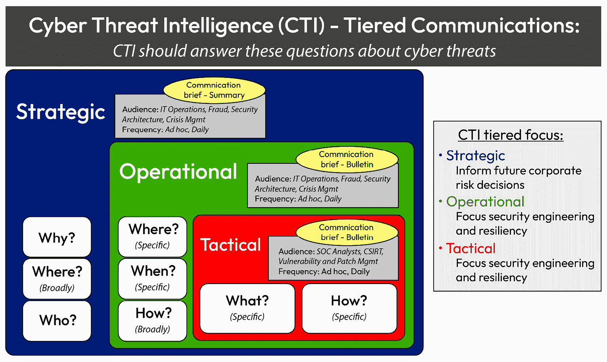

# 第五章：使用 Python 进行网络安全自动化

在当今互联互通的世界中，网络安全是任何组织网络安全策略的关键组成部分。随着网络规模和复杂性的增长，确保网络安全变得越来越具挑战性。设备、连接和数据流量的庞大数量意味着手动管理安全已不再可行。这时，自动化，尤其是通过 Python，成为网络安全的强大工具。

由于其简单性、多功能性以及大量针对安全任务量身定制的库，Python 已成为网络安全专业人员的首选语言。通过自动化网络安全流程，Python 使安全团队能够高效地管理、监控并保护其网络免受不断变化的威胁。无论是自动化防火墙规则更新、进行网络扫描，还是响应安全事件，Python 都可以简化许多繁琐且易出错的任务，这些任务对于维持网络安全至关重要。自动化网络安全流程不仅提高了效率，还增强了准确性和响应速度。通过消除手动任务，安全团队可以专注于更高层次的分析和决策，从而使网络安全姿态更加主动和韧性。

本章将介绍如何使用 Python 实现网络安全自动化的基础知识。我们将探讨如何使用 Python 自动化关键的安全任务，如网络监控、入侵检测、防火墙管理和漏洞扫描。你还将了解专为网络安全自动化设计的必要 Python 库和框架，例如用于数据包分析的**Scapy**，用于自动化**安全外壳**（**SSH**）任务的**Paramiko**，以及用于网络发现的**Nmap**。你将通过实践示例和脚本，学习如何使用 Python 自动化网络安全的各个方面。无论你是希望提升安全技能的网络工程师，还是希望自动化流程的网络安全专业人员，本章将为你提供使用 Python 开始网络安全自动化所需的基础知识。

在本章中，我们将涵盖以下主题：

+   安全自动化中的常见挑战类型概述

+   防火墙管理自动化

+   入侵检测和防御自动化

+   威胁情报集成

# 安全自动化中的常见挑战概述

虽然网络安全自动化带来了强大的好处，但它也伴随着一系列需要关注的挑战。以下是安全自动化中一些常见挑战的简要概述：

1.  **复杂性增加**：自动化可能引入复杂性，尤其是在多个设备、策略和流程的大规模环境中。

    **示例**：管理依赖关系并确保脚本在各种平台和 API 上和谐工作可能具有挑战性，需进行仔细的规划和测试。

1.  **配置错误的风险**：如果自动化脚本没有经过充分测试或没有得到妥善管理，可能会导致配置错误，从而无意间打开安全漏洞。

    **示例**：一个错误地允许不受限制访问的自动化规则可能会暴露关键系统给未授权用户，从而可能造成安全漏洞。

1.  **对更新的 API 和工具的依赖**：自动化脚本依赖于必须保持最新的 API、库或供应商工具，以便有效运行。

    **示例**：如果供应商更改了 API 端点或弃用了某个功能，可能会破坏自动化脚本并影响安全操作。

1.  **警报疲劳**：自动化可能会增加警报的数量，如果没有适当的过滤和优先级排序，可能会使安全团队不堪重负。

    **示例**：每次轻微异常自动生成的警报可能导致麻木，从而忽视了关键威胁。

1.  **可扩展性问题**：为小型网络设计的脚本和工具可能无法很好地扩展到更大的基础设施。

    **示例**：一个在测试中表现良好的防火墙配置脚本，如果没有考虑到大数据量或高频请求，可能会在生产环境中失败或变慢。

1.  **技能和维护要求**：有效的自动化需要专业技能，并且需要持续的维护，以适应网络结构或合规标准的变化。

    **示例**：组织必须投资于技能熟练的人员，并投入时间来维护、更新和排除自动化脚本的故障。

我强调这些挑战是为了强调，尽管自动化可以大大提高网络安全，但它需要仔细的规划、熟练的管理和积极的措施来避免潜在的陷阱。在本章的后续内容中，我们将讨论如何应对这些挑战并规划安全自动化。

# 防火墙管理自动化

使用 Palo Alto Networks 防火墙，特别是 Palo Alto Networks 的 **下一代防火墙**（**NGFW**），自动化网络安全过程可以显著简化操作、提高响应时间，并确保策略执行的一致性。以下是使用 Palo Alto Networks 自动化任务的指南，重点介绍 **Pan-OS API** 和 **Ansible 模块**，这是两种常用的自动化方法。

### Palo Alto Networks 的自动化过程

这个过程可以通过两种方式进行。让我们逐一了解。

#### 使用 Pan-OS API

Palo Alto Networks 提供了基于 REST 的 API，称为 PanOS API，允许您自动化执行任务，如配置更改、策略更新、日志检索和系统监控。以下是使用 Pan-OS API 进行自动化的步骤：

1.  **设置** **和身份验证**：

    1.  从防火墙获取 API 访问凭证（API 密钥）。

    1.  使用防火墙的管理 IP 地址进行 API 调用，确保你的环境能够访问该 IP 地址。

    1.  要进行身份验证，向防火墙的管理接口发送 POST 请求，使用你的管理员凭证以获取 API 密钥：

        ```
        python
        import requests
        # Replace these with actual values
        firewall_ip = "https://firewall-management-ip"
        api_username = "admin"
        api_password = "password"
        # Get the API Key
        response = requests.post(
            f"{firewall_ip}/api/?type=keygen&user={api_username}&password={api_password}"
        )
        api_key = response.json()['result']['key']
        ```

1.  **自动化配置更改**：示例：自动化添加新的安全策略。

    使用 API 配置新安全规则（源 IP、目标 IP、应用程序、动作），通过发送带有 XML 配置的 POST 请求：

    ```
    python
    # Define the XML payload for the security rule
    security_rule = """
    <entry name="Auto-Generated Rule">
        <from><member>trust</member></from>
        <to><member>untrust</member></to>
        <source><member>10.0.0.1</member></source>
        <destination><member>192.168.1.1</member></destination>
        <service><member>application-default</member></service>
        <action>allow</action>
    </entry>
    """
    # Send the POST request to add the rule
    requests.post(
        f"{firewall_ip}/api/?type=config&action=set&xpath=/config/devices/entry/vsys/entry/rulebase/security/rules&element={security_rule}&key={api_key}"
    )
    ```

1.  **监控与** **日志检索**：

    1.  使用 Pan-OS API 的日志功能来检索日志或监控事件。

    1.  例如，要获取最新的流量日志，可以使用以下 API 端点和查询过滤器：

        ```
        python
        log_response = requests.get(
            f"{firewall_ip}/api/?type=log&log-type=traffic&nlogs=10&key={api_key}"
        )
        logs = log_response.json()['result']['log']
        ```

#### 使用 Ansible 模块进行 Palo Alto Networks 自动化

Palo Alto Networks 提供了官方的 Ansible 模块，为自动化任务提供了不直接与 API 调用交互的替代方案。以下是使用 Ansible 模块进行自动化的步骤：

1.  **安装 Ansible 集合**：使用以下命令安装 Palo Alto 的 Ansible 集合：

    ```
    bash
    ansible-galaxy collection install paloaltonetworks.panos
    ```

1.  **配置身份验证**：设置一个包含防火墙 IP 地址和登录凭证的清单文件，或者在 Ansible playbook 中直接配置它们。

1.  **创建 Ansible playbook**：例如，使用 Ansible 添加一条新的安全规则：

    ```
    yaml
    - name: Configure Palo Alto NGFW
      hosts: firewalls
      gather_facts: no
      tasks:
        - name: Add security rule
          paloaltonetworks.panos.panos_security_rule:
            provider:
              ip_address: "firewall-management-ip"
              username: "admin"
              password: "password"
            rule_name: "Auto-Generated Rule"
            source_zone: ["trust"]
            destination_zone: ["untrust"]
            source_ip: ["10.0.0.1"]
            destination_ip: ["192.168.1.1"]
            action: "allow"
    ```

1.  **自动化执行**：运行此 playbook 将规则配置推送到防火墙：

    ```
    bash
    ansible-playbook firewall-config.yaml
    ```

### 关键使用案例

通过利用 Pan-OS API 和 Ansible 模块，你可以自动化 Palo Alto Networks 防火墙上的大多数任务，显著提高效率并最小化人为错误的可能性。以下使用案例有助于跟踪此内容：

+   **自动化策略更新**：随着网络变化，修改安全规则，保持组织内一致的访问控制。

+   **自动化威胁检测与响应**：监控流量中的异常，并自动触发响应，如阻止可疑的 IP 地址。

+   **日志记录与告警**：使用 Python 脚本自动化日志检索，并将其输入到 **安全信息和事件管理**（**SIEM**）系统中进行实时监控。

**防火墙**是网络安全的关键组成部分，通过根据安全规则控制进出流量，充当第一道防线。随着网络的日益复杂以及威胁的演变，手动管理防火墙规则和配置可能变得难以应对且容易出错。防火墙管理自动化有助于确保一致地执行策略，减少配置错误的风险，并为安全团队腾出时间专注于更具战略性的任务。

Python 以其丰富的库和模块生态系统，是自动化防火墙管理的优秀工具。无论你使用的是传统防火墙、云防火墙还是 NGFW，Python 脚本都可以用于自动化规则创建、修改、监控和报告。

## 防火墙管理自动化的关键任务

防火墙管理中的自动化可以涵盖广泛的任务，包括以下内容：

+   **规则创建与更新**：根据预定义的策略或实时安全事件，自动化防火墙规则的创建、修改和删除。

+   **配置管理**：自动化防火墙配置的备份、恢复和审计，以确保遵守安全政策和法规标准。

+   **监控与警报**：持续监控防火墙日志和流量模式，以发现可疑活动，并在检测到异常时自动发送警报。

+   **变更管理**：自动化防火墙变更的文档记录和批准，以确保问责制和可追溯性。

+   **合规性检查**：自动化定期的合规性检查，以确保防火墙规则与组织政策和行业法规一致。

通过自动化这些任务，组织可以减少人为错误的可能性，确保及时更新防火墙规则，并保持强大的安全防护。

## 用于防火墙自动化的 Python 库

有多个 Python 库和模块可以帮助进行防火墙自动化。根据防火墙供应商和所使用的防火墙类型，可以使用不同的工具。以下是一些常见的库：

+   **Paramiko**：这是一个用于 SSH 连接的 Python 库，常用于自动化与具有**命令行界面**（**CLI**）的防火墙的交互。

+   **Netmiko**：这是一个基于**Paramiko**的多厂商库，专为网络自动化设计，包括如 Cisco ASA、Palo Alto 和 Juniper 防火墙等设备的防火墙管理。

+   **pyFG**：这是一个用于通过 API 管理 Fortinet FortiGate 防火墙的 Python 模块。

+   **Palo Alto Networks API**：许多下一代防火墙（NGFW），如 Palo Alto Networks 的防火墙，提供 RESTful API，可以与 Python 的 requests 库一起使用，进行自动化任务。

+   **云 SDK**：对于基于云的防火墙（例如 AWS 安全组、Azure 网络安全组），云服务提供商提供的 Python SDK（例如，AWS 的 boto3，Azure 的 azure-sdk-for-python）可以用于自动化防火墙管理。

## 防火墙自动化的示例用例

在本节中，我们将了解如何通过自动化防火墙管理来提高安全性和效率。我们将介绍一些关键用例，包括根据变化的网络条件自动化防火墙规则的创建和更新，集成自动化漏洞扫描以实时调整防火墙设置，以及通过阻止恶意流量自动响应检测到的威胁。防火墙自动化有助于管理大规模环境，减少人为错误，并通过一致的规则执行确保遵守安全政策。

包括像 **pyFG** 这样的库示例，肯定能让内容更易于理解！这里有一个快速示例，说明如何在网络安全自动化中使用 **pyFG**。

### 使用 pyFG 生成网络图

**pyFG**（**Python Flow Graph**）是一个库，帮助我们通过创建有向图来可视化网络流。这在网络安全中非常有用，能够绘制连接图，识别潜在的攻击路径，显示通信模式。

让我们来看一个示例场景，假设我们要在网络中可视化通信路径。你想要可视化设备之间的通信流。**pyFG** 允许你创建一个图来表示这些连接：

```
python
from pyfg import Graph
# Create a new graph object
network_graph = Graph()
# Adding nodes (devices) to the graph
network_graph.add_node("Router")
network_graph.add_node("Web Server")
network_graph.add_node("Database Server")
# Adding directed edges (flows) between nodes
network_graph.add_edge("Router", "Web Server")
network_graph.add_edge("Web Server", "Database Server")
# Generate and display the graph (this will vary based on how you render it)
network_graph.display()
```

这个例子展示了**路由器**连接到**Web 服务器**，后者又连接到**数据库服务器**。以这种方式使用 **pyFG** 有助于我们可视化网络关系，使我们更容易识别未经批准的路径或风险连接。

添加更多实际的示例可以帮助你更好地理解像 **pyFG** 这样较少为人知的库的目的和功能。

### 使用 Ansible 自动化防火墙规则部署

一个常见场景是自动化部署新的防火墙规则。例如，假设部署了一个新的 Web 服务器，需要允许 **80** 和 **443** 端口的流量通过防火墙。在 Python 中，你可以编写一个脚本来自动化创建这些规则：

```
python
import paramiko
def create_firewall_rule(host, username, password, rule_command):
    ssh = paramiko.SSHClient()
    ssh.set_missing_host_key_policy(paramiko.AutoAddPolicy())
    ssh.connect(host, username=username, password=password)
    stdin, stdout, stderr = ssh.exec_command(rule_command)
    print(stdout.read().decode())
    ssh.close()
# Example rule command for Cisco ASA firewall
rule_command = "access-list outside_in extended permit tcp any host 192.168.1.100 eq 80"
create_firewall_rule("firewall_ip_address", "admin", "password", rule_command)
```

这个简单的脚本使用 **Paramiko** 连接到 Cisco ASA 防火墙，并执行一个命令，允许 HTTP 流量到达特定服务器。通过修改 **rule_command**，同样的方法可以扩展到其他防火墙供应商。

自动化防火墙规则部署能显著提高效率，但必须安全地处理这些过程，并避免一些常见的陷阱。以下是一些关键注意事项：

1.  **默认或弱密码**：在进行防火墙身份验证时依赖默认凭据或弱密码。

    **解决方案**：始终使用强密码和唯一密码进行 API 身份验证。理想情况下，将敏感凭据存储在安全的保险库中（例如 HashiCorp Vault 或 AWS Secrets Manager），并通过编程方式访问它们。

    +   **API 密钥安全**：将 API 密钥或凭据直接存储在脚本中，特别是当这些脚本被共享或提交到版本控制时。

        **解决方案**：使用环境变量或安全存储解决方案来存储 API 密钥。避免在脚本中硬编码敏感数据。

1.  **适当的规则管理**：在没有系统化审查过程的情况下自动化规则部署，这可能导致过多、过时或冲突的规则，从而削弱防火墙的安全性。

    **解决方案**：实施规则生命周期流程，定期审计、更新和删除未使用或冗余的规则。通过设置每个规则的审查周期来自动化规则过期。

1.  **在预发布环境中的测试**：直接在生产环境中部署自动化，而没有进行测试。

    **解决方案**：始终先在预生产环境中测试自动化脚本。这种方法可以在影响生产环境之前验证规则行为并检测问题。

1.  **自动化更改的日志记录与警报**：未监控自动化脚本所做的更改，可能导致未检测到的配置错误。

    **解决方案**：为所有自动化规则更改启用日志记录，并设置任何配置更改的警报。这可以确保规则部署的可见性，并有助于快速排除故障。

1.  **错误处理与回滚**：防止在部分规则部署过程中出现不完整配置或安全漏洞。

    **解决方案**：在脚本中添加错误处理，并在可能的情况下实现回滚机制，以便在发生故障时恢复到先前的配置。

1.  **API 请求的速率限制**：在短时间内发出过多的 API 请求可能会触发速率限制，导致延迟或请求未处理。

    **解决方案**：在脚本中引入延迟间隔或批处理，以防止过多的 API 请求，特别是在部署大量规则时。

1.  **限制 API 访问**：授予用于自动化的 API 密钥过于宽泛的权限。

    **解决方案**：将 API 访问限制为最低必要权限。例如，只允许与规则相关的操作，而不是全面的管理权限。这可以在 API 凭证泄露时将损失降到最低。

通过遵循这些最佳实践，用户可以帮助确保他们的自动化过程增强安全性，而不是无意中削弱它。

### 使用 Ansible 进行防火墙配置备份自动化

定期备份防火墙配置对灾难恢复至关重要，并且可以确保在必要时跟踪和回滚更改。使用 Python，可以自动化备份过程：

```
python
import netmiko
def backup_firewall_config(host, username, password, device_type):
    connection = netmiko.ConnectHandler(ip=host, username=username, password=password, device_type=device_type)
    config = connection.send_command("show running-config")
    with open(f"{host}_backup.txt", "w") as file:
        file.write(config)
    connection.disconnect()
    print(f"Backup of {host} completed.")
# Example usage
backup_firewall_config("firewall_ip_address", "admin", "password", "cisco_asa")
```

在此脚本中，**Netmiko** 用于连接到 Cisco ASA 防火墙，获取运行配置并将其保存到文件中。您可以定期安排此脚本运行，以确保防火墙配置始终被备份。

### 自动化合规性检查

防火墙规则需要符合内部安全政策和外部法规（例如 PCI-DSS、HIPAA）。Python 可用于自动化定期检查，确保防火墙规则合规：

```
python
import re
def check_compliance(firewall_config, compliance_rules):
    non_compliant_rules = []
    for rule in firewall_config:
        if not any(re.search(compliance_rule, rule) for compliance_rule in compliance_rules):
            non_compliant_rules.append(rule)
    return non_compliant_rules
# Example compliance rules: No "any" in source or destination, no insecure ports (e.g., Telnet, FTP)
compliance_rules = [r"permit tcp \S+ eq 21", r"permit tcp \S+ eq 23", r"permit ip any any"]
# Sample firewall configuration
firewall_config = [
    "permit ip any any",
    "permit tcp host 192.168.1.50 host 192.168.1.100 eq 22"
]
non_compliant = check_compliance(firewall_config, compliance_rules)
print("Non-compliant rules:", non_compliant)
```

此脚本检查一个示例防火墙配置是否符合一组合规规则。违反合规的规则会被标记，以便安全团队采取纠正措施。

自动化合规性检查涉及使用脚本或工具自动评估系统、网络或组织是否符合特定的安全标准和监管要求。与手动验证每项政策不同，自动化使得持续监控成为可能，确保安全控制始终得到执行。

## 防火墙管理自动化的最佳实践

以下是防火墙管理自动化的一些最佳实践：

+   **在预发布环境中测试脚本**：始终在非生产环境中测试自动化脚本，以避免对网络造成无意的干扰。

+   **使用版本控制**：将自动化脚本存储在版本控制系统中（例如 Git），以跟踪更改并在必要时回滚。

+   **实施错误处理**：确保脚本具有强大的错误处理功能，以防止在发生故障时出现不完整的更改或中断。

+   **定期审计**：自动化定期审计防火墙配置，确保它们与安全政策和合规要求保持一致。

+   **与 CI/CD 流水线集成**：对于 DevSecOps 实践，将防火墙规则更新和检查集成到 CI/CD 流水线中，以确保在部署新应用程序时强制执行安全控制。

## 案例研究——大型金融企业中的安全自动化

一家大型金融服务公司 SecureBank 在多个地区运营，管理大量客户数据并处理每天数千笔交易。为了保持合规性并确保强大的安全性，SecureBank 的**安全运营中心**（**SOC**）使用 Python 和各种自动化工具自动化了多个关键的安全过程。

关于全面漏洞扫描和修复的案例研究，以下是对 SecureBank 所面临的挑战、所采用的最佳实践以及取得的成果的深入扩展。

### 挑战和初始条件

该组织最初面临多个问题——主要是不同团队之间扫描碎片化、扫描频率不一致以及缺乏集中监督。这些差距导致了漏洞的遗漏和风险的长期暴露，影响了行业标准的合规性。

### 变革的催化剂

驱动最佳实践转变的关键事件包括以下几点：

+   **合规压力**：最近的一次审计揭示了合规性差距，特别是在关键漏洞修补的及时性方面。

+   **事件响应和经验教训**：之前的安全事件凸显了快速检测和响应的必要性，表明现有流程无法跟上新威胁的步伐。

+   **领导力和战略转型**：执行领导层将安全性作为更广泛数字化转型的一部分，强调在漏洞管理中的可见性和问责制。

### 实施的最佳实践

以下是应用安全自动化中实施的一些最佳实践：

+   **自动化、持续扫描**：该组织采用了强大的漏洞扫描解决方案，实现了端点、网络和云环境的持续自动化扫描。这使得能够实时识别漏洞，而不是等待计划中的扫描。

+   **基于风险的漏洞优先级排序**：为了应对扫描结果过多的问题，它引入了一种基于风险的方法，根据漏洞的严重性和可利用性来优先处理漏洞。关键漏洞得到立即处理，而低风险项目则安排在常规更新中。

+   **修复操作手册**：为了确保一致的响应，它开发了操作手册，详细说明了从处理关键问题到跨团队协调修补活动的标准操作程序。

+   **与补丁管理系统集成**：漏洞扫描器与补丁管理系统集成，自动化修复常见漏洞，并加速补丁部署过程。

+   **定期安全审计与报告**：建立了结构化的审计计划，验证修复措施是否有效且全面。同时，它还为利益相关者实施了详细报告，确保透明度。

### 结果与收益

采取措施解决初步挑战后，观察到如下结果：

+   **减少暴露时间**：组织显著缩短了漏洞发现与修复之间的时间，最小化了潜在的利用窗口。

+   **提高合规性和风险管理**：通过采用这些最佳实践，它达到了合规标准，并减少了风险，审计过程中发现的问题也更少。

+   **跨职能协作**：安全团队与 IT 和 DevOps 团队更高效地协作，促进了更顺利的实施，并共同对安全结果承担责任。

这种方法使组织采取了积极的安全姿态，能够在漏洞发生前主动应对，而不是在事件发生后被动响应，从而创建了一个安全、韧性的环境。

### 将特定工具融入最佳实践中

可以用来整合的工具如下：

1.  **全面的漏洞扫描和修复**：SecureBank 使用 **Nessus** 和 **OpenVAS** 扫描器，通过 Python 脚本实现自动化，定期对服务器和工作站进行漏洞评估。

    **最佳实践**：扫描自动化配置在非高峰时段运行，以最小化对网络的影响，结果通过管道传输到中央 SIEM 系统（如 Splunk），进行持续监控。

    **示例**：一个 Python 脚本每天检查扫描，标记高优先级漏洞，并在修复系统中创建工单，供 IT 团队在定义的服务水平协议（SLA）内处理。

1.  **自动化防火墙和 IDS 更新**：SecureBank 已标准化了防火墙和 IDS 规则更新的政策。它使用 Ansible 将政策变更推送到各种网络设备，减少了手动错误。

    **最佳实践**：每次政策更改都会先在预生产环境中进行测试，只有经过审查的规则才会部署到生产环境，防止配置错误对服务产生影响。

    **示例**：Ansible playbook 在策略批准后一小时内在防火墙上应用规则更新，减少了漏洞暴露的时间。

1.  **多阶段警报管理和事件响应**：由于每天会生成成千上万条安全警报，SecureBank 使用**安全编排、自动化和响应**（**SOAR**）平台，如**Splunk Phantom**，来管理警报数量。

    **最佳实践**：警报被分为不同类别，预定义的 playbook 自动处理低风险事件（例如，阻止 IP、隔离终端）。

    **示例**：当来自外国 IP 的异常流量触发入侵检测警报时，SOAR 平台会自动执行 Python 脚本，阻止该 IP 进入防火墙，并通知 SOC 团队，将响应时间缩短到几分钟。

1.  **持续合规审计和报告**：金融法规要求 SecureBank 展示其遵守如 PCI DSS 等标准的合规性。自动化脚本收集审计数据并生成合规报告。

    **最佳实践**：脚本自动提取必要的日志和配置，生成审计报告，确保其准确及时。

    **示例**：定期运行的 Python 任务每周检索防火墙配置和网络日志，将数据格式化为合规报告，准备供内部审查或外部审计。

1.  **数据屏蔽和加密在 DevOps 管道中的应用**：SecureBank 的 DevOps 团队确保在开发或测试中使用的敏感数据经过屏蔽或加密，防止暴露。

    **最佳实践**：数据屏蔽自动化在客户数据进入测试环境之前应用转换，减少了数据泄露的风险。

    **示例**：Python 脚本对生产数据进行可逆转换，使开发人员能够在不泄露实际客户信息的情况下，使用真实的数据集进行测试。

通过实施这些最佳实践，SecureBank 成功减少了漏洞暴露，能够更快响应事件，并保持符合行业法规的要求。这种方法确保了 SecureBank 的安全自动化框架既具有韧性，又具有可扩展性，这对于管理大型企业环境中复杂且日益增长的安全需求至关重要。

接下来，让我们来看一些现实世界中的考虑因素。

## 现实世界中的考虑因素

在现实世界的防火墙自动化中，必须解决几个关键问题，以确保安全性、性能和合规性：

+   **安全性和访问控制**：防火墙必须遵循最小权限原则，并具备适当的审批工作流，以避免过于宽松的规则。

+   **性能影响**：自动化应优化规则，防止性能下降，并平衡日志需求与系统资源。

+   **可扩展性和网络复杂性**：自动化必须能够处理大型、混合型和基于云的环境，确保在所有区域内应用一致的规则。

+   **合规性与审计** ：防火墙自动化应与监管要求保持一致，并为审计目的保留详细日志。

+   **变更管理** ：自动化更新必须经过彻底测试，并包含回滚选项，以降低配置错误的风险。

这些考虑因素有助于确保防火墙自动化是安全、高效且合规的：

+   **API 与 CLI 自动化** ：在可能的情况下，优先使用防火墙厂商提供的 API 进行自动化，因为它们比 CLI 自动化更加稳定且易于使用。API 通常提供更好的反馈和错误处理，使得自动化脚本更加可靠。

+   **基于角色的访问控制 (RBAC)** ：确保自动化脚本仅使用最低权限运行。使用有限访问权限的账户，以防自动化系统被入侵时产生安全风险。

+   **日志记录与审计** ：确保所有自动化操作都有日志记录并可审计。这将有助于追踪由自动化脚本所做的更改，并遵守安全最佳实践和法规要求。

使用 Python 进行防火墙管理自动化可以显著提高管理防火墙规则和配置的效率与准确性。通过自动化规则创建、配置备份、合规检查和监控等任务，安全团队能够减少手动管理的负担，并确保安全政策的一致执行。凭借 Python 丰富的库支持和灵活性，你可以构建适应特定防火墙基础设施的自动化解决方案，从而打造更加安全和有韧性的网络环境。

为了顺利过渡到自动化防火墙管理，最佳实践包括从明确的政策开始，逐步实施变更，整合审批流程，在受控环境中彻底测试，并启用持续监控和日志记录以确保安全性和合规性。

# 入侵检测与防御自动化

**入侵检测与防御系统** (**IDPSs**) 是现代网络安全策略的核心组成部分。这些系统监控网络流量和系统活动，以寻找恶意行为和未经授权的访问迹象。**入侵检测系统** (**IDSs**) 在发现可疑活动时向安全团队发出警报，而**入侵防御系统** (**IPSs**) 则立即采取行动封锁或缓解威胁。鉴于大量数据流经网络，自动化管理、分析和响应 IDPS 对于维持高效且有效的安全态势至关重要。

Python 凭借其灵活性和丰富的库生态系统，是自动化 IDPS 操作各个方面的绝佳选择。从自动化告警筛选到创建自定义检测签名以及协调事件响应，Python 可以简化入侵检测与防御中许多环节的工作。

在本节中，我们将讨论通过自动化实时检测潜在威胁并响应，来增强网络安全中的入侵检测与防御自动化。这涉及使用 IDPS 等工具监控网络流量中的恶意活动，并立即采取措施，如阻止可疑流量和调整防火墙规则。自动化通过与 SIEM 系统等安全工具集成，并利用**机器学习**（**ML**）进行自适应威胁检测，提升了威胁检测的准确性和响应时间，减少了人为错误。这种方法有助于确保在最小人工干预的情况下，持续保护系统免受不断发展的网络威胁。

## IDPS 自动化的关键领域

IDPS 的自动化可以应用于多个关键领域，包括以下内容：

+   **警报分类与响应**：自动化分析和优先处理 IDS 警报，并根据预定义标准启动响应操作（例如，阻止 IP 地址、隔离感染主机）。

+   **自定义签名创建**：基于威胁情报或特定用例，自动生成并部署自定义检测签名。

+   **数据收集与关联**：自动化从各种来源收集日志数据，将其关联以检测复杂的攻击模式，并将其输入到 IDS 中，以提高检测能力。

+   **报告与可视化**：自动化生成报告和仪表板，以提供对检测到的威胁以及防御措施效果的可见性。

+   **与其他安全工具的集成**：自动化 IDS/IPS 与其他安全工具（如 SIEM、火墙、终端检测与响应工具）之间的互动，以实现协调的威胁检测与响应。

通过自动化这些流程，安全团队能够更快速、更高效地响应威胁，缩短检测和缓解安全事件所需的时间。

强调 IDPS 自动化的局限性可以提供一个平衡的视角。以下是一些常见的挑战：

+   **高误报率**：自动化的 IDPS 系统通常会生成过多的警报，其中许多是误报。这种“警报疲劳”可能会使安全团队感到不堪重负，导致真正的威胁被忽视或错过。

    **示例**：自动化规则可能将正常的网络活动标记为可疑，从而触发不必要的警报。例如，服务器之间频繁的文件传输可能会被误判为数据泄露。

    **解决方案**：为减少误报，组织应实施更细粒度的警报规则，并使用机器学习区分典型行为与非典型行为。

+   **调优与定制的挑战**：将 IDPS 系统适配到独特的环境中是至关重要但又复杂的。过于严格的设置会导致过多的误报，而过于宽松的配置则可能错过威胁。

    **示例**：通用规则可能无法考虑特定网络环境中的正常活动，例如高内部流量，导致不必要的警报。

    **解决方案**：定期审查并调整检测阈值和签名更新，以匹配网络的活动模式和已知基准。

+   **检测复杂威胁的难度**：传统的 IDPS 系统可能难以应对先进的、低调的攻击，这些攻击不会触发典型的签名。

    **示例**：攻击者使用加密、隧道技术或多阶段渗透等手段，可以绕过基于签名的检测系统。

    **解决方案**：将 IDPS 与行为分析或异常检测结合，识别网络行为中的偏差，从而揭示未知威胁。

+   **资源和性能限制**：持续监控和高数据吞吐量可能会使网络资源紧张，影响 IDPS 性能，尤其是在高流量环境下。

    **示例**：如果 IDPS 设备因实时流量过大而被压垮，可能会发生网络延迟和数据包丢失。

    **解决方案**：通过将 IDPS 分布在网络各个段中并使用负载均衡技术来扩展基础设施，从而有效地管理流量量。

+   **集成与兼容性问题**：将 IDPS 系统与其他安全工具集成可能会非常复杂，并且可能需要定制开发，特别是在异构网络环境中。

    **示例**：遗留系统或定制的解决方案可能缺乏原生集成，需额外编写脚本或中间件。

    **解决方案**：使用灵活的 API 或中间件实现无缝集成和自动化，并考虑支持标准化协议（如 REST 或 syslog）的 IDPS 系统，以便更顺利地与其他工具交互。

+   **隐私和法律问题**：自动化 IDPS 可能会无意中捕获敏感数据，从而引发潜在的隐私或法律问题。

    **示例**：记录所有流量，包括敏感通信，可能会引发隐私合规性问题。

    **解决方案**：尽可能限制数据捕获为必要的元数据，并制定数据处理政策，以遵守法规要求。

通过认识到这些限制，安全团队可以以现实的态度面对 IDPS 自动化，更容易优化和维护符合其特定需求和网络环境的检测系统。

## Python 库用于 IDPS 自动化

Python 提供了一系列有用的库和模块，可用于自动化入侵检测和防御相关的任务：

+   **Scapy**：一个强大的数据包操作工具，可用于创建自定义网络流量，以测试 IDS/IPS 系统，以及自动化数据包分析和检测。

+   **PyShark**：Wireshark 数据包捕获工具的封装器，可用于自动化数据包分析。

+   **Elasticsearch-Py**：一个用于 Elasticsearch 的 Python 客户端，通常用于自动化查询和分析存储在 Elasticsearch 索引中的 IDS 日志（通常与 Elastic Stack 等工具一起使用）。

+   **请求**：一个广泛使用的 HTTP 请求库，用于与 IDS/IPS 系统提供的 API 进行交互，以自动化任务，如规则管理和事件响应。

+   **SNORTPy**：一个用于管理和自动化任务的 Python 包装器，适用于流行的开源 IDS Snort。

## IDPS 自动化的用例

IDPS 自动化的用例展示了它通过各种自动化过程增强网络安全的作用：

+   **主动威胁检测**：自动化 IDPS 持续监控网络流量和系统活动，早期识别潜在的威胁或异常。

    **用例**：检测来自外国 IP 地址的异常登录尝试，并将其标记为可疑，帮助防止未经授权的访问。

+   **自动化事件响应**：当检测到威胁时，系统可以自动执行纠正措施，例如通过防火墙阻止恶意流量或隔离被入侵的系统。

    **用例**：如果在设备上检测到恶意软件感染，IDPS 可以自动将设备从网络中隔离，以防止进一步传播。

+   **与安全生态系统的集成**：自动化 IDPS 可以与其他安全工具连接，如 SIEM 系统，为全面的威胁管理提供统一的安全事件视图。

    **用例**：与 SIEM 系统集成，通过多种来源（如防火墙和终端的日志）关联数据，创建一个关于当前威胁的整体视图。

+   **自适应安全措施**：利用机器学习，自动化 IDPS 通过识别并学习模式不断适应新威胁，从而增强其检测能力。

    **用例**：基于从最近类似事件中学到的新模式识别出一个先前未知的钓鱼攻击，减少攻击成功的可能性。

这些用例展示了 IDPS 中的自动化如何不仅提高威胁检测和响应的效率和效果，还能帮助维持强大的安全姿态，且无需过多人工干预。让我们详细了解一下。

### 自动化警报分类和响应

IDPS 中最有价值的自动化用例之一是自动化警报的分类和响应。例如，Python 脚本可以分析来自 IDS 的警报，并自动确定适当的响应，如阻止 IP 地址或向安全团队发送通知：

```
python
import requests
# Example: Automate response based on Snort alert data
def process_alert(alert):
    if "malicious_ip" in alert:
        # Example action: Block IP address on firewall
        block_ip(alert["malicious_ip"])
        # Notify security team
        send_notification(f"Blocked malicious IP: {alert['malicious_ip']}")
def block_ip(ip_address):
    firewall_api_url = "https://firewall.example.com/api/block_ip"
    response = requests.post(firewall_api_url, json={"ip": ip_address})
    return response.status_code
def send_notification(message):
    # Integrate with Slack or email notification system
    print(f"Notification sent: {message}")
# Example alert data from Snort
alert_data = {"malicious_ip": "192.168.1.100", "alert": "Detected exploit attempt"}
process_alert(alert_data)
```

这个简单的示例展示了 Python 如何通过处理来自 IDS（如 Snort）的警报数据并采取适当的行动（例如，通过防火墙 API 阻止恶意 IP 地址）来自动化警报分类和响应。

自动化告警分类和响应涉及使用脚本、工具和工作流程来高效处理安全告警，最大限度减少人工干预并提高响应时间。以下是该过程的总体解释，包括这种代码可能的示例。

将机器学习和 AI 集成到入侵检测与防御系统（IDPS）的分类过程中，可以显著提高准确性并减少告警疲劳。以下是这些技术带来的价值：

+   **减少误报**：机器学习模型可以分析历史告警数据，识别合法网络行为的模式，帮助系统识别并忽略那些会触发误报的常见良性活动。

    **示例**：机器学习模型可能会学到频繁的数据库查询是正常的业务操作的一部分，从而防止这些查询不必要地触发告警。

    **好处**：更少的误报意味着安全团队可以集中精力处理真实威胁，简化分类过程。

+   **异常检测**：AI 和机器学习算法可以基准化正常的网络行为并检测偏差，即使这些偏差与已知的签名不匹配。这对于识别未知或高级威胁尤其有价值，因为这些威胁可能不会触发传统的签名。

    **示例**：如果一个内部服务器突然开始与一个未知的外部 IP 地址通信，或者在非典型的工作时间发送数据，基于机器学习的异常检测可能会将其标记为潜在的可疑行为。

    **好处**：异常检测允许更灵活、适应性强的威胁检测，并提供对隐蔽攻击的可视性。

+   **自动化告警优先级排序**：通过分析上下文，如设备的关键性、先前的告警解决情况和近期的网络活动，AI 可以为每个告警分配一个风险评分。这种优先级排序帮助团队首先响应最紧急的威胁。

    **示例**：涉及核心服务器和敏感数据的告警可能会被自动评为比来自不太关键端点的告警更高的优先级。

    **好处**：优先级排序告警提高了对重大威胁的响应速度，这对于减少事件潜在影响至关重要。

+   **基于上下文的关联分析**：机器学习可以分析多个告警中的模式，将相关事件关联起来，以突出更广泛的安全事件。这个功能通过将告警整合成连贯的事件，减少了噪音。

    **示例**：如果攻击者正在探测多个网络设备，机器学习算法可以将这些个别告警关联起来，识别出这是一次协调的侦察活动。

    **好处**：关联告警使得分析人员能够更全面地响应事件，从而提高检测的准确性和效率。

+   **自学习威胁情报**：AI 增强的入侵检测与防御系统可以根据不断变化的攻击模式持续更新其威胁模型，从而提高对零日漏洞和新攻击方法的检测能力。

    **示例**：在观察到多次新的网络钓鱼攻击后，系统可以自动更新检测规则，以便捕捉类似的未来攻击。

    **益处**：自学习能力确保 IDPS 在无需持续手动更新的情况下，能够有效应对新的、未见过的威胁。

+   **自动化响应建议**：人工智能可以根据团队过去对类似警报采取的行动提供响应建议。这一功能加速了响应时间，并确保事件处理的一致性。

    **示例**：如果发生一个高风险警报并与过去的事件匹配，人工智能可能会建议封锁 IP 地址、隔离设备或增加监控作为下一步措施。

    **益处**：推荐功能简化了分析师的决策过程，尤其在高流量或高压环境下尤为宝贵。

通过利用人工智能和机器学习，组织可以显著增强其入侵检测与防御系统（IDPS）准确识别、优先排序和响应安全威胁的能力，从而提升安全态势并减轻安全运营中心（SOC）团队的负担。

### 网络威胁情报概述

**网络威胁情报**（**CTI**）过程是一种结构化的方法，用于收集、分析和利用潜在网络威胁信息，以提高组织的安全态势。它涉及几个关键步骤：

1.  **警报生成**：安全工具（如 SIEM、IDS/IPS、端点保护）基于检测到的异常、威胁或漏洞生成警报。

1.  **警报收集**：警报被收集并导入到中央系统或仪表盘进行处理。

1.  **警报分类**：系统根据预定义的标准（如严重性、类型和潜在影响）对警报进行分类和优先级排序。

1.  **自动化响应**：根据警报的分类，系统触发自动响应，如封锁 IP 地址、隔离受影响的系统并启动预定义的工作流程。

1.  **通知**：如果需要，系统会为人工分析师创建通知或工单，并根据警报的严重性采取进一步的行动。

### 自定义签名生成与部署

自动化创建和部署自定义 IDS 签名可以帮助安全团队迅速适应新兴威胁。可以使用 Python 基于威胁情报源或网络流量中识别的模式生成签名，并自动将其部署到 IDS 中：

```
python
def create_snort_signature(signature_id, src_ip, dest_ip, payload):
    signature = f"alert tcp {src_ip} any -> {dest_ip} any (msg:\"Custom Signature {signature_id}\"; content:\"{payload}\"; sid:{signature_id};)"
    return signature
def deploy_signature_to_snort(signature):
    with open("/etc/snort/rules/custom.rules", "a") as rule_file:
        rule_file.write(signature + "\n")
    # Restart Snort to apply the new rule
    os.system("sudo systemctl restart snort")
# Example usage
new_signature = create_snort_signature(100001, "192.168.1.50", "192.168.1.100", "malicious_payload")
deploy_signature_to_snort(new_signature)
```

该脚本根据特定的 IP 和负载生成自定义 Snort 签名，然后将其附加到 Snort 的规则文件中，并重启服务以应用更改。

自定义签名生成是通过分析恶意软件或攻击行为，创建独特的模式来检测特定威胁。这些签名是基于已知的指标定义的，并且编码成安全工具可以识别的格式。一旦创建，签名就通过更新或配置更改部署到安全系统中（例如，杀毒系统、IDS/IPS）。持续的监控和更新确保签名能够有效地检测到不断发展的威胁。

### 自动化事件响应工作流程

Python 也可以用来自动化事件响应工作流程，集成各种安全工具，并根据 IDS 警报协调响应。例如，一个脚本可以通过更新防火墙规则或触发端点保护系统的响应来自动隔离被感染的主机：

```
python
import subprocess
def isolate_infected_host(ip_address):
    # Block all traffic to and from the infected host
    subprocess.run(["sudo", "iptables", "-A", "INPUT", "-s", ip_address, "-j", "DROP"])
    subprocess.run(["sudo", "iptables", "-A", "OUTPUT", "-d", ip_address, "-j", "DROP"])
    # Notify security team
    send_notification(f"Infected host {ip_address} isolated.")
def send_notification(message):
    print(f"Notification sent: {message}")
# Example usage
isolate_infected_host("192.168.1.50")
```

在这个例子中，Python 被用来与主机的防火墙（通过 **iptables**）进行交互，通过阻止所有进出流量来隔离感染的系统。

自动化事件响应工作流程涉及使用工具在最少人工干预的情况下检测、分析和响应安全事件。警报触发预定义的行动，如隔离系统或阻止威胁，自动化系统记录细节并通知相关人员。这可以加快响应速度，减少人工工作量，并提高整体安全效率。持续的更新确保自动化能够适应不断发展的威胁。

## IDPS 自动化的最佳实践

IDPS 自动化的最佳实践包括定义清晰的安全策略和响应协议，以指导自动化行动。定期更新检测签名，以应对新威胁并最小化误报。持续监控和微调自动化系统，以确保最佳性能和准确性。将 IDPS 与其他安全工具集成，形成一个 cohesive 和有效的威胁管理策略。

+   **彻底测试自动化脚本**：确保所有自动化脚本在受控环境中经过充分测试后再部署到生产环境中。这有助于防止意外的中断或安全问题。

+   **使用版本控制**：将所有自动化脚本存储在版本控制系统中，以便跟踪更改、与团队成员协作，并在必要时进行回滚。

+   **实现健壮的错误处理**：确保脚本能够优雅地处理错误，并记录执行过程中遇到的任何失败或问题。

+   **监控和记录自动化操作**：保持详细的自动化脚本操作日志，供审计和故障排除使用。

+   **保持最新的威胁情报**：根据最新的威胁情报和新兴攻击方式，持续更新自定义检测签名和响应措施。

+   **RBAC**：使用最小权限原则，确保自动化脚本只访问其功能所需的资源，从而最小化潜在的安全风险。

## IDPS 系统的实际考虑

在实际应用中，IDPS 系统必须处理大量数据和潜在的误报，因此需要精确调优以避免不必要的中断。它们需要与其他安全工具和工作流集成，提供全面的防御策略。定期更新和维护对跟上不断变化的威胁和漏洞至关重要。此外，确保系统能够随着网络环境的增长而有效扩展，对于维持强大的安全性至关重要。以下因素有助于优化系统功能，同时与组织的安全需求保持一致：

+   **可扩展性**：随着网络的增长，确保你的自动化脚本能够扩展以处理增加的警报、流量和系统数量。

+   **与其他安全工具的集成**：考虑如何让你的自动化脚本与安全堆栈的其他组件集成，如 SIEM 系统、终端保护平台和云安全工具。

+   **合规性**：确保自动化过程符合监管和行业合规要求，尤其是在那些安全操作需接受审计和法律标准约束的行业中。

使用 Python 进行入侵检测与防御自动化，可以大幅提高在网络中检测和响应威胁的效率。通过自动化任务如警报筛选、签名创建和事件响应，安全团队可以减少缓解攻击所需的时间，并保持更强的安全防护。借助合适的工具、库和实践，Python 自动化可以成为主动且具有韧性的网络安全战略中不可或缺的一部分。

鉴于 IDPS 在检测和缓解威胁中的关键作用，集成威胁情报通过提供有关新兴威胁和攻击模式的背景信息来增强其效果。这一转变使安全策略更加主动和信息化，使 IDPS 系统能够更迅速地适应不断变化的威胁，改善整体防御机制。通过集成威胁情报，组织可以更好地预测、识别和响应复杂的攻击，确保更强大和适应性更强的安全态势。

# 威胁情报集成

**威胁情报集成**是现代网络安全的关键方面。它涉及威胁数据的收集、分析和应用，以增强组织检测、响应和防止网络攻击的能力。通过将威胁情报集成到安全系统中，您可以实时了解新兴威胁，理解对手使用的**战术、技术和程序**（**TTPs**），并改善整体防御策略。Python 凭借其多样性和强大的库，成为自动化集成威胁情报到各种安全流程中的优秀工具。

将威胁情报与 IDPS（入侵检测与预防系统）集成，通过为新兴威胁和攻击模式提供上下文洞察，增强威胁检测能力。这种集成可以通过将数据与已知威胁指标相关联，精确识别可疑活动，并减少误报。它能够实现主动防御策略，帮助组织在威胁升级之前预测并应对潜在攻击。总体而言，威胁情报整合增强了安全措施的有效性和适应性。

## 什么是威胁情报？

威胁情报是指收集关于潜在或活跃的威胁的数据。这些数据包括有关威胁行为者、其动机、攻击向量以及他们利用的漏洞的信息。在将系统与威胁情报集成时，需要考虑以下几个方面：



图 5.1 – 威胁情报整合

威胁情报可以分为不同类型：

+   **战略性威胁情报**：聚焦于广泛趋势和地缘政治威胁的高层次信息。

+   **战术性威胁情报**：关于威胁行为者使用的 TTP（战术、技术和程序）的信息。

+   **操作性威胁情报**：关于具体事件或攻击的数据，通常是实时收集的。

+   **技术性威胁情报**：低层次的数据，如 IP 地址、域名、恶意软件哈希值和其他**妥协指示器**（**IOCs**）。

威胁情报整合的目标是确保这些信息持续输入到安全系统中，从而实现主动防御措施和实时威胁检测。

## 威胁情报整合的关键领域

威胁情报的整合可以应用于多个安全功能，包括以下内容：

+   **自动化威胁检测**：通过持续更新检测系统（例如 IDS/IPS、SIEM）以引入最新的威胁指标（IP 地址、域名、文件哈希等），从而增强检测能力。

+   **事件响应**：通过利用威胁情报源中的上下文信息，丰富安全警报和事件分析，从而提高分析和响应的效果。

+   **漏洞管理**：根据现实世界中的威胁数据优先级排序漏洞，使得安全团队能够专注于那些最有可能被利用的漏洞。

+   **威胁狩猎**：利用威胁情报指导主动搜索组织环境中潜在的妥协迹象。

## Python 库和工具用于威胁情报整合

Python 提供了多种库和工具，可帮助进行威胁情报整合：

+   **OpenCTI (开放网络威胁情报)**：这是一个开源的威胁情报平台，能够与多个威胁情报来源集成，并提供自动化的 API 接口。

+   **ThreatConnect SDK**：这是一个用于与 ThreatConnect 威胁情报平台交互的 Python SDK，支持自动化地获取和使用威胁数据。

+   **STIX/TAXII**：**结构化威胁信息表达**（**STIX**）和**受信的自动化指标信息交换**（**TAXII**）标准被广泛用于威胁情报共享。像**stix2**和**cabby**这样的库允许 Python 与 STIX 数据和 TAXII 服务器进行交互。

+   **Maltego**：这是一个用于可视化威胁数据中关系的工具，支持通过脚本实现基于 Python 的自动化。

+   **Requests**：这是一个多功能的 HTTP 库，用于与威胁情报平台和数据源的 RESTful API 进行交互。

+   **YARA-Python**：YARA 规则用于基于模式识别和分类恶意软件。Python 可以自动化创建、管理和执行 YARA 规则，以检测恶意活动。

## 威胁情报自动化的使用场景

威胁情报自动化可以通过自动关联指标与网络活动并向安全团队发出警报，来简化已知威胁的检测。它支持实时更新和与安全工具的集成，提升响应速度和准确性。自动化还可以通过提供背景信息丰富事件数据，从而改善分析和决策。此外，它通过持续监控并适应新的威胁情报源，有助于识别和缓解新兴威胁。

以下是一些潜在的威胁情报来源：

+   开源威胁情报源包括以下内容：

    +   **AlienVault Open Threat Exchange (OTX)**：这是一个广泛使用的社区驱动平台，安全专业人士在其中共享威胁数据，包括恶意 IP、域名和文件等 IOC。

    +   **VirusTotal**：它通过分析用户提交的文件和 URL 提供丰富的威胁数据。虽然主要以恶意软件扫描而闻名，但它还提供 API 接口，允许直接集成数据。

    +   **Abuse.ch**：该平台托管多个威胁情报源，专注于恶意软件、僵尸网络和勒索软件，特别适用于追踪和屏蔽有害的域名和 IP。

    +   **CIRCL Passive DNS (passive DNS replication)**：它收集被动 DNS 数据，以识别恶意域名活动，帮助识别攻击者使用的潜在**命令与控制**（**C2**）基础设施。

+   政府和行业来源包括以下内容：

    +   **MITRE ATT&CK**：这是一个关于攻击者 TTPs（战术、技术和程序）的知识库，帮助组织了解敌对者的操作方式，并提升检测能力。

    +   **美国国土安全部（DHS）**的**自动化指标共享（AIS）**：这项服务允许公共和私营部门之间交换网络威胁指标，以便提前警告潜在的威胁。

    +   **金融服务信息共享与分析中心（FS-ISAC）**：该中心专门为金融行业提供威胁情报，对于该行业的公司具有重要价值。

+   商业威胁情报提供商包括以下内容：

    +   **Recorded Future、CrowdStrike、FireEye 和 ThreatConnect**：这些提供商提供深入、精选的威胁情报，适用于各种行业。它们通常提供战术和战略性的洞察，包括自动化的威胁情报源集成。

    +   **Splunk 威胁情报管理**：对于使用 SIEM 解决方案（如 Splunk）的用户，许多供应商提供与威胁情报源的集成，使得威胁数据能够直接融入警报工作流中。

+   基于社区的情报来源包括以下内容：

    +   **信息共享与分析中心（ISACs）**：面向特定行业的中心，如 Health-ISAC 和 Energy-ISAC，专注于根据各自行业面临的独特威胁，提供可操作的情报。

    +   **Reddit 和 GitHub 安全社区**：虽然这些是非正式的安全社区，但它们常常分享有关新发现的漏洞和攻击方法的宝贵见解，使用户能够及时了解最新的威胁。

+   内部威胁情报包括以下内容：

    +   **内部日志和事件数据**：组织内部的历史事件、日志和漏洞评估提供了高度相关的威胁情报，可以指导防御优先级，并定制威胁检测。

    +   **员工报告和钓鱼数据**：用户报告的钓鱼尝试和其他可疑活动通常揭示出特定组织的定向威胁战术，帮助组织识别趋势和反复出现的对手。

通过将这些来源集成到安全自动化工作流中，组织可以构建更丰富的威胁情报库，从而加强主动防御措施和快速事件响应能力。

### 自动化威胁源集成

自动化地检索并集成威胁情报源到安全系统中，可以大大增强检测能力。例如，可以使用 Python 从公共或私人威胁情报源获取最新的 IOC，并自动更新你的 SIEM 或防火墙规则：

```
import requests
def fetch_iocs_from_feed(feed_url):
    response = requests.get(feed_url)
    if response.status_code == 200:
        return response.json()  # Assuming the feed returns JSON
    else:
        return []
def update_firewall_rules(iocs):
    for ioc in iocs:
        if "ip_address" in ioc:
            # Example command to block IP on firewall (pseudo-code)
            block_ip_on_firewall(ioc["ip_address"])
# Example usage
ioc_feed_url = "https://example.com/threat_feed"
iocs = fetch_iocs_from_feed(ioc_feed_url)
update_firewall_rules(iocs)
```

在这个例子中，脚本从威胁情报源检索 IOC，并利用它们更新防火墙规则。这可以扩展到与任何其他安全工具（例如 IDS、SIEM）集成。

自动化威胁源集成涉及自动化地将来自各种来源的威胁情报导入并关联到安全系统中。这个过程确保了威胁数据始终得到实时更新并应用，从而增强检测和响应能力。通过无缝集成威胁源，组织可以减少手动工作，提高威胁识别的准确性。自动化更新和增强威胁数据有助于保持一个有效且适应性的安全态势。

### 使用威胁情报增强安全警报

当您的安全系统生成警报时，集成威胁情报可以提供有价值的上下文，帮助做出明智的决策。例如，Python 可以通过查询威胁情报平台来自动化增强警报，确定一个 IP 地址、域名或文件哈希是否与已知的恶意活动相关：

```
import requests
def enrich_alert_with_threat_intel(ip_address):
    threat_intel_api_url = f"https://threatintel.example.com/api/ip/{ip_address}"
    response = requests.get(threat_intel_api_url)
    if response.status_code == 200:
        return response.json()  # Return the threat intelligence data
    else:
        return None
# Example alert data
alert = {"ip_address": "192.168.1.100"}
threat_intel_data = enrich_alert_with_threat_intel(alert["ip_address"])
if threat_intel_data:
    print(f"Enriched alert with threat intelligence: {threat_intel_data}")
else:
    print("No threat intelligence data found for this IP address.")
```

该脚本从安全警报中提取 IP 地址，并查询威胁情报平台以获取有关该 IP 地址的信息，从而为警报增加额外的上下文。

使用威胁情报增强安全警报涉及添加有关威胁的上下文信息，如攻击向量、IOC 和威胁行为者。这种增强有助于根据警报的相关性和潜在影响来优先处理警报，从而实现更明智和高效的响应。通过提供额外的上下文，增强后的警报改善了决策过程，并减少了解决和缓解安全事件所需的时间。

### 自动化漏洞优先级排序

威胁情报可以用于根据现实中的可利用性优先排序漏洞。Python 可以通过从威胁情报平台获取**常见漏洞和暴露**（**CVE**）数据并优先处理那些正在被实际利用的漏洞来自动化这个过程：

```
python
import requests
def fetch_vulnerability_data(cve_id):
    threat_intel_api_url = f"https://threatintel.example.com/api/cve/{cve_id}"
    response = requests.get(threat_intel_api_url)
    if response.status_code == 200:
        return response.json()  # Return the CVE threat data
    else:
        return None
def prioritize_vulnerabilities(vulnerabilities):
    prioritized_list = []
    for vuln in vulnerabilities:
        threat_data = fetch_vulnerability_data(vuln["cve_id"])
        if threat_data and threat_data["exploited_in_the_wild"]:
            prioritized_list.append(vuln)
    return prioritized_list
# Example usage
vulnerabilities = [{"cve_id": "CVE-2023-1234"}, {"cve_id": "CVE-2023-5678"}]
high_priority_vulns = prioritize_vulnerabilities(vulnerabilities)
print("High priority vulnerabilities:", high_priority_vulns)
```

在这个示例中，脚本拉取 CVE 数据并检查该漏洞是否正在被积极利用。如果是，它会被添加到高优先级修复列表中。

这个代码示例有效地通过检查漏洞是否正在被积极利用来优先处理漏洞，这是一个至关重要的风险指标。

### 代码说明

这里是优先级逻辑的分解，以及如何根据不同的环境或业务关键需求调整它。

+   **获取漏洞数据（** **fetch_vulnerability_data** **函数）：**

    +   该函数通过 CVE ID 从威胁情报 API 中拉取数据。如果 API 返回成功响应（状态码 **200**），则将 CVE 数据以 JSON 格式获取。

    +   返回的威胁数据包括该漏洞是否在实际攻击中被利用（**exploited_in_the_wild**），这有助于优先处理那些立即构成风险的漏洞。

+   **优先处理漏洞（** **prioritize_vulnerabilities** **函数）：**

    +   该功能遍历漏洞列表，获取每个漏洞的威胁数据，并检查每个漏洞是否当前正在被利用。

    +   活跃利用的漏洞将被添加到**prioritized_list**，并作为高优先级漏洞返回。

### 为不同环境调整优先级排序

根据环境的不同，多个因素可能会影响优先级排序逻辑，特别是业务关键性、资产敏感性和合规要求。以下是如何调整代码的方法：

+   **基于业务关键性**：

    +   优先处理对业务运营至关重要的系统漏洞，例如面向客户的应用程序或包含敏感数据的系统。

    +   示例调整：添加检查以根据受影响资产的关键性级别优先处理漏洞，如**"** **criticality": "high"**：

        ```
        def prioritize_vulnerabilities(vulnerabilities):
            prioritized_list = []
            for vuln in vulnerabilities:
                threat_data = fetch_vulnerability_data(vuln["cve_id"])
                if (threat_data and threat_data["exploited_in_the_wild"]
                    and vuln.get("criticality") == "high"):  # Add criticality filter
                    prioritized_list.append(vuln)
            return prioritized_list
        ```

+   **整合 CVSS 评分** **或严重性**：

    +   使用来自威胁数据的**常见漏洞评分系统**（**CVSS**）评分，专注于高影响的漏洞。

    +   示例调整：筛选 CVSS 评分高于阈值的漏洞（例如，**cvss_score >=** **7.0** ）：

        ```
        python
        Copy code
        def prioritize_vulnerabilities(vulnerabilities):
            prioritized_list = []
            for vuln in vulnerabilities:
                threat_data = fetch_vulnerability_data(vuln["cve_id"])
                if (threat_data and threat_data["exploited_in_the_wild"]
                    and threat_data.get("cvss_score", 0) >= 7.0):  # CVSS score filter
                    prioritized_list.append(vuln)
            return prioritized_list
        ```

+   **根据合规要求进行调整**：

    +   在具有特定合规需求的行业（如医疗保健或金融）中，监管合规要求可能会进一步影响优先级。例如，优先处理与 PCI DSS 或 HIPAA 合规要求相关的漏洞。

    +   示例调整：添加检查，以优先处理与合规相关系统或类别相关的漏洞。

+   **为自动化添加风险级别**：

    +   为了优化自动化，根据漏洞的利用状态、CVSS 评分和关键性等标准，为每个漏洞分配一个风险级别（例如，“高”、“中”或“低”）。

    +   示例调整：为进一步分类或后续处理添加**risk_level**属性。

总结来说，这种优先级排序方法可以通过修改诸如关键性、CVSS 评分和合规要求等标准轻松自定义。这样的调整使得代码高度适应各种组织需求，并确保漏洞根据风险和对业务的重要性得到修复。

自动化漏洞优先级排序涉及使用算法和威胁情报，根据漏洞的严重性、可利用性和对组织的影响来评估和排名漏洞。这种自动化通过将修复工作集中在最关键的漏洞上，简化了流程，从而提高了整体风险管理水平。通过有效地对漏洞进行优先级排序，组织可以更高效地分配资源，减少暴露于潜在威胁的风险。

## 威胁情报集成的最佳实践

在威胁情报集成方面，威胁情报负责人应确保威胁数据流与现有安全系统的无缝集成，以实现实时数据丰富和响应。定期更新和验证威胁情报来源，以保持其准确性和相关性。实施强有力的流程来关联和分析威胁数据，以提供可操作的见解并增强整体安全态势。以下要点概述了优化威胁情报集成和增强安全操作的关键最佳实践：

+   **选择可靠的来源**：确保您的威胁情报流和平台是可信的，能够提供准确、最新的信息。集成低质量的威胁情报可能导致误报并浪费资源。

+   **自动化更新**：威胁情报是动态的，因此至关重要的是自动化定期获取和集成新数据的过程，以确保您的安全系统使用的是最新的信息。

+   **与内部数据关联**：将外部威胁情报与内部数据（例如日志、事件）结合，以提供更全面的威胁视图并提高检测准确性。

+   **实施 RBAC**：确保只有授权的系统和人员可以访问威胁情报数据，特别是当涉及敏感信息时。

+   **监控与调整**：持续监控威胁情报集成的有效性，并根据需要进行调整。这包括调优自动化脚本、更新数据源，以及根据反馈优化工作流。

## 威胁情报的现实考虑

在现实世界中，威胁情报负责人必须管理多样化的威胁数据源的集成，同时确保信息的相关性和准确性。您还必须解决保持威胁情报与不断演变的攻击技术同步和更新的挑战。此外，平衡数据量与可操作的见解至关重要，以避免信息过载并确保有效的决策。

+   **可扩展性**：随着威胁数据量的增加，确保您的自动化脚本和系统能够相应地扩展。这可能涉及优化数据处理管道或将工作负载分配到多个系统中。

+   **API 和速率限制**：许多威胁情报平台提供用于集成的 API，但这些 API 通常有速率限制。请注意这些限制，并在自动化脚本中实现重试逻辑，以处理 API 暂时不可用的情况。

+   **威胁情报共享**：考虑参与威胁情报共享社区或倡议（例如，ISACs、CERTs），以便贡献和受益于有关新兴威胁的集体知识。

+   **合规性**：确保你在使用威胁情报时遵守法律和监管要求，特别是在处理敏感信息或由外部方共享的数据时。

将威胁情报集成到你的安全操作中，结合 Python 可以显著增强组织检测、分析和应对新兴威胁的能力。通过自动化威胁情报数据的获取、分析和应用，你可以确保安全系统始终与最新的威胁趋势、漏洞和攻击向量保持同步。这不仅提高了防御的有效性，还能在事件发生时做出更快、更明智的决策。借助合适的工具、库和实践，Python 可以成为集成威胁情报到安全工作流程中的强大助力。

# 总结

在本章中，我们学习了如何利用 Python 脚本自动化任务，例如监控网络流量、管理防火墙规则和执行漏洞评估。我们探讨了使用 Python 库和工具与网络设备和安全平台进行交互，以提高安全操作的效率和准确性。本章强调了自动化重复任务的重要性，以提高响应时间并减少人为错误。此外，我们还介绍了编写可扩展和可维护 Python 代码的最佳实践，以支持稳健的网络安全解决方案。

在下一章的*Web 应用安全自动化使用 Python*中，我们将学习如何利用 Python 脚本自动化检测和测试 Web 应用程序漏洞。本章将涵盖与 Web 应用程序交互的技术，如自动扫描常见漏洞和执行安全评估。我们还将探讨如何将 Python 与工具和库集成，以简化安全测试和报告流程。

在接下来的章节中，你将学习到有助于使用 Python 自动化 Web 应用安全的技术。
