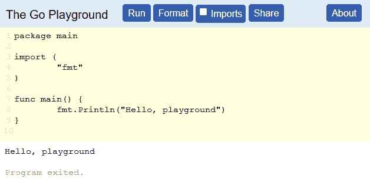
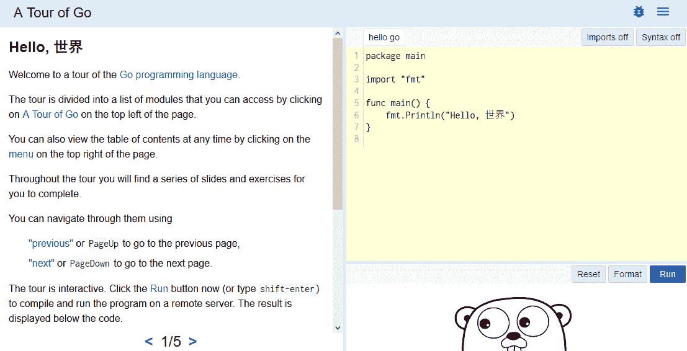

# 第二章：Go 编程语言

在深入探讨使用 Go 进行安全编程的复杂示例之前，建立坚实的基础非常重要。本章提供了 Go 编程语言的概述，以便你具备跟随后续示例所需的知识。

本章不是 Go 编程语言的详尽论文，而是为你提供主要特性的一次全面概述。本章的目标是为你提供理解和跟随源代码所需的信息，即使你之前从未使用过 Go。如果你已经熟悉 Go，本章应该是对你已知内容的快速回顾，但或许你会学到一些新的信息。

本章特别涉及以下主题：

+   Go 语言规范

+   Go playground

+   Go 语言游览

+   关键字

+   关于源代码的说明

+   注释

+   类型

+   控制结构

+   延迟

+   包

+   类

+   Goroutine

+   获取帮助和文档

# Go 语言规范

Go 语言的完整规范可以在[`golang.org/ref/spec`](https://golang.org/ref/spec)在线查看。本章中的许多信息都来源于该规范，因为它是语言的唯一真实文档。这里的其余信息包括简短的示例、技巧、最佳实践和我在使用 Go 语言期间学到的其他内容。

# Go playground

Go playground 是一个网站，允许你在不安装任何软件的情况下编写和执行 Go 代码。在 playground，[`play.golang.org`](https://play.golang.org)，你可以测试代码片段，探索语言，调整内容以理解语言的工作原理。它还允许你通过创建一个唯一的 URL 来共享你的代码片段，这个 URL 会存储你的代码。通过 playground 分享代码比分享纯文本代码片段更有帮助，因为它允许读者实际执行代码，并在对代码如何工作有疑问时进行修改：



上面的截图显示了一个简单程序在 playground 中的运行。顶部有按钮可以运行、格式化、添加导入语句，并与他人共享代码。

# Go 语言游览

Go 团队提供的另一个资源是*Go 语言游览*。这个网站，[`tour.golang.org`](https://tour.golang.org)，是建立在前面提到的 playground 之上的。这个游览是我第一次接触这门语言，当我完成它时，我感觉自己已经做好准备开始进行 Go 项目了。它一步步带你走过语言的各个方面，并提供了可以运行和修改的代码示例，以帮助你熟悉语言。这是一个向新手介绍 Go 的实用方法。如果你从未使用过 Go，我鼓励你去查看一下。



上面的截图展示了学习页面的第一页。在右侧，你将看到一个小型嵌入式游乐场，展示了与左侧简短课程相关的代码示例。每个课程都附带一个可以运行和修改的简短代码示例。

# 关键字

为了强调 Go 的简洁性，以下是其 25 个关键字的详细介绍。如果你熟悉其他编程语言，你可能已经知道其中大部分。关键字根据它们的用途被分组在一起进行分析。

**数据类型**：

| `var` | 这定义了一个新的变量 |
| --- | --- |
| `const` | 这定义了一个不可变的常量值 |
| `type` | 这定义了一个新的数据类型 |
| `struct` | 这定义了一个新的结构数据类型，包含多个变量 |
| `map` | 这定义了一个新的映射或哈希变量 |
| `interface` | 这定义了一个新的接口 |

**函数**：

| `func` | 这定义了一个新的函数 |
| --- | --- |
| `return` | 这退出一个函数，并可选地返回值 |

**包**：

| `import` | 这将外部包导入到当前包中 |
| --- | --- |
| `package` | 这指定了一个文件属于哪个包 |

**程序流程**：

| `if` | 这用于基于条件为真的情况执行分支 |
| --- | --- |
| `else` | 这用于在条件不为真时执行一个分支 |
| `goto` | 这用于直接跳转到标签；它很少使用，并且不推荐使用 |

**Switch 语句**：

| `switch` | 这用于根据条件进行分支 |
| --- | --- |
| `case` | 这定义了 `switch` 语句的条件 |
| `default` | 这定义了在没有匹配的 case 时的默认执行行为 |
| `fallthrough` | 这用于继续执行下一个 case |

**迭代**：

| `for` | `for` 循环可以像 C 语言中一样使用，提供三个表达式：初始化器、条件和增量。在 Go 中没有 `while` 循环，`for` 关键字既可以作为 `for` 也可以作为 `while` 使用。如果只传入一个条件表达式，`for` 循环就像 `while` 循环一样使用。 |
| --- | --- |
| `range` | `range` 关键字与 `for` 循环一起使用，用于迭代映射或切片 |
| `continue` | `continue` 关键字会跳过当前循环中剩余的执行部分，直接跳转到下一次迭代 |
| `break` | `break` 关键字将立即完全退出 `for` 循环，跳过任何剩余的迭代。 |

**并发性**：

| `go` | Goroutine 是内建的轻量级线程。你只需在调用函数前加上 `go` 关键字，Go 会在一个单独的线程中执行该函数调用。 |
| --- | --- |
| `chan` | 为了在线程间进行通信，使用通道。通道用于发送和接收特定的数据类型。默认情况下，通道是阻塞的。 |
| `select` | `select` 语句允许以非阻塞方式使用通道 |

**便利性**：

| `defer` | `defer` 关键字是一个相对独特的关键字，在我之前接触的其他语言中并没有遇到过。它允许你指定一个函数，在外部函数返回时稍后调用。它在你想确保在当前函数结束时执行某种清理操作时非常有用，但你不确定何时或在哪里它可能会返回。一个常见的用例是延迟文件关闭。 |
| --- | --- |

# 源代码说明

Go 源代码文件应该使用 `.go` 扩展名。Go 文件的源代码使用 UTF-8 编码，这意味着你可以在代码中使用任何 Unicode 字符，例如将日文字符硬编码到字符串中。

分号在行尾是可选的，通常会省略。分号仅在同一行上分隔多个语句或表达式时才需要。

Go 确实有一个代码格式化标准，可以通过运行 `go fmt` 来轻松遵循源代码文件的格式。代码格式化应该遵循，但与 Python 需要精确格式化才能正常执行不同，Go 的编译器不会严格强制执行这一点。

# 注释

注释遵循 C++ 风格，支持双斜杠和斜杠-星号包裹的风格：

```
// Line comment, everything after slashes ignored
/* General comment, can be in middle of line or span multiple lines */
```

# 类型

内置数据类型的命名足够直观。Go 提供了一组不同位长的整数和无符号整数类型。还有浮点数、布尔值和字符串，这些都不足为奇。

有一些类型，例如 rune，在其他语言中不常见。本节将介绍所有不同的类型。

# 布尔值

布尔类型表示一个真假值。有些语言没有 `bool` 类型，你必须使用整数或定义自己的枚举类型，但 Go 提供了一个预定义的 `bool` 类型。`true` 和 `false` 常量也是预定义的，并且总是以小写形式使用。以下是创建布尔值的示例：

```
var customFlag bool = false  
```

`bool` 类型并非 Go 独有，但关于布尔类型的一个有趣小知识是，它是唯一一个以人名命名的类型。乔治·布尔（George Boole）生于 1815 年，卒于 1864 年，他写了《思维法则》（The Laws of Thought），在其中描述了布尔代数，这是所有数字逻辑的基础。Go 中的 `bool` 类型非常简单，但它背后的历史却极其丰富。

# 数字

主要的数值数据类型是整数和浮点数。Go 还提供了一个复数类型、一个字节类型和一个 rune 类型。以下是 Go 中可用的数值数据类型。

# 泛型数字

当你不特别关心数字是 32 位还是 64 位时，可以使用这些泛型类型。系统会自动使用最大可用的大小，但它兼容 32 位和 64 位处理器。

+   `uint`：这是一个无符号整数，大小为 32 或 64 位

+   `int`：这是一个有符号整数，大小与 `uint` 相同

+   `uintptr`：这是一个无符号整数，用于存储指针值

# 特定数字

这些数字类型指定了位长度，并且是否包含符号位来确定正负值。位长度将决定最大范围。带符号整数的范围会因为最后一位被保留为符号位而减少一位。

# 无符号整数

使用不带数字的 `uint` 通常会选择系统支持的最大大小，通常为 64 位。你也可以指定四种特定的 `uint` 大小：

+   `uint8`：无符号 8 位整数（0 到 255）

+   `uint16`：无符号 16 位整数（0 到 65535）

+   `uint32`：无符号 32 位整数（0 到 4294967295）

+   `uint64`：无符号 64 位整数（0 到 18446744073709551615）

# 带符号整数

像无符号整数一样，你可以单独使用 `int` 来选择最佳的默认大小，或者指定这四种特定的 `int` 大小：

+   `int8`：8 位整数（-128 到 127）

+   `int16`：16 位整数（-32768 到 32767）

+   `int32`：32 位整数（-2147483648 到 2147483647）

+   `int64`：64 位整数（-9223372036854775808 到 9223372036854775807）

# 浮点数

浮点类型没有通用类型，必须是以下两种选项之一：

+   `float32`：IEEE-754 32 位浮点数

+   `float64`：IEEE-754 64 位浮点数

# 其他数字类型

Go 还提供了一个复数类型，用于高级数学应用，并提供了一些别名以方便使用：

+   `complex64`：复数，具有 `float32` 类型的实部和虚部

+   `complex128`：复数，具有 `float64` 类型的实部和虚部

+   `byte`：`uint8` 的别名

+   `rune`：`int32` 的别名

你可以使用十进制、八进制或十六进制格式定义数字。十进制或基数十的数字不需要前缀。八进制或基数八的数字应该以零作为前缀。十六进制或基数十六的数字应该以零和 x 为前缀。

你可以在 [`en.wikipedia.org/wiki/Octal`](https://en.wikipedia.org/wiki/Octal) 阅读更多关于八进制的知识，在 [`en.wikipedia.org/wiki/Decimal`](https://en.wikipedia.org/wiki/Decimal) 阅读更多关于十进制的知识，在 [`en.wikipedia.org/wiki/Hexadecimal`](https://en.wikipedia.org/wiki/Hexadecimal) 阅读更多关于十六进制的知识。

请注意，数字是作为整数存储的，除了在源代码中如何格式化以供人类使用外，它们之间没有区别。八进制和十六进制在处理二进制数据时非常有用。以下是定义整数的简短示例：

```
package main

import "fmt"

func main() {
   // Decimal for 15
   number0 := 15

   // Octal for 15
   number1 := 017 

   // Hexadecimal for 15
   number2 := 0x0F

   fmt.Println(number0, number1, number2)
} 
```

# 字符串

Go 提供了 `string` 类型，以及一个包含一系列有用函数的 `strings` 包，如 `Contains()`、`Join()`、`Replace()`、`Split()`、`Trim()` 和 `ToUpper()`。此外，还有一个专门用于将不同数据类型转换为字符串的 `strconv` 包。你可以在 [`golang.org/pkg/strings/`](https://golang.org/pkg/strings/) 阅读更多关于 `strings` 包的信息，在 [`golang.org/pkg/strconv/`](https://golang.org/pkg/strconv/) 阅读更多关于 `strconv` 包的信息。

双引号用于字符串。单引号仅用于表示单个字符或符文，而不是字符串。字符串可以使用长形式或短形式的声明并赋值操作符来定义。你还可以使用`` ` ``（反引号）符号来封装跨越多行的字符串。以下是字符串使用的简短示例：

```
package main

import "fmt"

func main() {
   // Long form assignment
   var myText = "test string 1"

   // Short form assignment
   myText2 := "test string 2"

   // Multiline string
   myText3 := `long string
   spanning multiple
   lines` 

   fmt.Println(myText) 
   fmt.Println(myText2) 
   fmt.Println(myText3)
} 
```

# 数组

数组由特定类型的顺序元素组成。可以为任何数据类型创建数组。数组的长度不能改变，并且必须在声明时指定。数组很少直接使用，而是通过下一个部分介绍的切片类型使用。数组始终是一维的，但可以通过创建数组的数组来创建多维对象。

要创建一个 128 字节的数组，可以使用以下语法：

```
var myByteArray [128]byte  
```

可以通过数组的基于 0 的数字索引来访问单个元素。例如，要获取字节数组的第五个元素，语法如下：

```
singleByte := myByteArray[4]
```

# 切片

切片使用数组作为底层数据类型。主要优点是切片可以改变大小，而数组不能。可以将切片看作是底层数组的一个视图窗口。**容量**指的是底层数组的大小，以及切片的最大可能长度。**长度**指的是切片的当前长度，可以调整大小。

切片是使用`make()`函数创建的。`make()`函数会创建一个特定类型、特定长度和容量的切片。使用`make()`函数创建切片时，有两种方式。只使用两个参数时，长度和容量相同。使用三个参数时，可以指定一个大于长度的最大容量。以下是两种`make()`函数声明方式：

```
make([]T, lengthAndCapacity)
make([]T, length, capacity) 
```

可以创建一个容量和长度为 0 的`nil`切片。`nil`切片没有与之关联的底层数组。以下是一个简短的示例程序，演示如何创建和检查切片：

```
package main

import "fmt"

func main() {
   // Create a nil slice
   var mySlice []byte

   // Create a byte slice of length 8 and max capacity 128
   mySlice = make([]byte, 8, 128)

   // Maximum capacity of the slice
   fmt.Println("Capacity:", cap(mySlice))

   // Current length of slice
   fmt.Println("Length:", len(mySlice))
} 
```

你还可以使用内置的`append()`函数向切片追加元素。

`Append` 可以一次添加一个或多个元素。如果有必要，底层数组将被重新调整大小。这意味着切片的最大容量可以增加。当切片增加其底层容量，创建一个更大的底层数组时，它会为数组创建一些额外的空间。这意味着如果你超出了切片的容量一个单位，它可能会将数组的大小增加四倍。这样做是为了让底层数组有足够的空间增长，减少底层数组需要重新调整大小的次数，因为这可能需要移动内存以适应更大的数组。每次仅添加一个元素就重新调整数组大小可能是昂贵的。切片的机制会自动确定调整大小的最佳尺寸。

这个代码示例提供了多个关于切片操作的例子：

```
package main

import "fmt"

func main() {
   var mySlice []int // nil slice

   // Appending works on nil slices.
   // Since nil slices have zero capacity, and have
   // no underlying array, it will create one.
   mySlice = append(mySlice, 1, 2, 3, 4, 5)

   // Individual elements can be accessed from a slice
   // just like an array by using the square bracket operator.
   firstElement := mySlice[0]
   fmt.Println("First element:", firstElement)

   // To get only the second and third element, use:
   subset := mySlice[1:4]
   fmt.Println(subset)

   // To get the full contents of a slice except for the 
   // first element, use:
   subset = mySlice[1:]
   fmt.Println(subset)

   // To get the full contents of a slice except for the 
   // last element, use:
   subset = mySlice[0 : len(mySlice)-1]
   fmt.Println(subset)

   // To copy a slice, use the copy() function.
   // If you assign one slice to another with the equal operator,
   // the slices will point at the same memory location,
   // and changing one would change both slices.
   slice1 := []int{1, 2, 3, 4}
   slice2 := make([]int, 4)

   // Create a unique copy in memory
   copy(slice2, slice1)

   // Changing one should not affect the other
   slice2[3] = 99
   fmt.Println(slice1)
   fmt.Println(slice2)
} 
```

# 结构体

在 Go 中，结构体或数据结构是变量的集合，这些变量可以是不同类型的。我们将通过一个创建自定义结构体类型的示例来说明。

Go 使用基于大小写的作用域来声明变量为`public`或`private`。首字母大写的变量和方法是公开的，可以从其他包中访问。小写的值是私有的，仅能在同一个包内访问。

以下示例创建了一个名为`Person`的简单结构体和一个名为`Hacker`的结构体。`Hacker`类型内嵌了`Person`类型。然后创建每种类型的实例，并将它们的信息打印到标准输出：

```
package main

import "fmt"

func main() {
   // Define a Person type. Both fields public
   type Person struct {
      Name string
      Age  int
   }

   // Create a Person object and store the pointer to it
   nanodano := &Person{Name: "NanoDano", Age: 99}
   fmt.Println(nanodano)

   // Structs can also be embedded within other structs.
   // This replaces inheritance by simply storing the
   // data type as another variable.
   type Hacker struct {
      Person           Person
      FavoriteLanguage string
   }
   fmt.Println(nanodano)

   hacker := &Hacker{
      Person:           *nanodano,
      FavoriteLanguage: "Go",
   }
   fmt.Println(hacker)
   fmt.Println(hacker.Person.Name)

   fmt.Println(hacker)
} 
```

你可以通过将变量名首字母小写来创建*私有*变量。我使用引号是因为私有变量的工作方式与其他语言稍有不同。隐私是基于包级别的，而不是基于*类*或类型级别的。

# 指针

Go 提供了一种指针类型，用于存储特定类型数据的内存位置。可以使用指针通过引用将结构体传递给函数，而不创建副本。这还允许函数就地修改对象。

Go 不允许指针运算。指针被认为是*安全*的，因为 Go 甚至没有为指针类型定义加法运算符。指针只能用于引用现有对象。

这个示例演示了基本的指针用法。它首先创建一个整数，然后创建一个指向该整数的指针。接着，它打印出指针的数据类型、指针中存储的地址以及指针指向的数据值：

```
package main

import (
   "fmt"
   "reflect"
)

func main() {
   myInt := 42
   intPointer := &myInt

   fmt.Println(reflect.TypeOf(intPointer))
   fmt.Println(intPointer)
   fmt.Println(*intPointer)
} 
```

# 函数

函数通过`func`关键字定义。函数可以有多个参数，所有参数都是位置参数，没有命名参数。Go 支持可变参数，允许传入未知数量的参数。函数在 Go 中是第一类公民，可以匿名使用并作为变量返回。Go 还支持从函数返回多个值。可以使用下划线忽略返回值。

所有这些示例都在以下代码源中演示：

```
package main

import "fmt"

// Function with no parameters
func sayHello() {
   fmt.Println("Hello.")
}

// Function with one parameter
func greet(name string) {
   fmt.Printf("Hello, %s.\n", name)
}

// Function with multiple params of same type
func greetCustom(name, greeting string) {
   fmt.Printf("%s, %s.\n", greeting, name)
}

// Variadic parameters, unlimited parameters
func addAll(numbers ...int) int {
   sum := 0
   for _, number := range numbers {
      sum += number
   }
   return sum
}

// Function with multiple return values
// Multiple values encapsulated by parenthesis
func checkStatus() (int, error) {
   return 200, nil
}

// Define a type as a function so it can be used
// as a return type
type greeterFunc func(string)

// Generate and return a function
func generateGreetFunc(greeting string) greeterFunc {
   return func(name string) {
      fmt.Printf("%s, %s.\n", greeting, name)
   }
}

func main() {
   sayHello()
   greet("NanoDano")
   greetCustom("NanoDano", "Hi")
   fmt.Println(addAll(4, 5, 2, 3, 9))

   russianGreet := generateGreetFunc("Привет")
   russianGreet("NanoDano")

   statusCode, err := checkStatus()
   fmt.Println(statusCode, err)
} 
```

# 接口

接口是一种特殊类型，定义了一组函数签名。你可以将接口理解为“一个类型必须实现函数 X 和函数 Y 才能满足该接口”。如果你创建了一个类型并实现了满足接口所需的函数，那么这个类型就可以在任何需要该接口的地方使用。你不必显式地指定你正在尝试满足一个接口，编译器会自动判断它是否符合要求。

你可以向自定义类型添加任意多的其他函数。接口定义了必需的函数，但并不意味着你的类型只能实现这些函数。

最常用的接口是`error`接口。`error`接口只需要实现一个函数，名为`Error()`，它返回一个包含错误信息的字符串。以下是该接口的定义：

```
type error interface {
   Error() string
} 
```

这使得你可以非常容易地实现自己的错误接口。这个例子创建了一个`customError`类型，并实现了满足接口所需的`Error()`函数。然后，创建了一个示例函数，返回自定义错误：

```
package main

import "fmt"

// Define a custom type that will
// be used to satisfy the error interface
type customError struct {
   Message string
}

// Satisfy the error interface
// by implementing the Error() function
// which returns a string
func (e *customError) Error() string {
   return e.Message
}

// Sample function to demonstrate
// how to use the custom error
func testFunction() error {
   if true != false { // Mimic an error condition
      return &customError{"Something went wrong."}
   }
   return nil
}

func main() {
   err := testFunction()
   if err != nil {
      fmt.Println(err)
   }
} 
```

其他常用的接口包括`Reader`和`Writer`接口。每个接口只需要实现一个函数，以满足接口要求。这里的一个大好处是，你可以创建自己的自定义类型，以某种任意方式读写数据。实现细节对接口来说并不重要。接口不会关心你是在读取和写入硬盘、网络连接、内存存储还是`/dev/null`。只要你实现了所需的函数签名，就可以在接口使用的任何地方使用你的类型。以下是`Reader`和`Writer`接口的定义：

```
type Reader interface {
   Read(p []byte) (n int, err error)
} 

type Writer interface {
   Write(p []byte) (n int, err error)
} 
```

# Map

map 是一个哈希表或字典，用于存储键值对。键和值可以是任何数据类型，包括 map 本身，从而创建多维结构。

顺序是不保证的。你可以多次遍历一个 map，每次的顺序可能都不同。此外，map 不是并发安全的。如果你必须在多个线程之间共享 map，请使用互斥锁（mutex）。

以下是一些 map 使用的示例：

```
package main

import (
   "fmt"
   "reflect"
)

func main() {
   // Nil maps will cause runtime panic if used 
   // without being initialized with make()
   var intToStringMap map[int]string
   var stringToIntMap map[string]int
   fmt.Println(reflect.TypeOf(intToStringMap))
   fmt.Println(reflect.TypeOf(stringToIntMap))

   // Initialize a map using make
   map1 := make(map[string]string)
   map1["Key Example"] = "Value Example"
   map1["Red"] = "FF0000"
   fmt.Println(map1)

   // Initialize a map with literal values
   map2 := map[int]bool{
      4:  false,
      6:  false,
      42: true,
   }

   // Access individual elements using the key
   fmt.Println(map1["Red"])
   fmt.Println(map2[42])
   // Use range to iterate through maps
   for key, value := range map2 {
      fmt.Printf("%d: %t\n", key, value)
   }

} 
```

# Channel

通道用于线程间通信。通道是**先进先出**（**FIFO**）队列。你可以将对象推入队列，并异步从队列的前端取出。每个通道只能支持一种数据类型。通道默认是阻塞的，但可以通过`select`语句使其变为非阻塞。像切片和映射一样，通道在使用前必须通过`make()`函数进行初始化。

Go 里的格言是*不要通过共享内存进行通信，而应该通过通信来共享内存*。更多关于这一哲学的内容可以参考[`blog.golang.org/share-memory-by-communicating`](https://blog.golang.org/share-memory-by-communicating)。

这是一个示例程序，展示了基本的通道使用方法：

```
package main

import (
   "log"
   "time"
)

// Do some processing that takes a long time
// in a separate thread and signal when done
func process(doneChannel chan bool) {
   time.Sleep(time.Second * 3)
   doneChannel <- true
}

func main() {
   // Each channel can support one data type.
   // Can also use custom types
   var doneChannel chan bool

   // Channels are nil until initialized with make
   doneChannel = make(chan bool)

   // Kick off a lengthy process that will
   // signal when complete
   go process(doneChannel)

   // Get the first bool available in the channel
   // This is a blocking operation so execution
   // will not progress until value is received
   tempBool := <-doneChannel
   log.Println(tempBool)
   // or to simply ignore the value but still wait
   // <-doneChannel

   // Start another process thread to run in background
   // and signal when done
   go process(doneChannel)

   // Make channel non-blocking with select statement
   // This gives you the ability to continue executing
   // even if no message is waiting in the channel
   var readyToExit = false
   for !readyToExit {
      select {
      case done := <-doneChannel:
         log.Println("Done message received.", done)
         readyToExit = true
      default:
         log.Println("No done signal yet. Waiting.")
         time.Sleep(time.Millisecond * 500)
      }
   }
} 
```

# 控制结构

控制结构用于控制程序执行的流程。最常见的形式是`if`语句、`for`循环和`switch`语句。Go 还支持`goto`语句，但应仅在极端性能需求的情况下使用，不宜频繁使用。让我们简要地了解一下每种结构的语法。

# if

`if`语句包括`if`、`else if`和`else`语句块，就像大多数其他语言一样。Go 中一个有趣的特性是，能够在条件之前写一个语句，用来创建临时变量，这些变量会在`if`语句执行完毕后被丢弃。

本示例展示了使用 `if` 语句的不同方式：

```
package main

import (
   "fmt"
   "math/rand"
)

func main() {
   x := rand.Int()

   if x < 100 {
      fmt.Println("x is less than 100.")
   }

   if x < 1000 {
      fmt.Println("x is less than 1000.")
   } else if x < 10000 {
      fmt.Println("x is less than 10,000.")
   } else {
      fmt.Println("x is greater than 10,000")
   }

   fmt.Println("x:", x)

   // You can put a statement before the condition 
   // The variable scope of n is limited
   if n := rand.Int(); n > 1000 {
      fmt.Println("n is greater than 1000.")
      fmt.Println("n:", n)
   } else {
      fmt.Println("n is not greater than 1000.")
      fmt.Println("n:", n)
   }
   // n is no longer available past the if statement
} 
```

# for

`for` 循环有三个组成部分，并且可以像 C 或 Java 中的 `for` 循环一样使用。Go 没有 `while` 循环，因为 `for` 循环在使用单一条件时可以实现同样的功能。参考以下示例可以更清楚：

```
package main

import (
   "fmt"
)

func main() {
   // Basic for loop
   for i := 0; i < 3; i++ {
      fmt.Println("i:", i)
   }

   // For used as a while loop
   n := 5
   for n < 10 {
      fmt.Println(n)
      n++
   }
} 
```

# `range`

`range` 关键字用于遍历切片、映射或其他数据结构。`range` 关键字与 `for` 循环结合使用，操作可迭代的数据结构。`range` 关键字返回键和值变量。以下是一些使用 `range` 关键字的基本示例：

```
package main

import "fmt"

func main() {
   intSlice := []int{2, 4, 6, 8}
   for key, value := range intSlice {
      fmt.Println(key, value)
   }

   myMap := map[string]string{
      "d": "Donut",
      "o": "Operator",
   }

   // Iterate over a map
   for key, value := range myMap {
      fmt.Println(key, value)
   }

   // Iterate but only utilize keys
   for key := range myMap {
      fmt.Println(key)
   }

   // Use underscore to ignore keys
   for _, value := range myMap {
      fmt.Println(value)
   }
} 
```

# switch、case、fallthrough 和 default

`switch` 语句允许你根据变量的状态分支执行。它与 C 和其他语言中的 `switch` 语句类似。

默认情况下没有 `fallthrough`。这意味着，一旦到达一个 case 的末尾，代码会完全退出 `switch` 语句，除非显式提供了 `fallthrough` 命令。如果没有匹配的 case，可以提供一个 `default` case。

你可以在要切换的变量前放一个语句，比如 `if` 语句。这会创建一个仅在 `switch` 语句范围内有效的变量。

本示例展示了两个 `switch` 语句。第一个使用硬编码的值，并包含一个 `default` case。第二个 `switch` 语句使用一种替代语法，可以在第一行放入语句：

```
package main

import (
   "fmt"
   "math/rand"
)

func main() {
   x := 42

   switch x {
   case 25:
      fmt.Println("X is 25")
   case 42:
      fmt.Println("X is the magical 42")
      // Fallthrough will continue to next case
      fallthrough
   case 100:
      fmt.Println("X is 100")
   case 1000:
      fmt.Println("X is 1000")
   default:
      fmt.Println("X is something else.")
   }

   // Like the if statement a statement
   // can be put in front of the switched variable
   switch r := rand.Int(); r {
   case r % 2:
      fmt.Println("Random number r is even.")
   default:
      fmt.Println("Random number r is odd.")
   }
   // r is no longer available after the switch statement
} 
```

# goto

Go 确实有 `goto` 语句，但它非常少用。你可以通过创建一个带有名称和冒号的标签，然后使用 `goto` 关键字跳转到该标签。以下是一个基本示例：

```
package main

import "fmt"

func main() {

   goto customLabel

   // Will never get executed because
   // the goto statement will jump right
   // past this line
   fmt.Println("Hello")

   customLabel:
   fmt.Println("World")
} 
```

# Defer

通过推迟一个函数，它将在当前函数退出时执行。这是一种确保函数在退出前执行的便捷方式，特别适合进行清理或关闭文件。因为即使函数有多个返回位置，推迟的函数也会在任何位置退出时执行。

常见的用例是推迟关闭文件或数据库连接的调用。在打开文件后，可以推迟一个关闭文件的调用。这将确保每当函数退出时，文件会被关闭，即使有多个返回语句，你也无法确定当前函数何时以及在哪里退出。

本示例展示了 `defer` 关键字的简单用法。它创建一个文件，然后推迟调用 `file.Close()`：

```
package main

import (
   "log"
   "os"
)

func main() {

   file, err := os.Create("test.txt")
   if err != nil {
      log.Fatal("Error creating file.")
   }
   defer file.Close()
   // It is important to defer after checking the errors.
   // You can't call Close() on a nil object
   // if the open failed.

   // ...perform some other actions here...

   // file.Close() will be called before final exit
} 
```

确保正确检查并处理错误。如果使用空指针，`defer` 调用会触发 panic。

同样重要的是要理解，推迟的函数是在围绕的函数退出时执行的。如果你将 `defer` 调用放在 `for` 循环内，它不会在每次 `for` 循环迭代结束时调用。

# 包

包就是目录。每个目录就是一个包。创建子目录会创建一个新的包。没有子包会导致扁平的层次结构。子目录仅用于组织代码。

包应该存储在`$GOPATH`变量的`src`文件夹中。

包名应与文件夹名称匹配，或者命名为`main`。`main`包意味着它不打算被导入到其他应用程序中，而是作为程序进行编译和运行。包通过`import`关键字导入。

你可以单独导入包：

```
import "fmt" 
```

或者，你可以通过将多个包用括号括起来一次性导入：

```
import (
   "fmt"
   "log"
) 
```

# 类

从技术上讲，Go 没有类，但只有一些细微的区别使它不能被称为面向对象语言。概念上，我确实认为它是面向对象的编程语言，尽管它只支持面向对象语言的最基本特性。它不包含许多人习惯于与面向对象编程相关联的所有特性，如继承和多态，这些被嵌入类型和接口等其他特性所取代。根据你的角度，你或许可以称其为*微类*系统，因为它是一个极简实现，去除了所有额外的特性和负担。

在本书中，*对象*和*类*这两个术语可能会用来通过熟悉的术语来阐明一个观点，但请注意，这些不是 Go 语言中的正式术语。类型定义与操作该类型的函数结合在一起类似于类，而对象则是类型的一个实例。

# 继承

Go 中没有继承，但你可以嵌入类型。这里是一个`Person`和`Doctor`类型的例子，`Doctor`类型嵌入了`Person`类型。`Doctor`不是直接继承`Person`的行为，而是将`Person`对象作为变量存储，这样它就拥有了所有`Person`的方法和属性：

```
package main

import (
   "fmt"
   "reflect"
)

type Person struct {
   Name string
   Age  int
} 

type Doctor struct {
   Person         Person
   Specialization string
}

func main() {
   nanodano := Person{
      Name: "NanoDano",
      Age:  99,
   } 

   drDano := Doctor{
      Person:         nanodano,
      Specialization: "Hacking",
   }

   fmt.Println(reflect.TypeOf(nanodano))
   fmt.Println(nanodano)
   fmt.Println(reflect.TypeOf(drDano))
   fmt.Println(drDano)
} 
```

# 多态

Go 语言中没有多态，但你可以使用接口创建一个可以被多个类型使用的公共抽象。接口定义一个或多个方法声明，必须满足这些声明才能与接口兼容。接口在本章早些时候已经讨论过。

# 构造函数

Go 中没有构造函数，但有`New()`函数，它类似于工厂方法来初始化一个对象。你只需创建一个名为`New()`的函数并返回你的数据类型。这里是一个例子：

```
package main

import "fmt"

type Person struct {
   Name string
}

func NewPerson() Person {
   return Person{
      Name: "Anonymous",
   }
}

func main() {
   p := NewPerson()
   fmt.Println(p)
} 
```

Go 语言中没有析构函数，因为一切都由垃圾回收管理，你无需手动销毁对象。`defer`是最接近析构函数的功能，它可以延迟调用一个函数，在当前函数结束时执行一些清理操作。

# 方法

方法是属于特定类型的函数，并且通过点符号调用，例如：

```
myObject.myMethod() 
```

点（dot）符号在 C++ 和其他面向对象语言中被广泛使用。点符号和类系统源自于 C 语言中使用的一个共同模式。这个常见模式是定义一组操作特定数据类型的函数。所有相关函数的第一个参数都是要操作的数据。由于这是一个常见模式，Go 将其内建到语言中。与其将要操作的对象作为第一个参数传递，不如在 Go 函数定义中通过一个特殊的位置指定接收器。接收器被指定在函数名之前的一对括号中。接下来的例子演示了如何使用函数接收器。

你可以编写具有特殊*接收器*的函数，而不是编写一个庞大的函数集，其中所有函数的第一个参数都是指针。接收器可以是一个类型，也可以是该类型的指针：

```
package main

import "fmt"

type Person struct {
   Name string
}

// Person function receiver
func (p Person) PrintInfo() {
   fmt.Printf("Name: %s\n", p.Name)
}

// Person pointer receiver
// If you did not use the pointer receivers
// it would not modify the person object
// Try removing the asterisk here and seeing how the
// program changes behavior
func (p *Person) ChangeName(newName string) {
   p.Name = newName
}

func main() {
   nanodano := Person{Name: "NanoDano"}
   nanodano.PrintInfo()
   nanodano.ChangeName("Just Dano")
   nanodano.PrintInfo()
} 
```

在 Go 中，你不会将所有的变量和方法都封装在一对庞大的大括号中。你定义一个类型，然后定义作用于该类型的方法。这允许你将所有结构体和数据类型定义在一个地方，并在包的其他地方定义方法。你也可以选择将类型和方法直接放在一起定义。这种方式简单明了，并且在状态（数据）和逻辑之间创建了更清晰的区分。

# 运算符重载

Go 不支持运算符重载，因此你不能通过 `+` 运算符将结构体相加，但你可以很容易地在类型上定义一个 `Add()` 函数，然后调用类似 `dataSet1.Add(dataSet2)` 的方式。通过将运算符重载从语言中去除，我们可以放心使用运算符，而不用担心由于某些地方不小心重载了运算符，导致的意外行为。

# Goroutines

Goroutine 是 Go 内建的轻量级线程。你只需在函数调用前加上`go`关键字，就能让函数在一个线程中执行。在本书中，Goroutine 也可能被称为线程。

Go 确实提供了互斥锁（mutex），但在大多数情况下可以避免使用，它们不会在本书中讲解。你可以在[`sync`包文档](https://golang.org/pkg/sync/)中阅读更多关于互斥锁的信息。应使用通道（Channels）来共享数据并在线程之间进行通信。通道在本章之前已经讲解过。

请注意，`log`包是安全的并且支持并发使用，而`fmt`包则不支持并发使用。这里是一个使用 goroutine 的简单示例：

```
package main

import (
   "log"
   "time"
)

func countDown() {
   for i := 5; i >= 0; i-- {
      log.Println(i)
      time.Sleep(time.Millisecond * 500)
   }
}

func main() {
   // Kick off a thread
   go countDown()

   // Since functions are first-class
   // you can write an anonymous function
   // for a goroutine
   go func() {
      time.Sleep(time.Second * 2)
      log.Println("Delayed greetings!")
   }()

   // Use channels to signal when complete
   // Or in this case just wait
   time.Sleep(time.Second * 4)
} 
```

# 获取帮助和文档

Go 既有在线帮助文档，也有离线文档。Go 的离线文档是内置的，和在线托管的文档相同。接下来的部分将引导你如何访问这两种形式的文档。

# 在线 Go 文档

在线文档可以在 [`golang.org/`](https://golang.org/) 上找到，包含所有正式文档、规范和帮助文件。语言文档特别在 [`golang.org/doc/`](https://golang.org/doc/) 上，标准库的信息可以在 [`golang.org/pkg/`](https://golang.org/pkg/) 找到。

# 离线 Go 文档

Go 还提供了一个离线文档，使用 `godoc` 命令行工具。你可以在命令行中使用它，或者让它运行一个 web 服务器，提供与 [`golang.org/`](https://golang.org/) 相同的网站内容。能够在本地访问完整的网站文档非常方便。以下是一些获取 `fmt` 包文档的示例。将 `fmt` 替换为你感兴趣的任何包：

```
 # Get fmt package information
 godoc fmt

 # Get source code for fmt package
 godoc -src fmt

 # Get specific function information
 godoc fmt Printf

 # Get source code for function
 godoc -src fmt Printf

 # Run HTTP server to view HTML documentation
 godoc -http=localhost:9999

```

HTTP 选项提供与 [`golang.org/`](https://golang.org/) 上相同的文档。

# 总结

阅读完本章后，你应该对 Go 基础知识有一个基本的理解，比如关键字是什么，它们的作用以及有哪些基本数据类型。你也应该能熟练创建函数和自定义数据类型。

目标不是记住所有前面的信息，而是了解语言中有哪些工具可供使用。如有需要，可以将本章作为参考。你可以在[`golang.org/ref/spec`](https://golang.org/ref/spec)找到更多关于 Go 语言规范的信息。

在下一章中，我们将学习如何在 Go 中处理文件。我们将涵盖一些基础内容，如获取文件信息、查看文件是否存在、截断文件、检查权限以及创建新文件。我们还将讲解读取器和写入器接口，以及多种读取和写入数据的方法。除此之外，我们还会涉及归档为 ZIP 或 TAR 文件以及使用 GZIP 压缩文件等内容。
