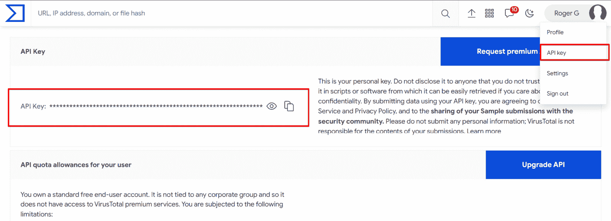
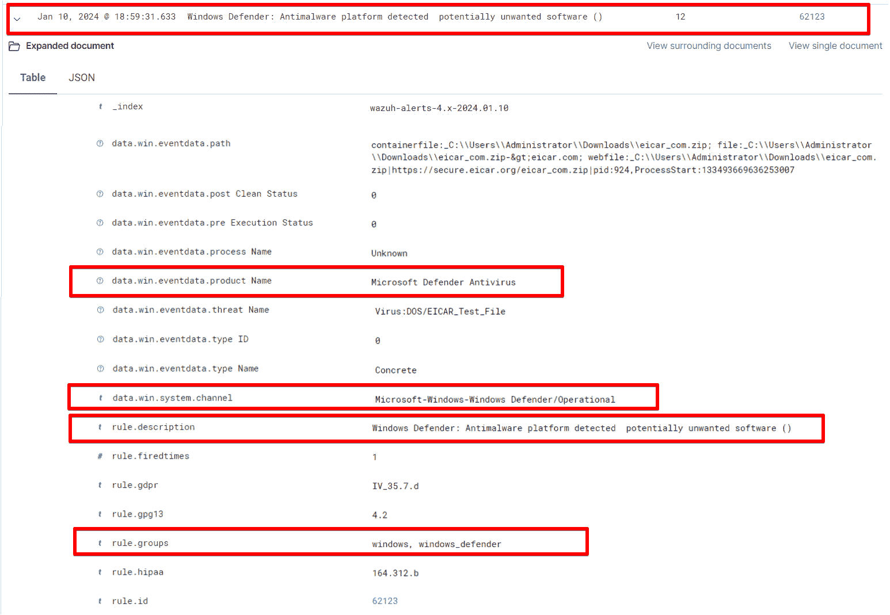
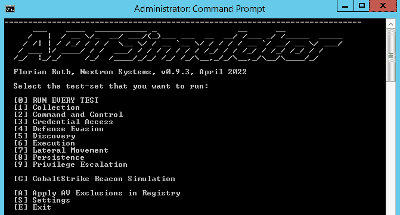

# 第二章：使用 Wazuh 进行恶意软件检测

**恶意软件** 是 **恶意软件**（malicious software）的缩写，指在未经过用户许可的情况下安装到计算机上的软件。攻击者可以利用恶意软件加密、窃取计算机数据或监控系统活动。**恶意软件检测** 是监控和分析计算机系统及网络中是否存在恶意软件和文件的过程。安全产品通过匹配已知恶意软件样本的签名以及监控异常行为来检测恶意软件。然而，一些恶意软件在进入系统后使用多种技术规避检测。Wazuh 通过多种方法应对和反制这些技术，检测恶意文件和可疑活动。在本章中，我们将学习如何使用不同的 Wazuh 模块来检测恶意文件，并集成一些第三方工具以增强其检测能力。

本章将涵盖以下主题：

+   恶意软件类型

+   Wazuh 的恶意软件检测能力

+   使用 **文件完整性** **监控** (**FIM**) 进行恶意软件检测

+   **VirusTotal** 集成

+   CDB 列表

+   集成 Windows Defender 日志

+   集成 **系统监视器** (**Sysmon**) 以检测无文件恶意软件

注意

在本章中，我们将使用一个真实的恶意软件样本进行测试；请确保你的系统处于隔离状态或在受控环境中运行。

# 恶意软件类型

恶意软件有多种形式，每种形式都有其独特的功能和目的。以下是一些常见的恶意软件类型：

+   **病毒**：一种附着在合法文件和程序上的恶意软件，通过感染其他文件来传播。病毒通过破坏或销毁数据来造成损害。示例包括 ILOVEYOU、Mydoom 和 Anna Kournikova。

+   **蠕虫**：一种复制自身并通过网络传播的恶意软件，利用安全漏洞感染其他连接的系统。示例包括 Blaster、Mydoom 和 Slammer。

+   **木马**：看起来像合法文件或程序的恶意软件。安装后，木马可以让网络犯罪分子在未授权的情况下进入系统，从而可能导致数据盗窃、间谍活动或更多的破坏。示例有 Zeus（设计用来窃取如信用卡或借记卡等金融信息）、SpyEye（针对网上银行信息）和 Poison Ivy（远程控制受害者的计算机）。

+   **勒索软件**：一种加密受害者数据的恶意软件，直到向攻击者支付赎金后才能恢复访问。勒索软件攻击可能给企业和个人带来极大的损失。示例包括 Locky、WannaCry 和 Ryuk。

+   **间谍软件**：一种旨在秘密监控并收集感染系统信息的恶意软件，包括敏感数据、密码和浏览习惯。示例包括 CoolWebSearch（通过弹窗广告传播）和 FinSpy（由执法机构使用，用于截取截图和拦截通讯）。

+   **Rootkits**：恶意软件能够在不被察觉的情况下获取系统的特权访问权限。这使得攻击者能够隐藏其存在，并保持对已被攻破系统的控制。示例包括 Sony BMG Rootkit、Alureon 和 ZeroAccess。

恶意软件通常通过不同的方式传播，例如钓鱼邮件、恶意下载、感染的网站，以及已经被攻击的外部设备，如 USB 驱动器。网络犯罪分子总是在不断改变他们的方法，以避免被捕并利用新的弱点。现在，让我们了解一些 Wazuh 在恶意软件检测方面的重要功能。

# Wazuh 的恶意软件检测功能

Wazuh 提供了几项功能，增强了其在检测恶意软件方面的效果。这是通过日志分析、入侵检测和威胁情报的结合来实现的。它还提供实时警报、事件关联和执行自定义脚本以进行自动响应活动的功能，使其成为有效识别和响应恶意软件攻击的强大工具。以下是 Wazuh 在恶意软件检测方面的一些方法：

+   **威胁检测规则和 FIM**：在这种方法中，Wazuh 利用其内置功能来检测任何关键文件的修改。其一些功能包括：

    +   Wazuh 运用一套预定义、持续监控的威胁检测原则。其目的是识别可疑活动、事件和模式，这些可能表明恶意软件感染或安全漏洞。

    +   Wazuh 的恶意软件检测主要依赖于 FIM（文件完整性监控）。它监控文件和目录的修改，例如添加和删除。当发生未经授权或意外的变化时，Wazuh 会生成警报，这可能表明恶意软件活动。

+   **Rootkit 行为检测**：Wazuh 使用 rootcheck 功能来检测可能表明恶意软件存在的异常：

    +   Rootkits 是一种恶意软件，可以在被攻破的系统上隐藏其存在和其他恶意行为。Wazuh 使用基于行为的检测技术来识别类 Rootkit 的活动。

    +   Wazuh 寻找可疑的系统行为，例如未经授权的特权提升、试图隐藏文件或进程，以及通常与 Rootkit 相关的其他活动。当检测到此类行为时，会触发警报。

+   **VirusTotal 集成**：Wazuh 通过与 VirusTotal 集成来检测恶意文件：

    +   VirusTotal 是一项基于网络的服务，利用多个杀毒引擎和威胁情报源扫描文件和网址，以检测潜在的危险。Wazuh 集成了 VirusTotal 来提升其恶意软件检测能力。

    +   当 Wazuh 遇到怀疑为恶意的文件或 URL 时，它可以自动将样本提交给 VirusTotal 进行分析。结果包括来自多个杀毒引擎的发现，然后这些信息将被整合到 Wazuh 的警报机制中。如果多个引擎将文件识别为恶意文件，那么该警报的置信度就会增加。

+   **YARA 集成**：Wazuh 使用 YARA 检测恶意软件样本，YARA 是一个开源工具，通过其二进制模式识别和分类恶意软件痕迹：

    +   YARA 是一款强大的工具，可以让你编写自己的规则，以在文件和进程中查找恶意软件和特定模式。Wazuh 与 YARA 配合使用，因此用户可以编写自己的规则供 YARA 使用，以便根据需求查找恶意软件。

    +   安全专家可以利用 YARA 集成创建自定义签名，检测特定的恶意软件变种或行为，这些是正常 Wazuh 规则无法覆盖的。这些自定义规则可以添加到 Wazuh 规则集中，并用于监控环境。

现在我们已经了解了 Wazuh 平台的一些重要恶意软件检测功能，我们可以开始学习 Wazuh 的不同使用案例。在下一部分，我们将学习如何使用 Wazuh 的 FIM 模块检测恶意软件。

# 使用 FIM 进行恶意软件检测

当系统被恶意软件入侵时，它可能会创建新文件或修改现有文件，例如以下文件类型：

+   可执行文件（`.exe`、`.dll`、`.bat` 和 `.vbs`）

+   配置文件（`.cfg` 和 `.ini`）

+   临时文件（`.tmp`）

+   注册表项

+   日志文件（`.log`）

+   有害负载文件

+   隐藏文件和目录

+   批处理脚本（`.bat`）

+   PowerShell (`.ps1`)

+   特殊构造的包含恶意负载的文档（`.doc`、`.xls` 和 `.pdf`）

利用这些信息，我们可以在 Wazuh 中创建 FIM 规则来检测任何文件的更改。然而，我们也会收到大量的误报警报。为了解决这个问题，我们可以专注于某个特定目录或文件夹。我们将在本节中进一步学习。

在本节中，我们将学习如何创建 Wazuh 规则来检测一些常见的恶意软件模式。

我们将涵盖以下使用案例：

+   在 Ubuntu 机器上配置和测试 FIM

+   使用 FIM 模块在 **PHP** 服务器上检测可疑文件

## 在 Ubuntu 机器上配置和测试 FIM

FIM 是一项技术，用于监控系统和应用程序文件的完整性。它通过定期监控、扫描并确认文件的完整性，保护敏感数据、应用程序和设备文件。它通过检测网络中关键任务文件的变化，从而减少与数据泄露相关的风险。

好消息是，Wazuh 内置了 FIM 功能。这得益于 Wazuh 使用 **开源 HIDS 安全**（**OSSEC**）代理。OSSEC 是一个免费的开源基于主机的入侵检测系统。当用户或进程创建、修改或删除受监控的文件时，Wazuh FIM 模块会触发警报。我们通过在 Ubuntu 机器上设置 FIM 模块来了解文件完整性检查。为了测试这个用例，您需要按照以下步骤操作。

### 要求

测试 FIM 用例时，我们需要以下内容：

+   Wazuh 管理器

+   一台安装了 Wazuh 代理的 Ubuntu 机器

### 步骤 1 – 在 Ubuntu 机器上设置 Wazuh 代理

默认情况下，Wazuh 代理已启用 FIM 模块。FIM 模块的配置位于 `/var/ossec/etc` 路径下的 `ossec.conf` 文件中的 `<syscheck>` 标签下。我们只需要在 `<syscheck>` 块中添加需要监控的目录。以下配置将监控指定的文件和目录，以便检测任何类型的更改或修改：

```
<syscheck>
  <disabled>no</disabled>
  <frequency>720</frequency>
  <scan_on_start>yes</scan_on_start>
  <directories check_all="yes" report_changes="yes" real_time="yes">/etc,/bin,/sbin</directories>
  <directories check_all="yes" report_changes="yes" real_time="yes">/lib,/lib64,/usr/lib,/usr/lib64</directories>
  <directories check_all="yes" report_changes="yes" real_time="yes">/var/www,/var/log,/var/named</directories>
  <ignore>/etc/mtab</ignore>
  <ignore>/etc/hosts.deny</ignore>
  <ignore>/etc/mail/statistics</ignore>
  <ignore>/etc/random-seed</ignore>
  <ignore>/etc/adjtime</ignore>
  <ignore>/etc/httpd/logs</ignore>
  <ignore>/etc/utmpx</ignore>
  <ignore>/etc/wtmpx</ignore>
  <ignore>/etc/cups/certs</ignore>
  <ignore>/etc/dumpdates</ignore>
  <ignore>/etc/svc/volatile</ignore>
  <ignore>/sys/kernel/security</ignore>
  <ignore>/sys/kernel/debug</ignore>
  <ignore>/sys</ignore>
  <ignore>/dev</ignore>
  <ignore>/tmp</ignore>
  <ignore>/proc</ignore>
  <ignore>/var/run</ignore>
  <ignore>/var/lock</ignore>
  <ignore>/var/run/utmp</ignore>
</syscheck>
```

让我们分析一下前面的配置：

+   `<disabled>` 标签被设置为 `no`，以启用 Wazuh 的 syscheck 模块。

+   `<scan_on_start>` 标签被设置为 `yes`，以便在 Wazuh 代理启动时进行初始扫描。

+   `<frequency>` 标签设置为 `720`，以便每 720 分钟进行一次文件监控扫描。

+   `<directories>` 标签指定了所有需要监控的目录。在这个例子中，我们监控的是重要的系统目录，如 `/etc`、`/bin`、`/sbin`、`/lib`、`/lib64`、`/usr/lib`、`/usr/lib64`、`/var/www`、`/var/log` 和 `/var/named`。

+   `<ignore>` 标签表示在监控过程中需要忽略的文件或目录。这些通常是系统文件，对于 FIM 分析来说并不重要。

### 步骤 2 – 重启 Wazuh 代理

为了使配置更改生效，我们需要重启 `wazuh-agent` 服务，如下所示：

```
sudo systemctl restart wazuh-agent
```

### 步骤 3 – 可视化警报

要查看警报，您可以导航到 Wazuh 仪表板的 **安全警报** 或 **完整性监控** 模块，并查看如图所示的文件添加警报：


图 2.1 – 在 Wazuh 管理器中可视化文件添加警报

让我们来分解一下：

+   `decoder.name: syscheck_new_entry`：此字段表示 Wazuh 代理检测到的与系统检查或 FIM 相关的新条目。在这种情况下，表示一个文件已被添加。

+   `full.log: File '/root/infectedfile.txt' added`：这表示一个名为 `infectedfile.txt` 的新文件已被添加。

在这个用例中，我们已经学会了如何使用 Wazuh 的 FIM 模块检测 `/root` 中的文件更改。在下一部分，我们将学习如何检测 PHP 服务器中的潜在恶意软件。

## 使用 FIM 模块检测 PHP 服务器中的可疑文件

PHP 因其简单性、速度和灵活性而闻名。目前，有超过 3300 万个网站使用 PHP。最常见的 PHP 文件扩展名包括 `.php`、`.phtml`、`.php3`、`.php4`、`.php5`、`.php7` 和 `.phps`。

这些文件通常出现在 `/var/www/html/`、`/var/www/public_html/` 和根目录中。为了测试 PHP 服务器中的可能恶意软件，您需要按照以下步骤操作，使用 FIM 模块。

### 要求

要使用 Wazuh 的 FIM 模块检测 PHP 服务器中可能的恶意文件，您需要以下系统要求：

+   Wazuh 管理器

+   一台安装了 PHP 服务器包和 Wazuh 代理的 Ubuntu 服务器

### 创建 Wazuh 规则

我们将创建一个 Wazuh 规则，检测 PHP 服务器中的文件创建和修改。我们将在 Wazuh 规则的 `<field>` 标签下添加不同类型的 PHP 文件扩展名。我们将通过此用例进行讲解并进行测试，最后，我们将在 Wazuh 管理器中可视化警报：

#### 创建一个 Wazuh 规则来检测 PHP 文件的创建/修改

要创建一个 Wazuh 规则，请进入 `custom_fim.xml` 并添加以下规则：

```
<group name="linux, webshell, windows,">
  <!-- This rule detects file creation. -->
  <rule id="100500" level="12">
    <if_sid>554,550</if_sid>
    <field name="file" type="pcre2">(?i).php$|.phtml$|.php3$|.php4$|.php5$|.phps$|.phar$|.asp$|.aspx$|.jsp$|.cshtml$|.vbhtml$</field>
    <description>[File creation]: Possible web shell scripting file ($(file)) created</description>
  </rule>
</group>
```

让我们来分析一下这段代码：

+   `<if_sid>554</if_sid>`：该标签表示规则 ID 列表。当列表中的规则 ID 被触发时，该规则将匹配。在此情况下，当规则 ID `554` 被触发时，规则 ID `100500` 会匹配。规则 ID `554` 在文件添加时触发，规则 ID `550` 代表完整性校验和的变化。

+   `<field name="file" type="pcre2">(?i).php$|.phtml$|.php3$|.php4$|.php5$|.phps$|.phar$|.asp$|.aspx$|.jsp$|.cshtml$|.vbhtml$</field>`：这是触发规则所需的条件。它将在解码器提取的文件内容中检查是否有匹配项。在此情况下，内容是所有可能的 PHP 文件扩展名列表。

#### 测试

为了测试我们的 FIM 规则，我们将在根目录中使用 `touch` 命令添加一个名为 `antivirusupdate.php` 的新文件，如下图所示。


图 2.2 – 在根目录中创建一个空文件

#### 可视化警报

要可视化 FIM 警报，请导航到 Wazuh 仪表板中的 **安全警报** 模块，您将看到如下图所示的警报。


图 2.3 – 在 Wazuh 管理器中可视化可能的 web shell 警报

让我们来分析一下：

+   `full.log`：`File '/root/antivirusupdate.php' added Mode`：这代表了 Wazuh 管理器中的完整日志

+   `rule.description`：这代表触发的规则 ID。在此情况下，规则 ID 是 100500

注意

这个 FIM 规则可能会导致 Wazuh 仪表板中出现大量的误报。为了解决这个问题，您可以通过添加更多 `<ignore>` 标签来微调 `<syscheck>` 块。

在下一节中，我们将使用 Wazuh 管理器中的 CDB 列表检测恶意文件。

# CDB 列表

Wazuh 中的 CDB 列表作为恶意和良性文件的独特哈希值或校验和的存储库。Wazuh 安全平台可以精确地将系统中文件的加密表示与存储在 CDB 中的表示进行比较。CDB 列表包括用户、文件哈希、IP 地址、域名等列表。在本节中，我们将涵盖以下主题：

+   CDB 列表的工作原理

+   设置 Wazuh 服务器

+   配置 Windows 终端

+   测试

+   可视化警报

## CDB 列表的工作原理

你可以将用户、文件哈希、IP 地址和域名的列表保存在名为 CDB 列表的文本文件中。CDB 列表可以采用 `key:value` 配对或 `key:only` 格式添加条目。CDB 上的列表可以作为允许列表或拒绝列表。Wazuh 按照此处提到的过程处理 CDB 列表：

1.  **哈希生成**：CDB 列表由良好和不良内容（如 IP 地址、恶意软件哈希和域名）的哈希组成。哈希是基于 CDB 列表内容生成的唯一固定长度值。

1.  **文件比较**：Wazuh 在系统扫描过程中计算文件的哈希，并将其与 CDB 条目进行比较。

1.  **识别**：如果文件的哈希值与 CDB 中已知的恶意哈希匹配，Wazuh 会标记该文件为可能是恶意的。

1.  **警报和响应**：根据设定的策略，Wazuh 能够在检测到时触发警报或响应。

我们已经了解了 Wazuh 如何处理 CDB 列表。现在，让我们通过 CDB 列表的第一个实际用例，使用 CDB 列表来检测恶意 IP 地址。

## 设置 Wazuh 服务器

我们需要设置 Wazuh 服务器，并配置包含恶意软件哈希的 CDB 列表，同时创建必要的规则，以便当文件的哈希值与 CDB 恶意软件哈希匹配时触发警报。我们需要按照以下步骤完成此操作：

1.  `/ossec/etc/lists` 目录，在 Wazuh 服务器上。要为恶意软件哈希添加新的 CDB 列表，请使用以下命令创建一个名为 `malware-hashes` 的新文件：

    ```
    key:value pair where key will be the actual malware hash and value will be the name or keyword. Now, there are several sources from where we can download and use the malware hashes for the CDB list. One of the popular sources is a list published by Nextron Systems. You can view and download the list from the official GitHub page (https://github.com/Neo23x0/signature-base/blob/master/iocs/hash-iocs.txt). For testing purposes, we will use a few popular malware hashes such as Mirai and Fanny.Open the file using the `Nano` editor:

    ```

    nano /var/ossec/etc/lists/malware-hashes

    ```

    Then enter the malware hash in the format shown in the following:
    ```


图 2.4 – 恶意软件哈希的 CDB 列表

在前面的图像中，我们有三种类型恶意软件的哈希：`mirai`、`Xbash` 和 `fanny`。

1.  `<ruleset>` 块中，您可以在 `/var/ossec/etc/ossec.conf` Wazuh 管理器配置文件中添加对 CDB 列表的引用：

    ```
    <ruleset>
     <!-- Default ruleset -->
    <list>etc/lists/malware-hashes</list>
     <ruleset>
    ```

1.  `/var/ossec/etc/rules/local_rules.xml` 文件。当 Wazuh 在最近创建或更新的文件的 MD5 哈希与 CDB 列表中的恶意软件哈希匹配时，这条规则会触发。当发生表示有新创建或修改的文件的事件时，规则 `554` 和 `550` 将被触发：

    ```
    <group name="malware,">
      <rule id="110002" level="13">
        <if_sid>554, 550</if_sid>
        <list field="md5" lookup="match_key">etc/lists/malware-hashes</list>
        <description>Known Malware File Hash is detected: $(file)</description>
        <mitre>
          <id>T1204.002</id>
        </mitre>
      </rule>
    </group>
    ```

1.  **重启管理器**：我们必须重启 Wazuh 管理器以应用更改：

    ```
    systemctl restart wazuh-manager
    ```

我们已成功创建了一个包含恶意软件哈希值和安全规则的 CDB 列表，并与 Wazuh 代理中每个文件的哈希值进行比较。接下来的步骤是设置一个 Windows 端点，检测任何文件更改，以便触发 CDB 列表进行文件哈希的比较。

## 配置 Windows 端点

我们需要设置 Windows 端点来检测文件更改。我们将配置 `<syscheck>` 以跟踪 `Downloads` 文件夹中的文件更改。你可以选择任何文件夹：

```
<ossec_config>
 <syscheck>
<disabled>no</disabled>
<syscheck> <disabled>no</disabled>
<directories check_all="yes" realtime="yes">/PATH/TO/MONITORED/DIRECTORY</directories>
 </syscheck>
</ossec_config>
```

让我们分解一下这段代码：

+   `check_all="yes"`: 这确保 Wazuh 验证文件的各个方面，如文件大小、权限、所有者、最后修改日期、inode 和哈希值。

+   `realtime="yes"`: Wazuh 将进行实时监控并触发警报。

接下来，使用以下命令重新启动 Wazuh 代理：

```
systemctl restart wazuh-agent
```

## 测试

下载 Mirai 恶意软件样本并将其放入 FIM 模块监控的区域，以确保一切正常运行。在我们的案例中，这是一个`Downloads`文件夹。

注意

请小心，这些恶意文件是有害的，所以只能用于测试。不要将它们放置在会被使用的地方。

使用以下 PowerShell 命令下载 Mirai 恶意软件样本并将其存储在 `Downloads` 文件夹中：

```
Invoke-WebRequest -Uri https://wazuh-demo.s3-us-west-1.amazonaws.com/mirai -OutFile C:/Users/Administrator/Downloads/mirai
```

## 可视化警报

Wazuh 立即检测到恶意软件样本。如以下图所示，我们收到了描述为 `已检测到已知恶意软件文件哈希` 的警报：


图 2.5 – 检测到已知恶意软件文件哈希

如果你展开警报，你可以看到完整的日志、规则 ID 和其他信息，如下图所示：


图 2.6 – 可视化 Mirai 恶意软件警报

让我们分解一下：

+   `rule.description:` `已检测到已知恶意软件文件哈希`: 这是规则 ID 11002 的描述。

+   `full.log:` `File 'c:\users\administrator\downloads\mirai' modified`: 这显示了完整的日志信息，包括位置、模式、属性以及旧/新修改。

我们已成功测试 CDB 列表，通过将已知恶意软件的文件哈希存储为 `key:value` 键值对的形式，从而进行检测。此外，CDB 列表还有其他用途，比如检测未知用户和黑名单 IP 地址。在下一节中，我们将学习如何使用 VirusTotal API 检测恶意软件。

# VirusTotal 集成

VirusTotal 是一个免费的在线服务，用于分析文件和 URL 以检测恶意软件和其他恶意内容。它使用超过 70 种类型的防病毒软件和 URL 屏蔽工程师来提供提交文件、URL 或 IP 地址的详细信息。VirusTotal 允许用户贡献他们自己的发现并对文件和 URL 提交评论。这些贡献可以帮助提高服务的准确性，并为其他用户提供有价值的见解。VirusTotal 提供了多个付费计划的 API，但它也有一个免费计划，允许每分钟请求四次查询，每天可查询 500 次。

在此恶意软件检测的应用案例中，我们将使用 FIM 模块来监控更改，然后触发 VirusTotal 扫描该目录中的文件。我们将涵盖以下几点：

+   设置 VirusTotal 账户

+   将 VirusTotal 集成到 Wazuh 管理器

+   在 Wazuh 管理器上创建 Wazuh 规则

+   在 Ubuntu Server 上设置 FIM 检查

+   测试恶意软件检测

## 设置 VirusTotal 账户

要设置 VirusTotal 账户，只需访问 [VirusTotal.com](http://VirusTotal.com) 并注册账户。注册后，进入你的个人资料页面并点击 **API 密钥**。将 API 密钥安全地复制，如下图所示：



图 2.7 – 获取 VirusTotal API 密钥

## 将 VirusTotal 集成到 Wazuh 管理器

Wazuh 在 `/var/ossec/integrations` 目录中已经预构建了 VirusTotal 集成脚本。现在，你只需要在 `/var/ossec/etc/ossec.conf` 文件中调用这个 VirusTotal 脚本，具体操作是在文件中添加一个 `<integration>` 标签，示例如下：

```
<ossec_config>
  <integration>
    <name>virustotal</name>
    <api_key><YOUR_VIRUS_TOTAL_API_KEY></api_key> <!-- Replace with your VirusTotal API key -->
    <rule_id>100200,100201</rule_id>
    <alert_format>json</alert_format>
  </integration>
</ossec_config>
```

让我们来解析一下这段代码：

+   `<api_key>`：这代表 VirusTotal 的 API 密钥。你需要将 `YOUR_VIRUS_TOTAL_API_KEY` 文本替换为你的 API 密钥。

+   `<rule_id>100200,100201</rule_id>`：这表示触发 VirusTotal 检查的规则。在此案例中，我们有规则 ID `100200` 和 `100201`。我们还没有创建这些规则；我们将编写这些规则以检测端点中特定文件夹的文件变化。这将在下一步中进行介绍。

## 在 Wazuh 管理器上创建 Wazuh 规则

现在，我们希望仅当文件发生更改、添加或删除时才触发 VirusTotal 扫描，以避免大量的误报警报。我们将在 Wazuh 管理器中位于 `/var/ossec/etc/rules` 的 `local_rule.xml` 文件中创建 ID 为 `100200` 和 `100201` 的 FIM 规则。Wazuh 规则可以按照以下方式编写：

```
<group name="syscheck,pci_dss_11.5,nist_800_53_SI.7,">
    <!-- Rules for Linux systems -->
    <rule id="100200" level="7">
        <if_sid>550</if_sid>
        <field name="file">/root</field>
        <description>File modified in /root directory.</description>
    </rule>
    <rule id="100201" level="7">
        <if_sid>554</if_sid>
        <field name="file">/root</field>
        <description>File added to /root directory.</description>
    </rule>
</group>
```

让我们来解析一下：

+   `<if_sid>550</if_sid>`：这是一个触发此规则的条件。当事件 ID (SID) `550` 发生时，这条规则会被触发。Wazuh 规则 `550` 表示完整性校验和发生了变化。

+   `<if_sid>554</if_sid>`：当事件 ID `554` 发生时，这条规则会触发。Wazuh 规则表明有一个文件被添加到系统中。

## 在 Ubuntu Server 上设置 FIM 检查

我们希望 Wazuh 代理首先检测到 `/root` 目录中的任何文件更改，这将触发 Wazuh 规则 ID `100200` 和 `100201`。为了启用 syscheck 检测 `/root` 目录中的任何文件更改，我们需要进行以下更改：

1.  `/var/ossec/etc/ossec.conf` Wazuh 代理配置文件中的 `<syscheck>` 块。确保 `<disabled>` 设置为 `no`。这会启用 Wazuh FIM 监控目录更改。

1.  `/root` 目录以启用对 `<directories check_all="yes"` `report_changes="yes" realtime="yes">/root</directories>` 的 FIM 检查。

1.  在 `ossec.conf` 文件中，我们需要使用以下命令重新启动 Wazuh 代理：

    ```
    sudo systemctl restart wazuh-agent
    ```

这完成了 Wazuh 代理重启过程。在下一步中，我们将使用示例恶意软件文件测试 VirusTotal。

## 测试恶意软件检测

为了使用 VirusTotal 测试恶意软件检测，我们将使用 **欧洲计算机杀毒研究所**（**EICAR**）测试文件。EICAR 测试文件用于测试杀毒软件的响应，由欧洲计算机杀毒研究所（因此称为 EICAR）和 **计算机杀毒研究组织**（**CARO**）开发。您可以从他们的官方网站下载测试文件：[`www.eicar.org/download-anti-malware-testfile/`](https://www.eicar.org/download-anti-malware-testfile/)。

注意

如果您正在为 Windows 机器进行测试，您需要禁用 Google Chrome 上的 **增强安全性** 选项以及 Windows Defender 上的 **实时保护**，以允许下载。

一旦下载了 EICAR 文件，将其移动到根目录。

## 可视化警报

要查看警报，请导航到 Wazuh 仪表盘的 **安全警报** 模块，您应该能看到如图所示的警报。


图 2.8 – 在 Wazuh 仪表盘上可视化 VirusTotal 警报

让我们来分解一下：

+   `data.integration:` `virustotal`：这表示 Wazuh 中使用的第三方集成。在本例中，它是 VirusTotal。

+   `data.virustotal.permalink`：这表示 VirusTotal 检测页面的 URL。

我们已经成功通过 VirusTotal 和 Wazuh 检测到一个 EICAR 文件。在接下来的部分，我们将学习如何将 Windows Defender（一种杀毒解决方案）与 Wazuh 平台集成。

# 集成 Windows Defender 日志

Windows Defender 是微软 Windows 的一款杀毒软件模块。根据*2023 年杀毒软件市场报告*，Windows Defender 是 PC 用户最常见的免费杀毒产品，占免费杀毒软件市场份额的约 40%。有关更多信息，请查看以下链接：[`www.security.org/antivirus/antivirus-consumer-report-annual/`](https://www.security.org/antivirus/antivirus-consumer-report-annual/)。此外，微软还为企业提供名为 Windows Defender for Endpoint 的终端安全解决方案。这使得我们更加关注将 Windows Defender 与 Wazuh 集成。默认情况下，Wazuh 无法读取 Windows Defender 日志。因此，我们需要额外的努力来实现这一功能。

在本节中，我们将学习如何将 Windows Defender 日志推送到 Wazuh 管理器。你将了解以下内容：

+   如何开始使用 Windows Defender 日志

+   配置 Wazuh 代理收集 Windows Defender 日志

+   恶意软件检测测试

+   可视化警报

## 开始使用 Windows Defender 日志

Windows Defender 日志帮助 SOC 分析员了解终端的安全状态，识别潜在的网络威胁，并帮助他们调查任何安全事件。Windows Defender 日志包含多个信息点，例如扫描活动、威胁检测、更新、隔离、修复、防火墙和网络活动以及实时保护。

首先，我们了解一下 Defender 日志存储的位置。你可以在**事件查看器**中查看日志。

转到 **事件查看器** | **应用程序和服务日志** | **Microsoft** | **Windows** | **Windows Defender** | **操作**。

一般标签将为你提供有关扫描类型和用户信息的信息。然而，**详细信息** 标签将为你提供该威胁检测的完整信息。


图 2.9 – 可视化 Windows 事件查看器

要获取有关此事件的更多详细信息，可以导航到下图所示的 **详细信息** 标签：


图 2.10 – Windows Defender 事件的详细信息

## 配置 Wazuh 代理收集 Windows Defender 日志

我们需要在 Wazuh 代理的 `ossec.conf` 文件中推送 Defender 日志。要收集 Windows Defender 日志，必须使用 Wazuh 管理器配置 Wazuh 代理，或者在位于 `C:\Program` `Files (x86)\ossec-agent` 的 `ossec.conf` 代理文件中进行本地配置。

在大型网络中，手动进入每个 Wazuh 代理并进行更改是一个繁琐的任务。Wazuh 通过 `agent.conf` 文件帮助我们，允许将配置推送到特定的代理组。

登录到 Wazuh 仪表板，在 `agent.conf` 文件中找到 `<localfile>` 标签，如下所示：

```
<localfile>
<location> Microsoft-Windows-Windows Defender/Operational</location> <log_format>eventchannel</log_format>
</localfile>
```

让我们分解一下：

+   `<localfile>`：此标签用于定义 Wazuh 代理应监控的本地日志文件或文件路径。

+   `<location> Microsoft-Windows-Windows Defender/Operational</location>`：这表示 Wazuh 应该监控的日志文件的位置或路径。在这种情况下，它正在监控 `Microsoft-Windows-Windows Defender/Operational` 日志位置。

+   `<log_format>`：此标签指定日志格式。

现在，为了使这些更改生效，你需要使用以下命令重新启动 Wazuh 代理：

```
sudo systemctl restart wazuh-agent
```

注意：

为了验证 Windows Defender 事件的位置，你还可以在 **事件查看器** 中导航到 `Microsoft-Windows-Windows Defender/Operational` 位置，并检查下图所示的日志名称。


图 2.11 – 检查 Windows Defender 事件的日志名称

## 测试恶意软件检测

为了使用 VirusTotal 测试恶意软件检测，我们将使用 EICAR 测试文件。你可以从他们的官方网站下载 EICAR 测试文件：[`www.eicar.org/download-anti-malware-testfile/`](https://www.eicar.org/download-anti-malware-testfile/)。

注意

你需要禁用 Google Chrome 上的 **增强安全性** 选项以及 Windows Defender 上的 **实时保护**，以允许下载。

## 可视化警报

为了可视化与 EICAR 测试文件相关的警报，你可以在 Wazuh 管理器中导航到 **安全警报**，并检查下图所示的 Windows Defender 警报：



图 2.12 – 在 Wazuh 管理器中可视化 Windows Defender 警报

让我们逐步分析：

+   `data.win.eventdata.product Name:` `Microsoft Defender Antivirus`：这表示生成警报的产品名称。在这种情况下，它是 Microsoft Defender Antivirus。

+   `data.win.system.channel:` `Microsoft-Windows-Windows Defender/Operational`：这表示警报来源的频道或源。在这种情况下，它是 `Microsoft-Windows-Windows Defender/Operational` 频道。

+   `rule.description:` `Windows Defender: Antimalware platform detected potentially unwanted software ()`：这是触发的规则描述。

+   `rule.groups:` `windows, windows_defender`：此字段指定规则或警报所属的组或类别。在这种情况下，我们有 `Windows` 和 `Windows_defender`，表示这是与 Windows Defender 相关的 Windows 特定警报。

我们已经成功收集并可视化了来自 Windows Defender 解决方案的警报。在下一部分中，我们将学习如何在 Windows 机器上安装并集成 Sysmon 模块，以增强 Wazuh 平台的检测能力。

# 集成 Sysmon 以检测无文件恶意软件

直接在计算机内存中运行而不是硬盘上的恶意代码称为无文件恶意软件。它之所以“无文件”，是因为在感染计算机时，没有文件被下载到硬盘中。这使得传统的杀毒或反恶意软件工具难以检测到无文件恶意软件，因为这些工具主要扫描磁盘文件。

**Sysmon**是一个设备驱动程序和 Windows 系统服务，提供高级的监控和日志记录功能。它是由微软的 Sysinternals 团队创建的，用于监视系统活动的各个方面，如进程、网络连接和文件变化。虽然 Sysmon 并不专门用于检测无文件恶意软件，但其全面的监控功能无疑能帮助识别并减轻无文件恶意软件攻击的影响。我们可以通过在每台 Windows 机器上安装 Sysmon 来增强 Wazuh 的恶意软件检测能力。为了测试无文件攻击检测，我们将使用 APTSimulator 工具来模拟攻击，并将其可视化在 Wazuh 管理器上。

在本节中，我们将学习如何使用 Sysmon 检测无文件恶意软件，并最终将在 Wazuh 仪表盘上可视化它们。我们将涵盖本节中的以下内容：

+   无文件攻击是如何工作的？

+   实验室设置要求

+   在 Windows 机器上设置 Sysmon

+   配置 Wazuh 代理以监视 Sysmon 事件

+   在 Wazuh 管理器上创建 Sysmon 规则

+   测试恶意软件检测

+   可视化警报

## 无文件恶意软件攻击是如何工作的？

在其操作过程中，无文件恶意软件攻击是相当独特的。了解其工作原理有助于组织防范未来的无文件恶意软件攻击。让我们了解无文件恶意软件攻击的不同阶段。每个攻击阶段将被解释，攻击者使用的技术和工具将在以下小节中讲解。

### 阶段 1 – 获取访问权限

威胁行为者必须首先获得目标机器的访问权限才能进行攻击。以下是本阶段中涉及的一些常见技术和工具：

+   **技术**：通过 Web 脚本或社交工程方案（如钓鱼邮件）远程利用漏洞并获得远程访问权限

+   **工具**：ProLock 和 Bumblebee

### 阶段 2 – 窃取凭据

利用在前一步中获得的访问权限，攻击者现在试图获取他所破坏的环境的凭据，这将使他能够轻松地转移到该环境中的其他系统。一些他可能使用的技术和工具如下：

+   **技术**：通过 Web 脚本（如 Mimikatz）远程利用漏洞并获得远程访问权限

+   **工具**：Mimikatz 和 Kessel

### 阶段 3 – 维持持久性

现在，攻击者创建了一个后门，使他能够随时返回此环境，而无需重复攻击的初始步骤。以下是一些技术和工具：

+   **技术**：修改注册表以创建后门

+   **工具**：Sticky Keys Bypass、Chinoxy、HALFBAKED、HiKit 和 ShimRat

### 阶段 4 – 数据外泄

在最后一步，攻击者收集他所需的数据，并通过将其复制到一个位置然后使用常用系统工具（如 Compact）进行压缩，准备将数据外泄。然后，攻击者通过 FTP 上传数据，将其从受害者的环境中移除。一些技术和工具如下：

+   **技术**：使用 DNS 隧道、流量规范化、加密通道等

+   **工具**：FTP、SoreFang 和 SPACESHIP

## 实验室要求

要测试无文件恶意软件检测，我们需要以下系统：

+   Wazuh 服务器

+   Windows 10 或 11 或 Windows Server 2016 或 2019，且应已安装 Wazuh 代理

## 在 Windows 机器上设置 Sysmon

在此步骤中，我们将为 Windows 11 终端设置 Sysmon 包。

Sysmon 提供有关进程创建、网络连接和文件创建时间更改的全面数据。Sysmon 会生成事件并将其存储在 `Applications` 和 `Services Logs/Microsoft/Windows/Sysmon/Operational` 中。要在 Windows 机器上安装 Sysmon，您需要按照以下各节中解释的步骤进行操作。

### 步骤 1 – 下载并解压 Sysmon

要在您的 Windows 机器上下载 Sysmon，请访问其官方网站：[`learn.microsoft.com/en-us/sysinternals/downloads/sysmon`](https://learn.microsoft.com/en-us/sysinternals/downloads/sysmon)。下载完成后，将 Sysmon 压缩包解压到您选择的文件夹中。

### 步骤 2 – 下载 SwiftOnSecurity Sysmon 配置

SwiftOnSecurity 的 Sysmon 配置是由知名安全专家创建的一个著名且简单的配置文件。使用此配置可以增强我们的 Windows 监控能力。要下载 SwiftOnSecurity Sysmon 配置文件，请访问他们的官方 GitHub 仓库（[`github.com/SwiftOnSecurity/sysmon-config`](https://github.com/SwiftOnSecurity/sysmon-config)），并下载最新版本的配置文件 `SysmonConfig.xml`。

注意

确保将 `SysmonConfig.xml` 文件放置在您解压 Sysmon 的同一文件夹中。

### 步骤 3 – 使用 SwiftOnSecurity 配置安装 Sysmon

要使用名为 `SysmonConfig.xml` 的 SwiftOnSecurity 配置文件安装 Sysmon，您需要按照此处解释的步骤进行操作：

1.  打开一个具有管理员权限的命令提示符或 PowerShell。

1.  导航到解压 Sysmon 的文件夹。

1.  现在，运行以下命令使用 SwiftOnSecurity 配置安装 Sysmon：

    ```
    -accepteula: It represents the end user license agreement (EULA) for Sysmon. By including this flag, you are acknowledging and agreeing to the terms of use.
    ```

### 验证安装

安装完成后，您可以通过检查 `Applications and Services Logs/Microsoft/Windows/Sysmon/Operational` 来验证 Sysmon 是否正常运行，并且您应开始看到 Sysmon 相关事件，如下图所示：


图 2.13 – 在事件查看器中可视化 Sysmon 事件

让我们来逐步解析：

+   **级别**：指示事件的严重性。级别通常按以下方式分类：

    +   **0**：信息

    +   **1**：警告

    +   **2**：错误

    +   **3**：严重

+   **来源**：此字段指示生成事件的软件或组件。在此案例中是 Sysmon。

+   **事件 ID**：它是分配给每种事件类型的唯一值。Sysmon 使用不同的事件 ID 来处理各种用途：

    +   **事件 ID 1**：进程创建

    +   **事件 ID 2**：文件创建

    +   **事件 ID 3**：网络连接

    +   **事件 ID 7**：加载图像

    +   **事件 ID 10**：进程访问

    +   **事件 ID 11**：文件创建

    +   **事件 ID 12**：注册表事件（对象创建和删除）

    +   **事件 ID 13**：注册表事件（值设置）

    +   **事件 ID 14**：注册表事件（键和值重命名）

    +   **事件 ID 15**：文件创建流哈希

    +   **事件 ID 17**：管道事件（管道创建）

    +   **事件 ID 18**：管道事件（管道连接）

    +   **事件 ID 22**：DNS 请求

+   **任务类别**：此项提供事件的分类。它是之前列出的事件 ID 名称。

## 配置 Wazuh 代理以监控 Sysmon 事件

假设 Wazuh 代理已经安装并运行，你需要告知代理监控 Sysmon 事件。为此，我们需要在 `ossec.conf` 文件中包含以下内容：

```
<localfile>
<location>Microsoft-Windows-Sysmon/Operational</location>
<log_format>eventchannel</log_format>
</localfile>
```

为确保更改生效，我们需要重启代理。

## 配置 Wazuh 管理器

我们需要在 Wazuh 管理器中创建一个自定义规则，以匹配 Windows 计算机生成的 Sysmon 事件。这个规则将确保每次收到与 Sysmon 相关的事件时，Wazuh 管理器触发警报。

要创建一个规则，请转到 Wazuh 仪表板，导航至 `custom_sysmon.xml`，然后粘贴以下规则：

```
<!-- Log Sysmon Alerts -->
<group name="sysmon">
<rule id="101100" level="5">
<if_sid>61650</if_sid>
<description>Sysmon - Event 22: DNS Query.</description>
<options>no_full_log</options>
</rule>
<rule id="101101" level="5">
<if_sid>61603</if_sid>
      <options>no_full_log</options>
<description>Sysmon - Event 1: Process creation.</description>
</rule>
<rule id="101102" level="5">
<if_sid>61604</if_sid>
      <options>no_full_log</options>
<description>Sysmon - Event 2: A process changed a file creation time.</description>
</rule>
<rule id="101103" level="5">
<if_sid>61605</if_sid>
      <options>no_full_log</options>
<description>Sysmon - Event 3: Network connection.</description>
</rule>
<rule id="101104" level="5">
<if_sid>61606</if_sid>
      <options>no_full_log</options>
<description>Sysmon - Event 4: Sysmon service state changed.</description>
</rule>
<rule id="101105" level="5">
<if_sid>61607</if_sid>
      <options>no_full_log</options>
<description>Sysmon - Event 5: Process terminated.</description>
</rule>
<rule id="101106" level="5">
<if_sid>61608</if_sid>
      <options>no_full_log</options>
<description>Sysmon - Event 6: Driver loaded.</description>
</rule>
<rule id="101107" level="5">
<if_sid>61609</if_sid>
      <options>no_full_log</options>
<description>Sysmon - Event 7: Image loaded.</description>
</rule>
<rule id="101108" level="5">
<if_sid>61610</if_sid>
      <options>no_full_log</options>
<description>Sysmon - Event 8: CreateRemoteThread.</description>
</rule>
<rule id="101109" level="5">
<if_sid>61611</if_sid>
      <options>no_full_log</options>
<description>Sysmon - Event 9: RawAccessRead.</description>
</rule>
<rule id="101110" level="5">
<if_sid>61612</if_sid>
      <options>no_full_log</options>
<description>Sysmon - Event 10: ProcessAccess.</description>
</rule>
<rule id="101111" level="5">
<if_sid>61613</if_sid>
      <options>no_full_log</options>
<description>Sysmon - Event 11: FileCreate.</description>
</rule>
<rule id="101112" level="5">
<if_sid>61614</if_sid>
      <options>no_full_log</options>
<description>Sysmon - Event 12: RegistryEvent (Object create and delete).</description>
</rule>
<rule id="101113" level="5">
<if_sid>61615</if_sid>
      <options>no_full_log</options>
<description>Sysmon - Event 13: RegistryEvent (Value Set).</description>
</rule>
<rule id="101114" level="5">
<if_sid>61616</if_sid>
      <options>no_full_log</options>
<description>Sysmon - Event 14: RegistryEvent (Key and Value Rename).</description>
</rule>
<rule id="101115" level="5">
<if_sid>61617</if_sid>
      <options>no_full_log</options>
<description>Sysmon - Event 15: FileCreateStreamHash.</description>
</rule>
</group>
```

让我们来逐步解析：

+   `<group>`：此标签用于组织规则，有助于根据功能对规则进行管理和分类。

+   `<rule>`：定义了具有`id`和`level`属性的单个规则。在前面的规则集中，规则 ID 的范围从 101100 到 101107，`level=5`。

+   `<if_sid>`：此标签用作触发任何规则的前提条件，当先前已匹配某个规则 ID 时。让我们看几个后续规则：

    +   `规则 ID "101100"` 与 `if_sid "61650"` 将在规则 ID 61650 的条件满足时被检查

    +   `规则 ID "101101"` 与 `if_sid "61603"` 将在规则 ID 61603 的条件满足时被检查

    +   `规则 ID "101102"` 与 `if_sid "61604"` 将在规则 ID 61604 的条件满足时被检查

    +   `规则 ID "101103"` 与 `if_sid "61605"` 将在规则 ID 61605 的条件满足时被检查

    +   `规则 ID "101104"` 与 `IF_SID "61606"` 将在规则 ID 61606 的条件满足时被检查

    +   `规则 ID "101105"` 与 `IF_SID "61607"` 将在规则 ID 61607 的条件满足时被检查

    +   `规则 ID "101106"` 和 `IF_SID "61608"` 会在满足规则 ID 61608 的要求时被检查

    +   `规则 ID "101107"` 和 `IF_SID "61609"` 会在满足规则 ID 61609 的要求时被检查

注意

你可以在 Wazuh 规则文件`0595-win-sysmon_rules.xml`中查看每个提到的`IF_SID`的详细信息。你可以在 Wazuh 仪表板的**规则**部分找到这个文件，或者在 Wazuh 的官方 GitHub 仓库中找到它，位置为[`github.com/wazuh/wazuh-ruleset/tree/master/rules`](https://github.com/wazuh/wazuh-ruleset/tree/master/rules)。

为了使更改生效，你必须重启仪表板上的 Wazuh 管理器，如下图所示：


图 2.14 – 重启 Wazuh 管理器

要使用命令行重启 Wazuh 管理器，你可以输入以下命令：

```
systemctl restart wazuh-manager
```

在下一步中，我们将通过启动 APTSimulator 工具模拟的攻击来测试我们的 Wazuh 规则，并将在 Wazuh 仪表板中可视化这些警报。

## 测试

为了测试无文件恶意软件场景，我们将使用由 Florian Roth 开发的 APTSimulator 工具。它是一个 Windows 批处理脚本，使用多个工具和输出文件使系统看起来像被攻破。要执行这个 APTSimulator 脚本，请将文件下载到 Windows 机器上并执行`.bat`文件。

这里是下载链接：[`github.com/NextronSystems/APTSimulator`](https://github.com/NextronSystems/APTSimulator)。

一旦你在 Windows Server 上下载了这个脚本，打开命令提示符，进入`APTSimulator-0.9.4`文件夹，执行 bat 文件`APTSimulator.bat`，如下图所示。



图 2.15 – 执行 APTSimulator 测试 Sysmon 警报

输入`0`。这将运行所有测试，包括收集、命令与控制、**凭证访问**、**防御规避**、**发现**、**执行**、**横向移动**、**持久性**和**权限提升**。

注意

有些攻击可能无法成功，因此你可以跳过它们。

## 可视化警报

为了可视化来自 Windows 机器的 Sysmon 警报，请导航到 Wazuh 仪表板中的**安全警报**模块，你应该能看到多个警报，如下图所示：


图 2.16 – 在 Wazuh 仪表板中可视化 Sysmon 警报

在这里，你可以看到我们获得了各种 Sysmon 事件，如**进程创建（事件 1）**、**DNS 查询（事件 22）**、**网络连接（事件 3）**和**注册表事件（事件 13）**。所有这些 Sysmon 事件都可以用于进一步的分析。

# 摘要

本章向我们介绍了 Wazuh 与恶意软件检测的协同作用，涵盖了其在 FIM 中的能力、使用 VirusTotal 增强威胁情报，以及利用 CDB 列表构建已知恶意软件哈希值的列表。将 Windows Defender 日志与 Wazuh 集成后，我们可以统一查看 Windows 机器上的安全事件。最后，我们讨论了将 Sysmon 与 Windows 机器集成，以检测 Windows 机器上的无文件恶意软件。

在下一章中，我们将学习如何通过集成**恶意软件信息共享平台**（**MISP**）来增强 Wazuh 的威胁情报能力。为了构建可扩展的系统，我们还将与 MISP 平台集成 TheHive 和 Cortex。

# 第二部分：威胁情报、自动化、事件响应与威胁狩猎

在本部分中，您将学习如何通过集成 MISP 平台扩展 Wazuh 的威胁情报能力。您将学习如何将 TheHive 与 Wazuh 和 MISP 集成，以执行威胁分析。此外，您还将学习如何使用**安全编排、自动化与响应**（**SOAR**）工具**Shuffle**自动化安全操作和 Wazuh 平台的管理。您还将学习如何使用 Wazuh 本地功能“主动响应”执行自动化事件响应，例如阻止暴力破解攻击和自动隔离感染的机器。最后，我们将学习如何利用 Wazuh 平台进行主动的威胁狩猎。

本部分包括以下章节：

+   *第三章*, *威胁情报与分析*

+   *第四章*, *使用 Shuffle 进行安全自动化与编排*

+   *第五章**: 使用 Wazuh 进行事件响应*

+   *第六章**: 使用 Wazuh 进行威胁狩猎*
