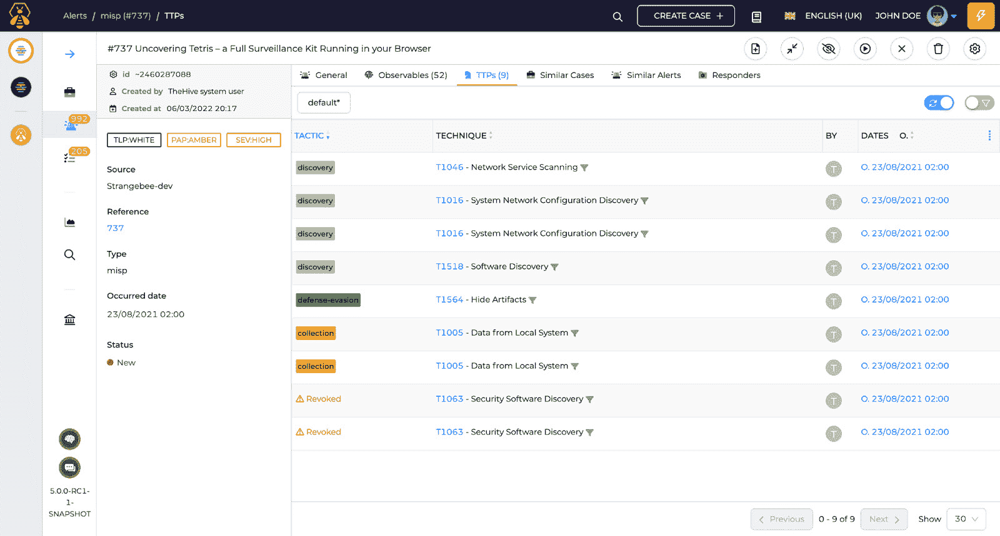

# 第三章：威胁情报与分析

根据 Ponemon 研究所的一项研究（[`webroot-cms-cdn.s3.amazonaws.com/9114/5445/5911/ponemon-importance-of-cyber-threat-intelligence.pdf`](https://webroot-cms-cdn.s3.amazonaws.com/9114/5445/5911/ponemon-importance-of-cyber-threat-intelligence.pdf)），拥有强大威胁情报的组织对网络攻击的响应速度要快 53%，突显了其在威胁分析、事件响应和缓解中的重要性。简单来说，威胁情报是收集、处理和研究的数据，旨在弄清楚威胁行为者为什么这样做、攻击谁以及如何做。威胁情报数据使安全运营团队能够主动防御潜在的安全事件，提高其检测、分析和有效消除威胁的能力。当你将威胁情报功能集成到 Wazuh 平台时，**安全运营中心**（**SOC**）分析师可以为每个安全警报获取更多的背景信息。在本章中，我们旨在增强 Wazuh 的威胁情报功能。为此，我们将利用**恶意软件信息共享平台**（**MISP**），一个旨在收集和共享威胁情报的开源项目。此外，我们还将整合 TheHive/Cortex，这是一个专为可扩展的威胁分析和事件响应量身定制的综合工具套件。通过将这些工具与 Wazuh 集成，我们使安全团队能够进行彻底的威胁分析并简化事件响应过程。这种集成促进了威胁情报任务的自动化，减少了响应时间并增强了组织的安全性。

本章将涵盖以下主题：

+   什么是威胁情报？

+   自动化威胁情报

+   设置 TheHive 和 Cortex

+   设置 MISP 项目

+   Wazuh 与 TheHive 的集成

+   将 TheHive 和 Cortex 与 MISP 集成

+   使用案例

# 什么是威胁情报？

**威胁情报**，或称**网络威胁情报**，基本上是关于威胁行为者（实施针对公司或政府机构的黑客攻击活动的个人或团体）、他们的动机和能力的知识。威胁情报的核心是保持对互联网中潜藏的最新威胁和风险的了解。威胁情报使我们能够做出更快、更有根据的安全决策，并将我们的行为从反应式转变为主动式，从而更有效地应对攻击者。威胁情报有助于网络安全的各个领域，包括 SOC 分析师、情报分析师、**首席信息安全官**（**CISOs**）等。通过收集和分析威胁情报信息，组织可以通过提前检测和预防、基于上下文的决策、改进的事件响应、更好地理解攻击者的战术、**技术和程序**（**TTPs**），以及对不断增长的威胁提供更好的安全防御等，来提升自身的防御能力。

在本节中，我们将讨论：

+   威胁情报的类型

+   SOC 分析师如何使用威胁情报

## 威胁情报的类型

在网络安全日新月异的世界里，想要加强防御的公司必须走在新风险的前面，并利用威胁情报。威胁情报主要分为三种类型：*战术情报*、*操作情报*和*战略情报*。通过使用这些类型的威胁情报，企业不仅可以了解威胁行为者的策略随时间的变化，还可以规划他们的防御，以应对始终变化的网络威胁。让我们详细了解这三种类型的威胁情报：

+   **战术情报**：战术情报关注的是近期的未来，具有技术性质，能够识别简单的**妥协指标**（**IOC**）。IOC 是指在调查、威胁狩猎活动或恶意软件分析过程中收集的技术信息。IOC 是实际的数据片段，如 IP 地址、域名、文件哈希等。它们甚至可以通过开源和免费的数据源收集，例如：

    +   AlienVault OTX ([`otx.alienvault.com/`](https://otx.alienvault.com/))

    +   Abuse.ch ([`abuse.ch/`](https://abuse.ch/))

    +   Blocklist.de ([`www.blocklist.de`](https://www.blocklist.de))，以及

    +   Proofpoint Emerging Threats ([`rules.emergingthreats.net`](https://rules.emergingthreats.net))。

+   这些战术情报数据由 IT 分析师和 SOC 分析师使用。由于 IOC 如恶意 IP 地址或域名可能在几天或几小时内过时，因此它们的生命周期通常非常短。

+   **运营情报**：每一次攻击都有一个“*谁*”、一个“*为什么*”和一个“*如何*”。“*谁*”指的是身份识别；“*为什么*”指的是动机或意图；“*如何*”由威胁行为者的战术、技术和程序（TTPs）组成。这使得蓝队或安全运营团队可以洞察敌方如何规划、实施并维持攻击活动和重大操作。这被称为运营情报。战术情报加上人工分析，能使这类情报具备更长的有效生命周期。

+   **战略情报**：战略情报帮助决策者了解网络威胁对其组织构成的威胁。通过这些知识，他们可以做出相应的网络安全投资，不仅保护组织安全，还能与组织的战略优先事项相一致。CISO 和管理团队是这种情报的主要受众。战略情报需要人工数据收集与分析，这要求具备深入的网络安全和地缘政治知识。战略情报通常以报告的形式呈现。

将这些不同类型的威胁数据结合起来，有助于企业建立全面、灵活的网络防御，以应对各种网络威胁。

接下来，我们将重点讨论 SOC 分析师如何使用威胁情报数据（尤其是战术情报和运营情报）来更好地检测和分析威胁。

## SOC 分析师如何使用威胁情报

在上一节中，我们了解了 SOC 团队如何利用战术和运营情报。威胁情报提供了关于最新威胁、攻击方法、恶意行为者和漏洞的宝贵信息。接下来，我们将讨论 SOC 分析师在使用威胁情报时的实际步骤：

1.  **收集观察项**：观察项是潜在的威胁信息片段。例子包括 IP 地址、域名、URL、文件哈希值、电子邮件地址等。观察项可以通过 SIEM 工具、EDR、电子邮件安全工具、开源和免费威胁情报数据源等进行收集。

1.  **威胁信息丰富化与背景分析**：在识别出可疑的观察项后，收集背景信息并丰富数据，以便更好地理解威胁。例如，你发现一个 IP 地址（123.45.67.89）连接到一个新注册的域名（[malicious-website.com](http://malicious-website.com)）。你可以通过查询威胁情报数据库和历史数据来丰富这个数据。这个 IP 地址之前曾与多个钓鱼攻击活动有关，而该域名位于一个以网络犯罪活动闻名的高风险区域。

1.  `123.45.67.89`

1.  域名 IOC：[malicious-website.com](http://malicious-website.com)

1.  URL 路径 IOC：[malicious-website.com/login](http://malicious-website.com/login)

这些 IOC 现已被添加到贵组织的安全工具中，如防火墙、入侵检测系统和 SIEM 解决方案。如果匹配到这些 IOC 中的任何一项，表示存在恶意活动，需进一步调查。

1.  **检测与响应**：通过实施增强的 IOC，贵组织的安全系统（如 SIEM、IDS 或 XDR）会积极监控网络流量和日志，检查是否与这些指标匹配。一旦发现匹配，就会生成警报，SOC 团队将启动事件响应程序。例如，员工点击了一个指向 IOC 中提到的 URL 路径的链接（[malicious-website.com/login](http://malicious-website.com/login)）。这会触发贵组织入侵检测系统（例如 Suricata）中的警报。SOC 团队在接到警报后会调查事件。他们确认用户的计算机访问了恶意 URL，并可能遭遇了恶意软件。SOC 团队会隔离受感染的系统，进行恶意软件分析，并启动遏制和清除过程，以防止进一步传播。

1.  **持续改进**：事件解决后，SOC 团队进行事后分析。这包括评估威胁检测过程的效果，完善 IOC，并从过去的响应中学习，以改进未来的响应策略。在分析过程中，SOC 团队确定钓鱼攻击源自一封主题为假冒工作 offer 的邮件。他们决定将邮件主题模式添加到 IOC 中，以便更有效地检测未来类似的钓鱼攻击活动。

注

IOC 不仅限于域名、IP 地址或 URL；它们还可以是文件哈希、电子邮件地址、电子邮件主题和模式、注册表键、网络签名（数据负载或数据包头）、行为指标（异常文件修改、新用户账户）、自定义 YARA 规则、用户代理、HTTP 头、DNS 记录、SSL 证书、托管信息等。

我们了解到 SOC 分析员如何利用威胁情报信息；然而，为了提高效率，我们需要自动化威胁情报过程，包括收集、观测数据分析和更新。

# 自动化威胁情报

到目前为止，您可能已经意识到威胁情报对于 SOC 分析员或蓝队的重要性。但试想，如果每天生成成千上万的观测数据，手动复制/粘贴每个观测数据并在威胁情报数据库或信息流中搜索它们，将会非常困难。这给 SOC 带来了许多挑战，例如威胁检测延迟、漏报警报、一致性差和响应时间慢。在本节中，我们将设计一个自动化威胁情报系统，并将其与 Wazuh 集成。我们将覆盖以下内容：

+   设计自动化威胁情报

+   MISP 简介

+   TheHive 和 Cortex

+   威胁情报与分析的工作原理

## 设计自动化威胁情报

Wazuh 是一个安全平台，收集来自所有端点的安全事件。为了集成威胁情报功能，我们将使用 MISP 项目——一个开源的威胁情报共享平台。Wazuh 与 MISP 的集成可以通过使用 MISP API 来实现，如下图所示：


图 3.1 – Wazuh 与 MISP 的提议集成

然而，该设计并不允许安全团队追踪每一个可观察项和安全事件。我们需要构建一个系统，在这个系统中，我们能够从 Wazuh 获取安全事件，并分别分析每个事件的可观察项，结合威胁情报数据源进行对比。简而言之，这个设计中有三个工具：

+   Wazuh（安全事件收集）

+   一个安全事件管理工具（用于接收来自 Wazuh 的警报并与威胁情报数据进行查找）

+   一个威胁情报工具（此工具用于向安全事件管理工具提供威胁情报数据）

+   顶部表单

我们将使用 TheHive 工具进行安全事件管理，并使用 MISP 项目进行威胁情报管理。以下图示展示了 Wazuh 与 TheHive/Cortex 及 MISP 集成的提议：


图 3.2 – Wazuh 与 TheHive/Cortex 及 MISP 的提议集成

Wazuh、TheHive 和 MISP 的集成具有一些主要优势：

+   **集中式威胁情报**：此集成使得来自 MISP 的威胁情报能够集中在 TheHive 中，从而为 Wazuh 提供一个存储和分析安全事件的中央位置，并决定如何应对这些事件。该集成使得安全团队能够将事件与已知的风险和 IOC 进行关联，从而使响应更加准确、迅速。

+   **可扩展的安全运营**：集成简化了安全事件的处理，支持可扩展的安全运营。通过利用 Wazuh 的检测能力、TheHive 的案例管理技能以及 MISP 的威胁情报能力，组织能够有效处理和应对日益增多的安全事件，而无需显著增加人工投入。

+   **自动化事件响应**：尽管本章讲解的是威胁情报集成，但通过集成 TheHive，我们还可以实现自动化事件响应功能。通过利用 MISP 中的信息，安全分析师可以在 TheHive 中生成响应手册，从而为由 Wazuh 识别的安全事件提供更一致、更迅速的响应。

让我们首先快速了解这些工具的功能。然后，我们将配置它们并进行集成。

### MISP 简介

**MISP** 是一个开源威胁情报平台，帮助组织和安全专业人士收集、共享和协作结构化的威胁信息。MISP 有七个核心层：

+   **数据层**：该层专注于从实际的威胁情报数据中收集有关安全事件和威胁的详细信息。数据层的主要组件如下：

    +   **事件**：安全事件或威胁信息。

    +   **属性**：描述威胁的各个方面，如 IP 地址、域名、哈希值、电子邮件地址等。

    +   **对象**：一种模板，指定关于威胁的上下文化和组织化信息。

+   **上下文层**：此层关注在各种威胁情报数据之间建立联系和关联。

+   **关联层**：该层负责识别各种事件和属性之间的模式和关联。

+   **警告列表层**：警告列表是被认为是恶意或可疑的指示器的集合。

+   **分类层**：分类法标准化威胁情报数据的分类和归类，帮助一致且有序地组织和描述威胁。

+   **星系层**：星系是关于各种威胁的相关信息的集合，如威胁行为者、攻击方法、恶意软件家族等。它们提供上下文信息，帮助你更好地理解危险。

+   **馈送层**：馈送层涉及将外部威胁情报来源集成到 MISP 中。此层使 MISP 能够自动从各种可靠来源检索并整合数据，从而增强威胁情报数据库。

正如我们之前讨论的，我们需要 TheHive 作为中介，接收来自 Wazuh 的安全警报，并允许我们将每个可观察项与 MISP 威胁情报数据进行分析。

TheHive 包含两个工具：TheHive 用于事件管理，Cortex 用于与大量威胁情报平台的集成。TheHive 和 Cortex 构成了一个强大的集成系统，专为 SOC 分析师设计。此集成弥合了有效协作和高级威胁分析之间的差距，从而增强了 SOC 识别、减轻和应对网络安全威胁的能力。

### TheHive

**TheHive** 是一个事件响应平台，旨在帮助 SOC 分析师分析安全警报和事件。它促进了不同团队成员在安全调查和事件响应过程中的协作与信息共享。TheHive 的一些重要功能如下：

+   **可观察项分析**：TheHive 可以分析从 Wazuh 接收到的警报，这使得 SOC 分析师能够在决定是否忽略警报或将其转换为案件之前进行预筛选。


图 3.3 – 可观察项预览

+   **案件时间线**：案件时间线展示了整个案件生命周期，包括初始警报、进行中的任务、已完成的任务、识别的 IOC 以及更多内容。


图 3.4 – TheHive 中的案件时间线

+   **集成**：TheHive 版本 5 具有强大且默认的集成功能，支持与 Cortex、Wazuh 和 MISP 的集成。然而，它也可以与 IBM QRadar、Splunk SIEM、Elasticsearch、VirusTotal 等进行集成。

+   **警报 TTPs**：TheHive 可以包含一组 MITRE ATT&CK TTPs，集成 MISP 后可与 ATT&CK 映射。MITRE ATT&CK（代表**对抗战术、技术和常识**）是一个框架，用于分类攻击者在攻击的各个阶段使用的网络威胁行为和技术。我们将在*第六章*中深入了解 MITRE ATT&CK 框架，主题是 *使用 Wazuh 进行威胁狩猎*。



图 3.5 – 在 TheHive 平台中可视化 TTPs

TheHive 和 Cortex 是为了无缝协作而设计的。TheHive 可以将事件中的观察项发送到 Cortex，以便预设的分析器进行检查。通过这种集成，一些工作可以自动化，从而减少在事件响应过程中需要手动完成的工作量。接下来，让我们探索 Cortex 的功能。

### Cortex

**Cortex**是 TheHive 项目的一部分。它自动化威胁情报和响应，赋予 SOC 分析员快速有效地检测和响应威胁的能力。Cortex 的核心功能之一是能够集成多个安全工具、威胁情报信息流、安全服务等。Cortex 充当这些情报的中央存储库，允许分析员轻松管理和访问他们需要的信息。

Cortex 有两个主要组件：

+   **分析器**：分析器从各种来源收集并丰富数据，以帮助 SOC 分析团队。分析器有多种类型，它们可以连接到在线安全服务、威胁信息流和数据库。数据转化后，分析器可以通过将其与已知恶意指标列表进行比对、查询在线服务以获取更多信息，或运行自定义脚本进行更高级的分析来进一步丰富数据。

+   **响应器**：响应器用于根据分析器提供的丰富数据执行相应的操作。响应器有多种形式，每种形式都旨在执行特定的任务，例如阻止 IP 地址、隔离感染设备或警告安全分析员。

## 理解自动化威胁情报和分析的工作原理

最终的设计工作流涉及所有三个组件：Wazuh、TheHive/Cortex 和 MISP。这个推荐的设计帮助企业构建一个高效且可扩展的事件响应系统。以下是与 Wazuh、TheHive/Cortex 和 MISP 一起进行自动化威胁情报和分析设计中的一些重要步骤：

+   **事件传输**：集成后，TheHive 可以接收来自 Wazuh 的安全事件。我们还可以配置 Wazuh 仅发送特定类型的警报，例如符合规则等级三或更高级别的安全警报。

+   **警报分类**：一旦 TheHive 收到来自 Wazuh 的警报，它可以调用 Cortex 立即查看与之相关的可观察对象。这可能包括运行安全扫描、将可观察对象与 MISP 威胁情报源进行对比，或从互联网上获取更多信息。

+   **响应操作**：TheHive 可以根据 Cortex 分析结果启动响应操作，例如更改事件状态、为分析师提供任务或生成报告。这有助于自动化事件响应工作流的部分环节。


图 3.6 – 与 Wazuh、TheHive 和 MISP 一起进行威胁情报和分析的工作流

现在我们已经了解了自动化威胁情报、事件管理和分析的完整流程，接下来让我们开始设置 Wazuh、TheHive/Cortex 和 MISP 工具，并将它们集成以实现无缝协作。

# 设置 TheHive 和 Cortex

TheHive 的部署设计为公司提供了灵活性，支持独立服务器部署（在单一服务器上部署）和集群部署（多个服务器共同处理 TheHive 应用负载）。对于大型生产环境，建议使用集群模式部署。TheHive 的一些软件组件如下：

+   **Apache Cassandra**：TheHive 使用 Apache Cassandra 数据库来存储其数据。Cassandra 是一个分布式 NoSQL 数据库，因其可扩展性和能够在多个节点的集群中管理大量数据而闻名。Cassandra 在 TheHive 框架中用于存储与案件、事件和其他相关信息相关的数据。

+   **Elasticsearch**：TheHive 使用 Elasticsearch 进行索引。它是一个强大的分析和搜索引擎，使得数据的索引、查询和搜索更加高效。它提升了 TheHive 的搜索性能和速度，简化了用户查找和评估数据的过程。

+   **S3 MINIO**：当需要集群部署或组织需要可扩展的分布式文件存储时，TheHive 支持 S3 兼容的存储解决方案，如 **MINIO**。AWS 提供了一种可扩展的对象存储服务，称为 **S3**（**简单存储服务**）。一个名为 MINIO 的开源替代品与 S3 API 兼容。

TheHive 应用程序、数据库、索引引擎和文件存储可以分别运行，因此每一层都可以是一个节点或集群。TheHive 可以使用虚拟 IP 地址和负载均衡器设置为复杂的集群架构。

我们可以在不同的环境中设置 TheHive 和 Cortex，如 Ubuntu 服务器、Docker、Kubernetes 等。为了简化安装过程，我们将使用 Docker Compose。我们需要执行以下步骤：

1.  安装 Docker Compose

1.  准备 TheHive 模块的 YML 脚本

1.  启动并测试

1.  在 TheHive 上创建一个组织和用户

1.  在 Cortex 上创建一个组织和用户

## 安装 Docker Compose

让我们从 Ubuntu 服务器开始。我将使用 Ubuntu 23.10 并采取以下步骤来安装 Docker Compose：

1.  使用 `apt` 命令安装 Docker 依赖项：

    ```
    $ sudo apt update
    $ sudo apt install -y apt-transport-https ca-certificates curl gnupg-agent software-properties-common
    ```

1.  **设置官方 Docker 仓库**：虽然 Docker 包在默认的 Ubuntu 20.04 仓库中提供，但建议使用官方 Docker 仓库。运行以下命令启用 Docker 仓库：

    ```
    $ curl -fsSL https://download.docker.com/linux/ubuntu/gpg | sudo apt-key add -
    $ sudo add-apt-repository \ "deb [arch=amd64] https://download.docker.com/linux/ubuntu \ $(lsb_release -cs) stable"
    ```

1.  **使用 apt 命令安装 Docker**：我们现在准备从官方仓库安装最新的稳定版本 Docker。运行以下命令进行安装：

    ```
    $ sudo apt-get update
    $ sudo apt install docker-ce –y
    ```

    安装完 Docker 包后，运行以下命令将本地用户添加到 Docker 组中：

    ```
    $ sudo usermod -aG docker rajneesh
    $ sudo usermod -aG docker root
    $ docker version
    ```

    验证 Docker 守护进程服务是否正在运行：

    ```
    $ sudo systemctl status docker
    ```

1.  在 Ubuntu 23.10 上安装 Docker Compose。要在 Ubuntu Linux 上安装 Docker Compose，请依次运行以下命令：

    ```
    $ sudo curl -L "https://github.com/docker/compose/releases/download/1.29.0/docker-compose-$(uname -s)-$(uname -m)" -o /usr/local/bin/docker-compose
    $ sudo chmod +x /usr/local/bin/docker-compose
    ```

    运行以下命令检查 Docker Compose 版本：

    ```
    $ docker-compose --version
    ```

如果 Docker 安装正常，你应该会看到输出，其中包括 Docker Compose 版本、OpenSSL 版本、CPython 版本等。

## 准备 TheHive 模块的 YML 脚本

`docker run` 和 `docker-compose` 的主要区别在于，`docker run` 完全基于命令行，而 `docker-compose` 从 YAML 文件中读取配置数据。因此，Docker Compose 的优势在于我们可以通过一个 YML 脚本安装 TheHive 的所有模块，一旦此 YML 脚本被 Docker 执行，所有模块都会启动。现在，让我们准备我们的 TheHive YML 脚本：

1.  `theHive` 并更改目录：

    ```
    $ mkdir theHive
    docker-compose.yml is a configuration file that allows us to configure and launch multiple Docker containers within a single file. Let’s create a docker-compose.yml file with the code shared in the GitHub repository at https://github.com/PacktPublishing/Security-Monitoring-using-Wazuh/blob/main/Chapter%203/theHive_Docker_Compose.yml.You can also find the YML code from the link here: [`docs.strangebee.com/thehive/setup/installation/docker/`](https://docs.strangebee.com/thehive/setup/installation/docker/)
    ```

## 启动并测试

要部署 TheHive，请从 TheHive 目录运行以下命令：

```
$ docker-compose up -d
```

接下来，等待两到三分钟。打开浏览器，访问 TheHive 的地址 http:://<Server_IP>:9000 和 Cortex 的地址 `http:://<Server_IP>:9001`。

TheHive 应用程序的默认凭证如下：

+   `admin@thehive.local`

+   `secret`

接下来，Cortex 不提供默认凭证；你需要重置数据库并设置一个新的用户名和密码。这些将是我们的默认管理员凭证。

一旦你获得了 TheHive 和 Cortex 的管理员凭证，我们将创建一个组织，并在其下创建一个用户，然后生成 API 密钥。

## 在 TheHive 上创建一个组织和用户

登录后，我们需要做几件事。首先需要创建一个组织，然后创建一个用户：

1.  要创建一个组织，请进入**组织**并点击**添加**。输入**名称**和**描述**，并将任务共享规则设置为**手动**。

1.  接下来，为 haxcamp 组织创建两个用户——一个用户和一个 API 用户。进入`admin`和`haxcamp`组织。我们将把用户分配到`haxcamp`组织。

1.  现在，让我们创建 API 用户。此用户账户将用于将 TheHive 与 Wazuh 管理器集成。要创建 API 用户，请进入`API 用户`，使用`api@haxcamp.local`作为登录 ID，设置账户类型为`org-admin user`。创建 API 用户后，点击**显示**：


图 3.7 – 获取 TheHive API

复制 API 密钥并将其保存到某个地方。我们在将 TheHive 与 Wazuh 管理器集成时需要此 API 密钥。

## 在 Cortex 上创建组织和用户

在 Cortex 上设置管理员凭据后，您需要创建一个组织。填写**名称**和**描述**：


图 3.8 – 在 Cortex 中设置组织详情

接下来，我们需要创建一个用户。为此，请进入**用户**，点击**添加用户**，并填写**登录名**、**全名**、**组织和角色**：


图 3.9 – 在 Cortex 中创建并添加用户

您将注意到以下截图中的内容：

+   **登录**：这代表用户的登录用户名或电子邮件地址。

+   **组织**：这代表了用户所属的组织。

+   **角色**：这显示了用户的角色。

创建用户后，您可以点击**显示**来显示 API 密钥，并将其保存以供将来在我们将 Cortex 与 MISP 集成时使用：


图 3.10 – 获取 Cortex API

好的，现在三个工具中的一个已经部署并准备就绪。让我们在最终进入 Wazuh 之前，先部署我们的 MISP 项目。

# 设置 MISP

**MISP**是一个开源软件，我们可以通过不同的方式安装它，以构建自己的威胁情报并与社区共享。MISP 可以安装在大多数 Linux 发行版上，MISP 社区已经创建了简单的安装脚本。MISP 有很多依赖项，并结合了多种软件才能正常运行。这也被称为**LAMP**栈：

+   Linux 操作系统

+   用于 Web 服务器的 Apache

+   MySQL 关系型数据库

+   杂项—PHP、Perl、Python

我们可以在不同的环境中部署 MISP（[`www.misp-project.org/download/`](https://www.misp-project.org/download/)），如 Docker、VirtualBox 虚拟机和 VMware 虚拟机。通过 Docker 部署 MISP 及其依赖项是目前我发现最简单的安装过程。VirtualBox 虚拟机和 VMware 虚拟机适用于实验室和测试环境。按照以下步骤设置 MISP：

1.  完成要求。

1.  安装 Docker 和 Docker Compose。

1.  设置并启动 MISP。

1.  添加组织和用户。

1.  添加数据源。

## 满足要求

要在 Docker 环境中设置 MISP，我们需要 Ubuntu Server 22.04。

## 安装 Docker 和 Docker Compose

要设置 Docker 和 Docker Compose，请参考 *第 1 步* 的 *设置 TheHive/Cortex*。

## 设置并启动 MISP

现在我们已经安装了 Docker，我们需要安装 MISP Docker 镜像并配置环境变量。这将有四个子步骤：

1.  克隆 Git 仓库。

1.  修改环境变量文件。

1.  启动 Docker Compose。

1.  启动 MISP。

我们将通过他们的官方 GitHub 仓库来启动 MISP 的安装，如下所述：

1.  **克隆 Git 仓库**：让我们使用以下命令来克隆 Git 仓库：

    ```
    template.env to .env (on the root directory) and edit the environment variables in the .env file:
    ```

    ```
    $ cp template.env .env
    ```

    接下来，打开文件并使用 GNU nano 编辑器进行编辑：

    ```
    $ nano .env 
    and set the MISP_BASEURL to https://<Server_IP>
    ```

    最终文件应如下所示：

    ```
    MYSQL_HOST=misp_db
    MYSQL_DATABASE=misp
    MYSQL_USER=misp
    MYSQL_PASSWORD=misp
    MYSQL_ROOT_PASSWORD=misp
    MISP_ADMIN_EMAIL=admin@admin.test
    MISP_ADMIN_PASSPHRASE=admin
    MISP_BASEURL=https://<Server_IP>
    POSTFIX_RELAY_HOST=relay.fqdn
    TIMEZONE=Europe/Brussels
    DATA_DIR=./data
    ```

1.  **启动 Docker Compose**：要启动 MISP Docker 容器，我们需要使用以下命令构建它：

    ```
    https://<MISP_Server_IP>.The default credentials are as follows:*   Username: `admin@admin.test`*   Password: `admin`
    ```

## 添加组织和用户

我们需要创建一个本地组织并向其中添加一个用户。进入 **管理**，输入 **组织** 标识符，生成 **UUID**，上传公司徽标（可选），然后点击 **提交**。


图 3.11 – 在 MISP 平台中设置组织详情

您会在上面的截图中注意到以下内容：

+   **组织标识符**：这是每个组织的唯一名称。

+   **UUID**：这是一个唯一标识符，确保每条信息都有一个全球唯一的标识符。您甚至可以从像 [www.uuidgenerator.net](http://www.uuidgenerator.net) 这样的站点在线生成 UUID。

现在，要将用户添加到您的组织，请进入 **管理** > **添加用户**，输入您的电子邮件，设置密码，选择您的组织，设置角色为 **组织管理员**，然后点击 **创建用户**。


图 3.12 – 在 MISP 中添加管理员用户

您会在上面的截图中注意到以下内容：

+   **电子邮件**：这代表管理员用户的电子邮件地址。

+   **组织**：这代表组织的名称。

+   **角色**：这代表用户的角色。在此情况下，您应将其设置为 **管理员**。

## 添加数据源

MISP 使用数据源来下载威胁报告、IOC（入侵指示器）以及其他信息。这些数据源包含了所有由 MISP 存储的数据。配置 MISP 时，数据源默认没有启用。要使用我们的数据源，我们必须导入并启用它们。幸运的是，MISP 提供了一些不错的威胁情报数据源。这些数据源信息是以 JSON 格式获取的，可以从他们的官方 GitHub 仓库下载，地址为 [`github.com/MISP/MISP/blob/2.4/app/files/feed-metadata/defaults.json`](https://github.com/MISP/MISP/blob/2.4/app/files/feed-metadata/defaults.json)。

复制原始数据。接下来，访问 MISP 应用程序，前往**同步操作**，点击**从 JSON 导入源**，并在那里粘贴元数据：


图 3.13 – 将源添加到 MISP

在这里，**服务器元数据**表示威胁情报源的 JSON 值。

接下来，启用源。为此，前往**同步操作**并点击**列表源**。选择所有源后点击**启用所选**：


图 3.14 – 在 MISP 中可视化源

在这里，**列表源**表示包含其提供者详细信息的所有威胁情报源的列表。

这完成了我们设置 MISP 应用程序的任务。接下来，我们将致力于将 Wazuh 和 MISP 与 TheHive 集成。

# 将 Wazuh 与 TheHive 集成

我们将把 Wazuh 与 TheHive 集成，以便自动将 Wazuh 警报发送到 TheHive。SOC 分析师随后可以调查并响应这些警报，并在必要时创建案件。在这一部分，我们将采取以下步骤：

1.  在 Wazuh 管理器上安装 TheHive Python 脚本。

1.  在 Wazuh 管理器上创建一个集成 Python 脚本。

1.  在 Wazuh 管理器上创建一个 Bash 脚本。

1.  在 Wazuh 服务器配置中集成 TheHive 服务器。

1.  重启管理器。

1.  在 TheHive 上可视化警报。

## 在 Wazuh 管理器上安装 TheHive Python 脚本。

我们将使用一个 Python 脚本，使 TheHive 与 Wazuh 管理器进行自定义集成。接下来的步骤中，我们将使用它作为参考。该模块在撰写本文时已在 TheHive 版本 5.2.1 上进行测试并可正常工作。

首先，使用以下命令安装`thehive4py`模块：

```
sudo /var/ossec/framework/python/bin/pip3 install thehive4py
```

## 在 Wazuh 管理器上创建一个集成 Python 脚本。

必须在`/var/ossec/integrations/`目录下构建`custom-w2thive.py`脚本，以便将 TheHive 与 Wazuh 集成。你可以在 GitHub 仓库中找到完整代码，地址是[`github.com/PacktPublishing/Security-Monitoring-using-Wazuh/blob/main/Chapter%203/custom_thehive_integration_Wazuh.py`](https://github.com/PacktPublishing/Security-Monitoring-using-Wazuh/blob/main/Chapter%203/custom_thehive_integration_Wazuh.py)。让我来解释这段代码的导入语句，以澄清它是如何构建的。我已经拆解了第一部分（导入语句）。

### 导入语句

这一部分的 Python 代码定义了导入的模块或包。

```
#!/var/ossec/framework/python/bin/python3
import json
import sys
import os
import re
import logging
import uuid
from thehive4py.api import TheHiveApi
=
```

这里的行导入了多个 Python 模块，包括`json`、`sys`、`os`、`re`、`logging`、`uuid`和来自`thehive4py`包的特定模块。

### 用户配置

这部分代码定义了作为全局变量的用户可配置参数：

```
lvl_threshold=0
suricata_lvl_threshold=3
debug_enabled = False
info_enabled = True
```

让我们来逐步解析代码：

+   `lvl_threshold=0`：这表示 TheHive 将接收 Wazuh 生成的所有警报。如果你有一个拥有成千上万监控代理的大型网络，建议将其设为更高的值，以便接收到更多相关的警报。

+   `debug_enable = False`: 这是调试选项。在此情况下，设置为`False`。

+   `info_enabled= True`: 这是信息日志选项。在此代码中，设置为`True`。

现在，让我们使用`chmod`和`chown`命令设置适当的权限和所有权：

```
sudo chmod 755 /var/ossec/integrations/custom-w2thive.py
sudo chown root:wazuh /var/ossec/integrations/custom-w2thive.py
```

## 在 Wazuh 管理器上创建一个 Bash 脚本

为了成功执行开发的`.py`脚本，我们必须构建一个名为`custom-w2thive`的 bash 脚本，并将其放置在`/var/ossec/integrations/custom-w2thive`目录下。你可以从 GitHub 仓库中复制整个代码：[`github.com/PacktPublishing/Security-Monitoring-using-Wazuh/blob/main/Chapter%203/custom_thehive_bash_script_Wazuh..sh`](https://github.com/PacktPublishing/Security-Monitoring-using-Wazuh/blob/main/Chapter%203/custom_thehive_bash_script_Wazuh..sh)。让我分解这个 bash 脚本，帮助你理解它的功能。

### 设置变量

在这个 bash 脚本的部分，定义了一些变量，如下所示：

```
WPYTHON_BIN="framework/python/bin/python3"
SCRIPT_PATH_NAME="$0"
DIR_NAME="$(cd $(dirname ${SCRIPT_PATH_NAME}); pwd -P)"
SCRIPT_NAME="$(basename ${SCRIPT_PATH_NAME})"
```

+   `WPYTHON_BIN`被设置为 Python 3 解释器的路径

+   `SCRIPT_PATH_NAME`被设置为脚本的完整路径

+   `DIR_NAME`被设置为包含脚本的目录的绝对路径

+   `SCRIPT_NAME`被设置为脚本的基础名称

### 确定 Python 脚本的路径

这部分脚本用于获取`custom-w2thive.py`文件的位置：

```
case ${DIR_NAME} in
    */active-response/bin | */wodles*)
        if [ -z "${WAZUH_PATH}" ]; then
            WAZUH_PATH="$(cd ${DIR_NAME}/../..; pwd)"
        fi
    PYTHON_SCRIPT="${DIR_NAME}/${SCRIPT_NAME}.py"
    ;;
    */bin)
    if [ -z "${WAZUH_PATH}" ]; then
        WAZUH_PATH="$(cd ${DIR_NAME}/..; pwd)"
    fi
    PYTHON_SCRIPT="${WAZUH_PATH}/framework/scripts/${SCRIPT_NAME}.py"
    ;;
     */integrations)
        if [ -z "${WAZUH_PATH}" ]; then
            WAZUH_PATH="$(cd ${DIR_NAME}/..; pwd)"
        fi
    PYTHON_SCRIPT="${DIR_NAME}/${SCRIPT_NAME}.py"
    ;;
Esac
```

让我们分解一下前面的代码：

+   `*/active-response/bin | */wodles*)`: 这是一个模式，如果匹配成功，将会把`WAZUH_PATH`和`PYTHON_SCRIPT`设置为`${DIR_NAME}/${SCRIPT_NAME}.py`。

+   `(*/bin)`: 这是另一个模式，如果匹配成功，将会把`WAZUH_PATH`和`PYTHON_SCRIPT`设置为`${WAZUH_PATH}/framework/scripts/${SCRIPT_NAME}.py`。

+   `(*/integrations)`: 这是第三个模式，如果匹配成功，将会把`WAZUH_PATH`和`PYTHON_SCRIPT`设置为`${DIR_NAME}/${SCRIPT_NAME}.py`。

### 设置 Python 脚本的路径

一旦 Python 脚本被设置为`PYTHON_SCRIPT`，这个脚本就会执行 Python 脚本：

```
${WAZUH_PATH}/${WPYTHON_BIN} ${PYTHON_SCRIPT} $@
```

在这里，`(${WAZUH_PATH}/${WPYTHON_BIN})`与任何命令行参数一起传递给 Bash 脚本（`$@`）。

正如我们之前所做的，让我们再次使用`chmod`和`chown`分别设置所需的权限和所有权：

```
sudo chmod 755 /var/ossec/integrations/custom-w2thive
sudo chown root:wazuh /var/ossec/integrations/custom-w2thive
```

## 在 Wazuh 服务器配置中集成 TheHive 服务器

现在，你需要使用你喜欢的文本编辑器修改`/var/ossec/etc/ossec.conf`文件，并插入以下代码：

```
<ossec_config>
…
  <integration>
    <name>custom-w2thive</name>
    <hook_url>http://TheHive_Server_IP:9000</hook_url>
    <api_key>RWw/Ii0yE6l+Nnd3nv3o3Uz+5UuHQYTM</api_key>
    <alert_format>json</alert_format>
  </integration>
…
</ossec_config>
```

让我们分解一下这段代码：

+   `<integration>`: 这指定了与外部应用程序或平台的集成。

+   `<hootk_url>`: 这是定义 URL 端点的地方。在这个例子中，它是 TheHive 平台的 URL。

+   `<api_key>`: 这是与集成相关的 API 密钥。在此案例中，它是 TheHive 平台的 API 密钥。

## 重启并测试

完成后，你需要重启 Wazuh 管理器：

```
sudo systemctl restart wazuh-manager
```

## 在 TheHive 中可视化警报

如果一切顺利，你应该很快会看到在 TheHive 中的**Alerts**标签下生成的通知。如截图所示，它已经成功了：


图 3.15 – 在 TheHive 上可视化警报

接下来，我们需要将 TheHive/Cortex 与 MISP 威胁情报集成，以执行可观察性分析。

# 将 TheHive 和 Cortex 与 MISP 集成

当 TheHive 和 Cortex 一起工作时，它们非常强大。TheHive 在事件响应、案件管理、协作和威胁分析方面非常有用，而 Cortex 是一个强大的威胁情报聚合器。一旦我们将 TheHive 和 Cortex 与 MISP 集成，我们甚至可以直接从 TheHive 运行可观察性分析器；因此，我们不必通过进入 Cortex 手动执行分析。为了实现这种自动化，我们需要做三件事：

1.  将 TheHive 与 Cortex 集成

1.  将 Cortex 与 MISP 集成

1.  将 TheHive 与 MISP 集成

## 将 TheHive 与 Cortex 集成

要将 TheHive 和 Cortex 集成，你需要在 TheHive 设置中输入 Cortex API 密钥。我希望你已经按照之前的部分*设置 TheHive 和 Cortex* | *在 Cortex 上创建组织和用户*说明复制了 Cortex API 密钥。现在，为了完成集成，使用管理员帐户登录或切换到管理员配置文件，点击**平台管理**选项卡。测试服务器连接，如截图所示：


图 3.16 – 测试 TheHive 和 Cortex 之间的服务器连接

你将在上述截图中看到以下内容：

+   **API 密钥**：这表示 Cortex 服务器的 API 密钥。

+   **不要检查证书颁发机构**：如果你没有在服务器上安装 SSL，建议保持此项禁用

## 将 Cortex 与 MISP 集成

使用你新创建的帐户登录 Cortex，然后转到`MISP_2_1 Analyzer`：


图 3.17 – 在 Cortex 下搜索 MISP 分析器

在这里，**MISP_2_1**表示用于执行可观察性分析的 MISP 分析器。

接下来，点击**编辑**，会弹出一个提示框配置 MISP 集成。输入名称、MISP 基本 URL 和 MISP API 密钥，并将**cert_check**设置为**False**（如果你还没有配置 SSL）：


图 3.18 – 将 MISP 集成到 Cortex 中

你需要输入以下内容：

+   **名称**：这表示 MISP 分析器的名称。

+   **URL**：这表示 MISP 平台的 URL。

+   **密钥**：这表示 MISP 服务器的 API 密钥。

+   **cert_check**：这将决定 Cortex 是否执行 SSL 检查。在这种情况下，我们将其保持为**False**。

现在，是时候通过一个示例分析器来验证集成了。在左上方，你会看到一个**新分析**按钮。现在，将**TLP**设置为**AMBER**，**PAP**设置为**AMBER**，**数据类型**设置为**域**。立即，你将看到一个新的**按钮 MISP_2_1**，如图所示：


图 3.19 – 在 Cortex 上运行 MISP 分析器

## 将 TheHive 与 MISP 集成

TheHive 套件的最佳部分是 MISP 已经与它集成。你只需要在 TheHive 平台中输入 MISP 的 API 密钥即可完成集成。要完成集成，使用管理员账户登录或切换到管理员配置文件，然后点击**平台管理**标签。你需要设置 MISP 服务器名称、服务器 URL 和 API 密钥，然后可以测试连接，如下图所示：


图 3.20 – 测试 TheHive 和 MISP 之间的连接

你将在上面的截图中看到以下内容：

+   **服务器名称**：这是 MISP 服务器的名称。

+   **服务器 URL**：这表示 MISP 服务器的 URL。

+   **API 密钥**：这表示 MISP 服务器的 API 密钥。

+   **目的**：这显示了该 API 集成将如何使用。它可以是**导出**、**导入**或两者兼有。在这种情况下，我们将其设置为**导出**，以发送查询。

+   **不要检查证书颁发机构**：如果你没有在服务器上安装 SSL，建议保持此选项禁用。

+   **测试服务器连接**：这是在 TheHive 和 MISP 服务器之间进行连接检查的操作。

最后，所有三种工具——Wazuh、TheHive/Cortex 和 MISP 的安装与集成完成。现在我们将重点关注威胁情报与分析的一些重要用例。

# 用例

Wazuh 和 TheHive 的集成为 SOC 分析师和事件响应团队提供了许多好处。我们将通过不同的用例来探索 TheHive 和 MISP 的多个功能，这些功能与 Wazuh 配合使用效果极佳。我们将介绍一些常见的用例，例如调查可疑文件和网络连接，以及追踪 TTPs。在本节中，我们将涵盖以下主题：

+   前提条件

+   审查警报

+   创建案例

+   分析文件可观察对象

+   分析网络可观察对象

+   管理 TTPs

## 前提条件

在我们深入探讨 Wazuh、TheHive 和 MISP 的威胁情报与分析用例之前，我们需要确保满足以下要求：

+   一台 Wazuh 服务器

+   运行 TheHive 和 Cortex 的 Ubuntu 服务器，使用 Docker

+   运行 MISP 服务器的 Ubuntu 服务器

+   安装了 Wazuh 代理的 Ubuntu 桌面或 Ubuntu 服务器

## 审查警报

一旦将 Wazuh 与 TheHive 集成，你将开始接收安全警报。在开始调查警报或分析任何可观察对象与 MISP 服务器的关系之前，你需要充分了解 TheHive 警报的属性。你可以在以下截图中查看所有警报的主要属性：


图 3.21 – 在 TheHive 上审查安全警报

你将在上面的截图中看到以下内容：

+   **一般**：这是一个包含**标签**、**描述**、Wazuh **规则**和 Wazuh **代理**信息的标签。

+   **可观察项**：这显示了诸如 IP 地址、域名、URL、哈希值等信息。

+   **TTPs**：这显示 MITRE 攻击战术和技术

+   **类似案件**：这将显示现有的相关案件

+   **类似警报**：这将显示类似的警报

+   **响应者**：这显示了 TheHive 响应者报告

+   **历史**：这显示警报的历史记录

在左上角，您可以看到以下操作项：

+   **从警报创建案件**：您可以使用此警报创建一个全新的案件。我建议您仅在确定这不是误报的情况下执行此操作。

+   **将选定项合并为案件**：您可以将多个警报合并为一个案件。

+   **忽略新更新**：一旦选择，您将不会收到此警报的任何更新。

+   **开始**：一旦点击这个播放按钮，您可以继续进行，而无需创建案件。您可以将警报的状态更改为**待处理**，添加一些总结性备注，并将其分配给另一位分析员或二级分析员。

+   **关闭**：如果您确定这是误报或重复项，您可以关闭此警报。

根据您的调查，您还可以更改警报的状态，如该截图所示：


图 3.22 – 更改警报状态

您将在前面的截图中注意到以下内容：

+   **状态**：这是警报的状态，可以是**新建**、**进行中**、**待处理**、**已导入**、**重复**、**误报**或**已忽略**。在这种情况下，设置为**重复**。

+   **受指派人**：这表示您希望将此警报分配给谁。可以是您的团队成员、SOC 二级分析员、威胁情报团队等。

## 创建案件

一旦您确认需要处理某个警报，您可以创建一个全新的案件或使用案件模板。点击空白案件后，您需要输入案件标题、严重性、任务等详细信息。您可以创建多个任务并将它们分配给不同的团队成员，如截图所示：


图 3.23 – 在 TheHive 中创建新案件

您将在前面的截图中注意到以下内容：

+   `检测到可疑` `文件`。

+   **严重性**：这表示案件的紧急程度。

+   **添加任务**：这允许您添加多个任务。

## 分析文件可观察项

如我们所知，可观察项是需要分析的初始信息，在将其标记为 IOC 之前。TheHive 从 Wazuh 安全事件中检测到可观察项。然后，我们可以将可观察项与多个威胁情报源进行分析。预定义的可观察项类型包括 IP、电子邮件地址、URL、域名、文件和哈希值。

当你从警报创建案件时，警报中的可观察对象也会转移到 TheHive 案件中。即使你没有任何可观察对象，你也可以创建一个可观察对象并将其与 MISP 威胁情报源进行分析。你可以点击 **添加一个可观察对象** 并输入详细信息，如下图所示：


图 3.24 – 在 TheHive 中添加一个可观察对象

在上面的截图中，你会注意到以下几点：

+   `filename`。

+   `svchost.exe` 文件。

+   **Tags**：写下任何相关的标签。

+   **描述**：写下一个简单且相关的描述。

接下来，点击 `filename` 可观察对象左侧的汉堡菜单，选择 **运行分析器**，如下图所示：


图 3.25 – 可观察对象的信息

在上面的截图中，你会注意到以下几点：

+   **Svchost[.]exe**：这是示例文件，已作为可观察对象添加。

+   `Svshost[.]exe` 并针对 MISP 服务器运行分析器进行威胁情报查询。选择 **运行分析器** 后，你应该看到 **MISP_2_1**。选择它并点击 **运行所选分析器**，如下图所示：


图 3.26 – 执行 MISP 分析器

接下来，等待 10 到 20 秒，你应该会收到来自 MISP 服务器的同一可观察对象下的报告。恭喜！如图所示，你可以从 MISP 服务器找到结果：


图 3.27 – 从 MISP 服务器接收威胁情报结果

点击它后，你将看到 MISP 中的所有八个匹配事件（威胁情报源），如下所示：


图 3.28 – 可视化来自 MISP 服务器的可观察对象分析报告

你可以进入任何 MISP 事件并点击 **EventID**。你将被重定向到 MISP 服务器中的特定事件，如下图所示：


图 3.29 – 可视化来自 MISP 服务器的威胁情报事件

在上面的截图中，你会注意到以下几点：

+   **EventID**：这表示来自 MISP 服务器的事件 ID。在这个例子中，事件 ID 是 **1125**。

+   **From**：这表示威胁情报源提供者。在这个例子中，提供者是 **CIRCL**。

为了进一步探索此特定事件，我们可以登录到我们的 MISP 服务器，导航到 `1125` 并查找结果，如下图所示：


图 3.30 – 在 MISP 服务器中可视化事件

让我们来解析一些条目：

+   **信息**：这是事件的简要描述。在此案例中，它是**IECrypt 样本通过 VMRay 分析报告进行分析，样本编号 #245141**。

+   **日期**：这是事件创建的日期和时间。

+   **威胁级别**：表示威胁的严重性或关键性。可以是低、中或高。

+   **分析**：表示事件的当前分析状态，例如初步分析、进行中或已完成。

+   **分发**：这表示事件的分发级别，确定谁可以访问这些信息，例如仅限于组织、共享小组或社区。在此案例中，是**所有社区**。

+   **标签**：这是与事件相关的标签列表，提供额外的分类或元数据。

## 分析网络观测数据

现在，假设你有一些 IP 和域名观测数据。我们也可以以相同的方式测试它们，或者你可以添加在其他事件调查中找到的相关观测数据。你可以导航到**观测数据**标签，如截图所示，我们有一些 IP 地址作为观测数据：


图 3.31 – 在 TheHive 中可视化 IP 地址观测数据

让我们分解一下截图中的高亮框：

+   **95[.]154[.]195[.]171**：这是一个需要由 MISP 服务器分析的样本 IP 地址观测数据

+   **drivgoogle[.]firewall-gateway[.]com**：这是一个需要由安全团队分析的样本域名，出现在观测数据列表中。

接下来，等待 10 到 20 秒，你应该能从 MISP 服务器下获得同一观测数据的报告。太棒了！如下图所示，你可以从 MISP 服务器中找到结果：


图 3.32 – 可视化来自 MISP 服务器的观测分析报告

这里是`1125`。

## 管理 TTPs

TTP 分析可以帮助安全团队检测并缓解攻击，通过揭示威胁行为者是如何执行其操作的。TTPs 是威胁行为者使用的战术、技术和程序。MITRE ATT&CK 框架使 SOC 团队能够识别和处理他们遇到的 TTPs。MITRE ATT&CK 框架包含 14 个战术和数百个相关技术与程序。TheHive 从 Wazuh 事件中导入 TTPs，增强了我们的安全调查。你也可以通过以下步骤将新的 TTP 添加到任何案例中：

1.  转到特定案例。

1.  点击顶部的 TTPs。

1.  点击添加。

1.  输入发生数据。

1.  选择战术。

1.  选择技术 ID。

你可以添加新的 TTP 并输入相关信息，如下图所示：


图 3.33 – 在 TheHive 中添加 TTPs

你会注意到以下几点：

+   **目录**：表示攻击的类别。在本案例中，我们选择了 **企业攻击**。

+   **发生日期**：表示攻击发生的日期。

+   **技术**：这代表 MITRE ATT&CK 矩阵中的技术及其 ID。

+   **步骤**：这要求你手动输入威胁行为者执行特定技术时所遵循的逐步指令或操作顺序。

这完成了我们关于使用 Wazuh、TheHive、Cortex 和 MISP 服务器进行威胁情报与分析的使用案例概述。若想了解更多关于管理、功能及集成的信息，可以访问它们的官方网站：

+   TheHive: [`docs.strangebee.com/thehive/setup/`](https://docs.strangebee.com/thehive/setup/)

+   Cortex: [`docs.strangebee.com/cortex/`](https://docs.strangebee.com/cortex/)

+   MISP: [`www.misp-project.org/documentation/`](https://www.misp-project.org/documentation/)

# 总结

本章关于使用 MISP 进行威胁情报和分析的内容，提供了一个全面的指南，帮助理解和实施一个实用的威胁情报和分析系统。我们学习了 MISP 在与 Wazuh 和 TheHive 集成时，如何帮助安全分析师进行可观察的分析，并添加 TTPs（技术、战术和程序）。我们还讨论了 TheHive 和 Cortex 在执行文件、IP 地址、域名等分析时，与 MISP 威胁情报数据库的结合使用。

在下一章，我们将学习如何使用安全自动化工具（如 Shuffle）增强 Wazuh 的功能。我们将学习安全自动化的重要性以及 Shuffle 与 Wazuh 的集成，还会讲解一些使用案例。
