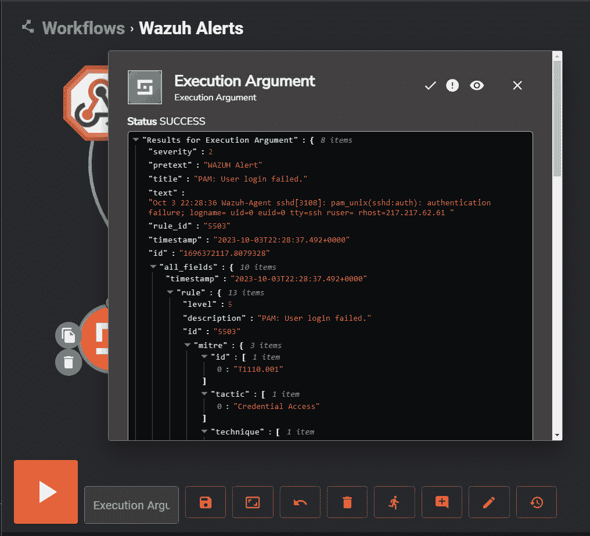
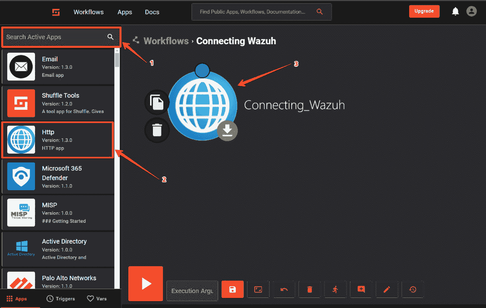
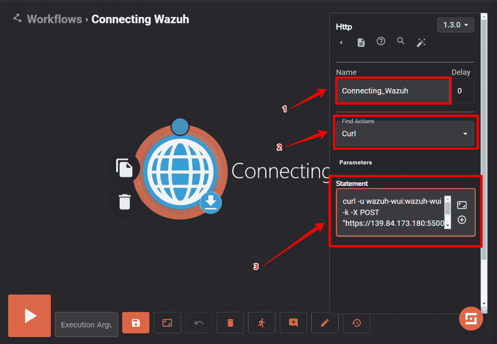
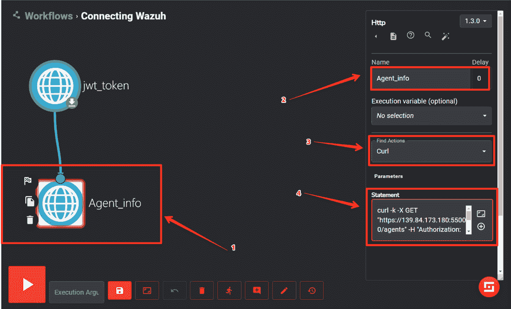

# 第四章：使用 Shuffle 进行安全自动化

每天，平均每个安全运营团队会收到超过 11,000 个安全警报（[`start.paloaltonetworks.com/forrester-2020-state-of-secops.html`](https://start.paloaltonetworks.com/forrester-2020-state-of-secops.html)），包括可疑活动、入侵尝试、特权用户和账户监控、异常的外部通信以及未授权访问尝试。

分析师的大部分时间（几乎 70%）都花在调查、分类或响应警报上，而这些警报中的大多数必须手动处理，极大地减慢了公司警报分类的进程。根据同一报告，大约 33% 的警报结果是误报。SOC 分析师可能会因应对如此大量的安全警报和重复的误报而感到沮丧。这就引出了对安全自动化的需求，而这正是 **SOAR**（**安全编排和自动化响应**）发挥关键作用的地方。SOAR 是一套安全功能，帮助企业在事件调查中进行协作，并自动化安全操作任务。SOAR 的最终目标是减少 **MTTR**（**平均响应时间**）。这一目标通过自动化 SOC 分析师采取的每一个行动或响应来实现。因此，组织可以避免 SOC 分析师的警报疲劳，并为他们节省时间。SOAR 有六个核心元素：调查、事件管理、自动化、报告、漏洞管理和威胁情报。这些元素对于构建强大的安全自动化网络至关重要。尽管 Wazuh 拥有一些构建强大安全自动化系统的能力，但我们仍然需要第三方工具。本章将使用 Shuffle 平台。Shuffle 是一个开源的安全自动化工具。

本章将涵盖以下主题：

+   什么是 SOAR？

+   SOC 分析师如何使用 SOAR

+   设置 Shuffle SOAR

+   检索 Wazuh 警报

+   远程管理 Wazuh

+   重要的 Shuffle 应用

# 什么是 SOAR？

根据 Gartner 的说法，“*安全编排、自动化和响应（SOAR）解决方案将事件响应、编排与自动化以及威胁情报（TI）管理功能集成在一个平台中*。” SOAR 工具用于实现安全剧本、工作流或过程等，支持安全运营分析师或事件分析师的工作。SOAR 的功能如下：

+   **安全编排**：安全编排涉及跨多个安全工具和团队协调安全任务和工作流。其目的是简化并优化对安全事件和威胁的响应。我们可以创建自动化的安全任务序列工作流，例如警报分级、调查、遏制和修复。这还包括广泛的安全工具集成，例如 SIEM、防火墙、端点保护和威胁情报源。一个示例是，当检测到恶意软件警报时，编排将受感染设备与网络隔离。

+   **安全自动化**：安全自动化专注于响应安全事件或事故时执行预定义的动作。通过事件驱动的工作流和各种安全工具的集成，安全自动化提高了操作效率，减少了人工错误，并确保安全响应符合组织政策。SOAR 中的安全自动化示例是：在发现软件漏洞时，自动更新和修补漏洞。

+   **事件响应**：事件响应涉及在发生安全事件或数据泄露时所采取的过程和行动。在 SOAR 系统中，通过协调和自动化安全工具、任务、执行等，事件响应变得更加高效。例如，当检测到数据泄露时，SOAR 平台可以自动生成事件报告、通知相关利益相关者，并启动预定义的事件响应计划。

SOAR 整合了安全编排和安全自动化的概念，以提供全面的事件响应策略。

接下来，让我们讨论 SOC 分析师如何在警报和事件生命周期中使用 SOAR 平台。

# SOC 分析师如何使用 SOAR

**安全运营中心**（**SOC**）分析师是负责监控、检测、分析和缓解组织中的安全事件的网络安全专业人员。SOC 分析师利用 SOAR 平台提高安全操作的效率和效果。通过使用 SOAR，SOC 分析师可以简化工作、缩短反应时间，并确保以更协调和一致的方式处理安全事件。事件响应过程中的多个阶段可以利用 SOAR 平台，如下图所示。


图 4.1 – 事件响应和 SOAR 的流程

基于该图，每个阶段的解释如下：

1.  **警报生成**：**SIEM**（**安全信息与事件管理**）系统、**IDS/IPS**（**入侵检测系统/入侵防御系统**）和端点安全解决方案持续监控网络和系统活动，以发现潜在的威胁。Wazuh 在发生与 Wazuh 规则匹配的事件时触发警报，这些警报可能包括以下内容：

    +   **日志分析警报**：Wazuh 平台监控端点、网络和应用程序日志中的任何可疑活动，如果基于规则存在匹配，将触发警报——例如，检测到短时间内多次登录失败尝试。

    +   **入侵检测系统（IDS）警报**：当与基于网络的 Suricata IDS 集成时，Wazuh 可以分析网络流量中的恶意活动迹象——例如，当出现已知漏洞、网络扫描或已知攻击时，警报会被触发。

    +   **文件完整性监控（FIM）警报**：Wazuh 内置了 FIM 模块，用于检测任何未经授权的文件更改——例如，Ubuntu 服务器根目录中的未经授权的文件修改警报。

1.  **警报分类与优先级排序**：SOAR 平台使用预定义的安全规则和逻辑，根据警报的严重性、来源和潜在影响（如暴力破解尝试或潜在的勒索病毒攻击）对警报进行优先级排序。

1.  **调查与上下文收集**：此步骤包括三个子步骤——操作手册执行、自动化丰富和手动分析：

    1.  **操作手册执行**：对于每个警报，SOAR 可以使用事件响应操作手册。操作手册是一组自动化和手动的行动，指导分析员完成调查过程。

    1.  **自动化丰富**：SOAR 平台可以自动为通知添加上下文信息，如威胁情报数据、历史日志和资产信息。这些上下文信息帮助分析员判断警报的真实性和严重性。

    1.  **手动分析**：分析员评估丰富的警报，并可能进行额外的手动调查。他们可能查询系统、检查记录，并利用其知识来确定事件的性质和范围。

    一旦调查和内容收集完成，SOAR 操作手册可以触发不同的操作，如下一步所述。

1.  **遏制、清除与恢复**：在事件响应的遏制阶段，采取立即行动以限制事件的严重性，包括隔离受影响的端点以防止进一步损害。接下来是清除阶段，组织专注于从网络中去除威胁。这还涉及识别并消除事件的根本原因。最后，恢复阶段负责将系统和服务恢复到正常运行状态。

我们已经了解了 SOC 分析师如何使用 SOAR 平台，通过一个事件响应示例。在下一节中，我们将了解 Shuffle 平台。

# Shuffle 简介

**Shuffle** 是 SOAR 的一个开源实现。它由 Fredrik Oedegaardstuen 构建。它通过即插即用的企业应用带来自动化。Shuffle 依赖于 Docker 和微服务，使其设计具有模块化和强大的功能。接下来，我们将讨论 Shuffle 的一些重要组件和功能：

+   **应用和工作流**：应用是工作流中的构建模块。工作流是 Shuffle 中将所有内容整合在一起的部分。当你第一次配置 Shuffle 时，它应该会提供超过 100 个现有应用。Shuffle 涵盖了许多流行的应用，如下图所示。


图 4.2 – Shuffle 中的应用和工作流

+   **文件分析**：Shuffle 可以帮助你上传并通过 Yara 分析电子邮件附件文件。你也可以通过进入 **管理** | **文件** 手动上传文件。


图 4.3 – Shuffle 中的工作流文件

+   **Shuffle 缓存**：Shuffle 可以帮助你以键值对格式存储任何信息。值会保持粘性，因此可以用于安全报告中的时间戳、维护 **IOC**（**妥协指标**）列表等。这些功能通过 Shuffle 工具提供。每当我们使用 Shuffle 工具应用时，需要将操作类型设置为 **设置缓存值**，以便缓存能够工作。


图 4.4 – Shuffle 缓存

+   **触发器**：为了实现更好的安全自动化，Shuffle 提供了六种类型的触发器：

    +   **Webhooks**：这些允许任何外部源实时向 Shuffle 发送数据。

    +   **计划任务**：这些功能使得能够按照计划启动工作流。

    +   **子工作流**：想要在当前工作流中运行另一个工作流吗？这个功能正好能实现。

    +   **用户输入**：根据分析师的决定开始或继续执行某个操作。

    +   **Office365 邮件触发器**：当收到电子邮件时触发。它对钓鱼分析非常有用。

    +   **Gmail 邮件触发器**：与 Office365 类似，当 Google 用户收到邮件时，Gmail 会触发此操作。

+   **用例**：用户可以创建自定义工作流来设置安全用例。Shuffle 中的用例分为五种类型——*收集*、*增强*、*检测*、*响应* 和 *验证*。每个类别下可以有多个用例。你可以在这里找到所有用例的列表：[`shuffler.io/usecases`](https://shuffler.io/usecases)。

Shuffle 是一个强大的安全自动化平台，提供完整的用户管理、多因素身份验证、单点登录、多租户等功能。现在，让我们学习如何使用 Docker 容器设置 Shuffle。

## 设置 Shuffle SOAR

**Shuffle SOAR** 可以在自托管或云端部署。对于基于云的部署，您只需访问他们的官方网站（[`shuffler.io/register`](https://shuffler.io/register)）并创建一个账户。在本节中，我们将学习如何使用自托管部署方法来部署 Shuffle SOAR。我们需要完成以下步骤：

1.  系统要求

1.  安装 Shuffle。

1.  修复 Shuffle 数据库的前置条件。

1.  启动 Shuffle。

### 系统要求

Shuffle 可以通过 `docker-compose.yml` 脚本安装。作为前提条件，我们需要以下内容：

+   Ubuntu Server 22.0（[`ubuntu.com/download/server`](https://ubuntu.com/download/server)）

+   安装 Docker 和 Docker Compose

### 安装 Shuffle

关于 Shuffle SOAR 的自托管部署，目前只支持 Docker 和 Kubernetes。在这里，我们将使用 Docker 部署方法，您可以通过以下步骤从 Docker 官方 GitHub 仓库下载该软件包：

1.  使用 `git clone` 命令从 GitHub 仓库下载 Shuffle 代码库：

    ```
    git clone <https://github.com/Shuffle/Shuffle>
    ```

1.  **切换到 Shuffle 目录**：进入 Shuffle 代码已被克隆的目录：

    ```
    cd shuffle
    ```

一旦您下载了软件包，您需要修复一些与数据库相关的依赖问题，具体请参见下一步。

### 修复 Shuffle 数据库的前置条件。

为避免与后台数据库出现问题，您需要设置权限并更改所有权，如下所示：

1.  `shuffle-database`：

    ```
    chmod to supposedly make the directory executable:

    ```

    chown。您还可以使用它将目录分配给特定用户或组（在此示例中为 1000:1000）：

    ```
    sudo chown -R 1000:1000 shuffle-database
    ```

    ```

    ```

### 启动 Shuffle

要启动 Docker Compose，设置并以分离模式（`-d flag`）执行 Shuffle SOAR，这意味着它将在后台运行，您可以继续使用终端进行其他任务。使用以下命令在分离模式下运行 Docker Compose：

```
sudo docker compose up -d
```

这些说明将引导您完成 Shuffle 的安装和配置，确保所有必要的组件（如 OpenSearch 数据库目录、Docker 和 Compose）已安装，然后我们使用 Docker Compose 启动 Shuffle SOAR 平台。

在下一节中，我们将学习如何将 Wazuh 与 Shuffle SOAR 集成，并开始接收来自 Wazuh 平台的警报。

# 获取 Wazuh 警报

Wazuh 和 Shuffle SOAR 的结合为自动化多种安全活动提供了极好的协同效应。Wazuh 因其强大的威胁检测和响应能力而闻名，它从整个基础设施的多个来源收集数据，以生成警报和洞察。当与 Shuffle 结合时，Shuffle 是一个旨在简化事件响应和自动化的 SOAR 平台，使得这些警报能够轻松协调。通过使用 Shuffle 的自动化功能，该集成使安全团队能够设置预定义的响应，这些响应会立即执行。Shuffle SOAR 自动化了由 Wazuh 生成的警报的初步分析，过滤掉误报并根据严重性对警报进行优先级排序。这有助于安全分析师将精力集中在相关的安全事件上。

该集成使得自动化处理以前需要手动完成的安全任务成为可能，如排序警报、调查和采取纠正措施。这使得安全团队能够集中精力处理更重要的任务，同时仍然能保护网络安全。要将 Wazuh 与 Shuffle 集成，我们需要遵循一些步骤：

1.  将 Wazuh 与 Shuffle 集成。

1.  获取 Wazuh 警报以分析异常用户登录。

1.  获取 Wazuh 警报以分析成功的登录。

## 将 Wazuh 与 Shuffle 集成

Wazuh 与 Shuffle 集成的最佳部分是，Shuffle 集成脚本已包含在当前版本的 Wazuh 中，因此我们不需要手动创建新的脚本。我们只需要执行以下步骤：

1.  **创建新的 Shuffle 工作流**：前往 Shuffle 的自托管或云平台，然后创建一个新的工作流。接下来，在**触发器**部分，添加一个 Webhook 节点并复制 Webhook URI。同时，启动 Webhook。


图 4.5 – 在 Shuffle 中创建新的工作流

1.  `ossec.conf` 文件位于以下路径：

    ```
    /var/ossec/etc/ossec.conf
    ```

    接下来，添加以下脚本：

    ```
    <integration>
     <name>shuffle</name>
    <level>3</level>
    <hook_url>`<Shuffle_Server_IP>/api/v1/hooks/webhook_b68508da-0727-436c-8f33-412419222441`
    </hook_url>
    <alert_format>json</alert_format>
    </integration>
    ```

    在这里，我们请求 Wazuh 将所有级别为 3 的警报推送到 Shuffle 的 Hook URL：https://<Shuffle_Server_IP>/api/v1/hooks/webhook_b68508da-0727-436c-8f33-412419222441。

    为了使 Wazuh 生效，我们需要重新启动 Wazuh 仪表板：

    ```
    systemctl restart wazuh-manager
    ```

1.  **测试**：一旦集成完成，我们可以返回 Shuffle。你需要保存工作流并运行测试执行。



图 4.6 – 测试执行

## 获取 Wazuh 警报以分析异常用户登录

`sshd: 尝试使用不存在的用户登录`，该警报如下图所示。


图 4.7 – 一个 Wazuh 警报 – sshd: 尝试使用不存在的用户登录

让我们来解析前面的截图：

1.  **2023 年 10 月 3 日 @ 05:59:23.443 sshd: 尝试使用不存在的用户登录**：这表示警报的名称。

1.  **GeoLocation.city_name**：这表示城市名称。

1.  **Oct 3 00:29:22 Wazuh-Agent sshd[3608]: Failed password for invalid user kat from 185.255.91.147 port 33872 ssh2**：这代表完整的日志。

1.  **decoder.name: sshd**：这表示提取的 Wazuh 解码器。在此情况下，它是 **sshd**。

### 在 Shuffle 上检索警报

为了在 Shuffle 上检索这些警报，我们需要遵循一个三步过程：

1.  **创建一个** **Shuffle 工作流**：

    1.  进入 Shuffle 平台，点击 **新建工作流**。然后，从左侧的 **工作流启动器** 菜单下的 **触发器** 中选择 **Webhook**，并将其拖放到工作流编辑器中。


图 4.8 – 一个带有 Webhook 的 Shuffle 工作流

1.  接下来，点击 Webhook 节点并复制 Webhook URI。这个 URI 将作为 Wazuh 管理器中的挂钩 URL。如果您选择了 Shuffle 的自托管版本，您将在 URI 中看到 IP 地址，而不是 shuffler.io（[`shuffler.io`](http://shuffler.io)）。


图 4.9 – 检索 Shuffle Webhook URI

1.  `ossec.conf` 文件，位于以下路径：

    ```
    /var/ossec/etc/ossec.conf
    ```

    接下来，添加以下脚本：

    ```
    <integration>
    <name>shuffle</name>
    <rule_id>5710</rule_id>
    <rule_id>5503</rule_id>
    <rule_id>5760</rule_id>
    <hook_url>`<Shuffle_Server_IP>/api/v1/hooks/webhook_b68508da-0727-436c-8f33-412419222441`
    </hook_url>
    <alert_format>json</alert_format>
    </integration>
    ```

    让我们分析一下上面的代码：

    +   `Rule_id 5710` 是 Wazuh 内建规则，用于检测 `尝试登录` 使用不存在的用户警报

    +   `Rule_id 5503` 和 `5760` 与 SSH 登录失败相关

1.  `Get_User_Logins` 节点并保存工作流。接下来，启动该节点。


图 4.10 – 启动 Webhook URI

1.  接下来，从 `Get_User_Logins` 节点添加 Shuffle 工具。确保设置以下内容：

    ```
    Name: View_response
    Find Actions: Repeat back to me
    Call: $exec
    ```

现在，让我们运行测试执行，然后点击显示执行按钮。如果一切正常，您应该能看到所有警报，如下图所示：


图 4.11 – Wazuh 警报接收到 Shuffle

一旦您展开警报的任何部分，您将看到整个警报以 JSON 格式显示。


图 4.12 – Wazuh 警报的 JSON 格式

## 检索 Wazuh 警报以分析成功登录

分析成功的登录和分析失败或异常的登录尝试同样重要，因为它有助于检测未经授权的访问，监控特权访问，监控异常情况等。为了检索 Wazuh 警报以分析成功的登录，我们只需要对先前的步骤做出以下更改：

1.  创建一个新的工作流，

1.  添加新的集成标签，如下所示：

    ```
    <integration>
    <name>shuffle</name>
    <rule_id>5715</rule_id>
    <hook_url>`<Shuffle_Server_IP>/api/v1/hooks/webhook_b68508da-0727-436c-8f33-412419222441`
    </hook_url>
    <alert_format>json</alert_format>
    </integration>
    ```

    这里，`rule_id 5715` 表示成功登录到设备。此外，您需要将 `hook_url` 替换为新生成的 URI。

现在我们已经了解了如何检索 Wazuh 警报，我们应该了解一些高级节点，以便进行丰富、安保调查、事件响应等。

# 远程管理 Wazuh

Shuffle SOAR 能够自动化多个安全操作活动。当涉及到管理 Wazuh 管理器及其代理时，仍然有一个手动环节，安全分析员需要手动添加/移除/修改不同的属性。好消息是，Wazuh 提供了一个 Wazuh API，允许可信方进行通信并发送所需数据。在本节中，我们将远程管理多个与 Wazuh 相关的任务，如管理代理、规则、CDB 列表、代理组和解码器。本节将涵盖以下内容：

+   要求

+   管理 Wazuh 代理

## 要求

要使用 Shuffle SOAR 远程管理 Wazuh，我们需要设置三件事——认证、JWT 令牌生成和随后的 API 请求。

### 认证

为了让 Shuffle 能够与 Wazuh 管理器进行通信，Shuffle 通过提供有效的认证信息来启动认证过程。Wazuh API 的默认凭证是用户名 `wazuh-wui` 和密码 `wazuh-wui`。

进入 Shuffle，创建一个新的工作流，然后按照以下步骤操作：

1.  在 **搜索活动应用** 部分，找到 **Http** 应用并将其拖放到工作流编辑器中。



图 4.13 – 在工作流中创建 Http 应用

1.  接下来，我们将创建一个用于认证的 `curl` 查询，如下图所示：



图 4.14 – 使用 curl 命令进行认证

1.  为节点设置一个相关名称。

1.  将 **操作** 设置为 **Curl**。

1.  编写一个 `curl` 语句：

    ```
    curl -u wazuh-wui:wazuh-wui -k -X POST "<https://192.168.29.32:55000/security/user/authenticate?raw=true>"
    ```

最后，保存并点击 **测试** **执行** 按钮。


图 4.15 – 在 Shuffle 中保存并执行 curl 命令

### JWT 令牌生成

在认证成功后，Wazuh 会生成一个 **JSON Web 令牌** (**JWT**)。JWT 通常用于 Web 应用和 API 中的认证与授权。


图 4.16 – JWT 令牌生成

### 后续的 API 请求

Shuffle 现在可以通过在 HTTP 请求中插入 JWT 令牌来访问 Wazuh 所有的受保护资源：

```
curl -k -X <METHOD> "https://<HOST_IP>:55000/<ENDPOINT>" -H "Authorization: Bearer <YOUR_JWT_TOKEN>"
```

让我们来解析一下前面的代码：

+   `-k`：这表示 `curl` 将允许连接到 SSL/TLS 保护（HTTPS）站点，而无需验证服务器的 SSL 证书。

+   `-X <方法>`：这是 `curl` 选项，指定 HTTP 请求方法，如 `GET`、`POST`、`PUT` 和 `DELETE`。

+   `<ENDPOINT>`：这表示 Wazuh 管理器上特定的端点或资源，如代理、组、列表、规则和解码器。

+   `-H`：这是另一个 `curl` 选项，用于向请求添加 HTTP 头。在上面的示例中，我们为 JWT 令牌添加了一个 `Authorization` 头，并赋予其 `Bearer` 值。

## 管理 Wazuh 代理

我们可以使用 Shuffle 工具来管理 Wazuh 代理，以便进行信息收集和事件响应。Wazuh API 允许你使用 Shuffle 工具添加新代理、移除代理、重启代理、升级代理以及检索过时的代理。

如果你按照前面的步骤操作，应该已经检索到了 JWT token。让我们创建一个新的 Shuffle 工作流，并添加 HTTP 节点，如下图所示：



图 4.17 – 检索 Wazuh 代理信息

要配置新的工作流，请按照以下步骤操作：

1.  添加一个新的 **Http** 节点。

1.  输入名称 – `Agent_info`。

1.  将 **查找操作** 设置为 **Curl**。

1.  编写 `curl` 命令：

    ```
    $jwt_token: This is a variable that holds the JWT token. This variable name should be the same as the node name.
    ```

接下来，保存并测试执行该工作流。你将获得包含所有代理信息的输出。


图 4.18 – 接收 Wazuh 代理信息

让我们分析一下前面的截图：

+   **状态 SUCCESS**：这表示 API 请求成功。

+   **“受影响的项目”**：这显示了响应消息的内容。在这种情况下，我们有四个关于代理信息的项目。

要了解更多关于管理 Wazuh 代理的信息，请参考 Wazuh 官方文档：https://documentation.wazuh.com/current/user-manual/api/reference.html#tag/Agents。

我们已经学会了使用 Wazuh 的 API 远程管理 Wazuh。接下来，我们将了解一些重要的应用程序以及 Shuffle 的集成。

# 重要的 Shuffle 应用

Wazuh 和 Shuffle SOAR 的集成帮助安全团队自动化多个重复的活动。它在处理事件、加速响应时间、钓鱼分析、管理 Wazuh 等方面引入了一个范式转变。Shuffle SOAR 支持与数百种安全工具的集成。在本节中，我们将讨论一些重要的应用程序及其与 Wazuh 的集成。

## 使用 TheHive 进行事件补充

TheHive 是一个强大且可扩展的安全事件响应工具，专为 SOC（安全运营中心）、**CSIRT**（**计算机安全事件响应团队**）和 **CERT**（**计算机应急响应团队**）设计。我们可以在 Shuffle 工作流中使用 TheHive 应用程序，在进行手动安全调查之前为每个警报添加补充信息。一旦将 TheHive 与 Shuffle 工作流集成，就可以通过 API 端点执行 TheHive 上的多个任务，如此处所示。


图 4.19 – TheHive API 端点

**API 端点** 本质上是一个唯一的 **统一资源标识符**（**URL**）或 URI，它提供访问 API 的途径。它通过作为互动的接口，促进了不同软件应用程序之间的通信。在我们的案例中，TheHive 允许 Shuffle 使用不同的 API 端点访问其功能。例如，如果你想在 TheHive 工具中创建一个案例，可以使用 **创建案例** 端点，使用 **POST** 方法，如下所示：


图 4.20 – TheHive 平台上的创建案件端点

让我们来分析一下前面的截图：

+   **Apikey**：这是 TheHive 平台的 API 密钥

+   **Url**：这是 TheHive 平台的完整 URL

让我们来看看 Shuffle 社区发布的示例工作流。以下工作流首先接收一个 Wazuh 警报，然后在 TheHive 中创建一个案件，向该案件添加一个可观察项，提取工件，最后在 MISP 和 VirusTotal 上运行 TheHive/Cortex 分析器。


图 4.21 – 使用 Shuffle 自动化 TheHive 案件丰富

访问此示例工作流的链接如下：[`shuffler.io/workflows/4e9f5826-a7fc-4cc1-b21d-0c7d231bcfa7?queryID=17e8f00cbed5d69823b1a0ad665d4b48`](https://shuffler.io/workflows/4e9f5826-a7fc-4cc1-b21d-0c7d231bcfa7?queryID=17e8f00cbed5d69823b1a0ad665d4b48)。

注意

一旦提交所有必需的信息，如 Wazuh Webhook URI、TheHive API 密钥和 URL 以及其他必要信息，您就可以使用上述示例工作流。此外，确保 MISP 和 VirusTotal 已与 TheHive/Cortex 集成，以便执行分析器，如前述工作流所示。

## 使用 YARA 进行恶意软件分析

**YARA** 是一款帮助恶意软件研究人员识别和分类恶意软件样本的工具。它是一个免费的开源程序，支持 Linux、Windows 和 macOS。我们可以在 Shuffle 工作流中使用 YARA 工具来分析电子邮件附件文件或其他任何文件，依据恶意软件研究人员定义的自定义规则。让我们来看一下这里的示例工作流。


图 4.22 – 使用 YARA 自动化文件分析

上述工作流是由 Taylor Walton 创建的。该工作流首先将电子邮件附件添加到 TheHive，然后在 TheHive 上创建一个警报，最后运行 YARA 扫描。要对每个电子邮件附件运行 YARA 扫描，我们可以将此工作流按如下方式进行预处理。


图 4.23 – 电子邮件收集工作流

## 消息和协作工具

Shuffle 提供了一系列的工作场所协作应用程序集成工具，如 Microsoft Teams、Slack、Discord、Outlook 和 Gmail。每个应用程序提供大量的 API 端点，例如以下内容：

+   检索电子邮件并在 Outlook 上创建消息

+   在 Slack 上创建一个新聊天

+   在 Microsoft Teams 中向一个小组发送消息，等等

## 威胁情报平台

Shuffle SOAR 可以与威胁情报平台集成，如 MISP、AbuseIPDB 和 AlienVault OTX，扩展其收集和关联不同威胁数据的能力：

+   **MISP**：Shuffle SOAR 连接到 MISP，以访问一个协作的威胁情报共享平台，促进结构化威胁信息的交换。

+   **AbuseIPDB**：与 AbuseIPDB 的集成提供了对恶意 IP 地址相关的众包威胁数据的快速访问，增强了平台检测和阻止潜在威胁的能力。

+   **AlienVault OTX**：与 AlienVault OTX 集成，通过利用其庞大的威胁指标库和全球数据，提高了威胁可视化。这一全面的连接使 Shuffle SOAR 用户能够深入调查和响应安全问题，访问来自多个可信源的更丰富、实时的威胁情报。

## 终端保护/杀毒软件

Shuffle 提供与顶级终端保护和杀毒解决方案的无缝集成，如 CrowdStrike Falcon、Windows Defender、Sophos 和 BlackBerry Cylance，提高其在事件响应和威胁防护方面的效果。此集成使 Shuffle SOAR 的集中平台与这些安全技术之间能够进行直接通信和协调，从而基于识别的威胁或事件启用自动响应操作。一旦集成完成，我们可以创建 Shuffle 工作流，从终端保护中提取警报并将其发送到 TheHive 进行进一步分析，获取 CrowdStrike 的检测规则等等。

# 总结

在这一章，我们学习了 SOAR 的目的以及 SOC 分析师如何在实际环境中使用 SOAR。我们还学习了如何使用 Docker Compose 环境设置 Shuffle SOAR 平台，并修复了一些与后台相关的问题。本章继续介绍了 Wazuh 与 Shuffle 的集成，以便实时接收来自 Wazuh 的警报。最后，我们学习了如何通过 API 集成远程管理 Wazuh，并涵盖了一些与 Shuffle 的流行第三方集成。

在下一章，我们将学习 Wazuh 的主动响应模块，以构建一个主动的事件响应系统。我们还将介绍一些实际的事件响应使用案例。
