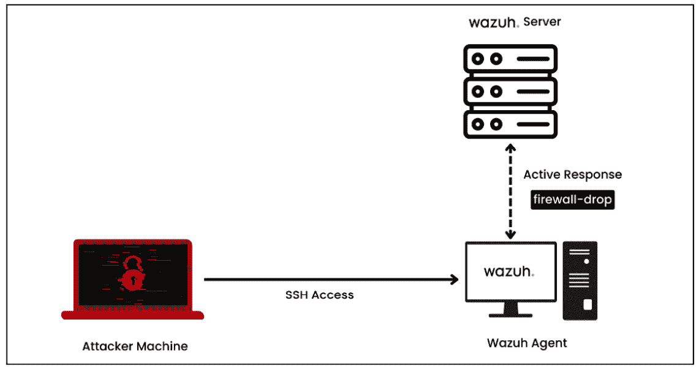
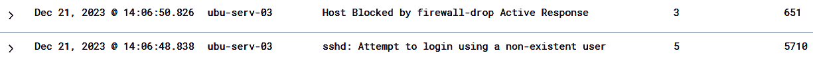

# 第五章：使用 Wazuh 进行事件响应

在不断变化的网络安全世界中，制定一个快速有效的响应计划来处理可能出现的任何安全事件至关重要。例如，一名销售员工打开了一个附有恶意文件的电子邮件，假冒是来自授权业务合作伙伴的邮件。这可能导致勒索病毒攻击，并使许多关键服务瘫痪。当发生此类事件时，迅速响应可以帮助最大程度地减少对网络的总体损害。高效的**事件响应**（**IR**）可以帮助企业迅速恢复正常运营，从而减少停机时间和相关费用。

在本章中，我们将学习如何利用 Wazuh 平台和其他 Wazuh 支持的第三方工具来构建一个有效的 IR 系统。我们将在本章中涵盖以下主题：

+   事件响应简介

+   什么是 Wazuh 主动响应？

+   阻止未经授权的 SSH 访问

+   隔离受感染的 Windows 机器

+   阻止 RDP 暴力破解攻击尝试

# 事件响应简介

事件响应（IR）是一个组织应对数据泄露、**分布式拒绝服务**（**DDoS**）和勒索病毒攻击等情况的过程。它的目的是立即识别攻击，减轻攻击的影响，控制攻击造成的任何损害，并修复原因，以减少未来攻击的风险。在实践中，IR 是指一系列可以用于检测、遏制和清除入侵的信息安全规则、流程和工具。让我们来讨论两个最流行的 IR 框架：**美国国家标准与技术研究院**（**NIST**）和 SANS，如下图所示。


图 5.1 – NIST 和 SANS IR

## 事件响应过程的不同方法

开发结构化 IR 过程有多种方法。目前最流行的两个 IR 框架和流程是：NIST 和 SANS。让我们详细了解它们。

### SANS 六步流程

SANS 研究所建议 IR 采用六个过程：*准备*、*识别*、*遏制*、*根除*、*恢复*和*经验教训*。

让我们详细讨论 SANS 的六步流程。SANS 将 IR 定义为六个阶段。当事件发生时，这六个过程会在一个循环中重复进行。步骤如下：

1.  系统和流程的准备

1.  事件识别

1.  控制攻击

1.  根除入侵

1.  事故恢复，包括系统恢复

1.  吸取经验教训并将反馈应用于下一阶段的规划

让我们一步一步理解每个过程：

1.  **准备阶段**：在准备的第一步中，你需要评估现有安全措施和规定的效率。这包括进行风险评估，以识别当前的漏洞以及资产的优先级。以下是一些重要的行动项：

    +   制定 IR 的政策和计划

    +   创建 IR 团队

    +   确定和分类重要资产

    +   获取事故检测和响应所需的工具和技术

1.  **事件识别**：重点是通过技术手段（如**入侵检测系统**（**IDSs**）、**安全事件和事件管理**（**SIEM**）、**终端检测与响应**（**EDR**）和日志分析）持续监控并识别潜在的安全问题。以下是一些重要步骤：

    +   持续监控安全事件的迹象

    +   使用基于主机和基于网络的 IDS

    +   收集并分析来自不同来源的日志

    +   利用威胁情报流

1.  **攻击遏制**：当发生事故时，这一阶段着重于立即隔离受损的系统，实施临时解决方案或变通方法，并更新访问限制和防火墙规则，以避免进一步的妥协。在此阶段，数字取证发挥着至关重要的作用。

1.  **入侵消除**：在这一阶段，识别并处理事故的根本原因。解决导致事件发生的漏洞，并修改政策和配置，以防止同样的事件再次发生。

1.  **事故恢复，包括系统恢复**：此阶段着重于恢复受影响系统的正常操作，验证其完整性，并确保事件已得到彻底解决。这还包括根据事件的经验教训分析和升级 IR 流程。

1.  **经验教训阶段**：在这一阶段，组织进行事件后回顾，记录事件、反应和经验教训。目的是制定 IR 计划和政策，并为 IR 团队成员提供额外的培训。

### NIST 四步程序

NIST 将 IR 定义为包含四个步骤：*准备*、*检测与分析*、*遏制、消除与恢复*、以及*事后活动*。让我们详细了解每个过程：

1.  **准备阶段**：NIST 框架强调准备是 IR 的关键组成部分，这一点与 SANS 框架类似。在此阶段，必须制定系统、程序和计划，以便为事故做好准备。组织应当具备以下准备措施，以便应对事故：

    +   精确的 IR 策略

    +   明确的角色和职责

    +   一个成功的沟通策略

    +   报告计划

    +   确定关键系统和资源

    +   定期测试和更新 IR 计划

1.  **检测与分析**：在这一阶段，公司识别并分析事件，以了解其范围和后果。在这一时刻，决定如何应对事件至关重要。为了有效地识别和分析事件，企业应具备以下内容：

    +   关注升级过程和机制

    +   及时检测和分析事件

1.  **遏制、消除和恢复**：NIST 框架中的遏制、消除和恢复阶段与 SANS 框架中的类似。为了遏制、消除并恢复事件，组织应具备以下内容：

    +   隔离受影响的系统

    +   消除事件的根本原因

    +   恢复正常运营

1.  **事件后活动**：在 NIST 系统中，事件后活动是最后一个阶段。组织在这一阶段评估其 IR 程序，并评估事件的影响。为了使组织能够检查和改进 IR 过程，以下内容应该到位：

    +   评估 IR 方法的程序

    +   记录所学经验的过程

    +   实施 IR 程序改进的计划

### NIST 和 SANS 程序的目标

NIST 和 SANS IR 框架的目标相似，都提供了一个有组织的方法来处理事件。然而，这两个框架在一些重要方面存在差异：

+   两个框架都强调在准备阶段拥有精确的 IR 计划、明确的角色和职责以及有效的沟通的重要性。另一方面，NIST 框架更加重视制定报告计划并识别关键系统和资产。

+   两个框架都侧重于事件的及时检测和分析，但 NIST 框架更多关注系统监控和升级协议，而 SANS 方法则优先考虑事件的分类和优先级排序。

在下一部分，我们将讨论自动化 IR 活动的重要性。

# 事件响应自动化

有效的 IR 是时间敏感的，需要团队尽快识别威胁并启动 **事件响应计划** (**IRP**)。安全团队每天会收到来自安全工具的数千条安全警报，因此很难手动分析事件或评估每一个安全工具生成的警报。这些限制通过自动化 IR 得到了应对。在 *第四章*，《使用 Shuffle 的安全自动化与协调》中，我们了解了 Shuffle SOAR 是如何通过创建工作流来使这一切成为可能，帮助安全团队进行自动化事件丰富、通过 TheHive 工具集成进行自动化可观察性分析、自动化 Wazuh 活动等。在本章中，我们将重点讨论如何使用 Wazuh 的内置功能 —— 主动响应来执行 IR。一般来说，IR 自动化可以帮助安全团队完成以下任务：

+   **立即遏制**：一旦发现受损系统，自动化 IR 系统应将其隔离，以防止威胁蔓延。

+   **动态防火墙规则**：针对特定风险，IR 自动化系统可以动态制定并部署防火墙规则，阻止恶意流量或隔离易受攻击的系统。

+   **自动化账户禁用**：在发生安全事件时，自动化响应步骤可以快速禁用被攻击的用户账户，从而阻止未来的未经授权访问。

+   **用户访问限制**：为了提高安全态势，IR 自动化系统可以实施访问控制，例如移除表现出可疑行为的用户或限制访问权限。

+   **GeoIP 阻断**：为了增强防御针对性攻击的能力，自动化 IR 可以使用 GeoIP 阻断规则，限制来自已知恶意活动地理区域的访问。

我们可以为自动化 IR 创建许多不同的使用场景。在接下来的部分中，我们将实际部署并测试一些使用 Wazuh 主动响应功能的自动化 IR。

# Wazuh 主动响应

Wazuh 平台的主要组件之一是主动响应，它使得能够自动响应安全事件和事故。安全分析师可以利用主动响应快速应对 Wazuh 系统识别的特定安全威胁或触发器。通过利用主动响应功能，Wazuh 使组织能够快速且积极地应对安全事件。通过 Wazuh 主动响应，您可以开发并执行自动化响应，处理大部分安全警报。这些响应可能包括执行自定义脚本、禁止 IP 地址或停用用户账户。自动化响应行动确保了高重要性的事件能够及时且一致地得到处理和缓解。当安全团队资源有限且需要决定首先如何响应时，这一点尤为重要。

在本节中，我们将涵盖以下主题：

+   主动响应脚本

+   配置活跃响应

+   Wazuh 活跃响应的工作原理

## 活跃响应脚本

Wazuh 提供了针对 Linux、Windows 和 macOS 系统的预构建活跃响应脚本。此外，它还帮助安全专业人员根据特定需求编写自定义活跃响应脚本。默认的活跃响应脚本存储在以下文件夹/目录中：

| **终端节点** | **位置（目录/文件夹）** |
| --- | --- |
| Windows | `C:\Program` `Files (x86)\ossec-agent\active-response\bin` |
| Linux | `/``var/ossec/active-response/bin` |
| macOS | `/``Library/ossec/active-response/bin` |

表 5.1 – 活跃响应脚本的位置

Wazuh 团队和整个社区在构建强大的活跃响应脚本方面做得非常出色。以下表格列出了一些流行的脚本：

| **操作系统** | **脚本** |
| --- | --- |
| Windows |

+   `Netsh.exe`：使用 `netsh` 阻止 IP 地址

+   `Restart-wazuh.exe`：重启 Wazuh 代理

+   `Route-null.exe`：将 IP 地址添加到空路由中

|

| Ubuntu |
| --- |

+   `firewall-drop`：将 IP 地址添加到 IP 表的拒绝列表

+   `start.sh`：重启 Wazuh 代理或管理器

+   `Route-null`：将 IP 地址添加到空路由中

|

表 5.2 – 默认活跃响应脚本列表

现在，让我们学习如何在受监控的终端节点上设置活跃响应。

## 配置活跃响应

活跃响应配置只需要在 Wazuh 服务器上完成。然而，服务器和代理都必须具备活跃响应脚本。Wazuh 执行活跃响应所需的三项内容如下：

+   活跃响应脚本

+   `<command>` 标签

+   `<active-response>` 标签

### 活跃响应脚本

Wazuh 管理器和代理已提供现成的活跃响应脚本，支持 Linux、macOS 和 Windows 终端节点。我们还可以创建自定义的活跃响应脚本，在特定规则 ID、规则组或警报级别触发时运行。所有默认的活跃响应脚本存储在 /var/ossec/active-response/bin 目录中。如果您创建自定义脚本，请确保将其保存在同一目录中。

### `<command>` 标签

`<command>` 标签指定在触发某个规则时应执行哪个脚本。现成的活跃响应脚本的 `<command>` 元素会自动包含在 Wazuh 服务器的 `/var/ossec/etc/ossec.conf` 实例类型中，因此不需要手动添加它们。让我分享一个 `<command>` 块的示例：

```
<command>
  <name>firewall-drop</name>
  <executable>firewall-drop</executable>
  <timeout_allowed>yes</timeout_allowed>
</command>
```

这里，我们有以下内容：

+   `<name>`：命令名称

+   `<executable>`：定义必须在触发时执行的脚本或可执行文件

+   `<timeout_allowed>`：在指定的持续时间后启用超时

### `<active-response>` 标签

在同一 Wazuh 服务器的 `/var/ossec/etc/ossec.conf` 文件中的 `<ossec_config>` 元素内插入 `<active-response>` 标签。`<active-response>` 块指定命令执行的位置和条件，如下所示：

```
<active-response>
    <command>firewall-drop</command>
    <location>local</location>
    <rules_id>5712</rules_id>
    <timeout>60</timeout>
  </active-response>
```

这里，我们有以下内容：

+   `<command>`：它提供了配置命令。在我们的例子中，我们使用了 `firewall-drop`。

+   `<location>`：表示命令必须执行的位置。我们有三种位置类型：`Local`、`Server` 或 `Defined-agent`。这些选项的目的是：

    +   `Server`：它在 Wazuh 服务器上执行脚本。

    +   `Defined-agent`：它在预定义的代理上执行脚本。我们需要 `<agent-id>` 标签来指定 Wazuh 代理的 ID。

## Wazuh 活跃响应的工作原理

这些活跃响应脚本（托管在 `/var/ossec/active-response/bin`）在监控端点上由 Wazuh 执行，以响应由特定规则 ID、级别或规则组触发的警报。您可以编写各种脚本来响应触发，但需要谨慎规划这些操作。规则和响应执行不当可能会让端点更容易受到攻击。

让我们来讨论一下 Wazuh 活跃响应是如何工作的：

1.  **事件生成**：Wazuh 代理将事件推送到管理器，Wazuh 管理器根据匹配的规则分析并触发警报。


图 5.2 – 事件生成

1.  `<active-response>` 块位于 Wazuh 服务器的 `<ossec_config>` 标签中，如果有匹配的安全警报，则会触发我们新创建的 `<active-response>`。

1.  `<command>` 块。Wazuh 代理将有默认的活跃响应脚本；但是，如果您想实施任何自定义活跃响应，您需要编写并保存代码在 Wazuh 代理中。

1.  `/var/ossec/active-response/bin` 位置。您可以通过检查 `/var/ossec/active-response/active-response.log` 中的日志来排查问题或验证 Wazuh 活跃响应。


图 5.3 – 在 Wazuh 代理上执行活跃响应

1.  **活跃响应警报**：一旦活跃响应脚本被执行，我们的 Wazuh 管理器将从 Wazuh 代理中获取该警报并在安全警报仪表板上显示给我们。


图 5.4 – 活跃响应日志

现在我们了解了 Wazuh 活跃响应的工作原理以及如何配置它，让我们来看看一些实际应用案例。

# 阻止未经授权的 SSH 访问

**SSH 攻击** 是通过互联网访问的服务器上最常见的攻击类型之一。自动化的机器人会定期监视互联网，寻找安全设置不充分的 SSH 服务器，这些机器人进行大部分的 SSH 攻击。由于攻击源通常分布在全球，没有任何一个国家占主导地位，因此它是一个全球性的网络安全威胁。成功的 SSH 攻击可能导致组织损失、数据泄露和服务器被攻陷。在本节中，我们将学习如何自动阻止未经授权的 SSH 访问受害者的计算机。

我们将了解以下内容：

+   实验室设置

+   设置活跃响应

+   测试

## 实验设置

在本实验设置中，我们需要三样东西：安装了 Wazuh 代理的 Ubuntu 服务器、一台攻击者机器（Kali Linux），以及我们的 Wazuh 服务器（我们仅为实验目的使用了虚拟机 OVA 文件）。实验的设计如下。



图 5.5 – 实验设置：使用 Wazuh 主动响应阻止未经授权的 SSH 访问

在本实验中，我们将使用 `firewall-drop` 脚本作为被监控的 Ubuntu 代理的默认主动响应脚本。接下来，我们需要修改主动响应脚本，以便在检测到未经授权的 SSH 连接时触发。

## 设置 Wazuh 主动响应

为了设置 Wazuh 平台以阻止未经授权的 SSH 访问尝试，我们需要在触发 Wazuh 规则 `5710` 后执行 firewall-drop 主动响应脚本。我们需要采取以下步骤来完成此任务。

### 修改 Wazuh 管理器上的主动响应

正如我们所了解的，`<active-response>` 会执行特定的 `<command>` 块。在我们的案例中，我们正在使用 firewall-drop 主动响应，它会执行 `firewall-drop` 命令。我们可以在位于 `/var/ossec/etc` 目录下的 `ossec.conf` 文件中找到 `<command>` 和 `<active-response>` 块。我们要确保在触发规则 `5710` 时执行 `<active-response>` 块。Wazuh 规则 `5710` 代表 `sshd: 尝试使用不存在的用户登录`。最终修改后的 `<command>` 和 `<active-response>` 块如下所示：

```
    <name>firewall-drop</name>
    <executable>firewall-drop</executable>
    <timeout_allowed>yes</timeout_allowed>
  </command>
  <active-response>
    <command>firewall-drop</command>
    <location>local</location>
    <rules_id>5710</rules_id>
    <timeout>60</timeout>
  </active-response>
```

这里，我们有以下内容：

+   `<executable>`：设置为 `firewall-drop`，表示该脚本位于 Wazuh 代理的 `/var/ossec/active-response/bin` 目录中

+   `<location>`：设置为 `local`，表示仅在生成警报的被监控端点上运行脚本

+   `<timeout>`：设置为 60 秒，表示主动响应行动将在 60 秒内有效

### 重启 Wazuh 管理器

为了让 Wazuh 管理器实现配置更改，我们需要重新启动管理器，如下所示：

```
systemctl restart wazuh-manager
```

## 测试

要测试未经授权的 SSH 暴力破解攻击，你可以登录到 Kali Linux 机器并运行以下提到的 `hydra` 工具命令：

```
hydra -l  voldemort -P <PASSWORD_TEXT_FILE>  <WAZUH_AGENT_IP> ssh
```

这里，我们有以下内容：

+   `hydra`：这是执行 SSH 暴力破解攻击时使用的工具名称。

+   `-l voldemort`：`-l` 标志用于指示 SSH 登录尝试的用户名。在此案例中，用户名是 `voldemort`。

+   `-P <PASSWORD_TEXT_FILE>`：`-P` 标志用于指定包含密码列表的文本文件的路径。

+   `<WAZUH_AGENT_IP>`：表示 Wazuh 代理的 IP 地址。

+   `SSH`：这指定了 `hydra` 将尝试攻击的服务。

一旦你按下 **Enter**，SSH 暴力破解攻击将如图所示执行：


图 5.6 – 发起 SSH 暴力破解攻击

## 可视化警报

现在，一旦执行了 SSH 暴力破解攻击，我们将看到两个警报：第一个是 SSH 未授权访问尝试，第二个是主动响应阻止用户访问。要可视化警报，请进入 Wazuh 管理器并导航到 **安全警报**。你将看到以下内容：



图 5.7 – SSH 暴力破解攻击后的 Wazuh 警报

让我们看一下第一个警报，**ssh: 尝试使用不存在的用户登录**，如图所示。


图 5.8 – Wazuh 警报 – ssh: 尝试使用不存在的用户登录

这里，我们有以下内容：

+   `5710`：这表示 Wazuh 规则 ID `5710`，**sshd: 尝试使用不存在的用户登录**。

+   `data.srcuser: voldemort`：这表示未经授权账户的用户名。在此案例中，它是 `voldemort`。

接下来，我们将查看由 Wazuh 规则 ID `5710` 触发的主动响应警报，如下图所示。


图 5.9 – 安全警报 – 主机被防火墙丢弃的主动响应阻止

这里，我们有以下内容：

+   `data.parameters.alert.data.srcuser: voldemort`：这表示被防火墙丢弃的主动响应脚本阻止的用户名。

在这个使用案例中，我们已经自动阻止了任何未经授权的 SSH 尝试访问运行 Wazuh 代理的 Ubuntu 服务器。在下一节中，我们将学习如何在 Windows 机器感染恶意软件后自动进行隔离。

# 感染后隔离 Windows 机器

隔离受损端点的过程是 SOC 中 IR 的重要组成部分。为了阻止威胁蔓延并造成进一步损害，必须立即将受感染的设备或系统从网络中隔离。同时，请记住，在决定隔离策略之前，评估妥协的严重性、资产的价值以及对业务的潜在影响是非常重要的；隔离并不是万能的解决方案。勒索病毒攻击是一个关键攻击场景，在其中隔离步骤至关重要。勒索病毒是一种恶意软件，它加密受害者的数据并要求支付解密密钥。它通常会在网络中快速传播，可能影响多个端点。在本节中，我们将隔离一台被恶意软件感染后的 Windows 机器。我们将利用 Wazuh 的主动响应功能创建一个自动外发规则，阻止所有外向流量。在本节中，我们将涵盖以下内容：

+   要求

+   方法

+   配置带有批处理文件和 PowerShell 文件的 Windows 机器

+   配置 Wazuh 管理器与 VirusTotal 和主动响应

+   测试

## 要求

在此用例中，我们将编写一个自定义的主动响应脚本来隔离一台 Windows 机器。为了演示此检测，我们需要以下内容：

+   一台安装了 Wazuh 代理的 Windows 10 或 11 机器

+   PowerShell 版本 7

+   VirusTotal 集成

+   一个 PowerShell 脚本来阻止所有外发流量

+   一个 Windows 批处理文件（主动响应脚本）用于触发 PowerShell 脚本

## VirusTotal 集成

在这一步中，我们将把 VirusTotal 平台与 Wazuh 管理器集成。VirusTotal 是一个在线平台，聚合了多种杀毒软件，能够检测恶意内容和误报。我们将涵盖以下三步：

1.  设置一个 VirusTotal 账户。

1.  将 VirusTotal 与 Wazuh 集成。

1.  创建一个文件完整性规则。

为完成所有三步，你可以按照*第二章*中*VirusTotal 集成*部分的描述操作，*恶意软件检测* *使用 Wazuh*。

## 使用批处理文件和 PowerShell 文件设置 Windows 机器

在这一步中，我们将设置 Windows 机器并使用主动响应脚本。我们将使用批处理文件创建一个主动响应脚本。接下来，为了创建一个 Windows 防火墙规则来阻止所有外发流量，我们需要一个 PowerShell 脚本。这个 PowerShell 脚本只有在批处理文件执行时才会触发。按照以下步骤完成整个过程。

### 安装 PowerShell 版本 7

登录到你的 Windows 10 或 11 机器，并从官方网站安装 PowerShell 版本 7：

[`learn.microsoft.com/en-us/powershell/scripting/install/installing-powershell-on-windows?view=powershell-7.3`](https://learn.microsoft.com/en-us/powershell/scripting/install/installing-powershell-on-windows?view=powershell-7.3)

下载并安装后，你可以在`C:\\Program Files\\PowerShell\\7\\"pwsh.ex`找到可执行文件。

### 编写批处理文件作为主动响应脚本

接下来，让我们先创建主动响应脚本。这个脚本将通过使用 Windows 批处理脚本来完成，然后触发 PowerShell 脚本以阻止所有来自 Windows 机器的外发流量。

在记事本中编写一个主动响应脚本，并将其保存在以下位置，文件名为`fw.cmd`：

```
C:\\Program Files (x86)\\ossec-agent\\active-response\\bin
@ECHO OFF
ECHO.
"C:\\Program Files\\PowerShell\\7\\"pwsh.exe -executionpolicy ByPass -File "C:\\Program Files (x86)\\ossec-agent\\active-response\\bin\\wfblock.ps1"
:Exit
```

### 编写 PowerShell 脚本

接下来，在记事本中编写一个 PowerShell 脚本，并将其保存在相同位置，文件名为`wfblock.ps1`：

```
C:\\Program Files (x86)\\ossec-agent\\active-response\\bin\\wfblock.ps1
#Author Rajneesh Gupta
# Set ConfirmPreference to None to automatically answer "No" to confirmation prompts
$ConfirmPreference = "None"
# Define the rule name
$ruleName = "BlockOutgoingTraffic"
# Check if the rule already exists
$existingRule = Get-NetFirewallRule | Where-Object {$_.Name -eq $ruleName}
if ($existingRule -eq $null) {
    # Create a new outbound block rule
    New-NetFirewallRule -DisplayName $ruleName -Direction Outbound -Action Block -Enabled True
    Write-Host "Outgoing traffic is now blocked."
} else {
    Write-Host "Outgoing traffic is already blocked."
}
```

在这里，我们有以下内容：

+   `$ruleName = "BlockOutgoingTraffic"`：它创建了一个`$ruleName`变量，值为`BlockOutgoingTraffic`。这将为 Windows 防火墙规则创建一个名称。

+   `$existingRule`：这将检查规则是否已经存在。如果不存在，则创建一个新的规则来阻止所有外发流量。

一旦设置了 Windows 机器配置，你需要设置 Wazuh 管理器，启用主动响应阻止和 Wazuh 规则。

## 在 Wazuh 管理器中的主动响应阻止

为了确保正确，我们需要在`/``var/ossec/etc/conf`文件下修改或添加`<command>`和`<active-response>`块：

```
<command>
    <name>windowsfirewall</name>
    <executable>fw.cmd</executable>
    <timeout_allowed>yes</timeout_allowed>
  </command>
```

在这里，确保 `<executable>` 标签有 `fw.cmd`，这与我们之前创建的 Windows 批处理文件相同。

其次，我们需要添加一个 `<active-response>` 块，如下所示：

```
  <active-response>
   <disabled>no</disabled>
   <command>windowsfirewall</command>
   <location>local</location>
   <rules_id>87105</rules_id>
   <timeout>60</timeout>
  </active-response>
```

在这里，我们有以下内容：

+   `<command>` 使用的是 Windows 防火墙命令。

+   `<rules_id>` 被选为 `87105`，以便当 VirusTotal 检测到任何恶意软件样本时触发。Wazuh 规则 `87105` 定义了与样本文件相关的 VirusTotal 警报，该样本文件已与定义数量的杀毒引擎进行比较。想了解更多信息，你可以查看 Wazuh 管理器 **Management** 标签下的 `0490-virustotal_rules.xml` 规则文件。

## 测试

为了测试这个用例，我们将使用来自 [eicar.org](http://eicar.org) 的恶意软件样本。你可以通过以下 URL 下载： [`www.eicar.org/download-anti-malware-testfile/`](https://www.eicar.org/download-anti-malware-testfile/)。

为确保 VirusTotal 检测到我们测试的恶意软件样本，你需要将其保存在 Windows 10/11 机器的文档文件夹中。一旦保存该文件，将执行文件完整性检查，并触发 VirusTotal 扫描该样本。你也可以在 Wazuh 仪表盘上找到相应的警报。


图 5.10 – 可视化 Wazuh 管理器上的 VirusTotal 警报

让我们更仔细地查看一下 `full.log` 和规则描述，如下所示。


图 5.11 – 可视化关于 eicar.com(1) 文件的 Wazuh 警报

我们还可以检查第二个警报，`data.virustotal.source.file` 数据字段和规则 ID `87105`。


图 5.12 – 展开 Wazuh 管理器上的 VirusTotal 安全警报

现在，我们的 `<active-response>` 块将被执行，因为它与规则 ID `87105` 关联，而该规则属于 VirusTotal 警报，我们的命令 `fw.cmd` 将在 Windows 10 机器上执行。这个 `fw.cmd` 主动响应脚本将触发一个 PowerShell 脚本，并阻止所有外出流量，正如你在下面的图中看到的那样。


图 5.13 – Windows 机器上新创建的 BlockOutgoingTraffic 规则的状态

所以，我们已经成功测试了当我们的 Windows 机器被恶意软件攻击时，Wazuh 的主动响应如何自动阻止所有外出流量。这是通过使用我们自定义的 PowerShell 脚本在 Windows 防火墙服务中创建一个安全规则实现的。在接下来的章节中，我们将使用主动响应来阻止 RDP 暴力破解攻击尝试。

# 阻止 RDP 暴力破解攻击

根据 Sophos 的说法，在 2023 年上半年，攻击者在 95%的攻击中利用了**远程桌面协议**（**RDP**），较 2023 年增长了 88%。RDP 是微软开发的专有协议，允许用户通过网络连接远程连接并操作另一台计算机或设备。攻击者使用自动化软件尝试许多登录和密码组合，以便通过 RDP 获取未授权的访问权限。缓解这些风险需要主动采取措施，以及快速行动阻止试图进行这些攻击的恶意 IP 地址。在本节中，我们将利用 Wazuh 的主动响应来阻止针对 RDP 暴力破解攻击的攻击者 IP 地址。我们将涵盖以下几点：

+   要求

+   配置带有主动响应脚本的 Windows 代理

+   配置带有规则和主动响应脚本的 Wazuh 服务器

+   测试

+   可视化

## 要求

在这个用例中，我们将使用 Windows 机器上默认的 Wazuh 主动响应脚本`netsh.exe`，该脚本位于`C:\Program Files (x86)\ossec-agent\active-response\bin`。我们无需为此创建任何自定义脚本。为了使整个用例生效，我们将使用以下内容：

+   Windows 10 或 Windows Server

+   Kali Linux 进行测试

## 配置带有主动响应脚本的 Windows 代理

在此步骤中，我们需要将`netsh`命令和`netsh`主动响应阻止添加到 Wazuh 代理的`C:\\Program Files (``x86)\\ossec-agent\\ossec.conf`文件中：

```
<command>
    <name>netsh</name>
    <executable>netsh.exe</executable>
    <timeout_allowed>yes</timeout_allowed>
  </command>
<active-response>
    <disabled>no</disabled>
    <command>netsh</command>
    <location>local</location>
    <rules_id>100100</rules_id>
  </active-response>
```

这里，我们有以下内容：

+   `netsh.exe`：这是位于`C:\Program Files (x86)\ossec-agent\active-response\bin`的网络 Shell 脚本。

+   `<rules_id>`：这表示当规则`100100`被触发时，主动响应`netsh`脚本将被执行。在下一步中，我们将创建规则`100100`，以检测 Wazuh 服务器上的 RDP 暴力破解攻击。

保存`ossec.conf`文件并重启 Wazuh 代理。


图 5.14 – 在 Windows Server 上重启 Wazuh 代理

## 配置带有暴力破解攻击规则和主动响应脚本的 Wazuh 服务器

我们希望 Wazuh 在暴力破解攻击时执行主动响应`netsh`脚本，因此，我们将编写一个 Wazuh 规则来检测 RDP 登录尝试，设置`level="10"`，`frequency="3"`，和`timeframe="120"`。当在 120 秒的时间范围内检测到三次失败的登录尝试时，此规则将被触发。以下规则块需要添加到位于`/var/ossec/etc`目录下的`local_rules.xml`文件中：

```
<group name="rdp">
  <rule id="100100" level="10" frequency="3" timeframe="120">
    <if_matched_sid>60122</if_matched_sid>
    <description>Possible RDP attack: 3 failed logins in a short period of time</description>
  </rule>
</group>
```

这里，我们有以下内容：

+   `<if_matched_sid>`：此选项类似于`<if_sid>`，但只有在某一时间段内触发了规则 ID 时才会匹配。由于我们希望 Wazuh 在 120 秒的时间范围内检测到三次相同的警报，这对于我们的需求是特定的。

+   规则 ID `60122` 在 `<if_matched_sid>` 下：此规则用于跟踪与登录失败相关的多个 Windows 事件 ID。要了解更多关于此规则及其父规则集的信息，请访问此页面：[`github.com/wazuh/wazuh-ruleset/blob/master/rules/0580-win-security_rules.xml`](https://github.com/wazuh/wazuh-ruleset/blob/master/rules/0580-win-security_rules.xml)。

接下来，将相同的 `netsh` 命令和主动响应块添加到 Wazuh 服务器：

```
C:\\Program Files (x86)\\ossec-agent\\ossec.conf file
<command>
    <name>netsh</name>
    <executable>netsh.exe</executable>
    <timeout_allowed>yes</timeout_allowed>
  </command>
<active-response>
    <disabled>no</disabled>
    <command>netsh</command>
    <location>local</location>
    <rules_id>100100</rules_id>
  </active-response>
```

保存 `ossec.conf` 文件并重启 Wazuh 管理器：

```
systemctl restart wazuh-manager
```

## 测试

为了模拟此攻击，我们将使用 hydra 工具发起 RDP 暴力破解攻击。Hydra 工具在 Kali Linux 中预装；但是，如果您希望在其他平台上手动安装它，您可以通过以下链接下载：[`github.com/vanhauser-thc/thc-hydra`](https://github.com/vanhauser-thc/thc-hydra)。您可以运行以下命令，在 Windows 服务器上执行 RDP 暴力破解攻击：

```
hydra -l roger -P pass.txt 192.168.29.77 rdp
```

这里，我们有以下内容：

+   `-l roger`：此参数指定 Hydra 在暴力破解攻击中使用的用户名 `roger`。将 `roger` 更改为您想要攻击的用户名。

+   `-P pass.txt`：表示 `pass.txt` 密码文件，该文件包含密码列表。Hydra 将通过循环此文件反复尝试每个密码以尝试登录目标用户名。请将您的密码列表实际文件名和目录替换 `pass.txt`。

+   `192.168.29.77`：表示目标系统的 IP 地址，RDP 服务正在运行。将其替换为您要攻击的实际 IP 地址。

+   `rdp`：表示要攻击的服务协议，在本例中是 RDP。Hydra 将尝试使用密码列表和提供的用户名登录以访问 RDP 服务。

## 可视化警报

您可以在 Wazuh 仪表板上查看警报。转到 `100100`。如以下截图所示，规则 `100100` 已从我们的 IP 地址为 `192.168.29.77` 的 Windows 服务器触发。


图 5.15 – Wazuh 警报显示 RDP 暴力破解攻击

立即，Wazuh 主动响应 `Netsh` 脚本在 Windows 服务器上激活。


图 5.16 – Wazuh 警报显示 netsh 主动响应

要测试攻击者机器是否被阻止，您可以尝试使用远程桌面客户端发起 RDP 会话；它应该无法连接并显示错误，如图所示。


图 5.17 – 远程桌面连接失败

通过这个，我们学习了如何利用 Wazuh 的主动响应功能来阻止 RDP 攻击尝试。

# 总结

在本章中，我们了解了 IR 阶段、Wazuh 的主动响应能力以及一些重要的使用案例。我们学习了 Wazuh 的主动响应模块如何主动阻止未经授权的 SSH 和 RDP 访问尝试。此外，我们还了解了 Wazuh 在检测到恶意软件后，如何迅速隔离感染的 Windows 计算机。

在下一章，我们将学习如何使用 Wazuh 模块进行威胁狩猎。我们将了解日志数据分析在 Wazuh 中的重要性，以便更好地进行威胁调查和狩猎。我们还将利用 MITRE ATT&CK 框架来简化我们的威胁狩猎过程。
