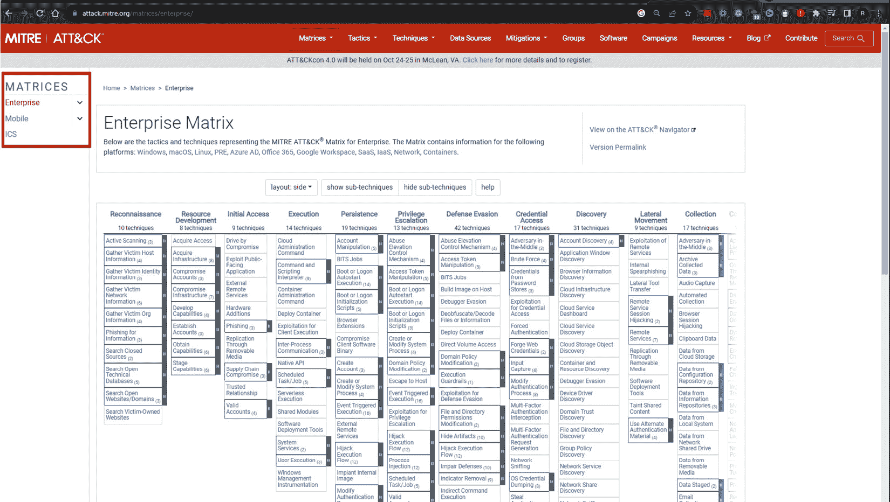
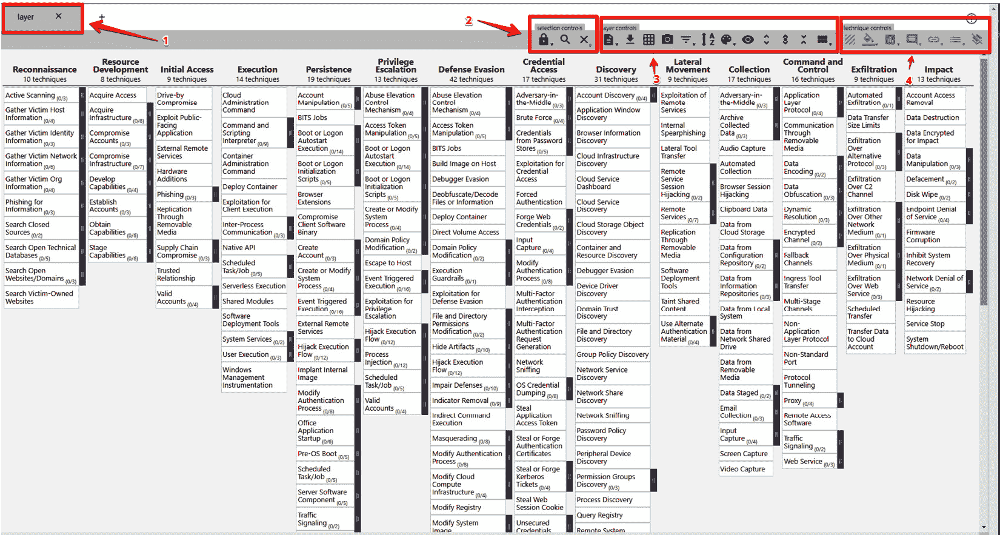
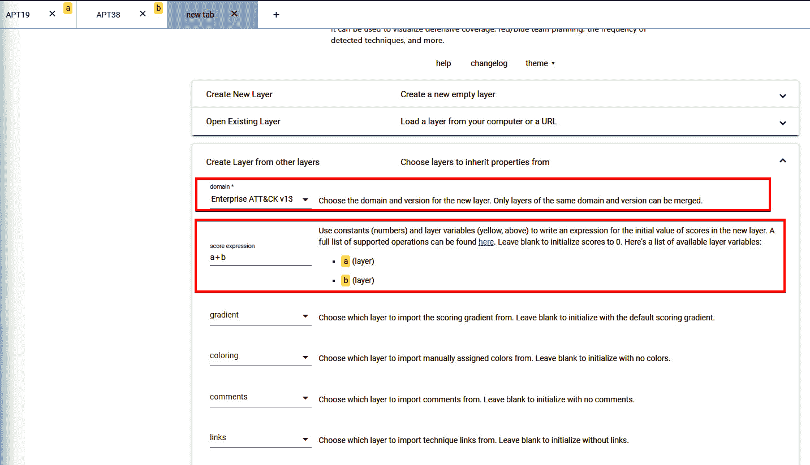

# 第六章：使用 Wazuh 进行威胁狩猎

大约 80%的威胁可以通过一级和二级**安全运营中心**(**SOC**)分析师以及自动化安全工具的帮助得到缓解；剩下的 20%则需要你关注。威胁狩猎是一个重要的主动安全方法，用于发现那些常规安全措施难以察觉的威胁和安全漏洞。威胁狩猎通过使用先进的分析、威胁情报和人工专业知识，超越自动化检测，积极寻找、发现并修复组织网络中可能隐藏的安全漏洞或威胁。通过主动防范，安全团队可以在复杂的威胁发生之前发现并阻止它们。这减少了攻击者在网络上停留的时间，并防止了潜在的入侵。在本章中，我们将学习 Wazuh 如何帮助安全团队主动检测高级威胁。Wazuh 通过分析大量日志，提供组织安全特性的广泛概述，并提供实时监控、自定义高级规则集、威胁情报、MITRE ATT&CK 映射等功能。

在本章中，我们将涵盖以下内容：

+   使用 Wazuh 进行主动威胁狩猎

+   用于威胁狩猎的日志数据分析

+   MITRE ATT&CK 与 Wazuh 的映射

+   使用 Osquery 进行威胁狩猎

+   命令监控

# 使用 Wazuh 进行主动威胁狩猎

组织可以使用 Wazuh 进行主动威胁狩猎，这是一种安全实践，帮助它们在威胁变得严重之前，发现并报告潜在的安全威胁。例如，这可以表现为分析网络流量模式，以检测可能表明潜在网络威胁的异常行为。相比之下，反应性网络安全防御的主要目标是在威胁被识别或事件发生后进行反应。例如，杀毒软件会检测并消除已知的恶意软件，防火墙根据安全团队预定义的规则，阻止恶意流量进入网络。

在进行主动威胁狩猎时，你需要在损害发生之前，寻找网络中的潜在风险或漏洞。与其等待警报或已知的特征码，我们可以通过使用 Wazuh 进行实时日志分析，跨多个平台相关联事件，检测潜在的安全问题，并结合第三方工具以增强事件可见性和检测能力，进行威胁狩猎。

在本节中，我们将涵盖以下内容：

+   威胁狩猎方法

+   威胁狩猎步骤

+   如何使用 Wazuh 进行主动威胁狩猎

## 威胁狩猎方法

当威胁狩猎人员调查系统时，他们假设攻击者已经在系统内，并寻找可能表明有坏事发生的异常行为。在进行主动威胁狩猎时，通常第一步是将寻找威胁的工作分为三大类：

+   **基于假设的调查**：当威胁猎手在攻击信息池中发现新威胁时，他们通常会开始基于假设的调查。这为他们提供了关于攻击者正在使用的最新**战术、技术和程序**（**TTPs**）的信息。一旦威胁猎手发现了新的 TTP，他们会检查攻击者的独特行为是否在自己领域内常见。为此，我们的 Wazuh 平台需要配置以下内容：

    +   文件完整性监控规则，以检测任何未经授权的更改

    +   启用 rootkit 行为检测

    +   从不同的安全解决方案（如杀毒软件、**端点检测与响应**（**EDR**）和电子邮件安全）收集日志

    +   漏洞检测

    +   命令监控

+   **基于情报的狩猎**：基于情报的狩猎是一种主动寻找威胁的方法，旨在响应来自不同情报源的信息。IOC（指标）、IP 地址、哈希值和域名是你可以利用的一些威胁情报源。为了实现这一目标，Wazuh 应集成以下内容：

    +   第三方威胁情报工具，如 VirusTotal 或 AbuseIPDB

    +   MISP

    +   OpenCTI

    来自**计算机应急响应团队**（**CERTs**）或**信息共享与分析中心**（**ISACs**）的主机或网络数据可以让你导出自动化警报或传达关于其他企业中新威胁的关键信息。这些通常是付费服务，但它们提供了高度筛选的信息。

+   使用**攻击指标**（**IOA**）进行调查：这是威胁狩猎中最流行和广泛使用的方法之一。这个方法很简单：“并非每个威胁团体都会针对你”，或者即使他们针对你，为什么你应该优先处理他们。第一步是通过使用 MITRE 开发的免费的检测手册**ATT&CK Navigator**，根据威胁团体的目标地点、行业和软件来识别威胁团体。这个在线平台由 MITRE 建立，MITRE 是一家非营利组织，运营**联邦资助研究与发展中心**（**FFRDCs**）在美国。

## 威胁狩猎步骤

主动的威胁狩猎方法包括三个阶段：*初始触发阶段*、*调查阶段*和*解决阶段*（或者，在某些情况下，作为沟通或行动计划的一部分，向其他团队进行升级）。让我们更详细地探讨威胁狩猎过程中的这三个步骤：

1.  **选择正确的触发器**

    +   威胁狩猎通常是一项深入的工作。威胁猎手收集环境数据，并就潜在威胁提出假设。

    +   接下来，威胁猎手选择一个触发器进行进一步调查。这可能是一个特定的系统、网络的某个区域、由于公开漏洞或补丁而产生的假设、对零日漏洞的了解、安全数据集中的异常行为，或来自公司其他部门的请求。

1.  **调查**

    +   在识别出触发条件后，狩猎仍然专注于主动寻找支持或反驳理论威胁的异常情况。

    +   威胁狩猎者假设“*我的网络被新型恶意软件或漏洞攻击了*”，并进行逆向工程以验证这一假设。

    +   威胁狩猎者使用各种工具帮助分析来自多设备和安全控制的日志，包括服务器日志、Sysmon、杀毒软件日志和垃圾邮件过滤日志。

1.  **解决** **与报告**

    在调查阶段，威胁狩猎者收集关键数据，并回答以下问题：

    +   *谁？* – 即，可能涉及内部威胁

    +   *什么？* – 按时间顺序排列的事件时间轴

    +   *哪里？* – 受影响系统的详细信息，包括计算机和服务器

    +   *为什么？* – 缺乏安全控制、规划不当、人为错误、外部攻击等

    这些信息会在解决阶段传递给其他团队和工具，以便它们作出响应、优先处理、分析或保留数据以供将来使用。

## 使用 Wazuh 进行主动威胁狩猎

使用 Wazuh 进行主动威胁狩猎意味着在组织环境中持续而系统地搜索潜在安全威胁的指示。为了进行威胁狩猎，安全团队可以利用 Wazuh 进行全面的日志数据分析、与 MITRE ATT&CK 的无缝集成，以及使用 Osquery（一种端点分析工具）和定期监控。让我们详细介绍这些 Wazuh 功能：

+   **日志数据分析**：当分析由组织内各种设备和系统生成的日志数据时，威胁检测会更加有效。Wazuh 作为一个集中式日志管理与分析平台，接收并审查来自多个来源的数据，包括端点、服务器和网络设备。为了对网络中每个设备的日志进行分析，你需要为每个设备配置解码器。Wazuh 使用解码器从来自不同来源的日志数据中提取有意义的信息。

+   **MITRE ATT&CK 映射**：国际知名的 MITRE **对抗战术、技术与常识**（**ATT&CK**）框架提供了关于对手战术和技术的全面、最新的知识库。Wazuh 使用 MITRE ATT&CK 将观察到的安全事件映射到特定的 ATT&CK 方法，从而提升威胁狩猎能力。安全团队可以通过这种映射更好地了解潜在对手的策略。

+   **Osquery 集成**：Osquery 是一个开源的跨平台端点安全框架，使组织能够与端点设备进行通信并查询获取重要的威胁狩猎数据。Wazuh 和 Osquery 结合，为组织的端点提供全面的端点可视化和实时查询功能。

+   **命令监控**：您可以使用 Wazuh 的命令跟踪功能来跟踪某些命令的输出，并将该输出视为日志内容。命令监控可用于威胁狩猎，监视系统的许多属性，如磁盘空间使用情况、负载平均值、网络监听器的变化，以及已运行进程的状态。

让我们深入了解 Wazuh 的日志数据分析功能。Wazuh 的这一能力帮助我们通过分析大量日志信息进行手动威胁狩猎。

# 威胁狩猎的日志数据分析

**日志数据分析**是威胁狩猎的关键组成部分。它涉及检查和检索由各种系统、应用程序和设备生成的日志文件中的有用信息。传统的安全方法可能会错过可疑的模式或事件，但威胁狩猎人员可以通过持续监控和分析日志来发现这些异常。威胁狩猎人员通过检查日志数据，寻找特定的**妥协指标**（**IOCs**）。这些 IOCs 可能是域名、IP 地址、文件哈希或其他与已知安全风险相关的标识符。问题是并非所有日志都是相同的。根据您希望收集的日志来源，您可能需要创建定制的 Wazuh 解码器。在本节中，我们将回顾以下内容：

+   Wazuh 解码器

+   构建解码器

+   日志收集

+   日志数据分析

## Wazuh 解码器

**Wazuh 解码器**是一个组件，用于解释和提取原始日志数据中的有用信息。它从许多来源（如操作系统、应用程序和网络设备）生成的日志文件或事件中收集数据，并将其转换为标准化格式，便于分析和关联。我们不必每次接入新终端时都创建解码器，因为 Wazuh 提供了适用于 Linux、Windows 和 macOS 等来源的预构建解码器。

Wazuh 解码器通常以 XML 文件形式提供，并存储在 `/var/ossec/etc/decoders` 目录下。每个解码器针对特定的日志来源量身定制，例如，`0025-apache_decoders.xml` 适用于 Apache，`0100-fortigate_decoders.xml` 适用于 FortiGate 防火墙，等等。这些解码器指定了如何解析日志数据，提取相关信息（如时间戳、IP 地址、用户 ID 等），并将其转换为适合安全分析和威胁狩猎的结构化格式。Wazuh 解码器具有极高的可定制性，允许用户根据需要为特定日志来源创建自定义解码器。

## 构建解码器

创建自定义 Wazuh 解码器从创建一个 XML 文件开始，该文件解释如何解码和解析来自特定源的日志数据。如果你想构建自定义解码器，你需要首先查看源的示例事件。例如，我们可以查看 GitHub 上提供的 Check Point 防火墙日志，位于 [`github.com/wazuh/wazuh-ruleset/blob/master/decoders/0050-checkpoint_decoders.xml`](https://github.com/wazuh/wazuh-ruleset/blob/master/decoders/0050-checkpoint_decoders.xml)：

```
Jan 21 15:15:45 myCP Checkpoint: 21Jan2019 15:15:45 monitor 10.0.10.1 <bond0 Protection Name:Header Rejection;Severity:4;Confidence Level:4;protection_id:HttpHeaderRejection;SmartDefense Profile:SU2_Protection;Performance Impact:2;Industry Reference:CVE-2002-0032, CAN-2003-0237, CAN-2002-0254, CVE-2002-0155, CAN-2003-0397, CAN-2002-0314;Protection Type:protection;Signature Info:^User-Agent[^I ]*:[^I ]*.*esb|ESB;Update Version:634182243;rule:26;rule_uid:{405CB782-3274-4D7F-8AAA-4FB24CE726A0};resource:<http://dnl-02.geo.kaspersky.com/bases/av/kdb/i386/kdb-i386-1211g.xml.klz;reject_id:5accf7c4-10053-c00080a-c0000003;web_client_type:Other:> *BcfBAAAAgCCAAEFBAAwQfKXVzrzGvyfPESboPxow0mHhxRLAXAQAAIAAKAA=;Attack Info:WSE0100001 header rejection pattern found in request;attack:Header Rejection;src:10.20.10.1;dst:1.1.1.1;proto:6;proxy_src_ip:10.10.10.1;product:SmartDefense;service:80;s_port:51642;FollowUp:Not Followed;product_family:Network
```

一旦你获得了日志，注意其格式。将日志分为两部分：*预匹配*和*自定义匹配*。`Jan 21 15:15:45 myCP Checkpoint: 21Jan2019 15:15:45`。其次，**自定义匹配**部分每次都会有所不同。我们也可以分别称它们为*父解码器*和*子解码器*。我们先从编写预匹配解码器开始。

### 父解码器

在创建 Wazuh 解码器时，最好先创建一个父解码器，再创建子解码器，以简化和组织文件中的解码器规则。父解码器通常包括日期、时间和设备名称，而子解码器包含特定的模式匹配。为了从日志中提取相关信息，我们需要使用正则表达式。正则表达式是定义搜索的一系列字符。父解码器使用以下 `<prematch>` 标签定义：

```
<decoder name="checkpoint-syslog">
  <program_name>^Checkpoint</program_name>
  <prematch>^\\s*\\S+ \\d\\d:\\d\\d:\\d\\d </prematch>
</decoder>
```

在前面的正则表达式中，我们可以看到以下内容：

+   `\d` 操作符用于表示时间字段中的数字字符，从 0 到 9。

+   `\s` 操作符用于表示字母字符，从 `a` 到 `z`。

### 子解码器

以下解码器规则已经存在于 Wazuh 解码器规则集中，文件名为 `0050-checkpoint_decoders.xml`。为了从 Check Point 防火墙日志中提取更多信息，必须创建多个解码器规则。这些规则用于提取源 IP 地址、目标 IP 地址、源端口、目标端口和服务等项目。所有规则必须以父解码器“`checkpoint-syslog`”开头：

```
<decoder name="checkpoint-syslog-fw">
  <parent>checkpoint-syslog</parent>
  <type>firewall</type>
  <prematch offset="after_parent">^drop|^accept|^reject</prematch>
  <regex offset="after_parent">^(\\w+)\\s+\\S+ \\p\\S+ rule:\\.+</regex>
  <regex>src: (\\S+); dst: (\\S+); proto: (\\S+);</regex>
  <order>action,srcip,dstip,protocol</order>
</decoder>
<decoder name="checkpoint-syslog-fw">
  <parent>checkpoint-syslog</parent>
  <type>firewall</type>
  <regex offset="after_regex">service: (\\d+); s_port: (\\d+);</regex>
  <order>dstport,srcport</order>
</decoder>
<decoder name="checkpoint-syslog-ids">
  <parent>checkpoint-syslog</parent>
  <type>ids</type>
  <prematch offset="after_parent">^monitor|^drop</prematch>
  <regex offset="after_prematch">attack:\\s*(\\.+);\\s*</regex>
  <regex>src:\\s*(\\S+);\\s*dst:\\s*(\\S+);\\s*</regex>
  <regex>proto:\\s*(\\S+);</regex>
  <order>extra_data, srcip, dstip, protocol</order>
  <fts>name, extra_data, srcip, dstip</fts>
  <ftscomment>First time Checkpoint rule fired.</ftscomment>
</decoder>
```

在构建解码器时，你可以通过运行 `/var/ossec/bin/wazuh-logtest` 来获得 Wazuh 内置解码器验证器模块的帮助。你也可以在 Wazuh 仪表板上进行此测试，通过导航到 **规则集测试**，在 **工具** 部分下。执行该模块后，你需要输入原始的 Check Point 日志：


图 6.1 – 执行 Wazuh 的解码器验证器

在前面的截图中，我们可以看到以下内容：

+   第一阶段的输出显示了预解码过程，它只是简单地接收日志并处理它。

+   第二阶段和第三阶段的输出显示，解码器名称`checkpoint-syslog-ids`已正确检测，并且我们收到了信息，如`srcip`、`dstip`、协议和`extra_data`。

创建完父和子解码器后，我们需要创建一个 Wazuh 规则，一旦匹配就触发警报。

## 创建 Wazuh 规则

Wazuh 规则检查提取的解码器字段以确定接收到的消息类型。匹配的最终规则确定是否创建警报，以及其级别和类别组。对于触发 Check Point FW 解码器的任何事件，以下分组规则将发出警报：

```
<group name="checkpoint-syslog,">
  <!--Generic rule -->
  <rule "d="64"00" lev"l""3">
    <decoded_as>checkpoint-syslog</decoded_as>
    <description>Checkpoint $(type) event</description>
  </rule>
```

在上述代码中，`<decoded_as>` 表示解码器的名称。

好的，我们已经学会了创建解码器和相应的 Wazuh 规则，以 Check Point 防火墙日志为例。一旦有了解码器，您可以创建 Wazuh 规则。如果与 Wazuh 管理器接收的任何事件匹配，它将在仪表板上生成安全警报。要进行全面的威胁猎杀程序，所有类型的事件都必须在 Wazuh 平台上可用，因此构建自定义解码器也应成为此过程的一部分。在接下来的部分中，我们将学习 Wazuh 如何收集和分类不同类型的日志数据。

## 日志数据收集

**日志数据收集** 意味着从不同网络源获取日志并将它们整合在一起。对于威胁猎手来说，从各个端点、服务器、安全设备等收集所有类型的日志是至关重要的。Wazuh 索引器负责日志分析，因为它存储并索引由 Wazuh 服务器生成的警报。默认情况下，Wazuh 将提供由 Wazuh 规则触发的警报。然而，我们需要访问所有事件以进行更好的威胁猎杀实践。我们将学习如何提取所有事件并在 Wazuh 服务器上存档。让我们首先讨论用于存储事件类型的不同索引。

### wazuh-alerts

这是存储 Wazuh 服务器生成的警报的默认索引。当规则优先级高的事件触发正常事件时，我们会看到警报，并将其存储在 `wazuh-alerts` 索引中。

所有信息都在 `wazuh-alerts` 索引中。要查看 `wazuh-alerts` 索引，请导航到将选中的 `wazuh-alerts` 索引。


图 6.2 – wazuh-alerts 索引

### wazuh-archives

此索引跟踪来自 Wazuh 服务器的所有事件，即使它们不触发警报。`wazuh-archives` 索引存储日志并允许查询，提供有关监视端点上发生情况的更多信息。`wazuh-archives` 默认情况下已禁用，以节省 Wazuh 服务器的空间。请记住，要运行有效的威胁猎手程序，启用此索引至关重要。请按照以下步骤打开它，并一旦配置完成，将创建两个新文件来存储所有事件，即 `/var/ossec/logs/archives/archives.log` 和 `/var/ossec/logs/archives/archives.log`：

1.  `/var/ossec/etc/ossec.conf` 文件中，将 `<logall>` 和 `<logall_json>` 的值设置为 `yes`：

    ```
    <ossec_config>
      <global>
        <jsonout_output>yes</jsonout_output>
        <alerts_log>yes</alerts_log>
        <logall>yes</logall>
        <logall_json>yes</logall_json>
    </ossec_config>
    ```

1.  **重启 Wazuh 管理器**：为了使 Wazuh 管理器生效你的更改，你需要使用以下命令重启它：

    ```
    filebeat service by editing /etc/filebeat/filebeat.yml and changing archives: value to true.Next, restart the `filebeat` service as follows:

    ```

    wazuh-archives 索引，转到 Stack 管理 > 索引模式，然后点击创建索引模式。

    ```

    ```


图 6.3 – 创建索引模式

1.  `wazuh-archives-*` 索引模式以匹配所有可用索引，如下截图所示，然后点击 **下一步**。


图 6.4 – 定义索引模式

1.  **时间** **字段**框中的`timestamp`。


图 6.5 – 设置主要时间字段

1.  **查看仪表盘**：现在，要查看仪表盘上的事件，导航到 **OpenSearch Dashboards** 下的 **发现**。


图 6.6 – 在 OpenSearch Dashboards 菜单下发现

确保你选择了 **wazuh-archives** 索引，最后，我们获得了所有事件。


图 6.7 – 选择 wazuh-archives

### wazuh-monitoring

此索引跟踪有关 Wazuh 代理状态随时间变化的信息。Wazuh 代理的状态可能是 *待处理*、*活动*、*断开连接* 或 *从未连接*。这些信息对于查找未向仪表盘报告的 Wazuh 代理非常有帮助，这些代理因多种原因需要进一步调查。如果你想查看所有来自 `wazuh-monitoring` 索引的事件，请导航到 **发现**，然后将索引更改为 **wazuh-monitoring**。


图 6.8 – 选择 wazuh-monitoring

你在 **Agents** 标签下看到的所有内容都来自 wazuh-monitoring 索引。


图 6.9 – Wazuh Agents 标签

### wazuh-statistics

此索引包含有关 Wazuh 服务器整体性能的信息。这些信息对于确保 Wazuh 服务器以最佳方式使用计算资源非常重要。

## 日志数据分析

日志数据分析是威胁狩猎的重要组成部分，因为它可以提供大量有关系统和网络活动的信息。这些信息帮助你早期发现安全威胁，识别异常活动，并帮助你找到 IOCs。还要注意，日志收集和日志分析在事件响应、法医调查、安全合规性等多个领域也至关重要。让我们来做一些关于 `wazuh-archives` 日志事件的实时测试。我们将使用 APT 模拟器在 Windows Server 2012 上运行一些著名的 MITRE ATT&CK 技巧，然后进行一些日志数据分析。让我们开始吧：

先决条件

你需要 Windows Server 2012 或更高版本。

1.  **Sysmon 安装**：在第一步中，我们需要安装 Sysmon 并将其与 Wazuh 集成。请参考*第二章*《使用 Wazuh 检测恶意软件》部分，特别是“将 Sysmon 集成以检测无文件恶意软件”一节，因为它涵盖了在 Windows 机器上安装 Sysmon 的逐步过程。

1.  `APTSimulator-0.9.4`文件夹，并执行`APTSimulator.bat`文件。

    类型`0`。这将运行包括收集、指挥与控制、凭证访问、规避防御、发现、执行、横向移动、持久性和权限提升在内的所有测试。

1.  `agent.id`。在我的例子中，`agent.id`是`002`。


图 6.10 – 可视化 APT 警报

我们已经学会了创建自定义解码器，涵盖了不同的 Wazuh 日志数据索引，并分析了日志数据。在下一节中，我们将探讨 MITRE ATT&CK 框架，以及 Wazuh 如何映射 MITRE ATT&CK 的战术和技术。

# MITRE ATT&CK 映射

我们不能通过假设全世界的人都在针对我们来开始威胁狩猎。我们需要一种基于目标威胁行为者或威胁活动的方式。这正是 Wazuh 和 MITRE ATT&CK 能够派上用场的地方。Wazuh 可以收集并触发任何警报，但对于威胁狩猎，我们需要集中关注对我们业务相关的高优先级威胁，并需要将其映射到我们的 Wazuh 规则。MITRE ATT&CK 框架帮助威胁狩猎人员专注于这些威胁，而 Wazuh 则允许我们将这些威胁行为者的每项技术映射到 Wazuh 规则。这样，威胁狩猎人员可以集中注意力，节省大量时间。在这一节中，我们将涵盖以下主题：

+   什么是 MITRE ATT&CK？

+   ATT&CK 框架

+   优先考虑对手的技术

+   MITRE ATT&CK 映射

## 什么是 MITRE ATT&CK？

**MITRE ATT&CK**框架是由 MITRE 公司开发的，旨在提供一个统一的分类法来分析和归类网络威胁。它提供了一个共同的语言，安全操作中的防御和进攻团队都可以利用它来提升他们的能力。

### 战术、技术和流程（TTPs）

**MITRE ATT&CK 框架**用于在安全操作过程中对网络攻击者的**战术、方法和流程**（**TTPs**）进行分类和理解。TTPs 用于组织威胁情报、威胁检测、构建有效的事件响应、进行安全漏洞分析和威胁狩猎。让我们首先了解 TTP 概念的内容：

+   **战术**：这些是攻击者用来达到目标的主要行动模式。可以把战术看作是攻击的“*目的*”，比如获得初步访问权限或造成损害。

+   **技术**：技术是攻击者用来执行其战术的具体方法或行为。它们是攻击的“*如何*”，列出了为达成目标而使用的过程或工具。

+   **程序**：与技术相比，程序涉及更高层次的细节和具体性。程序就像是“*一步步的操作指南*”来执行攻击。

## ATT&CK 框架

MITRE ATT&CK 由多个关键组件组成，这些组件共同作用，以提供对对手 TTP 的透彻理解：

+   矩阵

+   战术

+   技术

+   程序

+   群组

+   软件

### 矩阵

ATT&CK 框架有三个矩阵：*企业*、*移动*和*云*。企业矩阵是 ATT&CK 框架中最常用的矩阵。接下来我们了解一下在这些矩阵下涵盖的一些技术：



图 6.11 – MITRE ATT&CK 矩阵

+   企业矩阵包含有关平台的信息，如 Windows、macOS、Azure、Office 365、SaaS、IaaS、网络和云。

+   移动矩阵涵盖了与 Android 或 iOS 相关的对手技术。

+   ICS 涵盖了与工业控制系统相关的战术和技术。

在本章中，我们的主要关注点将是企业矩阵。

### 战术

MITRE ATT&CK 提供了 14 个 **战术**，每个战术由多组技术组成。在下图中，你可以看到每一列的顶部是所有战术，而每个战术列下方则列出了多个技术。


图 6.12 – MITRE ATT&CK 战术

### 技术

**技术**是对手用来实施战术的具体手段或程序。例如，在*执行战术*下，可能会找到像*命令行界面*或*脚本编写*这样的技术。访问 [attack.mitre.org](http://attack.mitre.org)，点击任何技术以显示子技术的列表。举个例子，我选择了**侦察**战术，然后点击了其中的**收集受害者网络信息**技术，结果我得到了六个子技术：**域名属性**、**DNS**、**网络信任依赖**、**网络拓扑**、**IP 地址**和**网络安全设备**，如以下截图所示。


图 6.13 – MITRE ATT&CK 技术

### 程序

**程序**详细描述了对手如何逐步执行各种技术。在我们前面的例子中，我们得到了六个子技术。点击任何一个子技术，你将跳转到一个包含示例程序列表的页面。


图 6.14 – MITRE ATT&CK 程序

### 群组

**群组**是已知使用特定 TTP（战术、技术、程序）的一组威胁行为者或网络犯罪组织。你可以在 [`attack.mitre.org/groups/`](https://attack.mitre.org/groups/) 查阅 MITRE ATT&CK 记录的所有威胁行为者列表。

### 软件

**软件**列出了攻击者用来执行目标的确切恶意软件、工具和软件。这有助于威胁狩猎人员根据攻击者使用的工具来识别威胁组。

## 优先排序敌对方的技术

ATT&CK Navigator 是 MITRE 开发的强大分析工具，作为 MITRE ATT&CK 框架的一部分。它提供了一个基于 Web 的交互式界面，帮助威胁狩猎人员和安全专家探索、可视化并优先排序威胁行为者使用的技术。ATT&CK Navigator 还帮助对已知的敌对技术对齐安全控制。你可以在[`mitre-attack.github.io/attack-navigator/`](https://mitre-attack.github.io/attack-navigator/)访问该工具。



图 6.15 – ATT&CK Navigator

上述截图中的数字对应如下：

+   **1**是**层**，用于创建多个 ATT&CK 框架层。

+   **2**是**部分控制**，提供以下选项：

    +   选择行为

    +   一个搜索按钮，用于选择技术、威胁组、软件、活动、数据源等

    +   取消选择所有技术的选项

+   **3**是**层控制**，具有以下选项：

    +   向每个层添加元数据的选项，包括名称、描述和其他自定义元数据

    +   以 JSON 格式下载层

    +   将层导出为 XML 格式

    +   以 SVG 格式下载层

    +   根据 Linux、macOS、Windows、容器等显示技术的过滤选项

    +   根据 AI 对技术进行排序

    +   颜色设置：你可以为界面上的某些策略选择特定的颜色

+   **4**是**技术控制**，它用于为特定技术标记颜色和分数。当我们将多个层组合起来识别多个威胁行为者的重叠技术时，我们将使用此功能。

### 使用 MITRE ATT&CK 的实际使用案例

让我通过一个实际的使用案例来带你进行基于 MITRE ATT&CK 的威胁狩猎。假设你是一个威胁狩猎人员，为一家位于美国的金融服务组织工作。在 MITRE ATT&CK 官方网站的**Groups**页面（[`attack.mitre.org/groups/`](https://attack.mitre.org/groups/)）上进行了一些研究后，你确定了两个针对美国金融服务组织的相关威胁行为者。它们分别是 APT19 和 APT38。（记住，这只是一个示例——我建议你根据自己的行业、软件、目标国家等进行研究。）为了发现优先级技术，我们需要找到 APT19 和 APT38 都使用的共同技术。为此，我们需要按照以下步骤自定义 ATT&CK Navigator 的层：

1.  打开 ATT&CK Navigator，点击**创建新层**，然后选择**企业**，如以下截图所示。


图 6.16 – 在 ATT&CK Navigator 中创建新层

1.  点击 **部分控制** 下的搜索按钮，并在 **威胁组** 中搜索 **APT19**。


图 6.17 – 从威胁组中选择 APT19

1.  接下来，点击 `APT19` 下的层信息按钮，描述为 `APT19 的 TTPs - 初始` `威胁分析`。


图 6.18 – 输入层的基本信息

1.  接下来，将 APT19 技术的颜色设置为红色。为此，点击 **技术控制** 下的背景颜色按钮。


图 6.19 – 为 APT19 技术应用颜色

1.  接下来，点击 `1` 下的评分。


图 6.20 – 为 APT19 技术设置评分

1.  对 APT38 重复相同的步骤，使用以下信息：

    1.  创建一个新层。

    1.  点击 `APT38` 下的搜索按钮，描述为 `APT38 的 TTPs - 初始` `威胁分析`。

    1.  通过点击 `2` 下的背景颜色按钮，将 APT38 技术的颜色设置为绿色。

    最终的 APT38 层将如下所示。


图 6.21 – APT38 层

1.  现在，合并两个层，得到 APT19 和 APT38 都使用的共同技术。这将帮助我们优先考虑对手使用的技术。点击 **创建新层**，然后点击 **从其他层创建层**。


图 6.22 – 从其他层创建层

输入以下信息：

+   `企业` `ATT&CK v13`

+   `a+b`

你可以将其他部分保持空白，然后点击底部的 **创建** 按钮。



图 6.23 – 提供域并设置表达式

1.  点击 **创建** 后，你将看到一个新层，其中包含来自 APT19 的红色技术、来自 APT38 的黄色技术，以及两组 APT 都共有的绿色技术，如下图所示。


图 6.24 – 显示 APT19 和 APT38 技术的层

基于最终的层，有四种常见的技术。威胁猎人可以通过聚焦于这四种技术开始他们的猎杀过程：

+   **驱动-by 入侵**，技术 ID 为 T1189，属于 **初始** **访问** 策略

+   **修改注册表**，技术 ID 为 T1112，属于 **防御** **规避** 策略

+   **系统信息发现**，技术 ID 为 T1082，属于 **发现** 策略

+   **系统所有者/用户发现**，技术 ID 为 T1033，属于 **发现** 策略

## Wazuh MITRE ATT&CK 映射

Wazuh 将环境中的安全事件映射到 MITRE ATT&CK 框架的 TTPs。Wazuh 通过与已知威胁团体的 TTPs 匹配，帮助安全团队。在将 MITRE ATT&CK 技术 ID 映射到特定的 Wazuh 事件时，你需要在给定的规则下添加 `<mitre>` 标签。例如，如果你想创建一个 Wazuh 规则，将 SSH 暴力破解攻击与 MITRE 技术 ID T1110 相关联，你将使用以下规则：

```
<rule id="100009" level="10" frequency="8" timeframe="120" ignore="60">
    <if_matched_sid>100001</if_matched_sid>
    <description>sshd: brute force attack</description>
    <same_srcip />
    <mitre>
      <id>T1110</id>
    </mitre>
  </rule>
```

你还可以通过进入 Wazuh 中的 MITRE ATT&CK 模块，并在 **Techniques** 下搜索 **T1110**，来验证所有与 MITRE ID T1110 相关的安全事件。


图 6.25 – Wazuh 中的 MITRE ATT&CK 可视化

一旦点击 **T1110**，你将看到与此 MITRE ID 相关的所有安全事件，如下图所示。


图 6.26 – 与 MITRE ATT&CK 技术 ID T1110 相关的安全事件

我们已经学会了如何使用 ATT&CK Navigator 来优先排序技术，并创建了一个映射到 MITRE ATT&CK 技术 ID 的 Wazuh 规则。这有助于安全团队和威胁猎手发现触发器并开始调查。在接下来的部分中，我们将学习如何使用 Osquery 工具进行全面的威胁狩猎。

# 使用 Osquery 进行威胁狩猎

在威胁狩猎方面，我们需要深入了解端点活动，并能够运行查询，让威胁猎手检索 IOC、可疑活动和给定端点的漏洞。**Osquery** 是实现这一目标的理想工具。它帮助威胁猎手将整个 IT 基础设施（包括端点）视为一个可以通过 SQL 类似命令查询的结构化数据库。你可以通过 Osquery 获取系统的实时详细信息，并密切关注是否有妥协迹象。在本节中，我们将讨论以下主题：

+   什么是 Osquery？

+   安装 Osquery

+   将 Osquery 与 Wazuh 集成

+   使用 Osquery 和 Wazuh 进行威胁狩猎

## 什么是 Osquery？

**Osquery** 是一个由 Facebook 于 2014 年构建的开源工具。它将目标操作系统转换为关系数据库，并允许我们通过 SQL 查询从表格中提问，查询内容包括远程机器的状态、正在运行的进程、活跃的用户帐户、活跃的网络连接等信息。Osquery 可以安装在 Windows、Linux、macOS 和 FreeBSD 上。

Osquery 被安全分析师、**数字取证与事件响应**（**DFIR**）分析师和威胁猎手广泛使用。在讨论威胁猎手如何结合 Wazuh 使用 Osquery 之前，先与大家分享一些 Osquery 的简单用例：

+   **用例 #1 – 查询按常驻内存大小排序的前 10 个最大进程**

    若要获取按内存大小排序的前 10 个最大进程列表，请使用以下查询：

    ```
    select pid, name, uid, resident_size from processes order by resident_size desc limit 10;
    ```


图 6.27 – 根据内存大小列出的前 10 个最大进程结果

+   **用例 #2 – 查询最活跃的前 10 个进程及其进程计数**

    在此用例中，我们将使用 Osquery 从系统中检索最活跃的前 10 个进程，基于它们的频率和进程计数。查询如下：

    ```
    select count(pid) as total, name from processes group by name order by total desc limit 10;
    ```

一旦查询执行完成，您将以表格形式获取进程名称及其对应的频率。输出结果如下图所示。


图 6.28 – 最活跃的前 10 个进程及其进程计数结果

在将 Osquery 与 Wazuh 集成之前，我们需要在每个独立的 Wazuh 代理上安装 Osquery。

## 安装 Osquery

Osquery 的安装过程因平台不同而有所差异。在本节中，我们将介绍如何在 Ubuntu 机器和 Windows 机器上安装 Osquery。

### 在 Ubuntu 服务器/桌面上安装 Osquery

在 Ubuntu 服务器上安装 Osquery 需要 OSQUERY KEY 和下载官方的 Osquery 安装包，具体步骤如下：

1.  `OSQUERY_KEY` 用于存储 GPG 密钥，验证 Osquery 包的真实性。此密钥用于确认您下载的包来自可靠来源：

    ```
    apt-key command. This key is necessary to validate the Osquery packages you will be installing:

    ```

    apt-key adv --keyserver keyserver.ubuntu.com --recv-keys $OSQUERY_KEY

    ```

    ```

1.  **添加 Osquery 仓库并更新** **安装包**

    接下来，您需要将 Osquery 仓库添加到系统的软件源列表中。Osquery 包将从这个仓库安装：

    ```
    add-apt-repository 'deb [arch=amd64] https://pkg.osquery.io/deb> deb main'
    apt-get install command to install Osquery. This will get Osquery from the newly added repository and install it:

    ```

    apt-get install osquery

    ```

    ```

### 在 Windows 上安装 Osquery

在 Windows 桌面上安装 Osquery 非常简单。请访问 Osquery 的官方网站并下载相应的安装包。网址是 [`www.osquery.io/`](https://www.osquery.io/)。

## 将 Osquery 与 Wazuh 集成

好消息是 Wazuh 已经与 Osquery 集成。我们只需要启用它，并对 Osquery 配置文件进行一些小的修改。按照以下步骤完成安装：

1.  修改 Wazuh 代理中的 `ossec.conf` 文件，将 `<disabled>` 标签值改为 `no`，并在 <`wodle name="osquery"` 下进行配置：

    ```
    <!-- Osquery integration -->
    <wodle name="osquery">
    <disabled>no</disabled>
    <run_daemon>yes</run_daemon> <log_path>/var/log/osquery/osqueryd.results.log</log_path> <config_path>/etc/osquery/osquery.conf</config_path> <add_labels>yes</add_labels>
     </wodle>
    ```

    在前面的代码中，我们可以看到以下内容：

    +   `<log_path>` 代表 Osquery 日志的位置

    +   `<config_path>` 显示了 Osquery 配置文件的位置

1.  `/opt/osquery/share/osquery/osquery.example.conf`。

    让我们使用 `cp` 命令将文件复制到 `/etc/osquery/osquery.conf`：

    ```
    nano /etc/osquery/osquery.conf to view the default packs:

    ```

    "packs": {

    "osquery-monitoring": "/opt/osquery/share/osquery/packs/osquery-monitoring.conf",

    "incident-response": "/opt/osquery/share/osquery/packs/incident-response.conf",

    "it-compliance": "/opt/osquery/share/osquery/packs/it-compliance.conf",

    "vuln-management": "/opt/osquery/share/osquery/packs/vuln-management.conf",

    "hardware-monitoring": "/opt/osquery/share/osquery/packs/hardware-monitoring.conf",

    "ossec-rootkit": "/opt/osquery/share/osquery/packs/ossec-rootkit.conf"

    }

    ```

    *   In the preceding code, we can see the following:*   `osquery-monitoring.conf` is an Osquery configuration file to collect information about every Osquery pack, including general performance and versions*   `incident-response.conf` retrieves information about crontab, the loginwindow process, a list of open sockets, a list of mounted drives, and so on*   `it-compliance.conf` collects information about active directory, the operating system, shared services, browser plugins, Windows drivers, a list of USB drives, and so on*   `vuln-management.conf` retrieves information about installed applications, browser plugins, and Chrome extensions*   `hardware-monitoring.conf` gathers hardware-related information such as PCI devices, fan speed, an inventory of USB drives, kernel modules, and so on*   `ossec-rootkit.conf` collects information about rootkits
    ```

1.  **重启 Osquery**：现在，您需要重启 Osquery 以使您的更改生效：

    ```
    systemctl restart osqueryd
    ```

## 使用 Osquery 进行威胁狩猎

Osquery 为您提供了一种类似 SQL 的方式来查询请求并实时获取系统运行状态的信息。这让安全团队可以进行主动调查并发现威胁。使用 Osquery 进行威胁狩猎包括积极搜索系统信息，如可疑进程、不需要的软件或模块、异常网络连接、注册表设置、文件完整性等。为了测试目的，我们将根据流行的 MITRE ATT&CK 技巧编写一些 Osquery 查询。

对于测试目的，仅在单个端点上运行查询即可展示 Osquery 可检索的信息。但请记住，Osquery 的真正力量在于广泛部署并由 Wazuh 管理器集中管理时才能体现出来。让我们通过利用一些相关技巧，专注于在环境中发现持久性战术。

#### 本地作业调度（MITRE ATT&CK ID T1168）

对手利用本地作业调度来安排并执行被攻陷系统上的任务或作业。这在 MITRE ATT&CK 框架中由*技巧 ID 1168*覆盖。在基于 Linux 的系统上，对手可以通过滥用 Cron 服务来安排其多步骤攻击作业。他们可能会设置新的 Cron 作业，以定期运行有害的脚本或命令。您可以使用以下查询来检索本地 Cron 作业的信息：

```
select command, path from crontab;
```

执行此查询后，您将看到以表格形式显示的结果，包含命令和相应路径，如下截图所示：


图 6.29 – 本地 Cron 作业的结果列表

#### 内核模块和扩展（MITRE ATT&CK ID T1215）

对手可以通过在系统启动时或系统初始化过程中安装恶意内核模块或扩展，确保每次系统重启时其代码都会运行。这使得识别和卸载变得困难。这一点在 MITRE ATT&CK 技巧*ID T1215*中有描述。内核模块是可以从操作系统内核动态加载和卸载的代码片段。检索内核模块的查询如下所示：

```
select name from kernel_modules;
```

执行此查询后，您将获得如下截图所示的所有内核模块列表。


图 6.30 – 内核模块列表结果

#### 冗余访问（MITRE ATT&CK ID T1108）

**冗余访问**是一种策略，攻击者通过创建多个路径或技术来访问和操控受害者的计算机。这类似于对威胁行为者的“B 计划”。为了检测冗余访问，我们需要获取终端上所有运行进程的信息。为了获得这些信息，我们可以运行以下查询：

```
select pr.pid, pr.name, usr.username, pr.path, pr.cmdline from processes pr LEFT JOIN users usr ON pr.uid = usr.uid WHERE pr.cmdline != '';
```

一旦执行此查询，我们将获得一个包含进程 ID（`pid`）、进程名称（`name`）、`username`、路径（`path`）和命令行（`cmdline`）的表格，如下图所示。


图 6.31 – 所有运行进程及其相应路径的结果

### 编写和组织查询

创建查询有两种方式。你可以直接在`/etc/osquery/osquery.conf`文件的`schedule`块中编写查询，或者将查询组织成包的形式。当你需要运行大量查询时，最好创建一个单独的 Osquery 包。在我们的场景中，我们将把以下查询添加到名为`custom-pack-1.conf`的包中：

```
{
  "queries": {
    "Services": {
        "query": "SELECT * FROM services WHERE start_type='DEMAND_START' OR start_type='AUTO_START';",
        "interval": 3600,
        "description": "Lists all installed services configured to start automatically at boot - ATT&CK T1050",
        "removed": false
    },
    "Snapshot_services": {
        "query": "SELECT * FROM services;",
        "interval": 28800,
        "description": "Snapshot Services query",
        "snapshot": true
    },
      "OtherServices": {
        "query": "SELECT name, display_name, status, start_type, path, module_path FROM services;",
        "interval": 3600,
        "description": "Services whose executables are placed in unfamiliar folders- ATT&CK T1543.003",
        "removed": false
    }
   }
}
```

你需要将所有查询添加到`queries`字段下。每个 Osquery 查询可以包含多个元数据项，包括`query`、`interval`、`description`和`snapshot`。以下截图展示了一个包含三个查询的查询包。


图 6.32 – 自定义 Osquery 包

在前面的截图中，我们可以看到以下内容：

+   `SELECT * FROM services WHERE start_type='DEMAND_START' OR start_type='AUTO_START'`：该查询从`services`表中检索`start_type`为`'DEMAND_START'`或`'AUTO_START'`的所有行。

+   `SELECT * FROM services`：该查询从`services`表中检索所有行。

+   `SELECT name, display_name, status, start_type, path, module_path FROM services`：该查询从`services`表中检索特定列（`name`、`display_name`、`status`、`start_type`、`path`、`module_path`）。

你可以保存文件，并将其放在`/etc/osquery/osquery.conf` Osquery 文件中调用。

要在 Wazuh 仪表盘上可视化 Osquery 事件，导航到**Wazuh 模块** > **Osquery** > **事件**。你应该能看到所有查询结果，如下图所示。


图 6.33 – 可视化 Osquery 事件

我们已经学习了如何创建自定义的 Osquery 查询并在 Wazuh 仪表盘上可视化事件。在下一节中，我们将学习如何在 Wazuh 上进行命令监控。

# 命令监控

收集端点信息的最有效方法是运行特定的命令，例如 `netstat`（用于 Windows 上的网络连接）、`ps`（用于收集 Linux 机器的进程信息）等。这些信息在收集 IOCs 和执行成功的威胁狩猎计划中起着至关重要的作用。好消息是，Wazuh 具有内置功能，可以监控特定 Windows/Linux 命令的输出，并将该输出作为日志内容显示。在本节中，我们将学习以下内容：

+   命令监控是如何工作的？

+   监控 Linux 命令

+   用于威胁狩猎和安全调查的 Linux 命令列表

## 命令监控是如何工作的？

Wazuh 使用 *Command* 和 *Logcollector* 模块在端点上运行命令，然后将结果发送到 Wazuh 服务器进行检查。以下步骤描述了命令监控的过程。

### 第 1 步 – 配置

该过程从用户选择监控特定命令如何在系统上执行开始。可以通过将必要的命令添加到本地代理配置文件（`/var/ossec/etc/ossec.conf`）中，或者通过 Wazuh 服务器托管的 `agent.conf` 文件进行远程配置来实现。Wazuh 有两个模块，可以让您监控在端点上运行的系统命令的结果。Command 和 Logcollector 模块定期运行并监视 Windows、Linux 和 macOS 目标上的命令或可执行文件。

#### 使用 Command 模块

Wazuh 推荐使用 Command 模块，因为它具有校验和验证功能，支持加密通信，并有助于调度执行。

以下是 Command 模块的一个示例：

```
 <wodle name="command">
    <disabled>no</disabled>
    <tag>tasklist</tag>
    <command>PowerShell.exe C:\\activeTasks.bat</command>
    <interval>2m</interval>
    <run_on_start>yes</run_on_start>
    <timeout>10</timeout>
  </wodle>
```

这里，`PowerShell.exe C:\\tasklist.bat` 在 `<command>` 标签中的值是 Command 模块要执行的命令。PowerShell 程序执行 `C:\activetasks.bat` 脚本。

#### 使用 Logcollector 模块

文本文件、Windows 事件日志和纯粹的 syslog 消息都可以将日志发送到 Logcollector 模块。它易于使用，还允许我们格式化诸如 `timestamp`、`hostname` 和 `program_name` 等字段。

这就是一个简单的 Logcollector 模块设置块的样子：

```
<localfile>
<log_format>full_command</log_format> <command><COMMAND></command>
<frequency>120</frequency>
 </localfile>
```

在前面的代码中，我们可以看到以下内容：

+   `<command>` 读取 Wazuh 代理执行的命令的输出。

+   `<log_format>` 可以设置为 `full_command` 或 `command`。`full_command` 将输出作为单行条目读取，`command` 将输出作为多行条目读取。

### 第 2 步 – Wazuh 代理执行

配置所需命令后，端点将根据预定的频率或间隔定期执行该命令。

在 Command 模块下，我们定义 `<interval>` 标签，以在指定的时间间隔执行命令。

### 第 3 步 – 监控和数据转发

Wazuh 代理监视配置命令的执行情况。它记录命令的结果以及任何相关数据，包括时间戳、执行详情和启动命令的用户。代理将这些数据发送到 Wazuh 服务器进行进一步分析。

### 步骤 4 – Wazuh 服务器分析和警报生成

数据在从 Wazuh 代理接收到后由 Wazuh 服务器处理。服务器执行多个关键任务，例如预解码、解码以及将接收到的日志与预设规则进行匹配，具体说明如下：

+   **预解码和解码**：原始数据通过 Wazuh 解码器转换为可读格式。所以，是的，我们也需要编写一个解码器规则。

+   **匹配规则**：Wazuh 服务器将解码后的日志与预定义的 Wazuh 规则进行匹配。这些规则通过模式和标准识别可疑或恶意的命令相关活动。如果匹配成功，服务器将发出安全警报。

+   Wazuh 服务器上的 `/var/ossec/logs/alerts/alerts.log 和 /var/ossec/logs/alerts/alerts.json` 文件。

现在我们已经理解了命令监控的工作原理，让我们以监控 Linux 机器上 `netstat` 命令输出为例，来演示一个简单的用例。

## 监控 Linux 上 netstat 命令的输出

`netstat` 是一个查看连接信息的工具，可以用来查找看起来可疑或不寻常的连接。作为威胁猎手，你可能需要关注某个端点，尤其是在出现不寻常的网络连接时。为了监视 `netstat` 命令的输出，按照以下步骤进行：

1.  `net-tools` 包已安装在所有受监控的 Linux 端点上：

    ```
    ifconfig, netstat, route, arp, rarp, and so on.
    ```

1.  Wazuh 代理的 `ossec.conf` 文件中的 `netstat` 命令：

    ```
    <ossec_config>
    <localfile>
     <log_format>full_command</log_format>
    <command>netstat -tulpn</command>
    <alias>netstat listening ports</alias>
     <frequency>360</frequency>
     </localfile>
    <log_format>full_command</log_format>: This specifies the log format. In this case, it is set to full_command, indicating that the log consists of the full output.
    ```

1.  `<command>netstat -tulpn</command>`：这表示需要执行的命令。在这种情况下，`netstat -tulpn` 命令用于显示活动的网络连接、监听端口和其他相关信息。

1.  `<frequency>360</frequency>`：这表示前述命令执行的频率。它设置为每 360 秒执行一次（即每 6 分钟）。

1.  **重启并测试**：现在，使用以下命令重启 Wazuh 代理，并检查 Wazuh 管理器中的警报：

    ```
    systemctl restart wazuh-agent
    ```

1.  **可视化警报**：要查看警报，请导航到 Wazuh 管理器中的 **安全警报** 模块，并查找与 **监听端口状态（netstat）** 相关的警报，如下图所示：


图 6.34 – Wazuh 警报：netstat 监听端口状态已更改

你会注意到我们甚至没有创建任何 Wazuh 解码器或规则，但我们收到了警报。这是因为 Wazuh 内置了一个名为 `0015-ossec_rule.xml` 的规则集，其中包含针对 netstat 监听的规则，具体如下：

```
<rule id="533" level="7">
<if_sid>530</if_sid>
<match>ossec: output: 'netstat listening ports</match>
<check_diff />
<description>Listened ports status (netstat) changed (new port opened or closed).</description>
<group>pci_dss_10.2.7,pci_dss_10.6.1,gpg13_10.1,gdpr_IV_35.7.d,hipaa_164.312.b,nist_800_53_AU.14,nist_800_53_AU.6,tsc_CC6.8,tsc_CC7.2,tsc_CC7.3,</group>
</rule>
```

如果查看父规则，你会发现解码器名为 `ossec`，具体如下：

```
<group name="ossec,">
<rule id="500" level="0">
<category>ossec</category>
<decoded_as>ossec</decoded_as>
<description>Grouping of ossec rules.</description>
</rule>
</group>
```

## Linux 命令列表，用于威胁狩猎和安全调查

在我们结束本章之前，快速回顾一些用于威胁狩猎和安全调查的关键 Linux 命令：

+   `ss`：这是一个用于转储套接字统计信息并提供网络连接信息的工具。`ss` 命令对于识别开放端口、检查已建立的连接和收集网络信息非常有用。它比 `netstat` 更为高级。

+   `ps`：使用 `ps` 命令，您可以查看系统中哪些进程处于活动状态。检查活动进程可能有助于您发现未授权或可疑的软件。

+   `top` 和 `htop`：这些命令提供了当前正在执行的程序的最新详情，以及系统资源的消耗情况。它们还可以用于发现任何意外的或资源密集型的活动。

+   `lsof`：您可以使用 `lsof`（用于 *列出打开的文件*）命令查找打开的文件和网络连接，这有助于您监控可能可疑的行为。

+   `tcpdump`：这是一个非常强大的数据包捕获工具，可以用于检测基于网络的威胁。

# 总结

本章涵盖了现代情报和威胁狩猎策略的关键方面。首先介绍了 Wazuh 在主动威胁狩猎中的贡献，然后讲解了分析日志数据的重要性，最后探讨了 MITRE ATT&CK 映射如何提高我们对威胁的理解。我们学习了如何在 Wazuh 中使用 Osquery 有效地进行威胁狩猎，并了解了如何使用 Wazuh 的命令监控功能来发现可疑活动。

在下一章中，我们将学习 Wazuh 平台的漏洞检测和 SCA 模块。我们将了解如何利用这些模块满足监管合规要求，包括 PCI DSS、NIST 800-53 和 HIPPA。

# 第三部分：合规管理

本书的这一部分集中讨论了使用 Wazuh 进行合规管理，并探讨了 Wazuh 平台的漏洞检测和安全配置评估模块。您将学习如何满足一些特定的监管合规要求，例如 PCI DSS、HIPPA 和 NIST 800-53 控制。

本部分包括以下章节：

+   *第七章*，漏洞与配置评估
