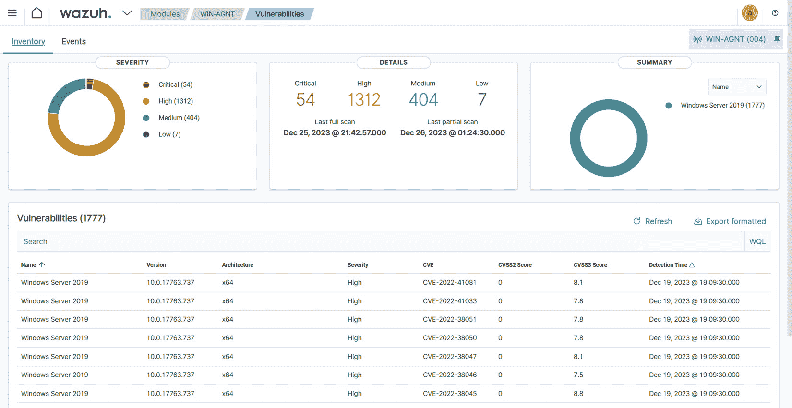

# 第七章：漏洞检测与配置评估

安全漏洞是程序代码中的弱点或系统中的配置错误，例如 Log4Shell、代码注入等，允许攻击者直接且未授权地访问系统或网络。HackerOne 在 2022 年的*黑客推动的安全报告*显示，仅 2022 年，伦理黑客发现了超过 65,000 个漏洞，比 2021 年增长了 21%。我们知道，威胁是利用漏洞的恶性或恶意事件。那么，为什么我们对漏洞如此担忧？为什么不能直接解决威胁？为什么不能阻止威胁发生？最简单的答案是，由于威胁的快速演变，我们无法控制它们。我们只能控制和管理漏洞，因此，组织将时间和资源投入到修复安全漏洞中。

有一个相关的概念叫做**安全配置管理**。这是识别系统默认设置的错误配置的过程，从而减少网络中的安全漏洞数量。漏洞监控和安全配置管理对于保持合规性（如 PCI DSS、NIST、HIPPA 等）至关重要。Wazuh 具有内置功能，能够同时进行漏洞检测和安全配置监控。

本章我们将动手操作 Wazuh 平台的漏洞检测和安全配置评估模块。我们还将学习如何监控和维护合规性。

本章我们将讨论以下内容：

+   漏洞检测与安全配置监控简介

+   PCI DSS

+   NIST

+   HIPPA

# 漏洞检测与安全配置管理简介

漏洞扫描或检测以及安全配置管理对于保持组织整体安全状态至关重要。通过发现并修复漏洞，漏洞管理降低了网络攻击的可能性。通过确保系统安全配置，安全配置评估有助于防止数据泄露和未授权访问。这两种策略加强了组织的防御，降低了风险，并保持与利益相关者的信任。Wazuh 有一个名为漏洞检测器的模块，用于满足漏洞扫描的需求，还有**安全配置评估**（**SCA**）模块，用于保持网络中端点的基础安全配置。让我们了解一下 Wazuh 如何利用其内置功能提供这两项服务。

## 漏洞检测器

**Wazuh 漏洞检测** 模块使安全团队能够识别被监控端点上的操作系统和应用程序漏洞。所有有效的漏洞都由 **常见漏洞与暴露（CVE）** 命名。你可以通过访问 [cvedetails.com](http://cvedetails.com) 网站和 [nvd.nist.gov](http://nvd.nist.gov) 网站查看所有漏洞列表。这两个网站都由 MITRE 公司管理。Wazuh 本身与不同的漏洞信息源提供商集成，如 Canonical、Debian、Red Hat、Arch Linux、**Amazon Linux Advisories Security**（**ALAS**）、Microsoft 以及 **National Vulnerability Database**（**NVD**）。接下来，让我们聊一聊 Wazuh 如何检测到新的漏洞。

## 如何使用 Wazuh 设置漏洞检测

Wazuh 代理定期将来自监控端点的已安装应用程序列表共享给 Wazuh 服务器。这个已安装应用程序的清单存储在 Wazuh 服务器上的本地 SQLite 数据库中。

让我们了解漏洞检测是如何工作的，以及在 Wazuh 中启用漏洞检测需要配置哪些内容。Wazuh 漏洞检测的工作原理可以通过三个步骤来解释：

1.  `ossec.conf` 文件：

    ```
    <!-- System inventory -->
       <wodle name="syscollector">
         <disabled>no</disabled>
         <interval>1h</interval>
         <scan_on_start>yes</scan_on_start>
         <hardware>yes</hardware>
         <os>yes</os>
         <network>yes</network>
         <packages>yes</packages>
         <ports all="no">yes</ports>
         <processes>yes</processes>
         <!-- Database synchronization settings -->
         <synchronization>
           <max_eps>10</max_eps>
         </synchronization>
       </wodle>
    ```

    让我们分解一下：

    +   `<wodle name="syscollector">`: Wodle 是 Wazuh 中的一个模块，允许用户执行 syscollector、Command、Osquery、Docker-Listener 等任务。

    +   `<interval>1h</interval>`: 这表示 syscollector 模块运行的间隔时间。在这种情况下，它设置为 1 小时。

    +   `<hardware>yes</hardware>`: 这表示监控与硬件相关的信息。

    +   `<os>yes</os>`: 这表示监控操作系统。

    +   `<network>yes</network>`: 这表示监控与网络相关的信息。

    +   `<packages>yes</packages>`: 这表示监控端点的软件包或软件。

    +   `<processes>yes</processes>`: 这表示监控端点的所有进程。

    +   `<synchronization>`: 这包含与数据库同步相关的信息。

    +   `<max_eps>10</max_eps>`: 这指定了数据库同步的最大每秒事件数（EPS）。在此情况下，它设置为每秒 10 个事件。

1.  `ossec.conf` 文件。

    为每个你打算扫描的操作系统和漏洞检测模块，指定 `enabled>` 标签的值为 `yes`。例如，如果你希望为 Ubuntu 操作系统启用漏洞检测模块，以下是你应该做的：

    ```
    <vulnerability-detector>
       <enabled>yes</enabled>
       <interval>5m</interval>
       <min_full_scan_interval>6h</min_full_scan_interval>
       <run_on_start>yes</run_on_start>
       <!-- Ubuntu OS vulnerabilities -->
       <provider name="canonical">
          <enabled>yes</enabled>
          <os>trusty</os>
          <os>xenial</os>
          <os>bionic</os>
          <os>focal</os>
          <os>jammy</os>
          <update_interval>1h</update_interval>
       </provider>
    systemctl restart wazuh-manager
    ```

1.  **步骤 3：漏洞** **警报生成**

    当库存数据库中的软件包版本与漏洞数据库（CVE 列表）匹配时，该软件包将被标记为 *易受攻击*，并且漏洞检测模块将整理所有这些漏洞并对每个代理进行检查。你可以通过导航到 Wazuh 管理器的漏洞模块来查看易受攻击的软件包或应用程序，如下图所示。



图 7.1 – Wazuh 管理器中的易受攻击的包或应用程序

注意

当我们首次启用漏洞检测时，它会进行基准扫描，在此过程中对操作系统和每个已安装的软件包进行完整扫描。之后，它将进行部分扫描，仅扫描新的软件包。

## 安全配置评估

**安全配置评估** (**SCA**) 程序验证每个系统是否遵循关于配置设置和授权应用程序使用的预定规则集。

下面是几个示例：

+   验证所有不必要的开放端口（TCP 或 UDP）是否已禁用或阻塞

+   确保默认凭据已经修改

这些是减少网络中端点漏洞暴露面的一些最常见方法。Wazuh 具有内置的 SCA 模块，用于扫描此类配置错误的端点并建议修复步骤。扫描是基于 SCA 策略文件进行的，该文件包含一组规则。SCA 策略可以检查文件、目录、注册表键/值、正在运行的进程等的存在，具体请参见下图。


图 7.2 – Wazuh SCA 检查

Wazuh SCA 检查每个 Wazuh 代理是否维护一个本地数据库，其中保存每个 SCA 检查的当前状态。每当某个检查的状态与上次扫描的状态发生变化时，SCA 扫描结果将以警报的形式显示。

Wazuh 团队和社区基于 CIS 基准构建了 SCA 规则。**互联网安全中心** (**CIS**) 是一个非营利的、社区驱动的组织，负责为众多操作系统和平台构建安全控制和基准。CIS 控制和 CIS 基准是全球公认的安全网络基础设施最佳实践。

### 如何设置 Wazuh SCA

Wazuh SCA 策略源自 CIS 基准。要配置 Wazuh 以进行 SCA，首先启用 Wazuh 代理上的 SCA 策略。如果你有自定义的 SCA 策略，可以从 Wazuh 管理器推送到所有 Wazuh 代理。该过程如下所示：

1.  `/var/ossec/ruleset/sca` 目录适用于 Linux，`C:\\Program Files (x86)\\ossec-agent\\ruleset\\sca` 文件夹适用于 Windows。你还可以通过利用 YML 文件结构创建自定义的 SCA 脚本，结构包含四个部分：`policy`、`requirements`、`variables` 和 `checks`，如下所示：

    ```
    policy:
      id: "rdp_audit"
      file: "sca_rdp_audit.yml"
      name: "System audit for Windows based system"
      description: "Guidance for establishing a secure configuration for Unix based systems."
      references: https://www.cisecurity.org/
        -
    requirements:
      title: "Check that the RDP service is not using the default port (3389)"
      description: "Requirements for running the SCA scan against the RDP service on Windows."
      condition: any
      rules:
        - 'r:HKEY_LOCAL_MACHINE\System\CurrentControlSet'
    variables:
      $rdp_registry_path: HKEY_LOCAL_MACHINE\System\CurrentControlSet\Control\Terminal Server\WinStations\RDP-Tcp
    checks:
      - id: 3000
        title: "RDP Port: Check that RDP is not running on the default port (3389)"
        description: "The RDP service should not be listening on the default port 3389 for incoming connections."
        rationale: "Changing the default RDP port can help reduce the risk of unauthorized access to the system."
        remediation: "Change the RDP port to a non-standard port for added security."
        compliance:
          - pci_dss: ["2.2.4"]
          - nist_800_53: ["CM.1"]
        condition: all
        rules:
          - 'r:HKEY_LOCAL_MACHINE\System\CurrentControlSet\Control\Terminal Server\WinStations\RDP-Tcp -> PortNumber -> d3d'
    ```

    让我们分解一下：

    +   `policy` 是一个必需的部分。

    +   `id`、`file`、`name`、`description` 和 `references` 是前面 SCA 脚本的一些基本元数据。

    +   `requirements` 是一个可选部分。

    +   `variables` 是一个可选部分。它通过创建路径或文件名等变量来简化规则的创建。

    +   `checks` 是一个必需的部分。在这里我们定义规则和条件。

    +   `'r:HKEY_LOCAL_MACHINE\System\CurrentControlSet\Control\Terminal Server\WinStations\RDP-Tcp -> PortNumber`：这表示 RDP 端口的注册表值。在这种情况下，规则检查是否为`d3d`，即表示`3389`端口。

1.  `agent.conf` 文件用于将配置推送到所有 Wazuh 代理。

    为了完成设置，我们需要遵循以下步骤：

    1.  启用远程命令执行。将 `sca.remote_commands` 设置为 `1`：

        ```
        /var/ossec/etc/shared/default folder of the Wazuh manager and set the ownership to wazuh:wazuh:

        ```

        agent.conf 文件：

        ```
        <agent_config>
          <!-- Shared agent configuration here -->
          <sca>
            <policies>
                <policy>etc/shared/sca_rdp_audit.yml</policy>
            </policies>
          </sca>
        </agent_config>
        ```

        ```

        ```

我们已经了解了 SCA 策略是如何创建的，以及如何将它们推送到 Wazuh 代理。在下一部分中，我们将学习 PCI DSS 合规性，以及如何使用 Wazuh 漏洞检测器和安全配置评估模块来满足其要求。

# PCI DSS

信用卡欺诈是最常见的银行欺诈类型之一。2022 年，由于信用卡和借记卡的欺诈行为，创纪录的 343.6 亿美元遭遇损失，比前一年增长了近 5%（[`tinyurl.com/4dymuc8d`](http://tinyurl.com/4dymuc8d)）。**支付卡行业数据安全标准** (**PCI DSS**) 合规性发挥着重要作用，因为它迫使组织安全地存储和处理支付卡信息。这既保护了公司，也保护了客户免受数据泄露和财务损失。任何组织要成为 PCI DSS 合规的，都必须满足 PCI DSS 制定的 12 项要求。Wazuh 平台在满足一些最关键的 PCI DSS 要求方面发挥着至关重要的作用。在本章中，我们将讨论一些重要的 PCI DSS 要求：

+   什么是 PCI DSS 合规性？

+   PCI DSS 合规性的要求

+   Wazuh 用例在 PCI DSS 合规性中的应用

## 什么是 PCI DSS 合规性？

**PCI DSS 合规性** 是由 Visa、MasterCard、Discover Financial Services、JCB International 和 American Express 于 2004 年制定的一套安全标准。这一合规方案由 **支付卡行业安全标准委员会** (**PCI SSC**) 监管，目的是保护信用卡和借记卡交易免受欺诈活动和数据盗窃。PCI SSC 是一个国际机构，负责监管支付卡行业。

PCI DSS 是一套包含 12 项要求和检查清单的标准，旨在确保持卡人数据的安全，防止组织内的数据泄露。符合 PCI DSS 的组织必须满足所有 12 项要求，涵盖防火墙的安装和使用、加密、终端安全、网络安全监控、日志管理、文件完整性、访问控制等方面。让我们详细了解每一项 PCI DSS 要求及其对应的安全控制。

## PCI DSS 合规性的要求

为了获得 PCI DSS 认证，需要满足 12 项要求。每个要求都有若干子要求。我将逐一解释每项 PCI DSS 要求的主要要点、安全控制措施，以及为满足相应要求所使用的工具，并且将介绍哪些 Wazuh 能力或模块可以用来应对这些要求。

+   **要求#1：安装并维护防火墙配置以保护** **卡 holder 数据**

    | **主要要点** | **安全控制** **和工具** | **Wazuh 能力** |
    | --- | --- | --- |

    |

    +   安装并维护防火墙配置以保护卡 holder 数据。

    +   不要使用供应商提供的默认系统密码和其他安全参数。

    +   保护存储的卡 holder 数据。

    |

    +   防火墙

    +   下一代防火墙

    +   IPS/IDS：Suricata, Snort, Cisco Firepower

    |

    +   安全配置评估（SCA）模块

    |

表 7.1 – 针对 PCI DSS 要求 1 的安全控制与 Wazuh 模块

+   **要求#2：不要使用供应商提供的默认系统密码和其他** **安全元素**

    | **主要要点** | **安全控制** **和工具** | **Wazuh 能力** |
    | --- | --- | --- |

    |

    +   加密卡 holder 数据在开放、公共网络上传输。

    +   授权后不要存储敏感的认证数据。

    +   加密存储的卡 holder 数据。

    |

    +   双因素认证：Google Authenticator, Cisco DUO

    |

    +   安全配置评估（SCA）

    +   漏洞检测

    +   日志分析

    |

表 7.2 – 针对 PCI DSS 要求 2 的安全控制与 Wazuh 模块

+   **要求#3：保护** **卡 holder 数据**

| **主要要点** | **安全控制** **和工具** | **Wazuh 能力** |
| --- | --- | --- |

|

+   保持防病毒软件更新并积极运行。

+   开发并维护安全的系统和应用程序。

+   防止恶意软件。

| SSL/TLS 加密解决方案：BitLocker |
| --- |

+   安全配置评估（SCA）

+   文件完整性监控

|

表 7.3 – 针对 PCI DSS 要求 3 的安全控制与 Wazuh 模块

+   **要求#4：加密卡 holder 数据在开放的、** **公共网络上传输**

    | **主要要点** | **安全控制** **和工具** | **Wazuh 能力** |
    | --- | --- | --- |

    |

    +   在公共网络上使用强加密。

    +   避免发送未加保护的 PAN。

    |

    +   SSL/TLS 证书

    +   远程访问 VPN：Cisco AnyConnect, Palo Alto Global Protect 等

    |

    +   安全配置评估（SCA）

    |

表 7.4 – 针对 PCI DSS 要求 4 的安全控制与 Wazuh 模块

+   **要求#5：保护所有系统免受恶意软件攻击并定期更新防病毒软件** **或程序**

    | **主要要点** | **安全控制** **和工具** | **Wazuh 能力** |
    | --- | --- | --- |

    |

    +   使用更新的防病毒软件。

    +   确保定期更新和扫描。

    |

    +   终端保护或防病毒软件：Carbon Black, Kaspersky, CrowdStrike 等。

    |

    +   安全配置评估（SCA）

    +   恶意软件检测

    +   Rootkit 检测

    +   威胁情报

    +   日志分析

    |

表 7.5 – 针对 PCI DSS 要求 5 的安全控制与 Wazuh 模块

+   **要求#6：开发并维护安全的系统** **和应用程序**

    | **主要要点** | **安全控制** **和工具** | **Wazuh 能力** |
    | --- | --- | --- |

    |

    +   识别安全漏洞。

    +   保护系统免受已知漏洞的威胁。

    +   遵循安全软件开发实践。

    |

    +   安全测试工具：Checkmarx、Veracode SonarQube、OWASP ZAP、Burp-Suite、Sonatype Nexus、Mend SCA

    |

    +   安全配置评估（SCA）

    +   漏洞检测

    +   日志分析

    +   主动响应，

    +   文件完整性监控

    |

表格 7.6 – PCI DSS 第 6 条要求的安全控制和 Wazuh 模块

+   **要求 #7：根据业务需求限制对持卡人数据的访问** **知情权限**

    | **主要要点** | **安全控制** **和工具** | **Wazuh 功能** |
    | --- | --- | --- |

    |

    +   基于工作需求限制访问。

    +   实施访问控制。

    +   限制物理访问。

    |

    +   身份和访问管理：Okta、SailPoint、CyberArk

    |

    +   安全配置评估（SCA）

    |

表格 7.7 – PCI DSS 第 7 条要求的安全控制和 Wazuh 模块

+   **要求 #8：识别和认证对** **系统组件**的访问

    | **主要要点** | **安全控制** **和工具** | **Wazuh 功能** |
    | --- | --- | --- |

    |

    +   使用唯一的 ID 进行系统访问。

    +   按职位角色分配访问权限。

    |

    +   网络访问控制：Cisco ISE、Aruba ClearPass

    +   远程访问 VPN：Cisco AnyConnect、Palo Alto Global Protect 等

    |

    +   安全配置评估（SCA）

    +   日志分析

    +   文件完整性监控

    |

表格 7.8 – PCI DSS 第 8 条要求的安全控制和 Wazuh 模块

+   **要求 #9：限制对** **持卡人数据**的物理访问

    | **主要要点** | **安全控制** **和工具** | **Wazuh 功能** |
    | --- | --- | --- |

    |

    +   对物理访问实施入口控制。

    +   区分人员和访客。

    |

    +   物理访问控制系统

    +   监控摄像头

    +   生物识别访问系统

    |

    +   安全配置评估（SCA）

    +   日志分析

    |

表格 7.9 – PCI DSS 第 9 条要求的安全控制和 Wazuh 模块

+   **要求 #10：跟踪和监控所有对网络资源和** **持卡人数据**的访问

    | **主要要点** | **安全控制** **和工具** | **Wazuh 功能** |
    | --- | --- | --- |

    |

    +   监控所有网络和数据访问。

    +   实施自动化审计跟踪。

    |

    +   安全信息和事件管理（SIEM）工具：Splunk SIEM、IBM QRadar、LogRhythm 等

    +   IDS 解决方案：Snort、Suricata

    +   日志管理：Graylog

    |

    +   安全配置评估（SCA）

    +   日志数据分析

    +   主动响应

    |

表格 7.10 – PCI DSS 第 10 条要求的安全控制和 Wazuh 模块

+   **要求 #11：定期测试安全系统** **和流程**

    | **主要要点** | **安全控制** **和工具** | **Wazuh 功能** |
    | --- | --- | --- |

    |

    +   定期进行安全测试。

    +   执行内部和外部漏洞扫描。

    |

    +   漏洞扫描：Tenable、Qualys、Rapid7 等

    +   渗透测试：Metasploit 框架、Burp-Suite

    |

    +   安全配置评估（SCA）

    +   漏洞检测

    +   日志数据分析

    +   主动响应

    |

表格 7.11 – PCI DSS 第 11 条要求的安全控制和 Wazuh 模块

+   **要求 #12：定期测试安全系统** **和流程**

    | **主要要点** | **安全控制** **和工具** | **Wazuh 功能** |
    | --- | --- | --- |

    |

    +   建立并传播安全政策。

    +   确保员工了解安全政策。

    |

    +   治理风险与合规软件：RSA Archer

    +   安全意识平台：KnowBe4、Cofence PhishMe 等。

    |

    +   安全配置评估（SCA）

    |

表 7.12 – PCI DSS 第 12 要求的安全控制和 Wazuh 模块

说到用于解决大多数 PCI DSS 要求的 Wazuh 模块，**SCA** 和漏洞检测器是前述表格中列出的最常见的 Wazuh 模块。让我们在接下来的部分中理解这两个 Wazuh 模块的用例，以满足一些重要的 PCI DSS 要求。

## PCI DSS 漏洞检测用例

正如我们在 *漏洞检测和安全配置管理简介* 部分中学到的，Wazuh 使用漏洞检测模块来检测代理上安装的应用程序或软件包中的漏洞。漏洞扫描或检查通过整合来自 Debian、Red Hat、Arch Linux、**Amazon Linux 安全公告**（**ALAS**）、微软、国家漏洞数据库等的漏洞信息来执行。Wazuh 漏洞检测器可以自信地用于 PCI DSS 合规性中的第 6 和第 11 要求。漏洞检测模块能够满足的 PCI DSS 要求的用例如下：

### 用例 #1：确保在 Windows 机器上检测并解决安全漏洞

根据 PCI DSS 第 6 要求，我们需要确保检测并解决安全漏洞。在此用例中，我们将重点关注 Windows 机器，使用 Wazuh 模块检测并解决漏洞。我们可以安排漏洞检测器扫描以发现安全漏洞。这将需要以下步骤：

1.  要求

1.  在端点上设置 syscollector wodle

1.  在 Wazuh 服务器上启用漏洞检测器并重启

1.  可视化警报

#### 要求

要设置实验环境以在 Windows 机器上运行漏洞检测，您需要以下系统：

+   Windows 机器（已安装 Wazuh 代理）

+   Wazuh 服务器

#### 在 Windows 端点上设置 syscollector wodle

Wazuh syscollector wodle 管理与硬件、应用程序、操作系统等相关的信息。要自定义我们的 Windows 端点，请在 Wazuh 代理的 `/var/ossec/etc` 目录下的 `ossec.config` 文件中添加 syscollector wodle，如下所示：

```
<wodle name="syscollector">
   <disabled>no</disabled>
   <interval>1h</interval>
   <packages>yes</packages>
</wodle>
```

#### 在 Wazuh 服务器上启用漏洞检测器并重启

要为 Windows 平台启用漏洞检测，您需要编辑位于 `/var/ossec/etc` 的 Wazuh 服务器中的 `ossec.conf` 文件。您需要在 `Windows OS 漏洞` 部分下将 `<enabled>` 标签设置为 `yes`，如下所示：

```
<vulnerability-detector>
   <enabled>yes</enabled>
   <interval>5m</interval>
   <run_on_start>yes</run_on_start>
   <!-- Windows OS vulnerabilities -->
   <provider name="msu">
      <enabled>yes</enabled>
      <update_interval>1h</update_interval>
   </provider>
```

重新启动并测试 Wazuh 管理器：

```
systemctl restart wazuh-manager
```

一旦 Wazuh 管理器完成重启，您可以在 **模块** > **漏洞** > **事件** 选项卡上看到漏洞警报。前两个漏洞都与 Windows 机器上的 Google Chrome 应用程序有关。

注意

一旦您选择了 Google Chrome 漏洞 CVE-2023-5472，在 Wazuh 仪表板上将会给出警报的概述以及代理的当前状态。要了解更多关于所有活动 CVE 的信息，包括受影响软件的信息、严重程度评级、对手链接以及供应商发布的补丁，您可以访问 [cvedetails.com](http://cvedetails.com)。该网站由 SecurityScorecard 组织管理。


图 7.3 – Google Chrome CVE-2023-5472 的漏洞检测

### 用例 #2：定期识别、优先处理安全漏洞

根据 *PCI DSS 要求 11*，我们需要识别、优先处理安全漏洞。您可以应用一个过滤器，使用 `severity=Critical`，您可以看到所有严重级别为关键的 Windows 漏洞。


图 7.4 – 使用漏洞检测器查找关键漏洞

## PCI DSS 的安全配置评估用例

安全配置评估是一个重要的 Wazuh 模块，帮助您满足多个 PCI DSS 要求。实际上，使用 Wazuh SCA 模块可以满足许多 PCI DSS 要求。我们将使用一些示例 SCA 脚本来解决两个重要的 PCI DSS 要求。请注意，上述用例已经存在于位于 `C:\\Program Files (x86)\\ossec-agent\\ruleset\\sca` 的 `cis_win2012r2.yml` 文件中。

### 用例 #1：在交互登录时不显示最后用户名

*PCI DSS 要求 2* 要求仅启用必要的服务、协议和守护程序，并删除或禁用所有不必要的功能。让我们审核 Windows Server 2012 R2 上的特定服务。我们将运行 SCA 检查，以查看是否在每台计算机的 Windows 登录屏幕上显示了最后登录到计算机的帐户名。建议禁用此功能。

在 *安全配置评估* 部分，我们已经介绍了如何创建自定义 SCA 及每个 SCA 脚本（策略、要求、检查）的组成部分。以下是一个 PCI DSS 要求用例，我们将检查位于 `C:\\Program Files (x86)\\ossec-agent\\ruleset\\sca` 的 `cis_win2012r2.yml` 文件。

*PCI DSS 要求 2* 下的一个子要求是禁用所有不必要的服务、协议、守护进程和功能。在这个使用案例中，我们将运行 SCA 检查，确保在 Windows 机器上启用了 *‘不要在交互式 Windows 登录时显示最后一个用户名’*。该 SCA 脚本已由 Wazuh 团队构建并编译，位于 `C:\\Program Files (x86)\\ossec-agent\\ruleset\\sca` 文件中。这将需要以下步骤：

1.  要求

1.  审查 SCA 策略

1.  可视化警报

#### 要求

为了完成执行 *‘不在交互式登录时显示最后用户名’* 的 SCA 检查的使用案例，要求如下：

+   Windows 机器（已安装 Wazuh 代理）

+   Wazuh 服务器

#### 审查 SCA 策略

我们在此步骤中无需做任何更改。Wazuh 已为 *‘交互式登录：不显示最后用户名’* 内置了 SCA 策略，已设置为 `C:\\Program Files (x86)\\ossec-agent\\ruleset\\sca` 文件，如下所示：

```
- id: 15015
    title: "Ensure 'Interactive logon: Do not display last user name' is set to 'Enabled'"
    description: "This policy setting determines whether the account name of the last user to log on to the client computers in your organization will be displayed in each computer's respective Windows logon screen. Enable this policy setting to prevent intruders from collecting account names visually from the screens of desktop or laptop computers in your organization. The recommended state for this setting is: Enabled."
    rationale: "An attacker with access to the console (for example, someone with physical access or someone who is able to connect to the server through Remote Desktop Services) could view the name of the last user who logged on to the server. The attacker could then try to guess the password, use a dictionary, or use a brute-force attack to try and log on."
    remediation: "To establish the recommended configuration via GP, set the following UI path to Enabled: Computer Configuration\\Policies\\Windows Settings\\Security Settings\\Local Policies\\Security Options\\Interactive logon: Do not display last user name."
    compliance:
      - cis: [«2.3.7.1»]
      - cis_csc: [«13»]
      - pci_dss: [«2.2.3»]
      - nist_800_53: ["CM.1"]
      - gpg_13: ["4.3"]
      - gdpr_IV: ["35.7.d"]
      - hipaa: ["164.312.b"]
      - tsc: ["CC5.2"]
    references:
      - 'CCE-36056-0'
    condition: all
    rules:
      - 'r:HKEY_LOCAL_MACHINE\Software\Microsoft\Windows\CurrentVersion\Policies\System -> DontDisplayLastUserName -> 1'
```

在这里，我们看到以下内容：

+   `condition` 设置为 `all`。

+   `r:HKEY_LOCAL_MACHINE\Software\Microsoft\Windows\CurrentVersion\Policies\System` 通过在开头使用 `r` 参数表示注册表值。在我们的例子中，我们已经将注册表值设置为 `1`。

#### 可视化警报

要验证我们的 Windows Server 2012 R2 是否通过 SCA 检查，可以前往 **Modules** > **Security configuration assessment**，然后选择代理。根据这里显示的 SCA 警报，检查未通过。


图 7.5 –SCA 检查 – 不显示交互式登录的最后用户名

为了确保我们的 Windows 机器通过 `HKEY_LOCAL_MACHINE\Software\Microsoft\Windows\CurrentVersion\Policies\System -> DontDisplayLastUserName` 注册表位置的 SCA 检查，并将其设置为 `1`。

### 使用案例 #2：禁用 SAM 账户和共享的匿名枚举

根据 *PCI DSS 要求 7*，企业应根据业务的需要限制对持卡人数据环境的访问。这意味着只有经过授权的人员（工程师/技术员/经理）才能访问持卡人相关数据，并且访问应根据工作职责和业务需求进行限制。一个适用于 Windows 机器的使用案例是禁用 SAM 账户和共享的匿名枚举。`cis_win2012r2.yml` 文件位于 `C:\\Program Files (x86)\\ossec-agent\\ruleset\\sca` 中。

这个使用案例将涵盖以下主题：

+   要求

+   审查 SCA 策略

+   可视化警报

#### 要求

为了完成禁用 SAM 账户和共享的匿名枚举的 SCA 检查，要求如下：

+   Kali Linux（已安装 Wazuh 代理）

+   Wazuh 服务器

#### 审查 SCA 策略

以下示例是一个使用案例，确保匿名用户无法扫描 SAM 账户和共享资源。启用此策略设置将阻止匿名用户在您环境中的系统上枚举网络共享名称和域账户用户名：

```
- id: 15031
    title: "Ensure 'Network access: Do not allow anonymous enumeration of SAM accounts and shares' is set to 'Enabled'"
    description: "This policy setting controls the ability of anonymous users to enumerate SAM accounts as well as shares. If you enable this policy setting, anonymous users will not be able to enumerate domain account user names and network share names on the systems in your environment. The recommended state for this setting is: Enabled. Note: This policy has no effect on Domain Controllers."
    rationale: "An unauthorized user could anonymously list account names and shared resources and use the information to attempt to guess passwords or perform social engineering attacks. (Social engineering attacks try to deceive users in some way to obtain passwords or some form of security information)"
    remediation: "To establish the recommended configuration via GP, set the following U path to Enabled: Computer Configuration\\Policies\\Windows Settings\\Security Settings\\Local Policies\\Security Options\\Network access: Do not allow anonymous enumeration of SAM accounts and shares."
    compliance:
      - cis: [«2.3.10.3»]
      - cis_csc: [«16»]
      - pci_dss: [«7.1»]
      - tsc: ["CC6.4"]
    references:
      - 'CCE-36316-8'
    condition: all
    rules:
      - 'r:HKEY_LOCAL_MACHINE\SYSTEM\CurrentControlSet\Control\Lsa -> RestrictAnonymous -> 1'
```

在这里，我们看到以下内容：

+   `condition` 被设置为 `all`。

+   `r:HKEY_LOCAL_MACHINE\SYSTEM\CurrentControlSet\Control\Lsa` 表示 `HKEY_LOCAL_MACHINE\SYSTEM\CurrentControlSet\Control\Lsa` 的注册表值。在我们的例子中，它被设置为 `1`。

#### 可视化警报

要验证我们的 Windows Server 2012 R2 是否通过 SCA 检查，您可以进入**模块** > **安全配置评估**，然后选择代理。您可以验证 SCA 检查是否通过，如以下截图所示：


图 7.6 – SCA 检查 – 禁用匿名枚举 SAM 账户和共享

根据 SCA 输出，检查失败的原因是 `HKEY_LOCAL_MACHINE\SYSTEM\CurrentControlSet\Control\Lsa` 的注册表值未设置为 `1`。这意味着攻击者可以列出账户名称和共享资源，并利用这些信息进行社会工程攻击。

上图显示了修复方案，要求您将注册表值设置为 1，然后我们的 SCA 检查将标记为通过。

在本节中，我们了解了 PCI DSS 合规性及其要求，并利用 Wazuh 的漏洞检测器和 SCA 模块来满足一些常见的 PCI 合规性要求。在接下来的章节中，我们将学习 NIST 800-53 控制措施以及如何使用 Wazuh 模块来满足一些 NIST 800-53 控制措施。

# NIST 800-53

在 2022-23 财年，美国联邦机构报告了超过 30,000 起网络安全事件，比前一年减少了 5%（[`tinyurl.com/2s3msja8`](http://tinyurl.com/2s3msja8)）。所有联邦机构必须遵守**联邦信息安全管理法**（**FISMA**）。FISMA 是一项联邦法律，要求美国政府机构创建、记录和实施信息安全保护计划。**NIST 800-53**是一项网络安全标准和指南，帮助联邦机构满足 FISMA 规定的要求。NIST 800-53 框架由国家标准与技术研究院（NIST）开发。简而言之，NIST 800-53 框架帮助联邦机构实现 FISMA 合规性。在本节中，我们将涵盖以下主题：

+   NIST 800-53 框架是什么？

+   NIST 800-53 框架中的控制家庭列表

+   漏洞检测使用案例

## NIST 800-53 框架是什么？

NIST 800-53 框架是由**国家标准与技术研究院**（**NIST**）制定的网络安全标准和合规框架。它提供了一套关于构建安全和弹性信息系统所需的安全控制指南。

### NIST 800-53 的目标是什么？

NIST 特别出版物 800-53 的目标如下：

+   **提供全面的框架**：NIST 800-53 的目标是提供一个广泛而有组织的框架，用于选择和实施安全策略，以保护信息系统

+   **提升信息安全**：通过实施一套安全控制和最佳实践，其主要目标是提高联邦信息系统和组织的安全性和隐私保护

+   **鼓励风险管理**：NIST 800-53 建议企业根据其特定需求和威胁环境，识别、评估和控制网络安全风险

+   **促进合规与监管**：它作为与美国政府开展业务的公司的指南，并帮助公司遵守联邦规则和合规义务，如 FISMA

+   **鼓励持续改进**：随着 NIST 800-53 的发展，组织可以根据新威胁和技术的变化，逐步调整和改进其网络安全程序

NIST 800-53 框架提供了多个安全和系统访问控制家庭中的不同控制。这些控制随后被组织到 20 个安全和控制家庭中。

## NIST 800-53 框架中的控制家庭列表

NIST 800-53 控制被分类为 20 个不同的安全和控制家庭。每个控制家庭都有一个独特的 ID 和多个子控制。在下表中，我们将重点关注一个更广泛的控制家庭。此外，我还添加了两列，以展示每个 NIST 800-53 控制对应的企业工具和 Wazuh 功能（模块）。

| **ID** | **家庭名称** | **控制示例** | **Wazuh 能力** |
| --- | --- | --- | --- |
| AC | 访问控制 | 账户管理与监控；最小权限；职务分离 |

+   Wazuh 日志数据分析

|

| AT | 意识与培训 | 用户安全威胁培训；特权用户的技术培训 |
| --- | --- | --- |

+   日志数据分析

|

| AU | 审计与问责 | 审计记录内容；分析与报告；记录保持 |
| --- | --- | --- |

+   无

|

| CA | 评估、授权与监控 | 连接到公共网络和外部系统；渗透测试 |
| --- | --- | --- |

+   漏洞检测器

+   文件完整性监控

|

| CM | 配置管理 | 授权软件政策；配置变更控制 |
| --- | --- | --- |

+   SCA

|

| CP | 应急计划 | 替代处理和存储站点；业务连续性策略；测试 |
| --- | --- | --- |

+   无

|

| IA | 身份识别与认证 | 用户、设备和服务的认证政策；凭证管理 |
| --- | --- | --- |

+   SCA

|

| IP | 个人参与 | 同意和隐私授权 |
| --- | --- | --- |

+   无

|

| IR | 事件响应 | 事件响应训练、监控和报告 |
| --- | --- | --- |

+   主动响应

+   威胁情报

|

| MA | 维护 | 系统、人员和工具的维护 |
| --- | --- | --- |

+   日志数据分析

|

| MP | 媒体保护 | 媒体的访问、存储、传输、清除和使用 |
| --- | --- | --- |

+   日志数据分析

|

| PA | 隐私授权 | 个人身份信息（PII）的收集、使用和共享 |
| --- | --- | --- |

+   无

|

| PE | 物理与环境保护 | 物理访问；紧急电源；防火；温控 |
| --- | --- | --- |

+   无

|

| PL | 规划 | 社交媒体和网络限制；深度防御安全架构 |
| --- | --- | --- |

+   无

|

| PM | 项目管理 | 风险管理策略；企业架构 |
| --- | --- | --- |

+   无

|

| PS | 人员安全 | 人员筛选、解雇和转移；外部人员；制裁 |
| --- | --- | --- |

+   无

|

| RA | 风险评估 | 风险评估；漏洞扫描；隐私影响评估 |
| --- | --- | --- |

+   无

|

| SA | 系统与服务采购 | 系统开发生命周期；采购流程；供应链风险管理 |
| --- | --- | --- |

+   无

|

| SC | 系统和通信保护 | 应用分区；边界保护；加密密钥管理 |
| --- | --- | --- |

+   威胁情报

+   主动响应

|

| SI | 系统与信息完整性 | 漏洞修复；系统监控和报警 |
| --- | --- | --- |

+   文件完整性监控

+   主动响应

|

表 7.13 – NIST 800-53 框架控制与 Wazuh 功能列表

## NIST 800-53 的漏洞检测用例

Wazuh 的漏洞检测器模块有助于发现不同操作系统的漏洞。根据 *NIST 800-53 框架控制与 Wazuh 功能列表* 表，*评估、授权与监控* 控制族，控制 ID *CA*，使用 Wazuh 平台的漏洞检测器模块。

### 用例：检测基于 Debian 的终端上的漏洞

在 NIST 800-53 *评估、授权与监控* 控制族的漏洞检测用例中，我们将设置 Wazuh 平台来发现 Kali Linux 机器上的漏洞。Kali Linux 是基于 Debian 的 Linux 操作系统。在本节中，我们将涵盖以下几点：

1.  要求

1.  在终端上设置 syscollector 模块

1.  在 Wazuh 服务器上启用漏洞检测器并重启

1.  可视化警报

#### 要求

为了完成对 Kali Linux 机器执行漏洞检测的用例，要求如下：

+   Kali Linux 机器（已安装 Wazuh 代理）

+   Wazuh 服务器

#### 在终端上设置 syscollector 模块

Wazuh 的 syscollector 模块负责收集关于 Wazuh 代理的信息，例如硬件、操作系统、已安装的应用程序、软件包等。要自定义我们的 Debian 终端，请在 Wazuh 代理中的 `/var/ossec/etc` 下添加 syscollector wodle 到 `ossec.config` 文件：

```
<wodle name="syscollector">
   <disabled>no</disabled>
   <interval>1h</interval>
   <packages>yes</packages>
</wodle>
```

#### 启用 Wazuh 服务器上的漏洞检测器并重启

要启用 Debian 基础平台的漏洞检测，您需要编辑位于 `/var/ossec/etc` 的 Wazuh 服务器中的 `ossec.conf` 文件。您需要在 `Debian OS 漏洞` 部分将 `<enable>` 标签设置为 `yes`，如图所示：

```
-- Debian OS vulnerabilities -->
    <provider name="debian">
      <enabled>yes</enabled>
      <os allow="Kali GNU/Linux-2023">buster</os>
      <os>bullseye</os>
     <os>bookworm</os>
      <update_interval>1h</update_interval>
    </provider>
```

请注意以下事项：

+   `<os allow="Kali GNU/Linux-2023">buster</os>` 表示应该允许哪些操作系统进行漏洞扫描。在本例中是 Kali GNU/Linux-2023。

接下来，重启 Wazuh 管理器：

```
systemctl restart wazuh-manager
```

#### 可视化警报

要可视化漏洞事件，请导航到 Wazuh 管理器中的 **漏洞** 模块并检查警报。


图 7.7 – 可视化 Kali Linux 的漏洞事件

## NIST 800-53 的 SCA 用例

Wazuh SCA 模块扫描受监控的端点，检查它们是否符合安全配置和加固标准。我们将介绍一个 Wazuh SCA 的用例，以支持 NIST 800-53 控制。我们可以使用 Wazuh 的 SCA 模块来解决多个 NIST 800-53 控制要求。本节将涵盖其中的一个用例。

## 用例

我们需要更改默认的 SSH 端口。位于 `C:\\Program Files (x86)\\ossec-agent\\ruleset\\sca` 的 `sca_unix_audit.yml` 文件。此用例将涵盖以下主题：

+   要求

+   审查 SCA 策略

+   可视化警报

### 要求

为了完成执行 SCA 检查的用例 *更改默认 SSH 端口*，其要求如下：

+   Kali Linux（已安装 Wazuh 代理）

+   Wazuh 服务器

### 审查 SCA 策略

我们不需要对此集做任何更改。Wazuh 已经根据 CIS 基准为多个操作系统构建了大量的 SCA 策略。名为 `sca_unix_audit.yml` 的 SCA 策略将在下载 Wazuh 代理包时自动安装。要查看 *SSH 加固：端口不应为 22* 的 SCA 策略，您可以打开位于 Kali Linux Wazuh 代理中的 `/var/ossec/ruleser/sca` 的 `sca_unix_audit.yml` 文件。您可以在 `rule id: 3000` 下找到所需的 SCA 策略，如下所示：

```
- id: 3000
    title: "SSH Hardening: Port should not be 22"
    description: "The ssh daemon should not be listening on port 22 (the default value) for incoming connections."
    rationale: "Changing the default port you may reduce the number of successful attacks from zombie bots, an attacker or bot doing port-scanning can quickly identify your SSH port."
    remediation: "Change the Port option value in the sshd_config file."
    compliance:
      - pci_dss: [«2.2.4»]
      - nist_800_53: [«CM.1»]
    condition: all
    rules:
      - 'f:$sshd_file -> !r:^# && r:Port && !r:\s*\t*22$'
```

请注意以下事项：

+   `Condition` 为 `all`

+   `Rules: 'f:$sshd_file -> !r:^# && r:Port && !r:\s*\t*22$` 用于检查表示 SSH 端口的非命令行，排除表示默认端口 22 的行

### 可视化警报

要可视化 *SSH 加固：端口不应为 22* 的 SCA 检查，您可以导航到 Wazuh 管理器中的 SCA 模块并搜索 *SSH 加固：端口不应为 22*。您应该会看到如下截图中的结果：


图 7.8 – 可视化 SSH 加固的 SCA 检查

注意以下事项：

+   **标题**：**SSH 加固：端口不应为 22** 代表 SCA 检查的名称。

+   **目标**：**/etc/ssh/sshd_config** 是 SCA 将验证 SSH 配置的目标文件位置。

+   **结果**：**失败** 代表 SCA 检查的状态。在这种情况下，它是失败的。

+   **修复**：**更改 sshd_config 文件中的 Port 选项值** 说明了在 SCA 检查失败时如何修改目标配置文件。

+   **合规性**：**nist_800_53** 代表满足该要求的法规合规性列表。

在本节中，我们已经了解了 NIST 800-53 控制和漏洞检测器（Vulnerability Detector）及 SCA 模块的使用案例，以满足 NIST 800-53 控制的要求。在接下来的部分中，我们将详细了解 HIPAA 合规性。

# HIPAA

美国卫生与公众服务部（HHS）**民权办公室**（**OCR**）的数据泄露门户表示，仅在 2023 年上半年，医疗行业就发生了约 295 起数据泄露事件。在这一年上半年，医疗数据泄露事件涉及超过 3900 万人。**健康保险流动性与责任法案**（**HIPAA**）的重要性有很多，但最主要的是确保医疗数据的隐私和安全。Wazuh 可以通过其内置功能帮助医疗机构保持 HIPAA 合规性。在本章中，我们将讨论以下主题：

+   HIPAA 合规性规则

+   HIPAA 安全规则

+   漏洞检测器用例

+   SCA 用例

## 什么是 HIPAA 合规性？

**HIPAA** 制定了保护敏感患者健康信息的标准。HIPAA 违规主要涉及未授权访问、使用或披露**受保护健康信息**（**PHI**）。

任何以电子方式、纸质或口头形式传达或维护的个人可识别健康信息都被视为受保护健康信息（PHI）。任何涉及个人过去、现在或未来健康的资料，以及有关医疗治疗和支付信息的具体内容，这些信息可用于识别该个人，均包括在**健康信息**（**HI**）中。PHI 的示例如下：

+   社会安全号码

+   名称

+   出生日期、死亡日期或治疗日期，以及与患者护理相关的其他日期。

+   照片

+   联系信息

+   医疗记录号

## HIPAA 安全规则

HIPAA 安全规则清单包括确保电子健康信息（ePHI）在创建、接收、维护或传输过程中保密性、完整性和可用性的标准。HIPAA 安全规则包括五个部分：

+   **一般规则**：这些规则为 HIPAA 合规性奠定了基础，强调隐私和安全政策、流程以及员工培训的重要性。

+   **行政保障措施**：这些措施集中于针对电子健康信息（ePHI）的组织保障，例如风险评估、安全管理和员工培训。

+   **物理保障措施**：这些包括工作站安全、设施安全措施和访问控制，涉及数据中心和设备的物理安全

+   **技术保障措施**：这些包括技术安全协议，包括审计控制、加密和访问控制，用于保护电子健康信息

+   **组织要求**：这些关注于合同、协议以及对商业伙伴 HIPAA 合规性的监督，并与与他们合作时的要求相关

根据本书的范围，我们将重点关注两类 HIPAA 安全规则：行政保障措施和技术保障措施。

### 行政保障措施

行政保障措施要求指定一名安全官员，负责员工培训、风险分析、风险和漏洞实施、IT 连续性监督以及商业伙伴协议，构成了安全规则合规性的基础。

| **标准** | **描述** | **Wazuh 能力** |
| --- | --- | --- |
| 安全管理过程 |

+   定期进行风险分析以检测漏洞

+   实施风险最小化

|

+   漏洞检测

+   配置评估

|

| 分配安全责任 |
| --- |

+   指定 HIPAA 安全官员

+   他们还可以担任隐私官员

|  |
| --- |
| 员工安全 |

+   为员工实施访问控制

+   确保对角色变更和终止访问进行监控

|

+   日志数据分析

+   文件完整性监控

|

| 信息访问管理 |
| --- |

+   限制“被覆盖”组织员工访问 ePHI

+   阻止父母和关联实体访问 ePHI

|

+   文件完整性监控

+   配置评估

+   恶意软件检测

|

| 安全意识与培训 |
| --- |

+   开展员工安全意识培训

+   包括安全提醒和密码指导

|

+   日志数据分析

+   响应行动

|

| 安全事件处理程序 |
| --- |

+   实施事件报告的政策和程序

+   不仅限于网络安全事件

|

+   日志数据分析

+   主动响应

|

| 应急计划 |
| --- |

+   紧急响应政策，包括数据备份和恢复

+   常规演练

| 无 |
| --- |
| 定期评估 |

+   定期审查政策、程序和措施

|

+   配置评估

|

表 7.14 – HIPAA 合规性行政保障措施的安全控制和 Wazuh 模块

### 技术保障措施

HIPAA 技术保障措施确保访问 ePHI 的人员是他们所说的那个人，执行他们应该做的事情，并尽快纠正由意外或恶意行为引起的问题。

| **标准** | **描述** | **Wazuh 能力** |
| --- | --- | --- |
| 访问控制 |

+   限制 ePHI 访问

+   确保授权用户具有访问权限

|

+   日志数据分析

+   配置评估

|

| 审计控制 |
| --- |

+   实施系统活动记录和分析

+   存储 ePHI 访问和修改的审计日志

|

+   日志数据分析

|

| 完整性控制 |
| --- |

+   防止 ePHI 修改

+   实施数据完整性检查

|

+   文件完整性监控

|

| 传输安全 |
| --- |

+   加密传输 ePHI

+   保护电子通信

|

+   文件完整性监控

+   配置评估

|

| 个人或实体身份验证 |
| --- |

+   验证 ePHI 用户的身份

+   通过严格身份验证确保系统访问安全

|

+   日志数据分析

|

表 7.15 – 用于 HIPAA 合规性技术安全控制的安全控制和 Wazuh 模块

## 漏洞检测器用例

漏洞检测在行政安全控制下的安全管理过程标准中起着至关重要的作用。它涉及风险分析和对潜在风险及漏洞的全面评估。Wazuh 的漏洞检测器模块可以用来满足行政和技术安全控制下的多个 HIPAA 要求。

### 用例：检测 Ubuntu 终端的漏洞

在这个 HIPAA 合规性的漏洞检测用例中，我们正在处理*安全管理过程*标准，该标准属于行政安全控制。我们将设置 Wazuh 平台以发现 Ubuntu 机器上的漏洞。本节将涵盖以下内容：

+   要求

+   在终端上设置 syscollector wodle

+   在 Wazuh 服务器上启用漏洞检测器并重新启动

+   可视化警报

#### 要求

为了完成在 Ubuntu 机器上执行漏洞检测的用例，要求如下：

+   Ubuntu 机器（已安装 Wazuh 代理）

+   Wazuh 服务器

#### 在终端上设置 syscollector wodle

要自定义我们的 Ubuntu 终端，请在位于`/var/ossec/etc`的 Wazuh 代理的`ossec.config`文件中添加`syscollector` wodle，如下所示：

```
<wodle name="syscollector">
   <disabled>no</disabled>
   <interval>1h</interval>
   <packages>yes</packages>
</wodle>
```

#### 在 Wazuh 服务器上启用漏洞检测器并重新启动

要在 Ubuntu 操作系统上启用漏洞检测，您需要编辑位于`/var/ossec/etc`的 Wazuh 服务器上的`ossec.conf`文件。您需要在*Ubuntu OS 漏洞*部分将`<enable>`选项设置为`yes`，如图所示：

```
<vulnerability-detector>
    <enabled>yes</enabled>
    <interval>5m</interval>
    <run_on_start>yes</run_on_start>
    <provider name="canonical">
       <enabled>yes</enabled>
       <os>bionic</os>
       <update_interval>1h</update_interval>
    </provider>
 </vulnerability-detector>
```

接下来，重新启动 Wazuh 管理器：

```
systemctl restart wazuh-manager
```

#### 可视化警报

要可视化漏洞事件，请导航到 Wazuh 管理器中的**漏洞**模块并检查警报，如下所示：


图 7.9 – 在 Wazuh 管理器中可视化 CVE-2021-41617 Ubuntu 漏洞

## SCA 用例

在此用例中，我们将通过 Ubuntu 机器上的 SCA 脚本。正如我们已经学到的，SCA 功能会对受监控的终端进行扫描，以确认它们是否已正确配置并进行了加固。这些扫描通过将终端的实际配置与策略文件中的设置进行比较来评估终端的配置。

### 用例：确保审计工具的权限为 755 或更严格

*HIPAA 164.308(a)(3)(i)* 和 *164.308(a)(3)(ii)(A)* 部分讲述了行政性保护措施。所有员工应有适当的访问权限，以防止未经授权访问电子健康信息（PHI）。这一部分主要关注的是控制和管理员工访问 PHI 的权限。让我们在一台 Ubuntu 22.04 机器上进行 SCA 检查。在这个用例中，我们将检查 auditd 和审计日志是否具备足够的权限进行保护：

+   要求

+   审查 SCA 策略

+   可视化警报

#### 要求

为了完成执行 SCA 检查的用例以 *确保审计工具权限为 755 或更严格*，要求如下：

+   Ubuntu 机器（已安装 Wazuh 代理）

+   Wazuh 服务器

#### 审查 SCA 策略

在安装 Wazuh 代理软件包时，名为 `cis_ubuntu22-04.yml` 的 SCA 策略文件会被安装到 Ubuntu 机器中。该文件包含与 Ubuntu 22.04 版本相关的所有 SCA 策略。要查看 `确保审计工具权限为 755 或更严格` 的 SCA 策略，您可以打开位于 `/var/ossec/ruleser/sca` 的 `cis_ubuntu22-04.yml` 文件。您可以在其中找到 `rule id: 28610` 下的相关 SCA 策略，如下所示：

```
  - id: 28610
    title: "Ensure audit tools are 755 or more restrictive."
    description: "Audit tools include, but are not limited to, vendor-provided and open source audit tools n>    rationale: "Protecting audit information includes identifying and protecting the tools used to view and >    remediation: "Run the following command to remove more permissive mode from the audit tools: # chmod go->    compliance:
      - cis: [«4.1.4.8»]
      - cis_csc_v7: [«14.6»]
      - cis_csc_v8: [«3.3»]
      - mitre_techniques: [«T1070», «T1070.002», «T1083»]
      - mitre_tactics: [«TA0007»]
      - cmmc_v2.0: [«AC.L1-3.1.1», «AC.L1-3.1.2», «AC.L2-3.1.5», «AC.L2-3.1.3», «MP.L2-3.8.2»]
      - hipaa: ["164.308(a)(3)(i)", "164.308(a)(3)(ii)(A)", "164.312(a)(1)"]
      - pci_dss_3.2.1: ["7.1", "7.1.1", "7.1.2", "7.1.3"]
      - pci_dss_4.0: ["1.3.1", "7.1"]
      - nist_sp_800-53: ["AC-5", "AC-6"]
      - soc_2: ["CC5.2", "CC6.1"]
    condition: none
    rules:
      - 'c:stat -c "%n %a" /sbin/auditctl /sbin/aureport /sbin/ausearch /sbin/autrace /sbin/auditd /sbin/aug>
```

请注意以下事项：

+   `condition` 设置为 `none`

+   `'c:stat -c "%n %a" /sbin/auditctl /sbin/aureport /sbin/ausearch /sbin/autrace /sbin/auditd /sbin/aug>` 规则检查 auditd 和相关权限的权限

#### 可视化警报

要可视化 `确保审计工具权限为 755 或更严格` 的 SCA 检查，您可以导航到 Wazuh 管理器中的 SCA 模块，并搜索 `确保审计工具权限为 755 或更严格`。您应该会看到以下截图中的结果：


图 7.10 – SCA 检查 – 确保审计工具权限为 755 或更严格

请注意以下事项：

+   **标题**：**确保审计工具权限为 755 或更严格** 代表该 SCA 检查的名称。

+   **目标**：**/etc/ssh/sshd_config** 是 SCA 将验证的目标文件位置，用于检查 SSH 配置。

+   `/``sbin` 目录。

+   **hipaa: 164.308(a) (3)(1), 164.308(a)(3 (MA).164.312(a)(1**)：HIPAA 要求在 *164.308(a)(3)(i)* 中强调进行风险分析，而 *164.312(a)(1)* 则专注于实施访问控制来保护 **电子保护健康信息** (**ePHI**)。

+   **结果**：**通过** 代表 SCA 检查的状态。

到此，我们已结束本章内容。

# 总结

本章阐明了 Wazuh 平台中漏洞检测器和 SCA 模块的关键作用。我们已经学习了如何通过不同的自定义配置（如包、操作系统、应用程序等）来配置漏洞检测。我们还了解了 Wazuh SCA 模块的工作原理，以及如何从零开始创建自定义 SCA 脚本。我们学习了如何利用漏洞检测器和 SCA 模块满足合规性框架的要求，如 PCI DSS、NIST 800-53 控制和 HIPAA 等。

在下一章中，我们将介绍一些重要的规则和针对不同安全使用案例的自定义 Wazuh 规则。
