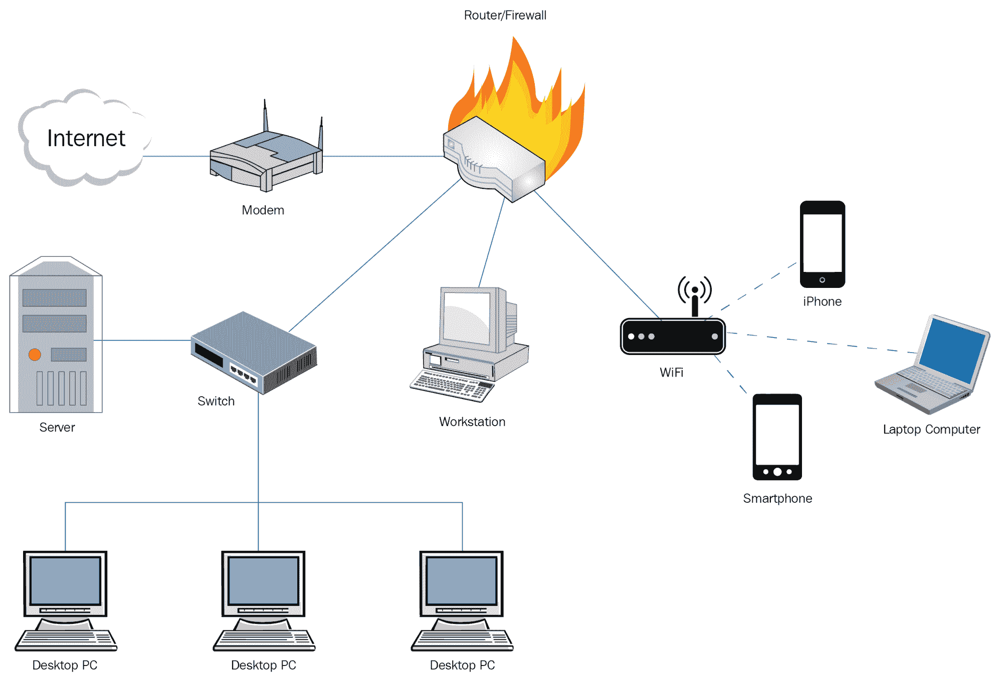

# 第一章：网络漏洞扫描简介

在当今时代，黑客普遍存在，每天都会发现各种产品的关键漏洞，企业网络需要制定程序，实时识别、分析和减轻漏洞。在本课程中，我们将研究执行网络安全扫描所需的各种程序和工具，并了解并采取所获得的结果。

本课程将为任何读者提供计算机网络的基础知识，以准备、规划和执行网络漏洞扫描，并确定渗透测试的目标，或者只是了解网络的安全状况。这将帮助初学者渗透测试人员征服并学会制定方法来执行识别漏洞的初步步骤。

本章将向您介绍计算机网络的基础知识。它还深入探讨了执行网络漏洞扫描时需要考虑的程序、用途和各种复杂性。本章将为您提供如何规划网络漏洞扫描的基本知识。

在本章中，我们将涵盖以下内容：

+   基本网络及其组件

+   网络漏洞扫描

+   网络漏洞扫描中使用的程序流程

+   执行网络漏洞扫描的用途

+   执行网络扫描的复杂性

+   如何制定缓解计划和应对

# 基本网络及其组件

基本的企业网络通常由诸如台式机/笔记本电脑、服务器、防火墙、代理、入侵检测和预防系统以及集线器、交换机和路由器等安全设备组成。大多数情况下，这些设备来自不同的供应商，因此它们容易受到不同的攻击，并使网络暴露于更大的攻击面。黑客可以利用公开可用的漏洞或零日漏洞攻击这些组件，从而可能访问设备/机器，并有可能访问网络中的其他设备/机器或整个网络。请注意以下图表以说明这一点：

# 网络漏洞扫描

漏洞是系统或设备中存在的一种弱点，可能会受到攻击。网络漏洞扫描是一种查找网络组件（如客户端、服务器、网络设备和终端）中的漏洞的过程，使用各种自动化或手动工具和技术进行识别和检测。它可以广泛分类为两种类型：内部网络漏洞扫描和外部网络漏洞扫描。

内部和外部漏洞扫描在过程上有相似之处，但在扫描设备或系统的网络位置上有所不同。外部漏洞扫描的范围是识别漏洞，考虑到攻击者通过网络上的公共 IP 地址针对网络，而内部漏洞扫描则是考虑攻击者是内部人员，可以访问内部网络，并通过私有 IP 地址针对网络。识别内部和外部威胁对于任何计算机网络都非常重要，以根据识别的漏洞数量实时呈现网络的安全性。

漏洞扫描对网络有其自身的副作用，例如由于流量增加而导致的网络延迟增加，网络资源无响应以及设备和服务器的重启。因此，组织内部网络扫描应该以最大的关注和适当的批准进行。一般来说，可以使用两种扫描技术，即认证和非认证。我们将在第四章 *漏洞扫描*和第五章 *配置审计*中看到这些扫描类型的方法。

初学者经常将漏洞扫描与渗透测试混淆。漏洞扫描是识别可以执行渗透测试的主机的初步步骤。例如，作为漏洞扫描的一部分，您确定服务器上的端口`80`是开放的，并且容易受到**远程代码执行**（**RCE**）攻击。对于渗透测试，这些信息将被输入，因为您已经知道服务器容易受到 RCE 攻击，并将尝试执行攻击并破坏服务器。

在执行网络漏洞扫描之前，建议始终通知利益相关者，并根据服务器和托管在服务器上的数据的重要性来获取停机时间。在开始扫描之前和扫描完成后写一封电子邮件是一个好习惯，因为这将帮助各个团队检查服务的连续性。

在本课程的后续章节中，我们将查看许多方法，以了解在进行网络漏洞扫描期间应遵循的各种最佳实践。

# 程序流程

网络漏洞扫描的活动可以分为三个阶段：

+   发现

+   端口扫描

+   漏洞扫描

# 发现

发现，也称为**主机发现**，是枚举活动主机的过程，是安全测试活动侦察阶段的一个非常重要的组成部分。这将帮助您从目标列表中排除不需要的主机，因此它将允许您使用这些枚举的主机执行有针对性的扫描和渗透测试。可以用于执行网络发现的一些工具包括 Nmap、Nessus、OpenVas 和 Wireshark。

以下截图显示了使用 Nmap 进行发现的样本主机。它显示主机是活动的，因此我们可以确定主机是活动的：

如果网络禁用了 ping，这些工具会派上用场。我总是更喜欢使用 Nmap 而不是其他工具，因为它易于使用，而且**Nmap 脚本引擎**（**NSE**）允许用户编写和实施自定义脚本。我们将在接下来的章节中讨论 NSE。

在本课程中，我们将进一步介绍如何手动执行主机发现和使用工具的各种方法。

# 端口扫描

在这个阶段，我们将根据主机在特定端口与您的机器之间的通信执行端口开放的检测。这种技术有助于确定特定端口是开放还是关闭。这种技术因协议而异。例如，对于 TCP，通信和推断端口是否开放的模式与 UDP 相比是不同的。可以用于执行端口扫描的一些工具包括 Nmap、Nessus、OpenVas 和 Wireshark。

以下截图显示了使用 Nmap 扫描端口`80`的样本主机。截图显示主机是活动的，端口`80`的`状态`为`开放`，因此我们可以确定主机是活动的。如果网络禁用了 ping，这些工具会派上用场：

在本课程中，我们将进一步介绍如何手动执行端口扫描和使用工具的各种方法。

# 漏洞扫描

一旦确定了发现的活动主机上的开放端口，我们就可以进行漏洞扫描。漏洞扫描可以检测和识别主机上已安装软件和工具的已知问题，例如使用的旧版本软件、启用的易受攻击的协议和默认密码。手动执行此活动很困难；因此，这个阶段需要使用自动化工具来识别开放端口，并尝试在端口上使用各种利用程序，以确定特定进程/软件是否容易受到基于该进程的利用的攻击。用于执行漏洞扫描的一些工具包括 Nessus、OpenVas 和 Qualys。

以下屏幕截图显示了使用 OpenVas 扫描漏洞的样本主机。您可以看到输出显示了主机受影响的漏洞列表：

在本课程中，我们将进一步向您介绍如何使用 Nessus 扫描主机的各种方法，并如何自定义这些扫描以获得特定和更少的误报结果。

# 用途

正如本章前面部分所述，进行网络漏洞扫描的主要优势是了解网络的安全状况。网络漏洞扫描的结果提供了一系列信息，对管理员和渗透测试人员都很有用，例如以下内容：

+   开放的不需要的端口和运行的服务

+   默认用户帐户和密码信息

+   缺失的补丁、更新和升级

+   安装的软件的易受攻击版本

+   使用的易受攻击的协议

+   使用的易受攻击的算法

+   所有先前漏洞的利用信息

网络漏洞扫描允许识别不必要的开放端口和这些端口上运行的服务。例如，位于非军事区的应用/ Web 服务器不需要打开 TCP 端口`22`并暴露给互联网。这些不需要的端口使主机/设备容易受到攻击。大多数扫描程序在识别任何托管服务的登录界面时，会尝试使用预先存在的用户名和密码数据库进行登录，并提供所有默认用户名和密码的报告，使用这些用户名和密码可能会危及服务。

经过认证的补丁扫描可以显示各种受支持平台的缺失补丁和更新的详细信息。这些信息至关重要，因为大多数这些缺失的补丁在互联网上都有可用的利用程序，可以用来在网络上重现类似的攻击。这可能还会揭示网络中主机上安装的第三方工具中的各种缺失补丁。这些信息帮助攻击者针对这些工具进行攻击，并获取对节点甚至整个网络的访问权限。

网络漏洞扫描还突出显示网络或节点中使用的各种易受攻击的协议。例如，如果服务器运行支持 SMBv1 协议的 SMB 共享，它将被标记为易受攻击，风险评级高于中等，因为 SMBv1 易受各种已知的恶意软件攻击。此外，扫描还突出显示服务运行时使用的易受攻击的密码和认证方法，这些方法容易受到已知的中间人攻击。例如，如果 Web 服务器在 HTTP 协议上使用基本认证，当网络上执行中间人攻击时，它容易暴露用户凭据。

大多数漏洞扫描程序，无论是开源还是付费软件，都会在漏洞的描述中提供与攻击相关的利用信息。这将通过直接链接提供给攻击者和渗透测试人员，使他们更容易地进行攻击或提供利用代码本身。

以下屏幕截图提供了指向有关扫描器报告的漏洞信息的文件的链接：

除了以前的技术用例之外，网络漏洞还从组织的角度具有各种用途，例如以下用途：

+   重视和关注信息安全

+   帮助主动发现潜在风险

+   导致网络更新

+   推进管理知识的发展

+   防止关键基础设施的财务损失

+   优先考虑需要升级修补程序与延迟修补程序的漏洞

# 复杂性

今天的网络环境具有复杂的结构，包括防火墙、DMZ 和交换机、路由器等网络设备。这些设备包括复杂的访问列表和虚拟网络配置，这使得很难概括任何活动。在上述配置中的任何变化都可能导致整个网络架构的变化。

如果我们要对任何网络组件进行基于 IP 的扫描，必须确保生成的所有数据包都完好无损地到达目的地，并且不受中间任何设备或解决方案的影响。例如，如果 Alice 正在通过网络扫描 Bob 的计算机，并且他们之间由防火墙分隔，其中 Bob 的子网被配置为处于 WAN Ping Block 模式，作为其中 ping 数据包将在防火墙级别被识别并丢弃，Alice 的主机发现扫描 Bob 的计算机将导致虚假阳性，即机器不在线。

为了成功地使用网络漏洞扫描进行安全配置文件，需要考虑以下因素：

+   扫描范围

+   网络架构

+   网络访问

# 扫描范围

如果我们需要对特定应用程序的基础设施进行漏洞评估，非常重要的是识别数据传输源和端到端通信中涉及的组件。这将允许渗透测试人员对此范围进行漏洞扫描，并识别特定于此应用程序的漏洞。相反，如果我们选择扫描子网或更广泛范围的 IP 地址，我们可能会突出显示不必要的漏洞，这在大多数情况下会导致在修复阶段混淆。例如，如果我们要审计一个基于 Web 的应用程序，我们可能会包括 Web 应用程序、应用程序服务器、Web 服务器和数据库服务器作为审计范围的一部分。

# 网络架构

了解进行漏洞扫描的 IP 地址或组件的位置总是很重要。这将帮助我们定制我们的方法并减少虚假阳性。例如，如果 Alice 试图扫描一个托管在 Web 应用程序防火墙后面的 Web 应用程序，她需要定制用于识别漏洞的有效载荷或脚本，使用编码等技术，以确保有效载荷不会被 Web 应用程序防火墙阻止。

# 网络访问

当被要求在庞大的网络上执行网络漏洞扫描时，非常重要的是要知道是否已为您的设备或主机提供了适当的访问权限以执行扫描活动。在没有适当网络访问权限的情况下执行的网络漏洞扫描将产生不完整的结果。始终建议将扫描器设备或主机 IP 地址列入网络设备的白名单，以获得对扫描范围的完全访问权限。

# 响应

一旦获得网络漏洞扫描报告，就重要制定缓解计划，以减轻报告中突出的所有漏洞。以下是网络安全扫描报告的一些解决方案：

+   关闭不需要的端口并禁用不需要的服务

+   使用强大且不常见的密码

+   始终应用最新的补丁和更新

+   卸载或更新旧版本的软件

+   禁用正在使用的旧版和旧协议

+   使用强大的算法和认证机制

报告需要根据调查结果编制，并将任务分配给各个部门。例如，所有与 Windows 相关的漏洞都应由负责维护 Windows 机器的相应团队来减轻。一旦责任在团队之间分配好，团队就应对报告中提供的解决方案进行影响和可行性分析。团队必须根据安全目标、机密性、完整性和可用性检查解决方案。这些减轻措施可以用作创建加固文档的基线，其中包括公共或私有领域中的任何其他可用基线。

一旦解决方案在受影响的主机上实施，团队就需要将这些推荐的补救措施纳入现有政策中，以避免将来的配置错误。这些政策需要不时更新，以符合当前的安全标准。

任何组织或个人都需要遵守并创建以下活动的循环，以实现其信息安全目标：

1.  漏洞评估

1.  减轻分析

1.  打补丁，更新和减轻

如前所述，漏洞评估将导致网络中存在的所有漏洞，之后需要进行减轻分析，以了解必须实施的补救措施，并对其是否会对网络组件的连续性产生影响进行可行性检查。一旦所有的补救措施都被确定，就实施这些补救措施并跳转到第一步。如果每季度执行一次这个循环，可以确保网络得到最大程度的保护。

始终确保解决方案已在测试环境中实施，以查看对网络上托管的应用程序连续性的影响；还要查找任何依赖关系，以确保网络功能不受影响。

# 总结

总之，网络漏洞扫描是一个包括发现、端口扫描和漏洞扫描的三阶段过程。如果执行正确，这将帮助组织识别其当前的安全状况，并创建可操作的解决方案以改善这种状况。在本章中，我们已经了解了规划网络漏洞扫描的步骤以及涉及的各种因素。在接下来的章节中，我们将深入研究如何执行这种网络漏洞扫描以识别漏洞并采取行动的教程。
