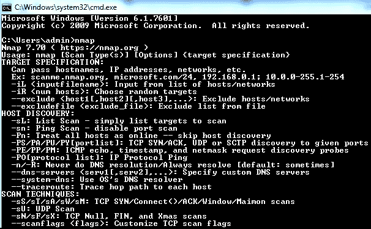
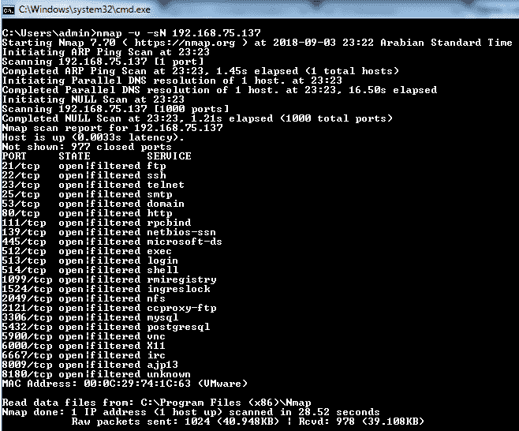
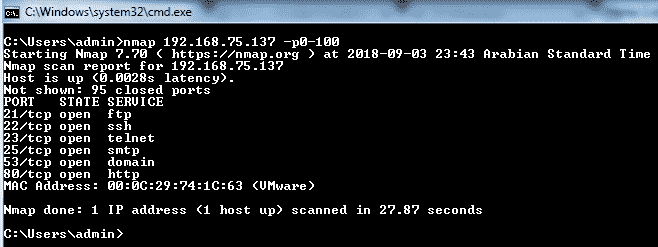
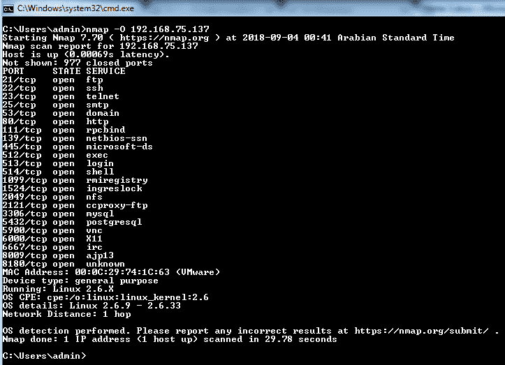
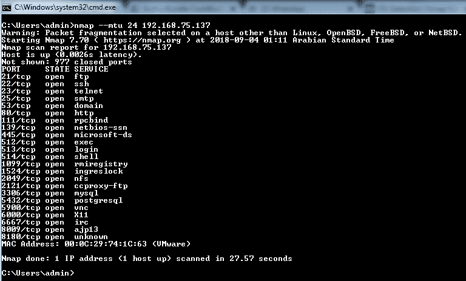
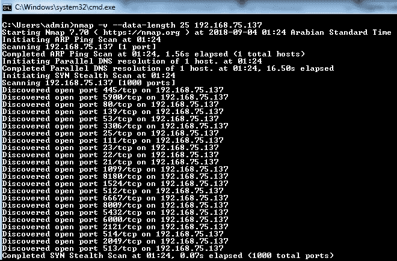
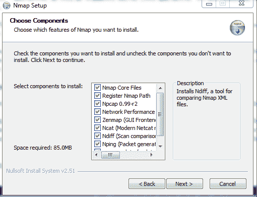
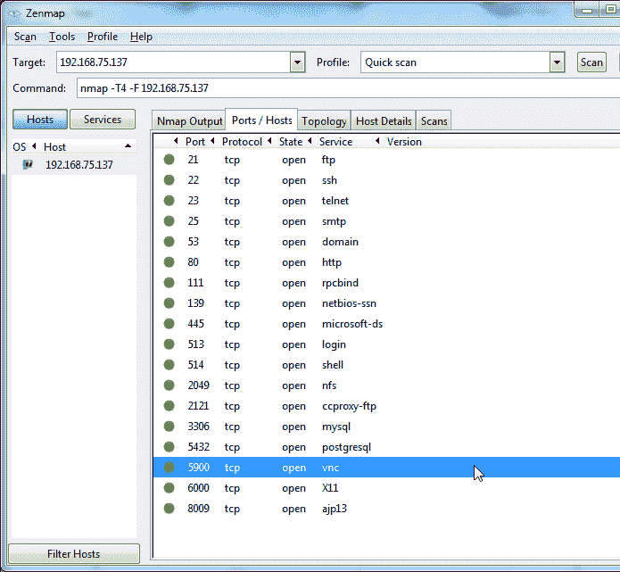
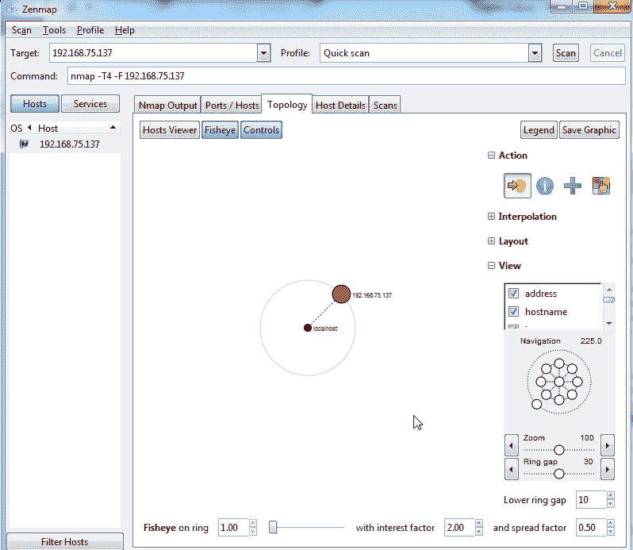

# 第三章：端口扫描

在本章中，我们将介绍以下配方：

+   如何指定目标

+   如何执行主机发现

+   如何识别开放端口

+   如何管理规范和扫描顺序

+   如何执行脚本和版本扫描

+   如何检测操作系统

+   如何检测和绕过网络保护系统

+   如何使用 Zenmap

# 介绍

在本章中，我们将介绍各种配方，解释如何利用 Nmap 执行各种端口扫描技术。每个配方都将包含有关在测试虚拟机上执行 Nmap 扫描的实用见解，从而使您了解 Nmap 支持的各种开关的功能。

# 如何指定目标

`nmap`命令将解释附加的任何内容，而不带有关联开关的目标。以下是指定要扫描的 IP 地址或主机名的基本语法：

```
nmap 127.0.0.1nmap localhost
```

主机名将与配置的 DNS 服务器解析，并获取 IP 地址执行扫描。如果一个主机名关联多个 IP 地址，则将扫描第一个 IP 地址并显示结果。以下语法允许`nmap`对命令中提供的主机名解析的所有 IP 地址执行扫描：

```
nmap xyz.com*
```

Nmap 还支持扫描整个子网，只要在 IP 地址或主机名的末尾附加掩码即可。然后，Nmap 将考虑所提及掩码范围内的所有解析 IP 地址。例如，`10.0.0.1/24`将扫描`10.0.0.1`和`10.0.0.255`之间的`256`个主机，包括`.1`和`.255`。`10.0.0.21/24`将扫描完全相同的目标。

Nmap 还允许您解析整个子网，然后排除某些主机进行扫描。例如，以下语法允许您扫描为`10.0.0.1/24`解析的所有主机，但排除最后网络位为`.1`或`.255`的任何 IP 地址：

```
nmap 10.0.0.2-254
```

这可以用于四个网络位中的任何一个，例如`10.0.1-254.1-254`，这将允许您跳过 IP 地址`10.0.0.0`，`10.0.0.255`，`10.0.255.0`和`10.0.255.255`。Nmap 还支持完全合格的 IPv6 地址，但不支持八位范围。对于具有非全局范围的 IPv6 地址，需要提及区域后缀 ID。

Nmap 支持各种输入格式，供用户指定目标。以下是可以用来提及指定格式上的主机的开关：

```
nmap –iL <inputfilename>
```

这将允许用户创建一个文本文件，其中列出了要扫描的所有 IP 地址/范围。当您有许多 IP 地址要扫描时，这是一个可行的选择。例如，如果您要扫描来自不同子网的所有 IP 地址，用于具有超过 10,000 个资产的中型组织，那么在命令行中输入这些 IP 地址是不可行的。相反，创建一个文本文件，列出要扫描的所有 IP 地址，并在`-iL`之后提及带有绝对路径的文件名。然后，`Nmap`从文件中获取 IP 地址列表并执行扫描：

```
nmap -iR <num hosts> 
```

对于大型组织和基于互联网的扫描，您可能希望扫描随机目标或识别未知目标。`-iR`开关与附加的要识别的随机主机数量将允许用户执行这些操作。例如，如果您要识别具有打开 ftp 端口的八个随机主机，则可以使用以下语法：

```
nmap –sS –Pn –p 21 –iR 8 --open
```

以下语法将帮助您在输入为服务器范围、子网或预先存在的大型服务器列表时排除服务器。与此开关一起提及的主机将被排除在扫描之外，从而防止服务器受到任何不必要的流量的影响：

```
nmap --exclude <host1>[,<host2>[,...]]
```

以下命令与前面的语法类似，只是主机排除列表是从文件中获取的，而不是手动提及服务器列表。当要排除的主机列表很长时，这是可行的：

```
nmap --excludefile <exclude_file>
```

# 准备工作

为了执行这项活动，您将需要满足您的机器上的以下先决条件：

+   安装 Nmap。

+   为要执行扫描的主机提供网络访问权限。

要安装 Nmap，您可以按照第二章中提供的说明进行操作，*了解网络扫描工具*。这将允许您下载兼容版本的 Nmap 并安装所有必需的插件。为了检查您的机器是否安装了 Nmap，请打开命令提示符并输入 Nmap。

如果安装了 Nmap，您将看到类似以下截图的屏幕：



如果您没有看到此屏幕，请将命令提示符控件移动到安装了 n`map`的文件夹中（`C:\Program Files\nmap`）重试该步骤。即使这样做后仍然看不到屏幕，请删除并重新安装 n`map`。

为了填充要扫描的主机上的开放端口，您需要对该特定主机具有网络级别的访问权限。通过向主机发送 ping 数据包来检查您是否可以访问特定主机的简单方法。但是，如果 ICMP 被禁用，活动主机检测技术会有所不同，我们将在本配方的*如何操作..*部分中看到这一点。

这个配方的先决条件对本章中的所有其他配方都是通用的。

# 如何操作...

以下是步骤：

1.  在命令提示符中打开`nmap`。

1.  在命令提示符中输入以下语法，扫描 IP 地址`192.168.75.136`：

```
nmap  192.168.75.136
```


1.  在命令提示符中输入以下语法，扫描`ip.txt`文件中存在的 IP 地址：

```
 nmap  -iL ip.txt
```


1.  在命令提示符中输入以下语法，从扫描列表中排除`192.168.75.136` IP 地址：

```
 nmap  -v 192.168.75.135/28 --exclude 192.168.75.136
```


1.  在命令提示符中输入以下语法，从扫描列表中排除`ip.txt`文件中提到的 IP 地址：

```
 nmap –v 192.168.75.135/28 --excludefile ip.txt
```


# 它是如何工作的...

本配方中提到的选项帮助用户根据自己的便利选择目标，而不管他们的网络规模或提供的主机列表大小如何。Nmap 不需要用户输入要扫描的最终主机列表。相反，正如本配方所示，它提供了各种选项，以动态允许 Nmap 根据各种过滤器选择目标。基于文件的过滤器允许 Nmap 输入一个现成的主机列表，从而减少了定制或格式化列表所需的工作量。

# 如何执行主机发现

识别运行主机的基本技术之一是发送 ICMP ping 数据包并分析响应以得出结论。如果主机或网络在网络级别或主机级别阻止 ICMP 数据包，会怎么样？根据 ICMP 技术，主机或网络将不会出现在活动主机列表中。主机发现是网络渗透测试或漏洞扫描的核心组成部分。未完成的主机发现可能会忽略主机或网络的范围并执行任何进一步的操作，从而使网络变得脆弱。

Nmap 提供各种选项和技术，通过发送定制的数据包来识别活动主机以满足特定的网络条件。如果没有提供这样的选项，Nmap 默认发送 ICMP 回显以识别活动主机。提供的探针选项可以组合以增加识别更多端口的几率。一旦 Nmap 探测到活动主机并获得活动主机列表，它将默认扫描开放端口。

Nmap 提供以下选项来执行主机发现：

+   –sL：此选项列出提供的子网中存在的 IP 地址。它还尝试将 IP 地址解析为其主机名。主机名可以帮助攻击者或渗透测试人员了解网络的大量信息。您将无法将其与其他选项（如 OS 发现）结合使用，因为其功能仅是列出 IP 地址。

+   `-sn`：此选项告诉 Nmap 在执行主机发现后不执行端口扫描。而是只列出找到的活动 IP 地址。这使用 ICMP 回显来识别可用主机，如果网络中存在防火墙，则无法正常工作。

+   `-Pn`（无 ping）：通常，Nmap 仅在发现主机活动时执行诸如探测、端口检测、服务检测和 OS 检测选项等活动。此选项允许 Nmap 对提供的主机列表执行所有扫描操作。例如，如果指定了一个带有子网`/28`的 C 类 IP 地址，则 Nmap 将对所有`255`个主机进行探测，而不是检查活动主机并对其执行活动。这是一个广泛的扫描选项，会产生大量流量。

+   `-PS`（端口列表）：此选项发送一个带有 SYN 标志的空 TCP 数据包。这也被称为 syn ping 数据包。通常，要进行完整的 TCP 连接，主机在接收到 SYN 数据包后会生成一个 ACK。一旦收到 ACK 数据包，Nmap 主机会生成一个 SYN/ACK 数据包，然后建立连接。相反，Nmap 发送一个 RST，即重置标志数据包，以关闭连接并声明端口为打开。这将允许您确定打开的端口，而无需实际创建连接，因为任何建立的连接都将在网络和系统级别记录下来。此选项还允许攻击者在执行检测时不留下任何痕迹。

`-PS`和端口号之间没有空格。您还可以指定要执行操作的端口范围。

+   `-PA`（端口列表）：这类似于 SYN 扫描，也称为 TCP ACK ping 扫描。Nmap 生成带有 ACK 的 TCP 数据包。ACK 基本上是确认连接传输的任何数据，但从 Nmap 机器到主机没有现有连接，因此会返回一个启用了 RST 标志的数据包。这将允许 Nmap 确定端口是打开的并且有服务正在运行。

+   `-PU`（端口列表）：这与 TCP 扫描类似，但此 UDP ping 扫描用于 UDP 端口。对于大多数端口，数据包为空，除非是特定于服务的端口，例如 DNS 和 NTP。如果 DNS ping 数据包到达关闭的端口，则 UDP 探测应该触发主机的 ICMP 不可达响应。如果未生成此响应或连接似乎处于空闲状态，则意味着端口正在运行并且端口上正在运行服务。

+   `-PY`（端口列表）：此开关生成包含 INIT 数据部分的 SCTP 数据包。这意味着您正在尝试建立连接。如果目标端口关闭，则会发送一个 ABORT 数据包；否则，连接将继续到四次握手的下一步，通过回复 INIT-ACK。一旦收到 INIT-ACK，Nmap 机器发送一个 INIT-ACK 并将端口标记为打开，而不是创建连接。

+   `-PO`（协议列表）：此协议列表扫描允许 Nmap 在数据包头中配置启用了一对协议的数据包，例如 ICMP 和 IGMP，以查看是否有任何主机不可达响应，从而确定目标端口不支持这些协议，从而将端口标记为关闭。

+   `-PR`（ARP Ping）：ARP 扫描允许 Nmap 向远程主机发送 ARP 请求。如果有任何响应，Nmap 会将主机标记为活动，而不检查任何其他结果。它还支持 IPv6。

+   `--disable-arp-ping`：这允许用户在网络设备或代理响应 ARP 请求时获得特定结果，从而使所有主机看起来都是活动的。

+   `--traceroute`：Traceroute 是一个后扫描模块，用于确定到达远程主机的最佳端口。这通过发送低 TTL 数据包来实现。

+   `-n`：这允许用户跳过 DNS 解析过程。这可能会很慢，因此扫描需要很长时间。

+   `-R`：此选项是`-n`的对应项。它要求 Nmap 对所有活动主机执行反向 DNS 解析。

+   `--system-dns`：这可以用来指定解析时使用的 DNS 服务器应该是主机上配置的 DNS 服务器。

+   `--dns-servers <server1>[,<server2>[,...]]`：此选项可用于定义用于反向 DNS 解析的特定 DNS 地址。

# 如何…

以下是步骤：

1.  在命令提示符中打开`nmap`。

1.  在命令提示符中运行以下语法，只执行活动扫描，而不探测端口扫描：

```
 nmap –sn -v 192.168.75.135/28
```


1.  在命令提示符中运行以下语法以执行无 ping 扫描：

```
 nmap –Pn -v 192.168.75.135/28
```


# 工作原理…

这些选项帮助用户简化其要求，以识别活动主机并进一步进行探测。使用这些不同的扫描选项，用户可以针对特定端口和协议获取主机的当前状态。大多数这些选项可以进一步配置高级探测技术，例如服务检测和操作系统检测的参数，以获取有关这些实例的更多信息。

# 如何识别打开的端口

以下是 Nmap 中存在的六种端口状态：

+   `open`：这意味着端口正在运行并且有一个服务正在访问它。因此，该服务可以接受根据端口上使用的协议和服务进行的任何连接。

+   `closed`：关闭的端口没有被任何服务访问，上面没有运行任何服务。因此，外部不会成功连接到这些端口。

+   `filtered`：此状态与由于网络中存在的数据包过滤机制而未收到响应的端口相关。这可能是由中间网络保护设备引起的。

+   `unfiltered`：此状态与 Nmap 无法确定端口是打开还是关闭有关。大多数 ACK 扫描标签端口处于未过滤状态；此外，SYN 和 FIN 等扫描可以帮助解决此类问题。

+   `Open|filtered`：当没有从端口收到响应时，Nmap 将此类型的端口分类。UDP、IP 协议、FIN、NULL 和 Xmas 扫描将此状态与端口相关联。

+   `closed|filtered`：此状态与 Nmap 无法确定端口是打开还是关闭有关。只有空闲扫描使用此状态。Nmap 为用户提供各种扫描选项，以便用户制作数据包以获取 Nmap 所需的结果，以便分类端口是打开还是关闭。大多数这些扫描类型仅允许管理员用户使用，因为他们可以创建和发送原始数据包。

+   `-sS（TCP SYN 扫描）`：这也被称为半开放扫描，因为 TCP 在建立连接之前需要完成三次握手。Nmap 机器生成一个 TCP SYN 数据包，远程端口响应 TCP ACK，然后 Nmap 发送一个 RST 标志来破坏握手，从而阻止连接。如果 Nmap SYN 数据包收到 ACK 或 SYN 数据包作为响应，则端口被认为是打开的。

+   `-sT（TCP 连接扫描）`：如果用户没有发送原始数据包的必要权限，或者 SYN 扫描不可行，将使用 TCP 连接扫描。顾名思义，Nmap 执行完整的三次握手并创建连接以将端口视为打开。

+   `-sU (UDP 扫描)`: UDP 扫描向知名端口发送一个数据包，如`53`和`61`，然后可以在所有端口上执行。它向著名端口发送特定于协议的数据包，并向其余端口发送通用 UDP 数据包。如果扫描的端口返回 ICMP 不可达错误，则该端口已关闭。但如果端口没有响应，则标记为开放过滤。为了找出端口是否实际运行了服务并且是开放的，我们可以运行服务检测扫描。

+   `-sY (SCTP INIT 扫描)`: SCTP INIT 扫描已经在*如何执行主机发现*部分讨论过。要执行此扫描，应该有一个正在运行的 SCTP 模块。

+   `-sN; -sF; -sX (TCP NULL、FIN 和 Xmas 扫描)`: 为了进行更深入的探测，Nmap 提供了一个选项，可以制作带有不同标志的数据包，如 FIN、PSH 和 URG。如果没有设置任何标志，则称为 Null 扫描。如果设置了 FIN 标志，则称为 FIN 扫描，如果设置了所有三个标志，则称为 Xmas 扫描。

+   `-sA (TCP ACK 扫描)`: TCP ACK 扫描已经在*如何执行主机发现*部分讨论过。

+   `-sW (TCP 窗口扫描)`: TCP 窗口扫描通过接收到的 RST 数据包的 TCP 窗口字段的值来工作。大多数系统对于关闭端口的 RST 数据包具有零窗口值，对于打开端口则具有正值。一旦接收到 RST 数据包，它将把端口列为关闭而不是未过滤。

+   `--scanflags (自定义 TCP 扫描)`: `自定义 TCP 扫描`允许用户在 TCP 数据包中设置各种标志，如 URG、SYN、ACK、FIN、PSH、URG 和 RST，从而允许用户为探测创建自定义数据包。

+   `-sO (IP 协议扫描)`: 此扫描允许您定义正在执行扫描的协议，如 TCP、UDP、ICMP 和 IGMP，因此为探测创建了一个特定的数据包。

+   `-b <FTP 中继主机> (FTP 反弹扫描)`: 这允许用户连接到一个 FTP 主机，然后将文件中继到另一个 FTP 主机，该主机在参数中提到。

# 如何做...

以下是步骤:

1.  在命令提示符中打开`nmap`。

1.  在命令提示符中运行以下语法以执行 TCP SYN 扫描：

```
 nmap –v –sS 192.168.75.137
```


1.  在命令提示符中运行以下语法以执行 TCP 连接扫描：

```
 nmap –v –sT 192.168.75.137
```


1.  在命令提示符中运行以下语法以执行 TCP NULL 扫描:

```
 nmap –v –sN 192.168.75.137
```



# 它是如何工作的...

这些选项帮助用户简化其需求，以识别开放的端口，从而执行进一步的攻击。使用这些不同的端口扫描选项，用户可以针对特定端口和协议获取端口的当前状态。可以通过获取确切的服务名称和版本来对端口进行进一步的侦察，我们将在本书的后续部分中看到。

# 如何管理规范和扫描顺序

Nmap 提供了各种选项，以随机或顺序指定要扫描的端口。所有 Nmap 扫描，默认情况下只扫描前 1,000 个端口，没有指定任何端口或提供任何特定的 NSE 脚本作为参数:

+   `-p <端口范围>`: 此选项可用于配置要以多种格式扫描的端口。它可以是一个范围或一个列表。语法的一般表示形式将是`–p1-65535`，如果要执行完整的端口扫描，或者`–p1`、`2`、`3`或`4`作为一个非连续的随机列表。

+   `--exclude-ports <端口范围>`: 当需要全端口扫描并排除一些端口时，准备要扫描的端口列表是一项繁琐的任务。在这种情况下，您可以使用排除端口标志来排除不需要扫描的端口。

+   `-F (快速(有限端口)扫描)`: 快速扫描进一步将默认扫描的端口数量从 1,000 减少到 100。这将极大地减少扫描时间，从而提供更快的结果，正如其名称所示。

+   `-r（不要随机化端口）`：默认情况下，Nmap 会对扫描的端口顺序进行随机化。此选项允许用户指示 Nmap 按照严格的顺序扫描端口。

+   `--port-ratio <ratio>`：使用比给定比例大的比例扫描 Nmap-services 文件中的所有端口。`<ratio>`必须在`0.0`和`1.0`之间。

+   `--top-ports <n>`：在排除了`--exclude-ports`指定的所有端口后，扫描 Nmap-services 文件中找到的`<n>`个最高比例的端口。`<n>`必须是`1`或更大。

# 如何做…

以下是步骤：

1.  在命令提示符中打开`nmap`。

1.  在命令提示符中运行以下语法以在端口`0-100`之间执行扫描：

```
 nmap 192.168.75.137 –p0-100
```



1.  在命令提示符中运行以下语法以在前`100`个端口上执行快速扫描：

```
 nmap –F 192.168.75.137
```


1.  在命令提示符中运行以下语法以执行不带任何端口规范的扫描：

```
 nmap 192.168.75.137
```


# 工作原理…

提供指定范围和列表中的端口的选项将允许用户优化其扫描，从而提供更快的结果，因为一般来说完整的端口扫描需要的时间是 1000 端口扫描或指定端口扫描的 10 倍。这也将允许用户找出具有特定开放端口的主机。

# 如何执行脚本和版本扫描

在进行渗透测试时，侦察对于通知测试的下一步非常重要。即使 Nmap 提供了开放端口和端口上运行的服务的版本，您仍需要知道正在运行的服务的确切版本或名称，以准备进一步的利用或获取对系统的进一步了解。

Nmap-service-probes 数据库包含特定的数据包构造技术，用于探测特定服务并分析从中收到的响应。Nmap 提供有关服务协议、应用程序名称、版本号、主机名、设备类型和操作系统系列的信息。有时还会确定服务是否开放连接，或者服务是否有默认登录可用：

+   `-sV`（版本检测）：此标志使 Nmap 能够对特定主机执行版本检测。此标志有可以与其一起使用的选项。

+   `--allports`：Nmap 跳过了一些在建立连接时启用默认功能的端口。此选项将使用户跳过任何此类排除，并根据提供的语法执行全端口扫描。

+   `--version-intensity <intensity>`：定义了配置探测版本的强度。此标志的值在`0-9`之间， 默认值为`7`。值越高，服务版本准确性越高。

+   `--version-light`：用于配置轻量级探测以减少扫描时间。

+   `--version-all`：这将将探测强度设置为`9`，从而使扫描变慢，并且结果有可能更准确。

+   `--version-trace`：这将打印有关正在执行的版本扫描的大量信息。

# 如何做…

以下是步骤：

1.  在命令提示符中打开`nmap`。

1.  在命令提示符中运行以下语法以在端口范围`0-100`上执行服务扫描：

```
 nmap –sV 192.168.75.137 –p0-100
```


1.  在命令提示符中运行以下语法以在端口范围`0-100`上执行服务扫描，并查看扫描的调试信息：

```
 nmap –sV 192.168.75.137 –p0-100 –version-trace
```


# 工作原理…

版本扫描有助于用户获取运行的服务的近似版本和名称。例如，如果用户确定远程主机上运行的 FTP 的某个版本，他们可以搜索该版本的相关漏洞，因为会有版本相关的漏洞。

# 如何检测操作系统

Nmap 使用 TCP/IP 堆栈指纹识别进行操作系统检测。这是通过制作自定义 TCP 和 UDP 数据包并分析它们的响应来完成的。在生成各种此类探测并将结果与`Nmap-os-db`数据库中的 2600 多个已知操作系统指纹进行比较后，提供操作系统版本。指纹提供了供应商名称、操作系统名称、操作系统生成、设备类型，以及它们的通用平台枚举（CPE）表示。Nmap 还为用户提供了一个选项，如果获得的指纹不在 Nmap 操作系统签名数据库中，则可以提交该指纹：

+   -O（启用操作系统检测）：这将为 Nmap 扫描启用操作系统检测。该标志进一步具有可以与其一起使用的选项。

+   --osscan-limit：当扫描主机列表时，此选项将通过跳过没有用于操作系统检测的开放端口的主机来减少扫描时间，从而为活动主机提供更快的结果。

+   --osscan-guess; --fuzzy：如果 Nmap 无法识别操作系统，它会尝试提供最接近的签名，签名之间的相似性应该非常高。这里列出的标志将允许 Nmap 更积极地猜测是否找到了确切的操作系统。

+   --max-os-tries：如果操作系统探测无法识别完美匹配，默认情况下 Nmap 会重试五次。这将允许用户限制这些尝试，从而节省大量扫描时间。

# 如何做…

以下是步骤：

1.  在命令提示符中打开`nmap`。

1.  在命令提示符中运行以下语法以执行操作系统检测：

```
nmap –O 192.168.75.137
```



# 它是如何工作的…

识别远程主机上运行的操作系统对于任何漏洞扫描或渗透测试过程都非常有用，因为这将使您能够区分适用的漏洞和利用。

# 如何检测和绕过网络保护系统

Nmap 的基本功能是生成自定义数据包并分析它们的响应，一旦它们被发送到远程主机。这有时是不被防火墙和入侵预防和检测系统等网络保护系统允许的。在本教程中，我们将讨论一些可以用来绕过这些保护的方法。

+   -f（分段数据包）：大多数防火墙执行有状态和无状态数据包检查，它们检查数据包的内容并根据其内容决定是否允许数据包通过。为了绕过这一点，Nmap 提供了一个选项来分段数据包，以便网络设备无法构造数据包以读取正确的内容，从而绕过保护。

+   --mtu（最大传输单元规范）：这与创建不同大小的数据包的先前方法类似。使用 MTU，您可以指定数据包大小的倍数为`8`，如`8`、`16`、`24`、`32`等。这将允许 Nmap 创建这个大小的数据包，从而绕过保护。

+   -D（伪装地址）：这将允许 Nmap 从伪装地址生成数据包。这将使用多个源 IP 地址生成类似的流量，从而使网络保护系统难以确定流量生成的来源。

+   --source-port（源端口规范）：如果网络设备配置为禁止从特定端口生成的流量，使用此选项设置一个随机端口号将允许您绕过网络保护系统上的此配置。

+   --data-length（随机数据附加）：使用此选项，您可以向 Nmap 生成的数据包添加数据，然后创建一个包含大量不必要的随机数据的数据包，使网络保护系统难以理解和阻止流量。

+   --randomize-hosts（随机化主机）：此选项将允许 Nmap 通过生成无模式流量来随机扫描主机，这可能会被网络保护系统忽略。

+   `--spoof-mac`（MAC 地址欺骗）：此选项将允许用户绕过网络保护系统设置的任何 MAC 地址限制。

# 如何做…

以下是步骤：

1.  在命令提示符中打开`nmap`。

1.  在命令提示符中运行以下语法以执行生成分段数据包的扫描：

```
 nmap -f 192.168.75.137
```


1.  在命令提示符中运行以下语法以执行扫描以生成具有 MTU 规范的数据包：

```
 nmap –mtu 24 192.168.75.137 
```



1.  在命令提示符中运行以下语法以执行从所述 IP 地址进行的诱饵扫描：

```
 nmap –D 192.168.75.138 192.168.75.137
```


1.  在命令提示符中运行以下语法以执行扫描以向数据包附加随机数据：

```
 nmap -v  --data-length 25 192.168.75.137
```



# 它是如何工作的…

诸如防火墙、入侵预防和检测系统之类的网络保护系统可能会通过丢弃 Nmap 生成的探测数据包而产生误报。绕过技术可用于在侦察中获得更好的结果。

# 如何使用 Zenmap

Zenmap 是 Nmap 的图形界面。它是开源的，并且与 Nmap 相同的安装包一起提供：



有时，使用命令行工具对管理员来说可能很繁琐，因此 Zenmap 充当了替代的图形用户界面选项。

# 如何做…

以下是步骤：

1.  从程序列表中打开 Zenmap。

1.  在提供的文本字段中输入要扫描的目标，如下所示：


1.  从配置文件下拉列表中选择快速扫描，如下所示：


1.  这将使用`-F`选项执行快速扫描，从而在不同选项卡中显示前 100 个端口的结果以及详细分析，如下图所示：


端口/主机选项卡显示了基于扫描中选择的选项的各种开放端口以及运行在其上的服务和版本：



拓扑选项卡显示了检测到的网络拓扑结构。这将帮助攻击者在扫描整个子网时绘制整个网络：



主机详细信息选项卡提供有关 MAC 地址、主机状态、开放和过滤端口数量等信息：


# 它是如何工作的…

一旦用户选择了扫描类型和 Zenmap 提供的各种其他选项，并继续扫描，Zenmap 界面将调用后端的 Nmap 引擎来执行类似于命令行界面的操作：


Zenmap 还提供了各种其他选项，用于过滤主机、比较结果、搜索扫描结果、保存扫描结果等。
