# 第七章：理解 Nessus 和 Nmap 的自定义和优化

在本章中，我们将涵盖以下内容：

+   理解 Nmap 脚本引擎及其自定义

+   理解 Nessus 审计策略及其自定义

# 介绍

从前几章可以清楚地看出，Nmap 脚本引擎和 Nessus 的合规性审计策略是执行全面审计和检查的重要组成部分。用户非常重要的是要了解这些组件的工作原理以及各种定制技术，以执行特定操作。在本章中，我们将详细了解 Nmap 脚本引擎和 Nessus 审计文件的构成，以创建自定义文件并执行特定操作。

# 理解 Nmap 脚本引擎及其自定义

Nmap 脚本引擎用于运行用户编写的自定义脚本，以自动执行网络级别的操作。通常，Nmap 脚本以`.nse`扩展名结尾。这些脚本用于执行以下任务：

+   **主机和端口发现**：Nmap 被广泛使用的整个目的是执行简单的任务，以检查远程主机是在线还是离线，以及端口的当前状态。

+   **版本检测**：Nmap 具有各种应用程序和服务签名的数据库，这些签名与从端口接收的响应进行检查，以识别端口上运行的服务，有时还包括特定版本。

+   **受影响的漏洞**：Nmap 脚本引擎允许用户确定特定端口/服务是否容易受到特定已披露的漏洞的攻击。它取决于用户编写的脚本，从正在运行的服务中查询数据，并根据响应发送自定义数据包，以确定端口/服务是否实际上容易受到攻击。Nmap 脚本使用 Lua 编程语言，我们将在本文中研究一些语法，以编写自定义脚本。所有 Nmap 脚本分为以下类别：

+   `认证`：这类脚本处理与任何身份验证相关的检查，例如默认用户名和密码登录，匿名和空登录。

+   `广播`：这类脚本用于动态添加新发现的主机，这些主机将由 Nmap 进行扫描，允许用户同时执行完整的网络发现和扫描。

+   `暴力`：这类脚本用于进行暴力破解攻击，猜测各种服务的密码，例如 HTTP、数据库、FTP 等。

+   `默认`：这类脚本与所有未在命令行中指定的特定脚本一起运行。

+   `发现`：这类脚本用于获取有关网络服务及其在网络中的共享资源的更多信息。

+   `dos`：这类脚本可能是 Nmap 脚本中最不受欢迎的。这些脚本用于测试导致**拒绝服务**（DoS）攻击的漏洞，通过使服务崩溃。

+   `利用`：这些脚本用于利用特定漏洞。

+   `外部`：这类脚本使用外部资源来执行给定的任务。例如，对于任何与 DNS 相关的脚本，Nmap 将不得不查询本地 DNS 服务器。

+   `模糊器`：这类脚本用于生成随机有效载荷，以利用特定服务。服务对这些有效载荷的响应可用于确定特定服务是否容易受到攻击。

+   `侵入式`：这类脚本用于直接利用漏洞。这些扫描必须在侦察后的后期阶段使用。

+   `恶意软件`：这类脚本允许用户确定远程主机是否受到任何恶意软件的影响或是否有任何后门打开。

+   `安全`：这类脚本用于获取网络中所有人都可以访问的数据，例如横幅、密钥等。

+   `version`：此类别的脚本用于识别和确定远程主机上运行的服务的版本。

+   `vuln`：此类别的脚本用于验证特定的漏洞。

# 语法

以下是在`nmap`命令中执行脚本所需的参数：

+   `--script <filename>|<category>|<directory>|<expression>`：此参数允许用户指定要执行的脚本，其中文件名、类别、目录和表达式依次跟随以帮助用户选择脚本。为了执行这些脚本，它们需要存在于 Nmap 安装目录的脚本文件夹中：

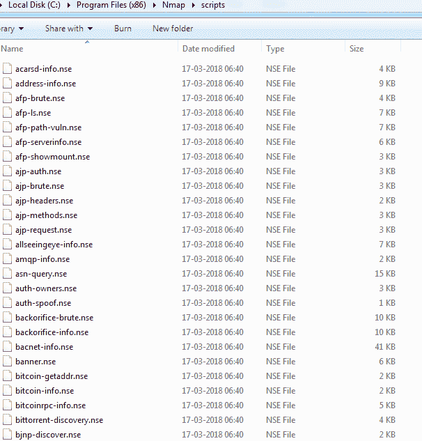

此处使用的通用语法如下：

```
nmap  --script afp-ls.nse <host>
```

+   `--script-args`：如果需要，这允许用户向`nmap`命令传递输入。此处使用的通用语法如下：

```
nmap  --script afp-ls.nse --script-args <arguments> <host>
```

+   `--script-args-file`：这允许用户将文件输入上传到`nmap`命令。此处使用的通用语法如下：

```
nmap  --script afp-ls.nse --script-args-file <filename/path> <host>
```

+   `--script-help <filename>|<category>|<directory>|<expression>`：此参数允许用户获取有关可用脚本的更多信息。此处使用的通用语法如下：

```
nmap  --script-help <filename>
```


由于输出量很大，我们将其保存到名为`output.txt`的文件中，保存在`D`驱动器中。在文本编辑器中打开`output`文件以查看帮助消息：


+   `--script-trace`：如果使用，此参数将允许用户查看脚本执行的网络通信：

```
nmap  --script afp-ls.nse –script-trace <hostname>
```

+   `--script-updatedb`：用于更新 Nmap 使用的脚本数据库。此处使用的通用语法如下：

```
nmap  --script-updatedb
```

# 环境变量

以下是准备 Nmap 脚本时使用的环境变量：

+   `SCRIPT_PATH`：描述脚本的路径

+   `SCRIPT_NAME`：描述脚本的名称

+   `SCRIPT_TYPE`：此变量用于描述脚本为远程主机调用的规则类型

以下是一个简单 Nmap 脚本的结构：

```
//Rule section
portrule = function(host, port)
    return port.protocol == "tcp"
            and port.number == 25
            and port.state == "open"
end

//Action section
action = function(host, port)
    return "smtp port is open"
end
```

# 脚本模板

Nmap 脚本基本上分为三个部分，这里进行了讨论。我们将使用[`svn.nmap.org/nmap/scripts/smtp-enum-users.nse`](https://svn.nmap.org/nmap/scripts/smtp-enum-users.nse)中的脚本作为示例来定义这些类别中的数据：

+   `Head`**：此部分包含脚本的描述性和依赖性相关数据，以下是各种支持的组件：

+   `description`：此字段充当脚本的元数据，并描述有关脚本功能的重要信息，以便用户使用。它尝试通过发出`VRFY`、`EXPN`或`RCPT TO`命令来枚举 SMTP 服务器上的用户。此脚本的目标是发现远程系统中的所有用户帐户。脚本将输出找到的用户名列表。如果强制进行身份验证，脚本将停止查询 SMTP 服务器。如果在测试目标主机时发生错误，将打印错误以及在错误发生之前找到的任何组合的列表。用户可以指定要使用的方法及其顺序。脚本将忽略重复的方法。如果未指定，脚本将首先使用`RCPT`，然后使用`VRFY`和`EXPN`。如下所示是指定要使用的方法和顺序的示例：

```
description = [[
<code>smtp-enum-users.methods={EXPN,RCPT,VRFY}</code>
]]
```

+   +   `Categories`：此字段允许用户通过提及脚本所属的类别来映射脚本的性质。如前文所述，我们可以使用`smtp-enum-users.nse`脚本中的以下语法来提及类别：

```
categories = {"auth","external","intrusive"}
```

+   +   `author`：此字段允许脚本的作者提供有关自己的信息，如姓名、联系信息、网站、电子邮件等：

```
author = "Duarte Silva <duarte.silva@serializing.me>"
```

+   +   `license`: 此字段用于提及分发脚本所需的任何许可证详细信息，以及标准 Nmap 安装：

```
license = "Same as Nmap--See https://nmap.org/book/man-legal.html"
```

+   +   `dependencies`: 该字段定义了脚本的运行级别，这意味着如果任何脚本依赖于其他脚本的输出，可以在此处提及，从而允许依赖脚本首先执行。然后可以将此输出传递给脚本二：

```
dependencies = {"dependant script"}
```

+   +   **脚本库**: Nmap 脚本引擎使用变量允许在类似服务上构建不同的脚本。通过使用库的依赖项，作者可以编写全面且小型的脚本。以下表格解释了一些扫描库：

| Ajp | cassandra |
| --- | --- |
| Amqp | citrixxml |
| asn1 | Comm |
| base32 | Creds |
| base64 | Cvs |
| Bin | Datafiles |
| Bit | Dhcp |
| Bitcoin | dhcp6 |
| Bittorrent | Dns |
| Bjnp | Dnsbl |
| Brute | Dnssd |
| Eigrp | Drda |
| ftp | Eap |

作为参考，我们可以查看[`svn.nmap.org/nmap/scripts/smtp-enum-users.nse`](https://svn.nmap.org/nmap/scripts/smtp-enum-users.nse)上的脚本，以了解库是如何定义的：

```
local nmap = require "nmap"
local shortport = require "shortport"
local smtp = require "smtp"
local stdnse = require "stdnse"
local string = require "string"
local table = require "table"
local unpwdb = require "unpwdb"
```

这些库中定义了各种函数，我们可以使用以下语法传递参数：`<function name>(arg1, arg2, arg3)`。例如，`smtp.check_reply("MAIL", response)`。

+   `Rules`: 脚本规则用于根据 true 或 false 的布尔结果确定是否要扫描远程主机。只有在规则返回 true 时才会扫描主机。以下是脚本对主机应用的规则：

+   `prerule()`: 该规则在对主机执行扫描之前执行

+   `hostrule(host),portrule(host, port)`: 这些规则在使用提供的脚本扫描每组主机后执行

+   `postrule()`: 该规则在所有主机扫描完成后执行

以下是示例脚本`smtp-enum-users.nse`中使用的规则：

```
portrule = shortport.port_or_service({ 25, 465, 587 },
  { "smtp", "smtps", "submission" })
```

+   `Action`: 该部分包括脚本执行的操作。一旦执行操作，它将根据用户所见的特定结果返回一个特定的结果。以下是示例脚本`smtp-enum-users.nse`的操作部分：

```
action = function(host, port)
  local status, result = go(host, port)
  -- The go function returned true, lets check if it
  -- didn't found any accounts.
  if status and #result == 0 then
    return stdnse.format_output(true, "Couldn't find any accounts")
  end
```

其中一些库要求脚本以特定格式存在，并且必须使用 NSEDoc 格式。我们将在本教程中看到如何将脚本适应这样的格式。在本教程中，我们将看到如何创建一个脚本，以确定远程主机上是否存在默认的 Tomcat 文件。

# 准备工作

要完成此活动，您必须满足计算机上的以下先决条件：

+   您必须安装 Nmap。

+   您必须对要执行扫描的主机具有网络访问权限。

要安装 Nmap，可以按照第二章中提供的说明进行操作，*了解网络扫描工具*。这将允许您下载兼容版本的 Nmap 并安装所有必需的插件。要检查您的计算机是否安装了 Nmap，请打开命令提示符并键入`nmap`。如果安装了 Nmap，您将看到类似以下的屏幕：


如果您没有看到上述屏幕，请将命令提示符控制移动到 Nmap 安装的文件夹（`C:\Program Files\Nmap`）中，然后重试相同的步骤。如果在此之后仍未看到上述屏幕，请删除并重新安装 Nmap。

为了填充要进行扫描的主机上的开放端口，您需要对该特定主机具有网络级访问权限。通过向主机发送 ping 数据包来检查您是否可以访问特定主机的一种简单方法是通过 ICMP。但是，如果在该网络中禁用了 ICMP 和 ping，则此方法仅在 ICMP 和 ping 启用时才有效。如果禁用了 ICMP，则活动主机检测技术会有所不同。我们将在本书的后面部分更详细地讨论这个问题。

为了获得所示的输出，您需要安装一个虚拟机。为了能够运行虚拟机，我建议使用 VMware 的 30 天试用版本，可以从[`www.vmware.com/products/workstation-pro/workstation-pro-evaluation.html`](https://www.vmware.com/products/workstation-pro/workstation-pro-evaluation.html)下载并安装。

对于测试系统，读者可以从[`information.rapid7.com/download-metasploitable-2017.html`](https://information.rapid7.com/download-metasploitable-2017.html)下载 Metasploitable（Rapid 7 提供的一个易受攻击的虚拟机）。按照以下步骤打开 Metasploitable。这提供了各种组件，如操作系统、数据库和易受攻击的应用程序，这将帮助我们测试本章的示例。按照以下说明开始：

1.  解压下载的 Metasploitable 软件包

1.  使用安装的 VMware Workstation 或 VMware Player 打开`.vxm`文件

1.  使用`msfadmin`/`msfadmin`作为用户名和密码登录

# 如何做...

执行以下步骤：

1.  打开文本编辑器，并定义三个部分，`Head`，`Rule`和`Action`，如下截图所示：

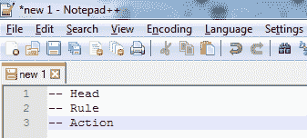

1.  让我们从`Head`部分开始。以下是在`Head`部分中需要提到的参数，使用以下代码：

```
-- Head
description = [[Sample script to check whether default apache files are present]]
author = "Jetty"
license = "Same as Nmap--See http://nmap.org/book/man-legal.html"
categories = {"default", "safe"}
-- Rule
-- Action
```

1.  现在，让我们使用以下代码定义脚本运行所需的库：

```
local shortport = require "shortport"
local http = require "http"
```

为了使脚本编写端口规则，我们需要使用`shortport`和`http`。我们使用`shortport`生成端口规则，使用`http`简化与 HTTP 和 HTTPS 页面的通信。

1.  现在让我们从规则部分开始，引入`shortport`库中包含的`shortport`规则。这允许 Nmap 在端口打开时调用操作：

```
portrule = shortport.http
```

1.  一旦`Head`和`Rule`部分完成，我们所要做的就是定义`action`页面来执行决定性操作，并确定 URI 中提到的位置是否存在默认的 Tomcat 文档。

```
action = function(host, port)
    local uri = "/tomcat-docs/index.html"
    local response = http.get(host, port, uri)
    if ( response.status == 200 ) then
        return response.body
    end
end
```

在操作部分，我们正在定义需要检查默认文件的 URI。我们使用`http.get`函数获取响应，并将其保存在变量 response 中。然后，我们设置了一个 if 条件来检查从服务器接收到的 HTTP 响应是否包含 HTTP 代码 200，这表示页面已成功获取。现在，为了实际查看网页的内容，我们使用`response.body`打印接收到的响应。

1.  现在让我们尝试执行我们写的脚本，以检查它是否工作或需要故障排除。以下是脚本的截图。将其保存到 Nmap 安装目录中的 scripts 文件夹中，名称为`apache-default-files.nse`：


使用以下语法执行脚本：

```
nmap --script apache-default-files 192.168.75.128 -p8180 -v
```

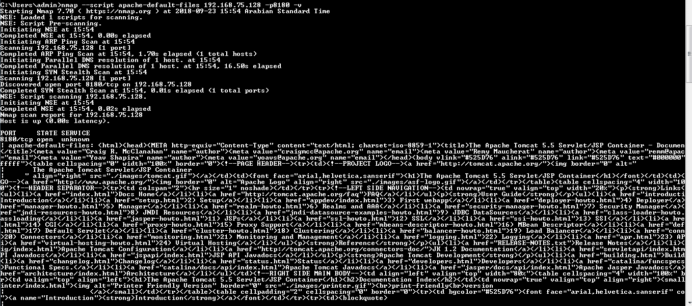

上述截图显示脚本已成功执行，并且检索到的页面是 Apache Tomcat 的默认页面。这意味着主机易受攻击。现在，我们可以将返回变量的值更改为易受攻击，而不是打印如此繁重的输出。

并不总是得出 200 响应意味着远程主机易受攻击的结论，因为响应可能包含自定义错误消息。因此，建议包括基于正则表达式的条件来得出相同的结论，然后相应地返回响应。

1.  让我们进一步装饰脚本的格式，并为其编写脚本文档，通过在`Head`部分添加以下行：

```
---
-- @usage
-- nmap --script apache-default-files` <target>
-- @output
-- PORT   STATE SERVICE
-- |_apache-default-files: Vulnerable
```

脚本现在看起来像这样：

```
-- Head
description = [[Sample script to check whether default apache files are present]]
author = "Jetty"
license = "Same as Nmap--See http://nmap.org/book/man-legal.html"
categories = {"default", "safe"}

---
-- @usage
-- nmap --script apache-default-files` <target>
-- @output
-- PORT   STATE SERVICE
-- |_apache-default-files: Vulnerable

local shortport = require "shortport"
local http = require "http"

-- Rule
portrule = shortport.http

-- Action
action = function(host, port)
    local uri = "/tomcat-docs/index.html"
    local response = http.get(host, port, uri)
    if ( response.status == 200 ) then
        return "vulnerable"
    end
end
```

1.  将脚本保存在 Nmap 安装目录的`scripts`文件夹中，并使用以下语法执行它：

```
nmap --script apache-default-files 192.168.75.128 -p8180 -v
```

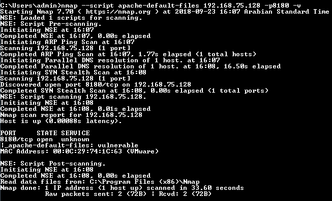

# 工作原理...

您可以使用类似的技术通过使用复杂的库和 Lua 语言的多个函数来创建复杂的脚本。可以使用`-A`参数基于端口和可用服务一起执行这些脚本。这将减少用户在提及每个所需脚本方面的工作量。

# 了解 Nessus 审计策略及其自定义

Nessus 审计文件由自定义基于 XML 的规则组成，用于执行各种平台的配置审计。这些文件允许用户执行当前配置的值和基于正则表达式的比较，并确定存在的差距。通常，预期这些审计文件是根据行业标准基线准备的，以便显示实际的合规差距，并且管理团队可以同时进行加固和合规工作。自定义审计文件应保存为扩展名`.audit`。

以下是审计文件中检查的通用语法：

```
<item>
 name                       : " "
 description            :  " "
 info                           : " "
 value                        : " "
</item>
```

我们将查看一些 Windows 的标准检查，以便了解各种通用和自定义检查。所有默认检查都以`<item>`开头，所有自定义检查都以`<custom_item>`开头：

+   **值数据**：审计文件中的关键字可以根据`value_data`标签分配数据。此部分描述了可以在审计文件中定义的不同关键字以及它们可以保存的值。`value_data`的数据类型为 DWORD。`value_data`还可以使用算术符号（如`||`、`&&`等）来提供复杂表达式：

+   `Check_type`：此属性用于比较从远程主机获取的值是否为策略值，并根据配置的属性返回结果。此属性的某些版本如下：

+   `CHECK_EQUAL`

+   `CHECK_EQUAL_ANY`

+   `CHECK_NOT_EQUAL`

+   `CHECK_GREATER_THAN`

+   `CHECK_GREATER_THAN_OR_EQUAL`

+   **信息**：这是一个可选字段，用于添加有关正在执行的检查的信息。其语法如下：

```
info: "Password policy check"
```

+   +   **调试**：此关键字可用于获取用于排除故障的信息。这会生成关于检查执行的逐步数据，允许作者了解错误。

+   **访问控制列表格式**（**ACL**）：此设置部分包含可以保存值以检测所需 ACL 设置是否已应用于文件的关键字。ACL 格式支持六种不同类型的访问列表关键字，如下：

+   文件访问控制检查（`file_acl`）

+   注册表访问控制检查（`registry_acl`）

+   服务访问控制检查（`service_acl`）

+   启动权限控制检查（`launch_acl`）

+   访问权限控制检查（`access_acl`）

前述关键字可用于定义特定用户的文件权限，以下是相关类型。这些权限类别可能对不同的关键字有不同的更改：

+   +   +   `Acl_inheritance`

+   `Acl_apply`

+   `Acl_allow`

+   `Acl_deny`

这些关键字对文件夹有不同的权限集。以下是可以使用`file_acl`的语法：

```
<file_acl: ["name"]>
<user: ["user_name"]>
acl_inheritance: ["value"]
acl_apply: ["value"]
</user>
</acl>
```

可以通过将`file_acl`替换为相应的关键字来使用所有其他关键字的类似语法。

+   **项目**：项目是检查类型，并可用于执行预定义的审计检查。这减少了语法，因为策略是预定义的，并且在此处使用属性进行调用。以下是项目的结构：

```
<item>
name: ["predefined_entry"]
value: [value]
</item>
```

该值可以由用户定义，但名称需要与预定义策略中列出的名称匹配。以下是我们将在此处使用的一些关键字和标记，以创建自定义的 Windows 和 Unix 审计文件。

+   +   `check_type`：每个审计文件都以`check_type`标签开头，其中可以定义操作系统和版本。一旦审计文件完成，需要关闭此标签以标记审计文件的结束：

```
<check_type:"Windows" version:" ">
```

+   +   `name`: `name`属性需要与预定义策略中的名称相同，以便从预定义策略中获取逻辑：

```
name: "max_password_age"
```

+   +   `type`: 类型变量保存了用于特定检查的策略项的名称：

```
type: PASSWORD_POLICY
```

+   +   `description`: 此属性保存了检查的用户定义名称。这可以是任何有助于识别检查中正在进行的操作的内容：

```
description: " Maximum password age"
```

+   +   `info`: 此属性通常用于保存逻辑，以便用户了解检查中执行的操作：

```
info: "Maximum password age of 60 days is being checked."
```

+   +   `Value`: 此属性是 DWORD 类型，包括要与主机上的远程值进行比较的策略值：

```
Value: "8"
```

+   +   `cmd`: 这个属性保存了要在远程系统上执行的命令，以获取正在检查的项目的值：

```
cmd : "cat /etc/login.defs | grep -v ^# | grep PASS_WARN_AGE | awk {'print $2'}"
```

+   +   `regex`: 此属性可用于执行基于正则表达式的远程值比较。然后可以将其与策略值进行比较，以确保检查成功，即使配置存储在不同的格式中：

```
regex: "^[\\s]*PASS_WARN_AGE\\s+"
```

+   +   `expect`: 此策略项包括预期在设备上配置的基线策略值。否则，它用于报告配置中的差距：

```
expect: "14"
```

+   +   `Custom_item`: 自定义审核检查是由用户使用 NASL 定义的，并根据检查中提供的说明由 Nessus 合规性解析器解析的内容。这些自定义项目包括自定义属性和自定义数据值，这将允许用户定义所需的策略值并相应地准备审核文件。

+   +   `value_type`: 此属性包括当前检查允许的不同类型的值：

```
value_type: POLICY_TEXT
```

+   +   `value_data`: 此属性包括可以输入检查的数据类型，例如：

+   `value_data: 0`

+   `value_data: [0..20]`

+   ``value_data: [0..MAX]``

+   +   `Powershell_args`: 此属性包括要传递并在 Windows 系统上执行的`powershell.exe`的参数。

+   +   `Ps_encoded_args`: 此属性用于允许将 PowerShell 参数或文件作为 Base 64 字符串传递给 PowerShell，例如，`powershell_args`：

```
'DQAKACIAMQAwACADFSIGHSAPFIUGHPSAIUFHVPSAIUVHAIPUVAPAUIVHAPIVdAA7AA0ACgA='
ps_encoded_args: YES
```

在这个教程中，我们将创建一个 Windows 审核文件，以检查系统分区中的可用磁盘空间。

# 准备就绪

为了完成这个活动，您需要满足机器上的以下先决条件：

+   您必须安装 Nessus。

+   您必须能够访问要执行扫描的主机的网络。

要安装 Nessus，您可以按照第二章中提供的说明进行操作，*了解网络扫描工具*。这将允许您下载兼容版本的 Nessus 并安装所有必需的插件。要检查您的机器是否安装了 Nessus，请打开搜索栏并搜索`Nessus Web Client`。找到并点击后，它将在默认浏览器窗口中打开：


如果您确定 Nessus 已正确安装，您可以直接从浏览器使用[`localhost:8834`](https://localhost:8834) URL 打开 Nessus Web Client。如果找不到 Nessus Web Client，则应删除并重新安装 Nessus。有关删除 Nessus 和安装说明，请参阅第二章，*了解网络扫描工具*。如果找到了 Nessus Web Client，但无法在浏览器窗口中打开它，则需要检查 Windows 服务实用程序中是否正在运行 Nessus 服务：


您可以根据需要使用**服务**实用程序进一步启动和停止 Nessus。为了进一步确认安装使用命令行界面，您可以导航到安装目录以查看和访问 Nessus 命令行实用程序：


建议始终使用管理员级别或根级别凭据，以便为扫描仪提供对所有系统文件的访问权限。这将允许扫描仪执行更深入的扫描，并与非凭证扫描相比提供更好的结果。策略合规模块仅在 Nessus 的付费版本中可用，例如 Nessus 专业版或 Nessus 管理器。为此，您将需要从 Tenable 购买激活密钥，并在**设置**页面中更新它，如下图所示：

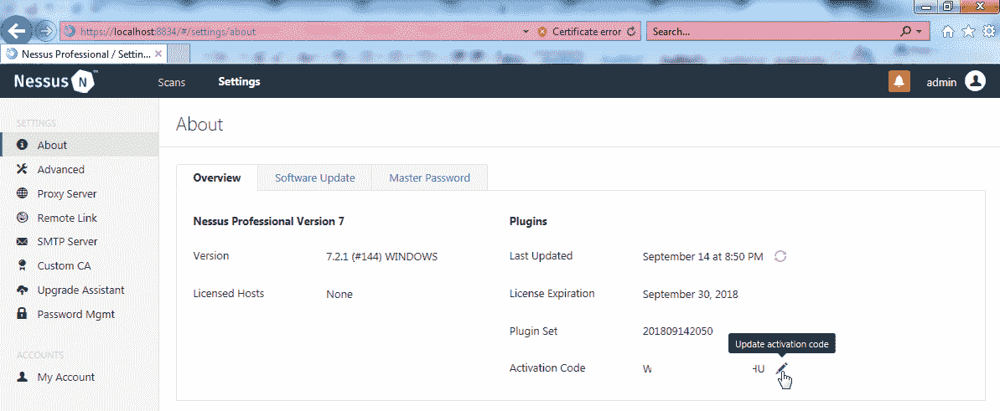

单击编辑按钮打开窗口，并输入您从 Tenable 购买的新激活码：

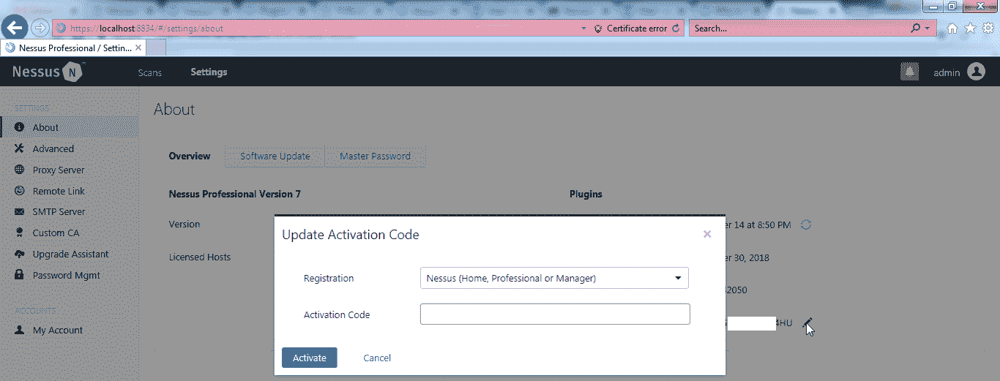

# 如何操作…

执行以下步骤：

1.  打开 Notepad++或任何文本编辑器。

1.  为了创建一个自定义项目的 Windows 检查，我们需要用`custom_item`标签开始和结束检查：

```
<custom_item>

</custom_item>
```

1.  现在，我们需要识别所需的元数据属性并定义它们。在这种情况下，我们将使用`description`和`info`：

```
<custom_item>

 description: "Free disk space in system partition#C drive"
 info: "Powershell command will output the free space available on C drive"

</custom_item>
```

1.  现在，我们需要定义我们需要执行的检查类型。Nessus 在 PowerShell 上执行所有 NASL Windows 命令，因此检查的类型将是`AUDIT_POWERSHELL`：

```
<custom_item>

type: AUDIT_POWERSHELL
 description: "Free disk space in system partition#C drive"
 info       : "Powershell command will output the free space available on C drive"

</custom_item>
```

1.  现在，我们需要定义检查支持的值类型和值数据。在这种情况下，我们将选择策略类型，并将`0`设置为`MAX`：

```
<custom_item>

type: AUDIT_POWERSHELL
 description: "Free disk space in system partition#C drive"
 info       : "Powershell command will output the free space available on C drive"
 value_type: POLICY_TEXT
 value_data: "[0..MAX]"

</custom_item>
```

1.  现在，我们需要传递要由 PowerShell 执行的命令以获取`C`驱动器中的可用空间：

```
<custom_item>

 type: AUDIT_POWERSHELL
 description: "Free disk space in system partition#C drive"
 info       : "Powershell command will output the free space available on C drive"
 value_type: POLICY_TEXT
 value_data: "[0..MAX]"
 powershell_args   : 'Get-PSDrive C | Select-Object Free'

</custom_item>
```

1.  由于我们没有将编码命令传递给 PowerShell，因此我们需要使用`ps_encoded_args`属性定义相同的内容：

```
<custom_item>

 type: AUDIT_POWERSHELL
 description: "Free disk space in system partition#C drive"
 info       : "Powershell command will output the free space available on C drive"
 value_type: POLICY_TEXT
 value_data: "[0..MAX]"
 powershell_args   : 'Get-PSDrive C | Select-Object Free'
 ps_encoded_args: NO

</custom_item>
```

1.  由于它不需要任何精炼，命令的输出就足够了，这样我们就知道有多少可用空间，我们还将定义`only_show_cmd_output: YES`属性：

```
<custom_item>

 type: AUDIT_POWERSHELL
 description: "Free disk space in system partition#C drive"
 info       : "Powershell command will output the free space available on C drive"
 value_type: POLICY_TEXT
 value_data: "[0..MAX]"
 powershell_args   : 'Get-PSDrive C | Select-Object Free'
 ps_encoded_args: NO
 only_show_cmd_output: YES

</custom_item>
```

正如我们所看到的，所有审计文件都以`check_type`开头和结尾，我们将前面的代码封装在其中：

```
<check_type:"windows" version:"2">
<custom_item>

 type: AUDIT_POWERSHELL
 description: "Free disk space in system partition#C drive"
 info       : "Powershell command will output the free space available on C drive"
 value_type: POLICY_TEXT
 value_data: "[0..MAX]"
 powershell_args   : 'Get-PSDrive C | Select-Object Free'
 ps_encoded_args: NO
 only_show_cmd_output: YES

</custom_item>
</check_type>
```

1.  将文件保存为扩展名为`.audit`的文件到您的系统上，并使用安装过程中创建的凭据登录 Nessus：

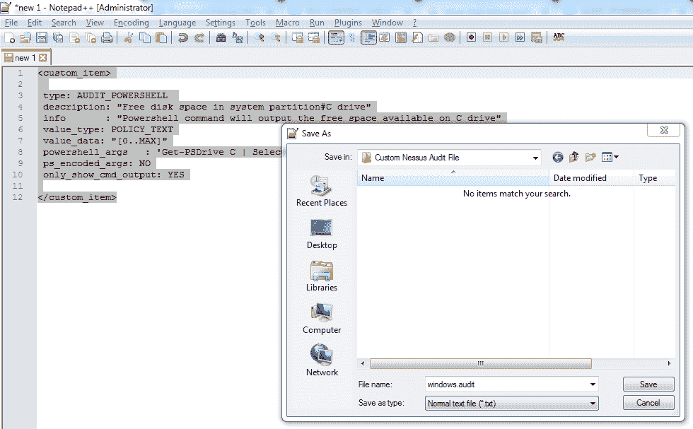

1.  打开策略选项卡，然后单击使用高级扫描模板创建新策略。填写必要的细节，如策略名称和描述：

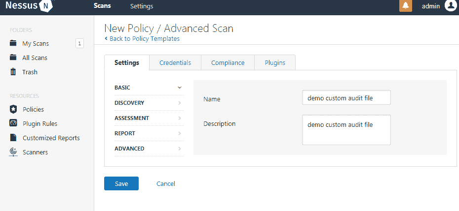

1.  导航到**合规**部分，并在筛选合规搜索栏中搜索自定义 Windows：

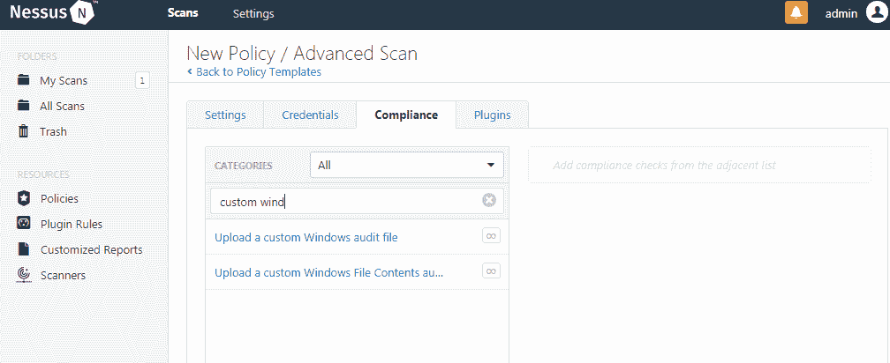

1.  选择上传自定义 Windows 审计文件选项：

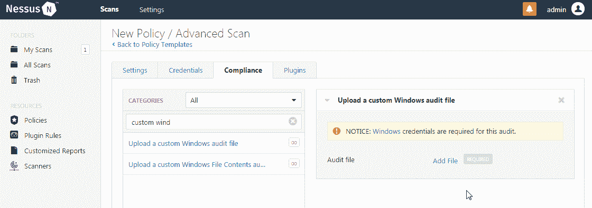

1.  单击添加文件并上传您创建的审计文件：


1.  为了执行合规审计，您将需要输入 Windows 凭据。导航到凭据部分，然后单击 Windows 选项：

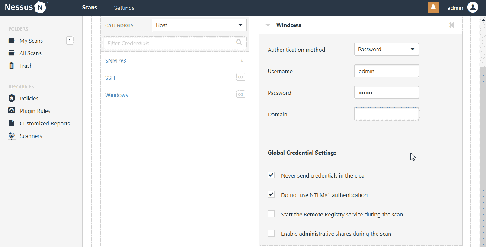

1.  保存策略并导航到“我的扫描”页面创建新的扫描。

1.  导航到用户定义的策略部分，并选择我们创建的自定义 Windows 审计策略：


1.  填写必要的细节，如扫描名称和受影响的主机，并启动扫描：

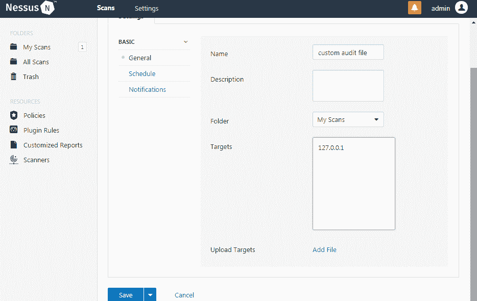

# 工作原理...

这些自定义审计文件可用于审计多个平台，因为 NASL 支持多个平台的关键工作和属性，这些值是自定义的，特定于这些平台的配置。这使用户可以轻松创建审计文件并根据其要求和基线自定义它们，以执行配置审计并识别这些差距。以下是 Nessus 支持执行配置审计的平台列表：

+   Windows:

+   Windows 2003 Server

+   Windows 2008 Server

+   Windows Vista

+   Windows 7

+   Unix:

+   Solaris

+   Linux

+   FreeBSD/OpenBSD/NetBSD

+   HP/UX

+   AIX

+   macOS X

+   其他平台：

+   思科

+   SCADA
