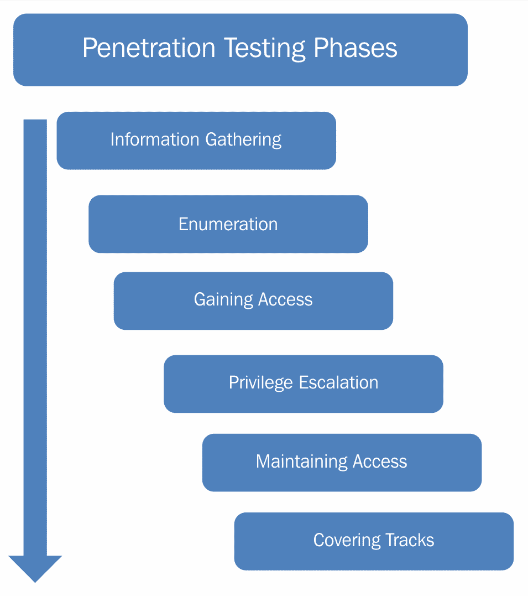

# 第九章：漏洞管理治理

今天的技术环境正在以极快的速度发生变化。几乎每天都会有一些新技术的引入并在短时间内获得流行。尽管大多数组织确实适应了快速变化的技术，但他们往往没有意识到新技术的使用会改变组织的威胁环境。虽然组织的现有技术环境可能已经存在漏洞，但引入新技术可能会在技术环境中增加更多的 IT 安全风险。

为了有效地减轻所有风险，重要的是在整个组织中实施强大的*漏洞管理计划*。本章将介绍一些基本的治理概念，这些概念将有助于为实施漏洞管理计划奠定坚实的基础。本章的关键学习要点如下：

+   安全基础知识

+   了解安全评估的需求

+   列出漏洞管理的业务驱动因素

+   计算投资回报率

+   建立上下文

+   制定和推出漏洞管理政策和程序

+   渗透测试标准

+   行业标准

# 安全基础知识

安全是一个主观的问题，设计安全控制通常是具有挑战性的。一个特定的资产可能需要更多的保护来保持数据的机密性，而另一个资产可能需要确保最高的完整性。在设计安全控制时，同样重要的是在控制的有效性和最终用户的使用便利性之间取得平衡。本节在进一步介绍更复杂的概念之前，介绍了一些基本的安全基础知识。

# CIA 三角

**机密性**、**完整性**和**可用性**（通常称为**CIA**）是信息安全的三个关键原则。虽然有许多因素有助于确定系统的安全状况，但机密性、完整性和可用性是其中最突出的。从信息安全的角度来看，任何给定的资产都可以根据其机密性、完整性和可用性的价值进行分类。本节在概念上强调了 CIA 的重要性，并提供了实际示例和针对每个因素的常见攻击。

# 机密性

单词*机密性*的词典含义是：保持秘密或私人的状态。在信息安全的背景下，机密性意味着保持信息免受未经授权的访问，这是信息安全的主要需求之一。以下是一些我们经常希望保持机密的信息的例子：

+   密码

+   个人识别号码

+   信用卡号、到期日期和 CVV

+   商业计划和蓝图

+   财务信息

+   社会安全号码

+   健康记录

机密性的常见攻击包括：

+   **数据包嗅探**：这涉及拦截网络数据包，以非法获取网络中流动的信息

+   **密码攻击**：包括猜测密码、使用暴力或字典攻击破解密码等

+   **端口扫描和 ping 扫描**：端口扫描和 ping 扫描用于识别给定网络中的活动主机，然后对活动主机进行一些基本的指纹识别

+   **垃圾箱搜寻**：这涉及搜索和挖掘目标组织的垃圾箱，试图可能获得敏感信息

+   **肩窥**：这是一个简单的行为，任何站在你身后的人都可能偷看你输入的密码

+   **社会工程**：社会工程是操纵人类行为以提取敏感信息的行为

+   网络钓鱼和网络诱骗：这涉及向受害者发送虚假和欺骗性的电子邮件，冒充身份，并欺骗受害者提供敏感信息。

+   窃听：这类似于数据包嗅探，但更多地与电话对话的监视有关。

+   键盘记录：这涉及在受害者的系统上安装一个秘密程序，记录并发送受害者输入的所有按键。

# 完整性

信息安全背景下的完整性是指信息的质量，意味着一旦生成的信息不应该被任何未经授权的实体篡改。例如，如果一个人使用在线银行向他的朋友发送*X*金额的钱，他的朋友在他的账户中确切地收到*X*金额，那么交易的完整性就是完整的。如果交易在中间被篡改，朋友收到*X + (n)*或*X - (n)*金额，那么交易的完整性就被认为在交易过程中被篡改了。

对完整性的常见攻击包括：

+   莎莉米攻击：当单一攻击被分割或分解为多个小攻击，以避免被检测，这被称为莎莉米攻击。

+   数据篡改攻击：这涉及在数据输入到系统之前或期间未经授权地修改数据。

+   信任关系攻击：攻击者利用实体之间的信任关系获得未经授权的访问。

+   中间人攻击：攻击者连接到通信渠道，拦截流量，并篡改数据。

+   会话劫持：使用中间人攻击，攻击者可以劫持已经建立的合法活动会话。

# 可用性

可用性原则规定，如果授权个人请求资源或信息，它应该在没有任何中断的情况下可用。例如，一个人想要使用在线银行设施下载他的银行账单。由于某种原因，银行的网站关闭了，这个人无法访问。在这种情况下，可用性受到影响，因为这个人无法在银行的网站上进行交易。从信息安全的角度来看，可用性和保密性以及完整性一样重要。出于任何原因，如果请求的数据在规定时间内不可用，可能会造成严重的有形或无形的影响。

对可用性的常见攻击包括以下内容：

+   拒绝服务攻击：在拒绝服务攻击中，攻击者向目标系统发送大量请求。请求的数量如此之大，以至于目标系统无法响应。这导致目标系统的失败，并且来自所有其他合法用户的请求都被拒绝。

+   SYN 洪水攻击：这是一种拒绝服务攻击的一种类型，攻击者向目标发送大量的 SYN 请求，目的是使其无响应。

+   分布式拒绝服务攻击：这与拒绝服务攻击非常相似，不同之处在于用于攻击的系统数量。在这种类型的攻击中，攻击者使用数百甚至数千个系统来淹没目标系统。

+   电力攻击：这种类型的攻击涉及对电力单元的故意修改，目的是造成停电并使目标系统崩溃。

+   服务器房环境攻击：服务器房间是温度控制的。任何故意干扰服务器房间环境的行为都可能导致关键服务器系统崩溃。

+   自然灾害和事故：这包括地震、火山喷发、洪水等，或任何意外的人为错误。

# 识别

认证通常被认为是与系统交互的第一步。然而，认证之前是识别。主体可以通过识别的过程来声明身份，从而启动问责制。为了启动**认证、授权和问责制**（**AAA**）的过程，主体必须向系统提供一个身份。输入密码、刷 RFID 门禁卡或留下指纹印记是提供个人身份的最常见和简单的方式之一。在没有身份的情况下，系统无法将认证因素与主体相关联。在确定主体的身份之后，随后执行的所有操作都将针对主体进行记录，包括信息系统跟踪基于身份的活动，而不是个人。计算机无法区分人类。然而，计算机可以很好地区分用户帐户。它清楚地知道一个用户帐户与所有其他用户帐户不同。然而，仅仅声称一个身份并不暗示访问或权限。主体必须首先证明其身份才能获得对受控资源的访问。这个过程被称为识别。

# 认证

验证和测试所声称的身份是否正确和有效被称为**认证过程**。为了进行认证，主体必须提供与之前建立的身份完全相同的附加信息。密码是用于认证的最常见类型的机制之一。

以下是通常用于认证的一些因素：

+   **你所知道的东西**：*你所知道的*因素是用于认证的最常见因素。例如，密码或简单的**个人识别号码**（**PIN**）。然而，它也是最容易被破坏的。

+   **你所拥有的东西**：*你所拥有的*因素指的是智能卡或物理安全令牌等物品。

+   **你所是的东西**：*你所是的*因素指的是使用你的生物特征进行认证的过程。例如，使用指纹或视网膜扫描进行认证。

识别和认证总是作为一个单一的两步过程一起使用。

提供身份是第一步，提供认证因素是第二步。没有这两者，主体无法获得对系统的访问。单独的元素在安全方面都是没有用的。

对认证的常见攻击包括：

+   暴力破解：暴力破解攻击涉及尝试特定字符集的所有可能的排列和组合，以获取正确的密码

+   **认证不足：**使用弱密码策略的单因素认证使应用程序和系统容易受到密码攻击

+   **弱密码恢复验证**：这包括对密码恢复机制（如安全问题、OTP 等）的不充分验证

# 授权

一旦主体成功认证，下一个逻辑步骤是获得对分配资源的授权访问。

成功授权后，经过认证的身份可以请求访问对象，前提是它具有必要的权限和特权。

访问控制矩阵是用于评估和比较主体、对象和预期活动的最常见技术之一。如果主体被授权，那么特定的操作是允许的，如果主体未经授权，则被拒绝。

需要注意的是，被识别和认证的主体不一定被授予访问任何东西的权利和特权。访问权限是基于主体的角色和需要知道的基础上授予的。识别和认证是访问控制的全有或全无方面。

以下表格显示了一个样本访问控制矩阵：

| | **资源** |
| --- | --- |
| **用户** | **文件 1** | **文件 2** |
| 用户 1 | 读取 | 写入 |
| 用户 2 | - | 读取 |
| 用户 3 | 写入 | 写入 |

从前面的样本访问控制矩阵中，我们可以得出以下结论：

+   用户 1 无法修改文件 1

+   用户 2 只能读取文件 2，而不能读取文件 1

+   用户 3 可以读取/写入文件 1 和文件 2

对授权的常见攻击包括以下内容：

+   **授权蔓延**：授权蔓延是一个术语，用来描述用户故意或无意地获得了比实际需要更多的权限

+   **水平特权升级**：当用户能够绕过授权控制并获得与同级别用户相同的特权时，就发生了水平特权升级

+   **垂直特权升级**：当用户能够绕过授权控制并获得更高层次用户的特权时，就发生了垂直特权升级

# 审计

审计或监视是指跟踪和/或记录主体在系统上进行身份验证后的行为的过程。审计还可以帮助监视和检测系统上的未经授权或异常活动。审计包括捕获和保留主体及其对象的活动和/或事件，以及记录维护操作环境和安全机制的核心系统功能的活动和/或事件。

审计日志中需要捕获的最小事件如下：

+   用户 ID

+   用户名

+   时间戳

+   事件类型（如调试、访问、安全）

+   事件详情

+   源标识符（如 IP 地址）

捕获系统事件并创建日志的审计跟踪可以用于评估系统的健康和性能。在系统故障的情况下，可以使用事件日志追溯根本原因。日志文件还可以为重新创建事件的历史、追溯入侵或系统故障提供审计跟踪。大多数操作系统、应用程序和服务都具有某种本地或默认的审计功能，至少可以提供最基本的事件。

对审计的常见攻击包括以下内容：

+   **篡改日志**：包括未经授权修改审计日志

+   **未经授权访问日志**：攻击者可以未经授权访问日志，意图提取敏感信息

+   **通过审计日志进行拒绝服务**：攻击者可以发送大量垃圾请求，意图填满日志，进而填满磁盘空间，导致拒绝服务攻击

# 会计

只有在责任制得到良好维护时，任何组织才能成功实施其安全策略。保持责任制可以帮助追究主体的所有行为。任何给定的系统可以根据其追踪和证明主体身份的能力来说是有效的。

各种机制，如审计、认证、授权和识别，有助于将人类与他们执行的活动联系起来。

仅使用密码作为身份验证的形式会产生很大的疑虑和妥协空间。有许多轻松的方法可以破解密码，这就是为什么它们被认为是最不安全的身份验证形式。当多种身份验证因素（如密码、智能卡和指纹扫描）结合使用时，身份盗窃或妥协的可能性会大大降低。

# 不可否认

不可否认是指主体无法否认活动或事件发生的保证。不可否认可以防止主体声称未发送消息、未执行操作或未导致事件的发生。

可以帮助实现不可否认性的各种控制如下：

+   数字证书

+   会话标识符

+   交易日志

例如，一个人可以向他的同事发送一封威胁性的电子邮件，然后简单地否认他发送了这封电子邮件的事实。这是一种否认的情况。然而，如果电子邮件被数字签名，这个人就不会有机会否认他的行为。

# 漏洞

非常简单地说，漏洞只是系统中的一个弱点或保障/对策中的一个弱点。如果漏洞被成功利用，可能会导致目标资产的损失或损害。一些常见的漏洞示例如下：

+   系统上设置弱密码

+   在系统上运行的未打补丁的应用程序

+   缺乏输入验证导致 XSS

+   缺乏数据库验证导致 SQL 注入

+   未更新的防病毒签名

漏洞可能存在于硬件和软件层。感染恶意软件的 BIOS 是硬件漏洞的一个例子，而 SQL 注入是最常见的软件漏洞之一。

# 威胁

任何可能导致不良结果的活动或事件都可以被视为威胁。威胁是任何可能故意或无意地造成损害、中断或完全丧失资产的行为。

威胁的严重程度可以根据其影响来确定。威胁可以是有意的，也可以是意外的（由于人为错误）。它可以由人、组织、硬件、软件或自然引起。一些常见的威胁事件如下：

+   病毒爆发的可能性

+   电力浪涌或故障

+   火灾

+   地震

+   洪水

+   关键财务交易中的打字错误

# 暴露

威胁代理可能会利用漏洞并造成资产损失。容易受到这种资产损失的影响被称为**暴露**。

暴露并不总是意味着威胁确实发生。这只是意味着如果给定系统存在漏洞，威胁可能会利用它，那么可能会发生潜在的暴露。

# 风险

风险是威胁利用漏洞对资产造成伤害的可能性或可能性。

风险可以用以下公式计算：

*风险=可能性*影响*

通过这个公式，很明显风险可以通过减少威胁代理或减少漏洞来降低。

当风险实现时，威胁代理或威胁事件利用了漏洞并对一个或多个资产造成了伤害或泄露。安全的整个目的是通过消除漏洞和阻止威胁代理和威胁事件暴露资产来防止风险的实现。不可能使任何系统完全没有风险。然而，通过制定对策，可以将风险降低到组织风险承受能力的可接受水平。

# 保障

*保障*或*对策*是减轻或减少漏洞的任何事物。保障是减轻或消除风险的唯一手段。重要的是要记住，保障、安全控制或对策可能并不总是涉及采购新产品；有效利用现有资源也可以帮助产生保障。

以下是一些保障的例子：

+   在所有系统上安装防病毒软件

+   安装网络防火墙

+   安装闭路电视并监控场所

+   部署安全警卫

+   安装温度控制系统和火灾警报

# 攻击向量

攻击向量只是攻击者可以访问目标系统的路径或手段。为了破坏系统，可能存在多个攻击向量。以下是一些攻击向量的例子：

+   攻击者通过利用应用程序中的 SQL 注入漏洞，获取了数据库中的敏感数据

+   攻击者通过获得对数据库系统的物理访问来获取对敏感数据的访问

+   攻击者利用 SMB 漏洞在目标系统上部署了恶意软件

+   攻击者通过对系统凭证进行暴力攻击获得了管理员级别的访问权限

总结我们所学的术语，我们可以说资产受到威胁，这些威胁利用漏洞导致暴露，这是一种可以通过保障来减轻的风险。

# 了解安全评估的需求

许多组织在设计和实施各种安全控制方面投入了大量时间和成本。一些甚至遵循“深度防御”的原则部署了多层次的控制。实施强大的安全控制当然是必要的；然而，测试部署的控制是否确实按预期工作同样重要。

例如，一个组织可能选择部署最新和最好的防火墙来保护其边界。防火墙管理员某种方式错误配置了规则。所以，无论防火墙有多好，如果它没有正确配置，仍然会允许不良流量进入。在这种情况下，对防火墙规则进行彻底测试和/或审查将有助于识别和消除不需要的规则，并保留所需的规则。

每当开发新系统时，都会严格和彻底地进行质量保证（QA）测试。这是为了确保新开发的系统按照业务需求和规格正确运行。与此同时，测试安全控制也是至关重要的，以确保它们按规定运行。安全测试可以是不同类型的，如下一节所讨论的。

# 安全测试的类型

根据上下文和服务目的，安全测试可以按多种方式进行分类。以下图表显示了安全测试类型的高级分类：

# 安全测试

安全测试的主要目标是确保控制正常运行。测试可以是自动扫描、使用工具进行渗透测试和手动尝试揭示安全漏洞的组合。需要注意的是，安全测试不是一次性活动，应定期进行。在规划安全控制测试时，应考虑以下因素：

+   可用于安全测试的资源（硬件、软件和熟练的人力）

+   受控系统和应用程序的重要性评级

+   实施控制的机制出现技术故障的概率

+   控制配置错误可能危及安全的概率

+   可能影响控制性能的技术环境中的任何其他变化、升级或修改

+   测试控制所需的难度和时间

+   测试对正常业务运营的影响

只有确定了这些因素，才能设计和验证全面的评估和测试策略。该策略可能包括定期的自动化测试和手动测试。例如，电子商务平台可能每周进行自动漏洞扫描，并在扫描检测到新漏洞时立即向管理员发送警报通知。自动扫描一旦配置和触发，就需要管理员的干预，因此可以经常进行扫描。

安全团队可能选择通过内部或外部顾问进行固定费用的手动渗透测试来补充自动扫描。安全测试可以每季度、每半年或每年进行，以优化成本和工作量。

不幸的是，许多安全测试计划都是简单地将新的高级工具指向网络中可用的系统，从而以杂乱无章和临时的方式开始的。测试计划应该经过深思熟虑的设计，并使用基于风险的方法对系统进行严格的例行测试。

当然，安全测试的结果没有经过仔细审查就不能被称为完整。工具可能会产生很多误报，只有通过手动审查才能消除。对安全测试报告的手动审查还有助于确定漏洞的严重程度，与目标环境的相关性。

例如，自动扫描工具可能会检测到公开托管的电子商务应用程序和简单的内部帮助和支持门户网站中的跨站脚本。在这种情况下，尽管漏洞在两个应用程序中是相同的，但前者的风险更大，因为它面向互联网，用户比后者更多。

# 漏洞评估与渗透测试

漏洞评估和渗透测试经常可以互换使用。然而，它们在服务目的上是不同的。为了理解这两个术语之间的区别，让我们考虑一个现实世界的例子。

有一家银行位于城市郊区的一处相当隐蔽的地方。有一伙强盗打算抢劫这家银行。强盗开始计划如何执行他们的计划。其中一些人装扮成普通顾客访问银行，并注意到了一些事情：

+   银行只有一名手无寸铁的保安

+   银行有两个入口和三个出口

+   没有安装闭路电视摄像头

+   储物柜隔间的门看起来很薄弱

有了这些发现，强盗只是进行了漏洞评估。现在，只有当他们真正抢劫银行时，才能确定这些漏洞是否能够在现实中被利用来成功执行抢劫计划。如果他们抢劫银行并成功利用了这些漏洞，他们就会进行渗透测试。

因此，简而言之，检查系统是否容易受攻击是漏洞评估，而实际利用易受攻击的系统是渗透测试。组织可以根据需要选择执行其中一个或两者。然而，值得注意的是，如果没有首先进行全面的漏洞评估，渗透测试就不可能成功。

# 安全评估

安全评估只是对系统、应用程序或其他测试环境的安全性进行详细审查。在安全评估期间，受过训练的专业人员进行风险评估，发现目标环境中可能存在的潜在漏洞，可能导致妥协，并根据需要提出建议。

安全评估通常包括使用测试工具，但超出了自动扫描和手动渗透测试。它们还包括对周围威胁环境的全面审查，现在和未来可能的风险，以及目标环境的资产价值。

安全评估的主要输出通常是一份详细的评估报告，面向组织的高层管理人员，以非技术性语言包含评估结果。它通常以精确的建议和改进目标环境安全状况的建议结束。

# 安全审计

安全审计通常采用与安全评估相似的许多技术，但需要由独立的审计员执行。组织的内部安全人员进行例行安全测试和评估。然而，安全审计与这种方法不同。安全评估和测试是组织内部的，旨在发现潜在的安全漏洞。

审计类似于评估，但是旨在向相关第三方证明安全控制的有效性。审计确保在测试控制有效性时没有利益冲突。因此，审计倾向于提供对安全状况的完全公正的观点。

安全评估报告和审计报告可能看起来相似；然而，它们是为不同的受众而设计的。审计报告的受众主要包括高级管理人员、董事会、政府机构和其他相关利益相关者。

审计分为两种主要类型：

+   **内部审计**：组织的内部审计团队执行内部审计。内部审计报告面向组织的内部受众。确保内部审计团队具有完全独立的报告线，以避免与他们评估的业务流程产生利益冲突。

+   **外部审计**：由信任的外部审计公司进行外部审计。外部审计具有更高的外部有效性，因为外部审计师几乎与被评估的组织没有任何利益冲突。有许多公司进行外部审计，但大多数人认为所谓的*四大*审计公司具有最高的可信度：

+   安永

+   德勤

+   普华永道

+   毕马威

这些公司进行的审计通常被大多数投资者和监管机构认可。

# 漏洞管理的业务驱动因素

为了证明实施任何控制的投资是绝对必要的，业务驱动因素是绝对必要的。业务驱动因素定义了为什么需要实施特定的控制。用于证明漏洞管理计划的典型业务驱动因素在以下部分中进行了描述。

# 监管合规性

十多年来，几乎所有企业都变得高度依赖技术的使用。从金融机构到医疗机构，对数字系统的使用有了很大的依赖。这反过来促使行业监管机构提出了组织需要遵守的强制性要求。不遵守监管机构规定的任何要求都会受到严重罚款和禁令。

以下是一些要求组织进行漏洞评估的监管标准：

+   **萨班斯-奥克斯法案**（**SOX**）

+   **对承诺审计准则的声明 16**（**SSAE 16/SOC 1**）

+   **服务组织控制**（**SOC**）2/3

+   **支付卡行业数据安全标准**（**PCI DSS**）

+   **健康保险可移植性和责任法案**（**HIPAA**）

+   **格拉姆-利奇-布莱利合规性**（**GLBA**）

+   **联邦信息系统控制审计手册**（**FISCAM**）

# 满足客户需求

今天的客户在选择从技术服务提供商那里获得什么样的服务时变得更加挑剔。某个客户可能在世界的某个地方运营，而某些法规要求进行漏洞评估。技术服务提供商可能位于另一个地理区域，但必须执行漏洞评估以确保所服务的客户符合规定。因此，客户可以明确要求技术服务提供商进行漏洞评估。

# 对某些欺诈/事件的回应

全球各地的组织不断受到来自不同地点的各种类型的攻击。其中一些攻击成功并对组织造成潜在损害。基于内部和/或外部欺诈/攻击的历史经验，组织可能选择实施完整的漏洞管理计划。

例如，像火一样蔓延的 WannaCry 勒索软件利用了 Windows 系统的 SMB 协议中的一个漏洞。这种攻击必定会触发许多受影响组织实施漏洞管理计划。

# 获得竞争优势

让我们考虑这样一个情景，有两个技术供应商在销售类似的电子商务平台。一个供应商拥有非常强大和有文档记录的漏洞管理计划，使他们的产品天然具有抵御常见攻击的能力。第二个供应商的产品非常好，但没有漏洞管理计划。一个明智的客户肯定会选择第一个供应商的产品，因为该产品是根据强大的漏洞管理流程开发的。

# 保护关键基础设施

这是所有先前业务驱动因素中最重要的一个。一个组织可能会主动选择实施漏洞管理计划，无论是否必须遵守任何法规或满足任何客户需求。在安全方面，主动方法比被动方法更有效。

例如，一个组织可能拥有客户的付款细节和个人信息，并且不希望将这些数据置于未经授权的披露风险之中。一个正式的漏洞管理计划将帮助组织识别所有可能的风险，并制定控制措施以减轻风险。

# 计算投资回报率

设计和实施安全控制通常被视为成本开销。向管理层证明实施某些安全控制的成本和努力往往是具有挑战性的。这时可以考虑估算漏洞管理计划的投资回报。这可能是相当主观的，并且基于定性和定量分析。

虽然投资回报率的计算可能会因环境的复杂性而变得复杂，但让我们从一个简单的公式和例子开始：

*投资回报率（ROI）=（投资收益 - 投资成本）* 100/投资成本*

为了简化理解，让我们假设组织内有 10 个系统需要纳入漏洞管理计划的监管范围。所有这 10 个系统都包含敏感的业务数据，如果它们受到攻击，组织可能会遭受 75,000 美元的损失以及声誉损失。现在，组织可以通过利用价值 25,000 美元的资源来设计、实施和监控漏洞管理计划。因此，投资回报率将如下：

*投资回报率（ROI）=（75,000 - 25,000）* 100/25,000 = 200%*

在这种情况下，实施漏洞管理计划的投资回报率为 200%，这确实是对高级管理层批准的一个很好的理由。

前面的例子是一个简化的例子，旨在理解投资回报率的概念。然而，在实际情况下，组织在计算漏洞管理计划的投资回报率时可能需要考虑更多因素，包括：

+   该计划的范围是什么？

+   需要多少资源（人员数量）来设计、实施和监控该计划？

+   作为该计划的一部分是否需要采购任何商业工具？

+   在计划的任何阶段是否需要任何外部资源（合同资源）？

+   将整个计划完全外包给可信赖的第三方供应商是否可行且具有成本效益？

# 设定背景

变化从来都不容易和顺利。组织内的任何变化通常需要广泛的规划、范围界定、预算和一系列批准。在没有先前安全经验的组织中实施完整的漏洞管理计划可能非常具有挑战性。许多业务部门都会明显抵制，并对该计划的可持续性提出质疑。除非漏洞管理计划深入融入组织文化，否则它永远不会成功。与任何其他重大变化一样，可以通过以下部分描述的两种不同方法来实现这一点。

# 自下而上

自下而上的方法是基层员工发起行动来实施新的倡议。在漏洞管理计划的背景下，自下而上的方法中的行动流程看起来类似于以下内容：

1.  系统管理员团队的初级成员在其中一个系统中识别出一些漏洞

1.  他向主管报告，并使用免费工具扫描其他系统以查找类似的漏洞

1.  他整合了所有发现的漏洞并向主管报告

1.  然后主管向高层管理层报告漏洞

1.  高层管理忙于其他活动，因此未能优先考虑漏洞修复

1.  系统管理员团队的主管试图在有限的资源帮助下修复一些漏洞

1.  一组系统仍然存在漏洞，因为没有人对修复它们感兴趣

在前述情景中，我们可以注意到所有的活动都是不经过计划和临时的。初级团队成员在没有得到高层管理的多少支持的情况下自发进行了漏洞评估。这种方法在长期内永远不会成功。

# 自上而下

与自下而上的方法不同，自上而下的方法效果更好，因为它是由高层管理发起、指导和管理的。使用自上而下的方法实施漏洞管理计划，行动流程将如下所示：

1.  高层管理决定实施漏洞管理计划

1.  管理层计算投资回报率并检查可行性

1.  然后管理层准备了漏洞管理计划的政策程序指南和标准

1.  管理层为计划的实施和监控分配预算和资源

1.  中层管理和基层员工随后遵循政策和程序来实施该计划

1.  该计划受到监控，并且指标与高层管理共享

如前述情景中所述的自上而下方法实施漏洞管理计划具有更高的成功概率，因为它是由高层管理发起和推动的。

# 政策与程序与标准与指南

从治理的角度来看，了解政策、程序、标准和指南之间的区别是很重要的。请注意以下图表：

+   **政策**：政策始终是其他文件中的最高级别。政策是一种反映高层管理意图和方向的高层声明。一旦发布，组织内的每个人都必须遵守政策。政策的例子包括互联网使用政策、电子邮件政策等。

+   **标准**：标准只是一种可接受的质量水平。标准可以用作实施政策的参考文件。标准的一个例子是 ISO27001。

+   **程序**：程序是一系列详细的步骤，用于完成特定任务。通常以**标准操作程序**（**SOP**）的形式实施或参考。程序的一个例子是用户访问控制程序。

+   **指南**：指南包含额外的建议或建议，不是强制性遵循的。它们是最佳实践，根据情况可能或可能不遵循。指南的一个例子是 Windows 安全加固指南。

# 漏洞评估政策模板

以下是一个漏洞评估政策模板的示例，概述了政策层面的漏洞评估的各个方面：

**<公司名称>**漏洞评估政策

|  | 名称 | 标题 |
| --- | --- | --- |
| 创建者 |  |  |
| 审查者 |  |  |
| 批准者 |  |  |

**概述**

本节是对漏洞管理的高层次概述。

漏洞评估是识别和量化给定环境中的安全漏洞的过程。它是信息安全状况的评估，指出潜在的弱点，并在必要时提供适当的缓解程序，以消除这些弱点或将其降低到可接受的风险水平。

通常，漏洞评估遵循以下步骤：

1.  在系统中创建资产和资源清单

1.  为资源分配可量化的价值和重要性

1.  识别每个已识别资源的安全漏洞或潜在威胁

1.  优先处理并消除最重要资源的最严重漏洞

**目的**

本节是说明撰写政策的目的和意图。

本政策的目的是提供一种标准化的方法来进行安全审查。该政策还确定了在漏洞识别闭环过程中的角色和责任。

**范围**

本节定义了政策适用的范围；它可以包括内部网、外部网，或者组织基础设施的一部分。

漏洞评估可以针对**<公司名称>**内的任何资产、产品或服务进行。

**政策**

**团队**在**指定**的权威下负责漏洞评估流程的开发、实施和执行。

**公司名称**网络内的所有网络资产将全面接受定期或持续的漏洞评估扫描。

将使用集中式漏洞评估系统。使用任何其他工具来扫描或验证漏洞必须经**指定**书面批准。

**公司名称**内的所有人员和业务单位都应配合对其拥有的系统进行的任何漏洞评估。

**公司名称**内的所有人员和业务单位也应配合**团队**开发和实施补救计划。

**指定**可能指示与第三方安全公司合作，对**公司**的关键资产进行漏洞评估。

**漏洞评估流程**

本节提供了一个指向详细说明漏洞评估流程的外部程序文档的指针。

有关更多信息，请参阅漏洞评估流程。

**例外**

很可能，出于一些合理的理由，一些系统需要排除在本政策范围之外。本节说明了获取此政策例外的流程。

对于本政策的任何例外，例如免除漏洞评估流程，必须通过安全例外流程获得批准。有关更多详细信息，请参阅安全例外政策。

**执行**

本节旨在强调违反此政策的影响。

任何**公司名称**的员工如果违反了该政策，可能会受到纪律处分，包括解雇和潜在的法律诉讼。

**相关文件**

本节用于提供组织内任何其他相关政策、程序或指南的参考。

以下文件被该政策引用：

+   漏洞评估程序

+   安全例外政策

**修订历史**

| **日期** | **修订号** | **修订详细信息** | **修订者** |
| --- | --- | --- | --- |
| MM/DD/YYYY | Rev #1 | 变更描述 | <姓名/职称> |
| MM/DD/YYYY | Rev #2 | 变更描述 | <姓名/职称> |

本节包含有关谁创建了该政策、时间戳和修订的详细信息。

**词汇表**

本节包含了政策中使用的所有关键术语的定义。

# 渗透测试标准

渗透测试不仅仅是一个单一的活动，而是一个完整的过程。有几个标准可以指导渗透测试过程中应遵循的步骤。本节旨在介绍渗透测试生命周期以及一些业界公认的渗透测试标准。

# 渗透测试生命周期

渗透测试不仅仅是使用随机工具来扫描目标漏洞，而是一个涉及多个阶段的注重细节的过程。以下图表显示了渗透测试生命周期的各个阶段：

1.  **信息收集阶段**：信息收集阶段是渗透测试生命周期中的第一个和最重要的阶段。在我们可以探索目标系统的漏洞之前，收集有关目标系统的信息至关重要。收集的信息越多，成功渗透的可能性就越大。如果不正确地了解目标系统，就不可能精确地针对漏洞。信息收集可以分为两种类型：

+   **被动信息收集**：在被动信息收集中，不与目标直接接触。例如，可以从公开可用的来源（如搜索引擎）获取有关目标的信息。因此，不会与目标直接接触。

+   **主动信息收集**：在主动信息收集中，会与目标直接接触以探测信息。例如，对网络中的活动主机进行 ping 扫描实际上会向每个目标主机发送数据包。

1.  **枚举**：一旦获得有关目标的基本信息，下一个阶段就是为了获取更多详细信息而进行枚举。例如，在信息收集阶段，我们可能会有网络中活动 IP 的列表。现在我们需要枚举所有这些活动 IP，并可能获得以下信息：

+   目标 IP 上运行的操作系统

+   每个目标 IP 上运行的服务

+   发现的服务的确切版本

+   用户帐户

+   文件共享等

1.  **获取访问权限**：一旦信息收集和枚举工作彻底完成，我们将对目标系统/网络有一个详细的蓝图。基于这个蓝图，我们现在可以计划发动各种攻击来破坏并获取对目标系统的访问权限。

1.  特权升级：我们可能会利用目标系统中的特定漏洞并获得对其的访问权限。然而，很可能访问权限受到限制。我们可能希望获得完整的管理员/根级别访问权限。可以采用各种特权升级技术来将访问权限从普通用户提升到管理员/根用户。

1.  **维持访问**：到目前为止，我们可能已经获得了对目标系统的高特权访问。然而，该访问可能只持续一段时间，只在特定期间。如果我们想要获得对目标系统相同的访问权限，我们不希望再次重复所有的努力。因此，使用各种技术，我们可以使我们对受损系统的访问持久化。

1.  **覆盖踪迹**：在完成和记录所有渗透之后，我们可能希望清除痕迹和痕迹，包括在妥协中使用的工具和后门。根据渗透测试协议，可能需要或不需要进行此阶段。

# 行业标准

在实施安全控制时，我们可以利用几个定义明确且经过验证的行业标准。这些标准和框架提供了一个基线，可以根据组织的特定需求进行定制。以下部分讨论了一些行业标准。

# 开放式 Web 应用程序安全项目测试指南

OWASP 是“开放式 Web 应用程序安全项目”的缩写。这是一个社区项目，经常从意识的角度发布前 10 个应用程序风险。该项目建立了一个坚实的基础，以在 SDLC 的所有阶段整合安全性。

OWASP 前 10 项目通过评估顶级攻击向量和安全弱点以及它们与技术和业务影响的关系，从根本上评估应用程序安全风险。OWASP 还提供了有关如何识别、验证和纠正应用程序中每个漏洞的具体说明。

尽管 OWASP 前 10 项目只关注常见的应用程序漏洞，但它确实为开发人员和审计人员提供了额外的指南，以有效管理 Web 应用程序的安全性。这些指南可以在以下位置找到：

+   **最新测试指南**：[`www.owasp.org/index.php/OWASP_Testing_Guide_v4_Table_of_Contents`](https://www.owasp.org/index.php/OWASP_Testing_Guide_v4_Table_of_Contents)

+   **开发人员指南**：[www.owasp.org/index.php/Guide](http://www.owasp.org/index.php/Guide)

+   **安全代码审查指南**：[www.owasp.org/index.php/Category:OWASP_Code_Review_Project](https://www.owasp.org/index.php/Category:OWASP_Code_Review_Project)

OWASP 前 10 名列表定期进行修订。最新的前 10 名列表可以在以下网址找到：[`www.owasp.org/index.php/Top_10_2017-Top_10`](https://www.owasp.org/index.php/Top_10_2017-Top_10)。

# 框架的好处

以下是 OWASP 的主要特点和好处：

+   当应用程序针对 OWASP 前 10 名进行测试时，可以确保满足最低的安全要求，并且应用程序对大多数常见的 Web 攻击具有抵抗力。

+   OWASP 社区开发了许多安全工具和实用程序，用于执行自动化和手动应用程序测试。一些最有用的工具包括 WebScarab、Wapiti、CSRF Tester、JBroFuzz 和 SQLiX。

+   OWASP 制定了一个测试指南，提供了技术或供应商特定的测试指南；例如，对 Oracle 的测试方法与对 MySQL 的方法不同。这有助于测试人员/审计人员选择最适合的测试目标系统的程序。

+   它有助于在开发的所有阶段设计和实施安全控制，确保最终产品本质上是安全和强大的。

+   OWASP 在整个行业范围内具有可见性和接受度。OWASP 前 10 名也可以与其他 Web 应用程序安全行业标准进行映射。

# 渗透测试执行标准

渗透测试执行标准（PTES）是由渗透测试行业中最聪明的头脑和权威专家创建的。它包括渗透测试的七个阶段，并可用于对任何环境进行有效的渗透测试。有关方法的详细信息可以在以下网址找到：[`www.pentest-standard.org/index.php/Main_Page.`](http://www.pentest-standard.org/index.php/Main_Page.)

此标准详细说明的渗透测试的七个阶段如下（来源：[www.pentest-standard.org](http://www.pentest-standard.org/index.php/Main_Page)）：

1.  前期交互

1.  情报收集

1.  威胁建模

1.  漏洞分析

1.  利用

1.  后期利用

1.  报告

这些阶段的每一个都在 PTES 网站上提供了详细说明，以及详细说明每个阶段所需的具体思维导图。这允许将 PTES 标准定制以匹配正在测试的环境的测试要求。只需点击思维导图中的项目，即可访问有关每个步骤的更多详细信息。

# 框架的好处

以下是 PTES 的主要特点和好处：

+   这是一个非常全面的渗透测试框架，涵盖了渗透测试的技术和操作方面，如范围扩大、报告和保护渗透测试人员的利益和权利

+   它详细说明了执行许多必要任务的方法，以准确测试环境的安全状况

+   它是由经验丰富的渗透测试专家为渗透测试人员准备的，这些专家每天都在执行这些任务

+   它包括最常见的技术以及不太常见的技术

+   它易于理解，并且可以轻松适应安全测试需求

# 摘要

在本章中，我们熟悉了一些绝对的安全基础知识，以及构建漏洞管理程序的一些基本治理概念。在下一章中，我们将学习如何设置一个进行漏洞评估的环境。

# 练习

+   探索如何计算安全控制的投资回报率

+   熟悉 PTES 标准
