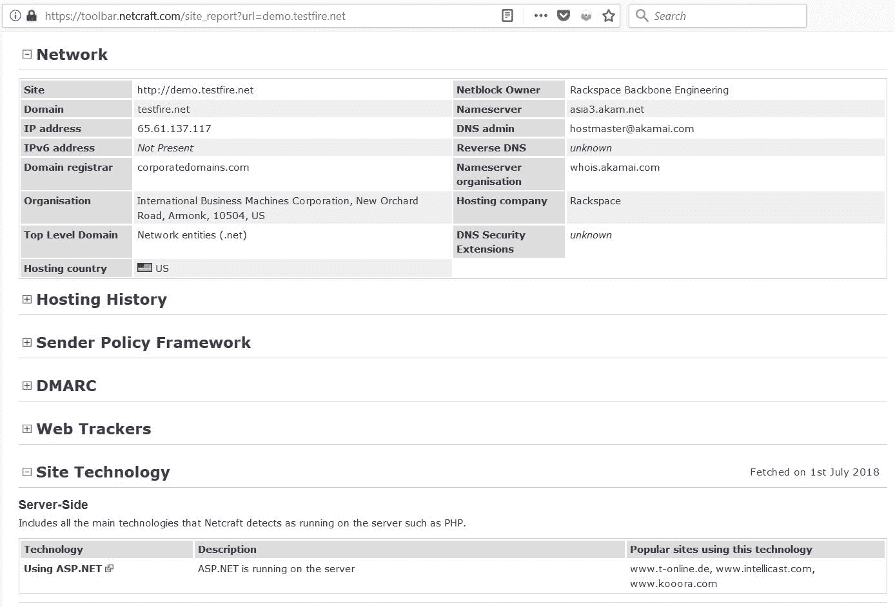
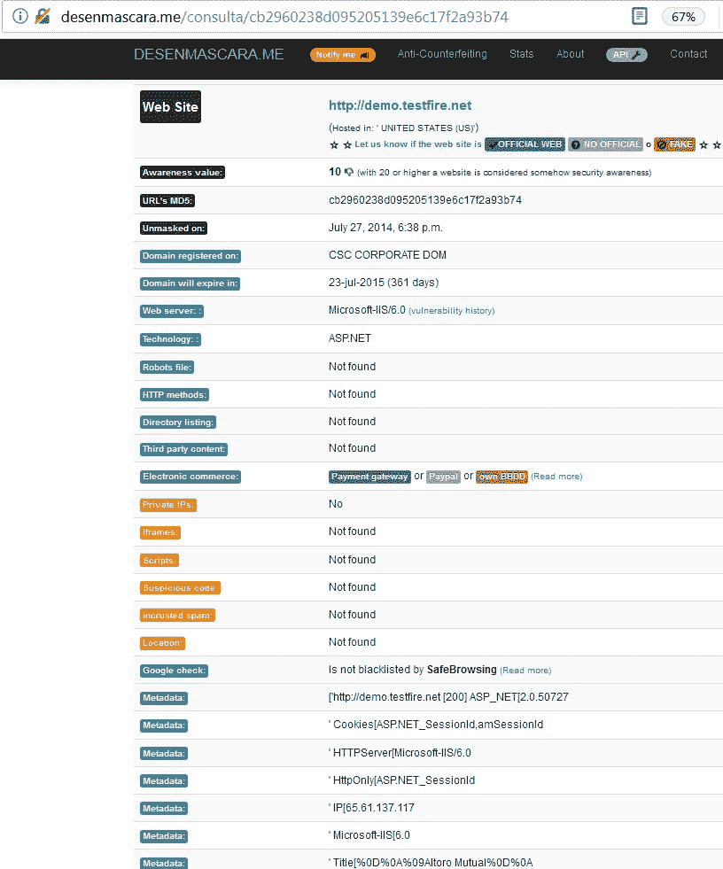
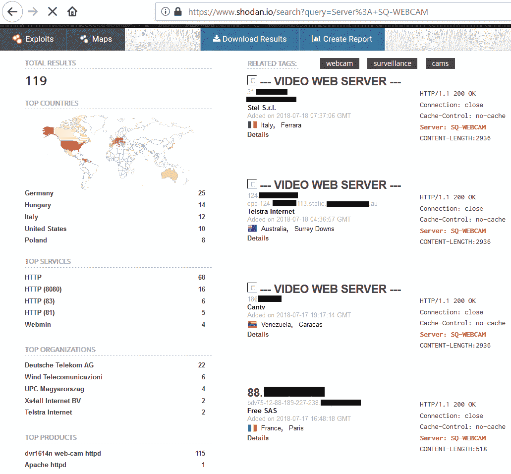
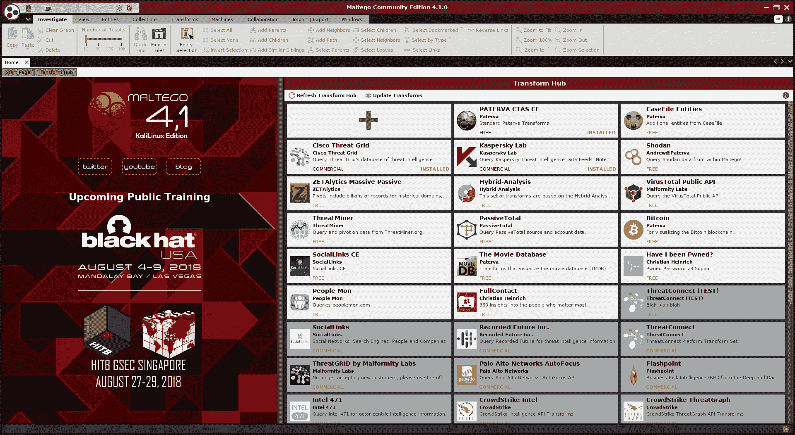
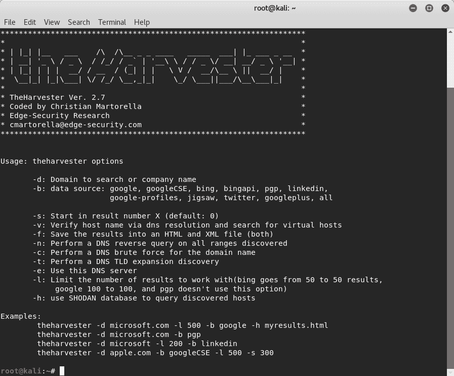
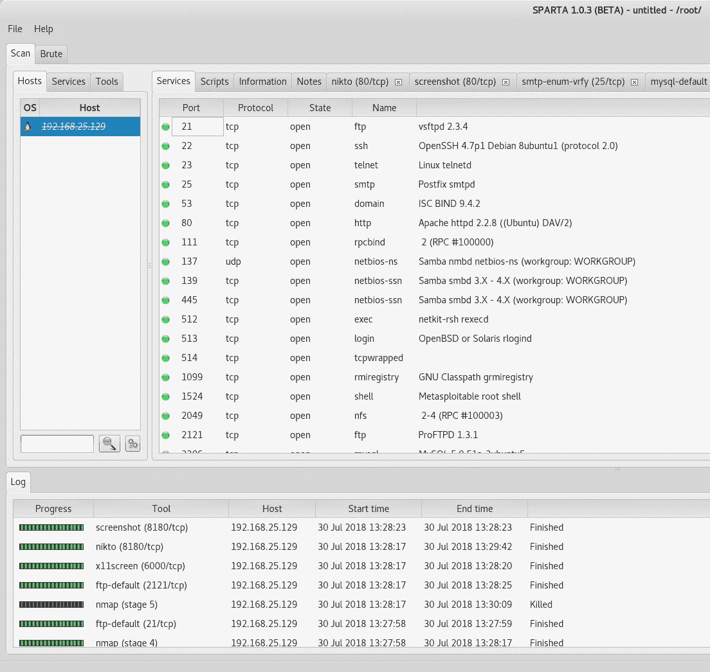
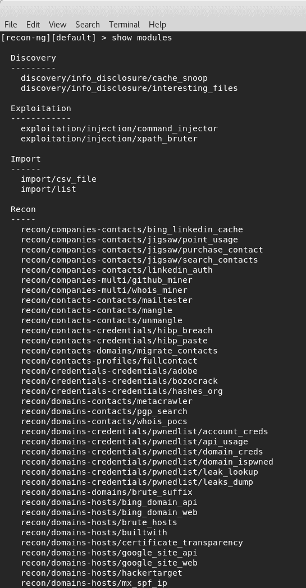
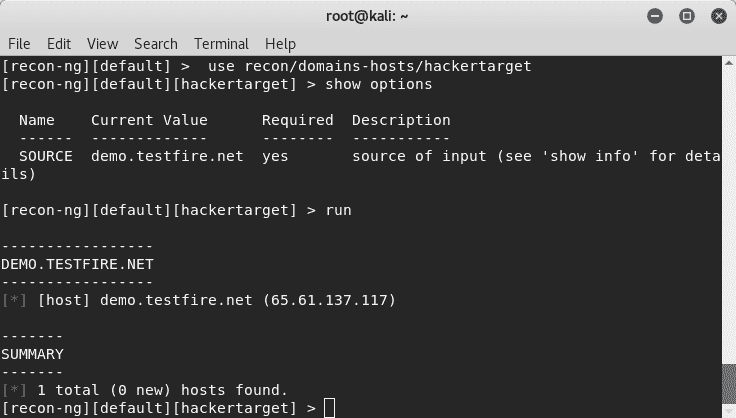

# 第十二章：信息收集

在上一章中，我们讨论了漏洞管理计划的范围和规划。本章是关于学习有关目标系统的各种工具和技术的信息收集。我们将学习应用各种技术并使用多种工具，以有效地收集有关范围内目标的尽可能多的信息。从这个阶段收集到的信息将被用作下一个阶段的输入。

本章中，我们将涵盖以下主题：

+   定义信息收集

+   被动信息收集

+   主动信息收集

# 什么是信息收集？

信息收集是实际评估的第一步。在使用漏洞扫描仪扫描目标之前，测试人员应该更多地了解测试范围内的资产的详细信息。这将帮助测试团队为扫描优先考虑资产。

# 信息收集的重要性

“给我六个小时砍倒一棵树，我将花前四个小时磨削斧头。”

这是亚伯拉罕·林肯的一句非常古老而著名的名言。同样适用于在执行任何安全评估之前尽可能多地收集信息。除非您对目标了如指掌，否则您将无法成功执行其安全评估。对于目标具有全方位的了解，并通过所有可用的来源收集有关它的所有可能信息是至关重要的。

一旦您确信已经收集到足够的信息，那么您可以非常有效地计划实际的评估。信息收集可以分为两种类型，如下节所述：被动信息收集和主动信息收集。

# 被动信息收集

被动信息收集是一种技术，其中不直接与目标进行联系以收集信息。所有信息都是通过可能是公开可用的中间来源获取的。互联网上有许多有用的资源可以帮助我们进行被动信息收集。接下来将讨论一些这样的技术。

以下图表描述了被动信息收集的工作原理：


以下是它的工作原理：

1.  客户端系统首先向中间系统发送请求

1.  中间系统探测目标系统

1.  目标系统将结果发送回中间系统

1.  中间系统将其转发回客户端

因此，客户端与目标系统之间没有直接联系。因此，客户端对目标系统部分匿名。

# 反向 IP 查找

反向 IP 查找是一种用于探测任何给定 IP 地址所托管的所有域的技术。因此，您只需要提供目标 IP 地址，然后您将返回托管在该 IP 地址上的所有域。一个这样的反向 IP 查找工具可以在[`www.yougetsignal.com/tools/web-sites-on-web-server/`](http://www.yougetsignal.com/tools/web-sites-on-web-server/)上在线使用。

反向 IP 查找仅适用于面向互联网的网站，并不适用于托管在内部网络上的网站。

# 站点报告

一旦您获得目标域名，您可以获得有关该域名的许多有用信息，例如其注册商、域名服务器、DNS 管理员、使用的技术等。 Netcraft，可在[`toolbar.netcraft.com/site_report`](http://toolbar.netcraft.com/site_report)上在线使用，是一个非常方便的工具，可以在线获取域名信息：



# 站点存档和回溯

对于任何给定的网站来说，定期进行更改是非常常见的。通常，当网站更新时，终端用户无法看到其先前的版本。然而，该网站[`archive.org/`](https://archive.org/)可以让您查看给定网站的以前版本。这可能会揭示一些您正在寻找的信息，但在网站的最新版本中并不存在：


# 网站元数据

获取目标网站的元数据可以提供大量有用的信息。该网站[`desenmascara.me`](http://desenmascara.me)为任何给定的目标网站提供元数据。元数据通常包括域信息、标头标志等，如下截图所示：



# 使用 Shodan 查找易受攻击的系统

Shodan 是一个可以从漏洞利用的角度提供非常有趣结果的搜索引擎。Shodan 可以有效地用于查找所有互联网连接设备的弱点，如网络摄像头、IP 设备、路由器、智能设备、工业控制系统等。Shodan 可以在[`www.shodan.io/.`](https://www.shodan.io/)上访问

以下截图显示了 Shodan 的主屏幕。您需要创建一个帐户并登录以发出搜索查询：


如下截图所示，Shodan 提供了一个开箱即用的 Explore 选项，提供了属于最受欢迎搜索查询的搜索结果：


以下截图显示了在线网络摄像头的搜索结果。搜索结果可以根据其地理位置进一步分类：



# 使用 Maltego 进行高级信息收集

Maltego 是一个非常强大、有能力和专业的信息收集工具。默认情况下，它是 Kali Linux 的一部分。Maltego 有许多信息来源，可以为任何给定的目标收集信息。从 Maltego 的角度来看，目标可以是姓名、电子邮件地址、域、电话号码等。

您需要注册一个免费帐户才能访问 Maltego。

以下截图显示了 Maltego 的主屏幕：



以下截图显示了对域[`www.paterva.com`](https://www.paterva.com)的样本搜索结果。在 Maltego 中，搜索查询被称为**transform**。一旦转换完成，它会呈现所获得信息的图形。图的所有节点都可以根据需要进一步转换：


# theHarvester

拥有属于目标系统/组织的电子邮件地址可能在渗透测试的后续阶段中证明是有用的。theHarvester 帮助我们收集属于我们目标系统/组织的各种电子邮件地址。它使用各种在线来源来收集这些信息。以下截图显示了 theHarvester 的各种参数：



```
root@kali:~# theharvester -d demo.testfire.net -l 20 -b google -h output.html
```

上述语法将在域[demo.testfire.net](http://demo.testfire.net)上执行`theharvester`，并使用 Google 作为搜索引擎查找最多 20 个电子邮件 ID，然后将输出存储在`output.html`文件中。

# 主动信息收集

与被动信息收集不同，后者涉及中间系统来收集信息，主动信息收集涉及与目标的直接连接。客户端直接与目标探测信息，中间没有系统。虽然这种技术可能比被动信息收集揭示更多信息，但目标系统总是有可能触发安全警报。由于与目标系统有直接连接，所有信息请求都将被记录，以后可以追溯到来源。下图描述了主动信息收集，其中客户端直接探测目标系统：


# 使用 SPARTA 进行主动信息收集

SPARTA 是一个出色的主动信息收集工具。它是默认的 Kali 设置的一部分。以下屏幕截图显示了 SPARTA 的主屏幕。在左窗格中，您可以简单地添加要探测的 IP/host：


在将 IP/host 输入 SPARTA 后，它会迅速触发各种工具和脚本，从 Nmap 开始。它会进行快速端口扫描，并进行服务识别。它还提供目标可能正在运行的各种 Web 界面的截图，最有趣的是，它还会自动尝试检索目标系统上运行的各种服务的密码。

以下屏幕截图显示了 SPARTA 扫描中的样本结果：



# Recon-ng

Recon-ng 是一个非常强大和灵活的工具，能够进行被动和主动信息收集。它有许多模块，可以插入并触发以按需收集信息。它的功能与 Metasploit 非常相似。

以下屏幕截图显示了作为 Recon-ng 一部分的各种模块：



我们可以选择我们喜欢的任何模块，然后执行它，如下图所示：



Recon-ng 确实是一个提供有关目标系统丰富信息的工具。您可以探索 Recon-ng 的各种模块，以更好地了解其方面和可用性。

# Dmitry

Dmitry 是 Kali Linux 中的另一个多才多艺的工具，能够进行被动和主动信息收集。它可以执行 whois 查找和反向查找。它还可以搜索子域、电子邮件地址，并进行端口扫描。如下图所示，它非常易于使用：


```
root@kali:~# dmitry -wn -o output.txt demo.testfire.ne
```

前面的命令执行了 whois 查找，并从 Netcraft 检索了站点信息，然后将输出写入文件`output.txt`。

# 总结

在本章中，我们了解了信息收集的重要性，以及被动和主动信息收集等各种类型的信息收集。我们还研究了使用各种工具来协助我们进行信息收集的过程。
