# 第十五章：评估网络应用安全

本章是关于学习网络应用安全的各个方面。我们将学习从安全角度评估网络应用的技能，并使用自动化和手动技术揭示潜在的缺陷。

我们将在本章中涵盖以下主题：

+   网络应用安全测试的重要性

+   应用程序配置文件

+   常见的网络应用安全测试工具

+   认证

+   授权

+   会话管理

+   输入验证

+   安全配置错误

+   业务逻辑缺陷

+   审计和日志记录

+   密码学

+   测试工具

# 网络应用安全测试的重要性

很久以前，组织通常部署和使用厚客户端。然而，现在，随着我们更多地向移动性和便捷访问转变，薄客户端（网络应用程序）需求量很高。一旦托管，同一个网络应用程序可以通过多个端点访问，如 PC、智能手机、平板电脑等。但这肯定增加了风险因素。即使网络应用程序中存在一个漏洞，也可能对整个组织产生毁灭性影响。此外，随着网络和基础设施安全的发展，网络应用程序成为入侵者获取组织内部访问权限的易目标。网络应用安全测试远不止是运行自动化扫描程序来发现漏洞。自动化扫描程序不会考虑程序方面，并且也会报告许多误报。

# 应用程序配置文件

企业组织可能拥有大量为服务各种业务目的而设计和构建的应用程序。这些应用程序可能是小型的或复杂的，并且可能使用各种技术构建。现在，当需要设计和实施企业范围的应用程序安全程序时，决定评估的优先级就变得非常关键。可能总共有 100 个应用程序；然而，由于资源有限，可能无法在特定时间内测试所有 100 个应用程序。这就是应用程序配置文件派上用场的时候。

应用程序配置文件包括将应用程序分类为高、中和低等不同关键性组别。一旦分类，就可以根据应用程序所属的组别决定评估优先级。帮助分类应用程序的一些因素如下：

+   应用程序的类型是什么（厚客户端还是薄客户端还是移动应用）。

+   访问方式是什么（互联网/内联网）。

+   应用程序的用户是谁？

+   使用该应用程序的用户数量大约是多少？

+   应用程序是否包含任何业务敏感信息？

+   应用程序是否包含任何**个人可识别信息**（**PII**）？

+   应用程序是否包含任何**非公开信息**（**NPI**）？

+   是否有与应用程序相关的任何监管要求？

+   应用程序用户在应用程序不可用的情况下可以维持多长时间？

前述问题的答案可以帮助分类应用程序。应用程序分类也可以帮助有效评分漏洞。

# 常见的网络应用安全测试工具

进行网络应用安全测试有大量可用的工具。其中一些是免费/开源的，而另一些是商业可用的。以下表格列出了一些基本工具，可以有效地用于进行网络应用安全测试。这些工具中的大多数都是 Kali Linux 默认安装的一部分：

| **测试** | **所需工具** |
| --- | --- |
| 信息收集 | Nikto，网页开发者插件，Wappalyzer |
| 认证 | ZAP，Burp Suite |
| 授权 | ZAP，Burp Suite |
| 会话管理 | Burp Suite 网页开发者插件，OWASP CSRFTester，WebScarab |
| 输入验证 | XSSMe，SQLMe，Paros，IBM AppScan，SQLMap，Burp Suite |
| 配置错误 | Nikto |
| 业务逻辑 | 使用 ZAP 或 Burp Suite 进行手动测试 |
| 审计和日志记录 | 手动评估 |
| Web 服务 | WSDigger，IBM AppScan Web 服务扫描仪 |
| 加密 | 哈希标识符，弱密码测试器 |

# 身份验证

身份验证是建立或确认某事（或某人）的真实性或真实性的行为。身份验证取决于一个或多个身份验证因素。测试身份验证模式意味着理解和可视化身份验证工作的整个过程，并利用这些信息来发现身份验证机制实施中的漏洞。破坏身份验证系统会使攻击者直接进入应用程序，使其进一步暴露于各种攻击。

接下来的部分描述了一些重要的身份验证测试。

# 通过安全通道的凭据

这确实是一个非常基本的检查。应用程序必须严格通过安全的 HTTPS 协议传输用户凭据和所有敏感数据。如果应用程序使用 HTTP 传输用户凭据和数据，那么它容易受到窃听。我们可以通过检查 URL 栏来快速检查网站是否使用 HTTP 或 HTTPS，如下面的截图所示：

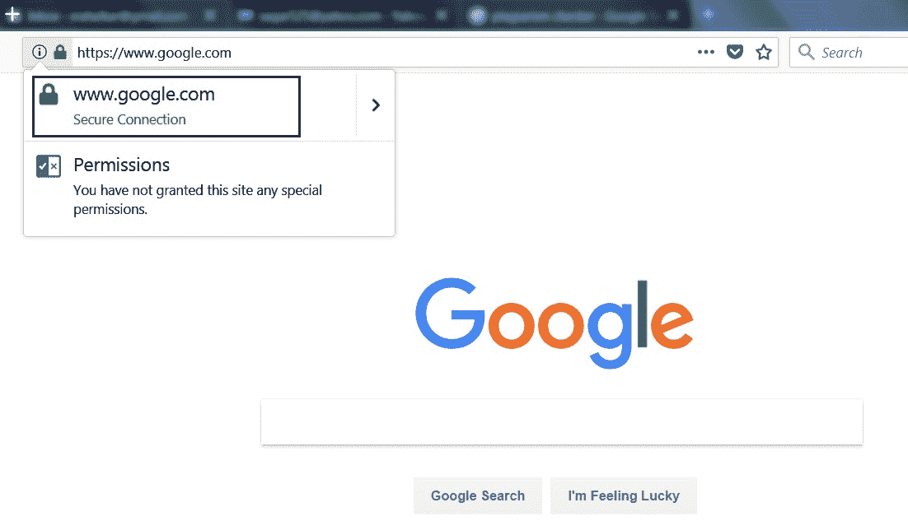

此外，我们还可以检查证书详细信息以确保 HTTPS 实施，如下图所示：

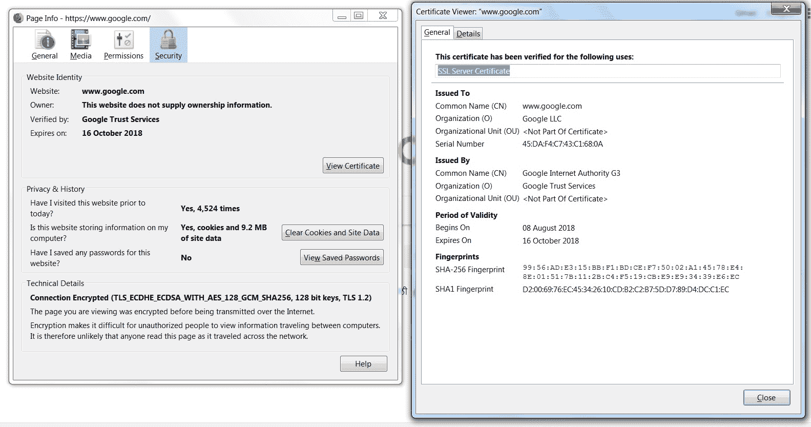

# 身份验证错误消息

在应用程序登录页面上经常出现身份验证失败会显示不必要的信息。例如，用户输入错误的用户名和密码，然后应用程序抛出一个错误，说找不到用户名。这会显示给攻击者给定的用户是否属于应用程序。攻击者可以简单地编写一个脚本来检查 1,000 个用户的有效性。这种攻击称为用户枚举。因此建议身份验证失败消息应该是通用的，不应该透露用户名/密码是否错误。例如*用户名/密码错误*这样的通用消息并不能证明用户名是否属于应用程序。

# 密码策略

密码策略是与身份验证相关的一个微不足道的安全控制。密码通常容易受到字典攻击、暴力攻击和猜测密码攻击。如果应用程序允许设置弱密码，那么它们很容易被破坏。强密码策略通常具有以下条件：

+   最小长度为 8

+   必须至少包含 1 个小写字符、1 个大写字符、1 个数字和 1 个特殊字符。

+   密码最小年龄

+   密码最大年龄

+   密码历史限制

+   帐户锁定

重要的是要注意密码策略必须在客户端和服务器端都执行。

# 提交凭据的方法

GET 和 POST 是用于通过 HTTP/HTTPS 协议提交用户数据的两种方法。安全应用程序总是使用 POST 方法传输用户凭据和敏感用户数据。如果使用 GET 方法，则凭据/数据将成为公开可见的 URL 的一部分，并且很容易受到攻击。

以下图像显示了典型的登录请求和响应，并突出了 POST 方法的使用：

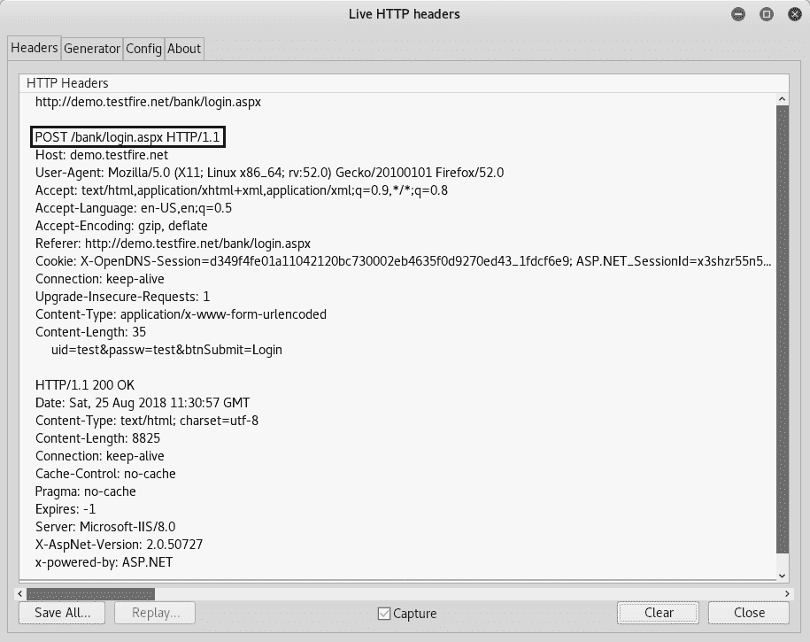

# OWASP 映射

身份验证相关的漏洞是 OWASP Top 10 2017 的一部分。它们包括在 A2:2017 Broken Authentication 下。在这个类别下列出的一些漏洞如下：

+   应用程序允许自动攻击，如凭据填充

+   应用程序允许暴力攻击

+   应用程序允许用户设置默认、弱或知名密码

+   应用程序具有弱密码恢复过程

# 授权

一旦用户被验证，下一个任务就是授权用户以允许他/她访问数据。根据用户角色和权限，应用程序授予授权。要测试授权漏洞，我们需要来自应用程序中不同角色的有效凭据。使用一些初步工具，我们可以尝试绕过授权模式并使用普通用户的凭据访问超级用户帐户。

# OWASP 映射

授权相关的漏洞是 OWASP 2017 年十大漏洞之一。它们包含在 A5:2017 破坏访问控制下。此类别下列出的一些漏洞如下：

+   通过篡改 URL 绕过访问控制检查

+   允许将主键更改为另一个用户的记录，并允许查看或编辑其他人的帐户

+   提升权限

# 会话管理

会话管理是任何基于 Web 的应用程序的核心。它定义了应用程序如何维护状态，从而控制用户与站点的交互。会话在用户最初连接到站点时启动，并且预期在用户断开连接时结束。由于 HTTP 是一种无状态协议，会话需要由应用程序显式处理。通常使用唯一标识符，如会话 ID 或 cookie 来跟踪用户会话。

# Cookie 检查

由于 cookie 是存储用户会话信息的重要对象，因此必须进行安全配置。下图显示了一个带有其属性的示例 cookie：

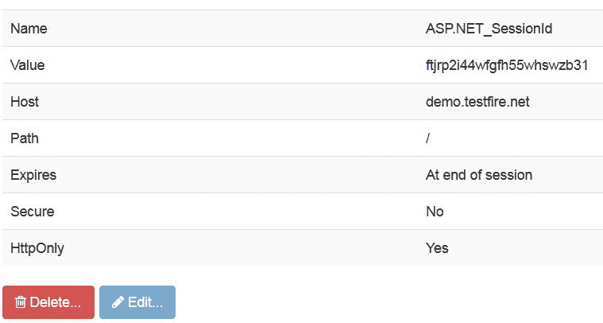

在上图中，最后三个参数从安全的角度来看是重要的。Expires 参数设置为 At end of session，这意味着 cookie 不是持久的，一旦用户注销就会被销毁。Secure 标志设置为 No，这是一个风险。站点应该实现 HTTPS，然后启用 Secure cookie 标志。HTTPOnly 标志设置为 Yes，这可以防止其他站点未经授权地访问 cookie。

# 跨站请求伪造

跨站请求伪造是针对 Web 应用程序的常见攻击，通常是由于弱会话管理而发生。在 CSRF 攻击中，攻击者向受害者发送一个特制的链接。当受害者点击攻击者发送的链接时，它会触发易受攻击的应用程序中的一些恶意操作。反 CSRF 或 CAPTCHA 是一些常见的防御措施。OWASP 有一个特殊的工具来测试应用程序是否容易受到 CSRF 攻击。它可以在[`www.owasp.org/index.php/File:CSRFTester-1.0.zip`](https://www.owasp.org/index.php/File:CSRFTester-1.0.zip)找到。

OWASP CSRF 测试工具捕获应用程序请求，然后生成 CSRF 概念验证，如下图所示：

# OWASP 映射

会话管理相关的漏洞是 OWASP 2017 年十大漏洞之一。它们包含在 A2:2017 破坏身份验证下。此类别下列出的一些漏洞如下：

+   生成的会话 ID 不是唯一的、随机的、复杂的，容易被猜测

+   应用程序在 URL 或审计日志文件的一部分中暴露会话标识符

+   应用程序容易受到重放攻击

+   应用程序容易受到跨站请求伪造攻击

# 输入验证

不正确的输入验证是大多数 Web 应用程序中最常见和固有的缺陷之一。

这种弱点进一步导致 Web 应用程序中许多关键漏洞，如跨站脚本、SQL 注入、缓冲区溢出等。

大多数情况下，当应用程序被开发时，它会盲目接受所有传入的数据。然而从安全的角度来看，这是一种有害的做法，因为由于缺乏适当的验证，恶意数据也可能进入。

# OWASP 映射

输入验证相关的漏洞是 OWASP Top 10 2017 的一部分。它们包括 A1:2017 注入，A4:2017-XML 外部实体（XXE），A7:2017-跨站脚本（XSS）和 A8:2017-不安全反序列化。此类别下列出的一些漏洞如下：

+   应用程序未在客户端和服务器端验证输入。

+   应用程序允许有害的黑名单字符（&lt;&gt;;’”!()）。

+   应用程序容易受到注入漏洞的攻击，如 SQL 注入、命令注入、LDAP（轻量级目录访问协议）注入等。

+   应用程序容易受到跨站脚本攻击。下图显示了反射型跨站脚本攻击：

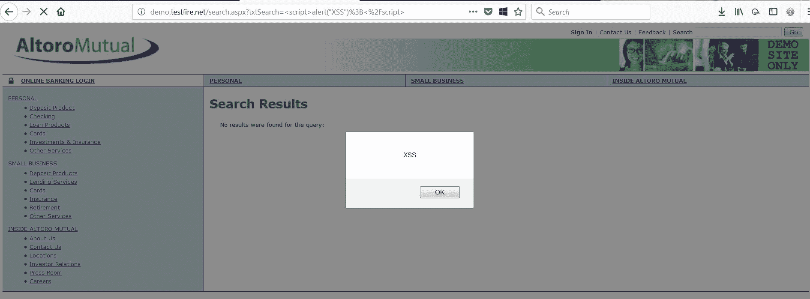

+   应用程序容易受到缓冲区溢出的攻击。

# 安全配置错误

我们可能会花费大量精力来保护应用程序。然而，应用程序不能孤立运行。运行应用程序需要大量的支持组件，如 Web 服务器、数据库服务器等。如果应用程序与所有这些支持组件没有安全配置，将为潜在攻击者打开许多漏洞。因此，应用程序不仅应该安全地开发，还应该安全地部署和配置。

# OWASP 映射

安全配置相关的漏洞是 OWASP Top 10 2017 的一部分。它们包括 A6:2017 安全配置错误。此类别下列出的一些漏洞如下：

+   应用程序堆栈上未进行安全加固。

+   启用或安装不必要或不需要的功能（例如端口、服务、管理页面、帐户或权限）。下图显示了默认的 Tomcat 页面，所有用户都可以访问：

+   应用程序默认帐户处于活动状态，并使用默认密码。

+   不当的错误处理会显示堆栈跟踪和内部应用程序信息，如下图所示：

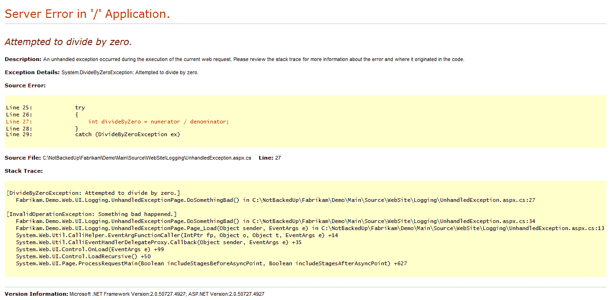

+   应用程序服务器、应用程序框架（例如 Struts、Spring、ASP.NET）、库、数据库等未进行安全配置。

+   应用程序允许目录列表，如下图所示：

Nikto 是一个优秀的工具，用于扫描安全配置问题，如下图所示：

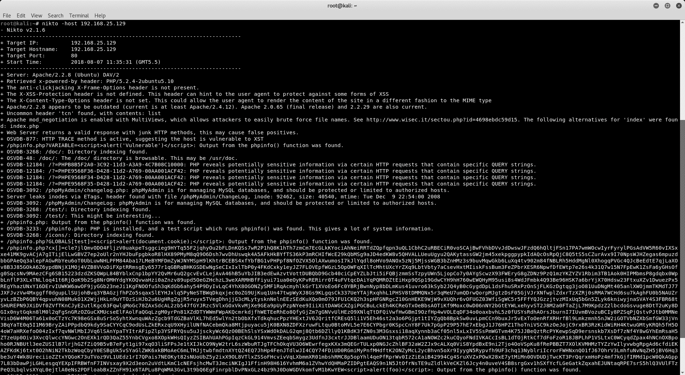

# 业务逻辑缺陷

业务逻辑是应用程序的核心，决定应用程序的预期行为。业务逻辑主要源自应用程序的目标/目的，并主要包含在应用程序的服务器端代码中。如果业务逻辑存在缺陷或不足，攻击者可能会严重滥用。自动化安全扫描工具实际上无法找到与业务逻辑相关的问题，因为它们无法像人类那样理解应用程序的上下文。因此，除了严格的验证外，还绝对需要无懈可击的业务逻辑，以构建安全的 Web 应用程序。

# 测试业务逻辑缺陷

如前所述，无法使用自动化工具全面测试与业务逻辑相关的缺陷。以下是一些测试业务逻辑的指导方针：

+   与应用程序架构师、应用程序的业务用户和开发人员进行头脑风暴会议，了解应用程序的全部内容

+   了解应用程序中的所有工作流程

+   记录应用程序可能出错并产生较大影响的关键领域

+   创建样本/原始数据，并尝试从普通用户和攻击者的角度探索应用程序

+   制定攻击方案和逻辑测试，以测试特定业务逻辑

+   创建全面的威胁模型

**业务逻辑缺陷示例**

考虑一个电子商务网站，销售电视机顶盒充值券。它连接到外部支付网关。现在用户在电子商务网站上选择充值金额，然后电子商务网站将用户转到支付网关进行付款。如果付款成功，支付网关将向电子商务网站返回一个成功标志，然后电子商务网站将在系统中实际发起用户请求的充值。现在假设攻击者选择购买价值 X 美元的充值，并前往支付网关，但在返回电子商务网站时，他篡改了 HTTP 请求，并将金额设置为 X+10 美元。在这种情况下，电子商务网站可能会接受该请求，认为用户实际支付了 X+10 美元而不是 X 美元。这是一个简单的业务逻辑缺陷，由于电子商务网站和支付网关之间的不正确同步而发生。两者之间的简单校验和机制可以防止这样的缺陷。

# 审计和日志记录

检查应用程序审计日志的完整性是应用程序安全评估中最重要的程序方面之一。审计日志被归类为侦探控制，在安全事件发生时非常有用。企业应用程序通常具有复杂的性质，并与其他系统（如数据库服务器、负载均衡器、缓存服务器等）相互连接。在发生违规行为时，审计日志在重建事件场景中起着最重要的作用。缺乏详细信息的审计日志将极大地限制事件调查。因此，必须仔细检查应用程序生成事件日志的能力，以找出任何适用的缺陷。

# OWASP 映射

审计和日志记录相关的漏洞是 OWASP Top 10 2017 的一部分。它们包括 A10:2017 不足的日志记录和监控。此类别下列出的一些漏洞如下：

+   应用程序未记录登录、登录失败和高价值交易等事件

+   应用程序生成警告和错误，这是不足的

+   应用程序和 API 日志未定期监控可疑活动

+   未定义应用程序日志的备份策略

+   应用程序无法实时或几乎实时地检测、升级或警报活动攻击

# 密码学

我们知道，加密有助于保持数据的机密性；它在 Web 应用程序安全中也扮演着重要的角色。在构建安全的 Web 应用程序时，必须同时考虑*数据在静态状态下的加密*和*数据在传输中的加密*。

# OWASP 映射

与加密相关的漏洞是 OWASP Top 10 2017 的一部分。它们包括 A3:2017 敏感数据暴露。此类别下列出的一些漏洞如下：

+   以明文传输数据的应用程序。这涉及到诸如 HTTP、SMTP 和 FTP 等协议。

+   应用程序使用旧的或弱加密算法。

+   应用程序使用默认加密密钥。

+   应用程序未强制加密。

+   应用程序在存储时未加密用户敏感信息。

+   应用程序使用无效的 SSL 证书。

Qualys 提供了一个出色的在线工具，用于测试 SSL 证书。以下图片显示了 Qualys SSL 测试的样本结果，可以在[`www.ssllabs.com/ssltest/`](https://www.ssllabs.com/ssltest/)上访问：

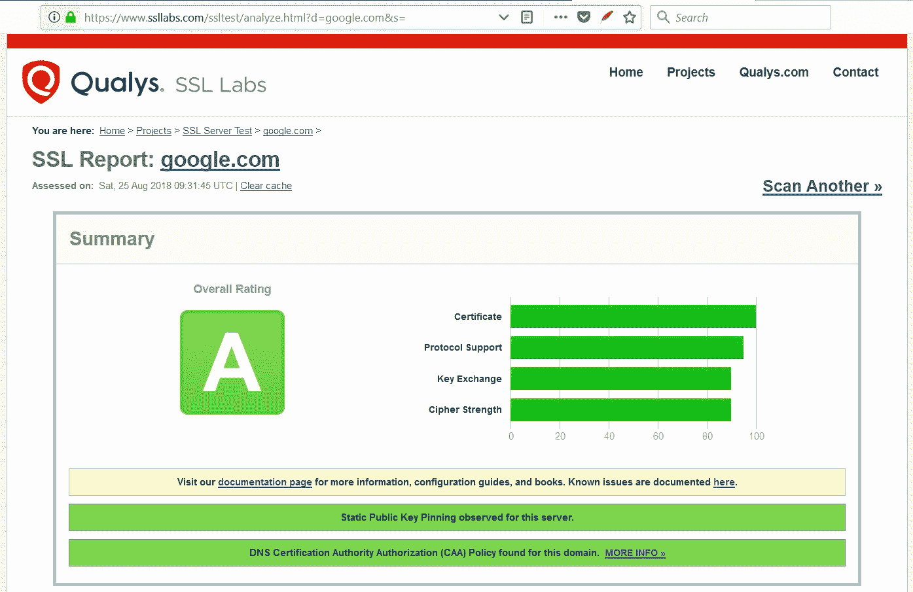

网站的一些其他结果：

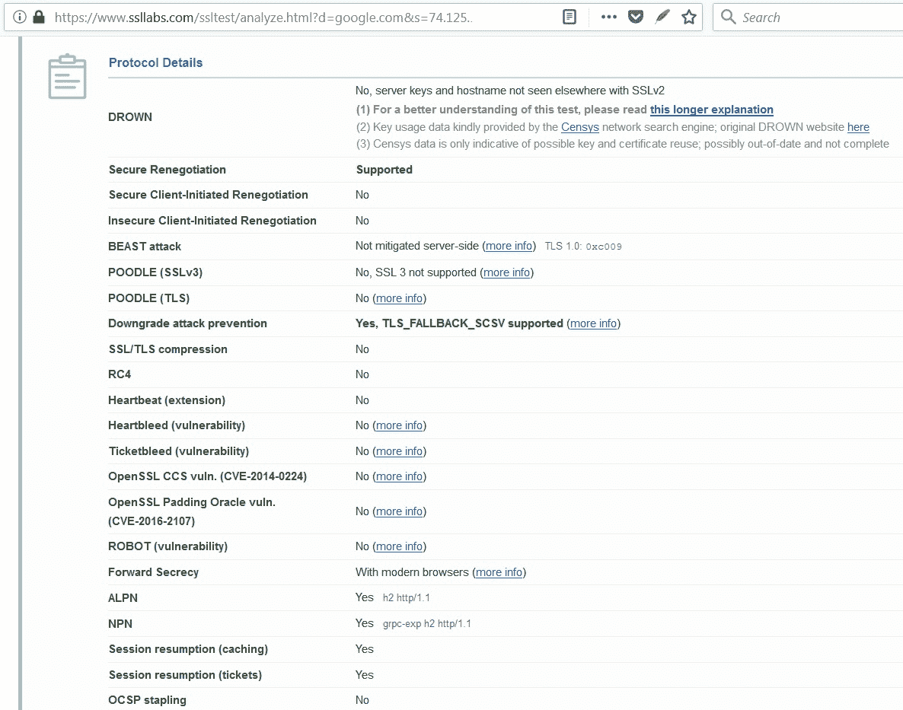

# 测试工具

在本章的前面，我们已经看到了一系列可以用于进行 Web 应用程序安全测试的各种工具。在本节中，我们将简要介绍其中两种工具。

# OWASP ZAP

OWASP ZAP 是一个多功能工具，可以执行与应用程序安全测试相关的一系列任务。它也能够进行自动化扫描，并且在手动测试和模糊测试方面非常有效。OWASP ZAP 可以从[`www.owasp.org/index.php/OWASP_Zed_Attack_Proxy_Project`](https://www.owasp.org/index.php/OWASP_Zed_Attack_Proxy_Project)下载。

以下图片显示了初始的 OWASP ZAP 控制台。左窗格显示站点层次结构，右窗格显示单独的请求和响应，底窗格显示主动扫描：

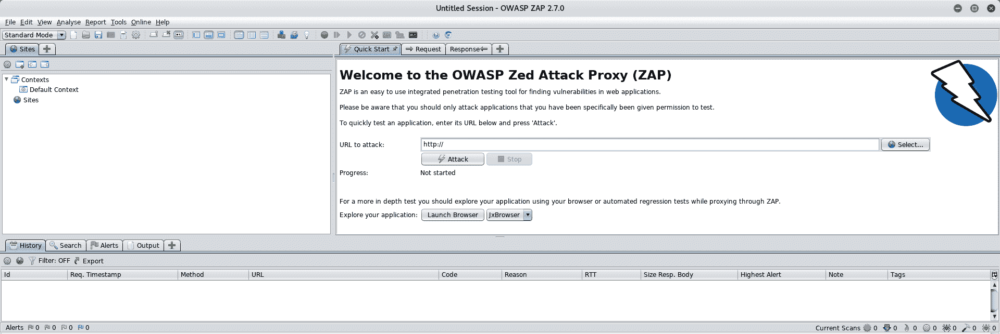

我们可以首先爬取应用程序，也可以直接输入要攻击的 URL，如下图所示。我们可以在底部窗格中看到主动扫描，一旦完成，我们可以简单地点击“报告”菜单，然后选择生成 HTML 报告。

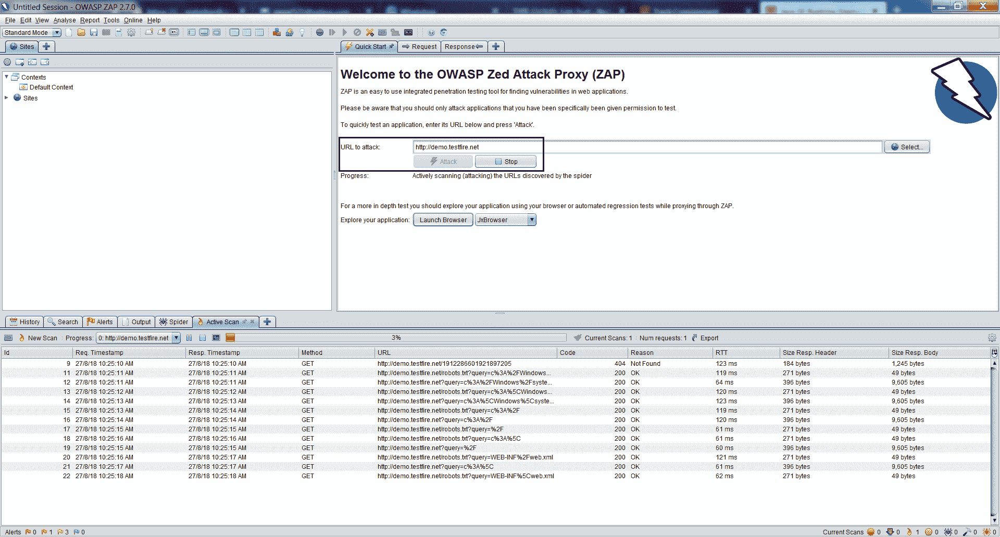

# Burp Suite

BurpSuite 是一个非常灵活和强大的工具，用于进行 Web 应用程序安全测试。它可以免费下载，也有商业版本。Burp Suite 可以从[`portswigger.net/burp/communitydownload`](https://portswigger.net/burp/communitydownload)下载。

以下图片显示了初始的 Burp Suite 控制台：

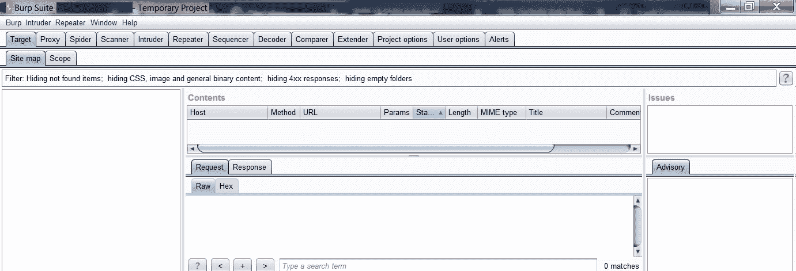

BurpSuite 具有以下各种功能：

+   **代理**：它充当拦截代理，并允许编辑所有应用程序请求。

+   **蜘蛛**：它会自动爬取应用程序范围内的内容，并为进一步测试创建应用程序层次结构。

+   **扫描器**：它在目标应用程序上运行预定义的安全测试，并生成漏洞报告。此功能仅在商业版本中可用。

+   **入侵者**：这个功能可以有效地用于模糊应用程序中的各种输入字段。

+   **重复器**：这可以用于多次发送特定请求并分析响应。

+   **解码器**：这可以用于解码各种格式的内容，如 Base64 等。

+   **扩展器**：这可以用于向 Burp Suite 添加额外的扩展。

# 总结

在本章中，我们学习了 Web 应用程序安全的各个方面，将它们与 Burp Suite OWASP 十大进行了映射，并简要介绍了可以用于进行 Web 应用程序安全测试的各种工具。
